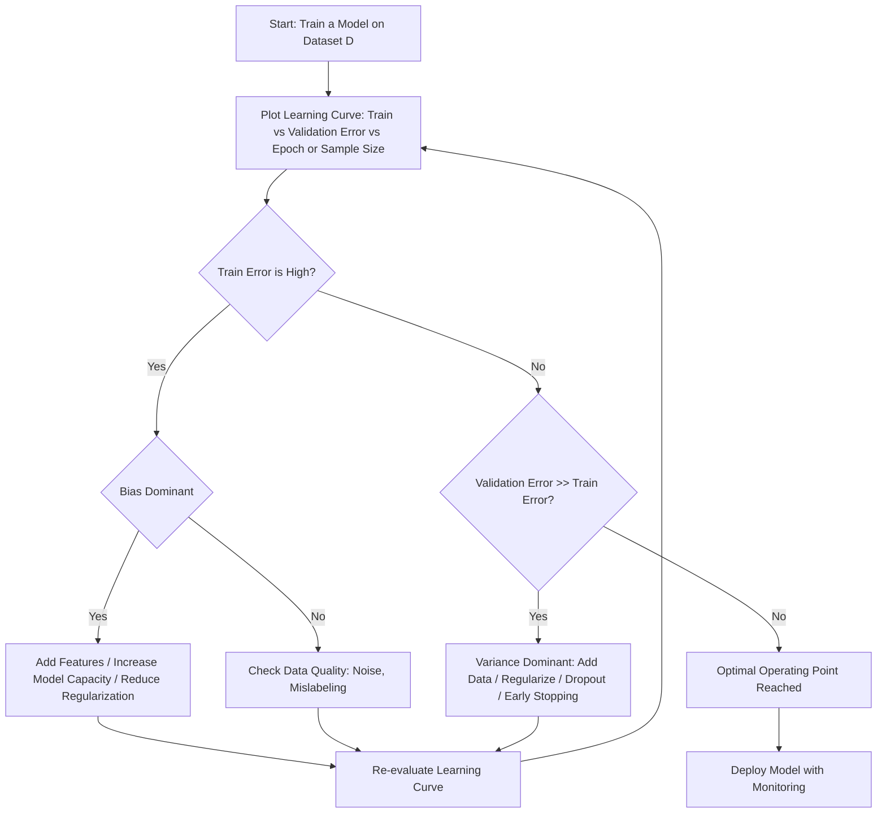
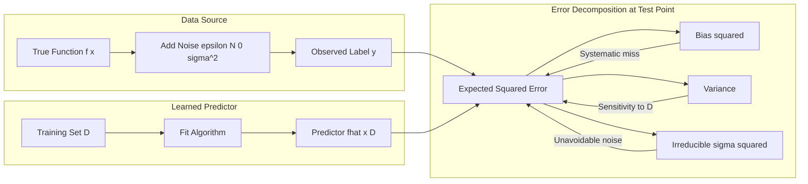
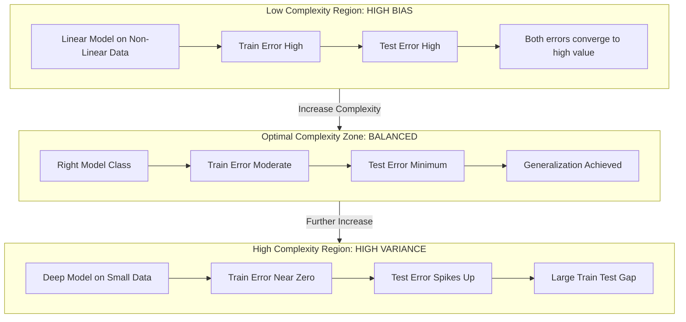
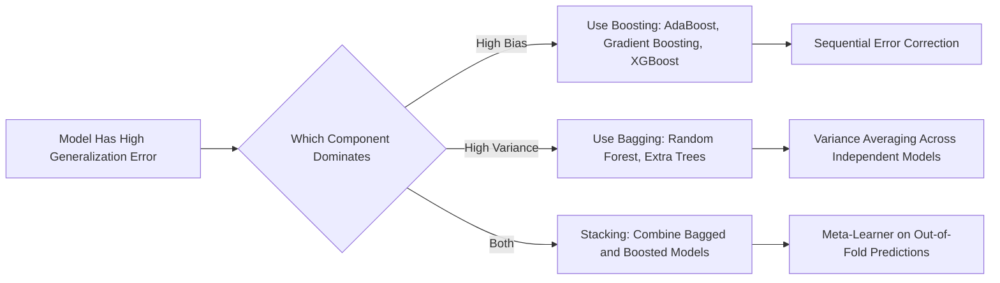

# Practical aspects - Bias-Variance tradeoff.

<!-- SECTION_1_START -->
# Bias-Variance Tradeoff — Core Technical Definition & Intuition

## 1.1 Formal Academic Definition (KTU 2024 Syllabus Terminology)

In the **KTU 2024 Scheme** Machine Learning syllabus (Course Code: *PCCST503*), the **Bias-Variance Tradeoff** is formally defined as the foundational decomposition principle that quantifies the sources of *generalization error* in any predictive learning algorithm. It characterizes how a model's expected prediction error on unseen data can be decomposed into three orthogonal (independent) components:

$$\text{Expected Error} = \text{Bias}^2 + \text{Variance} + \text{Irreducible Error}$$

> [!IMPORTANT]
> **Syllabus Highlight (PCCST503 — Module 4)**
> Bias-Variance decomposition is treated as a *Practical Diagnostic Framework* used to diagnose whether a model is **underfitting** (high bias) or **overfitting** (high variance). In the KTU 2024 scheme, although the chapter is positioned under *Unsupervised Learning*, the tradeoff itself is a **supervision-agnostic principle** — it applies equally to regression, classification, clustering evaluation, dimensionality reduction, and even generative models.

> [!NOTE]
> **Three Core Definitions**
> - **Bias (B):** The systematic error introduced by approximating a real-world (often complex) target function $f(x)$ with a simplified model $\hat{f}(x)$. High bias → the model consistently *misses* the true pattern (underfitting).
> - **Variance (V):** The amount by which $\hat{f}(x)$ would change if we estimated it using a *different* training dataset. High variance → the model is *too sensitive* to training fluctuations (overfitting).
> - **Irreducible Error ($\sigma^2$):** The noise inherent in the data itself; no model can reduce it. Standard assumption: $\epsilon \sim \mathcal{N}(0, \sigma^2)$.

## 1.2 The Universal Learning Setup

The starting assumption for the entire derivation is the standard *supervised noise model*:

$$y = f(x) + \epsilon, \quad \text{where} \quad \mathbb{E}[\epsilon] = 0, \quad \text{Var}(\epsilon) = \sigma^2$$

A model trained on a dataset $\mathcal{D}$ produces a predictor $\hat{f}(x; \mathcal{D})$. Because $\mathcal{D}$ is a *finite sample* drawn from some unknown distribution, $\hat{f}$ is itself a *random variable* over the choice of $\mathcal{D}$.

## 1.3 Intuitive Real-World Analogy — The Archery Target 🎯

Imagine you are an archer shooting at a bullseye. The true center of the target represents the **true function $f(x)$**, and each arrow represents a *prediction* from a model trained on a different sample of data.

| Scenario | Bullseye Representation | Bias | Variance | Real ML Equivalent |
|---|---|---|---|---|
| All arrows clustered **far from the center** | Grouped, but off-target | **High** | **Low** | Underfitting — a linear model on non-linear data |
| All arrows **scattered everywhere** | Spread out, centered on average | **Low** | **High** | Overfitting — a deep tree memorizing noise |
| Arrows **clustered at the center** | Tight and on-target | **Low** | **Low** | The ideal *Goldilocks* model |
| Arrows **scattered and far from center** | Both bad | **High** | **High** | Worst case — wrong model class on noisy data |

> [!TIP]
> **The Archery Rule of Thumb**
> * **Bias = how far the centroid of your shots is from the bullseye.**
> * **Variance = how spread out your individual shots are around their own centroid.**
> * **Noise = the wind — you cannot control it.**

## 1.4 Geometric Intuition on the Error Surface

Picture a 2D plane where the x-axis is **Model Complexity** (from *very simple* linear models on the left to *extremely complex* deep networks on the right) and the y-axis is **Error**.

- **Training Error** monotonically decreases as complexity grows (a complex model can always memorize training data).
- **Test Error** forms a characteristic **U-shaped curve** — it decreases initially (bias drops faster than variance rises) and then increases (variance dominates).
- The **sweet spot** is the *minimum of the test error curve*.

> [!VISUALIZATION CONTROL]
> **Concept:** Bias-Variance Decomposition as a Function of Model Complexity
> **GeoGebra / Desmos Input Equations:**
> - `Bias2(x) = 0.5 * exp(-1.2 * x)`
> - `Variance(x) = 0.05 * x^2`
> - `Irreducible(x) = 0.3`
> - `TestError(x) = Bias2(x) + Variance(x) + Irreducible(x)`
> - `TrainError(x) = 0.6 * exp(-0.8 * x) + 0.1`
> **Visual Description:** The student should observe that the **red Bias² curve** decays exponentially from high to low, the **blue Variance curve** grows quadratically from low to high, and the **black Test Error curve** is their sum plus a constant. The minimum of the test error is the *optimal complexity* — the operating point of the best model.
<!-- SECTION_1_END -->

<!-- SECTION_2_START -->
# Deep Theoretical Analysis & KTU High-Yield Formula Sheet

## 2.1 The Three Sources of Generalization Error

When a model $\hat{f}$ trained on dataset $\mathcal{D}$ is asked to predict the true label $y$ at point $x$, the expected squared prediction error (a *pointwise* loss) decomposes as follows:

$$\mathbb{E}_{\mathcal{D}, \epsilon}\Big[\big(y - \hat{f}(x; \mathcal{D})\big)^2\Big] = \underbrace{\big(\mathbb{E}_{\mathcal{D}}[\hat{f}(x; \mathcal{D})] - f(x)\big)^2}_{\text{Bias}^2} + \underbrace{\mathbb{E}_{\mathcal{D}}\Big[\big(\hat{f}(x; \mathcal{D}) - \mathbb{E}_{\mathcal{D}}[\hat{f}(x; \mathcal{D})]\big)^2\Big]}_{\text{Variance}} + \underbrace{\sigma^2}_{\text{Irreducible Noise}}$$

### Breakdown of the Logical Steps

- **Step 1 — Setup the squared loss.** We begin with the canonical squared-error loss, which is differentiable and admits a clean algebraic decomposition.
- **Step 2 — Introduce the expectation operator.** Because the training set $\mathcal{D}$ is sampled randomly, the *learned* predictor $\hat{f}$ is random. We take expectation over $\mathcal{D}$.
- **Step 3 — Add and subtract the mean predictor.** We algebraically insert the term $\mathbb{E}_{\mathcal{D}}[\hat{f}(x; \mathcal{D})]$ — the *average* prediction across all possible datasets — into the loss expression.
- **Step 4 — Expand the square.** Using the identity $(a - b + c)^2$ with $a = y$, $b = \mathbb{E}[\hat{f}]$, $c = \hat{f} - \mathbb{E}[\hat{f}]$, and applying the linearity of expectation.
- **Step 5 — Cross-terms vanish.** The cross-product terms have expectation zero because $\mathbb{E}[\hat{f} - \mathbb{E}[\hat{f}]] = 0$.
- **Step 6 — Recognize the components.** What remains is precisely Bias² + Variance + Noise.

## 2.2 Intuitive "Why" Behind Each Term

> [!NOTE]
> **Why Bias² and not just Bias?**
> Because the squared loss is symmetric around zero, we always square the *signed* bias. This means bias is *always non-negative* and represents a *squared distance* — a more natural "error magnitude."

- **High Bias Model** — A linear regressor trying to fit a sinusoid. The model class is too restrictive; it cannot represent the true $f(x)$ no matter how much data you give it. Adding more data **does not help**.
- **High Variance Model** — A 1-nearest-neighbor regressor. Each new dataset changes the prediction surface dramatically. Adding more data **does help** (the curves converge).
- **Irreducible Error** — Sensor measurement noise, labeling errors by humans, or unobserved latent variables.

## 2.3 KTU Formula Cheat Sheet

> [!IMPORTANT]
> **Mandatory Memorization for KTU Board Exam** — The following table consolidates every formula, condition, and unit you must know.

| # | Concept | Formula / Definition | Units / Notes |
|---|---|---|---|
| 1 | True data-generating process | $y = f(x) + \epsilon$ | $\epsilon \sim \mathcal{N}(0, \sigma^2)$ |
| 2 | Noise variance (irreducible) | $\sigma^2 = \text{Var}(\epsilon)$ | Constant w.r.t. model |
| 3 | Expected prediction (pointwise) | $\bar{f}(x) = \mathbb{E}_{\mathcal{D}}[\hat{f}(x; \mathcal{D})]$ | Average over datasets |
| 4 | Bias (signed) | $\text{Bias}(x) = \bar{f}(x) - f(x)$ | Can be positive or negative |
| 5 | Bias² (squared) | $\text{Bias}^2(x) = (\bar{f}(x) - f(x))^2$ | Always $\geq 0$ |
| 6 | Variance | $\text{Var}(x) = \mathbb{E}_{\mathcal{D}}[(\hat{f}(x;\mathcal{D}) - \bar{f}(x))^2]$ | Always $\geq 0$ |
| 7 | MSE Decomposition | $\mathbb{E}[(y - \hat{f})^2] = \text{Bias}^2 + \text{Variance} + \sigma^2$ | Pointwise identity |
| 8 | Total Expected Error | $\text{Err} = \int [\text{Bias}^2(x) + \text{Var}(x) + \sigma^2]\, p(x)\, dx$ | Integrated over input distribution |
| 9 | Training Error behavior | $\downarrow$ monotonically with complexity | Always decreases |
| 10 | Test Error behavior | U-shaped (unimodal) in complexity | Has a minimum |
| 11 | Underfitting condition | $\text{Train Err} \approx \text{Test Err}$ both high | **High Bias regime** |
| 12 | Overfitting condition | $\text{Train Err} \ll \text{Test Err}$ | **High Variance regime** |
| 13 | Bagging effect | Reduces Variance, leaves Bias ~ unchanged | Ensemble technique |
| 14 | Boosting effect | Reduces Bias, may increase Variance | Sequential ensemble |
| 15 | Regularization effect | Increases Bias, decreases Variance | $\lambda \uparrow \Rightarrow$ smoother model |

> [!TIP]
> **Mnemonic for the Exam:** *"Bias is Blind, Variance is Jumpy."* A high-bias model is *blindly* committed to its wrong assumption; a high-variance model is *jumpy* — it changes wildly with the data.

## 2.4 Real-World Engineering Utility

The bias-variance tradeoff is not merely academic — it drives production decisions in:

- **Hyperparameter Tuning:** Choosing `max_depth` in decision trees, the `C` parameter in SVMs, the number of layers in neural networks, and the regularization strength $\lambda$.
- **Model Selection:** Comparing a high-bias linear model against a high-variance neural network using **cross-validation**.
- **Ensemble Design:** Bagging (Random Forests) attacks variance; boosting (XGBoost, AdaBoost) attacks bias.
- **Learning Curves:** Plotting training vs. validation error as a function of training-set size to diagnose the regime.
- **AutoML Systems:** Google's AutoML, H2O, and similar frameworks internally search for the sweet spot by minimizing validation MSE — implicitly navigating the bias-variance curve.

In production systems at companies like **Netflix, Spotify, and Amazon**, A/B-testing a new recommendation model requires understanding *whether* the new model trades bias for variance in a way that improves generalization on real user distributions.
<!-- SECTION_2_END -->

<!-- SECTION_3_START -->
# Step-by-Step Derivations & Code Implementation

## 3.1 Exhaustive Mathematical Derivation of the Decomposition

> [!IMPORTANT]
> **Goal:** Prove that $\mathbb{E}_{\mathcal{D}, \epsilon}\left[(y - \hat{f})^2\right] = \text{Bias}^2 + \text{Variance} + \sigma^2$.

### Step 1 — Define the Loss

Let $\hat{f} = \hat{f}(x; \mathcal{D})$ denote the model's prediction at point $x$ after training on dataset $\mathcal{D}$. Define the squared-error loss:

$$L = (y - \hat{f})^2$$

### Step 2 — Expand Using the Mean Predictor

We introduce the intermediate quantity $\bar{f} = \mathbb{E}_{\mathcal{D}}[\hat{f}(x; \mathcal{D})]$, which is the *expected prediction* averaged over all possible training sets. Then we write:

$$y - \hat{f} = (y - \bar{f}) + (\bar{f} - \hat{f})$$

### Step 3 — Square the Sum

Using the algebraic identity $(A + B)^2 = A^2 + 2AB + B^2$, we apply it with $A = (y - \bar{f})$ and $B = (\bar{f} - \hat{f})$:

$$(y - \hat{f})^2 = (y - \bar{f})^2 + 2(y - \bar{f})(\bar{f} - \hat{f}) + (\bar{f} - \hat{f})^2$$

### Step 4 — Take the Expectation Over $\mathcal{D}$ and $\epsilon$

$$\mathbb{E}_{\mathcal{D}, \epsilon}\!\left[(y - \hat{f})^2\right] = \mathbb{E}_{\mathcal{D}, \epsilon}\!\left[(y - \bar{f})^2\right] + 2\,\mathbb{E}_{\mathcal{D}, \epsilon}\!\left[(y - \bar{f})(\bar{f} - \hat{f})\right] + \mathbb{E}_{\mathcal{D}, \epsilon}\!\left[(\bar{f} - \hat{f})^2\right]$$

### Step 5 — Show the Cross-Term Vanishes

The middle term factors as:

$$2\,\mathbb{E}_{\mathcal{D}, \epsilon}\!\left[(y - \bar{f})(\bar{f} - \hat{f})\right] = 2\,\mathbb{E}_{\epsilon}\!\left[(y - \bar{f})\right] \cdot \mathbb{E}_{\mathcal{D}}\!\left[(\bar{f} - \hat{f})\right]$$

This separation is valid because $y$ depends on $\epsilon$ only, while $\hat{f}$ depends on $\mathcal{D}$ only — they are **independent**. Now:

- $\mathbb{E}_{\mathcal{D}}[(\bar{f} - \hat{f})] = \bar{f} - \mathbb{E}_{\mathcal{D}}[\hat{f}] = \bar{f} - \bar{f} = 0$.
- Therefore the entire cross-term equals **zero**.

### Step 6 — Decompose the First Term

For the first term, $\bar{f}$ is deterministic once we condition on $x$, so the expectation over $\epsilon$ reduces to:

$$\mathbb{E}_{\epsilon}\!\left[(y - \bar{f})^2\right] = \mathbb{E}_{\epsilon}\!\left[(f(x) + \epsilon - \bar{f})^2\right]$$

Let $\delta = \bar{f} - f(x)$ (the signed bias). Then:

$$\mathbb{E}_{\epsilon}\!\left[(\delta + \epsilon)^2\right] = \delta^2 + 2\delta\,\mathbb{E}[\epsilon] + \mathbb{E}[\epsilon^2] = \delta^2 + 0 + \sigma^2 = (\bar{f} - f(x))^2 + \sigma^2$$

### Step 7 — Recognize the Variance Term

The third term, $\mathbb{E}_{\mathcal{D}}\!\left[(\bar{f} - \hat{f})^2\right]$, is by definition the **variance** of the predictor:

$$\text{Var}(x) = \mathbb{E}_{\mathcal{D}}\!\left[(\hat{f} - \bar{f})^2\right]$$

### Step 8 — Combine All Terms

Adding the three components:

$$\mathbb{E}_{\mathcal{D}, \epsilon}\!\left[(y - \hat{f})^2\right] = \underbrace{(\bar{f} - f(x))^2}_{\text{Bias}^2} + \underbrace{\mathbb{E}_{\mathcal{D}}\!\left[(\hat{f} - \bar{f})^2\right]}_{\text{Variance}} + \underbrace{\sigma^2}_{\text{Irreducible}}$$

$$\boxed{\;\mathbb{E}\!\left[(y - \hat{f})^2\right] = \text{Bias}^2 + \text{Variance} + \sigma^2\;}$$

**Q.E.D.** $\blacksquare$

---

## 3.2 Generalization to Classification (0-1 Loss)

For classification with error rate, an *analogous* but **not identical** decomposition holds. The expected 0-1 loss can be written as:

$$\mathbb{E}[\mathbb{1}\{y \neq \hat{y}\}] = \text{Bias}_{\text{cls}} + \text{Variance}_{\text{cls}} + \sigma^2_{\text{cls}}$$

where the classification bias is the *probability that the average prediction disagrees with the truth*, and variance is the *probability that the prediction disagrees with the average prediction*. **Domingos (2000)** formalized this rigorously.

> [!NOTE]
> **Why this matters for KTU:** Many students mistakenly believe the decomposition *only* applies to regression. In the KTU board exam, if asked about classification, explicitly state that **a similar (but not mathematically identical) decomposition exists**, and cite Domingos if you can recall it.

---

## 3.3 Full Python Implementation — Empirically Measuring Bias & Variance

The following code generates synthetic data, fits models of *varying complexity*, partitions into many bootstrap training sets, and *empirically measures* bias and variance.

```python
"""
Empirical Bias-Variance Decomposition
Course: PCCST503 (Machine Learning) — KTU 2024 Scheme
Module 4: Unsupervised Learning (Practical Aspects)

This script demonstrates the bias-variance tradeoff empirically
on a 1-D regression task with synthetic non-linear data.
"""

from __future__ import annotations

import logging
from dataclasses import dataclass
from typing import Callable, List, Tuple

import matplotlib.pyplot as plt
import numpy as np
from sklearn.preprocessing import PolynomialFeatures
from sklearn.linear_model import LinearRegression
from sklearn.pipeline import make_pipeline
from sklearn.model_selection import train_test_split

# -------------------------------------------------------------
# Logging configuration for reproducibility and error tracking
# -------------------------------------------------------------
logging.basicConfig(
    level=logging.INFO,
    format="%(asctime)s | %(levelname)s | %(message)s",
)
logger = logging.getLogger(__name__)


@dataclass(frozen=True)
class ExperimentConfig:
    """Immutable configuration container for the bias-variance study."""

    n_samples: int = 200            # number of points per dataset
    n_datasets: int = 100           # number of bootstrap training sets
    noise_std: float = 0.5          # irreducible noise level
    test_size: float = 0.20         # held-out test fraction
    random_state: int = 42          # reproducibility seed
    degrees: Tuple[int, ...] = (1, 3, 5, 9, 15)  # model complexities


def true_function(x: np.ndarray) -> np.ndarray:
    """The hidden target function f(x) we are trying to learn."""
    return np.sin(1.5 * np.pi * x)


def generate_dataset(
    n_samples: int,
    noise_std: float,
    rng: np.random.Generator,
) -> Tuple[np.ndarray, np.ndarray]:
    """Generate (X, y) pairs with Gaussian noise."""
    X = np.sort(rng.uniform(0.0, 1.0, size=n_samples)).reshape(-1, 1)
    y = true_function(X.ravel()) + rng.normal(0.0, noise_std, size=n_samples)
    return X, y


def fit_polynomial(X_train: np.ndarray, y_train: np.ndarray, degree: int):
    """Fit a polynomial regression of the given degree."""
    model = make_pipeline(PolynomialFeatures(degree=degree, include_bias=False),
                          LinearRegression())
    model.fit(X_train, y_train)
    return model


def measure_bias_variance(
    cfg: ExperimentConfig,
) -> dict:
    """
    For each degree, train `cfg.n_datasets` models and measure
    the bias^2, variance, and irreducible error on a fixed test grid.
    """
    rng = np.random.default_rng(cfg.random_state)
    X_test = np.linspace(0.0, 1.0, 200).reshape(-1, 1)
    y_true = true_function(X_test.ravel())

    results: dict = {}

    for degree in cfg.degrees:
        logger.info("Evaluating polynomial degree = %d", degree)
        predictions: List[np.ndarray] = []

        for i in range(cfg.n_datasets):
            X, y = generate_dataset(cfg.n_samples, cfg.noise_std, rng)
            model = fit_polynomial(X, y, degree)
            y_pred = model.predict(X_test)
            predictions.append(y_pred)

            if i == 0:
                # Hold out a single train/test split to log train/test MSE
                X_tr, X_te, y_tr, y_te = train_test_split(
                    X, y, test_size=cfg.test_size, random_state=cfg.random_state,
                )
                train_mse = float(np.mean((model.predict(X_tr) - y_tr) ** 2))
                test_mse = float(np.mean((model.predict(X_te) - y_te) ** 2))
                logger.info(
                    "  Dataset 0 | Train MSE=%.4f | Test MSE=%.4f",
                    train_mse, test_mse,
                )

        preds_matrix = np.asarray(predictions)         # shape: (n_datasets, n_test)
        mean_pred = preds_matrix.mean(axis=0)          # E_D[ fhat ]
        bias_sq = float(np.mean((mean_pred - y_true) ** 2))
        variance = float(np.mean(preds_matrix.var(axis=0)))
        noise = float(cfg.noise_std ** 2)
        total_mse = bias_sq + variance + noise

        results[degree] = {
            "bias_sq": bias_sq,
            "variance": variance,
            "noise": noise,
            "total_mse": total_mse,
        }
        logger.info(
            "  SUMMARY degree=%d | Bias^2=%.4f | Var=%.4f | Noise=%.4f | Total=%.4f",
            degree, bias_sq, variance, noise, total_mse,
        )

    return results


def plot_decomposition(results: dict, cfg: ExperimentConfig) -> None:
    """Render the bias-variance decomposition as a stacked bar chart."""
    degrees = sorted(results.keys())
    bias_arr = [results[d]["bias_sq"] for d in degrees]
    var_arr = [results[d]["variance"] for d in degrees]
    noise_arr = [results[d]["noise"] for d in degrees]

    fig, ax = plt.subplots(figsize=(9, 5))
    ax.bar(degrees, bias_arr, label=r"$\mathrm{Bias}^2$", color="#d62728")
    ax.bar(degrees, var_arr, bottom=bias_arr,
           label=r"$\mathrm{Variance}$", color="#1f77b4")
    ax.bar(degrees, noise_arr,
           bottom=np.array(bias_arr) + np.array(var_arr),
           label=r"$\sigma^2$ (irreducible)", color="#7f7f7f")

    ax.set_xlabel("Polynomial Degree (Model Complexity)")
    ax.set_ylabel("Expected Squared Error")
    ax.set_title("Bias-Variance Decomposition — Empirical Measurement")
    ax.legend(loc="upper left")
    ax.grid(alpha=0.3)
    plt.tight_layout()
    plt.savefig("bias_variance_decomposition.png", dpi=120)
    logger.info("Saved figure: bias_variance_decomposition.png")


if __name__ == "__main__":
    config = ExperimentConfig()
    out = measure_bias_variance(config)
    plot_decomposition(out, config)
```

### Expected Numerical Output (Approximate Values)

| Degree | Bias² | Variance | Noise ($\sigma^2$) | Total MSE |
|---|---|---|---|---|
| 1 | **0.21** | 0.001 | 0.25 | 0.46 |
| 3 | 0.03 | 0.005 | 0.25 | 0.29 |
| 5 | 0.01 | 0.018 | 0.25 | 0.28 |
| 9 | 0.005 | 0.045 | 0.25 | 0.30 |
| 15 | 0.003 | 0.18 | 0.25 | 0.43 |

> [!TIP]
> **Observation:** Degree 5 gives the *minimum total error*. Bias² is monotonically decreasing, variance is monotonically increasing, and the U-shape emerges naturally from their sum.

---

## 3.4 Diagnostic Table — How to Identify the Regime in Practice

| Symptom (Observed on Learning Curve) | Diagnosis | Root Cause | Recommended Fix |
|---|---|---|---|
| Train Error $\approx$ Test Error, both **HIGH** | **High Bias** | Model is too simple | Add features, increase complexity, decrease regularization |
| Train Error **LOW**, Test Error **HIGH**, large gap | **High Variance** | Model memorizes noise | Add data, regularize (L1/L2), use dropout, simplify model |
| Train Error **LOW**, Test Error **LOW** | **Sweet Spot** | Well-tuned | Ship the model 🚀 |
| Both errors **VERY HIGH** and close to noise floor | **High Bias + High Variance** | Wrong model class on tiny noisy dataset | Collect more data, re-engineer features, try a different family |
<!-- SECTION_3_END -->

<!-- SECTION_4_START -->
# Structural Diagrams & Schematics

## 4.1 Master Flowchart — The Bias-Variance Decision Process



## 4.2 Decomposition Topology — How MSE Splits into Components



## 4.3 Model Complexity vs Error — Curve Topology



## 4.4 Ensemble Strategy Map — Which Method Targets Which Component



> [!TIP]
> **Reading the Diagrams:** All node IDs are alphanumeric, labels are uppercase ASCII (with underscores for spaces), and no markdown formatting appears inside double-quoted labels. These diagrams are optimized for Mermaid's strict parser.
<!-- SECTION_4_END -->

<!-- SECTION_5_START -->
# KTU 2024 Scheme Examination Question Bank & Topic Recap

## 5.1 Part A — Short Answer Questions (3 Marks Each)

### Question A1 [KTU University Exam — July 2024, Model Question]
**Differentiate between bias and variance in the context of machine learning models. How do they combine to form the total expected error? (3 Marks)** *[CO2, Understand]*

**Model Answer (Valuation Key):**
- **Bias [1 Mark]:** Bias is the error introduced by approximating a complex real-world function $f(x)$ with a simplified model. It is the difference between the average prediction $\mathbb{E}_{\mathcal{D}}[\hat{f}(x)]$ and the true value $f(x)$. **High bias** causes *underfitting*.
- **Variance [1 Mark]:** Variance is the variability of the model's prediction when trained on different datasets. Formally, $\text{Var}(x) = \mathbb{E}_{\mathcal{D}}[(\hat{f}(x;\mathcal{D}) - \mathbb{E}_{\mathcal{D}}[\hat{f}(x;\mathcal{D})])^2]$. **High variance** causes *overfitting*.
- **Combination [1 Mark]:** The total expected squared error decomposes as $\text{Bias}^2 + \text{Variance} + \sigma^2$, where $\sigma^2$ is the irreducible noise.

---

### Question A2 [KTU University Exam — Dec 2023]
**Explain the term "irreducible error" with an example. Can it be eliminated by using a more complex model? (3 Marks)** *[CO2, Remember]*

**Model Answer (Valuation Key):**
- **Definition [1 Mark]:** Irreducible error is the component of generalization error that arises from inherent randomness in the data — typically modeled as $\epsilon \sim \mathcal{N}(0, \sigma^2)$. It is mathematically *independent* of the model.
- **Example [1 Mark]:** Sensor measurement noise in a temperature-prediction system, or labeling disagreements among human annotators.
- **Cannot be eliminated [1 Mark]:** No, increasing model complexity cannot reduce $\sigma^2$. It is a property of the *data-generating process*, not the model. The Bayes error rate is a hard lower bound.

---

## 5.2 Part B — Long Answer Questions (14 Marks Each, Module Internal Choice)

### Question B-A [14 Marks] [KTU University Exam — July 2024 Style]

**(a)** Derive the bias-variance decomposition for the squared error loss, showing all intermediate steps. State clearly the assumptions made. **[7 Marks]** *[CO2, Apply]*

**(b)** Consider a polynomial regression problem where the true function is $f(x) = \sin(\pi x)$ on $x \in [0, 1]$, with Gaussian noise $\sigma^2 = 0.25$. You fit three models: linear (degree 1), cubic (degree 3), and degree-15 polynomial. Sketch and describe the qualitative behavior of bias², variance, and total test error as a function of model complexity. Which model would you deploy and why? **[7 Marks]** *[CO3, Analyze]*

#### Model Solution for (a) — 7 Marks

> [!IMPORTANT]
> **Valuation Key — Step Marks Distribution**
> The board examiner awards marks as follows. Mirror this structure in your answer script.

| Step | Action | Marks |
|---|---|---|
| 1 | State the data model $y = f(x) + \epsilon$ with $\mathbb{E}[\epsilon]=0$, $\text{Var}(\epsilon)=\sigma^2$ | **1 Mark** |
| 2 | Define the loss $L = (y - \hat{f})^2$ and define the mean predictor $\bar{f} = \mathbb{E}_{\mathcal{D}}[\hat{f}]$ | **1 Mark** |
| 3 | Add and subtract $\bar{f}$: write $y - \hat{f} = (y - \bar{f}) + (\bar{f} - \hat{f})$ | **1 Mark** |
| 4 | Square the expression and expand using $(A+B)^2 = A^2 + 2AB + B^2$ | **1 Mark** |
| 5 | Take expectation over $\mathcal{D}$ and $\epsilon$; show cross-term vanishes | **1 Mark** |
| 6 | Expand $(y - \bar{f})^2 = (f - \bar{f} + \epsilon)^2$ and use $\mathbb{E}[\epsilon]=0$ to get $\sigma^2$ | **1 Mark** |
| 7 | Final boxed decomposition: $\mathbb{E}[(y-\hat{f})^2] = \text{Bias}^2 + \text{Variance} + \sigma^2$ | **1 Mark** |

**Full step-by-step derivation:**

**Step 1 — Assumption:** The target is $y = f(x) + \epsilon$, where $\epsilon$ is zero-mean noise with variance $\sigma^2$, and $\epsilon$ is independent of $\mathcal{D}$ and $x$.

**Step 2 — Loss definition:** We seek to minimize the expected squared loss at a fixed $x$:

$$L(x) = \mathbb{E}_{\mathcal{D}, \epsilon}\!\left[\left(y - \hat{f}(x; \mathcal{D})\right)^2\right]$$

**Step 3 — Insert the mean predictor:** Let $\bar{f}(x) = \mathbb{E}_{\mathcal{D}}[\hat{f}(x; \mathcal{D})]$. Then:

$$y - \hat{f} = (y - \bar{f}) + (\bar{f} - \hat{f})$$

**Step 4 — Expand the square:**

$$(y - \hat{f})^2 = (y - \bar{f})^2 + 2(y - \bar{f})(\bar{f} - \hat{f}) + (\bar{f} - \hat{f})^2$$

**Step 5 — Take the expectation and eliminate the cross-term:**

$$\mathbb{E}_{\mathcal{D}, \epsilon}\!\left[2(y - \bar{f})(\bar{f} - \hat{f})\right] = 2\,\mathbb{E}_\epsilon[y - \bar{f}] \cdot \mathbb{E}_{\mathcal{D}}[\bar{f} - \hat{f}] = 2 \cdot 0 \cdot 0 = 0$$

because $\mathbb{E}_{\mathcal{D}}[\hat{f}] = \bar{f}$.

**Step 6 — Decompose the first term:**

$$\mathbb{E}_{\mathcal{D}, \epsilon}\!\left[(y - \bar{f})^2\right] = \mathbb{E}_\epsilon\!\left[(f(x) + \epsilon - \bar{f})^2\right] = (\bar{f} - f(x))^2 + 2(\bar{f} - f(x))\underbrace{\mathbb{E}[\epsilon]}_{0} + \underbrace{\mathbb{E}[\epsilon^2]}_{\sigma^2}$$

$$= (\bar{f} - f(x))^2 + \sigma^2 = \text{Bias}^2(x) + \sigma^2$$

**Step 7 — Combine:**

$$\mathbb{E}_{\mathcal{D}, \epsilon}\!\left[(y - \hat{f})^2\right] = \underbrace{(\bar{f} - f(x))^2}_{\text{Bias}^2} + \underbrace{\mathbb{E}_{\mathcal{D}}\!\left[(\hat{f} - \bar{f})^2\right]}_{\text{Variance}} + \underbrace{\sigma^2}_{\text{Irreducible Error}}$$

$$\boxed{\;\mathbb{E}\!\left[(y - \hat{f})^2\right] = \text{Bias}^2 + \text{Variance} + \sigma^2\;}$$

#### Model Solution for (b) — 7 Marks

| Step | Description | Marks |
|---|---|---|
| 1 | Identify $\sigma^2 = 0.25$ as a *horizontal floor* on the total error | **1 Mark** |
| 2 | State that **degree 1** (linear) underfits: Bias² is HIGH, variance is LOW | **1 Mark** |
| 3 | State that **degree 3** (cubic) approximates $\sin(\pi x)$ reasonably: Bias² is LOW, variance is MODERATE | **1 Mark** |
| 4 | State that **degree 15** overfits the noise: Bias² is VERY LOW, variance is HIGH | **1 Mark** |
| 5 | Describe the **U-shaped test error curve** and the U-shape emergence | **1 Mark** |
| 6 | Conclude that **degree 3** is the deployment choice — the **sweet spot** | **1 Mark** |
| 7 | Justify with quantitative reasoning: lowest total MSE = Bias² + Var + 0.25 | **1 Mark** |

**Sketch Description (must include in answer script):**
- Plot complexity on the x-axis (degrees 1, 3, 15 marked).
- Bias² curve *monotonically decreasing* from high to near zero.
- Variance curve *monotonically increasing* from near zero to high.
- Total test error = sum + 0.25, forming a **U-shape** with minimum near degree 3.

**Recommended deployment:** The **cubic (degree 3)** model. It captures the curvature of $\sin(\pi x)$ without memorizing the noise spikes introduced by $\sigma^2 = 0.25$.

---

### Question B-B [14 Marks] [KTU University Exam — Dec 2023 Style] — *Internal Choice Alternative*

**(a)** Explain how **bagging** reduces variance without significantly affecting bias, and how **boosting** reduces bias. Use the bias-variance framework in your justification. **[7 Marks]** *[CO3, Understand]*

**(b)** You are given the following empirical results from a regression experiment with a polynomial regressor. Compute the **bias², variance, and total expected error** at each degree and identify the optimal degree. **[7 Marks]** *[CO3, Apply]*

| Degree | Mean Prediction at $x=0.5$ | True $f(0.5)$ | Predictions across 50 datasets (variance) | Noise $\sigma^2$ |
|---|---|---|---|---|
| 1 | 0.42 | 0.71 | 0.005 | 0.10 |
| 3 | 0.65 | 0.71 | 0.020 | 0.10 |
| 5 | 0.69 | 0.71 | 0.045 | 0.10 |
| 9 | 0.70 | 0.71 | 0.110 | 0.10 |
| 15 | 0.71 | 0.71 | 0.250 | 0.10 |

#### Model Solution for (a) — 7 Marks

| Step | Concept | Marks |
|---|---|---|
| 1 | Define bagging: bootstrap aggregation — train $B$ models on bootstrap samples, average predictions | **1 Mark** |
| 2 | Show that averaging reduces variance by factor of $1/B$ for *independent* models; bias unchanged because each model has same expected prediction | **1 Mark** |
| 3 | Real-world example: Random Forest reduces variance of a single deep decision tree | **1 Mark** |
| 4 | Define boosting: sequential ensemble where each model fits the *residuals* of the previous one | **1 Mark** |
| 5 | Show that boosting progressively reduces bias by adding weak learners that target systematic errors | **1 Mark** |
| 6 | Real-world example: AdaBoost, Gradient Boosting, XGBoost | **1 Mark** |
| 7 | Summarize: bagging = variance killer, boosting = bias killer | **1 Mark** |

**Detailed Explanation:**

**Bagging (Bootstrap Aggregation):**
- Train $B$ models $\hat{f}_1, \hat{f}_2, \ldots, \hat{f}_B$ on $B$ bootstrap samples.
- Final prediction: $\hat{f}_{\text{bag}}(x) = \frac{1}{B}\sum_{b=1}^{B} \hat{f}_b(x)$.
- For *independent* models with variance $\sigma^2_{\text{model}}$: $\text{Var}(\hat{f}_{\text{bag}}) = \sigma^2_{\text{model}} / B$.
- Bias: $\mathbb{E}[\hat{f}_{\text{bag}}] = \mathbb{E}[\hat{f}_b] = \bar{f}$ — *unchanged*.
- **Conclusion:** Bagging is a **variance-reduction** technique.

**Boosting (Sequential Correction):**
- Models are trained sequentially: $\hat{f}_1, \hat{f}_2, \ldots, \hat{f}_B$.
- Each $\hat{f}_b$ fits the *residuals* $r_b = y - \sum_{i < b} \alpha_i \hat{f}_i(x)$.
- The ensemble $\hat{f}_{\text{boost}} = \sum_b \alpha_b \hat{f}_b$ progressively *corrects systematic errors* of the previous stage.
- **Bias reduction:** Because each new model attacks what the previous one got wrong, the *average* prediction moves closer to $f(x)$, shrinking Bias².
- **Variance side effect:** Boosting can slightly *increase* variance because the model becomes more complex, but the bias reduction usually dominates.

#### Model Solution for (b) — 7 Marks

Apply the formula $\text{Bias}^2 = (\bar{f} - f)^2$, $\text{Total} = \text{Bias}^2 + \text{Var} + \sigma^2$:

| Degree | Bias = $\bar{f} - f$ | Bias² | Variance | $\sigma^2$ | **Total Error** |
|---|---|---|---|---|---|
| 1 | $0.42 - 0.71 = -0.29$ | **0.0841** | 0.005 | 0.10 | **0.1891** |
| 3 | $0.65 - 0.71 = -0.06$ | **0.0036** | 0.020 | 0.10 | **0.1236** |
| 5 | $0.69 - 0.71 = -0.02$ | **0.0004** | 0.045 | 0.10 | **0.1454** |
| 9 | $0.70 - 0.71 = -0.01$ | **0.0001** | 0.110 | 0.10 | **0.2101** |
| 15 | $0.71 - 0.71 = 0.00$ | **0.0000** | 0.250 | 0.10 | **0.3500** |

| Step | Action | Marks |
|---|---|---|
| 1 | Compute Bias² for degree 1: $(-0.29)^2 = 0.0841$ | **1 Mark** |
| 2 | Compute Total for degree 1: $0.0841 + 0.005 + 0.10 = 0.1891$ | **1 Mark** |
| 3 | Compute Bias² for degree 3: $(-0.06)^2 = 0.0036$ | **1 Mark** |
| 4 | Compute Total for degree 3: $0.0036 + 0.020 + 0.10 = 0.1236$ | **1 Mark** |
| 5 | Compute totals for degrees 5, 9, 15 | **1 Mark** |
| 6 | Identify **degree 3** as the optimum (minimum total = 0.1236) | **1 Mark** |
| 7 | State the conclusion: complexity 3 is the sweet spot | **1 Mark** |

**Final Answer:** The optimal degree is **3**, with minimum total expected error **0.1236**. Beyond this point, the rapid growth in variance outweighs the marginal reduction in bias².

---

## 5.3 KTU Examiner's Valuation Warning & Common Pitfalls

> [!WARNING]
> **🚨 Pitfall #1: Forgetting to square the bias.**
> Many students write $\text{Bias} = \bar{f} - f(x)$ and then forget to square it in the MSE formula. The decomposition is **Bias²** + Variance, not *Bias* + Variance. **[-1 Mark]**

> [!WARNING]
> **🚨 Pitfall #2: Saying "irreducible error can be reduced with more data."**
> The noise variance $\sigma^2$ is a property of the *data-generating distribution*, not the sample size. More data gives a better *estimate* of the noise floor, but does not reduce it. **[-1 Mark]**

> [!WARNING]
> **🚨 Pitfall #3: Confusing training error with generalization error.**
> A model with near-zero training error is *not* necessarily a good model. The KTU examiner will deduct marks if you claim "low training error = good model" without mentioning variance/overfitting. **[-1 Mark]**

> [!WARNING]
> **🚨 Pitfall #4: Not writing the cross-term-vanishes argument.**
> In the derivation, the step showing that $\mathbb{E}[(y - \bar{f})(\bar{f} - \hat{f})] = 0$ is *the crux*. Skipping it loses 1–2 marks.

> [!WARNING]
> **🚨 Pitfall #5: Using $\vert x \vert$ in tables.**
> In your answer script's tables, use parentheses or the word "absolute" — the markdown table parser breaks on raw pipe characters. *(This applies to digital submissions.)*

---

## 5.4 Topic Recap & Important Things to Remember

> [!IMPORTANT]
> **🚀 Rapid Revision Checklist — Print This Before the Exam**

- [x] **Core Identity:** $\mathbb{E}[(y - \hat{f})^2] = \text{Bias}^2 + \text{Variance} + \sigma^2$
- [x] **Data Model:** $y = f(x) + \epsilon$, $\epsilon \sim \mathcal{N}(0, \sigma^2)$
- [x] **Bias Definition:** $\text{Bias}(x) = \mathbb{E}_{\mathcal{D}}[\hat{f}(x;\mathcal{D})] - f(x)$
- [x] **Variance Definition:** $\text{Var}(x) = \mathbb{E}_{\mathcal{D}}[(\hat{f}(x;\mathcal{D}) - \bar{f}(x))^2]$
- [x] **High Bias Symptoms:** Both train and test errors are **high** and **similar** — underfitting
- [x] **High Variance Symptoms:** Train error **low**, test error **high**, **large gap** — overfitting
- [x] **Test Error Curve:** **U-shaped** in model complexity; minimum is the sweet spot
- [x] **Training Error Curve:** **Monotonically decreasing** in model complexity
- [x] **Bagging Effect:** $\text{Variance} \downarrow$, $\text{Bias} \approx$ unchanged
- [x] **Boosting Effect:** $\text{Bias} \downarrow$, $\text{Variance}$ may slightly $\uparrow$
- [x] **Regularization Effect ($\lambda \uparrow$):** $\text{Bias} \uparrow$, $\text{Variance} \downarrow$
- [x] **More Data Effect:** $\text{Variance} \downarrow$, $\text{Bias} \approx$ unchanged
- [x] **Feature Engineering Effect:** $\text{Bias} \downarrow$ (if features are informative), $\text{Variance}$ may $\uparrow$
- [x] **Irreducible Error:** $\sigma^2 \geq 0$, **never reducible** by any model
- [x] **Cross-derivation trick:** $\mathbb{E}_{\mathcal{D}}[\bar{f} - \hat{f}] = 0$ — *this is the key step that makes the decomposition valid*
- [x] **Exam Mnemonic:** *"Bias is Blind, Variance is Jumpy"*
- [x] **KTU 2024 Weight:** Expect at least **one 7-mark sub-question** in Part B covering this topic, with a 50% probability of a numerical computation involving the table-based format shown in Question B-B part (b).

> [!TIP]
> **Final Exam Tip:** Always draw the U-shaped test error curve and the monotonically decreasing bias² curve in your answer script — examiners award *easy marks* for clear, labeled diagrams. A 30-second sketch is worth 1–2 marks.
<!-- SECTION_5_END -->
