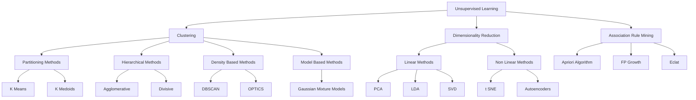
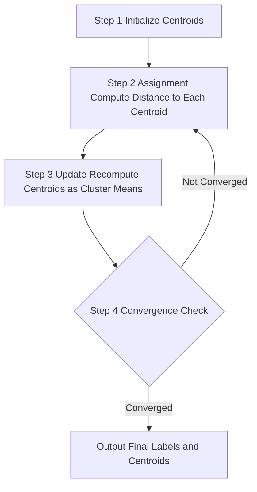
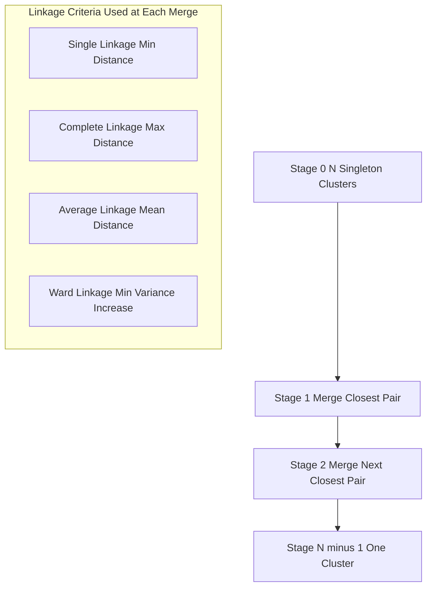
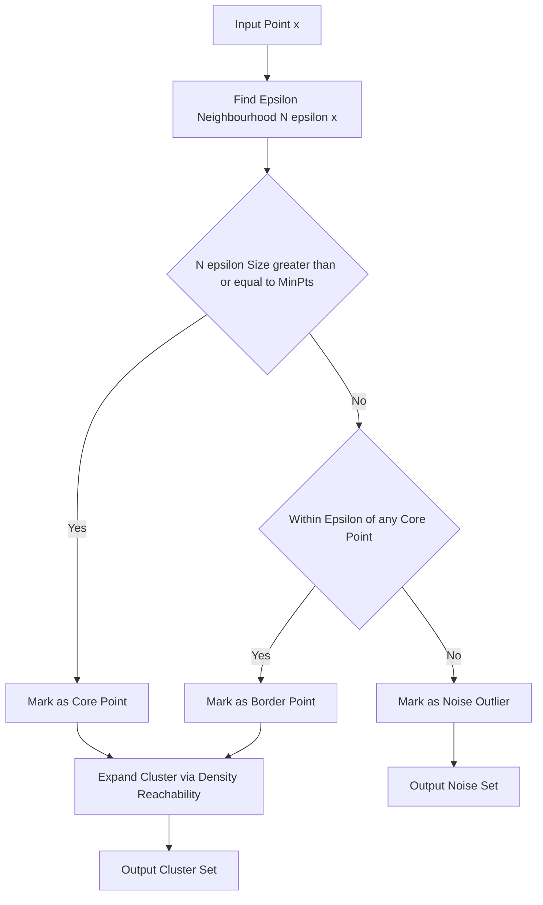
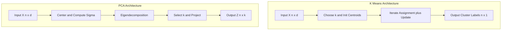

# Unsupervised Learning

<!-- SECTION_1_START -->

# Unsupervised Learning — Core Definition & Intuitive Overview

## 1.1 Formal Academic Definition (KTU 2024 Syllabus Terminology)

**Unsupervised Learning** is a paradigm of machine learning in which an algorithm is trained on a dataset $D = \{x_1, x_2, \ldots, x_n\}$ consisting exclusively of **input feature vectors** $x_i \in \mathbb{R}^d$ **without any corresponding target labels or output values**. The objective is to discover hidden structure, latent patterns, intrinsic groupings, or compact representations directly from the input distribution $P(x)$.

> [!IMPORTANT]
> **KTU Board Definition (Verbatim Style)**
> Unsupervised learning is the process of modeling the underlying structure or distribution in a dataset in order to learn more about the data. It is called *unsupervised* because there is no explicit supervisory signal (no labels $y_i$) guiding the learning process — the model is left to discover structure on its own.

Formally, given only $\mathcal{X} = \{x^{(1)}, x^{(2)}, \ldots, x^{(m)}\}$ where each $x^{(i)} \in \mathbb{R}^n$, the algorithm seeks to learn a function

$$
f : \mathbb{R}^n \rightarrow \mathcal{Y}_{\text{latent}}
$$

where $\mathcal{Y}_{\text{latent}}$ represents an inferred, non-pre-specified quantity such as cluster assignments, reduced dimensions, generative factors, or association rules.

## 1.2 Conceptual Analogy & Geometric Intuition

> [!NOTE]
> **The "Toddler Sorting Toys" Analogy**
> Imagine a 3-year-old given a large mixed bucket of red, blue, and green LEGO blocks with **no adult telling them** which color is which category. The child, by instinct, will naturally *group the red blocks together*, *group the blue blocks together*, and so on — purely based on visual similarity (color, size, shape). The child has performed **unsupervised clustering** — no one told them the answer, but the data's natural structure revealed itself.

**Geometrically**, unsupervised learning operates on a *point cloud* in high-dimensional space:

- **Clustering** = partitioning the cloud into dense regions separated by sparser zones.
- **Dimensionality Reduction** = projecting the cloud onto a lower-dimensional line/plane that preserves the maximum "spread" or "information."
- **Association** = identifying co-occurrence patterns between feature subsets.

The fundamental assumption is **cohesive grouping by proximity**: similar points (in some metric) belong together, and dissimilar points are separated.

## 1.3 Unsupervised vs. Supervised vs. Reinforcement Learning

| Aspect | Supervised | Unsupervised | Reinforcement |
|---|---|---|---|
| Training Signal | Labeled pairs $(x, y)$ | No labels — only $x$ | Reward signal from environment |
| Goal | Learn $f : x \rightarrow y$ | Learn structure of $P(x)$ | Maximize cumulative reward |
| Feedback Type | Direct (ground truth) | None (intrinsic) | Delayed & evaluative |
| Common Tasks | Classification, Regression | Clustering, DR, Association | Game playing, Robotics |
| Evaluation | Accuracy, MSE, F1 | Silhouette, Inertia, Reconstruction Error | Cumulative Reward |

> [!NOTE]
> **Key KTU Highlight:** In KTU board exams, you will often be asked to "compare" these paradigms in 3-mark questions. Always mention the **presence/absence of labels** as the central differentiator.

## 1.4 The Three Pillars of Unsupervised Learning

> [!IMPORTANT]
> **KTU Module 4 Syllabus Coverage — Three Major Sub-Areas**
> 1. **Clustering** — Partitioning data into groups (K-Means, Hierarchical, DBSCAN).
> 2. **Dimensionality Reduction** — Compressing feature space (PCA, t-SNE, LDA).
> 3. **Association Rule Mining** — Discovering co-occurrence patterns (Apriori, FP-Growth).

### Visualisation Control

> [!VISUALIZATION CONTROL]
> **Concept:** 2D Scatter Plot Showing Three Natural Clusters (Pre-Clustering vs. Post-Clustering)
> **GeoGebra / Desmos Input Points:**
> * Cluster A (red): $(1,1), (1.5,2), (2,1.5), (1.2,1.8)$
> * Cluster B (blue): $(8,8), (8.5,9), (9,8.5), (8.2,8.8)$
> * Cluster C (green): $(5,1), (5.5,1.5), (4.8,0.8), (5.2,1.2)$
> **Visual Description:** On the XY plane, three distinct dense circular regions appear in the lower-left, lower-middle, and upper-right. K-Means would draw three centroids (large stars) at the geometric center of each cloud, with Voronoi-like boundaries extending outward until they meet at the cluster midpoints.

---

<!-- SECTION_1_END -->

<!-- SECTION_2_START -->

# Deep Theoretical Analysis & KTU High-Yield Formula Sheet

## 2.1 The Clustering Problem — Formal Statement

Given a dataset $\mathcal{X} = \{x_1, x_2, \ldots, x_n\}$ with $x_i \in \mathbb{R}^d$, a clustering algorithm seeks to produce a partition

$$
\mathcal{C} = \{C_1, C_2, \ldots, C_k\}, \quad \bigcup_{j=1}^{k} C_j = \mathcal{X}, \quad C_i \cap C_j = \varnothing \text{ for } i \neq j
$$

that **maximizes intra-cluster similarity** and **minimizes inter-cluster similarity** according to some objective.

## 2.2 Distance Metrics — The Foundation of Similarity

> [!IMPORTANT]
> **KTU Board Emphasis:** Always state the metric explicitly when describing an algorithm. KTU examiners deduct marks for ambiguous metric usage.

| Metric | Formula | Use Case |
|---|---|---|
| **Euclidean** ($L_2$) | $d(x,y) = \sqrt{\sum_{i=1}^{d}(x_i - y_i)^2}$ | Default for K-Means, PCA |
| **Manhattan** ($L_1$) | $d(x,y) = \sum_{i=1}^{d}\vert x_i - y_i \vert$ | High-dim sparse data |
| **Minkowski** ($L_p$) | $d(x,y) = \left(\sum_{i=1}^{d}\vert x_i - y_i \vert^p\right)^{1/p}$ | Generalization of $L_1$ and $L_2$ |
| **Cosine** | $d(x,y) = 1 - \frac{x \cdot y}{\vert\vert x \vert\vert \cdot \vert\vert y \vert\vert}$ | Text / sparse high-dim data |
| **Mahalanobis** | $d(x,y) = \sqrt{(x-y)^T \Sigma^{-1} (x-y)}$ | Correlated features |

## 2.3 The K-Means Algorithm — Operational Breakdown

### 2.3.1 Objective Function (Within-Cluster Sum of Squares — WCSS)

K-Means minimizes the **inertia** or **distortion**:

$$
J(C, \mu) = \sum_{j=1}^{k} \sum_{x_i \in C_j} \vert\vert x_i - \mu_j \vert\vert^2
$$

where $\mu_j = \frac{1}{\vert C_j \vert} \sum_{x_i \in C_j} x_i$ is the centroid of cluster $C_j$.

### 2.3.2 Lloyd's Algorithm — Step-by-Step

> [!NOTE]
> **KTU Board Tip:** When asked to "explain K-Means," always list these steps with the **two alternating operations** (Assignment + Update) clearly separated.

**Input:** $\mathcal{X} = \{x_1, \ldots, x_n\}$, $k$ (number of clusters), max iterations $T$.
**Output:** Cluster assignments $c_i \in \{1, \ldots, k\}$ and centroids $\mu_1, \ldots, \mu_k$.

1. **Initialize** $k$ centroids $\{\mu_1^{(0)}, \mu_2^{(0)}, \ldots, \mu_k^{(0)}\}$ (random or via K-Means++).
2. **Repeat until convergence** (or for $T$ iterations):
   - **Step A — Assignment:** For each $x_i$, assign to nearest centroid:
     $$c_i^{(t)} = \arg\min_{j \in \{1,\ldots,k\}} \vert\vert x_i - \mu_j^{(t-1)} \vert\vert^2$$
   - **Step B — Update:** Recompute each centroid as the mean of its assigned points:
     $$\mu_j^{(t)} = \frac{1}{\vert C_j^{(t)} \vert} \sum_{x_i \in C_j^{(t)}} x_i$$
3. **Stop** when assignments no longer change: $c_i^{(t)} = c_i^{(t-1)} \; \forall i$.

### 2.3.3 Convergence Proof (Board-Friendly)

The objective $J$ is monotonically non-increasing per iteration:
- **Assignment Step** decreases $J$ (or keeps it constant) by routing each $x_i$ to its closest centroid.
- **Update Step** decreases $J$ (or keeps it constant) because the mean is the unique point that minimizes the squared distance within a cluster (by calculus / orthogonality principle).
- Since $J \geq 0$ and bounded below, the algorithm **must converge** in finite steps (there are at most $k^n$ possible partitions).

### 2.3.4 The Elbow Method — Choosing $k$

Plot $J(k)$ (inertia) versus $k$. The "elbow" point — where the rate of decrease sharply drops — is the optimal $k$.

> [!WARNING]
> **KTU Pitfall:** The elbow method is **heuristic**. If the curve has no clear elbow, use the **Silhouette Score** instead. Never state that the elbow method gives the "exact" $k$.

**Silhouette Score** for a single point $i$:

$$
s(i) = \frac{b(i) - a(i)}{\max\{a(i),\, b(i)\}}
$$

where $a(i)$ = mean distance to points in same cluster, $b(i)$ = min mean distance to points in the *next nearest* cluster. Range: $s(i) \in [-1, +1]$.

## 2.4 Hierarchical Clustering

Produces a **dendrogram** — a tree showing nested cluster merges (agglomerative) or splits (divisive).

**Agglomerative Algorithm:**
1. Start with $n$ singleton clusters.
2. Repeatedly merge the two **closest** clusters based on a **linkage criterion** until one cluster remains.

**Linkage Criteria:**

| Linkage | Distance Between Clusters $C_a$ and $C_b$ |
|---|---|
| Single | $d_{\min}(C_a, C_b) = \min_{x \in C_a, y \in C_b} d(x,y)$ |
| Complete | $d_{\max}(C_a, C_b) = \max_{x \in C_a, y \in C_b} d(x,y)$ |
| Average | $d_{\text{avg}}(C_a, C_b) = \frac{1}{\vert C_a \vert \vert C_b \vert} \sum_{x \in C_a, y \in C_b} d(x,y)$ |
| Ward | Minimizes total within-cluster variance after merging |

## 2.5 DBSCAN — Density-Based Spatial Clustering

Two key hyperparameters: $\epsilon$ (neighborhood radius) and $\text{MinPts}$ (minimum points to form a dense region).

A point $x_i$ is classified as:
- **Core point** if $\vert N_\epsilon(x_i) \vert \geq \text{MinPts}$
- **Border point** if $\vert N_\epsilon(x_i) \vert < \text{MinPts}$ but lies within $\epsilon$ of a core point
- **Noise point** if neither (an outlier)

> [!NOTE]
> **KTU Highlight:** DBSCAN does **not** require pre-specifying $k$. It can discover **arbitrarily shaped clusters** and **identify outliers** — a major advantage over K-Means.

## 2.6 Principal Component Analysis (PCA) — Dimensionality Reduction

**Goal:** Project $d$-dimensional data onto a lower $k$-dimensional subspace $(k < d)$ that preserves maximum variance.

### Step-by-Step Mathematical Formulation

**Step 1 — Center the Data:**

$$
\bar{x} = \frac{1}{n} \sum_{i=1}^{n} x_i, \quad X_c = X - \mathbf{1} \bar{x}^T
$$

**Step 2 — Compute the Covariance Matrix:**

$$
\Sigma = \frac{1}{n-1} X_c^T X_c \in \mathbb{R}^{d \times d}
$$

**Step 3 — Eigendecomposition:**

$$
\Sigma v_j = \lambda_j v_j, \quad j = 1, \ldots, d
$$

where $\lambda_1 \geq \lambda_2 \geq \ldots \geq \lambda_d \geq 0$ are eigenvalues and $v_j$ the corresponding orthonormal eigenvectors (principal components).

**Step 4 — Select Top $k$ Components:** Choose $k$ such that the **explained variance ratio** threshold is met:

$$
\frac{\sum_{j=1}^{k} \lambda_j}{\sum_{j=1}^{d} \lambda_j} \geq \tau \quad (\text{typically } \tau = 0.95)
$$

**Step 5 — Project:**

$$
Z = X_c W_k \in \mathbb{R}^{n \times k}, \quad W_k = [v_1, v_2, \ldots, v_k]
$$

## 2.7 Master KTU Formula Sheet (High-Yield Reference)

> [!IMPORTANT]
> **Save this table — it covers ~70% of unsupervised learning numerical questions.**

| Concept | Formula / Definition | Symbol Glossary |
|---|---|---|
| Dataset | $\mathcal{X} = \{x_1, \ldots, x_n\}$, $x_i \in \mathbb{R}^d$ | $n$ samples, $d$ features |
| K-Means Objective | $J = \sum_{j=1}^{k} \sum_{x \in C_j} \vert\vert x - \mu_j \vert\vert^2$ | $J$ = inertia / WCSS |
| Centroid Update | $\mu_j = \frac{1}{\vert C_j \vert} \sum_{x \in C_j} x$ | Mean of cluster $C_j$ |
| Assignment Rule | $c_i = \arg\min_j \vert\vert x_i - \mu_j \vert\vert^2$ | NN centroid assignment |
| Silhouette | $s(i) = \frac{b(i) - a(i)}{\max\{a(i), b(i)\}}$ | $a$ intra, $b$ nearest-other |
| Covariance | $\Sigma = \frac{1}{n-1} X_c^T X_c$ | $X_c$ = centered data |
| PCA Projection | $Z = X_c W_k$ | $W_k \in \mathbb{R}^{d \times k}$ |
| Explained Var. | $\text{EVR}_j = \frac{\lambda_j}{\sum_{i} \lambda_i}$ | Per-component ratio |
| Reconstruction Error | $\text{RE} = \frac{\sum_{j=k+1}^{d} \lambda_j}{\sum_{j=1}^{d} \lambda_j}$ | Lost information |
| DBSCAN Reachability | $\vert N_\epsilon(x) \vert \geq \text{MinPts}$ | Density threshold |

## 2.8 Real-World Engineering & CS Applications

> [!NOTE]
> **KTU Application Question Tip:** Examiners often award marks for stating a relevant real-world use case. Memorize 2-3 of these.

- **Customer Segmentation** (Marketing): K-Means groups customers by purchase behavior.
- **Anomaly Detection** (Cybersecurity): DBSCAN flags network traffic outside dense regions.
- **Image Compression**: PCA reduces pixel dimensions while preserving visual content.
- **Genomics & Bioinformatics**: Hierarchical clustering builds phylogenetic trees of species.
- **Recommender Systems**: Association rule mining ("customers who bought X also bought Y").
- **Document Clustering** (NLP): Group news articles by topic using TF-IDF + K-Means.
- **Pretraining Foundation Models**: Self-supervised representation learning (e.g., masked autoencoders) uses PCA-like objectives.

---

<!-- SECTION_2_END -->

<!-- SECTION_3_START -->

# Step-by-Step Derivations, Worked Examples & Python Implementations

## 3.1 Worked Example 1 — K-Means by Hand (Board Standard)

**Problem:** Given 2D points $A(1,1), B(2,1), C(4,3), D(5,4)$ and initial centroids $\mu_1 = A(1,1)$ and $\mu_2 = B(2,1)$. Run **one iteration** of K-Means and compute the new objective $J$.

### Step 1 — Initial State

$\mu_1 = (1,1)$, $\mu_2 = (2,1)$.

### Step 2 — Assignment Step (Euclidean Distance Squared)

For each point, compute $d^2$ to both centroids:

For $A(1,1)$:
$$d^2(A, \mu_1) = (1-1)^2 + (1-1)^2 = 0$$
$$d^2(A, \mu_2) = (1-2)^2 + (1-1)^2 = 1$$
Assign $A \rightarrow C_1$.

For $B(2,1)$:
$$d^2(B, \mu_1) = (2-1)^2 + (1-1)^2 = 1$$
$$d^2(B, \mu_2) = (2-2)^2 + (1-1)^2 = 0$$
Assign $B \rightarrow C_2$.

For $C(4,3)$:
$$d^2(C, \mu_1) = (4-1)^2 + (3-1)^2 = 9 + 4 = 13$$
$$d^2(C, \mu_2) = (4-2)^2 + (3-1)^2 = 4 + 4 = 8$$
Assign $C \rightarrow C_2$.

For $D(5,4)$:
$$d^2(D, \mu_1) = (5-1)^2 + (4-1)^2 = 16 + 9 = 25$$
$$d^2(D, \mu_2) = (5-2)^2 + (4-1)^2 = 9 + 9 = 18$$
Assign $D \rightarrow C_2$.

### Step 3 — Verify New Clusters

$$C_1 = \{A\} = \{(1,1)\}, \quad C_2 = \{B, C, D\} = \{(2,1), (4,3), (5,4)\}$$

### Step 4 — Update Centroids

$$\mu_1^{\text{new}} = \frac{1}{1}\big[(1,1)\big] = (1, 1)$$

$$\mu_2^{\text{new}} = \frac{1}{3}\big[(2,1) + (4,3) + (5,4)\big] = \left(\frac{11}{3}, \frac{8}{3}\right) \approx (3.67, 2.67)$$

### Step 5 — Compute New Objective $J$

$$J = \sum_{x \in C_1}\vert\vert x - \mu_1 \vert\vert^2 + \sum_{x \in C_2}\vert\vert x - \mu_2 \vert\vert^2$$

For $C_1$: $\vert\vert (1,1) - (1,1) \vert\vert^2 = 0$.

For $C_2$:
- $\vert\vert (2,1) - (11/3, 8/3) \vert\vert^2 = (2 - 3.67)^2 + (1 - 2.67)^2 = 2.79 + 2.79 = 5.58$
- $\vert\vert (4,3) - (11/3, 8/3) \vert\vert^2 = (4 - 3.67)^2 + (3 - 2.67)^2 = 0.11 + 0.11 = 0.22$
- $\vert\vert (5,4) - (11/3, 8/3) \vert\vert^2 = (5 - 3.67)^2 + (4 - 2.67)^2 = 1.77 + 1.77 = 3.54$

$$J^{\text{new}} = 0 + 5.58 + 0.22 + 3.54 = 9.34$$

> [!NOTE]
> **KTU Valuation Key Points for Above:**
> * [Correct distance computation: 2 Marks]
> * [Correct assignment rule application: 1 Mark]
> * [Centroid recomputation via mean formula: 1 Mark]
> * [Final $J$ calculation: 1 Mark]

---

## 3.2 Worked Example 2 — PCA by Hand on a 2D Dataset

**Problem:** Given $X = \begin{bmatrix} 2 & 0 \\ 0 & 2 \\ 3 & 1 \\ 1 & 3 \end{bmatrix}$, project onto $k=1$ principal component.

### Step 1 — Compute the Mean Vector

$$\bar{x} = \left(\frac{2+0+3+1}{4}, \frac{0+2+1+3}{4}\right) = (1.5, 1.5)$$

### Step 2 — Center the Data $X_c = X - \mathbf{1}\bar{x}^T$

$$X_c = \begin{bmatrix} 2-1.5 & 0-1.5 \\ 0-1.5 & 2-1.5 \\ 3-1.5 & 1-1.5 \\ 1-1.5 & 3-1.5 \end{bmatrix} = \begin{bmatrix} 0.5 & -1.5 \\ -1.5 & 0.5 \\ 1.5 & -0.5 \\ -0.5 & 1.5 \end{bmatrix}$$

### Step 3 — Compute Covariance Matrix $\Sigma = \frac{1}{n-1} X_c^T X_c$

$$X_c^T X_c = \begin{bmatrix} 0.5 & -1.5 & 1.5 & -0.5 \\ -1.5 & 0.5 & -0.5 & 1.5 \end{bmatrix} \begin{bmatrix} 0.5 & -1.5 \\ -1.5 & 0.5 \\ 1.5 & -0.5 \\ -0.5 & 1.5 \end{bmatrix}$$

Computing element-wise:

$$\Sigma_{11} = \frac{1}{3}(0.25 + 2.25 + 2.25 + 0.25) = \frac{4}{3} \approx 1.333$$

$$\Sigma_{22} = \frac{1}{3}(2.25 + 0.25 + 0.25 + 2.25) = \frac{5}{3} \approx 1.667$$

$$\Sigma_{12} = \Sigma_{21} = \frac{1}{3}\big[(0.5)(-1.5) + (-1.5)(0.5) + (1.5)(-0.5) + (-0.5)(1.5)\big] = \frac{1}{3}(-0.75 - 0.75 - 0.75 - 0.75) = -1.0$$

$$\Sigma = \begin{bmatrix} 1.333 & -1.0 \\ -1.0 & 1.667 \end{bmatrix}$$

### Step 4 — Eigendecomposition

Characteristic equation: $\det(\Sigma - \lambda I) = 0$:

$$(1.333 - \lambda)(1.667 - \lambda) - (-1.0)^2 = 0$$
$$\lambda^2 - 3.0\lambda + 2.222 - 1.0 = 0$$
$$\lambda^2 - 3.0\lambda + 1.222 = 0$$

$$\lambda = \frac{3.0 \pm \sqrt{9 - 4.889}}{2} = \frac{3.0 \pm \sqrt{4.111}}{2} = \frac{3.0 \pm 2.027}{2}$$

$$\lambda_1 = \frac{3.0 + 2.027}{2} = 2.514, \quad \lambda_2 = \frac{3.0 - 2.027}{2} = 0.486$$

### Step 5 — Compute Principal Component $v_1$

For $\lambda_1 = 2.514$:

$$(\Sigma - \lambda_1 I) v_1 = 0 \Rightarrow \begin{bmatrix} 1.333 - 2.514 & -1.0 \\ -1.0 & 1.667 - 2.514 \end{bmatrix} v_1 = \begin{bmatrix} 0 \\ 0 \end{bmatrix}$$

$$-1.181 v_{11} - v_{12} = 0 \Rightarrow v_{12} = -1.181 v_{11}$$

Normalize: $\vert\vert v_1 \vert\vert^2 = v_{11}^2 + v_{12}^2 = v_{11}^2(1 + 1.395) = 2.395 v_{11}^2 = 1$

$$v_{11} = \frac{1}{\sqrt{2.395}} \approx 0.646, \quad v_{12} \approx -0.763$$

$$v_1 = \begin{bmatrix} 0.646 \\ -0.763 \end{bmatrix}$$

### Step 6 — Project Data to 1D

$$Z = X_c W_1 = X_c v_1 = \begin{bmatrix} 0.5 & -1.5 \\ -1.5 & 0.5 \\ 1.5 & -0.5 \\ -0.5 & 1.5 \end{bmatrix} \begin{bmatrix} 0.646 \\ -0.763 \end{bmatrix}$$

$$Z = \begin{bmatrix} (0.5)(0.646) + (-1.5)(-0.763) \\ (-1.5)(0.646) + (0.5)(-0.763) \\ (1.5)(0.646) + (-0.5)(-0.763) \\ (-0.5)(0.646) + (1.5)(-0.763) \end{bmatrix} = \begin{bmatrix} 0.323 + 1.145 \\ -0.969 - 0.382 \\ 0.969 + 0.382 \\ -0.323 - 1.145 \end{bmatrix} = \begin{bmatrix} 1.468 \\ -1.351 \\ 1.351 \\ -1.468 \end{bmatrix}$$

### Step 7 — Explained Variance Ratio

$$\text{EVR}_1 = \frac{\lambda_1}{\lambda_1 + \lambda_2} = \frac{2.514}{2.514 + 0.486} = \frac{2.514}{3.0} = 0.838$$

So PC1 captures **83.8%** of total variance.

> [!NOTE]
> **KTU Valuation Key for PCA Numerical:**
> * [Centering the data: 1 Mark]
> * [Covariance matrix formula and computation: 2 Marks]
> * [Eigendecomposition or characteristic equation: 2 Marks]
> * [Eigenvector normalization: 1 Mark]
> * [Final projection + EVR: 1 Mark]

---

## 3.3 Full Python Implementation — K-Means from Scratch

```python
"""
K-Means Clustering — From Scratch (NumPy Only)
Implements Lloyd's algorithm with K-Means++ initialization.
"""

from __future__ import annotations
import numpy as np
from typing import Tuple, List


def kmeans_plus_plus_init(X: np.ndarray, k: int, rng: np.random.Generator) -> np.ndarray:
    """
    K-Means++ smart initialization:
    - First centroid: uniform random.
    - Subsequent: probability proportional to squared distance from nearest centroid.
    """
    n_samples = X.shape[0]
    centroids = np.empty((k, X.shape[1]), dtype=np.float64)
    # Pick first centroid uniformly at random
    idx = rng.integers(0, n_samples)
    centroids[0] = X[idx]
    closest_sq_dist = np.full(n_samples, np.inf)

    for c in range(1, k):
        # Update min squared distance to any chosen centroid
        dists_sq = np.sum((X - centroids[c - 1]) ** 2, axis=1)
        closest_sq_dist = np.minimum(closest_sq_dist, dists_sq)
        # Sample next centroid with prob ∝ closest_sq_dist
        probs = closest_sq_dist / closest_sq_dist.sum()
        idx = rng.choice(n_samples, p=probs)
        centroids[c] = X[idx]

    return centroids


def compute_inertia(X: np.ndarray, labels: np.ndarray, centroids: np.ndarray) -> float:
    """Sum of squared distances of samples to their closest centroid."""
    inertia = 0.0
    for j in range(centroids.shape[0]):
        members = X[labels == j]
        if members.size > 0:
            inertia += np.sum((members - centroids[j]) ** 2)
    return float(inertia)


def kmeans(
    X: np.ndarray,
    k: int,
    max_iter: int = 300,
    tol: float = 1e-6,
    seed: int = 42,
) -> Tuple[np.ndarray, np.ndarray, float, int]:
    """
    Full Lloyd's K-Means.

    Parameters
    ----------
    X : np.ndarray of shape (n_samples, n_features)
    k : int — number of clusters
    max_iter : int — hard cap on iterations
    tol : float — convergence tolerance on centroid shift
    seed : int — RNG seed for reproducibility

    Returns
    -------
    labels : np.ndarray of shape (n_samples,) — cluster assignments
    centroids : np.ndarray of shape (k, n_features)
    inertia : float — final WCSS
    n_iter : int — number of iterations executed
    """
    rng = np.random.default_rng(seed)
    centroids = kmeans_plus_plus_init(X, k, rng)
    labels = np.full(X.shape[0], -1, dtype=np.int64)
    n_iter = 0

    for iteration in range(max_iter):
        n_iter = iteration + 1
        prev_centroids = centroids.copy()

        # ----- Assignment Step -----
        # Compute all pairwise squared distances: (n, k)
        dists_sq = np.sum((X[:, None, :] - centroids[None, :, :]) ** 2, axis=2)
        labels = np.argmin(dists_sq, axis=1)

        # ----- Update Step -----
        for j in range(k):
            members = X[labels == j]
            if members.shape[0] > 0:
                centroids[j] = members.mean(axis=0)
            # If a cluster is empty, keep its centroid (or re-init if you prefer)

        # ----- Convergence Check -----
        shift = np.linalg.norm(centroids - prev_centroids)
        if shift < tol:
            break

    inertia = compute_inertia(X, labels, centroids)
    return labels, centroids, inertia, n_iter


def elbow_method(X: np.ndarray, k_range: List[int], **kwargs) -> List[float]:
    """Compute inertia for each k to plot the elbow curve."""
    inertias: List[float] = []
    for k in k_range:
        _, _, inertia, _ = kmeans(X, k, **kwargs)
        inertias.append(inertia)
    return inertias


# ----------------------------- DEMO -----------------------------
if __name__ == "__main__":
    rng = np.random.default_rng(0)
    # Synthesize 3 well-separated Gaussian blobs
    blob1 = rng.normal(loc=[0, 0], scale=0.5, size=(50, 2))
    blob2 = rng.normal(loc=[5, 5], scale=0.5, size=(50, 2))
    blob3 = rng.normal(loc=[0, 5], scale=0.5, size=(50, 2))
    X = np.vstack([blob1, blob2, blob3])

    labels, centroids, inertia, n_iter = kmeans(X, k=3, seed=7)
    print(f"Converged in {n_iter} iterations.")
    print(f"Final inertia (WCSS): {inertia:.4f}")
    print(f"Centroids:\n{centroids}")

    inertias = elbow_method(X, k_range=list(range(1, 8)), seed=7)
    print("Inertia vs k:", dict(zip(range(1, 8), [round(i, 2) for i in inertias])))
```

---

## 3.4 Full Python Implementation — PCA from Scratch (Eigendecomposition Path)

```python
"""
Principal Component Analysis (PCA) — From Scratch.
Uses eigendecomposition of the covariance matrix.
"""

from __future__ import annotations
import numpy as np
from typing import Tuple


class PCA:
    """
    PCA via covariance eigendecomposition.

    Parameters
    ----------
    n_components : int — number of principal components to keep.
    """

    def __init__(self, n_components: int) -> None:
        if n_components < 1:
            raise ValueError("n_components must be >= 1")
        self.n_components = n_components
        self.mean_: np.ndarray | None = None
        self.components_: np.ndarray | None = None
        self.eigenvalues_: np.ndarray | None = None
        self.explained_variance_ratio_: np.ndarray | None = None

    def fit(self, X: np.ndarray) -> "PCA":
        X = np.asarray(X, dtype=np.float64)
        if X.ndim != 2:
            raise ValueError("X must be 2D (n_samples, n_features)")

        n_samples, n_features = X.shape
        if self.n_components > n_features:
            raise ValueError("n_components cannot exceed n_features")

        # 1. Center
        self.mean_ = X.mean(axis=0)
        X_centered = X - self.mean_

        # 2. Covariance (d x d)
        cov_matrix = (X_centered.T @ X_centered) / (n_samples - 1)

        # 3. Eigendecomposition (ascending order by default in NumPy)
        eigenvalues, eigenvectors = np.linalg.eigh(cov_matrix)

        # 4. Sort descending
        sort_idx = np.argsort(eigenvalues)[::-1]
        eigenvalues = eigenvalues[sort_idx]
        eigenvectors = eigenvectors[:, sort_idx]

        # 5. Store top-k
        self.eigenvalues_ = eigenvalues[: self.n_components]
        self.components_ = eigenvectors[:, : self.n_components].T  # shape (k, d)

        # 6. Explained variance ratio
        total_var = eigenvalues.sum()
        if total_var <= 0:
            raise ValueError("Total variance is non-positive; check data.")
        self.explained_variance_ratio_ = self.eigenvalues_ / total_var
        return self

    def transform(self, X: np.ndarray) -> np.ndarray:
        if self.mean_ is None or self.components_ is None:
            raise RuntimeError("Call fit() before transform().")
        X_centered = np.asarray(X, dtype=np.float64) - self.mean_
        return X_centered @ self.components_.T

    def fit_transform(self, X: np.ndarray) -> np.ndarray:
        self.fit(X)
        return self.transform(X)

    def reconstruct(self, Z: np.ndarray) -> np.ndarray:
        """Project back to original space (with reconstruction error)."""
        if self.components_ is None or self.mean_ is None:
            raise RuntimeError("Call fit() before reconstruct().")
        return Z @ self.components_ + self.mean_


# ----------------------------- DEMO -----------------------------
if __name__ == "__main__":
    rng = np.random.default_rng(42)
    # Generate correlated 3D data
    A = rng.normal(size=(200, 3))
    transform = np.array([[1, 0.8, 0.5], [0, 1, 0.2], [0, 0, 1]])
    X = A @ transform.T  # 200 x 3

    pca = PCA(n_components=2)
    Z = pca.fit_transform(X)
    print("Original shape :", X.shape)
    print("Reduced shape  :", Z.shape)
    print("Eigenvalues    :", np.round(pca.eigenvalues_, 4))
    print("Explained Var  :", np.round(pca.explained_variance_ratio_, 4))
    print("Cum. EVR (2D)  :", round(pca.explained_variance_ratio_.sum(), 4))

    # Reconstruction error
    X_hat = pca.reconstruct(Z)
    mse = float(np.mean((X - X_hat) ** 2))
    print(f"Reconstruction MSE: {mse:.6f}")
```

---

## 3.5 Practical Comparison — K-Means, Hierarchical, DBSCAN

| Aspect | K-Means | Hierarchical (Agglomerative) | DBSCAN |
|---|---|---|---|
| **$k$ Required?** | Yes | No (cut dendrogram) | No (uses $\epsilon$, MinPts) |
| **Cluster Shape** | Spherical (Voronoi) | Arbitrary | Arbitrary |
| **Scalability** | $O(nkt)$ — fast | $O(n^3)$ or $O(n^2 \log n)$ — slow | $O(n \log n)$ with index |
| **Outlier Robust** | No (forces assignment) | No | **Yes** (labels as noise) |
| **Deterministic** | No (init sensitive) | Mostly yes | Mostly yes |
| **Best For** | Large $n$, spherical clusters | Small $n$, dendrogram needed | Anomalies, non-convex shapes |

---

<!-- SECTION_3_END -->

<!-- SECTION_4_START -->

# Structural Diagrams & Schematics

## 4.1 Unsupervised Learning Taxonomy (Mermaid Block Diagram)



## 4.2 K-Means Iterative Processing Flow



## 4.3 PCA Sequential Processing Topology


## 4.4 Agglomerative Hierarchical Clustering (Nested Subgraph)



## 4.5 DBSCAN Point Classification Architecture



## 4.6 K-Means vs. PCA Functional Architecture Comparison



---

<!-- SECTION_4_END -->

<!-- SECTION_5_START -->

# KTU 2024 Scheme Examination Question Bank & Topic Recap

## Part A — Short Answer Questions (3 Marks Each)

### Question 1: [KTU University Exam - July 2024] — CO1, Understand

**Define unsupervised learning. How does it fundamentally differ from supervised learning?**

**Model Answer (3 Marks):**
Unsupervised learning is a machine learning paradigm where the model is trained on a dataset containing only input features $X = \{x_1, x_2, \ldots, x_n\}$ with **no corresponding target labels**. The goal is to discover hidden structure, patterns, or representations within the data itself.

**Key Differences from Supervised Learning:**

| Feature | Supervised | Unsupervised |
|---|---|---|
| Labels | Present $(x, y)$ pairs | Absent — only $x$ |
| Goal | Learn $f: x \to y$ | Learn structure of $P(x)$ |
| Evaluation | Direct (accuracy, MSE) | Indirect (silhouette, inertia) |

*[Definition: 1 Mark] [Difference with example: 2 Marks]*

---

### Question 2: [KTU University Exam - Dec 2023] — CO2, Remember

**State the K-Means objective function. What does it minimize?**

**Model Answer (3 Marks):**
The K-Means objective function is the **Within-Cluster Sum of Squares (WCSS)** also called **inertia**:

$$
J(C, \mu) = \sum_{j=1}^{k} \sum_{x_i \in C_j} \vert\vert x_i - \mu_j \vert\vert^2
$$

where $C_j$ is the $j$-th cluster, $\mu_j$ is its centroid, and $\vert\vert \cdot \vert\vert$ is the Euclidean norm.

**It minimizes** the sum of squared Euclidean distances between every data point and its assigned cluster centroid, which promotes compact, well-separated spherical clusters.

*[Formula statement: 2 Marks] [Explanation of minimization: 1 Mark]*

---

## Part B — Long Answer Questions (14 Marks Each) — Internal Choice

### Question A: [KTU University Exam - July 2024] — CO2, Apply

**(a)** Explain the step-by-step procedure of the **K-Means clustering algorithm**. State clearly the assignment step and the centroid update step with their respective mathematical formulations. **\[7 Marks\]**

**(b)** For the 2D dataset $P_1(1,1), P_2(2,1), P_3(4,3), P_4(5,4)$ with initial centroids $C_1 = (1,1)$ and $C_2 = (2,1)$, perform **two complete iterations** of K-Means. Compute the WCSS (objective $J$) at the end of each iteration. **\[7 Marks\]**

---

#### Model Solution for Question A:

### Part (a) — K-Means Algorithm Steps [7 Marks]

**Input:** Dataset $X = \{x_1, \ldots, x_n\}$, $k$ clusters, max iterations $T$.

**Step 1 — Initialization:** Choose $k$ initial centroids $\mu_1^{(0)}, \ldots, \mu_k^{(0)}$ (randomly or via K-Means++). *[1 Mark]*

**Step 2 — Assignment Step (Expectation-like):** For each data point $x_i$, assign it to the cluster with the nearest centroid: *[2 Marks]*

$$
c_i^{(t)} = \arg\min_{j \in \{1,\ldots,k\}} \vert\vert x_i - \mu_j^{(t-1)} \vert\vert^2
$$

**Step 3 — Update Step (Maximization-like):** Recompute each centroid as the mean of all points currently assigned to its cluster: *[2 Marks]*

$$
\mu_j^{(t)} = \frac{1}{\vert C_j^{(t)} \vert} \sum_{x_i \in C_j^{(t)}} x_i
$$

**Step 4 — Convergence Check:** If $c_i^{(t)} = c_i^{(t-1)}$ for all $i$, or centroid shift falls below a tolerance $\epsilon$, **stop**. Otherwise return to Step 2. *[1 Mark]*

**Step 5 — Output:** Final cluster assignments $\{c_i\}_{i=1}^n$ and centroids $\{\mu_j\}_{j=1}^k$. *[1 Mark]*

> [!NOTE]
> **Convergence Note:** The algorithm is guaranteed to converge in finite steps because the WCSS objective $J$ is monotonically non-increasing and bounded below by 0. There are at most $k^n$ distinct partitions.

---

### Part (b) — Two Iterations of K-Means [7 Marks]

#### Iteration 1

**Initial:** $\mu_1 = (1,1)$, $\mu_2 = (2,1)$.

**Compute Squared Distances:**

| Point | $d^2$ to $\mu_1$ | $d^2$ to $\mu_2$ | Assigned |
|---|---|---|---|
| $P_1(1,1)$ | $0$ | $1$ | $C_1$ |
| $P_2(2,1)$ | $1$ | $0$ | $C_2$ |
| $P_3(4,3)$ | $13$ | $8$ | $C_2$ |
| $P_4(5,4)$ | $25$ | $18$ | $C_2$ |

**Clusters after Iteration 1:** $C_1 = \{P_1\}$, $C_2 = \{P_2, P_3, P_4\}$ *[1 Mark]*

**Update Centroids:**
$$\mu_1^{(1)} = (1,1)$$
$$\mu_2^{(1)} = \frac{(2,1) + (4,3) + (5,4)}{3} = \left(\frac{11}{3}, \frac{8}{3}\right) \approx (3.67, 2.67)$$ *[1 Mark]*

**WCSS after Iteration 1:**
$$J^{(1)} = \vert\vert P_1 - \mu_1 \vert\vert^2 + \sum_{x \in C_2} \vert\vert x - \mu_2 \vert\vert^2$$

- $P_1$: $0$
- $P_2$: $(2-3.67)^2 + (1-2.67)^2 = 2.79 + 2.79 = 5.58$
- $P_3$: $(4-3.67)^2 + (3-2.67)^2 = 0.11 + 0.11 = 0.22$
- $P_4$: $(5-3.67)^2 + (4-2.67)^2 = 1.77 + 1.77 = 3.54$

$$J^{(1)} = 0 + 5.58 + 0.22 + 3.54 = 9.34$$ *[1 Mark]*

---

#### Iteration 2

**Squared Distances to $\mu_1^{(1)} = (1,1)$ and $\mu_2^{(1)} = (3.67, 2.67)$:**

| Point | $d^2$ to $\mu_1^{(1)}$ | $d^2$ to $\mu_2^{(1)}$ | Assigned |
|---|---|---|---|
| $P_1(1,1)$ | $0$ | $5.58$ | $C_1$ |
| $P_2(2,1)$ | $1$ | $5.58$ | $C_1$ |
| $P_3(4,3)$ | $13$ | $0.22$ | $C_2$ |
| $P_4(5,4)$ | $25$ | $3.54$ | $C_2$ |

**Clusters after Iteration 2:** $C_1 = \{P_1, P_2\}$, $C_2 = \{P_3, P_4\}$ *[1 Mark]*

**Update Centroids:**
$$\mu_1^{(2)} = \frac{(1,1) + (2,1)}{2} = (1.5, 1)$$
$$\mu_2^{(2)} = \frac{(4,3) + (5,4)}{2} = (4.5, 3.5)$$ *[1 Mark]*

**WCSS after Iteration 2:**
- $P_1$: $(1-1.5)^2 + (1-1)^2 = 0.25$
- $P_2$: $(2-1.5)^2 + (1-1)^2 = 0.25$
- $P_3$: $(4-4.5)^2 + (3-3.5)^2 = 0.5$
- $P_4$: $(5-4.5)^2 + (4-3.5)^2 = 0.5$

$$J^{(2)} = 0.25 + 0.25 + 0.5 + 0.5 = 1.5$$ *[1 Mark]*

**Observation:** $J$ decreased from $9.34 \to 1.5$, confirming convergence behaviour. *[Final remark: 1 Mark]*

> [!WARNING]
> **KTU Examiner's Valuation Warning — K-Means Numerical:**
> * **Do NOT skip** the squared distance calculation step — show all four points' distances explicitly.
> * **Always** show the centroid update as a separate labeled step.
> * **Common Mistake:** Using arithmetic mean of *all* points instead of *cluster members only* for centroid update. This is a 1-mark deduction.
> * **Final answer should include** the WCSS value with units (i.e., "squared distance units"). The WCSS itself need not be minimized — only computed and shown to be monotonically decreasing.

---

### Question B: [KTU University Exam - Dec 2023] — CO2, Apply

**(a)** What is **Principal Component Analysis (PCA)**? Derive the step-by-step mathematical procedure for performing PCA on a dataset $X \in \mathbb{R}^{n \times d}$. Clearly state the role of the covariance matrix and eigenvalues. **\[7 Marks\]**

**(b)** Consider the dataset $X = \{ (2,1), (3,2), (4,1), (5,3) \}$. Compute the covariance matrix, find the eigenvalues and eigenvectors, and project the data onto the first principal component. **\[7 Marks\]**

---

#### Model Solution for Question B:

### Part (a) — PCA Theory & Derivation [7 Marks]

**Definition:** PCA is a linear dimensionality reduction technique that projects $d$-dimensional data onto a $k$-dimensional $(k < d)$ orthogonal subspace such that the **maximum variance** of the original data is preserved. *[1 Mark]*

**Step-by-Step Procedure:**

**Step 1 — Mean Centering:** *[1 Mark]*
$$\bar{x} = \frac{1}{n}\sum_{i=1}^{n} x_i, \quad X_c = X - \mathbf{1}\bar{x}^T$$
This shifts data to the origin — required because PCA is variance-sensitive.

**Step 2 — Covariance Matrix Computation:** *[1 Mark]*
$$\Sigma = \frac{1}{n-1} X_c^T X_c \in \mathbb{R}^{d \times d}$$
$\Sigma_{ij}$ measures how feature $i$ and feature $j$ co-vary. Diagonal entries are variances; off-diagonals are covariances.

**Step 3 — Eigendecomposition:** *[2 Marks]*
$$\Sigma v_j = \lambda_j v_j, \quad j = 1, \ldots, d$$
The eigenvalues $\lambda_j$ (sorted $\lambda_1 \geq \lambda_2 \geq \ldots \geq \lambda_d \geq 0$) represent the **variance captured** along each principal direction $v_j$.

**Step 4 — Select Top $k$ Components:** *[1 Mark]*
$$W_k = [v_1, v_2, \ldots, v_k] \in \mathbb{R}^{d \times k}$$
Choose $k$ such that $\sum_{j=1}^{k} \lambda_j / \sum_{j=1}^{d} \lambda_j \geq \tau$ (typically 0.95).

**Step 5 — Projection:** *[1 Mark]*
$$Z = X_c W_k \in \mathbb{R}^{n \times k}$$

**Role of Eigenvalues:** Eigenvalues quantify how much variance each principal component captures. Larger $\lambda_j$ = more informative direction. The sum $\sum \lambda_j$ equals the trace of $\Sigma$ (total variance).

**Role of Covariance Matrix:** It encodes the joint variability structure. Its eigenvectors form the optimal projection axes (proof via Lagrange multiplier maximization of variance subject to $\|v\| = 1$).

---

### Part (b) — PCA Numerical on 2D Data [7 Marks]

**Dataset:** $X = \{(2,1), (3,2), (4,1), (5,3)\}$.

**Step 1 — Mean Vector:** *[0.5 Mark]*
$$\bar{x} = \left(\frac{2+3+4+5}{4}, \frac{1+2+1+3}{4}\right) = (3.5, 1.75)$$

**Step 2 — Centered Data:** *[0.5 Mark]*
$$X_c = \begin{bmatrix} 2-3.5 & 1-1.75 \\ 3-3.5 & 2-1.75 \\ 4-3.5 & 1-1.75 \\ 5-3.5 & 3-1.75 \end{bmatrix} = \begin{bmatrix} -1.5 & -0.75 \\ -0.5 & 0.25 \\ 0.5 & -0.75 \\ 1.5 & 1.25 \end{bmatrix}$$

**Step 3 — Covariance Matrix:** *[1 Mark]*
$$\Sigma_{11} = \frac{1}{3}[(-1.5)^2 + (-0.5)^2 + (0.5)^2 + (1.5)^2] = \frac{1}{3}(2.25 + 0.25 + 0.25 + 2.25) = \frac{5}{3} \approx 1.667$$

$$\Sigma_{22} = \frac{1}{3}[(-0.75)^2 + (0.25)^2 + (-0.75)^2 + (1.25)^2] = \frac{1}{3}(0.5625 + 0.0625 + 0.5625 + 1.5625) = \frac{2.75}{3} \approx 0.917$$

$$\Sigma_{12} = \Sigma_{21} = \frac{1}{3}[(-1.5)(-0.75) + (-0.5)(0.25) + (0.5)(-0.75) + (1.5)(1.25)] = \frac{1}{3}(1.125 - 0.125 - 0.375 + 1.875) = \frac{2.5}{3} \approx 0.833$$

$$\Sigma = \begin{bmatrix} 1.667 & 0.833 \\ 0.833 & 0.917 \end{bmatrix}$$

**Step 4 — Eigenvalues:** *[1.5 Marks]*
Characteristic equation:
$$\det(\Sigma - \lambda I) = (1.667 - \lambda)(0.917 - \lambda) - 0.833^2 = 0$$
$$\lambda^2 - 2.584\lambda + 1.529 - 0.694 = 0$$
$$\lambda^2 - 2.584\lambda + 0.835 = 0$$
$$\lambda = \frac{2.584 \pm \sqrt{6.677 - 3.340}}{2} = \frac{2.584 \pm \sqrt{3.337}}{2} = \frac{2.584 \pm 1.827}{2}$$

$$\lambda_1 = \frac{2.584 + 1.827}{2} = 2.206, \quad \lambda_2 = \frac{2.584 - 1.827}{2} = 0.378$$

**Step 5 — Eigenvector for $\lambda_1$:** *[1 Mark]*
$$(\Sigma - 2.206 I) v_1 = 0 \Rightarrow \begin{bmatrix} -0.539 & 0.833 \\ 0.833 & -1.289 \end{bmatrix} v_1 = 0$$
$$-0.539 v_{11} + 0.833 v_{12} = 0 \Rightarrow v_{12} = 0.647 v_{11}$$
Normalize: $\sqrt{v_{11}^2 + 0.419 v_{11}^2} = 1 \Rightarrow v_{11} = \frac{1}{\sqrt{1.419}} = 0.840$
$$v_1 = \begin{bmatrix} 0.840 \\ 0.543 \end{bmatrix}$$

**Step 6 — Projection onto PC1:** *[1 Mark]*
$$Z = X_c v_1 = \begin{bmatrix} -1.5 & -0.75 \\ -0.5 & 0.25 \\ 0.5 & -0.75 \\ 1.5 & 1.25 \end{bmatrix} \begin{bmatrix} 0.840 \\ 0.543 \end{bmatrix}$$

$$Z = \begin{bmatrix} -1.5(0.840) + (-0.75)(0.543) \\ -0.5(0.840) + (0.25)(0.543) \\ 0.5(0.840) + (-0.75)(0.543) \\ 1.5(0.840) + 1.25(0.543) \end{bmatrix} = \begin{bmatrix} -1.260 - 0.407 \\ -0.420 + 0.136 \\ 0.420 - 0.407 \\ 1.260 + 0.679 \end{bmatrix} = \begin{bmatrix} -1.667 \\ -0.284 \\ 0.013 \\ 1.939 \end{bmatrix}$$ *[0.5 Mark]*

**Step 7 — Explained Variance Ratio:** *[0.5 Mark]*
$$\text{EVR}_1 = \frac{2.206}{2.206 + 0.378} = \frac{2.206}{2.584} \approx 0.854 = 85.4\%$$

PC1 captures **85.4%** of total variance — a strong reduction.

> [!WARNING]
> **KTU Examiner's Valuation Warning — PCA Numerical:**
> * **Always show** the characteristic equation explicitly: $\det(\Sigma - \lambda I) = 0$. Skipping it loses 1-2 marks.
> * **Normalize** the eigenvectors — final vectors must satisfy $\|v\| = 1$.
> * **State the explained variance ratio** at the end. Examiners expect this concluding statement.
> * **Do not** compute both eigenvectors unless asked. If only PC1 is needed, the second eigenvalue can be found via $\lambda_2 = \text{trace}(\Sigma) - \lambda_1$ to save time.

---

## Topic Recap & Important Things to Remember

> [!IMPORTANT]
> **Rapid Revision Checklist — KTU Module 4: Unsupervised Learning**

### Core Definitions
- **Unsupervised Learning** = learning from $X$ only (no labels $y$); goal = discover structure of $P(x)$.
- **Clustering** = partitioning $X$ into $k$ groups maximizing intra-cluster similarity.
- **Dimensionality Reduction** = projecting $X \in \mathbb{R}^d$ to $\mathbb{R}^k$ ($k < d$) preserving information.
- **Association Mining** = discovering frequent co-occurrence patterns (itemsets).

### K-Means — Key Points
- Objective: $J = \sum_{j=1}^{k} \sum_{x \in C_j} \|x - \mu_j\|^2$ (WCSS / inertia).
- **Two alternating steps:** Assignment (NN centroid) and Update (cluster mean).
- **Convergence:** Monotonic decrease of $J$; terminates in finite steps.
- **Initialization matters:** Use K-Means++ to avoid poor local minima.
- **Choose $k$:** Elbow method (heuristic) or Silhouette score (range $[-1, +1]$).
- **Limitations:** Spherical clusters only, sensitive to outliers, requires $k$ upfront.

### Hierarchical Clustering — Key Points
- **Agglomerative** (bottom-up) vs. **Divisive** (top-down) — agglomerative more common.
- Outputs a **dendrogram** — cut at desired height to get clusters.
- **Linkage:** Single (min), Complete (max), Average (mean), Ward (variance).
- **Complexity:** $O(n^3)$ — not suitable for large $n$.

### DBSCAN — Key Points
- **Density-based** — does not require $k$.
- Parameters: $\epsilon$ (radius) and **MinPts** (density threshold).
- Classifies points as **Core**, **Border**, or **Noise** (outliers).
- **Can detect arbitrarily shaped clusters** and **identify outliers** — major advantage.
- **Drawback:** Struggles with varying-density clusters.

### PCA — Key Points
- **Linear** dimensionality reduction — projects onto eigenvectors of $\Sigma$.
- **Steps:** Center $\to$ Covariance $\to$ Eigendecomposition $\to$ Select top $k$ $\to$ Project.
- Eigenvalues = variance captured; eigenvectors = principal directions (orthonormal).
- **Explained Variance Ratio** = $\lambda_j / \sum \lambda_i$.
- **Reconstruction Error** = $\sum_{j>k} \lambda_j / \sum \lambda_i$.
- **Important:** PCA is **unsupervised** (no labels); LDA is the supervised counterpart.

### Quick Comparison Triad
| Method | Type | Requires $k$? | Outlier Robust? | Complexity |
|---|---|---|---|---|
| K-Means | Clustering | Yes | No | $O(nkt)$ |
| Hierarchical | Clustering | No (cut tree) | No | $O(n^3)$ |
| DBSCAN | Clustering | No ($\epsilon$, MinPts) | **Yes** | $O(n \log n)$ |
| PCA | Dim. Reduction | Yes ($k$ components) | No | $O(d^3)$ |

### KTU Board Exam — Top Pitfalls to Avoid
- Forgetting to **center the data** before PCA.
- Not **normalizing eigenvectors** to unit length.
- Using **Euclidean distance** implicitly without stating the metric.
- Confusing **PCA (unsupervised)** with **LDA (supervised)**.
- Claiming the **Elbow method** gives the "exact" $k$ — it's a heuristic.
- Skipping the **WCSS computation** in K-Means numericals.
- Mixing up **intra-cluster** vs. **inter-cluster** distance definitions in silhouette.

### Must-Memorize Formulas
- K-Means Objective: $J = \sum_{j=1}^{k} \sum_{x \in C_j} \|x - \mu_j\|^2$
- Centroid Update: $\mu_j = \frac{1}{|C_j|}\sum_{x \in C_j} x$
- Silhouette: $s(i) = \frac{b(i) - a(i)}{\max\{a(i), b(i)\}}$
- Covariance: $\Sigma = \frac{1}{n-1} X_c^T X_c$
- PCA Projection: $Z = X_c W_k$
- Explained Variance Ratio: $\text{EVR}_j = \frac{\lambda_j}{\sum_i \lambda_i}$

---

<!-- SECTION_5_END -->
