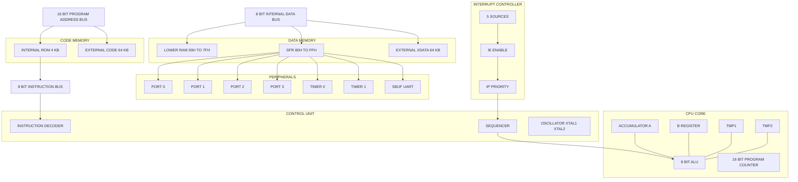
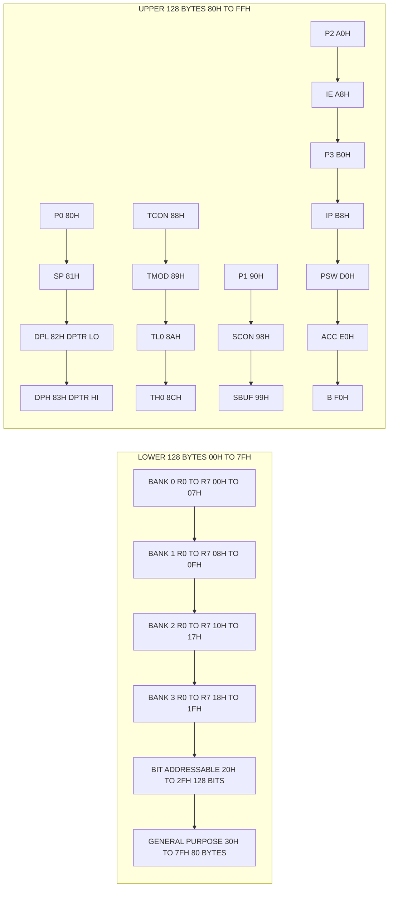
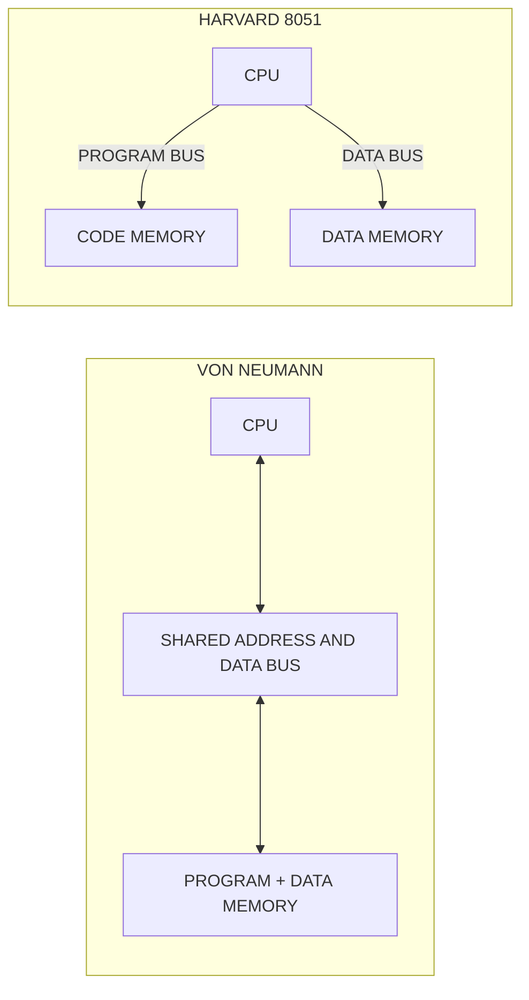
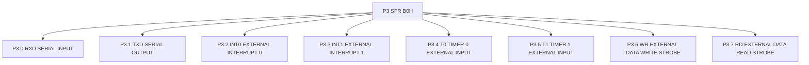

# 8051 architectural block diagrams, internal RAM/ROM layout mapping

<!-- SECTION_1_START -->
# 8051 Architectural Block Diagrams, Internal RAM/ROM Layout Mapping

## 1.1 Formal Definition (KTU 2024 Syllabus Terminology)

The **Intel 8051** is an **8-bit Harvard architecture** CISC microcontroller introduced by Intel in 1980. It segregates **program memory (ROM/Code)** and **data memory (RAM)** into physically separate address and data buses, enabling simultaneous fetch of instruction and operand in a single machine cycle. The standard 8051 die contains an **8-bit ALU**, **4 KB of on-chip mask-programmed ROM**, **128 bytes of on-chip RAM**, four **8-bit bidirectional I/O ports (P0–P3)**, two **16-bit Timer/Counters**, a **full-duplex programmable UART (SBUF)**, a **5-source / 2-priority nested interrupt controller**, and on-chip **oscillator and clock circuitry**.

> [!IMPORTANT]
> **KTU 2024 Emphasis (PECST501 Module 1):** Students must master the *complete internal memory map* ($00\text{H}$–$FF\text{H}$), the **PSW register bank selection logic**, and the **SFR addressability rules** because every subsequent assembly/module answer presupposes them.

## 1.2 Conceptual Analogy / Intuition

Imagine a small **post office with two separate wings**:
* **Wing A (ROM Wing):** Houses the *rule book* (program code). Customers (CPU) can only **read** the rules; they cannot edit them. Books are arranged in numbered shelves from $0000$ to $0FFF$ (4 KB). A separate corridor allows the librarian (PC) to fetch the next rule while the cashier is computing the bill.
* **Wing B (RAM Wing):** The *working desk* with 128 small drawers ($00$–$7F$) for temporary files and 128 special labelled drawers ($80$–$FF$) called **SFRs** that control printers, timers, and serial ports.
* **Two separate corridors** (buses) mean the librarian and cashier work **in parallel** → this is the **Harvard advantage** over Von Neumann.

> [!NOTE]
> **Key constants to memorize for KTU exams:**
> * Internal ROM = **4 KB** ($0000$–$0FFF_{\text{H}}$)
> * Internal RAM = **128 B** ($00$–$7F_{\text{H}}$)
> * SFR region = **128 B** ($80$–$FF_{\text{H}}$)
> * External memory addressable = **64 KB code + 64 KB data** ($0000$–$FFFF_{\text{H}}$ each)
> * Machine cycle = **12 oscillator periods**
> * Clock frequency range = **1.2 MHz – 12 MHz**

## 1.3 Block-Level Architectural Overview

The 8051 consists of the following functional blocks connected via internal buses:

1. **Central Processing Unit (CPU)** containing the **8-bit ALU**, **Accumulator (A)**, **B register**, **TMP1 & TMP2** hidden registers, and the **Program Counter (PC, 16-bit)**.
2. **Oscillator & Clock Circuit** with **XTAL1 / XTAL2** pins.
3. **ROM (4 KB)** with its dedicated **16-bit Program Address Bus** and **8-bit Instruction Bus**.
4. **RAM (128 B) + SFR (128 B)** with a **8-bit internal data bus** and **16-bit Data Address Bus** demultiplexed via **SFR Bus Control**.
5. **Four I/O Ports** P0–P3, each 8 bits, with **latches**, **drivers**, and **read pins**.
6. **Two 16-bit Timers/Counters** (T0, T1) with mode & control registers.
7. **Serial Port Interface** containing **SBUF** (Transmit + Receive), **SCON**, and the **UART engine**.
8. **Interrupt Control** unit: **5 sources** ($\overline{\text{INT0}}$, $\overline{\text{INT1}}$, T0, T1, Serial Port) with **2 priority levels** managed by the **IP** and **IE** registers.
9. **PSW** (Program Status Word) and **SP** (Stack Pointer) registers.

> [!VISUALIZATION CONTROL]
> **Concept:** Internal RAM Byte Map with bit-addressable region highlighted.
> **GeoGebra / Desmos Input Equations:**
> * List of points: $(0, 1)$, $(31, 1)$, $(32, 2)$, $(47, 2)$, $(48, 3)$, $(127, 3)$
> * x-axis = Hexadecimal address $0$ to $127$
> * y-axis = Region (1=Register Banks, 2=Bit-Addr, 3=General Purpose)
> **Visual Description:** A horizontal bar segmented into three colored zones: a low region of 32 bytes split into 4 equal sub-zones (banks), a 16-byte bit-addressable strip, and a large 80-byte general-purpose zone. The SFRs ($80$–$FF_{\text{H}}$) are shown as a separate parallel bar above.

<!-- SECTION_1_END -->

<!-- SECTION_2_START -->
# 2. Deep Theoretical Analysis & KTU High-Yield Formula Sheet

## 2.1 Internal RAM Layout (Lower 128 Bytes: $00_{\text{H}}$–$7F_{\text{H}}$)

The lower 128-byte internal RAM is divided into **three functional zones**:

### 2.1.1 Register Banks ($00_{\text{H}}$ – $1F_{\text{H}}$, 32 bytes)
* Contains **4 banks** of **8 registers** each, named **R0–R7**.
* Selection of the active bank is controlled by the **RS1** and **RS0** bits of the **PSW** register.
* **Default bank after RESET = Bank 0** (addresses $00_{\text{H}}$–$07_{\text{H}}$).

| PSW.4 (RS1) | PSW.3 (RS0) | Active Bank | Address Range | Registers |
| :---: | :---: | :---: | :---: | :---: |
| 0 | 0 | Bank 0 | $00_{\text{H}}$ – $07_{\text{H}}$ | R0–R7 |
| 0 | 1 | Bank 1 | $08_{\text{H}}$ – $0F_{\text{H}}$ | R0–R7 |
| 1 | 0 | Bank 2 | $10_{\text{H}}$ – $17_{\text{H}}$ | R0–R7 |
| 1 | 1 | Bank 3 | $18_{\text{H}}$ – $1F_{\text{H}}$ | R0–R7 |

### 2.1.2 Bit-Addressable Area ($20_{\text{H}}$ – $2F_{\text{H}}$, 16 bytes = 128 bits)
* The only internal RAM region that allows **single-bit instructions** like `SETB`, `CLR`, `ANL C, bit`.
* Bit addresses range from $00_{\text{H}}$ to $7F_{\text{H}}$ (independent of byte addresses).

### 2.1.3 General Purpose RAM ($30_{\text{H}}$ – $7F_{\text{H}}$, 80 bytes)
* Used for **scratch-pad variables, stack, and user data** accessed only by byte/indirect addressing.

## 2.2 Special Function Register (SFR) Map ($80_{\text{H}}$ – $FF_{\text{H}}$)

The upper 128-byte address space is **not** general RAM; it contains the **SFRs**. Only addresses ending in $0_{\text{H}}$ or $8_{\text{H}}$ are bit-addressable. **Important:** A read from an undefined SFR returns an indeterminate value.

| SFR | Address | Bit-Addr? | Function |
| :--- | :---: | :---: | :--- |
| **P0** | $80_{\text{H}}$ | Yes | Port 0 latch / AD0–AD7 / A0–A7 |
| **SP** | $81_{\text{H}}$ | No | Stack Pointer (RESET = $07_{\text{H}}$) |
| **DPL** | $82_{\text{H}}$ | No | Data Pointer Low |
| **DPH** | $83_{\text{H}}$ | No | Data Pointer High |
| **PCON** | $87_{\text{H}}$ | No | Power Control |
| **TCON** | $88_{\text{H}}$ | Yes | Timer/Counter Control |
| **TMOD** | $89_{\text{H}}$ | No | Timer/Counter Mode |
| **TL0** | $8A_{\text{H}}$ | No | Timer 0 Low |
| **TL1** | $8B_{\text{H}}$ | No | Timer 1 Low |
| **TH0** | $8C_{\text{H}}$ | No | Timer 0 High |
| **TH1** | $8D_{\text{H}}$ | No | Timer 1 High |
| **P1** | $90_{\text{H}}$ | Yes | Port 1 latch |
| **SCON** | $98_{\text{H}}$ | Yes | Serial Port Control |
| **SBUF** | $99_{\text{H}}$ | No | Serial Data Buffer |
| **P2** | $A0_{\text{H}}$ | Yes | Port 2 latch / A8–A15 |
| **IE** | $A8_{\text{H}}$ | Yes | Interrupt Enable |
| **P3** | $B0_{\text{H}}$ | Yes | Port 3 latch / alternate fns |
| **IP** | $B8_{\text{H}}$ | Yes | Interrupt Priority |
| **PSW** | $D0_{\text{H}}$ | Yes | Program Status Word |
| **ACC** | $E0_{\text{H}}$ | Yes | Accumulator |
| **B** | $F0_{\text{H}}$ | Yes | B register (MUL/DIV) |

> [!NOTE]
> **Bit addresses $80_{\text{H}}$–$FF_{\text{H}}$** (in the SFR region) are *different* from bit addresses $00_{\text{H}}$–$7F_{\text{H}}$ (in the bit-addressable RAM). Always specify the region when interpreting a bit address.

## 2.3 PSW (Program Status Word) – The Heart of Status

$$ \text{PSW} = \underbrace{CY}_{D7} \; \underbrace{AC}_{D6} \; \underbrace{F0}_{D5} \; \underbrace{RS1}_{D4} \; \underbrace{RS0}_{D3} \; \underbrace{OV}_{D2} \; \underbrace{-}_{D1} \; \underbrace{P}_{D0} $$

* **CY (Carry Flag):** Set on borrow/carry out of D7 during arithmetic; central to rotate/BCD ops.
* **AC (Auxiliary Carry):** Set on carry/borrow between D3 and D4 — required for **BCD correction** (DA A).
* **F0:** User-defined general-purpose flag.
* **RS1, RS0:** Register bank select (see table above).
* **OV (Overflow):** Set on signed arithmetic overflow.
* **P (Parity):** Hardware sets $=1$ if ACC has **odd** number of 1s (even parity maintained).

## 2.4 KTU Formula Sheet

| Parameter | Formula / Value | Units / Notes |
| :--- | :--- | :--- |
| Machine cycle period $T_{MC}$ | $T_{MC} = 12 / f_{\text{osc}}$ | seconds |
| Instruction cycle count | 1, 2 or 4 $T_{MC}$ (12, 24 or 48 osc. periods) | — |
| Timer tick frequency | $f_{\text{timer}} = f_{\text{osc}} / 12$ | Hz |
| Timer overflow (Mode 1) | $T_{\text{overflow}} = (65536 - \text{initial value}) \times 12 / f_{\text{osc}}$ | seconds |
| Baud rate (Mode 1, Timer 1, SMOD=0) | $\text{Baud} = f_{\text{osc}} / (32 \times 12 \times (256 - \text{TH1}))$ | bps |
| Internal RAM size | $128$ bytes ($00_{\text{H}}$–$7F_{\text{H}}$) | — |
| SFR size | $128$ bytes ($80_{\text{H}}$–$FF_{\text{H}}$) | — |
| Total internal data space | $256$ bytes ($00_{\text{H}}$–$FF_{\text{H}}$) | Dual-mapped with SFRs |
| External code / data memory | $64$ KB each | $\overline{\text{EA}}$ pin selects |
| Reset vector | $0000_{\text{H}}$ | — |
| Each interrupt vector | 8 bytes only | from $0003_{\text{H}}$ onwards |
| Stack Pointer reset value | $07_{\text{H}}$ | First push goes to $08_{\text{H}}$ |
| Number of interrupts | $5$ sources, $2$ priority levels | — |

## 2.5 Real-World Engineering Utility

* **8051 derivatives (AT89C51, P89V51RD2, CC2530)** power **industrial PLCs, washing-machine controllers, automotive ECUs (older models), IR remote decoders, smart energy meters, and RFID readers** because of deterministic timing and low cost.
* The **Harvard separation** is leveraged in modern DSPs and ARM Cortex-M controllers — the conceptual root of *Code vs Data bus isolation* is a KTU high-yield theme.
* The **bit-addressable RAM** is the architectural basis of *software UARTs* (banging) and *Boolean processors* in PLCs.

<!-- SECTION_2_END -->

<!-- SECTION_3_START -->
# 3. Step-by-Step Derivations, Address Computations & Code Implementation

## 3.1 Derivation: How Bit Addresses are Computed in the $20_{\text{H}}$–$2F_{\text{H}}$ Region

The 16 bytes from $20_{\text{H}}$ to $2F_{\text{H}}$ yield bit addresses $00_{\text{H}}$–$7F_{\text{H}}$ using:

$$ \text{Bit address} = ( \text{byte address} - 20_{\text{H}} ) \times 8 + \text{bit position} $$

### Worked Example
Find the bit address of bit position 3 of byte $2A_{\text{H}}$.

$$ \text{Byte address offset} = 2A_{\text{H}} - 20_{\text{H}} = 0A_{\text{H}} = 10_{10} $$

$$ \text{Bit address} = (10 \times 8) + 3 = 80 + 3 = 83_{10} = 53_{\text{H}} $$

So `SETB 53H` sets bit 3 of byte $2A_{\text{H}}$.

> [!NOTE]
> **Reusable Python utility** for converting a (byte, bit) pair in the bit-addressable region to a bit-address:
```python
def bit_addr_in_bit_region(byte_addr: int, bit_pos: int) -> int:
    """Convert (byte_addr, bit_pos) in 0x20-0x2F to a 0x00-0x7F bit address."""
    if not (0x20 <= byte_addr <= 0x2F):
        raise ValueError("byte_addr must lie between 0x20 and 0x2F")
    if not (0 <= bit_pos <= 7):
        raise ValueError("bit_pos must lie between 0 and 7")
    return (byte_addr - 0x20) * 8 + bit_pos

print(hex(bit_addr_in_bit_region(0x2A, 3)))  # -> 0x53
```

## 3.2 Derivation: Stack Address after each PUSH

The 8051 stack grows **upward** (towards higher addresses), and the **SP is incremented *before* the byte is stored**. After RESET, $\text{SP} = 07_{\text{H}}$.

### Worked Example
Trace SP after three `PUSH` operations starting from the default.

$$ \text{SP after 1st PUSH} = 07_{\text{H}} + 1 = 08_{\text{H}} $$
$$ \text{SP after 2nd PUSH} = 08_{\text{H}} + 1 = 09_{\text{H}} $$
$$ \text{SP after 3rd PUSH} = 09_{\text{H}} + 1 = 0A_{\text{H}} $$

If the user initializes `MOV SP, #70H` first, the first PUSH stores at $71_{\text{H}}$, saving the lower register banks from being clobbered — a KTU exam favourite.

## 3.3 Derivation: Mapping Register Bank Selection to PSW

To activate **Bank 2** (addresses $10_{\text{H}}$–$17_{\text{H}}$) we need RS1=1, RS0=0, i.e., bits D4D3 of PSW = `10`. We must preserve other PSW bits.

$$ \text{ANL PSW, \#0E7H} \quad \text{// clear D4, D3} $$
$$ \text{ORL PSW, \#10H} \quad \text{// set D4, keep D3 cleared} $$

Equivalent single instruction using bit-addressing:

$$ \text{SETB RS1} \quad ; \; \text{RS1 bit address} = D4_{\text{H}} = 0D4_{\text{H}} $$
$$ \text{CLR RS0} \quad \; ; \; \text{RS0 bit address} = D3_{\text{H}} = 0D3_{\text{H}} $$

> [!IMPORTANT]
> KTU examiners often give a numerical value of PSW (e.g., "If `PSW = 0C8H`, which bank is active?") — decode to binary first.

### Example: Decode `PSW = 0C8H`
$$ 0C8_{\text{H}} = 1100\,1000_{2} $$

| Bit | D7 | D6 | D5 | D4 | D3 | D2 | D1 | D0 |
| :---: | :---: | :---: | :---: | :---: | :---: | :---: | :---: | :---: |
| Name | CY | AC | F0 | RS1 | RS0 | OV | – | P |
| Value | 1 | 1 | 0 | 0 | 1 | 0 | 0 | 0 |

So $\text{RS1 RS0} = 01 \Rightarrow$ **Bank 1** is active, $\text{CY}=1$, $\text{AC}=1$.

## 3.4 Exhaustive C-like Simulation of Memory Read

```c
#include <stdio.h>
#include <stdint.h>

/* Simulated 8051 internal data memory (256 bytes) */
static uint8_t IDATA iram[256] = {0};

/* SFR region is mapped into the upper 128 bytes with explicit SFR structs */
typedef struct {
    uint8_t P0;   uint8_t SP;   uint8_t DPL;  uint8_t DPH;
    uint8_t _r[4]; uint8_t PCON; uint8_t TCON; uint8_t TMOD;
    uint8_t TL0;  uint8_t TL1;  uint8_t TH0;  uint8_t TH1;
    /* ...remaining SFRs omitted for brevity */
} SFR_t;
static SFR_t SFR; /* symbolically overlays iram[0x80..] */

void mem_write(uint16_t addr, uint8_t val) {
    if (addr < 0x80) {
        iram[addr] = val;
    } else if ((addr & 0x80) && !(addr & 0x07)) {
        /* SFR write (only valid addresses accepted) */
        ((uint8_t *)&SFR)[addr - 0x80] = val;
    } else {
        fprintf(stderr, "ERR: undefined SFR write at 0x%02X\n", addr);
    }
}

uint8_t mem_read(uint16_t addr) {
    if (addr < 0x80) return iram[addr];
    if (addr >= 0x80) return ((uint8_t *)&SFR)[addr - 0x80];
    return 0xFF; /* undefined */
}
```

## 3.5 Symbol-by-Symbol Memory-Map Visual Encoding

| Address Range | Region | Width | Access Type |
| :--- | :--- | :---: | :--- |
| $0000_{\text{H}}$ – $0FFF_{\text{H}}$ | Internal ROM (Code) | 4 KB | Instruction fetch only |
| $0000_{\text{H}}$ – $FFFF_{\text{H}}$ (external) | External Code Memory | 64 KB | $\overline{\text{PSEN}}$ controlled |
| $0000_{\text{H}}$ – $00FF_{\text{H}}$ | Internal Data (RAM) | 256 B | SFR-mapped upper half |
| $0000_{\text{H}}$ – $7F_{\text{H}}$ | Lower 128 B (direct/indirect) | 128 B | `MOV A, direct` or `MOV A, @R0` |
| $80_{\text{H}}$ – $FF_{\text{H}}$ (SFR) | SFR region | 128 B | Only **direct addressing** |
| $0000_{\text{H}}$ – $FFFF_{\text{H}}$ (external) | External Data (XDATA) | 64 KB | `MOVX` instructions only |

> [!IMPORTANT]
> The SFR region is reachable **only with direct addressing** in the original 8051. Indirect addressing via `@R0` with addresses $\geq 80_{\text{H}}$ is **not legal** and reads indeterminate data — this is a KTU favourite *trick question*.

## 3.6 Symbolic Trace of `MOV P1, A` and `ANL P1, #0FH`

| Step | Mnemonic | Bus Activity | Result |
| :---: | :--- | :--- | :--- |
| 1 | `MOV A, #55H` | Internal data bus, SFR bus | $\text{ACC} = 55_{\text{H}}$ |
| 2 | `MOV P1, A` | SFR write, port latch update | $\text{P1 latch} = 55_{\text{H}}$ |
| 3 | `ANL P1, #0FH` | SFR read-modify-write | $\text{P1} = 55_{\text{H}} \mathbin{\&} 0F_{\text{H}} = 05_{\text{H}}$ |

**Read-Modify-Write caveat:** Instructions like `ANL P1`, `INC P1`, `CPL P3.3` read the **latch**, not the pin — a fundamental KTU concept for solving *port-latch vs pin* interview questions.

<!-- SECTION_3_END -->

<!-- SECTION_4_START -->
# 4. Structural Diagrams & Schematics (Mermaid Architecture Topology)

## 4.1 Top-Level 8051 Internal Block Diagram



## 4.2 Internal RAM / SFR Memory Map Topology



## 4.3 Bus Architecture (Harvard vs Von Neumann)



> [!NOTE]
> **Why Harvard matters in 8051:** The dedicated program bus means a **single-cycle instruction fetch** in parallel with operand access, giving a deterministic 1-µs machine cycle at 12 MHz. This is the same architectural reason modern ARM Cortex-M and RISC-V controllers (e.g., ESP32) maintain *separate* I-bus and D-bus.

## 4.4 Port 3 Alternate Function Matrix



<!-- SECTION_4_END -->

<!-- SECTION_5_START -->
# 5. KTU 2024 Scheme Examination Question Bank & Topic Recap

## 5.1 Part A — Short Answer (3 Marks Each)

### Question 1 `[KTU University Exam – Dec 2023]`
**(CO1, Remember)** List the four I/O ports of the 8051 and state one alternate function of Port 3.

**Model Answer (3 marks):**
* **P0** – 8-bit bidirectional port, also serves as multiplexed lower-order address/data bus (AD0–AD7) when external memory is accessed. *(1 mark)*
* **P1** – 8-bit bidirectional port with no alternate function on standard 8051. *(0.5 mark)*
* **P2** – 8-bit bidirectional port, supplies the high-order address byte (A8–A15) for external memory. *(0.5 mark)*
* **P3** – 8-bit bidirectional port; alternate functions are RXD, TXD, $\overline{\text{INT0}}$, $\overline{\text{INT1}}$, T0, T1, $\overline{\text{WR}}$, $\overline{\text{RD}}$. *(1 mark)*

### Question 2 `[KTU University Exam – July 2024]`
**(CO1, Understand)** Differentiate between the internal RAM regions $00_{\text{H}}$–$1F_{\text{H}}$ and $20_{\text{H}}$–$2F_{\text{H}}$ with respect to addressability.

**Model Answer (3 marks):**
| Aspect | $00_{\text{H}}$–$1F_{\text{H}}$ | $20_{\text{H}}$–$2F_{\text{H}}$ |
| :--- | :--- | :--- |
| Size | 32 bytes | 16 bytes (128 bits) |
| Purpose | Four register banks R0–R7 | Bit-addressable scratch pad |
| Addressability | Byte only via `R0`–`R7` mnemonics | Both byte **and** individual bit |
| Bit-address range | None | $00_{\text{H}}$–$7F_{\text{H}}$ |
| Selection control | RS1, RS0 in PSW | Direct bit instructions |

*(1 mark for the table, 2 marks for accurate explanation.)*

## 5.2 Part B — Full 14-Mark Question (Internal Choice Provided)

### **Question A (14 Marks)** `[KTU University Exam – July 2023]`

**(a) (7 marks)** With a neat diagram, explain the internal block diagram of the 8051 microcontroller. Identify the functions of the PSW, SP and DPTR registers.

**(b) (7 marks)** Draw the internal RAM structure of 8051, clearly indicating the four register banks, the bit-addressable area and the general-purpose area. If `PSW = 0D4H`, determine the currently active register bank and the value of the parity flag after the instruction `MOV A, #3AH`.

---

#### Model Solution for (a)

**Block Diagram (described textually – 4 marks):**
* CPU block: ALU, A, B, TMP1, TMP2, PC. *(1 mark)*
* Separate program and data memory with their buses. *(1 mark)*
* Four I/O ports P0–P3, two timers, UART, and interrupt controller. *(1 mark)*
* Oscillator and timing block generating the machine cycle. *(1 mark)*

**Register functions (3 marks):**
* **PSW ($D0_{\text{H}}$):** Holds carry, auxiliary carry, overflow, parity flags and the RS1, RS0 bits selecting the active register bank. *(1 mark)*
* **SP ($81_{\text{H}}$):** 8-bit stack pointer pointing to the last used RAM location; reset to $07_{\text{H}}$ and *incremented before* PUSH. *(1 mark)*
* **DPTR ($82_{\text{H}}$–$83_{\text{H}}$):** 16-bit data pointer combining DPL and DPH; used for accessing external data memory and look-up tables in code memory via `MOVC`. *(1 mark)*

#### Model Solution for (b)

**Internal RAM Diagram (3 marks):** Draw the 128-byte bar with the four $8$-byte register banks from $00_{\text{H}}$ to $1F_{\text{H}}$, the $16$-byte bit-addressable region from $20_{\text{H}}$ to $2F_{\text{H}}$, and the $80$-byte general-purpose area from $30_{\text{H}}$ to $7F_{\text{H}}$. *(3 marks)*

**PSW Decode for `PSW = 0D4H` (2 marks):**
$$ 0D4_{\text{H}} = 1101\,0100_{2} \;\Rightarrow\; \text{RS1}=1, \text{RS0}=0 $$
$$ \therefore \text{Active Bank} = \textbf{Bank 2 (addresses } 10_{\text{H}}\textbf{–}17_{\text{H}}\textbf{)} \quad \text{[2 marks]} $$

**Parity Flag Computation (2 marks):**
$$ \text{ACC} = 3A_{\text{H}} = 0011\,1010_{2} \;\Rightarrow\; \text{Number of 1s} = 4 \text{ (even)} $$
$$ \text{Since 8051 maintains EVEN parity,} \quad \boxed{\text{P} = 0} \quad \text{[2 marks]} $$

---

### **Question B (14 Marks – ALTERNATIVE)** `[KTU University Exam – Dec 2022]`

**(a) (7 marks)** Describe the Special Function Register (SFR) memory map of 8051. List any six SFRs with their addresses and primary functions.

**(b) (7 marks)** Explain the significance of the Harvard architecture in 8051. Compute the bit address of bit position 5 of byte $26_{\text{H}}$, and the new stack pointer value after the following sequence (assume `SP = 07H` initially):
```
PUSH ACC
PUSH PSW
PUSH 30H
```

---

#### Model Solution for (a)

**SFR Map Description (2 marks):**
* Occupies upper 128 bytes ($80_{\text{H}}$–$FF_{\text{H}}$). *(0.5 mark)*
* Access by **direct addressing only**; `@R0`/`@R1` indirect addressing is illegal. *(0.5 mark)*
* Bit-addressable SFRs are those whose addresses end in $0$ or $8$. *(0.5 mark)*
* Reading undefined SFRs returns indeterminate data. *(0.5 mark)*

**Six SFR Table (5 marks – 0.83 each):**

| SFR | Address | Function |
| :--- | :---: | :--- |
| ACC | $E0_{\text{H}}$ | Accumulator for ALU ops |
| B | $F0_{\text{H}}$ | Used by MUL AB and DIV AB |
| PSW | $D0_{\text{H}}$ | Program status word / flags |
| SP | $81_{\text{H}}$ | Stack pointer (RESET = $07_{\text{H}}$) |
| DPTR | $82_{\text{H}}$/$83_{\text{H}}$ | 16-bit data pointer |
| P0 | $80_{\text{H}}$ | Port 0 latch and bus |
| SCON | $98_{\text{H}}$ | Serial control register |

*(Any six correct entries award full 5 marks.)*

#### Model Solution for (b)

**Harvard Significance (3 marks):**
* Separate physical buses for code (PSEN-controlled) and data (RD/WR-controlled). *(1 mark)*
* Allows **simultaneous instruction fetch + operand access** in 1 machine cycle. *(1 mark)*
* Eliminates the *von Neumann bottleneck* and provides deterministic execution. *(1 mark)*

**Bit Address of bit 5 of byte $26_{\text{H}}$ (2 marks):**
$$ (0x26 - 0x20) \times 8 + 5 = 6 \times 8 + 5 = 48 + 5 = 53_{10} = 35_{\text{H}} $$
$$ \boxed{\text{Bit address} = 35_{\text{H}}} \quad \text{[2 marks]} $$

**Stack Pointer Evolution (2 marks):**
$$ \text{PUSH ACC: SP} = 07_{\text{H}} + 1 = 08_{\text{H}} $$
$$ \text{PUSH PSW: SP} = 08_{\text{H}} + 1 = 09_{\text{H}} $$
$$ \text{PUSH } 30_{\text{H}}\text{: SP} = 09_{\text{H}} + 1 = 0A_{\text{H}} $$
$$ \boxed{\text{Final SP} = 0A_{\text{H}}} \quad \text{[2 marks]} $$

---

> [!WARNING]
> **KTU Examiner's Valuation Warning / Common Pitfalls:**
> 1. **Stack direction mistake** — the 8051 stack grows **upwards** (SP *increments* before PUSH). Writing "SP = 06H after one PUSH" costs 2 marks.
> 2. **PSW parity confusion** — the 8051 `P` flag is set to 1 only if the number of 1s in ACC is **odd** (even parity convention). Misinterpreting this loses the entire parity sub-question.
> 3. **Bit address region confusion** — bit addresses $00_{\text{H}}$–$7F_{\text{H}}$ refer to *internal RAM* $20_{\text{H}}$–$2F_{\text{H}}$, **not** SFRs. SFR bit addresses occupy $80_{\text{H}}$–$FF_{\text{H}}$.
> 4. **SFR indirect addressing** — writing `MOV A, @R0` with R0 $\geq 80_{\text{H}}$ is illegal. A common deduction.
> 5. **Always mention "Harvard vs Von Neumann"** when asked architecture types; examiners award 2 marks for the comparison line.
> 6. **Reset vector** is `$0000_{\text{H}}$`; not `$0003_{\text{H}}$` (that's the first external interrupt vector).
> 7. **Stack Pointer reset value** is `$07_{\text{H}}$, not $08_{\text{H}}$ — the *first* PUSH writes at $08_{\text{H}}$.

---

## 5.3 Topic Recap & Important Things to Remember

* **8051 = 8-bit Harvard CISC** microcontroller, 12-oscillator-period machine cycle.
* **Internal ROM = 4 KB** ($0000$–$0FFF_{\text{H}}$); **Internal RAM = 128 B** ($00$–$7F_{\text{H}}$).
* **Lower RAM layout:** 4 register banks ($00$–$1F_{\text{H}}$) → bit-addressable area ($20$–$2F_{\text{H}}$, bit addresses $00$–$7F_{\text{H}}$) → general-purpose RAM ($30$–$7F_{\text{H}}$).
* **SFR map** ($80$–$FF_{\text{H}}$) accessed only by **direct addressing**; bit-addressable SFRs are those ending in $0/8$.
* **PSW** holds CY, AC, F0, RS1, RS0, OV, –, P; **RS1/RS0** choose register bank; **P** = 1 if ACC has odd number of 1s.
* **SP** = $07_{\text{H}}$ on RESET; grows *upwards*; PUSH increments *before* storing.
* **DPTR** is a 16-bit pair (DPL+DPH) used by `MOVX` and `MOVC A, @A+DPTR`.
* **Port 3** alternate functions: RXD, TXD, $\overline{\text{INT0}}$, $\overline{\text{INT1}}$, T0, T1, $\overline{\text{WR}}$, $\overline{\text{RD}}$.
* **Reset vector** = $0000_{\text{H}}$; five interrupt vectors occupy 8 bytes each starting at $0003_{\text{H}}$.
* **Read-Modify-Write** instructions (ANL Px, ORL Px, INC Px, CPL Px.y) operate on the **latch, not the pin**.
* **Harvard advantage:** simultaneous instruction fetch + operand access → deterministic 1 µs cycle at 12 MHz.
* **Indirect addressing** via `@R0/@R1` is restricted to addresses $00$–$7F_{\text{H}}$; for SFRs use **direct addressing** like `MOV A, 90H`.
* **Bit address formula:** $\text{bit\_addr} = (\text{byte\_addr} - 0x20) \times 8 + \text{bit\_pos}$ in the $20$–$2F_{\text{H}}$ region.
* **Memorize SFR addresses:** P0=$80$, SP=$81$, P1=$90$, P2=$A0$, P3=$B0$, PSW=$D0$, ACC=$E0$, B=$F0$, IP=$B8$, IE=$A8$, SCON=$98$, SBUF=$99$, TCON=$88$, TMOD=$89$.
* **2 priority levels** in IP register; higher priority interrupts can preempt lower ones (nested interrupts).
* **External memory:** code memory uses $\overline{\text{PSEN}}$ strobe; external data memory uses $\overline{\text{RD}}$ and $\overline{\text{WR}}$ strobes (Port 3 lines) plus $\overline{\text{EA}}$ pin to enable/disable internal ROM.
* **Total addressable memory:** 64 KB code (internal+external, exclusive) + 64 KB XDATA + 256 B IDATA — yielding a unified logical 8051 memory model widely used by Keil µVision and SDCC compilers.

<!-- SECTION_5_END -->
