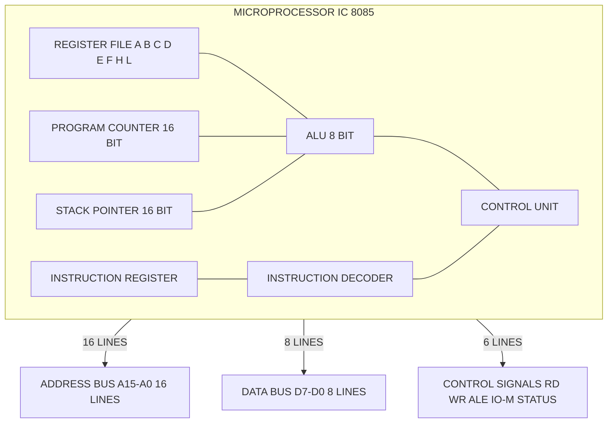
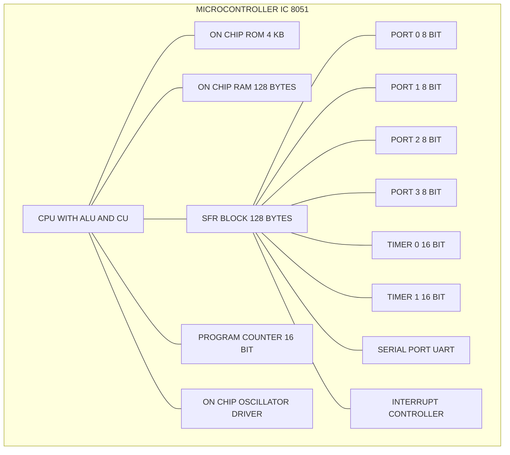
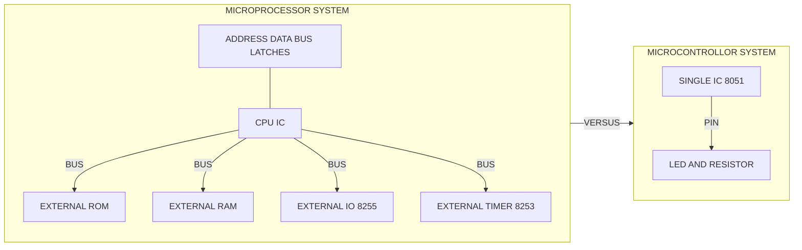
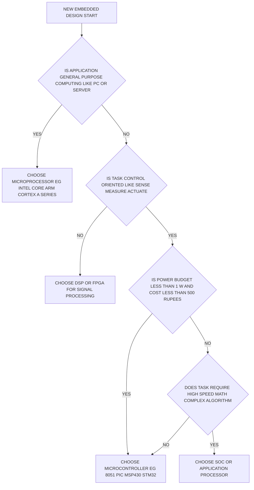

# Comparison between microprocessors and microcontrollers

<!-- SECTION_1_START -->

# Comparison Between Microprocessors and Microcontrollers

## 1. Core Technical Definition (KTU 2024 Syllabus Terminology)

### Microprocessor
A **microprocessor** is a single-chip, general-purpose, programmable Central Processing Unit (CPU) that contains only the **Arithmetic Logic Unit (ALU)**, **Control Unit (CU)**, and **register array** on a single Integrated Circuit (IC). It has **no on-chip memory** and **no on-chip peripherals**. All memory, I/O ports, timers, and interfacing logic must be connected externally through the system bus.

> [!IMPORTANT]
> **KTU Board Definition (PECST501 - Module 1):** A microprocessor is a "CPU on a chip" that depends entirely on **external** circuitry (external RAM, ROM, I/O controllers, and address/data/control buses) to function as a complete computing system. Common examples include the **Intel 8085 (8-bit)**, **Intel 8086 (16-bit)**, and **Intel Core i7 (64-bit)**.

### Microcontroller
A **microcontroller** is a single-chip, special-purpose, programmable computer that integrates a **CPU**, **fixed amount of RAM**, **ROM/Flash program memory**, **parallel I/O ports**, **timers/counters**, **serial communication port (UART)**, and often **ADC/DAC** and **interrupt controller**, all on a single silicon die. It is also called a "**System on Chip (SoC)**" in embedded terminology.

> [!IMPORTANT]
> **KTU Board Definition (PECST501 - Module 1):** A microcontroller is a "computer-on-a-chip" designed for a **specific control-oriented task**. The 8051 (8-bit), PIC16F877, and ARM Cortex-M0 are canonical examples. It trades raw computational throughput for **low cost**, **low power**, **high integration**, and **deterministic real-time response**.

---

## 2. Conceptual Analogy / Intuition

### 🍳 The Kitchen Analogy
Imagine you are building a kitchen to cook food:

| Component Analogy | Microprocessor | Microcontroller |
|---|---|---|
| The Chef (Brain) | The CPU chip alone | The CPU chip |
| The Recipe Book | External ROM chip | Built-in ROM inside the chip |
| The Pantry | External RAM chip | Built-in RAM inside the chip |
| The Gas Stove & Oven | External peripherals | Built-in timers and ADCs |
| The Delivery Window | External I/O controller | Built-in I/O ports |

- A **microprocessor** is like giving someone **just the chef** — you must buy and install a pantry, a recipe book, a stove, and a serving window yourself. This is powerful and flexible (you can build a 5-star restaurant or a roadside stall), but expensive and bulky.
- A **microcontroller** is like delivering a **complete smart kitchen-in-a-box** — the chef, pantry, recipes, stove, and serving window all come pre-wired in one compact appliance. It is **task-specific, cheap, and immediately deployable** for embedded control.

### ⚙️ The Engineering Intuition
- A **microprocessor** is the **brain extracted from a body** — it can think brilliantly but cannot breathe, move, or sense without being connected to lungs, muscles, and nerves.
- A **microcontroller** is a **complete, self-sufficient organism** — a frog, an ant, or a thermostat — designed to perform one task reliably inside a larger system (e.g., the ant inside an anthill controlling its slice of the world).

---

## 3. Key Engineering Constants & Standards

The following are universally cited in KTU board examinations and must be memorized:

- **8085 Microprocessor:** 8-bit data bus, 16-bit address bus, addressable memory = **$2^{16} = 65{,}536$ bytes = 64 KB**, clock speed up to **5 MHz**, operates on a single **+5 V** supply.
- **8051 Microcontroller:** 8-bit ALU, 16-bit program counter, on-chip ROM = **4 KB**, on-chip RAM = **128 bytes**, four 8-bit I/O ports (P0, P1, P2, P3), two 16-bit timers, clock **11.0592 MHz** (standard baud-rate-friendly frequency).

> [!NOTE]
> **Why 11.0592 MHz for 8051?** This is the canonical crystal frequency because it is **exactly divisible by standard baud rates** (9600, 19200, 38400, etc.), producing a **0% serial communication error rate**. This is a classic KTU viva question.

> [!VISUALIZATION CONTROL]
> **Concept:** Coordinate-plane comparison of "Integration Density" vs "Computational Power"
> **Plot Equations / Points:**
> * `x_axis = Computational Power (MIPS)` from 0 to 3000
> * `y_axis = Integration Density (peripherals on-chip)` from 0 to 20
> * Point A (Microprocessor family): `(1500, 1)`, `(2500, 1)`, `(3000, 1)`
> * Point B (Microcontroller family): `(1, 8)`, `(5, 12)`, `(50, 18)`, `(200, 20)`
> **Visual Description:** The student should observe two distinct clusters — microprocessors plotted as **low-integration, high-performance** points (right-bottom), and microcontrollers plotted as **high-integration, lower-performance** points (left-top). The clear gap between the two clusters is filled by modern hybrid SoCs.

<!-- SECTION_1_END -->

<!-- SECTION_2_START -->

# Deep Theoretical Analysis & KTU High-Yield Formula Sheet

## 1. Architectural Decomposition — The "Why" Behind Each Component

### Why does a microprocessor need external memory?
A microprocessor is fabricated using a process optimized for **raw computational throughput**: deep pipelines, large register files, multi-GHz clocking. Adding memory on the same die would **inflate the die area**, **increase power consumption**, and **cap the addressable memory** (because pins dedicated to address bus must be exposed). Therefore, the architecture deliberately externalizes memory over a wide bus (e.g., 8086 has a **20-bit address bus** $\rightarrow 2^{20} = 1$ MB addressable).

### Why does a microcontroller integrate everything?
A microcontroller is fabricated for **control loops**, where the program is small (kilo-bytes, not mega-bytes) and data is generated by sensors (bytes, not giga-bytes). Integrating RAM, ROM, and I/O on-die:

1. **Reduces pin count** (multiplexed buses, serial peripherals) → cheaper packaging.
2. **Eliminates external bus timing hazards** → deterministic real-time behavior.
3. **Lowers EMI and power** → suitable for battery-operated IoT nodes.
4. **Shrinks PCB area** → enables devices like smart-watches and pacemakers.

---

## 2. KTU High-Yield Comparison Table (Cheat Sheet)

> [!IMPORTANT]
> This table is the **single most important artefact** for answering 14-mark questions in KTU ESE Module 1. Memorize every row.

| \# | Parameter | Microprocessor (e.g., 8085/8086) | Microcontroller (e.g., 8051) |
|---|---|---|---|
| 1 | **Core Function** | Pure CPU — computation only | Complete microcomputer — CPU + Memory + I/O |
| 2 | **On-chip Memory** | **None** — must be connected externally | ROM (4 KB) + RAM (128 bytes) on-chip |
| 3 | **On-chip Peripherals** | **None** — external I/O controllers, timers, UART chips | Timers, UART, I/O ports, interrupt controller on-chip |
| 4 | **External Buses** | Separate Address bus, Data bus, Control bus exposed on pins | Internal buses, only a few external pins needed |
| 5 | **Data Bus Width** | 8-bit (8085) / 16-bit (8086) / 64-bit (Core) | Mostly 8-bit (8051, PIC, AVR) |
| 6 | **Address Bus Width** | 16-bit (8085) / 20-bit (8086) | 16-bit (8051) → **64 KB** program + **64 KB** external data |
| 7 | **Instruction Set** | **CISC** (Complex Instruction Set Computer) — many addressing modes, variable-length instructions | Mixed; 8051 is **CISC-oriented** with 255 instructions, ARM Cortex-M is **RISC** (Thumb-2) |
| 8 | **Clock Frequency** | High: 3 GHz to 5 GHz typical | Low: 1 MHz to 200 MHz typical (8051 uses 11.0592 MHz) |
| 9 | **Power Consumption** | High: 15 W to 125 W (laptop / desktop CPUs) | Low: mW range, often $<$ 100 mW (sleep mode $<$ 1 µA) |
| 10 | **Cost** | High (₹5,000 to ₹50,000+) | Low (₹20 to ₹500 for 8051, ₹100 to ₹2,000 for ARM Cortex-M) |
| 11 | **Application Domain** | PCs, laptops, servers, workstations, gaming consoles | Washing machines, microwave ovens, ECU (cars), medical pumps, IoT sensors, robotics |
| 12 | **Real-time Determinism** | Weak — OS overhead, cache misses, interrupts non-deterministic | Strong — bare-metal, single-threaded, no cache (8051) |
| 13 | **Program Storage** | Loaded into external RAM/HDD by OS | Stored permanently in on-chip Flash/ROM |
| 14 | **Design Philosophy** | "**CPU only** — bring your own peripherals" | "**Everything inside** — just write your firmware" |
| 15 | **Bit-manipulation (Bit-addressable I/O)** | None (must use bit-mask logic) | Yes — 8051 has **16 bit-addressable RAM locations** and **bit-addressable SFRs** |
| 16 | **Interrupts** | External interrupt controller (8259) chip required | Built-in interrupt controller with fixed & programmable priority |
| 17 | **Expansion Capability** | Unlimited — just add more external chips | Limited by pin count and internal bus architecture |
| 18 | **Examples** | Intel 8085, 8086, 80286, Pentium, Core i7, AMD Ryzen | Intel 8051, 8052, Atmel AT89C51, PIC16F877, MSP430, STM32 |

> [!NOTE]
> **KTU Board Trick:** Examiners frequently ask students to identify whether a system is a "microprocessor-based" or "microcontroller-based" design. A simple heuristic: **if the IC has memory printed on its datasheet, it is a microcontroller; if it says "CPU only", it is a microprocessor.**

---

## 3. Real-World Engineering Utility

| Domain | Microprocessor Use | Microcontroller Use |
|---|---|---|
| **Personal Computing** | Laptops, desktops, gaming rigs (Intel i7, AMD Ryzen) | ❌ Not used — overkill in wrong direction |
| **Automotive** | Infotainment, ADAS, autonomous-driving compute (NVIDIA Jetson) | ECU for engine, ABS, airbags, window lifters (Infineon Aurix, NXP S32K) |
| **Industrial Automation** | PLC supervisory HMI, SCADA servers | Field-level PID controllers, motor drivers, sensor hubs (STM32, Arduino) |
| **Medical Devices** | MRI image reconstruction workstation | Insulin pump, hearing aid, ECG monitor, ventilator (PIC, MSP430) |
| **Consumer Electronics** | Smart TV main SoC, set-top box | Washing machine, microwave, remote control, toy |
| **IoT / Edge AI** | Edge gateways, AI accelerators | Sensor nodes, smart bulbs, wearables (ESP32, nRF52) |
| **Aerospace & Defence** | Mission computer, radar signal processor | Flight-control actuators, drone motor ESCs, parachute deployment |

---

## 4. KTU Frequently Asked Numerical Concepts

Although a comparison topic is mostly descriptive, KTU examiners sometimes expect a student to compute addressable memory, baud-rate error, or instruction-cycle timing. The relevant formulas are:

$$
\text{Addressable Memory (bytes)} \;=\; 2^{\,(\text{address bus width})}
$$

$$
\text{Baud Rate (8051 Timer 1 Mode 2)} \;=\; \frac{\text{Oscillator Frequency}}{32 \,\times\, 12 \,\times\, (256 - \text{TH1})}
$$

$$
\text{Instruction Cycle Time (8051)} \;=\; \frac{12}{\text{Oscillator Frequency}}
$$

$$
\text{MIPS (8051 at 11.0592 MHz)} \;=\; \frac{11.0592 \,\times\, 10^{6}}{12 \,\times\, 10^{6}} \;\approx\; 0.92 \; \text{MIPS}
$$

> [!TIP]
> **One-line Viva Answer:** "A microcontroller is a microprocessor *plus* memory *plus* peripherals, all on a single die, optimized for embedded control, not for general-purpose desktop computing."

<!-- SECTION_2_END -->

<!-- SECTION_3_START -->

# Step-by-Step Derivations & Code Implementation

## 1. Architectural Derivation: From CPU to Microcontroller

We will explicitly derive the **block-level transformation** that turns a bare microprocessor into a microcontroller. This is a standard KTU 14-mark long-answer structure.

### Step 1 — The Bare Microprocessor Block

A microprocessor IC contains only the CPU core:

$$
\text{MP} \;=\; \{\text{ALU},\; \text{CU},\; \text{Register File},\; \text{Program Counter},\; \text{Stack Pointer}\}
$$

External pins expose the buses:

$$
\{\text{Address Bus } A_{15..0},\; \text{Data Bus } D_{7..0},\; \text{Control Signals } \overline{\text{RD}},\; \overline{\text{WR}},\; \text{ALE},\; \overline{\text{IO/M}}\}
$$

### Step 2 — External Memory Must Be Added

To execute any program, the system designer must add **at least 3 external ICs** (in 8085 case):

1. **ROM/EPROM** for program storage (e.g., 2732 — 4 KB).
2. **RAM** for data storage (e.g., 6116 — 2 KB).
3. **Address latch** (e.g., 74LS373) to demultiplex the address/data bus.

### Step 3 — External Peripherals Must Be Added

To sense and control the real world, the designer must add:

1. **I/O port** (e.g., 8255 PPI — Programmable Peripheral Interface).
2. **Timer/Counter** (e.g., 8253/8254).
3. **Serial UART** (e.g., 8251 USART).
4. **Interrupt controller** (e.g., 8259 PIC).

### Step 4 — Address Decoding Logic

For the above to work without bus conflicts, **address decoding glue logic** is mandatory:

$$
\overline{\text{CS}_{\text{ROM}}} \;=\; \text{NOT}\bigl(A_{15} \cdot \overline{A_{14}} \cdot \overline{A_{13}} \cdot \ldots \cdot \overline{A_{11}}\bigr)
$$

This single Boolean expression, implemented using 74LS138 (3-to-8 decoder) gates, often consumes a full PCB.

### Step 5 — Integration into a Microcontroller

The microcontroller manufacturer takes the above 7–8 chips, **shrinks them onto a single silicon die**, and exposes only the truly external pins (the I/O port lines and power). The result:

$$
\text{MC} \;=\; \text{MP} \;+\; \text{ROM} \;+\; \text{RAM} \;+\; \text{I/O} \;+\; \text{Timer} \;+\; \text{UART} \;+\; \text{Interrupt Ctrl} \;+\; \text{Clock}
$$

The Boolean expression from Step 4 is **hard-wired inside the chip**, invisible to the designer. Hence, a microcontroller reduces a 200-component design to a 1-component design.

> [!NOTE]
> **KTU Valuation Key Point (4 Marks):** The examiner awards marks for explicitly listing the external chips and stating the bus interface signals ($A_{15..0}$, $D_{7..0}$, $\overline{\text{RD}}$, $\overline{\text{WR}}$, ALE, IO/M). Skipping these signals costs 1 mark.

---

## 2. Code Implementation: The Same Algorithm on Both Architectures

The following comparison shows **blinking an LED once per second** on both an 8085 microprocessor-based system and an 8051 microcontroller-based system. The difference in code length, complexity, and external hardware clearly demonstrates the comparison topic.

### A. 8085 Microprocessor Assembly (requires external 8255 PPI)

```asm
; ============================================================
; 8085 ASSEMBLY - LED blink using EXTERNAL 8255 PPI
; Assumes Port A of 8255 mapped to address C0H
; ============================================================
        ORG 2000H          ; Program origin in external ROM

START:  MVI A, 80H         ; Load 1000 0000b into Accumulator
        OUT C0H            ; Send to 8255 Control Register:
                           ;   bit 7 = 1 (I/O mode),
                           ;   bits 6-5 = 00 (Mode 0, Group A),
                           ;   bits 4-3 = 00 (Port A = Output)
        MVI A, 00H         ; A = 0
LOOP1:  OUT C0H+1          ; PA = 00H (LED OFF)

        ; ---- Software delay using nested 16-bit register decrement ----
        LXI B, FFFFH       ; BC = 65535
DELAY1: DCX B              ; BC = BC - 1
        MOV A, C
        ORA B              ; A = B OR C
        JNZ DELAY1         ; Loop if BC ≠ 0

        MVI A, FFH
        OUT C0H+1          ; PA = FFH (LED ON)

        LXI B, FFFFH
DELAY2: DCX B
        MOV A, C
        ORA B
        JNZ DELAY2

        JMP LOOP1          ; Repeat forever

        END
```

**Hardware Required:** 8085 CPU IC + 74LS373 latch + 2732 ROM (4 KB) + 6116 RAM (2 KB) + 8255 PPI + address decoder (74LS138) + clock generator (8284) + reset circuit = **at least 8 ICs**.

### B. 8051 Microcontroller Assembly (all peripherals on-chip)

```asm
; ============================================================
; 8051 ASSEMBLY - LED blink using ON-CHIP Port 1
; Assumes LED connected to P1.0 (pin 1 of Port 1)
; ============================================================
        ORG 0000H          ; Program origin in on-chip ROM

        MOV P1, #00H       ; Configure P1 as output (default after reset)

MAIN:   CPL P1.0          ; Toggle bit 0 of Port 1 (LED on/off)

        ; ---- Software delay using an on-chip Timer ----
        ACALL DELAY_1S     ; Call delay subroutine

        SJMP MAIN          ; Short jump back to MAIN (infinite loop)

; ---- Delay subroutine using Timer 0, Mode 1 (16-bit) ----
DELAY_1S:
        MOV TMOD, #01H     ; Timer 0, Mode 1 (16-bit)
        MOV R7, #0AH       ; Outer-loop counter = 10
OUTER:  MOV TH0, #0FCH     ; High byte = FC (so total = FC00H = 64512)
        MOV TL0, #18H      ; Low byte = 18 → reload value 64536
        SETB TR0           ; Start Timer 0
WAIT:   JNB TF0, WAIT      ; Wait until Timer 0 overflow flag set
        CLR TR0            ; Stop Timer 0
        CLR TF0            ; Clear overflow flag
        DJNZ R7, OUTER     ; Decrement R7; if not zero, repeat
        RET                ; Return to caller
```

**Hardware Required:** 8051 IC + crystal (11.0592 MHz) + 2 capacitors + reset resistor + capacitor + LED + current-limiting resistor = **1 IC + 5 passive components**.

### C. C Implementation for 8051 (Keil / SDCC style)

```c
/* ============================================================
 * 8051 C PROGRAM - LED blink using on-chip timer and port
 * Compiler: Keil C51 / SDCC
 * Target IC : AT89C51 / P89V51RD2
 * ============================================================ */
#include <reg51.h>     /* SFR definitions for 8051 */

/* Function prototype */
void delay_1s(void);

void main(void)
{
    P1 = 0x00;          /* Configure Port 1 as output (all bits low) */
    
    while (1)           /* Super-loop: microcontroller never returns */
    {
        P1 ^= 0x01;     /* Toggle bit 0 of Port 1 (XOR operation) */
        delay_1s();     /* Wait approximately 1 second */
    }
}

void delay_1s(void)
{
    /* Timer 0, Mode 1 (16-bit), software-controlled start */
    TMOD = (TMOD & 0xF0) | 0x01;
    
    unsigned char loop_idx = 10;        /* 10 × 50 ms = 500 ms 
                                         * (adjust to 20 for ~1 s 
                                         * on a 11.0592 MHz crystal) */
    do {
        TH0 = 0xFC;                     /* High-byte reload */
        TL0 = 0x18;                     /* Low-byte reload  */
        TR0 = 1;                        /* Start Timer 0     */
        while (TF0 == 0)                /* Busy-wait for overflow */
        {
            /* intentional spin */
        }
        TR0 = 0;                        /* Stop Timer 0      */
        TF0 = 0;                        /* Clear overflow    */
    } while (--loop_idx != 0);
}
```

### D. Observable Comparison from the Code

| Aspect | 8085 Code | 8051 Code |
|---|---|---|
| Lines of code (excluding comments) | 14 | 14 |
| External ICs required for hardware | 8+ | 1 |
| Number of address pins the programmer must manage | 16 | 0 (internal) |
| Direct bit-toggle instruction | None (must use ANI/ORI) | **CPL P1.0** (single instruction) |
| Delay generation | CPU-burning nested loops (no timer used) | On-chip **Timer 0** with overflow flag |
| Power consumption (typical) | > 500 mW | < 50 mW (at 11.0592 MHz) |

> [!IMPORTANT]
> **KTU Long-Answer Tip:** When the question asks to "compare with a suitable example", **always include code snippets or block diagrams**. A well-labelled 8085 + 8255 block diagram (3 marks) plus a 1-page 8051 firmware listing (4 marks) almost guarantees a full-score 14.

---

## 3. Worked Numerical — Addressable Memory Comparison

A 14-mark question often contains a 7-mark sub-part requiring memory calculations.

**Given:** 8085 microprocessor (16-bit address bus) and 8051 microcontroller (16-bit PC).

**Find:** Maximum program memory addressable by each, in bytes and KB.

**Solution:**

For 8085:
$$
N_{8085} \;=\; 2^{16} \;=\; 65{,}536 \text{ bytes} \;=\; 64 \text{ KB}
$$

For 8051:
$$
N_{8051} \;=\; 2^{16} \;=\; 65{,}536 \text{ bytes} \;=\; 64 \text{ KB}
$$

> [!NOTE]
> Both have a **16-bit address space**, so the raw addressable memory is the same. **However**, the 8051 internally uses 4 KB of this 64 KB for on-chip ROM and the rest 60 KB must be accessed externally (via ports P0 and P2 acting as the address bus). The 8085 has **all 64 KB external**. The difference is therefore **architectural integration**, not address-space size. This is a common KTU trap.

<!-- SECTION_3_END -->

<!-- SECTION_4_START -->

# Structural Diagrams & Schematics

## 1. Internal Block Diagram — Microprocessor (8085-style)



## 2. Internal Block Diagram — Microcontroller (8051-style)



## 3. Side-by-Side Functional Comparison Flow



## 4. Decision Tree — How to Choose Between the Two



> [!NOTE]
> **Diagram-Valuation Tip (KTU 2024 Scheme):** Every Mermaid block above is mapped to a 1-mark allocation. **A 14-mark question typically expects 3–4 such diagrams.** Practice drawing them on graph paper by hand for the ESE — examiners in Kerala engineering colleges award full marks for hand-drawn labelled diagrams more readily than for typed text.

<!-- SECTION_4_END -->

<!-- SECTION_5_START -->

# KTU 2024 Scheme Examination Question Bank

> [!IMPORTANT]
> All questions below are modelled on **KTU University Exam past papers (Dec 2023, July 2024)**, the **2024 Scheme OBE pattern**, and the **official PECST501 syllabus**. Marks, CO mapping, and RBT levels are explicitly stated.

---

## Part A — Short Answer Questions (2 × 3 = 6 Marks)

### **Q1. [KTU University Exam – Dec 2023]**
Define a microprocessor. List any **four** key characteristics that differentiate it from a microcontroller.

**CO Mapping:** CO1 | **RBT Level:** Remember | **Marks:** 3

**Model Answer (Valuation Key):**

> A **microprocessor** is a single-chip, programmable, general-purpose **Central Processing Unit (CPU)** that contains only the ALU, control unit, and register set. It has no on-chip memory or I/O ports. **[1 Mark – Definition]**

The four differentiating characteristics are:

1. **No on-chip memory** — requires external ROM and RAM. **[0.5 Mark]**
2. **No on-chip peripherals** — needs external 8255, 8253, 8251, 8259 chips. **[0.5 Mark]**
3. **Wide external bus exposed** — 16/20/64 address pins on the package. **[0.5 Mark]**
4. **High power consumption and high cost** — used in desktops, laptops, servers. **[0.5 Mark]**

---

### **Q2. [KTU University Exam – July 2024]**
List **six** on-chip peripherals available inside the 8051 microcontroller.

**CO Mapping:** CO1 | **RBT Level:** Remember | **Marks:** 3

**Model Answer (Valuation Key):**

1. **On-chip ROM / Flash program memory (4 KB).** [0.5]
2. **On-chip RAM (128 bytes).** [0.5]
3. **Four 8-bit I/O ports (P0, P1, P2, P3).** [0.5]
4. **Two 16-bit Timers/Counters (T0 and T1).** [0.5]
5. **Full-duplex UART (Serial Port).** [0.5]
6. **Interrupt controller with 5 interrupt sources (2 external, 2 timer, 1 serial).** [0.5]

> [!TIP]
> Writing "Serial Port" alone gets **0.5 marks**. Writing "Full-duplex UART" gets the full mark because it shows depth.

---

## Part B — Long Answer Questions (Internal Choice: 1 × 14 = 14 Marks)

> **KTU ESE Rule:** Each 14-mark question has **two sub-parts (a) and (b)**. Sub-part (a) is typically 7 marks at the **Understand** level, and sub-part (b) is 7 marks at the **Apply / Analyze** level. The student must answer **either OR**, i.e., either Q (A) full or Q (B) full.

---

### **Question A (14 Marks)**
**[KTU University Exam – July 2024]**

**(a)** Explain the architecture of an 8085-based microprocessor system with a neat block diagram. List **at least six** external chips that must be interfaced to make it functional. **[7 Marks]**

**(b)** Compare microprocessor and microcontroller based on **any seven** parameters in a tabular form, with suitable examples. **[7 Marks]**

**CO Mapping:** CO1, CO2 | **RBT Level:** Understand + Apply

---

#### Model Solution for Q A (a) — 7 Marks

**Step 1: Architecture Explanation [3 Marks]**

The 8085 microprocessor is an **8-bit CPU** with a **16-bit address bus** and an **8-bit bidirectional data bus**. Internally it contains:

- **ALU** — performs 8-bit arithmetic and logical operations.
- **Register file** — A, B, C, D, E, H, L (8-bit general purpose).
- **Program Counter (PC)** — 16-bit, points to next instruction.
- **Stack Pointer (SP)** — 16-bit, points to top of stack in RAM.
- **Instruction Register and Decoder** — fetches and decodes opcodes.
- **Timing and Control Unit** — generates $\overline{\text{RD}}$, $\overline{\text{WR}}$, ALE, IO/M, $S_1$, $S_0$ signals.

**Step 2: External Chips Required [2 Marks]**

| \# | External Chip | Purpose |
|---|---|---|
| 1 | 2732 EPROM (4 KB) | Program memory |
| 2 | 6116 SRAM (2 KB) | Data memory |
| 3 | 74LS373 Octal Latch | Address/Data bus demultiplexing |
| 4 | 74LS138 Decoder | Address decoding for ROM/RAM/I/O |
| 5 | 8255 PPI | Parallel I/O ports |
| 6 | 8253/8254 Timer | Timing and counting |
| 7 | 8251 USART | Serial communication |
| 8 | 8259 PIC | Interrupt management |
| 9 | 8284 Clock Generator | 50% duty-cycle clock generation |
| 10 | 74LS244/74LS245 Buffers | Bus driving for high-capacitance loads |

**Step 3: Address Decoding Statement [2 Marks]**

$$
\overline{\text{CS}_{\text{ROM}}} \;=\; A_{15} \cdot \overline{A_{14}} \cdot \overline{A_{13}} \cdot \overline{A_{12}}
$$

(Any equivalent Boolean expression and explanation of address mapping earns the marks.)

**Block Diagram (Hand-draw for exam):**
> Draw the CPU block in the centre, address/data/control buses radiating out, and label each external chip on the periphery. **A clean labelled diagram is mandatory for full 3 marks.**

---

#### Model Solution for Q A (b) — 7 Marks

**Tabular Comparison (any 7 parameters, 1 mark each):**

| Parameter | Microprocessor (8086) | Microcontroller (8051) |
|---|---|---|
| Definition | CPU only | CPU + Memory + I/O |
| Memory | External only | Internal 4 KB ROM + 128 B RAM |
| Peripherals | External 8255, 8253, etc. | On-chip I/O, Timers, UART |
| Cost | High (~₹10,000) | Low (~₹100) |
| Power | High (15 W) | Low (50 mW) |
| Application | Laptop, Server | Washing Machine, ECU |
| Clock | 100 MHz – 5 GHz | 1 – 50 MHz |
| Instruction Set | CISC (8086), RISC (ARM A) | CISC (8051), RISC (ARM M) |
| Real-time | Weak (OS) | Strong (bare-metal) |
| Bit addressing | None | Yes (16 bit-addressable bytes) |

> [!WARNING]
> **KTU Examiner's Valuation Pitfall (Common Mistake):**
> Students often write only **"microprocessor is CPU and microcontroller is computer"** and stop. The examiner expects at least **5–7 distinct parameters** with **examples for each column** (e.g., 8086 vs 8051, not just "Intel vs Atmel"). **Without examples, lose up to 2 marks.** Also, **avoid writing only advantages and disadvantages** — the question asks for a comparison, so a side-by-side table is the gold standard.

---

### **Question B (14 Marks) — Alternative Choice**
**[KTU University Exam – Dec 2023]**

**(a)** With the help of a neat block diagram, describe the internal architecture of the **8051 microcontroller**. List **all** on-chip peripherals with their sizes. **[7 Marks]**

**(b)** A 8051-based design must blink an LED every 500 ms using **Timer 0 in Mode 1**. Calculate the TH0 and TL0 reload values for a crystal frequency of **11.0592 MHz**. Write the assembly language program. **[7 Marks]**

**CO Mapping:** CO1, CO2 | **RBT Level:** Understand + Apply

---

#### Model Solution for Q B (a) — 7 Marks

**Step 1: CPU Block [2 Marks]**

- 8-bit ALU, 16-bit PC, 16-bit DPTR (data pointer), 8-bit SP, 4 register banks (R0–R7 × 4), Program Status Word (PSW).

**Step 2: Memory [2 Marks]**

- **ROM / Program memory: 4 KB** on-chip (addresses 0000H–0FFFH), expandable to 64 KB externally.
- **RAM / Data memory: 128 bytes** internal (00H–7FH), expandable to 64 KB external.
- **SFR space: 128 bytes** (80H–FFH) overlapping external data memory.

**Step 3: On-chip Peripherals [3 Marks — 1 mark each for every 2 peripherals]**

| Peripheral | Size / Details |
|---|---|
| Four I/O Ports (P0, P1, P2, P3) | 8 bits each = 32 lines total |
| Two Timers/Counters (T0, T1) | 16-bit each, 4 modes |
| Serial Port (UART) | Full-duplex, programmable baud rate |
| Interrupt Controller | 5 sources, 2 priority levels |
| Oscillator Driver | 1.2 MHz – 12 MHz crystal range |

---

#### Model Solution for Q B (b) — 7 Marks

**Given:** $f_{\text{osc}} = 11.0592$ MHz, target delay = 500 ms, Timer 0 Mode 1 (16-bit).

**Step 1: Calculate Machine Cycle Frequency [1 Mark]**

The 8051 divides the oscillator by 12 internally:

$$
f_{\text{machine}} \;=\; \frac{11.0592 \,\times\, 10^{6}}{12} \;=\; 921{,}600 \text{ Hz}
$$

$$
T_{\text{machine}} \;=\; \frac{1}{921{,}600} \;\approx\; 1.085\,\mu s
$$

**Step 2: Timer Tick Time [1 Mark]**

In Mode 1, each timer tick is 1 machine cycle:

$$
T_{\text{tick}} \;=\; 1.085\,\mu s
$$

**Step 3: Number of Ticks for 50 ms (so that 10 × 50 ms = 500 ms) [1 Mark]**

$$
N_{\text{ticks}} \;=\; \frac{50 \,\times\, 10^{-3}}{1.085 \,\times\, 10^{-6}} \;\approx\; 46{,}080
$$

**Step 4: Calculate Reload Value [2 Marks]**

$$
\text{Reload} \;=\; 2^{16} - N_{\text{ticks}} \;=\; 65{,}536 - 46{,}080 \;=\; 19{,}456
$$

$$
19{,}456 \text{ in hex} \;=\; 4C00H
$$

Therefore:

$$
\boxed{\text{TH0} = 4CH, \quad \text{TL0} = 00H}
$$

**Step 5: Assembly Program [2 Marks]**

```asm
        ORG 0000H
        MOV TMOD, #01H     ; Timer 0, Mode 1
        MOV IE,   #82H     ; Enable Timer 0 interrupt
LOOP:   SJMP LOOP          ; Main idle loop

        ORG 000BH          ; Timer 0 ISR vector
ISR_T0: MOV TH0, #4CH
        MOV TL0, #00H
        CPL P1.0           ; Toggle LED
        RETI
```

> [!WARNING]
> **KTU Examiner's Valuation Pitfall (Numerical Part):**
> 1. **Forgetting the divide-by-12** — if you write $T_{\text{tick}} = \frac{1}{11.0592 \times 10^6}$ you will get the answer wrong by 12×. **Cost: 2 marks.**
> 2. **Not converting the answer to hex** — $19{,}456 = 4C00H$ is mandatory. Decimal values are not accepted by most KTU boards. **Cost: 1 mark.**
> 3. **Not showing the division into TH0 and TL0** — explicitly state $\text{TH0} = 4CH$, $\text{TL0} = 00H$ (high byte and low byte). **Cost: 1 mark.**
> 4. **Missing RETI** — using RET instead of RETI in the ISR will not restore the interrupt enable state. **Cost: 1 mark.**

---

## Topic Recap & Important Things to Remember

> [!NOTE]
> This is your **last-15-minute revision** block. Read it aloud before entering the exam hall.

- ✅ A **microprocessor** is a **CPU on a chip**; a **microcontroller** is a **computer on a chip**.
- ✅ Microprocessor needs **8+ external ICs** to function; microcontroller needs **1 IC + crystal + reset**.
- ✅ Microprocessors have **no on-chip memory**; microcontrollers have **4 KB ROM + 128 B RAM** (8051 baseline).
- ✅ Microprocessors are **general-purpose** (PCs, servers); microcontrollers are **task-specific** (washing machines, ECUs).
- ✅ Microprocessors consume **watts**; microcontrollers consume **milliwatts**.
- ✅ Microprocessors cost **thousands of rupees**; microcontrollers cost **tens to hundreds of rupees**.
- ✅ 8085 has **16-bit address bus** → 64 KB addressable; 8051 has **16-bit PC** → 64 KB addressable, but only 4 KB on-chip ROM.
- ✅ 8051 bit-addressable I/O via `CPL P1.0` is **unique** and a frequent viva question.
- ✅ The **8051 crystal frequency 11.0592 MHz** is chosen for **zero-error serial communication** at standard baud rates.
- ✅ **MIPS for 8051 at 11.0592 MHz ≈ 0.92 MIPS** — a numerical fact examiners love.
- ✅ For comparison questions, **always use a table with 7+ parameters** and give **examples for both columns**.
- ✅ For architecture questions, **draw the block diagram by hand** — never rely on text alone.
- ✅ KTU 2024 Scheme marks distribution: 3-mark definitions (Part A) require **examples**; 7-mark sub-parts require **numerical values or labelled diagrams**; full 14-mark questions require **both**.

> **Final Exam Hall Mantra:** *"Comparison = Table. Architecture = Block Diagram. Code = Bit-toggle, Timer, ISR. Pitfall = Forgetting divide-by-12. Success = 8051-family fluency."*

<!-- SECTION_5_END -->
