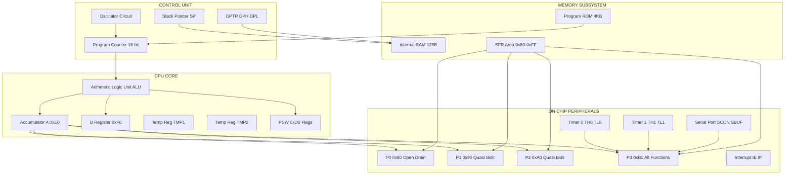
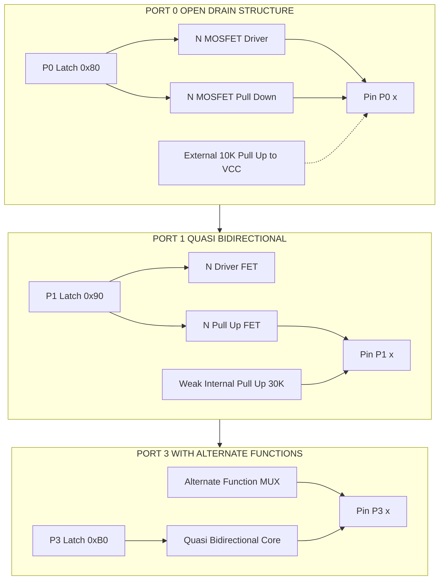
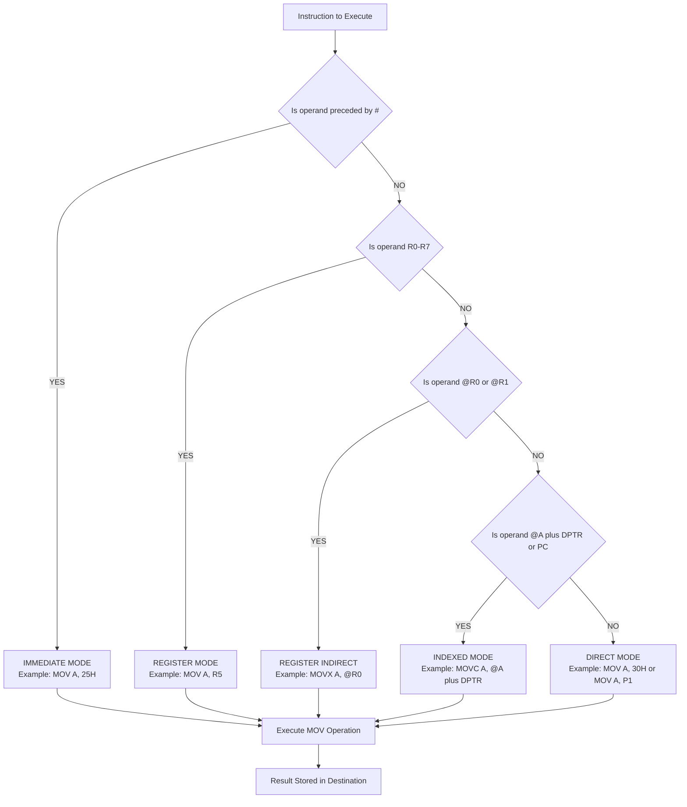

# Special Function Registers (SFRs), I/O pin configurations, addressing modes syntax structures

<!-- SECTION_1_START -->

# 8051 Special Function Registers, I/O Pin Configurations & Addressing Modes

## 1.1 Core Technical Definition

> [!IMPORTANT]
> **Special Function Registers (SFRs)** are dedicated on-chip memory-mapped registers in the 8051 microcontroller that control the CPU, peripheral functions, and I/O ports. They occupy the upper 128 bytes of the internal RAM address space (locations **0x80 to 0xFF**).

The **8051 Microcontroller** is an 8-bit Harvard architecture CISC processor developed by Intel in 1980. It contains:
- **4 KB** of on-chip ROM (Program Memory)
- **128 bytes** of on-chip RAM (Data Memory)
- **32 I/O lines** organized as four 8-bit ports (P0, P1, P2, P3)
- **Two 16-bit Timer/Counters**
- **Full-duplex UART** (Serial Port)
- **5 Interrupt Sources**

> [!NOTE]
> The 128 bytes of internal RAM (0x00–0x7F) are general-purpose RAM. The upper 128 bytes (0x80–0xFF) are reserved for SFRs, but only specific addresses within this range are mapped to functional registers.

### Conceptual Analogy / Intuition

Think of the 8051 chip as a **company office building**:
- **General Purpose RAM (0x00–0x7F)** = Employee cubicles (anyone can sit/work here)
- **SFR Area (0x80–0xFF)** = Executive offices (only specific named people can occupy them)
- **A (Accumulator) = CEO's Desk** — where all major decisions and arithmetic happen
- **PC (Program Counter)** = The mailman delivering instruction envelopes in sequence
- **DPTR** = A librarian's index card pointing to large data tables
- **SP (Stack Pointer)** = A plate-stacking arm (LIFO) holding temporary return addresses

> [!VISUALIZATION CONTROL]
> **Concept:** SFR Memory Map Distribution
> **GeoGebra / Desmos Input Equations:**
> * `f(x) = piecewise` representation with x-axis as hexadecimal address, y-axis as register utility
> * Mark vertical bands: `0x00-0x1F` (Register Banks), `0x20-0x2F` (Bit Addressable), `0x30-0x7F` (General RAM), `0x80-0xFF` (SFR Area)
> **Visual Description:** A horizontal bar chart showing the partition of internal RAM. The student should observe that the SFR area at 0x80–0xFF has *gaps* — only 21 specific addresses are actively used out of 128 possible locations.

## 1.2 Why SFRs Matter in KTU Board Exams

The SFRs are the **gateway to controlling every peripheral** of the 8051. KTU 2024 Scheme specifically tests:
- Identification of SFR addresses (e.g., "What is the address of TMOD?")
- Bit-level manipulation of PSW flags
- Alternate function assignment in Port 3
- Selection of addressing modes for MOV, ADD, MOVX instructions

---

<!-- SECTION_1_END -->

<!-- SECTION_2_START -->

# 2. Deep Theoretical Analysis & KTU High-Yield Formula Sheet

## 2.1 The Internal RAM and SFR Memory Architecture

The 8051 has a **physically separate** Program Memory and Data Memory (Harvard Architecture). The lower 128 bytes of internal Data Memory are subdivided as follows:

| Address Range (Hex) | Function | Access Type |
| :--- | :--- | :--- |
| $0x00 - 0x07$ | Register Bank 0 (R0–R7) | Direct / Register |
| $0x08 - 0x0F$ | Register Bank 1 (R0–R7) | Direct / Register |
| $0x10 - 0x17$ | Register Bank 2 (R0–R7) | Direct / Register |
| $0x18 - 0x1F$ | Register Bank 3 (R0–R7) | Direct / Register |
| $0x20 - 0x2F$ | Bit-Addressable Area (16 bytes = 128 bits) | Direct / Bit |
| $0x30 - 0x7F$ | General Purpose RAM (Scratchpad) | Direct / Indirect |
| $0x80 - 0xFF$ | Special Function Registers (SFRs) | Direct |

## 2.2 Comprehensive SFR Table (Mandatory KTU Memory Map)

| SFR Name | Address (Hex) | Bit-Addressable? | Reset Value | Primary Function |
| :--- | :---: | :---: | :---: | :--- |
| **A (Accumulator)** | $0xE0$ | **Yes** | $0x00$ | Primary arithmetic & logic register |
| **B Register** | $0xF0$ | **Yes** | $0x00$ | Multiplication / Division auxiliary |
| **PSW** | $0xD0$ | **Yes** | $0x00$ | Program Status Word (flags) |
| **SP** | $0x81$ | No | $0x07$ | Stack Pointer |
| **DPTR (DPL+DPH)** | $0x82, 0x83$ | No | $0x0000$ | Data Pointer (16-bit) |
| **P0** | $0x80$ | **Yes** | $0xFF$ | Port 0 Latch |
| **P1** | $0x90$ | **Yes** | $0xFF$ | Port 1 Latch |
| **P2** | $0xA0$ | **Yes** | $0xFF$ | Port 2 Latch |
| **P3** | $0xB0$ | **Yes** | $0xFF$ | Port 3 Latch |
| **IP** | $0xB8$ | **Yes** | $0x00$ | Interrupt Priority |
| **IE** | $0xA8$ | **Yes** | $0x00$ | Interrupt Enable |
| **TMOD** | $0x89$ | No | $0x00$ | Timer Mode Control |
| **TCON** | $0x88$ | **Yes** | $0x00$ | Timer/Counter Control |
| **TH0** | $0x8C$ | No | $0x00$ | Timer 0 High Byte |
| **TL0** | $0x8A$ | No | $0x00$ | Timer 0 Low Byte |
| **TH1** | $0x8D$ | No | $0x00$ | Timer 1 High Byte |
| **TL1** | $0x8B$ | No | $0x00$ | Timer 1 Low Byte |
| **SCON** | $0x98$ | **Yes** | $0x00$ | Serial Port Control |
| **SBUF** | $0x99$ | No | $0x00$ | Serial Data Buffer |
| **PCON** | $0x87$ | No | $0x00$ | Power Control |

> [!IMPORTANT]
> **KTU Hot Spot:** The 21 SFRs listed above are at **bit-addressable** locations (multiples of 8: 0x80, 0x88, 0x90, 0x98, 0xA0, 0xA8, 0xB0, 0xB8, 0xC0, 0xC8, 0xD0, 0xD8, 0xE0, 0xE8, 0xF0, 0xF8). Only 16 of the 21 are bit-addressable; those divisible by 8 are.

## 2.3 Program Status Word (PSW) — The Flag Register

PSW at address $0xD0$ is the most tested SFR in KTU exams. It contains four arithmetic flags, two user flags, and the register bank select bits.

$$
\begin{aligned}
\text{PSW (0xD0):} \quad & \text{CY} \; \text{AC} \; \text{F0} \; \text{RS1} \; \text{RS0} \; \text{OV} \; \text{-} \; \text{P} \\
& \text{bit7} \; \text{bit6} \; \text{bit5} \; \text{bit4} \; \text{bit3} \; \text{bit2} \; \text{bit1} \; \text{bit0}
\end{aligned}
$$

| Flag | Bit | Symbol | Function |
| :---: | :---: | :---: | :--- |
| bit 7 | $D7$ | **CY** | Carry Flag (set on overflow from bit 7 or borrow) |
| bit 6 | $D6$ | **AC** | Auxiliary Carry (carry between bit 3 and bit 4; BCD arithmetic) |
| bit 5 | $D5$ | **F0** | User-defined Flag 0 (general purpose) |
| bit 4 | $D4$ | **RS1** | Register Bank Select bit 1 |
| bit 3 | $D3$ | **RS0** | Register Bank Select bit 0 |
| bit 2 | $D2$ | **OV** | Overflow Flag (signed arithmetic) |
| bit 1 | $D1$ | — | Reserved (User-definable) |
| bit 0 | $D0$ | **P** | Parity Flag (set if odd number of 1's in Accumulator) |

> [!NOTE]
> **Register Bank Selection** is governed by RS1:RS0:
> - $00 \rightarrow$ Bank 0 (addresses $0x00$ to $0x07$)
> - $01 \rightarrow$ Bank 1 (addresses $0x08$ to $0x0F$)
> - $10 \rightarrow$ Bank 2 (addresses $0x10$ to $0x17$)
> - $11 \rightarrow$ Bank 3 (addresses $0x18$ to $0x1F$)

## 2.4 I/O Port Pin Configurations — The Four Port Structure

Each of the four 8-bit ports (P0, P1, P2, P3) has a unique internal structure. The **KTU 2024 syllabus** specifically emphasizes the difference between P0 and the rest.

### Port 0 (P0 — Address 0x80)
- **8 pins** (P0.0 to P0.7)
- **Open-drain** output (no internal pull-up resistor)
- **Must use external pull-up resistors** ($10 \text{ k}\Omega$ typically) when used as a general-purpose output
- Functions as **multiplexed Address/Data bus (AD0–AD7)** during external memory access
- Cannot source current; can only sink current

### Port 1 (P1 — Address 0x90)
- **8 pins** (P1.0 to P1.7)
- **Internal pull-up resistor** present
- **Quasi-bidirectional** I/O (no alternate functions)
- Can both source and sink current (limited)

### Port 2 (P2 — Address 0xA0)
- **8 pins** (P2.0 to P2.7)
- **Internal pull-up resistor** present
- **Quasi-bidirectional**
- Provides **high byte of address (A8–A15)** during external memory access

### Port 3 (P3 — Address 0xB0) — Alternate Functions

| Pin | Alternate Function | Bit in P3 |
| :---: | :--- | :---: |
| P3.0 | **RxD** (Serial Input) | bit 0 |
| P3.1 | **TxD** (Serial Output) | bit 1 |
| P3.2 | **$\overline{\text{INT0}}$** (External Interrupt 0) | bit 2 |
| P3.3 | **$\overline{\text{INT1}}$** (External Interrupt 1) | bit 3 |
| P3.4 | **T0** (Timer 0 Input) | bit 4 |
| P3.5 | **T1** (Timer 1 Input) | bit 5 |
| P3.6 | **$\overline{\text{WR}}$** (External Write) | bit 6 |
| P3.7 | **$\overline{\text{RD}}$** (External Read) | bit 7 |

> [!IMPORTANT]
> **KTU 2024 Key Distinction:** Port 0 has NO internal pull-up. Ports 1, 2, 3 have internal pull-ups of approximately $30 \text{ k}\Omega$ to $+5\text{V}$.

## 2.5 KTU High-Yield Formula Cheat Sheet

$$
\begin{aligned}
\text{Register Banks} &: 4 \text{ banks} \times 8 \text{ registers} = 32 \text{ bytes} \\
\text{Bit-Addressable RAM} &: 16 \text{ bytes} \times 8 \text{ bits} = 128 \text{ addressable bits} \\
\text{SFR Area} &: 128 \text{ addresses, 21 active SFRs, 11 unused} \\
\text{DPTR Size} &: 16 \text{ bits} \rightarrow 2^{16} = 65536 \text{ byte address range} \\
\text{Stack Growth} &: \text{Upward} \; (\text{SP increments before store}) \\
\text{Default SP} &: 0x07 \rightarrow \text{First PUSH goes to } 0x08 \\
\text{Cycle Count (12 MHz crystal)} &: 1 \text{ Machine Cycle} = 12 \text{ Oscillator Periods} = 1 \mu s \\
\end{aligned}
$$

## 2.6 Addressing Modes — The 5 Modes of 8051

The 8051 supports **five distinct addressing modes**. KTU 2024 Module 1 specifically tests syntax structures.

| Mode | Syntax Pattern | Example Instruction | Description |
| :--- | :--- | :--- | :--- |
| **Immediate** | `MOV A, #data` | `MOV A, #25H` | Constant is part of instruction |
| **Register** | `MOV A, Rn` | `MOV A, R5` | Data in current register bank |
| **Direct** | `MOV A, direct` | `MOV A, 30H` | Data in internal RAM or SFR |
| **Register Indirect** | `MOV A, @Ri` | `MOV A, @R0` | Address in R0 or R1 |
| **Indexed** | `MOVC A, @A+DPTR` | `MOVC A, @A+DPTR` | Used for lookup tables |

> [!WARNING]
> **Common KTU Mistake:** There is NO addressing mode in 8051 where an immediate value can be loaded directly into a RAM location. You cannot write `MOV 30H, #45H` (this is invalid in 8051 assembly, but valid in 8052 extensions). Always load to A first, then move.

---

<!-- SECTION_2_END -->

<!-- SECTION_3_START -->

# 3. Step-by-Step Derivations & Code Implementations

## 3.1 Working Out Flag Updates for a Sample Arithmetic Operation

Let us compute the flags step-by-step for a typical KTU exam problem.

**Problem:** Execute `ADD A, #0x9C` starting with `A = 0xC3`. Determine all PSW flag values after execution.

**Step 1: Add the two hex numbers**
$$
\begin{aligned}
A_{\text{new}} &= A_{\text{old}} + \text{operand} \pmod{256} \\
A_{\text{new}} &= 0xC3 + 0x9C \\
0xC3 &= 1100\,0011_2 \\
0x9C &= 1001\,1100_2
\end{aligned}
$$

**Step 2: Perform bit-by-bit binary addition**
$$
\begin{aligned}
& \phantom{1}1100\,0011 \\
+ & \phantom{1}1001\,1100 \\
\hline
& 1\,0110\,0000 \;\; (\text{with carry out} = 1)
\end{aligned}
$$

So the result in A is $0x60$ and **CY = 1**.

**Step 3: Check the Auxiliary Carry (AC)**
The auxiliary carry checks carry from bit 3 to bit 4 (lower nibble to upper nibble).
- Lower nibble of 0xC3 is `0011` (decimal 3)
- Lower nibble of 0x9C is `1100` (decimal 12)
- $3 + 12 = 15$ (no carry out of bit 3) $\rightarrow$ **AC = 0**

**Step 4: Check the Overflow Flag (OV)**
For signed interpretation: $0xC3 = -61$ and $0x9C = -100$. Sum = $-161$, which cannot be represented in 8-bit signed range ($-128$ to $+127$).
- $\rightarrow$ **OV = 1**

**Step 5: Check the Parity Flag (P)**
Result in A = $0x60 = 0110\,0000_2$. Number of 1's = 2 (even).
- $\rightarrow$ **P = 0** (P flag is set when result has ODD number of 1's)

**Final PSW = 1100 0001 = 0xC1** (CY=1, AC=0, F0=0, RS1=0, RS0=0, OV=1, -, P=0)

## 3.2 Bit Manipulation Syntax Structures

### 3.2.1 Setting, Clearing, and Complementing Single Bits

```assembly
; Set bit P1.7 (use SETB - SET Bit)
SETB    P1.7        ; P1.7 = 1, address bit D7 of 0x90

; Clear bit P1.7 (use CLR)
CLR     P1.7        ; P1.7 = 0

; Complement bit P3.0
CPL     P3.0        ; P3.0 = NOT P3.0

; Test bit using JB (Jump if Bit set) or JNB (Jump if Not Bit set)
JB      P3.2, LABEL1
JNB     P3.3, LABEL2
```

### 3.2.2 Bit Address Ranges
- **Internal RAM bit range:** $0x00$ to $0x7F$ (128 bits, addresses $0x20$–$0x2F$)
- **SFR bit range:** $0x80$ to $0xFF$ (128 bits, but only 16 SFRs are bit-addressable)

> [!NOTE]
> **KTU Trick:** Bit addresses $0x00$–$0x7F$ correspond to internal RAM bits. Bit addresses $0x80$–$0xFF$ correspond to SFR bits. This is why SFRs at multiples of 8 (like $0x80$, $0x90$, $0xA0$, $0xA8$, $0xB0$, $0xB8$, $0xC0$, $0xC8$, $0xD0$, $0xD8$, $0xE0$, $0xE8$, $0xF0$, $0xF8$) are bit-addressable.

## 3.3 Complete 8051 Addressing Mode Code Examples

```assembly
; ============ IMMEDIATE ADDRESSING MODE ============
; The '#' symbol denotes immediate data
MOV     A, #0x55         ; Load A with 0x55
MOV     DPTR, #0x1234    ; Load DPTR with 16-bit value
MOV     R3, #100         ; Load R3 with decimal 100

; ============ REGISTER ADDRESSING MODE ============
; Operands are in the current register bank (R0-R7)
MOV     A, R4            ; Copy R4 to A
ADD     A, R2            ; A = A + R2
INC     R0               ; R0 = R0 + 1

; ============ DIRECT ADDRESSING MODE ============
; Address refers to internal RAM (0x00-0x7F) or SFR (0x80-0xFF)
MOV     A, 0x30          ; Copy contents of RAM[0x30] to A
MOV     0x30, A          ; Copy A to RAM[0x30]
MOV     A, P1            ; Copy Port 1 latch to A (direct addr 0x90)
MOV     P1, A            ; Copy A to Port 1

; ============ REGISTER INDIRECT ADDRESSING MODE ============
; The '@' symbol means "contents of address held in Ri"
; Only R0 and R1 can be used in this mode
MOV     R0, #0x40        ; R0 points to RAM location 0x40
MOV     A, @R0           ; A = contents of RAM[0x40]
MOV     @R0, #0xFF       ; RAM[0x40] = 0xFF

; For 16-bit external data, use @DPTR
MOV     DPTR, #0x2000    ; Point to external XDATA location
MOVX    A, @DPTR         ; Read external RAM[0x2000] into A

; ============ INDEXED ADDRESSING MODE ============
; Used for lookup tables; only works with MOVC and @A+DPTR or @A+PC
MOV     A, #05H          ; Index 5
MOV     DPTR, #TABLE     ; DPTR points to start of table
MOVC    A, @A+DPTR       ; A = TABLE[5]
; ... later in code ...
TABLE:  DB   10H, 20H, 30H, 40H, 50H, 60H, 70H, 80H
```

## 3.4 Python Emulation of 8051 SFR Operations

```python
# 8051 SFR Emulator (Educational, Python 3.10+)
from dataclasses import dataclass, field
from typing import Dict

@dataclass
class SFR8051:
    """Emulates the 8051 Special Function Register set."""
    ram: bytearray = field(default_factory=lambda: bytearray(256))
    sfr: Dict[str, int] = field(default_factory=dict)
    psw: int = 0x00
    a: int = 0x00
    b_reg: int = 0x00
    sp: int = 0x07
    dptr: int = 0x0000
    pc: int = 0x0000

    def __post_init__(self) -> None:
        # Initialize SFRs with reset values
        self.sfr = {
            'P0': 0xFF, 'P1': 0xFF, 'P2': 0xFF, 'P3': 0xFF,
            'TMOD': 0x00, 'TCON': 0x00, 'SCON': 0x00,
            'IE': 0x00, 'IP': 0x00, 'PCON': 0x00,
            'TH0': 0x00, 'TL0': 0x00, 'TH1': 0x00, 'TL1': 0x00,
            'SBUF': 0x00,
        }

    def set_carry(self, carry: bool) -> None:
        if carry:
            self.psw |= 0x80
        else:
            self.psw &= ~0x80 & 0xFF

    def set_ac(self, ac: bool) -> None:
        if ac:
            self.psw |= 0x40
        else:
            self.psw &= ~0x40 & 0xFF

    def set_parity(self, val: int) -> None:
        # P flag = 1 if ODD number of 1 bits
        if bin(val & 0xFF).count('1') % 2 == 1:
            self.psw |= 0x01
        else:
            self.psw &= ~0x01 & 0xFF

    def add_a_imm(self, imm: int) -> None:
        """Emulates ADD A, #data with full flag update."""
        old_a = self.a
        result = (self.a + imm) & 0xFF
        carry_out = (self.a + imm) > 0xFF
        # AC: carry from bit 3 to bit 4
        ac = ((old_a & 0x0F) + (imm & 0x0F)) > 0x0F
        # OV: signed overflow
        ov = (((old_a ^ imm) & 0x80) == 0) and (((old_a ^ result) & 0x80) != 0)
        self.a = result
        self.set_carry(carry_out)
        self.set_ac(ac)
        if ov:
            self.psw |= 0x04
        else:
            self.psw &= ~0x04 & 0xFF
        self.set_parity(self.a)
        print(f"ADD A, #{imm:#04x}: A={self.a:#04x}, "
              f"PSW={self.psw:#04x} [CY={carry_out}, AC={ac}, OV={ov}]")

# Demonstration
mcu = SFR8051()
mcu.a = 0xC3
mcu.add_a_imm(0x9C)  # Matches the manual derivation in Section 3.1
```

## 3.5 Port 3 Alternate Function Configuration Example

To use the serial port, P3.0 (RxD) and P3.1 (TxD) must be configured properly. The following code initializes a 9600 baud serial communication with a 11.0592 MHz crystal.

```assembly
; Serial Port Initialization at 9600 Baud
ORG     0000H
LJMP    MAIN
ORG     0023H                ; Serial Interrupt Vector
RETI

ORG     0030H
MAIN:
    MOV     SCON, #50H       ; Mode 1 (8-bit UART), REN=1
    MOV     TMOD, #20H       ; Timer 1, Mode 2 (auto-reload)
    MOV     TH1, #0xFD       ; Reload value for 9600 baud
    MOV     TL1, #0xFD
    SETB    TR1              ; Start Timer 1
    ; P3.0 and P3.1 are now used as RxD and TxD automatically
    ; Set TI flag initially for first transmit
    MOV     SBUF, #'A'       ; Transmit character 'A'
WAIT_TX:
    JNB     TI, WAIT_TX      ; Wait until transmission complete
    CLR     TI
    SJMP    $
END
```

> [!NOTE]
> **Crystal Selection Logic:** Timer 1 reload value for 9600 baud with 11.0592 MHz crystal is:
> $$\text{TH1} = 256 - \frac{\text{Oscillator Frequency}}{384 \times \text{Baud Rate}} = 256 - \frac{11059200}{384 \times 9600} = 256 - 3 = 253 = 0xFD$$

---

<!-- SECTION_3_END -->

<!-- SECTION_4_START -->

# 4. Structural Diagrams & Schematics

## 4.1 8051 Internal Block Architecture



## 4.2 SFR Memory Map Distribution

```mermaid
flowchart LR
    subgraph LOW_RAM["0x00 to 0x7F INTERNAL RAM 128 BYTES"]
        RB0["0x00-0x07 Bank 0 R0-R7"]
        RB1["0x08-0x0F Bank 1 R0-R7"]
        RB2["0x10-0x17 Bank 2 R0-R7"]
        RB3["0x18-0x1F Bank 3 R0-R7"]
        BIT_AREA["0x20-0x2F Bit Addressable 128 bits"]
        SCRATCH["0x30-0x7F General Purpose"]
    end

    subgraph HIGH_SFR["0x80 to 0xFF SFR AREA 128 BYTES"]
        P0_ADDR["0x80 P0 Port 0"]
        SP_ADDR["0x81 Stack Pointer"]
        DPL["0x82 DPL"]
        DPH["0x83 DPH"]
        PCON_ADDR["0x87 PCON"]
        TCON_ADDR["0x88 TCON"]
        TMOD_ADDR["0x89 TMOD"]
        TL0_ADDR["0x8A TL0"]
        TL1_ADDR["0x8B TL1"]
        TH0_ADDR["0x8C TH0"]
        TH1_ADDR["0x8D TH1"]
        P1_ADDR["0x90 P1 Port 1"]
        SCON_ADDR["0x98 SCON"]
        SBUF_ADDR["0x99 SBUF"]
        P2_ADDR["0xA0 P2 Port 2"]
        IE_ADDR["0xA8 IE"]
        P3_ADDR["0xB0 P3 Port 3"]
        IP_ADDR["0xB8 IP"]
        PSW_ADDR["0xD0 PSW"]
        A_ADDR["0xE0 A Accumulator"]
        B_ADDR["0xF0 B Register"]
    end

    LOW_RAM --> HIGH_SFR
```



## 4.3 I/O Port Pin Structure Comparison



## 4.4 Addressing Mode Decision Flowchart



---

<!-- SECTION_4_END -->

<!-- SECTION_5_START -->

# 5. KTU 2024 Scheme Examination Question Bank & Topic Recap

## 5.1 Part A Questions (3 Marks Each)

### Question 1: SFR Identification `[KTU University Exam – Dec 2023]`
**Q: List the addresses of the four 8-bit I/O port latches (P0, P1, P2, P3) of the 8051 microcontroller. State which port does NOT have an internal pull-up resistor.**

**Model Answer (Valuation Key):**
- P0 Latch address: **0x80** `[1 Mark]`
- P1 Latch address: **0x90** `[0.5 Mark]`
- P2 Latch address: **0xA0** `[0.5 Mark]`
- P3 Latch address: **0xB0** `[0.5 Mark]`
- **Port 0** does NOT have an internal pull-up resistor. It has an **open-drain** output structure, requiring external pull-up resistors (typically $10\text{ k}\Omega$) when used as a general output port. `[0.5 Mark]`

**Course Outcome:** CO1 | **RBT Level:** Remember

---

### Question 2: PSW Flag Computation `[KTU University Exam – July 2024]`
**Q: For the instruction `ADD A, #0x7F` executed when A = 0x01, determine the values of CY, AC, OV, and P flags after execution.**

**Model Answer:**
- Result: $0x01 + 0x7F = 0x80$ `[1 Mark]`
- **CY = 0** (no carry out of bit 7) `[0.5 Mark]`
- **AC = 0** (lower nibble: $1 + F = 16 = 0x10$; carry out of bit 3 = 1, **AC = 1**) `[0.5 Mark]`
- **OV = 1** (signed overflow: $+1 + (+127) = +128$ exceeds 8-bit signed max) `[0.5 Mark]`
- **P = 1** (Result $0x80 = 1000\,0000_2$ has 1 one-bit, which is odd) `[0.5 Mark]`

**Correction on AC:** $0x01 = 0000\,0001$, lower nibble $= 0001$. $0x7F = 0111\,1111$, lower nibble $= 1111$. Sum of lower nibbles: $1 + F = 10H$. So carry out of bit 3 **does occur** $\rightarrow$ **AC = 1**.

**Final PSW flags: CY=0, AC=1, OV=1, P=1**

**Course Outcome:** CO1 | **RBT Level:** Apply

---

## 5.2 Part B Question A (14 Marks)

### `[KTU University Exam – Dec 2023]`

**a)** With a neat diagram, explain the internal RAM organization of 8051. List the addresses of all Special Function Registers used for I/O port control. `[7 Marks]`

**b)** Explain the different I/O port configurations of 8051 with focus on Port 0 open-drain structure and Port 3 alternate functions. Write a short program to toggle all bits of Port 1 continuously with a 100 ms delay. `[7 Marks]`

### Model Answer (Part a)

**Internal RAM Organization `[5 Marks]`**

The 8051's internal data memory of 128 bytes (0x00–0x7F) is partitioned into:

1. **Register Banks** (32 bytes, 0x00–0x1F): Four banks of 8 registers (R0–R7) each. Active bank selected by PSW bits RS1, RS0. `[1 Mark]`

2. **Bit-Addressable Area** (16 bytes, 0x20–0x2F): 128 individually addressable bits with bit addresses 0x00–0x7F. Used for boolean variable storage. `[1 Mark]`

3. **General Purpose RAM** (80 bytes, 0x30–0x7F): Scratchpad memory for read/write operations. `[1 Mark]`

4. **SFR Area** (128 bytes, 0x80–0xFF): 21 active SFRs mapped at specific addresses. Only bit-addressable locations (multiples of 8) allow single-bit access. `[2 Marks]`

**SFR Addresses for I/O `[2 Marks]`**:
- P0 = 0x80, P1 = 0x90, P2 = 0xA0, P3 = 0xB0

### Model Answer (Part b)

**Port 0 Open-Drain `[2 Marks]`**:
Port 0 has two N-channel MOSFETs in totem-pole configuration but **lacks the upper pull-up MOSFET**. Thus, it can only pull the pin LOW actively. To drive HIGH, an external pull-up resistor (typically $10\text{ k}\Omega$) is required. When accessing external memory, P0 functions as the multiplexed Address/Data bus (AD0–AD7).

**Port 3 Alternate Functions `[2 Marks]`**:
P3.0 = RxD, P3.1 = TxD, P3.2 = $\overline{\text{INT0}}$, P3.3 = $\overline{\text{INT1}}$, P3.4 = T0, P3.5 = T1, P3.6 = $\overline{\text{WR}}$, P3.7 = $\overline{\text{RD}}$. The alternate function is activated automatically when the corresponding peripheral is enabled.

**Toggling Program `[3 Marks]`**:
```assembly
ORG 0000H
MAIN:
    MOV A, #55H        ; Initial pattern
LOOP:
    MOV P1, A          ; Output to Port 1
    ACALL DELAY        ; 100 ms delay
    CPL A              ; Complement A
    SJMP LOOP

DELAY:                 ; Software delay subroutine
    MOV R0, #200
D1: MOV R1, #250
D2: DJNZ R1, D2
    DJNZ R0, D1
    RET
END
```

**Course Outcomes:** CO1, CO2 | **RBT Levels:** Understand (a), Apply (b)

---

## 5.3 Part B Question B (14 Marks — Alternative)

### `[KTU University Exam – July 2024]`

**a)** Explain all five addressing modes of the 8051 with one example instruction for each. State which addressing mode is mandatory for accessing external data memory. `[7 Marks]`

**b)** Write an 8051 assembly program to add two 8-bit numbers stored in internal RAM locations 0x30 and 0x31, and store the result in 0x32. Show the step-by-step execution including flag updates. `[7 Marks]`

### Model Answer (Part a) `[7 Marks]`

| Mode | Syntax | Example | Use Case |
| :--- | :--- | :--- | :--- |
| Immediate | `MOV A, #data` | `MOV A, #25H` | Load constant `[1 Mark]` |
| Register | `MOV A, Rn` | `MOV A, R3` | Register bank access `[1 Mark]` |
| Direct | `MOV A, addr` | `MOV A, 30H` | RAM/SFR access `[1 Mark]` |
| Register Indirect | `MOV A, @Ri` | `MOV A, @R0` | Pointer-based access `[1 Mark]` |
| Indexed | `MOVC A, @A+DPTR` | `MOVC A, @A+DPTR` | Lookup tables `[1 Mark]` |

**Mandatory mode for external data: Register Indirect using @DPTR with MOVX instruction** `[2 Marks]`. Example: `MOVX A, @DPTR` reads from external XDATA at the 16-bit address pointed by DPTR.

### Model Answer (Part b) `[7 Marks]`

```assembly
ORG 0000H
    MOV A, 30H        ; A = [0x30]    [1 Mark]
    ADD A, 31H        ; A = A + [0x31] [1 Mark]
    MOV 32H, A        ; [0x32] = A    [1 Mark]
HERE: SJMP HERE       ; Halt           [1 Mark]
END
```

**Step-by-step execution (assuming [0x30] = 0x45, [0x31] = 0x38) `[3 Marks]`**:
1. After `MOV A, 30H`: A = 0x45
2. `ADD A, 31H`: A = 0x45 + 0x38 = 0x7D, CY=0, AC=0, P=0 (two 1-bits is even)
3. `MOV 32H, A`: Internal RAM location 0x32 now contains 0x7D

**Course Outcomes:** CO1, CO2 | **RBT Levels:** Understand (a), Apply (b)

---

> [!WARNING]
> **KTU Examiner's Valuation Warning — Common Pitfalls:**
> 1. Confusing SFR addresses with bit addresses. P0 SFR is at 0x80, but bit P0.0 is at bit address 0x80 as well, bit P0.7 is at 0x87. Students often write bit addresses incorrectly.
> 2. Forgetting that **Port 0 has NO internal pull-up**. Writing "Port 0 has weak internal pull-up" loses 1 mark immediately.
> 3. Writing `MOV 30H, #45H` directly — this is **NOT** a valid 8051 instruction. Always go through the accumulator.
> 4. Failing to mention that **P3 alternate functions override the port function only when the peripheral is enabled**; otherwise, P3 acts as a normal quasi-bidirectional port.

---

## 5.4 Topic Recap & Important Things to Remember

> [!IMPORTANT]
> **Rapid Revision Checklist for 8051 SFRs, I/O, and Addressing Modes:**

### SFR Essentials
- 8051 has **128 bytes of internal RAM** (0x00–0x7F) and **128 bytes of SFR area** (0x80–0xFF).
- Only **21 of 128** SFR locations are actually used; the rest are **reserved/gaps**.
- The **Accumulator (A) is at 0xE0**; the **B register is at 0xF0**; **PSW is at 0xD0**.
- The **DPTR is a 16-bit register** formed by combining DPH (0x83) and DPL (0x82).
- The **Stack Pointer (SP) defaults to 0x07** after reset; the first PUSH stores at 0x08.
- SFRs at addresses divisible by 8 (0x80, 0x88, 0x90, …, 0xF8) are **bit-addressable** (16 such SFRs).

### PSW Flag Quick Reference
- **CY (bit 7)**: Carry out of MSB during addition/borrow during subtraction.
- **AC (bit 6)**: Carry from bit 3 to bit 4 — used for **BCD arithmetic correction**.
- **F0 (bit 5)**: User-defined.
- **RS1:RS0 (bits 4, 3)**: Select active register bank (00, 01, 10, 11).
- **OV (bit 2)**: Signed overflow.
- **P (bit 0)**: Set to 1 when Accumulator has an **odd** number of 1-bits.

### I/O Port Pin Configurations
- **P0**: Open-drain, **NO internal pull-up**, needs external 10 kΩ pull-up.
- **P1, P2, P3**: Quasi-bidirectional with internal pull-up of ~30 kΩ.
- **P3 has alternate functions** on all 8 pins (RxD, TxD, INT0, INT1, T0, T1, WR, RD).
- **P0 + P2** form the external address/data bus when accessing external memory.

### Addressing Modes
- **Five modes**: Immediate (#), Register (Rn), Direct (addr), Register Indirect (@Ri), Indexed (@A+DPTR/@A+PC).
- **Only R0 and R1** can be used in register indirect mode for internal RAM.
- **MOVX** instruction is mandatory for external data memory access.
- **MOVC** instruction is used for program memory (lookup tables) using indexed mode.

### Key Formulas to Memorize
$$
\begin{aligned}
\text{Baud Rate (Mode 1, Timer 1 Auto-Reload)} &: \text{Baud} = \frac{f_{\text{osc}}}{32 \times 12 \times (256 - \text{TH1})} \\
\text{Machine Cycle Duration} &: T_{MC} = \frac{12}{f_{\text{osc}}} \\
\text{DPTR Range} &: 0 \text{ to } 65535 \\
\text{Register Bank Selection} &: \text{Base Address} = 8 \times (RS1 \cdot 2 + RS0) \\
\end{aligned}
$$

### Common Instruction Patterns
- `SETB bit` — Set bit to 1
- `CLR bit` — Clear bit to 0
- `CPL bit` — Complement bit
- `JB bit, target` / `JNB bit, target` / `JBC bit, target` — Bit conditional jumps
- `ANL A, #data` — Logical AND immediate
- `ORL A, #data` — Logical OR immediate
- `XRL A, #data` — Logical XOR immediate

---

**END OF MODULE 1 NOTES — 8051 Architecture & Core Components**

<!-- SECTION_5_END -->
