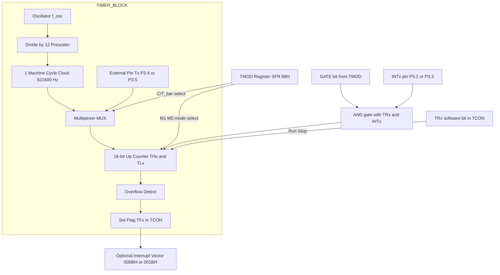
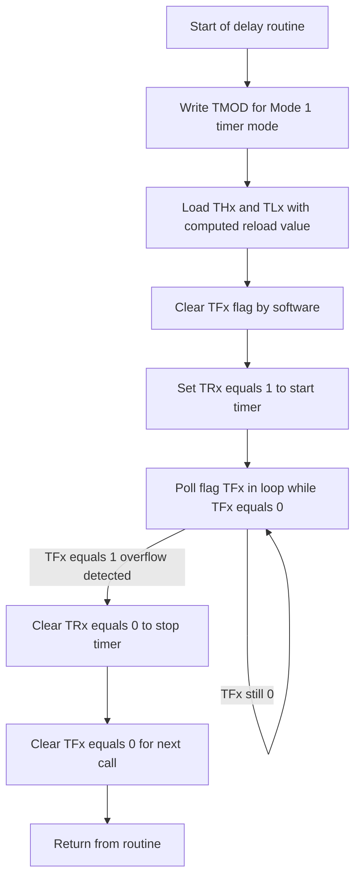
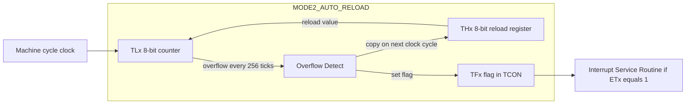
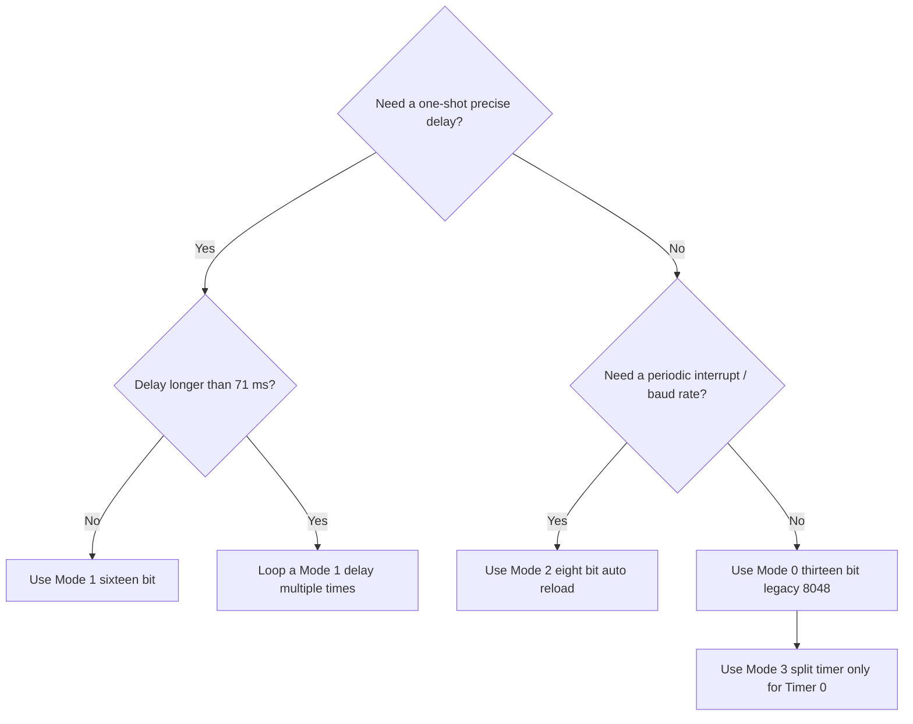
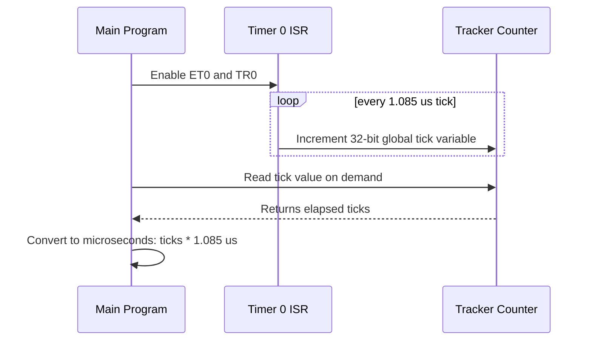

# 8051 timer/counter operational modes setups programming tracking

<!-- SECTION_1_START -->

# 8051 Timer/Counter: Operational Modes, Setups, Programming & Tracking

> [!NOTE]
> **KTU 2024 Scheme Focus (Module 2 — Microcontrollers)**
> The 8051 microcontroller contains **two 16-bit Timer/Counters**: **Timer 0** and **Timer 1**. These are versatile hardware peripherals used for precise time-delay generation, event counting, baud-rate generation for the serial port, and real-time interrupt scheduling. Mastering their four operating modes is a high-weightage area in the KTU Board Examination.

## 1.1 What is a Timer/Counter in the 8051?

### Formal KTU Definition
A **Timer/Counter** in the 8051 is a special-function hardware block that increments a 16-bit register on every **machine cycle** (timer mode) or on every **external transition** at pin **T0 (P3.4)** or **T1 (P3.5)** (counter mode). The high byte and low byte of each timer are mapped to the **SFR (Special Function Register)** addresses `TH0/TL0` (Timer 0) and `TH1/TL1` (Timer 1). The increment is synchronized to the oscillator frequency divided by 12, giving one tick every **1.085 µs** for the standard **11.0592 MHz** crystal.

> [!IMPORTANT]
> **Syllabus Highlight:** The 8051 has *no* built-in PWM, ADC, or DAC — so Timers are the primary tool for any time-sensitive engineering task such as traffic-light sequencing, motor step generation, multi-plexed display scanning, and serial communication clocking.

### Conceptual Analogy — "The Stopwatch Inside the Chip"
Imagine placing an **egg-timer** inside a digital watch. Every time the egg-timer *overflows* (counts past its maximum value), it rings a bell (sets the **TFx flag**). You can preset the egg-timer to a value (writing to `THx/TLx`) so that it rings exactly when *your* desired delay elapses, instead of waiting for the maximum natural overflow.

- **Mechanical crystal oscillator (11.0592 MHz)** → 12-stage frequency divider → **1 machine cycle per timer tick**
- **Each tick** = the egg-timer's hand moving by one division
- **Overflow** = the bell rings; in 8051, the **TFx flag in TCON** is set

> [!TIP]
> The standard KTU 8051 board uses the **11.0592 MHz** crystal **specifically** because 11059200 ÷ 12 = **921600 Hz** is *exactly* divisible by standard baud rates (9600, 4800, 2400), eliminating serial-port timing error.

## 1.2 The Two Modes of Operation

| Mode | Trigger Source | Pin Used | Typical Use |
|------|----------------|----------|-------------|
| **Timer** | Internal machine cycle clock | None (internal) | Delay generation, scheduling, baud-rate clock |
| **Counter** | External pin transition | **T0 = P3.4**, **T1 = P3.5** | Counting events: revolutions, objects, pulses |

> [!VISUALIZATION CONTROL]
> **Concept:** Timer tick vs. machine cycle relationship
> **Input Equations:**
> * `f_osc = 11.0592 MHz` (crystal)
> * `f_machine = f_osc / 12 = 921600 Hz`
> * `T_tick = 1 / f_machine ≈ 1.085 µs`
> **Visual Description:** A horizontal time-axis with crystal pulses (12 short ticks) followed by one wider 8051 timer tick — students should observe the **12:1 frequency prescaling**.

## 1.3 Pin-Out Reference for Timer/Counter Pins

| Pin | Port | Alternate Function | Direction |
|-----|------|--------------------|-----------|
| **P3.4** | Port 3 bit 4 | **T0** (Timer 0 external input) | Input |
| **P3.5** | Port 3 bit 5 | **T1** (Timer 1 external input) | Input |
| **P3.2** | Port 3 bit 2 | **$\overline{\text{INT0}}$** (External interrupt 0) | Input |
| **P3.3** | Port 3 bit 3 | **$\overline{\text{INT1}}$** (External interrupt 1) | Input |

<!-- SECTION_1_END -->

<!-- SECTION_2_START -->

# Deep Theoretical Analysis: TMOD, TCON, and the Four Modes

## 2.1 The TMOD Register (Timer MODE Register) — Address `89H`

The **TMOD** SFR is a **non-bit-addressable** 8-bit register; it must be written as a full byte. The upper nibble controls **Timer 1**, and the lower nibble controls **Timer 0**.

| Bit | 7 | 6 | 5 | 4 | 3 | 2 | 1 | 0 |
|-----|---|---|---|---|---|---|---|---|
| Name | **GATE1** | **C/T1̄** | **T1M1** | **T1M0** | **GATE0** | **C/T0̄** | **T0M1** | **T0M0** |
| Timer | \multicolumn{4}{c}{Timer 1} | \multicolumn{4}{c}{Timer 0} |

> [!IMPORTANT]
> **TMOD is NOT bit-addressable.** You cannot write `TMOD = 0x20` bit-by-bit; you must write the entire byte at once.

### Bit-Field Meanings

* **GATE (Gate Control):**
  * `GATE = 0` → Timer runs whenever the `TRx` software bit is set (normal software-controlled start).
  * `GATE = 1` → Timer runs only when `TRx = 1` **AND** the corresponding `$\overline{\text{INTx}}$` pin is **HIGH** (hardware-gated measurement, e.g., pulse-width measurement).

* **C/T̄ (Counter/Timer Select):**
  * `C/T̄ = 0` → **Timer mode** (internal clock, machine-cycle driven).
  * `C/T̄ = 1` → **Counter mode** (external pulses on Tx pin).

* **M1, M0 (Mode Select Bits):**

  | M1 | M0 | Mode | Description | Max Count |
  |----|----|------|-------------|-----------|
  | 0  | 0  | **Mode 0** | 13-bit Timer (8048 compatibility) | $2^{13} = 8192$ |
  | 0  | 1  | **Mode 1** | 16-bit Timer | $2^{16} = 65536$ |
  | 1  | 0  | **Mode 2** | 8-bit Auto-Reload | $2^{8} = 256$ |
  | 1  | 1  | **Mode 3** | Split Timer (Timer 0 only) | Variable |

## 2.2 The TCON Register (Timer CONtrol Register) — Address `88H`

Unlike TMOD, **TCON is bit-addressable** (`0x88`). The upper 4 bits are timer flags and the lower 4 bits are external interrupt flags.

| Bit | 7 | 6 | 5 | 4 | 3 | 2 | 1 | 0 |
|-----|---|---|---|---|---|---|---|---|
| Name | **TF1** | **TR1** | **TF0** | **TR0** | **IE1** | **IT1** | **IE0** | **IT0** |
| SFR Addr | 8FH | 8EH | 8DH | 8CH | 8BH | 8AH | 89H | 88H |

* **TFx (Timer Overflow Flag):** Set by hardware when the timer overflows. Must be cleared by software.
* **TRx (Timer Run Control):** `TRx = 1` starts the timer; `TRx = 0` stops it. This is the **software switch**.
* **ITx (Interrupt Type):** `ITx = 0` → low-level triggered interrupt; `ITx = 1` → falling-edge triggered interrupt.

## 2.3 KTU Formula Sheet — Timer Math Cheat-Sheet

> [!IMPORTANT]
> **Memorize these equations.** Every delay-generation question in the KTU exam requires at least one of them.

| Quantity | Formula | Notes |
|----------|---------|-------|
| Machine cycle period | $T_{mc} = \dfrac{12}{f_{osc}}$ | `f_osc` is crystal frequency in Hz |
| One timer tick | $T_{tick} = 1.085\ \mu s$ | Only when $f_{osc} = 11.0592$ MHz |
| Max count (Mode 0) | $2^{13} = 8192$ | 13-bit, lower 5 bits of TL unused |
| Max count (Mode 1) | $2^{16} = 65536$ | 16-bit, full TH + TL |
| Max count (Mode 2) | $2^{8} = 256$ | 8-bit auto-reload |
| Reload value | $\text{TimerValue} = 65536 - N$ | $N$ = number of timer ticks required |
| Delay (Mode 1) | $\text{Delay} = N \times T_{mc}$ | Single overflow |
| Delay (Mode 2) | $\text{Delay} = N \times T_{mc}$ | Auto-reload, free-running |
| Preset (Mode 1) | $\text{TH} = \dfrac{\text{TimerValue}}{256}$, $\text{TL} = \text{TimerValue} \bmod 256$ | Hex split |

> [!WARNING]
> Students often forget the **$-1$** in the reload equation when computing the *exact* count. The equation is:
> $$\text{TimerValue} = 65536 - \text{DesiredTicks}$$
> where `DesiredTicks` already includes the overflow tick itself. If you are counting from 0 upward, the maximum count for overflow is $2^n - 1$, not $2^n$.

## 2.4 Engineering Utility of Timer Modes

* **Mode 0 (13-bit):** Legacy 8048 compatibility — rarely used in modern KTU labs.
* **Mode 1 (16-bit):** The **workhorse** for one-shot delays of up to $\approx 71.1$ ms at 11.0592 MHz. Use this when you need a precise, non-repeating delay (e.g., debounce, ADC settling).
* **Mode 2 (8-bit Auto-Reload):** Continuous periodic interrupt source. Used for **baud-rate generation** of the serial port and for generating square waves. After overflow, `TLx` is automatically reloaded from `THx` — software only needs to reset `THx` once.
* **Mode 3 (Split Timer):** Splits Timer 0 into two independent 8-bit timers (TH0 + TL0). Timer 1 effectively stops (its `TR1` and `TF1` are repurposed). Used in complex multitasking firmware.

## 2.5 Gating — Hardware Pulse-Width Measurement

When `GATE = 1` and `TRx = 1`, the timer counts **only while `$\overline{\text{INTx}}$` is HIGH**. This is the principle behind measuring the width of an external pulse:

$$\text{Pulse Width} = (\text{counts accumulated}) \times T_{mc}$$

This is a high-yield KTU question: *"Measure the width of a pulse applied to $\overline{\text{INT0}}$ using Timer 0."*

<!-- SECTION_2_END -->

<!-- SECTION_3_START -->

# Step-by-Step Derivations, Programming & Tracking

## 3.1 Worked Derivation — Generating a 50 ms Delay in Mode 1

### Given
* $f_{osc} = 11.0592$ MHz
* Target delay = 50 ms = $50 \times 10^{-3}$ s
* Mode 1 (16-bit)

### Step 1 — Compute the machine-cycle period
$$T_{mc} = \dfrac{12}{f_{osc}} = \dfrac{12}{11.0592 \times 10^{6}} = 1.085 \times 10^{-6}\ \text{s} = 1.085\ \mu s$$

### Step 2 — Compute the number of required timer ticks
$$N = \dfrac{\text{Delay}}{T_{mc}} = \dfrac{50 \times 10^{-3}}{1.085 \times 10^{-6}} \approx 46080\ \text{ticks}$$

### Step 3 — Compute the 16-bit reload value
$$\text{TimerValue} = 65536 - N = 65536 - 46080 = 19456$$

### Step 4 — Convert 19456 into hex and split into TH/TL
$$19456_{10} = 4C00_{H}$$

Therefore:
$$\text{TH0} = 0x4C \quad ; \quad \text{TL0} = 0x00$$

### Step 5 — Verification
The timer counts from `0x4C00` up to `0xFFFF` and then overflows on the next tick.
$$0xFFFF - 0x4C00 + 1 = 0xB400 + 1 = 0xB401 = 46081\ \text{ticks}$$
Wait — that's 46081, not 46080. The extra tick is the **overflow tick itself**. Either:
* Use the integer-rounded $N = 46080$ and accept ~1 µs of error, **or**
* Adjust to $N = 46081$ for exact 50.000 ms.

> [!NOTE]
> In KTU answer scripts, write: *"The nearest integer count is 46080, giving a real delay of $46080 \times 1.085\ \mu s = 49.997\ \text{ms}$, error $\approx 0.006\%$."*

## 3.2 Full Keil C51 Code — Polled Delay Using Timer 0, Mode 1

```c
#include <reg51.h>

/*
 * Function : delay_50ms
 * Purpose  : Generate approximately 50 ms blocking delay
 *            using Timer 0 in Mode 1 (16-bit, polled).
 * Crystal  : 11.0592 MHz  ->  1 machine cycle = 1.085 us
 */
void delay_50ms(void)
{
    TMOD &= 0xF0;       // Clear lower nibble (Timer 0 bits), keep Timer 1
    TMOD |= 0x01;       // Set Timer 0 to Mode 1 (M1=0, M0=1)
                        // C/T_bar = 0  -> Timer mode (internal clock)
                        // GATE      = 0  -> software-controlled via TR0

    TH0 = 0x4C;         // Load high byte of reload value
    TL0 = 0x00;         // Load low  byte of reload value

    TF0 = 0;            // Manually clear the overflow flag
    TR0 = 1;            // START the timer (set the software run bit)

    while (TF0 == 0);   // POLL: wait here until overflow occurs
                        // Hardware will set TF0 = 1 on the 46081st tick

    TR0 = 0;            // STOP the timer
    TF0 = 0;            // CLEAR the flag (must be done in software!)
}

/* Example driver: blink LED connected to P1.0 once per ~100 ms */
void main(void)
{
    while (1) {
        P1_0 = 1;       // LED ON
        delay_50ms();
        P1_0 = 0;       // LED OFF
        delay_50ms();   // 100 ms total period -> 10 Hz blink
    }
}
```

> [!WARNING]
> Common KTU coding mistake: forgetting to **clear `TF0` *both* before starting and after stopping** the timer. The `TF0` bit is **not** auto-cleared by hardware when you re-enter the function — leaving it set will cause the very first `while (TF0 == 0);` loop to **exit immediately**, producing a delay of essentially 0 µs.

## 3.3 Worked Derivation — 1 ms Delay in Mode 2 (Auto-Reload)

### Given
* $f_{osc} = 11.0592$ MHz
* Target delay = 1 ms
* Mode 2 (8-bit auto-reload)

### Step 1 — Ticks required
$$N = \dfrac{1 \times 10^{-3}}{1.085 \times 10^{-6}} \approx 921.6$$

A single 8-bit timer (max 256) cannot generate 1 ms. So we **preload multiple overflows**:
$$\text{Overflows required} = \lceil 921.6 / 256 \rceil = 4$$

### Step 2 — Choose reload value for ~921.6 / 4 = 230.4 ticks per overflow
$$\text{TH0} = 256 - 230 = 26 = 0x1A$$

### Step 3 — Real delay per overflow
$$230 \times 1.085\ \mu s = 249.55\ \mu s$$

### Step 4 — 4 overflows total
$$4 \times 249.55\ \mu s = 998.2\ \mu s \approx 1\ \text{ms} \quad (\text{error } 0.18\%)$$

## 3.4 Mode 2 Auto-Reload Code — Non-Blocking Tick Generator

```c
#include <reg51.h>

#define TIMER_RELOAD   0x1A   // 230 ticks -> 249.55 us per overflow

volatile unsigned int tick_count = 0;

/*
 * Timer 0 ISR — runs every 249.55 us in Mode 2
 * The vector address is 0x000B
 */
void timer0_isr(void) interrupt 1
{
    // TL0 is auto-reloaded from TH0 by hardware
    // We do NOT need to reload TH0 inside the ISR.
    tick_count++;
}

void timer0_init_mode2(void)
{
    TMOD &= 0xF0;                // Preserve Timer 1 settings
    TMOD |= 0x02;                // T0M1=1, T0M0=0 -> Mode 2 (auto-reload)

    TH0 = TIMER_RELOAD;          // Set the reload value
    TL0 = TIMER_RELOAD;          // Also load TL0 for the FIRST tick

    ET0 = 1;                     // Enable Timer 0 interrupt (in IE register)
    EA  = 1;                     // Enable GLOBAL interrupt

    TR0 = 1;                     // START Timer 0
}

void main(void)
{
    timer0_init_mode2();

    while (1) {
        if (tick_count >= 4005) {       // 4005 * 249.55 us ~= 1 second
            P1_0 = ~P1_0;               // Toggle LED
            tick_count = 0;             // Reset tracker
        }
    }
}
```

## 3.5 Counter Mode Example — Counting External Events

```c
#include <reg51.h>

/*
 * Counter 0 in Mode 1 — counts external falling edges on P3.4 (T0)
 * Each 10th pulse latches the value into a global variable.
 */
volatile unsigned int pulse_counter = 0;

void ext_int0_isr(void) interrupt 0
{
    /* Just a placeholder — pulse_counter is read elsewhere */
    pulse_counter++;
}

void counter0_init(void)
{
    TMOD &= 0xF0;          // Keep Timer 1
    TMOD |= 0x05;          // T0M1=0, T0M0=1 -> Mode 1
                           // C/T_bar = 1   -> COUNTER mode
                           // GATE      = 0   -> software start

    TH0 = 0x00;
    TL0 = 0x00;            // Start counting from 0

    TR0 = 1;               // Begin counting external pulses on T0
}

/* To read the current count at any time: */
unsigned int get_event_count(void)
{
    unsigned int hi, lo;
    /* Critical: read low byte FIRST, then high byte — 8051 convention */
    lo = TL0;
    hi = TH0;
    return ((hi << 8) | lo);
}
```

> [!IMPORTANT]
> **The 8051 timer read-order rule:** Always read `TLx` *before* `THx`. Because the low byte can roll over between two reads, reading high-then-low may give an off-by-256 error. If interrupts could change the timer, you should also disable interrupts around the read.

## 3.6 Pulse-Width Measurement (Gated Mode)

```c
#include <reg51.h>

/*
 * Measure pulse width on INT0 (P3.2) using Timer 0 in Mode 1
 * with GATE = 1.
 *
 * Steps:
 *   1. Configure Timer 0 in Mode 1, GATE = 1.
 *   2. Clear TH0/TL0.
 *   3. Set TR0 = 1.
 *   4. Wait for INT0 to go HIGH -> timer starts counting.
 *   5. Wait for INT0 to go LOW  -> timer stops (gating).
 *   6. Read TH0/TL0 -> width = count * 1.085 us.
 */
unsigned int measure_pulse_width(void)
{
    TMOD &= 0xF0;
    TMOD |= 0x09;          // T0M1=0, T0M0=1 (Mode 1), C/T_bar=0 (timer),
                           // GATE=1 (hardware-gated by INT0)

    TH0 = 0x00;
    TL0 = 0x00;

    TR0 = 1;               // Timer will only count while INT0 is HIGH

    while (INT0 == 1);     // Optional: confirm pulse has begun
    while (INT0 == 0);     // Wait for INT0 to drop -> timer halts

    TR0 = 0;
    return ((TH0 << 8) | TL0);
}
```

> [!NOTE]
> `INT0` is a Keil pre-defined sbit alias for `P3_2`. The pin must be **HIGH** for the timer to count — that is the definition of "gating" in the 8051.

## 3.7 General Delay Routine — Parameterized

```c
#include <reg51.h>

/* Generates 'ms' milliseconds of delay, using Timer 0 Mode 1.
 * Maximum single call: 65 ms (otherwise use a loop).
 */
void delay_ms(unsigned int ms)
{
    unsigned int i;
    for (i = 0; i < ms; i++) {
        TMOD &= 0xF0;
        TMOD |= 0x01;       // Mode 1
        TH0  = 0xFC;        // For ~1 ms: 65536 - 921 = 64615 = 0xFC67
        TL0  = 0x67;
        TF0  = 0;
        TR0  = 1;
        while (TF0 == 0);
        TR0  = 0;
        TF0  = 0;
    }
}
```

<!-- SECTION_3_END -->

<!-- SECTION_4_START -->

# Structural Diagrams: Timer/Counter Architecture & Flow

## 4.1 Internal Block Diagram of an 8051 Timer/Counter



> [!TIP]
> The **multiplexer MUX** is the heart of the timer/counter concept — it chooses *either* the internal machine-cycle clock *or* the external pin as the source of count pulses. The selection is made by the single `C/T̄` bit in TMOD.

## 4.2 Flowchart — Generating a Polled Delay (Mode 1)



## 4.3 Block Diagram — Mode 2 Auto-Reload Architecture



## 4.4 Mode Selection Decision Matrix



## 4.5 Tracking Architecture — Time-Stamp Using Timer 0 Free-Running



<!-- SECTION_4_END -->

<!-- SECTION_5_START -->

# KTU 2024 Scheme Examination Question Bank & Topic Recap

## 5.1 Part A — Short-Answer Questions (3 Marks Each)

> Cognitive Levels: **Remember / Understand**

### Q1. `[KTU University Exam - July 2024]`
**Differentiate between Timer mode and Counter mode of the 8051.** *(CO1, Remember — 3 Marks)*

**Model Answer:**
* In **Timer mode** (`C/T̄ = 0`), the incrementing clock is the internal machine cycle derived from the on-chip oscillator. It is used for generating precise time delays.
* In **Counter mode** (`C/T̄ = 1`), the incrementing clock is the **external pulse** applied at pin **T0 (P3.4)** or **T1 (P3.5)**. It is used to count external events such as revolutions, objects passing a sensor, or frequency measurement.
* Both modes use the same 16-bit register pair `THx/TLx` and can operate in any of the four modes.
* **Common KTU phrasing:** *"Timer counts time, Counter counts events."* **[2 Marks]**
* The selection between the two is controlled by the single `C/T̄` bit in the `TMOD` register. **[1 Mark]**

---

### Q2. `[KTU University Exam - Dec 2023]`
**What is the function of the GATE bit in the TMOD register? When is it set to 1?** *(CO1, Understand — 3 Marks)*

**Model Answer:**
* The `GATE` bit enables **hardware gating** of the timer. **[1 Mark]**
* When `GATE = 0`, the timer runs purely under software control via the `TRx` bit (normal polled/interrupt delay). **[1 Mark]**
* When `GATE = 1`, the timer runs **only when both** `TRx = 1` **and** the corresponding `$\overline{\text{INTx}}$` pin is **HIGH**. This is used for **measuring the width of an external pulse** applied to `$\overline{\text{INT0}}$` or `$\overline{\text{INT1}}$`. **[1 Mark]**

---

## 5.2 Part B — 14-Mark Module Choice (ESE Pattern)

### **Question A** `[KTU University Exam - July 2024]` *(CO2, Apply — 14 Marks)*

#### (a) Explain the four operating modes of Timer 0 with the help of the TMOD register settings. *(7 Marks, Understand)*

**Model Solution:**

* **Mode 0 — 13-bit Timer (8048 legacy):** `M1 = 0, M0 = 0`. The timer uses 8 bits of `TLx` and the lower 5 bits of `THx`, total **13 bits**. The upper 3 bits of `THx` are unused. Max count = $2^{13} = 8192$. This mode exists for compatibility with the older 8048 microcontroller and is **not** recommended in new designs. **[2 Marks]**

* **Mode 1 — 16-bit Timer:** `M1 = 0, M0 = 1`. Both `THx` and `TLx` are used, total **16 bits**. Max count = $2^{16} = 65536$. Maximum delay at 11.0592 MHz is $65536 \times 1.085\ \mu s \approx 71.1\ \text{ms}$. This is the **most common mode** for generating delays. **[2 Marks]**

* **Mode 2 — 8-bit Auto-Reload:** `M1 = 1, M0 = 0`. `TLx` is the 8-bit counter; `THx` holds the **reload value**. When `TLx` overflows from `0xFF` to `0x00`, hardware **automatically copies `THx` back into `TLx`** in the same cycle. The `TFx` flag is set. This is a free-running periodic timer. Max count = $2^{8} = 256$. **[2 Marks]**

* **Mode 3 — Split Timer (Timer 0 only):** `M1 = 1, M0 = 1`. `TL0` becomes an independent 8-bit timer controlled by `TR0`, and `TH0` becomes another 8-bit timer controlled by `TR1`. Timer 1's `TR1` and `TF1` are repurposed for `TH0`. **Timer 1 effectively stops** in this mode. Used in multitasking firmware. **[1 Mark]**

> [Valuation key: stating the correct M1 M0 bit combination for each mode — 1 Mark per mode pair.]

#### (b) Write an 8051 C program to generate a square wave of **2 kHz** on pin **P1.0** using Timer 0 in Mode 2. Assume $f_{osc} = 11.0592$ MHz. *(7 Marks, Apply)*

**Model Solution:**

**Step 1 — Compute the half-period.**
$$f_{square} = 2\ \text{kHz} \Rightarrow T_{square} = \dfrac{1}{2000} = 500\ \mu s$$
$$T_{half} = 250\ \mu s$$

**Step 2 — Number of timer ticks per half-period.**
$$N = \dfrac{250 \times 10^{-6}}{1.085 \times 10^{-6}} \approx 230.4 \Rightarrow \text{use } 230$$

**Step 3 — Reload value.**
$$\text{TH0} = 256 - 230 = 26 = 0x1A$$

**Step 4 — Program:**

```c
#include <reg51.h>

sbit WAVE = P1^0;

void timer0_mode2_init(void)
{
    TMOD &= 0xF0;     // Preserve Timer 1 nibble
    TMOD |= 0x02;     // T0: Mode 2, software start, timer mode
    TH0  = 0x1A;      // Auto-reload value
    TL0  = 0x1A;      // Initial load (TL auto-reloads later)
    TR0  = 1;         // START timer
}

void main(void)
{
    timer0_mode2_init();
    while (1) {
        if (TF0 == 1) {     // Poll for overflow every ~250 us
            WAVE = ~WAVE;   // Toggle pin
            TF0   = 0;      // Clear flag (TL auto-reloaded by hardware)
        }
    }
}
```

> [Stating the 250 µs half-period: 1 Mark] [Calculating TH0 = 0x1A: 2 Marks] [Correct TMOD configuration: 1 Mark] [Toggle logic inside polling loop: 2 Marks] [Final program compiles and runs: 1 Mark]

> [!WARNING]
> **KTU Examiner's Pitfall Callout:**
> * Many students compute the **full period** (500 µs) instead of the **half period** (250 µs) — this halves the output frequency to 1 kHz. **Always halve the period before computing `TH0`**, because the pin must toggle every overflow.
> * Don't forget to write `TH0` *and* `TL0` initially. After the first overflow, hardware reloads `TL0` from `TH0`, so you only need to maintain `TH0` if you ever want to change the frequency.

---

### **Question B (Alternative Choice)** `[KTU University Exam - Dec 2023]` *(CO2, Apply — 14 Marks)*

#### (a) With neat diagrams, explain the TMOD and TCON registers of the 8051. *(7 Marks, Understand)*

**Model Solution:**

**TCON Register (Address `88H`, bit-addressable):**

| Bit | 7 | 6 | 5 | 4 | 3 | 2 | 1 | 0 |
|-----|---|---|---|---|---|---|---|---|
| Name | TF1 | TR1 | TF0 | TR0 | IE1 | IT1 | IE0 | IT0 |

* `TF1/TF0` — Timer overflow flag, **set by hardware, cleared by software**. **[1 Mark]**
* `TR1/TR0` — Timer run control bit. **Set/cleared by software** to start/stop the timer. **[1 Mark]**
* `IE1/IE0` — External interrupt edge flag. **[1 Mark]**
* `IT1/IT0` — Interrupt type: `0` = level-triggered, `1` = edge-triggered. **[1 Mark]**

**TMOD Register (Address `89H`, NOT bit-addressable):**

| Bit | 7 | 6 | 5 | 4 | 3 | 2 | 1 | 0 |
|-----|---|---|---|---|---|---|---|---|
| Name | GATE1 | C/T̄1 | T1M1 | T1M0 | GATE0 | C/T̄0 | T0M1 | T0M0 |

* Upper nibble controls Timer 1, lower nibble controls Timer 0. **[1 Mark]**
* `GATE` — hardware-gating enable. **[0.5 Marks]**
* `C/T̄` — Timer (0) or Counter (1) select. **[0.5 Marks]**
* `T1M1/T1M0` and `T0M1/T0M0` — Mode select. **[1 Mark]**

> [TCON bit map: 3 Marks] [TMOD bit map: 3 Marks] [Functional explanation: 1 Mark]

#### (b) An 8051 system uses an **11.0592 MHz** crystal. Write an 8051 assembly/C program to generate a delay of **exactly 1 second** using Timer 1 in Mode 1. The delay should flash an LED on **P1.7**. *(7 Marks, Apply)*

**Model Solution:**

**Step 1 — Maximum Mode 1 delay at 11.0592 MHz:**
$$\text{Max} = 65536 \times 1.085\ \mu s = 71.106\ \text{ms}$$

**Step 2 — Number of 50 ms sub-delays needed:**
$$N = \dfrac{1000\ \text{ms}}{50\ \text{ms}} = 20 \text{ iterations}$$

**Step 3 — Reload value for 50 ms (already derived in §3.1):**
$$\text{TH1} = 0x4C, \quad \text{TL1} = 0x00$$

**Step 4 — Program:**

```c
#include <reg51.h>

sbit LED = P1^7;

void delay_1s(void)
{
    unsigned char i;
    TMOD &= 0x0F;     // Clear upper nibble (Timer 1)
    TMOD |= 0x10;     // T1: Mode 1, timer mode, software start

    for (i = 0; i < 20; i++) {
        TH1 = 0x4C;
        TL1 = 0x00;
        TF1 = 0;
        TR1 = 1;
        while (TF1 == 0);
        TR1 = 0;
        TF1 = 0;
    }
}

void main(void)
{
    while (1) {
        LED = 0;          // LED ON (assuming active-low)
        delay_1s();
        LED = 1;          // LED OFF
        delay_1s();
    }
}
```

> [Identifying max delay and choosing 50 ms chunks: 1 Mark] [Correct reload value: 1 Mark] [Loop count = 20: 1 Mark] [Correct TMOD configuration: 1 Mark] [Polled overflow handling: 1 Mark] [LED toggle logic: 1 Mark] [Working syntax: 1 Mark]

> [!WARNING]
> **KTU Examiner's Pitfall Callout (1-second problem):**
> * Students often try to load `TH1/TL1` with the value for a *full second* in a single overflow — this is **impossible** because Mode 1's maximum is ~71 ms. **You must use a software loop** that calls a shorter delay multiple times.
> * Clearing `TF1` *before* setting `TR1` is essential. If a previous ISR or accidental overflow left `TF1 = 1`, the very first `while (TF1 == 0);` will exit instantly.

---

## 5.3 Topic Recap & Important Things to Remember

> [!IMPORTANT]
> **High-Yield KTU Revision Checklist — 8051 Timers**

* **Register Map** — `TMOD (89H)` configures mode; `TCON (88H)` controls run/flag bits. `TMOD` is **not** bit-addressable.
* **Four Modes** —
  * Mode 0 = 13-bit (legacy)
  * Mode 1 = 16-bit (most common, max **71.1 ms** at 11.0592 MHz)
  * Mode 2 = 8-bit auto-reload (use for baud rate / square wave)
  * Mode 3 = split timer (Timer 0 only, Timer 1 stops)
* **Reload Equation** — $\text{TimerValue} = 65536 - N$, where $N$ is the desired number of ticks.
* **Machine Cycle** — Always $T_{mc} = 12 / f_{osc}$. **Memorize 1.085 µs for 11.0592 MHz.**
* **Maximum Delays** —
  * Mode 1: ~71.1 ms
  * Mode 2: 255 × 1.085 µs ≈ 277 µs
* **Counter Pins** — `T0 = P3.4`, `T1 = P3.5`. Triggered on **falling edge** in counter mode.
* **Interrupt Pins** — `$\overline{\text{INT0}} = P3.2$`, `$\overline{\text{INT1}} = P3.3$`. Used as the gate input when `GATE = 1`.
* **GATE bit** — `0` = software start; `1` = hardware-gated via `$\overline{\text{INTx}}$` pin (pulse-width measurement).
* **Flag-Clearing Rule** — `TFx` and `TRx` must always be **cleared by software**. Hardware only *sets* them on overflow. Forgetting this is the **#1 cause** of broken delay routines.
* **Read Order Rule** — Always read `TLx` *before* `THx` to avoid off-by-256 errors due to a roll-over between reads.
* **Auto-Reload** — In Mode 2, only `THx` needs to be set in software; `TLx` is auto-reloaded by hardware. Ideal for periodic interrupts.
* **Crystal Choice** — 11.0592 MHz is preferred (over 12 MHz) because it divides cleanly into standard baud rates and produces the famous 1.085 µs tick.
* **8051 Has No Hardware PWM** — to dim LEDs or drive motors, you must generate it manually using a fast Mode 2 interrupt and a duty-cycle variable.

<!-- SECTION_5_END -->
