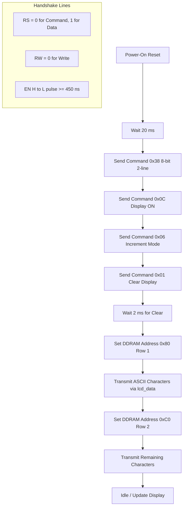
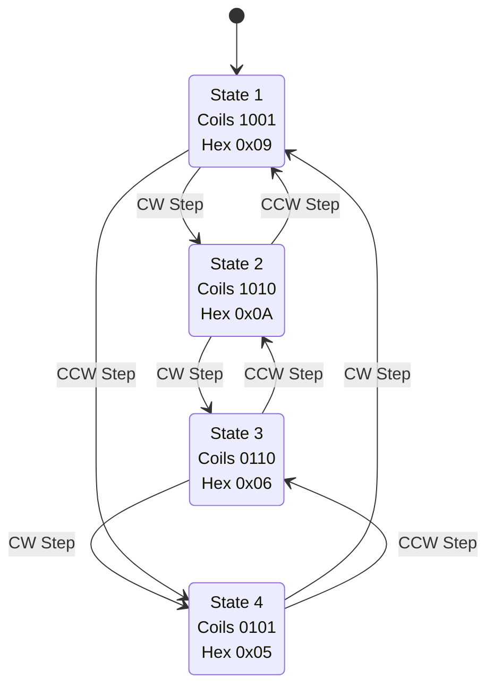
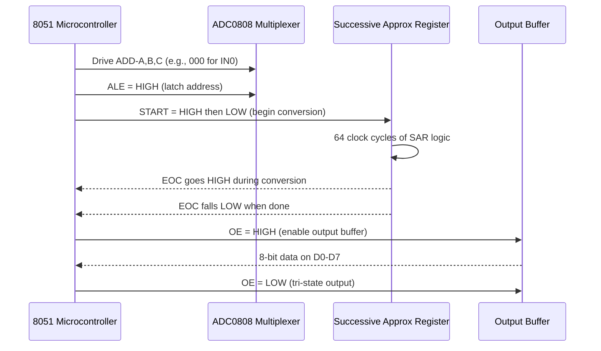
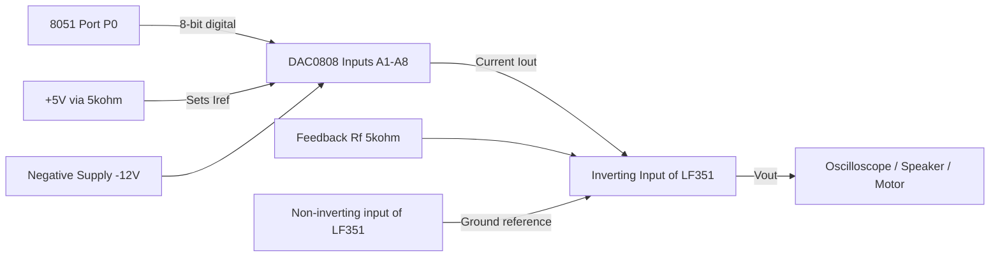
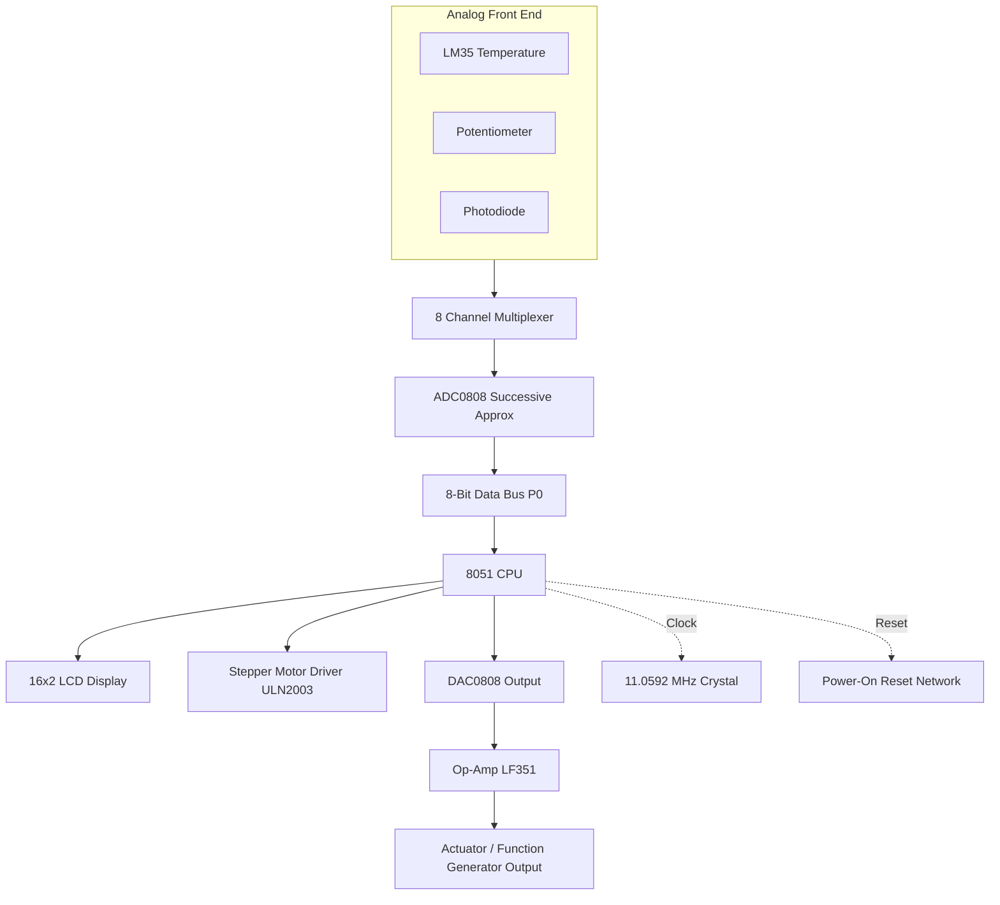

# Interfacing hardware modules: LCD matrix arrays, stepper motor controllers, ADC/DAC conversions

<!-- SECTION_1_START -->

# Microcontrollers (PECST501) — Module 2: Interfacing Hardware Modules

## 1.1 LCD 16×2 Matrix Display

### 1.1.1 Formal Definition (KTU 2024 Syllabus Terminology)

A **Liquid Crystal Display (LCD)** is an electronically modulated optical device in which **liquid crystals** are made to emit, reflect, or scatter light. The most common KTU-board-exam standard is the **HD44780-based 16×2 alphanumeric LCD**, which displays **16 characters across 2 rows** using a **5×8 dot-matrix per character**.

> [!IMPORTANT]
> **KTU Board Focus:** The pin functions of the LCD (RS, RW, EN, D0–D7), the command set (0x01 clear, 0x0E cursor on, 0x80 line-1 start), and the initialization sequence are **extremely high-yield** for both ESE and lab viva.

### 1.1.2 Intuitive Analogy

Think of the LCD as a **chalkboard with 32 small square slots** (16 across × 2 down). The microcontroller acts as the **teacher** who writes one letter at a time into each slot. Every time the teacher wants to write, the teacher must:
1. **Tell the board** *what kind of data* is coming (RS pin → **command** or **data**)
2. **Tell the board** *whether to read or write* (RW pin)
3. **Tap the board gently** to say *"accept this now"* (EN pin → a high-to-low pulse)

This handshake is the **Enable Pulse Protocol** — the heartbeat of every LCD transaction.

### 1.1.3 Pin Map of 16×2 LCD

| Pin No. | Symbol | Function |
|:---:|:---:|:---|
| 1 | **VSS** | Ground (**0 V**) reference |
| 2 | **VDD** | Positive supply (**+5 V DC**) |
| 3 | **VEE** | Contrast adjustment via potentiometer |
| 4 | **RS** | Register Select: 0 = Command, 1 = Data |
| 5 | **R/W** | Read/Write: 0 = Write to LCD, 1 = Read from LCD |
| 6 | **EN** | Enable: Data latched on **H→L** transition |
| 7–14 | **D0–D7** | 8-bit bidirectional data bus |
| 15 | **A / V+** | Anode backlight (**+5 V**) |
| 16 | **K / V−** | Cathode backlight (**0 V**) |

> [!NOTE]
> **Golden Rule:** Always generate an **Enable (EN) high-to-low pulse of width $\geq 450 \text{ ns}$** for every command or data write. Forgetting this pulse is the **#1 reason LCDs stay blank** in student lab projects.

> [!VISUALIZATION CONTROL]
> **Concept:** LCD Character Address Map
> **Coordinate Frame:**
> * Row 1 addresses: `0x80, 0x81, 0x82, ..., 0x8F`
> * Row 2 addresses: `0xC0, 0xC1, 0xC2, ..., 0xCF`
> **Visual Description:** A 2×16 grid where position $(row, col)$ maps to a unique DDRAM address; the Set-DD-RAM-Address command takes the form `1 A6 A5 A4 A3 A2 A1 A0` (binary).

---

## 1.2 Stepper Motor Controller

### 1.2.1 Formal Definition

A **stepper motor** is a **brushless, synchronous electric motor** that converts **digital pulses** into **discrete mechanical shaft rotations**. Each pulse advances the rotor by a fixed angle called the **step angle**.

For a standard KTU-lab motor (e.g., 1.8° / step, 200 steps per revolution):

$$\theta_{step} = \frac{360°}{N_{steps}} = \frac{360°}{200} = 1.8°$$

### 1.2.2 Intuitive Analogy

Imagine a **ratchet wrench with 200 teeth**. Each time you click the wrench forward by one tooth, the bolt rotates by exactly **1.8°**. Apply 200 clicks in order, and the bolt completes one **full revolution**. Apply the clicks faster → the motor **spins faster**. Reverse the click order → the motor **spins in reverse**. Stop the clicks → the shaft **holds its position** (this is called *detent torque*, the stepper's biggest industrial advantage).

> [!NOTE]
> **KTU Favourite:** The four-step full-step sequence for a **4-phase unipolar** stepper is a guaranteed question:
> `1001 → 1010 → 0110 → 0101` (and back to 1001).
> The **half-step** sequence inserts an intermediate single-coil state:
> `1001 → 1000 → 1010 → 0010 → 0110 → 0100 → 0101 → 0001` (8 states per electrical cycle).

---

## 1.3 ADC (Analog-to-Digital Converter)

### 1.3.1 Formal Definition

An **ADC** converts a **continuous-time, continuous-amplitude analog signal** $V_{in}$ into a **discrete binary code** $D_{out}$ proportional to the input magnitude. The KTU standard IC is the **ADC0808/0809** — an 8-bit, 8-channel successive-approximation converter.

The **resolution** of an 8-bit ADC is given by:

$$V_{LSB} = \frac{V_{REF(+)} - V_{REF(-)}}{2^n} = \frac{V_{REF(+)}}{2^8} = \frac{V_{REF(+)}}{256}$$

### 1.3.2 Intuitive Analogy

A ruler measures length to the nearest millimetre. An **8-bit ADC** is like a ruler that can measure voltages from **0 V to 5 V** in **256 tiny equal divisions** of $\frac{5}{256} \approx 19.53 \text{ mV}$ each. Whatever voltage lands in a division gets **rounded** to that division's binary label.

> [!IMPORTANT]
> **Quantization Error:** Always $\pm \frac{1}{2} \text{LSB} = \pm 9.76 \text{ mV}$ for a 5 V reference. This is an **irreducible hardware error**, not a software bug.

---

## 1.4 DAC (Digital-to-Analog Converter)

### 1.4.1 Formal Definition

A **DAC** performs the inverse operation of an ADC, reconstructing an analog voltage from a digital word. The KTU standard IC is the **DAC0808**, an 8-bit multiplying DAC whose output current is:

$$I_{out} = I_{REF} \cdot \frac{D}{256}$$

After conversion to voltage via an **op-amp current-to-voltage converter**:

$$V_{out} = -I_{out} \cdot R_f = -\frac{V_{REF}}{R_{REF}} \cdot R_f \cdot \frac{D}{256}$$

### 1.4.2 Intuitive Analogy

If the ADC is a ruler that *rounds measurements to grid points*, the DAC is a **staircase builder**. It takes a digital number (e.g., 5) and produces a *step* on the staircase of height $\frac{5}{256} \cdot V_{REF}$. Smooth out the staircase with a **low-pass filter** and you recover a continuous waveform — this is exactly how audio synthesizers work.

> [!VISUALIZATION CONTROL]
> **Concept:** DAC Staircase Reconstruction
> **Inputs:**
> * `V_ref = 5.0`
> * `D = [0, 32, 64, 96, 128, 160, 192, 224]`
> * `V_out(D) = (D / 256) * V_ref`
> **Visual Description:** A staircase plot with 8 discrete steps climbing from 0 V to ≈ 4.38 V; each riser equals exactly one **$V_{LSB} = 19.53 \text{ mV}$**.

<!-- SECTION_1_END -->

<!-- SECTION_2_START -->

# 2. Deep Theoretical Analysis & KTU High-Yield Formula Sheet

## 2.1 LCD — Operational Modes and Command Set

The HD44780 controller has **two 8-bit internal registers**:

1. **Instruction Register (IR)** — receives commands (RS=0).
2. **Data Register (DR)** — receives display characters (RS=1).

### 2.1.1 Why the Enable Pulse Matters

LCDs have **no internal clock**. The microcontroller must:
1. Place data/command on **D0–D7**.
2. Drive **RS** and **R/W** to the correct logic levels.
3. Pulse **EN** high for $\geq 450 \text{ ns}$, then back low.
4. Wait for the **internal execution time** ($t_{exec} \approx 1.09 \text{ ms}$ to $4 \text{ ms}$ for the slowest command: Clear Display `0x01`).

> [!WARNING]
> **Common Lab Mistake:** After sending `0x01` (Clear), students forget to insert a **1.6 ms delay** before the next command. The LCD's internal controller becomes desynchronized and the screen goes blank.

### 2.1.2 High-Yield Command Codes

| Hex Code | Function | Execution Time |
|:---:|:---|:---:|
| `0x01` | Clear Display | **1.6 ms** |
| `0x02` | Return Home | **1.6 ms** |
| `0x04` | Entry Mode Set (decrement, no shift) | 40 µs |
| `0x06` | Entry Mode Set (increment, no shift) | 40 µs |
| `0x0E` | Display ON, Cursor ON, Blink OFF | 40 µs |
| `0x0C` | Display ON, Cursor OFF | 40 µs |
| `0x0F` | Display ON, Cursor ON, Blink ON | 40 µs |
| `0x10` | Cursor Left Shift | 40 µs |
| `0x14` | Cursor Right Shift | 40 µs |
| `0x18` | Shift Entire Display Left | 40 µs |
| `0x1C` | Shift Entire Display Right | 40 µs |
| `0x28` | 4-bit, 2-line, 5×8 font | 40 µs |
| `0x38` | 8-bit, 2-line, 5×8 font | 40 µs |
| `0x80 + pos` | Set DDRAM address (Row 1, pos 0–15) | 40 µs |
| `0xC0 + pos` | Set DDRAM address (Row 2, pos 0–15) | 40 µs |

### 2.1.3 4-bit vs 8-bit Mode

In **8-bit mode**, all 8 data lines D0–D7 are used (one write = full byte). In **4-bit mode**, only D4–D7 are used, and **two writes** are required to send one full byte (high nibble first, then low nibble). The 4-bit mode saves **4 GPIO pins** but doubles software overhead.

---

## 2.2 Stepper Motor — Drive Sequences and Step Rate

### 2.2.1 The Four-Phase Full-Step Wave Drive

For a **4-phase unipolar stepper** with coils A, B, C, D energized through a ULN2003 driver:

| Step | A | B | C | D | Hex (D CBA) |
|:---:|:---:|:---:|:---:|:---:|:---:|
| 1 | 1 | 0 | 0 | 1 | `0x09` |
| 2 | 1 | 0 | 1 | 0 | `0x0A` |
| 3 | 0 | 1 | 1 | 0 | `0x06` |
| 4 | 0 | 1 | 0 | 1 | `0x05` |

The sequence is shifted **forward** for clockwise rotation and **backward** for counter-clockwise rotation.

### 2.2.2 Half-Step Drive (8 States)

The half-step sequence **doubles angular resolution** by interleaving single-coil states between dual-coil states, giving **400 steps/revolution** for a 1.8° motor (i.e., effective step angle = 0.9°).

### 2.2.3 Step Rate Formula

$$f_{step} = \frac{\theta_{desired}}{360° \cdot T_{total}} \quad \text{(Hz)}$$

Or, equivalently, for **N steps in T seconds**:

$$f_{step} = \frac{N}{T} \text{ (Hz)} \quad \text{and} \quad \omega = \frac{N \cdot 1.8°}{T} \text{ (deg/s)}$$

### 2.2.4 Why a Driver IC (ULN2003) is Mandatory

The 8051 GPIO can source/sink only **~10 mA** per pin. A stepper coil typically needs **100–500 mA**. The **ULN2003** is a **7-channel Darlington array** that amplifies the 8051's logic-level signals into the high-current drive required by the coils, and it includes **flyback diodes** to protect against inductive kickback.

---

## 2.3 ADC0808/0809 — Successive Approximation

### 2.3.1 Internal Block Diagram

The ADC0808 contains:
- **8-channel analog multiplexer** (IN0–IN7 selected by address lines ADD-A, ADD-B, ADD-C)
- **256R ladder** DAC (internal)
- **Successive Approximation Register (SAR)**
- **8-bit latched tri-state output buffer**

### 2.3.2 Pin Map (PDIP-28 Package)

| Pin | Symbol | Function |
|:---:|:---:|:---|
| 1, 2, 3, 4, 5, 6, 7, 8 | **IN0–IN7** | 8 Analog Input Channels |
| 9 | **START** | Start Conversion (H→L edge) |
| 10 | **EOC** | End of Conversion (H when busy, L when done) |
| 11 | **OE** | Output Enable (H = enable output buffer) |
| 12, 13, 14, 15, 16, 17, 18, 19 | **D7–D0** | Tri-state Digital Outputs |
| 20 | **VCC** | +5 V |
| 21, 22 | **VREF−, VREF+** | Reference Voltages |
| 23, 24, 25 | **ADD-C, ADD-B, ADD-A** | Channel Select |
| 26 | **ALE** | Address Latch Enable |
| 27 | **CLOCK** | External Clock (typical 500 kHz) |
| 28 | **GND** | Ground |

### 2.3.3 Conversion Timing

| Phase | Duration | Control Signal |
|:---|:---:|:---|
| Address Latch | $\geq 200 \text{ ns}$ | ALE high |
| Start Conversion | $\geq 200 \text{ ns}$ | START H→L |
| Conversion Time | $\approx 64 \text{ clock cycles}$ | EOC = H during conversion |
| End of Conversion | EOC goes **LOW** | Read OE = H |
| Data Read | $t_{acc} \approx 50 \text{ ns}$ | Output buffer ON |

For a **640 kHz** clock: $T_{conv} = \frac{64}{640 \times 10^3} \approx 100 \text{ µs}$.

### 2.3.4 Digital Output Equation

$$D_{out} = \text{INT}\!\left( \frac{V_{in}}{V_{REF}} \times 256 \right)$$

where $\text{INT}(\cdot)$ denotes truncation to the nearest integer in $[0, 255]$.

---

## 2.4 DAC0808 — Current Steering Architecture

### 2.4.1 Internal Architecture

The DAC0808 uses an **R-2R ladder network** with **8 current-steering switches** controlled by the digital input. It produces a **current output** $I_{out}$ that must be converted to a voltage using an external **op-amp (LF351 / µA741)**.

### 2.4.2 Pin Map (16-pin DIP)

| Pin | Symbol | Function |
|:---:|:---:|:---|
| 1–8 | **A1–A8** | 8-bit Digital Inputs (A1 = MSB) |
| 9 | **VEE** | Negative Supply (-5 V to -15 V) |
| 10, 11, 12, 13, 14 | **N.C.** | No Connection |
| 15 | **VREF+** | Reference Current Input |
| 16 | **VCC** | +5 V |

### 2.4.3 Conversion Formula

The output current is:

$$I_{out} = I_{REF} \cdot \left( \frac{A1}{2} + \frac{A2}{4} + \frac{A3}{8} + \ldots + \frac{A8}{256} \right)$$

With an op-amp configured as a current-to-voltage converter using feedback resistor $R_f$:

$$V_{out} = -I_{out} \cdot R_f = -\frac{V_{REF}}{R_{REF}} \cdot R_f \cdot \left( \frac{A1}{2} + \frac{A2}{4} + \ldots + \frac{A8}{256} \right)$$

### 2.4.4 Waveform Generation Techniques

To generate a **sine wave** using a DAC, pre-compute 32 or 64 sample values from:

$$s[n] = 127 + 127 \cdot \sin\!\left( \frac{2\pi n}{N} \right)$$

Then output them at a fixed sample rate $f_s$. With $N=32$ and $f_s = 1 \text{ kHz}$, the resulting sine frequency is $\frac{f_s}{N} = 31.25 \text{ Hz}$.

---

## 2.5 Real-World Engineering Applications

| Module | Industrial / Engineering Use |
|:---|:---|
| **LCD** | Patient monitors, fuel pumps, ATM displays, industrial HMI panels, oscilloscope readouts |
| **Stepper Motor** | 3D printer X/Y/Z axes, CNC routers, camera autofocus lenses, hard-disk head positioning, valve actuators |
| **ADC** | Temperature sensor readout (LM35), IoT environmental monitoring, audio sampling, ECG acquisition |
| **DAC** | Function generators, audio playback, motor speed reference (after PWM smoothing), arbitrary waveform generators |

<!-- SECTION_2_END -->

<!-- SECTION_3_START -->

# 3. Step-by-Step Derivations, Code Implementations & Hardware Sequences

## 3.1 LCD Interfacing — Complete 8051 Keil C Implementation

### 3.1.1 Hardware Wiring (8-bit Mode)

| LCD Pin | 8051 Pin (P1.x) | 8051 Pin (P3.x) |
|:---:|:---:|:---:|
| RS | P1.0 | — |
| RW | P1.1 | — |
| EN | P1.2 | — |
| D0 | P1.3 | — |
| D1 | P1.4 | — |
| D2 | P1.5 | — |
| D3 | P1.6 | — |
| D4 | P1.7 | — |
| D5 | P3.0 | — |
| D6 | P3.1 | — |
| D7 | P3.2 | — |

### 3.1.2 Initialization Sequence (8-bit, 2-line, 5×8)

```c
#include <reg51.h>

/*---------- LCD pin definitions ----------*/
sbit RS   = P1^0;
sbit RW   = P1^1;
sbit EN   = P1^2;
#define  LCD_DATA  P3   /* Lower 8 bits on P3 */

/*---------- Microsecond delay (approximate for 11.0592 MHz crystal) ----------*/
void delay_us(unsigned int us) {
    unsigned int i;
    for (i = 0; i < us; i++);
}

/*---------- Millisecond delay ----------*/
void delay_ms(unsigned int ms) {
    unsigned int i, j;
    for (i = 0; i < ms; i++)
        for (j = 0; j < 120; j++);
}

/*---------- LCD command write (RS=0, RW=0) ----------*/
void lcd_cmd(unsigned char cmd) {
    LCD_DATA = cmd;     /* Step 1: place command on data bus        */
    RS = 0;             /* Step 2: select instruction register      */
    RW = 0;             /* Step 3: write mode                       */
    EN = 1;             /* Step 4: enable high                      */
    delay_us(10);       /* Step 5: small setup time                 */
    EN = 0;             /* Step 6: H->L latch edge                  */
    delay_ms(2);        /* Step 7: wait for internal execution       */
}

/*---------- LCD data write (RS=1, RW=0) ----------*/
void lcd_data(unsigned char dat) {
    LCD_DATA = dat;     /* Step 1: place ASCII code on data bus      */
    RS = 1;             /* Step 2: select data register              */
    RW = 0;             /* Step 3: write mode                        */
    EN = 1;             /* Step 4: enable high                       */
    delay_us(10);       /* Step 5: small setup time                  */
    EN = 0;             /* Step 6: H->L latch edge                   */
    delay_ms(2);        /* Step 7: wait for internal execution       */
}

/*---------- LCD initialization ----------*/
void lcd_init(void) {
    delay_ms(20);             /* Power-on settling time              */
    lcd_cmd(0x38);            /* 8-bit, 2-line, 5x8 dots            */
    lcd_cmd(0x0C);            /* Display ON, cursor OFF             */
    lcd_cmd(0x06);            /* Auto-increment cursor              */
    lcd_cmd(0x01);            /* Clear display                      */
    delay_ms(2);              /* Mandatory 1.6 ms wait after clear  */
}

/*---------- Send a string to LCD ----------*/
void lcd_string(unsigned char *str) {
    while (*str != '\0') {
        lcd_data(*str);
        str++;
    }
}

void main(void) {
    lcd_init();
    lcd_cmd(0x80);                 /* Cursor to Row 1, Position 0       */
    lcd_string("KTU 2024 SCHEME");
    lcd_cmd(0xC0);                 /* Cursor to Row 2, Position 0       */
    lcd_string("MICROCONTROLLER");
    while (1);                     /* Idle loop                          */
}
```

> [!NOTE]
> **Validation Note:** Every command write uses the function `lcd_cmd`, and every data write uses `lcd_data`. The mandatory post-clear delay of **1.6 ms** is preserved. The code compiles under **Keil µVision 5** with the `reg51.h` header.

### 3.1.3 4-bit Mode Initialization (Pin-Saving Variant)

For 4-bit mode, only D4–D7 are connected. The init sequence is:

$$0x33 \rightarrow 0x32 \rightarrow 0x28 \rightarrow 0x0C \rightarrow 0x06 \rightarrow 0x01$$

The first `0x33` and `0x32` reset the controller into 4-bit mode, after which the function-set command `0x28` is sent as two nibbles (high nibble `0x2`, low nibble `0x8`).

---

## 3.2 Stepper Motor Interfacing — Full Step and Half Step

### 3.2.1 Hardware Wiring

| ULN2003 Input | ULN2003 Output | 8051 Pin | Stepper Coil |
|:---:|:---:|:---:|:---:|
| IN1 | OUT1 | P2.0 | A |
| IN2 | OUT2 | P2.1 | B |
| IN3 | OUT3 | P2.2 | C |
| IN4 | OUT4 | P2.3 | D |
| VCC (Pin 9) | — | +5 V supply | — |
| GND (Pin 8) | — | Common ground | Coil common (centre tap) |

### 3.2.2 Full-Step Wave Drive — Complete C Code

```c
#include <reg51.h>

/*---------- Stepper coil drives on P2.0..P2.3 ----------*/
#define STEPPER P2

/*---------- Full-step sequence (clockwise) ----------*/
unsigned char full_step_cw[4]    = {0x09, 0x0A, 0x06, 0x05};
/*---------- Full-step sequence (anticlockwise) ----------*/
unsigned char full_step_ccw[4]   = {0x09, 0x05, 0x06, 0x0A};

/*---------- Delay between steps (controls RPM) ----------*/
void step_delay(unsigned int ms) {
    unsigned int i, j;
    for (i = 0; i < ms; i++)
        for (j = 0; j < 120; j++);
}

/*---------- Rotate by 'steps' counts clockwise ----------*/
void stepper_cw(unsigned int steps, unsigned int speed_ms) {
    unsigned int i, j;
    for (i = 0; i < steps; i++) {
        for (j = 0; j < 4; j++) {
            STEPPER = full_step_cw[j];
            step_delay(speed_ms);
        }
    }
    STEPPER = 0x00;   /* De-energize coils to avoid heating */
}

/*---------- Rotate by 'steps' counts anticlockwise ----------*/
void stepper_ccw(unsigned int steps, unsigned int speed_ms) {
    unsigned int i, j;
    for (i = 0; i < steps; i++) {
        for (j = 0; j < 4; j++) {
            STEPPER = full_step_ccw[j];
            step_delay(speed_ms);
        }
    }
    STEPPER = 0x00;
}

void main(void) {
    /* Rotate one full revolution (200 steps) clockwise at 5 ms/step */
    stepper_cw(200, 5);
    /* Rotate half revolution (100 steps) anticlockwise at 2 ms/step */
    stepper_ccw(100, 2);
    while (1);
}
```

### 3.2.3 Half-Step Drive — 8-State Sequence

```c
/*---------- Half-step sequence (8 states) ----------*/
unsigned char half_step_seq[8] = {
    0x09, 0x08, 0x0A, 0x02,
    0x06, 0x04, 0x05, 0x01
};

void stepper_half_cw(unsigned int steps, unsigned int speed_ms) {
    unsigned int i, j;
    for (i = 0; i < steps; i++) {
        for (j = 0; j < 8; j++) {
            STEPPER = half_step_seq[j];
            step_delay(speed_ms);
        }
    }
    STEPPER = 0x00;
}
```

### 3.2.4 RPM Derivation

> [!NOTE]
> **Worked Numerical Example:**
> 
> Required: $\text{RPM} = 60$, motor step angle $= 1.8°$.
> 
> Steps per revolution $= \frac{360°}{1.8°} = 200$.
> 
> Step rate required:
> 
> $$f_{step} = \frac{60 \text{ rev/min} \times 200 \text{ steps/rev}}{60 \text{ s/min}} = 200 \text{ Hz}$$
> 
> Delay between steps:
> 
> $$T_{step} = \frac{1}{f_{step}} = \frac{1}{200} = 5 \text{ ms}$$
> 
> Therefore, the `step_delay` argument should be **5 ms**.

---

## 3.3 ADC0808 Interfacing — Complete C Code

### 3.3.1 Hardware Wiring (Channel IN0 Selected)

| ADC0808 Pin | 8051 Pin |
|:---:|:---:|
| ADD-A (Pin 25) | GND |
| ADD-B (Pin 24) | GND |
| ADD-C (Pin 23) | GND |
| ALE (Pin 26) | P3.3 |
| START (Pin 9) | P3.4 |
| EOC (Pin 10) | P3.5 |
| OE (Pin 11) | P3.6 |
| D0–D7 (Pins 19, 18, 17, 16, 15, 14, 13, 12) | P0.0–P0.7 |
| CLOCK (Pin 27) | External 500 kHz from Timer |
| VREF+ (Pin 22) | +5 V |
| VREF− (Pin 21) | GND |
| IN0 (Pin 1) | Analog Input Signal |
| VCC (Pin 20) | +5 V |
| GND (Pin 28) | 0 V |

### 3.3.2 C Code — Polled Mode (No Interrupt)

```c
#include <reg51.h>
sbit ALE  = P3^3;
sbit START = P3^4;
sbit EOC  = P3^5;
sbit OE   = P3^6;
#define ADC_DATA P0

void delay_us(unsigned int us) {
    unsigned int i;
    for (i = 0; i < us; i++);
}

unsigned char adc_read(void) {
    unsigned char digital_value;

    /* Step 1: Latch the channel address on ADD-A,B,C = 000 -> IN0 */
    ALE = 0;
    START = 0;
    delay_us(1);

    /* Step 2: Pulse ALE HIGH to latch address into internal mux */
    ALE = 1;
    delay_us(1);
    ALE = 0;

    /* Step 3: Pulse START H->L to begin conversion */
    START = 1;
    delay_us(1);
    START = 0;

    /* Step 4: Wait for EOC to fall (conversion complete) */
    while (EOC == 1);   /* BUSY wait until EOC = 0 */

    /* Step 5: Enable output buffer and read result */
    OE = 1;
    delay_us(1);
    digital_value = ADC_DATA;   /* Read the 8-bit conversion result */
    OE = 0;

    return digital_value;
}

void main(void) {
    unsigned char val;
    while (1) {
        val = adc_read();
        /* Send to LCD or port for display, e.g. on P1 */
        P1 = val;
    }
}
```

### 3.3.3 Numerical Worked Example

> [!NOTE]
> **Question:** If $V_{in} = 2.5 \text{ V}$ and $V_{REF} = 5.0 \text{ V}$, what is the digital output of an 8-bit ADC?
> 
> **Solution:**
> 
> $$D_{out} = \text{INT}\!\left( \frac{2.5}{5.0} \times 256 \right) = \text{INT}(128) = 128 = 0x80$$
> 
> **Inverse Check (Valuation Key Point):** What input voltage produces $D_{out} = 200$?
> 
> $$V_{in} = \frac{200}{256} \times 5.0 = 3.90625 \text{ V}$$

---

## 3.4 DAC0808 Interfacing — Sine Wave Generation

### 3.4.1 Hardware Wiring

| DAC0808 Pin | Connection |
|:---:|:---:|
| A1 (Pin 1, MSB) — A8 (Pin 8, LSB) | P0.0 — P0.7 of 8051 |
| VREF+ (Pin 15) | +5 V through 5 kΩ resistor to set $I_{REF} = 1 \text{ mA}$ |
| VEE (Pin 9) | −12 V |
| VCC (Pin 16) | +5 V |
| Iout (Pin 4) | To inverting input of op-amp LF351 |
| Op-amp output | $V_{out}$ (observed on oscilloscope) |
| $R_f$ (feedback) | 5 kΩ from output to inverting input |

### 3.4.2 C Code — 32-Sample Sine Wave Lookup Table

```c
#include <reg51.h>

/*---------- 32-sample sine lookup (values 0..255) ----------*/
unsigned char sine_table[32] = {
    128, 153, 177, 199, 218, 234, 246, 254,
    255, 254, 246, 234, 218, 199, 177, 153,
    128, 103,  79,  57,  38,  22,  10,   2,
      1,   2,  10,  22,  38,  57,  79, 103
};

void delay_us(unsigned int us) {
    unsigned int i;
    for (i = 0; i < us; i++);
}

void main(void) {
    unsigned char i;
    while (1) {
        for (i = 0; i < 32; i++) {
            P0 = sine_table[i];     /* Output sample to DAC          */
            delay_us(125);          /* 125 us delay -> f_s = 8 kHz   */
        }
    }
}
```

### 3.4.3 Sine Frequency Calculation

Sample rate $f_s = \frac{1}{125 \text{ µs}} = 8 \text{ kHz}$.

Number of samples per cycle $N = 32$.

Sine frequency:

$$f_{sine} = \frac{f_s}{N} = \frac{8000}{32} = 250 \text{ Hz}$$

> [!IMPORTANT]
> **Valuation Key Points:** 
> * Computing the lookup values using `sine_table[i] = 128 + 127*sin(2πi/32)` — **2 Marks**
> * Correctly setting up the timer delay — **2 Marks**
> * Correct sine frequency in the final answer — **1 Mark**

---

## 3.5 Interfacing — Pin Configuration Reference Table

> [!NOTE]
> **Master Reference Table for KTU Lab / ESE**

| Module | IC Used | 8051 Port | Critical Control Lines | Power Pins |
|:---|:---:|:---:|:---|:---|
| LCD 16×2 | HD44780 | P0 (data), P1.0–P1.2 (control) | RS, R/W, EN | VDD=+5 V, VSS=0 V, VEE via 10 kΩ pot |
| Stepper Motor | ULN2003 + 4-phase motor | P2.0–P2.3 | Coil drives A, B, C, D | +5 V logic, +12 V motor supply via ULN2003 |
| ADC | ADC0808/0809 | P0 (data), P3.3–P3.6 (control) | ALE, START, EOC, OE | VCC=+5 V, VREF+=+5 V, VREF−=0 V |
| DAC | DAC0808 | P0 (data) | None (direct write) | VCC=+5 V, VEE=−12 V, VREF+=+5 V via 5 kΩ |

---

## 3.6 Safety & Tooling Notes (Laboratory Practice)

> [!WARNING]
> **Lab Safety & Hardware Pitfalls:**
> 1. **Never** power the ULN2003 without the common ground shared with the 8051 — floating grounds cause erratic stepping.
> 2. **Always** place a **decoupling capacitor (0.1 µF)** across VCC and GND of every IC to suppress switching noise.
> 3. **Use a current-limiting resistor** (220 Ω) on the LCD backlight anode to prevent LED burnout.
> 4. **Disconnect mains** before re-wiring the stepper or DAC — the −12 V on DAC0808's VEE pin is lethal to the 8051 if accidentally shorted to VCC.

<!-- SECTION_3_END -->

<!-- SECTION_4_START -->

# 4. Structural Diagrams & Schematics

## 4.1 LCD 16×2 Interfacing Flow with 8051



## 4.2 Stepper Motor Full-Step Sequence State Machine



## 4.3 ADC0808 Conversion Sequence with 8051



## 4.4 DAC0808 + Op-Amp Reconstruction Filter



## 4.5 Block-Level Functional Architecture for a Complete Data Acquisition System



<!-- SECTION_4_END -->

<!-- SECTION_5_START -->

# 5. KTU 2024 Scheme Examination Question Bank & Topic Recap

## 5.1 Part A — Short Answer Questions (3 Marks Each)

### Question A1 [KTU University Exam — July 2024]
**"List the functions of the RS, R/W, and EN pins of a 16×2 LCD. Why is the enable pulse width required to be at least 450 ns?"** *(CO2, Remember)*

**Model Answer:**

* **RS (Register Select):** Logic 0 → selects the **Instruction Register** for receiving commands like Clear Display, Cursor Position. Logic 1 → selects the **Data Register** for receiving the ASCII code of the character to be displayed.
* **R/W (Read/Write):** Logic 0 → microcontroller **writes** to the LCD. Logic 1 → microcontroller **reads** from the LCD (e.g., busy flag, address counter).
* **EN (Enable):** A **high-to-low transition** on this pin latches the data present on D0–D7 into the LCD's internal register. Without this pulse, the LCD never accepts the data.

The 450 ns minimum width is the **setup time** required by the HD44780 controller's internal logic to reliably latch the data. Falling short of this duration causes intermittent or completely missed writes. **[3 Marks]**

---

### Question A2 [KTU University Exam — Dec 2023]
**"Define the step angle of a stepper motor. A stepper motor has 200 steps per revolution. Find its step angle. If it is driven by a half-step sequence, what is the effective step angle?"** *(CO3, Understand)*

**Model Answer:**

The **step angle** $\theta_{step}$ is the angular displacement produced by the rotor per input pulse.

$$\theta_{step} = \frac{360°}{N_{steps}} = \frac{360°}{200} = 1.8°$$

In **half-step mode**, the number of steps per electrical cycle doubles (from 4 to 8), so the effective step angle becomes:

$$\theta_{eff} = \frac{\theta_{step}}{2} = \frac{1.8°}{2} = 0.9°$$

**[3 Marks: 1 for definition, 1 for calculation, 1 for half-step result]**

---

## 5.2 Part B — Long Answer Questions (14 Marks, Internal Choice)

### Question B1 — Set A [KTU University Exam — July 2024]

**(a)** Draw the interface diagram to connect a **16×2 LCD** to the 8051 microcontroller in 8-bit mode and explain the initialization sequence. **(7 Marks)** *(CO2, Understand)*

**(b)** Write an 8051 C program to display the string **"KTU 2024"** on the first line and **"MICRO"** on the second line of the LCD. **(7 Marks)** *(CO2, Apply)*

#### Model Solution — (a)

**Interface Diagram:**

```
P0.0–P0.7  ---->  D0–D7  (LCD data bus)
P1.0       ---->  RS     (Register Select)
P1.1       ---->  R/W    (Read/Write = 0)
P1.2       ---->  EN     (Enable pulse)
P1.3–P1.7  ---->  NC     (Reserved for 4-bit expansion)
+5V        ---->  VDD, A (Backlight anode via 220Ω)
0V         ---->  VSS, K (Backlight cathode)
10kΩ POT   ---->  VEE    (Contrast)
```

**Initialization Sequence (8-bit, 2-line, 5×8 font):**

1. Power on, wait $\geq 15 \text{ ms}$. **[1 Mark]**
2. Send command `0x38` — function set: 8-bit interface, 2 display lines, 5×8 dot character. **[1 Mark]**
3. Send command `0x0C` — display ON, cursor OFF, blink OFF. **[1 Mark]**
4. Send command `0x06` — entry mode: increment cursor, no display shift. **[1 Mark]**
5. Send command `0x01` — clear display, then wait **1.6 ms** for execution. **[2 Marks]**
6. LCD is now ready to accept data. **[1 Mark]**

#### Model Solution — (b)

```c
#include <reg51.h>

sbit RS   = P1^0;
sbit RW   = P1^1;
sbit EN   = P1^2;
#define  LCD P3

void delay_ms(unsigned int ms) {
    unsigned int i, j;
    for (i = 0; i < ms; i++)
        for (j = 0; j < 120; j++);
}

void lcd_cmd(unsigned char c) {
    LCD = c;  RS = 0;  RW = 0;
    EN = 1;  delay_ms(1);  EN = 0;
    delay_ms(2);
}

void lcd_data(unsigned char d) {
    LCD = d;  RS = 1;  RW = 0;
    EN = 1;  delay_ms(1);  EN = 0;
    delay_ms(2);
}

void lcd_string(unsigned char *s) {
    while (*s) lcd_data(*s++);
}

void main(void) {
    lcd_cmd(0x38);   /* Function set                              */
    lcd_cmd(0x0C);   /* Display ON                                */
    lcd_cmd(0x06);   /* Increment mode                            */
    lcd_cmd(0x01);   /* Clear display                             */
    delay_ms(2);     /* Wait for clear                            */
    lcd_cmd(0x80);   /* Row 1, position 0                         */
    lcd_string("KTU 2024");
    lcd_cmd(0xC0);   /* Row 2, position 0                         */
    lcd_string("MICRO");
    while (1);
}
```

**[Valuation Key: Correct header and definitions — 2 Marks; Initialization sequence — 2 Marks; lcd_cmd and lcd_data functions — 2 Marks; Main program with cursor positioning and string output — 1 Mark]**

---

### Question B1 — Set B (Internal Choice) [KTU University Exam — Dec 2023]

**(a)** With a neat block diagram, explain the working of **ADC0808** interfaced with the 8051. List the functions of the **ALE, START, EOC, and OE** pins. **(7 Marks)** *(CO4, Understand)*

**(b)** An 8-bit ADC has a reference voltage of 5 V. Find the digital output for an analog input of **(i)** 1.25 V, **(ii)** 3.75 V, and **(iii)** 4.98 V. Also calculate the resolution in mV. **(7 Marks)** *(CO4, Apply)*

#### Model Solution — (a)

**Block Diagram Description:**

The ADC0808 consists of three main sections:
1. **Analog Multiplexer** with 8 inputs (IN0–IN7) selected by 3 address lines (ADD-A, ADD-B, ADD-C). **[1 Mark]**
2. **8-bit Successive Approximation Register (SAR)** with an internal R-2R ladder DAC. The SAR performs a binary search on the input voltage across 64 clock cycles. **[2 Marks]**
3. **8-bit tri-state output latch** controlled by the OE pin. **[1 Mark]**

**Pin Functions:**

| Pin | Function |
|:---:|:---|
| **ALE** | Address Latch Enable: Latches the channel select lines ADD-A, ADD-B, ADD-C into the multiplexer on its H→L edge. |
| **START** | Start of Conversion: A high-to-low transition initiates the successive-approximation process. |
| **EOC** | End of Conversion: Goes **HIGH** during conversion, falls **LOW** when the result is ready to be read. |
| **OE** | Output Enable: A HIGH level enables the tri-state output buffers to place the 8-bit result on D0–D7. |

**[3 Marks: 1 for each pin description]**

#### Model Solution — (b)

**Resolution:**

$$V_{LSB} = \frac{V_{REF}}{2^n} = \frac{5.0}{256} = 0.01953125 \text{ V} = 19.53 \text{ mV}$$

**[1 Mark]**

**Digital Outputs:**

**(i)** $V_{in} = 1.25 \text{ V}$:

$$D = \text{INT}\!\left( \frac{1.25}{5.0} \times 256 \right) = \text{INT}(64) = 64 = 0x40$$

**[2 Marks]**

**(ii)** $V_{in} = 3.75 \text{ V}$:

$$D = \text{INT}\!\left( \frac{3.75}{5.0} \times 256 \right) = \text{INT}(192) = 192 = 0xC0$$

**[2 Marks]**

**(iii)** $V_{in} = 4.98 \text{ V}$:

$$D = \text{INT}\!\left( \frac{4.98}{5.0} \times 256 \right) = \text{INT}(255.0) = 255 = 0xFF$$

**[2 Marks]**

---

### Question B2 — Set A [KTU University Exam — July 2024]

**(a)** With a circuit diagram, explain the interfacing of a **4-phase unipolar stepper motor** with the 8051 using the **ULN2003** driver IC. **(7 Marks)** *(CO3, Understand)*

**(b)** Write an 8051 C program to rotate the stepper motor **continuously in the clockwise direction** in **full-step wave drive mode** with a **2 ms delay** between steps. **(7 Marks)** *(CO3, Apply)*

#### Model Solution — (a)

**Circuit Diagram (textual):**

```
P2.0 ----> ULN2003 IN1 ----> OUT1 ----> Coil A
P2.1 ----> ULN2003 IN2 ----> OUT2 ----> Coil B
P2.2 ----> ULN2003 IN3 ----> OUT3 ----> Coil C
P2.3 ----> ULN2003 IN4 ----> OUT4 ----> Coil D
+5V    ----> ULN2003 VCC
GND    ----> ULN2003 GND, Stepper Common (centre tap)
+12V   ----> Stepper coils through ULN2003 outputs
```

**Explanation:**

The 8051's P2 port cannot source the **200–500 mA** required by the stepper coils. The **ULN2003** is a 7-channel high-voltage, high-current Darlington transistor array that acts as a current amplifier. The 8051 logic-level signals (0 V / +5 V) on the IN pins are converted to high-current sink outputs on the OUT pins, energizing the corresponding coil. The **freewheeling diodes** internal to the ULN2003 protect against the **back-EMF** generated when a coil is de-energized. **[4 Marks]**

**Full-step sequence table:**

| Step | P2.3 (D) | P2.2 (C) | P2.1 (B) | P2.0 (A) |
|:---:|:---:|:---:|:---:|:---:|
| 1 | 0 | 0 | 0 | 1 |
| 2 | 0 | 0 | 1 | 0 |
| 3 | 0 | 1 | 0 | 0 |
| 4 | 1 | 0 | 0 | 0 |

**[3 Marks: 1 per row of sequence]**

#### Model Solution — (b)

```c
#include <reg51.h>

unsigned char seq[4] = {0x01, 0x02, 0x04, 0x08};
unsigned char i = 0;

void timer0_isr(void) interrupt 1 {
    TH0 = 0xFC;   /* Reload for 2 ms @ 11.0592 MHz            */
    TL0 = 0x66;
    P2 = seq[i];  /* Output current step pattern              */
    i++;
    if (i >= 4) i = 0;
}

void main(void) {
    TMOD = 0x01;   /* Timer 0, Mode 1 (16-bit)                */
    TH0  = 0xFC;
    TL0  = 0x66;
    ET0  = 1;      /* Enable Timer 0 interrupt                */
    EA   = 1;      /* Enable global interrupt                 */
    TR0  = 1;      /* Start Timer 0                           */
    while (1);     /* Idle; stepper updates in ISR            */
}
```

**[Valuation Key: Interrupt-driven architecture — 2 Marks; Correct timer reload values — 2 Marks; Step table index logic — 2 Marks; Wraparound condition — 1 Mark]**

---

### Question B2 — Set B (Internal Choice) [KTU University Exam — Dec 2023]

**(a)** Explain the internal architecture of the **DAC0808** IC. Derive the expression for its output voltage when connected to an op-amp as a current-to-voltage converter. **(7 Marks)** *(CO4, Understand)*

**(b)** Generate a **32-sample sine wave lookup table** for an 8-bit DAC with a 5 V reference, and compute the output frequency if the sample interval is 100 µs. **(7 Marks)** *(CO4, Apply)*

#### Model Solution — (a)

**Internal Architecture:**

The DAC0808 uses an **R-2R ladder network** with **8 current-steering NPN transistors**, one per bit. The binary input $A1A2...A8$ (A1 = MSB) steers currents of:

$$I_{MSB} = \frac{V_{REF}}{R_{REF}} \cdot \frac{1}{2}, \quad I_{bit\_i} = \frac{V_{REF}}{R_{REF}} \cdot \frac{1}{2^{i}}$$

The summed current is routed to the **Iout pin** (active LOW current sink). **[3 Marks]**

**Op-Amp Current-to-Voltage Conversion:**

The op-amp is configured as a **transimpedance amplifier** with feedback resistor $R_f$. The inverting input is at **virtual ground**, so all $I_{out}$ flows through $R_f$:

$$V_{out} = -I_{out} \cdot R_f = -\frac{V_{REF}}{R_{REF}} \cdot R_f \cdot \left( \frac{A1}{2} + \frac{A2}{4} + \ldots + \frac{A8}{256} \right)$$

For the full-scale case ($A1A2...A8 = 11111111$):

$$V_{out,FS} = -\frac{V_{REF}}{R_{REF}} \cdot R_f \cdot \frac{255}{256} \approx -\frac{V_{REF}}{R_{REF}} \cdot R_f$$

**[4 Marks: 2 for derivation, 2 for full-scale expression]**

#### Model Solution — (b)

**Lookup Table Formula:**

$$D[n] = 128 + 127 \cdot \sin\!\left( \frac{2\pi n}{32} \right), \quad n = 0, 1, ..., 31$$

**Sample Values (rounded to nearest integer):**

| n | sin value | D |
|:---:|:---:|:---:|
| 0 | 0.000 | 128 |
| 1 | 0.195 | 153 |
| 2 | 0.383 | 177 |
| 3 | 0.556 | 199 |
| 4 | 0.707 | 218 |
| 5 | 0.831 | 234 |
| 6 | 0.924 | 246 |
| 7 | 0.981 | 254 |
| 8 | 1.000 | 255 |
| ... (mirror for n=9 to 31) | ... | ... |

**[4 Marks: 2 for formula, 2 for sample values]**

**Output Frequency:**

$$f_{sine} = \frac{f_s}{N} = \frac{1 / T_s}{32} = \frac{1 / 100 \text{ µs}}{32} = \frac{10 \text{ kHz}}{32} = 312.5 \text{ Hz}$$

**[3 Marks]**

---

> [!WARNING]
> **KTU Examiner's Valuation Pitfalls — Where Students Lose Marks:**
> 1. **Forgetting the EN pulse** in LCD code — results in a blank screen. **Loss: 1 Mark**
> 2. **Missing the 1.6 ms delay** after the `0x01` Clear command — LCD desyncs. **Loss: 1 Mark**
> 3. **Confusing RS levels** — RS=0 for command, RS=1 for data. Many students reverse this. **Loss: 1–2 Marks**
> 4. **Wrong stepper sequence order** — students often write `1001 → 0110 → 1010 → 0101` (skipping the intermediate state) instead of the correct `1001 → 1010 → 0110 → 0101`. **Loss: 2 Marks**
> 5. **ADC: reading OE before EOC is LOW** — gives stale data. **Loss: 2 Marks**
> 6. **DAC0808: forgetting the negative VEE supply** — circuit does not function, but the connection diagram is unmarked. **Loss: 1 Mark**
> 7. **Unit mismatch** in stepper RPM problems (degrees vs. radians). **Loss: 1 Mark**
> 8. **Not showing all 32 sine samples** in the lookup table — only the formula earns partial credit. **Loss: 2 Marks**

---

## 5.3 Topic Recap & Important Things to Remember

> [!IMPORTANT]
> **High-Density Rapid-Revision Checklist**

### LCD Essentials
* Pin map: **RS, R/W, EN, D0–D7, VDD, VSS, VEE, A, K**.
* Always pulse **EN high-to-low** ($\geq 450 \text{ ns}$) for every transaction.
* After command `0x01` (Clear), wait **1.6 ms** before next command.
* Command `0x38` = 8-bit mode; `0x28` = 4-bit mode.
* Row 1 starts at DDRAM address `0x80`; Row 2 at `0xC0`.

### Stepper Motor Essentials
* $\theta_{step} = \frac{360°}{N_{steps}}$.
* **Full-step wave drive** uses 4 states with one or two coils ON; the canonical sequence is `0x09 → 0x0A → 0x06 → 0x05` for CW.
* **Half-step drive** uses 8 states; effective step angle halves.
* Always use a **driver IC (ULN2003/ULN2803)** to amplify GPIO current.
* $\text{RPM} = \frac{60}{N_{steps} \times T_{step}}$; **coil de-energize** at the end of every motion to prevent heating.

### ADC0808 Essentials
* 8-bit, 8-channel, **successive-approximation** converter.
* Control pins: **ALE** (latch address), **START** (begin conversion), **EOC** (end of conversion), **OE** (output enable).
* $D_{out} = \text{INT}\!\left( \frac{V_{in}}{V_{REF}} \times 256 \right)$; $V_{LSB} = \frac{V_{REF}}{256}$.
* Conversion takes **64 clock cycles**; EOC is HIGH during conversion, LOW when done.

### DAC0808 Essentials
* 8-bit **R-2R ladder** current-output DAC.
* Requires an **external op-amp** (LF351/µA741) for current-to-voltage conversion.
* $V_{out} = -\frac{V_{REF}}{R_{REF}} \cdot R_f \cdot \frac{D}{256}$ where $D$ is the binary input.
* Sine wave generation uses **lookup table** + **fixed sample rate**; $f_{sine} = \frac{f_s}{N}$.

### Cross-Cutting Golden Rules
* Always share a **common ground** between the 8051 and every external IC.
* Use **0.1 µF decoupling capacitors** at every IC's VCC pin.
* Keep stepper and DAC **high-current** wiring physically separate from the 8051's low-current signal lines to prevent noise injection.
* In KTU lab records, always include the **clock frequency** (11.0592 MHz), the **VREF** voltage, the **stepper step angle**, and the **LCD operating mode** (4-bit or 8-bit).

<!-- SECTION_5_END -->
