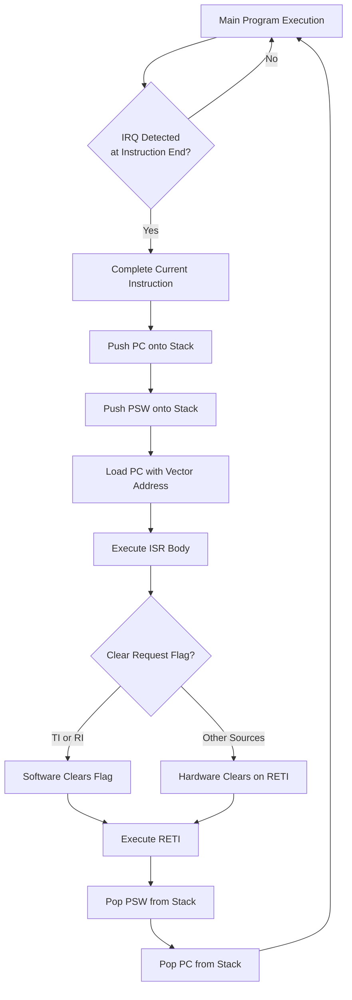
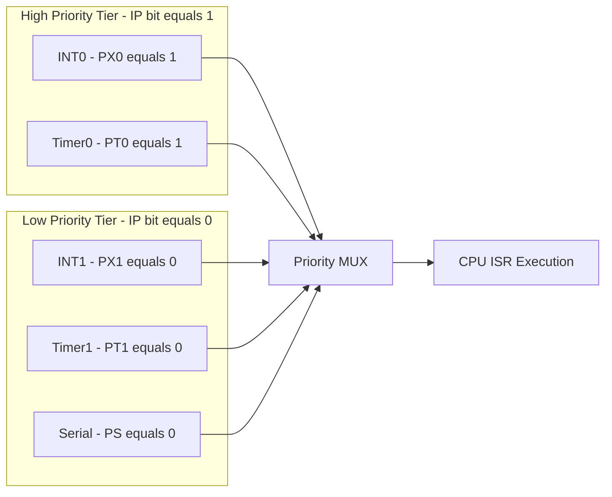
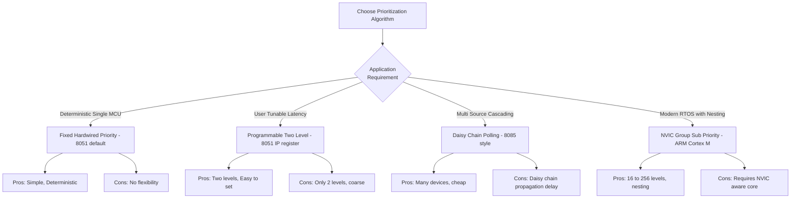
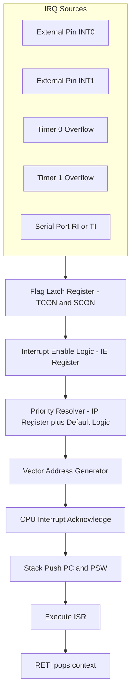
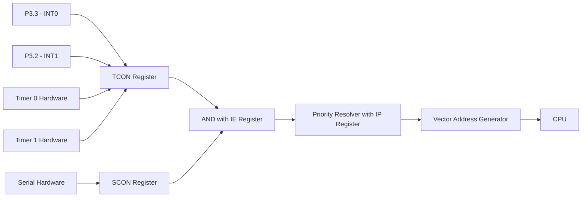
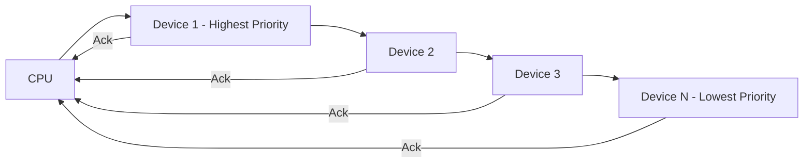
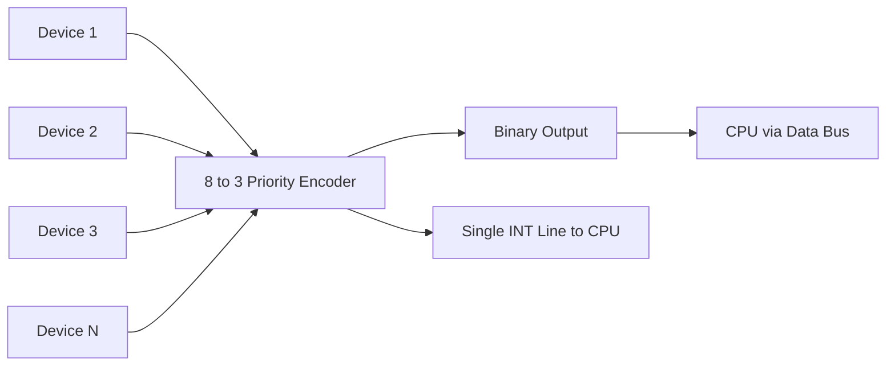

# Interrupt structures: Handling routines prioritization algorithms

<!-- SECTION_1_START -->
# Interrupt Structures, Handling Routines & Prioritization Algorithms

## 1.1 Formal Academic Definition (KTU 2024 Syllabus Terminology)

> [!IMPORTANT]
> **Interrupt**: An asynchronous event (internal or external) that temporarily suspends the main program execution, forcing the CPU to execute a dedicated **Interrupt Service Routine (ISR)** / **Interrupt Handler** to service the event, after which normal program flow is resumed.

> [!IMPORTANT]
> **Interrupt Structure**: The complete hardware–software framework comprising *interrupt sources*, *interrupt request (IRQ) flags*, *interrupt enable/disable logic*, *priority resolution hardware*, and *vector address generation logic* that work in tandem to deliver a controlled response to asynchronous events.

> [!IMPORTANT]
> **Prioritization Algorithm**: A deterministic hardware/software scheme used to resolve simultaneous interrupt requests, ensuring that the most critical event is serviced first. Common algorithms include **Fixed Priority (Hard-wired)**, **Daisy-Chain Polling**, **Cascaded Priority Encoders**, and **Programmable Priority Registers (e.g., 8051 IP register / ARM NVIC)**.

### 1.2 Conceptual Analogy — The Hospital Emergency Room

Imagine a **Chief Doctor (CPU)** in a hospital. While performing scheduled surgery (main program), patients arrive with varying emergencies:

- **Routine Check-up** → Low priority (polled later)
- **Heart Attack** → High priority (must be handled instantly)
- **Fire in the building** → Highest priority (overrides everything)

A **Nurse (Interrupt Controller)** triages the patients and informs the doctor. The doctor:
1. **Finishes the current micro-step** (Instruction boundary)
2. **Saves his notes & surgical tools** (Pushes PC, PSW, registers onto stack)
3. **Rushes to the critical patient** (Jumps to ISR vector address)
4. **Returns and resumes** (Restores context via RETI)

> [!NOTE]
> **Triage = Prioritization Algorithm**, **Nurse = Interrupt Controller**, **Patient = IRQ Source**, **Saving notes = Stack Push**, **Returning = RETI instruction**.

### 1.3 Physical Constants & Standard Metrics (Bolded)

- **8051 Clock Cycle = 12 Oscillator Periods (T = 12 × 1/f_osc)** — determines ISR response latency.
- **8051 Interrupt Response Time = 3 to 8 machine cycles** (calls take 2 cycles, jump to ISR 2 cycles, plus detection).
- **ARM Cortex-M NVIC supports up to 240 interrupts** with **4 bits of priority (16 levels)** in STM32 typical implementations.
- **Interrupt Latency (t_latency)** = Time between IRQ assertion and ISR first instruction fetch.
- **Interrupt Jitter** = Variation in latency between successive identical interrupts.

### 1.4 GeoGebra Visualization — Priority Pre-emption Tree

> [!VISUALIZATION CONTROL]
> **Concept:** Visualization of nested interrupt pre-emption using a priority tree.
> **GeoGebra / Desmos Input Equations:**
> * `f1(x) = 1` (Low Priority — level 0)
> * `f2(x) = 2` (Normal — level 1)
> * `f3(x) = 3` (High — level 2)
> * `f4(x) = 4` (Real-Time Critical — level 3)
> * Plot vertical line `x = 5` with stacked horizontal bars representing pre-emption depth.
> **Visual Description:** Students should see a staircase-like nested block where a high-priority interrupt (level 3) pre-empts a lower-priority one (level 1), forming a layered execution model on the time axis.
<!-- SECTION_1_END -->

<!-- SECTION_2_START -->
# Deep Theoretical Analysis & KTU High-Yield Formula Sheet

## 2.1 Operational Concept — Step-by-Step Breakdown

### A. 8051 Interrupt Structure (Classic KTU Focus)

The 8051 contains **5 interrupt sources** (in original 8051; 8052 has 6):

| # | Source | Flag Bit | Vector Address | Default Priority |
|---|--------|----------|----------------|-----------------|
| 1 | Reset | – | $0000_H$ | Highest |
| 2 | External Interrupt 0 (INT0) | IE0 (TCON.1) | $0003_H$ | 1 |
| 3 | Timer 0 Overflow | TF0 (TCON.5) | $000B_H$ | 2 |
| 4 | External Interrupt 1 (INT1) | IE1 (TCON.3) | $0013_H$ | 3 |
| 5 | Timer 1 Overflow | TF1 (TCON.7) | $001B_H$ | 4 |
| 6 | Serial Port (TI/RI) | TI+RI (SCON.1/.0) | $0023_H$ | 5 (Lowest) |

### B. Interrupt Handling Routine (ISR) Execution Sequence

1. **Detection Phase** — Hardware samples IRQ lines at the **end of every instruction cycle**.
2. **Completion of Current Instruction** — CPU does not interrupt mid-instruction.
3. **Hardware-Generated LCALL** — CPU pushes PC (16-bit) onto stack and loads PC with vector address.
4. **ISR Execution** — User-written code services the device (e.g., clears flag, reads buffer).
5. **RETI Instruction** — Pops PC from stack, restores program flow.
6. **Flag Clearing** — Hardware clears the corresponding request flag (except TI/RI, which are **software-cleared**).

> [!NOTE]
> **Critical Rule:** In 8051, the **hardware clears the flag automatically** for edge-triggered external interrupts and timer overflows, but **TI/RI must be cleared in software** within the ISR.

### C. Interrupt Control Registers (8051)

- **IE Register (Interrupt Enable, address $A8_H$):** Master switch `EA` + 5 individual enables.
- **IP Register (Interrupt Priority, address $B8_H$):** Each bit = `1` → raises that source to **High Priority**.
- **TCON Register (Timer/Counter Control, $88_H$):** Contains IT0, IT1 (trigger type) and IE0, IE1, TF0, TF1 flags.
- **SCON Register ($98_H$):** Holds TI, RI flags for serial port.

### D. Prioritization Algorithms (Detailed)

#### Algorithm 1: **Fixed (Hard-wired) Priority**
The vendor pre-defines an order. In 8051, the order is: **Reset > INT0 > T0 > INT1 > T1 > Serial**. Cannot be changed by user.

#### Algorithm 2: **Programmable Two-Level Priority (8051 IP Register)**
Using the **IP register** at address $B8_H$:

- Each bit set to `1` → that source becomes **High Priority**.
- Within the same level, the original fixed order applies.
- A **high-priority ISR can interrupt a low-priority ISR** (nesting), but a low-priority ISR **cannot** interrupt a high-priority one.

#### Algorithm 3: **Daisy-Chain Polling**
Used in older microprocessors (e.g., 8085 INTR). Devices are connected in a serial chain; the CPU polls through daisy-chain logic to find the highest-priority device requesting service.

#### Algorithm 4: **Cascaded Priority Encoder (ARM NVIC Style)**
Modern ARM Cortex-M uses **NVIC (Nested Vectored Interrupt Controller)** with:
- **Per-interrupt priority registers** (8-bit typically, top 4 bits used → 16 levels).
- **Group Priority** (pre-emption depth) and **Sub-Priority** (tie-breaker).
- **Lower numeric value = higher priority** (in NVIC convention).

### E. Trigger Modes for External Interrupts

| Mode | ITx Bit | Behavior |
|------|---------|----------|
| **Level-Triggered (LT)** | $0$ | Request flag set on low level; must be removed before RETI or it re-triggers. |
| **Edge-Triggered (ET)** | $1$ | Request flag set on falling edge; **latched** and held until serviced. |

## 2.2 KTU Formula Sheet / Cheat Sheet

> [!IMPORTANT]
> All equations below are **high-yield for KTU board examinations**.

| # | Concept | Formula / Value | Unit / Note |
|---|---------|----------------|-------------|
| 1 | Machine Cycle Period | $T_{mc} = \dfrac{12}{f_{osc}}$ | seconds |
| 2 | Interrupt Latency (8051) | $t_{lat} = (3 \text{ to } 8) \times T_{mc}$ | seconds |
| 3 | Time to complete ISR | $t_{ISR} = N_{inst} \times 12 \times T_{osc}$ | seconds |
| 4 | Nested ISR Depth | $d = \min(\text{High Priority Sources}, \text{Stack Depth})$ | levels |
| 5 | NVIC Priority Decode | $\text{Group Prio} = \text{PRI}_{n}[7:4]$, $\text{Sub Prio} = \text{PRI}_{n}[3:0]$ | 4-bit each |
| 6 | Vector Address (8051) | $V = 8n + 3$ where $n$ = interrupt index | hex |
| 7 | IE Master Enable | $EA = 1$ AND individual $EX_x / ET_x / ES = 1$ | Boolean |
| 8 | Effective Priority (8051) | $P_{eff} = 2 \times P_{IP} + P_{default}$ | numeric rank |

> [!NOTE]
> Formula 8 is a KTU favourite: if `IP bit = 1`, source jumps to top tier. If multiple sources are at the same tier, default 8051 fixed order decides.

## 2.3 Real-World Engineering Utility

- **Automotive ECUs (Engine Control Units)**: Use **Cascaded NVIC** to ensure airbag deployment ISR pre-empts infotainment ISR.
- **Industrial PLCs**: Daisy-chain priority for deterministic sub-millisecond response.
- **IoT Edge Devices (8051-based)**: Programmable IP register for battery-aware scheduling.
- **Medical Pacemakers**: Hard-wired fixed priority where life-critical events outrank diagnostics absolutely.
- **RTOS Kernels**: Use the same prioritization algorithms as the underlying MCU hardware.
<!-- SECTION_2_END -->

<!-- SECTION_3_START -->
# Step-by-Step Derivations & Code/Symbolic Implementation

## 3.1 Derivation 1 — Vector Address Calculation for 8051

The 8051 reserves **8 bytes** between consecutive interrupt vectors. Starting from $0003_H$ for INT0, each subsequent vector is offset by 8.

$$
\begin{aligned}
V_{INT0} &= 0003_H \\
V_{T0} &= 0003_H + 0008_H = 000B_H \\
V_{INT1} &= 000B_H + 0008_H = 0013_H \\
V_{T1} &= 0013_H + 0008_H = 001B_H \\
V_{Serial} &= 001B_H + 0008_H = 0023_H
\end{aligned}
$$

**Generalized Form:**

$$
V_n = 8n + 3, \quad n \in \{0, 1, 2, 3, 4\}
$$

where $n$ is the interrupt index (0 = INT0, 4 = Serial). Since 8 bytes is often insufficient for full ISR code, a common KTU technique is to place a **LJMP instruction** at the vector address redirecting to the actual ISR located elsewhere in code memory.

## 3.2 Derivation 2 — Effective Priority Score (KTU 2024 Pattern)

Given multiple simultaneous interrupts, the **Effective Priority Rank** is computed as:

$$
P_{eff}(i) = 2 \times IP_i + \text{DefaultRank}(i)
$$

where $IP_i \in \{0, 1\}$ and $\text{DefaultRank}(i) \in \{1, 2, 3, 4, 5\}$ for the 5 interruptable sources.

**Example Problem:** If INT0 (IP=1), T0 (IP=0), and Serial (IP=0) all request simultaneously, find the servicing order.

$$
\begin{aligned}
P_{eff}(INT0) &= 2(1) + 1 = 3 \\
P_{eff}(T0) &= 2(0) + 2 = 2 \\
P_{eff}(Serial) &= 2(0) + 5 = 5
\end{aligned}
$$

Servicing order: **T0 → INT0 → Serial** (lower $P_{eff}$ = higher actual priority).

## 3.3 Derivation 3 — Interrupt Latency for a Given Oscillator

If $f_{osc} = 11.0592 \text{ MHz}$ (standard 8051 crystal for baud-rate generation):

$$
T_{mc} = \frac{12}{11.0592 \times 10^6} = 1.085 \text{ μs}
$$

Maximum ISR latency = $8 \times T_{mc}$:

$$
t_{lat(max)} = 8 \times 1.085 \text{ μs} = 8.68 \text{ μs}
$$

For a system requiring **< 10 μs response**, this is acceptable. For a faster 8051 variant at 24 MHz:

$$
T_{mc} = \frac{12}{24 \times 10^6} = 0.5 \text{ μs} \Rightarrow t_{lat(max)} = 4 \text{ μs}
$$

## 3.4 Symbolic / Code Implementation (8051 C — Keil Style)

```c
#include <reg51.h>

/* ---------- Function Prototypes ---------- */
void ISR_INT0(void)   interrupt 0;   /* Vector 0003H - External Int 0 */
void ISR_T0(void)     interrupt 1;   /* Vector 000BH - Timer 0      */
void ISR_INT1(void)   interrupt 2;   /* Vector 0013H - External Int 1 */
void ISR_T1(void)     interrupt 3;   /* Vector 001BH - Timer 1      */
void ISR_Serial(void) interrupt 4;   /* Vector 0023H - Serial Port  */

/* ---------- Main Program ---------- */
void main(void) {
    /* Step 1: Configure Trigger Modes (TCON bits) */
    IT0 = 1;   /* INT0 = Edge-Triggered (Falling) */
    IT1 = 0;   /* INT1 = Level-Triggered (Low)    */

    /* Step 2: Set Priority using IP Register */
    PX0 = 1;   /* INT0  -> High Priority */
    PT0 = 0;   /* Timer0 -> Low Priority  */
    PX1 = 0;   /* INT1  -> Low Priority  */
    PT1 = 0;   /* Timer1 -> Low Priority  */
    PS  = 0;   /* Serial -> Low Priority  */

    /* Step 3: Enable Individual Interrupts */
    EX0 = 1;   /* Enable INT0  */
    ET0 = 1;   /* Enable T0    */
    EX1 = 1;   /* Enable INT1  */
    ET1 = 1;   /* Enable T1    */
    ES  = 1;   /* Enable Serial*/

    /* Step 4: Enable Global Interrupt (Master Switch) */
    EA  = 1;

    /* Step 5: Configure Timer 0 in Mode 1 (16-bit) */
    TMOD = (TMOD & 0xF0) | 0x01;
    TH0  = 0xFC;   /* Reload for ~1 ms @ 11.0592 MHz */
    TL0  = 0x18;
    TR0  = 1;      /* Start Timer 0 */

    while (1) {
        /* Background idle task */
        P1 ^= 0x01;  /* Toggle P1.0 every cycle (LED blink) */
    }
}

/* ---------- Interrupt Service Routines ---------- */
void ISR_INT0(void) interrupt 0 {
    /* Save critical SFRs if needed */
    P2 = 0x01;     /* Action: set P2.0 high on INT0 event */
    /* Edge flag IE0 is auto-cleared by hardware on RETI */
}

void ISR_T0(void) interrupt 1 {
    /* Reload Timer 0 */
    TH0 = 0xFC;
    TL0 = 0x18;
    TF0 = 0;       /* Flag actually auto-cleared, but explicit safe */
    P3 ^= 0x20;    /* Toggle P3.5 (LED) every overflow */
}
```

## 3.5 Symbolic Implementation — ARM Cortex-M NVIC Priority Setup (STM32 Style)

```c
/* Enable clock for GPIO & AFIO */
RCC->APB2ENR |= RCC_APB2ENR_IOPAEN | RCC_APB2ENR_AFIOEN;

/* Set Priority Group: 2 bits Pre-emption, 2 bits Sub */
SCB->AIRCR = (SCB->AIRCR & ~SCB_AIRCR_PRIGROUP_Msk) | (0x4 << 8);

/* Enable EXTI0 Interrupt with Pre-emption Priority = 0, Sub = 1 */
NVIC->IP[EXTI0_IRQn]     = (0 << 4) | 0x1;  /* Higher numeric IP value = lower priority */
NVIC->ISER[0]            = (1 << EXTI0_IRQn);

/* Enable EXTI1 with Pre-emption Priority = 1, Sub = 0 (lower than EXTI0) */
NVIC->IP[EXTI1_IRQn]     = (1 << 4) | 0x0;
NVIC->ISER[0]            |= (1 << EXTI1_IRQn);
```

> [!NOTE]
> **ARM NVIC Priority Rule:** *Lower numerical value = Higher priority.* This is the **opposite** of the 8051 convention. This is a frequent KTU exam pitfall.
<!-- SECTION_3_END -->

<!-- SECTION_4_START -->
# Structural Diagrams & Schematics

## 4.1 Mermaid Flow — 8051 Interrupt Handling Sequence



## 4.2 Mermaid — Two-Level Programmable Priority Resolution



## 4.3 Mermaid — Comparison of Prioritization Algorithms



## 4.4 Block Diagram — Interrupt Controller Internal Architecture


<!-- SECTION_4_END -->

<!-- SECTION_5_START -->
# KTU 2024 Scheme Examination Question Bank & Topic Recap

## Part A — 3 Mark Questions (Short Answer)

### Q1. [KTU University Exam – July 2024]
**Define an Interrupt Service Routine (ISR). Mention any two characteristics of an ISR.**

**Model Answer (3 marks):**
An **Interrupt Service Routine (ISR)** is a special function executed in response to a hardware or software interrupt. It services the requesting device, performs minimal processing, and returns via the RETI instruction.
**Characteristics:**
1. ISR must be **short and fast** to avoid blocking lower-priority interrupts.
2. ISR should **avoid calling long delay routines** and should not pass parameters like normal functions.
*(1 mark for definition + 1 mark each for two characteristics)*

### Q2. [KTU University Exam – Dec 2023]
**Differentiate between Level-Triggered and Edge-Triggered external interrupts in 8051.**

**Model Answer (3 marks):**

| Feature | Level-Triggered (ITx = 0) | Edge-Triggered (ITx = 1) |
|---------|--------------------------|--------------------------|
| Activation | Low level on pin | Falling edge on pin |
| Flag behavior | Continuously set while low | Latched once on edge |
| Re-trigger | Will re-enter if pin still low | Will not re-trigger |
| Use case | Wired-OR interrupt lines | Single event detection |

## Part B — 14 Mark Questions (Module Internal Choice)

### Question A — 14 Marks [KTU University Exam – July 2024 Pattern]

**(a)** With a neat block diagram, explain the **interrupt structure of 8051 microcontroller**. List all the interrupts with their vector addresses and default priorities. **(7 Marks)**

**Model Solution:**

The 8051 has **5 interrupt sources** plus Reset.

| Interrupt | Flag | Vector Address | Default Priority |
|-----------|------|----------------|-----------------|
| Reset | – | $0000_H$ | 1 (Highest) |
| External Int 0 (INT0) | IE0 | $0003_H$ | 2 |
| Timer 0 Overflow | TF0 | $000B_H$ | 3 |
| External Int 1 (INT1) | IE1 | $0013_H$ | 4 |
| Timer 1 Overflow | TF1 | $001B_H$ | 5 |
| Serial Port | TI, RI | $0023_H$ | 6 (Lowest) |

**Block Diagram:**



**[Block diagram with interrupts: 3 Marks] [Table of vector addresses: 2 Marks] [Working explanation: 2 Marks]**

**(b)** Explain the **IP register** of 8051 and write a C program to configure INT0 as high priority, edge-triggered, and toggle P1.0 inside its ISR. **(7 Marks)**

**Model Solution:**

**IP Register (Address $B8_H$, Bit-Addressable):**

| Bit | 7 | 6 | 5 | 4 | 3 | 2 | 1 | 0 |
|-----|---|---|---|---|---|---|---|---|
| Name | – | – | – | PS | PT1 | PX1 | PT0 | PX0 |
| Reset | x | x | x | 0 | 0 | 0 | 0 | 0 |

- `PX0 = 1` → INT0 set to **high priority**.
- `PS = 1` → Serial set to high priority.

**C Program:**

```c
#include <reg51.h>

sbit LED = P1^0;

void ext_int0_isr(void) interrupt 0 {
    LED = ~LED;   /* Toggle P1.0 */
}

void main(void) {
    IT0 = 1;     /* Edge-triggered (falling) */
    PX0 = 1;     /* High priority */
    EX0 = 1;     /* Enable INT0 */
    EA  = 1;     /* Global enable   */
    while(1);
}
```

**[IP register description: 2 Marks] [C code configuration: 2 Marks] [ISR logic + compilation: 2 Marks] [Logic explanation: 1 Mark]**

---

### Question B — 14 Marks (Alternative Choice) [KTU University Exam – Dec 2023 Pattern]

**(a)** Compare the **daisy-chain polling** and **cascaded priority encoder** methods of interrupt resolution with suitable diagrams. **(7 Marks)**

**Model Solution:**

**Daisy-Chain Polling:**



- Devices are connected in a serial chain. CPU sends an INTA signal that propagates sequentially.
- The first device in the chain with a pending request grabs the INTA and responds.
- **Pros:** Simple, cheap. **Cons:** Propagation delay; the last device has the highest latency.

**Cascaded Priority Encoder:**



- All devices feed a parallel priority encoder.
- Encoder outputs the binary index of the highest-priority active request in **one cycle**.
- **Pros:** Fast, fixed delay. **Cons:** Limited to 8 or 16 devices per encoder; cascading needed for more.

**[Daisy-chain diagram + explanation: 3 Marks] [Cascaded diagram + explanation: 3 Marks] [Comparison table: 1 Mark]**

**(b)** Describe the **ARM Cortex-M NVIC** priority scheme. How is pre-emption priority different from sub-priority? **(7 Marks)**

**Model Solution:**

The **Nested Vectored Interrupt Controller (NVIC)** is the standard interrupt controller in ARM Cortex-M processors. Key features:

- Supports up to **240 interrupts** plus 16 system exceptions.
- Each interrupt has an **8-bit priority register** (typically only the upper 4 bits are implemented → **16 priority levels**).
- Priority fields split into **Pre-emption Priority (Group Priority)** and **Sub-Priority** via the **PRIGROUP** field in `AIRCR`.

**Rules:**
1. An ISR with **lower pre-emption priority value** can interrupt one with a higher value (i.e., nesting).
2. If two ISRs have the same pre-emption priority, the one with **lower sub-priority value** runs first.
3. If both pre-emption and sub-priority match, the **lower IRQ number** wins.

**Example:** Configured `PRIGROUP = 0x4` (2 bits pre-emption, 2 bits sub):

- EXTI0: Pre-emption = 0, Sub = 1 → binary priority `0000 0001`
- EXTI1: Pre-emption = 1, Sub = 0 → binary priority `0100 0000`

Here, **EXTI0 can pre-empt EXTI1**, but not vice versa.

**[NVIC overview: 2 Marks] [Priority register structure: 2 Marks] [Pre-emption vs Sub-priority rule: 2 Marks] [Example: 1 Mark]**

---

> [!WARNING]
> **KTU Examiner's Valuation Warning — Common Pitfalls**
> 1. **Forgetting to enable the Global bit `EA`** in IE register → ISR never executes, even if individual bits are set. (-1 to -2 marks)
> 2. **Confusing IP register convention** — In 8051, `IP bit = 1` = HIGH priority. In ARM NVIC, lower number = HIGH priority. Exam questions often swap these. (-2 marks)
> 3. **Failing to clear TI/RI flags in software** inside the Serial ISR → causes immediate re-entry into the ISR. (-1 to -2 marks)
> 4. **Forgetting to reload Timer values** inside Timer ISRs in Mode 1 (16-bit) — the timer restarts from 0, breaking timing. (-2 marks)
> 5. **Writing bulky code inside ISR** (e.g., printf, long loops) — leads to missed interrupts. (-1 mark deduction for awareness)
> 6. **Incorrect vector address** like $0008_H$ instead of $000B_H$ for Timer 0. (-1 to -2 marks)
> 7. **Drawing incomplete block diagrams** (missing IE, IP, or TCON blocks) → -2 marks for diagram.

---

## Topic Recap & Important Things to Remember

- An **interrupt** is an asynchronous event that diverts the CPU from its main task to execute an **ISR**, then returns via **RETI**.
- The **8051 has 5 user-interruptable sources** (INT0, T0, INT1, T1, Serial) + Reset, with fixed vector addresses from $0003_H$ to $0023_H$, **spaced 8 bytes apart**.
- **IE register** enables interrupts globally (`EA`) and individually.
- **IP register** provides **two-level programmable priority** — bit = 1 raises that source to high priority; default order applies within each tier.
- **TCON** holds the IRQ flags and trigger mode bits (IT0, IT1).
- **External interrupts** can be **edge-triggered (ITx=1, falling edge)** or **level-triggered (ITx=0, low level)**.
- **TI/RI** flags of the serial port must be **cleared in software** within the ISR; all other flags are **hardware-cleared on RETI**.
- **ISR response time** = 3 to 8 machine cycles; for $f_{osc} = 11.0592$ MHz, $T_{mc} = 1.085$ μs.
- A **high-priority ISR can pre-empt a low-priority ISR**, enabling **nested interrupts**, but not vice versa.
- **Daisy-chain polling** is cheap but suffers from propagation delay; **cascaded priority encoders** offer fixed single-cycle latency.
- **ARM Cortex-M NVIC** supports **16 (or more) priority levels** with **Pre-emption + Sub-priority** grouping via the `PRIGROUP` bits in `AIRCR`.
- **NVIC convention:** *Lower numeric priority value = Higher priority* (opposite of 8051).
- ISRs must be **short, fast, and non-blocking**; avoid floating-point heavy or print operations in time-critical handlers.
- For 8051 C programming, the keyword **`interrupt <n>`** assigns the correct vector address automatically (n = 0 for INT0 … n = 4 for Serial).
<!-- SECTION_5_END -->
