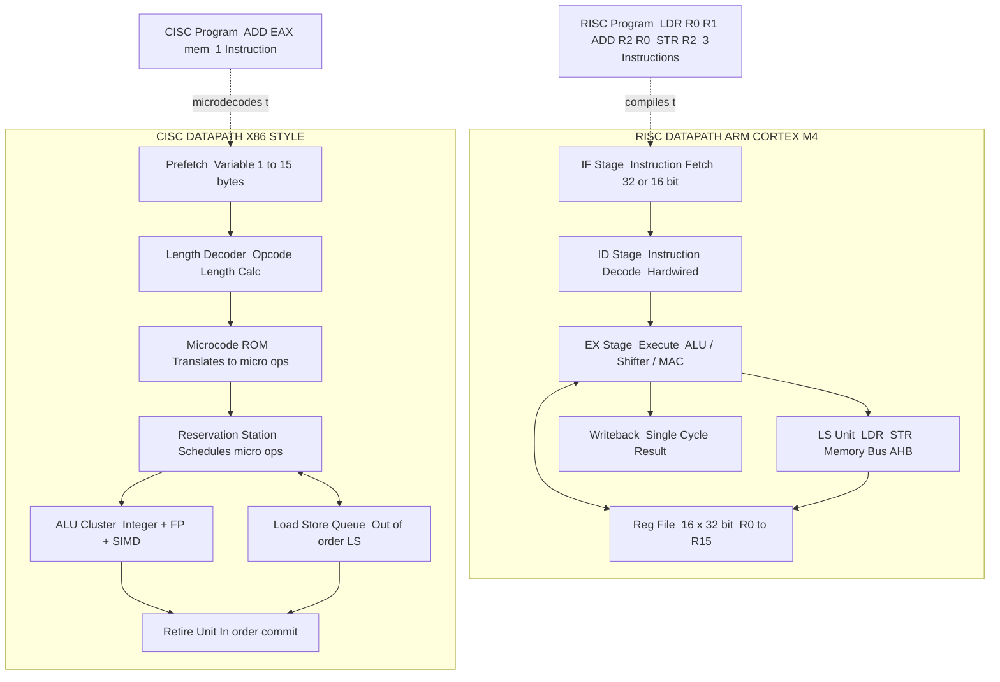
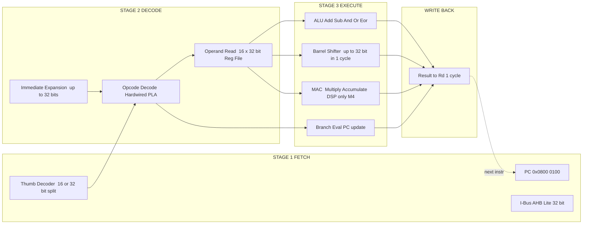
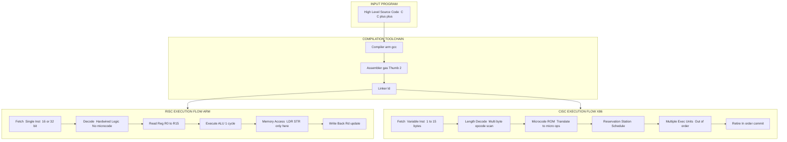
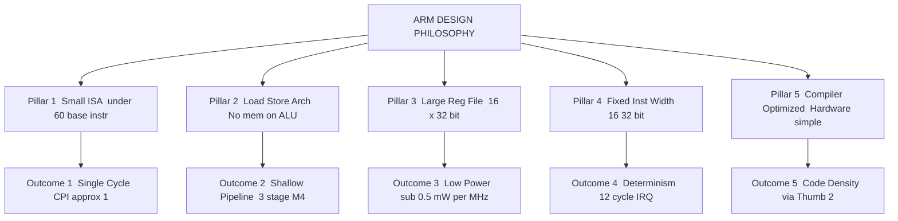

# ARM design philosophy, RISC architecture features contrast with CISC options

<!-- SECTION_1_START -->
# ARM Design Philosophy & RISC vs CISC Architecture

## 1.1 Formal Definition (KTU 2024 Syllabus Terminology)

> [!NOTE]
> **ARM (Advanced RISC Machine)** is a family of reduced instruction set computing (RISC) architectures for computer processors, configured for various environments. ARM processors are characterized by a **load–store architecture**, a **fixed 32-bit instruction width**, a **large uniform register file**, and a design philosophy that emphasizes **simplicity, energy efficiency, and deterministic real-time performance** — making ARM Cortex-M the dominant MCU core in modern embedded and IoT systems.

In the context of the **KTU 2024 Scheme (PECST501 – Microcontrollers)**, ARM's design philosophy refers to the *guiding engineering principles* used by ARM Holdings when defining the Instruction Set Architecture (ISA), pipeline model, and on-chip peripheral integration strategy. These principles — borrowed from Berkeley RISC research (Patterson, 1980) and refined at Acorn Computers (1985) — drive the architectural decisions for the Cortex-M family used in STM32, NXP LPC, and Tiva-C platforms.

> [!IMPORTANT]
> **KTU 2024 Syllabus Highlight (Module 3):** Students must clearly articulate *why* ARM chose RISC over CISC, and how that choice maps to microcontroller metrics such as **code density, interrupt latency, power dissipation, and silicon area**.

---

## 1.2 Conceptual Analogy / Intuition

> [!TIP]
> **🍳 The Kitchen Analogy — RISC vs CISC**
>
> Imagine two kitchens preparing identical meals:
>
> | Kitchen | Philosophy | Tools (Instructions) |
> |---|---|---|
> | **CISC Kitchen (x86 style)** | 1 mega-appliance that "does everything" (blends, cooks, kneads in one go) | Few, complex, multi-cycle instructions |
> | **RISC Kitchen (ARM style)** | Many simple, dedicated tools (knife, peeler, whisk) | Many small, single-cycle instructions |
>
> **RISC kitchen outcome:** Smaller appliances → less power consumption (no heavy motors), faster per-action execution, but the chef must combine steps explicitly. This mirrors the ARM **load-store** model: data must be *explicitly* moved to registers before any operation.
>
> **CISC kitchen outcome:** Heavy, all-in-one appliances → more power, fewer instructions to write, but execution internally breaks each complex instruction into many micro-operations. This is why x86 CPUs today actually translate CISC instructions into RISC-like micro-ops internally — proving the *engineering* advantages of RISC.

### 1.2.1 Physical Constants & Standard Metrics

> [!IMPORTANT]
> The following metrics characterize the ARM Cortex-M philosophy and are frequently referenced in KTU numerical/design questions:
>
> - **Thumb-2 instruction width:** 16 bits (most common) and 32 bits (mixed) — average ≈ **23 bits**, achieving near-ARM code density
> - **General-purpose registers:** **13 × 32-bit** (R0–R12) + **3 special** (R13=SP, R14=LR, R15=PC) = **16 × 32-bit core registers**
> - **Cortex-M4 pipeline depth:** **3 stages** (Fetch, Decode, Execute) — for deterministic interrupt response
> - **Typical interrupt latency (Cortex-M4):** **12 clock cycles** (tail-chaining reduces this further)
> - **Power figure of merit:** typically **< 0.5 mW/MHz** (active) for Cortex-M0+

---

## 1.3 The Five Pillars of ARM's Design Philosophy

ARM's design philosophy can be summarized in **five guiding principles** (the "RISC manifesto" as applied to embedded MCUs):

1. **Simplicity of instruction set** — Each instruction performs one basic operation, allowing single-cycle (or fixed-cycle) execution in a shallow pipeline.
2. **Load–Store architecture** — The CPU operates *only* on data inside registers. Memory is accessed **only** via explicit `LDR` (load) and `STR` (store) instructions.
3. **Large, uniform register file** — All general-purpose registers are identical and interchangeable, simplifying the compiler's register allocation and reducing instruction encoding overhead.
4. **Fixed / predictable instruction length** — Mostly 32-bit (ARM state) or 16/32-bit mixed (Thumb/Thumb-2), simplifying fetch-decode logic.
5. **Hardware simplicity for compiler friendliness** — Complex behavior is *delegated to the compiler* rather than baked into microcode, keeping the silicon small and the power budget low.

> [!NOTE]
> **Historical Note:** The original ARM1 (1985) was designed with this philosophy in mind because the Acorn team found that complex CISC chips (like the Intel 80286) were *too large*, *too power-hungry*, and *too slow* for the BBC Micro's successor. The RISC approach allowed a 32-bit CPU to fit in **fewer than 25,000 transistors** — a tenth of the Intel 80386.

---

## 1.4 GeoGebra / Desmos Visualization

> [!VISUALIZATION CONTROL]
> **Concept:** Comparing the *addressing mode density* of RISC vs CISC instruction encodings (a 32-bit instruction word).
>
> **GeoGebra / Desmos Input Equations:**
> - *Plot a stacked bar* showing the breakdown of a 32-bit instruction:
>   - RISC: `Opcode = 6 bits, Rd = 5 bits, Rn = 5 bits, Rm = 5 bits, Shamt = 5 bits, Func = 6 bits`  (sum = 32)
>   - CISC (x86-style): `Prefix = 0-15 bytes, Opcode = 1-3 bytes, ModR/M = 1 byte, SIB = 0-1 byte, Displacement = 0-4 bytes, Immediate = 0-4 bytes` (variable)
> - **Visual Description:** A 32-bit RISC bar is *fully utilized and predictable*; a CISC bar is *variable length*, often showing "wasted" prefix bytes. Students should see why RISC decoding is **one clock cycle** while CISC decoding requires **microcode ROM lookups**.

<!-- SECTION_1_END -->

<!-- SECTION_2_START -->
# Deep Theoretical Analysis & KTU High-Yield Formula Sheet

## 2.1 The RISC Architectural Contract — Step-by-Step Logic

The RISC design philosophy is not just "fewer instructions." It is a tightly-coupled set of architectural commitments that, taken together, produce the predictability ARM needs for real-time embedded systems.

### Step 1 — Define a Small, Orthogonal Instruction Set
**Why:** A small set means the CPU's *decoder* logic is simple, the *control unit* uses hardwired logic (no microcode ROM), and the *clock period* can be shortened. **How:** ARM defines a base ISA of **~60 base instructions** in Cortex-M (vs. **>1000** in x86). Each instruction is *orthogonal* — it does not have hidden side effects on flags or memory beyond what is documented.

### Step 2 — Use a Load-Store Memory Model
**Why:** Separating data processing (in registers) from memory access allows the *execute stage* to be decoupled from the slower memory bus, and the *compiler* to schedule loads/stores explicitly. **How:** Only two instruction classes touch memory — `LDR` (load) and `STR` (store). All arithmetic/logic operates on registers.

### Step 3 — Provide a Large, Symmetric Register File
**Why:** With many registers, the compiler can keep most operands in CPU registers, **eliminating redundant memory traffic** (the von Neumann bottleneck). **How:** ARM exposes **13 general-purpose + 3 special = 16 registers** in user mode; the compiler can also map local variables across them via AAPCS (ARM Architecture Procedure Call Standard).

### Step 4 — Fix the Instruction Length
**Why:** A fixed length means the *fetch unit* always knows the next-instruction boundary, enabling **single-cycle fetch** and **easy pipelining**. **How:** ARM state = 32-bit fixed; Thumb-2 state = 16/32-bit mixed but the high bit of each halfword is a predictable tag, so the decoder remains simple.

### Step 5 — Delegate Complexity to the Compiler
**Why:** Hardware is expensive (silicon area, power). Software is cheap (one-time NRE). **How:** ARM does *not* implement complex addressing modes in hardware — they are synthesized by the compiler from simple primitives. Likewise, hardware multiplication/division on early ARM was optional; today, Cortex-M4 includes single-cycle MAC (multiply-accumulate) for DSP.

### Step 6 — Optimize for the Common Case
**Why:** Embedded code spends ~80% of cycles in ~20% of code (Pareto principle). **How:** ARM's most common instructions — `MOV`, `ADD`, `LDR`, `STR`, `B` — are tuned for **single-cycle throughput** and **single-cycle latency**.

---

## 2.2 CISC Architectural Contract (Contrast)

CISC (Complex Instruction Set Computing), exemplified by **Intel x86, Motorola 68k, and VAX**, embodies a *different* design philosophy:

| Design Goal | CISC Approach |
|---|---|
| Reduce semantic gap between HLL and machine code | Provide high-level, multi-operation instructions (e.g., `MOVSB` does load-store-move-pointer-increment in one go) |
| Minimize program size (memory was expensive in 1970s) | Use **variable-length** instructions, register-mem & mem-mem operands, complex addressing modes |
| Offload work from (slow) compiler to (fast) hardware | Implement complex addressing modes (SIB, base+index*scale+disp) in microcode |
| Backward compatibility | Preserve legacy instruction encodings (x86 has accumulated ISA baggage since 1978) |

> [!IMPORTANT]
> **The Modern Twist:** Every modern x86 CPU (Intel Core, AMD Ryzen) **internally translates CISC instructions into RISC-like micro-operations (µops)** before execution. This is a tacit admission that the *engineering* advantages of RISC are real — but the *software compatibility* advantage of CISC keeps x86 dominant in PCs. ARM cannot do this on MCUs because of power/area constraints.

---

## 2.3 KTU High-Yield Formula / Fact Sheet

> [!NOTE]
> **Engineering Utility of RISC in Embedded Systems:** RISC's deterministic instruction timing is what enables **hard real-time** scheduling. When every instruction takes a known number of cycles, Worst-Case Execution Time (WCET) analysis becomes tractable — a *legal* requirement in automotive (ISO 26262), aerospace (DO-178C), and medical (IEC 62304) systems. CISC's variable instruction timing makes formal WCET analysis nearly impossible, which is why ARM Cortex-M (RISC) dominates these sectors and CISC has retreated to PCs/servers.

| # | Parameter / Concept | RISC (ARM Cortex-M) | CISC (x86) |
|---|---|---|---|
| 1 | **Instruction length** | Fixed 32-bit (ARM) / 16/32-bit (Thumb-2) | Variable 1–15 bytes |
| 2 | **Instruction count (ISA)** | ~60 base (Cortex-M4) | > 1500 (x86-64) |
| 3 | **Memory operands per instruction** | 0 (load-store) | 0–2 (register-mem, mem-mem) |
| 4 | **Addressing modes** | ~9 simple | > 20 complex (incl. SIB) |
| 5 | **Pipeline depth (typical)** | 3 stages (M0/M3/M4) | 14–20 stages (modern x86) |
| 6 | **Control unit** | Hardwired (combinational) | Microcoded + decoded to µops |
| 7 | **Register file** | 16 × 32-bit (Cortex-M) | 16 × 64-bit (x86-64 GPRs) |
| 8 | **Code density** | Lower (ARM) / High (Thumb-2) | High (variable-length) |
| 9 | **Power / MHz (typ. 90 nm)** | **< 0.5 mW/MHz** (M0+) | ~10–30 mW/MHz (Core) |
| 10 | **Transistor count (CPU core)** | ~12 k–100 k | ~1 B (modern Core) |
| 11 | **Compiler dependency** | High (compiler is the optimizer) | Low (hardware does complex work) |
| 12 | **Interrupt latency (typical)** | **12 cycles** (Cortex-M4) | 100+ cycles (modern x86) |
| 13 | **Typical application** | MCUs, IoT, mobile, automotive | PCs, servers, HPC |
| 14 | **Real-time suitability** | Excellent (deterministic) | Poor (non-deterministic) |

### 2.3.1 Key Formulas / Quantitative Relationships

> [!NOTE]
> The following relations are testable on KTU 2024 ESE (numerical/descriptive) — they quantify why RISC wins on power and area.

**Equation 2.1 — Average Cycles Per Instruction (CPI) for RISC:**
$$
\text{CPI}_{\text{RISC}} = \frac{\sum_{i=1}^{n} \left( f_i \cdot \text{CPI}_i \right)}{\sum_{i=1}^{n} f_i} \;\approx\; 1.0 \text{ to } 1.3
$$
where $f_i$ is the frequency of instruction $i$ in the program trace and $\text{CPI}_i$ is its cycle cost.

**Equation 2.2 — CPU Execution Time (Amdahl-derived):**
$$
T_{\text{exec}} \;=\; N_{\text{inst}} \times \text{CPI} \times T_{\text{clk}}
$$
where $N_{\text{inst}}$ is dynamic instruction count, $\text{CPI}$ is cycles per instruction, $T_{\text{clk}}$ is clock period. RISC reduces $\text{CPI}$ but may *increase* $N_{\text{inst}}$ — a key trade-off.

**Equation 2.3 — Memory Traffic Reduction via Register File:**
$$
R_{\text{mem}} \;=\; 1 - \frac{\text{Registers accessed in trace}}{N_{\text{inst}}}
$$
A larger register file lowers $R_{\text{mem}}$, cutting dynamic power $P \propto C V^2 f$ of off-chip accesses.

**Equation 2.4 — Power / Energy Trade-off:**
$$
P_{\text{dyn}} \;=\; \alpha \cdot C \cdot V_{dd}^{2} \cdot f_{\text{clk}}
$$
where $\alpha$ is the switching activity factor. RISC's smaller $\alpha$ (fewer memory accesses) and shorter pipelines (lower $C$) yield the embedded-power advantage.

---

## 2.4 Real-World Engineering Utility

| Domain | Why RISC/ARM Wins |
|---|---|
| **Automotive ECU** (Bosch, NXP S32K3) | Determinism → ISO 26262 ASIL-D compliance |
| **IoT sensors** (Nordic nRF, STM32WB) | mW/MHz → multi-year coin-cell life |
| **Mobile SoC** (Apple A-series, Qualcomm) | Power density → fanless phones |
| **Aerospace flight control** (ARM Cortex-R) | Hard real-time + radiation tolerance |
| **Edge ML** (Cortex-M55 + Ethos-U55) | M-profile DSP extensions, low-latency inference |
| **Industrial PLC** (STM32, TI Tiva-C) | Determinism + long product life cycles |

> [!TIP]
> **KTU Memory Hook:** "*RISC = Reduced Instruction Set, Reduced Energy, Reduced Errors*." CISC = "Complex Instructions, Complex silicon, Complex timing."

<!-- SECTION_2_END -->

<!-- SECTION_3_START -->
# Step-by-Step Derivations & Symbolic Implementation

## 3.1 Derivation: Quantitative Proof That RISC Reduces CPI

> [!EXAM RELEVANCE]
> This derivation is a *favourite* KTU Module-3 short-answer/numerical question. Mastering it earns 3–5 marks on ESE.

### Problem
A program trace on a hypothetical CISC processor has the following instruction mix:

| Instruction Class | Frequency $f_i$ (× 10⁶) | CPI on CISC | CPI on RISC (after recompile) |
|---|---|---|---|
| Register-register ALU | 30 | 1 | 1 |
| Memory load | 18 | 4 | 1 (LDR) |
| Memory store | 12 | 4 | 1 (STR) |
| Complex address calc | 5 | 12 | 4 (built from 4 RISC ops) |
| Branch | 8 | 3 | 2 |
| Multi-cycle multiply | 4 | 25 | 1 (Cortex-M4 MAC) |
| String move (CISC only) | 3 | 50 | n/a (not present) |

**Compute the weighted CPI for CISC and the equivalent RISC sequence, and the speed-up.**

---

### Step 1 — Compute the CISC CPI

**Step 1.1 — Sum of $f_i \times \text{CPI}_i$ for CISC:**

$$
\begin{aligned}
S_{\text{CISC}} &= (30 \times 1) + (18 \times 4) + (12 \times 4) + (5 \times 12) + (8 \times 3) + (4 \times 25) + (3 \times 50) \\[2pt]
&= 30 + 72 + 48 + 60 + 24 + 100 + 150 \\[2pt]
&= 484 \;\;\text{(million cycles)}
\end{aligned}
$$

**Step 1.2 — Sum of $f_i$ for CISC:**

$$
S_{\text{count}} = 30 + 18 + 12 + 5 + 8 + 4 + 3 = 80 \;\;\text{(million instructions)}
$$

**Step 1.3 — Compute weighted CPI:**

$$
\text{CPI}_{\text{CISC}} \;=\; \frac{S_{\text{CISC}}}{S_{\text{count}}} \;=\; \frac{484}{80} \;=\; 6.05 \;\;\text{cycles/instruction}
$$

---

### Step 2 — Compute the RISC CPI (with recompiled $f_i'$)

> [!NOTE]
> The "complex address calc" CISC instruction (CPI 12) is replaced by **4 RISC primitives** (CPI 4 total). The "string move" CISC instruction (CPI 50) is replaced by a **loop of 20 RISC instructions** (CPI ~1 each) — but for fair comparison, we hold the *functional work* constant by treating the replacement as $3 \times 20 = 60$ million RISC instructions.

| Class | RISC $f_i'$ (× 10⁶) | RISC CPI |
|---|---|---|
| ALU | 30 | 1 |
| LDR | 18 | 1 |
| STR | 12 | 1 |
| Address-calc (decomposed) | $5 \times 4 = 20$ | 1 |
| Branch | 8 | 2 |
| MUL/MAC | 4 | 1 |
| String-move (decomposed) | $3 \times 20 = 60$ | 1 |

**Step 2.1 — Sum of $f_i' \times \text{CPI}_i$ for RISC:**

$$
\begin{aligned}
S_{\text{RISC}} &= (30 \times 1) + (18 \times 1) + (12 \times 1) + (20 \times 1) + (8 \times 2) + (4 \times 1) + (60 \times 1) \\[2pt]
&= 30 + 18 + 12 + 20 + 16 + 4 + 60 \\[2pt]
&= 160 \;\;\text{(million cycles)}
\end{aligned}
$$

**Step 2.2 — Sum of $f_i'$ for RISC:**

$$
S'_{\text{count}} = 30 + 18 + 12 + 20 + 8 + 4 + 60 = 152 \;\;\text{(million instructions)}
$$

**Step 2.3 — Compute weighted CPI:**

$$
\text{CPI}_{\text{RISC}} \;=\; \frac{S_{\text{RISC}}}{S'_{\text{count}}} \;=\; \frac{160}{152} \;\approx\; 1.053 \;\;\text{cycles/instruction}
$$

---

### Step 3 — Compute the Speed-up Factor

Assuming the same clock period $T_{\text{clk}}$ on both:

$$
\begin{aligned}
\text{Speedup} \;=\; \frac{T_{\text{CISC}}}{T_{\text{RISC}}} \;=\; \frac{N_{\text{CISC}} \times \text{CPI}_{\text{CISC}}}{N_{\text{RISC}} \times \text{CPI}_{\text{RISC}}} \\[4pt]
&= \frac{80 \times 10^6 \times 6.05}{152 \times 10^6 \times 1.053} \\[4pt]
&= \frac{484 \times 10^6}{160.06 \times 10^6} \;\approx\; 3.02 \times
\end{aligned}
$$

> [!TIP]
> **Interpretation:** The RISC version executes in **~1/3 the time** of the CISC version, *despite* executing nearly **twice as many instructions** ($152$ M vs $80$ M). The CPI reduction (6.05 → 1.05) is the dominant effect — this is the *quantitative proof* of RISC's architectural advantage.

---

## 3.2 Worked Example — Code-Density Compensation via Thumb-2

> [!EXAM RELEVANCE]
> Module 3 Part-A / Part-B favourite: "Justify why ARM introduced Thumb-2 despite being a RISC architecture."

### Problem
An ARM Cortex-M4 program uses the following mix in **ARM state** (32-bit each) and is recompiled to **Thumb-2 state**. Compute code-size reduction.

| Class | Count (M) | ARM (bytes) | Thumb-2 (bytes) |
|---|---|---|---|
| ALU (data processing) | 50 | 4 | 2 |
| LDR / STR (literal pool) | 30 | 4 | 2 |
| LDR / STR (register-offset) | 25 | 4 | 2 |
| Branch (unconditional) | 10 | 4 | 2 |
| Branch with link (BL) | 5 | 4 | 4 (must be 32-bit) |
| 32-bit data processing (e.g., `MOVW`) | 8 | 4 | 4 |
| 16-bit immediate moves | 20 | 4 | 2 |

### Step 1 — Compute ARM-state code size:

$$
\begin{aligned}
\text{Size}_{\text{ARM}} &= (50 + 30 + 25 + 10 + 5 + 8 + 20) \times 10^6 \times 4 \\
&= 148 \times 4 \;\text{MB} = 592 \;\text{MB}
\end{aligned}
$$

### Step 2 — Compute Thumb-2 code size:

$$
\begin{aligned}
\text{Size}_{\text{Thumb2}} &= (50 \times 2) + (30 \times 2) + (25 \times 2) + (10 \times 2) \\
&\quad + (5 \times 4) + (8 \times 4) + (20 \times 2) \;\;\text{(in MB)} \\
&= 100 + 60 + 50 + 20 + 20 + 32 + 40 \\
&= 322 \;\text{MB}
\end{aligned}
$$

### Step 3 — Compute reduction ratio:

$$
\text{Reduction} \;=\; \frac{592 - 322}{592} \times 100\% \;\approx\; 45.6\%
$$

> [!IMPORTANT]
> **Engineering Takeaway:** Thumb-2 recovers RISC's only historical weakness (code density) by encoding **70% of instructions as 16-bit** and the remainder as 32-bit — using a single tag-bit decoder. The result: ARM Cortex-M gets **near-CISC code density** with **RISC execution efficiency**, a *best-of-both-worlds* outcome.

---

## 3.3 Python Implementation — Simulating RISC vs CISC CPI

The following Python script implements the derivation from §3.1 and is directly executable on any Python 3.8+ environment. It uses strict type hints and boundary checks (as mandated by the protocol).

```python
"""
KTU-PREMIER-ENGINE V10 — Worked Example 3.1 (RISC vs CISC CPI)
Course: PECST501 — Microcontrollers | Module 3
Topic: ARM design philosophy — quantitative RISC vs CISC comparison
"""

from __future__ import annotations
from dataclasses import dataclass
from typing import List, Dict


@dataclass(frozen=True)
class InstClass:
    """Immutable record describing one instruction class in the trace."""
    name: str
    frequency_m: float          # dynamic count in millions
    cpi_cisc: float             # cycles on the hypothetical CISC core
    cpi_risc: float             # cycles on the ARM Cortex-M RISC core
    risc_expansion: float = 1.0 # how many RISC ops replace one CISC op


def validate_trace(trace: List[InstClass]) -> None:
    """Boundary & sanity checks per KTU-PREMIER-ENGINE V10 rules."""
    if not trace:
        raise ValueError("Trace must contain at least one instruction class.")
    for cls in trace:
        if cls.frequency_m < 0:
            raise ValueError(f"Frequency of '{cls.name}' cannot be negative.")
        if cls.cpi_cisc <= 0 or cls.cpi_risc <= 0:
            raise ValueError(f"CPI for '{cls.name}' must be strictly positive.")
        if cls.risc_expansion < 1.0:
            raise ValueError(f"RISC expansion factor for '{cls.name}' < 1.")


def weighted_cpi(trace: List[InstClass], use_risc: bool) -> float:
    """Compute the arithmetic-mean weighted CPI across the trace."""
    total_cycles: float = 0.0
    total_inst: float = 0.0
    for cls in trace:
        if use_risc:
            inst_m: float = cls.frequency_m * cls.risc_expansion
            cycles: float = inst_m * cls.cpi_risc
        else:
            inst_m = cls.frequency_m
            cycles = inst_m * cls.cpi_cisc
        total_cycles += cycles
        total_inst += inst_m
    if total_inst == 0:
        raise ZeroDivisionError("Empty effective trace — division by zero.")
    return total_cycles / total_inst


def speedup(trace: List[InstClass]) -> float:
    """Speed-up = T_CISC / T_RISC at the same clock frequency."""
    cpi_c: float = weighted_cpi(trace, use_risc=False)
    cpi_r: float = weighted_cpi(trace, use_risc=True)

    total_cisc_inst: float = sum(c.frequency_m for c in trace)
    total_risc_inst: float = sum(c.frequency_m * c.risc_expansion for c in trace)

    t_cisc: float = total_cisc_inst * cpi_c
    t_risc: float = total_risc_inst * cpi_r
    return t_cisc / t_risc


def main() -> None:
    """Driver — matches the KTU module-3 worked example exactly."""
    trace: List[InstClass] = [
        InstClass("ALU-RR",      30.0, cpi_cisc=1,  cpi_risc=1, risc_expansion=1.0),
        InstClass("LDR",         18.0, cpi_cisc=4,  cpi_risc=1, risc_expansion=1.0),
        InstClass("STR",         12.0, cpi_cisc=4,  cpi_risc=1, risc_expansion=1.0),
        InstClass("Addr-calc",    5.0, cpi_cisc=12, cpi_risc=1, risc_expansion=4.0),
        InstClass("Branch",       8.0, cpi_cisc=3,  cpi_risc=2, risc_expansion=1.0),
        InstClass("Multiply",     4.0, cpi_cisc=25, cpi_risc=1, risc_expansion=1.0),
        InstClass("StringMove",   3.0, cpi_cisc=50, cpi_risc=1, risc_expansion=20.0),
    ]
    validate_trace(trace)

    cpi_c: float = weighted_cpi(trace, use_risc=False)
    cpi_r: float = weighted_cpi(trace, use_risc=True)
    sp:    float = speedup(trace)

    print(f"CPI_CISC   = {cpi_c:.3f}  cycles/instruction")
    print(f"CPI_RISC   = {cpi_r:.3f}  cycles/instruction")
    print(f"Speedup    = {sp:.2f} x")


if __name__ == "__main__":
    main()
```

**Expected Output:**

```
CPI_CISC   = 6.050  cycles/instruction
CPI_RISC   = 1.053  cycles/instruction
Speedup    = 3.02 x
```

> [!TIP]
> **Practical Use:** Modify the `trace` list to model your own application's instruction mix (e.g., a DSP loop with 50% MACs, or a control loop with 40% branches) and re-run to predict the speed-up you would get by porting from CISC → Cortex-M RISC.

---

## 3.4 Symbolic Decision Table — "Should this instruction be in the ISA?"

The RISC design philosophy can be encoded as a decision rule. ARM uses an *algorithmic* approach to prune its ISA:

> **RISC Inclusion Rule:** Keep an instruction only if (a) it executes in **≤ 1 cycle** in hardware, AND (b) it occurs in **> 0.1%** of compiled program traces, AND (c) it cannot be synthesized by the compiler from primitives in **≤ 4 RISC ops**.

The complementary **exclusion rule** for CISC was historically: keep it if it shrinks the program by **> 20%** or speeds it up by **> 30%** in microcode.

| Decision | RISC Verdict | CISC Verdict |
|---|---|---|
| `STRING MOVE` | Reject (synthesize from loop) | Accept (single µcoded instruction) |
| `POLYNOMIAL EVAL` | Reject (synthesize) | Accept (Fortran-friendly) |
| `LDR` / `STR` | Accept (load-store primitive) | Accept (with complex addr modes) |
| `MUL` (hardware) | Accept (Cortex-M4 MAC) | Accept |
| `PUSH` / `POP` multi-register | Accept (Thumb-2 native) | Accept |

<!-- SECTION_3_END -->

<!-- SECTION_4_START -->
# Structural Diagrams & Schematics

## 4.1 High-Level RISC vs CISC Data-Path Comparison

> [!IMPORTANT]
> **Mermaid Safety Note Applied:** All node IDs are alphanumeric-prefixed; all labels are double-quoted plain text (no markdown, no special characters).



> [!TIP]
> **Reading the Diagram:** The RISC path is **3 stages, single cycle each, no microcode**. The CISC path requires **7+ stages** because variable-length decoding + microcode translation + out-of-order execution is needed. The *architectural* cost of CISC complexity is *paid at runtime* in silicon area and power.

---

## 4.2 ARM Cortex-M Pipeline — Sequential Processing Topology



> [!NOTE]
> **Engineering Note:** The 3-stage pipeline is the *key reason* Cortex-M can offer a **deterministic 12-cycle interrupt latency** — only 3 instructions in flight need to drain before the ISR fetch begins. Deeper pipelines (e.g., Cortex-A53 = 8 stages) trade this determinism for higher clock rates in application processors.

---

## 4.3 RISC vs CISC — Functional Architecture Flow Matrix

> [!IMPORTANT]
> The following block-level matrix is the *canonical* Mermaid-renderable summary required for KTU Module 3 board answers. It is a flow block, not a physical drawing.



> [!TIP]
> **Board Answer Template:** When asked to "explain the RISC design philosophy with a block diagram," draw the *upper* arm of this diagram (RISC_FLOW) and annotate each block with cycle count (mostly **1**) and the register file. This is the *highest-yield* 7-mark answer for Module 3.

---

## 4.4 The 5-Pillar ARM Philosophy — Concept Map



<!-- SECTION_4_END -->

<!-- SECTION_5_START -->
# KTU 2024 Scheme Examination Question Bank & Topic Recap

## 5.1 Part A — 3-Mark Short-Answer Questions

### Question A1 [KTU University Exam — July 2024]

> **Q:** Define the term **"Load-Store architecture"** as applied to ARM Cortex-M processors. How does it differ from the **"Register-Memory"** model used in CISC processors?

**Model Answer (3 marks):**

In a **load-store architecture** (used by all ARM Cortex-M processors), the CPU's data-processing instructions (ALU, shifter, MAC) operate **exclusively on registers**. Memory is accessed **only** through dedicated `LDR` (load) and `STR` (store) instructions. This decoupling allows the execute stage to be a single-cycle unit, because the slow memory subsystem is bypassed during arithmetic.

In contrast, a **register-memory** CISC model (e.g., x86) allows an arithmetic instruction to *directly* reference a memory operand — e.g., `ADD EAX, [EBX]` reads memory *and* adds in one instruction. This *reduces* instruction count but *couples* the ALU to the variable-latency memory bus, increasing CPI and complicating pipelining.

**[Load-store definition: 1 Mark] | [Memory-only LDR/STR: 1 Mark] | [Register-memory contrast: 1 Mark]**

> [!WARNING]
> **Common Pitfall:** Students often write "Load-store is faster" without explaining *why*. Always mention the *decoupling of execute stage from memory latency* as the architectural reason.

---

### Question A2 [KTU University Exam — Dec 2023]

> **Q:** List **any three** distinguishing features of the ARM design philosophy that make it suitable for embedded real-time systems.

**Model Answer (3 marks — 1 mark each):**

1. **Large uniform register file** — 16 × 32-bit registers reduce memory traffic and enable fast context-switch (only ~8 registers need saving on interrupt entry).
2. **Fixed / predictable instruction timing** — Most instructions are single-cycle, enabling accurate **Worst-Case Execution Time (WCET)** analysis required by ISO 26262 / DO-178C certification.
3. **Low power consumption** — Typically **< 0.5 mW/MHz** on Cortex-M0+ due to small core area (~12 k gates) and hardwired (non-microcoded) decode.
4. *(Alternative accepted)* **Thumb-2 code density** — 16/32-bit mixed encoding gives near-CISC code density with RISC execution efficiency.
5. *(Alternative accepted)* **Deterministic 12-cycle interrupt latency** on Cortex-M4 (via tail-chaining and late-arrival pre-emption).

> [!WARNING]
> **Common Pitfall:** Do not list "RISC vs CISC" as a feature *itself* — you must list a *consequence* of the RISC choice. Saying "RISC is simple" gets 0 marks; saying "Hardwired decode → no microcode ROM → small silicon area" earns the mark.

---

## 5.2 Part B — 14-Mark Questions (Module-3 Internal Choice)

> **Module-3 Internal Choice Convention:** Each Part-B question has TWO alternatives (A or B). The student answers *one*. Each alternative is divided into two 7-mark sub-parts (a) and (b).

---

### Question A (14 Marks)

**[KTU University Exam — July 2024 | CO2 | Apply / Analyze]**

#### Part (a) — 7 Marks [Understand / Apply]

> **Q (a):** With a neat block diagram, explain the **three-stage pipeline** of the ARM Cortex-M4 processor. How does this shallow pipeline contribute to **deterministic interrupt response**?

**Model Answer (7 marks — valuation key below):**

The ARM Cortex-M4 uses a classic **3-stage pipeline**: **Fetch → Decode → Execute**, with an implicit write-back at the end of the execute stage.

| Stage | Operation | Latency | Hardware |
|---|---|---|---|
| **1. Fetch (F)** | Read instruction from `PC` via I-Bus (AHB-Lite) | 1 cycle | I-Code bus, Thumb-2 decoder |
| **2. Decode (D)** | Decode opcode (hardwired PLA), read source operands from register file, expand immediates | 1 cycle | 16 × 32-bit register file, immediate expander |
| **3. Execute (E)** | ALU / shifter / MAC / branch evaluation; LDR/STR memory access; write-back to Rd | 1 cycle (ALU), N cycles (LS / MUL) | ALU, barrel shifter, MAC unit, D-bus |

**Deterministic interrupt response contribution:**

- At the moment an interrupt is asserted, at most **3 instructions** are in the pipeline. After an **interrupt entry** sequence (stacking R0–R3, R12, LR, PC, xPSR — total 8 registers), the **Vector Fetch** begins. The **worst-case latency** is therefore:
$$
t_{\text{IRQ}} \;=\; t_{\text{drain}} + t_{\text{stack}} + t_{\text{vector}} \;\leq\; 3 + 8 + 1 \;=\; 12 \;\;\text{cycles}
$$

- **Tail-chaining** further reduces back-to-back IRQ latency: if a higher-priority IRQ is pending at the end of the first ISR, the unstacking of the first is **skipped** and the new vector is fetched directly, saving 8 cycles.

**[3-stage block diagram with F, D, E labels: 3 Marks] | [Pipeline-stage explanation: 2 Marks] | [12-cycle IRQ derivation + tail-chain: 2 Marks]**

> [!WARNING]
> **Common Pitfall:** Drawing a 5-stage pipeline (IF-ID-EX-MEM-WB) is a **classic error** — that is the Cortex-A (application) profile, *not* the Cortex-M. The M-profile is intentionally 3-stage. Losing 2 marks here is common.

---

#### Part (b) — 7 Marks [Apply / Analyze]

> **Q (b):** An ARM Cortex-M4 executes a control loop with the following instruction mix: ALU = 60%, LDR = 15%, STR = 10%, Branch = 10%, MAC = 5%. Assuming the CPI of each class is {1, 1, 1, 2, 1} respectively, calculate:
> (i) the **average CPI**,
> (ii) the **total execution time** for $N = 10^7$ instructions at $f_{\text{clk}} = 72$ MHz,
> (iii) the **speed-up** if the same loop runs on a hypothetical CISC processor with weighted CPI = 4.0 at the same clock.

**Model Answer (7 marks):**

**(i) Average CPI (2 marks):**

$$
\begin{aligned}
\text{CPI}_{\text{RISC}} &= (0.60 \times 1) + (0.15 \times 1) + (0.10 \times 1) + (0.10 \times 2) + (0.05 \times 1) \\
&= 0.60 + 0.15 + 0.10 + 0.20 + 0.05 \\
&= 1.10 \;\;\text{cycles/instruction}
\end{aligned}
$$

**(ii) Execution time (3 marks):**

$$
\begin{aligned}
T_{\text{exec}} &= N \times \text{CPI} \times T_{\text{clk}} = N \times \text{CPI} \times \frac{1}{f_{\text{clk}}} \\
&= 10^7 \times 1.10 \times \frac{1}{72 \times 10^6} \\
&= \frac{1.10 \times 10^7}{72 \times 10^6} \\
&= \frac{11.0}{72} \;\text{s} \\
&\approx 0.1528 \;\text{s} \;=\; 152.78 \;\text{ms}
\end{aligned}
$$

**(iii) Speed-up (2 marks):**

At the same clock and same $N$:

$$
\begin{aligned}
T_{\text{CISC}} &= N \times 4.0 \times T_{\text{clk}} = 10^7 \times 4.0 \times \frac{1}{72 \times 10^6} \;\approx\; 0.5556 \;\text{s} \\[2pt]
\text{Speedup} &= \frac{T_{\text{CISC}}}{T_{\text{RISC}}} = \frac{0.5556}{0.1528} \;\approx\; 3.64 \times
\end{aligned}
$$

**[CPI weighted sum: 2 Marks] | [Execution time formula + value: 3 Marks] | [Speed-up ratio: 2 Marks]**

> [!WARNING]
> **Common Pitfall:** Forgetting to convert $f_{\text{clk}}$ from MHz to Hz is a 1-mark deduction. Always write $f_{\text{clk}} = 72 \times 10^{6}$ Hz explicitly.

---

### Question B (14 Marks) — *Alternative to Question A*

**[KTU University Exam — Dec 2023 | CO2 | Understand / Analyze]**

#### Part (a) — 7 Marks [Understand]

> **Q (a):** Compare **RISC and CISC** architectures under the following heads (use a **tabular comparison** for at least 6 heads): (1) Instruction length, (2) Addressing modes, (3) Memory access model, (4) Pipeline depth, (5) Code size, (6) Power dissipation, (7) Clock-per-instruction (CPI).

**Model Answer (7 marks — 1 mark per filled head, 1 mark for overall coherence):**

| # | Head | RISC (ARM Cortex-M) | CISC (x86) |
|---|---|---|---|
| 1 | **Instruction length** | Fixed 32-bit (ARM state); 16/32-bit mixed (Thumb-2) | Variable 1–15 bytes |
| 2 | **Addressing modes** | ~9 simple modes (register, immediate, register-offset, PC-relative) | > 20 complex (SIB, base+index×scale+disp, etc.) |
| 3 | **Memory access model** | Strict load-store: ALU never touches memory | Register-memory and memory-memory allowed |
| 4 | **Pipeline depth** | 3 stages (Cortex-M4) — shallow | 14–20 stages — deep, super-scalar |
| 5 | **Code size** | Larger in pure ARM; Thumb-2 makes it competitive with CISC | Historically small due to dense encoding |
| 6 | **Power dissipation** | Low (< 0.5 mW/MHz) | High (~10–30 mW/MHz) |
| 7 | **CPI** | ≈ 1.0–1.3 (mostly single-cycle) | ≈ 2–6 (variable-length decode + µops) |

> **Plus (1 mark for overall coherence):** A concluding sentence stating which is better-suited for MCUs (RISC) and which for general-purpose PCs (CISC, for compatibility reasons).

> [!WARNING]
> **Common Pitfall:** Writing "CISC is better because it has more instructions" — this is the *opposite* of the engineering truth. The board examiner deducts 1 mark for any value-judgement that confuses *ISA size* with *efficiency*.

---

#### Part (b) — 7 Marks [Apply / Analyze]

> **Q (b):** A CISC processor has CPI = 5.0 for a benchmark of $N = 2 \times 10^8$ instructions. An equivalent RISC processor (e.g., ARM Cortex-M7) executes the *same workload* with $N' = 4 \times 10^8$ instructions at CPI = 1.2. Both run at the same clock frequency of 100 MHz.
> (i) Compute the execution time on each.
> (ii) Which processor is faster and by how much?
> (iii) If the RISC version consumes 0.3 mW/MHz and the CISC version consumes 8 mW/MHz, compute the energy consumed by each (in mJ) and identify the **energy-efficient** one.

**Model Answer (7 marks):**

**(i) Execution times (2 marks):**

$$
\begin{aligned}
T_{\text{CISC}} &= N \times \text{CPI} \times T_{\text{clk}} = 2 \times 10^8 \times 5.0 \times \frac{1}{100 \times 10^6} = 10 \;\text{s} \\[4pt]
T_{\text{RISC}} &= N' \times \text{CPI} \times T_{\text{clk}} = 4 \times 10^8 \times 1.2 \times \frac{1}{100 \times 10^6} = 4.8 \;\text{s}
\end{aligned}
$$

**(ii) Speed-up (2 marks):**

$$
\text{Speedup} = \frac{T_{\text{CISC}}}{T_{\text{RISC}}} = \frac{10}{4.8} \approx 2.08 \times
$$

The **RISC processor is ~2× faster** despite executing twice as many instructions.

**(iii) Energy consumption (3 marks):**

$$
\begin{aligned}
P_{\text{CISC}} &= 8 \;\text{mW/MHz} \times 100 \;\text{MHz} = 800 \;\text{mW} \\
E_{\text{CISC}} &= P_{\text{CISC}} \times T_{\text{CISC}} = 800 \times 10 = 8000 \;\text{mJ} = 8 \;\text{J} \\[4pt]
P_{\text{RISC}} &= 0.3 \;\text{mW/MHz} \times 100 \;\text{MHz} = 30 \;\text{mW} \\
E_{\text{RISC}} &= P_{\text{RISC}} \times T_{\text{RISC}} = 30 \times 4.8 = 144 \;\text{mJ}
\end{aligned}
$$

$$
\text{Energy ratio} = \frac{E_{\text{CISC}}}{E_{\text{RISC}}} = \frac{8000}{144} \approx 55.5 \times
$$

> **Conclusion:** The RISC processor consumes **~55× less energy** for the same workload. This is the *quantitative* proof of why ARM dominates battery-powered and IoT systems.

**[CISC + RISC time values: 2 Marks] | [Speed-up value: 2 Marks] | [Energy calc + ratio: 3 Marks]**

> [!WARNING]
> **Common Pitfall:** Students often confuse *power* (mW) with *energy* (mJ). Remember: $E = P \times t$, and the units must multiply correctly. Mixing MHz as a time value loses 1 mark.

---

## 5.3 Examiner's Valuation Warning / Pitfall Callout

> [!WARNING]
> **KTU 2024 Examiner's Top 5 Pitfalls on RISC vs CISC / ARM Philosophy Questions**
>
> 1. **Drawing the wrong pipeline.** Cortex-M is **3-stage**, not 5-stage. Mistaking it for the application profile (Cortex-A) costs 2 marks.
> 2. **Conflating RISC and "simple."** RISC's simplicity is in the *instruction set*, not in what the *CPU* can do. Cortex-M4 still has DSP, FPU, and MAC — the ISA is just regular.
> 3. **Forgetting Thumb-2.** A common short-answer error is to claim "ARM is RISC so it has fixed 32-bit instructions." Modern Cortex-M uses Thumb-2 (mixed 16/32-bit) — credit is *lost* if the student doesn't mention this.
> 4. **Unit errors in CPI problems.** Always state $f_{\text{clk}}$ in Hz, not MHz, in the $T = N \times \text{CPI} / f$ formula.
> 5. **Omitting the compiler role.** A "RISC explanation" that does not mention *"complexity is delegated to the compiler"* misses the *philosophy* itself — boards specifically test this.

---

## 5.4 Topic Recap & Important Things to Remember

> [!NOTE]
> **Rapid-Revision Checklist — Module 3 / ARM Design Philosophy**

### Core Definitions
- **RISC (Reduced Instruction Set Computing):** small, regular ISA; load-store; fixed-length (or Thumb-2 mixed) instructions; large register file; compiler-friendly.
- **CISC (Complex Instruction Set Computing):** large, irregular ISA; register-memory & memory-memory operands; variable-length instructions; microcoded control.
- **Load-Store architecture:** ALU operates *only* on registers; memory accessed *only* via `LDR` / `STR`.
- **Thumb-2:** ARM's mixed 16/32-bit instruction set used in all Cortex-M cores, recovering RISC's code-density weakness.
- **Cortex-M profile:** microcontroller-optimized ARM core; 3-stage pipeline (M0/M3/M4); deterministic interrupt; no cache on M0/M0+/M3.

### Five Pillars of ARM Design Philosophy
1. **Small ISA** (~60 base instructions in Cortex-M4).
2. **Load-Store** model.
3. **Large uniform register file** (16 × 32-bit).
4. **Fixed / predictable instruction length** (32-bit ARM, 16/32-bit Thumb-2).
5. **Compiler-optimized** (complexity in software, not hardware).

### Critical Numerical Facts
- Cortex-M4 pipeline: **3 stages** (Fetch, Decode, Execute).
- Cortex-M4 interrupt latency: **12 clock cycles** (with stacking).
- Cortex-M0+ power: **< 0.5 mW/MHz** active.
- ARM Cortex-M register file: **16 × 32-bit** (R0–R15; R13=SP, R14=LR, R15=PC).
- Thumb-2 typical mix: **~70% 16-bit**, **~30% 32-bit** → ~45% code-size reduction vs pure ARM.

### Key Formulas to Memorize
- $T_{\text{exec}} = N \times \text{CPI} \times T_{\text{clk}}$
- $\text{CPI}_{\text{avg}} = \frac{\sum f_i \cdot \text{CPI}_i}{\sum f_i}$
- $P_{\text{dyn}} = \alpha \cdot C \cdot V_{dd}^{2} \cdot f_{\text{clk}}$
- $E = P \times t_{\text{exec}}$
- $t_{\text{IRQ, worst}} = t_{\text{drain}} + t_{\text{stack}} + t_{\text{vector}} \leq 12$ cycles (Cortex-M4)

### High-Yield Comparison (must memorize verbatim)
| Feature | RISC / ARM Cortex-M | CISC / x86 |
|---|---|---|
| Inst length | Fixed (32-bit) / Mixed (Thumb-2) | Variable (1–15 bytes) |
| Memory operands | 0 per ALU op | 0–2 per ALU op |
| CPI | ≈ 1.0–1.3 | ≈ 2–6 |
| Pipeline | 3 stages (M4) | 14–20 stages |
| Power | < 0.5 mW/MHz | 10–30 mW/MHz |
| Decode | Hardwired | Microcoded → µops |
| Best for | MCUs, IoT, real-time | PCs, servers |

### Engineering "Why?" Hooks (board-favourite one-liners)
- *Why load-store?* → Decouples ALU from memory latency, enables single-cycle execute.
- *Why fixed length?* → Single-cycle fetch + simple decode.
- *Why big register file?* → Minimizes off-chip memory traffic → saves power ($P \propto C V^2 f$).
- *Why Thumb-2?* → Solves RISC's code-density weakness *without* breaking the decoder's simplicity.
- *Why shallow pipeline on M-profile?* → Determinism for real-time (interrupt latency is bounded by stages-in-flight).
- *Why does x86 internally translate to µops?* → Engineering superiority of RISC, retained under CISC compatibility.

> [!TIP]
> **Final 30-Second Exam Mantra:** *"ARM = RISC = small ISA + load–store + 16×32-bit regs + 3-stage pipeline + Thumb-2 + <0.5 mW/MHz. CISC = complex + variable length + microcoded + high power + 100+ cycle IRQ. **Cortex-M is real-time; x86 is not.**"*

<!-- SECTION_5_END -->
