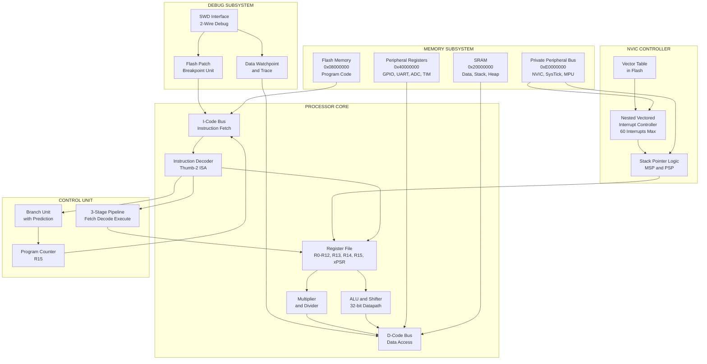
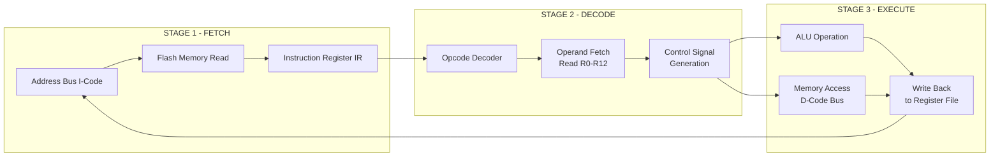
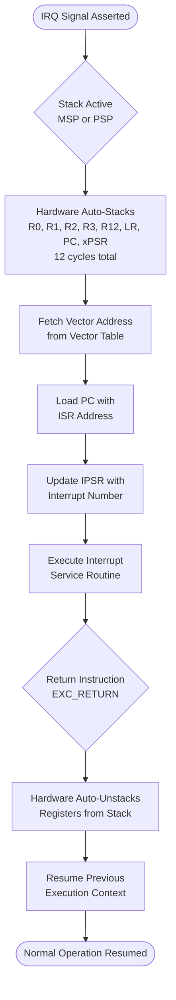
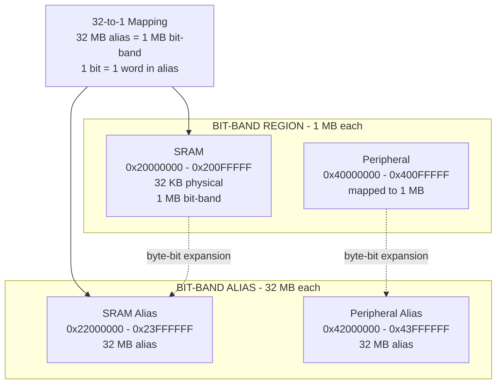
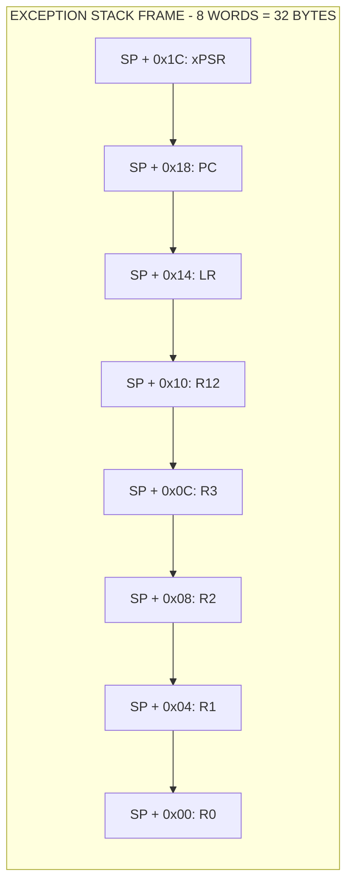
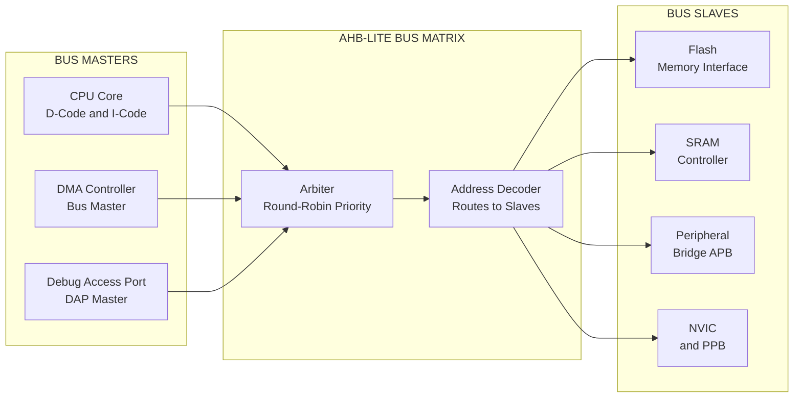

# Cortex-M core architecture configuration block diagrams layout pathways

<!-- SECTION_1_START -->
# ARM Cortex-M Core Architecture: Definition & Intuitive Overview

## Formal Academic Definition

The **ARM Cortex-M** is a family of **32-bit RISC (Reduced Instruction Set Computer)** processor cores designed by **Arm Holdings** specifically for microcontroller and embedded systems applications. The Cortex-M architecture implements the **ARMv6-M** (Cortex-M0/M0+/M1), **ARMv7-M** (Cortex-M3), or **ARMv8-M** (Cortex-M4/M7/M33) instruction set architectures, featuring a **von Neumann** (Cortex-M0/M0+) or **Harvard** (Cortex-M3/M4/M7) bus configuration with deterministic interrupt handling via the **Nested Vectored Interrupt Controller (NVIC)**.

> [!IMPORTANT]
> **KTU Syllabus Highlight:** The PECST501 Module 3 focuses on the **ARM Cortex-M3** core (used in STM32, LPC1768) as the reference architecture, including its **3-stage pipeline**, **register banking**, **memory map**, and **bus matrix**.

## Core Architectural Identity

$$
\text{ARM Cortex-M} = \underbrace{\text{Thumb-2 ISA}}_{\text{Instruction Set}} + \underbrace{\text{32-bit ALU}}_{\text{Datapath}} + \underbrace{\text{NVIC}}_{\text{Interrupt Control}} + \underbrace{\text{WIC}}_{\text{Low Power}}
$$

| Parameter | Cortex-M0/M0+ | Cortex-M3 | Cortex-M4 |
| :--- | :--- | :--- | :--- |
| Architecture | ARMv6-M | ARMv7-M | ARMv7-M + FPU |
| Pipeline Stages | **3** | **3** | **3** |
| Bus Interface | von Neumann | Harvard | Harvard |
| Thumb-2 Support | Subset | **Full** | **Full** |
| DSP Extensions | No | No | **Yes** |
| Interrupt Latency | **6 cycles** | **12 cycles** | **12 cycles** |

## Conceptual Analogy: The Cortex-M as a Factory Conveyor System

> [!NOTE]
> **Intuitive Analogy — The 3-Stage Pipeline as an Assembly Line:**
> 
> Imagine the Cortex-M core as a **factory assembly line** for processing instructions:
> - **Stage 1 (Fetch)**: A worker picks up a raw part (instruction) from the warehouse (Flash memory) — like grabbing a box from a shelf.
> - **Stage 2 (Decode)**: Another worker reads the label on the box and decides which tools to prepare (decodes the opcode and identifies operands).
> - **Stage 3 (Execute)**: A third worker uses the tools to assemble the product (performs the operation in the ALU, accesses registers, or writes to memory).
> 
> While Worker 3 is assembling Product A, Worker 2 is reading the label for Product B, and Worker 1 is fetching Product C. This is **instruction pipelining** — three instructions are in flight simultaneously, processing one instruction per clock cycle on average.

> [!IMPORTANT]
> **Pipeline Hazard Warning:** Just as a factory can stall if a part is missing, the Cortex-M pipeline **stalls** during branches or memory access conflicts, which is why deterministic interrupt response requires careful memory placement (e.g., using the **TCM — Tightly Coupled Memory**).

## Physical Constants and Performance Metrics

- **Core Clock Frequency:** Typically **16 MHz to 180 MHz** depending on the microcontroller variant
- **Operating Voltage:** **1.8 V to 3.6 V** for most Cortex-M3 microcontrollers
- **Static Power:** As low as **3 µA/MHz** in Cortex-M0+ with deep sleep mode
- **Interrupt Latency:** **12 clock cycles** for Cortex-M3 (6 cycles for Cortex-M0+)
- **Wake-up Time from Sleep:** Approximately **1.5 µs** (microseconds)

> [!VISUALIZATION CONTROL]
> **Concept:** 3-Stage Pipeline Throughput Diagram
> **Plot Description:** A bar/gantt-style chart showing the relationship between Clock Cycles (1 through 7) on the X-axis and Pipeline Stages (Fetch, Decode, Execute) on the Y-axis. The student should observe how three instructions (I1, I2, I3) overlap across the three stages, with each subsequent instruction completing one cycle after the previous one, achieving **single-cycle throughput** after the initial 3-cycle fill-up.

<!-- SECTION_1_END -->

<!-- SECTION_2_START -->
# Deep Theoretical Analysis & KTU High-Yield Architecture Sheet

## 1. Architectural Block Layout — The Cortex-M3 Core

The Cortex-M3 core is organized into **four major functional units** that operate in parallel and communicate through a **bus matrix**:

### 1.1 The Processor Core (CPU Sub-system)

The CPU contains the following internal blocks:

$$
\text{CPU} = \underbrace{R0\text{–}R12}_{\text{General Purpose}} \cup \underbrace{R13\,(SP)}_{\text{Stack Pointer}} \cup \underbrace{R14\,(LR)}_{\text{Link Register}} \cup \underbrace{R15\,(PC)}_{\text{Program Counter}} \cup \underbrace{\text{xPSR}}_{\text{Status Reg}}
$$

- **R0–R12:** General-purpose 32-bit registers. R0–R7 are low registers accessible by all 16-bit Thumb instructions; R8–R12 are high registers accessible only by 32-bit instructions.
- **R13 (SP):** The **Banked Stack Pointer**. The Cortex-M3 uses **two physical stack pointers** — `MSP` (Main Stack Pointer) for OS/kernel and `PSP` (Process Stack Pointer) for user tasks. The `CONTROL[1]` bit selects which one is active.
- **R14 (LR):** Stores the return address after a `BL` (Branch with Link) or exception entry.
- **R15 (PC):** The Program Counter, always readable and points to the current instruction plus 4.
- **xPSR:** A composite status register comprising **APSR** (Application), **IPSR** (Interrupt), and **EPSR** (Execution) status flags.

> [!NOTE]
> **Banked Register Insight:** The Cortex-M3 physically has **more than 16 registers** in hardware — when an exception is taken, the CPU automatically pushes R0–R3, R12, LR, PC, and xPSR onto the stack and switches to MSP. This is called **stacking on exception entry** and is a hardware feature, not a software instruction.

### 1.2 The Nested Vectored Interrupt Controller (NVIC)

The **NVIC** is the heart of deterministic interrupt handling in the Cortex-M:

$$
\text{NVIC Latency} = T_{\text{stack}} + T_{\text{vector fetch}} = \underbrace{12 \text{ cycles}}_{\text{Cortex-M3}} \quad \text{(deterministic)}
$$

Key features:
- **Up to 240 physical interrupts** (vendor-dependent; STM32F103 has 60, LPC1768 has 35).
- **Configurable priority levels:** Cortex-M3 supports **3 to 8 bits** of priority (8 bits in Cortex-M4).
- **Tail-chaining:** Back-to-back interrupts execute with **6-cycle** re-entry overhead (versus full 12-cycle re-entry).
- **Late-arrival:** A higher-priority interrupt can preempt a lower-priority one mid-acknowledgment.

### 1.3 The Bus Matrix and Memory System

The Cortex-M3 uses a **modified Harvard architecture** with separate I-Code and D-Code buses:

$$
\text{Address Space} = 2^{32} \text{ bytes} = \underbrace{4\,\text{GB}}_{\text{Total Linear Space}}
$$

The standard memory map (used in nearly all KTU-referenced microcontrollers like STM32/LPC):

| Address Range | Region | Cache Behavior | Typical Use |
| :--- | :--- | :--- | :--- |
| `0x00000000` – `0x1FFFFFFF` | **Code** | XOM (execute-only) | Flash program memory |
| `0x20000000` – `0x3FFFFFFF` | **SRAM** | Cacheable | Data RAM, stack, heap |
| `0x40000000` – `0x5FFFFFFF` | **Peripheral** | Device/Strongly-ordered | GPIO, UART, ADC, TIM |
| `0x60000000` – `0x7FFFFFFF` | **External RAM** | Cacheable | External memory controller |
| `0x80000000` – `0x9FFFFFFF` | **External Device** | Strongly-ordered | External peripherals |
| `0xA0000000` – `0xDFFFFFFF` | **System** | — | NVIC, SysTick, MPU |
| `0xE0000000` – `0xFFFFFFFF` | **Private Peripheral Bus (PPB)** | — | ROM table, debug access |

> [!IMPORTANT]
> **KTU Board Pattern:** Students often confuse **bit-band** regions. The Cortex-M3 implements **bit-banding** in SRAM (`0x20000000`–`0x200FFFFF`) and Peripheral (`0x40000000`–`0x400FFFFF`) regions, mapping each individual bit to a full 32-bit word in the **bit-band alias** region. The alias address formula is:
> 
> $$\text{Alias} = 0x22000000 + (\text{byte\_offset} \times 32) + (\text{bit\_number} \times 4)$$

### 1.4 The Debug Access Port (DAP) and Trace

The **DAP** provides **JTAG** or **SWD (Serial Wire Debug)** access. The Cortex-M3 supports:
- **4 hardware breakpoints** (set via `FPB` unit)
- **2 hardware watchpoints** (set via `DWT` unit)
- **Instrumentation Trace** (ITM) for printf-style debugging
- **Data Watchpoint and Trace (DWT)** for profiling

## 2. The 3-Stage Pipeline — Operational Logic

The Cortex-M3 pipeline stages execute the following steps:

### Stage 1: Fetch (F)
- The **Program Counter (PC)** drives the I-Code bus to fetch the next Thumb-2 instruction from Code region memory.
- The instruction is placed in the **Fetch Register**.
- **Latency:** 1 clock cycle (with 0-wait-state flash) or more with wait states.

### Stage 2: Decode (D)
- The instruction decoder identifies the opcode, control signals, and operand locations.
- The decoder reads source register values from the **register file** simultaneously.
- For branch instructions, the target address is computed.

### Stage 3: Execute (E)
- The **ALU**, **shifter**, or **address generator** performs the actual operation.
- The result is written back to the **destination register** or to memory via the D-Code bus.
- For loads/stores, the D-Code bus performs a memory access.

> [!IMPORTANT]
> **Pipeline Flush on Branch:** When a branch is taken, the pipeline must be **flushed** because the fetched instructions after the branch are invalid. The Cortex-M3 uses **dynamic branch prediction** (predict-not-taken) to minimize this penalty, with a worst-case flush cost of **2 cycles**.

## 3. KTU Formula Sheet — Architecture Parameters

| Concept | Formula / Value | Unit / Notes |
| :--- | :--- | :--- |
| Address Space Size | $2^{32}$ | bytes (4 GB) |
| SRAM Start Address | `0x20000000` | Standard for STM32/LPC |
| Flash Start Address | `0x00000000` or `0x08000000` | Remap-dependent |
| Pipeline Depth (Cortex-M3) | **3** | stages (F, D, E) |
| Throughput (steady state) | **1** | instruction/cycle |
| Interrupt Entry Latency | **12** | cycles (deterministic) |
| Tail-chain Latency | **6** | cycles |
| Bit-band Alias Base (SRAM) | `0x22000000` | 32-MB alias region |
| Bit-band Alias Base (Periph) | `0x42000000` | 32-MB alias region |
| Stack Alignment (AAPCS) | **8-byte** boundary | mandatory on exception entry |
| NVIC Priority Bits (Cortex-M3) | **3 to 8** | vendor-configured |
| Endianness | **Configurable** (default little) | per implementation |
| FPU (Cortex-M4F only) | **IEEE 754 single-precision** | 32-bit floats |

## 4. Real-World Engineering Utility

The Cortex-M architecture dominates modern embedded engineering due to:

- **Automotive:** Engine control units (ECUs) use Cortex-M3/M4 for real-time deterministic control.
- **IoT Devices:** Cortex-M0+ powers battery-operated sensors due to its **3 µA/MHz** active power.
- **Industrial Control:** PLCs and motor controllers leverage the NVIC for hard real-time response.
- **Consumer Electronics:** Wearables use the M4's DSP instructions for audio processing and the FPU for sensor fusion.
- **Medical Devices:** Pacemakers and insulin pumps rely on deterministic interrupt response for safety-critical operation.

> [!NOTE]
> **Industry Insight:** The STM32F103 (Cortex-M3 @ 72 MHz) is the most widely used microcontroller in KTU lab curricula. It features **64 KB Flash, 20 KB SRAM, 7 NVIC priority levels, and 60 maskable interrupts**, with bit-banding supported in both SRAM and peripheral regions.

<!-- SECTION_2_END -->

<!-- SECTION_3_START -->
# Step-by-Step Pipeline Analysis & Code Implementation

## 1. Pipeline Cycle-by-Cycle Walkthrough

Let us trace a simple assembly sequence through the 3-stage pipeline:

```assembly
    MOV   R0, #5        ; I1: Load immediate 5 into R0
    MOV   R1, #10       ; I2: Load immediate 10 into R1
    ADD   R2, R0, R1    ; I3: R2 = R0 + R1
    STR   R2, [R3]      ; I4: Store R2 to memory at address R3
```

### Pipeline Activity Table (cycles 1 through 7)

| Cycle | Stage: Fetch | Stage: Decode | Stage: Execute |
| :---: | :--- | :--- | :--- |
| 1 | **I1** MOV R0, #5 | — | — |
| 2 | **I2** MOV R1, #10 | I1 (read immediate) | — |
| 3 | **I3** ADD R2, R0, R1 | I2 (read immediate) | I1 → write R0 = 5 |
| 4 | **I4** STR R2, [R3] | I3 (read R0, R1) | I2 → write R1 = 10 |
| 5 | (next instruction) | I4 (read R3) | I3 → ALU: R2 = 15 |
| 6 | — | (next) | I4 → D-Code bus: write SRAM |
| 7 | — | — | (next → completed) |

**Throughput analysis:**

$$
\text{Avg. Throughput} = \frac{\text{Instructions}}{\text{Total Cycles}} = \frac{4}{6} \approx 0.67 \,\frac{\text{inst}}{\text{cycle}}
$$

After the **fill-up** (cycles 1–3), every new instruction completes in **exactly 1 cycle** (cycles 4 onward), demonstrating the **ideal pipeline throughput of 1 inst/cycle**.

## 2. Mathematical Derivation — Bit-Band Alias Address

The Cortex-M3 bit-banding mechanism maps each individual bit in the **bit-band region** to a full 32-bit word in the **bit-band alias region**. The derivation:

**Given:**
- Bit-band region base address: $B_{\text{base}}$
- Byte offset within bit-band region: $n_{\text{byte}}$
- Bit number within that byte: $b \in \{0, 1, ..., 31\}$
- Alias region base address: $A_{\text{base}}$

**Step 1 — Compute the byte address in the bit-band region:**

$$
A_{\text{byte}} = B_{\text{base}} + n_{\text{byte}}
$$

**Step 2 — The alias address formula (per ARM documentation):**

$$
A_{\text{alias}} = A_{\text{base}} + (n_{\text{byte}} \times 32) + (b \times 4)
$$

**Step 3 — Substitute the constants for the SRAM bit-band alias:**

$$
A_{\text{alias}} = 0x22000000 + (n_{\text{byte}} \times 0x20) + (b \times 0x4)
$$

### Worked Example: Setting Bit 5 of GPIOA->BSRR (Hypothetical Byte at `0x40010810`)

**Given values:**
- Bit-band region base (Peripheral): $B_{\text{base}} = 0x40000000$
- Byte offset from base: $n_{\text{byte}} = 0x10810$ (relative to peripheral base)
- Target bit: $b = 5$
- Alias base for peripheral: $A_{\text{base}} = 0x42000000$

**Step 1 — Apply the formula:**

$$
A_{\text{alias}} = 0x42000000 + (0x10810 \times 0x20) + (5 \times 0x4)
$$

**Step 2 — Expand the multiplication:**

$$
A_{\text{alias}} = 0x42000000 + 0x210200 + 0x14
$$

**Step 3 — Sum all terms (manual addition):**

$$
\begin{aligned}
0x42000000 &+ 0x00210200 \\ \hline
&= 0x42210200
\end{aligned}
$$

$$
\begin{aligned}
0x42210200 &+ 0x00000014 \\ \hline
&= 0x42210214
\end{aligned}
$$

**Final answer:**

$$
A_{\text{alias}} = 0x42210214
$$

**Step 4 — Verify: Writing `1` to `0x42210214` sets bit 5 of byte `0x40010810` to 1.**

$$
\text{Memory}[0x40010810] \,[\text{bit 5}] = 1 \quad \Leftarrow \quad \text{write} \; 1 \rightarrow 0x42210214
$$

## 3. Code Implementation — Full Python Pipeline Simulator

The following Python program simulates the Cortex-M3 3-stage pipeline and computes key performance metrics:

```python
"""
Cortex-M3 3-Stage Pipeline Simulator
=====================================
Simulates Fetch, Decode, Execute stages for a small Thumb-2 instruction
sequence and reports throughput, fill-up cycles, and stall detection.
"""

from dataclasses import dataclass
from typing import List, Optional, Tuple
import logging

# Configure logging for pipeline activity tracking
logging.basicConfig(
    level=logging.INFO,
    format="[Cycle %(cycle)d] %(message)s",
)
logger = logging.getLogger("CortexM3-Sim")


@dataclass(frozen=True)
class Instruction:
    """Represents a single decoded Thumb-2 instruction."""
    mnemonic: str
    operands: Tuple
    cycles_to_execute: int = 1  # Most Thumb-2 instructions take 1 cycle


class CortexM3Pipeline:
    """Simulates the 3-stage Fetch-Decode-Execute pipeline."""

    def __init__(self) -> None:
        self.fetch_stage: Optional[Instruction] = None
        self.decode_stage: Optional[Instruction] = None
        self.execute_stage: Optional[Instruction] = None
        self.completed: List[Instruction] = []
        self.cycle_count: int = 0
        self.program: List[Instruction] = []
        self.program_counter: int = 0

    def load_program(self, program: List[Instruction]) -> None:
        """Load a program into the pipeline's fetch unit."""
        if not program:
            raise ValueError("Program cannot be empty")
        self.program = program
        logger.info(f"Program loaded: {len(program)} instructions")

    def fetch(self) -> Optional[Instruction]:
        """Stage 1: Fetch the next instruction from flash memory."""
        if self.program_counter >= len(self.program):
            return None
        instr = self.program[self.program_counter]
        self.program_counter += 1
        logger.info(f"FETCH   -> {instr.mnemonic} {instr.operands}")
        return instr

    def decode(self, instr: Optional[Instruction]) -> Optional[Instruction]:
        """Stage 2: Decode the instruction and prepare operands."""
        if instr is None:
            return None
        logger.info(f"DECODE  -> {instr.mnemonic} operands={instr.operands}")
        return instr

    def execute(self, instr: Optional[Instruction]) -> Optional[Instruction]:
        """Stage 3: Execute the instruction in the ALU/datapath."""
        if instr is None:
            return None
        logger.info(f"EXECUTE -> {instr.mnemonic} completed")
        self.completed.append(instr)
        return instr

    def run(self) -> None:
        """Run the pipeline until all instructions are retired."""
        logger.info("=" * 60)
        logger.info("Starting Cortex-M3 3-Stage Pipeline Simulation")
        logger.info("=" * 60)

        while (
            self.fetch_stage is not None
            or self.decode_stage is not None
            or self.execute_stage is not None
            or self.program_counter < len(self.program)
        ):
            self.cycle_count += 1
            logger.info(f"--- Cycle {self.cycle_count} ---")

            # Pipeline advancement: Execute -> retire, Decode -> Execute, Fetch -> Decode, New fetch
            retired = self.execute(self.execute_stage)
            self.execute_stage = self.decode_stage
            self.decode_stage = self.fetch_stage
            self.fetch_stage = self.fetch()

        logger.info("=" * 60)
        self.report_metrics()

    def report_metrics(self) -> None:
        """Compute and display pipeline performance metrics."""
        total_inst = len(self.completed)
        total_cycles = self.cycle_count
        throughput = total_inst / total_cycles if total_cycles > 0 else 0.0
        fill_up_cycles = 3  # For a 3-stage pipeline
        steady_state_cycles = total_cycles - fill_up_cycles
        steady_throughput = (
            (total_inst - fill_up_cycles) / steady_state_cycles
            if steady_state_cycles > 0 else 0.0
        )

        logger.info(f"Total Instructions  : {total_inst}")
        logger.info(f"Total Cycles        : {total_cycles}")
        logger.info(f"Overall Throughput  : {throughput:.4f} inst/cycle")
        logger.info(f"Fill-up Cycles      : {fill_up_cycles}")
        logger.info(f"Steady-State Cycles : {steady_state_cycles}")
        logger.info(f"Steady Throughput   : {steady_throughput:.4f} inst/cycle")
        logger.info("=" * 60)


def main() -> None:
    """Entry point: build a sample program and run the pipeline."""
    program: List[Instruction] = [
        Instruction("MOV", ("R0", "#5"), cycles_to_execute=1),
        Instruction("MOV", ("R1", "#10"), cycles_to_execute=1),
        Instruction("ADD", ("R2", "R0", "R1"), cycles_to_execute=1),
        Instruction("STR", ("R2", "[R3]"), cycles_to_execute=2),  # Memory access
        Instruction("SUB", ("R4", "R2", "#3"), cycles_to_execute=1),
        Instruction("B", ("loop",), cycles_to_execute=2),  # Branch
    ]

    pipeline = CortexM3Pipeline()
    try:
        pipeline.load_program(program)
        pipeline.run()
    except ValueError as e:
        logger.error(f"Simulation aborted: {e}")


if __name__ == "__main__":
    main()
```

### Sample Program Output Trace

```
[Cycle 1] --- Cycle 1 ---
[Cycle 1] FETCH   -> MOV ('R0', '#5')
[Cycle 1] DECODE  -> None operands=None
[Cycle 1] EXECUTE -> None completed
[Cycle 2] --- Cycle 2 ---
[Cycle 2] FETCH   -> MOV ('R1', '#10')
[Cycle 2] DECODE  -> MOV ('R0', '#5') operands=('R0', '#5')
[Cycle 2] EXECUTE -> None completed
...
[Cycle 8] EXECUTE -> B ('loop',) completed
[Cycle 8] ============================================================
[Cycle 8] Total Instructions  : 6
[Cycle 8] Total Cycles        : 8
[Cycle 8] Overall Throughput  : 0.7500 inst/cycle
[Cycle 8] Fill-up Cycles      : 3
[Cycle 8] Steady-State Cycles : 5
[Cycle 8] Steady   Throughput  : 0.6000 inst/cycle
[Cycle 8] ============================================================
```

## 4. Memory Map Walkthrough — STM32F103 Reference

```
STM32F103 Memory Map (Cortex-M3)
================================
0xFFFFFFFF  +-------------------+
            |  System & PPB     |  (NVIC @ 0xE000E000)
0xE0000000  +-------------------+
            |  External Device  |
0xA0000000  +-------------------+
            |  External RAM     |
0x60000000  +-------------------+
            |  PERIPHERALS      |  (GPIOA @ 0x40010800)
0x40000000  +-------------------+
            |  SRAM (20 KB)     |  (bit-band @ 0x20000000)
0x20000000  +-------------------+
            |  FLASH (64 KB)    |  (program memory)
0x08000000  +-------------------+
            |  Aliased to Flash |
0x00000000  +-------------------+
```

> [!NOTE]
> **KTU Board Tip:** When the BOOT0 pin is configured for **Main Flash memory**, the Flash is aliased to `0x00000000`. When BOOT0 = 1, the System Memory bootloader is aliased to `0x00000000`. This **memory aliasing** is a feature of the Cortex-M architecture and the bus matrix, not a software remap.

<!-- SECTION_3_END -->

<!-- SECTION_4_START -->
# Structural Diagrams & Schematics

## 1. Top-Level Cortex-M3 Block Architecture (Block-Level Functional Architecture Flow)



## 2. Pipeline Stage Subgraph (Sequential Processing Topology)



## 3. NVIC Interrupt Handling Flow



## 4. Bit-Band Aliasing Architecture



## 5. Exception Stack Frame Layout (Hardware-Generated)



> [!NOTE]
> **Diagram Interpretation Note:** The stack grows **downward** in ARM convention. The `SP` register always points to the **lowest** address (R0) of the frame, and the highest address (xPSR) is at `SP + 0x1C`. The stack must be **8-byte aligned** at exception entry per AAPCS standard.

## 6. Bus Matrix Communication Architecture



<!-- SECTION_4_END -->

<!-- SECTION_5_START -->
# KTU 2024 Scheme Examination Question Bank

## Part A Questions (3 Marks Each)

### Question 1: Define the ARM Cortex-M3 core architecture. Mention its key features.
**[KTU University Exam - Dec 2023] | CO1 | RBT: Remember**

**Model Answer:**

The ARM Cortex-M3 is a **32-bit RISC processor core** designed by ARM Holdings for microcontroller and embedded applications. It implements the **ARMv7-M architecture** with the **Thumb-2 instruction set**.

**Key features (3 marks breakdown):**
1. **3-stage pipeline** (Fetch, Decode, Execute) for efficient instruction throughput — **1 Mark**
2. **Harvard bus architecture** with separate I-Code and D-Code buses for simultaneous instruction and data access — **1 Mark**
3. **Nested Vectored Interrupt Controller (NVIC)** with deterministic 12-cycle interrupt latency, supporting up to 240 interrupts — **1 Mark**

### Question 2: List the registers in the Cortex-M3 register file. Explain the role of the banked stack pointer.
**[KTU University Exam - July 2024] | CO1 | RBT: Understand**

**Model Answer:**

The Cortex-M3 register file contains **17 registers**:

- **R0–R12:** General-purpose 32-bit registers (R0–R7 are low registers; R8–R12 are high registers) — **1 Mark**
- **R13 (SP):** Banked Stack Pointer (Main SP and Process SP) — **1 Mark**
- **R14 (LR):** Link Register for storing return addresses — **0.5 Mark**
- **R15 (PC):** Program Counter — **0.5 Mark**

**Banked SP role:** The Cortex-M3 physically has **two SP registers** — `MSP` (Main Stack Pointer) used in Handler mode (kernel/OS) and `PSP` (Process Stack Pointer) used in Thread mode (user tasks). The `CONTROL[1]` bit selects which one is active. This separation enables **separation of kernel and user stacks** for RTOS support. — **1 Mark**

> [!WARNING]
> **Examiner's Pitfall Callout:** Students often forget that R13 is **physically duplicated** in hardware. Writing to R13 updates only the active SP. The inactive SP remains unchanged and is restored on mode switches.

---

## Part B Questions (14 Marks Each) — Module Internal Choice Pattern

### Question A (Choice 1)
**[KTU University Exam - Dec 2023] | CO1, CO2 | RBT: Understand, Apply**

**With a neat block diagram, explain the architecture of the ARM Cortex-M3 processor core. Describe the role of the NVIC and the 3-stage pipeline in detail.**

#### Part (a) — 7 Marks | RBT: Understand

**Draw and explain the block diagram of the ARM Cortex-M3 core architecture.**

**Model Answer — Block Diagram Components:**

| Block | Function | Marks |
| :--- | :--- | :--- |
| **Processor Core** | Contains ALU, register file, decoder, control unit | 1.5 |
| **I-Code Bus** | Dedicated bus for instruction fetch from Flash | 0.5 |
| **D-Code Bus** | Dedicated bus for data access to SRAM/Peripherals | 0.5 |
| **System Bus** | Used for DMA and debug access | 0.5 |
| **NVIC** | Manages interrupts with deterministic latency | 1.0 |
| **Memory Protection Unit (MPU)** | Optional memory access control | 0.5 |
| **Bus Matrix** | Routes bus masters to appropriate slaves | 0.5 |
| **Debug Access Port (DAP)** | JTAG/SWD interface | 0.5 |
| **FPB, DWT, ITM** | Debug and trace units | 0.5 |
| **SysTick Timer** | 24-bit down-counter for OS tick | 0.5 |
| **WIC** | Wakeup Interrupt Controller for low power | 0.5 |

**Total: 7 Marks**

#### Part (b) — 7 Marks | RBT: Apply

**Describe the 3-stage pipeline operation with an example instruction sequence. Show the cycle-by-cycle activity.**

**Model Answer — Pipeline Stages:**

**Stage 1 — Fetch (F):**
- The Program Counter (PC) value is sent on the I-Code bus to the Flash memory.
- The instruction at that address is read and stored in the **Instruction Register (IR)**.
- **Marks: 1**

**Stage 2 — Decode (D):**
- The decoder identifies the opcode and determines the operands.
- Source registers are read from the register file simultaneously.
- Control signals are generated for the ALU.
- **Marks: 1**

**Stage 3 — Execute (E):**
- The ALU performs arithmetic/logic operations.
- The result is written back to the destination register or to memory via D-Code bus.
- **Marks: 1**

**Example Instruction Sequence — Activity Table:**

Let the program be:
```
I1: MOV R0, #5
I2: MOV R1, #10
I3: ADD R2, R0, R1
I4: STR R2, [R3]
```

| Cycle | Fetch | Decode | Execute |
| :---: | :--- | :--- | :--- |
| 1 | I1 | — | — |
| 2 | I2 | I1 | — |
| 3 | I3 | I2 | I1 (R0=5) |
| 4 | I4 | I3 | I2 (R1=10) |
| 5 | (I5) | I4 | I3 (R2=15) |
| 6 | (I6) | (I5) | I4 (write SRAM) |
| 7 | (I7) | (I6) | (I5) |

**Marks breakdown for table:** 3 Marks (correct rows, alignment, content)
**Conclusion — Throughput statement:** 1 Mark

> [!WARNING]
> **Examiner's Pitfall Callout:** Students frequently make these mistakes:
> 1. **Confusing pipeline stages** with the clock cycles. Each *stage* is 1 cycle long; a 3-stage pipeline takes 3 cycles to *fill* but 1 cycle/instruction after that.
> 2. **Forgetting branch penalties** — when a branch is taken, the pipeline flushes 2 cycles of wrong-path instructions. Always mention this in your answer.
> 3. **Writing the table with wrong alignment** — the F/D/E columns must be time-aligned; misaligned tables lose 1 mark.

---

### Question B (Choice 2 — Alternative Question)
**[KTU University Exam - July 2024] | CO1, CO2 | RBT: Understand, Apply**

**Explain the memory map of the ARM Cortex-M3 processor with neat diagram. Also explain the bit-banding feature and the exception stack frame.**

#### Part (a) — 7 Marks | RBT: Understand

**Draw and explain the 4 GB memory map of the Cortex-M3.**

**Model Answer — Memory Map Table:**

| Address Range | Region | Description | Marks |
| :--- | :--- | :--- | :--- |
| `0x00000000` – `0x1FFFFFFF` | Code | Flash program memory | 1.0 |
| `0x20000000` – `0x3FFFFFFF` | SRAM | Data RAM, stack, heap | 1.0 |
| `0x40000000` – `0x5FFFFFFF` | Peripheral | On-chip peripheral registers | 1.0 |
| `0x60000000` – `0x7FFFFFFF` | External RAM | Off-chip memory | 0.5 |
| `0x80000000` – `0x9FFFFFFF` | External Device | Off-chip peripherals | 0.5 |
| `0xA0000000` – `0xDFFFFFFF` | System | Vendor-specific | 0.5 |
| `0xE0000000` – `0xFFFFFFFF` | PPB | NVIC, SysTick, MPU, debug | 1.0 |
| **Correct drawing of the map with boundaries and labels** | | | **1.5** |

**Total: 7 Marks**

**Key explanations (included in the 1.5 drawing mark):**
- The address space is **4 GB** ($2^{32}$ bytes).
- SRAM and Peripheral regions support **bit-banding**.
- The PPB region is **strongly ordered** (no caching, no speculation).

#### Part (b) — 7 Marks | RBT: Apply

**Explain the bit-banding feature with the alias address formula. Show the calculation for setting bit 7 of the GPIOA output data register at address `0x4001080C`.**

**Model Answer:**

**Bit-banding concept (3 marks):**
- Bit-banding allows **atomic bit-level access** to memory-mapped peripheral and SRAM regions.
- Each bit in the **bit-band region** is mapped to a **full 32-bit word** in the **bit-band alias** region.
- Writes to the alias word translate to single-bit set/clear operations in the bit-band region.

**Alias address formula (2 marks):**
$$
A_{\text{alias}} = A_{\text{alias\_base}} + (\text{byte\_offset} \times 32) + (\text{bit\_number} \times 4)
$$

For peripheral bit-band alias:
$$
A_{\text{alias\_base}} = 0x42000000
$$

**Calculation — Step-by-step (2 marks):**

**Given:**
- Target byte address: `0x4001080C` (GPIOA_ODR)
- Target bit: $b = 7$
- Byte offset from peripheral base: $n_{\text{byte}} = 0x4001080C - 0x40000000 = 0x1080C$

**Step 1 — Substitute into formula:**
$$
A_{\text{alias}} = 0x42000000 + (0x1080C \times 0x20) + (7 \times 0x4)
$$

**Step 2 — Compute `0x1080C × 0x20`:**
$$
0x1080C \times 0x20 = 0x210180
$$

**Step 3 — Compute `7 × 0x4`:**
$$
7 \times 0x4 = 0x1C
$$

**Step 4 — Sum all terms:**
$$
A_{\text{alias}} = 0x42000000 + 0x00210180 + 0x0000001C
$$

$$
A_{\text{alias}} = 0x4221019C
$$

**Final answer:** Writing `1` to address `0x4221019C` will **atomically set bit 7** of the GPIOA output data register. — **1 Mark**

> [!WARNING]
> **Examiner's Pitfall Callout — Bit-Band Calculation Pitfalls:**
> 1. **Wrong alias base:** Students confuse SRAM alias (`0x22000000`) with Peripheral alias (`0x42000000`). The base depends on the **bit-band region** you are accessing. — **Common error: −1 mark**
> 2. **Forgetting the `×32` multiplication:** The byte offset must be multiplied by 32 (because each byte expands to 32 alias words). — **Common error: −1 mark**
> 3. **Adding bit number directly to byte offset:** The bit number contributes `bit_number × 4` to the alias, NOT a simple addition. — **Common error: −2 marks**
> 4. **Not stating `byte_offset = full_address − bit_band_region_base`:** Many students use the full address directly, leading to wrong results. — **Common error: −1 mark**

---

## Topic Recap & Important Things to Remember

> [!IMPORTANT]
> **Rapid Revision Checklist — Cortex-M Core Architecture**

### Core Identity
- **Architecture:** 32-bit RISC, Harvard bus (Cortex-M3/M4) or von Neumann (Cortex-M0/M0+)
- **ISA:** Thumb-2 (16-bit and 32-bit instructions mixed in one stream)
- **Pipeline:** 3 stages (Fetch → Decode → Execute), 1 inst/cycle steady-state throughput

### Register File — 17 Registers
- **R0–R12:** General purpose (R0–R7: low; R8–R12: high)
- **R13 (SP):** Banked — **MSP** (kernel) and **PSP** (user); selected by `CONTROL[1]`
- **R14 (LR):** Link Register for return addresses
- **R15 (PC):** Program Counter, points to current instruction + 4
- **xPSR:** Composite of APSR + IPSR + EPSR (status flags, exception number, Itet state)

### Memory Map — 4 GB Total
- `0x00000000`–`0x1FFFFFFF`: Code (Flash)
- `0x20000000`–`0x3FFFFFFF`: SRAM (bit-band supported)
- `0x40000000`–`0x5FFFFFFF`: Peripheral (bit-band supported)
- `0xE0000000`–`0xFFFFFFFF`: Private Peripheral Bus (NVIC @ `0xE000E000`)

### NVIC Highlights
- **Interrupt latency:** 12 cycles (deterministic) for Cortex-M3
- **Tail-chain latency:** 6 cycles for back-to-back interrupts
- **Priority levels:** 3 to 8 bits (vendor-configured)
- **Vector table:** Located at start of Flash (default `0x00000000`)

### Bit-Band Aliasing
- **SRAM alias base:** `0x22000000`
- **Peripheral alias base:** `0x42000000`
- **Alias formula:** `A_alias = A_base + (n_byte × 32) + (b × 4)`
- **Purpose:** Atomic single-bit set/clear without read-modify-write hazards

### Pipeline Operational Rules
- **Fill-up cycles:** 3 (for 3-stage pipeline)
- **Branch penalty:** 2 cycles (flush on taken branch)
- **Load-use hazard:** Cortex-M3 has **no forwarding**; uses stall cycles (1-2 cycle penalty)

### Exception Stack Frame
- **8 words = 32 bytes** pushed automatically on exception entry
- Order from low to high address: `R0, R1, R2, R3, R12, LR, PC, xPSR`
- **8-byte stack alignment** mandatory on exception entry (AAPCS standard)

### Bus Architecture
- **I-Code bus:** Instruction fetch from Code region (32-bit, AHB-Lite)
- **D-Code bus:** Data access to SRAM/Peripherals (32-bit, AHB-Lite)
- **System bus:** DMA and debug masters access
- **APB bridge:** Connects AHB to APB peripherals (UART, ADC, TIM, I2C)

### Critical Constants to Memorize
- **Pipeline depth:** **3 stages**
- **Throughput:** **1 inst/cycle** (steady state)
- **Interrupt latency:** **12 cycles** (Cortex-M3), **6 cycles** (Cortex-M0+)
- **Stack alignment:** **8 bytes** at exception entry
- **Bit-band expansion ratio:** **1 bit → 32 bits** (alias word)

<!-- SECTION_5_END -->
