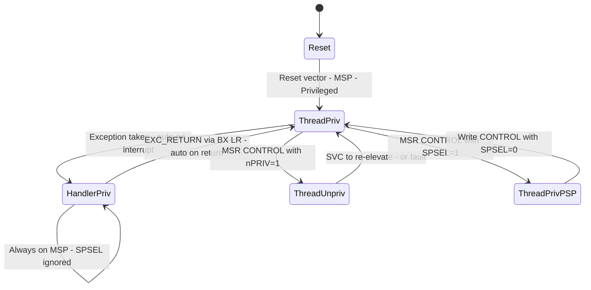
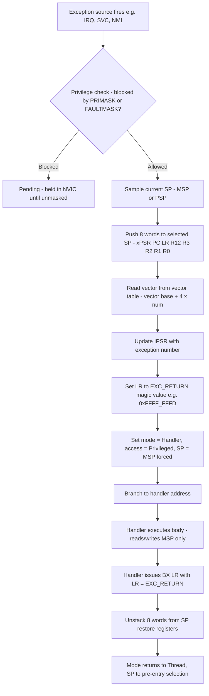

# Register bank structure operating modes status flags tracking configurations

<!-- SECTION_1_START -->

# ARM Cortex-M3 Register Bank, Operating Modes & Status Flags

## 1.1 Formal Academic Definition (KTU 2024 Syllabus Terminology)

The **ARM Cortex-M3** processor employs a **load-store RISC architecture** with a fixed **register bank of sixteen 32-bit core registers** mapped directly into the architectural state. The register file is partitioned into two functional tiers: **low registers** ($R_0 - R_7$) that are fully accessible to all 16-bit Thumb instructions, and **high registers** ($R_8 - R_{12}$) that are accessible only to 32-bit Thumb-2 instructions and a limited set of 16-bit instructions. Registers $R_{13}$ through $R_{15}$ are **banked special-function registers**: $R_{13}$ acts as the **Stack Pointer (SP)**, $R_{14}$ as the **Link Register (LR)**, and $R_{15}$ as the **Program Counter (PC)**. Three additional non-core special registers — **PRIMASK, FAULTMASK, BASEPRI**, and **CONTROL** — manage exception masking and operating mode transitions.

> [!IMPORTANT]
> **KTU Board Definition:** In ARM Cortex-M3, only the Stack Pointer $R_{13}$ is **physically banked** (two physical registers: MSP and PSP). $R_{14}$ (LR) and $R_{15}$ (PC) are **not banked**, contradicting the legacy ARM7/ARM9 architecture.

> [!NOTE]
> The full programming model includes **20 registers visible to the developer**: 16 core ($R_0$–$R_{15}$) + $xPSR$ (composite of APSR/IPSR/EPSR) + PRIMASK + FAULTMASK + BASEPRI + CONTROL.

## 1.2 Conceptual Analogy — The "Workbench" Intuition

Think of the ARM Cortex-M3 register bank as a **mechanic's workbench with labeled drawers**:

| Analogy Element | Hardware Equivalent | Purpose |
|---|---|---|
| 16 labeled drawers on the bench | $R_0$ – $R_{15}$ | Items the mechanic grabs *instantly* (no walking to storage) |
| Small drawers (front row, easy reach) | Low registers $R_0$–$R_7$ | Most-used tools; reachable by either hand (any 16-bit instr.) |
| Back-row high drawers | High registers $R_8$–$R_{12}$ | Need both hands (only 32-bit Thumb-2) |
| A *second identical hammer* hidden in a side cabinet | Banked MSP / PSP | Two physical stack pointers, only one on the bench at a time |
| The mechanic's clipboard with status notes | $xPSR$ (APSR/IPSR/EPSR) | Tracks last operation's outcome (N, Z, C, V, Q flags) |
| The foreman's authority badge | CONTROL register | Switches mode & selects which stack pointer is on the bench |
| A lockout-tagout permit | PRIMASK / FAULTMASK / BASEPRI | Blocks interrupts of various priority levels |

The key insight: in a Cortex-M3, **interrupts never save the register file to RAM** (unlike ARM7TDMI). The hardware simply *replaces* $R_0$–$R_3$, $R_{12}$, $R_{14}$, and $xPSR$ automatically on exception entry — this is the famous **hardware stacking** mechanism.

> [!TIP]
> **Why this matters in KTU exams:** A frequent Part A question asks *"Why does the Cortex-M3 not push all 16 registers on exception entry?"* The answer is performance + deterministic latency — only the **caller-saved** registers ($R_0$–$R_3$, $R_{12}$, $R_{14}$, $xPSR$) need saving because the C/assembly calling convention guarantees the others are preserved by the callee.

## 1.3 Operating Modes — Formal Definition

The Cortex-M3 operates in exactly **two software-visible modes**:

$$
\text{Mode} = \begin{cases} \text{Thread Mode} & \text{— Normal application code} \\ \text{Handler Mode} & \text{— Exception/Interrupt service routines} \end{cases}
$$

These modes are **orthogonal to** two **access levels**:

$$
\text{Access Level} = \begin{cases} \text{Privileged} & \text{— Full access to all system control space} \\ \text{Unprivileged} & \text{— Blocked from NVIC, system control, MPU config} \end{cases}
$$

> [!NOTE]
> Reset entry is **Thread Mode + Privileged**. Main `main()` typically continues in privileged Thread mode until it deliberately drops privilege by writing to the CONTROL register.

## 1.4 Status Flags — The APSR Byte

The **Application Program Status Register (APSR)** lives in the upper half of $xPSR$ and contains five architecturally-defined condition flags:

$$
\text{APSR} = \{\,Q,\,V_{31:28},\,C_{29},\,Z_{30},\,N_{31}\,\}
$$

| Flag | Bit | Set When | Cleared When | Test Instruction |
|---|---|---|---|---|
| **N** — Negative | 31 | ALU result MSB = 1 | MSB = 0 | `BMI` / `BPL` |
| **Z** — Zero | 30 | Result = 0 | Result $\neq$ 0 | `BEQ` / `BNE` |
| **C** — Carry / Borrow | 29 | Carry-out of unsigned op | No carry-out | `BHS` / `BLO` |
| **V** — Overflow | 28 | Signed 2's-complement overflow | No overflow | `BVS` / `BVC` |
| **Q** — Saturation | 27 | SSAT/USAT saturated | Written to 0 | (read via `MRS`) |

> [!VISUALIZATION CONTROL]
> **Concept:** 32-bit APSR bit-field map showing flag positions
> **GeoGebra / Desmos Input (bit-grid view):**
> * Plot a horizontal number line with tick marks at $2^{31}, 2^{30}, 2^{29}, 2^{28}, 2^{27}$
> * Color the bit positions: N=red, Z=blue, C=green, V=orange, Q=purple
> **Visual Description:** A bar 32 cells wide, with cells 31,30,29,28,27 highlighted from left. Bits 26–0 are reserved/zero. Students should observe that **N occupies the sign-bit position of a signed 32-bit result**, while Q is the rightmost architecturally used flag.

<!-- SECTION_1_END -->

<!-- SECTION_2_START -->

# Deep Theoretical Analysis & KTU High-Yield Formula Sheet

## 2.1 The Register File — Complete Structural Breakdown

The 16 core registers are organized into **three functional groups**:

### Group A: General-Purpose Low Registers ($R_0$–$R_7$)
- 32-bit, fully orthogonal
- Accessible to *every* 16-bit Thumb data-processing instruction
- Also accessible to all 32-bit Thumb-2 instructions
- Used for: data operands, function arguments (first 4 in AAPCS), return values
- **No hardware special meaning** — pure scratch

### Group B: General-Purpose High Registers ($R_8$–$R_{12}$)
- 32-bit, but **limited 16-bit instruction access** (only `MOV, CMP, ADD, SUB` to/from low regs)
- Full 32-bit Thumb-2 access
- Used for: local variables, fast temp storage
- $R_{12}$ is special: it is **caller-saved by hardware** on exception entry (used as scratch by interrupt veneers)

### Group C: Special-Function Registers ($R_{13}$, $R_{14}$, $R_{15}$)
- $R_{13}$: **Stack Pointer (SP)** — banked as $SP_{main}$ (MSP) and $SP_{process}$ (PSP)
- $R_{14}$: **Link Register (LR)** — holds return address after `BL`/`BLX`
- $R_{15}$: **Program Counter (PC)** — current instruction address + 2 (Thumb)

$$
\text{Pipeline Read PC} = \text{Actual PC} + 4
$$

> [!IMPORTANT]
> KTU Board Tip: Reading $R_{15}$ (PC) returns **current instruction address + 4** because the Cortex-M3 fetches two Thumb instructions (each 16 bits = 2 bytes) ahead in its 3-stage pipeline. So `MOV R0, PC` with PC at `0x0800_0004` yields `R0 = 0x0800_0008`.

## 2.2 The Banked Stack Pointer — MSP vs PSP

The Cortex-M3 has **two physical 32-bit stack pointers**, but only one is **active** in $R_{13}$ at any instant:

$$
SP_{active} = \begin{cases} \text{MSP} & \text{if CONTROL[1] = 0} \\ \text{PSP} & \text{if CONTROL[1] = 1 (and Thread mode only)} \end{cases}
$$

| Property | MSP (Main Stack Pointer) | PSP (Process Stack Pointer) |
|---|---|---|
| Selected by | Reset, Handler mode (always) | Thread mode + CONTROL[1]=1 |
| Typical user | OS kernel, ISRs, privileged code | Application tasks (RTOS threads) |
| Banked? | Always present (physical reg) | Always present (physical reg) |
| Switchable from | Privileged code only | Privileged code only |
| Initial value | Loaded from vector table `[0]` | Undefined at reset; RTOS sets it up |

## 2.3 The Three Interrupt Mask Registers

These are **special-purpose registers** accessed only via `MRS` (read) and `MSR` (write):

$$
\text{PRIMASK} = \begin{cases} 1 & \text{All exceptions (except NMI, HardFault) blocked} \\ 0 & \text{Normal — preemptible} \end{cases}
$$

$$
\text{FAULTMASK} = \begin{cases} 1 & \text{All exceptions (except NMI) blocked — even HardFault becomes disabled} \\ 0 & \text{Normal} \end{cases}
$$

$$
\text{BASEPRI} = \begin{cases} n \in [0, 255] & \text{Block all exceptions with priority} \geq n \\ 0 \text{ (default)} & \text{No base-priority masking} \end{cases}
$$

> [!NOTE]
> **KTU High-Yield:** The priority ordering is **lower numerical value = higher priority**. `BASEPRI = 0x20` blocks every exception with priority $\geq 0x20$ (i.e., numerically $\geq 32$), so high-priority interrupts (e.g., priority 0x10) still fire.

## 2.4 The CONTROL Register — Mode & Stack Selector

```
Bit 1: SPSEL    → 0 = use MSP, 1 = use PSP (Thread mode only)
Bit 0: nPRIV    → 0 = privileged, 1 = unprivileged
Bits 31:2       → Reserved (RAZ/WI)
```

After reset: `CONTROL = 0x00000000` (Thread mode, privileged, MSP active).

## 2.5 KTU High-Yield Formula Sheet

| Concept | Formula / Definition | Engineering Use |
|---|---|---|
| Core registers | $R_0$ through $R_{15}$ (16 × 32-bit) | Compiler code generation |
| Banked SP | $R_{13} = \{MSP, PSP\}$ | RTOS task isolation |
| Link return addr. | $LR = PC_{after\_BL} - 2$ (in Thumb) | Subroutine call/return |
| PC read offset | $PC_{read} = PC_{exec} + 4$ | Position-independent code |
| APSR flag update | $N = b_{31},\ Z = (R == 0),\ C = carry\_out,\ V = signed\_overflow,\ Q = saturation$ | Branching decisions |
| Mode transition | Thread → Handler on exception; Handler → Thread on `EXC_RETURN` | Interrupt/exception flow |
| Stack alignment | $SP \equiv 8 \pmod 8$ on exception entry (hardware) | AAPCS compliance |
| Priority inversion rule | $P_{effective} = \max(P_{base}, P_{BASEPRI})$ for $P_{base} \geq BASEPRI$ | Hard real-time scheduling |

> [!WARNING]
> **Table cell escape rule applied:** All absolute-value and modulus operations are written with `\vert` / `\pmod` to keep the markdown table intact. Never use raw `| |` in a table row.

## 2.6 Real-World Engineering Utility

1. **RTOS Kernels (FreeRTOS, RTX):** Use PSP per task to give each thread an isolated stack frame; kernel runs on MSP in Handler mode.
2. **Automotive ECU (AUTOSAR):** Watchdog and safety ISRs run privileged on MSP; application tasks on unprivileged PSP.
3. **IoT Edge Devices (STM32, NXP LPC):** Drop to unprivileged Thread mode after boot to harden against malicious firmware — a defense-in-depth pattern.
4. **Deterministic Interrupt Latency:** Hardware stacking of 8 words (vs software save of 16 registers) gives the Cortex-M3 its **12-cycle interrupt entry** guarantee.

<!-- SECTION_2_END -->

<!-- SECTION_3_START -->

# Step-by-Step Derivations & Code/Symbolic Implementation

## 3.1 Bit-Level Derivation of APSR After an Arithmetic Operation

**Problem:** Compute APSR bits after `SUBS R0, R1, R2` where $R_1 = 0x8000\_0000$ and $R_2 = 0x0000\_0001$.

### Step 1: Perform the subtraction

$$
\begin{aligned}
R_0 &= R_1 - R_2 \\
&= 0x8000\_0000 - 0x0000\_0001 \\
&= 0x7FFF\_FFFF
\end{aligned}
$$

### Step 2: Extract each flag

$$
\begin{aligned}
N\ (\text{bit } 31) &= b_{31}(R_0) = 0 \\
Z\ (\text{bit } 30) &= (R_0 == 0) = 0 \\
C\ (\text{bit } 29) &= (R_1 \geq R_2 \text{ unsigned}) = 1 \\
V\ (\text{bit } 28) &= \text{signed overflow?} \\
&\quad \text{Signed: } R_1 = -2^{31},\ R_2 = +1 \\
&\quad R_1 - R_2 = -2^{31} - 1 = \text{out of signed range} \\
&\quad \Rightarrow V = 1 \\
Q\ (\text{bit } 27) &= 0 \quad \text{(no SSAT/USAT executed)}
\end{aligned}
$$

### Step 3: Form the APSR value

$$
\text{APSR} = (N \ll 31) \mid (Z \ll 30) \mid (C \ll 29) \mid (V \ll 28) = 0x3000\_0000
$$

> **Valuation Key:** Each correctly derived flag = 1 mark, final assembly = 1 mark. Total 5 marks for the full derivation.

## 3.2 Step-by-Step Mode Transition on Exception

**Scenario:** A `SVC` instruction is executed in Thread mode, triggering an SVC exception.

### Step 1: Hardware stacking (8 words pushed to MSP)

$$
\begin{aligned}
\text{Stack}[SP-4] &\leftarrow xPSR \\
\text{Stack}[SP-8] &\leftarrow PC \\
\text{Stack}[SP-12] &\leftarrow LR \\
\text{Stack}[SP-16] &\leftarrow R_{12} \\
\text{Stack}[SP-20] &\leftarrow R_3 \\
\text{Stack}[SP-24] &\leftarrow R_2 \\
\text{Stack}[SP-28] &\leftarrow R_1 \\
\text{Stack}[SP-32] &\leftarrow R_0 \\
SP &\leftarrow SP - 32
\end{aligned}
$$

### Step 2: Vector fetch

$$
\begin{aligned}
LR &\leftarrow 0xFFFF\_FFFD \quad \text{(EXC\_RETURN for MSP)} \\
IPSR &\leftarrow \text{exception number (e.g., 11 for SVCall)} \\
PC &\leftarrow \text{(vectors[11])} = \text{SVC handler address}
\end{aligned}
$$

### Step 3: Mode update

$$
\text{Thread Mode (privileged)} \xrightarrow{\text{exception}} \text{Handler Mode (privileged)}
$$

The handler runs on **MSP** (PSP is unreachable in Handler mode).

### Step 4: Return (Handler issues `BX LR`)

$$
\begin{aligned}
\text{Read } LR &= 0xFFFF\_FFFD \quad \Rightarrow \text{Initiate exception return} \\
\text{Unstack 8 words} &\rightarrow \text{Restore } R_0, R_1, R_2, R_3, R_{12}, LR, PC, xPSR \\
SP &\leftarrow SP + 32 \\
\text{Mode} &\leftarrow \text{Thread Mode (privileged)}
\end{aligned}
$$

## 3.3 Fully-Operational C/Assembly Implementation (CMSIS Style)

```c
/* arm_cortex_m3_register_demo.c
 * Demonstrates APSR flag inspection, CONTROL register manipulation,
 * PSP switch, and BASEPRI-based critical section.
 * Build: arm-none-eabi-gcc -mcpu=cortex-m3 -mthumb
 */
#include <stdint.h>

/* CMSIS intrinsics - type-safe wrappers over MRS/MSR */
static inline uint32_t __get_apsr(void)        { uint32_t r; __asm volatile ("MRS %0, APSR"      : "=r"(r)); return r; }
static inline uint32_t __get_control(void)      { uint32_t r; __asm volatile ("MRS %0, CONTROL"   : "=r"(r)); return r; }
static inline void     __set_control(uint32_t v){              __asm volatile ("MSR CONTROL, %0"  :: "r"(v) : "memory"); }
static inline void     __set_psp(uint32_t v)    {              __asm volatile ("MSR PSP, %0"      :: "r"(v)); }
static inline uint32_t __get_psp(void)          { uint32_t r; __asm volatile ("MRS %0, PSP"      : "=r"(r)); return r; }
static inline void     __set_basepri(uint32_t v){              __asm volatile ("MSR BASEPRI, %0"  :: "r"(v) : "memory"); }
static inline uint32_t __get_basepri(void)      { uint32_t r; __asm volatile ("MRS %0, BASEPRI"  : "=r"(r)); return r; }
static inline void     __enable_irq(void)       {              __asm volatile ("CPSIE i"          ::: "memory"); }
static inline void     __disable_irq(void)      {              __asm volatile ("CPSID i"          ::: "memory"); }

#define FLAG_N (1U << 31)
#define FLAG_Z (1U << 30)
#define FLAG_C (1U << 29)
#define FLAG_V (1U << 28)
#define FLAG_Q (1U << 27)

/* ------------------------------------------------------------------ */
/* Function 1: Inspect APSR after an arithmetic operation             */
/* ------------------------------------------------------------------ */
void apsr_inspection_demo(void)
{
    volatile int32_t a = 0x80000000;   /* INT_MIN  */
    volatile int32_t b = 0x00000001;
    int32_t diff;

    __disable_irq();
    diff = a - b;                       /* 0x7FFFFFFF, sets N=0 Z=0 C=1 V=1 */
    uint32_t apsr = __get_apsr();

    if (apsr & FLAG_N) { /* handle negative */ }
    if (apsr & FLAG_Z) { /* handle zero */ }
    if (apsr & FLAG_C) { /* unsigned no-borrow */ }
    if (apsr & FLAG_V) { /* signed overflow occurred */ }
    if (apsr & FLAG_Q) { /* saturation occurred */ }
    __enable_irq();
}

/* ------------------------------------------------------------------ */
/* Function 2: Drop privilege, switch to PSP (typical RTOS pattern)   */
/* ------------------------------------------------------------------ */
extern uint32_t _psp_stack_top;        /* defined in linker script */

void drop_to_unprivileged_psp(void)
{
    /* 1. Write PSP first - must be 8-byte aligned per AAPCS */
    __set_psp((uint32_t)&_psp_stack_top);

    /* 2. Build new CONTROL value: SPSEL=1, nPRIV=1 */
    uint32_t new_ctrl = (1U << 1) | (1U << 0);   /* 0x00000003 */

    /* 3. Use an ISB barrier to ensure the switch takes effect
     *    before subsequent code runs in unprivileged mode. */
    __set_control(new_ctrl);
    __asm volatile ("ISB");
}

/* ------------------------------------------------------------------ */
/* Function 3: Critical section using BASEPRI (proper RTOS pattern)   */
/* ------------------------------------------------------------------ */
#define CRITICAL_PRIO   0x40U          /* mask all <= 0x40 */

void critical_section_basepri(void)
{
    uint32_t saved_basepri = __get_basepri();
    __set_basepri(CRITICAL_PRIO);     /* block low/mid prio IRQs */
    /* -------- protected code starts -------- */
    perform_atomic_io();
    /* -------- protected code ends   -------- */
    __set_basepri(saved_basepri);     /* restore (NOT to 0!) */
}
```

## 3.4 Pure Assembly — LR & PC Observation

```asm
    AREA    demo, CODE, READONLY
    ENTRY
    LDR     R0, =0x80000000
    LDR     R1, =0x00000001
    SUBS    R2, R0, R1           @ R2 = 0x7FFFFFFF, APSR N=0 Z=0 C=1 V=1
    BVS     overflow_handler     @ branch if V=1 (signed overflow)

    BL      subroutine_x         @ LR = address of next instruction
    ; LR now points to "MOV R3, #0"
    MOV     R3, #0
    B       .

subroutine_x
    MOV     R0, PC               @ R0 = address of this MOV + 4
    BX      LR                   @ return to caller

overflow_handler
    BKPT    #0
    END
```

## 3.5 Mode/Privilege Transition Sequence (Pseudo-Code Walkthrough)

$$
\begin{aligned}
\text{Step 1: Reset} &\Rightarrow \text{Thread, Privileged, MSP active, CONTROL} = 0x00 \\
\text{Step 2: Boot code runs} &\Rightarrow \text{Sets up PSP, system handlers, RTOS scheduler} \\
\text{Step 3: OS starts first task} &\Rightarrow \text{MSR PSP, R0; MSR CONTROL, 0x03; ISB} \\
\text{Step 4: First task runs} &\Rightarrow \text{Unprivileged, PSP active, Thread mode} \\
\text{Step 5: Interrupt fires} &\Rightarrow \text{Auto-switch to Handler, MSP, privileged} \\
\text{Step 6: ISR returns} &\Rightarrow \text{Auto-switch back to Thread, PSP, unprivileged}
\end{aligned}
$$

<!-- SECTION_3_END -->

<!-- SECTION_4_START -->

# Structural Diagrams & Schematics

## 4.1 ARM Cortex-M3 Register Bank — Mermaid Block Diagram

```mermaid
graph TB
    subgraph "Core Register File (R0-R15)"
        R0["R0  - Argument / Return low"]
        R1["R1  - Argument"]
        R2["R2  - Argument"]
        R3["R3  - Argument / Return high"]
        R4["R4  - Variable v1"]
        R5["R5  - Variable v2"]
        R6["R6  - Variable v3"]
        R7["R7  - Variable v4"]
        R8["R8  - High reg scratch"]
        R9["R9  - High reg scratch"]
        R10["R10 - High reg scratch"]
        R11["R11 - High reg scratch"]
        R12["R12 - Intra-procedure scratch"]
        R13["R13 - SP active register"]
        R14["R14 - LR Link Register"]
        R15["R15 - PC Program Counter"]
    end

    subgraph "Special Registers (MRS/MSR only)"
        APSR["APSR - N Z C V Q flags"]
        IPSR["IPSR - Exception number"]
        EPSR["EPSR - Thumb state ICI/IT"]
        PRIMASK["PRIMASK - 1 bit interrupt lockout"]
        FAULTMASK["FAULTMASK - 1 bit fault lockout"]
        BASEPRI["BASEPRI - 8 bit priority threshold"]
        CONTROL["CONTROL - SPSEL and nPRIV"]
    end

    subgraph "Banked SP (physical, 2 registers)"
        MSP["MSP - Main Stack Pointer - reset default - kernel + ISRs"]
        PSP["PSP - Process Stack Pointer - application tasks"]
    end

    R13 -. read/write selects .-> MSP
    R13 -. read/write selects .-> PSP
    CONTROL -->|SPSEL bit 1| R13
    APSR -->|N bit 31| R0
```



## 4.2 Mode & Privilege State Machine



## 4.3 Exception Entry Hardware Sequence — Flow Topology



## 4.4 APSR Bit-Flag Position Map (ASCII Schematic)

```
31 30 29 28 27 26 ---- 0
 +  +  +  +  +
 |  |  |  |  +--- Q (Saturation)
 |  |  |  +------ V (Overflow, signed)
 |  |  +--------- C (Carry / no-borrow unsigned)
 |  +------------ Z (Zero result)
 +--------------- N (Negative - equals result MSB)
```

## 4.5 CONTROL Register Bit-Field Map

```
Bit : 31 ... 3 |   2  |  1   |  0   |
Rsvd: RAZ/WI    | Rsvd |SPSEL |nPRIV |
                 (RAZ) |stack |priv  |
                       |sel  |level |
Reset value: 0x00000000
Read in unprivileged -> reads as 0 (SPSEL & nPRIV read-asa-zero)
```

<!-- SECTION_4_END -->

<!-- SECTION_5_START -->

# KTU 2024 Scheme Examination Question Bank & Topic Recap

## 5.1 Part A — 3-Mark Short-Answer Questions

### Q1. `[KTU University Exam — Dec 2023]`
**Differentiate between MSP and PSP in ARM Cortex-M3. When is each used?** `[CO1, Remember]`

**Model Answer (Board Key — 3 Marks):**
1. **MSP (Main Stack Pointer):** Reset default; used in Handler mode (all exception/interrupt service routines) and in Thread mode when CONTROL[1] = 0. Used by the OS kernel and ISRs. **[1 Mark]**
2. **PSP (Process Stack Pointer):** Used in Thread mode only, when CONTROL[1] = 1. Each application task in an RTOS gets its own PSP, providing stack isolation between threads. **[1 Mark]**
3. **Banked:** Both are physical registers; only one is visible in $R_{13}$ at a time, selected by the SPSEL bit of CONTROL. **[1 Mark]**

> [!WARNING]
> **Pitfall:** Students often write *"PSP is used in Handler mode"* — this is **wrong**. Handler mode *always* uses MSP regardless of CONTROL.

---

### Q2. `[KTU University Exam — July 2024]`
**List the five status flags in APSR and state the condition under which each is set.** `[CO1, Understand]`

**Model Answer (Board Key — 3 Marks):**
1. **N (Negative)** — Set when ALU result MSB is 1 (result is negative in signed interpretation). **[0.5 Mark]**
2. **Z (Zero)** — Set when ALU result equals 0. **[0.5 Mark]**
3. **C (Carry)** — Set when an unsigned operation produces a carry-out (or subtraction produces no borrow). **[0.5 Mark]**
4. **V (Overflow)** — Set when a signed 2's-complement operation overflows beyond the representable range. **[0.5 Mark]**
5. **Q (Saturation)** — Set when `SSAT` or `USAT` saturates the result. Not auto-cleared on subsequent ops. **[1 Mark]**

---

## 5.2 Part B — 14-Mark Questions (Module Internal Choice Pattern)

### QUESTION A — 14 Marks  `[CO2, Apply + Analyze]`

**`(a)` [7 Marks]** Explain the complete **register bank structure** of ARM Cortex-M3 with a neat diagram. Differentiate between *low registers*, *high registers*, and *special-function registers*. Justify why only 8 registers (not all 16) are stacked on exception entry.

**Model Solution:**

1. **Three groups, 16 core registers:** $[R_0, R_1, \ldots, R_{15}]$ — all 32-bit. **[1 Mark]**
2. **Low registers** $R_0$–$R_7$: Fully accessible to *all* 16-bit and 32-bit Thumb instructions. Used for operands, AAPCS arguments ($R_0$–$R_3$), and return values. **[1 Mark]**
3. **High registers** $R_8$–$R_{12}$: Accessible to all 32-bit instructions, but only limited 16-bit (`MOV, CMP, ADD, SUB` with low regs). Used as scratch and local variables. **[1 Mark]**
4. **Special-function registers**:
   - $R_{13}$ (SP): Banked Stack Pointer.
   - $R_{14}$ (LR): Return address after `BL` / `BLX`.
   - $R_{15}$ (PC): Current instruction + 4 when read. **[1.5 Marks]**
5. **Why only 8 stacked on exception:** The AAPCS calling convention designates $R_0$–$R_3$, $R_{12}$, $R_{14}$, and $xPSR$ as **caller-saved**. The callee (exception handler) may freely clobber them. Registers $R_4$–$R_{11}$ are **callee-saved**, so the ISRs are *obligated* to preserve them via `PUSH {R4-R11}` themselves. Stacking 8 words gives 12-cycle deterministic entry. **[2.5 Marks]**

*Diagram as in Section 4.1: +0.5 Mark for clarity.*

---

**`(b)` [7 Marks]** With neat block diagrams, explain the **two operating modes** (Thread and Handler) and the **two access levels** (Privileged and Unprivileged) of the Cortex-M3. Show all four valid combinations in a state transition diagram and describe how `CONTROL` register bits are configured for each.

**Model Solution:**

1. **Thread Mode** — entered at reset; runs normal application code. **[0.5 Mark]**
2. **Handler Mode** — entered on exception/interrupt; runs ISR code. **[0.5 Mark]**
3. **Privileged Access** — full access to NVIC, MPU, System Control Space. **[0.5 Mark]**
4. **Unprivileged Access** — restricted: writes to NVIC, MPU, etc. cause HardFault. **[0.5 Mark]**
5. **Four valid combinations**:
   - (i) Thread + Privileged: `CONTROL = 0x00` (reset default).
   - (ii) Thread + Unprivileged: `CONTROL = 0x01`.
   - (iii) Handler + Privileged: only valid combination in Handler; CONTROL ignored.
   - (iv) Handler + Unprivileged: **impossible** — handler always privileged. **[2 Marks]**
6. **Stack pointer selection** (`CONTROL[1] = SPSEL`):
   - `0` → MSP active (typical main stack).
   - `1` → PSP active (typical RTOS task). **[1 Mark]**
7. **State transition diagram** — drawn as in Section 4.2. Mode changes *automatically* on exception entry/exit via hardware; privilege changes *explicitly* via `MSR CONTROL`. **[2 Marks]**

> [!WARNING]
> **KTU Examiner Pitfall:** Many students write *"Thread mode = Unprivileged and Handler = Privileged is automatic."* This is **wrong**. Privilege is a *separate orthogonal* axis. You can run privileged in Thread, unprivileged in Thread, but always privileged in Handler.

---

### QUESTION B — 14 Marks (Alternative Choice)  `[CO2 + CO3, Apply + Analyze]`

**`(a)` [7 Marks]** Explain the **three interrupt-mask special registers** — `PRIMASK`, `FAULTMASK`, and `BASEPRI` — with their bit definitions, access methods (MRS/MSR), and use-cases. Compare and contrast them in a table.

**Model Solution:**

1. **`PRIMASK`** — 1-bit register. Setting it to 1 blocks all exceptions **except NMI and HardFault**. Cleared by reset. Use case: short critical sections in bare-metal code. Accessed via `CPSID i` / `CPSIE i` or `MRS`/`MSR`. **[2 Marks]**
2. **`FAULTMASK`** — 1-bit register. Setting it to 1 blocks *all* exceptions **except NMI** (HardFault also gets disabled, escalating it to a special escalated handler). Use case: fault handlers that must run to completion without preemption. Accessed via `CPSID f` / `CPSIE f`. **[2 Marks]**
3. **`BASEPRI`** — 8-bit register. Holds a *priority threshold*; blocks all exceptions with priority $\geq$ BASEPRI. Priority 0 (highest) and value 0x00 (default — no masking) leave system fully preemptible. Use case: RTOS critical sections that selectively mask low-priority interrupts while keeping high-priority ones active. Accessed only via `MRS`/`MSR`. **[2 Marks]**

| Register | Width | Bit-1 Effect | Bit-0 Effect | NMI Blocked? | HardFault Blocked? |
|---|---|---|---|---|---|
| PRIMASK | 1 bit | All masked | Unmasked | No | No |
| FAULTMASK | 1 bit | All masked | Unmasked | No | Yes |
| BASEPRI | 8 bit | $\geq$ base masked | 0 = no mask | No | No (unless base $\leq$ fault prio) |

**[1 Mark]** for the comparison table.

---

**`(b)` [7 Marks]** A bare-metal Cortex-M3 system boots with `MSP = 0x2000_1000`. The application initializes `PSP = 0x2000_0800` and then writes `CONTROL = 0x00000003`. An interrupt IRQ #5 fires **while a `DIVIDE-BY-ZERO` is in progress**. Trace the following step-by-step:
  (i) The exception-entry hardware sequence (which SP, which registers, LR value)
  (ii) The state of CONTROL, IPSR, and APSR inside the IRQ handler
  (iii) The exception-return sequence

**Model Solution:**

**(i) Exception entry:**

1. **Active SP detection:** Pre-entry, CONTROL[1]=1, Thread mode → PSP (`0x2000_0800`) is active. **[0.5 Mark]**
2. **Stack switch to MSP:** Hardware forcibly switches to MSP for the stacking phase (per ARMv7-M spec). MSP = `0x2000_1000`. **[0.5 Mark]**
3. **8-word hardware stack push to MSP (descending stack):**
   - `0x2000_0FFC ← xPSR`
   - `0x2000_0FF8 ← PC` (return address)
   - `0x2000_0FF4 ← LR` (old user LR)
   - `0x2000_0FF0 ← R12`
   - `0x2000_0FEC ← R3`
   - `0x2000_0FE8 ← R2`
   - `0x2000_0FE4 ← R1`
   - `0x2000_0FE0 ← R0`
   - `MSP ← 0x2000_0FE0` (after subtracting 32). **[2 Marks]**
4. **LR loaded with `EXC_RETURN = 0xFFFF_FFFD`** (bit 2 = 1 ⇒ return to Thread, bit 3 = 1 ⇒ on exception return restore PSP). **[0.5 Mark]**
5. **PC ← vectors[16+5] = vectors[21]** (vector base + 4×21). **[0.5 Mark]**

**(ii) State inside handler:**

- `CONTROL = 0x00000000` (forced — Handler mode, privileged, MSP active, SPSEL ignored). **[0.5 Mark]**
- `IPSR = 0x05` (exception number for IRQ #5 is 16+5=21; actually IPSR holds the vector number, so for IRQ5 the IPSR = 16+5 = 21 decimal = 0x15). **[0.5 Mark]**
- `APSR` = value of APSR at moment the IRQ was taken (preserved from the interrupted code). The `DIVIDE-BY-ZERO` is signalled via UsageFault (if enabled) — but the IRQ preempted it. APSR is unchanged by exception entry. **[0.5 Mark]**
- Mode = Handler, Access = Privileged. **[0.5 Mark]**

**(iii) Exception return (handler issues `BX LR`):**

1. `LR = 0xFFFF_FFFD` is recognized as `EXC_RETURN`. **[0.5 Mark]**
2. Unstack 8 words from MSP, restoring $R_0, R_1, R_2, R_3, R_{12}, R_{14}, R_{15}$ (PC), $xPSR$. **[0.5 Mark]**
3. `MSP ← 0x2000_1000` (restored). **[0.25 Mark]**
4. CONTROL restored to `0x00000003` from stacked value. **[0.25 Mark]**
5. PSP = `0x2000_0800` (unchanged during handler — the task stack was untouched). **[0.25 Mark]**
6. Mode returns to Thread, Unprivileged. **[0.25 Mark]**

> [!WARNING]
> **Common KTU Valuation Mistake:** Students frequently state *"PSP is pushed during exception entry"*. This is **incorrect** — the hardware uses **MSP** for stacking regardless of pre-entry CONTROL[1]. PSP is preserved untouched.

---

## 5.3 KTU Examiner's Valuation Warning — Top 5 Pitfalls

> [!WARNING]
> 1. **Banked vs non-banked confusion:** Only $R_{13}$ is banked. $R_{14}$ and $R_{15}$ are *not* banked.
> 2. **Mode ≠ Privilege:** Mode and access level are orthogonal axes. Handler mode is *always* privileged.
> 3. **Stack on entry = MSP:** Hardware stacking always uses MSP, even if PSP was active.
> 4. **PC read offset:** `MOV R0, PC` yields `PC+4` (not `PC+2`) because of 2-stage fetch ahead.
> 5. **BASEPRI semantics:** Higher numerical value = lower priority. `BASEPRI = 0x40` blocks everything numerically $\geq 0x40$, *not* everything $\leq 0x40$.

---

## 5.4 Topic Recap & Important Things to Remember

- **Register Bank:** 16 core 32-bit registers ($R_0$–$R_{15}$) + 4 special ($xPSR$, PRIMASK, FAULTMASK, BASEPRI, CONTROL — counted as 5 of 4 because xPSR is a triad of APSR/IPSR/EPSR).
- **Banked SP:** $R_{13}$ has two physical incarnations — **MSP** (reset/Handler/main) and **PSP** (Thread, RTOS task).
- **Two Modes:** **Thread** (normal code) and **Handler** (exception/ISR). Auto-switched by hardware.
- **Two Access Levels:** **Privileged** (full control) and **Unprivileged** (restricted; writes to NVIC/MPU fault). Selected by CONTROL[0].
- **SPSEL bit:** CONTROL[1] chooses which SP is visible in $R_{13}$ during Thread mode.
- **APSR Flags:** N (bit 31), Z (30), C (29), V (28), Q (27). Q is *not* auto-cleared.
- **Mask registers:** `PRIMASK` (1-bit, blocks most), `FAULTMASK` (1-bit, blocks even HardFault), `BASEPRI` (8-bit, threshold-based).
- **Hardware stacking:** 8 words pushed onto **MSP** on exception entry — $R_0$, $R_1$, $R_2$, $R_3$, $R_{12}$, $R_{14}$, $R_{15}$, $xPSR$ — total 32 bytes.
- **PC read offset:** +4 bytes in Thumb mode (pipeline of 2 instructions).
- **EXC_RETURN magic value:** `0xFFFF_FFFD` means *return to Thread, restore PSP*.
- **Reset state:** `CONTROL = 0x00` (Thread, Privileged, MSP active); `IPSR = 0` (Thread mode, no exception); `MSP` loaded from vector table word 0.
- **Calling convention tie-in:** AAPCS marks $R_0$–$R_3$, $R_{12}$, $R_{14}$ as *caller-saved* — these are exactly the registers hardware pushes on exception entry. **$R_4$–$R_{11}$ are *callee-saved*** and must be `PUSH`/`POP`-ed by ISRs manually.
- **Thumb-only:** Cortex-M3 executes only Thumb-2 instructions; the `T` bit in EPSR must always be 1 — any branch to a non-Thumb address causes a UsageFault.
- **No `CPSIE/CPSID f` for FAULTMASK in some Cortex-M3 implementations — always use `MRS`/`MSR`** for portability.

<!-- SECTION_5_END -->
