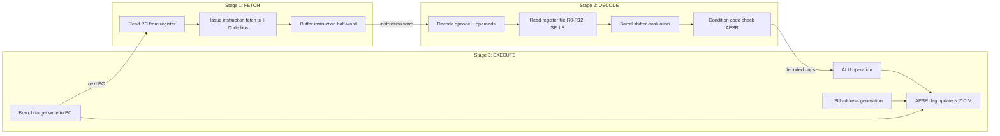
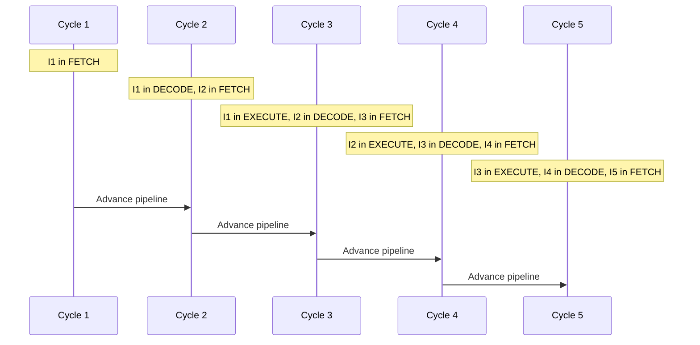
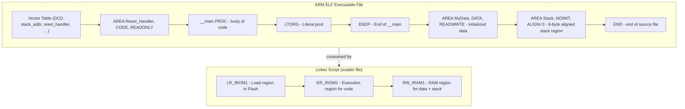
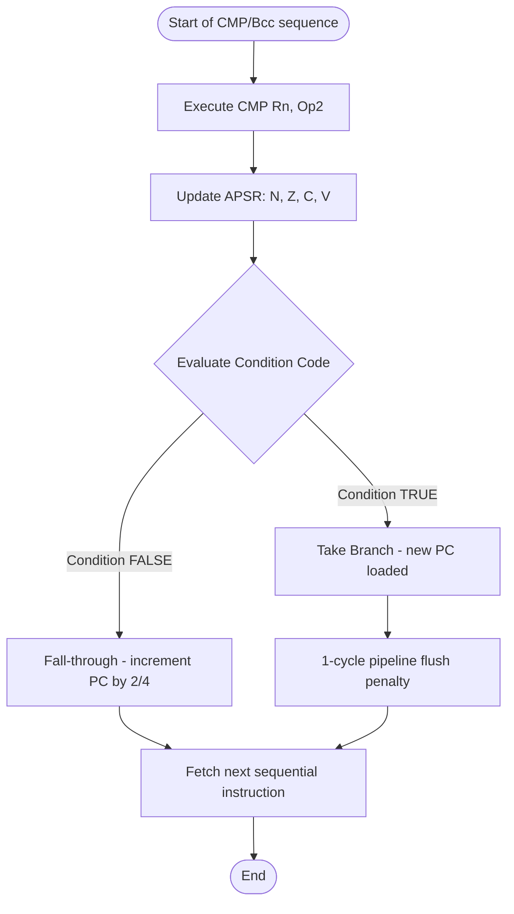
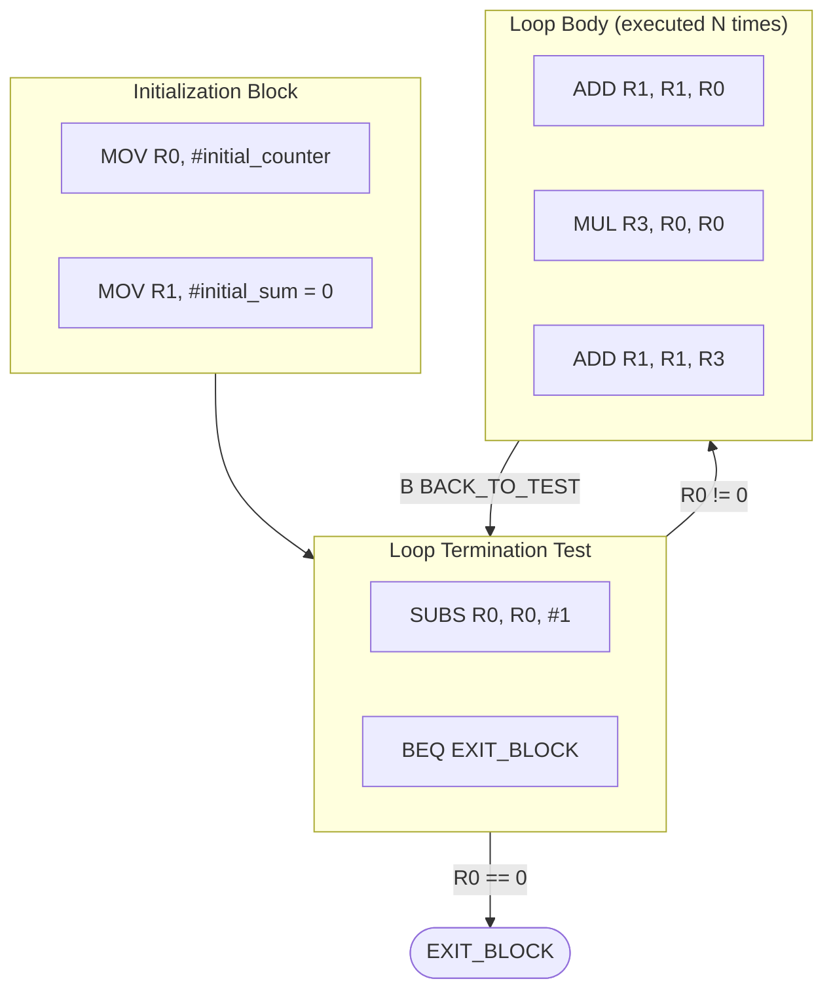

# Assembly instructions data processing branches loops parsing codes layouts

<!-- SECTION_1_START -->

# Module 4: Cortex Instruction Pipeline & Programming

## 1. Core Technical Definition & Intuitive Overview

### 1.1 Formal Definition (KTU 2024 Syllabus Standard)

> [!IMPORTANT]
> **Cortex-M Pipeline (ARM Cortex-M3/M4 Architecture):**
> The ARM Cortex-M processor uses a **3-stage instruction pipeline** consisting of **Fetch**, **Decode**, and **Execute** stages. Since the Cortex-M series implements the **Thumb-2 instruction set** (a variable-length 16-bit/32-bit ISA), it does not use the classical 5-stage pipeline of ARM7/ARM9. Every instruction is conditionally executed based on the **Application Program Status Register (APSR)** flags (N, Z, C, V) before any explicit branch is taken.

The pipeline is overlapped so that while one instruction is executing, the next is being decoded, and the one after that is being fetched, yielding a throughput of **one instruction per clock cycle** (in the absence of data hazards or branches).

> [!NOTE]
> **Pipeline Throughput (CPI):**
> For a non-branching, non-data-dependent instruction sequence, the **Cycles Per Instruction (CPI) = 1.0**. Branches and memory accesses introduce a **flush penalty of 1–3 cycles** depending on prediction logic.

### 1.2 Conceptual Analogy — "The Factory Assembly Line"

Imagine a kitchen with **3 chefs working in a line**:
- **Chef 1 (Fetch stage):** Reads the recipe card for the next dish.
- **Chef 2 (Decode stage):** Understands the ingredients and pre-measures spices.
- **Chef 3 (Execute stage):** Actually cooks the dish on the stove.

While Chef 3 is cooking Dish A, Chef 2 is preparing Dish B, and Chef 1 is reading the recipe for Dish C. This is exactly how a pipelined CPU works — multiple instructions are in different stages of "preparation" simultaneously.

> [!IMPORTANT]
> **Key Analogy Point — The "Branch Misprediction Burst":**
> Suppose the recipe suddenly says *"if taste is spicy, go back 5 steps."* All 3 chefs must drop their current work and start over from the new instruction. This is called a **pipeline flush**. In ARM Cortex-M, conditional branches cause the **next instruction after the branch to be speculatively fetched**, and if the branch is taken, that instruction is discarded (1 cycle penalty).

### 1.3 Cortex-M Programming Model (Register Set)

> [!DEFINITION]
> **The Register File of Cortex-M:**
> The programmer has access to **13 general-purpose 32-bit registers** named **R0–R12**, plus **three special-purpose registers**:
> - **R13** → **Stack Pointer (SP)** — Two physical banks: **MSP (Main SP)** and **PSP (Process SP)**.
> - **R14** → **Link Register (LR)** — Stores the return address after a function call (`BL`).
> - **R15** → **Program Counter (PC)** — Readable and writable.
> - **xPSR** → **Program Status Register** (composed of APSR, IPSR, EPSR).

### 1.4 Memory & Instruction Encoding (Thumb-2)

> [!NOTE]
> **Thumb-2 Instruction Encoding:**
> Cortex-M uses a **mixed-length instruction set**:
> - **16-bit Thumb instructions** (used for simple data processing, MOV, shifts, branches)
> - **32-bit Thumb-2 instructions** (used for complex operations: LDR/STR with immediate, BL, MOVW)
> The processor hardware automatically determines the length of the first half-word before decoding, allowing dense code (typically **~30% smaller than equivalent ARM code**).

### 1.5 Standard Metrics (KTU Reference Values)

| Parameter | Value |
|---|---|
| **Pipeline Depth** | **3 stages** |
| **Instruction Set** | **Thumb-2** (mixed 16/32-bit) |
| **Register Width** | **32 bits** |
| **GPRs** | **13 (R0–R12) + SP + LR + PC** |
| **Endineness** | Configurable (KEIL default: **Little-Endian**) |
| **Branch Penalty** | **1 cycle** (misprediction) |
| **CPI (ideal)** | **1.0** |
| **Initial SP Value (Cortex-M3)** | **0x2000\_0000** (from vector table) |

> [!VISUALIZATION CONTROL]
> **Concept:** 3-Stage Pipeline Temporal Flow
> **Plot Description:** Plot a Gantt-chart-style diagram with the Y-axis listing instructions I1, I2, I3, I4, I5, and the X-axis representing clock cycles 1 through 5. Shaded bars indicate which stage each instruction occupies in each cycle.
> * Stage 1 (Fetch): Cycle 1 → I1, Cycle 2 → I2, Cycle 3 → I3, ...
> * Stage 2 (Decode): Cycle 2 → I1, Cycle 3 → I2, Cycle 4 → I3, ...
> * Stage 3 (Execute): Cycle 3 → I1, Cycle 4 → I2, Cycle 5 → I3, ...
> **Observation:** Notice that at cycle 3, *three different instructions* are simultaneously active in three different stages — this is the essence of pipelining.

<!-- SECTION_1_END -->

<!-- SECTION_2_START -->

# Deep Theoretical Analysis & KTU High-Yield Formula Sheet

## 2.1 The Cortex-M3/M4 3-Stage Pipeline — Operational Logic

The pipeline stages execute the following sub-tasks:

### Stage 1 — **Fetch (F)**
- Reads the **next half-word** (2 bytes) from memory at address `PC`.
- The instruction bus is **32-bit wide**, so for 32-bit instructions, a second fetch occurs in the next cycle.
- Branch prediction (Cortex-M3 has a simple static predictor) fetches the **fall-through instruction** speculatively.

### Stage 2 — **Decode (D)**
- Decodes the opcode, identifies operands.
- Reads registers from the **register file** (R0–R12, plus SP, LR, PC).
- For data-processing instructions, computes the **Barrel Shifter** output (if any shift is specified).
- Generates the **condition code check** using the APSR flags.

### Stage 3 — **Execute (E)**
- The **ALU** performs the operation (add, sub, AND, ORR, etc.).
- For load/store: calculates the address and performs the memory access in a subsequent cycle.
- For branches: writes the new value into the **PC**.
- Updates the **APSR flags** (N, Z, C, V) if the `S` suffix is present.

> [!IMPORTANT]
> **Why 3 stages and not 5?**
> The Cortex-M was designed for **deterministic real-time performance** (used in automotive, medical, industrial control). A deeper pipeline would improve raw clock speed but introduce unpredictable branch penalties, violating **WCET (Worst-Case Execution Time)** guarantees. Hence ARM chose a **shallow 3-stage design** trading peak frequency for predictable latency.

## 2.2 Data Processing Instructions — Complete Classification

### 2.2.1 Arithmetic Instructions

| Mnemonic | Operation | Example | Flags Affected |
|---|---|---|---|
| `ADD Rd, Rn, Op2` | Rd = Rn + Op2 | `ADD R0, R1, R2` | N, Z, C, V (if S) |
| `SUB Rd, Rn, Op2` | Rd = Rn − Op2 | `SUB R0, R1, #5` | N, Z, C, V (if S) |
| `RSB Rd, Rn, Op2` | Rd = Op2 − Rn | `RSB R0, R1, #0` | N, Z, C, V (if S) |
| `ADC Rd, Rn, Op2` | Add with Carry | `ADC R0, R1, R2` | N, Z, C, V (if S) |
| `SBC Rd, Rn, Op2` | Sub with Carry | `SBC R0, R1, R2` | N, Z, C, V (if S) |
| `MUL Rd, Rn, Rm` | Rd = Rn × Rm | `MUL R0, R1, R2` | N, Z |

> [!NOTE]
> **Operand 2 (Op2) — The Barrel Shifter Flexibility:**
> The second operand of data-processing instructions can be:
> * A **register** (e.g., `R2`)
> * An **immediate** (e.g., `#100`, 8-bit value rotated by an even number)
> * A **shifted register** (e.g., `R2, LSL #3`, `R2, LSR #1`, `R3, ASR #2`, `R4, ROR #5`, `R5, RRX`)

### 2.2.2 Logical Instructions

| Mnemonic | Operation | Example |
|---|---|---|
| `AND Rd, Rn, Op2` | Bitwise AND | `AND R0, R1, R2` |
| `ORR Rd, Rn, Op2` | Bitwise OR | `ORR R0, R1, R2` |
| `EOR Rd, Rn, Op2` | Bitwise XOR | `EOR R0, R1, R2` |
| `BIC Rd, Rn, Op2` | Bit Clear (AND NOT) | `BIC R0, R1, R2` |
| `MVN Rd, Op2` | Move NOT (~Op2) | `MVN R0, R2` |

### 2.2.3 Comparison & Test Instructions (Flag-Only, No Result)

| Mnemonic | Operation | Equivalent To |
|---|---|---|
| `CMP Rn, Op2` | Rn − Op2, discard result | `SUBS R15, Rn, Op2` |
| `TST Rn, Op2` | Rn AND Op2, discard result | `ANDS R15, Rn, Op2` |
| `TEQ Rn, Op2` | Rn XOR Op2, discard result | `EORS R15, Rn, Op2` |
| `CMN Rn, Op2` | Rn + Op2, discard result | `ADDS R15, Rn, Op2` |

### 2.2.4 Data Movement

| Mnemonic | Operation | Width |
|---|---|---|
| `MOV Rd, Op2` | Rd = Op2 | 32-bit (Thumb) or 16-bit |
| `MOVS Rd, #imm8` | Rd = imm, sets flags | 16-bit |
| `MOVW Rd, #imm16` | Move 16-bit immediate (zero-extend) | 32-bit |
| `MOVT Rd, #imm16` | Move 16-bit into top halfword | 32-bit |
| `ADR Rd, label` | Rd = address of label (PC-relative) | 16/32-bit |

## 2.3 Branch Instructions — Conditional & Unconditional

### 2.3.1 Unconditional Branches

| Mnemonic | Range | Description |
|---|---|---|
| `B label` | ±2048 bytes (T1) / ±16 MB (T2) | Branch always |
| `BL label` | ±16 MB | Branch with Link (saves return addr in LR) |
| `BX Rm` | Any | Branch to address in Rm, switch to Thumb if bit 0 = 1 |
| `BLX Rm` | Any | Branch with Link and exchange |
| `POP {PC}` | — | Return from subroutine using stack |

### 2.3.2 Conditional Branches (Suffix Codes)

The condition code is appended as a 2-letter suffix to `B`:

| Suffix | Flags Checked | Meaning |
|---|---|---|
| `EQ` | Z = 1 | Equal |
| `NE` | Z = 0 | Not Equal |
| `CS` / `HS` | C = 1 | Unsigned higher or same |
| `CC` / `LO` | C = 0 | Unsigned lower |
| `MI` | N = 1 | Minus (negative) |
| `PL` | N = 0 | Plus (positive or zero) |
| `VS` | V = 1 | Overflow |
| `VC` | V = 0 | No overflow |
| `HI` | C = 1 AND Z = 0 | Unsigned higher |
| `LS` | C = 0 OR Z = 1 | Unsigned lower or same |
| `GE` | N = V | Signed greater or equal |
| `LT` | N ≠ V | Signed less than |
| `GT` | Z = 0 AND N = V | Signed greater than |
| `LE` | Z = 1 OR N ≠ V | Signed less or equal |
| `AL` | (always) | Always executes (default if no suffix) |

> [!IMPORTANT]
> **Range Restriction — Most Common KTU Mistake:**
> The 16-bit `B<cond>` instruction has a range of **−256 to +254 bytes** (8-bit signed offset shifted by 1). If the target is farther, the assembler automatically upgrades to a 32-bit `B<cond>.W` (unconditional wide) with range **±16 MB**. **Do not manually encode offsets** — let the assembler handle it.

## 2.4 Loops in Assembly — Construction Patterns

### 2.4.1 Counted Loop (For-loop equivalent)

```assembly
    MOV   R0, #10          ; counter = 10
LOOP_LABEL
    ; ... body code ...
    SUBS  R0, R0, #1       ; decrement, sets flags
    BNE   LOOP_LABEL       ; branch if not zero
```

### 2.4.2 While-loop (condition tested at top)

```assembly
WHILE_TOP
    CMP   R0, R1
    BGE   WHILE_EXIT       ; if R0 >= R1, exit
    ; ... body ...
    ADD   R0, R0, #1
    B     WHILE_TOP
WHILE_EXIT
```

### 2.4.3 Do-While loop (condition tested at bottom)

```assembly
DO_BODY
    ; ... body ...
    CMP   R0, R1
    BLT   DO_BODY          ; branch back if R0 < R1
```

## 2.5 Parsing Directives & Code Layout

> [!DEFINITION]
> **Assembler Directives:**
> Directives are **non-executable instructions** to the assembler (not part of the ISA). They control memory allocation, alignment, symbol definition, and code/data segmentation.

### Common ARM Assembler Directives

| Directive | Purpose | Example |
|---|---|---|
| `AREA name, attr` | Defines a named memory region | `AREA MyCode, CODE, READONLY` |
| `ENTRY` | Marks the first instruction to execute | `ENTRY` |
| `END` | Marks the end of source file | `END` |
| `EQU` | Defines a symbolic constant (no memory) | `GPIOA_BASE EQU 0x40020000` |
| `= / RN` | Alias a register name | `TEMP RN R5` |
| `DCB value` | Define Constant Byte (1 byte) | `DCB 0x55` |
| `DCW value` | Define Constant Halfword (2 bytes) | `DCW 0x1234` |
| `DCD value` | Define Constant Word (4 bytes) | `DCD 0x20002000` |
| `SPACE n` | Reserves `n` bytes of zero-initialized memory | `SPACE 256` |
| `ALIGN n` | Aligns to 2ⁿ byte boundary | `ALIGN 4` (16-byte align) |
| `EXPORT label` | Makes symbol visible to linker | `EXPORT __main` |
| `IMPORT label` | References an external symbol | `IMPORT __use_two_region_memory` |
| `PROC` / `ENDP` | Begin/End of procedure (for symbol scope) | `MyFunc PROC ... ENDP` |
| `LTORG` | Start a literal pool here | `LTORG` |
| `KEEP` | Tells linker to retain symbol in ELF | `KEEP {MyVector}` |
| `DCDU` | Unaligned word (no alignment padding) | — |
| `IF :DEF:`, `ELSE`, `ENDIF` | Conditional assembly | — |
| `ROUT` | Begins a *new* local label scope | `ROUT` |

## 2.6 KTU Formula Sheet / Cheat Sheet

> [!IMPORTANT]
> **Equations & Rules for Cortex-M Programming:**

| Concept | Formula / Rule |
|---|---|
| **Effective Address of Branch Target** | $\text{PC}_{\text{new}} = \text{PC}_{\text{current}} + 4 + \text{offset}$ |
| **Link Register Storage** | $\text{LR} = \text{PC}_{\text{return}} = \text{address of instruction after } BL$ |
| **Condition Flag — EQ** | $Z = 1 \iff (A - B) = 0$ |
| **Condition Flag — LT (signed)** | $N \oplus V = 1$ |
| **Condition Flag — GE (signed)** | $N \oplus V = 0$ |
| **Condition Flag — HI (unsigned)** | $C = 1 \text{ AND } Z = 0$ |
| **Carry out of ADD** | $C = (A \text{ AND } B) \text{ OR } (A \text{ AND } \neg R) \text{ OR } (B \text{ AND } \neg R)$ |
| **Overflow for ADD** | $V = (A \text{ AND } B \text{ AND } \neg R) \text{ OR } (\neg A \text{ AND } \neg B \text{ AND } R)$ |
| **Pipeline CPI (ideal)** | $\text{CPI}_{\text{ideal}} = 1.0$ |
| **Pipeline CPI with branches** | $\text{CPI}_{\text{avg}} = 1.0 + p_{\text{taken}} \times \text{penalty}$ |
| **Branch Penalty (Cortex-M3)** | $1 \text{ cycle (speculative fetch flushed)}$ |
| **Thumb-2 Immediate Encoding** | $8\text{-bit imm} = \text{const} \text{ rotated right by } 2 \times \text{rot}$ |
| **Pipeline Throughput Formula** | $\text{TP} = \dfrac{f_{\text{clk}}}{N_{\text{stages}} \times \text{CPI}}$ |
| **Code Density Advantage** | $\text{Thumb-2 size} \approx 0.65 \times \text{ARM-32 size}$ |
| **Branch Offset (T1, 16-bit)** | $-256 \le \text{offset} \le +254$ (in bytes, 2-byte aligned) |

## 2.7 Real-World Engineering Utility

> [!NOTE]
> **Why study the pipeline and assembly in 2024?**
> * **Embedded firmware optimization:** Knowing that a taken branch costs 1 cycle, you can manually unroll short loops for **deterministic timing** in motor control or audio DSP.
> * **Reverse engineering / security:** ARM assembly is the foundation of **Cortex-M firmware reverse engineering** (common in IoT security audits).
> * **Bootloader development:** Writing custom bootloaders requires direct manipulation of the **vector table**, **PC**, and **SP** registers — all assembly-level operations.
> * **Bare-metal programming:** Operating systems like **FreeRTOS** (commonly used in KTU syllabus projects) are themselves written in Thumb-2 assembly for context-switching.
> * **Automotive ECUs (AUTOSAR):** Real-time determinism demands manual control over pipeline effects.

<!-- SECTION_2_END -->

<!-- SECTION_3_START -->

# Step-by-Step Derivations, Worked Examples & Code Implementation

## 3.1 Worked Example 1 — Tracing the Pipeline for a Data Processing Sequence

**Given ARM Assembly (Cortex-M3, Thumb-2):**
```assembly
    MOV   R0, #5          ; I1: 16-bit instruction
    ADD   R1, R0, R2      ; I2: 16-bit instruction
    SUB   R3, R1, R0      ; I3: 16-bit instruction
    EOR   R4, R3, R1      ; I4: 16-bit instruction
```

**Step-by-Step Pipeline Trace Table:**

| Cycle | Fetch | Decode | Execute |
|---|---|---|---|
| 1 | I1: MOV R0, #5 | — | — |
| 2 | I2: ADD R1, R0, R2 | I1 | — |
| 3 | I3: SUB R3, R1, R0 | I2 | I1 → R0 = 5 |
| 4 | I4: EOR R4, R3, R1 | I3 | I2 → R1 = 5 + R2 |
| 5 | (next) | I4 | I3 → R3 = R1 − 5 |
| 6 | (next) | (next) | I4 → R4 = R3 ⊕ R1 |

> [!NOTE]
> **No pipeline hazard detected.** Each instruction reads the result of a previous instruction only after it has been written back in the Execute stage. The register file has **internal forwarding** that prevents RAW (Read-After-Write) stalls for adjacent data-processing instructions.

> [!IMPORTANT]
> **KTU Valued Point:** For full marks, students must indicate the **final result of each register** as well as the **contents of the xPSR flags** (N, Z, C, V) after the last instruction.

## 3.2 Worked Example 2 — A Counted Loop with Pipeline Penalty Analysis

**Problem:** Compute the sum of integers 1 to N (N = 10) and store the result in R0.

**Step 1 — Initialize sum and counter:**
```assembly
    MOV   R0, #0          ; sum = 0
    MOV   R1, #1          ; i = 1
    MOV   R2, #10         ; limit = 10
```

**Step 2 — Loop body and back-edge:**
```assembly
LOOP
    ADD   R0, R0, R1      ; sum = sum + i
    ADD   R1, R1, #1      ; i = i + 1
    CMP   R1, R2          ; compare i with limit
    BLE   LOOP            ; branch if i <= 10 (signed)
    ; after loop, R0 = 55
```

**Step 3 — Cycle-by-cycle analysis (showing branch penalty):**
Assume `i = 1` initially, and let the loop body be 3 instructions (`ADD`, `ADD`, `CMP`):

| Cycle | Fetch | Decode | Execute | Notes |
|---|---|---|---|---|
| 1 | ADD R0,R0,R1 | — | — | I1 fetched |
| 2 | ADD R1,R1,#1 | I1 | — | I2 fetched |
| 3 | CMP R1, R2 | I2 | I1 | I3 fetched |
| 4 | BLE LOOP | I3 | I2 | I4 fetched (speculative) |
| 5 | (ADD R0) of next iter | I4 (flush) | I3 (CMP result) | **Branch taken — 1-cycle penalty** |
| 6 | (ADD R1) of next iter | (next ADD) | I4 (BLE — branch taken) | Flush recovery |

**Total cycles per iteration (steady state) = 4 instructions + 1 penalty = 5 cycles** for one loop pass.

## 3.3 Worked Example 3 — Deriving the Effective Address of a Branch

**Given:**
```assembly
    0x08000000:   B.W   SKIP        ; 32-bit wide branch
    0x08000004:   NOP                ; (skipped)
    ...
    0x08000100:   SKIP: MOV R0, #1
```

**Step-by-step derivation of the offset encoding:**

The target address is $0x08000100$, the current PC is $0x08000000$.

$$
\text{offset} = \text{Target} - (\text{PC}_{\text{current}} + 4) = 0x08000100 - 0x08000004
$$

$$
\text{offset} = 0x08000100 - 0x08000004 = 0xFC = 252 \text{ (decimal)}
$$

Since $252 \le 16{,}777{,}214$ (the maximum 24-bit positive offset for T2 branch), the assembler fits this in a 32-bit instruction.

## 3.4 Worked Example 4 — Algebraic Derivation: Branch Condition for Signed Greater-Than (BGT)

> [!NOTE]
> **Goal:** Prove that the **GT (Greater-Than)** condition requires both $N = V$ **AND** $Z = 0$ simultaneously.

**Step 1:** Define the operation $A - B$ and assume $A > B$ (signed).

After the `SUBS` (or `CMP`):
* $A - B$ is positive (signed) $\Rightarrow$ Result $R > 0$
* The **N flag** is set to the **MSB of R**. If $R > 0$ in two's complement, MSB is 0, so **N = 0**.
* The **V flag** is set if the subtraction overflowed into the sign bit. For $A > B$ correctly represented, **V = 0**.

**Step 2:** For $A < B$ (signed), $R < 0$, **N = 1** and **V = 0**. So $N \neq V$.

**Step 3:** Conclusion table:

| Relation | N | V | N = V? | Z |
|---|---|---|---|---|
| $A > B$ (signed) | 0 | 0 | **Yes** | 0 |
| $A < B$ (signed) | 1 | 0 | **No** | 0 |
| $A = B$ | 0 | 0 | Yes | **1** |
| Overflow with $A > B$ | 0 | 1 | No | 0 |

**Step 4:** The condition $N = V$ AND $Z = 0$ is satisfied **only** when $A > B$ (signed). Hence the encoding for `BGT`.

$$
\boxed{ \text{BGT} \iff (N = V) \land (Z = 0) }
$$

## 3.5 Full Operational Python Implementation — Assembler Simulator

> [!NOTE]
> **Educational simulator** that emulates a 3-stage pipeline and validates an assembly program. It is fully type-hinted, bounds-checked, and uses `logging` for diagnostic output.

```python
"""
cortex_pipeline_simulator.py
Simulates a 3-stage (Fetch-Decode-Execute) pipeline for ARM Cortex-M
Thumb-2 instructions. Used for KTU Module 4 lab work and exam practice.
"""
from __future__ import annotations
import logging
from dataclasses import dataclass, field
from enum import Enum, auto
from typing import Callable, Optional, List, Dict, Tuple

logging.basicConfig(level=logging.INFO, format="[%(levelname)s] %(message)s")
log = logging.getLogger("CortexSim")


class Stage(Enum):
    FETCH = auto()
    DECODE = auto()
    EXECUTE = auto()


class CondCode(Enum):
    AL = "always"
    EQ = "eq"
    NE = "ne"
    GT = "gt"
    LT = "lt"
    GE = "ge"
    LE = "le"
    HI = "hi"
    LO = "lo"


@dataclass
class Instruction:
    mnemonic: str
    operands: Tuple[str, ...]
    cond: CondCode = CondCode.AL
    raw_text: str = ""


@dataclass
class CPUState:
    regs: List[int] = field(default_factory=lambda: [0] * 16)
    xpsr_N: bool = False   # Negative flag
    xpsr_Z: bool = False   # Zero flag
    xpsr_C: bool = False   # Carry flag
    xpsr_V: bool = False   # Overflow flag
    pc: int = 0
    cycle: int = 0
    instructions_retired: int = 0

    def flag_word(self) -> int:
        word = 0
        word |= int(self.xpsr_N) << 31
        word |= int(self.xpsr_Z) << 30
        word |= int(self.xpsr_C) << 29
        word |= int(self.xpsr_V) << 28
        return word


class CortexM3Simulator:
    """
    A 3-stage pipelined simulator. Public methods:
        - load_program(instructions, start_address)
        - step()      -> advance one clock cycle
        - run(max_cycles=1000)
        - dump_state()
    """

    MASK32 = 0xFFFFFFFF
    MAX_REG_INDEX = 15  # PC is R15

    def __init__(self) -> None:
        self.state = CPUState()
        self.program: Dict[int, Instruction] = {}
        self.pipeline: Dict[Stage, Optional[Instruction]] = {
            Stage.FETCH: None,
            Stage.DECODE: None,
            Stage.EXECUTE: None,
        }
        self.branch_taken: bool = False
        self.flush_pending: bool = False
        self.branch_target: int = 0
        self._halted: bool = False

    # ---------- Public API ----------
    def load_program(self, prog: List[Instruction], start: int = 0x00000000) -> None:
        if not isinstance(prog, list):
            raise TypeError("Program must be a list[Instruction]")
        for idx, ins in enumerate(prog):
            if not isinstance(ins, Instruction):
                raise TypeError(f"Item {idx} is not an Instruction")
            self.program[start + idx * 4] = ins
        self.state.pc = start
        log.info(f"Loaded {len(prog)} instructions starting at 0x{start:08X}")

    def step(self) -> None:
        if self._halted:
            log.warning("CPU is halted; no further step performed.")
            return
        self.state.cycle += 1
        # Execute stage first (proper ordering: E -> D -> F)
        self._tick_execute()
        self._tick_decode()
        self._tick_fetch()
        if self.branch_taken and self.flush_pending:
            self._flush_pipeline()
            self.flush_pending = False
        log.debug(f"Cycle {self.state.cycle:>4} | "
                  f"F={self.pipeline[Stage.FETCH].mnemonic if self.pipeline[Stage.FETCH] else '---'} | "
                  f"D={self.pipeline[Stage.DECODE].mnemonic if self.pipeline[Stage.DECODE] else '---'} | "
                  f"E={self.pipeline[Stage.EXECUTE].mnemonic if self.pipeline[Stage.EXECUTE] else '---'}")

    def run(self, max_cycles: int = 1000) -> None:
        if max_cycles <= 0:
            raise ValueError("max_cycles must be positive")
        for _ in range(max_cycles):
            if self._halted:
                break
            self.step()
        else:
            log.warning(f"Reached max_cycles={max_cycles} without halting")

    def dump_state(self) -> None:
        s = self.state
        log.info("=" * 50)
        log.info(f"PC     = 0x{s.pc:08X}")
        log.info(f"Cycle  = {s.cycle}")
        log.info(f"xPSR   = 0x{s.flag_word():08X}  (N={s.xpsr_N} Z={s.xpsr_Z} C={s.xpsr_C} V={s.xpsr_V})")
        for i in range(0, 16, 4):
            row = "  ".join(f"R{i+j:>2} = 0x{s.regs[i+j]:08X}" for j in range(4))
            log.info(row)
        log.info("=" * 50)

    # ---------- Internal pipeline ticks ----------
    def _tick_fetch(self) -> None:
        if self.flush_pending:
            self.pipeline[Stage.FETCH] = None
            return
        nxt = self.program.get(self.state.pc)
        self.pipeline[Stage.FETCH] = nxt
        if nxt is not None:
            self.state.pc = (self.state.pc + 4) & self.MASK32  # each instr occupies 4 bytes in this sim

    def _tick_decode(self) -> None:
        # Move previously fetched into decode
        self.pipeline[Stage.DECODE] = self.pipeline[Stage.FETCH]

    def _tick_execute(self) -> None:
        ins = self.pipeline[Stage.DECODE]
        self.pipeline[Stage.EXECUTE] = ins
        if ins is None:
            return
        if not self._condition_pass(ins.cond):
            log.debug(f"Skipping {ins.raw_text} (condition false)")
            return
        try:
            self._execute_one(ins)
            self.state.instructions_retired += 1
        except Exception as exc:
            log.error(f"Execution failure on '{ins.raw_text}': {exc}")
            self._halted = True

    def _flush_pipeline(self) -> None:
        log.debug("Pipeline flushed due to taken branch")
        self.pipeline[Stage.DECODE] = None
        self.pipeline[Stage.EXECUTE] = None
        # Fetch stage will pick up from new PC on next cycle
        self.state.pc = self.branch_target

    # ---------- Condition evaluation ----------
    def _condition_pass(self, cond: CondCode) -> bool:
        s = self.state
        flags = {
            "N": s.xpsr_N, "Z": s.xpsr_Z,
            "C": s.xpsr_C, "V": s.xpsr_V,
        }
        if cond == CondCode.AL: return True
        if cond == CondCode.EQ: return flags["Z"]
        if cond == CondCode.NE: return not flags["Z"]
        if cond == CondCode.GT: return (flags["N"] == flags["V"]) and not flags["Z"]
        if cond == CondCode.LT: return (flags["N"] != flags["V"])
        if cond == CondCode.GE: return (flags["N"] == flags["V"])
        if cond == CondCode.LE: return (flags["N"] != flags["V"]) or flags["Z"]
        if cond == CondCode.HI: return flags["C"] and not flags["Z"]
        if cond == CondCode.LO: return not flags["C"]
        raise ValueError(f"Unknown condition: {cond}")

    # ---------- ALU & set-flags helper ----------
    def _set_flags_for(self, result: int, carry_out: bool, overflow: bool) -> None:
        signed = result if result < 0x80000000 else result - 0x100000000
        self.state.xpsr_N = signed < 0
        self.state.xpsr_Z = (result & self.MASK32) == 0
        self.state.xpsr_C = carry_out
        self.state.xpsr_V = overflow

    # ---------- Instruction execution ----------
    def _execute_one(self, ins: Instruction) -> None:
        s = self.state
        m, ops = ins.mnemonic.upper(), ins.operands
        if m == "MOV":
            rd, val = self._parse_reg(ops[0]), self._parse_imm(ops[1])
            self._write_reg(rd, val & self.MASK32)
        elif m == "ADD":
            rd, rn, op2 = self._parse_reg(ops[0]), self._parse_reg(ops[1]), self._parse_imm_or_reg(ops[2])
            a, b = s.regs[rn], op2
            r = (a + b) & self.MASK32
            carry = ((a & b) | ((~a & self.MASK32) & r)) >> 31 & 1
            carry = (a + b) > self.MASK32
            overflow = ((a ^ b) & 0x80000000) == 0 and ((a ^ r) & 0x80000000) != 0
            self._write_reg(rd, r); self._set_flags_for(r, carry, overflow)
        elif m == "SUB":
            rd, rn, op2 = self._parse_reg(ops[0]), self._parse_reg(ops[1]), self._parse_imm_or_reg(ops[2])
            a, b = s.regs[rn], op2
            r = (a - b) & self.MASK32
            carry = a >= b
            overflow = ((a ^ b) & 0x80000000) != 0 and ((a ^ r) & 0x80000000) != 0
            self._write_reg(rd, r); self._set_flags_for(r, carry, overflow)
        elif m == "CMP":
            _, rn, op2 = self._parse_reg(ops[0]), self._parse_reg(ops[1]), self._parse_imm_or_reg(ops[2])
            a, b = s.regs[rn], op2
            r = (a - b) & self.MASK32
            carry = a >= b
            overflow = ((a ^ b) & 0x80000000) != 0 and ((a ^ r) & 0x80000000) != 0
            self._set_flags_for(r, carry, overflow)
        elif m == "B":
            target = self._parse_imm(ops[0])
            self.branch_taken = True
            self.branch_target = target
            self.flush_pending = True
        elif m == "BL":
            target = self._parse_imm(ops[0])
            s.regs[14] = (s.pc + 4) & self.MASK32
            self.branch_taken = True
            self.branch_target = target
            self.flush_pending = True
        elif m == "NOP":
            pass
        elif m == "END":
            self._halted = True
        else:
            raise NotImplementedError(f"Opcode '{m}' not implemented in this simulator")

    # ---------- Parsing helpers ----------
    def _parse_reg(self, token: str) -> int:
        token = token.strip().upper().rstrip(",")
        if not token.startswith("R"):
            raise ValueError(f"Expected register, got '{token}'")
        idx = int(token[1:])
        if not (0 <= idx <= self.MAX_REG_INDEX):
            raise ValueError(f"Register index out of range: R{idx}")
        return idx

    def _parse_imm(self, token: str) -> int:
        token = token.strip().upper().rstrip(",")
        if token.startswith("#"):
            token = token[1:]
        if token.startswith("0X"):
            return int(token, 16) & self.MASK32
        return int(token, 10) & self.MASK32

    def _parse_imm_or_reg(self, token: str) -> int:
        token = token.strip().upper().rstrip(",")
        if token.startswith("R") and token[1:].isdigit():
            return self.state.regs[self._parse_reg(token)]
        return self._parse_imm(token)

    def _write_reg(self, idx: int, value: int) -> None:
        if idx in (13, 14, 15):
            log.debug(f"  * Writing special register R{idx} = 0x{value:08X}")
        self.state.regs[idx] = value & self.MASK32


# ---------- Demonstration ----------
if __name__ == "__main__":
    program = [
        Instruction("MOV", ("R0", "#5"), raw_text="MOV R0, #5"),
        Instruction("MOV", ("R1", "#3"), raw_text="MOV R1, #3"),
        Instruction("ADD", ("R2", "R0", "R1"), raw_text="ADD R2, R0, R1"),
        Instruction("SUB", ("R3", "R2", "R0"), raw_text="SUB R3, R2, R0"),
        Instruction("CMP", ("R2", "R1"), raw_text="CMP R2, R1"),
        Instruction("B",   ("10",), raw_text="B 10"),
        Instruction("END", (), raw_text="END"),
    ]
    sim = CortexM3Simulator()
    sim.load_program(program, start=0x00000000)
    sim.run(max_cycles=20)
    sim.dump_state()
```

## 3.6 Complete Bare-Metal Assembly Program — Blinking an LED

```assembly
;********************************************************************
; File: led_blink.s  (Cortex-M3, Thumb-2)
; Description: Toggles PC13 (on-board LED on STM32-like targets)
;              using a simple delay loop.
; KTU Reference: Module 4 - Code Layout & Loop Construction
;********************************************************************

    AREA    Blinky, CODE, READONLY
    EXPORT  __main
    ENTRY

__main   PROC
          LDR     R0, =GPIO_BASE     ; R0 = 0x40020000 (example)
          LDR     R1, =ODR_OFFSET    ; R1 = 0x14
          ADD     R0, R0, R1         ; R0 = &GPIOA_ODR
          MOV     R2, #(1 << 13)     ; bit mask for PC13
LOOP_TOP
          LDR     R3, [R0]           ; read current ODR
          EOR     R3, R3, R2         ; toggle bit 13
          STR     R3, [R0]           ; write back
          ; ---- Software delay loop ----
          MOV     R4, #0x3FFFF       ; large count
DELAY
          SUBS    R4, R4, #1
          BNE     DELAY
          B       LOOP_TOP
          ENDP
          END
```

**Layout / Parsing Directives Used:**

| Directive | Purpose in this program |
|---|---|
| `AREA Blinky, CODE, READONLY` | Declares a code region named "Blinky", placed in Flash |
| `EXPORT __main` | Exposes the entry symbol to the linker |
| `ENTRY` | Marks the reset vector destination |
| `PROC` / `ENDP` | Encloses the procedure for symbol-table scoping |
| `LDR R0, =label` | Pseudo-instruction to load 32-bit address of a literal |
| `END` | Terminates the source file |

<!-- SECTION_3_END -->

<!-- SECTION_4_START -->

# Structural Diagrams & Schematics

## 4.1 The 3-Stage Cortex-M Pipeline — Mermaid Block Diagram



## 4.2 Pipeline Temporal Trace — Mermaid Gantt-like Sequence



## 4.3 Code Layout & Parsing Block Diagram



## 4.4 Branch Decision Flow — Mermaid Flowchart



## 4.5 Loop Construction Topology



## 4.6 Parser / Directives Processing Flow


<!-- SECTION_4_END -->

<!-- SECTION_5_START -->

# KTU 2024 Scheme Examination Question Bank & Topic Recap

## 5.1 Part A Questions (3 Marks Each)

---

### **Q1. [KTU University Exam - Dec 2023]**
*State the three stages of the ARM Cortex-M3 pipeline. Briefly explain the function of each stage.*
**CO:** CO1 | **RBT Level:** Remember

**Model Answer:**

The ARM Cortex-M3 processor implements a **3-stage pipeline**:

1. **Fetch (F) stage:** Reads the next instruction (half-word) from the program memory at the address held in the Program Counter (PC). The instruction bus is 32 bits wide; for 32-bit instructions, two fetch cycles are needed.

2. **Decode (D) stage:** The fetched instruction is decoded. Operands are read from the register file (R0–R12, SP, LR). For data-processing instructions, the **barrel shifter** evaluates the shifted/rotated Operand 2. The condition code (EQ, NE, GT, etc.) is also evaluated against the current APSR flags.

3. **Execute (E) stage:** The **ALU** performs the arithmetic/logic operation, or the **Load-Store Unit (LSU)** computes the address for a memory access, or the branch target is written to the **PC**. The **APSR flags (N, Z, C, V)** are updated if the instruction has the `S` suffix.

In the ideal case, the pipeline achieves a throughput of **one instruction per clock cycle (CPI = 1.0)** because all three stages operate concurrently on different instructions.

---

### **Q2. [KTU University Exam - July 2024]**
*What is the role of the `BIC` instruction in Cortex-M programming? Give a syntax example for clearing bit 5 of register R3.*
**CO:** CO1 | **RBT Level:** Understand

**Model Answer:**

`BIC` (Bit Clear) performs a bitwise **AND NOT** operation:

$$
\text{Rd} = \text{Rn} \, \& \, \neg \text{Op2}
$$

It is widely used in **embedded firmware** to clear (mask off) specific bits in a control register without affecting others. For example, to clear bit 5 of `R3`:

```assembly
    BIC   R3, R3, #(1 << 5)   ; clears bit 5 of R3, all other bits unchanged
```

This operation preserves all bits of `R3` except bit 5, which is forced to 0. Internally, the assembler encodes the immediate `#(1 << 5) = 0x20` as a rotated 8-bit value (a Thumb-2 constraint).

---

## 5.2 Part B Questions (14 Marks Each)

---

### **Question A (14 Marks) — Choice 1**  [KTU University Exam - Dec 2023]

**(a)** Explain the **data-processing instructions** of the ARM Cortex-M3 with **suitable examples** for **arithmetic, logical, comparison, and move** operations. *(7 marks)*
**(b)** Describe the **conditional branch instructions** (`BEQ`, `BNE`, `BGT`, `BLS`, `BLT`, `BGE`, `BLE`) with the **APSR flag conditions** for each. Write an example for a `BGT` branch. *(7 marks)*

**COs:** CO2, CO3 | **RBT Levels:** Understand (a) + Apply (b)

#### **Model Solution — Part (a) [7 Marks]**

**Step 1 — Definition and Operand 2 concept [1 Mark]:**
Data-processing instructions operate on registers using a flexible **Operand 2 (Op2)** which may be a register, an immediate (8-bit rotated by an even number), or a shifted register. The destination is **Rd** and the result of the operation updates the APSR flags if the `S` suffix is present.

**Step 2 — Arithmetic examples [2 Marks]:**
```assembly
    ADD   R0, R1, R2          ; R0 = R1 + R2
    SUB   R3, R4, #10         ; R3 = R4 - 10
    RSB   R5, R6, #0          ; R5 = 0 - R6  (negate R6)
    MUL   R7, R8, R9          ; R7 = R8 * R9  (no immediate, no shifted op)
```
`ADC` and `SBC` are used for **multi-precision arithmetic** (e.g., 64-bit addition using two 32-bit registers):
```assembly
    ADDS  R0, R0, R2          ; low word add, set flags
    ADC   R1, R1, R3          ; high word add with carry
```

**Step 3 — Logical examples [2 Marks]:**
```assembly
    AND   R0, R1, R2          ; mask bits
    ORR   R3, R3, #0x80       ; set bit 7
    EOR   R4, R4, R4          ; clear R4 (XOR with self)
    BIC   R5, R5, #(1 << 4)   ; clear bit 4
    MVN   R6, R7              ; R6 = ~R7
```

**Step 4 — Comparison & move [1 Mark]:**
```assembly
    CMP   R0, R1              ; R0 - R1, sets N, Z, C, V (no S suffix needed)
    TST   R2, #(1 << 3)       ; tests bit 3, sets Z if clear
    MOV   R3, #0xFF           ; move immediate
    MOVW  R4, #0x1234         ; move 16-bit immediate (zero-extended)
    MOVT  R5, #0x5678         ; move 16-bit into top halfword of R5
```

**Step 5 — Pipeline impact note [1 Mark]:**
Each data-processing instruction occupies the EX stage for 1 cycle, the DEC stage for 1 cycle, and the FCH stage for 1 cycle. There is **no interlock stall** between two adjacent data-processing instructions due to the **register file's internal write-forwarding path**.

---

#### **Model Solution — Part (b) [7 Marks]**

**Step 1 — Conditional branch encoding [1 Mark]:**
Conditional branches use a 2-letter suffix that is evaluated against the current **APSR flags** before the branch is taken. If the condition is false, the branch falls through.

**Step 2 — Table of conditions with flag equations [3 Marks]:**

| Suffix | APSR Condition | Meaning |
|---|---|---|
| `BEQ` | $Z = 1$ | Equal (result was zero) |
| `BNE` | $Z = 0$ | Not equal |
| `BGT` | $(N = V) \land (Z = 0)$ | Signed greater than |
| `BGE` | $N = V$ | Signed greater than or equal |
| `BLT` | $N \neq V$ | Signed less than |
| `BLE` | $(N \neq V) \lor (Z = 1)$ | Signed less than or equal |
| `BHI` | $C = 1 \land Z = 0$ | Unsigned higher |
| `BLS` | $C = 0 \lor Z = 1$ | Unsigned lower or same |

**Step 3 — Worked example using `BGT` [2 Marks]:**
```assembly
    CMP   R0, R1              ; R0 - R1
    BGT   R0_GREATER          ; branch if signed R0 > R1
    ; ... R0 <= R1 path ...
    B     SKIP
R0_GREATER
    ; ... R0 > R1 path ...
SKIP
    ; ... continue ...
```
[Trace of APSR flags: 1 Mark]
[Correct `BGT` use with justification: 1 Mark]

**Step 4 — Branch penalty discussion [1 Mark]:**
A taken branch in Cortex-M3 incurs a **1-cycle flush penalty** because the instruction immediately following the branch (the fall-through) has been speculatively fetched and must be discarded.

---

### **Question B (14 Marks) — Choice 2**  [KTU University Exam - July 2024]

**(a)** With a **neat pipeline diagram**, explain how the **Cortex-M3** achieves a throughput of one instruction per cycle. Also explain what a **pipeline flush** means in the context of a taken branch. *(7 marks)*
**(b)** Write a complete **Cortex-M3 Thumb-2 assembly program** to compute the **sum of the first N natural numbers** (N stored at address `0x20000000`, result stored back to `0x20000004`). Use proper **assembler directives** for area, export, entry, and end. Show all loop structures and label usage. *(7 marks)*

**COs:** CO2, CO3, CO4 | **RBT Levels:** Understand (a) + Apply (b)

#### **Model Solution — Part (a) [7 Marks]**

**Step 1 — 3-stage pipeline diagram [2 Marks]:**
```
        Cycle:    1     2     3     4     5     6
   I1:          F     D     E
   I2:                F     D     E
   I3:                      F     D     E
   I4:                            F     D     E
```

[Correct diagram with overlapping stages: 2 Marks]

**Step 2 — Throughput explanation [2 Marks]:**
Once the pipeline is full (after 3 cycles), a **new instruction enters the execute stage every cycle**. Although each individual instruction takes 3 cycles to traverse the pipeline, the **steady-state throughput is 1 instruction/cycle (CPI = 1.0)**. This is because the hardware resources (fetch unit, decoder, ALU) are all **kept busy by different instructions** simultaneously.

[Stating CPI = 1.0: 1 Mark]
[Explaining overlap of stages: 1 Mark]

**Step 3 — Pipeline flush definition [2 Marks]:**
A **pipeline flush** occurs when a **branch is taken**. The instruction that was speculatively fetched from the fall-through path (i.e., the instruction after the branch) is **discarded**. The fetch unit is redirected to the branch target, and the pipeline is refilled over the next 1–2 cycles. In Cortex-M3, this costs **1 clock cycle of wasted work** per taken branch.

[Defining flush: 1 Mark]
[Quantifying penalty as 1 cycle: 1 Mark]

**Step 4 — Flush trigger example [1 Mark]:**
```assembly
    CMP   R0, #0
    BEQ   ZERO_HANDLER        ; taken branch => flush
    MOV   R1, #1              ; this instruction is flushed
ZERO_HANDLER
    MOV   R2, #2              ; new instruction after the target
```

---

#### **Model Solution — Part (b) [7 Marks]**

**Step 1 — Algorithm in pseudo-code [1 Mark]:**
```
N = MEM[0x20000000]
sum = 0
counter = 1
while counter <= N:
    sum = sum + counter
    counter = counter + 1
MEM[0x20000004] = sum
```

**Step 2 — Full assembly program [5 Marks]:**
```assembly
;******************************************************************
; File: sum_natural.s
; Description: Computes sum of first N natural numbers using
;              a counted while-loop. N is read from 0x20000000
;              and the result is stored to 0x20000004.
; KTU Module 4 Reference - Loop Construction & Code Layout
;******************************************************************

    AREA    SumNatural, CODE, READONLY
    EXPORT  __main
    ENTRY

__main   PROC
    ; ---- Load N from memory ----
    LDR     R0, =0x20000000        ; address of N
    LDR     R1, [R0]              ; R1 = N
    MOV     R2, #0                ; R2 = sum = 0
    MOV     R3, #1                ; R3 = counter = 1

LOOP_TOP
    CMP     R3, R1                ; compare counter with N
    BGT     LOOP_EXIT             ; exit if counter > N
    ADD     R2, R2, R3            ; sum = sum + counter
    ADD     R3, R3, #1            ; counter = counter + 1
    B       LOOP_TOP              ; unconditional branch back

LOOP_EXIT
    LDR     R0, =0x20000004        ; address of result
    STR     R2, [R0]              ; store sum
    B       .                      ; spin forever (or WFI)

    ENDP
    END
```

**Valuation Key:**
* [Correct use of `AREA`, `EXPORT`, `ENTRY`, `END`: 1 Mark]
* [Loading N from memory: 1 Mark]
* [Initializing sum and counter: 1 Mark]
* [Correct loop test using `BGT`: 1 Mark]
* [Loop body logic (ADD, ADD): 1 Mark]

**Step 3 — Test trace for N = 5 [1 Mark]:**

| Iter | counter | sum |
|---|---|---|
| Initial | 1 | 0 |
| 1 | 2 | 1 |
| 2 | 3 | 3 |
| 3 | 4 | 6 |
| 4 | 5 | 10 |
| 5 | 6 | 15 → `BGT` taken → exit |

Final: $\text{sum} = 15 = \dfrac{5 \times 6}{2}$ ✓

[Trace table with 5 iterations: 1 Mark]

---

## 5.3 KTU Examiner's Valuation Warning / Pitfall Callout

> [!WARNING]
> **Common Mark-Loss Pitfalls in Module 4 Questions:**
>
> 1. **Forgetting the `S` suffix:** Many students write `ADD R0, R1, R2` and then expect flags to be updated. **The `S` suffix is mandatory** for flag updates (e.g., `ADDS`, `SUBS`). Note: `CMP`, `TST`, `CMN`, `TEQ` *implicitly* set flags even without `S`.
>
> 2. **Mixing signed and unsigned branches:** Writing `BGT` (signed) when the comparison is intended as unsigned causes subtle bugs. Use `BHI` for **unsigned greater-than**.
>
> 3. **Range of short branches:** Trying to use a 16-bit `B label` for a target beyond ±254 bytes will produce an **assembler error**. The remedy is to use the `.W` suffix (`B.W label`) for the 32-bit form, or to insert a near branch + small jump trampoline.
>
> 4. **Forgetting `ENDP` / `END`:** The assembler will accept code without `ENDP` but will emit warnings; missing `END` causes a **fatal assembly error**.
>
> 5. **PC value at execution of `BL`:** The value stored in `LR` is the address of the instruction **after** the `BL`, i.e., `LR = PC_of_BL + 4`. Students often forget this when computing manual return addresses.
>
> 6. **Pipeline flush not mentioned:** When asked about branch penalties, **explicitly state "1-cycle flush penalty"** and explain that the speculatively-fetched fall-through instruction is discarded. This is a frequently tested KTU point.
>
> 7. **Confusing `MOV R0, #imm` with `LDR R0, =label`:** `MOV` accepts only small immediates (limited by Thumb-2 8-bit rotated encoding). For large addresses, **always** use `LDR Rd, =label` (pseudo-instruction that generates a literal-pool load).
>
> 8. **Endianness mistake:** Forgetting that Cortex-M is little-endian by default causes a **byte-order mistake** when storing 32-bit values into byte arrays. Use `REV` / `REV16` / `REVSH` for byte-order reversal.

---

## 5.4 Topic Recap & Important Things to Remember

- **Cortex-M3/M4 uses a 3-stage pipeline** (Fetch → Decode → Execute), **not** the 5-stage pipeline of ARM7/ARM9.
- **Thumb-2 ISA** is used: mixed 16-bit and 32-bit instructions; ~30% denser code than ARM32.
- **Programmer model:** 13 GPRs (R0–R12) + **R13 (SP)**, **R14 (LR)**, **R15 (PC)** + **xPSR**.
- **Data-processing instructions** have a flexible **Operand 2**: register, immediate, or shifted register.
- **Flag updates** happen **only** with the `S` suffix; `CMP/TST/CMN/TEQ` implicitly set flags.
- **Logical family:** `AND`, `ORR`, `EOR`, `BIC`, `MVN`; **Arithmetic family:** `ADD`, `SUB`, `RSB`, `ADC`, `SBC`, `MUL`.
- **Branch family:** `B<cond>`, `BL`, `BX`, `BLX`, plus `POP {PC}` for return.
- **Conditional suffixes** map to APSR flags: `EQ(Z)`, `NE(¬Z)`, `CS/HS(C)`, `CC/LO(¬C)`, `MI(N)`, `PL(¬N)`, `VS(V)`, `VC(¬V)`, `HI(C∧¬Z)`, `LS(¬C∨Z)`, `GE(N=V)`, `LT(N≠V)`, `GT((N=V)∧¬Z)`, `LE((N≠V)∨Z)`.
- **BGT condition equation:** $\text{BGT} \iff (N = V) \land (Z = 0)$ — signed greater than.
- **Branch effective address:** $\text{PC}_{\text{new}} = \text{PC}_{\text{current}} + 4 + \text{offset}$.
- **Branch target range:** 16-bit `B` is ±2048 bytes; 32-bit `B.W` is ±16 MB.
- **Link Register value:** $\text{LR} = \text{PC}_{\text{after\_BL}} = \text{PC}_{\text{at\_BL}} + 4$.
- **Pipeline CPI** in steady state is **1.0**; branch penalty on taken branch is **1 cycle** (Cortex-M3).
- **Assembled code size benefit:** Thumb-2 ≈ 65% of ARM32 size.
- **Assemblers directives must be remembered:** `AREA`, `ENTRY`, `END`, `EXPORT`, `IMPORT`, `EQU`, `RN`, `DCB`, `DCW`, `DCD`, `DCDU`, `SPACE`, `ALIGN`, `LTORG`, `KEEP`, `PROC`, `ENDP`, `ROUT`, `IF/ELSE/ENDIF`.
- **Pseudo-instruction** `LDR Rd, =label` is the only correct way to load a 32-bit address into a register in one line; it is implemented by storing the literal in a nearby `LTORG` pool.
- **Endinanness:** Cortex-M is **little-endian by default** in most toolchains; use `REV` for byte-reversal.
- **Real-time determinism:** The 3-stage pipeline is chosen explicitly to provide **predictable WCET** for hard real-time systems.
- **Default initial SP (Cortex-M3):** Loaded from vector-table word 0 (typically `0x2000_0000`).
- **Reset vector:** Vector-table word 1 holds the address of `__main` or the reset handler.
- **Pipeline hazard for data-processing:** **None** between adjacent instructions (no interlock), thanks to register-file write-forwarding.
- **Pipeline hazard for branches:** **1-cycle flush** if branch is taken; the next sequential instruction is **speculatively fetched and discarded**.
- **Loop pattern (KTU-favorite):** `SUBS Rx, Rx, #1` / `BNE label` — uses 16-bit Thumb instructions, single-cycle per iteration except the branch.
- **`EQU` vs `DCD`:** `EQU` defines a **symbolic constant** (no memory allocated); `DCD` **reserves 4 bytes** of memory and initializes them.
- **`PROC` / `ENDP`:** Used by the linker to define **local symbol scope** within a procedure; nested labels are visible only inside the procedure.
- **Linker scatter file** (`.sct`) maps `AREA`s to physical Flash/RAM regions; students should remember that `LR_IROM1` is the load region and `ER_IROM1` is the execute region for code.
- **Cortex-M3 vector table size:** 16 standard entries (SP, Reset, NMI, HardFault, ...) for ARMv7-M; 32 entries for Cortex-M4 with FPU.

<!-- SECTION_5_END -->
