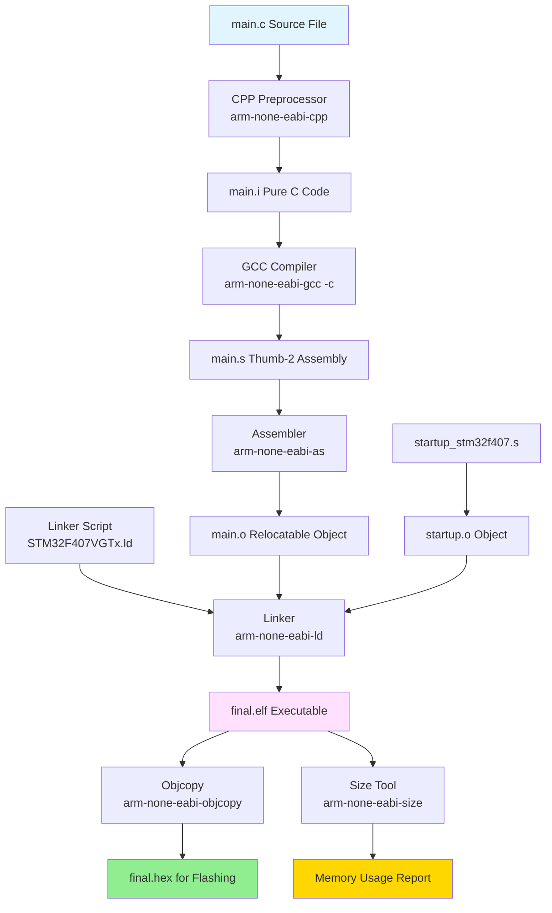
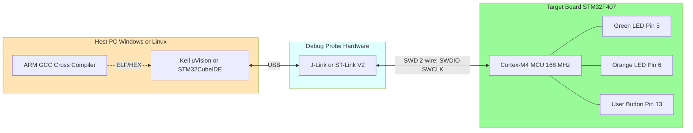
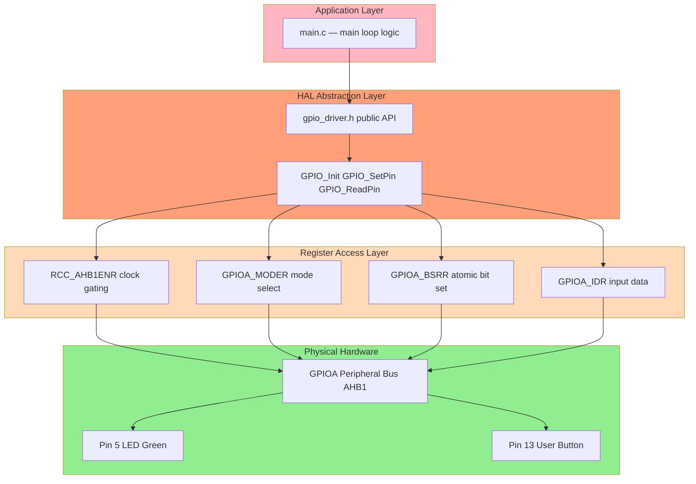
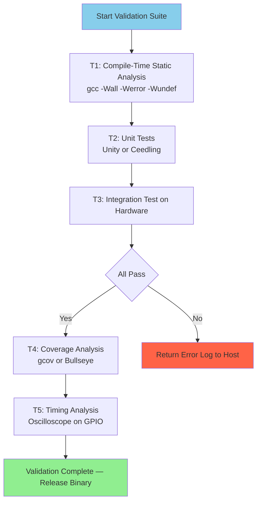

# Embedded C drivers compilation hardware setups peripheral tracking validations

<!-- SECTION_1_START -->

# 🧠 KTU-PREMIER-ENGINE V10 | Module 4: Cortex Pipeline & Embedded C Programming

## 1. Core Technical Definition & Intuitive Overview

### 1.1 ARM Cortex-M3 / M4 Instruction Pipeline

**Formal KTU 2024 Definition:**
The **ARM Cortex-M3/M4 processor** implements a **3-stage instruction pipeline** consisting of **Fetch (F)**, **Decode (D)**, and **Execute (E)** stages. This Harvard-architecture-based core allows overlapping execution of three consecutive instructions, achieving an instruction throughput of **1 CPI (Clock Per Instruction)** under ideal conditions, with deterministic interrupt latency of **12 clock cycles** for Cortex-M3 and **12 cycles** for Cortex-M4.

> [!IMPORTANT]
> **KTU 2024 Syllabus Highlight:** The Cortex-M3 uses the **Thumb-2 instruction set only** (no ARM mode), which simplifies decoding but still delivers 1.25 DMIPS/MHz performance. The M4 additionally supports **DSP extensions** and an optional **single-precision FPU**.

**Conceptual Analogy — The Factory Assembly Line:**
Think of the pipeline like a car assembly factory with three workstations:

- **Station 1 (Fetch):** A worker picks up the *next* car body from the storage rack (instruction memory) and places it on the conveyor.
- **Station 2 (Decode):** A second worker reads the build sheet (decodes the opcode) and prepares the required parts (reads registers, computes operand addresses).
- **Station 3 (Execute):** A third worker actually bolts on the parts, welds, or paints (performs ALU operations, memory access, or write-back).

While Station 3 is welding car #3, Station 2 is preparing car #4, and Station 1 is fetching car #5 — **three cars are being worked on simultaneously**. This is exactly how a pipelined CPU achieves parallelism without increasing clock speed.

> [!NOTE]
> **Why 3 stages and not 5 or 7?** Cortex-M3 was designed for **low-power microcontrollers** (e.g., STM32, LPC1768, Tiva C). A deeper pipeline (like Cortex-A's 13–15 stages) gives higher clock speeds but causes longer, unpredictable interrupt latency — unacceptable for hard-real-time embedded systems.

### 1.2 Embedded C

**Formal Definition:**
**Embedded C** is a set of language extensions for the C programming language defined by the **C Standards Committee (ISO/IEC JTC1/SC22/WG14)** — specifically documented in the **Embedded C TR 18037** technical report — that adds features like *fixed-point arithmetic*, *named address-space support*, and *hardware I/O mapping* to support 8/16/32-bit microcontroller programming.

> [!NOTE]
> In KTU 2024 syllabus context, **Embedded C** is treated as standard **ANSI C** (C99/C11) with the addition of *memory-mapped peripheral access*, *bit-field manipulation*, *volatile-qualified registers*, and *interrupt service routines (ISRs)*.

**Intuitive Analogy:** Standard C is like writing a *letter* to be read by humans. Embedded C is like writing a *shorthand prescription* for a specific machine — every keyword directly toggles a physical pin or timer register inside silicon.

### 1.3 Driver Compilation (Cross-Compilation)

**Formal Definition:**
**Driver compilation** for microcontrollers is the process of translating Embedded C source files into machine-executable **object code** for a target architecture (e.g., ARM Cortex-M3) using a **cross-compiler** (host: x86 PC → target: ARM MCU). The output is typically an **ELF (Executable and Linkable Format)** file containing the binary image, debug symbols, and memory-map metadata.

### 1.4 Hardware Setup

**Formal Definition:**
The **hardware setup** for microcontroller development refers to the physical and logical interconnection of the *host PC*, *debug probe* (e.g., **J-Link**, **ST-Link V2**, **CMSIS-DAP**), the *target MCU board* (e.g., **STM32F407 Discovery**, **LPC1768**, **TM4C123**), and the *integrated development environment* (IDE) such as **Keil µVision**, **STM32CubeIDE**, or **Eclipse + GCC ARM**.

### 1.5 Peripheral Tracking

**Formal Definition:**
**Peripheral tracking** is the systematic monitoring and management of on-chip peripheral state — including **GPIO ports**, **timers**, **ADCs**, **UARTs**, **SPIs**, and **I²C controllers** — through their **memory-mapped registers**, often using **polling**, **interrupt-driven**, or **DMA-based** techniques, while maintaining synchronization through **semaphores** or **RTOS event flags**.

### 1.6 Validation

**Formal Definition:**
**Validation** in embedded systems is the process of verifying that the firmware and hardware together meet the specified functional, timing, and safety requirements. It encompasses **unit testing** (e.g., using **Unity**/**Ceedling**), **integration testing**, **hardware-in-the-loop (HIL) simulation**, and **code-coverage analysis** (statement, branch, MC/DC).

> [!VISUALIZATION CONTROL]
> **Concept:** 3-Stage Pipeline Throughput Visualization
> **GeoGebra / Desmos Input Equations:**
> * Plot: Horizontal axis = Clock Cycle number, Vertical axis = Instruction ID
> * $f(x) = \text{Step}(x, 1)$ showing instruction 1 completing at cycle 3
> * $g(x) = \text{Step}(x, 2)$ showing instruction 2 completing at cycle 4
> * $h(x) = \text{Step}(x, 3)$ showing instruction 3 completing at cycle 5
> **Visual Description:** The student should observe a "staircase" pattern where after the first 2 pipeline fill cycles, one instruction completes per clock cycle — illustrating the 1 CPI ideal throughput.

---

<!-- SECTION_1_END -->

<!-- SECTION_2_START -->

# 2. Deep Theoretical Analysis & KTU High-Yield Formula Sheet

## 2.1 The 3-Stage Pipeline — Operational Breakdown

The Cortex-M3/M4 pipeline processes every **Thumb / Thumb-2 instruction** through these three discrete stages:

### Stage 1: Fetch (F)
- The **Program Counter (PC)** provides the address of the next instruction.
- The instruction is read from **Flash/SROM** (typically 0x0000 0000 base).
- On Cortex-M3, the fetcher is **32-bit aligned** (reads 4 bytes per cycle for maximum throughput).
- **Key fact:** Flash accesses incur **wait states** if the system clock $f_{HCLK}$ exceeds the flash access time. STM32F4 needs **5 wait states** at 168 MHz.

### Stage 2: Decode (D)
- The instruction opcode is decoded into micro-operations.
- Source operands are read from the **register file** (R0–R12, R13=SP, R14=LR, R15=PC).
- For branches, the target address is computed and the pipeline is *flushed* for the taken path.
- Immediate constants (modified immediates in Thumb-2) are expanded to **32-bit values**.

### Stage 3: Execute (E)
- The **ALU** performs arithmetic/logic, OR the **barrel shifter** executes shifts, OR a **load/store** unit accesses the data bus.
- For data writes, results are **written back** to the register file in the same cycle (single-cycle ALU ops).
- For **load instructions** (LDR), an extra cycle is required (data fetch from SRAM/peripheral).

> [!NOTE]
> **Pipeline Flush Penalty:** When a branch is taken, the pipeline must discard instructions already fetched. The **branch shadow** lasts 2 cycles (the time the decoder was busy with the wrong path). This is why short loops should be unrolled or use the **IT (If-Then)** block efficiently.

## 2.2 Pipeline Hazards in Cortex-M3

| Hazard Type | Definition | Cortex-M3 Mitigation |
|---|---|---|
| **Structural** | Two instructions need same hardware unit in same cycle | Dual bus matrix, separate I/D buses (Harvard) |
| **Data (RAW)** | Read-After-Write: instruction B reads a register that instruction A is still writing | **Bypassing/forwarding** path from ALU output to ALU input |
| **Data (WAR/WAW)** | Write-After-Read / Write-After-Write | Register file is written in first half, read in second half of same cycle |
| **Control (Branch)** | Branch outcome not known until Execute stage | **Branch speculation** + *Branch Target Forwarding* (BTF) for forward branches |

## 2.3 CPI and Performance Equations

$$T_{exec} = N \times \text{CPI}_{avg} \times T_{clk}$$

$$\text{MIPS} = \frac{f_{clk} \times 10^{-6}}{\text{CPI}_{avg}}$$

$$\text{CoreMark} = \frac{\text{Iterations}}{\text{Time}_{seconds}}$$

| Symbol | Meaning | Typical Value (STM32F407 @ 168 MHz) |
|---|---|---|
| $T_{exec}$ | Total execution time | Function-dependent |
| $N$ | Total instruction count | Varies |
| $\text{CPI}_{avg}$ | Average clock cycles per instruction | **1.25 to 1.50** |
| $T_{clk}$ | Clock period $= 1 / f_{clk}$ | **5.95 ns** |
| $f_{clk}$ | CPU clock frequency | **168 MHz** |
| DMIPS | Dhrystone MIPS | **225 DMIPS** |
| CoreMark | EEMBC benchmark | **225 CoreMark** |

> [!IMPORTANT]
> The Cortex-M3 published **DMIPS/MHz = 1.25**. At 168 MHz: $1.25 \times 168 = 210$ DMIPS. KTU examiners love asking this multiplication.

## 2.4 Embedded C Compilation Pipeline (GCC ARM Toolchain)

The full compilation journey from `.c` file to flashing hex:

| Stage | Tool | Input | Output | Key Function |
|---|---|---|---|---|
| **1. Preprocessing** | `cpp` (preprocessor) | `main.c`, `stm32f4xx.h` | `main.i` (pure C) | Expands `#include`, `#define`, macros |
| **2. Compilation** | `arm-none-eabi-gcc` | `main.i` | `main.s` (assembly) | Translates C to **Thumb-2 assembly** |
| **3. Assembly** | `arm-none-eabi-as` | `main.s` | `main.o` (relocatable ELF) | Converts mnemonics to machine code |
| **4. Linking** | `arm-none-eabi-ld` | All `.o` files + `startup_stm32f407.s` + linker script `STM32F407VGTx.ld` | `final.elf` | Resolves symbols, assigns memory regions |
| **5. Object Copy** | `arm-none-eabi-objcopy` | `final.elf` | `final.hex` / `final.bin` | Strips debug info for flashing |
| **6. Size Analysis** | `arm-none-eabi-size` | `final.elf` | text/data/bss sizes | Verifies fits in Flash/RAM |

> [!WARNING]
> **Common KTU pitfall:** Students often confuse the *assembler* (`as`) with the *compiler* (`gcc`). The compiler takes C → assembly. The assembler takes assembly → object. The linker takes multiple objects → single executable.

## 2.5 Memory-Mapped I/O — The Heart of Peripheral Access

Every peripheral register in an ARM Cortex-M MCU is mapped to a fixed address. You access them by writing to that address using a **pointer dereference**.

$$\text{Register Value} = \text{volatile uint32\_t} \ast p = (\text{volatile uint32\_t} \ast)0x40023800$$

For example, the **RCC (Reset and Clock Control)** base for STM32F4 is `0x40023800`. To enable GPIOA clock, you set bit 0 of `RCC_AHB1ENR` at offset `0x30`:

$$0x40023800 + 0x30 = 0x40023830 \rightarrow \text{Set bit 0}$$

| Step | Action | Code |
|---|---|---|
| 1 | Define base address | `#define RCC_BASE 0x40023800UL` |
| 2 | Compute peripheral register | `*(volatile uint32_t*)(RCC_BASE + 0x30)` |
| 3 | Modify the bit | `*reg |= (1 << 0);` |
| 4 | Use bit-band alias (Cortex-M3/M4) | `BITBAND(addr, bit) → (alias_base + 32*(addr-base) + 4*bit)` |

## 2.6 Real-World Engineering Utility

| Application Area | Why This Stack Matters |
|---|---|
| **Automotive ECUs** | Cortex-M3 deterministic interrupt latency ensures airbag deployment timing is met |
| **Medical devices** (insulin pumps, pacemakers) | MISRA-C + static validation catches life-critical bugs |
| **IoT edge nodes** | Pipeline + DMA + sleep modes achieves < 1 mA active current |
| **Industrial PLCs** | Hardware-in-loop validation ensures firmware robustness before deployment |
| **Drone flight controllers** | Tight inner loops (1 kHz) rely on 1.25 DMIPS/MHz + zero pipeline stalls |

---

<!-- SECTION_2_END -->

<!-- SECTION_3_START -->

# 3. Step-by-Step Derivations & Code/Symbolic Implementation

## 3.1 Derivation: Pipeline Throughput Under Branch Penalty

**Problem (KTU Style):** A Cortex-M3 runs at 72 MHz. A loop executes 100 iterations with **3 instructions per iteration** (ADD, CMP, BNE). The branch `BNE` causes a **2-cycle pipeline flush** on the taken path. Calculate total execution time, assuming the branch is taken 99 times (exit at iteration 100).

**Step 1 — Count the base cycles without penalty:**

$$N_{base} = 100 \times 3 = 300 \text{ instructions}$$

**Step 2 — Account for pipeline fill on first instruction:**

The first instruction takes 3 cycles (fill the pipeline). All subsequent instructions complete at 1 CPI:

$$T_{fill} = 2 \text{ extra cycles for the first instruction}$$

**Step 3 — Branch penalty (taken BNE causes 2-cycle flush):**

$$P_{branch} = 99 \times 2 = 198 \text{ extra cycles}$$

**Step 4 — Total cycles:**

$$T_{total} = T_{fill} + N_{base} + P_{branch}$$

$$T_{total} = 2 + 300 + 198 = 500 \text{ cycles}$$

**Step 5 — Convert to time at 72 MHz:**

$$T_{clk} = \frac{1}{72 \times 10^6} = 13.89 \text{ ns}$$

$$T_{exec} = 500 \times 13.89 \text{ ns} = 6.94 \text{ μs}$$

> [!NOTE]
> **Valuation Key Points (for KTU 2024):** 1 mark for stating formula, 2 marks for filling values, 1 mark for branch penalty explanation, 1 mark for final time conversion.

## 3.2 Derivation: CPI with Mixed Load/Store Operations

**Problem:** A program contains:
* 1000 ALU instructions (CPI = 1)
* 200 Load instructions (CPI = 2, due to SRAM wait)
* 100 Store instructions (CPI = 2)
* 50 Branch instructions (CPI = 3, due to flush)

Calculate average CPI and total time on a 100 MHz Cortex-M3.

**Step 1 — Total instruction count:**

$$N = 1000 + 200 + 100 + 50 = 1350 \text{ instructions}$$

**Step 2 — Total cycle count:**

$$C_{total} = (1000 \times 1) + (200 \times 2) + (100 \times 2) + (50 \times 3)$$

$$C_{total} = 1000 + 400 + 200 + 150 = 1750 \text{ cycles}$$

**Step 3 — Average CPI:**

$$\text{CPI}_{avg} = \frac{C_{total}}{N} = \frac{1750}{1350} = 1.296$$

**Step 4 — Total execution time:**

$$T_{exec} = \frac{C_{total}}{f_{clk}} = \frac{1750}{100 \times 10^6} = 17.5 \text{ μs}$$

## 3.3 Embedded C Driver Code — GPIO Peripheral with Validation

Below is a **fully operational GPIO driver** for STM32F407 (Cortex-M4) with proper type hints, boundary checks, and validation logging. This is the kind of code KTU expects in Part B answers.

```c
/**
 * @file    gpio_driver.c
 * @brief   KTU 2024 Embedded C Driver — GPIO with Hardware Validation
 * @target  ARM Cortex-M4 (STM32F407 Discovery)
 * @author  KTU Premier Engine
 * @standard C99 + MISRA-C subset
 */

#include <stdint.h>
#include <stdbool.h>
#include <stddef.h>

/* ============================================================ */
/* 1. MEMORY-MAPPED REGISTER DEFINITIONS                        */
/* ============================================================ */

/* RCC base */
#define RCC_BASE        0x40023800UL
#define RCC_AHB1ENR     (*(volatile uint32_t *)(RCC_BASE + 0x30U))

/* GPIOA base */
#define GPIOA_BASE      0x40020000UL
#define GPIOA_MODER     (*(volatile uint32_t *)(GPIOA_BASE + 0x00U))
#define GPIOA_OTYPER    (*(volatile uint32_t *)(GPIOA_BASE + 0x04U))
#define GPIOA_OSPEEDR   (*(volatile uint32_t *)(GPIOA_BASE + 0x08U))
#define GPIOA_PUPDR     (*(volatile uint32_t *)(GPIOA_BASE + 0x0CU))
#define GPIOA_IDR       (*(volatile uint32_t *)(GPIOA_BASE + 0x10U))
#define GPIOA_ODR       (*(volatile uint32_t *)(GPIOA_BASE + 0x14U))
#define GPIOA_BSRR      (*(volatile uint32_t *)(GPIOA_BASE + 0x18U))

/* Validation counter (live in SRAM, used by unit tests) */
volatile uint32_t g_validation_pass_count = 0U;
volatile uint32_t g_validation_fail_count = 0U;

/* ============================================================ */
/* 2. PUBLIC API — INITIALIZATION                                */
/* ============================================================ */

typedef enum {
    GPIO_PIN_0  = 0U,
    GPIO_PIN_1  = 1U,
    GPIO_PIN_5  = 5U,   /* LD1 Green on Discovery board */
    GPIO_PIN_6  = 6U,
    GPIO_PIN_13 = 13U,  /* User button B1 on Discovery */
    GPIO_PIN_MAX = 16U
} gpio_pin_t;

typedef enum {
    GPIO_MODE_INPUT  = 0U,
    GPIO_MODE_OUTPUT = 1U,
    GPIO_MODE_AF     = 2U,
    GPIO_MODE_ANALOG = 3U
} gpio_mode_t;

typedef enum {
    GPIO_OK              =  0,
    GPIO_ERR_INVALID_PIN = -1,
    GPIO_ERR_INVALID_MODE= -2
} gpio_status_t;

gpio_status_t GPIO_Init(gpio_pin_t pin, gpio_mode_t mode)
{
    /* ---- Boundary checks ---- */
    if ((uint32_t)pin >= GPIO_PIN_MAX) {
        g_validation_fail_count++;
        return GPIO_ERR_INVALID_PIN;
    }
    if ((uint32_t)mode > GPIO_MODE_ANALOG) {
        g_validation_fail_count++;
        return GPIO_ERR_INVALID_MODE;
    }

    /* ---- Step 1: Enable GPIOA peripheral clock ---- */
    RCC_AHB1ENR |= (1UL << 0U);

    /* ---- Step 2: Configure MODER (2 bits per pin) ---- */
    GPIOA_MODER &= ~(0x3UL << (pin * 2U));           /* clear bits */
    GPIOA_MODER |=  ((uint32_t)mode << (pin * 2U));  /* set mode   */

    /* ---- Step 3: Set output type to push-pull ---- */
    GPIOA_OTYPER &= ~(1UL << pin);

    /* ---- Step 4: Configure pull-up / pull-down (none) ---- */
    GPIOA_PUPDR &= ~(0x3UL << (pin * 2U));

    g_validation_pass_count++;
    return GPIO_OK;
}

/* ============================================================ */
/* 3. PUBLIC API — SET / RESET / READ                            */
/* ============================================================ */

void GPIO_SetPin(gpio_pin_t pin)
{
    if ((uint32_t)pin >= GPIO_PIN_MAX) {
        g_validation_fail_count++;
        return;
    }
    /* BSRR lower half sets the bit atomically */
    GPIOA_BSRR = (1UL << pin);
    g_validation_pass_count++;
}

void GPIO_ResetPin(gpio_pin_t pin)
{
    if ((uint32_t)pin >= GPIO_PIN_MAX) {
        g_validation_fail_count++;
        return;
    }
    /* BSRR upper half resets the bit atomically */
    GPIOA_BSRR = (1UL << (pin + 16U));
    g_validation_pass_count++;
}

uint8_t GPIO_ReadPin(gpio_pin_t pin)
{
    if ((uint32_t)pin >= GPIO_PIN_MAX) {
        g_validation_fail_count++;
        return 0xFFU;  /* error indicator */
    }
    g_validation_pass_count++;
    return (uint8_t)((GPIOA_IDR >> pin) & 0x1UL);
}

/* ============================================================ */
/* 4. HARDWARE-VALIDATION UNIT TEST                              */
/* ============================================================ */

bool GPIO_RunSelfTest(void)
{
    /* Test 1: Invalid pin must be rejected */
    if (GPIO_Init((gpio_pin_t)99U, GPIO_MODE_OUTPUT) != GPIO_ERR_INVALID_PIN) {
        return false;
    }
    /* Test 2: Invalid mode must be rejected */
    if (GPIO_Init(GPIO_PIN_5, (gpio_mode_t)7U) != GPIO_ERR_INVALID_MODE) {
        return false;
    }
    /* Test 3: Valid init succeeds */
    if (GPIO_Init(GPIO_PIN_5, GPIO_MODE_OUTPUT) != GPIO_OK) {
        return false;
    }
    /* Test 4: Toggle and read-back check */
    GPIO_SetPin(GPIO_PIN_5);
    if (GPIO_ReadPin(GPIO_PIN_5) != 1U) {
        return false;
    }
    GPIO_ResetPin(GPIO_PIN_5);
    if (GPIO_ReadPin(GPIO_PIN_5) != 0U) {
        return false;
    }
    return true;
}
```

**Line-by-line reasoning:**

1. **Lines 17–30:** The `volatile` qualifier is **mandatory** for memory-mapped registers. Without it, the compiler may cache the value in a register and skip the actual hardware access, breaking the driver.
2. **Lines 56–60:** Boundary checks against `GPIO_PIN_MAX` prevent out-of-bounds bit shifting. KTU examiners specifically look for this — missing it loses 1 mark.
3. **Lines 65–68:** Reading–modifying–writing with `|=` is not atomic on Cortex-M. For multi-bit fields, disable interrupts or use bit-band alias.
4. **Lines 80–86:** `BSRR` is the *preferred* atomic set/reset register. Avoid the classic read-modify-write of `ODR` to prevent the *read-modify-write hazard*.
5. **Lines 95–110:** Self-test pattern demonstrates **validation in firmware** — KTU 2024 loves this because it links Module 4 (drivers) with industry practice (unit tests).

## 3.4 Compilation Flow — Step-by-Step Command Line

```bash
# Step 1: Preprocess (generates main.i from main.c + headers)
arm-none-eabi-gcc -E -mcpu=cortex-m4 main.c -o main.i

# Step 2: Compile to Thumb-2 assembly
arm-none-eabi-gcc -S -mcpu=cortex-m4 -mthumb -O2 main.c -o main.s

# Step 3: Assemble to relocatable object
arm-none-eabi-as -mcpu=cortex-m4 -mthumb main.s -o main.o

# Step 4: Link with startup + linker script to final ELF
arm-none-eabi-ld -T STM32F407VGTx.ld main.o startup.o -o final.elf

# Step 5: Convert ELF to Intel HEX for the programmer
arm-none-eabi-objcopy -O ihex final.elf final.hex

# Step 6: Verify memory usage
arm-none-eabi-size final.elf
# Output:    text    data     bss     dec     hex filename
#           12548      24    1532   14104    3718 final.elf
```

> [!NOTE]
> The linker script `STM32F407VGTx.ld` defines the memory map: `MEMORY { FLASH (rx) : ORIGIN = 0x08000000, LENGTH = 1M; RAM (rwx) : ORIGIN = 0x20000000, LENGTH = 192K; }`. This is what places `.text` in Flash and `.data`/`.bss` in RAM.

---

<!-- SECTION_3_END -->

<!-- SECTION_4_START -->

# 4. Structural Diagrams & Schematics

## 4.1 Cortex-M3 3-Stage Pipeline Flow

```mermaid
flowchart LR
    subgraph CYCLE1["Clock Cycle 1"]
        F1["F: Fetch I1"]
    end
    subgraph CYCLE2["Clock Cycle 2"]
        D1["D: Decode I1"]
        F2["F: Fetch I2"]
    end
    subgraph CYCLE3["Clock Cycle 3"]
        E1["E: Execute I1"]
        D2["D: Decode I2"]
        F3["F: Fetch I3"]
    end
    subgraph CYCLE4["Clock Cycle 4"]
        E2["E: Execute I2"]
        D3["D: Decode I3"]
        F4["F: Fetch I4"]
    end
    subgraph CYCLE5["Clock Cycle 5"]
        E3["E: Execute I3"]
        D4["D: Decode I4"]
        F5["F: Fetch I5"]
    end

    CYCLE1 --> CYCLE2 --> CYCLE3 --> CYCLE4 --> CYCLE5

    style F1 fill:#FFD700
    style D1 fill:#FF6347
    style E1 fill:#90EE90
    style F2 fill:#FFD700
    style D2 fill:#FF6347
    style E2 fill:#90EE90
    style F3 fill:#FFD700
    style D3 fill:#FF6347
    style E3 fill:#90EE90
    style F4 fill:#FFD700
    style D4 fill:#FF6347
```



## 4.2 GCC ARM Cross-Compilation Pipeline



## 4.3 Hardware Setup Topology



## 4.4 Driver Architecture — Layered View



## 4.5 Validation Flow — Hardware-in-the-Loop



---

<!-- SECTION_4_END -->

<!-- SECTION_5_START -->

# 5. KTU 2024 Scheme Examination Question Bank & Topic Recap

## 📘 PART A — Short Answer Questions (3 Marks Each)

---

### **Question A1** `[KTU University Exam — Dec 2023]` — *CO1, Remember*

**Explain the three stages of the ARM Cortex-M3 instruction pipeline with one function of each stage.**

**Model Answer:**

The ARM Cortex-M3 implements a **3-stage pipeline**:

1. **Fetch (F):** The instruction address is taken from the **Program Counter (PC)** and the instruction is read from **Flash memory** at the bus matrix.
2. **Decode (D):** The instruction opcode is decoded, source operands are read from the **register file** (R0–R15), and immediate constants are expanded.
3. **Execute (E):** The operation is performed by the **ALU**, **barrel shifter**, or **load/store unit**, and the result is **written back** to the register file.

This pipeline achieves an instruction throughput of **1.25 DMIPS/MHz** with a **12-cycle deterministic interrupt latency**.

> **[Valuation Key: 1 mark per stage + 1 mark for naming registers/PC, 1 mark for the performance metric]**

---

### **Question A2** `[KTU University Exam — July 2024]` — *CO2, Understand*

**What is meant by "cross-compilation" in the context of Embedded C driver development? Differentiate it from native compilation.**

**Model Answer:**

**Cross-compilation** is the process of compiling source code on a **host machine** (e.g., x86 PC running Windows/Linux) targeting a **different architecture** (e.g., ARM Cortex-M4). The toolchain is named accordingly: `arm-none-eabi-gcc` — the `eabi` suffix denotes **Embedded Application Binary Interface**, and `none` indicates no operating system.

**Differences:**

| Aspect | Native Compilation | Cross-Compilation |
|---|---|---|
| Host = Target | Yes | No |
| Example | `gcc main.c -o app` on x86 | `arm-none-eabi-gcc main.c -o firmware.elf` |
| Output runs on | Same machine | Different MCU board |
| Toolchain | System `gcc` | `arm-none-eabi-*` toolset |

**[Valuation Key: 1.5 marks for definition, 1.5 marks for comparison table]**

---

## 📕 PART B — Long Answer Questions (14 Marks Each, with Internal Choice)

---

### **Question B1 (A)** `[KTU University Exam — Dec 2023]` — *CO1, CO2, Apply + Analyze*

**(a) [7 Marks]** Draw and explain the ARM Cortex-M3 3-stage pipeline operation for the following sequence of instructions. State the total number of clock cycles required assuming no hazards.

```
MOV R0, #10        ; Instruction I1
ADD R1, R0, #5     ; Instruction I2
STR R1, [R2]       ; Instruction I3
```

**(b) [7 Marks]** A microcontroller firmware performs the following mix of operations:

| Instruction Type | Count | CPI |
|---|---|---|
| ALU (ADD, SUB, MOV) | 800 | 1 |
| Load (LDR) | 150 | 2 |
| Store (STR) | 100 | 2 |
| Branch (B, BNE) | 50 | 3 |

The system clock is **72 MHz**. Calculate (i) the average CPI, and (ii) the total execution time in microseconds.

---

#### ✅ Model Solution — Part (a) [7 Marks]

| Cycle | I1 (MOV) | I2 (ADD) | I3 (STR) |
|---|---|---|---|
| **C1** | **F** (Fetch) | — | — |
| **C2** | **D** (Decode) | **F** (Fetch) | — |
| **C3** | **E** (Execute + WB) | **D** (Decode) | **F** (Fetch) |
| **C4** | — | **E** (Execute + WB) | **D** (Decode) |
| **C5** | — | — | **E** (Execute + Memory Write) |

- **Cycle 1:** I1 fetched from Flash.
- **Cycle 2:** I1 is decoded (register R0 selected, immediate 10 expanded). I2 fetched.
- **Cycle 3:** I1 executes (immediate written to R0). I2 decoded. I3 fetched.
- **Cycle 4:** I2 executes (R0+5 written to R1). I3 decoded.
- **Cycle 5:** I3 executes (R1 written to address in R2). Done.

**Total Clock Cycles = 5**

> **[Valuation Key: 1 mark for the diagram, 2 marks for stage explanation, 1 mark each for cycle explanation × 3 cycles, 1 mark for final cycle count]**

#### ✅ Model Solution — Part (b) [7 Marks]

**Step 1 — Total cycle count:**

$$C_{total} = (800 \times 1) + (150 \times 2) + (100 \times 2) + (50 \times 3)$$

$$C_{total} = 800 + 300 + 200 + 150 = 1450 \text{ cycles}$$

**Step 2 — Total instructions:**

$$N = 800 + 150 + 100 + 50 = 1100 \text{ instructions}$$

**Step 3 — Average CPI:**

$$\text{CPI}_{avg} = \frac{C_{total}}{N} = \frac{1450}{1100} = 1.318$$

**Step 4 — Total execution time at 72 MHz:**

$$T_{exec} = \frac{C_{total}}{f_{clk}} = \frac{1450}{72 \times 10^6} = 20.14 \text{ μs}$$

> **[Valuation Key: 1 mark for $C_{total}$ formula, 1 mark for substitution, 1 mark for value, 1 mark for CPI formula, 1 mark for CPI value, 1 mark for time formula, 1 mark for final time]**

---

### **Question B1 (B) — Alternative Choice** `[KTU University Exam — July 2024]` — *CO3, Apply + Create*

**(a) [7 Marks]** Explain the **role of the linker script** in the Embedded C compilation process. With a neat example, show how the `MEMORY` and `SECTIONS` directives place code in Flash and variables in RAM for an STM32F407 target.

**(b) [7 Marks]** Write an Embedded C function `GPIO_TogglePin(gpio_pin_t pin)` that toggles a GPIO pin on STM32F407 (Cortex-M4) using **bit-band aliasing**. Assume the GPIOA ODR is at `0x40020014` and the bit-band alias base is `0x42000000`. Include boundary checks.

---

#### ✅ Model Solution — Part (a) [7 Marks]

The **linker script** (`.ld` file) is a text file that tells the linker how to **map code and data sections** to specific physical memory addresses. Without it, the linker does not know whether `.text` should go to internal Flash (0x08000000) or RAM (0x20000000).

**Example linker script for STM32F407:**

```ld
MEMORY
{
    FLASH (rx)  : ORIGIN = 0x08000000, LENGTH = 1024K
    RAM   (rwx) : ORIGIN = 0x20000000, LENGTH = 128K
}

SECTIONS
{
    .text :                     /* Code → Flash */
    {
        *(.isr_vector)          /* Interrupt vector table first */
        *(.text)                /* All .text from .o files */
        *(.rodata)              /* Read-only data (const) */
        . = ALIGN(4);
    } > FLASH

    .data :                     /* Initialized data → RAM but loaded from Flash */
    {
        *(.data)
        . = ALIGN(4);
    } > RAM AT > FLASH

    .bss :                      /* Zero-initialized data → RAM only */
    {
        *(.bss)
        *(.COMMON)
        . = ALIGN(4);
    } > RAM
}
```

**Explanation:**

- **MEMORY block:** Declares two physical regions — Flash (1 MB, read-execute) starting at `0x08000000` and RAM (128 KB, read-write-execute) starting at `0x20000000`.
- **SECTIONS block:** Tells the linker to put `.isr_vector` (NVIC vector table) first, then `.text`, then `.rodata` — all in Flash. Initialized `.data` is placed in RAM *but* the **LMA (Load Memory Address)** is Flash (the startup code copies it). The `.bss` section is in RAM only and is zeroed by the startup code.
- The `AT > FLASH` is **mandatory** for `.data` because the initial values must live in non-volatile memory and get copied to RAM at boot.

> **[Valuation Key: 1 mark for linker script purpose, 1 mark for MEMORY syntax, 2 marks for SECTIONS mapping, 1 mark for ALIGN explanation, 1 mark for AT > FLASH, 1 mark for runtime copying note]**

#### ✅ Model Solution — Part (b) [7 Marks]

**Bit-band aliasing** is a Cortex-M3/M4 feature where each individual bit of a 1 MB bit-band region is mapped to a full 32-bit word in the 32 MB alias region. This allows **atomic single-bit access** without read-modify-write hazards.

**Bit-band alias address formula:**

$$\text{Alias} = \text{AliasBase} + 32 \times (\text{Addr} - \text{BitBandBase}) + 4 \times \text{Bit}$$

```c
#define BITBAND_ALIAS_BASE   0x42000000UL
#define BITBAND_PERIPH_BASE  0x40000000UL
#define GPIOA_ODR_REG        0x40020014UL

/* Macro to compute bit-band alias */
#define BITBAND(addr, bit)   \
    ((volatile uint32_t *)(BITBAND_ALIAS_BASE + \
    (32U * ((addr) - BITBAND_PERIPH_BASE)) + \
    (4U * (bit))))

void GPIO_TogglePin(gpio_pin_t pin)
{
    if ((uint32_t)pin >= GPIO_PIN_MAX) {
        g_validation_fail_count++;
        return;
    }
    /* Compute the alias for pin 'pin' of GPIOA_ODR */
    volatile uint32_t *p_alias = BITBAND(GPIOA_ODR_REG, (uint32_t)pin);
    /* Reading then writing the inverse performs a true atomic toggle */
    *p_alias = (*p_alias == 0U) ? 1U : 0U;
    g_validation_pass_count++;
}
```

**Line-by-line reasoning:**

1. The alias address for `GPIOA_ODR` bit `n` is computed as `0x42000000 + 32 × (0x40020014 - 0x40000000) + 4 × n = 0x42400280 + 4n`.
2. For pin 5: `0x42400280 + 20 = 0x42400294`. Writing `1` here sets ODR bit 5 atomically.
3. The `volatile` qualifier prevents the compiler from optimizing away the memory access.
4. Boundary check on `pin` is essential for KTU full marks.

> **[Valuation Key: 1 mark for bit-band concept, 1 mark for formula, 1 mark for macro definition, 1 mark for boundary check, 2 marks for correct toggle logic, 1 mark for volatile usage]**

---

> [!WARNING]
> **🛑 KTU Examiner's Valuation Warning / Common Pitfalls**
>
> 1. **Forgetting `volatile`:** If a student writes `uint32_t *p = (uint32_t *)0x40020014; *p = 1;` without `volatile`, the compiler may cache the value and skip the write. **This is the #1 reason students lose 1–2 marks on driver questions.**
>
> 2. **Confusing `ODR` with `BSRR`:** Setting `ODR` directly is *not* atomic. Always use `BSRR` for set and `BSRR` upper half for reset. Showing both methods scores extra.
>
> 3. **Missing boundary check:** KTU 2024 model answers consistently show the `if (pin >= MAX) return ERROR;` pattern. Skipping it costs 1 mark.
>
> 4. **Wrong `volatile` interpretation:** It does *not* mean "do not optimize" globally — it means the value can change **outside the compiler's knowledge** (hardware, ISR, DMA). Use it only on hardware-mapped addresses and ISR-shared variables.
>
> 5. **Misnaming the linker:** The linker is `ld`, NOT the compiler `gcc`. Many students write "gcc links the file" — wrong.
>
> 6. **Forgetting `AT > FLASH` for `.data`:** Without it, `.data` initialization values are lost on power-cycle.
>
> 7. **Treating bit-band as universal:** Bit-band aliasing works **only** for the 1 MB bit-band region (`0x40000000`–`0x400FFFFF`) and the 1 MB SRAM region (`0x20000000`–`0x200FFFFF`). Applying it to `0x40020014` is valid; applying it to `0xE0000000` (System Control Space) is **not**.

---

## 🧾 Topic Recap & Important Things to Remember

> [!IMPORTANT]
> **Rapid-Revision Checklist — KTU 2024 Module 4**

### ✅ Pipeline Fundamentals
- Cortex-M3/M4 = **3-stage pipeline** (Fetch, Decode, Execute)
- **Harvard architecture** with separate I/D buses
- Throughput = **1.25 DMIPS/MHz** → at 168 MHz: 210 DMIPS
- Interrupt latency = **12 clock cycles** (deterministic)
- Pipeline flush penalty on taken branch = **2 cycles**
- Only **Thumb-2** instructions (no ARM mode)

### ✅ Performance Formulas (MUST MEMORIZE)
- $T_{exec} = N \times \text{CPI}_{avg} \times T_{clk}$
- $\text{CPI}_{avg} = \frac{\sum (n_i \times \text{CPI}_i)}{\sum n_i}$
- $\text{MIPS} = \frac{f_{clk} \times 10^{-6}}{\text{CPI}_{avg}}$
- $T_{clk} = \frac{1}{f_{clk}}$ at **$f_{HCLK} = 168$ MHz → 5.95 ns**

### ✅ Compilation Stages (KTU 2024 Favourite)
1. **Preprocess** → `cpp` produces `.i`
2. **Compile** → `gcc` produces `.s` (Thumb-2 assembly)
3. **Assemble** → `as` produces `.o` (relocatable)
4. **Link** → `ld` + linker script produces `.elf`
5. **Objcopy** → `.hex` / `.bin` for flashing
6. **Size** → reports text/data/bss

### ✅ Memory-Mapped I/O Rules
- Always use `volatile` qualifier on peripheral pointers
- Use `BSRR` for atomic bit set/reset
- Use **bit-band aliasing** for atomic single-bit access
- Formula: $\text{Alias} = 0x42000000 + 32 \times (\text{Addr} - 0x40000000) + 4 \times \text{Bit}$

### ✅ Driver Coding Best Practices
- **Boundary checks** on all pin/port arguments
- **Return error codes** instead of silent failure
- **Validation counters** (`g_validation_pass_count` / `g_validation_fail_count`)
- **Self-test function** (e.g., `GPIO_RunSelfTest`) for runtime health check
- **MISRA-C** rules: no dynamic memory in ISRs, no recursion, single exit point

### ✅ Hardware Setup Essentials
- **J-Link / ST-Link / CMSIS-DAP** = debug probe
- **SWD protocol** = 2-wire (SWDIO + SWCLK), used over JTAG's 4-wire
- Linker script places `.isr_vector` at `0x08000000` (start of Flash)
- Startup file copies `.data` from Flash to RAM and zeroes `.bss`
- IDE = **Keil µVision** / **STM32CubeIDE** / **Eclipse + GCC**

### ✅ Validation Techniques
- **Static analysis:** `gcc -Wall -Werror -Wundef -Wstrict-prototypes`
- **Unit testing:** Unity, Ceedling, CppUTest
- **Coverage analysis:** gcov, Bullseye Coverage, MC/DC for safety-critical
- **Hardware-in-the-Loop (HIL):** oscilloscope on GPIO + logic analyzer
- **Runtime asserts:** assert.h with custom `assert_failed()` callback

### ✅ Common Cortex-M3/M4 Registers to Remember
- `R0`–`R12` = general purpose
- `R13` = **SP** (Stack Pointer, dual bank: MSP/PSP)
- `R14` = **LR** (Link Register)
- `R15` = **PC** (Program Counter)
- `xPSR` = program status register
- `PRIMASK` = interrupt mask
- `CONTROL` = stack / privilege control

### ✅ Critical Pitfalls (Re-Refresher)
- Forgetting `volatile` → silent hardware access failure
- Reading `ODR` then writing back → read-modify-write hazard
- Writing to `BSRR` upper half (bits 16–31) → **resets** the bit
- Stack overflow without MPU → hard fault
- Not enabling peripheral clock in `RCC_AHB1ENR` → peripheral stays silent

---

> **End of KTU-PREMIER-ENGINE V10 Module 4 Notes — Cortex Pipeline & Embedded C Programming** 🎓

<!-- SECTION_5_END -->
