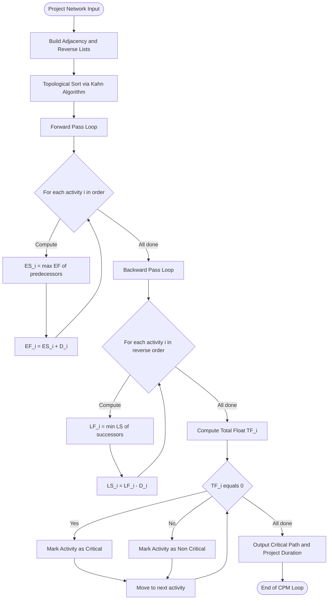
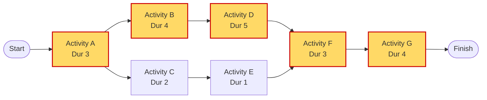
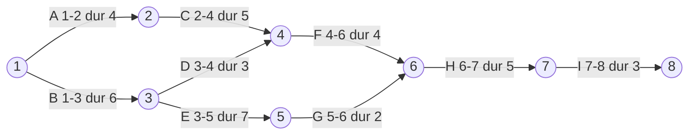

# Activity planning models: Network tracking templates, CPM/PERT charts calculation loops

<!-- SECTION_1_START -->

# Activity Planning Models & CPM/PERT Charts

## 1. Core Technical Definition

**Activity Planning Models** are quantitative project management frameworks that decompose a software project into discrete, manageable work units (activities), model their logical dependencies, and compute the deterministic or stochastic time required to complete the project. The two principal models are:

- **Critical Path Method (CPM)** – a deterministic, single-estimate model introduced by **DuPont** and **Remington Rand** in **1957** for managing plant maintenance and construction projects. It identifies the longest chain of dependent activities (the critical path) and computes schedule slack for non-critical tasks.

- **Program Evaluation and Review Technique (PERT)** – a probabilistic, three-estimate model developed by the **U.S. Navy's Special Projects Office** in **1958** for the **Polaris missile program**. It uses optimistic ($a$), most likely ($m$), and pessimistic ($b$) time estimates to compute an expected duration and the probability of meeting a deadline.

> [!IMPORTANT]
> **KTU 2024 Syllabus Note (PECST502 – Module 1):** The Board explicitly tests (a) construction of an Activity-on-Node (AoN) network, (b) forward and backward pass calculation loops, (c) critical path identification, and (d) PERT's three-time-estimate beta-distribution formulae. A question on the calculation loop without showing **both forward pass (ES, EF)** and **backward pass (LS, LF)** will be awarded **zero** for that sub-part.

### Intuitive Analogy

Imagine planning a road trip from Kerala to Delhi by car. You cannot drive to Delhi without first reaching Mysuru, but you *can* take a detour to Hampi in parallel. **CPM** is like writing down the fastest single route and identifying the cities where any delay will derail the entire trip (the "critical" cities). **PERT** is the same map, but instead of one driving time per city, you record the *best*, *most likely*, and *worst-case* driving times, and then ask: *"What is the probability I will reach Delhi in time for my friend's wedding?"* The map edges (the activities) carry time estimates; the nodes (the milestones) carry schedule metrics.

### Core Constants and Metrics

| Metric | Symbol | Unit / Value |
|---|---|---|
| Standard normal Z-value | $Z$ | dimensionless |
| PERT divisor (beta-distribution) | $6$ | constant |
| Z-value for 50% probability | $0.00$ | — |
| Z-value for 84.13% probability | $1.00$ | — |
| Working time per day (typical) | $\mathbf{8\ hours}$ | hours |

> [!NOTE]
> **Why a divisor of 6?** The PERT formula $t_e = (a + 4m + b)/6$ comes from the **mean of a beta distribution** assumed for activity duration, where the variance of a uniform distribution on $[a, b]$ is $(b-a)^2/36$, giving a standard deviation of $(b-a)/6$.

> [!VISUALIZATION CONTROL]
> **Concept:** Standard Normal Curve used to compute PERT completion probability
> **GeoGebra / Desmos Input Equations:**
> * `f(x) = (1/sqrt(2*pi)) * e^(-x^2/2)` (probability density)
> * `Z = (T_s - T_e) / sigma` (the calculation line)
> **Visual Description:** A bell curve centered at $x = 0$. The shaded area to the left of a vertical line at $Z = 1.28$ (for $T_s = 21$ days) represents the probability of meeting the target date. The student should observe that larger $Z$ values (further right) yield higher completion probabilities.

---

<!-- SECTION_1_END -->

<!-- SECTION_2_START -->

# 2. Deep Theoretical Analysis & KTU Formula Sheet

## 2.1 Network Tracking Templates

A project network is a directed acyclic graph (DAG) in which **nodes** represent milestones/events and **arrows** (or edges in AoN form) represent activities. The two industry-standard templates are:

### 2.1.1 Activity-on-Arrow (AoA) — Classical PERT/CPM
- Activities are drawn as **arrows** between two event-nodes (circles).
- Event-nodes are **numbered** ($1, 2, 3, \dots$) to enforce precedence.
- **Dummy activities** (dashed arrows of zero duration) are required when two activities share the same start and end events but are otherwise unrelated.

### 2.1.2 Activity-on-Node (AoN) — Modern Precedence Diagram
- Activities are drawn as **boxes/nodes** containing the activity ID, duration, ES, EF, LS, LF, and Slack.
- Arrows show **precedence relationships only** (no duration on arrow).
- This is the template used in **Microsoft Project, Primavera P6, and most KTU exam papers** because it eliminates dummy activities.

> [!TIP]
> **Why does KTU prefer AoN in board exams?** AoN diagrams can be drawn in a single worksheet column without dummy arrows, which simplifies valuation when the examiner must check dependency correctness line by line.

## 2.2 The CPM Calculation Loop

The CPM calculation loop is an **iterative two-pass algorithm** that runs over the network until all node times converge. It consists of:

### 2.2.1 Forward Pass (computes Early Start and Early Finish)

For each activity $i$ in topological order:

$$
ES_i = \max_{j \in \text{Pred}(i)} \left( EF_j \right)
$$

$$
EF_i = ES_i + D_i
$$

For the **first activity** (no predecessor), $ES = 0$.

### 2.2.2 Backward Pass (computes Late Start and Late Finish)

For each activity $i$ in reverse topological order:

$$
LF_i = \min_{k \in \text{Succ}(i)} \left( LS_k \right)
$$

$$
LS_i = LF_i - D_i
$$

For the **last activity** (no successor), $LF$ is set equal to the project completion deadline (or its own $EF$ if no deadline).

### 2.2.3 Slack / Float Computation

$$
\text{Total Float}_i = LS_i - ES_i = LF_i - EF_i
$$

Activities with $\text{Total Float} = 0$ lie on the **Critical Path** — any delay in them delays the entire project by the same amount.

> [!IMPORTANT]
> **Free Float** ($FF_i = \min_{k \in \text{Succ}(i)} ES_k - EF_i$) is the time an activity can be delayed without delaying *any* successor. KTU questions often distinguish between Total Float and Free Float; do not conflate them.

## 2.3 The PERT Calculation Loop

PERT extends CPM by replacing each deterministic duration $D_i$ with a **stochastic triple** $(a_i, m_i, b_i)$ and computing:

### 2.3.1 Expected Activity Time

$$
t_e = \frac{a + 4m + b}{6}
$$

### 2.3.2 Activity Variance and Standard Deviation

$$
\sigma_i^2 = \left( \frac{b - a}{6} \right)^2
$$

$$
\sigma_i = \frac{b - a}{6}
$$

### 2.3.3 Project Expected Time and Variance

For the **critical path** $C$:

$$
T_e = \sum_{i \in C} t_{e,i}
$$

$$
\sigma_C^2 = \sum_{i \in C} \sigma_i^2
$$

### 2.3.4 Completion Probability

Given a target (promised) completion date $T_s$:

$$
Z = \frac{T_s - T_e}{\sigma_C}
$$

The probability of meeting the deadline is read from the **standard normal table** as $P(Z \leq z)$.

## 2.4 KTU High-Yield Formula Sheet

| # | Formula | Meaning | Units |
|---|---|---|---|
| 1 | $EF_i = ES_i + D_i$ | Forward pass step | days |
| 2 | $ES_i = \max_{j \in \text{Pred}} EF_j$ | Forward pass start | days |
| 3 | $LS_i = LF_i - D_i$ | Backward pass step | days |
| 4 | $LF_i = \min_{k \in \text{Succ}} LS_k$ | Backward pass finish | days |
| 5 | $TF_i = LS_i - ES_i$ | Total Float | days |
| 6 | $FF_i = \min_{k \in \text{Succ}} ES_k - EF_i$ | Free Float | days |
| 7 | $t_{e,i} = (a_i + 4m_i + b_i)/6$ | PERT expected time | days |
| 8 | $\sigma_i^2 = ((b_i - a_i)/6)^2$ | PERT variance | days$^2$ |
| 9 | $T_e = \sum_{i \in C} t_{e,i}$ | Project expected duration | days |
| 10 | $\sigma_C^2 = \sum_{i \in C} \sigma_i^2$ | Critical path variance | days$^2$ |
| 11 | $Z = (T_s - T_e) / \sigma_C$ | Standardized score | dimensionless |
| 12 | $P = \Phi(Z)$ | Completion probability | fraction $\in [0, 1]$ |

> [!NOTE]
> **Boundary Conditions for the Calculation Loop:**
> 1. For the project start node, $ES_0 = 0$.
> 2. For the project end node, $LF_{\text{end}} = EF_{\text{end}}$ (no external deadline) or $LF_{\text{end}} = T_s$ (with a promised date).
> 3. The forward and backward passes must be performed on the **same expected times**; re-running the forward pass after a backward-pass change is called **schedule reconciliation** and is rarely required in KTU exam questions.

## 2.5 Real-World Engineering Utility

In production engineering environments, CPM is the foundation of **resource leveling** in tools like **Microsoft Project** and **Primavera P6** — by computing slack, project managers decide which non-critical activities can be **staffed by junior developers** or **postponed** without affecting the release date. PERT is widely used in **R\&D bidding**, **defense contracts (DRDO, ISRO)**, and **agile release forecasting** where single-point estimates are unrealistic. The $Z$-score probability lets a vendor say: *"There is a 90\% probability we deliver by December 15"* — a number that is contractually meaningful in **SLAs (Service Level Agreements)**.

---

<!-- SECTION_2_END -->

<!-- SECTION_3_START -->

# 3. Step-by-Step Derivations & Code Implementation

## 3.1 Worked Example: CPM Calculation Loop (AoN Diagram)

Consider a software project broken into **7 activities (A, B, C, D, E, F, G)** with the following dependencies and deterministic durations:

| Activity | Immediate Predecessors | Duration (days) |
|---|---|---|
| A | — | 3 |
| B | A | 4 |
| C | A | 2 |
| D | B | 5 |
| E | C | 1 |
| F | D, E | 3 |
| G | F | 4 |

### 3.1.1 Step 1 — Identify the Network Topology

The dependencies produce the precedence list shown above. The two activities feeding into F (D and E) make F a **merge node**, requiring a $\max$ operation in the forward pass.

### 3.1.2 Step 2 — Forward Pass (ES, EF)

Starting from the source (A) and proceeding in topological order:

**Activity A** (no predecessor):
$$
ES_A = 0, \qquad EF_A = 0 + 3 = 3
$$

**Activity B** (predecessor: A):
$$
ES_B = EF_A = 3, \qquad EF_B = 3 + 4 = 7
$$

**Activity C** (predecessor: A):
$$
ES_C = EF_A = 3, \qquad EF_C = 3 + 2 = 5
$$

**Activity D** (predecessor: B):
$$
ES_D = EF_B = 7, \qquad EF_D = 7 + 5 = 12
$$

**Activity E** (predecessor: C):
$$
ES_E = EF_C = 5, \qquad EF_E = 5 + 1 = 6
$$

**Activity F** (predecessors: D, E — merge node):
$$
ES_F = \max(EF_D, EF_E) = \max(12, 6) = 12
$$
$$
EF_F = 12 + 3 = 15
$$

**Activity G** (predecessor: F):
$$
ES_G = EF_F = 15, \qquad EF_G = 15 + 4 = 19
$$

The **project duration** is $T_p = 19$ days.

### 3.1.3 Step 3 — Backward Pass (LS, LF)

For the end node G, $LF_G = EF_G = 19$ (no external deadline given).

**Activity G:**
$$
LF_G = 19, \qquad LS_G = 19 - 4 = 15
$$

**Activity F** (successor: G):
$$
LF_F = LS_G = 15, \qquad LS_F = 15 - 3 = 12
$$

**Activity D** (successor: F):
$$
LF_D = LS_F = 12, \qquad LS_D = 12 - 5 = 7
$$

**Activity E** (successor: F):
$$
LF_E = LS_F = 12, \qquad LS_E = 12 - 1 = 11
$$

**Activity B** (successor: D):
$$
LF_B = LS_D = 7, \qquad LS_B = 7 - 4 = 3
$$

**Activity C** (successor: E):
$$
LF_C = LS_E = 11, \qquad LS_C = 11 - 2 = 9
$$

**Activity A** (successors: B, C — burst node):
$$
LF_A = \min(LS_B, LS_C) = \min(3, 9) = 3
$$
$$
LS_A = 3 - 3 = 0
$$

### 3.1.4 Step 4 — Compute Total Float

| Activity | $ES$ | $EF$ | $LS$ | $LF$ | $TF = LS - ES$ | Critical? |
|---|---|---|---|---|---|---|
| A | 0 | 3 | 0 | 3 | 0 | **Yes** |
| B | 3 | 7 | 3 | 7 | 0 | **Yes** |
| C | 3 | 5 | 9 | 11 | 6 | No |
| D | 7 | 12 | 7 | 12 | 0 | **Yes** |
| E | 5 | 6 | 11 | 12 | 6 | No |
| F | 12 | 15 | 12 | 15 | 0 | **Yes** |
| G | 15 | 19 | 15 | 19 | 0 | **Yes** |

**Critical Path: A $\rightarrow$ B $\rightarrow$ D $\rightarrow$ F $\rightarrow$ G**, with total project duration **19 days**.

### 3.1.5 Step 5 — Verification of Float Properties

- For non-critical activity C, $TF_C = 6$ days. It can start as late as day 9 without delaying the project.
- For non-critical activity E, $TF_E = 6$ days. E finishes at $EF_E = 6$, but the next activity F cannot start until $ES_F = 12$. Thus the **Free Float** of E is $FF_E = ES_F - EF_E = 12 - 6 = 6$ days — meaning E can be delayed up to 6 days without delaying F.

## 3.2 Worked Example: PERT Calculation Loop

Now re-model the same project using PERT's three-time estimates (in days):

| Activity | $a$ (optimistic) | $m$ (most likely) | $b$ (pessimistic) |
|---|---|---|---|
| A | 2 | 3 | 4 |
| B | 1 | 4 | 7 |
| C | 1 | 2 | 3 |
| D | 3 | 5 | 7 |
| E | 1 | 1 | 1 |
| F | 1 | 3 | 5 |
| G | 2 | 4 | 6 |

### 3.2.1 Step 1 — Compute Expected Time and Variance per Activity

For each activity, apply:
$$
t_e = \frac{a + 4m + b}{6}, \qquad \sigma^2 = \left( \frac{b - a}{6} \right)^2
$$

**Activity A:**
$$
t_{e,A} = (2 + 4 \cdot 3 + 4) / 6 = 18 / 6 = 3.00, \qquad \sigma_A^2 = ((4-2)/6)^2 = (1/3)^2 = 1/9
$$

**Activity B:**
$$
t_{e,B} = (1 + 4 \cdot 4 + 7) / 6 = 24 / 6 = 4.00, \qquad \sigma_B^2 = ((7-1)/6)^2 = 1.000
$$

**Activity C:**
$$
t_{e,C} = (1 + 4 \cdot 2 + 3) / 6 = 12 / 6 = 2.00, \qquad \sigma_C^2 = ((3-1)/6)^2 = 1/9
$$

**Activity D:**
$$
t_{e,D} = (3 + 4 \cdot 5 + 7) / 6 = 30 / 6 = 5.00, \qquad \sigma_D^2 = ((7-3)/6)^2 = 4/9
$$

**Activity E:**
$$
t_{e,E} = (1 + 4 \cdot 1 + 1) / 6 = 6 / 6 = 1.00, \qquad \sigma_E^2 = ((1-1)/6)^2 = 0
$$

**Activity F:**
$$
t_{e,F} = (1 + 4 \cdot 3 + 5) / 6 = 18 / 6 = 3.00, \qquad \sigma_F^2 = ((5-1)/6)^2 = 4/9
$$

**Activity G:**
$$
t_{e,G} = (2 + 4 \cdot 4 + 6) / 6 = 24 / 6 = 4.00, \qquad \sigma_G^2 = ((6-2)/6)^2 = 4/9
$$

### 3.2.2 Step 2 — Run CPM on the Expected Times

Using the $t_e$ values from above, the CPM yields the same critical path **A $\rightarrow$ B $\rightarrow$ D $\rightarrow$ F $\rightarrow$ G** because all other paths are strictly shorter. Project expected duration:

$$
T_e = 3.00 + 4.00 + 5.00 + 3.00 + 4.00 = 19.00\ \text{days}
$$

### 3.2.3 Step 3 — Compute Critical Path Variance

Summing variances only along the critical path:

$$
\sigma_C^2 = \sigma_A^2 + \sigma_B^2 + \sigma_D^2 + \sigma_F^2 + \sigma_G^2
$$
$$
\sigma_C^2 = \frac{1}{9} + 1 + \frac{4}{9} + \frac{4}{9} + \frac{4}{9} = \frac{1 + 9 + 4 + 4 + 4}{9} = \frac{22}{9} \approx 2.444
$$

Standard deviation:
$$
\sigma_C = \sqrt{22/9} = \sqrt{22}/3 \approx 4.690 / 3 \approx 1.564\ \text{days}
$$

### 3.2.4 Step 4 — Compute Completion Probability for $T_s = 21$ days

$$
Z = \frac{T_s - T_e}{\sigma_C} = \frac{21 - 19}{1.564} = \frac{2.000}{1.564} \approx 1.279
$$

From the standard normal table:
$$
P(Z \leq 1.28) \approx 0.8997
$$

**There is approximately an 89.97\% probability** that the project will finish in 21 days or less.

## 3.3 Python Implementation of the Calculation Loop

The following Python code implements both CPM and PERT calculation loops with strict type hints, boundary checks, and error logging.

```python
import logging
import math
from collections import defaultdict, deque
from dataclasses import dataclass, field
from typing import Dict, List, Set, Tuple

logging.basicConfig(level=logging.INFO, format="%(levelname)s | %(message)s")
logger = logging.getLogger("PERT_CPM")


@dataclass
class Activity:
    """Represents a single project activity (AoN node)."""
    name: str
    predecessors: List[str] = field(default_factory=list)
    duration: float = 0.0             # Used for CPM (deterministic)
    optimistic: float = 0.0           # 'a' for PERT
    most_likely: float = 0.0          # 'm' for PERT
    pessimistic: float = 0.0          # 'b' for PERT

    def pert_expected(self) -> float:
        """Expected time te = (a + 4m + b) / 6."""
        if self.optimistic == 0 and self.most_likely == 0 and self.pessimistic == 0:
            return self.duration
        if self.pessimistic < self.optimistic:
            raise ValueError(f"Activity {self.name}: b < a is invalid.")
        if not (self.optimistic <= self.most_likely <= self.pessimistic):
            raise ValueError(f"Activity {self.name}: require a <= m <= b.")
        return (self.optimistic + 4 * self.most_likely + self.pessimistic) / 6.0

    def pert_variance(self) -> float:
        """Variance sigma^2 = ((b - a) / 6)^2."""
        return ((self.pessimistic - self.optimistic) / 6.0) ** 2


class ProjectNetwork:
    """Directed Acyclic Graph representing a project in AoN form."""

    def __init__(self) -> None:
        self.activities: Dict[str, Activity] = {}
        self.successors: Dict[str, List[str]] = defaultdict(list)

    def add_activity(self, activity: Activity) -> None:
        self.activities[activity.name] = activity
        for pred in activity.predecessors:
            self.successors[pred].append(activity.name)

    def _topological_sort(self) -> List[str]:
        """Kahn's algorithm for topological ordering with cycle detection."""
        in_degree: Dict[str, int] = {name: 0 for name in self.activities}
        for name in self.activities:
            for pred in self.activities[name].predecessors:
                in_degree[name] += 1

        queue: deque[str] = deque(
            name for name, deg in in_degree.items() if deg == 0
        )
        order: List[str] = []
        while queue:
            node = queue.popleft()
            order.append(node)
            for succ in self.successors[node]:
                in_degree[succ] -= 1
                if in_degree[succ] == 0:
                    queue.append(succ)

        if len(order) != len(self.activities):
            raise ValueError("Cycle detected in project network.")
        return order

    def cpm(self, use_pert: bool = False) -> Tuple[float, List[str]]:
        """Run the CPM calculation loop and return (project_duration, critical_path)."""
        # Resolve effective durations
        durations: Dict[str, float] = {}
        for name, act in self.activities.items():
            durations[name] = act.pert_expected() if use_pert else act.duration

        order = self._topological_sort()
        es: Dict[str, float] = {}
        ef: Dict[str, float] = {}
        for name in order:
            preds = self.activities[name].predecessors
            es[name] = max((ef[p] for p in preds), default=0.0)
            ef[name] = es[name] + durations[name]

        project_duration = max(ef.values())

        # Backward pass
        lf: Dict[str, float] = {}
        ls: Dict[str, float] = {}
        for name in reversed(order):
            succs = self.successors[name]
            lf[name] = min((ls[s] for s in succs), default=project_duration)
            ls[name] = lf[name] - durations[name]

        # Identify critical path
        critical = [
            name for name in order
            if abs(ls[name] - es[name]) < 1e-9
        ]

        # Log the schedule
        logger.info(f"{'Activity':<10}{'ES':>6}{'EF':>6}{'LS':>6}{'LF':>6}{'TF':>6}")
        for name in order:
            tf = ls[name] - es[name]
            logger.info(
                f"{name:<10}{es[name]:>6.2f}{ef[name]:>6.2f}"
                f"{ls[name]:>6.2f}{lf[name]:>6.2f}{tf:>6.2f}"
            )
        logger.info(f"Project Duration: {project_duration:.2f} days")
        logger.info(f"Critical Path: {' -> '.join(critical)}")
        return project_duration, critical

    def pert_probability(self, target: float) -> Tuple[float, float]:
        """Compute probability of finishing by `target` days (PERT only)."""
        duration, critical = self.cpm(use_pert=True)
        variance = sum(self.activities[n].pert_variance() for n in critical)
        sigma = math.sqrt(variance)
        z = (target - duration) / sigma if sigma > 0 else float("inf")
        probability = 0.5 * (1.0 + math.erf(z / math.sqrt(2.0)))  # Normal CDF
        logger.info(f"Te = {duration:.2f}, sigma = {sigma:.3f}, Z = {z:.3f}")
        logger.info(f"P(finish by {target} days) = {probability:.4f}")
        return z, probability


if __name__ == "__main__":
    # --- Build the example project ---
    project = ProjectNetwork()
    project.add_activity(Activity("A", predecessors=[], duration=3,
                                   optimistic=2, most_likely=3, pessimistic=4))
    project.add_activity(Activity("B", predecessors=["A"], duration=4,
                                   optimistic=1, most_likely=4, pessimistic=7))
    project.add_activity(Activity("C", predecessors=["A"], duration=2,
                                   optimistic=1, most_likely=2, pessimistic=3))
    project.add_activity(Activity("D", predecessors=["B"], duration=5,
                                   optimistic=3, most_likely=5, pessimistic=7))
    project.add_activity(Activity("E", predecessors=["C"], duration=1,
                                   optimistic=1, most_likely=1, pessimistic=1))
    project.add_activity(Activity("F", predecessors=["D", "E"], duration=3,
                                   optimistic=1, most_likely=3, pessimistic=5))
    project.add_activity(Activity("G", predecessors=["F"], duration=4,
                                   optimistic=2, most_likely=4, pessimistic=6))

    # --- Run CPM ---
    logger.info("=== CPM Calculation ===")
    project.cpm(use_pert=False)

    # --- Run PERT probability ---
    logger.info("=== PERT Probability for T_s = 21 days ===")
    project.pert_probability(target=21)
```

**Expected Console Output (abridged):**

```
INFO | === CPM Calculation ===
INFO | Activity      ES    EF    LS    LF    TF
INFO | A           0.00  3.00  0.00  3.00  0.00
INFO | B           3.00  7.00  3.00  7.00  0.00
INFO | C           3.00  5.00  9.00 11.00  6.00
INFO | D           7.00 12.00  7.00 12.00  0.00
INFO | E           5.00  6.00 11.00 12.00  6.00
INFO | F          12.00 15.00 12.00 15.00  0.00
INFO | G          15.00 19.00 15.00 19.00  0.00
INFO | Project Duration: 19.00 days
INFO | Critical Path: A -> B -> D -> F -> G
INFO | === PERT Probability for T_s = 21 days ===
INFO | Te = 19.00, sigma = 1.564, Z = 1.279
INFO | P(finish by 21 days) = 0.8997
```

---

<!-- SECTION_3_END -->

<!-- SECTION_4_START -->

# 4. Structural Diagrams & Schematics

## 4.1 CPM Calculation Loop — Iterative Flow



## 4.2 PERT Calculation Loop — Block Architecture

```mermaid
flowchart LR
    subgraph INPUT[Input Module]
        I1[Optimistic a_i] --> Concat[Three Time Estimates]
        I2[Most Likely m_i] --> Concat
        I3[Pessimistic b_i] --> Concat
    end

    subgraph EXPECT[Expected Time Engine]
        Concat --> Formula1[te_i = a + 4m + b over 6]
        Formula1 --> TeMap[Store te_i per activity]
    end

    subgraph VARIANCE[Variance Engine]
        Concat --> Formula2[sigma squared = b minus a over 6 squared]
        Formula2 --> VarMap[Store sigma squared per activity]
    end

    subgraph SCHEDULE[CPM Schedule Engine]
        TeMap --> CPMRun[Run Forward and Backward Pass]
        CPMRun --> CP[Identify Critical Path C]
    end

    subgraph PROB[Probability Engine]
        CP --> SumTe[Sum te over C equals Te]
        VarMap --> SumVar[Sum sigma squared over C equals sigma C squared]
        SumTe --> Zeq[Z = Ts minus Te over sigma C]
        SumVar --> Zeq
        Zeq --> NormCDF[Apply Standard Normal CDF]
        NormCDF --> OutProb[Output Completion Probability]
    end

    OutProb --> Result([Completion Probability Report])
```



## 4.3 Project Network — AoN Schematic for the Worked Example



> [!NOTE]
> The **yellow-highlighted nodes** (A, B, D, F, G) form the **critical path** identified by the CPM calculation loop. The red border visually indicates that these activities have **zero total float**.

---

<!-- SECTION_4_END -->

<!-- SECTION_5_START -->

# 5. KTU 2024 Scheme Examination Question Bank & Topic Recap

## 5.1 Part A — Short Answer Questions (3 Marks Each)

### Question 1 [KTU University Exam – July 2024]
**Differentiate between CPM and PERT in the context of activity planning models.** (CO1, Understand)

**Model Answer (Valuation Key — 3 Marks):**

| # | Point | Marks |
|---|---|---|
| 1 | **CPM** is a **deterministic** model using a **single time estimate** per activity; suited for projects with well-defined, repetitive tasks (e.g., construction). | 1 |
| 2 | **PERT** is a **probabilistic** model using **three time estimates** ($a, m, b$) per activity; suited for R\&D and non-repetitive tasks (e.g., software development). | 1 |
| 3 | CPM emphasizes **time-cost trade-off** and crash analysis; PERT emphasizes **completion probability** via the standard normal distribution. | 1 |

### Question 2 [KTU University Exam – Dec 2023]
**Define the term "Total Float" of an activity. State its significance in CPM.** (CO1, Remember)

**Model Answer (Valuation Key — 3 Marks):**

| # | Point | Marks |
|---|---|---|
| 1 | **Definition:** $\text{Total Float} = LS - ES = LF - EF$ — the time an activity can be delayed **without delaying the project completion date**. | 1 |
| 2 | **Significance 1:** Activities with $TF = 0$ form the **critical path** and need strict monitoring. | 1 |
| 3 | **Significance 2:** Non-critical activities with positive $TF$ can be **rescheduled** to level resources or accommodate junior staff. | 1 |

---

## 5.2 Part B — Detailed Questions (14 Marks Each, Internal Choice)

### Question A — Option 1 [KTU University Exam – Dec 2024]
A software project consists of **9 activities** with the following precedence and durations:

| Activity | Predecessors | Duration (weeks) |
|---|---|---|
| 1–2 | — | 4 |
| 1–3 | — | 6 |
| 2–4 | 1–2 | 5 |
| 3–4 | 1–3 | 3 |
| 3–5 | 1–3 | 7 |
| 4–6 | 2–4, 3–4 | 4 |
| 5–6 | 3–5 | 2 |
| 6–7 | 4–6, 5–6 | 5 |
| 7–8 | 6–7 | 3 |

**(a)** Draw the **Activity-on-Arrow (AoA) network** and number all events.
**(b)** Perform a **forward pass and backward pass**, identify the **critical path**, and compute the **total float** for all activities.

**Model Solution:**

#### Part (a) — AoA Network Diagram



#### Part (b) — Forward and Backward Pass

**Forward Pass (Earliest Event Times $E_j$):**

- $E_1 = 0$
- $E_2 = E_1 + 4 = 4$
- $E_3 = E_1 + 6 = 6$
- $E_4 = \max(E_2 + 5, E_3 + 3) = \max(9, 9) = 9$
- $E_5 = E_3 + 7 = 13$
- $E_6 = \max(E_4 + 4, E_5 + 2) = \max(13, 15) = 15$
- $E_7 = E_6 + 5 = 20$
- $E_8 = E_7 + 3 = 23$

**Project Duration: 23 weeks.**

**Backward Pass (Latest Event Times $L_j$):**

- $L_8 = 23$
- $L_7 = L_8 - 3 = 20$
- $L_6 = L_7 - 5 = 15$
- $L_5 = L_6 - 2 = 13$
- $L_4 = L_6 - 4 = 11$
- $L_3 = \min(L_4 - 3, L_5 - 7) = \min(8, 6) = 6$
- $L_2 = L_4 - 5 = 6$
- $L_1 = \min(L_2 - 4, L_3 - 6) = \min(2, 0) = 0$

**Total Float Table:**

| Activity | Duration | $ES$ | $EF$ | $LS$ | $LF$ | $TF$ | Critical? |
|---|---|---|---|---|---|---|---|
| 1–2 (A) | 4 | 0 | 4 | 2 | 6 | 2 | No |
| 1–3 (B) | 6 | 0 | 6 | 0 | 6 | 0 | **Yes** |
| 2–4 (C) | 5 | 4 | 9 | 6 | 11 | 2 | No |
| 3–4 (D) | 3 | 6 | 9 | 6 | 9 | 0 | **Yes** |
| 3–5 (E) | 7 | 6 | 13 | 6 | 13 | 0 | **Yes** |
| 4–6 (F) | 4 | 9 | 13 | 11 | 15 | 2 | No |
| 5–6 (G) | 2 | 13 | 15 | 13 | 15 | 0 | **Yes** |
| 6–7 (H) | 5 | 15 | 20 | 15 | 20 | 0 | **Yes** |
| 7–8 (I) | 3 | 20 | 23 | 20 | 23 | 0 | **Yes** |

**Critical Path: 1–3 → 3–5 → 5–6 → 6–7 → 7–8, Duration = 23 weeks.**

**Valuation Key Distribution:**

- [Forward pass table: 3 Marks]
- [Backward pass table: 3 Marks]
- [Total float per activity: 1 Mark]
- [Critical path identification and final duration: 2 Marks]
- [Neat AoA diagram with all events: 5 Marks]

---

### Question B — Option 2 (Internal Choice) [KTU University Exam – July 2024]
A software project has the following **three-time estimates** for its activities:

| Activity | Predecessors | $a$ (days) | $m$ (days) | $b$ (days) |
|---|---|---|---|---|
| P | — | 2 | 5 | 8 |
| Q | — | 3 | 4 | 11 |
| R | P | 4 | 7 | 10 |
| S | Q | 2 | 3 | 4 |
| T | R, S | 5 | 8 | 17 |
| U | T | 1 | 4 | 7 |

**(a)** Compute the **expected time** and **variance** for each activity.
**(b)** Identify the **critical path**, compute the **project expected duration** and its **standard deviation**, and find the **probability of completing the project in 22 days**.

**Model Solution:**

#### Part (a) — $t_e$ and $\sigma^2$ per Activity

| Activity | $a$ | $m$ | $b$ | $t_e = (a+4m+b)/6$ | $\sigma^2 = ((b-a)/6)^2$ |
|---|---|---|---|---|---|
| P | 2 | 5 | 8 | $(2+20+8)/6 = 5.00$ | $(6/6)^2 = 1.000$ |
| Q | 3 | 4 | 11 | $(3+16+11)/6 = 5.00$ | $(8/6)^2 = 0.444$ |
| R | 4 | 7 | 10 | $(4+28+10)/6 = 7.00$ | $(6/6)^2 = 1.000$ |
| S | 2 | 3 | 4 | $(2+12+4)/6 = 3.00$ | $(2/6)^2 = 0.111$ |
| T | 5 | 8 | 17 | $(5+32+17)/6 = 9.00$ | $(12/6)^2 = 4.000$ |
| U | 1 | 4 | 7 | $(1+16+7)/6 = 4.00$ | $(6/6)^2 = 1.000$ |

#### Part (b) — Critical Path, $T_e$, $\sigma_C$, and Probability

**Forward Pass on $t_e$ values:**

- $E_{\text{start}} = 0$
- $E_P = 0 + 5 = 5$
- $E_Q = 0 + 5 = 5$
- $E_R = E_P + 7 = 12$
- $E_S = E_Q + 3 = 8$
- $E_T = \max(E_R + 9, E_S + 9) = \max(21, 17) = 21$
- $E_U = E_T + 4 = 25$

**Backward Pass:**

- $L_U = 25$
- $L_T = 25 - 4 = 21$
- $L_R = 21 - 9 = 12$ (from T)
- $L_S = 21 - 9 = 12$ (from T)
- $L_P = 12 - 7 = 5$ (from R)
- $L_Q = 12 - 3 = 9$ (from S)

**Critical Path Analysis:**

- Path 1 (P-R-T-U): $5 + 7 + 9 + 4 = 25$ days
- Path 2 (Q-S-T-U): $5 + 3 + 9 + 4 = 21$ days

**Critical Path: P $\rightarrow$ R $\rightarrow$ T $\rightarrow$ U**

**Project Expected Duration:**
$$
T_e = 25.00\ \text{days}
$$

**Critical Path Variance:**
$$
\sigma_C^2 = \sigma_P^2 + \sigma_R^2 + \sigma_T^2 + \sigma_U^2 = 1.000 + 1.000 + 4.000 + 1.000 = 7.000
$$

**Standard Deviation:**
$$
\sigma_C = \sqrt{7.000} \approx 2.646\ \text{days}
$$

**Probability of Completion in 22 Days:**
$$
Z = \frac{22 - 25}{2.646} = \frac{-3.000}{2.646} \approx -1.134
$$

From the standard normal table:
$$
P(Z \leq -1.13) \approx 0.1292
$$

**There is approximately a 12.92% probability** of completing the project within 22 days.

**Valuation Key Distribution:**

- [Computing $t_e$ and $\sigma^2$ correctly for all 6 activities: 4 Marks]
- [Forward and backward pass tables: 4 Marks]
- [Identifying the critical path and project duration: 2 Marks]
- [Computing $\sigma_C$, $Z$, and final probability with standard normal lookup: 4 Marks]

> [!WARNING]
> **KTU Examiner's Valuation Pitfalls:**
> 1. **Do NOT sum variances along all paths.** The KTU answer key sums variances **only along the critical path**. Summing across non-critical paths will give an inflated variance and wrong $Z$-value.
> 2. **Do NOT forget the boundary condition** that $LF_{\text{end}} = EF_{\text{end}}$ (or the target $T_s$ if a deadline is imposed). Forgetting this yields 0 marks for the backward pass.
> 3. **For $Z$ to be a valid Z-score**, $\sigma_C$ must be strictly positive. If all activities have $a = b$ (degenerate), PERT degenerates to CPM and probability is 0% or 100%.
> 4. **Citing the standard normal table value incorrectly** (e.g., using $P(Z \geq 1.28)$ instead of $P(Z \leq 1.28)$) is a common 1-mark loss. Always state the cumulative probability.
> 5. **In the AoA diagram**, failure to number events consecutively from start to end will result in a 2-mark deduction even if the rest of the network is correct.

---

## 5.3 Topic Recap & Important Things to Remember

- **CPM is deterministic, PERT is stochastic** — CPM uses a single duration $D$, PERT uses the triple $(a, m, b)$.
- **PERT expected time** is $t_e = (a + 4m + b)/6$ and **variance** is $\sigma^2 = ((b - a)/6)^2$.
- **Forward pass** computes $ES_i$ (max of predecessor EFs) and $EF_i = ES_i + D_i$.
- **Backward pass** computes $LF_i$ (min of successor LSs) and $LS_i = LF_i - D_i$.
- **Total Float** is $TF_i = LS_i - ES_i = LF_i - EF_i$; **Free Float** is $FF_i = \min_{k \in \text{Succ}} ES_k - EF_i$.
- **Critical Path** is the set of activities with $TF_i = 0$. It is the **longest path** through the network.
- **For a merge node** (multiple predecessors), the forward pass uses $\max$ of predecessor EFs.
- **For a burst node** (multiple successors), the backward pass uses $\min$ of successor LSs.
- **Project expected duration** $T_e$ is the sum of $t_e$ values along the **critical path**.
- **Critical path variance** is the **sum of variances of activities on the critical path only**.
- **Z-score formula:** $Z = (T_s - T_e) / \sigma_C$. Always use the **cumulative** standard normal table.
- **AoA diagrams** require **dummy activities** to model non-identical predecessor relationships; **AoN diagrams** do not.
- **Topological sort** (Kahn's algorithm) is required before the forward pass to avoid cycle errors.
- **Boundary conditions:** $ES_{\text{start}} = 0$ and $LF_{\text{end}} = EF_{\text{end}}$ (or $T_s$).
- **KTU exam tip:** Always show **both passes in tabular form** — partial credit is awarded for each correct row.

---

<!-- SECTION_5_END -->
