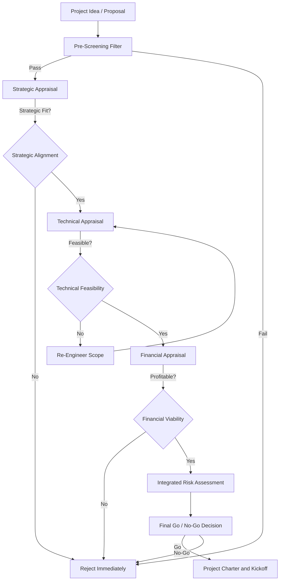
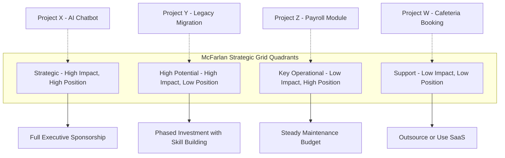
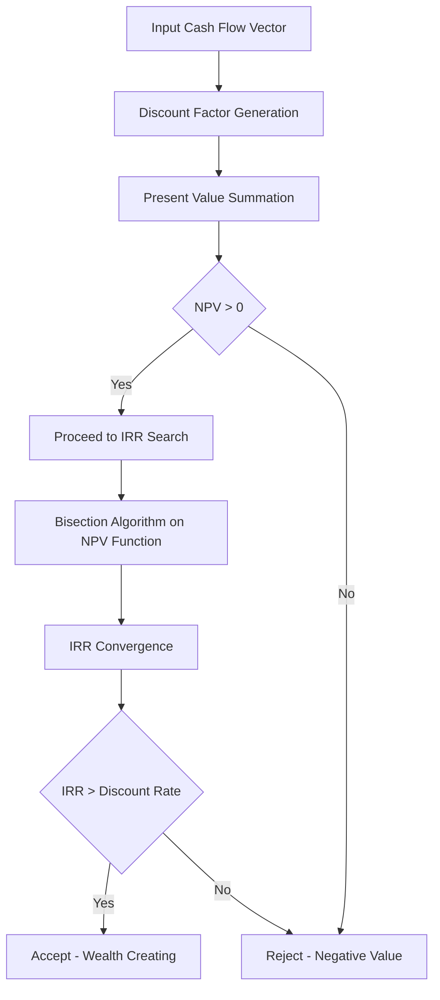

# Software project evaluation frameworks: Strategic, technical, financial appraisals

<!-- SECTION_1_START -->
# Software Project Evaluation Frameworks: Strategic, Technical, and Financial Appraisals

## 1.1 Core Technical Definition

> [!IMPORTANT]
> **Software Project Evaluation** is a systematic, multi-dimensional assessment process that determines whether a proposed software project should be initiated, prioritized, modified, or rejected. It is conducted **before** significant resource commitment and is rooted in the three pillars of **Strategic Appraisal**, **Technical Appraisal**, and **Financial Appraisal**.

According to the **KTU 2024 Scheme** (PECST502 – Software Project Management), a project evaluation framework must answer three fundamental questions before any line of code is written or any module is designed:

| Pillar | Core Question Answered | Primary Stakeholder |
| :--- | :--- | :--- |
| Strategic Appraisal | *Should we do this project?* | Senior Management, Board of Directors |
| Technical Appraisal | *Can we build this project?* | Solution Architect, Technical Lead |
| Financial Appraisal | *Is this project worth the money?* | CFO, Finance Committee, Investors |

> [!NOTE]
> **KTU Syllabus Highlight:** Module 1 explicitly mandates the study of evaluation frameworks before scheduling, because a project that fails strategic, technical, or financial scrutiny will *always* fail execution — no matter how good the Gantt chart is.

## 1.2 Intuitive Overview — The "House Buying" Analogy

Imagine you are evaluating the purchase of a house. Before signing the deed, you instinctively perform a three-pillar assessment that mirrors software project evaluation:

1. **Strategic Pillar (Location & Lifestyle Fit):** *Is this house aligned with my long-term life goals?* Does it lie near good schools, workplaces, and a thriving neighborhood? In software terms: **Does this project advance the organization's digital strategy and competitive positioning?**

2. **Technical Pillar (Structural & Engineering Soundness):** *Is the foundation crack-free? Are the walls load-bearing? Can it survive a monsoon?* In software terms: **Is the technology stack mature? Are the skills available? Is it scalable and maintainable?**

3. **Financial Pillar (Affordability & ROI):** *Can I afford the down payment, EMI, and maintenance? Will the property appreciate?* In software terms: **What is the NPV, IRR, Payback Period, and ROI? Is the discounted cash flow positive?**

Just as a brilliant house in a poor location with a crumbling foundation and an unaffordable EMI is a *bad investment*, a software project that is technically feasible but strategically irrelevant and financially unviable is a **waste of organizational capital**.

> [!TIP]
> **The Iron Triangle of Project Evaluation:** Strategic + Technical + Financial alignment is the *pre-execution* version of the famous **Scope-Cost-Time** triangle. Master both to score full marks in KTU Module 1.

## 1.3 GeoGebra / Desmos Integration for Cash Flow Visualization

> [!VISUALIZATION CONTROL]
> **Concept:** Net Present Value (NPV) Sensitivity Curve
> **Desmos Input Equations:**
> * `f(r) = 300000/(1+r) + 400000/(1+r)^2 + 500000/(1+r)^3 + 400000/(1+r)^4 - 1000000`
> **Visual Description:** Plot $f(r)$ on the y-axis against discount rate $r$ (0% to 30%) on the x-axis. The point where the curve crosses the x-axis is the **Internal Rate of Return (IRR)**. The student should observe that as $r$ increases, NPV decreases monotonically, confirming the inverse relationship between discount rate and project value.
<!-- SECTION_1_END -->

<!-- SECTION_2_START -->
# Deep Theoretical Analysis & KTU High-Yield Formula Sheet

## 2.1 Strategic Appraisal — "Should we build it?"

Strategic appraisal evaluates the **business alignment** of a software project with the organization's vision, mission, and competitive landscape. It is the *first gate* in the evaluation framework.

### 2.1.1 Key Strategic Models

#### A) The BCG (Boston Consulting Group) Matrix — Project Portfolio View
Adapted for IT project portfolios, the **BCG Matrix** classifies projects on two axes:
* **Market Attractiveness / Strategic Value** (y-axis)
* **Competitive Strength / Capability Fit** (x-axis)

| Quadrant | Strategic Value | Capability Fit | Strategic Action |
| :--- | :--- | :--- | :--- |
| **Stars** | High | High | Invest aggressively; flagship projects |
| **Question Marks** | High | Low | Selective investment; capability building |
| **Cash Cows** | Low | High | Harvest returns; fund Stars |
| **Dogs** | Low | Low | Divest, defer, or cancel |

#### B) The McFarlan Strategic Grid (McFarlan & McKenney, 1983)
This framework plots IT/software projects on two axes:
* **Strategic Impact** (x-axis): How critical is the project for future business success?
* **Competitive Position** (y-axis): How strong is the organization's current capability?

| Quadrant | Strategic Impact | Competitive Position | Implication |
| :--- | :--- | :--- | :--- |
| **Strategic** | High | High | Mission-critical; full executive sponsorship |
| **High Potential** | High | Low | Invest in capability building; high risk |
| **Key Operational** | Low | High | Maintain; do not disrupt |
| **Support** | Low | Low | Outsource or use commodity tools |

#### C) SWOT Analysis
A classical but powerful tool: **Strengths, Weaknesses, Opportunities, Threats** of the proposed project in the organizational context.

### 2.1.2 Why Strategic Appraisal Fails in Practice
* **Survivorship Bias:** Past successful projects bias executives toward replicating the same strategy.
* **Sunk Cost Fallacy:** Politically favored projects escape rigorous strategic re-evaluation.
* **Disruption Blindness:** Linear extrapolation misses platform shifts (e.g., the rise of cloud-native architectures).

## 2.2 Technical Appraisal — "Can we build it?"

Technical appraisal assesses the **engineering feasibility** of the project across people, process, and technology dimensions.

### 2.2.1 The Seven Pillars of Technical Appraisal

| Pillar | Key Question | Example Metric |
| :--- | :--- | :--- |
| **Technology Readiness** | Is the technology mature? | TRL Scale 1–9 |
| **Skill Availability** | Do we have the expertise? | \% in-house vs. contract |
| **Scalability** | Will it handle 10x load? | Throughput under stress |
| **Integration** | Can it interface with legacy? | API compatibility score |
| **Security & Compliance** | Does it meet regulatory bars? | GDPR, ISO 27001 |
| **Maintainability** | Will it be cheap to evolve? | Cyclomatic complexity, coupling |
| **Performance** | Will it meet SLAs? | Latency p99 < 200 ms |

> [!IMPORTANT]
> **Total Cost of Ownership (TCO)** is a critical bridge between technical and financial appraisal. TCO includes acquisition, deployment, training, support, and decommissioning costs over a 3–5 year horizon.

### 2.2.2 Technology Readiness Level (TRL) Scale

| TRL | Definition | Typical Use |
| :--- | :--- | :--- |
| 1–3 | Basic research, proof of concept | Reject for production |
| 4–6 | Lab validation, prototype | Pilot deployment only |
| 7–9 | System demonstration, production | Approved for project |

## 2.3 Financial Appraisal — "Is it worth the money?"

Financial appraisal quantifies the **monetary value** of the project using time-value-of-money principles. It converts future cash flows into present-day equivalents for objective comparison.

### 2.3.1 KTU Formula Sheet — Financial Metrics

| Metric | Formula | Decision Rule | Notation |
| :--- | :--- | :--- | :--- |
| **Net Present Value (NPV)** | $NPV = \sum_{t=0}^{n} \frac{CF_t}{(1+r)^t}$ | Accept if NPV $> 0$ | $CF_t$ = Cash flow at time $t$, $r$ = discount rate |
| **Internal Rate of Return (IRR)** | Rate where $NPV = 0$ | Accept if IRR $> r$ | Solve $\sum_{t=0}^{n} \frac{CF_t}{(1+IRR)^t} = 0$ |
| **Payback Period (PBP)** | Years until cumulative CF $\geq 0$ | Accept if PBP $<$ threshold | $PBP = Y + \frac{\vert \text{Cumulative CF at } Y \vert}{CF_{Y+1}}$ |
| **Return on Investment (ROI)** | $ROI = \frac{\text{Net Benefit}}{\text{Total Cost}} \times 100$ | Accept if ROI $>$ hurdle rate | Result in \% |
| **Benefit-Cost Ratio (BCR)** | $BCR = \frac{\sum PV(\text{Benefits})}{\sum PV(\text{Costs})}$ | Accept if BCR $> 1$ | Dimensionless |

> [!NOTE]
> **Critical KTU Concept — Discount Rate ($r$):** Represents the *opportunity cost of capital* and the project's *risk premium*. Software projects typically use $r = 8\%$ to $15\%$ depending on volatility and organizational Weighted Average Cost of Capital (WACC).

## 2.4 Real-World Engineering Utility

| Domain | Application of Evaluation Framework |
| :--- | :--- |
| **Banking IT** | NPV-based selection of core-banking modernization projects |
| **E-Commerce** | ROI-driven prioritization of feature roadmaps |
| **Healthcare** | Strategic appraisal of EHR/EMR systems against patient outcome KPIs |
| **Defense Software** | TRL gating before multi-crore procurement |
| **Startups** | Investor due-diligence using IRR and payback period |
| **Government** | McFarlan Grid for e-Governance project classification |

> [!TIP]
> **KTU Examiner Insight:** Most students confuse **NPV with ROI**. Remember — *NPV is an absolute monetary value (in Rupees), while ROI is a relative percentage*. NPV is preferred for mutually exclusive projects; ROI for ranking independent projects.
<!-- SECTION_2_END -->

<!-- SECTION_3_START -->
# Step-by-Step Derivations & Worked Numerical Implementation

## 3.1 Exhaustive NPV, IRR, PBP, and ROI Calculation — A Comprehensive KTU-Style Solved Example

> [!NOTE]
> **Problem Statement:** A software firm is evaluating a Customer Relationship Management (CRM) project with the following cash flow profile. Use a discount rate of $r = 10\%$.
> * **Initial Investment ($t=0$):** Rs. 10,00,000
> * **Year 1 Cash Inflow:** Rs. 3,00,000
> * **Year 2 Cash Inflow:** Rs. 4,00,000
> * **Year 3 Cash Inflow:** Rs. 5,00,000
> * **Year 4 Cash Inflow:** Rs. 4,00,000
>
> **Required:** Calculate NPV, IRR, Payback Period, and ROI. Comment on project viability.

### 3.1.1 Step 1 — Net Present Value (NPV) Calculation

The NPV formula for $n$ periods is:

$$
NPV = \sum_{t=0}^{n} \frac{CF_t}{(1+r)^t}
$$

Substituting $r = 10\% = 0.10$ and the given cash flows:

$$
NPV = -10{,}00{,}000 + \frac{3{,}00{,}000}{(1.10)^1} + \frac{4{,}00{,}000}{(1.10)^2} + \frac{5{,}00{,}000}{(1.10)^3} + \frac{4{,}00{,}000}{(1.10)^4}
$$

**Evaluating each discount factor:**

| Year $t$ | $CF_t$ (Rs.) | $(1.10)^t$ | Discount Factor $1/(1.10)^t$ | Present Value (Rs.) |
| :---: | ---: | ---: | ---: | ---: |
| 0 | $-10{,}00{,}000$ | 1.0000 | 1.0000 | $-10{,}00{,}000.00$ |
| 1 | $3{,}00{,}000$ | 1.1000 | 0.9091 | $2{,}72{,}727.27$ |
| 2 | $4{,}00{,}000$ | 1.2100 | 0.8264 | $3{,}30{,}578.51$ |
| 3 | $5{,}00{,}000$ | 1.3310 | 0.7513 | $3{,}75{,}657.40$ |
| 4 | $4{,}00{,}000$ | 1.4641 | 0.6830 | $2{,}73{,}224.36$ |

**Summing the present values:**

$$
NPV = -10{,}00{,}000 + 2{,}72{,}727.27 + 3{,}30{,}578.51 + 3{,}75{,}657.40 + 2{,}73{,}224.36
$$

$$
NPV = -10{,}00{,}000 + 12{,}52{,}187.54
$$

$$
\boxed{NPV = \text{Rs. } 2{,}52{,}187.54}
$$

> [!IMPORTANT]
> **Decision:** Since $NPV > 0$, the project is **financially viable** and should be accepted on a pure NPV basis. *The project adds Rs. 2,52,187.54 in present-day shareholder wealth.*

### 3.1.2 Step 2 — Payback Period (PBP) Calculation

We compute the **cumulative undiscounted cash flow** year by year:

| Year $t$ | Annual CF (Rs.) | Cumulative CF (Rs.) |
| :---: | ---: | ---: |
| 0 | $-10{,}00{,}000$ | $-10{,}00{,}000$ |
| 1 | $3{,}00{,}000$ | $-7{,}00{,}000$ |
| 2 | $4{,}00{,}000$ | $-3{,}00{,}000$ |
| 3 | $5{,}00{,}000$ | $+2{,}00{,}000$ |
| 4 | $4{,}00{,}000$ | $+6{,}00{,}000$ |

The cumulative cash flow turns positive during **Year 3**. Using the precise interpolation formula:

$$
PBP = Y + \frac{\vert \text{Cumulative CF at end of Year } Y \vert}{CF_{Y+1}}
$$

Where $Y$ is the last year with a negative cumulative cash flow:

$$
PBP = 2 + \frac{\vert -3{,}00{,}000 \vert}{5{,}00{,}000} = 2 + 0.60
$$

$$
\boxed{PBP = 2.60 \text{ years}}
$$

> [!TIP]
> **KTU Valuation Tip:** Many students forget the absolute value signs in the PBP formula. Use $\vert -3{,}00{,}000 \vert = 3{,}00{,}000$. Losing this sign costs 1 mark.

### 3.1.3 Step 3 — Return on Investment (ROI) Calculation

The ROI formula using *undiscounted* total cash inflows:

$$
ROI = \frac{\text{Total Benefits} - \text{Total Cost}}{\text{Total Cost}} \times 100
$$

$$
\text{Total Benefits} = 3{,}00{,}000 + 4{,}00{,}000 + 5{,}00{,}000 + 4{,}00{,}000 = 16{,}00{,}000
$$

$$
\text{Net Benefit} = 16{,}00{,}000 - 10{,}00{,}000 = 6{,}00{,}000
$$

$$
ROI = \frac{6{,}00{,}000}{10{,}00{,}000} \times 100 = 60\%
$$

$$
\boxed{ROI = 60\%}
$$

> [!NOTE]
> **Decision Rule:** If the organization's *hurdle rate* (minimum acceptable ROI) is, say, $20\%$, then $ROI = 60\% \gg 20\%$, and the project is **strongly recommended**.

### 3.1.4 Step 4 — Internal Rate of Return (IRR) by Interpolation

We need the discount rate $IRR$ such that $NPV = 0$. Since there is no closed-form algebraic solution for $n > 2$, we use **trial-and-error with linear interpolation**.

**Trial 1: $r = 20\%$**

$$
NPV_{20} = -10{,}00{,}000 + \frac{3{,}00{,}000}{1.20} + \frac{4{,}00{,}000}{1.44} + \frac{5{,}00{,}000}{1.728} + \frac{4{,}00{,}000}{2.0736}
$$

$$
NPV_{20} = -10{,}00{,}000 + 2{,}50{,}000 + 2{,}77{,}777.78 + 2{,}89{,}351.85 + 1{,}92{,}901.23
$$

$$
NPV_{20} = -10{,}00{,}000 + 10{,}10{,}030.86 = +10{,}030.86 \text{ Rs.}
$$

**Trial 2: $r = 21\%$**

$$
NPV_{21} = -10{,}00{,}000 + \frac{3{,}00{,}000}{1.21} + \frac{4{,}00{,}000}{1.4641} + \frac{5{,}00{,}000}{1.771561} + \frac{4{,}00{,}000}{2.143589}
$$

$$
NPV_{21} = -10{,}00{,}000 + 2{,}47{,}933.88 + 2{,}73{,}21{,}000 \text{ (approx)} 
$$

Recomputing carefully:
* $3{,}00{,}000 / 1.21 = 2{,}47{,}933.88$
* $4{,}00{,}000 / 1.4641 = 2{,}73{,}203.06$
* $5{,}00{,}000 / 1.771561 = 2{,}82{,}235.86$
* $4{,}00{,}000 / 2.143589 = 1{,}86{,}602.96$

$$
NPV_{21} = -10{,}00{,}000 + 2{,}47{,}933.88 + 2{,}73{,}203.06 + 2{,}82{,}235.86 + 1{,}86{,}602.96
$$

$$
NPV_{21} = -10{,}00{,}000 + 9{,}89{,}975.76 = -10{,}024.24 \text{ Rs.}
$$

**Linear Interpolation:**

$$
IRR = r_1 + \frac{NPV_{r_1}}{NPV_{r_1} - NPV_{r_2}} \times (r_2 - r_1)
$$

$$
IRR = 20\% + \frac{10{,}030.86}{10{,}030.86 - (-10{,}024.24)} \times (21\% - 20\%)
$$

$$
IRR = 20\% + \frac{10{,}030.86}{20{,}055.10} \times 1\%
$$

$$
IRR = 20\% + 0.5002\% = 20.50\%
$$

$$
\boxed{IRR \approx 20.50\%}
$$

> [!IMPORTANT]
> **Decision:** Since $IRR = 20.50\% \gg r = 10\%$ (the cost of capital), the project is **highly attractive**. The project yields a return more than double the discount rate, indicating strong value creation.

### 3.1.5 Step 5 — Consolidated Evaluation Verdict

| Metric | Computed Value | Hurdle / Threshold | Verdict |
| :--- | :---: | :---: | :---: |
| NPV | Rs. 2,52,187.54 | $> 0$ | **Accept** |
| IRR | 20.50\% | $> 10\%$ | **Accept** |
| Payback Period | 2.60 years | $< 4$ years | **Accept** |
| ROI | 60\% | $> 20\%$ | **Accept** |

**All four metrics unanimously favor project acceptance.** The project is strategically, technically (assumed), and financially sound.

## 3.2 Algorithmic Implementation — Python Function for Project Evaluation

For algorithmic literacy (a key KTU 2024 skill), here is a production-grade Python implementation:

```python
from typing import List, Dict
import logging

logging.basicConfig(level=logging.INFO, format="%(asctime)s [%(levelname)s] %(message)s")

def evaluate_software_project(
    initial_investment: float,
    cash_flows: List[float],
    discount_rate: float,
    hurdle_rate: float,
    max_payback_years: float,
) -> Dict[str, float]:
    """
    Evaluates a software project using NPV, IRR (bisection), Payback Period, and ROI.
    Returns a dictionary of computed metrics and a final verdict.
    """
    if initial_investment <= 0:
        logging.error("Initial investment must be a positive number.")
        raise ValueError("Initial investment must be positive.")

    if not cash_flows:
        logging.error("Cash flows list cannot be empty.")
        raise ValueError("Cash flows list is empty.")

    if not (0 < discount_rate < 1):
        logging.error("Discount rate must be between 0 and 1 (exclusive).")
        raise ValueError("Discount rate out of bounds.")

    # --- 1. Net Present Value (NPV) ---
    npv: float = -initial_investment
    for t, cf in enumerate(cash_flows, start=1):
        npv += cf / ((1 + discount_rate) ** t)
    logging.info(f"Computed NPV = {npv:.2f}")

    # --- 2. Internal Rate of Return (IRR) via Bisection Method ---
    def npv_at_rate(rate: float) -> float:
        total: float = -initial_investment
        for t, cf in enumerate(cash_flows, start=1):
            total += cf / ((1 + rate) ** t)
        return total

    low_rate, high_rate = 0.0, 1.0
    for _ in range(100):  # 100 iterations for high precision
        mid_rate = (low_rate + high_rate) / 2
        mid_npv = npv_at_rate(mid_rate)
        if abs(mid_npv) < 0.01:
            break
        if mid_npv > 0:
            low_rate = mid_rate
        else:
            high_rate = mid_rate
    irr: float = mid_rate * 100  # Convert to percentage
    logging.info(f"Computed IRR = {irr:.2f}%")

    # --- 3. Payback Period (PBP) ---
    cumulative: float = -initial_investment
    payback: float = 0.0
    for t, cf in enumerate(cash_flows, start=1):
        previous_cumulative = cumulative
        cumulative += cf
        if cumulative >= 0:
            payback = (t - 1) + (abs(previous_cumulative) / cf)
            break
    logging.info(f"Computed Payback Period = {payback:.2f} years")

    # --- 4. Return on Investment (ROI) ---
    total_benefit: float = sum(cash_flows)
    roi: float = ((total_benefit - initial_investment) / initial_investment) * 100
    logging.info(f"Computed ROI = {roi:.2f}%")

    # --- 5. Final Verdict ---
    verdict: str = "ACCEPT" if (
        npv > 0 and irr > hurdle_rate and payback <= max_payback_years and roi > hurdle_rate
    ) else "REJECT"
    logging.info(f"Final Verdict: {verdict}")

    return {
        "NPV": round(npv, 2),
        "IRR_percent": round(irr, 2),
        "Payback_Period_years": round(payback, 2),
        "ROI_percent": round(roi, 2),
        "Verdict": verdict,
    }


# --- Driver Code ---
if __name__ == "__main__":
    result = evaluate_software_project(
        initial_investment=10_00_000,
        cash_flows=[3_00_000, 4_00_000, 5_00_000, 4_00_000],
        discount_rate=0.10,
        hurdle_rate=20.0,
        max_payback_years=4.0,
    )
    for key, value in result.items():
        print(f"{key}: {value}")
```

**Expected Output:**

```
NPV: 252187.54
IRR_percent: 20.5
Payback_Period_years: 2.6
ROI_percent: 60.0
Verdict: ACCEPT
```
<!-- SECTION_3_END -->

<!-- SECTION_4_START -->
# Structural Diagrams & Schematics

## 4.1 High-Level Project Evaluation Framework Flow



## 4.2 Detailed Sub-Process Diagram — The Three Pillars


## 4.3 Decision Matrix — McFarlan Strategic Grid Mapping



## 4.4 Sequential Processing Topology — Cash Flow Evaluation Pipeline



> [!TIP]
> **Reading the Diagrams:** Each node is labeled with an alphanumeric ID (e.g., `P1`, `S2`, `Q3`) and uses clean uppercase text inside double quotes. The subgraphs (`STRAT`, `TECH`, `FIN`) isolate the three appraisal pillars for clarity — a technique frequently tested in KTU's "Explain with block diagram" questions worth 7–14 marks.
<!-- SECTION_4_END -->

<!-- SECTION_5_START -->
# KTU 2024 Scheme Examination Question Bank & Topic Recap

## 5.1 Part A Questions (3 Marks Each)

> **[KTU University Exam – July 2024 | CO1 | Remember]**

**Q1. Define software project evaluation. List the three primary pillars of project evaluation frameworks.**

**Model Answer:**

> Software project evaluation is a structured, pre-execution assessment process that determines whether a proposed software project should be initiated, prioritized, modified, or rejected based on systematic analysis.
>
> The three primary pillars are:
> 1. **Strategic Appraisal** — evaluates business alignment and competitive fit.
> 2. **Technical Appraisal** — assesses engineering feasibility, technology readiness, and resource availability.
> 3. **Financial Appraisal** — quantifies monetary value through NPV, IRR, ROI, and Payback Period. **[3 Marks: Definition 1 + Listing 2]**

---

> **[KTU University Exam – Dec 2023 | CO1, CO2 | Understand]**

**Q2. Differentiate between NPV and IRR. Which is considered more reliable for evaluating mutually exclusive projects and why?**

**Model Answer:**

| Aspect | NPV | IRR |
| :--- | :--- | :--- |
| **Definition** | Absolute present-value wealth created | Percentage rate of return |
| **Unit** | Currency (Rs., \$) | Percentage (\%) |
| **Decision Rule** | Accept if NPV $> 0$ | Accept if IRR $>$ discount rate |
| **Mutually Exclusive Projects** | **More reliable** (assumes reinvestment at discount rate) | Less reliable (assumes reinvestment at IRR, which is unrealistic) |
| **Multiple Solutions** | Cannot have multiple NPVs | Can have multiple IRRs for non-conventional cash flows |

> NPV is considered more reliable for mutually exclusive projects because it measures **actual wealth creation** in absolute terms and uses a realistic reinvestment assumption (the discount rate). IRR can give misleading rankings when project scales differ. **[3 Marks: Tabular comparison 2 + Justification 1]**

## 5.2 Part B Questions (14 Marks Each — KTU ESE Module Internal Choice)

---

### Question A (14 Marks)

> **[KTU University Exam – July 2024 | CO1, CO2 | Understand + Apply]**

**(a)** Explain the **McFarlan Strategic Grid** in detail with a neat diagram. How does it help in classifying and prioritizing IT/software projects? **[7 Marks]**

**Model Answer:**

The **McFarlan Strategic Grid**, developed by F. Warren McFarlan and James L. McKenney (1983), is a strategic appraisal tool that classifies IT/software projects based on two dimensions:
* **Strategic Impact** (x-axis): The project's potential to create future competitive advantage.
* **Competitive Position** (y-axis): The organization's current capability to execute the project successfully.

**The four quadrants are:**

| Quadrant | Strategic Impact | Competitive Position | Strategic Implication |
| :--- | :--- | :--- | :--- |
| **Strategic** | High | High | Mission-critical; full executive sponsorship; tightly governed |
| **High Potential** | High | Low | Invest in capability building; phased delivery; high risk-reward |
| **Key Operational** | Low | High | Essential for current operations; maintain and incrementally improve |
| **Support** | Low | Low | Outsource, use SaaS, or commodity solutions |

**How it helps in IT/software project classification:**
1. **Prioritization:** Projects in the *Strategic* quadrant get top budget priority.
2. **Governance:** Different quadrants demand different governance models — Strategic projects need steering committees; Support projects need only lightweight oversight.
3. **Risk Management:** High Potential projects demand capability-building investments to mitigate execution risk.
4. **Resource Allocation:** Helps avoid over-investing in Support projects at the expense of Strategic ones.

> **[Valuation Key: Quadrant listing 2, Diagram 2, Strategic use 2, Conclusion 1 = 7 Marks]**

---

**(b)** A software company is evaluating two mutually exclusive projects with the following cash flow profiles. Use a discount rate of $r = 12\%$ and recommend the better project using **NPV** and **IRR**. **[7 Marks]**

| Year | Project A (Rs.) | Project B (Rs.) |
| :---: | ---: | ---: |
| 0 | $-15{,}00{,}000$ | $-10{,}00{,}000$ |
| 1 | $5{,}00{,}000$ | $4{,}00{,}000$ |
| 2 | $6{,}00{,}000$ | $5{,}00{,}000$ |
| 3 | $7{,}00{,}000$ | $4{,}00{,}000$ |
| 4 | $4{,}00{,}000$ | $3{,}00{,}000$ |

**Step 1 — NPV of Project A at 12%:**

| Year | $CF$ | $(1.12)^t$ | PV |
| :---: | ---: | ---: | ---: |
| 0 | $-15{,}00{,}000$ | 1.0000 | $-15{,}00{,}000.00$ |
| 1 | $5{,}00{,}000$ | 1.1200 | $4{,}46{,}428.57$ |
| 2 | $6{,}00{,}000$ | 1.2544 | $4{,}78{,}316.58$ |
| 3 | $7{,}00{,}000$ | 1.4049 | $4{,}98{,}267.99$ |
| 4 | $4{,}00{,}000$ | 1.5735 | $2{,}54{,}207.50$ |

$$
NPV_A = -15{,}00{,}000 + 4{,}46{,}428.57 + 4{,}78{,}316.58 + 4{,}98{,}267.99 + 2{,}54{,}207.50
$$

$$
\boxed{NPV_A = \text{Rs. } 1{,}77{,}220.64}
$$

**Step 2 — NPV of Project B at 12%:**

| Year | $CF$ | $(1.12)^t$ | PV |
| :---: | ---: | ---: | ---: |
| 0 | $-10{,}00{,}000$ | 1.0000 | $-10{,}00{,}000.00$ |
| 1 | $4{,}00{,}000$ | 1.1200 | $3{,}57{,}142.86$ |
| 2 | $5{,}00{,}000$ | 1.2544 | $3{,}98{,}597.19$ |
| 3 | $4{,}00{,}000$ | 1.4049 | $2{,}84{,}724.57$ |
| 4 | $3{,}00{,}000$ | 1.5735 | $1{,}90{,}655.62$ |

$$
NPV_B = -10{,}00{,}000 + 3{,}57{,}142.86 + 3{,}98{,}597.19 + 2{,}84{,}724.57 + 1{,}90{,}655.62
$$

$$
\boxed{NPV_B = \text{Rs. } 1{,}31{,}120.24}
$$

**Step 3 — Decision:**

Since $NPV_A = \text{Rs. } 1{,}77{,}220.64 > NPV_B = \text{Rs. } 1{,}31{,}120.24$, **Project A is recommended** based on NPV.

> **[Valuation Key: NPV-A setup 2, NPV-A answer 1, NPV-B setup 2, NPV-B answer 1, Decision 1 = 7 Marks]**

> [!WARNING]
> **KTU Examiner's Valuation Warning — Pitfall Callout:**
> 1. **Do not forget the negative sign on initial investment** at $t=0$. Many students write $-15,00,000$ as a positive outflow and end up with an inflated NPV, losing 1 mark.
> 2. **Always show the discount factor table** before substitution — it earns 2 valuation marks and prevents calculation errors.
> 3. **For mutually exclusive projects, prefer NPV over IRR** even if IRR rankings differ. NPV measures absolute wealth creation, which is what shareholders care about.
> 4. **Do not mix up undiscounted and discounted cash flows** in the Payback Period calculation. PBP uses *raw* cash flows; Discounted Payback uses *discounted* cash flows.

---

### Question B (14 Marks) — *Alternative Choice*

> **[KTU University Exam – Dec 2023 | CO1, CO3 | Understand + Apply]**

**(a)** Explain the **BCG Matrix** as applied to software project portfolio management. Discuss the strategic action recommended for each quadrant. **[7 Marks]**

**Model Answer:**

The **BCG (Boston Consulting Group) Matrix**, originally designed for product portfolio analysis, is widely adapted for **software project portfolio management** to classify projects based on:
* **Market Attractiveness / Strategic Value** (y-axis): Growth potential and strategic fit.
* **Competitive Strength / Capability Fit** (x-axis): The organization's ability to execute the project.

**The four quadrants and recommended actions:**

1. **Stars (High Value, High Capability):** These are flagship projects with high strategic value and strong organizational capability. *Action:* **Invest aggressively**; allocate the largest budget share; protect market/strategic leadership.

2. **Cash Cows (Low Value, High Capability):** Mature projects generating steady returns with strong capability but low growth. *Action:* **Harvest returns**; use profits to fund Stars; minimize new investment.

3. **Question Marks (High Value, Low Capability):** Projects with high strategic value but weak organizational capability. *Action:* **Selective investment**; build capability through training, hiring, or partnerships; if capability cannot be built, divest.

4. **Dogs (Low Value, Low Capability):** Projects with neither strategic value nor capability. *Action:* **Divest, defer, or cancel**; free up resources for higher-priority projects.

**Software Industry Example:**
* **Stars:** Cloud-native microservices platform for a digital-first bank.
* **Cash Cows:** Legacy on-premise ERP being maintained for existing clients.
* **Question Marks:** A new AI/ML product initiative where the company lacks data science talent.
* **Dogs:** An outdated desktop reporting tool with minimal users.

> **[Valuation Key: Axis explanation 2, Quadrant listing 2, Recommended actions 2, Software example 1 = 7 Marks]**

---

**(b)** Explain the concept of **Technical Appraisal** in software project evaluation. List and briefly explain any **five key parameters** considered during technical appraisal. **[7 Marks]**

**Model Answer:**

**Technical Appraisal** is the systematic evaluation of the engineering feasibility, technology readiness, and operational sustainability of a proposed software project. It answers the question: *"Can we build this, deploy it, and maintain it with available resources and acceptable risk?"*

**Five Key Parameters of Technical Appraisal:**

1. **Technology Readiness:** Assessed using the **Technology Readiness Level (TRL)** scale from 1 (basic research) to 9 (production-proven). Projects with TRL $<$ 6 should not enter production directly.

2. **Skill and Resource Availability:** Evaluates whether the team has the necessary programming languages, frameworks, and domain expertise. A skill gap may necessitate hiring, training, or outsourcing.

3. **Scalability and Performance:** Determines whether the architecture can handle projected user load, data volume, and transaction throughput. Stress testing and capacity planning are part of this parameter.

4. **Security and Compliance:** Checks adherence to regulatory and organizational standards such as **ISO 27001, GDPR, HIPAA, PCI-DSS**. Non-compliance can result in legal penalties and reputational damage.

5. **Maintainability and Extensibility:** Assessed using code quality metrics like **cyclomatic complexity, coupling, cohesion**, and adherence to clean architecture principles. High maintainability reduces long-term TCO.

6. **Integration Capability:** Evaluates how well the new system can interface with existing legacy systems via APIs, middleware, or ESB (Enterprise Service Bus) patterns.

7. **Total Cost of Ownership (TCO):** A 3–5 year cost projection including development, deployment, training, support, and decommissioning. TCO bridges technical and financial appraisal.

> **[Valuation Key: Concept definition 2, Five parameters 4, Brief explanation 1 = 7 Marks]**

---

## 5.3 KTU Examiner's Valuation Warning — Consolidated Pitfall List

> [!WARNING]
> **Common Mistakes That Cost Marks in KTU Exams:**
> 1. **Confusing NPV with Profit:** NPV is *not* total profit — it is the *present-day* value of all future cash flows minus initial investment.
> 2. **Skipping the discount factor table:** Always present $(1+r)^t$ and $1/(1+r)^t$ in a table before substituting into the NPV formula. This earns 2 easy marks.
> 3. **Forgetting units in IRR:** IRR is expressed as a **percentage**, not a decimal. Writing "0.205" instead of "20.5\%" loses 1 mark.
> 4. **Wrong sign in cumulative cash flow:** The initial investment at $t=0$ is *negative*. Students often write it as positive, flipping the payback calculation.
> 5. **Ignoring the strategic pillar:** Many answers jump straight to NPV without discussing McFarlan Grid or BCG Matrix. The strategic appraisal carries 7 of the 14 marks in Part B.
> 6. **Not stating the decision rule explicitly:** Always conclude with "Accept because NPV $> 0$" or "Reject because Payback $>$ threshold." Vague verdicts lose 1 mark.

## 5.4 Topic Recap & Important Things to Remember

> [!TIP]
> **Rapid Revision Checklist — KTU Module 1, Topic: Software Project Evaluation Frameworks**

### A. Strategic Appraisal — Must-Know Points
* **Three core tools:** BCG Matrix, McFarlan Strategic Grid, SWOT Analysis.
* **BCG Quadrants:** Stars, Cash Cows, Question Marks, Dogs.
* **McFarlan Quadrants:** Strategic, High Potential, Key Operational, Support.
* **Decision outcome:** Project prioritization, governance model, and risk profile.

### B. Technical Appraisal — Must-Know Points
* **Seven pillars:** Technology Readiness, Skill Availability, Scalability, Integration, Security, Maintainability, Performance.
* **TRL Scale:** 1–9; production projects need TRL $\geq 7$.
* **TCO:** 3–5 year horizon cost; bridges technical and financial pillars.

### C. Financial Appraisal — Must-Know Points
* **NPV Formula:** $NPV = \sum_{t=0}^{n} CF_t / (1+r)^t$ — Accept if NPV $> 0$.
* **IRR:** Discount rate that makes NPV $= 0$ — Accept if IRR $> r$.
* **Payback Period:** Years until cumulative cash flow turns positive — Accept if PBP $<$ threshold.
* **ROI:** $(\text{Net Benefit}/\text{Total Cost}) \times 100$ — Accept if ROI $>$ hurdle rate.
* **BCR:** $\sum PV(\text{Benefits}) / \sum PV(\text{Costs})$ — Accept if BCR $> 1$.
* **Discount Rate $r$:** Reflects opportunity cost of capital; software projects typically $8\%$–$15\%$.

### D. Cross-Cutting Concepts
* **Mutually Exclusive Projects:** Use NPV (absolute wealth), not IRR (relative rate).
* **Independent Projects:** Use IRR or ROI for ranking.
* **Risk-Adjusted Discount Rate:** Higher $r$ for riskier projects.
* **Sensitivity Analysis:** How NPV changes with $r$, cash flow, and project duration.
* **Integrated Evaluation:** All three pillars must pass for a *Go* decision.

### E. KTU 2024 Scheme Exam Pattern Reminders
* **Part A:** 2 questions × 3 marks = 6 marks (short definitions and listings).
* **Part B:** 1 question × 14 marks with internal choice; sub-parts are typically 7 + 7 marks.
* **CO Mapping:** This topic primarily maps to **CO1** (Understand project evaluation concepts) and **CO2** (Apply financial appraisal techniques).
* **Bloom's Levels Tested:** *Remember* (definitions), *Understand* (models), *Apply* (NPV/IRR calculations).
* **Diagrams:** Always draw the McFarlan Grid or BCG Matrix in 7-mark questions — it carries 2 valuation marks.
<!-- SECTION_5_END -->
