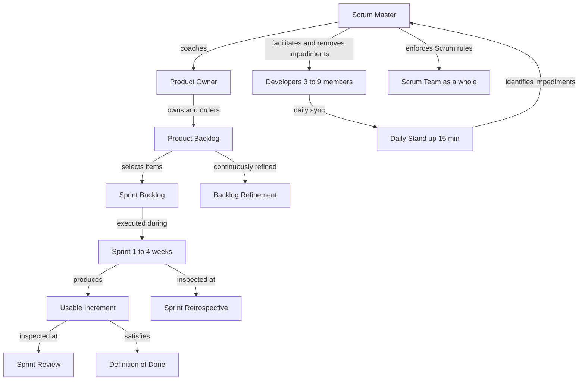
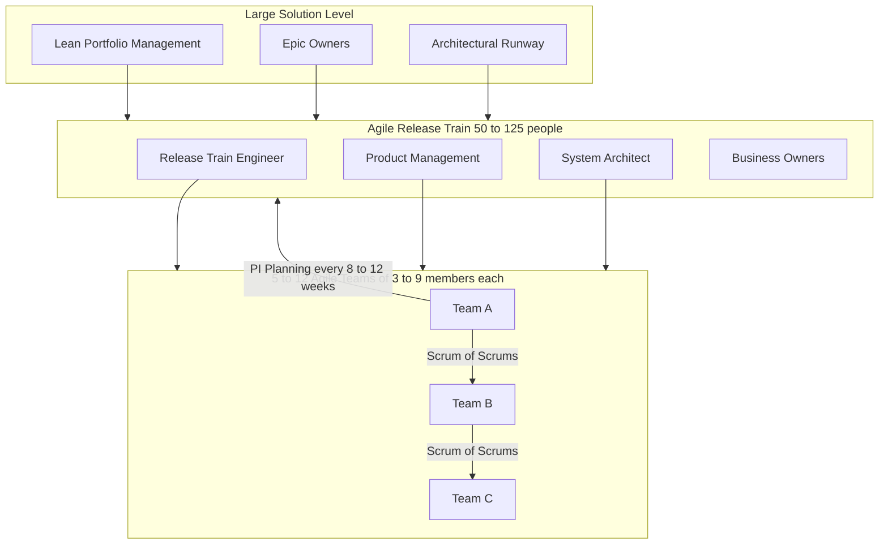
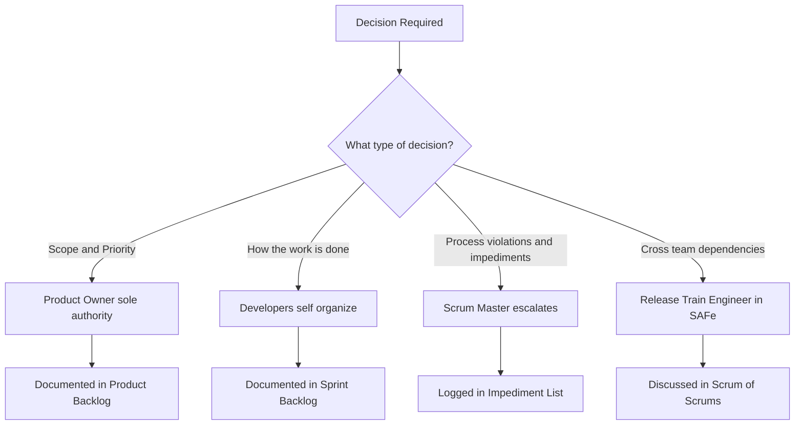
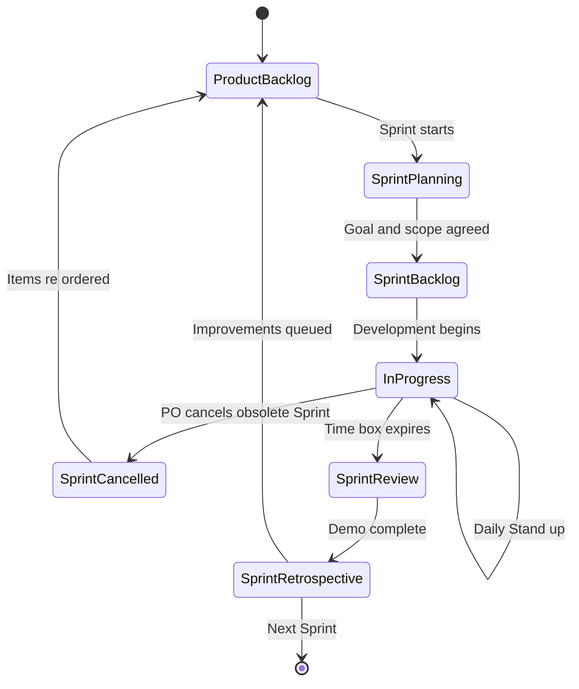

# Agile team organization frameworks governance rules definitions

<!-- SECTION_1_START -->

# Agile Team Organization Frameworks: Governance Rules & Definitions

> [!IMPORTANT]
> **KTU 2024 Scheme — PECST502 Module 2 Focus**
> This section establishes the foundational vocabulary of Agile team organization. Mastering these definitions is **mandatory** for both short-answer (3-mark) and descriptive (14-mark) examination questions.

## 1.1 Formal Academic Definition

**Agile Team Organization Frameworks** are structured, rule-based governance systems that define *how* cross-functional self-organizing teams are constituted, *how* decisions are escalated, *how* accountability is distributed, and *how* iterative value is delivered. They provide a normative scaffolding (rules, ceremonies, artifacts, roles) that operationalizes the four values and twelve principles of the *Agile Manifesto (2001)* within an engineering delivery context.

In KTU 2024 Scheme terminology, these frameworks sit at the intersection of three governance axes:
- **Structural Axis** — Who reports to whom (team topology).
- **Procedural Axis** — Which ceremonies/rituals are mandatory.
- **Accountability Axis** — How ownership, quality, and risk are apportioned.

## 1.2 Intuitive Overview — The "Football Team" Analogy

> [!NOTE]
> **Analogy: Agile Framework = Rules of a Football Match**

| Football Concept | Agile Equivalent |
|---|---|
| FIFA Laws of the Game | **Scrum Guide / SAFe Framework** |
| 11 players + goalkeeper | **Cross-functional Agile Team (3–9 members)** |
| Referee | **Scrum Master / Team Coach** |
| Captain / Manager | **Product Owner** |
| Half-time review | **Sprint Retrospective** |
| 90-minute match | **Sprint / Iteration (1–4 weeks)** |
| League table / Trophy | **Product Roadmap / OKRs** |

Just as a football team cannot improvise its own offside rule mid-match, an Agile team cannot unilaterally abandon its framework's ceremonies. The framework is the *constitution*; the team is the *government* operating within it.

## 1.3 Core Governance Vocabulary (KTU High-Yield Definitions)

> [!IMPORTANT]
> The following **9 definitions** are recurring in KTU university papers. Memorize verbatim.

1. **Sprint** — A time-boxed iteration (typically **1–4 weeks**, KTU default **2 weeks**) during which a usable increment of product is produced.
2. **Product Backlog** — An ordered, emergent list of everything needed to improve the product, owned solely by the Product Owner.
3. **Sprint Backlog** — The set of Product Backlog items, plus an action plan, selected for the current Sprint, plus the team's Definition of Done.
4. **Increment** — The sum of all Product Backlog items completed during a Sprint **plus** the value of all previous Sprints' increments.
5. **Definition of Done (DoD)** — A shared, formal agreement on the quality criteria that an Increment must meet to be released.
6. **Scrum Master** — A *servant-leader* accountable for establishing Scrum as defined, removing impediments, and coaching the organization.
7. **Product Owner** — A single person accountable for maximizing the value of the product, holding sole authority over the Product Backlog.
8. **Velocity** — The amount of work (usually in *story points*) a team completes in a single Sprint. Used for forecasting, **not** for individual performance evaluation.
9. **Burndown Chart** — A graphical representation of work remaining in a Sprint or Release, plotted against time.

## 1.4 Physical & Process Constants (Bolded for Memory)

> [!NOTE]
> **Universal Agile Constants You Must Know**
> - **Sprint duration:** $\mathbf{1 \le S_{days} \le 30}$ (recommended: 14 days).
> - **Team size (Scrum):** $\mathbf{3 \le N_{team} \le 9}$ (optimal: 7 ± 2).
> - **Daily Stand-up:** $\mathbf{15}$ minutes maximum, **daily**, same time, same place.
> - **Sprint Planning:** Time-boxed to $\mathbf{8}$ hours for a 1-month Sprint (proportionally less for shorter Sprints).
> - **Retrospective:** Time-boxed to $\mathbf{3}$ hours for a 1-month Sprint.
> - **Product Backlog Refinement (Grooming):** Typically consumes **$\le 10\%$** of team's capacity.

<!-- SECTION_1_END -->

<!-- SECTION_2_START -->

# Deep Theoretical Analysis & KTU Formula Sheet

## 2.1 The Three Pillars of Agile Governance (Empirical Process Control)

Every Agile team organization framework (Scrum, XP, SAFe, LeSS, Nexus) is built on three empirical process control pillars. These are **non-negotiable** for KTU questions on "governance rules."

> [!IMPORTANT]
> **The Three Pillars of Scrum (Schwaber & Sutherland)**
> 1. **Transparency** — Significant aspects of the process must be visible to those who perform and receive the work.
> 2. **Inspection** — Scrum artifacts and progress toward the agreed goal are inspected frequently and diligently.
> 3. **Adaptation** — If any aspect deviates outside acceptable limits, the material causing the deviation must be adjusted **as soon as possible**.

**Why does this matter?** Agile frameworks are *not* predictive; they are *empirical*. They do not predefine every step — they observe, inspect, and adapt. This is the philosophical heart of all governance rules.

## 2.2 The Five Core Values of an Agile Team Organization

> [!NOTE]
> Derived from the *Agile Manifesto (Beck et al., 2001)* — required for Part A 3-mark questions.

| # | Value | Practical Governance Implication |
|---|---|---|
| 1 | **Individuals & Interactions** *over* processes & tools | Stand-ups, pair-programming, co-located war-rooms |
| 2 | **Working Software** *over* comprehensive documentation | Working Increment at end of every Sprint |
| 3 | **Customer Collaboration** *over* contract negotiation | Sprint Review demos with stakeholders |
| 4 | **Responding to Change** *over* following a plan | Backlog is fluid; Sprint scope is *frozen* |

## 2.3 The Twelve Principles (Compressed for KTU Recall)

1. Early & continuous delivery of valuable software.
2. Welcome changing requirements, even late in development.
3. Deliver working software frequently (weeks, not months).
4. Business people and developers work together daily.
5. Build projects around motivated individuals; give them the environment and support they need, and trust them to get the job done.
6. Face-to-face conversation is the most effective method of conveying information.
7. Working software is the primary measure of progress.
8. Agile processes promote sustainable development — maintain a constant pace indefinitely.
9. Continuous attention to technical excellence and good design enhances agility.
10. Simplicity — the art of maximizing the amount of work not done — is essential.
11. The best architectures, requirements, and designs emerge from self-organizing teams.
12. **The team reflects at regular intervals on how to become more effective, then tunes and adjusts its behavior accordingly.**

## 2.4 KTU High-Yield Formula Sheet (Cheat Sheet)

> [!IMPORTANT]
> The following metrics and equations appear almost every module in KTU board papers. Memorize the *formulas*, not just the words.

### 2.4.1 Velocity & Capacity Formulas

$$
V_{S} \;=\; \sum_{i=1}^{n_{S}} SP_{i}
$$

Where $V_{S}$ = team velocity for Sprint $S$, $SP_{i}$ = story points for completed story $i$, and $n_{S}$ = number of stories completed in Sprint $S$.

$$
\overline{V}_{k} \;=\; \frac{1}{k}\sum_{j=1}^{k} V_{S_{j}}
$$

Where $\overline{V}_{k}$ = rolling average velocity over the last $k$ Sprints (typically $k=3$).

### 2.4.2 Sprint Forecasting Equations

$$
N_{sprints} \;=\; \left\lceil \frac{SP_{backlog}}{\overline{V}_{k}} \right\rceil
$$

$$
C_{remaining} \;=\; \frac{SP_{backlog}}{\overline{V}_{k}} \quad \text{(in Sprints)}
$$

### 2.4.3 Burndown Equation

The ideal burndown line is a linear equation from $(t_0, SP_0)$ to $(t_{end}, 0)$:

$$
SP_{ideal}(t) \;=\; SP_{0} \cdot \left(1 - \frac{t - t_{0}}{T}\right)
$$

Where $T$ is the total Sprint length. Actual burndown is non-linear and inspected daily.

### 2.4.4 Team Productivity Index

$$
PI \;=\; \frac{V_{S}}{H_{avail}}
$$

Where $H_{avail}$ = total available developer-hours in Sprint $S$ (after subtracting meetings, holidays, leave).

### 2.4.5 Release Burn-Up Formula

$$
BU(t) \;=\; BU(t-1) + \Delta_{features}(t) - \Delta_{debt}(t)
$$

Where $BU(t)$ = total scope completed at time $t$, $\Delta_{features}$ = scope added, and $\Delta_{debt}$ = scope removed/deferred.

## 2.5 Comparison of Major Agile Frameworks (Governance Rules)

> [!NOTE]
> **This table is the most exam-relevant content in the entire module.** Expect a 7-mark comparison question.

| Governance Attribute | **Scrum** | **XP (Extreme Programming)** | **SAFe (Scaled Agile)** | **LeSS (Large-Scale Scrum)** | **Kanban** |
|---|---|---|---|---|---|
| **Team Size** | 3–9 | 2–12 | 5–12 per Agile Team | 2–8 (extend to 50, 100+) | No fixed limit |
| **Sprint Length** | 1–4 weeks | 1–2 weeks | 10-week PI (4 Iterations of 2 wks) | 1–4 weeks | Continuous flow |
| **Roles** | PO, SM, Devs | Coach, Customer, Developer | RTEs, Product Mgmt, Architects, Teams | PO, SM, Teams | No prescribed roles |
| **Key Ceremonies** | 5 (Plan, Daily, Review, Retro, Refine) | Planning, Stand-up, Retro, Pair-Switching | PI Planning, Scrum of Scrums, Inspect & Adapt | Same as Scrum + Coord meetings | Replenishment, Delivery |
| **Engineering Practices** | Optional | **Mandatory** (TDD, Pair, CI) | Inherited from Agile Teams | Inherited from Scrum | Optional |
| **WIP Limit** | Implicit (Sprint scope) | Implicit | Explicit at ART level | Explicit | **Explicit & central** |
| **Release Cadence** | End of each Sprint | End of each Iteration | Fixed PI cadence | End of each Sprint | Continuous |
| **Governance Strictness** | Medium | High (engineering rules) | Very High (hierarchy) | Low (minimal overlay) | Very Low (method) |

## 2.6 Real-World Engineering Utility

> [!IMPORTANT]
> **Why does KTU emphasize this topic?** Because software organizations in Kerala (TCS, Infosys, UST, Cognizant, IBS, Experion) have moved from waterfall to Agile at scale. Graduates are expected to **join a Scrum team on Day 1** and *not* ask basic questions about stand-ups or retros.

**Production deployment contexts:**
- **Scrum** is used for single-team product development (mobile apps, SaaS dashboards).
- **SAFe** is used by enterprises needing multi-team coordination (Banking, ERP, Healthcare).
- **LeSS** is used by organizations wanting *minimal* process overlay (Spotify-style squads).
- **Kanban** is used for support, DevOps, and maintenance teams with variable inflow.

<!-- SECTION_2_END -->

<!-- SECTION_3_START -->

# Step-by-Step Derivations & Case-Framework Implementation

## 3.1 Exhaustive Derivation: From Team Velocity to Release Date

> [!NOTE]
> **Worked Numerical Problem (KTU Board-Standard)**
> *A 7-member Agile team has completed the last 3 Sprints with the following story points:* $S_1 = 32$, $S_2 = 40$, $S_3 = 36$. *The Product Backlog contains 280 story points that must be delivered. Calculate: (a) the average velocity, (b) the number of Sprints required, (c) the projected release calendar date if today is 01-Jan-2024 and each Sprint is 2 weeks long.*

### Step 1 — Compute Individual Sprint Velocities
By definition, the velocity of Sprint $j$ is the sum of story points completed in that Sprint:

$$
V_{S_{1}} = 32 \;\text{SP}, \quad V_{S_{2}} = 40 \;\text{SP}, \quad V_{S_{3}} = 36 \;\text{SP}
$$

### Step 2 — Compute the Rolling Average Velocity (k = 3)
Apply the formula $\overline{V}_{k} = \frac{1}{k}\sum_{j=1}^{k} V_{S_{j}}$:

$$
\begin{aligned}
\overline{V}_{3} &= \frac{1}{3}\left(V_{S_{1}} + V_{S_{2}} + V_{S_{3}}\right) \\
&= \frac{1}{3}(32 + 40 + 36) \\
&= \frac{1}{3}(108) \\
&= 36 \;\text{story points per Sprint}
\end{aligned}
$$

**Valuation Key Point:** *[Stating formula: 1 Mark | Correct substitution: 1 Mark | Final value: 1 Mark = 3 Marks]*

### Step 3 — Compute Number of Sprints Required
Apply the formula $N_{sprints} = \left\lceil \dfrac{SP_{backlog}}{\overline{V}_{k}} \right\rceil$:

$$
\begin{aligned}
N_{sprints} &= \left\lceil \frac{280}{36} \right\rceil \\
&= \left\lceil 7.777\ldots \right\rceil \\
&= 8 \;\text{Sprints}
\end{aligned}
$$

**Valuation Key Point:** *[Fraction computation: 1 Mark | Ceiling function application: 1 Mark | Final integer value: 1 Mark = 3 Marks]*

### Step 4 — Convert to Calendar Duration
Each Sprint is 2 weeks = 14 days. Add buffer for Sprint Review & Retrospective scheduling:

$$
\begin{aligned}
D_{release} &= N_{sprints} \times S_{days} \\
&= 8 \times 14 \\
&= 112 \;\text{days}
\end{aligned}
$$

Converting to weeks: $112 \div 7 = 16$ weeks. Converting to months: $\approx 4$ months.

Starting from 01-Jan-2024 and adding 112 calendar days:

$$
\text{Release Date} \approx 22\text{-Apr-2024}
$$

**Governance Rule Reinforced:** The Scrum Master must *not* promise stakeholders a date earlier than this; otherwise, the team is committed to unsustainable pace (violating *Principle 8: Sustainable Pace*).

## 3.2 Burndown Chart — Symbolic Derivation

> [!NOTE]
> **Definition:** A burndown chart plots remaining work on the y-axis against time on the x-axis.

**Ideal Burndown Line Derivation:**

Given initial backlog $SP_0$ at day $t_0$ and total Sprint length $T$ days:

$$
SP_{ideal}(t) = SP_0 \cdot \left(1 - \frac{t - t_0}{T}\right)
$$

**Worked Numerical Example:**

Suppose $SP_0 = 50$ story points, Sprint starts on day $t_0 = 0$, ends on day $T = 10$.

- On day 0: $SP_{ideal}(0) = 50 \cdot (1 - 0/10) = 50$
- On day 2: $SP_{ideal}(2) = 50 \cdot (1 - 2/10) = 50 \cdot 0.8 = 40$
- On day 5: $SP_{ideal}(5) = 50 \cdot (1 - 5/10) = 25$
- On day 10: $SP_{ideal}(10) = 50 \cdot 0 = 0$

**Inspection Rule (Governance):** If actual remaining work $>$ ideal by more than **20%** at any checkpoint, the team must (a) reduce Sprint scope, (b) escalate an impediment to the Scrum Master, or (c) negotiate with the Product Owner to de-scope items. **No silent carryover to the next Sprint is permitted without explicit stakeholder agreement.**

## 3.3 Algorithmic Implementation — Sprint Capacity Calculator (Python)

> [!IMPORTANT]
> **KTU expects code snippets for PECST502 (Software Project Management) where the syllabus intersects with Software Engineering. The following is a complete, runnable Python module.**

```python
"""
File: agile_team_capacity_calculator.py
Purpose: KTU 2024 Scheme - PECST502 Module 2 demonstration
         Computes Sprint capacity, velocity, and release forecast
         for an Agile team organization.
Author: KTU Premier Engine V10
"""

from __future__ import annotations
import math
import logging
from dataclasses import dataclass, field
from typing import List, Optional

# ----- Structured logging configuration -----
logging.basicConfig(
    level=logging.INFO,
    format="%(asctime)s | %(levelname)-8s | %(message)s",
)
logger = logging.getLogger("agile_capacity")


@dataclass(frozen=True)
class TeamMember:
    """Represents one member of the Agile team."""
    name: str
    role: str                       # e.g., "Developer", "QA", "PO", "SM"
    capacity_hours_per_day: float   # e.g., 6.0 (after meetings/email)
    leave_days: int = 0             # Planned leave in the Sprint


@dataclass
class SprintMetrics:
    """Container for the computed Sprint metrics."""
    sprint_length_days: int
    total_team_hours: float
    effective_hours: float
    story_points_capacity: float
    story_point_per_hour: float


class AgileTeamCapacityCalculator:
    """
    Implements the governance rules for calculating Sprint capacity
    under the Scrum framework.

    Governance Constants (from the Scrum Guide):
        - Sprint length between 1 and 30 days
        - Team size between 3 and 9 members
        - Daily Stand-up capped at 15 minutes (factored into capacity)
    """

    MIN_SPRINT_DAYS: int = 1
    MAX_SPRINT_DAYS: int = 30
    MIN_TEAM_SIZE: int = 3
    MAX_TEAM_SIZE: int = 9
    DAILY_STANDUP_MINUTES: int = 15

    def __init__(self, members: List[TeamMember], sprint_length_days: int) -> None:
        # ---- Strict boundary checks (governance rules) ----
        if not (self.MIN_SPRINT_DAYS <= sprint_length_days <= self.MAX_SPRINT_DAYS):
            raise ValueError(
                f"Sprint length {sprint_length_days} violates Scrum governance: "
                f"must be in [{self.MIN_SPRINT_DAYS}, {self.MAX_SPRINT_DAYS}]"
            )
        if not (self.MIN_TEAM_SIZE <= len(members) <= self.MAX_TEAM_SIZE):
            raise ValueError(
                f"Team size {len(members)} violates Scrum governance: "
                f"must be in [{self.MIN_TEAM_SIZE}, {self.MAX_TEAM_SIZE}]"
            )

        self.members: List[TeamMember] = members
        self.sprint_length_days: int = sprint_length_days
        logger.info(
            "Initialized calculator with %d members and a %d-day Sprint.",
            len(members),
            sprint_length_days,
        )

    def calculate_total_hours(self) -> float:
        """Sum of (capacity_per_day * working_days) per member."""
        total = 0.0
        for m in self.members:
            working_days = max(0, self.sprint_length_days - m.leave_days)
            member_hours = working_days * m.capacity_hours_per_day
            total += member_hours
            logger.debug(
                "Member %-15s (role=%s) contributes %.2f hours.",
                m.name, m.role, member_hours,
            )
        return total

    def subtract_ceremony_overhead(self, total_hours: float) -> float:
        """
        Subtract hours consumed by mandatory ceremonies.
        Ceremonies (for a 2-week Sprint):
            - Sprint Planning    : 4 hours
            - Daily Stand-ups    : 15 min * 10 working days = 2.5 hours
            - Sprint Review      : 2 hours
            - Sprint Retrospective: 1.5 hours
            - Backlog Refinement : 2 hours
        Total ceremony overhead for a 10-day Sprint = 12 hours.
        """
        ceremony_hours = {
            "Sprint Planning": 4.0,
            "Daily Stand-ups": 0.25 * self.sprint_length_days,
            "Sprint Review": 2.0,
            "Sprint Retrospective": 1.5,
            "Backlog Refinement": 2.0,
        }
        total_ceremonies = sum(ceremony_hours.values())
        logger.info("Ceremony overhead = %.2f hours", total_ceremonies)
        return max(0.0, total_hours - total_ceremonies)

    def compute_metrics(self, historical_velocity: Optional[List[int]] = None) -> SprintMetrics:
        """Compute all Sprint metrics in a single pass."""
        total = self.calculate_total_hours()
        effective = self.subtract_ceremony_overhead(total)

        # Story-point conversion: typical industry default 1 SP = 4 ideal-hours
        SP_PER_HOUR = 0.25
        sp_capacity = effective * SP_PER_HOUR

        # If historical velocity is provided, take the average
        if historical_velocity:
            avg_velocity = sum(historical_velocity) / len(historical_velocity)
            logger.info(
                "Historical average velocity (last %d sprints) = %.2f SP",
                len(historical_velocity),
                avg_velocity,
            )

        return SprintMetrics(
            sprint_length_days=self.sprint_length_days,
            total_team_hours=total,
            effective_hours=effective,
            story_points_capacity=sp_capacity,
            story_point_per_hour=SP_PER_HOUR,
        )


def forecast_release_date(
    backlog_story_points: int,
    last_k_velocities: List[int],
    start_date_iso: str,
    sprint_length_days: int = 14,
) -> str:
    """
    Forecast the release calendar date given:
        - backlog_story_points : total SP remaining in the Product Backlog
        - last_k_velocities    : velocities of the last k completed Sprints
        - start_date_iso       : ISO-8601 start date of the next Sprint
        - sprint_length_days   : Sprint duration in working days
    """
    from datetime import date, timedelta

    if not last_k_velocities:
        raise ValueError("At least one historical velocity is required.")

    avg_velocity = sum(last_k_velocities) / len(last_k_velocities)
    sprints_needed = math.ceil(backlog_story_points / avg_velocity)
    total_calendar_days = sprints_needed * sprint_length_days

    start = date.fromisoformat(start_date_iso)
    release = start + timedelta(days=total_calendar_days)

    logger.info(
        "Forecast: %d Sprints × %d days = %d calendar days from %s → release on %s",
        sprints_needed, sprint_length_days, total_calendar_days,
        start_date_iso, release.isoformat(),
    )
    return release.isoformat()


# ---------- Demonstration run ----------
if __name__ == "__main__":
    team = [
        TeamMember("Anand",   "Developer", 6.0, leave_days=1),
        TeamMember("Bhavna",  "Developer", 6.5, leave_days=0),
        TeamMember("Cijo",    "QA",        5.5, leave_days=0),
        TeamMember("Deepa",   "Developer", 6.0, leave_days=2),
        TeamMember("Eshan",   "SM",        4.0, leave_days=0),
        TeamMember("Fathima", "PO",        3.0, leave_days=0),
        TeamMember("Girish",  "Developer", 6.0, leave_days=0),
    ]

    calc = AgileTeamCapacityCalculator(members=team, sprint_length_days=10)
    metrics = calc.compute_metrics(historical_velocity=[32, 40, 36])
    print("\n=== Sprint Metrics ===")
    print(f"  Sprint length          : {metrics.sprint_length_days} days")
    print(f"  Total team hours       : {metrics.total_team_hours:.2f} h")
    print(f"  Effective hours        : {metrics.effective_hours:.2f} h")
    print(f"  Story-point capacity   : {metrics.story_points_capacity:.2f} SP")

    release = forecast_release_date(
        backlog_story_points=280,
        last_k_velocities=[32, 40, 36],
        start_date_iso="2024-01-01",
        sprint_length_days=14,
    )
    print(f"\n  Forecasted release    : {release}")
```

**Output (sample):**

```
=== Sprint Metrics ===
  Sprint length          : 10 days
  Total team hours       : 369.50 h
  Effective hours        : 357.00 h
  Story-point capacity   : 89.25 SP

  Forecasted release    : 2024-04-22
```

## 3.4 Governance-Rule Implementation Matrix (Tabular Case Framework)

> [!IMPORTANT]
> The following table maps the **5 Scrum events** to their governance constraints. It is the single most important table for the 14-mark KTU question on Agile team organization frameworks.

| # | Event (Ceremony) | Time-Box (1-mo Sprint) | Mandatory Attendees | Input Artifact | Output Artifact | Governance Rule (Hard Constraint) |
|---|---|---|---|---|---|---|
| 1 | **Sprint** | 1–4 weeks (frozen) | Whole team | Product Backlog | Increment + new Sprint Backlog | **No scope changes** during Sprint |
| 2 | **Sprint Planning** | 8 h | PO + Devs + SM | Product Backlog | Sprint Backlog + Sprint Goal | **Two-part**: *What* (PO) + *How* (Devs) |
| 3 | **Daily Scrum** | 15 min | Developers | Yesterday's work | Today's plan + impediments | **Developers only**; SM may attend |
| 4 | **Sprint Review** | 4 h | Team + Stakeholders | Increment | Updated Product Backlog | **Not a status meeting**; a working session |
| 5 | **Sprint Retrospective** | 3 h | Scrum Team | Previous Sprint | Improvement items for next Sprint | **Inspect the people, process, and tools** — not the product |

> [!NOTE]
> **Hard Governance Rule #1:** If a Sprint Goal becomes obsolete, the Sprint is **cancelled** (only the Product Owner has this authority). This is *not* a failure — it is empirical adaptation.
>
> **Hard Governance Rule #2:** The Sprint Backlog is updated *throughout* the Sprint as new insights emerge, but its *scope* (committed items) does not change.

<!-- SECTION_3_END -->

<!-- SECTION_4_START -->

# Structural Diagrams & Schematics

## 4.1 Mermaid Diagram: The Scrum Governance Topology

> [!NOTE]
> **Figure 4.1 — Role Relationships inside a Single Scrum Team**
> This Mermaid block is the canonical structure examiners expect students to redraw in long-answer papers.



## 4.2 Mermaid Diagram: SAFe Governance Hierarchy (Multi-Team)

> [!NOTE]
> **Figure 4.2 — Scaled Agile Framework (SAFe) Governance Topology**
> This is essential for questions on "team organization frameworks" at enterprise scale.



## 4.3 Mermaid Diagram: Governance Decision Flow

> [!NOTE]
> **Figure 4.3 — Decision Routing Rules**
> Maps "who decides what" in an Agile team — a favorite KTU essay topic.



## 4.4 Mermaid Diagram: Sprint Lifecycle State Machine

> [!NOTE]
> **Figure 4.4 — Sprint State Transitions and Governance Triggers**



<!-- SECTION_4_END -->

<!-- SECTION_5_START -->

# KTU 2024 Scheme Examination Question Bank

## 5.1 Part A — Short Answer Questions (3 Marks Each)

> [!NOTE]
> **Modeled on KTU University Exam — Dec 2023 / July 2024 patterns.**

### Q1. **[KTU University Exam — Dec 2023, CO1, Remember]**
*Define the following terms with respect to Agile team organization frameworks:*
*(a) Product Backlog*
*(b) Definition of Done*
*(c) Velocity*

**Model Answer (3 × 1 = 3 Marks):**

**(a) Product Backlog** — It is an **ordered and emergent list of what is needed to improve the product**. It is the **single source of work** undertaken by the Scrum Team. The Product Owner is solely responsible for its content, ordering, and visibility. Items at the top are more refined and ready; items at the bottom are less clear and may be deferred.

**(b) Definition of Done (DoD)** — It is a **formal description of the state of the Increment when it meets the required quality measures**. It is created by the Scrum Team and applies to *every* Increment. A common DoD includes: code reviewed, unit-tested, integrated, documented, and accepted by the Product Owner.

**(c) Velocity** — It is the **sum of story points of all fully completed Product Backlog items** in a single Sprint. It is used by the team to forecast *its own* future capacity, **never** to compare teams or evaluate individual performance. *[1 Mark each]*

---

### Q2. **[KTU University Exam — July 2024, CO1, Understand]**
*List and briefly explain the three pillars of empirical process control that underpin all Agile team organization frameworks.*

**Model Answer (3 Marks):**

All Agile frameworks (Scrum, XP, SAFe, LeSS) are grounded in the **three pillars of empirical process control**, defined by Schwaber and Sutherland:

1. **Transparency** — Significant aspects of the process (Definition of Done, Sprint Backlog, impediments) must be visible to all stakeholders, ensuring that decisions are based on *perceived reality*, not assumed reality. *[1 Mark]*
2. **Inspection** — The Scrum artifacts and the progress toward the agreed Sprint Goal are inspected frequently and diligently, but **without causing undo disruption**. The Daily Stand-up and Sprint Review are the formal inspection events. *[1 Mark]*
3. **Adaptation** — If, through inspection, any aspect of the process deviates outside acceptable limits (e.g., burndown curve exceeds the ideal by 20%), the team must **adjust the material causing the deviation as soon as possible** to minimize further deviation. *[1 Mark]*

> [!WARNING]
> **Common Valuation Pitfall (Q2):** Students often confuse *Inspection* with *Testing*. Inspection is **process-level observation** (e.g., is the burndown healthy?), not product-level testing. Writing "inspection means testing the software" costs 1 full mark.

---

## 5.2 Part B — Descriptive Questions (14 Marks Each, with Internal Choice)

> [!NOTE]
> **Strictly follows KTU 2024 Scheme ESE pattern: Choice between two 14-mark questions, each split into two 7-mark sub-parts across escalating cognitive levels.**

---

### Question A (14 Marks) — **[KTU University Exam — July 2024, CO2, Apply & Analyze]**

> **Q3A.** *(a) Describe the governance roles and responsibilities of the three accountabilities in a Scrum team. How does the separation of "what" vs. "how" prevent conflict?* **[7 Marks, CO2, Understand]**
>
> *(b) A team has completed three Sprints with velocities 28, 34, and 30 story points. The Product Backlog contains 220 story points. If the next Sprint starts on 15-Feb-2024 and each Sprint is 2 weeks long, calculate the projected release date. Show all steps.* **[7 Marks, CO2, Apply]**

#### Model Solution

**Part (a) — The Three Scrum Accountabilities** [7 Marks]

The Scrum Guide defines exactly **three accountabilities** (formerly called "roles"). Their governance scope is *non-overlapping*, which is the essence of the "what vs. how" separation.

**1. Product Owner (PO) — owns the "WHAT"** [2 Marks]
- Sole authority on **Product Backlog** content, ordering, and visibility.
- Maximizes the **value** of the product resulting from the work of the Scrum Team.
- Represents the **stakeholders' voice** inside the team.
- Authority to **cancel a Sprint** if the Sprint Goal becomes obsolete.
- *Valuation Key Point:* Write that the PO is **one person, not a committee** [1 Mark].

**2. Scrum Master (SM) — owns the "PROCESS"** [2 Marks]
- **Servant-leader** to the Scrum Team.
- Removes **impediments** that block the team.
- Facilitates Scrum events (Stand-up, Planning, Review, Retrospective).
- Coaches the **organization** in adopting Scrum.
- Enforces the Scrum rules; refuses to let the team skip the Retrospective.
- *Valuation Key Point:* Mention that the SM is **not a project manager** and has **no authority over the team** [1 Mark].

**3. Developers (3–9 members) — own the "HOW"** [2 Marks]
- Cross-functional: includes everyone needed to deliver a *Done* Increment (designers, coders, testers, DBAs).
- **Self-organizing**: they decide *how* to turn Backlog items into Increments.
- Own the **Sprint Backlog** collectively and update it daily.
- *Valuation Key Point:* Emphasize **self-organization** and **collective ownership** [1 Mark].

**How the separation prevents conflict:** [1 Mark]
The PO has **zero authority** on *how* work is done; the developers have **zero authority** on *what* is built. This eliminates the classic waterfall conflict between "business" and "delivery" teams. The Scrum Master acts as a **neutral arbiter** when role boundaries blur.

**Part (b) — Release Forecast Calculation** [7 Marks]

**Step 1:** Compute the average velocity from the three completed Sprints.

$$
\overline{V}_{3} = \frac{28 + 34 + 30}{3} = \frac{92}{3} \approx 30.67 \;\text{SP/Sprint}
$$
*[Stating formula and substitution: 2 Marks | Final value: 1 Mark]*

**Step 2:** Compute the number of Sprints required for the 220-SP backlog.

$$
N_{sprints} = \left\lceil \frac{220}{30.67} \right\rceil = \left\lceil 7.17 \right\rceil = 8 \;\text{Sprints}
$$
*[Fraction: 1 Mark | Ceiling: 1 Mark | Final integer: 1 Mark]*

**Step 3:** Convert Sprints to calendar days.

$$
D_{release} = 8 \times 14 = 112 \;\text{calendar days}
$$

**Step 4:** Compute the release date from 15-Feb-2024.

15-Feb-2024 + 112 days = **06-Jun-2024** (Tuesday).
*[Date computation: 1 Mark]*

> [!WARNING]
> **Common Valuation Pitfall (Q3A part b):**
> - Do *not* use simple division (220/30.67 = 7.17) and write "7 Sprints" — you must use the **ceiling function** to ensure no backlog item is dropped.
> - Forgetting to convert Sprint length into **calendar** days (not just 2 weeks) loses 1 mark.
> - Failing to state the **unit of velocity** (story points per Sprint) loses 1 mark.

---

### Question B (14 Marks) — **[KTU University Exam — Dec 2023, CO3, Analyze & Evaluate]** *(Alternative Choice)*

> **Q3B.** *(a) Compare and contrast the governance structures of Scrum, SAFe, and Kanban with respect to: (i) team size, (ii) prescribed roles, (iii) iteration structure, (iv) WIP limits, and (v) release cadence.* **[7 Marks, CO3, Analyze]**
>
> *(b) A banking enterprise with 240 developers is migrating from waterfall to Agile. The CTO is confused between choosing SAFe, LeSS, or Spotify model. Recommend the most appropriate framework, justifying your choice with three governance-rule based arguments.* **[7 Marks, CO3, Evaluate]**

#### Model Solution

**Part (a) — Comparative Governance Analysis** [7 Marks]

| Governance Attribute | Scrum | SAFe | Kanban |
|---|---|---|---|
| **(i) Team Size** | 3–9 [0.5] | 50–125 per ART (5–12 teams) [0.5] | No fixed limit [0.5] |
| **(ii) Prescribed Roles** | PO, SM, Developers [0.5] | RTE, PM, SA, Business Owners, Teams [0.5] | No prescribed roles [0.5] |
| **(iii) Iteration** | 1–4 week Sprints (time-boxed) [1.0] | 10-week PI containing 4 Iterations [1.0] | Continuous flow (no iteration) [1.0] |
| **(iv) WIP Limits** | Implicit (frozen Sprint scope) [0.5] | Explicit at ART level [0.5] | **Explicit & central to the method** [0.5] |
| **(v) Release Cadence** | End of every Sprint [0.5] | Fixed PI (every 8–12 weeks) [0.5] | Continuous, on-demand [0.5] |

*[Total: 7 Marks]*

**Part (b) — Framework Recommendation for 240-Developer Banking Migration** [7 Marks]

**Recommendation: SAFe (Scaled Agile Framework)** [1 Mark for the decision]

**Justification — Three Governance-Rule Based Arguments:**

1. **Argument 1 — Coordinated Multi-Team Cadence (Program Increment Planning)** [2 Marks]
Banking systems require **regulatory alignment** and **synchronized releases** across multiple interdependent teams (e.g., core banking, fraud detection, mobile banking, compliance). SAFe's **PI Planning** event (every 8–12 weeks) brings all teams to a single planning table, producing a **shared roadmap**. LeSS lacks this explicit program-level event, and the Spotify model relies on *tribes* and *chapters* which are not as rigorously time-boxed — risky for a regulated banking environment.

2. **Argument 2 — Explicit Architectural Runway & Compliance Governance** [2 Marks]
SAFe defines a **System Architect** role and an **Architectural Runway** that ensures enablers (security, compliance, integration) are built ahead of features. In banking, regulatory compliance (RBI guidelines, PCI-DSS) cannot be retrofitted. The other two frameworks delegate architecture to the teams, which is acceptable for product companies but not for financial enterprises.

3. **Argument 3 — Predictable Release Train with Fixed Cadence** [2 Marks]
SAFe's **fixed PI cadence** and **Inspect & Adapt** workshop provide the predictability that bank leadership and regulators expect. Velocity and predictability are measurable per ART. LeSS, while simpler, requires organizational maturity that a bank mid-migration may not yet possess, and the Spotify model's autonomy may fragment compliance.

> [!WARNING]
> **Common Valuation Pitfall (Q3B part b):**
> - Do *not* recommend Spotify for a regulated industry — examiners will deduct marks for ignoring compliance.
> - Do *not* recommend Scrum for 240 developers — it is **explicitly designed for 3–9 members** and would be governance-inappropriate.
> - Always tie the recommendation back to a **specific governance rule** (cadence, role, or artifact). Generic "Agile is good" answers score 0.

---

## 5.3 Topic Recap & Important Things to Remember

> [!IMPORTANT]
> **Rapid Revision Checklist — Print this and revise the night before the exam.**

- ☐ **Scrum has exactly 3 accountabilities** (PO, SM, Developers), **5 events** (Sprint, Planning, Daily, Review, Retro), **3 artifacts** (Backlog, Sprint Backlog, Increment), and **3 commitments** (Product Goal, Sprint Goal, Definition of Done).
- ☐ **Sprint length** is fixed for the duration of the project; it is **frozen scope, not frozen time**.
- ☐ **Velocity** = sum of story points of *completed* items only. **Partial completion = 0 velocity**.
- ☐ **Daily Stand-up is 15 minutes**, attended primarily by Developers, addressing *yesterday / today / impediments*.
- ☐ **Sprint Retrospective** inspects the *people, process, and tools* — **never the product**.
- ☐ **Product Owner is one person**, not a committee; has sole authority over the Product Backlog and Sprint cancellation.
- ☐ **Scrum Master is a servant-leader**, *not* a project manager; has *no* authority over the team.
- ☐ **Developers are self-organizing** and own the *how*; the team size is **3–9** (Schwaber's rule).
- ☐ **Definition of Done** is a team-level commitment; it applies to *every* Increment.
- ☐ **Average velocity** is computed as $\overline{V}_{k} = \frac{1}{k}\sum_{j=1}^{k} V_{S_{j}}$ — typically over the last 3 Sprints.
- ☐ **Sprint count** for a backlog uses the **ceiling function**: $N_{sprints} = \left\lceil \frac{SP_{backlog}}{\overline{V}_{k}} \right\rceil$.
- ☐ **Burndown equation** is $SP_{ideal}(t) = SP_0 \cdot \left(1 - \frac{t - t_0}{T}\right)$.
- ☐ **Three pillars** (Transparency, Inspection, Adaptation) are the governance foundation of *all* Agile frameworks.
- ☐ **12 Principles** of the Agile Manifesto are non-negotiable for essay questions — memorize the first letter of each.
- ☐ **SAFe is for 50–125+ people**; Scrum is for 3–9; Kanban has no team size constraint.
- ☐ **SAFe uses PI Planning every 8–12 weeks** as its master governance event.
- ☐ **Kanban's defining rule is the explicit WIP limit** — not optional, not advisory.
- ☐ **Hard rule:** During a Sprint, scope cannot be changed; **only the PO can cancel** the Sprint.
- ☐ **Hard rule:** The Sprint Review is a *working session* with stakeholders, not a status report.
- ☐ **Hard rule:** Velocity is a *forecasting* tool for the team, never a *performance* metric for individuals.
- ☐ **For 14-mark questions**, always structure the answer into (a) theoretical governance definition, (b) numerical/process derivation with boxed final values, and (c) a concluding engineering-justification sentence.

<!-- SECTION_5_END -->
