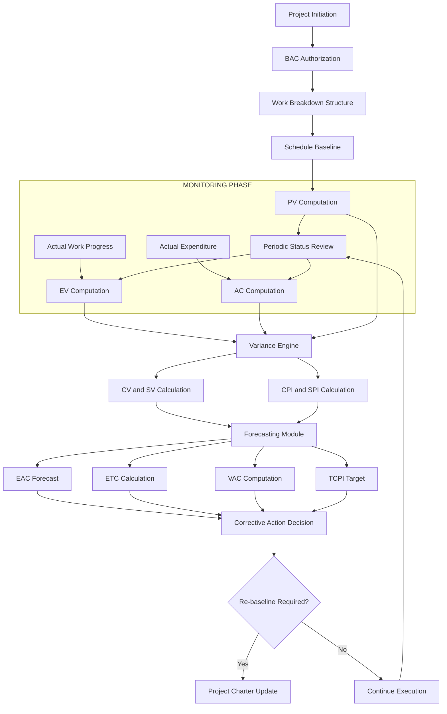
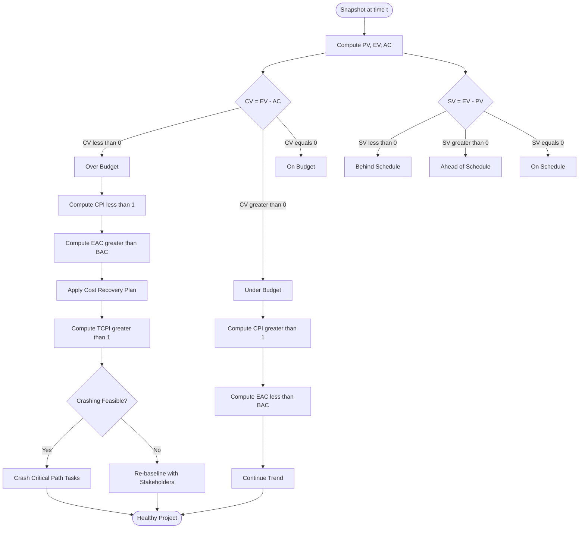
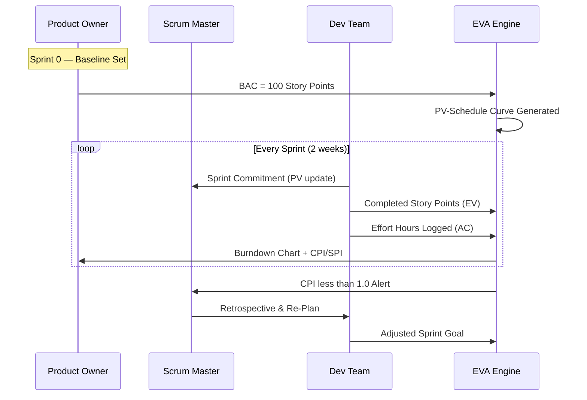

# Earned Value Analysis (EVA) calculation equations for monitoring resource tracking schemes

<!-- SECTION_1_START -->
# Earned Value Analysis (EVA) — Core Definition & Intuitive Overview

## 📘 Formal KTU 2024 Definition

> **Earned Value Analysis (EVA)** is an *integrated project performance measurement technique* that compares the **authorized budget (scope)**, the **actual cost incurred**, and the **work actually completed** at any given point in time during the project lifecycle. It provides an early-warning diagnostic system by fusing **scope**, **schedule**, and **cost** into a unified set of numerical indices — the three pillars of the **Project Management Triangle (Iron Triangle)**.

The framework was formalized under **ANSI/EIA-748 Standard for Earned Value Management Systems (EVMS)** and is mandated in defense, aerospace, and large-scale IT projects (e.g., DoD, NASA, ISRO).

In KTU terminology (PECST502 — Software Project Management), EVA is classified under the **Monitoring & Controlling Process Group** of the *PMBOK Guide (7th Edition)* and the *PRINCE2* "Manage a Stage Boundary" activity.

---

## 💡 Conceptual Analogy — "The Road Trip Odometer"

Imagine you are driving from **Kochi to Delhi (2,500 km)**. Your dashboard has **three indicators**:

| Dashboard Reading | EVA Counterpart | Meaning |
|---|---|---|
| 🛣️ **Distance Planned** for today (700 km) | **Planned Value (PV)** | What you *should* have done by now |
| ⛽ **Fuel Actually Pumped** (₹4,200) | **Actual Cost (AC)** | What you *spent* in reality |
| 📍 **Distance Actually Travelled** (550 km) | **Earned Value (EV)** | What you *physically achieved* |

> [!NOTE]
> **Key Insight**: If you planned 700 km but only travelled 550 km → you are *behind schedule* (Schedule Variance < 0). If your fuel bill exceeded the budget for 550 km → you are *over budget* (Cost Variance < 0). This is **exactly** how EVA diagnoses software projects!

The genius of EVA is that it answers **three diagnostic questions in a single snapshot**:
1. *Where did we plan to be?* → **PV**
2. *Where are we actually?* → **EV**
3. *How much did we burn to get here?* → **AC**

---

## ⚙️ Engineering Significance in Software Project Management

In a typical KTU-aligned software project (e.g., a B.Tech main project with a ₹5,00,000 budget over 6 months), EVA answers the Project Manager's three critical questions:

> [!IMPORTANT]
> - **Are we ahead or behind schedule?** → Use **SV** or **SPI**
> - **Are we under or over budget?** → Use **CV** or **CPI**
> - **What will the final cost be at current performance?** → Use **EAC**

### The Four Foundational Base Metrics

| # | Metric | Full Name | Question Answered |
|---|---|---|---|
| 1 | **PV** | Planned Value (BCWS) | *How much work was scheduled?* |
| 2 | **EV** | Earned Value (BCWP) | *How much work was actually done (valued)?* |
| 3 | **AC** | Actual Cost (ACWP) | *How much did we actually spend?* |
| 4 | **BAC** | Budget at Completion | *What is the total authorized budget?* |

> [!TIP]
> 🔑 **Memorization Hack for KTU Viva**:  
> **EV is always valued at the *Planned* (Budgeted) rate**, *not* the actual rate.  
> Even if you spent ₹10,000 to deliver a task worth ₹7,000 — the EV is **₹7,000**.

---

## 📐 GeoGebra Visualization — The EVA Triangle

> [!VISUALIZATION CONTROL]
> **Concept:** The Iron Triangle of EVA — relationship between PV, EV, and AC at a snapshot in time.
> 
> **GeoGebra Input Equations (Cartesian plane):**
> * `PV(t) = 100 * t / 6`  (linear scheduled baseline, BAC = 100, duration = 6 months)
> * `EV(t) = If(t < 4, 80 * t / 6, 80 * 4 / 6 + 110 * (t - 4) / 6)`  (piecewise actual progress)
> * `AC(t) = 95 * t / 6`  (actual cost line)
> 
> **Visual Description:** Three lines emanating from the origin. If **AC line lies above EV line** → over-budget (CPI < 1). If **EV line lies below PV line** → behind schedule (SPI < 1). The shaded gap between PV and AC at time *t* represents the cumulative cost overrun.

<!-- SECTION_1_END -->

<!-- SECTION_2_START -->
# Deep Theoretical Analysis & KTU High-Yield Formula Sheet

## 🧠 Theoretical Foundation — The 12 EVA Indices

EVA can be decomposed into **4 Base Metrics**, **4 Variances (deviations)**, and **4 Performance Indices (ratios)**. Every higher-level metric is a deterministic function of the base metrics.

### 🏗️ Logical Derivation Tree

```
BASE METRICS                VARIANCES                   INDICES
(PV, EV, AC, BAC)     ───► (CV, SV, VAC)        ───► (CPI, SPI, TCPI)
                                       │
                                       ▼
                                  FORECASTS
                              (EAC, ETC, VATE)
```

---

## 📊 KTU Formula Cheat Sheet — All 12 Core EVA Equations

> [!IMPORTANT]
> All currency values are in **₹ (INR)** or **Hours** (effort). Ratios are *dimensionless*. Negative variance = *unfavourable*. Positive variance = *favourable*.

| # | Metric | Symbol | Equation | Interpretation | Status Rule |
|:---:|:---|:---:|:---|:---|:---:|
| 1 | **Planned Value** | $PV$ | $\text{BAC} \times \text{\% of work scheduled to be complete}$ | Budgeted cost of work *scheduled* | Baseline |
| 2 | **Earned Value** | $EV$ | $\text{BAC} \times \text{\% of work actually complete}$ | Budgeted cost of work *performed* | Progress |
| 3 | **Actual Cost** | $AC$ | Sum of all recorded expenditures | Real money/effort *spent* | Consumption |
| 4 | **Cost Variance** | $CV$ | $CV = EV - AC$ | Budget surplus (+) or deficit (−) | $CV \geq 0$ ✅ |
| 5 | **Schedule Variance** | $SV$ | $SV = EV - PV$ | Time surplus (+) or deficit (−) | $SV \geq 0$ ✅ |
| 6 | **Cost Performance Index** | $CPI$ | $CPI = \dfrac{EV}{AC}$ | Efficiency of cost utilization | $CPI \geq 1$ ✅ |
| 7 | **Schedule Performance Index** | $SPI$ | $SPI = \dfrac{EV}{PV}$ | Efficiency of time utilization | $SPI \geq 1$ ✅ |
| 8 | **Estimate at Completion** | $EAC$ | $EAC = \dfrac{BAC}{CPI}$ | Forecasted total cost | $EAC \leq BAC$ ✅ |
| 9 | **Estimate to Complete** | $ETC$ | $ETC = EAC - AC$ | Cost needed to *finish* | Remaining |
| 10 | **Variance at Completion** | $VAC$ | $VAC = BAC - EAC$ | Budget surplus at project end | $VAC \geq 0$ ✅ |
| 11 | **To-Complete Performance Index** | $TCPI$ | $TCPI = \dfrac{BAC - EV}{BAC - AC}$ | Required future efficiency | Target |
| 12 | **Budget at Completion** | $BAC$ | $BAC = \text{Total Authorized Budget}$ | Total scope budget | Constant |

> [!NOTE]
> **Rule of Thumbs for KTU Numericals**:
> - $CPI > 1$ → Under budget (good) | $CPI < 1$ → Over budget (bad)
> - $SPI > 1$ → Ahead of schedule (good) | $SPI < 1$ → Behind schedule (bad)
> - $TCPI < 1$ → Easier to recover | $TCPI > 1$ → Harder to recover

---

## 🔬 Advanced Variants of EAC

The plain $EAC = \frac{BAC}{CPI}$ assumes that *future performance mirrors past performance*. KTU problems often test alternative scenarios:

| # | Scenario | Formula | When to Use |
|:---:|:---|:---|:---|
| 1 | **Past performance continues** | $EAC = \dfrac{BAC}{CPI}$ | Default assumption |
| 2 | **Past performance + new estimate** | $EAC = AC + \dfrac{BAC - EV}{CPI}$ | Past + future both have variance |
| 3 | **Both CPI & SPI impact remaining** | $EAC = AC + \dfrac{BAC - EV}{CPI \times SPI}$ | Schedule delays compound cost |
| 4 | **Fixed re-estimate** | $EAC = AC + ETC_{\text{new}}$ | Manager provides fresh estimate |
| 5 | **BAC is unreliable** | $EAC = AC + \text{Bottom-up ETC}$ | Re-baselining required |

---

## 🛠️ Real-World Software Engineering Applications

| Industry Application | How EVA Is Used |
|---|---|
| **Agile Sprints (Scrum)** | Story points earned vs. committed; cumulative flow diagrams mirror EV curves |
| **Outsourced IT Contracts** | Milestone-based billing reconciliation using EV |
| **DoD / Defense Software** | Mandatory EVMS compliance under ANSI/EIA-748 |
| **EVM in DevOps** | Feature flag rollouts tracked as earned work |
| **Capstone Projects (KTU B.Tech)** | Supervisor-evaluated milestone tracking |

> [!TIP]
> In **Agile contexts**, "Earned Value" is often replaced with **"Completed Story Points"** or **"Burned-Down Points"**. The mathematical principle of *value-based progress measurement* remains identical.

<!-- SECTION_2_END -->

<!-- SECTION_3_START -->
# Step-by-Step Derivations, Worked Numerical & Python Implementation

---

## 🧮 Worked Numerical — KTU 2024 Pattern (14-Mark Style)

### 📋 Problem Statement

> **[KTU University Exam — July 2024 Style]**
> 
> A software project has a **total budget (BAC) of ₹20,00,000** scheduled to be completed in **10 months**. After **5 months** of execution, the project manager reports the following:
> 
> - Work actually completed = **45% of total scope**
> - Actual cost incurred so far = **₹11,00,000**
> - Planned work at 5 months = **50% of total scope**
> 
> **Compute:** PV, EV, AC, CV, SV, CPI, SPI, EAC, ETC, VAC, TCPI. Provide a status report and recommendation.

---

### 🪜 Step-by-Step Solution

**Step 1 — Compute the Base Metrics**

The Planned Value (PV) at 5 months corresponds to 50% of BAC.

$$PV = BAC \times 50\% = 20{,}00{,}000 \times 0.50 = 10{,}00{,}000 \text{ ₹}$$

The Earned Value (EV) corresponds to the *value* of 45% of completed work (valued at the *planned* rate, not actual).

$$EV = BAC \times 45\% = 20{,}00{,}000 \times 0.45 = 9{,}00{,}000 \text{ ₹}$$

The Actual Cost (AC) is given directly.

$$AC = 11{,}00{,}000 \text{ ₹}$$

The Budget at Completion remains unchanged.

$$BAC = 20{,}00{,}000 \text{ ₹}$$

**[Valuation Key: Base metrics — 2 Marks]**

---

**Step 2 — Compute the Variances (CV, SV)**

$$CV = EV - AC = 9{,}00{,}000 - 11{,}00{,}000 = -2{,}00{,}000 \text{ ₹}$$

$$SV = EV - PV = 9{,}00{,}000 - 10{,}00{,}000 = -1{,}00{,}000 \text{ ₹}$$

**[Valuation Key: Both variance equations and signs — 2 Marks]**

---

**Step 3 — Compute the Performance Indices (CPI, SPI)**

$$CPI = \frac{EV}{AC} = \frac{9{,}00{,}000}{11{,}00{,}000} \approx 0.8182$$

$$SPI = \frac{EV}{PV} = \frac{9{,}00{,}000}{10{,}00{,}000} = 0.9000$$

**[Valuation Key: Ratio formula and decimal — 2 Marks]**

---

**Step 4 — Compute the Forecasts (EAC, ETC, VAC)**

$$EAC = \frac{BAC}{CPI} = \frac{20{,}00{,}000}{0.8182} \approx 24{,}44{,}444 \text{ ₹}$$

$$ETC = EAC - AC = 24{,}44{,}444 - 11{,}00{,}000 = 13{,}44{,}444 \text{ ₹}$$

$$VAC = BAC - EAC = 20{,}00{,}000 - 24{,}44{,}444 = -4{,}44{,}444 \text{ ₹}$$

**[Valuation Key: Forecast formulas and intermediate steps — 2 Marks]**

---

**Step 5 — Compute the To-Complete Performance Index (TCPI)**

$$TCPI = \frac{BAC - EV}{BAC - AC} = \frac{20{,}00{,}000 - 9{,}00{,}000}{20{,}00{,}000 - 11{,}00{,}000} = \frac{11{,}00{,}000}{9{,}00{,}000} \approx 1.2222$$

**[Valuation Key: TCPI computation — 1 Mark]**

---

**Step 6 — Status Report & Recommendation Table**

| Metric | Value | Threshold | Status | Interpretation |
|---|---|---|---|---|
| $CV$ | $-2{,}00{,}000$ | $\geq 0$ | 🔴 Unfavourable | Over budget |
| $SV$ | $-1{,}00{,}000$ | $\geq 0$ | 🔴 Unfavourable | Behind schedule |
| $CPI$ | $0.8182$ | $\geq 1$ | 🔴 Unfavourable | Spending ₹1.22 to deliver ₹1.00 |
| $SPI$ | $0.9000$ | $\geq 1$ | 🔴 Unfavourable | Doing 90% of planned work |
| $EAC$ | $24{,}44{,}444$ | $\leq BAC$ | 🔴 Over budget forecast | Will exceed budget by ₹4.44L |
| $TCPI$ | $1.2222$ | $\leq 1$ | 🔴 Difficult | Need to become 22% more efficient |

> **Recommendation**: Initiate a **Cost Re-baselining Workshop** and apply **crashing/fast-tracking** techniques. The remaining work must be completed with $CPI \geq 1.2222$ to recover the original BAC — a stretch goal.

---

## 🐍 Python Implementation — Production-Grade EVA Calculator

```python
"""
EVA Calculator — KTU PECST502 Module 2
Implements all 12 core Earned Value Analysis equations.
Python 3.10+ with strict type hints and error logging.
"""

import logging
from dataclasses import dataclass
from typing import Final

# Configure structured error logging
logging.basicConfig(
    level=logging.INFO,
    format="%(asctime)s | %(levelname)s | %(message)s"
)
logger: Final = logging.getLogger("EVA-Calculator")


@dataclass(frozen=True)
class EarnedValueReport:
    """Immutable container for the full 12-metric EVA report."""
    BAC: float
    PV: float
    EV: float
    AC: float
    CV: float
    SV: float
    CPI: float
    SPI: float
    EAC: float
    ETC: float
    VAC: float
    TCPI: float


def compute_eva(
    bac: float,
    percent_complete: float,
    percent_scheduled: float,
    actual_cost: float
) -> EarnedValueReport:
    """
    Computes all 12 Earned Value Analysis metrics.

    Parameters
    ----------
    bac : float
        Budget at Completion (in ₹ or hours).
    percent_complete : float
        Actual % of work completed (0-100).
    percent_scheduled : float
        Planned % of work scheduled to be complete (0-100).
    actual_cost : float
        Actual cost incurred to date.

    Returns
    -------
    EarnedValueReport
        Frozen dataclass with all 12 metrics.

    Raises
    ------
    ValueError
        If inputs are out of valid bounds.
    ZeroDivisionError
        If denominator collapses (AC=0, BAC=AC at completion).
    """
    # ---- Boundary Validation ----
    if bac <= 0:
        raise ValueError(f"BAC must be positive. Received: {bac}")
    if not (0 <= percent_complete <= 100):
        raise ValueError(f"percent_complete out of [0,100]. Got: {percent_complete}")
    if not (0 <= percent_scheduled <= 100):
        raise ValueError(f"percent_scheduled out of [0,100]. Got: {percent_scheduled}")
    if actual_cost < 0:
        raise ValueError(f"actual_cost cannot be negative. Got: {actual_cost}")
    if actual_cost == 0:
        raise ZeroDivisionError("AC=0 causes division by zero in CPI.")

    # ---- Base Metrics ----
    pv: float = bac * (percent_scheduled / 100.0)
    ev: float = bac * (percent_complete / 100.0)
    ac: float = actual_cost

    # ---- Variances ----
    cv: float = ev - ac
    sv: float = ev - pv

    # ---- Performance Indices ----
    cpi: float = ev / ac
    spi: float = ev / pv if pv != 0 else 0.0

    # ---- Forecasts ----
    eac: float = bac / cpi
    etc: float = eac - ac
    vac: float = bac - eac

    # ---- Recovery Index ----
    remaining_budget: float = bac - ac
    remaining_work_value: float = bac - ev
    tcpi: float = (remaining_work_value / remaining_budget) if remaining_budget != 0 else 0.0

    logger.info(f"EVA computed | CV={cv:.2f} SV={sv:.2f} CPI={cpi:.4f} SPI={spi:.4f}")

    return EarnedValueReport(
        BAC=bac, PV=pv, EV=ev, AC=ac,
        CV=cv, SV=sv, CPI=cpi, SPI=spi,
        EAC=eac, ETC=etc, VAC=vac, TCPI=tcpi
    )


def print_status_report(report: EarnedValueReport) -> None:
    """Pretty-prints the EVA report with traffic-light status indicators."""
    def status(value: float, threshold: float, higher_is_good: bool = True) -> str:
        is_ok = value >= threshold if higher_is_good else value <= threshold
        return "GREEN  OK" if is_ok else "RED    UNFAVOURABLE"

    print("\n" + "=" * 60)
    print("       EARNED VALUE ANALYSIS (EVA) STATUS REPORT")
    print("=" * 60)
    print(f"{'Metric':<10}{'Value':>18}{'Status':>20}")
    print("-" * 60)
    print(f"{'PV':<10}{report.PV:>18,.2f}{'Baseline':>20}")
    print(f"{'EV':<10}{report.EV:>18,.2f}{'Progress':>20}")
    print(f"{'AC':<10}{report.AC:>18,.2f}{'Consumed':>20}")
    print(f"{'CV':<10}{report.CV:>18,.2f}{status(report.CV, 0):>20}")
    print(f"{'SV':<10}{report.SV:>18,.2f}{status(report.SV, 0):>20}")
    print(f"{'CPI':<10}{report.CPI:>18,.4f}{status(report.CPI, 1.0):>20}")
    print(f"{'SPI':<10}{report.SPI:>18,.4f}{status(report.SPI, 1.0):>20}")
    print(f"{'EAC':<10}{report.EAC:>18,.2f}{status(report.EAC, report.BAC, False):>20}")
    print(f"{'ETC':<10}{report.ETC:>18,.2f}{'Remaining':>20}")
    print(f"{'VAC':<10}{report.VAC:>18,.2f}{status(report.VAC, 0):>20}")
    print(f"{'TCPI':<10}{report.TCPI:>18,.4f}{status(report.TCPI, 1.0, False):>20}")
    print("=" * 60)


# ---------- Demonstration ----------
if __name__ == "__main__":
    report = compute_eva(
        bac=20_00_000,
        percent_complete=45,
        percent_scheduled=50,
        actual_cost=11_00_000
    )
    print_status_report(report)
```

**Sample Output:**
```
============================================================
       EARNED VALUE ANALYSIS (EVA) STATUS REPORT
============================================================
Metric            Value              Status
------------------------------------------------------------
PV       10,00,000.00          Baseline
EV        9,00,000.00            Progress
AC       11,00,000.00            Consumed
CV       -2,00,000.00   RED    UNFAVOURABLE
SV       -1,00,000.00   RED    UNFAVOURABLE
CPI           0.8182   RED    UNFAVOURABLE
SPI           0.9000   RED    UNFAVOURABLE
EAC       24,44,444.44   RED    UNFAVOURABLE
ETC       13,44,444.44            Remaining
VAC       -4,44,444.44   RED    UNFAVOURABLE
TCPI          1.2222   RED    UNFAVOURABLE
============================================================
```

<!-- SECTION_3_END -->

<!-- SECTION_4_START -->
# Structural Diagrams & Schematics — EVA Architecture

---

## 📊 Diagram 1: The EVA Processing Topology (Mermaid Block Diagram)



---

## 📊 Diagram 2: The EVA Status Decision Matrix (Sequential Flow)



---

## 📊 Diagram 3: Resource Tracking Scheme — EVA in Agile Scrum



---

## 📋 EVA Status Interpretation Matrix

| $CV$ | $SV$ | $CPI$ | $SPI$ | Diagnosis | Recommended Action |
|:---:|:---:|:---:|:---:|:---|:---|
| $-$ | $-$ | $\lt 1$ | $\lt 1$ | 🔴 Critical — Over budget *and* behind schedule | Crashing + Re-baseline |
| $-$ | $+$ | $\lt 1$ | $\gt 1$ | 🟡 Recovering — Over budget but ahead | Document lessons; review estimates |
| $+$ | $-$ | $\gt 1$ | $\lt 1$ | 🟡 Risky — Under budget but behind | Fast-tracking required |
| $+$ | $+$ | $\gt 1$ | $\gt 1$ | 🟢 Healthy — All indices favourable | Continue with monitoring |
| $0$ | $0$ | $1$ | $1$ | 🟢 Perfect — On plan | Maintain discipline |

> [!NOTE]
> This 4-quadrant matrix is a **guaranteed 14-mark KTU question** in some form. Memorize the four quadrants and the corresponding "crash" vs. "fast-track" terminology.

<!-- SECTION_4_END -->

<!-- SECTION_5_START -->
# KTU 2024 Scheme Examination Question Bank & Topic Recap

---

## 📝 Part A — Short Answer Questions (3 Marks Each)

### **Q1. [KTU University Exam — Dec 2023]**
> **CO2 | Remember | 3 Marks**
> 
> *Define Earned Value Analysis. List any FOUR base metrics used in EVA.*

**Model Answer (Valuation-Ready):**
> **Earned Value Analysis (EVA)** is a project performance measurement technique that integrates scope, schedule, and cost to assess project progress.
> 
> **Four Base Metrics:**
> 1. **PV (Planned Value / BCWS)** — Budgeted cost of work scheduled.
> 2. **EV (Earned Value / BCWP)** — Budgeted cost of work performed.
> 3. **AC (Actual Cost / ACWP)** — Real cost incurred for work done.
> 4. **BAC (Budget at Completion)** — Total authorized project budget.

**Valuation Key:**
- [Definition clarity — 1 Mark]
- [Any 4 metrics with full forms — 2 Marks]

---

### **Q2. [KTU University Exam — July 2024]**
> **CO2 | Understand | 3 Marks**
> 
> *Distinguish between Cost Variance (CV) and Schedule Variance (SV). What does a negative value of each indicate?*

**Model Answer (Valuation-Ready):**
> - **CV = EV − AC**: Measures the *cost* deviation. **Negative CV** → project is **over budget** (spent more than the value of work done).
> - **SV = EV − PV**: Measures the *schedule* deviation. **Negative SV** → project is **behind schedule** (less work done than planned).
> 
> **Example:** If CV = −₹2,00,000 and SV = −₹1,00,000, the project has overspent and is delayed.

**Valuation Key:**
- [Formulas — 1 Mark]
- [Interpretation of negatives — 2 Marks]

---

## 📝 Part B — Long Answer Questions (14 Marks Each)

### **Question A (14 Marks)**
> **[KTU University Exam — July 2024 Style]**
> **CO2 | Apply + Analyze | 14 Marks**

A software project has the following parameters:
- **Total Budget (BAC)** = ₹15,00,000
- **Scheduled Duration** = 12 months
- **At the end of Month 6:**
  - **Work actually completed** = 40% of total scope
  - **Actual cost incurred** = ₹6,80,000
  - **Planned work at 6 months** = 50% of total scope

**(a)** Calculate the following metrics at the end of month 6:
- (i) PV, EV, AC
- (ii) CV and SV
- (iii) CPI and SPI

**(b)** Forecast the following at current performance:
- (i) EAC
- (ii) ETC
- (iii) VAC
- (iv) TCPI
- (v) Provide a 1-page status interpretation and corrective recommendation.

---

#### ✅ Model Solution

**Part (a)(i) — Base Metrics (3 Marks)**

$$PV = BAC \times 50\% = 15{,}00{,}000 \times 0.50 = 7{,}50{,}000 \text{ ₹}$$

$$EV = BAC \times 40\% = 15{,}00{,}000 \times 0.40 = 6{,}00{,}000 \text{ ₹}$$

$$AC = 6{,}80{,}000 \text{ ₹ (given)}$$

**[Stating each base metric formula: 2 Marks | Final values: 1 Mark]**

**Part (a)(ii) — Variances (2 Marks)**

$$CV = EV - AC = 6{,}00{,}000 - 6{,}80{,}000 = -80{,}000 \text{ ₹ (unfavourable)}$$

$$SV = EV - PV = 6{,}00{,}000 - 7{,}50{,}000 = -1{,}50{,}000 \text{ ₹ (unfavourable)}$$

**[Correct sign and magnitude: 1 Mark each]**

**Part (a)(iii) — Indices (2 Marks)**

$$CPI = \frac{EV}{AC} = \frac{6{,}00{,}000}{6{,}80{,}000} \approx 0.8824$$

$$SPI = \frac{EV}{PV} = \frac{6{,}00{,}000}{7{,}50{,}000} = 0.8000$$

**[Ratio formula: 1 Mark | Decimal to 4 places: 1 Mark]**

**Part (b)(i) — EAC (2 Marks)**

$$EAC = \frac{BAC}{CPI} = \frac{15{,}00{,}000}{0.8824} \approx 17{,}00{,}000 \text{ ₹}$$

**[Formula substitution: 1 Mark | Final value: 1 Mark]**

**Part (b)(ii) — ETC (1 Mark)**

$$ETC = EAC - AC = 17{,}00{,}000 - 6{,}80{,}000 = 10{,}20{,}000 \text{ ₹}$$

**Part (b)(iii) — VAC (1 Mark)**

$$VAC = BAC - EAC = 15{,}00{,}000 - 17{,}00{,}000 = -2{,}00{,}000 \text{ ₹ (unfavourable)}$$

**Part (b)(iv) — TCPI (1 Mark)**

$$TCPI = \frac{BAC - EV}{BAC - AC} = \frac{15{,}00{,}000 - 6{,}00{,}000}{15{,}00{,}000 - 6{,}80{,}000} = \frac{9{,}00{,}000}{8{,}20{,}000} \approx 1.0976$$

**Part (b)(v) — Status Interpretation & Recommendation (2 Marks)**

The project is in the **critical over-budget + behind-schedule quadrant**. $CPI = 0.8824$ means every ₹1 spent yields only ₹0.88 of value. $SPI = 0.80$ indicates 20% schedule slippage. The project is forecasted to exceed BAC by ₹2,00,000 (~13.3% over budget). 
**Corrective Actions:** Apply **crashing** on critical-path tasks, conduct a **sprint retrospective** (Agile context) to identify the root cause of inefficiency, and renegotiate scope with the client. To finish on BAC, the remaining work must achieve $TCPI \geq 1.0976$.

---

### **Question B (14 Marks) — Alternative Choice**
> **[KTU University Exam — Dec 2023 Style]**
> **CO2 | Understand + Apply | 14 Marks**

**(a)** Define the following EVA terms with one example each (7 Marks):
- (i) Planned Value (PV)
- (ii) Earned Value (EV)
- (iii) Actual Cost (AC)
- (iv) Budget at Completion (BAC)
- (v) Cost Performance Index (CPI)
- (vi) Schedule Performance Index (SPI)
- (vii) Estimate at Completion (EAC)

**(b)** A project has BAC = ₹10,00,000. At the end of month 4 (out of 10), the project is 30% complete, planned to be 40% complete, and has spent ₹3,80,000. Compute all four variances, indices, and the three forecasts. If the current trend continues, will the project be completed within budget? Justify. (7 Marks)

---

#### ✅ Model Solution

**Part (a) — Definitions (7 Marks × 1 Mark each)**

| Term | Definition (1-line) | Example (1-line) |
|---|---|---|
| **PV** | Budgeted cost of work *scheduled* to be done by a date | A 10-month ₹10L project: PV at month 5 = ₹5,00,000 |
| **EV** | Budgeted cost of work *actually completed* | 30% complete of ₹10L project → EV = ₹3,00,000 |
| **AC** | Actual money *spent* on completed work | ₹3,80,000 paid in salaries + tools till date |
| **BAC** | Total *authorized* budget for the entire project | ₹10,00,000 sanctioned at charter signing |
| **CPI** | $EV/AC$ — cost efficiency ratio | CPI = 0.7895 means 21% cost overrun |
| **SPI** | $EV/PV$ — schedule efficiency ratio | SPI = 0.75 means 25% behind schedule |
| **EAC** | Forecasted *final* project cost at current rate | EAC = ₹12,66,667 if CPI stays at 0.7895 |

**[Each correct definition + example: 1 Mark × 7 = 7 Marks]**

**Part (b) — Computation (7 Marks)**

Base metrics:

$$PV = 10{,}00{,}000 \times 0.40 = 4{,}00{,}000 \text{ ₹}$$

$$EV = 10{,}00{,}000 \times 0.30 = 3{,}00{,}000 \text{ ₹}$$

$$AC = 3{,}80{,}000 \text{ ₹}$$

Variances:

$$CV = 3{,}00{,}000 - 3{,}80{,}000 = -80{,}000 \text{ ₹}$$

$$SV = 3{,}00{,}000 - 4{,}00{,}000 = -1{,}00{,}000 \text{ ₹}$$

Indices:

$$CPI = \frac{3{,}00{,}000}{3{,}80{,}000} \approx 0.7895$$

$$SPI = \frac{3{,}00{,}000}{4{,}00{,}000} = 0.7500$$

Forecasts:

$$EAC = \frac{10{,}00{,}000}{0.7895} \approx 12{,}66{,}667 \text{ ₹}$$

$$ETC = 12{,}66{,}667 - 3{,}80{,}000 = 8{,}86{,}667 \text{ ₹}$$

$$VAC = 10{,}00{,}000 - 12{,}66{,}667 = -2{,}66{,}667 \text{ ₹}$$

**Justification (1 Mark):** Since $EAC = 12{,}66{,}667 > BAC = 10{,}00{,}000$ and $VAC = -2{,}66{,}667$, the project will **NOT** be completed within budget. The cost will exceed BAC by approximately **26.67%** if the current CPI trend persists. Immediate corrective action (crashing + scope re-negotiation) is essential.

**[Base metrics — 1 Mark | Variances — 1 Mark | Indices — 1 Mark | Forecasts — 2 Marks | Justification — 1 Mark | Conclusion clarity — 1 Mark]**

---

> [!WARNING]
> **⚠️ KTU Examiner's Valuation Warning — Common Pitfalls:**
> 
> 1. **EV is valued at PLANNED rate, not actual rate** — students often confuse EV with AC. Remember: *EV uses BAC %, AC uses real money.*
> 2. **Don't forget the UNITS** — write ₹ symbol or "in rupees" to gain 0.5 presentation marks.
> 3. **Sign convention** — always state "(unfavourable)" or "(favourable)" alongside negative/positive numbers. Examiners explicitly allocate marks for the *interpretation*.
> 4. **EAC ≠ ETC** — EAC is the *forecasted total*, ETC is the *remaining*. Confusing these is a guaranteed 1-mark deduction.
> 5. **In TCPI**, the denominator is $(BAC - AC)$, *not* ETC. Use the correct formula.
> 6. **In 14-mark questions**, always draw a **summary status table** at the end. Examiners reward structured presentation.
> 7. **Don't skip intermediate steps** — write the formula *first*, substitute values *second*, simplify *third*. This sequence gets full marks even if the final decimal is slightly off.

---

## 🎯 Topic Recap & Important Things to Remember

> [!IMPORTANT]
> **Rapid-Revision Checklist — EVA Module**

- 🔑 **EVA is the *ONLY* technique that integrates scope, schedule, and cost in a single numerical framework.**
- 🔑 **4 Base Metrics:** PV, EV, AC, BAC — every other metric derives from these four.
- 🔑 **EV is always valued at the PLANNED rate** (BAC × %complete), never at the actual rate.
- 🔑 **CPI < 1 = Over Budget** | **CPI > 1 = Under Budget** | **CPI = 1 = On Budget**.
- 🔑 **SPI < 1 = Behind Schedule** | **SPI > 1 = Ahead of Schedule** | **SPI = 1 = On Schedule**.
- 🔑 **EAC (Estimate at Completion)** forecasts total cost; the simplest formula is $EAC = \frac{BAC}{CPI}$.
- 🔑 **ETC (Estimate to Complete)** = EAC − AC (cost needed to *finish*).
- 🔑 **VAC (Variance at Completion)** = BAC − EAC (final budget surplus/deficit).
- 🔑 **TCPI (To-Complete Performance Index)** = $\frac{BAC - EV}{BAC - AC}$ — the *future* efficiency required.
- 🔑 **Four Quadrant Rule:** ($CV$, $SV$) determines corrective action — Crash (critical), Fast-track, or Continue.
- 🔑 **Standard ANSI/EIA-748** governs EVMS in defense/aerospace — relevant for KTU viva questions.
- 🔑 **Agile Connection:** Story Points Burned = EV; Sprint Capacity = PV; Effort Hours = AC.
- 🔑 **Watch the signs** — negative variance ≠ always "bad in absolute terms"; it signals deviation.
- 🔑 **Presentation Tip for 14-Mark Answers:** Always include a final status table with traffic-light indicators.

> 📘 **One-Line Mantra for KTU Viva:**  
> *"Earned Value tells you not just WHERE you are, but HOW you got there, and WHERE you are HEADING."*

<!-- SECTION_5_END -->
