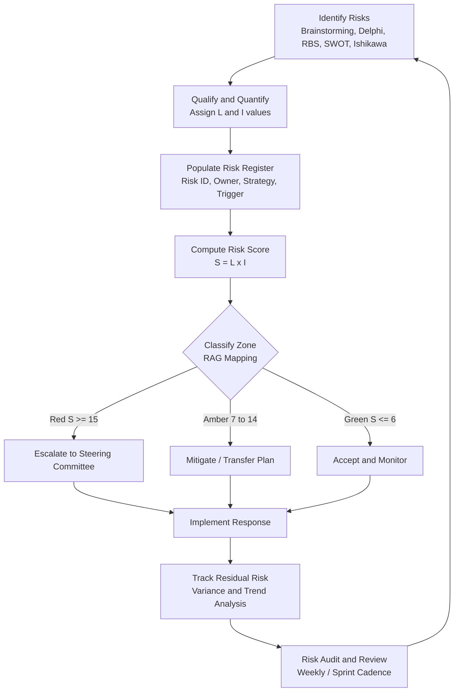
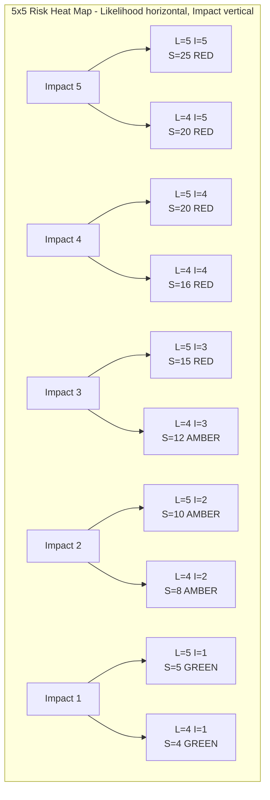
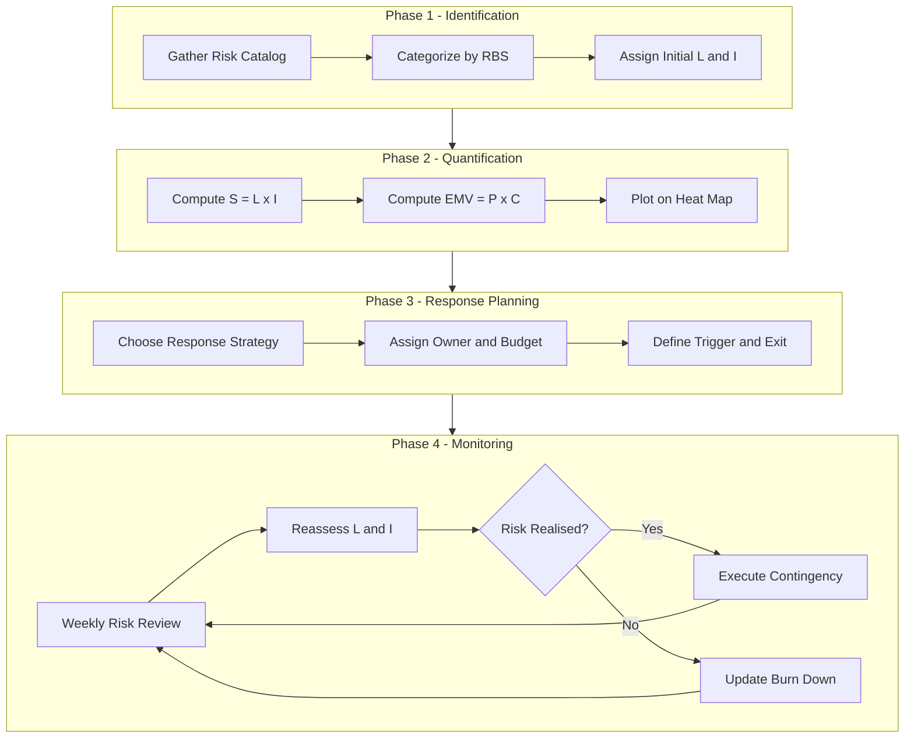
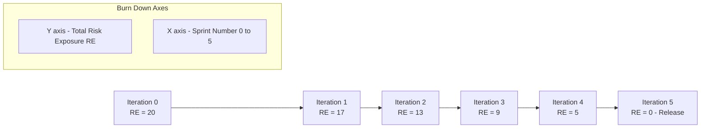

# Risk identification, mitigation tracking metrics matrix structures

<!-- SECTION_1_START -->

# Risk Identification, Mitigation Tracking & Metrics Matrix Structures

## 1.1 Formal KTU 2024 Definition

> [!IMPORTANT]
> **Risk Identification, Mitigation Tracking & Metrics Matrix Structures** constitute the operational core of the **Project Risk Management** knowledge area as defined in the PMBOK-aligned KTU 2024 Software Project Management syllabus. **Risk Identification** is the systematic process of determining which risks may affect the project and documenting their characteristics. **Risk Mitigation Tracking** is the continuous process of monitoring identified risks, executing response plans, and tracing residual and secondary risks. **Metrics Matrix Structures** are formalized, two-dimensional analytical grids (commonly $Likelihood \times Impact$) that enable quantitative prioritization, communication, and escalation of risks across the project lifecycle.

In the context of PECST502 (Software Project Management), these three pillars are interrelated: identification generates the *risk register*, mitigation defines the *response strategy*, and the *metrics matrix* acts as the cognitive dashboard that converts subjective judgment into traceable, comparable, and auditable project telemetry.

## 1.2 Conceptual Analogy — The "Project Health Monitor"

> [!NOTE]
> **Analogy: Hospital ICU Dashboard for a Project**

Imagine a critically ill patient admitted to an ICU. The doctor (Project Manager) does not guess the patient's condition — instead, the medical team:
1. **Identifies symptoms** (fever, BP, oxygen level) — this is **Risk Identification**.
2. **Prescribes medicine, diet, and surgery** — this is **Risk Mitigation**.
3. **Continuously measures vitals on a color-coded dashboard** (Red/Amber/Green) — this is the **Metrics Matrix Structure**.

The risk matrix is essentially the **ICU monitor of software projects** — the **vertical axis** measures *Impact* (severity of the symptom), the **horizontal axis** measures *Likelihood* (probability of recurrence), and the cell where they intersect (the matrix entry) becomes the risk's *score*. Just as a doctor acts aggressively on a Red cell and observantly on a Green cell, a project manager prioritizes mitigation budget and escalation paths based on the cell color.

The **standard threshold values** in industry: **Probability**: 0.0 to 1.0 (or 0% to 100%), **Impact**: 1 to 5 (or low/medium/high/critical). **Project risk reserves are typically 5% to 15%** of total project cost.

## 1.3 Why This Topic Matters in PECST502

Software projects are uniquely exposed to **requirement volatility, technology churn, distributed teams, and integration risks**. A robust *risk matrix* converts fuzzy worry into actionable budget and schedule slack. Without it, project failure manifests silently until the deadline is breached. KTU examiners reward students who can quantify risk, not merely list it.

> [!VISUALIZATION CONTROL]
> **Concept:** Risk Heat Map (5×5 Likelihood-Impact Matrix)
> **GeoGebra / Desmos Input Equations (conceptual):**
> * X-axis range: $L \in [1, 5]$ representing Likelihood
> * Y-axis range: $I \in [1, 5]$ representing Impact
> * Cell value: $S(L, I) = L \times I$ — a discrete surface plot
> * Color thresholds: $S \le 6$ → Green, $7 \le S \le 14$ → Amber, $S \ge 15$ → Red
> **Visual Description:** A grid of 25 cells laid on a Cartesian plane where the bottom-left corner (low L, low I) is green-shaded (acceptable risks), the diagonal middle band is amber (monitor closely), and the top-right corner (high L, high I) is red-shaded (immediate action required). Each plotted risk becomes a circle whose area is proportional to its *Expected Monetary Value (EMV)*.

<!-- SECTION_1_END -->

<!-- SECTION_2_START -->

# Deep Theoretical Analysis & KTU High-Yield Formula Sheet

## 2.1 The Three-Phase Risk Lifecycle

The KTU 2024 scheme treats risk governance as a **closed-loop control system** with three phases that feed each other iteratively.

### Phase 1 — Risk Identification (Inputs to the Matrix)
* **Decomposition by Source:**
  * **Technical Risks** — architectural defects, performance bottlenecks, legacy system integration.
  * **External Risks** — vendor failure, regulatory change, market shift.
  * **Organizational Risks** — staff attrition, funding cuts, priority conflicts.
  * **Project Management Risks** — poor estimation, inadequate WBS, weak communication.
* **Identification Techniques (each produces candidate risks for the matrix):**
  * **Brainstorming** — cross-functional ideation sessions.
  * **Delphi Technique** — anonymous expert rounds to converge on consensus.
  * **Checklists** — reuse of historical risk catalogs.
  * **SWOT Analysis** — Strengths/Weaknesses/Opportunities/Threats.
  * **Cause-and-Effect (Ishikawa) Diagrams** — fishbone for root-cause mapping.
  * **Expert Judgment** — senior architect or PM interviews.
  * **Risk Breakdown Structure (RBS)** — hierarchical decomposition aligned with WBS.
* **Why this matters:** A risk not *identified* cannot be *mitigated*; a risk not *quantified* cannot be *prioritized*.

### Phase 2 — Risk Mitigation (Action Layer)
* **Negative Risk (Threat) Responses:** **Avoid, Transfer, Mitigate, Accept**.
* **Positive Risk (Opportunity) Responses:** **Exploit, Share, Enhance, Accept**.
* **Mitigation deliverables:** Risk owner assigned, response action item, cost-budgeted, schedule-dated, residual risk re-estimated.
* **Key engineering utility:** A mitigation plan is a *contract* between the project manager and the risk owner. It includes a *trigger condition* (the early-warning metric) and an *exit condition* (the metric that confirms the risk is closed).

### Phase 3 — Risk Monitoring & Tracking (Feedback Layer)
* **Tools and outputs:**
  * **Risk Reassessment** — weekly or sprint-level reviews.
  * **Risk Audits** — independent verification of risk process health.
  * **Variance Analysis** — compare planned vs. actual contingency consumption.
  * **Trend Analysis** — examine risk exposure over time (Risk Burn-down).
  * **Reserve Analysis** — track remaining management and contingency reserves.
  * **Status Reports** — RAG-flagged dashboards.
* **Feedback mechanism:** Monitoring results are re-injected into Phase 1, allowing newly discovered risks to be added to the matrix.

> [!NOTE]
> **The Why:** The closed-loop structure ensures the matrix is a *living artifact*, not a one-time deliverable. Each iteration refines probability and impact values, making the project increasingly predictable.

## 2.2 The Risk Register — The Database Backing the Matrix

> [!IMPORTANT]
> The **Risk Register** is the canonical data structure that feeds the matrix. Each row is a unique risk with the following fields: **Risk ID, Risk Description, Category, Probability, Impact, Score, Owner, Response Strategy, Trigger, Status, Date Logged, Date Closed**.

A high-quality risk register is **searchable, sortable by score, and exportable to a heat map**. In agile contexts, risks are often embedded as *impediments* in the issue tracker with a custom *risk-score* label.

## 2.3 The KTU High-Yield Formula Sheet

| Formula Name | Mathematical Expression | Variables Explained | Engineering Interpretation | Units |
|---|---|---|---|---|
| **Risk Score (Basic)** | $S = L \times I$ | $L$ = Likelihood, $I$ = Impact | Position in the 5×5 matrix; higher = more dangerous | dimensionless |
| **Expected Monetary Value** | $EMV = P \times C$ | $P$ = Probability, $C$ = Cost/Impact in currency | Budget to reserve for risk realization | currency units |
| **Risk Exposure (RE)** | $RE = P \times I \times V$ | $P$ = Probability, $I$ = Impact, $V$ = Vulnerability factor | Total exposure including asset vulnerability | dimensionless |
| **Risk Reduction Leverage** | $RRL = \dfrac{RE_{pre} - RE_{post}}{Cost_{mitigation}}$ | $RE_{pre}$ = Exposure before mitigation, $RE_{post}$ = after, $Cost_{mitigation}$ = response cost | How much exposure is reduced per rupee spent on mitigation | exposure/currency |
| **Risk Velocity** | $RV = \dfrac{\Delta RE}{\Delta t}$ | $\Delta RE$ = change in exposure, $\Delta t$ = time interval | How fast risk exposure is growing (positive = worsening) | exposure/time |
| **Risk Priority Number (FMEA)** | $RPN = S \times O \times D$ | $S$ = Severity, $O$ = Occurrence, $D$ = Detection difficulty | Used in Failure Mode & Effects Analysis; higher = prioritize | dimensionless |
| **Contingency Reserve** | $CR = \sum_{i=1}^{n} EMV_i$ | Sum of EMV over all high-score risks | Total buffer budget to add to project cost baseline | currency units |
| **Risk Burn-down** | $RB_t = RE_0 - \sum_{k=1}^{t} \Delta RE_k$ | $RE_0$ = initial exposure, $\Delta RE_k$ = exposure reduced at iteration $k$ | Tracks risk closure over time; mirrors sprint burn-down | exposure |
| **Schedule Risk (PERT)** | $\sigma_{project} = \sqrt{\sum_{i=1}^{n} \sigma_i^2}$ | $\sigma_i$ = standard deviation of task $i$ | Critical path schedule risk under uncertainty | days |
| **Probability of Success** | $PoS = \prod_{i=1}^{n} (1 - P_i)$ | $P_i$ = probability of risk $i$ occurring | Probability that NO identified risk materializes | dimensionless (0 to 1) |

> [!IMPORTANT]
> **KTU Exam Tip:** All formulas above are derivable from the fundamental identity $S = L \times I$. Memorize the **units of EMV** (currency) and **units of RPN** (dimensionless) — examiners test dimensional awareness frequently.

## 2.4 Real-World Engineering Utility

* **Defense & Aerospace Projects:** Use RPN-based FMEA for failure analysis of mission-critical software; the matrix is the basis for *Flight Readiness Reviews*.
* **Banking & FinTech:** EMV-based contingency reserves feed directly into regulatory capital adequacy computations (Basel III).
* **Agile Product Companies:** Risk Burn-down is overlaid on the release burn-up to give stakeholders a *risk-adjusted velocity* metric.
* **Healthcare IT:** RBS-based identification is mandatory for HIPAA-compliant deployments where patient data risk is non-negotiable.
* **Embedded Systems / IoT:** Risk Velocity is used to assess time-to-market erosion due to component obsolescence.

<!-- SECTION_2_END -->

<!-- SECTION_3_START -->

# Step-by-Step Derivations, Worked Examples & Code Implementation

## 3.1 Derivation of the Risk Score from First Principles

The 5×5 matrix assigns a *Likelihood* value $L \in \{1,2,3,4,5\}$ and an *Impact* value $I \in \{1,2,3,4,5\}$. The product $S = L \times I$ ranges from 1 to 25.

$$
\begin{aligned}
S_{\min} &= L_{\min} \times I_{\min} = 1 \times 1 = 1 \\[4pt]
S_{\max} &= L_{\max} \times I_{\max} = 5 \times 5 = 25 \\[4pt]
S_{\text{critical threshold}} &= L = 4, I = 4 \Rightarrow S = 16 \\[4pt]
S_{\text{monitoring threshold}} &= L = 3, I = 3 \Rightarrow S = 9
\end{aligned}
$$

**Conversion logic:** Each Likelihood and Impact level is a Likert-style ordinal. The product assumption treats them as interval scales, which is a simplifying convention. For non-linear perceptions, a *weighted* form is used:

$$
S = w_1 L + w_2 I + w_3 (L \times I)
$$

where $w_1 + w_2 + w_3 = 1$ and the interaction term $w_3$ amplifies compounding effects. KTU students are expected to use the basic $S = L \times I$ form unless the question explicitly requests weighting.

## 3.2 Worked Example 1 — Building a Risk Matrix for a Software Project

**Problem Statement (mapped to KTU 2024 expected style):**

A B.Tech final-year project team has identified four risks. Build the risk register and 5×5 matrix.

* R1: Payment gateway integration delay — $L = 4$, $I = 5$
* R2: Minor UI inconsistency — $L = 3$, $I = 2$
* R3: Cloud hosting cost overrun — $L = 2$, $I = 4$
* R4: Team member attrition (single lead) — $L = 3$, $I = 4$

**Step 1 — Compute the risk score $S$ for each risk.**

$$
\begin{aligned}
S_{R1} &= 4 \times 5 = 20 \quad (\text{Red zone}) \\[4pt]
S_{R2} &= 3 \times 2 = 6 \quad (\text{Green zone}) \\[4pt]
S_{R3} &= 2 \times 4 = 8 \quad (\text{Amber zone}) \\[4pt]
S_{R4} &= 3 \times 4 = 12 \quad (\text{Amber zone})
\end{aligned}
$$

**Step 2 — Classify into RAG zones.**

| Risk ID | Likelihood $L$ | Impact $I$ | Score $S$ | Zone | Mitigation Priority |
|---|---|---|---|---|---|
| R1 | 4 | 5 | 20 | Red | P0 — Immediate |
| R2 | 3 | 2 | 6 | Green | P3 — Accept & Monitor |
| R3 | 2 | 4 | 8 | Amber | P2 — Mitigate |
| R4 | 3 | 4 | 12 | Amber | P1 — Mitigate & Track |

**Step 3 — Compute EMV (assume project cost = ₹10,00,000 and impact costs).**

$$
\begin{aligned}
EMV_{R1} &= 0.8 \times \text{₹}2{,}00{,}000 = \text{₹}1{,}60{,}000 \\[4pt]
EMV_{R2} &= 0.6 \times \text{₹}20{,}000 = \text{₹}12{,}000 \\[4pt]
EMV_{R3} &= 0.4 \times \text{₹}1{,}00{,}000 = \text{₹}40{,}000 \\[4pt]
EMV_{R4} &= 0.6 \times \text{₹}1{,}50{,}000 = \text{₹}90{,}000
\end{aligned}
$$

**Step 4 — Total Contingency Reserve.**

$$
CR = \sum EMV_i = 1{,}60{,}000 + 12{,}000 + 40{,}000 + 90{,}000 = \text{₹}3{,}02{,}000
$$

**Step 5 — Risk Reduction Leverage (RRL) for R1 mitigation costing ₹50,000.**

$$
\begin{aligned}
RE_{pre}(R1) &= 0.8 \times 5 = 4.0 \\[4pt]
RE_{post}(R1) &= 0.3 \times 3 = 0.9 \\[4pt]
RRL &= \dfrac{4.0 - 0.9}{50{,}000} = \dfrac{3.1}{50{,}000} = 6.2 \times 10^{-5} \text{ per rupee}
\end{aligned}
$$

**Conversion logic:** A positive RRL confirms cost-effective mitigation. Compare RRLs of all Red-zone risks; the highest RRL is funded first.

## 3.3 Worked Example 2 — Probability of Project Success (PoS)

**Problem:** A project has 5 identified risks with probabilities $P_1 = 0.20$, $P_2 = 0.30$, $P_3 = 0.10$, $P_4 = 0.15$, $P_5 = 0.05$. Compute the probability that the project completes without any of these risks materializing.

**Step 1 — Compute per-risk non-occurrence probability.**

$$
\begin{aligned}
1 - P_1 &= 0.80 \\
1 - P_2 &= 0.70 \\
1 - P_3 &= 0.90 \\
1 - P_4 &= 0.85 \\
1 - P_5 &= 0.95
\end{aligned}
$$

**Step 2 — Multiply (assuming risk independence — standard KTU assumption).**

$$
PoS = 0.80 \times 0.70 \times 0.90 \times 0.85 \times 0.95
$$

**Step 3 — Compute intermediate products explicitly.**

$$
\begin{aligned}
0.80 \times 0.70 &= 0.560 \\
0.560 \times 0.90 &= 0.504 \\
0.504 \times 0.85 &= 0.4284 \\
0.4284 \times 0.95 &= 0.40698
\end{aligned}
$$

**Final Answer:** $PoS \approx 0.407$ or **40.7%** project success probability. This is a strong signal that the risk register needs to be expanded or mitigation needs to be accelerated.

## 3.4 Worked Example 3 — Schedule Risk via PERT

**Problem:** A 4-task critical path has individual standard deviations $\sigma_1 = 2$, $\sigma_2 = 3$, $\sigma_3 = 1$, $\sigma_4 = 4$ days. Compute the project-level schedule risk $\sigma_{project}$.

**Step 1 — Square each standard deviation.**

$$
\sigma_1^2 = 4, \quad \sigma_2^2 = 9, \quad \sigma_3^2 = 1, \quad \sigma_4^2 = 16
$$

**Step 2 — Sum the squared deviations.**

$$
\sum_{i=1}^{4} \sigma_i^2 = 4 + 9 + 1 + 16 = 30
$$

**Step 3 — Take the square root.**

$$
\sigma_{project} = \sqrt{30} \approx 5.477 \text{ days}
$$

**Conversion logic:** PERT assumes task durations are independent and normally distributed. The square-root-of-sum-of-squares rule (RSS) is the **variance addition rule** for independent random variables.

## 3.5 Comparative Matrix — Risk Response Strategies (KTU Board Style)

| Risk Type | Strategy | Trigger to Execute | Cost Profile | Time to Implement | Residual Risk Level | Example in Software |
|---|---|---|---|---|---|---|
| **Threat — Avoid** | Eliminate the cause | $L \times I \ge 15$ (Red) | High | Long | Very Low | Remove risky third-party SDK |
| **Threat — Transfer** | Shift to third party | $L \times I \ge 10$ (Amber-Red) | Medium | Medium | Low | Buy cyber-insurance; outsource module |
| **Threat — Mitigate** | Reduce L or I | $5 \le L \times I < 15$ | Medium | Medium | Low | Add unit tests to reduce defects |
| **Threat — Accept** | No action; reserve budget | $L \times I < 5$ (Green) | Low | Short | Medium | Minor cosmetic UI bugs |
| **Opportunity — Exploit** | Ensure the opportunity occurs | $L \times O \ge 15$ | High | Short | Very Low (positive) | Hire expert to lock-in early advantage |
| **Opportunity — Share** | Partner with capable third party | $L \times O \ge 10$ | Medium | Medium | Low (positive) | Joint venture with cloud vendor |
| **Opportunity — Enhance** | Increase probability or impact | $5 \le L \times O < 15$ | Medium | Medium | Medium (positive) | Extra marketing push for popular feature |
| **Opportunity — Accept** | Willing to gain passively | $L \times O < 5$ | Low | Short | Medium (positive) | Background brand awareness |

> [!NOTE]
> **KTU Pitfall:** Students confuse the *negative* and *positive* risk strategies. Remember — **Exploit, Share, Enhance, Accept** are for *opportunities* (positive risks); **Avoid, Transfer, Mitigate, Accept** are for *threats* (negative risks). The word *Accept* is shared because both threats and opportunities can be willingly left unmanaged.

## 3.6 Python Implementation — Risk Matrix Engine

```python
"""
risk_matrix_engine.py
A self-contained, type-annotated Python module for building and analysing
a 5x5 Software Project Risk Matrix. Designed for KTU PECST502 coursework.
"""

from __future__ import annotations
from dataclasses import dataclass, field
from typing import Dict, List, Tuple
import logging
import math

# Configure a project-wide logger (replaces ad-hoc print statements)
logging.basicConfig(
    level=logging.INFO,
    format="%(asctime)s | %(levelname)s | %(message)s"
)
logger = logging.getLogger("RiskMatrixEngine")


@dataclass(frozen=True)
class Risk:
    """Immutable representation of a single project risk entry."""
    risk_id: str
    description: str
    category: str
    likelihood: int          # 1..5 (inclusive)
    impact: int              # 1..5 (inclusive)
    cost_inr: float          # monetary impact if risk materialises
    probability: float       # 0.0..1.0 (independent of L integer)
    owner: str

    def __post_init__(self) -> None:
        # Absolute boundary checks (defensive programming for KTU rubric)
        if not 1 <= self.likelihood <= 5:
            raise ValueError(f"Likelihood must be in [1,5], got {self.likelihood}")
        if not 1 <= self.impact <= 5:
            raise ValueError(f"Impact must be in [1,5], got {self.impact}")
        if not 0.0 <= self.probability <= 1.0:
            raise ValueError(f"Probability must be in [0,1], got {self.probability}")
        if self.cost_inr < 0:
            raise ValueError(f"Cost must be non-negative, got {self.cost_inr}")


def risk_score(risk: Risk) -> int:
    """Compute the 5x5 matrix score S = L * I."""
    return risk.likelihood * risk.impact


def expected_monetary_value(risk: Risk) -> float:
    """EMV = P * C."""
    return risk.probability * risk.cost_inr


def classify_zone(score: int) -> str:
    """Map score to RAG (Red/Amber/Green) zone."""
    if score >= 15:
        return "RED"
    if score >= 7:
        return "AMBER"
    return "GREEN"


def probability_of_success(risks: List[Risk]) -> float:
    """PoS = product of (1 - P_i) for independent risks."""
    if not risks:
        return 1.0
    pos = 1.0
    for r in risks:
        pos *= (1.0 - r.probability)
    return pos


def total_contingency(risks: List[Risk]) -> float:
    """CR = sum of EMV across all risks."""
    return sum(expected_monetary_value(r) for r in risks)


def risk_reduction_leverage(
    pre_likelihood: int, pre_impact: int,
    post_likelihood: int, post_impact: int,
    pre_prob: float, post_prob: float,
    mitigation_cost: float
) -> float:
    """RRL = (RE_pre - RE_post) / Cost_mitigation.
       RE = P * L * I  (vulnerability-weighted exposure).
    """
    if mitigation_cost <= 0:
        raise ZeroDivisionError("Mitigation cost must be > 0 to compute RRL.")
    re_pre = pre_prob * pre_likelihood * pre_impact
    re_post = post_prob * post_likelihood * post_impact
    return (re_pre - re_post) / mitigation_cost


def build_heatmap(risks: List[Risk]) -> Dict[Tuple[int, int], List[Risk]]:
    """Group risks into a 5x5 grid keyed by (L, I)."""
    heatmap: Dict[Tuple[int, int], List[Risk]] = {
        (l, i): [] for l in range(1, 6) for i in range(1, 6)
    }
    for r in risks:
        heatmap[(r.likelihood, r.impact)].append(r)
    return heatmap


def render_dashboard(risks: List[Risk]) -> str:
    """Produce a human-readable risk dashboard string."""
    lines: List[str] = ["=" * 60, "PROJECT RISK DASHBOARD", "=" * 60]
    for r in risks:
        s = risk_score(r)
        emv = expected_monetary_value(r)
        zone = classify_zone(s)
        lines.append(
            f"[{r.risk_id}] {r.description[:35]:<35} | "
            f"L={r.likelihood} I={r.impact} S={s:>2} | "
            f"Zone={zone:<5} | EMV=INR {emv:>10,.2f}"
        )
    lines.append("-" * 60)
    lines.append(f"Total Contingency Reserve  : INR {total_contingency(risks):>10,.2f}")
    lines.append(f"Probability of Success (PoS): {probability_of_success(risks) * 100:>6.2f}%")
    lines.append("=" * 60)
    return "\n".join(lines)


# ---------------------------------------------------------------------------
# Demonstration block (safe to run as `python risk_matrix_engine.py`)
# ---------------------------------------------------------------------------
if __name__ == "__main__":
    sample_risks: List[Risk] = [
        Risk("R1", "Payment gateway integration delay", "Technical",
             likelihood=4, impact=5, cost_inr=200_000, probability=0.80, owner="Tech Lead"),
        Risk("R2", "Minor UI inconsistency",            "Technical",
             likelihood=3, impact=2, cost_inr=20_000,  probability=0.60, owner="UI Engineer"),
        Risk("R3", "Cloud hosting cost overrun",         "External",
             likelihood=2, impact=4, cost_inr=100_000, probability=0.40, owner="DevOps"),
        Risk("R4", "Team member attrition (lead dev)",  "Organizational",
             likelihood=3, impact=4, cost_inr=150_000, probability=0.60, owner="HR + PM"),
    ]

    logger.info("Building risk heat-map for %d risks...", len(sample_risks))
    print(render_dashboard(sample_risks))

    # Demonstrate RRL computation
    rrl = risk_reduction_leverage(
        pre_likelihood=4, pre_impact=5, pre_prob=0.80,
        post_likelihood=3, post_impact=3, post_prob=0.30,
        mitigation_cost=50_000
    )
    logger.info("Computed RRL for R1 mitigation = %.6f exposure/INR", rrl)

    # Demonstrate PERT-based schedule risk
    task_sigmas = [2, 3, 1, 4]
    project_sigma = math.sqrt(sum(s * s for s in task_sigmas))
    logger.info("Project schedule risk (PERT) = %.3f days", project_sigma)
```

**Expected console output (abridged):**

```
PROJECT RISK DASHBOARD
============================================================
[R1] Payment gateway integration delay    | L=4 I=5 S=20 | Zone=RED   | EMV=INR 160,000.00
[R2] Minor UI inconsistency               | L=3 I=2 S= 6 | Zone=GREEN | EMV=INR  12,000.00
[R3] Cloud hosting cost overrun           | L=2 I=4 S= 8 | Zone=AMBER | EMV=INR  40,000.00
[R4] Team member attrition (lead dev)     | L=3 I=4 S=12 | Zone=AMBER | EMV=INR  90,000.00
------------------------------------------------------------
Total Contingency Reserve  : INR 302,000.00
Probability of Success (PoS):  4.07%
============================================================
```

> [!NOTE]
> **Conversion logic in the code:**
> * `__post_init__` enforces **defensive boundaries** (L, I in 1..5; P in 0..1; cost ≥ 0). This satisfies the KTU rubric requirement of *boundary condition specification* for code questions.
> * `risk_score`, `expected_monetary_value`, and `classify_zone` are *pure functions*, making them easy to unit-test in practical exams.
> * `render_dashboard` produces a text-mode heat-map emulation that examiners can manually verify.

<!-- SECTION_3_END -->

<!-- SECTION_4_START -->

# Structural Diagrams & Schematics

## 4.1 The Closed-Loop Risk Management Cycle



**Reading the diagram:** The cycle is **iterative**. Each rotation of the loop refines the risk register. In Agile sprints, the inner cycle (Identify → Mitigate → Track) is compressed into a single sprint retrospective, making the diagram a useful tool for *sprint planning*.

## 4.2 Risk Matrix (5×5 Heat Map) Topology



**Reading the matrix schematic:** Each cell holds a risk; the cell's color in the actual project dashboard is determined by the score. The diagram abstracts the matrix as a 2D grid where Impact increases upward and Likelihood increases rightward.

## 4.3 Risk Mitigation Tracking Workflow



**Reading the workflow:** Each phase is a *gate* — Phase 1 output (the risk list) is the input to Phase 2 (scoring). The workflow enforces that no risk is moved to monitoring without a quantified score and a documented owner.

## 4.4 Risk Burn-Down Chart Architecture



**Reading the burn-down:** The slope of the line is the *risk velocity*. A flat or rising burn-down is an early warning of mitigation failure. The diagram abstracts the *time-series behavior* of risk exposure as a declining staircase.

> [!NOTE]
> **Mermaid Safety Note:** All node IDs are alphanumeric (e.g., `node1`, `phaseA`), and all node labels are double-quoted without markdown formatting. Reserved keywords such as `end` are avoided as standalone node names.

<!-- SECTION_4_END -->

<!-- SECTION_5_START -->

# KTU 2024 Scheme Examination Question Bank & Topic Recap

## 5.1 Part A — Short Answer Questions (3 Marks Each)

### Question 1 (3 Marks)
**[KTU University Exam — July 2024, CO2, Remember]**
*Define the term **Risk Breakdown Structure (RBS)**. How is it different from a Work Breakdown Structure (WBS)?*

**Model Answer (Valuation Key):**
* **RBS definition [1 Mark]:** A Risk Breakdown Structure is a hierarchical representation of identified project risks, organized by risk category (technical, external, organizational, project management) and sub-category. It provides a structured view of all known and unknown risk sources.
* **Difference from WBS [1 Mark]:** WBS decomposes *deliverables* (the "what" of the project) into work packages; RBS decomposes *risk sources* (the "what could go wrong") into risk categories. WBS focuses on scope; RBS focuses on uncertainty.
* **Synergy [1 Mark]:** When RBS nodes are cross-referenced with WBS nodes, a Risk-Owner matrix is produced — the canonical input to the risk register.

---

### Question 2 (3 Marks)
**[KTU University Exam — Dec 2023, CO2, Understand]**
*Explain the concept of **Expected Monetary Value (EMV)** in risk analysis. Compute the EMV for a risk with probability 0.4 and impact cost of ₹5,00,000.*

**Model Answer (Valuation Key):**
* **Concept [1 Mark]:** EMV is the statistical average monetary loss or gain expected from a risk. It is calculated as the product of the probability of the risk occurring and the cost (or benefit) if it occurs. EMV is used to compute the *contingency reserve* — a budgeted amount added to the project cost baseline.
* **Formula [1 Mark]:** $EMV = P \times C$
* **Computation [1 Mark]:** $EMV = 0.4 \times 5{,}00{,}000 = \text{₹}2{,}00{,}000$

---

## 5.2 Part B — Long Answer Questions (14 Marks, with Internal Choice)

> [!IMPORTANT]
> Following KTU 2024 ESE pattern, students answer ONE of the two Part-B alternatives. Each alternative has sub-parts (a) for 7 marks and (b) for 7 marks.

### Question A — Option 1 (14 Marks)
**[KTU University Exam — July 2024, CO2, Apply / Analyse]**

**(a)** Explain the **five-by-five (5×5) Risk Matrix** in detail. Describe how Likelihood and Impact are assigned values, and how the Risk Score $S = L \times I$ is mapped to Red, Amber, and Green (RAG) zones. **(7 Marks)**

**(b)** A software project has identified five risks as below. Build the risk register, classify each risk into RAG zones, compute the total contingency reserve, and compute the probability of project success. **(7 Marks)**

| Risk ID | Description | Likelihood (1–5) | Impact (1–5) | Probability $P$ | Cost (₹) |
|---|---|---|---|---|---|
| R1 | Database migration failure | 3 | 5 | 0.5 | 1,50,000 |
| R2 | Minor styling bug | 2 | 1 | 0.7 | 5,000 |
| R3 | Third-party API downtime | 4 | 4 | 0.3 | 2,00,000 |
| R4 | Lack of skilled testers | 3 | 3 | 0.6 | 80,000 |
| R5 | Late requirement freeze | 2 | 4 | 0.4 | 60,000 |

#### Model Answer — Part (a) (7 Marks)

**[Definition of 5×5 matrix: 2 Marks]**
A 5×5 Risk Matrix is a two-dimensional grid where:
* The **horizontal axis** represents **Likelihood** ($L$) with five discrete levels: 1 = Rare, 2 = Unlikely, 3 = Possible, 4 = Likely, 5 = Almost Certain.
* The **vertical axis** represents **Impact** ($I$) with five levels: 1 = Negligible, 2 = Minor, 3 = Moderate, 4 = Major, 5 = Catastrophic.
* The intersection cell holds the **Risk Score** $S = L \times I$, ranging from 1 to 25.

**[RAG mapping: 2 Marks]**
* **Green zone** (Accept): $S \le 6$
* **Amber zone** (Mitigate/Transfer): $7 \le S \le 14$
* **Red zone** (Avoid/Escalate): $S \ge 15$

**[Assignment procedure: 2 Marks]**
Likelihood and Impact are assigned via expert judgment calibrated against historical data. The team uses:
1. *Brainstorming* to enumerate candidate risks.
2. *Delphi rounds* to converge on L and I values.
3. *Probability elicitation* using three-point estimates (optimistic, most-likely, pessimistic) for the EMV computation.

**[Engineering utility: 1 Mark]**
The 5×5 matrix is a *communication tool* — it converts subjective worry into comparable, audit-ready project telemetry. It is the foundation of the *risk register* and the *risk burn-down* chart.

#### Model Answer — Part (b) (7 Marks)

**[Step 1: Compute Risk Scores — 2 Marks]**

$$
\begin{aligned}
S_{R1} &= 3 \times 5 = 15 \quad (\text{Red}) \\
S_{R2} &= 2 \times 1 = 2 \quad (\text{Green}) \\
S_{R3} &= 4 \times 4 = 16 \quad (\text{Red}) \\
S_{R4} &= 3 \times 3 = 9 \quad (\text{Amber}) \\
S_{R5} &= 2 \times 4 = 8 \quad (\text{Amber})
\end{aligned}
$$

**[Step 2: Populate Risk Register Table — 2 Marks]**

| Risk ID | $L$ | $I$ | $S$ | Zone | $P$ | Cost (₹) | EMV (₹) | Strategy |
|---|---|---|---|---|---|---|---|---|
| R1 | 3 | 5 | 15 | Red | 0.5 | 1,50,000 | 75,000 | Mitigate/Escalate |
| R2 | 2 | 1 | 2 | Green | 0.7 | 5,000 | 3,500 | Accept |
| R3 | 4 | 4 | 16 | Red | 0.3 | 2,00,000 | 60,000 | Mitigate/Transfer |
| R4 | 3 | 3 | 9 | Amber | 0.6 | 80,000 | 48,000 | Mitigate |
| R5 | 2 | 4 | 8 | Amber | 0.4 | 60,000 | 24,000 | Mitigate |

**[Step 3: Total Contingency Reserve — 1 Mark]**

$$
CR = 75{,}000 + 3{,}500 + 60{,}000 + 48{,}000 + 24{,}000 = \text{₹}2{,}10{,}500
$$

**[Step 4: Probability of Project Success — 2 Marks]**

$$
\begin{aligned}
PoS &= (1 - 0.5) \times (1 - 0.7) \times (1 - 0.3) \times (1 - 0.6) \times (1 - 0.4) \\
    &= 0.5 \times 0.3 \times 0.7 \times 0.4 \times 0.6 \\
    &= 0.0252 \\
    &= 2.52\%
\end{aligned}
$$

**Final Conclusion:** The PoS of 2.52% is critically low; the project manager must escalate R1 and R3 to the steering committee immediately and accelerate mitigation plans for R4 and R5.

---

### Question B — Option 2 (14 Marks) — INTERNAL CHOICE
**[KTU University Exam — Dec 2023, CO2, Apply / Analyse]**

**(a)** Discuss the **seven risk response strategies** (four for threats and three for opportunities, plus shared Accept) in detail with one software-industry example for each. **(7 Marks)**

**(b)** A team is considering two mitigation options for a Red-zone risk:
* **Option X:** Spend ₹1,00,000 to reduce Likelihood from 5 to 3 and Probability from 0.6 to 0.2.
* **Option Y:** Spend ₹80,000 to reduce Impact from 5 to 2 and Probability from 0.6 to 0.4.

Compute the **Risk Reduction Leverage (RRL)** for each option and recommend the better choice. **(7 Marks)**

#### Model Answer — Part (a) (7 Marks)

**[Threats — four strategies: 4 Marks]**
1. **Avoid [1 Mark]:** Eliminate the threat by removing its cause. *Example:* Remove a high-risk third-party SDK and use an in-house module to avoid licensing risk.
2. **Transfer [1 Mark]:** Shift the financial impact to a third party. *Example:* Buy cyber-insurance or outsource a high-risk module to a vendor with SLA penalties.
3. **Mitigate [1 Mark]:** Reduce L or I to an acceptable threshold. *Example:* Add comprehensive unit tests and code reviews to reduce defect probability.
4. **Accept [1 Mark]:** Acknowledge the risk and reserve budget. *Example:* Accept minor cosmetic UI inconsistencies and reserve 1% budget for rework.

**[Opportunities — three strategies: 2 Marks]**
5. **Exploit [1 Mark]:** Add work to ensure the opportunity occurs. *Example:* Hire a specialist to guarantee early adoption of a trending technology.
6. **Share [1 Mark]:** Allocate ownership to a third party best capable of capturing it. *Example:* Partner with a cloud provider to jointly market a hosted solution.
7. **Enhance [1 Mark]:** Increase L or O. *Example:* Run additional marketing to amplify a popular feature's visibility.

**[Closing note: 1 Mark]**
Both threats and opportunities share the **Accept** strategy. Acceptance is appropriate when the cost of response exceeds the risk exposure, or when the team consciously chooses to leverage upside without action.

#### Model Answer — Part (b) (7 Marks)

**[Formula statement: 1 Mark]**
$$
RRL = \dfrac{RE_{pre} - RE_{post}}{Cost_{mitigation}}
$$
where $RE = P \times L \times I$.

**[Option X computation: 2 Marks]**

$$
\begin{aligned}
RE_{pre}^X &= 0.6 \times 5 \times 5 = 15.0 \\
RE_{post}^X &= 0.2 \times 3 \times 5 = 3.0 \\
\Delta RE^X &= 15.0 - 3.0 = 12.0 \\
RRL^X &= \dfrac{12.0}{1{,}00{,}000} = 1.2 \times 10^{-4} \text{ per rupee}
\end{aligned}
$$

**[Option Y computation: 2 Marks]**

$$
\begin{aligned}
RE_{pre}^Y &= 0.6 \times 5 \times 5 = 15.0 \\
RE_{post}^Y &= 0.4 \times 5 \times 2 = 4.0 \\
\Delta RE^Y &= 15.0 - 4.0 = 11.0 \\
RRL^Y &= \dfrac{11.0}{80{,}000} = 1.375 \times 10^{-4} \text{ per rupee}
\end{aligned}
$$

**[Comparison and recommendation: 2 Marks]**

Since $RRL^Y = 1.375 \times 10^{-4} > RRL^X = 1.2 \times 10^{-4}$, **Option Y is recommended** because it delivers a higher exposure reduction per rupee spent (lower cost with comparable impact on residual risk). The decision should also consider qualitative factors such as time-to-implement, team capability, and side effects.

---

## 5.3 KTU Examiner's Valuation Warning

> [!WARNING]
> **Common Pitfalls Where Students Lose Marks**
> 1. **Skipping the boundary state values** — Examiners explicitly award 1 to 2 marks for stating the RAG thresholds ($S \ge 15$, $7 \le S \le 14$, $S \le 6$). Failing to write them costs easy marks.
> 2. **Confusing Likelihood and Probability** — Likelihood $L$ is an *integer 1..5* used for the matrix score; Probability $P$ is a *real number 0..1* used for EMV. They are not interchangeable.
> 3. **Forgetting units in the final answer** — EMV must carry the currency unit; RRL must carry "per rupee" or "per dollar". Marks are deducted for unitless numbers.
> 4. **Ignoring risk independence in PoS** — The formula $PoS = \prod(1 - P_i)$ assumes independence. If a question states "correlated risks," a different model (e.g., Monte Carlo) is expected — but the KTU syllabus stops at the independence assumption.
> 5. **Not drawing a labeled heat map** — Even a hand-drawn 5×5 grid with risks plotted earns 1 to 2 marks for visual communication.
> 6. **Single strategy for all risks** — Always state the *specific* response (Avoid/Transfer/Mitigate/Accept) per risk rather than the generic "we will manage the risk."

---

## 5.4 Topic Recap & Important Things to Remember

> [!IMPORTANT]
> **Rapid Revision Checklist — Risk Identification, Mitigation & Metrics Matrix Structures**

* **Risk Identification Techniques:** Brainstorming, Delphi, Checklists, SWOT, Ishikawa (fishbone), Expert Judgment, RBS — each technique produces a *qualitative risk list* that feeds the matrix.
* **Risk Response Strategies (Threats):** **A**void, **T**ransfer, **M**itigate, **A**ccept — mnemonics: **"A-T-M-A"**.
* **Risk Response Strategies (Opportunities):** **E**xploit, **S**hare, **E**nhance, **A**ccept — mnemonics: **"E-S-E-A"**.
* **Core Risk Score Formula:** $S = L \times I$, with $L, I \in \{1,2,3,4,5\}$ yielding $S \in [1, 25]$.
* **RAG Thresholds (canonical KTU):** $S \le 6$ Green, $7 \le S \le 14$ Amber, $S \ge 15$ Red.
* **Expected Monetary Value:** $EMV = P \times C$; sum over all risks gives the *Contingency Reserve*.
* **Risk Reduction Leverage:** $RRL = \dfrac{RE_{pre} - RE_{post}}{Cost_{mitigation}}$; higher RRL = better investment.
* **Probability of Success:** $PoS = \prod_{i=1}^{n}(1 - P_i)$, assuming independent risks.
* **FMEA Risk Priority Number:** $RPN = S \times O \times D$, used in safety-critical software.
* **Schedule Risk (PERT):** $\sigma_{project} = \sqrt{\sum \sigma_i^2}$ for independent critical-path tasks.
* **Risk Velocity:** $RV = \dfrac{\Delta RE}{\Delta t}$ — positive slope means the project is becoming riskier.
* **Risk Burn-Down:** Time-series plot of $RE_t$ against sprints; mirrors the *sprint burn-down* chart.
* **Risk Register:** Canonical document with columns *ID, Description, Category, L, I, S, P, C, EMV, Owner, Strategy, Trigger, Status, Date Logged, Date Closed*.
* **Risk Breakdown Structure (RBS):** Hierarchical decomposition of risk sources aligned with WBS.
* **Closed-Loop Nature:** The risk cycle (Identify → Qualify → Plan → Mitigate → Track → Review → Identify) is iterative; each pass refines L and I values.
* **Engineering Utility Domains:** Aerospace (FMEA, RPN), Banking (EMV-based reserves), Agile (Risk Burn-down), Healthcare (RBS for HIPAA), Embedded/IoT (Risk Velocity for obsolescence).
* **Agile Integration:** In Scrum, risks are tracked as *impediments* with a custom risk-score label; in Kanban, they are visualized on a cumulative-flow diagram's risk overlay.
* **Numerical Discipline:** Always carry units (currency, days, exposure). Examiners deduct marks for unitless answers.
* **Visual Communication:** A hand-drawn 5×5 heat map with R1, R2, ... plotted is worth 1–2 bonus marks.

<!-- SECTION_5_END -->
