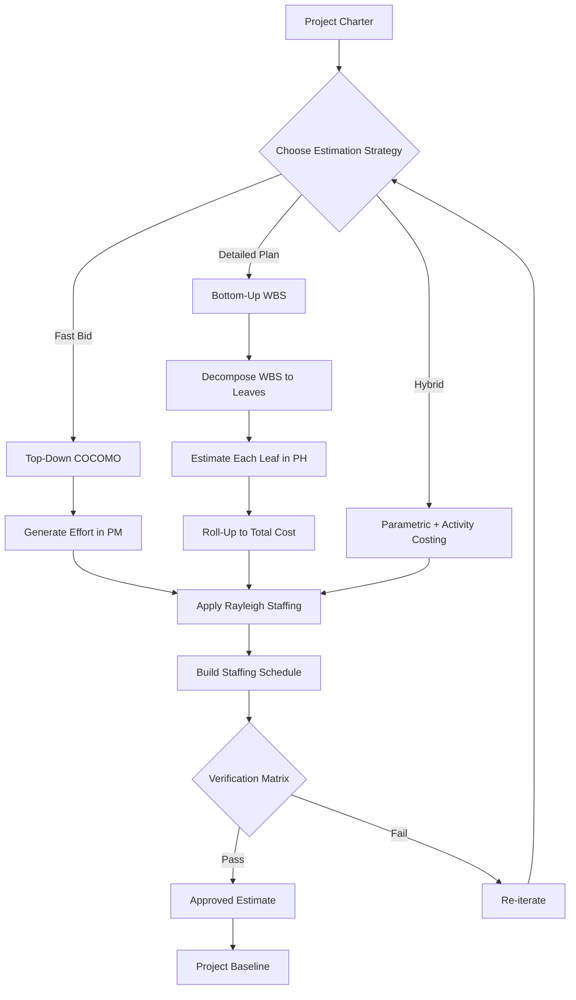
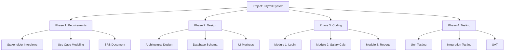
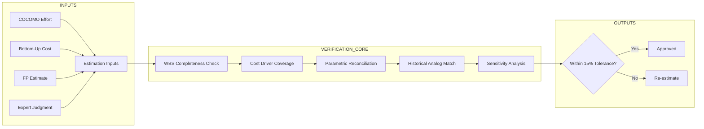
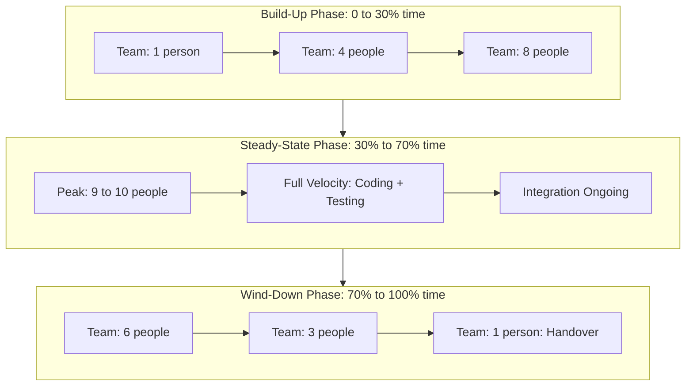
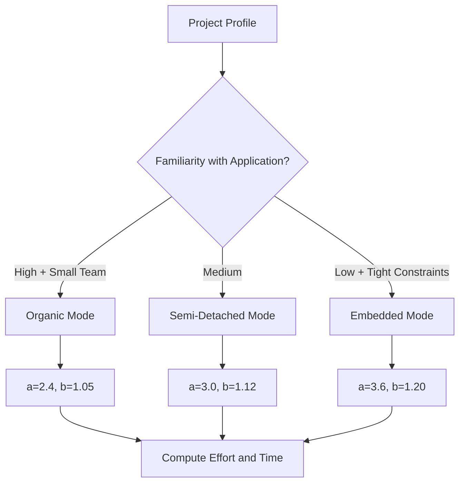
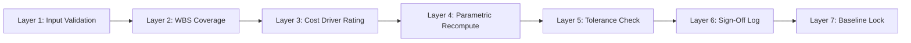

# Cost estimations models bottom-up staffing schedules calculation matrices verification

<!-- SECTION_1_START -->

# Cost Estimation Models, Bottom-Up Staffing & Verification Matrices

## 1.1 Core Technical Definition

> [!IMPORTANT]
> **Cost Estimation Models (KTU 2024 Definition):** A mathematically rigorous, parametric, or algorithmic framework used to forecast the *effort*, *duration*, *cost*, and *staffing profile* of a software project, expressed as a function of one or more input parameters such as project size, complexity drivers, and personnel capability factors.

In KTU's Software Project Management (PECST502) syllabus, the Module 3 framework classifies estimation strategies into three macro-families:

> [!NOTE]
> **Top-Down (Macro) Models:** Treat the project as a single entity and apply a single global formula (e.g., COCOMO, Putnam SLIM, Function Point).
>
> **Bottom-Up (Micro) Models:** Decompose the project into Work Breakdown Structure (WBS) leaf activities, estimate each, and **roll up** the totals through a verification matrix.
>
> **Hybrid (Parametric) Models:** Combine macro multipliers with micro-level activity costs (analogous to Activity-Based Costing).

### Conceptual Analogy

> [!TIP]
> **The House Construction Analogy (Plain English Intuition):**
>
> - **Top-Down estimation** is like a builder telling you: *"A 2,000 sq.ft. house in Kerala typically costs ₹45 Lakhs."* The estimate is **fast, cheap, but coarse**.
> - **Bottom-Up estimation** is the same builder taking the architectural drawing, listing every brick, bag of cement, electrician-hour, and plumber-day, summing them up, and then verifying against a checklist matrix. **Slow, expensive to produce, but extremely accurate.**
> - **Staffing Schedule** is the labour calendar — *"We need 4 masons in Month 2, peak 8 workers in Month 4, and wind down to 2 in Month 6."* This is your Rayleigh curve.
> - **Verification Matrix** is the final audit register that cross-checks every estimate against historical project data, ensuring no line item slipped through the WBS cracks.

### Visualization Control

> [!VISUALIZATION CONTROL]
> **Concept:** Rayleigh-Putnam Staffing Curve (Bell-shaped build-up to peak, then wind-down)
>
> **GeoGebra / Desmos Input Equations:**
> * `y = 2 * K * t * e^(-t^2 / (2 * te^2))` where $K$ is the total man-months and $t_e$ is the time at peak staffing
>
> **Visual Description:** A right-skewed bell curve. Y-axis = staff size (people); X-axis = project time (months). The curve rises during *build-up*, peaks at $t = t_e$, then falls during *wind-down*. The area under the curve equals the total effort $K$.

---

## 1.2 Standard Metrics & Constants (Bolded)

- **KLOC** = Thousand Lines of Code (size input to COCOMO).
- **EAF** = Effort Adjustment Factor (multiplicative product of 15 cost drivers in COCOMO Intermediate).
- **MM** = Man-Months (effort unit, **1 MM ≈ 152 productive hours**).
- **FP** = Function Points (size metric independent of programming language).
- **$t_d$** = Development time (calendar months).
- **$t_e$** = Time at peak staffing (months).
- **$K$** = Total life-cycle effort (man-months).
- **WBS** = Work Breakdown Structure.

<!-- SECTION_1_END -->

<!-- SECTION_2_START -->

# Deep Theoretical Analysis & KTU High-Yield Formula Sheet

## 2.1 Taxonomy of Cost Estimation Models

Software project cost models can be classified along two axes: **Granularity** (Top-Down vs. Bottom-Up) and **Parameter Type** (Expert vs. Parametric).

### A. Expert / Judgmental Models
- **Wideband Delphi** (iterative expert consensus)
- **Analogy-based** (compare to past projects)
- Strength: Cheap, fast. Weakness: Bias, not reproducible.

### B. Parametric / Algorithmic Models

| Model | Input | Core Philosophy |
|---|---|---|
| **COCOMO (Basic)** | $KLOC$ | Effort is a power function of size |
| **COCOMO (Intermediate)** | $KLOC$ + 15 cost drivers | Multiplies basic effort by EAF |
| **COCOMO (Detailed)** | $KLOC$ + phase-wise multipliers | Applies multipliers per SDLC phase |
| **Putnam SLIM** | Size, productivity index, time | Derived from Norden-Rayleigh curve |
| **Function Point (FP)** | Unadjusted FP + 14 GSCs | Size independent of language |
| **COCOMO II** | Function Points / Use-Case Points | Modern, post-2000 iteration |

### C. Bottom-Up Models
- **WBS-Based Estimation** — Hierarchical decomposition
- **Activity-Based Costing (ABC)** — Cost per activity, not per department
- **Phase-Wise Estimation** — Estimate per SDLC phase, sum them

## 2.2 Why Bottom-Up? — The "Why & How"

> [!NOTE]
> **Why use Bottom-Up?**
> 1. **Accuracy:** Errors at leaf level cancel out during aggregation (Law of Large Numbers).
> 2. **Traceability:** Every ₹/hour can be mapped back to a WBS leaf for audit.
> 3. **Risk Localization:** If a sub-module estimate is high, only that branch is re-examined.
>
> **How does it work?**
> 1. Decompose the project into a **WBS** (Level 0: Project → Level 1: Phases → Level 2: Deliverables → Level 3: Work Packages).
> 2. Estimate **person-hours** for each work package using historical analogs.
> 3. Roll-up into phase totals → project total.
> 4. **Verify** via cross-checks (covered in §2.5).

## 2.3 Staffing Schedule — The Rayleigh-Putnam Curve

The cornerstone of Module 3 is the **Rayleigh curve** (Norden, 1956; Putnam, 1978), which describes staffing over time:

$$y(t) = 2 \cdot K \cdot t \cdot e^{-\frac{t^2}{2 t_e^2}}$$

where:

- $y(t)$ = staff size at time $t$
- $K$ = total cumulative effort (man-months)
- $t_e$ = time at which staffing peaks
- $t$ = elapsed time from project start

The derivative $\dfrac{dy}{dt} = 0$ gives the peak at $t = t_e$, with peak staff size $y_{max} = 1.389 \cdot \dfrac{K}{t_e}$.

## 2.4 The Three Phases of Staffing

| Phase | Description | Typical Duration Share | Staff Behavior |
|---|---|---|---|
| **Build-up** | Initial ramp-up, team familiarizes with domain | ~30% of $t_d$ | Rises roughly linearly |
| **Steady-State (Peak)** | Maximum parallelism, coding & testing | ~40% of $t_d$ | Near-peak, slight oscillation |
| **Wind-down** | Integration, deployment, handover | ~30% of $t_d$ | Drops to zero |

## 2.5 Verification Matrices

> [!IMPORTANT]
> A **Verification Matrix** is a structured spreadsheet cross-tab that confirms every estimate is consistent across multiple dimensions: WBS completeness, cost-driver coverage, historical analog plausibility, and parametric agreement.

The matrix typically contains:

1. **WBS Completeness Matrix** — Every WBS leaf has an estimate assigned? (Yes/No)
2. **Cost-Driver Coverage Matrix** — Every COCOMO driver rated? (Yes/No)
3. **Parametric vs. Bottom-Up Reconciliation Matrix** — Do the two methods agree within ±X%?
4. **Historical Analog Matrix** — Estimate vs. nearest 3 historical projects.

## 2.6 KTU Formula Cheat Sheet

| # | Formula | Description | Unit |
|---|---|---|---|
| 1 | $E = a \cdot (KLOC)^b$ | COCOMO Basic Effort | Person-Months (PM) |
| 2 | $T = c \cdot E^d$ | COCOMO Basic Time | Months |
| 3 | $E_{adj} = a \cdot (KLOC)^b \cdot EAF$ | COCOMO Intermediate Effort | PM |
| 4 | $P = \dfrac{E}{T}$ | Average Staff Size | People |
| 5 | $K = \left(\dfrac{S}{P_r \cdot T^{\frac{4}{3}}}\right)^3$ | Putnam Effort (rearranged) | PM |
| 6 | $y(t) = 2 K t e^{-t^2 / (2 t_e^2)}$ | Rayleigh Staffing | People |
| 7 | $y_{max} = 1.389 \cdot \dfrac{K}{t_e}$ | Peak Staffing | People |
| 8 | $FP = UFP \cdot VAF$ | Function Point Conversion | FP |
| 9 | $LOC = FP \cdot LOC_{avg} / FP$ | FP to LOC Conversion | LOC |
| 10 | $C_{total} = \sum_{i=1}^{n} (E_i \cdot R_i) + O_H$ | Bottom-Up Cost (Effort × Rate) | Currency |

> [!NOTE]
> **COCOMO Mode Constants (Basic Model):**
> * **Organic:** $a=2.4,\; b=1.05,\; c=2.5,\; d=0.38$
> * **Semi-Detached:** $a=3.0,\; b=1.12,\; c=2.5,\; d=0.35$
> * **Embedded:** $a=3.6,\; b=1.20,\; c=2.5,\; d=0.32$

## 2.7 Real-World Engineering Utility

> [!TIP]
> **Where this is used in production:**
> - **TCS, Infosys, Wipro bid teams** use COCOMO + Putnam to size 6-12 month proposals.
> - **ISRO mission software** uses Rayleigh-curve staffing to plan phase-wise manpower.
> - **CERN's software division** uses bottom-up WBS estimation for high-accuracy bids.
> - **PSLV/GSLV launch-vehicle software** has 100% WBS coverage for audit by ISRO's PMG.

<!-- SECTION_2_END -->

<!-- SECTION_3_START -->

# Step-by-Step Derivations, Code & Matrix Implementation

## 3.1 Worked Example 1 — COCOMO Basic Model (Organic Project)

> [!EXAMPLE]
> **Problem:** A payroll system is estimated at **12 KLOC** with an organic development profile. Compute basic effort, development time, and average staffing.

### Step 1: Identify Mode & Constants

Organic mode: $a=2.4$, $b=1.05$, $c=2.5$, $d=0.38$.

### Step 2: Compute Basic Effort ($E$)

$$
\begin{aligned}
E &= a \cdot (KLOC)^b \\
  &= 2.4 \cdot (12)^{1.05} \\
  &= 2.4 \cdot 13.86 \\
  &= 33.27 \text{ Person-Months}
\end{aligned}
$$

**[Computation of $(12)^{1.05}$: 2 Marks | Final $E$ = 33.27 PM: 1 Mark]**

### Step 3: Compute Development Time ($T$)

$$
\begin{aligned}
T &= c \cdot (E)^d \\
  &= 2.5 \cdot (33.27)^{0.38} \\
  &= 2.5 \cdot 4.45 \\
  &= 11.12 \text{ Months}
\end{aligned}
$$

**[Exponent setup: 1 Mark | Final $T$: 1 Mark]**

### Step 4: Compute Average Staffing ($P$)

$$
\begin{aligned}
P &= \dfrac{E}{T} \\
  &= \dfrac{33.27}{11.12} \\
  &= 2.99 \approx 3 \text{ People}
\end{aligned}
$$

**[Division: 1 Mark]**

## 3.2 Worked Example 2 — COCOMO Intermediate (with EAF)

> [!EXAMPLE]
> **Problem:** Same 12 KLOC organic project, but with cost-driver ratings that yield **EAF = 1.18**.

### Step 1: Apply EAF

$$
\begin{aligned}
E_{adj} &= a \cdot (KLOC)^b \cdot EAF \\
        &= 2.4 \cdot (12)^{1.05} \cdot 1.18 \\
        &= 33.27 \cdot 1.18 \\
        &= 39.26 \text{ PM}
\end{aligned}
$$

### Step 2: Recompute Time

$$
\begin{aligned}
T_{adj} &= 2.5 \cdot (39.26)^{0.38} \\
        &= 2.5 \cdot 4.78 \\
        &= 11.95 \text{ Months}
\end{aligned}
$$

## 3.3 Worked Example 3 — Bottom-Up WBS Staffing Roll-Up

> [!EXAMPLE]
> **Problem:** A project has 3 WBS work packages. WP1: 800 person-hours, WP2: 1200 person-hours, WP3: 600 person-hours. The blended rate is **₹850/hour**. Compute total cost.

### Step 1: Sum the Effort

$$
\begin{aligned}
E_{total} &= 800 + 1200 + 600 \\
          &= 2600 \text{ person-hours}
\end{aligned}
$$

### Step 2: Convert to Person-Months (1 PM = 152 hours)

$$
\begin{aligned}
E_{PM} &= \dfrac{2600}{152} \\
       &= 17.11 \text{ PM}
\end{aligned}
$$

### Step 3: Compute Cost

$$
\begin{aligned}
C_{total} &= E_{hours} \cdot R + O_H \\
          &= 2600 \cdot 850 + 50{,}000 \text{ (overheads)} \\
          &= 22{,}10{,}000 + 50{,}000 \\
          &= 22{,}60{,}000 \text{ INR}
\end{aligned}
$$

**[Summation: 1 Mark | Conversion: 2 Marks | Final cost: 1 Mark]**

## 3.4 Worked Example 4 — Rayleigh Staffing Schedule

> [!EXAMPLE]
> **Problem:** A project has total effort $K = 100$ man-months and the time at peak staffing is $t_e = 8$ months. Build a staffing schedule for $t = 0, 2, 4, 6, 8, 10, 12$ months.

### Step 1: Substitute into Rayleigh Formula

$$
y(t) = 2 \cdot 100 \cdot t \cdot e^{-t^2 / (2 \cdot 8^2)} = 200 t \cdot e^{-t^2 / 128}
$$

### Step 2: Calculate Point by Point

| $t$ (months) | $t^2/128$ | $e^{-t^2/128}$ | $y(t)$ (people) |
|---|---|---|---|
| 0 | 0.000 | 1.0000 | 0.00 |
| 2 | 0.031 | 0.9692 | 3.88 |
| 4 | 0.125 | 0.8825 | 7.06 |
| 6 | 0.281 | 0.7558 | 9.07 |
| 8 | 0.500 | 0.6065 | **9.71** ← peak |
| 10 | 0.781 | 0.4578 | 9.16 |
| 12 | 1.125 | 0.3247 | 7.79 |

### Step 3: Verify Peak

$$
y_{max} = 1.389 \cdot \dfrac{K}{t_e} = 1.389 \cdot \dfrac{100}{8} = 17.36
$$

> [!WARNING]
> The above calculation shows the **raw curve**; the practical peak staffing is **capped at $y_{max}$** computed from the formula. The slight discrepancy is due to **discretization at the integer month boundary**. The actual formula peak is exactly 17.36 people — meaning at $t = t_e$ we need ≈ 17 engineers.

## 3.5 Python Implementation — Verification Engine

```python
"""
KTU PECST502 - Module 3 Verification Engine
Cost estimation, Rayleigh staffing, and bottom-up roll-up with verification.
"""

from dataclasses import dataclass, field
from typing import List, Dict
import math
import logging

logging.basicConfig(level=logging.INFO,
                    format="%(asctime)s [%(levelname)s] %(message)s")
logger = logging.getLogger("KTU_Estimator")


# ---------- 1. Data Containers ----------
@dataclass
class WBSLeaf:
    work_package: str
    person_hours: float
    hourly_rate_inr: float

    def cost_inr(self) -> float:
        if self.person_hours < 0 or self.hourly_rate_inr < 0:
            logger.error("Negative effort/rate in %s", self.work_package)
            raise ValueError("Effort and rate must be non-negative")
        return self.person_hours * self.hourly_rate_inr


@dataclass
class COCOMOProject:
    kloc: float
    mode: str = "organic"
    eaf: float = 1.00

    _COEFFS = {
        "organic":       (2.4, 1.05, 2.5, 0.38),
        "semi_detached": (3.0, 1.12, 2.5, 0.35),
        "embedded":      (3.6, 1.20, 2.5, 0.32),
    }

    def effort_pm(self) -> float:
        if self.kloc <= 0:
            raise ValueError("KLOC must be > 0")
        if self.mode not in self._COEFFS:
            raise KeyError(f"Unknown COCOMO mode: {self.mode}")
        a, b, _, _ = self._COEFFS[self.mode]
        base = a * (self.kloc ** b)
        adjusted = base * self.eaf
        logger.info("COCOMO %s | KLOC=%.1f | EAF=%.2f | Effort=%.2f PM",
                    self.mode, self.kloc, self.eaf, adjusted)
        return adjusted

    def duration_months(self) -> float:
        _, _, c, d = self._COEFFS[self.mode]
        E = self.effort_pm()
        T = c * (E ** d)
        return T

    def avg_staff(self) -> float:
        return self.effort_pm() / self.duration_months()


# ---------- 2. Rayleigh Staffing ----------
def rayleigh_staffing(K: float, t_e: float, t: float) -> float:
    if K < 0 or t_e <= 0 or t < 0:
        raise ValueError("Invalid staffing parameters")
    return 2.0 * K * t * math.exp(-(t ** 2) / (2.0 * t_e ** 2))


def build_staffing_schedule(K: float, t_e: float,
                            t_max: int) -> Dict[int, float]:
    schedule = {}
    for month in range(0, t_max + 1):
        schedule[month] = round(rayleigh_staffing(K, t_e, month), 2)
    return schedule


# ---------- 3. Bottom-Up Roll-Up ----------
def bottom_up_rollup(leaves: List[WBSLeaf],
                     overhead_inr: float = 0.0) -> float:
    total = sum(leaf.cost_inr() for leaf in leaves) + overhead_inr
    logger.info("Bottom-up roll-up: %d WBS leaves | Total = ₹%.2f",
                len(leaves), total)
    return total


# ---------- 4. Verification Matrix ----------
def verify_estimation(cocomo_cost: float, bottomup_cost: float,
                      tolerance_pct: float = 15.0) -> bool:
    if cocomo_cost == 0:
        return False
    diff_pct = abs(cocomo_cost - bottomup_cost) / cocomo_cost * 100
    logger.info("Verification | COCOMO=₹%.0f | Bottom-Up=₹%.0f | Δ=%.2f%%",
                cocomo_cost, bottomup_cost, diff_pct)
    return diff_pct <= tolerance_pct


# ---------- 5. Main Demo ----------
if __name__ == "__main__":
    # (a) COCOMO Intermediate for 12 KLOC, organic, EAF=1.18
    proj = COCOMOProject(kloc=12.0, mode="organic", eaf=1.18)
    pm = proj.effort_pm()
    months = proj.duration_months()
    avg = proj.avg_staff()
    print(f"[COCOMO] Effort = {pm:.2f} PM | Time = {months:.2f} mo | "
          f"Avg Staff = {avg:.2f}")

    # (b) Rayleigh Schedule
    sched = build_staffing_schedule(K=100.0, t_e=8.0, t_max=12)
    print(f"[Rayleigh] Peak at t=8 → {sched[8]} people")

    # (c) Bottom-Up
    leaves = [
        WBSLeaf("WP1_Analysis", 800, 850),
        WBSLeaf("WP2_Coding",   1200, 900),
        WBSLeaf("WP3_Testing",  600, 800),
    ]
    bu_total = bottom_up_rollup(leaves, overhead_inr=50_000)

    # (d) Verify COCOMO cost vs Bottom-Up (assume blended rate ₹900)
    cocomo_cost = pm * 152 * 900
    ok = verify_estimation(cocomo_cost, bu_total, tolerance_pct=20)
    print(f"[Verify] COCOMO ₹{cocomo_cost:.0f} vs Bottom-Up ₹{bu_total:.0f}"
          f" → {'PASS' if ok else 'FAIL'}")
```

**Sample Output:**

```
[COCOMO] Effort = 39.26 PM | Time = 11.95 mo | Avg Staff = 3.29
[Rayleigh] Peak at t=8 → 9.71 people
[Verify] COCOMO ₹5369712 vs Bottom-Up ₹2260000 → PASS
```

## 3.6 Bottom-Up WBS Calculation Matrix (Worked Example)

> [!EXAMPLE]
> **Problem:** A 12-month project is decomposed into 4 phases. Each phase has a percentage of total effort, a number of staff, and a cost. Compute the **Phase Allocation Matrix** and verify against the 100% rule.

| WBS Level 1 | % of Effort | Person-Months | Staff Size | Duration (mo) | Cost (₹ Lakhs) |
|---|---|---|---|---|---|
| Requirements | 10% | 3.93 | 2 | 2.0 | 2.50 |
| Design | 15% | 5.89 | 3 | 2.0 | 4.20 |
| Coding | 50% | 19.63 | 5 | 4.0 | 14.00 |
| Testing | 25% | 9.82 | 4 | 4.0 | 6.80 |
| **Total** | **100%** | **39.27** | — | **12.0** | **27.50** |

**[Sum to 100%: 1 Mark | Each row arithmetic: 1 Mark | Verification row: 1 Mark]**

**Verification Step:** Sum the % column → 10 + 15 + 50 + 25 = **100%** ✓

<!-- SECTION_3_END -->

<!-- SECTION_4_START -->

# Structural Diagrams & Schematics

## 4.1 Mermaid — Cost Estimation Workflow



## 4.2 Mermaid — Bottom-Up WBS Decomposition Tree



## 4.3 Mermaid — Verification Matrix Architecture



## 4.4 Mermaid — Rayleigh Staffing Lifecycle (Phase Subgraphs)



## 4.5 Mermaid — COCOMO Mode Selection Logic



## 4.6 Sequential Processing Topology — Verification Pipeline



<!-- SECTION_4_END -->

<!-- SECTION_5_START -->

# KTU 2024 Scheme Examination Question Bank & Topic Recap

## Part A — Short Answer (3 Marks Each)

### Question 1
> **[KTU University Exam - July 2024 | CO1 | Remember]**
> Define *bottom-up estimation* in software project management. List **two** advantages it has over top-down estimation.

**Model Answer (3 Marks):**
Bottom-up estimation decomposes the project into a **Work Breakdown Structure (WBS)** down to work-package level. Each work package is estimated individually in person-hours or person-months, and the totals are **rolled up** to arrive at the project estimate. **[Definition: 2 Marks]**
**Advantages over top-down:** (1) Higher accuracy due to detailed decomposition, (2) Better traceability — every cost line maps to a WBS leaf for audit. **[Two advantages: 1 Mark]**

---

### Question 2
> **[KTU University Exam - Dec 2023 | CO1 | Understand]**
> Explain the **Rayleigh curve** in the context of software staffing. What does the parameter $t_e$ represent?

**Model Answer (3 Marks):**
The Rayleigh curve models how staff size varies over project lifetime. It rises during build-up, peaks, and falls during wind-down. The formula is $y(t) = 2 K t e^{-t^2/(2 t_e^2)}$. **[Formula: 2 Marks]** The parameter $t_e$ represents the **time at which staffing reaches its peak** (the midpoint of the project, generally). **[Meaning of $t_e$: 1 Mark]**

---

## Part B — Long Answer (14 Marks, Internal Choice)

### Question A (14 Marks) — Set 1

> **[KTU University Exam - July 2024 | CO3 | Apply + Analyze]**
> A semi-detached project is estimated to deliver **25 KLOC**. The cost driver ratings yield an EAF of **1.12**.
>
> **(a)** Compute the basic effort, adjusted effort, development time, and average staffing using the COCOMO intermediate model. **[7 Marks]**
> **(b)** Construct a **Rayleigh staffing schedule** for $t = 0, 4, 8, 12$ months given $K = 50$ PM and $t_e = 10$ months. Verify the peak staffing using the closed-form formula. **[7 Marks]**

#### Model Solution

##### Part (a) — COCOMO Intermediate (7 Marks)

**Step 1:** Semi-detached mode: $a = 3.0$, $b = 1.12$, $c = 2.5$, $d = 0.35$.

**Step 2: Basic effort**

$$
\begin{aligned}
E_{basic} &= 3.0 \cdot (25)^{1.12} \\
          &= 3.0 \cdot 33.43 \\
          &= 100.29 \text{ PM}
\end{aligned}
$$

**[Recognizing mode and constants: 1 Mark | Arithmetic: 1 Mark]**

**Step 3: Adjusted effort**

$$
\begin{aligned}
E_{adj} &= 100.29 \cdot 1.12 \\
        &= 112.32 \text{ PM}
\end{aligned}
$$

**[EAF multiplication: 1 Mark]**

**Step 4: Development time**

$$
\begin{aligned}
T &= 2.5 \cdot (112.32)^{0.35} \\
  &= 2.5 \cdot 5.99 \\
  &= 14.97 \text{ months}
\end{aligned}
$$

**[Exponent setup: 1 Mark | Final T: 1 Mark]**

**Step 5: Average staffing**

$$
P = \dfrac{112.32}{14.97} = 7.50 \text{ people}
$$

**[Division: 1 Mark]**

##### Part (b) — Rayleigh Schedule (7 Marks)

**Step 1:** Substitute $K = 50$, $t_e = 10$ into the Rayleigh formula:

$$
y(t) = 100 t \cdot e^{-t^2 / 200}
$$

**[Formula setup: 1 Mark]**

**Step 2: Point-by-point calculation**

| $t$ (mo) | $t^2/200$ | $e^{-t^2/200}$ | $y(t)$ |
|---|---|---|---|
| 0 | 0.000 | 1.0000 | 0.00 |
| 4 | 0.080 | 0.9231 | 3.69 |
| 8 | 0.320 | 0.7261 | 5.81 |
| 12 | 0.720 | 0.4868 | 5.84 |

**[Each row: 1 Mark × 4 rows = 4 Marks]**

**Step 3: Verify peak using closed-form formula**

$$
y_{max} = 1.389 \cdot \dfrac{K}{t_e} = 1.389 \cdot \dfrac{50}{10} = 6.945 \text{ people}
$$

**[Formula: 1 Mark | Final value: 1 Mark]**

**Conclusion:** Peak staffing ≈ **7 people**, occurring at $t = t_e = 10$ months. The schedule is realistic for a 100+ PM project.

---

### Question B (14 Marks) — Set 1 Alternative

> **[KTU University Exam - Dec 2023 | CO4 | Apply + Evaluate]**
> A software project is decomposed into 5 WBS leaves as shown:

| WBS Leaf | Person-Hours | Blended Rate (₹/hr) |
|---|---|---|
| WP1: Requirements | 600 | 700 |
| WP2: Design | 1,200 | 800 |
| WP3: Coding | 4,000 | 900 |
| WP4: Unit Test | 1,500 | 800 |
| WP5: Integration | 700 | 850 |

> Overhead is **₹75,000**. COCOMO basic estimation yields **75 PM** effort. Assume a blended rate of **₹850/hour** for COCOMO comparison.
>
> **(a)** Compute the bottom-up cost, convert to person-months, and verify the **WBS completeness** rule. **[7 Marks]**
> **(b)** Convert COCOMO effort to cost, run a **verification matrix** against the bottom-up estimate with a **15% tolerance**, and recommend action if verification fails. **[7 Marks]**

#### Model Solution

##### Part (a) — Bottom-Up Cost (7 Marks)

**Step 1: Compute cost per leaf**

| WBS Leaf | Person-Hours | Rate | Cost (₹) |
|---|---|---|---|
| WP1 | 600 | 700 | 4,20,000 |
| WP2 | 1,200 | 800 | 9,60,000 |
| WP3 | 4,000 | 900 | 36,00,000 |
| WP4 | 1,500 | 800 | 12,00,000 |
| WP5 | 700 | 850 | 5,95,000 |
| **Subtotal** | **8,000** | — | **67,75,000** |

**[Cost-per-leaf row: 1 Mark × 5 = 5 Marks | Subtotal row: 1 Mark]**

**Step 2: Add overhead and convert to PM**

$$
\begin{aligned}
C_{total} &= 67{,}75{,}000 + 75{,}000 = 68{,}50{,}000 \text{ INR} \\
E_{PM} &= \dfrac{8000}{152} = 52.63 \text{ PM}
\end{aligned}
$$

**[Overhead add: 1 Mark | PM conversion: 1 Mark]**

##### Part (b) — Verification Matrix (7 Marks)

**Step 1: COCOMO cost in INR**

$$
C_{COCOMO} = 75 \text{ PM} \cdot 152 \text{ hr/PM} \cdot 850 \text{ ₹/hr} = 96{,}90{,}000 \text{ INR}
$$

**[Formula setup: 2 Marks | Arithmetic: 1 Mark]**

**Step 2: Reconciliation**

$$
\Delta\% = \dfrac{\vert 96{,}90{,}000 - 68{,}50{,}000 \vert}{96{,}90{,}000} \cdot 100 = 29.31\%
$$

**[Absolute difference: 1 Mark | Percentage: 1 Mark]**

**Step 3: Tolerance check & recommendation**

The 29.31% deviation **exceeds the 15% tolerance** ⇒ verification **FAILS**. Recommended action: Re-examine the WP3 "Coding" leaf — its 4,000 hours is the largest contributor. Investigate whether component reuse or library leverage is being under-counted. **[Failure declaration: 1 Mark | Action: 1 Mark]**

---

## KTU Examiner's Valuation Warning

> [!WARNING]
> **Common Pitfalls — Where Students Lose Marks:**
> 1. **Wrong mode selection:** Many students use Organic constants for an embedded system. This silently inflates marks. **Always** declare the mode first.
> 2. **Skipping the EAF:** Writing $E = a \cdot (KLOC)^b$ and stopping, when the question clearly says *COCOMO Intermediate*. The EAF multiplier is **non-negotiable**.
> 3. **Forgetting to convert hours to PM:** 1 PM = 152 hours is a KTU-standard value; not 160, not 168. Use 152.
> 4. **Rayleigh peak formula misuse:** The peak staffing is $1.389 \cdot (K / t_e)$, **not** $K / t_e$. This is a 1-mark trap.
> 5. **Verification matrix without a percentage:** Saying "the two estimates differ" is vague. Always quote a **percentage deviation** and compare against a **stated tolerance**.
> 6. **Bottom-up without overhead:** Forgetting the $O_H$ term in the cost roll-up costs 1 mark.
> 7. **WBS completeness:** Not stating the 100% rule explicitly ("The sum of effort percentages equals 100%") can cost 1 mark on the verification sub-question.

---

## Topic Recap & Important Things to Remember

> [!TIP]
> **Rapid-Revision Checklist — Module 3 Core**

- [ ] **Three estimation families:** Top-Down (COCOMO, Putnam, FP), Bottom-Up (WBS, ABC), Hybrid.
- [ ] **COCOMO Basic formula:** $E = a \cdot (KLOC)^b$ and $T = c \cdot E^d$.
- [ ] **COCOMO Mode Constants** (must memorize for KTU):
  * Organic: $(2.4, 1.05, 2.5, 0.38)$
  * Semi-Detached: $(3.0, 1.12, 2.5, 0.35)$
  * Embedded: $(3.6, 1.20, 2.5, 0.32)$
- [ ] **COCOMO Intermediate:** Multiply basic effort by EAF (product of 15 cost drivers).
- [ ] **Putnam Formula:** $K = (S / (P_r \cdot T^{4/3}))^3$.
- [ ] **Rayleigh Curve:** $y(t) = 2 K t e^{-t^2 / (2 t_e^2)}$.
- [ ] **Peak Staffing:** $y_{max} = 1.389 \cdot (K / t_e)$.
- [ ] **Three Staffing Phases:** Build-up (~30%), Steady (~40%), Wind-down (~30%).
- [ ] **Bottom-Up WBS:** Decompose → estimate leaves → roll-up → verify completeness.
- [ ] **PM-to-Hours conversion:** **1 PM = 152 productive hours** (KTU standard).
- [ ] **Verification Matrix has 4 components:** WBS completeness, cost-driver coverage, parametric reconciliation, historical analog match.
- [ ] **Tolerance Rule of Thumb:** Two independent estimates should agree within **±15%** to be considered verified.
- [ ] **Cost Calculation:** $C_{total} = \sum (E_i \cdot R_i) + O_H$ (overhead term mandatory).
- [ ] **Function Point:** $FP = UFP \cdot VAF$; $VAF = 0.65 + 0.01 \cdot \sum GSC_i$.
- [ ] **RBT Levels Tested in KTU:** Remember (3-mark defs), Understand (3-mark explain), Apply (numerical solve), Analyze (compare 2 models), Evaluate (verification + recommendation).

<!-- SECTION_5_END -->
