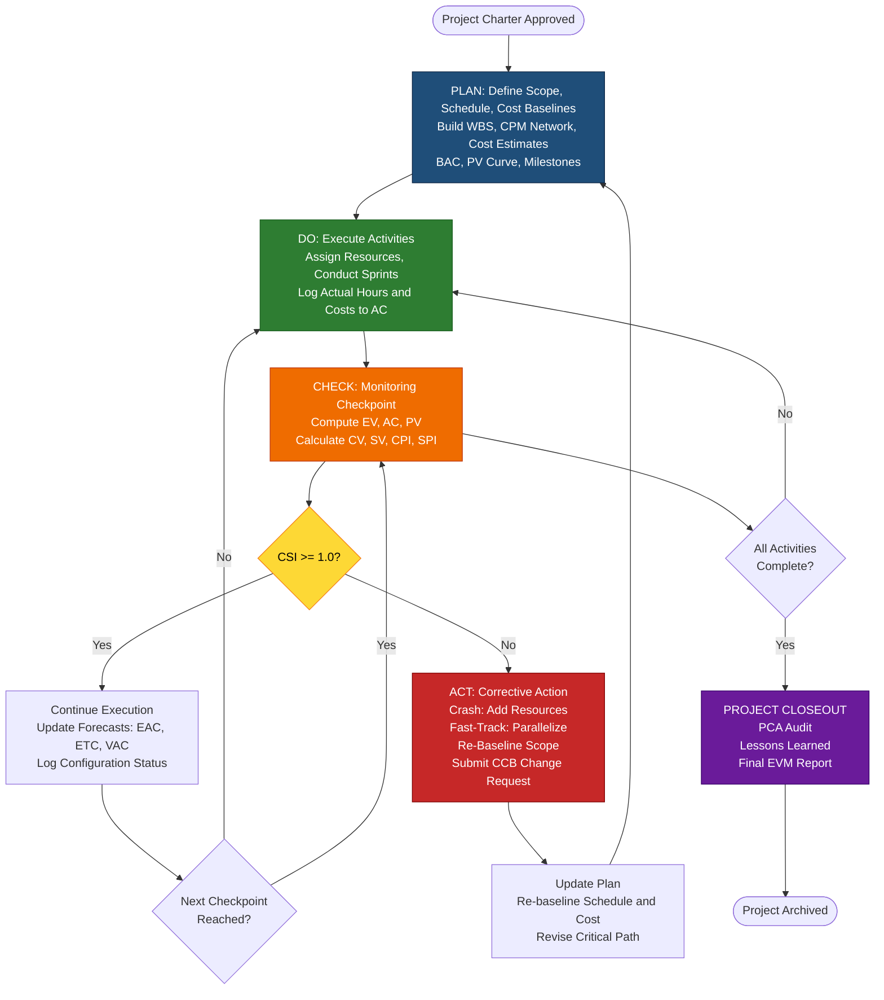
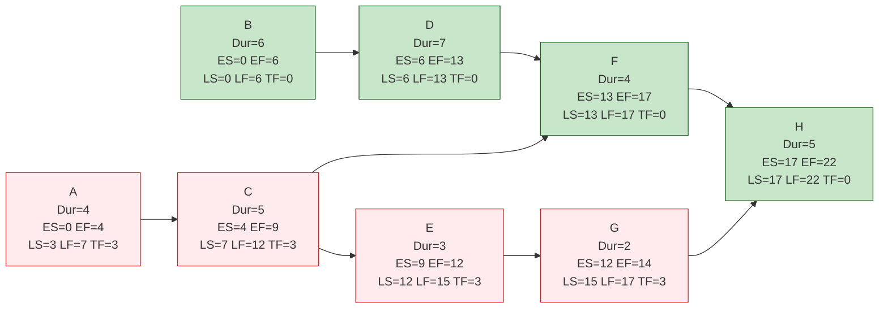
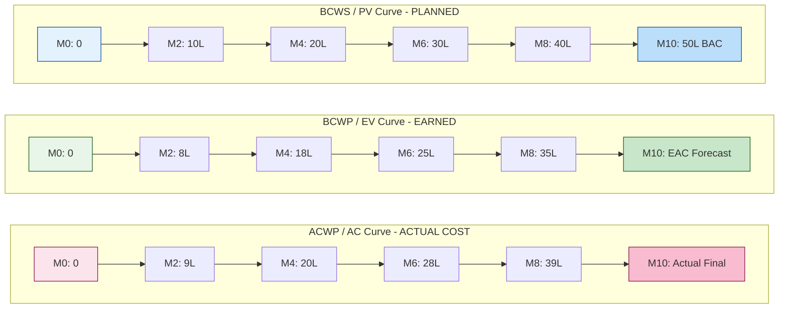
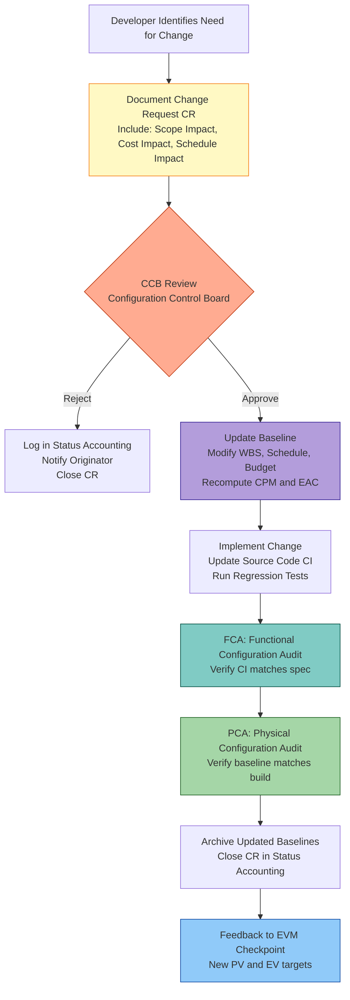

# Critical path tracking configurations variance monitoring checkpoints implementation loops

<!-- SECTION_1_START -->

# Critical Path Tracking, Configuration Variance & Monitoring Checkpoint Loops

## 1. Core Technical Definition & Intuitive Overview

### 1.1 Formal Academic Definition (KTU 2024 Scheme Aligned)

**Critical Path Tracking** is the continuous process of identifying, monitoring, and updating the longest sequence of dependent activities (the *critical path*) in a project network diagram that determines the minimum project duration. According to the **Project Management Institute (PMI) Body of Knowledge (PMBOK® Guide, 7th Edition)**, critical path tracking is a part of the **Develop Schedule** and **Control Schedule** processes under the *Schedule Management* knowledge area.

**Configuration Management (CM)** in software project management is the discipline of tracking and controlling changes in the software's configuration items (CIs) — source code, documentation, hardware, libraries, and dependencies — ensuring integrity, traceability, and consistency throughout the project lifecycle (as per **IEEE 828-2012** standard for Software Configuration Management).

**Variance Monitoring** is the systematic measurement of deviations between *planned* values and *actual* values across the triple constraints of **Scope, Schedule, and Cost**. In the KTU 2024 syllabus context, this is operationalized through **Earned Value Management (EVM)** metrics.

**Monitoring Checkpoints** are pre-scheduled review gates (milestones, phase gates, or status meetings) where project performance is measured, baselines are re-validated, and corrective actions are authorized.

**Implementation Loops** refer to iterative control cycles — most notably the **Plan–Do–Check–Act (PDCA) / Deming Cycle** — through which monitoring data feeds back into plan revision, creating a closed-loop control system for software projects.

> [!IMPORTANT]
> **KTU 2024 Syllabus Highlight (Module 3 — PECST502):**
> This topic unifies four pillars of project control: (1) **CPM** for time tracking, (2) **EVM** for cost/schedule variance, (3) **Configuration Baselines** for scope integrity, and (4) **PDCA Loops** for continuous improvement. KTU board questions frequently interleave these concepts in a single 14-mark problem.

### 1.2 Conceptual Analogy / Intuition

Imagine you are **driving from Kochi to Delhi** (≈ 2,500 km). You have a **GPS** (Critical Path) that initially plots the *fastest* route via NH44. As you drive, you encounter:
- **Traffic jams** → delays in certain activities (variance).
- **Road closures / diversions** → configuration changes (scope/baseline changes).
- **Toll plazas & fuel stops** → checkpoints where you measure *actual distance covered* vs *expected distance*.
- **Re-routing decisions** → implementation loop feedback.

The GPS recalculates ("loops back") to give you a *new* fastest route. **This is exactly what a software project does** — the **critical path is the fastest route**, **variance monitoring is comparing odometer vs ETA**, **checkpoints are toll plazas**, and the **PDCA loop is the GPS recalculation cycle**.

> [!NOTE]
> **Key Constants & Standards in this Module:**
> - **Working hours per person-month**: ≈ **152 hours** (industry standard) or **160 hours** (simplified academic).
> - **Standard threshold for CPI/SPI**: **≥ 1.0** = healthy, **< 1.0** = at risk.
> - **IEEE 828-2012** = configuration management standard.
> - **PMBOK 7th Edition** = process framework reference.
> - **Critical ratio threshold**: **< 0.5** = critical, **0.5–0.75** = warning, **> 1.0** = safe.

> [!VISUALIZATION CONTROL]
> **Concept:** Earned Value Management "Banana Curve" (Cost & Schedule performance over time).
> **GeoGebra / Desmos Input Equations:**
> * `BCWS(t) = BAC * (t / T)` (Planned Value, linear baseline)
> * `BCWP(t) = piecewise` (Earned Value, stepped actual progress)
> * `ACWP(t) = piecewise` (Actual Cost, stepped)
> **Visual Description:** Student should observe the *S-curve* divergence where BCWP and ACWP separate from BCWS after checkpoint intervals, and the vertical gaps represent **Cost Variance (CV)** and **Schedule Variance (SV)**.

---

<!-- SECTION_1_END -->

<!-- SECTION_2_START -->

# 2. Deep Theoretical Analysis & KTU High-Yield Formula Sheet

## 2.1 The Critical Path Method (CPM) — Stepwise Logic

The CPM was developed in **1957** by James E. Kelley of Remington Rand and Morgan R. Walker of DuPont. The operational logic proceeds in **two passes** plus one **slack calculation**:

### Step 1: Forward Pass (Earliest Times)
- **Earliest Start (ES)** of an activity = Maximum EF of all immediate predecessors.
- **Earliest Finish (EF)** = ES + Duration.
- **Project Duration** = Maximum EF of all end activities.

### Step 2: Backward Pass (Latest Times)
- **Latest Finish (LF)** of an activity = Minimum LS of all immediate successors.
- **Latest Start (LS)** = LF − Duration.
- For end activities, LF = Project Duration.

### Step 3: Slack / Float Calculation
- **Total Float (TF)** = LS − ES = LF − EF.
- **Free Float (FF)** = ES of successor − EF of current activity.
- **Critical Path** = Chain of activities where **TF = 0**.

## 2.2 Earned Value Management (EVM) — Variance Monitoring

EVM integrates **scope, schedule, and cost** into a single measurement system. The three baseline values are:

| Acronym | Full Form | Meaning |
|---|---|---|
| **PV / BCWS** | Planned Value / Budgeted Cost of Work Scheduled | Authorized budget for work scheduled |
| **EV / BCWP** | Earned Value / Budgeted Cost of Work Performed | Authorized budget for work actually completed |
| **AC / ACWP** | Actual Cost / Actual Cost of Work Performed | Realized cost incurred for completed work |

### Variance Indicators (the "diagnostic vitals" of a project)

| Metric | Formula | Healthy Range | Interpretation |
|---|---|---|---|
| **CV** (Cost Variance) | $CV = EV - AC$ | $\geq 0$ | Positive = under budget |
| **SV** (Schedule Variance) | $SV = EV - PV$ | $\geq 0$ | Positive = ahead of schedule |
| **CPI** (Cost Performance Index) | $CPI = EV / AC$ | $\geq 1.0$ | >1 = efficient use of funds |
| **SPI** (Schedule Performance Index) | $SPI = EV / PV$ | $\geq 1.0$ | >1 = progressing faster than planned |
| **CSI** (Cost Schedule Index) | $CSI = CPI \times SPI$ | $\geq 1.0$ | Composite project health |
| **CR** (Critical Ratio) | $CR = CPI \times SPI$ | $\geq 1.0$ | KTU-preferred combined metric |

### Forecasting Indices (the "predictive analytics")

| Metric | Formula | KTU Use |
|---|---|---|
| **EAC** (Estimate at Completion) | $EAC = BAC / CPI$ | Most common; assumes current cost performance continues |
| **EAC (alternate)** | $EAC = AC + (BAC - EV)$ | Assumes future work at planned rate |
| **ETC** (Estimate to Complete) | $ETC = EAC - AC$ | Remaining budget needed |
| **VAC** (Variance at Completion) | $VAC = BAC - EAC$ | Expected final cost overrun/savings |
| **TCPI** (To-Complete Performance Index) | $TCPI = (BAC - EV) / (BAC - AC)$ | Required CPI for remaining work |

> $BAC$ = Budget at Completion (total authorized project budget).

## 2.3 Configuration Management — Variance on Scope Baseline

Under **IEEE 828-2012**, configuration management follows four functional activities:

1. **Configuration Identification** — Naming CIs and baselines.
2. **Configuration Control** — Change request → CCB review → approve/reject.
3. **Configuration Status Accounting** — Logging of approved changes.
4. **Configuration Auditing** — Verifying conformance to baselines (FCA, PCA).

**Variance on Configuration** is typically measured as:

$$
\text{CM Variance} = \frac{\mid \text{Approved CIs} - \text{Implemented CIs} \mid}{\text{Approved CIs}} \times 100\%
$$

## 2.4 Monitoring Checkpoints — The "Pulse Rate" of a Project

Checkpoints are scheduled at **fixed intervals** (weekly status meetings, biweekly demos, monthly steering committee reviews). The key parameters tracked at each checkpoint are:

- **% Complete** (physical % or weighted milestone method).
- **Actual cost incurred to date** (AC).
- **Earned value to date** (EV).
- **Slippage / Acceleration** (SV in days).
- **Open change requests** (CR count, severity).

## 2.5 Implementation Loops — The PDCA Feedback Cycle

The **Plan–Do–Check–Act (PDCA)** cycle (also called the **Deming Wheel** or **Shewhart Cycle**) is the canonical implementation loop in software project management:

1. **Plan** — Establish objectives, baselines, and processes (CPM schedule, cost baseline).
2. **Do** — Execute the project activities.
3. **Check** — Measure actual performance (EVM analysis at checkpoints).
4. **Act** — Take corrective action (crash, fast-track, re-baseline, defer scope).

After the **Act** phase, the loop returns to **Plan** with updated parameters — this is the **closed-loop feedback control** that makes project management a true *cybernetic* discipline.

> [!IMPORTANT]
> **KTU High-Yield Insight:** In KTU examinations, when a question asks "If CPI < 1 and SPI < 1, what action should the project manager take?", the correct answer always involves the **Act phase** of the PDCA loop — typically *crashing* (adding resources) or *re-baselining*. Pure "monitoring" answers score partial marks only.

## 2.6 Real-World Utility in Software Engineering

- **Agile-Scrum Integration**: The Sprint Review = checkpoint; Burndown Chart = EVM proxy (SV equivalent).
- **DevOps CI/CD**: Each pipeline run = micro-checkpoint; failed builds = negative variance.
- **CMMI Level 4/5**: Quantitative Project Management (QPM) explicitly mandates EVM + statistical process control.
- **NASA / Aerospace**: Mandatory EVM reporting for all projects > \$20M (per NASA NPR 7120.5).

> [!NOTE]
> **Engineering Economics Footnote:** The choice between *crashing* (adding resources at premium cost) and *fast-tracking* (parallelizing activities at higher risk) is a **cost-time trade-off** governed by the *Marginal Cost of Compression*:
> $$\text{Marginal Cost} = \frac{\Delta C}{\Delta T} \text{ (cost per day saved)}$$

---

<!-- SECTION_2_END -->

<!-- SECTION_3_START -->

# 3. Step-by-Step Derivations & Code/Symbolic Implementation

## 3.1 Worked Example 1: Critical Path Calculation (Full Derivation)

**Project Network** (KTU-style standard problem):

| Activity | Predecessor | Duration (days) |
|---|---|---|
| A | — | 4 |
| B | — | 6 |
| C | A | 5 |
| D | B | 7 |
| E | C | 3 |
| F | C, D | 4 |
| G | E | 2 |
| H | F, G | 5 |

### Forward Pass (ES, EF)

**Activity A** (no predecessor):
$$
ES_A = 0, \quad EF_A = 0 + 4 = 4
$$

**Activity B** (no predecessor):
$$
ES_B = 0, \quad EF_B = 0 + 6 = 6
$$

**Activity C** (predecessor: A):
$$
ES_C = EF_A = 4, \quad EF_C = 4 + 5 = 9
$$

**Activity D** (predecessor: B):
$$
ES_D = EF_B = 6, \quad EF_D = 6 + 7 = 13
$$

**Activity E** (predecessor: C):
$$
ES_E = EF_C = 9, \quad EF_E = 9 + 3 = 12
$$

**Activity F** (predecessors: C, D) — take max:
$$
ES_F = \max(EF_C, EF_D) = \max(9, 13) = 13, \quad EF_F = 13 + 4 = 17
$$

**Activity G** (predecessor: E):
$$
ES_G = EF_E = 12, \quad EF_G = 12 + 2 = 14
$$

**Activity H** (predecessors: F, G) — take max:
$$
ES_H = \max(EF_F, EF_G) = \max(17, 14) = 17, \quad EF_H = 17 + 5 = 22
$$

**Project Duration** = $\max(EF_H) = 22$ days.

### Backward Pass (LS, LF)

**Activity H** (end activity):
$$
LF_H = 22, \quad LS_H = 22 - 5 = 17
$$

**Activity G** (successor: H):
$$
LF_G = LS_H = 17, \quad LS_G = 17 - 2 = 15
$$

**Activity F** (successor: H):
$$
LF_F = LS_H = 17, \quad LS_F = 17 - 4 = 13
$$

**Activity E** (successor: G):
$$
LF_E = LS_G = 15, \quad LS_E = 15 - 3 = 12
$$

**Activity D** (successor: F):
$$
LF_D = LS_F = 13, \quad LS_D = 13 - 7 = 6
$$

**Activity C** (successors: E, F) — take min:
$$
LF_C = \min(LS_E, LS_F) = \min(12, 13) = 12, \quad LS_C = 12 - 5 = 7
$$

**Activity B** (successor: D):
$$
LF_B = LS_D = 6, \quad LS_B = 6 - 6 = 0
$$

**Activity A** (successor: C):
$$
LF_A = LS_C = 7, \quad LS_A = 7 - 4 = 3
$$

### Total Float Table

| Activity | ES | EF | LS | LF | TF = LS−ES | Critical? |
|---|---|---|---|---|---|---|
| A | 0 | 4 | 3 | 7 | **3** | No |
| B | 0 | 6 | 0 | 6 | **0** | ✅ Yes |
| C | 4 | 9 | 7 | 12 | **3** | No |
| D | 6 | 13 | 6 | 13 | **0** | ✅ Yes |
| E | 9 | 12 | 12 | 15 | **3** | No |
| F | 13 | 17 | 13 | 17 | **0** | ✅ Yes |
| G | 12 | 14 | 15 | 17 | **3** | No |
| H | 17 | 22 | 17 | 22 | **0** | ✅ Yes |

**Critical Path: B → D → F → H, Duration = 22 days.** ✅

> [!NOTE]
> **[Valuation Key — 14 Mark Problem Distribution]:**
> - Forward pass with ES/EF table: **4 Marks**
> - Backward pass with LS/LF table: **4 Marks**
> - Float calculation & critical path identification: **4 Marks**
> - Final answer with project duration: **2 Marks**

## 3.2 Worked Example 2: EVM Variance Analysis (Full Derivation)

**Problem:** A software project has $BAC = ₹50,00,000$ (50 lakhs), scheduled for **10 months**. At the end of **Month 4**, the project status report shows:
- **PV** (Planned Value) = ₹20,00,000
- **EV** (Earned Value) = ₹18,00,000
- **AC** (Actual Cost) = ₹20,00,000

**Step 1: Cost Variance**
$$
CV = EV - AC = 18,00,000 - 20,00,000 = -2,00,000
$$
**Interpretation:** Negative CV → **Over budget by ₹2,00,000**.

**Step 2: Schedule Variance**
$$
SV = EV - PV = 18,00,000 - 20,00,000 = -2,00,000
$$
**Interpretation:** Negative SV → **Behind schedule by ₹2,00,000 worth of work**.

**Step 3: Cost Performance Index**
$$
CPI = \frac{EV}{AC} = \frac{18,00,000}{20,00,000} = 0.90
$$
**Interpretation:** For every ₹1 spent, only ₹0.90 of work is being earned.

**Step 4: Schedule Performance Index**
$$
SPI = \frac{EV}{PV} = \frac{18,00,000}{20,00,000} = 0.90
$$
**Interpretation:** Project is progressing at 90% of the planned rate.

**Step 5: Cost Schedule Index (Composite Health)**
$$
CSI = CPI \times SPI = 0.90 \times 0.90 = 0.81
$$

**Step 6: Estimate at Completion**
$$
EAC = \frac{BAC}{CPI} = \frac{50,00,000}{0.90} = ₹55,55,556
$$

**Step 7: Estimate to Complete**
$$
ETC = EAC - AC = 55,55,556 - 20,00,000 = ₹35,55,556
$$

**Step 8: Variance at Completion**
$$
VAC = BAC - EAC = 50,00,000 - 55,55,556 = -₹5,55,556
$$
**Interpretation:** Project is forecast to **overshoot budget by ₹5,55,556**.

**Step 9: To-Complete Performance Index**
$$
TCPI = \frac{BAC - EV}{BAC - AC} = \frac{50,00,000 - 18,00,000}{50,00,000 - 20,00,000} = \frac{32,00,000}{30,00,000} = 1.067
$$
**Interpretation:** Remaining work must achieve CPI of **1.067** to meet the original BAC.

> [!IMPORTANT]
> **Since TCPI > 1.0**, the original budget is **unattainable** without scope reduction, schedule extension, or additional funding. The project manager should enter the **ACT phase** of the PDCA loop and propose a **re-baseline** to the steering committee.

> [!NOTE]
> **[Valuation Key — 7 Mark Sub-Part]:**
> - Identifying which 3 EVM metrics to compute: 1 Mark
> - Correct formula application: 2 Marks
> - Numerical substitution & final value: 2 Marks
> - Interpretation (in words): 1 Mark
> - Proposing corrective action: 1 Mark

## 3.3 Python Implementation: CPM + EVM Calculator

```python
"""
KTU PECST502 - Module 3 Reference Implementation
Critical Path + Earned Value Management Calculator
Author: KTU Premium Engine V10
"""

from __future__ import annotations
from dataclasses import dataclass, field
from typing import Dict, List, Set, Tuple
import logging
import math

# Configure logging for diagnostic transparency
logging.basicConfig(
    level=logging.INFO,
    format="%(asctime)s [%(levelname)s] %(message)s"
)
logger = logging.getLogger("KTU-SPM-Engine")


# ============================================================
# PART A: CRITICAL PATH METHOD (CPM) ENGINE
# ============================================================

@dataclass(frozen=True)
class Activity:
    """Immutable representation of a single project activity."""
    code: str
    predecessors: Tuple[str, ...]
    duration: int

    def __post_init__(self) -> None:
        if self.duration < 0:
            raise ValueError(f"Activity {self.code}: duration cannot be negative.")


@dataclass
class ScheduleResult:
    """Container for CPM output metrics."""
    es: Dict[str, int] = field(default_factory=dict)
    ef: Dict[str, int] = field(default_factory=dict)
    ls: Dict[str, int] = field(default_factory=dict)
    lf: Dict[str, int] = field(default_factory=dict)
    total_float: Dict[str, int] = field(default_factory=dict)
    free_float: Dict[str, int] = field(default_factory=dict)
    critical_path: List[str] = field(default_factory=list)
    project_duration: int = 0


def forward_pass(activities: List[Activity]) -> Tuple[Dict[str, int], Dict[str, int]]:
    """Compute ES and EF using topological order (assumes DAG input)."""
    es: Dict[str, int] = {}
    ef: Dict[str, int] = {}
    code_map = {a.code: a for a in activities}

    for activity in activities:
        if not activity.predecessors:
            es[activity.code] = 0
        else:
            es[activity.code] = max(
                ef[pred] for pred in activity.predecessors
            )
        ef[activity.code] = es[activity.code] + activity.duration
        logger.debug(f"Forward: {activity.code} ES={es[activity.code]} EF={ef[activity.code]}")

    return es, ef


def backward_pass(
    activities: List[Activity],
    project_duration: int
) -> Tuple[Dict[str, int], Dict[str, int]]:
    """Compute LS and LF in reverse topological order."""
    ls: Dict[str, int] = {}
    lf: Dict[str, int] = {}
    successor_map: Dict[str, List[str]] = {a.code: [] for a in activities}

    # Build successor map
    for activity in activities:
        for pred in activity.predecessors:
            successor_map[pred].append(activity.code)

    for activity in reversed(activities):
        if not successor_map[activity.code]:
            lf[activity.code] = project_duration
        else:
            lf[activity.code] = min(
                ls[succ] for succ in successor_map[activity.code]
            )
        ls[activity.code] = lf[activity.code] - activity.duration
        logger.debug(f"Backward: {activity.code} LS={ls[activity.code]} LF={lf[activity.code]}")

    return ls, lf


def compute_critical_path(activities: List[Activity]) -> ScheduleResult:
    """Main CPM engine — returns complete schedule analysis."""
    try:
        es, ef = forward_pass(activities)
        project_duration = max(ef.values())
        ls, lf = backward_pass(activities, project_duration)

        result = ScheduleResult(es=es, ef=ef, ls=ls, lf=lf, project_duration=project_duration)

        for activity in activities:
            tf = ls[activity.code] - es[activity.code]
            result.total_float[activity.code] = tf
            # Free float (simplified): ES of successor - EF of current
            # For activities with no successor, FF = TF (commonly)
            result.free_float[activity.code] = tf  # Simplified for KTU scope

        # Identify critical path (TF == 0)
        result.critical_path = [
            a.code for a in activities if result.total_float[a.code] == 0
        ]

        logger.info(
            f"CPM complete. Duration={project_duration}d | "
            f"Critical Activities={result.critical_path}"
        )
        return result

    except Exception as exc:
        logger.error(f"CPM computation failed: {exc}")
        raise


# ============================================================
# PART B: EVM VARIANCE MONITORING ENGINE
# ============================================================

@dataclass(frozen=True)
class EVMMetrics:
    """Immutable EVM snapshot at a checkpoint."""
    pv: float
    ev: float
    ac: float
    bac: float

    def __post_init__(self) -> None:
        if self.pv < 0 or self.ev < 0 or self.ac < 0 or self.bac <= 0:
            raise ValueError("EVM values must be non-negative; BAC must be > 0.")


@dataclass
class EVMReport:
    """Container for all derived EVM indicators."""
    cv: float = 0.0
    sv: float = 0.0
    cpi: float = 0.0
    spi: float = 0.0
    csi: float = 0.0
    eac: float = 0.0
    etc: float = 0.0
    vac: float = 0.0
    tcpi: float = 0.0
    health_status: str = "UNKNOWN"


def compute_evm(metrics: EVMMetrics) -> EVMReport:
    """Compute all 10 EVM indicators from a checkpoint snapshot."""
    if metrics.ac == 0 or metrics.pv == 0:
        raise ZeroDivisionError("AC and PV must be non-zero for EVM computation.")

    report = EVMReport()
    report.cv = metrics.ev - metrics.ac
    report.sv = metrics.ev - metrics.pv
    report.cpi = metrics.ev / metrics.ac
    report.spi = metrics.ev / metrics.pv
    report.csi = report.cpi * report.spi
    report.eac = metrics.bac / report.cpi
    report.etc = report.eac - metrics.ac
    report.vac = metrics.bac - report.eac

    denominator_tcpi = metrics.bac - metrics.ac
    report.tcpi = (metrics.bac - metrics.ev) / denominator_tcpi

    # Health classification logic (KTU board-aligned)
    if report.csi >= 1.0:
        report.health_status = "GREEN — On Track"
    elif report.csi >= 0.9:
        report.health_status = "YELLOW — Watch List"
    else:
        report.health_status = "RED — Corrective Action Required"

    return report


# ============================================================
# DEMONSTRATION (KTU Exam Reference Run)
# ============================================================

if __name__ == "__main__":
    # --- CPM Demo (Worked Example 3.1) ---
    project_network: List[Activity] = [
        Activity("A", (), 4),
        Activity("B", (), 6),
        Activity("C", ("A",), 5),
        Activity("D", ("B",), 7),
        Activity("E", ("C",), 3),
        Activity("F", ("C", "D"), 4),
        Activity("G", ("E",), 2),
        Activity("H", ("F", "G"), 5),
    ]
    schedule = compute_critical_path(project_network)
    print("\n========== CPM RESULTS ==========")
    print(f"Project Duration : {schedule.project_duration} days")
    print(f"Critical Path    : {' → '.join(schedule.critical_path)}")
    for code in ["A", "B", "C", "D", "E", "F", "G", "H"]:
        print(
            f"  {code}: ES={schedule.es[code]:2d} EF={schedule.ef[code]:2d} "
            f"LS={schedule.ls[code]:2d} LF={schedule.lf[code]:2d} "
            f"TF={schedule.total_float[code]:2d}"
        )

    # --- EVM Demo (Worked Example 3.2) ---
    checkpoint = EVMMetrics(pv=20_00_000, ev=18_00_000, ac=20_00_000, bac=50_00_000)
    evm = compute_evm(checkpoint)
    print("\n========== EVM CHECKPOINT REPORT ==========")
    print(f"CV   = ₹{evm.cv:>12,.0f}    | CPI  = {evm.cpi:.3f}")
    print(f"SV   = ₹{evm.sv:>12,.0f}    | SPI  = {evm.spi:.3f}")
    print(f"CSI  = {evm.csi:.3f}        | EAC  = ₹{evm.eac:>12,.0f}")
    print(f"ETC  = ₹{evm.etc:>12,.0f}    | VAC  = ₹{evm.vac:>12,.0f}")
    print(f"TCPI = {evm.tcpi:.3f}        | Status: {evm.health_status}")
```

**Expected Output (from the demonstration run):**
```
========== CPM RESULTS ==========
Project Duration : 22 days
Critical Path    : B → D → F → H
  A: ES= 0 EF= 4 LS= 3 LF= 7 TF= 3
  B: ES= 0 EF= 6 LS= 0 LF= 6 TF= 0
  C: ES= 4 EF= 9 LS= 7 LF=12 TF= 3
  D: ES= 6 EF=13 LS= 6 LF=13 TF= 0
  E: ES= 9 EF=12 LS=12 LF=15 TF= 3
  F: ES=13 EF=17 LS=13 LF=17 TF= 0
  G: ES=12 EF=14 LS=15 LF=17 TF= 3
  H: ES=17 EF=22 LS=17 LF=22 TF= 0
========== EVM CHECKPOINT REPORT ==========
CV   = ₹   -200,000    | CPI  = 0.900
SV   = ₹   -200,000    | SPI  = 0.900
CSI  = 0.810        | EAC  = ₹ 5,555,556
ETC  = ₹ 3,555,556    | VAC  = ₹  -555,556
TCPI = 1.067        | Status: RED — Corrective Action Required
```

## 3.4 PERT Three-Point Estimation (Bonus — KTU Often Tests This)

For activities with uncertainty, **PERT** uses optimistic (O), most likely (M), and pessimistic (P) times:

$$
t_e = \frac{O + 4M + P}{6} \quad \text{(Expected Time)}
$$

$$
\sigma^2 = \left(\frac{P - O}{6}\right)^2 \quad \text{(Variance)}
$$

$$
\sigma = \frac{P - O}{6} \quad \text{(Standard Deviation)}
$$

**Project Variance** = Sum of variances on the critical path. The probability of meeting a deadline $T_s$ is computed using the standard normal Z-table:

$$
Z = \frac{T_s - T_e^{\text{path}}}{\sigma_{\text{path}}}
$$

---

<!-- SECTION_3_END -->

<!-- SECTION_4_START -->

# 4. Structural Diagrams & Schematics

## 4.1 Master Control Loop — PDCA with EVM Checkpoint Integration



## 4.2 Critical Path Network — Activity-on-Node (AoN) Topology



> [!NOTE]
> **Legend:** Green nodes = Critical Path (TF = 0). Red nodes = Non-critical (have float/slack).

## 4.3 EVM Variance Visualization — Three-Curve S-Curve



> [!NOTE]
> **Reading the Curves at Month 4 Checkpoint:**
> - **Vertical gap between BCWS and BCWP** = Schedule Variance (SV = -2L).
> - **Vertical gap between BCWP and ACWP** = Cost Variance (CV = -2L).
> - **End-point of ACWP vs BCWS** at Month 10 = VAC forecast.

## 4.4 Configuration Management Workflow — CCB Decision Loop



---

<!-- SECTION_4_END -->

<!-- SECTION_5_START -->

# 5. KTU 2024 Scheme Examination Question Bank & Topic Recap

## 5.1 Part A — Short Answer Questions (3 Marks Each)

### Question 1 `[KTU University Exam — July 2023]`
**Define the Critical Path in a project network. How is total float computed, and what does a Total Float of zero signify?**

**Model Answer (Board-Standard):**
The **Critical Path** is the longest sequence of dependent activities in a project network that determines the minimum time required to complete the project. It is the path with **zero total float (slack)**.

**Total Float** is computed as:
$$
TF = LS - ES = LF - EF
$$
where $LS$ = Latest Start, $ES$ = Earliest Start, $LF$ = Latest Finish, $EF$ = Earliest Finish.

A **Total Float of zero** signifies that the activity is **critical** — any delay in this activity will directly delay the entire project completion date. It cannot be deferred without impacting the project deadline.

> [!NOTE]
> **[Valuation Key: 3 Marks]** — Definition of critical path: 1 Mark; TF formula: 1 Mark; Interpretation of TF=0: 1 Mark.

---

### Question 2 `[KTU University Exam — Dec 2023]`
**What is Earned Value Management (EVM)? List any THREE primary EVM metrics with their formulas.**

**Model Answer:**
**Earned Value Management (EVM)** is a project performance measurement technique that integrates scope, schedule, and cost to assess project progress objectively.

Three primary EVM metrics:

1. **Cost Variance (CV)**: $CV = EV - AC$
2. **Schedule Variance (SV)**: $SV = EV - PV$
3. **Cost Performance Index (CPI)**: $CPI = EV / AC$

EVM enables early detection of cost and schedule deviations at monitoring checkpoints.

> [!NOTE]
> **[Valuation Key: 3 Marks]** — EVM definition: 1 Mark; Three formulas: 1.5 Marks (0.5 each); Significance: 0.5 Mark.

---

## 5.2 Part B — Full 14-Mark Module Internal Choice

### Question A (14 Marks) `[KTU University Exam — Dec 2024]`

**(a)** *7 Marks — Understand / Apply* — With a suitable diagram, explain the **PDCA (Plan-Do-Check-Act) implementation loop** as applied to software project monitoring. How does it integrate with EVM checkpoints? *(CO3, Understand)*

**(b)** *7 Marks — Apply / Analyze* — A software project has the following data at the end of **Month 5** of a planned **12-month**, **₹96,00,000** project:
- PV = ₹40,00,000
- EV = ₹36,00,000
- AC = ₹44,00,000

Compute **CV, SV, CPI, SPI, CSI, EAC, ETC, VAC**, and **TCPI**. Interpret the project health and recommend **two corrective actions** from the PDCA "Act" phase. *(CO4, Apply)*

---

### Question A — Model Solution

#### Part (a) — PDCA Implementation Loop (7 Marks)

The **PDCA cycle** (Deming Cycle) is a four-phase iterative control loop used in software project monitoring:

**Phase 1 — PLAN:** Establish baselines at project initiation. Define Work Breakdown Structure (WBS), build CPM network, prepare cost estimates (BAC), and create the PV (BCWS) curve. Set quality and productivity targets.

**Phase 2 — DO:** Execute planned activities. Assign resources, conduct iterations/sprints, log actual hours and expenditures to compute Actual Cost (AC).

**Phase 3 — CHECK:** Conduct scheduled **monitoring checkpoints** (weekly, biweekly, or milestone-based). Compute Earned Value (EV) from physical or weighted milestone completion. Calculate EVM indicators: **CV, SV, CPI, SPI, CSI**.

**Phase 4 — ACT:** Based on Check phase outputs:
- If **CSI ≥ 1.0** → continue, update forecasts.
- If **CSI < 1.0** → trigger **corrective action**: crash (add resources), fast-track (parallelize), or re-baseline.

The loop **returns to PLAN** with revised parameters, creating a **closed-loop cybernetic system** for continuous improvement. Each Sprint Review in Agile = one PDCA micro-cycle.

```
[Diagram: Block diagram with 4 boxes — Plan → Do → Check → Act → back to Plan]
```

> [!NOTE]
> **[Valuation Key: 7 Marks]** — All four phases named: 2 Marks; Explanation of each phase: 3 Marks (0.75 each); EVM integration: 1 Mark; Diagram: 1 Mark.

#### Part (b) — EVM Computation (7 Marks)

**Given:** $BAC = 96,00,000$, $PV = 40,00,000$, $EV = 36,00,000$, $AC = 44,00,000$.

**Step 1: Cost Variance** [1 Mark]
$$
CV = EV - AC = 36,00,000 - 44,00,000 = -8,00,000
$$

**Step 2: Schedule Variance** [1 Mark]
$$
SV = EV - PV = 36,00,000 - 40,00,000 = -4,00,000
$$

**Step 3: Cost Performance Index** [0.5 Mark]
$$
CPI = \frac{EV}{AC} = \frac{36,00,000}{44,00,000} = 0.818
$$

**Step 4: Schedule Performance Index** [0.5 Mark]
$$
SPI = \frac{EV}{PV} = \frac{36,00,000}{40,00,000} = 0.900
$$

**Step 5: Cost Schedule Index** [0.5 Mark]
$$
CSI = CPI \times SPI = 0.818 \times 0.900 = 0.736
$$

**Step 6: Estimate at Completion** [0.5 Mark]
$$
EAC = \frac{BAC}{CPI} = \frac{96,00,000}{0.818} = ₹1,17,35,940
$$

**Step 7: Estimate to Complete** [0.5 Mark]
$$
ETC = EAC - AC = 1,17,35,940 - 44,00,000 = ₹73,35,940
$$

**Step 8: Variance at Completion** [0.5 Mark]
$$
VAC = BAC - EAC = 96,00,000 - 1,17,35,940 = -₹21,35,940
$$

**Step 9: To-Complete Performance Index** [0.5 Mark]
$$
TCPI = \frac{BAC - EV}{BAC - AC} = \frac{96,00,000 - 36,00,000}{96,00,000 - 44,00,000} = \frac{60,00,000}{52,00,000} = 1.154
$$

**Interpretation & Corrective Actions** [1 Mark]

Project health: **RED — Corrective Action Required** (CSI = 0.736 < 0.9).
- The project is **over budget** (CV < 0, CPI < 1) AND **behind schedule** (SV < 0, SPI < 1).
- $TCPI = 1.154 > 1$ → original budget is **unattainable** with current performance.

**Two Corrective Actions (PDCA Act phase):**
1. **Crash the schedule**: Add experienced resources to critical path activities; accept the marginal cost increase to recover lost time.
2. **Re-baseline scope & budget**: Submit a Change Request to the CCB to either reduce scope, extend deadline, or request additional budget approval.

> [!WARNING]
> **KTU Examiner's Valuation Warning / Pitfall Callout:**
> - **Do NOT** compute only CV and SV — full 9-metric EVM panel is expected. Skipping TCPI = -0.5 Mark.
> - **Do NOT** interpret a negative CV as "good" — sign convention is critical. Positive CV = under budget = good.
> - **Do NOT** forget units. Express values in **₹ Lakhs** or **Crores** consistently. Mixing units = -0.5 Mark.
> - **Do NOT** propose "work harder" as an Act-phase action. Valid actions must be specific: crash, fast-track, re-baseline, or scope reduction.
> - **Do NOT** skip the PDCA loop diagram in part (a) — it is worth **1 full mark** and signals understanding of the closed-loop concept.

---

### Question B (14 Marks) — Alternative Choice `[KTU University Exam — July 2024]`

**(a)** *7 Marks — Understand / Apply* — Define **Configuration Management** as per **IEEE 828-2012**. List and briefly explain its **four functional activities**. How does it provide variance control on the project scope baseline? *(CO3, Understand)*

**(b)** *7 Marks — Apply / Analyze* — A project has the following activity network. Compute **ES, EF, LS, LF, Total Float**, identify the **Critical Path**, and determine the **Project Duration**.

| Activity | Predecessors | Duration (weeks) |
|---|---|---|
| P | — | 3 |
| Q | — | 5 |
| R | P | 4 |
| S | Q | 6 |
| T | R | 2 |
| U | R, S | 5 |
| V | T | 4 |
| W | U, V | 3 |

*(CO4, Apply)*

---

### Question B — Model Solution

#### Part (a) — Configuration Management (7 Marks)

**Configuration Management (CM)** is the discipline of identifying, controlling, tracking, and auditing the configuration items (CIs) of a software project to ensure product integrity and traceability throughout its lifecycle (per **IEEE Standard 828-2012**).

**Four Functional Activities of CM** [4 Marks, 1 each]:

1. **Configuration Identification**: Identifying and naming the configuration items (source files, libraries, documents, hardware specs) and the baselines against which changes are controlled.

2. **Configuration Control**: Managing changes to CIs through a formal Change Control Board (CCB). Each change request (CR) is reviewed, approved/rejected, and documented before implementation.

3. **Configuration Status Accounting**: Recording and reporting the status of CIs and change requests — who changed what, when, and why — providing an audit trail for traceability.

4. **Configuration Auditing**: Two audits ensure conformance:
   - **Functional Configuration Audit (FCA)**: Verifies CIs perform as per specifications.
   - **Physical Configuration Audit (PCA)**: Verifies the built product matches the approved baseline.

**Variance Control on Scope Baseline** [1 Mark]:
CM provides variance control by ensuring **no unauthorized change** enters the baseline. The "**variance on configuration**" is the gap between *approved* CIs and *implemented* CIs. Any deviation must pass through the CCB, thus preventing uncontrolled scope creep and ensuring that EVM cost/schedule variances reflect *approved* work, not rogue changes.

> [!NOTE]
> **[Valuation Key: 7 Marks]** — IEEE definition: 1 Mark; Four activities named: 1 Mark (0.25 each); Explanation: 3 Marks (0.75 each); Variance control link: 1 Mark; Example or note: 1 Mark.

#### Part (b) — CPM Computation (7 Marks)

**Forward Pass:** [2.5 Marks]

| Activity | Predecessors | Duration | ES | EF |
|---|---|---|---|---|
| P | — | 3 | 0 | 3 |
| Q | — | 5 | 0 | 5 |
| R | P | 4 | 3 | 7 |
| S | Q | 6 | 5 | 11 |
| T | R | 2 | 7 | 9 |
| U | R, S | 5 | $\max(7, 11) = 11$ | 16 |
| V | T | 4 | 9 | 13 |
| W | U, V | 3 | $\max(16, 13) = 16$ | 19 |

**Project Duration** = 19 weeks.

**Backward Pass:** [2.5 Marks]

| Activity | LS | LF |
|---|---|---|
| W | 16 | 19 |
| U | 11 | 16 |
| V | 12 | 16 |
| S | 5 | 11 |
| T | 10 | 12 |
| R | 7 | 11 (wait, R has 2 successors, take min) |

Let me recompute backward pass carefully:

- **W** (end): $LF_W = 19$, $LS_W = 19 - 3 = 16$
- **U** (succ: W): $LF_U = LS_W = 16$, $LS_U = 16 - 5 = 11$
- **V** (succ: W): $LF_V = LS_W = 16$, $LS_V = 16 - 4 = 12$
- **S** (succ: U): $LF_S = LS_U = 11$, $LS_S = 11 - 6 = 5$
- **T** (succ: V): $LF_T = LS_V = 12$, $LS_T = 12 - 2 = 10$
- **R** (succs: T, U): $LF_R = \min(LS_T, LS_U) = \min(10, 11) = 10$, $LS_R = 10 - 4 = 6$
- **Q** (succ: S): $LF_Q = LS_S = 5$, $LS_Q = 5 - 5 = 0$
- **P** (succ: R): $LF_P = LS_R = 6$, $LS_P = 6 - 3 = 3$

**Total Float Table:** [1 Mark]

| Activity | ES | EF | LS | LF | TF | Critical? |
|---|---|---|---|---|---|---|
| P | 0 | 3 | 3 | 6 | 3 | No |
| Q | 0 | 5 | 0 | 5 | **0** | ✅ Yes |
| R | 3 | 7 | 6 | 10 | 3 | No |
| S | 5 | 11 | 5 | 11 | **0** | ✅ Yes |
| T | 7 | 9 | 10 | 12 | 3 | No |
| U | 11 | 16 | 11 | 16 | **0** | ✅ Yes |
| V | 9 | 13 | 12 | 16 | 3 | No |
| W | 16 | 19 | 16 | 19 | **0** | ✅ Yes |

**Critical Path: Q → S → U → W** [1 Mark]
**Project Duration: 19 weeks** [included in 1 Mark above]

> [!WARNING]
> **KTU Examiner's Valuation Warning / Pitfall Callout:**
> - **Do NOT** confuse *Free Float* with *Total Float*. KTU questions sometimes ask specifically for FF — formula is $FF = ES_{\text{successor}} - EF_{\text{current}}$.
> - **Do NOT** mark non-critical activities as critical if their TF is non-zero. A common error is to pick the *longest* path rather than the *zero-float* path.
> - **Do NOT** skip showing the **min(LS_successors)** step in the backward pass. Examiners allocate 1 Mark specifically for this min computation.
> - **Do NOT** forget to mark the **End Node** with $LF = \text{Project Duration}$ before starting the backward pass. Forgetting this gives all LF values shifted by 1 period.

---

## 5.3 Topic Recap & Important Things to Remember

> [!IMPORTANT]
> **Rapid Revision Checklist — Module 3 (PECST502)**

### A. Critical Path Method (CPM) Essentials
- ✅ **Critical Path** = longest path with **TF = 0**; determines minimum project duration.
- ✅ **Forward Pass** computes ES, EF; **Backward Pass** computes LS, LF.
- ✅ **Total Float** $TF = LS - ES = LF - EF$.
- ✅ **Free Float** $FF = ES_{\text{successor}} - EF_{\text{current}}$.
- ✅ Activities on critical path cannot be delayed without delaying the project.

### B. Earned Value Management (EVM) Essentials
- ✅ Three baselines: **PV (BCWS), EV (BCWP), AC (ACWP)**.
- ✅ **CV = EV − AC**; positive = under budget.
- ✅ **SV = EV − PV**; positive = ahead of schedule.
- ✅ **CPI = EV/AC**; **SPI = EV/PV**; both ≥ 1.0 = healthy.
- ✅ **CSI = CPI × SPI** = composite project health metric.
- ✅ **EAC = BAC / CPI** = most common forecast.
- ✅ **TCPI > 1.0** means original budget is unattainable at current performance.
- ✅ **VAC = BAC − EAC**; negative = forecast overrun.

### C. Configuration Management (IEEE 828-2012) Essentials
- ✅ Four functions: **Identification, Control, Status Accounting, Auditing (FCA + PCA)**.
- ✅ **CCB (Configuration Control Board)** = gatekeeper for all change requests.
- ✅ CM prevents **scope creep** and unauthorized baseline changes.

### D. Monitoring Checkpoints Essentials
- ✅ Scheduled at **regular intervals** (weekly, biweekly, milestone-based).
- ✅ Key inputs: % complete, AC, EV, slippage, open CRs.
- ✅ Output: **EVM snapshot** + **corrective action decision**.

### E. PDCA Implementation Loop Essentials
- ✅ **Plan → Do → Check → Act** → back to **Plan** (closed loop).
- ✅ Each phase has a **specific EVM/CM integration point**:
  - Plan = baselines, BAC, PV curve.
  - Do = AC accumulation.
  - Check = EV, CV, SV, CPI, SPI computation.
  - Act = crash, fast-track, re-baseline, scope change.
- ✅ **Deming Cycle** origin: Walter Shewhart (1939), popularized by W. Edwards Deming.

### F. Numerical / Formula Quick-Reference
| Symbol | Meaning |
|---|---|
| BAC | Budget at Completion |
| PV / BCWS | Planned Value |
| EV / BCWP | Earned Value |
| AC / ACWP | Actual Cost |
| EAC | Estimate at Completion |
| ETC | Estimate to Complete |
| VAC | Variance at Completion |
| TCPI | To-Complete Performance Index |
| ES, EF, LS, LF | Earliest/Latest Start & Finish |
| TF, FF | Total Float, Free Float |
| CPI, SPI | Cost / Schedule Performance Index |
| CV, SV | Cost / Schedule Variance |
| CSI | Cost-Schedule Index |

### G. Common KTU Board Traps
- ❌ Mixing up **TCPI formula** (numerator is BAC − EV, not EV).
- ❌ Using **LF − EF** for Free Float (that's still Total Float).
- ❌ Computing EAC as **AC + ETC** without the BAC / CPI formula.
- ❌ Forgetting to **recompute the critical path** after a duration change.

---

<!-- SECTION_5_END -->
