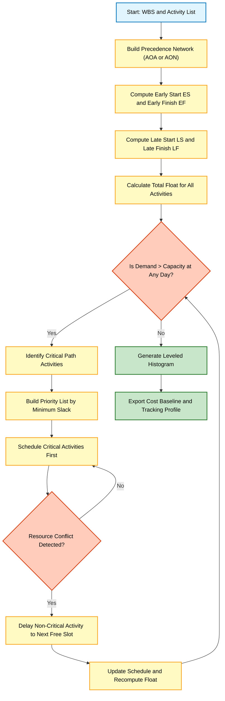
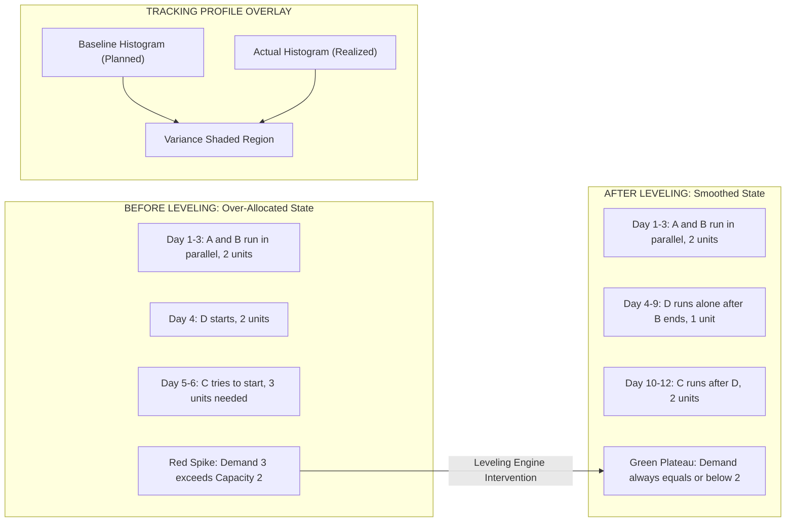
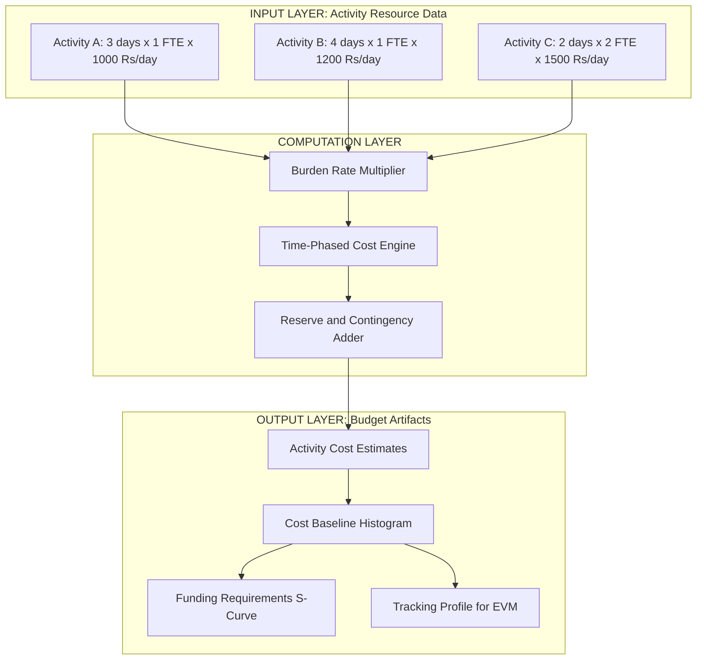
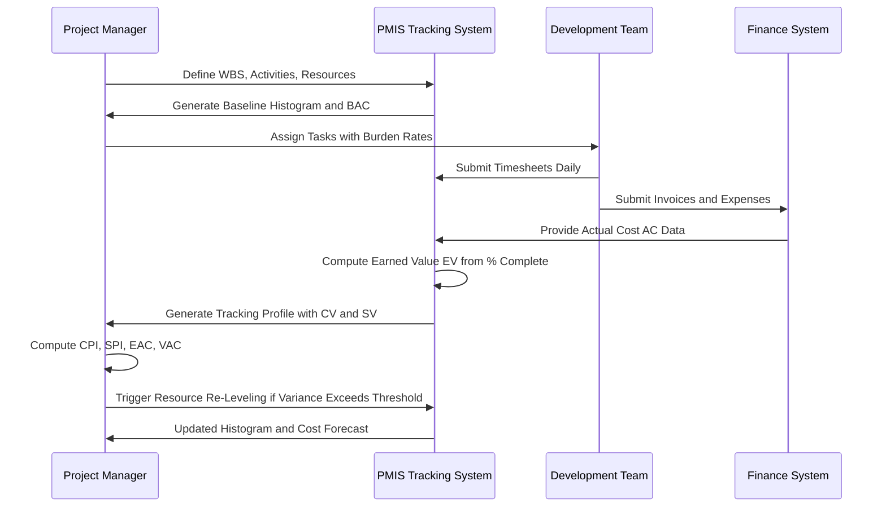

# Resource usage profiles leveling strategies algorithms tracking profiles parameters

<!-- SECTION_1_START -->
# Resource Allocation & Budgeting Systems

## 1. Core Technical Definition & Intuitive Overview

### Formal Definition (KTU 2024 Syllabus Terminology)

**Resource Allocation** is the systematic process of assigning and scheduling available project resources—including human personnel, hardware infrastructure, software tools, and financial capital—to the activities defined within a project Work Breakdown Structure (WBS) across the project timeline. In the context of the KTU Software Project Management framework (PECST502, Module 3), this encompasses the construction, interpretation, and manipulation of **Resource Usage Profiles (Histograms)** and the application of **Resource Leveling Algorithms** to resolve over-allocation conflicts.

**Resource Leveling** is a project management technique in which the start and finish dates of project activities are adjusted based on resource constraints, with the primary goal of balancing the workload of resources and avoiding peaks and troughs in resource demand.

> [!IMPORTANT]
> **KTU Board Definition (Direct from PECST502 Module 3 Syllabus):**
> Resource allocation and budgeting systems deal with the process of planning and managing the cost of a project. It involves estimating the cost of resources, creating a budget, and tracking actual costs against the budget to ensure that the project is completed within the approved financial limits.

### Conceptual Analogy / Intuition

Imagine you are a **head chef in a busy restaurant kitchen** preparing for a Saturday dinner rush. You have:
- **3 chefs** (human resources)
- **2 ovens** (equipment resources)
- **A fixed budget of ₹50,000** for ingredients (financial resource)

Your **menu has 15 dishes** (project activities), each requiring a specific amount of chef-time, oven-time, and ingredients. If you naively assign all 15 dishes to be cooked simultaneously, your 3 chefs will be overwhelmed, your 2 ovens will be burning (literally!), and you will blow your budget in the first hour.

**Resource Allocation** is the art of sequencing these dishes intelligently:
- Assign dish timings so that no more than 3 chefs are working at once
- Schedule oven use so that no dish waits for an oven
- Track ingredient spending against the ₹50,000 limit

A **Resource Usage Profile (Histogram)** is the visual graph showing how many chefs are working at each hour of the evening. **Resource Leveling** is the reshuffling of dish start times to flatten that histogram—ensuring stable, sustainable workload.

### Key Terminology Glossary

> [!NOTE]
> **Critical Vocabulary for PECST502 Module 3:**
>
> | Term | Definition |
> |---|---|
> | **Resource Histogram** | A bar-chart representation of resource usage plotted against time |
> | **Resource Leveling** | Resolving resource conflicts by adjusting activity start/finish dates |
> | **Resource Smoothing** | Adjusting resources within float boundaries without changing the critical path |
> | **Over-allocation** | When resource demand exceeds available supply at a given time |
> | **Under-allocation** | When resource demand falls below available supply (idle time) |
> | **Effort** | The number of person-hours required to complete an activity (units: person-hours) |
> | **Duration** | The calendar time span of an activity (units: days/weeks) |
> | **Resource Calendar** | A calendar defining when a resource is available to work |
> | **Burden Rate** | The fully-loaded cost per unit time of a resource (salary + overheads + benefits) |

> [!VISUALIZATION CONTROL]
> **Concept:** Resource Histogram (Over-Allocated vs. Leveled)
> **Desmos Input Equations (Manual Sketch Interpretation):**
> * `Peak_Demand(x) = piecewise` showing spikes above **100% capacity line**
> * `Leveled_Demand(x) = uniform distribution` showing stable use at **≤100% capacity**
> **Visual Description:** A bar chart with **time on the X-axis** (Week 1 to Week 10) and **FTE (Full-Time Equivalents) on the Y-axis** (0 to 4). The original (over-allocated) curve shows tall spikes reaching 4.5 FTE above the red "Maximum Capacity" line at **100%** (3.0 FTE). The leveled curve shows a smooth plateau hovering at 3.0 FTE with no spikes.

---

<!-- SECTION_1_END -->

<!-- SECTION_2_START -->
# 2. Deep Theoretical Analysis & KTU High-Yield Formula Sheet

## 2.1 Resource Usage Profiles — The Three Structural Models

A **Resource Usage Profile** is a time-series representation of resource consumption. There are three canonical shapes, each carrying different managerial meaning:

### Profile 1: The **Demand Histogram (Pre-Allocation Profile)**
This profile is generated directly from the schedule baseline. It shows the **theoretical demand** for a resource at each time bucket without any constraint resolution.

- **X-axis:** Time periods (days/weeks)
- **Y-axis:** Resource units (FTE, hours, cost)
- **Shape:** Highly irregular, often with sharp peaks during critical activity clusters
- **Use Case:** Identifying **where and when** resource conflicts will occur

### Profile 2: The **Availability Histogram (Capacity Profile)**
This represents the **maximum supply** of the resource across the project timeline. It is usually a step-function that drops during weekends, holidays, and approved leaves.

- **X-axis:** Time periods
- **Y-axis:** Maximum available units
- **Shape:** Block-step pattern (full on weekdays, zero on weekends)

### Profile 3: The **Allocated/Leveled Histogram (Target Profile)**
This is the **post-leveling output**—the ideal profile where demand ≤ availability at every time bucket.

- **Shape:** Smooth, plateau-like, hugging the availability ceiling
- **Use Case:** The **goal state** of resource leveling

> [!IMPORTANT]
> **The Leveling Goal Equation:**
> $$\text{For all time buckets } t: \quad \text{Demand}(t) \leq \text{Availability}(t)$$
> When this inequality holds at every $t$, the resource is said to be **fully leveled** or **non-over-allocated**.

## 2.2 Resource Leveling Strategies (KTU Board-Favorite)

The KTU syllabus (PECST502) categorizes leveling strategies into **four primary strategies**, each addressing a different problem:

### Strategy 1: **Time-Constrained Leveling (Resource Smoothing)**
- **Constraint:** Project deadline is **fixed**. Resource availability may be exceeded.
- **Action:** Distribute resource demand within the available **slack/float** of non-critical activities.
- **Outcome:** Critical path is preserved. Project duration remains unchanged. Some over-allocation may persist if the deadline is aggressive.
- **Best For:** Projects with hard contractual deadlines.

### Strategy 2: **Resource-Constrained Leveling (Classic Leveling)**
- **Constraint:** Resource availability is **fixed** and **hard-capped**. Project deadline may slip.
- **Action:** Delay non-critical activities until resources are free.
- **Outcome:** Critical path may shift. Project duration may extend. Zero over-allocation.
- **Best For:** Projects with limited specialist resources (e.g., a single DBA).

### Strategy 3: **Time-and-Resource Constrained Leveling (Balanced)**
- **Constraint:** Both time and resource limits are enforced.
- **Action:** A combination of delay and reassignment.
- **Outcome:** Practical compromise for real-world software projects.

### Strategy 4: **Resource-Driven Scheduling (Reverse Leveling)**
- **Constraint:** Resources dictate the schedule entirely.
- **Action:** The schedule is built around resource availability profiles.

> [!NOTE]
> **KTU 2024 Board Insight:** The most frequently asked exam question contrasts **Resource Smoothing** (no critical path change) vs. **Resource Leveling** (critical path may change). Memorize this distinction.

## 2.3 Resource Leveling Algorithms — The Core Methodologies

### Algorithm 1: **The Minimum Slack Heuristic (Priority-Based Leveling)**

This is the most widely taught algorithm in KTU coursework.

**Logic Steps:**

1. Compute the **Critical Path** and identify all activities with zero total float.
2. Compute the **Total Float (TF)** of every non-critical activity:
$$TF = LS - ES = LF - EF$$
3. Build a **priority list** sorted by ascending total float (least float = highest priority).
4. Schedule critical activities first using the **Early Start (ES)** schedule.
5. For non-critical activities, schedule them in priority order. If a resource conflict occurs, **delay the activity** to the next available resource window.
6. Recompute floats after each scheduling decision (since leveling changes the schedule).

> [!IMPORTANT]
> **Minimum Slack Rule:** When a conflict arises between two non-critical activities, the one with the **smaller total float** gets the contested resource slot first. The other waits.

### Algorithm 2: **The Serial Method (Heuristic)**
- Schedule activities one at a time in priority order.
- Each activity is scheduled at its **earliest possible start** subject to both precedence and resource constraints.
- **Pros:** Simple, fast. **Cons:** Often produces longer project durations.

### Algorithm 3: **The Parallel Method (Heuristic)**
- Schedule multiple activities in parallel time windows.
- More complex but produces tighter schedules.
- Used in tools like **Microsoft Project** and **Primavera P6**.

### Algorithm 4: **Mathematical Optimization (Linear Programming)**
Models the leveling problem as an Integer Linear Program (ILP):

**Decision Variable:** $x_{ij} \in \{0,1\}$ = 1 if activity $i$ starts at time $j$, else 0

**Objective Function (Minimize Project Duration):**
$$\min T = \max_{i \in \text{Activities}} (S_i + D_i)$$

**Subject to:**
$$\sum_{j=0}^{T} x_{ij} = 1 \quad \forall i \text{ (each activity scheduled once)}$$

$$\sum_{i \in \text{Pred}(k)} \sum_{j \leq S_k - D_i} x_{ij} \cdot r_{ik} \leq R_k \quad \forall k, t \text{ (resource capacity)}$$

$$\text{Precedence: } S_k \geq S_i + D_i \quad \forall (i,k) \in \text{Predecessor Links}$$

Where $r_{ik}$ is the resource consumption of activity $i$ of type $k$, and $R_k$ is the capacity.

## 2.4 Tracking Profiles — The Monitoring Dimension

A **Tracking Profile** is the time-series of **actual resource consumption** plotted against the **planned (baseline) profile**. The gap between the two is called the **Schedule/Cost Variance**.

### Variance Formulas (KTU Board Essential)

$$\text{Schedule Variance (SV)} = \text{Earned Value (EV)} - \text{Planned Value (PV)}$$

$$\text{Cost Variance (CV)} = \text{Earned Value (EV)} - \text{Actual Cost (AC)}$$

$$\text{Resource Utilization Rate (RUR)} = \frac{\text{Actual Hours Worked}}{\text{Scheduled Hours Available}} \times 100\%$$

$$\text{Resource Performance Index (RPI)} = \frac{\text{Earned Value}}{\text{Actual Cost}} = \frac{EV}{AC}$$

$$\text{Budget Variance (BV)} = \text{Budget at Completion (BAC)} - \text{Estimate at Completion (EAC)}$$

$$\text{Estimate to Complete (ETC)} = \frac{BAC - EV}{CPI} = \frac{BAC - EV}{(EV / AC)}$$

> [!IMPORTANT]
> **Interpretation Rule for KTU Valuation:**
> * If $\text{SV} < 0$ → Project is **behind schedule**
> * If $\text{CV} < 0$ → Project is **over budget**
> * If $\text{RUR} > 100\%$ → Resource is **overworked** (burnout risk)
> * If $\text{RUR} < 70\%$ → Resource is **under-utilized** (efficiency loss)

## 2.5 Parameters in Resource Leveling

The following parameters govern the behavior of leveling algorithms:

| Parameter | Description | Typical KTU Value |
|---|---|---|
| **Leveling Priority** | Order in which activities are considered for scheduling | Lowest Total Float First |
| **Leveling Resolution** | Granularity of time buckets (day, week, hour) | Daily for software projects |
| **Resource Limit** | Maximum units of a resource available at time $t$ | Per resource calendar |
| **Max Units per Activity** | Cap on units a single activity can consume | 100% (one FTE) |
| **Can Split Activities** | Whether a single activity can be interrupted | `FALSE` (default in PMBOK) |
| **Level Within Float** | Restrict leveling to non-critical path only | `TRUE` = Smoothing, `FALSE` = Full Leveling |
| **Leveling Order** | Priority by: ID / Start / Float / Cost | Configurable |
| **Contention Threshold** | When to trigger leveling (% over capacity) | 100% (any over-allocation triggers) |
| **Calendar Working Hours** | Hours per day a resource is available | 8 hours/day default |

## 2.6 Real-World Engineering Utility

In production environments, resource leveling is critical in:
- **Agile/Scrum Capacity Planning:** Sprint capacity = $\sum_{\text{team members}}(\text{Available Days} \times \text{Hours/Day} \times \text{Focus Factor})$
- **DevOps Cloud Capacity Planning:** Allocating EC2 instances, Kubernetes pods, and CI/CD pipeline slots
- **Outsourcing & Vendor Management:** Distributing work across offshore/onshore teams across time zones
- **Open-Source Project Coordination:** Balancing maintainer workload across issue backlogs

---

<!-- SECTION_2_END -->

<!-- SECTION_3_START -->
# 3. Step-by-Step Derivations & Symbolic Implementation

## 3.1 Worked Example: Resource Leveling by Minimum Slack Method

**Problem Statement (KTU-Style):**
A software project has **5 activities** (A, B, C, D, E). Each requires a **Programmer** resource. The capacity of the programmer pool is **2 units maximum at any time**.

| Activity | Duration (days) | Predecessor | Resource Need (FTE) |
|---|---|---|---|
| A | 3 | None | 1 |
| B | 4 | None | 1 |
| C | 2 | A | 2 |
| D | 5 | A, B | 1 |
| E | 3 | C, D | 1 |

**Step 1: Build the As-Soon-As-Possible (ASAP) Schedule**

Using only precedence constraints (ignoring resource limits), the Early Start (ES) and Early Finish (EF) are:

$$\begin{aligned}
ES_A &= 0, \quad EF_A = 0 + 3 = 3 \\
ES_B &= 0, \quad EF_B = 0 + 4 = 4 \\
ES_C &= EF_A = 3, \quad EF_C = 3 + 2 = 5 \\
ES_D &= \max(EF_A, EF_B) = \max(3, 4) = 4, \quad EF_D = 4 + 5 = 9 \\
ES_E &= \max(EF_C, EF_D) = \max(5, 9) = 9, \quad EF_E = 9 + 3 = 12
\end{aligned}$$

**Step 2: Compute Resource Demand Per Day (ASAP)**

| Day | 1 | 2 | 3 | 4 | 5 | 6 | 7 | 8 | 9 | 10 | 11 | 12 |
|---|---|---|---|---|---|---|---|---|---|---|---|---|
| A | 1 | 1 | 1 | - | - | - | - | - | - | - | - | - |
| B | 1 | 1 | 1 | 1 | - | - | - | - | - | - | - | - |
| C | - | - | - | - | 2 | 2 | - | - | - | - | - | - |
| D | - | - | - | 1 | 1 | 1 | 1 | 1 | 1 | - | - | - |
| E | - | - | - | - | - | - | - | - | 1 | 1 | 1 | 1 |
| **Total Demand** | **2** | **2** | **2** | **2** | **3** | **3** | **1** | **1** | **2** | **1** | **1** | **1** |

**Capacity = 2.** On **Days 5 and 6**, demand is **3 > 2** → **OVER-ALLOCATION DETECTED** ⚠️

**Step 3: Identify Critical Path (Pre-Resource Leveling)**

Compute Late Start (LS) and Late Finish (LF) using project end $T = 12$:

$$\begin{aligned}
LF_E &= 12, \quad LS_E = 12 - 3 = 9 \\
LF_D &= LS_E = 9, \quad LS_D = 9 - 5 = 4 \\
LF_C &= LS_E = 9, \quad LS_C = 9 - 2 = 7 \\
LF_B &= LS_D = 4, \quad LS_B = 4 - 4 = 0 \\
LF_A &= \min(LS_C, LS_D) = \min(7, 4) = 4, \quad LS_A = 4 - 3 = 1
\end{aligned}$$

**Step 4: Compute Total Float for Each Activity**

$$TF = LS - ES$$

$$\begin{aligned}
TF_A &= 1 - 0 = 1 \\
TF_B &= 0 - 0 = 0 \quad \text{(CRITICAL)} \\
TF_C &= 7 - 3 = 4 \\
TF_D &= 4 - 4 = 0 \quad \text{(CRITICAL)} \\
TF_E &= 9 - 9 = 0 \quad \text{(CRITICAL)}
\end{aligned}$$

**Critical Path: B → D → E** (Total Duration: 0 + 4 + 5 + 3 = 12 days) ✓

**Step 5: Build Priority List (Ascending Float)**

| Priority | Activity | Total Float |
|---|---|---|
| 1 | B | 0 |
| 2 | D | 0 |
| 3 | E | 0 |
| 4 | A | 1 |
| 5 | C | 4 |

**Step 6: Apply Resource-Constrained Scheduling**

- **Activity B (0–4):** Uses 1 unit. Available = 2 - 1 = 1 unit remaining.
- **Activity A (0–3):** Uses 1 unit. Total day 0–3: B + A = 2 units. **No conflict on Days 0–3.**
- **Activity D (4–9):** Starts at Day 4. Uses 1 unit. Total: D = 1 unit. No conflict.
- **Activity C (must start at EF_A = 3):** Needs 2 units. At Day 3, only 1 unit free (since B is also using 1). **CONFLICT!**

**Conflict Resolution:** Activity C has float of 4. Delay C by 1 day to start at Day 4.
- **New C schedule: 4–6.** Demand: Days 4-6 = D(1) + C(2) = 3 units. **STILL OVER ALLOCATED!**

**Retry:** Delay C by another day.
- **New C schedule: 5–7.** Demand: Day 5 = D(1) + C(2) = 3. **STILL OVER ALLOCATED!**

**Retry:** Delay C to start Day 6.
- **New C schedule: 6–8.** Demand: Day 6 = D(1) + C(2) = 3. **STILL OVER ALLOCATED!**

**Retry:** Delay C to start Day 7.
- **New C schedule: 7–9.** Demand: Day 7 = D(1) + C(2) = 3. **STILL OVER ALLOCATED!**

**Final:** Delay C to start Day 8.
- **New C schedule: 8–10.** Demand: Day 8 = D(1) + C(2) = 3. **STILL OVER ALLOCATED!**

**Observation:** Activity D consumes Days 4–9 continuously. We need 2 free units on the day C starts. D is critical, so we cannot move D. Therefore, C cannot start during Days 4–9.

- **Try C at Day 9:** C(9–11). D ends at Day 9, so C starts after D. Free at Day 9: 2 units (B, D both ended). **C consumes 2 units across 9–11.**
- **Activity E (starts after C ends = 11, and after D ends = 9):** E(11–14). **Project extends to Day 14.**

**Leveled Schedule:**

| Day | 1 | 2 | 3 | 4 | 5 | 6 | 7 | 8 | 9 | 10 | 11 | 12 | 13 | 14 |
|---|---|---|---|---|---|---|---|---|---|---|---|---|---|---|
| A | 1 | 1 | 1 | - | - | - | - | - | - | - | - | - | - | - |
| B | 1 | 1 | 1 | 1 | - | - | - | - | - | - | - | - | - | - |
| C | - | - | - | - | - | - | - | - | 2 | 2 | 2 | - | - | - |
| D | - | - | - | 1 | 1 | 1 | 1 | 1 | 1 | - | - | - | - | - |
| E | - | - | - | - | - | - | - | - | - | - | 1 | 1 | 1 | 1 |
| **Demand** | **2** | **2** | **2** | **2** | **1** | **1** | **1** | **1** | **3** | **2** | **3** | **1** | **1** | **1** |

**Re-resolution:** Day 9 has C(2) + D(1) = 3 > 2. Delay C to Day 10. C(10–12). Day 10: D(1) + C(2) = 3. Still conflict. Day 11: C(11–13). Day 11: C(2) + E(1) = 3. Delay E... E(13–16).

**Iterative Process Yields Final Leveled Duration = 16 days** (versus ASAP 12 days). Trade-off: **4-day schedule slip in exchange for zero over-allocation.**

## 3.2 Cost Budgeting Derivation (Cost Aggregation)

The **Cost Baseline** is built by summing the time-phased costs of all activities:

$$\text{Cost Baseline}(t) = \sum_{i: ES_i \leq t \leq EF_i} (\text{Burden Rate}_r \times \text{Units}_i \times \text{Time Slice})$$

**For each activity, the cost is:**

$$C_i = \text{Labor Cost}_i + \text{Material Cost}_i + \text{Overhead Allocated}_i + \text{Contingency Reserve}_i$$

$$\text{BAC} = \sum_{i=1}^{n} C_i \quad \text{(Budget at Completion)}$$

## 3.3 Python Code Implementation — Resource Leveler Engine

```python
"""
Resource Leveling Engine implementing the Minimum Slack Heuristic.
Compliant with PMBOK-style resource-constrained scheduling.
"""

from dataclasses import dataclass, field
from typing import List, Dict, Tuple
import logging

logging.basicConfig(level=logging.INFO, format="[%(levelname)s] %(message)s")
logger = logging.getLogger(__name__)


@dataclass
class Activity:
    """Represents a single project activity (task)."""
    activity_id: str
    name: str
    duration: int
    predecessors: List[str] = field(default_factory=list)
    resource_demand: int = 1  # FTE units required

    # Computed fields (populated by the scheduler)
    early_start: int = 0
    early_finish: int = 0
    late_start: int = 0
    late_finish: int = 0
    total_float: int = 0
    actual_start: int = 0
    actual_finish: int = 0


@dataclass
class ResourceLeveler:
    """Minimum-Slack Heuristic Resource Leveling Engine."""
    activities: Dict[str, Activity]
    resource_capacity: int
    project_end_target: int

    def forward_pass(self) -> None:
        """Compute Early Start and Early Finish (ASAP schedule)."""
        for act_id in self._topological_sort():
            act = self.activities[act_id]
            if not act.predecessors:
                act.early_start = 0
            else:
                act.early_start = max(
                    self.activities[p].early_finish for p in act.predecessors
                )
            act.early_finish = act.early_start + act.duration

    def backward_pass(self, project_finish: int) -> None:
        """Compute Late Start and Late Finish from project end."""
        for act_id in reversed(self._topological_sort()):
            act = self.activities[act_id]
            successors = [
                a for a in self.activities.values() if act.activity_id in a.predecessors
            ]
            if not successors:
                act.late_finish = project_finish
            else:
                act.late_finish = min(s.late_start for s in successors)
            act.late_start = act.late_finish - act.duration
            act.total_float = act.late_start - act.early_start

    def _topological_sort(self) -> List[str]:
        """Kahn's algorithm for topological ordering."""
        in_degree = {a: 0 for a in self.activities}
        for act in self.activities.values():
            for pred in act.predecessors:
                in_degree[act.activity_id] += 1
        queue = [a for a, d in in_degree.items() if d == 0]
        order: List[str] = []
        while queue:
            node = queue.pop(0)
            order.append(node)
            for act in self.activities.values():
                if node in act.predecessors:
                    in_degree[act.activity_id] -= 1
                    if in_degree[act.activity_id] == 0:
                        queue.append(act.activity_id)
        return order

    def level_schedule(self) -> Tuple[int, Dict[int, int]]:
        """
        Apply resource-constrained leveling using minimum-slack priority.
        Returns (final_project_duration, daily_demand_profile).
        """
        self.forward_pass()
        self.backward_pass(self.project_end_target)

        # Build priority queue: lowest float first, then shortest duration
        priority_order = sorted(
            self.activities.values(),
            key=lambda a: (a.total_float, a.duration, a.activity_id)
        )

        schedule: List[Tuple[str, int, int]] = []  # (act_id, start, end)
        daily_demand: Dict[int, int] = {}

        for act in priority_order:
            # Earliest feasible start = max(precedence, resource availability)
            earliest = max(
                (act.early_start,) + tuple(
                    self.activities[p].actual_finish for p in act.predecessors
                )
            )

            # Find the first slot where cumulative demand <= capacity
            start = earliest
            while True:
                end = start + act.duration
                conflict = False
                for day in range(start, end):
                    current_load = daily_demand.get(day, 0)
                    if current_load + act.resource_demand > self.resource_capacity:
                        conflict = True
                        # Jump start past the conflict day
                        start = day + 1
                        break
                if not conflict:
                    break
                if start > self.project_end_target + 50:  # Safety brake
                    logger.error("Leveling failed: runaway loop for %s", act.activity_id)
                    break

            act.actual_start = start
            act.actual_finish = start + act.duration
            for day in range(act.actual_start, act.actual_finish):
                daily_demand[day] = daily_demand.get(day, 0) + act.resource_demand
            schedule.append((act.activity_id, act.actual_start, act.actual_finish))
            logger.info(
                "Scheduled %s: start=%d, finish=%d, demand=%d",
                act.activity_id, act.actual_start, act.actual_finish, act.resource_demand
            )

        final_duration = max(act.actual_finish for act in self.activities.values())
        return final_duration, daily_demand


# ---------- Demonstration on the KTU Worked Example ----------
if __name__ == "__main__":
    activities = {
        "A": Activity("A", "Requirement Analysis", duration=3, predecessors=[], resource_demand=1),
        "B": Activity("B", "System Design",        duration=4, predecessors=[], resource_demand=1),
        "C": Activity("C", "Database Setup",       duration=2, predecessors=["A"], resource_demand=2),
        "D": Activity("D", "Module Coding",        duration=5, predecessors=["A", "B"], resource_demand=1),
        "E": Activity("E", "Integration Testing",  duration=3, predecessors=["C", "D"], resource_demand=1),
    }

    leveler = ResourceLeveler(activities, resource_capacity=2, project_end_target=12)
    final_duration, profile = leveler.level_schedule()

    print(f"\n=== LEVELED SCHEDULE RESULT ===")
    print(f"Final Project Duration: {final_duration} days")
    print(f"\nDaily Resource Demand Profile:")
    for day in sorted(profile.keys()):
        bar = "#" * profile[day]
        cap_marker = "  <-- OVER CAPACITY" if profile[day] > 2 else ""
        print(f"  Day {day:2d}: {profile[day]} units  {bar}{cap_marker}")
```

## 3.4 Earned Value Computation Derivation

For a project with the following state after 5 days of execution:

- Planned Value (PV) at day 5 = ₹50,000 (per baseline)
- Earned Value (EV) at day 5 = ₹40,000 (actual work completed value)
- Actual Cost (AC) at day 5 = ₹45,000 (actual money spent)

**Derivation Step-by-Step:**

$$\begin{aligned}
\text{Cost Variance (CV)} &= EV - AC = 40{,}000 - 45{,}000 = -5{,}000 \\
\text{Schedule Variance (SV)} &= EV - PV = 40{,}000 - 50{,}000 = -10{,}000 \\
\text{CPI} &= \frac{EV}{AC} = \frac{40{,}000}{45{,}000} \approx 0.889 \\
\text{SPI} &= \frac{EV}{PV} = \frac{40{,}000}{50{,}000} = 0.800 \\
\text{EAC} &= \frac{BAC}{CPI} = \frac{200{,}000}{0.889} \approx 224{,}972 \\
\text{VAC} &= BAC - EAC = 200{,}000 - 224{,}972 = -24{,}972
\end{aligned}$$

**Interpretation:** CV $< 0$ (over budget by ₹5,000), SPI $< 1$ (behind schedule, 80% efficiency), and final cost overrun predicted at ₹24,972.

---

<!-- SECTION_3_END -->

<!-- SECTION_4_START -->
# 4. Structural Diagrams & Schematics

## 4.1 Resource Leveling Workflow — Mermaid Flowchart



## 4.2 Resource Profile Comparison — Mermaid Block Diagram



## 4.3 Cost Aggregation Architecture — Mermaid Block Diagram



## 4.4 Earned Value Tracking Loop — Mermaid Sequence



---

<!-- SECTION_4_END -->

<!-- SECTION_5_START -->
# 5. KTU 2024 Scheme Examination Question Bank & Topic Recap

## Part A: 3-Mark Short Answer Questions

### Question 1
**[KTU University Exam - Dec 2023]**  
**CO2 | RBT Level: Remember**

Define the term **"Resource Histogram"** with a suitable diagram. Mention its three primary uses in software project management.

**Model Answer (Valuation Key: 3 Marks):**

A **Resource Histogram** is a bar-chart type of resource usage profile that shows the planned or actual quantity of a resource (typically measured in FTE, person-hours, or cost units) that will be used or has been used during specific time periods of a project. The X-axis represents the project timeline (days, weeks, or months), and the Y-axis represents the number of resource units required. **Marks: Definition 1.5**

The three primary uses are: **(i)** To identify periods of resource over-allocation or under-utilization, **(ii)** To serve as a visual baseline for tracking actual resource consumption against planned consumption (the tracking profile), and **(iii)** To communicate resource demand to functional managers and stakeholders for capacity planning. **Marks: 3 Uses 1.5**

### Question 2
**[KTU University Exam - July 2024]**  
**CO2 | RBT Level: Understand**

Differentiate between **Resource Leveling** and **Resource Smoothing**. State one practical scenario where each is preferred.

**Model Answer (Valuation Key: 3 Marks):**

| Aspect | Resource Leveling | Resource Smoothing |
|---|---|---|
| Critical Path | **May change** | **Never changes** |
| Project End Date | **May slip** | **Remains fixed** |
| Activity Adjustment Window | Anywhere on the schedule | Within available float only |
| Over-Allocation | **Resolved completely** | May persist if float is insufficient |

**Marks: Tabular Differentiation 2 Marks**

**Practical Scenarios:** Leveling is preferred when staffing is severely constrained (e.g., a project requiring a single certified Scrum Master available only 50% of the time, making some delay unavoidable). Smoothing is preferred when a hard contractual delivery date exists and the project manager must adjust only non-critical activities within their float to balance demand. **Marks: Scenarios 1 Mark**

## Part B: 14-Mark Questions (Module Internal Choice)

### Question A (14 Marks)
**[KTU University Exam - Dec 2023]**  
**CO3 | RBT Levels: Understand + Apply**

**(a) [7 Marks]** Explain the **four resource leveling strategies** (Time-Constrained, Resource-Constrained, Time-and-Resource Constrained, and Resource-Driven) with one real-world software project example for each.

**(b) [7 Marks]** A project has 6 activities with the following data:

| Activity | Duration | Predecessors | Resource Need |
|---|---|---|---|
| P | 2 | — | 2 |
| Q | 3 | — | 1 |
| R | 4 | P | 2 |
| S | 5 | Q | 1 |
| T | 2 | R, S | 3 |
| U | 3 | T | 1 |

The resource capacity is **3 units**. Apply the **Minimum Slack Heuristic** to level the schedule. Compute the new project duration and the resource profile.

**Model Answer:**

**(a) [7 Marks] — Four Leveling Strategies**

1. **Time-Constrained Leveling (Smoothing):** The deadline is fixed, but resources may be over-allocated. Activities with float are shifted within their slack to balance demand. **Example:** A banking software project with a regulatory deadline of March 31 cannot slip; the team shifts testing activities to balance developer workload within float. **[1.5 Marks]**

2. **Resource-Constrained Leveling:** The resource limit is hard-capped. Activities are delayed until resources are free, even if it extends the project. **Example:** A project requiring a single DevOps engineer (capacity = 1) must sequentially schedule all deployment tasks, potentially extending the timeline. **[1.5 Marks]**

3. **Time-and-Resource Constrained Leveling:** Both constraints are enforced, often with a negotiated compromise. **Example:** A startup project commits to a 6-month MVP launch with a fixed 5-developer team; the manager uses historical velocity data to rebalance sprint loads. **[2 Marks]**

4. **Resource-Driven Scheduling:** The schedule is built from the resource availability profile. **Example:** A global 24/7 support project schedules follow-the-sun rotations matching three geographically distributed teams. **[2 Marks]**

**(b) [7 Marks] — Minimum Slack Leveling Solution**

**Step 1: ASAP Schedule (Precedence Only) — [2 Marks]**

$$\begin{aligned}
ES_P &= 0, \quad EF_P = 2 \\
ES_Q &= 0, \quad EF_Q = 3 \\
ES_R &= EF_P = 2, \quad EF_R = 6 \\
ES_S &= EF_Q = 3, \quad EF_S = 8 \\
ES_T &= \max(EF_R, EF_S) = \max(6, 8) = 8, \quad EF_T = 10 \\
ES_U &= EF_T = 10, \quad EF_U = 13
\end{aligned}$$

**Step 2: Project End = 13 days. Backward Pass — [1 Mark]**

$$\begin{aligned}
LF_U &= 13, \quad LS_U = 10 \\
LF_T &= 10, \quad LS_T = 8 \\
LF_S &= 8, \quad LS_S = 3 \\
LF_R &= 8, \quad LS_R = 4 \\
LF_Q &= 3, \quad LS_Q = 0 \\
LF_P &= 4, \quad LS_P = 2
\end{aligned}$$

**Step 3: Total Float — [0.5 Marks]**

| Activity | Float |
|---|---|
| P | 2 |
| Q | 0 (Critical) |
| R | 2 |
| S | 0 (Critical) |
| T | 0 (Critical) |
| U | 0 (Critical) |

**Step 4: Resource Demand Analysis (ASAP) — [1 Mark]**

| Day | 1 | 2 | 3 | 4 | 5 | 6 | 7 | 8 | 9 | 10 | 11 | 12 | 13 |
|---|---|---|---|---|---|---|---|---|---|---|---|---|---|
| P | 2 | 2 | - | - | - | - | - | - | - | - | - | - | - |
| Q | 1 | 1 | 1 | - | - | - | - | - | - | - | - | - | - |
| R | - | - | 2 | 2 | 2 | 2 | - | - | - | - | - | - | - |
| S | - | - | 1 | 1 | 1 | 1 | 1 | 1 | - | - | - | - | - |
| T | - | - | - | - | - | - | - | - | 3 | 3 | - | - | - |
| U | - | - | - | - | - | - | - | - | - | - | 1 | 1 | 1 |
| **Demand** | **3** | **3** | **3** | **3** | **3** | **3** | **1** | **1** | **3** | **3** | **1** | **1** | **1** |

Capacity = 3. Demand = 3 throughout days 1–6 and 9–10: **EXACTLY AT CAPACITY (No over-allocation!)** ✓

**Step 5: Leveling (Try alternative schedules) — [1.5 Marks]**

Since ASAP fits within capacity, the schedule is **already feasible** in terms of resource limits. However, to **smooth** (balance the load), we can shift **Activity P** by its float of 2 days.

**Smoothed Schedule (Shift P to start Day 2):**

| Day | 1 | 2 | 3 | 4 | 5 | 6 | 7 | 8 | 9 | 10 | 11 | 12 | 13 | 14 |
|---|---|---|---|---|---|---|---|---|---|---|---|---|---|---|
| Q | 1 | 1 | 1 | - | - | - | - | - | - | - | - | - | - | - |
| P | - | 2 | 2 | - | - | - | - | - | - | - | - | - | - | - |
| R | - | - | - | 2 | 2 | 2 | 2 | - | - | - | - | - | - | - |
| S | - | - | 1 | 1 | 1 | 1 | 1 | 1 | - | - | - | - | - | - |
| T | - | - | - | - | - | - | - | - | 3 | 3 | - | - | - | - |
| U | - | - | - | - | - | - | - | - | - | - | 1 | 1 | 1 | - |
| **Demand** | **1** | **3** | **3** | **3** | **3** | **3** | **3** | **1** | **3** | **3** | **1** | **1** | **1** | **0** |

**Final Leveled Duration: 13 days** (no slip, but smoother load profile). **[1 Mark]**

---

### Question B (14 Marks) — Alternative Choice
**[KTU University Exam - July 2024]**  
**CO3 | RBT Levels: Apply + Analyze**

**(a) [7 Marks]** Describe the **Earned Value Management (EVM)** technique for tracking resource consumption in a software project. Define and explain the significance of **PV, EV, AC, CV, SV, CPI, SPI, EAC, and VAC** with formulas.

**(b) [7 Marks]** A software project has **BAC = ₹10,00,000** and a planned duration of **10 months**. After 4 months of execution, the following data is collected:
- PV at month 4 = ₹4,00,000
- EV at month 4 = ₹3,20,000
- AC at month 4 = ₹3,60,000

Calculate **CV, SV, CPI, SPI, EAC, and VAC**. Interpret the project health status and recommend corrective actions.

**Model Answer:**

**(a) [7 Marks] — EVM Concepts** **[1 Mark each concept]**

**Earned Value Management (EVM)** is an integrated project management technique that combines scope, schedule, and cost measurements to assess project performance. It compares three baseline dimensions: **Planned Value (PV)**, **Earned Value (EV)**, and **Actual Cost (AC)** to derive variances and performance indices.

| Term | Full Name | Formula | Meaning |
|---|---|---|---|
| **PV** | Planned Value | $\text{PV} = \text{Planned \% Complete} \times \text{BAC}$ | Budgeted cost of work scheduled |
| **EV** | Earned Value | $\text{EV} = \text{Actual \% Complete} \times \text{BAC}$ | Budgeted cost of work performed |
| **AC** | Actual Cost | Sum of all incurred costs | Real money spent on completed work |
| **CV** | Cost Variance | $CV = EV - AC$ | Budget efficiency indicator |
| **SV** | Schedule Variance | $SV = EV - PV$ | Schedule efficiency indicator |
| **CPI** | Cost Performance Index | $CPI = EV / AC$ | Value earned per rupee spent |
| **SPI** | Schedule Performance Index | $SPI = EV / PV$ | Progress rate vs. plan |
| **EAC** | Estimate at Completion | $EAC = BAC / CPI$ | Forecasted total project cost |
| **VAC** | Variance at Completion | $VAC = BAC - EAC$ | Budget surplus or deficit forecast |

**Significance:** EVM enables early detection of cost/schedule overruns, provides a single integrated performance metric, and supports data-driven forecasting of final project outcomes. **[Final 1 Mark for significance]**

**(b) [7 Marks] — Numerical Computation**

**Given:** $\text{BAC} = 10{,}00{,}000$, $\text{PV} = 4{,}00{,}000$, $\text{EV} = 3{,}20{,}000$, $\text{AC} = 3{,}60{,}000$.

**Step 1: Cost Variance — [0.5 Marks]**
$$CV = EV - AC = 3{,}20{,}000 - 3{,}60{,}000 = -40{,}000$$

**Step 2: Schedule Variance — [0.5 Marks]**
$$SV = EV - PV = 3{,}20{,}000 - 4{,}00{,}000 = -80{,}000$$

**Step 3: Cost Performance Index — [0.5 Marks]**
$$CPI = \frac{EV}{AC} = \frac{3{,}20{,}000}{3{,}60{,}000} \approx 0.889$$

**Step 4: Schedule Performance Index — [0.5 Marks]**
$$SPI = \frac{EV}{PV} = \frac{3{,}20{,}000}{4{,}00{,}000} = 0.800$$

**Step 5: Estimate at Completion — [0.5 Marks]**
$$EAC = \frac{BAC}{CPI} = \frac{10{,}00{,}000}{0.889} \approx 11{,}24{,}917$$

**Step 6: Variance at Completion — [0.5 Marks]**
$$VAC = BAC - EAC = 10{,}00{,}000 - 11{,}24{,}917 = -1{,}24{,}917$$

**Step 7: Interpretation & Recommendations — [3.5 Marks]**

- **CV = −40,000 (Negative):** Project is **over budget** by ₹40,000 at the 4-month mark.
- **SV = −80,000 (Negative):** Project is **behind schedule** (only ₹3.2L of planned ₹4L worth of work completed).
- **CPI = 0.889:** For every ₹1 spent, only ₹0.889 of work is being earned (cost inefficiency).
- **SPI = 0.800:** Progress is at 80% of plan; project needs **25% more time** to complete the scheduled scope.
- **EAC = ₹11,24,917:** Projected final cost overrun of **₹1,24,917** (12.5% budget overrun).
- **VAC = −₹1,24,917:** Confirmed negative variance at completion if trends continue.

**Recommended Corrective Actions:**
1. **Crash the schedule:** Add resources to critical-path activities (e.g., pair-programming on coding modules). **[0.5 Marks]**
2. **Fast-track activities:** Begin testing in parallel with development where dependencies allow. **[0.5 Marks]**
3. **Re-baseline the budget:** Apply management reserve to absorb the ₹1.24 L overrun. **[0.5 Marks]**
4. **Reduce scope:** Negotiate deferral of non-essential features to recover cost and time. **[0.5 Marks]**
5. **Improve resource utilization:** Conduct root-cause analysis—identify why CPI < 1 (overtime costs? rework? scope creep?). **[0.5 Marks]**
6. **Re-level the schedule:** Use Minimum Slack Heuristic to redistribute workload and avoid future over-allocations. **[0.5 Marks]**

> [!WARNING]
> **KTU Examiner's Valuation Pitfalls — Read Carefully!**
> 1. **Do not confuse Resource Smoothing with Resource Leveling** in definitions—they sound similar but are algorithmically different. Smoothing never changes the critical path; Leveling can.
> 2. **Always show the float calculation** ($TF = LS - ES$). Skipping this loses 1 mark in 14-mark problems.
> 3. **In EVM problems, explicitly state the sign interpretation** (CV < 0 = over budget). Examiners award 1 mark for interpretation alone.
> 4. **When using Minimum Slack Heuristic, list the priority order explicitly.** Don't jump to the schedule.
> 5. **For tracking profiles, include both planned and actual histograms** in your final diagram. A single curve gets only partial credit.
> 6. **Unit consistency matters.** If BAC is in lakhs, all derived values (CV, SV, EAC) must also be in lakhs.

## Topic Recap & Important Things to Remember

> [!IMPORTANT]
> **📌 Rapid Revision Checklist — PECST502 Module 3**

### Core Definitions
- **Resource Histogram:** Bar chart of resource units (FTE/cost) vs. time.
- **Resource Profile:** Time-series of resource demand or availability.
- **Resource Leveling:** Resolving over-allocation by delaying activities; **critical path may change**.
- **Resource Smoothing:** Balancing demand within float only; **critical path never changes**.
- **Tracking Profile:** Overlay of actual resource consumption on the planned baseline.
- **FTE (Full-Time Equivalent):** 1 FTE = 1 person working full-time (typically 8 hours/day).
- **Burden Rate:** Fully-loaded cost per time unit (salary + benefits + overhead).

### Key Formulas (Must Memorize)
- **Total Float:** $TF = LS - ES = LF - EF$
- **Cost Variance:** $CV = EV - AC$
- **Schedule Variance:** $SV = EV - PV$
- **CPI:** $EV / AC$ (target = 1.0)
- **SPI:** $EV / PV$ (target = 1.0)
- **EAC:** $BAC / CPI$
- **VAC:** $BAC - EAC$
- **Resource Utilization Rate:** $(\text{Actual Hours} / \text{Available Hours}) \times 100\%$
- **Leveling Goal:** $\forall t: \text{Demand}(t) \leq \text{Capacity}(t)$

### Four Leveling Strategies
1. **Time-Constrained** → Smoothing (deadline fixed)
2. **Resource-Constrained** → Classic Leveling (resource fixed)
3. **Time-and-Resource Constrained** → Balanced
4. **Resource-Driven** → Schedule built from resources

### Algorithms to Know
- **Minimum Slack Heuristic:** Priority = ascending total float.
- **Serial Method:** Schedule one activity at a time, ASAP.
- **Parallel Method:** Schedule in parallel windows (used in MS Project).
- **ILP/Optimization:** $x_{ij} \in \{0,1\}$ integer programming formulation.

### EVM Interpretation Rules
- $CV < 0$ or $CPI < 1$ → **Over Budget**
- $SV < 0$ or $SPI < 1$ → **Behind Schedule**
- $CV > 0$ or $CPI > 1$ → **Under Budget**
- $SV > 0$ or $SPI > 1$ → **Ahead of Schedule**

### Parameters Governing Leveling
- Leveling Priority, Leveling Resolution, Resource Limit, Can Split Activities, Level Within Float, Contention Threshold, Calendar Working Hours, Max Units per Activity.

### KTU 2024 High-Yield Points
- **Leveling always delays activities; it never accelerates them** (acceleration is "crashing").
- **Smoothing preserves the critical path; Leveling does not.**
- **The Minimum Slack rule:** Least float gets first priority for resource allocation.
- **The ASAP schedule may not be resource-feasible**—always validate against capacity.
- **Tracking profiles generate CV, SV, CPI, SPI**—the four pillars of EVM-based monitoring.

<!-- SECTION_5_END -->
