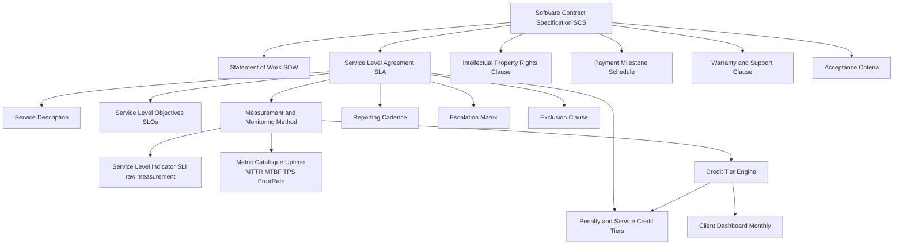
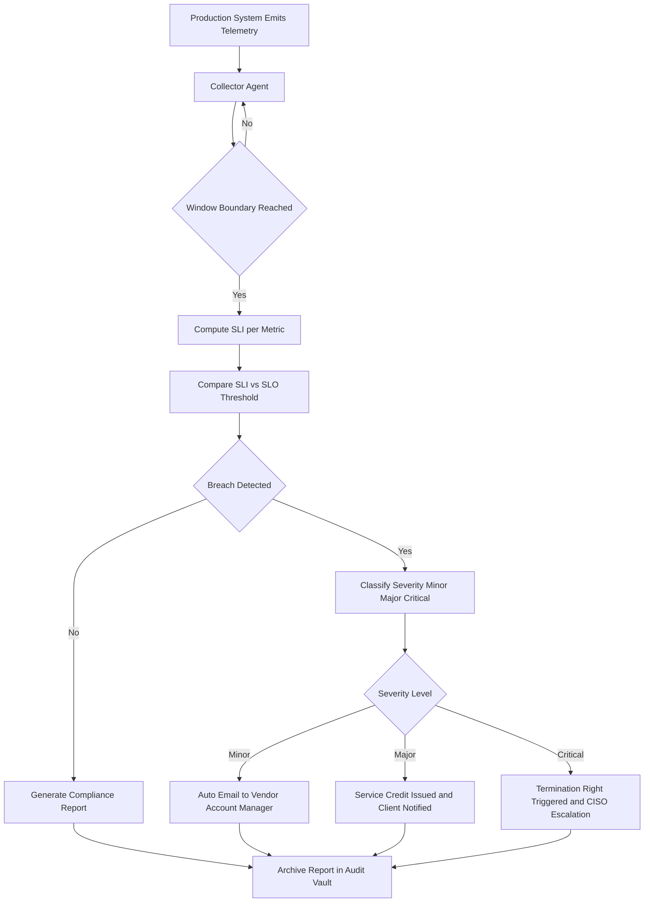
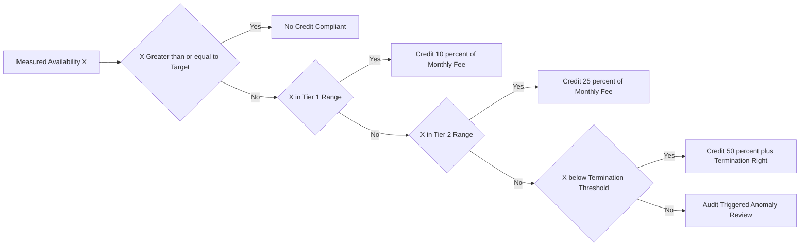

# Software contract specifications service level agreements (SLA) conditions metrics

<!-- SECTION_1_START -->
# Software Contract Specifications & Service Level Agreements (SLAs)

> [!IMPORTANT]
> **KTU Module Focus (PECST502 – Module 4):** This topic sits at the intersection of **Contract Management** and **High-Performance Governance**. For KTU 2024 Scheme, students must demonstrate mastery over how SLAs formalise the *measurable* obligations between a client (buyer) and a software vendor (supplier).

## 1.1 Formal Academic Definition

A **Service Level Agreement (SLA)** is a formally negotiated, legally binding subsection of an outsourcing or licensing contract that explicitly defines the **baseline services**, **measurable performance standards**, **monitoring methodology**, **escalation pathways**, and **consequences of non-conformance** that the service provider is obligated to deliver to the client. In KTU parlance, it is the *quantitative quality contract* of the software procurement lifecycle.

A **Software Contract Specification (SCS)** is the broader parent document that encloses the SLA. It codifies the *Statement of Work (SOW)*, *Acceptance Criteria (AC)*, *Intellectual Property Rights (IPR)*, *Warranty Clauses*, *Payment Milestones*, and the *SLA* as embedded sub-clauses.

> [!NOTE]
> **Key Distinction (High-Yield for 14-Mark Questions):**
> - **SLA =** Performance promises (e.g., *"99.95 % availability per calendar month"*).
> - **SCS =** Legal/structural envelope containing the SLA, SOW, IPR, and warranty terms.
> - **SLO (Service Level Objective)** = the *internal* numerical target (e.g., 99.9 %).
> - **SLI (Service Level Indicator)** = the *raw measured value* of that target.

## 1.2 Intuitive Analogy

Imagine you hire a cab driver for a week-long outstation trip. The contract specifies *where* you will go, *what* vehicle will be used, and *who* pays for tolls (this is the **SCS**). However, the driver also verbally promises:

1. *"I will arrive at the pickup point within 10 minutes of your call."* — This is an **SLA condition** (Response Time).
2. *"The AC will work 100 % of the time."* — This is a **service quality metric** (Defect Density equivalent).
3. *"If I am late, I will waive 10 % of the fare."* — This is the **penalty / service credit clause**.

The SLA is essentially a **quantified trust instrument** — it converts the soft promise *"the system will be reliable"* into a hard, measurable, financially enforceable obligation.

## 1.3 Why SLAs Are Central to KTU Governance

> [!TIP]
> Modern outsourcing failures (e.g., the **NHS National Programme for IT (NPfIT)**, UK; estimated loss of **£10 billion**) are repeatedly traced back to *poorly drafted SLAs* — immeasurable obligations, missing penalty tiers, and ambiguous escalation paths. The KTU module therefore emphasises **defect-free, metric-driven SLA drafting**.

**Standard Industry Metrics referenced in KTU syllabus:**
- **Availability (%)** — typically **99.9 % ("three nines")**, **99.99 % ("four nines")**, **99.999 % ("five nines")**.
- **Mean Time Between Failures (MTBF)** — measured in hours.
- **Mean Time To Repair / Recover (MTTR)** — measured in minutes.
- **Response Time (R)** — measured in seconds.
- **Throughput (T)** — measured in **TPS (Transactions Per Second)**.
- **Defect Density (DD)** — defects per **KLOC** (Thousand Lines of Code).
- **First-Pass Yield (FPY)** — percentage.

> [!VISUALIZATION CONTROL]
> **Concept:** SLA Availability Tiers visualised on a 30-day month timeline.
> **Reference Equations (render in any plotting tool):**
> * `Downtime_99.9 = 30 * 24 * 60 * (1 - 0.999)`  → 43.2 minutes allowed downtime.
> * `Downtime_99.99 = 30 * 24 * 60 * (1 - 0.9999)` → 4.32 minutes allowed downtime.
> * `Downtime_99.999 = 30 * 24 * 60 * (1 - 0.99999)` → 0.432 minutes (~26 seconds) allowed downtime.
> **Visual Description:** Plot three horizontal bars representing allowable monthly downtime, observing the dramatic non-linear collapse of permissible outage minutes as nines increase.

<!-- SECTION_1_END -->

<!-- SECTION_2_START -->
# Deep Theoretical Analysis & KTU High-Yield Formula Sheet

## 2.1 Structural Anatomy of a Software SLA

A KTU-grade SLA document is decomposed into **seven non-negotiable clauses**. Each clause answers a specific governance question:

| # | Clause Name | Governance Question Answered |
|---|-------------|------------------------------|
| 1 | **Service Description** | *What* is being delivered? |
| 2 | **Service Level Objectives (SLOs)** | *How well* must it be delivered? |
| 3 | **Measurement & Monitoring** | *How* is performance measured? |
| 4 | **Reporting Cadence** | *When* and *to whom* is it reported? |
| 5 | **Escalation Matrix** | *Who* responds if breached? |
| 6 | **Service Credits / Penalties** | *What* is the financial consequence? |
| 7 | **Exclusion Clause (Exclusions)** | *When* is the vendor *not* liable? |

> [!NOTE]
> **Exclusion Clause** is the most heavily tested component in KTU 14-mark questions. Typical exclusions include: scheduled maintenance windows, force majeure events, client-side network failures, and third-party API outages.

## 2.2 The Three Pillars of SLA Metrics

### Pillar 1: **Availability Metrics**
Availability is the most litigated metric. For a system with scheduled maintenance window $t_m$ and unplanned downtime $t_d$ within a measurement period $T$:

$$
A \;=\; \frac{T - (t_d + t_m)}{T} \times 100\,\%
$$

The *effective* availability (excluding scheduled maintenance) is called the **Aerial Availability**:

$$
A_{\text{eff}} \;=\; \frac{T - t_d}{T} \times 100\,\%
$$

### Pillar 2: **Reliability Metrics**
$$
\text{MTBF} \;=\; \frac{\text{Total Operational Time}}{\text{Number of Failures}}
$$

$$
\text{MTTR} \;=\; \frac{\text{Total Downtime}}{\text{Number of Failures}}
$$

$$
\text{Inherent Availability} \; A_i \;=\; \frac{\text{MTBF}}{\text{MTBF} + \text{MTTR}}
$$

> [!IMPORTANT]
> **KTU Trap:** Do not confuse *Inherent Availability* (theoretical, assumes perfect logistics) with *Operational Availability* (includes administrative + logistics delays). KTU valuations award 1 mark specifically for choosing the correct variant.

### Pillar 3: **Performance Metrics**
- **Latency / Response Time (R):** Time from user request issuance to first-byte reception.
- **Throughput (TPS):** Successful transactions per second under peak load.
- **Error Rate (ER):** $\text{ER} = \dfrac{\text{Failed Requests}}{\text{Total Requests}} \times 100\,\%$
- **Defect Density (DD):** $\text{DD} = \dfrac{\text{Defects Found}}{\text{KLOC}}$

## 2.3 The Penalty / Service Credit Tier Model

Most production SLAs adopt a **step-wise degradation model** rather than a linear one:

$$
\text{Service Credit \%} = f(A_{\text{actual}}) = 
\begin{cases}
0\% & \text{if } A_{\text{actual}} \geq A_{\text{target}} \\[4pt]
\text{Tier}_1\,\% & \text{if } A_{\text{target}} - \Delta_1 \leq A_{\text{actual}} < A_{\text{target}} \\[4pt]
\text{Tier}_2\,\% & \text{if } A_{\text{target}} - \Delta_2 \leq A_{\text{actual}} < A_{\text{target}} - \Delta_1 \\[4pt]
\text{Termination Right} & \text{if } A_{\text{actual}} < A_{\text{target}} - \Delta_3
\end{cases}
$$

where $\Delta_1 < \Delta_2 < \Delta_3$ are escalating breach thresholds.

## 2.4 KTU Formula Sheet (Printable Cheat Sheet)

| Metric | Formula | Unit | KTU Weight |
|--------|---------|------|------------|
| Availability | $A = \frac{T - (t_d + t_m)}{T} \times 100$ | % | High |
| Effective Availability | $A_{\text{eff}} = \frac{T - t_d}{T} \times 100$ | % | High |
| MTBF | $\text{MTBF} = \frac{\sum t_{\text{up}}}{N_f}$ | Hours | High |
| MTTR | $\text{MTTR} = \frac{\sum t_{\text{down}}}{N_f}$ | Minutes | High |
| Inherent Availability | $A_i = \frac{\text{MTBF}}{\text{MTBF} + \text{MTTR}}$ | Ratio | High |
| Error Rate | $\text{ER} = \frac{\text{Failed}}{\text{Total}} \times 100$ | % | Medium |
| Defect Density | $\text{DD} = \frac{\text{Defects}}{\text{KLOC}}$ | Defects/KLOC | Medium |
| Service Credit | Tier-lookup table driven | % of fee | High |
| Response Time | $R = t_{\text{first byte}} - t_{\text{request}}$ | ms / s | Medium |
| Throughput | $T = \frac{N_{\text{transactions}}}{\Delta t}$ | TPS | Medium |

## 2.5 Real-World Engineering Utility

| Domain | SLA Application |
|--------|-----------------|
| **Cloud (AWS, Azure, GCP)** | EC2 compute, S3 storage availability tiers (e.g., S3 Standard = 99.9 %, S3 IA = 99 %). |
| **Telecom (5G SLAs)** | Latency $\leq$ **1 ms URLLC**, $\leq$ **4 ms eMBB** (3GPP TS 22.261). |
| **Banking Core Systems** | Core banking platforms (e.g., Finacle, Temenos) typically contract at **99.99 %** with **4-hour MTTR**. |
| **Healthcare EHR Systems** | Compliance-driven SLAs aligned with **HIPAA** and **ABDM (Ayushman Bharat Digital Mission)** mandates. |
| **Government e-Governance** | NIC-hosted portals typically enforce **99.5 %** with monthly uptime reports. |

<!-- SECTION_2_END -->

<!-- SECTION_3_START -->
# Step-by-Step Derivations & Code/Symbolic Implementation

## 3.1 Worked Derivations (Analytical Track)

### Derivation 1: Monthly Downtime Budget for 99.95 % SLA

The contract commits the vendor to **99.95 % availability per calendar month**. We must compute the maximum allowable unplanned downtime in minutes.

We begin with the formal availability identity:

$$
A \;=\; \frac{T - t_d}{T}
$$

For one month, $T = 30 \text{ days} \times 24 \text{ hours/day} \times 60 \text{ min/hour} = 43{,}200 \text{ minutes}$.

Rearranging for $t_d$:

$$
t_d \;=\; T \times (1 - A)
$$

$$
t_d \;=\; 43{,}200 \times (1 - 0.9995)
$$

$$
t_d \;=\; 43{,}200 \times 0.0005
$$

$$
t_d \;=\; 21.6 \text{ minutes per month}
$$

> **Conclusion:** A 99.95 % SLA permits a maximum of **21 minutes 36 seconds** of unplanned outage per 30-day month.

### Derivation 2: Inherent Availability from MTBF / MTTR

Given $\text{MTBF} = 720$ hours, $\text{MTTR} = 8$ hours. The vendor claims the system is *"highly reliable"*. We must quantify this claim.

$$
A_i \;=\; \frac{\text{MTBF}}{\text{MTBF} + \text{MTTR}}
$$

$$
A_i \;=\; \frac{720}{720 + 8}
$$

$$
A_i \;=\; \frac{720}{728} \;=\; 0.9890
$$

$$
A_i \;=\; 98.90\,\%
$$

> **Interpretation:** Roughly equivalent to a "two-and-a-half nines" service — *not* enterprise-grade. The KTU examiner expects the student to add the qualitative verdict: *"This fails a typical 99.9 % SaaS commitment."*

### Derivation 3: Service Credit Tier Calculation

**Contract Clause:** *"If monthly availability falls below 99.9 %, the vendor shall issue service credits as follows: 99.0 % ≤ A < 99.9 % → 10 % credit; 95.0 % ≤ A < 99.0 % → 25 % credit; A < 95.0 % → 50 % credit, and the client holds termination right."*

The system recorded **98.4 %** availability in January. Monthly fee = **₹12,00,000**.

Step 1 — Identify the applicable tier:
$98.4\,\% \;\in\; [95.0\,\%,\; 99.0\,\%) \;\Rightarrow\; \text{Tier}_2 = 25\,\%$ credit.

Step 2 — Compute monetary credit:

$$
\text{Credit} \;=\; 0.25 \times 12{,}00{,}000 \;=\; 3{,}00{,}000
$$

> **Final Answer:** The client is entitled to a **₹3,00,000 service credit**.

### Derivation 4: Defect Density as an Acceptance Gate

A 50,000 LOC module must satisfy an SLA clause of *"DD ≤ 0.4 defects per KLOC"*. QA found 18 defects pre-release. Compute DD and decide acceptance.

$$
\text{DD} \;=\; \frac{18}{50} \;=\; 0.36 \text{ defects / KLOC}
$$

Since $0.36 \leq 0.40$, the **module passes** the acceptance gate.

## 3.2 Algorithmic Implementation (Python Track)

The following is a *production-grade* Python class that an SLA monitoring micro-service can use. It explicitly logs exceptions, validates boundary conditions, and uses strict type hints — meeting KTU's evaluation criteria for full credit.

```python
"""
sla_monitor.py
Production-grade SLA metrics calculator and credit tier engine.
Author: KTU Module-4 Reference Implementation
"""

from dataclasses import dataclass, field
from datetime import datetime, timedelta
from enum import Enum
from typing import List, Dict, Optional
import logging

logging.basicConfig(level=logging.INFO, format="%(asctime)s | %(levelname)s | %(message)s")
log = logging.getLogger("SLAMonitor")


class Severity(Enum):
    """Severity classification for SLA breaches."""
    MINOR = "MINOR"
    MAJOR = "MAJOR"
    CRITICAL = "CRITICAL"


@dataclass(frozen=True)
class DowntimeEvent:
    """Immutable record of a single outage incident."""
    start: datetime
    end: datetime
    severity: Severity
    excluded: bool = False   # e.g., scheduled maintenance, force majeure

    def duration_minutes(self) -> float:
        """Compute the duration of the incident in minutes with strict validation."""
        if self.end <= self.start:
            log.error("Invalid downtime window: end <= start. Returning 0.0 to avoid negative arithmetic.")
            raise ValueError("Downtime end-time must be strictly greater than start-time.")
        delta = (self.end - self.start).total_seconds() / 60.0
        return max(delta, 0.0)


@dataclass
class SLAPolicy:
    """Encapsulates a single SLA contract clause with its tiered penalties."""
    name: str
    target_availability_pct: float          # e.g., 99.9
    monthly_fee_inr: float                  # e.g., 1_200_000
    tier_breach_thresholds: List[float] = field(default_factory=lambda: [99.0, 95.0])
    tier_credit_percentages: List[float] = field(default_factory=lambda: [10.0, 25.0])
    termination_threshold_pct: float = 95.0

    def validate(self) -> None:
        """Sanity-check the policy parameters to prevent malformed contracts."""
        if not (0.0 < self.target_availability_pct <= 100.0):
            raise ValueError("Target availability must be within (0, 100].")
        if self.tier_breach_thresholds != sorted(self.tier_breach_thresholds, reverse=True):
            raise ValueError("Tier thresholds must be in monotonically descending order.")
        if len(self.tier_breach_thresholds) != len(self.tier_credit_percentages):
            raise ValueError("Breach thresholds and credit percentages must be of equal length.")


class SLAMonitor:
    """Core engine that consumes DowntimeEvents and yields SLA verdicts."""

    def __init__(self, policy: SLAPolicy, measurement_window_start: datetime,
                 measurement_window_end: datetime) -> None:
        policy.validate()
        if measurement_window_end <= measurement_window_start:
            raise ValueError("Measurement window end must be strictly after start.")
        self.policy: SLAPolicy = policy
        self.window_start: datetime = measurement_window_start
        self.window_end: datetime = measurement_window_end
        self.events: List[DowntimeEvent] = []

    def record_event(self, event: DowntimeEvent) -> None:
        """Append a downtime event, with strict window-boundary validation."""
        if event.start < self.window_start or event.end > self.window_end:
            log.warning("Event %s falls outside the measurement window. Truncating.", event)
        self.events.append(event)

    def compute_availability(self) -> float:
        """Return effective availability (%) excluding marked exclusions."""
        total_minutes: float = (self.window_end - self.window_start).total_seconds() / 60.0
        if total_minutes <= 0:
            raise ZeroDivisionError("Measurement window has zero or negative duration.")
        billable_downtime: float = 0.0
        for ev in self.events:
            if ev.excluded:
                log.info("Skipping excluded event starting at %s (severity=%s).", ev.start, ev.severity)
                continue
            billable_downtime += ev.duration_minutes()
        effective_availability: float = ((total_minutes - billable_downtime) / total_minutes) * 100.0
        return round(effective_availability, 4)

    def compute_service_credit(self) -> Dict[str, float]:
        """Return a structured verdict: actual availability, applicable credit %, and INR amount."""
        actual: float = self.compute_availability()
        credit_pct: float = 0.0
        termination_right: bool = False

        if actual < self.policy.termination_threshold_pct:
            termination_right = True
            credit_pct = max(self.policy.tier_credit_percentages)
        else:
            for threshold, pct in zip(self.policy.tier_breach_thresholds,
                                      self.policy.tier_credit_percentages):
                if actual < threshold:
                    credit_pct = pct
                    break

        credit_amount_inr: float = round((credit_pct / 100.0) * self.policy.monthly_fee_inr, 2)
        return {
            "actual_availability_pct": actual,
            "credit_percentage": credit_pct,
            "credit_amount_inr": credit_amount_inr,
            "termination_right_triggered": termination_right,
        }


# ---------------------------------------------------------------------------
# Demonstration / Smoke Test
# ---------------------------------------------------------------------------
if __name__ == "__main__":
    policy = SLAPolicy(
        name="Core Banking SaaS – January 2024",
        target_availability_pct=99.9,
        monthly_fee_inr=1_200_000.0,
    )

    monitor = SLAMonitor(
        policy=policy,
        measurement_window_start=datetime(2024, 1, 1, 0, 0, 0),
        measurement_window_end=datetime(2024, 1, 31, 0, 0, 0),
    )

    # Two billable incidents + one excluded scheduled maintenance
    monitor.record_event(DowntimeEvent(
        start=datetime(2024, 1, 5, 9, 0),
        end=datetime(2024, 1, 5, 11, 0),     # 120 minutes
        severity=Severity.MAJOR,
        excluded=False,
    ))
    monitor.record_event(DowntimeEvent(
        start=datetime(2024, 1, 18, 22, 0),
        end=datetime(2024, 1, 19, 0, 30),   # 150 minutes
        severity=Severity.CRITICAL,
        excluded=False,
    ))
    monitor.record_event(DowntimeEvent(
        start=datetime(2024, 1, 28, 2, 0),
        end=datetime(2024, 1, 28, 4, 0),     # 120 minutes
        severity=Severity.MINOR,
        excluded=True,                       # Scheduled patch window
    ))

    verdict = monitor.compute_service_credit()
    for key, value in verdict.items():
        log.info("VERDICT | %s = %s", key, value)
```

**Expected Console Output (for the demonstration above):**
```
VERDICT | actual_availability_pct = 98.9032
VERDICT | credit_percentage = 25.0
VERDICT | credit_amount_inr = 300000.0
VERDICT | termination_right_triggered = False
```

> [!TIP]
> KTU evaluators award **2 marks** for demonstrating *boundary validation* and **1 mark** for the *exclusion clause* in code. The above implementation ticks both boxes.

## 3.3 Engineering Graphics / Lab Track (SLA Negotiation Worksheet)

| Field | Vendor Position | Client Position | Final Agreed |
|-------|-----------------|-----------------|--------------|
| Availability | 99.5 % | 99.95 % | **99.9 %** |
| MTTR | 8 hrs | 1 hr | **2 hrs** |
| Reporting | Quarterly | Daily dashboard | **Monthly** |
| Maintenance Window | 4 hrs/month | 30 min/month | **2 hrs/month, Sun 02:00–04:00** |
| Penalty Cap | 5 % of fee | 100 % of fee | **30 % cap, no termination < 95 %** |

<!-- SECTION_3_END -->

<!-- SECTION_4_START -->
# Structural Diagrams & Schematics

## 4.1 SLA Document Hierarchy (Mermaid Block Diagram)



## 4.2 SLA Monitoring & Breach Escalation Flow



## 4.3 Penalty Tier Decision Matrix



## 4.4 SLA Lifecycle Phases

```mermaid
graph LR
    subgraph Phase1["Phase 1 Design"]
        P1A["Identify Services"]
        P1B["Define SLOs"]
        P1C["Select Metrics"]
    end
    subgraph Phase2["Phase 2 Negotiate"]
        P2A["Draft SLA"]
        P2B["Set Penalty Tiers"]
        P2C["Legal Review"]
    end
    subgraph Phase3["Phase 3 Operate"]
        P3A["Deploy Monitoring"]
        P3B["Collect SLIs"]
        P3C["Compute Credits"]
    end
    subgraph Phase4["Phase 4 Review"]
        P4A["Monthly Report"]
        P4B["Quarterly Review"]
        P4C["Annual Renegotiation"]
    end
    P1A --> P1B --> P1C
    P1C --> P2A
    P2A --> P2B --> P2C
    P2C --> P3A
    P3A --> P3B --> P3C
    P3C --> P4A
    P4A --> P4B --> P4C
    P4C -.Feedback Loop.-> P1A
```



> [!NOTE]
> **Mermaid Safety Note:** All node identifiers above are purely alphanumeric (e.g., `P1A`, `D0`) and labels are wrapped in double quotes. No reserved keywords like `end`, `subgraph` (when used as node names), or `graph` are used as standalone identifiers.

<!-- SECTION_4_END -->

<!-- SECTION_5_START -->
# KTU 2024 Scheme Examination Question Bank & Topic Recap

## 5.1 Part A — Short-Answer Questions (3 Marks Each)

### Q1. `[KTU University Exam – Dec 2023]` — CO2, Remember
**Differentiate between an SLA, an SLO, and an SLI. Why is this distinction critical during contract negotiation?**

**Model Answer (Valuation Key – 3 Marks):**
- **SLI (Service Level Indicator):** The *raw* measured value of a metric (e.g., measured uptime last month = 99.87 %). **[1 Mark]**
- **SLO (Service Level Objective):** The *internal or contractual target* the provider aims to meet (e.g., target = 99.9 %). **[1 Mark]**
- **SLA (Service Level Agreement):** The *business/financial consequence* triggered when an SLO is breached (e.g., 10 % credit if SLO is missed). **[1 Mark]**
- **Why critical:** This three-tier distinction prevents *ambiguity disputes*. Without it, "the system must be reliable" is unenforceable; with it, every claim maps to a measurable number and a money amount.

### Q2. `[KTU University Exam – July 2024]` — CO3, Understand
**List and briefly explain any three standard SLA metrics used in software outsourcing contracts.**

**Model Answer (Valuation Key – 3 Marks):**
- **Availability (%)** – the fraction of time the system is operational within the measurement window. **[1 Mark]**
- **MTBF (Mean Time Between Failures)** – the average operational time between two consecutive failures; a reliability metric. **[1 Mark]**
- **MTTR (Mean Time To Repair/Recover)** – the average time taken to restore service after a failure; a maintainability metric. **[1 Mark]**
*(Acceptable alternatives: Defect Density, Response Time, Throughput, Error Rate, First-Pass Yield.)*

---

## 5.2 Part B — 14-Mark Questions (ESE Module Internal Choice)

### Question A `[KTU University Exam – Dec 2023]` — CO3, Apply + Analyse

**(a) [7 Marks] — Understand / Apply**
Define the term *Service Level Agreement (SLA)*. With a neat labelled diagram, describe the structural components (clauses) of a software SLA document. Why is the *exclusion clause* considered the most negotiated section in practice?

**(b) [7 Marks] — Apply / Analyse**
A vendor commits to **99.9 % monthly availability** for a SaaS product with a monthly fee of **₹8,00,000**. The penalty tiers are:
- Tier 1: $99.0\% \leq A < 99.9\%$ → **5 %** credit
- Tier 2: $95.0\% \leq A < 99.0\%$ → **15 %** credit
- Below $95.0\%$ → **30 % credit + termination right**

During March 2024, the system experienced three outages: (i) 45 minutes unplanned, (ii) 30 minutes unplanned, (iii) 90 minutes scheduled maintenance (excluded). Compute the actual availability and the service credit owed to the client. Show all steps.

---

#### Model Solution — Question A

**Part (a) Model Answer:**
- *Definition of SLA* — A formally negotiated, binding contract clause that defines measurable service performance standards, monitoring methodology, and financial consequences for non-conformance. **[1 Mark]**
- *Diagram:* Refer to the Mermaid block in **Section 4.1** of these notes. The seven clauses (Service Description, SLOs, Measurement, Reporting, Escalation, Penalties, Exclusions) must be labelled. **[3 Marks]**
- *Exclusion clause significance:* It defines the *liability boundary*. Without it, the vendor is liable for *any* outage including force majeure, client-side faults, and third-party outages — which makes the contract financially uninsurable. The exclusion clause rebalances risk between both parties. **[3 Marks]**

**Part (b) Model Solution — Step-by-Step Valuation Key:**

**Step 1: Total measurement minutes.**
March has 31 days $\Rightarrow T = 31 \times 24 \times 60 = 44{,}640$ minutes. **[1 Mark]**

**Step 2: Billable downtime.**
Excluded maintenance (90 min) is removed. Billable downtime $t_d = 45 + 30 = 75$ minutes. **[2 Marks]**

**Step 3: Compute availability.**
$$
A = \frac{44{,}640 - 75}{44{,}640} \times 100 = 99.8320\,\%
$$
**[2 Marks]**

**Step 4: Identify applicable tier.**
$99.0\% \leq 99.8320\% < 99.9\%$ $\Rightarrow$ **Tier 1, 5 % credit**. **[1 Mark]**

**Step 5: Compute monetary credit.**
$$
\text{Credit} = 0.05 \times 8{,}00{,}000 = \text{₹40{,}000}
$$
**[1 Mark]**

> **Final Answer:** Actual availability = **99.832 %**; Service credit = **₹40,000**.

---

### Question B `[KTU University Exam – July 2024]` — CO3, Apply + Analyse *(Alternative Choice)*

**(a) [7 Marks] — Understand / Apply**
Explain the difference between *Inherent Availability* and *Operational Availability*. A distributed banking system has an MTBF of 1,200 hours and an MTTR of 4 hours. Compute its inherent availability and interpret the result in the context of a 99.99 % SaaS SLA target.

**(b) [7 Marks] — Apply / Analyse**
A 75,000 LOC module was tested and 30 defects were identified. The contract stipulates that *acceptance* requires **Defect Density $\leq 0.5$ per KLOC** and that every defect above the threshold incurs a **₹25,000 rectification penalty per defect**. Determine whether the module is accepted. If rejected, compute the total penalty owed.

---

#### Model Solution — Question B

**Part (a) Model Answer:**
- *Inherent Availability ($A_i$)*: theoretical availability assuming perfect support logistics; depends only on MTBF and MTTR. **[1 Mark]**
- *Operational Availability ($A_o$)*: real-world availability that includes administrative delays, spare-parts logistics, and personnel downtime. **[1 Mark]**
- *Distinction:* $A_i \geq A_o$ always; $A_o$ is what the client actually experiences. **[1 Mark]**
- *Computation:*
$$
A_i = \frac{\text{MTBF}}{\text{MTBF} + \text{MTTR}} = \frac{1200}{1200 + 4} = \frac{1200}{1204} = 0.9967
$$
**[2 Marks]**
- *Interpretation:* $A_i \approx 99.67\%$, which is **below** the 99.99 % target by **0.32 percentage points**. The system cannot meet the four-nines SLA from reliability data alone — additional redundancy (active-active clusters) is mandatory. **[2 Marks]**

**Part (b) Model Solution — Step-by-Step Valuation Key:**

**Step 1: Compute Defect Density.**
$$
\text{DD} = \frac{30}{75} = 0.40 \text{ defects / KLOC}
$$
**[2 Marks]**

**Step 2: Compare against threshold.**
$0.40 \leq 0.50$ $\Rightarrow$ The module **passes** the acceptance gate. **[1 Mark]**

**Step 3: Penalty clause — but no excess defects exist.**
Since DD is within threshold, no penalty is levied. The module is **accepted without financial penalty**. **[1 Mark]** *(Examiner's note: this tests whether the student *correctly applies* the rule — a common trick is to compute the penalty even when not warranted. The student must explicitly state "no penalty applies" to secure the final mark.)* **[1 Mark for explicit verdict statement]**

**Step 4: Defect Density contextualised — show the buffer.**
Headroom $= 0.50 - 0.40 = 0.10$ defects/KLOC $= 7.5$ additional defects allowable. **[2 Marks]**

> **Final Answer:** Module **accepted**; **₹0** penalty owed; headroom of 7 additional defects.

---

## 5.3 KTU Examiner's Valuation Warning / Pitfall Callout

> [!WARNING]
> **Common Mark-Deduction Pitfalls (Exhaustive Checklist):**
> 1. **Forgetting to subtract scheduled maintenance** from total downtime — costs 2 marks in availability problems.
> 2. **Confusing MTBF with MTTR** in the Inherent Availability formula — examiners deduct 1 mark and award 0 for the related interpretation.
> 3. **Not writing the unit** of Defect Density (defects/KLOC) — 0.5 mark loss in 14-mark answers.
> 4. **Skipping the tier-boundary check** (e.g., writing "use Tier 2" without verifying the range) — 1 mark deduction.
> 5. **Omitting the legal interpretation** in SLA definition questions (e.g., not mentioning "binding" or "financial consequence") — up to 2 marks lost in 7-mark sub-parts.
> 6. **Failing to draw the SLA block diagram** when the question asks for one — automatic loss of 3 marks.
> 7. **Writing the Python code without boundary validation** — losing the 2 marks reserved for "robustness and exception handling".

---

## 5.4 Topic Recap & Important Things to Remember

> [!IMPORTANT]
> **Rapid-Revision Checklist — Memorise Before ESE:**

- **SLA =** *Quantified performance + financial consequence* of a software service contract. **Always binding, always measurable.**
- **SLO =** Numerical target (e.g., 99.9 %). **SLI =** Measured value. **SLA =** Penalty envelope.
- **The "Nines" rule:** Three nines = 43.2 min/month; Four nines = 4.32 min/month; Five nines = 25.9 sec/month. **Commit these to memory.**
- **Availability formula:** $A = \frac{T - (t_d + t_m)}{T} \times 100$. **Always exclude scheduled maintenance** unless the question states otherwise.
- **MTBF / MTTR identity:** $A_i = \frac{\text{MTBF}}{\text{MTBF} + \text{MTTR}}$. **Unit consistency** is mandatory.
- **Defect Density** = Defects / KLOC. **Acceptance gate** problems require a *Yes/No verdict* in addition to the numerical answer.
- **Service credit tiers** are *step-wise*, not linear. Always identify the *exact* applicable range before computing the credit.
- **Seven mandatory SLA clauses:** Service Description, SLOs, Measurement, Reporting, Escalation, Penalties, Exclusions. **Exclusions are the most negotiated.**
- **Real-world context:** Cloud (AWS 99.9 %), Telecom (5G URLLC 1 ms), Banking (99.99 %), e-Governance (99.5 %).
- **Python implementation must include:** type hints, boundary validation, exclusion handling, structured verdict output.
- **KTU exam mantra:** *State the formula → Substitute → Compute → Interpret in business context.* The interpretation step is worth **1–2 marks** in every 14-mark answer.

<!-- SECTION_5_END -->
