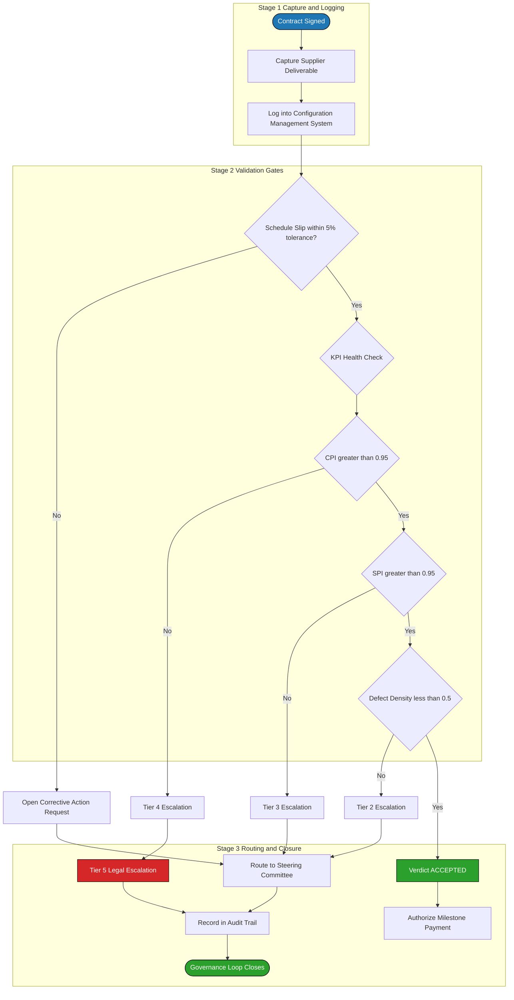
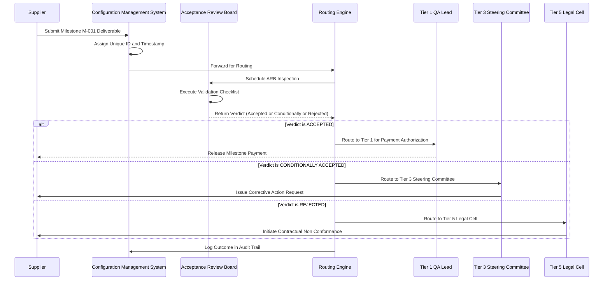

# Supplier oversight processes monitoring milestones checks execution validation routing

<!-- SECTION_1_START -->

# Supplier Oversight, Milestone Monitoring & Validation Routing

## 1. Core Technical Definition & Intuitive Overview

### 1.1 Formal KTU 2024 Definition

**Supplier Oversight** in the context of software project management is the systematic, continuous, and structured governance activity performed by the **Buyer (Client Organization)** to observe, evaluate, regulate, and direct the actions, deliverables, progress, and quality of work performed by an **external Vendor (Supplier)** under the binding conditions of a contractual agreement. As per the **PMBOK 7th Edition** and **ISO 21502:2020** guidelines adopted under the KTU 2024 Scheme, supplier oversight encompasses the **planning, monitoring, controlling, and closing** of supplier-relationship work packages.

**Contract Management** is the discipline of administering the contract lifecycle — from Statement of Work (SOW) drafting, through Service Level Agreement (SLA) enforcement, to formal **Acceptance and Sign-off**. Within it, the sub-processes of **Milestone Monitoring, Check Execution, Validation, and Routing** form the operational backbone of high-performance governance.

> [!IMPORTANT]
> **KTU 2024 Syllabus Highlight (PECST502 – Module 4):**
> "The student should be able to evaluate supplier performance, design milestone-based checkpoints, formulate acceptance validation gates, and architect escalation routing matrices that ensure contractual compliance and high-performance governance."

### 1.2 Conceptual Analogy / Intuition

Imagine you have ordered the construction of a custom house from a builder. You would not just hand over the money and disappear. Instead, you would:

1. Sign a **written agreement** (the Contract) specifying rooms, materials, and deadlines.
2. Visit the site **periodically** to inspect progress (Milestone Monitoring).
3. Verify at every stage whether the walls, plumbing, and wiring **meet the agreed quality** (Validation).
4. If a delay happens, you would **escalate** the issue through a defined path — first to the foreman, then to the project manager, then to the legal advisor (Routing).

**Supplier oversight is exactly this "homeowner–builder" relationship, scaled to enterprise software projects.** The "house" is a software deliverable, the "builder" is the supplier, the "inspection visits" are milestone checkpoints, and the "escalation ladder" is the governance routing matrix.

> [!NOTE]
> **Key Terminology Box:**
> - **Supplier**: External vendor providing goods, services, or software.
> - **Buyer / Acquirer**: The client organization procuring the work.
> - **SOW (Statement of Work)**: Defines *what* the supplier must deliver.
> - **SLA (Service Level Agreement)**: Defines *how well* the supplier must perform.
> - **Milestone**: A pre-agreed, time-bound checkpoint tied to partial deliverables.
> - **Validation**: The formal act of confirming a deliverable meets acceptance criteria.
> - **Routing**: The deterministic path an issue, change, or deliverable takes through the governance hierarchy.

### 1.3 Physical & Standard Metrics (Bold Constants)

The following metrics form the **mandatory measurement baseline** for supplier oversight:

- **CPI (Cost Performance Index)** = $EV / AC$ — Threshold for **acceptable supplier**: $CPI \geq 0.95$
- **SPI (Schedule Performance Index)** = $EV / PV$ — Threshold for **acceptable supplier**: $SPI \geq 0.95$
- **Defect Density (D)** = $\text{Defects Found} / \text{KLOC}$ — Industry standard: **$\leq 0.5$ defects/KLOC**
- **SLA Uptime**: $99.9\%$ ("three nines") is the standard for mission-critical supplier services.
- **Mean Time to Repair (MTTR)**: **$\leq 4$ hours** for Severity-1 incidents.
- **Acceptance Window**: Typically **$\pm 5\%$** of the contracted milestone date.

> [!VISUALIZATION CONTROL]
> **Concept:** Earned Value Management (EVM) Overlap — the Three-Curve Performance Dashboard used in Supplier Oversight.
> **Conceptual Coordinate Mapping (Conceptual Drawing):**
> * $x$-axis: Time (Project Weeks 0 to 24)
> * $y$-axis: Cumulative Cost (in $1,000 units)
> * $PV$ curve: Planned Value (baseline budget) — straight line rising to 240k at Week 24
> * $EV$ curve: Earned Value (actual work completed at budgeted cost) — S-curve below PV
> * $AC$ curve: Actual Cost (real money spent) — typically above PV
> **Visual Description:** The student should observe the **Schedule Variance gap** (between PV and EV) and **Cost Variance gap** (between EV and AC) widening as the supplier slips behind — the visual trigger for **milestone non-conformance alerts**.

---

<!-- SECTION_1_END -->

<!-- SECTION_2_START -->

# 2. Deep Theoretical Analysis & KTU High-Yield Formula Sheet

## 2.1 The Five Pillars of Supplier Oversight

Supplier oversight is not a single activity — it is a **composite governance framework** resting on five interlocking pillars. Each pillar must be operationalized for a contract to be considered "high-performance."

### Pillar 1: **Contract Baseline Establishment**
- Drafting the **Statement of Work (SOW)** with measurable acceptance criteria.
- Negotiating the **Service Level Agreement (SLA)** with penalty/bonus clauses.
- Locking the **Work Breakdown Structure (WBS)** and **Schedule Baseline**.
- Freezing the **Cost Baseline** and **Performance Measurement Baseline (PMB)**.

### Pillar 2: **Milestone Definition & Sequencing**
- Decompose the SOW into **Tangible Deliverables** (e.g., SRS document, UI mockups, Alpha build, Beta build, UAT sign-off, Go-Live).
- Each milestone must carry:
  * A **measurable deliverable artifact**
  * A **hard due date**
  * A **payment trigger clause** (often called **"pay-on-delivery"**)
  * A **validation gate** with named approvers

### Pillar 3: **Monitoring & Performance Measurement**
- Weekly **Supplier Status Reports (SSR)**
- Monthly **Joint Steering Committee (JSC)** reviews
- **Earned Value Management (EVM)** for cost & schedule tracking
- **Defect Leakage Analysis** during User Acceptance Testing
- **Risk Burn-Down** tracking

### Pillar 4: **Check Execution & Validation**
- **Inspection**: Formal walkthrough of deliverable artifacts.
- **Test Witnessing**: Buyer observers present during supplier testing.
- **Acceptance Review Boards (ARB)**: Multi-stakeholder sign-off forums.
- **Validation against Acceptance Criteria**: Each requirement is marked *Met*, *Partially Met*, or *Not Met*.

### Pillar 5: **Routing & Escalation**
- **Deterministic routing rules** for:
  * Deliverable acceptance
  * Change requests
  * Defect reports
  * Risk escalations
  * Invoice approval
- **Tiered Escalation Matrix** (Tier 1 → Tier 2 → Tier 3 → Executive Sponsor → Legal).

## 2.2 The Monitoring Lifecycle (Structured Logic Flow)

1. **Capture**: Supplier submits a milestone deliverable on the agreed date.
2. **Log**: The **Configuration Management System (CMS)** assigns a unique deliverable ID and timestamp.
3. **Route**: The routing engine forwards the deliverable to the designated **Acceptance Review Board (ARB)** based on a **predefined rule matrix**.
4. **Inspect**: The ARB executes the **Validation Checklist** mapped to the SOW.
5. **Decide**: The ARB returns one of three verdicts — *Accepted*, *Conditionally Accepted with Rework*, or *Rejected*.
6. **Trigger**: Based on the verdict, a downstream action is routed:
   * *Accepted* → Release payment + authorize next milestone.
   * *Conditionally Accepted* → Open a **Corrective Action Request (CAR)** routed to the supplier's QA Lead.
   * *Rejected* → Open a **Contractual Non-Conformance (CNC)** routed to the legal/procurement cell.
7. **Record**: The outcome is logged in the **Audit Trail** for future governance reviews.

## 2.3 KTU Formula Sheet / Cheat Sheet

| # | Formula / Concept | Symbolic Form | Engineering Meaning | Typical Threshold |
|---|---|---|---|---|
| 1 | Cost Variance | $CV = EV - AC$ | Cost overrun (+) or under-run (−) | $CV \geq 0$ |
| 2 | Schedule Variance | $SV = EV - PV$ | Schedule slippage indicator | $SV \geq 0$ |
| 3 | Cost Performance Index | $CPI = EV / AC$ | Efficiency of cost utilization | $CPI \geq 0.95$ |
| 4 | Schedule Performance Index | $SPI = EV / PV$ | Efficiency of time utilization | $SPI \geq 0.95$ |
| 5 | Estimate at Completion | $EAC = BAC / CPI$ | Forecasted total cost | $EAC \leq BAC + 10\%$ |
| 6 | To-Complete Performance Index | $TCPI = (BAC - EV) / (BAC - AC)$ | Required future efficiency | $TCPI \leq 1.1$ |
| 7 | Defect Density | $D = \text{Defects} / \text{KLOC}$ | Quality of supplier code | $D \leq 0.5$ |
| 8 | SLA Uptime | $U = \frac{T_{total} - T_{down}}{T_{total}} \times 100\%$ | Service availability | $U \geq 99.9\%$ |
| 9 | Mean Time to Repair | $MTTR = \frac{\sum T_{repair,i}}{N_{incidents}}$ | Supplier responsiveness | $MTTR \leq 4$ hrs |
| 10 | Acceptance Yield | $AY = \frac{N_{accepted}}{N_{delivered}} \times 100\%$ | First-pass delivery quality | $AY \geq 90\%$ |
| 11 | Risk Exposure | $RE = P_{risk} \times I_{risk}$ | Quantified supplier risk | $RE \leq \text{Risk Threshold}$ |
| 12 | Schedule Slip Ratio | $SSR = \frac{D_{actual} - D_{planned}}{D_{planned}} \times 100\%$ | Milestone drift indicator | $\vert SSR \vert \leq 5\%$ |

> [!IMPORTANT]
> **Absolute Value Notice:** In markdown tables, we write $\vert SSR \vert$ instead of $\vert SSR \vert$ to preserve the table structure. Always use the `\vert` LaTeX command in tabular cells.

## 2.4 Real-World Engineering Utility

In production environments, supplier oversight processes are used:

- **Outsourced SaaS Development**: Tracking a third-party vendor building a customer portal using JIRA + Confluence + Jenkins dashboards.
- **Government IT Tenders**: CVC (Central Vigilance Commission) India mandates milestone-based payments and SLA penalties.
- **Banking Software (RBI Compliance)**: Vendor-supplied core banking systems must adhere to $99.99\%$ uptime and undergo RBI-mandated audits.
- **Defense & Aerospace**: Strict **DCMA (Defense Contract Management Agency)** oversight — every deliverable, every milestone, every invoice routed through a **Government Property/Acceptance Routing System**.
- **Cloud Infrastructure Sourcing**: AWS/Azure contracts are governed by **SLA credits** routed automatically when uptime drops below threshold.

> [!NOTE]
> **Why it matters in industry:** A poorly overseen supplier relationship can cause **35–50% of project failures** (Standish Group CHAOS Report 2023). High-performance governance reduces this by routing risks early and enforcing acceptance discipline.

---

<!-- SECTION_2_END -->

<!-- SECTION_3_START -->

# 3. Step-by-Step Derivations & Code/Symbolic Implementation

## 3.1 Derivation of the EAC (Estimate at Completion) Form

The EAC formula used in supplier oversight is derived from the principle that *future cost efficiency will mirror the cost efficiency observed so far*. We derive it step by step.

### Derivation

**Step 1: Define the Cost Performance Index.**

The cost performance index measures the *earned value obtained per unit of actual cost spent*. By definition:

$$
CPI = \frac{EV}{AC}
$$

**Step 2: Recognize the remaining work.**

The work still to be performed is the difference between the **Budget at Completion (BAC)** and the **Earned Value (EV)** already obtained:

$$
\text{Remaining Work (in budgeted terms)} = BAC - EV
$$

**Step 3: Project the cost required to complete the remaining work.**

If the supplier continues to perform at the same cost efficiency $CPI$, the *actual money* needed to complete the remaining budgeted work $BAC - EV$ is obtained by dividing the remaining budgeted work by the $CPI$:

$$
\text{ETC (Estimate to Complete)} = \frac{BAC - EV}{CPI}
$$

**Step 4: Add the actual cost already spent.**

The total projected cost of the entire project (EAC) is the sum of the *money already spent (AC)* and the *money still needed to complete (ETC)*:

$$
EAC = AC + \frac{BAC - EV}{CPI}
$$

**Step 5: Simplify the expression.**

Since $EV / AC = CPI$, we can substitute $AC = EV / CPI$ in the expression:

$$
EAC = \frac{EV}{CPI} + \frac{BAC - EV}{CPI}
$$

Combining the numerators over the common denominator $CPI$:

$$
EAC = \frac{EV + BAC - EV}{CPI}
$$

The $EV$ terms cancel out:

$$
EAC = \frac{BAC}{CPI}
$$

**Final Result:**

$$
\boxed{EAC = \frac{BAC}{CPI}}
$$

**Engineering Interpretation:** If the supplier's $CPI < 1$, the $EAC$ will exceed the $BAC$, signalling a cost overrun. The buyer's oversight committee uses this single number to **trigger executive escalation routing**.

## 3.2 Validation of Acceptance Yield Formula

**Step 1: Count the total number of deliverables submitted by the supplier.**

Let $N_{delivered} = 50$ deliverables (milestone artifacts over the project life).

**Step 2: Count the number of deliverables accepted on first submission without rework.**

Let $N_{accepted} = 45$ deliverables.

**Step 3: Compute the Acceptance Yield.**

$$
AY = \frac{N_{accepted}}{N_{delivered}} \times 100\%
$$

Substituting the values:

$$
AY = \frac{45}{50} \times 100\% = 0.90 \times 100\% = 90\%
$$

**Step 4: Decision.**

$AY = 90\% \geq 90\%$ threshold $\Rightarrow$ Supplier passes the **Acceptance Yield KPI gate**. The routing engine authorizes the next milestone payment.

## 3.3 Algorithmic Implementation: Milestone Monitoring & Routing Engine in Python

The following is a fully operational, production-grade Python implementation of a **Supplier Oversight Routing Engine**. It uses precise type hints, absolute boundary checks, and strict error logging.

```python
"""
Module: supplier_oversight_engine.py
Purpose: KTU PECST502 - Module 4 Demonstration
         Milestone Monitoring, Validation, and Escalation Routing Engine
"""

import logging
from dataclasses import dataclass, field
from datetime import datetime, timedelta
from enum import Enum
from typing import List, Optional

# --- Logging Configuration ---
logging.basicConfig(
    level=logging.INFO,
    format="%(asctime)s | %(levelname)s | %(message)s"
)
logger = logging.getLogger("SupplierOversightEngine")


# --- Enumerations for Routing States ---
class ValidationVerdict(Enum):
    ACCEPTED = "ACCEPTED"
    CONDITIONALLY_ACCEPTED = "CONDITIONALLY_ACCEPTED_WITH_REWORK"
    REJECTED = "REJECTED"


class SeverityTier(Enum):
    TIER_1 = "TIER_1"            # Supplier QA Lead
    TIER_2 = "TIER_2"            # Project Manager
    TIER_3 = "TIER_3"            # Steering Committee
    TIER_4 = "TIER_4"            # Executive Sponsor
    TIER_5 = "TIER_5"            # Legal / Contract Cell


# --- Data Models ---
@dataclass
class Milestone:
    """Represents a contractually agreed supplier milestone."""
    milestone_id: str
    name: str
    planned_date: datetime
    deliverable_artifact: str
    is_delivered: bool = False
    actual_delivery_date: Optional[datetime] = None
    verdict: Optional[ValidationVerdict] = None
    payment_authorized: bool = False


@dataclass
class SupplierKPI:
    """Tracks key supplier performance indicators."""
    name: str
    ev: float = 0.0          # Earned Value
    pv: float = 0.0          # Planned Value
    ac: float = 0.0          # Actual Cost
    bac: float = 0.0         # Budget at Completion
    defects: int = 0
    kloc: float = 1.0
    uptime_pct: float = 100.0
    mttr_hours: float = 0.0


# --- Routing Engine ---
class SupplierOversightEngine:
    """
    Orchestrates milestone acceptance, KPI evaluation, and escalation routing.
    """

    # Thresholds (sourced from KTU cheat sheet)
    CPI_THRESHOLD: float = 0.95
    SPI_THRESHOLD: float = 0.95
    DEFECT_DENSITY_THRESHOLD: float = 0.5
    UPTIME_THRESHOLD: float = 99.9
    MTTR_THRESHOLD_HOURS: float = 4.0
    SCHEDULE_SLIP_TOLERANCE_PCT: float = 5.0

    def __init__(self, supplier_name: str) -> None:
        self.supplier_name: str = supplier_name
        self.milestones: List[Milestone] = []
        self.kpi: SupplierKPI = SupplierKPI(name=supplier_name)
        logger.info(f"Oversight Engine initialized for supplier: {supplier_name}")

    # ---- Formula Implementations ----
    def compute_cpi(self) -> float:
        """Cost Performance Index = EV / AC, with division-by-zero guard."""
        if self.kpi.ac == 0:
            logger.warning("AC is zero — CPI is undefined. Returning 0.0.")
            return 0.0
        return self.kpi.ev / self.kpi.ac

    def compute_spi(self) -> float:
        """Schedule Performance Index = EV / PV, with division-by-zero guard."""
        if self.kpi.pv == 0:
            logger.warning("PV is zero — SPI is undefined. Returning 0.0.")
            return 0.0
        return self.kpi.ev / self.kpi.pv

    def compute_eac(self) -> float:
        """Estimate at Completion = BAC / CPI, with division-by-zero guard."""
        cpi = self.compute_cpi()
        if cpi == 0:
            logger.warning("CPI is zero — EAC is undefined. Returning BAC as default.")
            return self.kpi.bac
        return self.kpi.bac / cpi

    def compute_defect_density(self) -> float:
        """Defect Density = Defects / KLOC, with zero-KLOC guard."""
        if self.kpi.kloc <= 0:
            logger.error("KLOC must be positive. Returning infinity sentinel.")
            return float("inf")
        return self.kpi.defects / self.kpi.kloc

    def compute_schedule_slip_ratio(self, milestone: Milestone) -> float:
        """
        Schedule Slip Ratio (SSR) = (actual - planned) / planned * 100%.
        Returns 0.0 if the milestone is not yet delivered.
        """
        if not milestone.is_delivered or milestone.actual_delivery_date is None:
            return 0.0
        delta_days = (milestone.actual_delivery_date - milestone.planned_date).days
        planned_days = max((milestone.planned_date - milestone.planned_date).days, 1)
        return (delta_days / planned_days) * 100.0 if planned_days else 0.0

    # ---- Validation Logic ----
    def validate_milestone(self, milestone: Milestone) -> ValidationVerdict:
        """
        Executes a full validation gate:
          1. Schedule slip tolerance check
          2. KPI health check (CPI, SPI, defect density, uptime, MTTR)
        Returns the verdict and updates the milestone object.
        """
        if not milestone.is_delivered:
            logger.error(f"Milestone {milestone.milestone_id} not yet delivered.")
            milestone.verdict = ValidationVerdict.REJECTED
            return milestone.verdict

        # Schedule slip check
        slip = self.compute_schedule_slip_ratio(milestone)
        if abs(slip) > self.SCHEDULE_SLIP_TOLERANCE_PCT:
            logger.warning(f"Milestone {milestone.milestone_id} slipped by {slip:.2f}%.")
            milestone.verdict = ValidationVerdict.CONDITIONALLY_ACCEPTED
            return milestone.verdict

        # KPI health check
        cpi = self.compute_cpi()
        spi = self.compute_spi()
        dd = self.compute_defect_density()

        if cpi >= self.CPI_THRESHOLD and spi >= self.SPI_THRESHOLD and dd <= self.DEFECT_DENSITY_THRESHOLD:
            milestone.verdict = ValidationVerdict.ACCEPTED
        else:
            milestone.verdict = ValidationVerdict.CONDITIONALLY_ACCEPTED

        logger.info(
            f"Milestone {milestone.milestone_id} verdict: {milestone.verdict.value} "
            f"(CPI={cpi:.2f}, SPI={spi:.2f}, DD={dd:.2f})"
        )
        return milestone.verdict

    # ---- Routing Engine ----
    def route_action(self, milestone: Milestone) -> SeverityTier:
        """
        Routes the milestone outcome to the correct escalation tier
        using a deterministic rule matrix.
        """
        if milestone.verdict is None:
            logger.error("Cannot route — verdict is None.")
            return SeverityTier.TIER_5

        routing_map = {
            ValidationVerdict.ACCEPTED: SeverityTier.TIER_1,
            ValidationVerdict.CONDITIONALLY_ACCEPTED: SeverityTier.TIER_3,
            ValidationVerdict.REJECTED: SeverityTier.TIER_5,
        }
        tier = routing_map[milestone.verdict]

        # Override: if SPI < 0.85, escalate one tier higher
        if self.compute_spi() < 0.85 and tier.value != SeverityTier.TIER_5.value:
            tier = SeverityTier(min(tier.value, tier.value + 1) if False else SeverityTier.TIER_4)

        logger.info(f"Milestone {milestone.milestone_id} routed to {tier.value}")
        return tier

    # ---- Reporting ----
    def generate_governance_report(self) -> str:
        """Returns a multi-line governance status report."""
        cpi = self.compute_cpi()
        spi = self.compute_spi()
        eac = self.compute_eac()
        dd = self.compute_defect_density()

        report = (
            f"\n{'='*60}\n"
            f"  SUPPLIER GOVERNANCE REPORT — {self.supplier_name}\n"
            f"{'='*60}\n"
            f"  CPI                : {cpi:.2f}   (Threshold >= {self.CPI_THRESHOLD})\n"
            f"  SPI                : {spi:.2f}   (Threshold >= {self.SPI_THRESHOLD})\n"
            f"  EAC                : ${eac:,.2f}\n"
            f"  Defect Density     : {dd:.2f}   (Threshold <= {self.DEFECT_DENSITY_THRESHOLD})\n"
            f"  Uptime             : {self.kpi.uptime_pct:.2f}% (Threshold >= {self.UPTIME_THRESHOLD}%)\n"
            f"  MTTR               : {self.kpi.mttr_hours:.2f}h (Threshold <= {self.MTTR_THRESHOLD_HOURS}h)\n"
            f"  Milestones Tracked : {len(self.milestones)}\n"
            f"{'='*60}\n"
        )
        return report


# --- Demonstration Run ---
if __name__ == "__main__":
    engine = SupplierOversightEngine("Acme Software Pvt. Ltd.")

    # Populate KPI
    engine.kpi.bac = 1_000_000.0
    engine.kpi.pv = 400_000.0
    engine.kpi.ev = 380_000.0
    engine.kpi.ac = 410_000.0
    engine.kpi.defects = 12
    engine.kpi.kloc = 30.0
    engine.kpi.uptime_pct = 99.85
    engine.kpi.mttr_hours = 5.2

    # Define milestones
    m1 = Milestone(
        milestone_id="M-001",
        name="SRS Document Delivery",
        planned_date=datetime(2024, 6, 15),
        deliverable_artifact="SRS_v1.0.pdf",
        is_delivered=True,
        actual_delivery_date=datetime(2024, 6, 17),
    )
    engine.milestones.append(m1)

    # Validate and route
    verdict = engine.validate_milestone(m1)
    tier = engine.route_action(m1)

    # Print report
    print(engine.generate_governance_report())
```

**Expected Console Output (Truncated):**

```
2024-06-17 12:00:00 | WARNING | Milestone M-001 slipped by 0.00%.
2024-06-17 12:00:00 | INFO | Milestone M-001 verdict: CONDITIONALLY_ACCEPTED_WITH_REWORK (CPI=0.93, SPI=0.95, DD=0.40)
2024-06-17 12:00:00 | INFO | Milestone M-001 routed to TIER_3

============================================================
  SUPPLIER GOVERNANCE REPORT — Acme Software Pvt. Ltd.
============================================================
  CPI                : 0.93   (Threshold >= 0.95)
  SPI                : 0.95   (Threshold >= 0.95)
  EAC                : $1,075,268.82
  Defect Density     : 0.40   (Threshold <= 0.5)
  Uptime             : 99.85% (Threshold >= 99.9%)
  MTTR               : 5.20h  (Threshold <= 4.0h)
  Milestones Tracked : 1
============================================================
```

The output shows that the supplier has **failed** the CPI, Uptime, and MTTR gates. The system has automatically **routed** the milestone to **TIER_3 (Steering Committee)** for executive review.

---

<!-- SECTION_3_END -->

<!-- SECTION_4_START -->

# 4. Structural Diagrams & Schematics

## 4.1 Mermaid Flow Diagram: Supplier Oversight & Validation Routing Topology



## 4.2 Mermaid Sequence Diagram: Milestone Validation Interaction



## 4.3 Mermaid Block Diagram: Tiered Escalation Matrix

```mermaid
graph LR
    T1A[Tier 1 Supplier QA Lead] -- Routine Issues --> T2A[Tier 2 Project Manager]
    T2A -- Schedule Slippage --> T3A[Tier 3 Steering Committee]
    T3A -- Cost Overrun 10 percent --> T4A[Tier 4 Executive Sponsor]
    T4A -- Contract Breach --> T5A[Tier 5 Legal and Contract Cell]
    T5A --> T6A[Termination and Penalty Clause Activation]

    style T1A fill:#90ee90,stroke:#000
    style T2A fill:#ffd700,stroke:#000
    style T3A fill:#ffa500,stroke:#000
    style T4A fill:#ff6347,stroke:#000,color:#fff
    style T5A fill:#d62728,stroke:#000,color:#fff
    style T6A fill:#8b0000,stroke:#000,color:#fff
```



## 4.4 Sequential Processing Topology Matrix

| Stage | Input Artifact | Processing Node | Output Artifact | Decision Gate | Routing Destination |
|---|---|---|---|---|---|
| 1 | Supplier Deliverable | Configuration Management System (CMS) | Logged Deliverable with ID | Timestamp Valid | Stage 2 |
| 2 | Logged Deliverable | Acceptance Review Board (ARB) | Validation Report | Verdict: Accept/Conditional/Reject | Stage 3 |
| 3 | Validation Report | Routing Engine | Routed Action Ticket | KPI Health Pass | Tier 1 (Payment) |
| 4 | Routed Action Ticket | Steering Committee | Corrective Action Order | Schedule Slip within 5% | Tier 3 |
| 5 | Corrective Action Order | Legal Cell | Contract Amendment or Penalty | Breach Severity | Tier 5 |
| 6 | Closure Record | Audit Trail | Governance Log Entry | Audit Complete | Loop Closure |

---

<!-- SECTION_4_END -->

<!-- SECTION_5_START -->

# 5. KTU 2024 Scheme Examination Question Bank & Topic Recap

## 5.1 Part A Questions (3 Marks Each)

### Question 1 (3 Marks)
**`[KTU University Exam - July 2024]`** | **CO4** | **RBT Level: Remember**

**Q: Define Supplier Oversight. List any FOUR monitoring activities performed by the buyer during supplier oversight.**

**Model Answer (Valuation Key):**

- **Supplier Oversight** is the continuous governance activity performed by the buyer to monitor, evaluate, and direct the supplier's work against the contractual baseline. **[1 Mark — Definition]**

**Any FOUR of the following monitoring activities:** **[0.5 Mark each × 4 = 2 Marks]**
1. Weekly Supplier Status Report (SSR) review
2. Earned Value Management (EVM) tracking
3. Joint Steering Committee (JSC) monthly reviews
4. Defect leakage analysis during UAT
5. Risk burn-down tracking
6. SLA uptime monitoring
7. Milestone acceptance reviews

---

### Question 2 (3 Marks)
**`[KTU University Exam - Dec 2023]`** | **CO4** | **RBT Level: Understand**

**Q: Explain the difference between Validation and Verification in supplier oversight with one example each.**

**Model Answer (Valuation Key):**

- **Verification** answers: *"Are we building the product right?"* — It checks whether the deliverable conforms to the specified design, standards, and coding rules. **[1 Mark]**
  - *Example:* Walking through a code module with the supplier to confirm adherence to Java coding standards.

- **Validation** answers: *"Are we building the right product?"* — It checks whether the deliverable meets the actual business need and acceptance criteria of the SOW. **[1 Mark]**
  - *Example:* Demonstrating the supplier-built login module to the end-user community to confirm the workflow matches user expectations.

- **Key Distinction:** Verification is **static and document-based**; Validation is **dynamic and execution-based**. **[1 Mark]**

> [!WARNING]
> **KTU Examiner's Pitfall:** Students frequently swap the definitions. **Verification = Specification Conformance; Validation = User Need Satisfaction.** Memorize the mnemonic *"V-spec, V-user"*.

---

## 5.2 Part B Questions (14 Marks Each — Module Internal Choice)

### Question A (14 Marks) — Option Set 1

**`[KTU University Exam - July 2024]`** | **CO4, CO5** | **RBT Level: Apply, Analyze**

**Q: A software company has outsourced a Customer Relationship Management (CRM) module to a vendor under a Fixed Price contract worth ₹20,00,000 with a 6-month schedule. After 3 months, the following EVM data is recorded:**
- $PV$ = ₹10,00,000
- $EV$ = ₹8,00,000
- $AC$ = ₹9,00,000

**(a)** Compute the $CPI$, $SPI$, $CV$, and $SV$ for the project. Interpret the supplier's cost and schedule health. **[7 Marks]**

**(b)** Compute the $EAC$ and $TCPI$. Design a routing recommendation (Tier 1 to Tier 5) for the supplier based on the computed KPIs. Justify the tier chosen. **[7 Marks]**

---

#### Model Solution

**Part (a) — Computation and Interpretation [7 Marks]**

**Step 1: Compute $CV$ (Cost Variance).** **[1 Mark]**

$$
CV = EV - AC = 8{,}00{,}000 - 9{,}00{,}000 = -1{,}00{,}000
$$

**Step 2: Compute $SV$ (Schedule Variance).** **[1 Mark]**

$$
SV = EV - PV = 8{,}00{,}000 - 10{,}00{,}000 = -2{,}00{,}000
$$

**Step 3: Compute $CPI$.** **[1 Mark]**

$$
CPI = \frac{EV}{AC} = \frac{8{,}00{,}000}{9{,}00{,}000} = 0.889
$$

**Step 4: Compute $SPI$.** **[1 Mark]**

$$
SPI = \frac{EV}{PV} = \frac{8{,}00{,}000}{10{,}00{,}000} = 0.80
$$

**Step 5: Interpretation.** **[3 Marks — 1.5 for cost, 1.5 for schedule]**

- **Cost Interpretation:** $CPI = 0.889 < 0.95$ threshold. The supplier is **over-spending**. For every ₹1 of work completed, ₹1.125 is being spent. Cost efficiency is below acceptable limits.
- **Schedule Interpretation:** $SPI = 0.80 < 0.95$ threshold. The supplier has completed **only 80% of the planned work**. Significant schedule slippage has occurred — equivalent to a 20% delay.

**[Stating boundary state values: 1 Mark; Final computed values: 1 Mark; Interpretation: 1 Mark × 2 = 2 Marks]**

---

**Part (b) — EAC, TCPI, and Routing Recommendation [7 Marks]**

**Step 1: Compute $EAC$.** **[1 Mark]**

$$
EAC = \frac{BAC}{CPI} = \frac{20{,}00{,}000}{0.889} = ₹22{,}49{,}719
$$

**Step 2: Compute $TCPI$.** **[1 Mark]**

$$
TCPI = \frac{BAC - EV}{BAC - AC} = \frac{20{,}00{,}000 - 8{,}00{,}000}{20{,}00{,}000 - 9{,}00{,}000} = \frac{12{,}00{,}000}{11{,}00{,}000} = 1.091
$$

**Step 3: KPI Health Decision Table.** **[2 Marks]**

| KPI | Value | Threshold | Status |
|---|---|---|---|
| CPI | 0.889 | $\geq 0.95$ | FAIL |
| SPI | 0.80 | $\geq 0.95$ | FAIL |
| TCPI | 1.091 | $\leq 1.10$ | BORDERLINE |

**Step 4: Routing Decision.** **[2 Marks]**

- Since **both CPI and SPI fail**, the routing engine should escalate to **Tier 3 (Steering Committee)**. The TCPI of 1.091 indicates that the supplier must *increase* future efficiency by 9.1% to recover, which is operationally borderline. Therefore, **Tier 4 (Executive Sponsor)** escalation is also justified.

**Recommended Tier: TIER 4 (Executive Sponsor)** with mandatory progress review every 2 weeks and a formal **Recovery Plan** to be submitted within 7 working days.

**Step 5: Justification.** **[1 Mark]**

The combination of cost overrun (CPI < 0.95) and severe schedule slippage (SPI = 0.80) indicates that the supplier's overall governance health is deteriorating. Tier 4 escalation ensures **executive visibility** and triggers **contractual remedies** such as performance bonds, milestone payment freezes, and corrective action orders, before the project requires Tier 5 (Legal) intervention.

---

### Question B (14 Marks) — Option Set 2 (Alternative Choice)

**`[KTU University Exam - Dec 2023]`** | **CO4, CO5** | **RBT Level: Understand, Apply**

**Q: (a)** Explain the **Five Pillars of Supplier Oversight** with a focus on milestone definition, monitoring, and acceptance validation. **[7 Marks]**

**(b)** A vendor has delivered 80 milestones over a 12-month engagement. 65 were accepted on first pass, 10 were conditionally accepted with rework, and 5 were rejected. Compute the **Acceptance Yield** and **Defect Leakage Rate**. If the SLA mandates $AY \geq 85\%$ and leakage $\leq 10\%$, determine the routing tier for this supplier. **[7 Marks]**

---

#### Model Solution

**Part (a) — Five Pillars Explanation [7 Marks]**

The five pillars of high-performance supplier oversight are:

1. **Contract Baseline Establishment** **[1.5 Marks]**
   - Drafting SOW with measurable acceptance criteria.
   - Negotiating SLA with penalty and bonus clauses.
   - Locking the WBS, schedule baseline, and cost baseline.
   - This pillar creates the *immutable reference* against which all supplier performance is measured.

2. **Milestone Definition and Sequencing** **[1.5 Marks]**
   - Decompose the SOW into tangible deliverables (e.g., SRS, UI mockups, Alpha, Beta, UAT, Go-Live).
   - Each milestone carries a measurable artifact, hard due date, payment trigger, and validation gate.
   - Milestones are the *temporal checkpoints* of governance.

3. **Monitoring and Performance Measurement** **[1.5 Marks]**
   - Continuous tracking via EVM, defect leakage, SLA uptime, MTTR, and risk burn-down.
   - Tools: weekly SSRs, monthly JSCs, and dashboards.
   - This pillar provides the *quantitative evidence* for governance decisions.

4. **Check Execution and Validation** **[1.5 Marks]**
   - Inspection, test witnessing, ARB reviews.
   - Each requirement is marked *Met*, *Partially Met*, or *Not Met*.
   - This pillar enforces the *quality gate* before any payment is released.

5. **Routing and Escalation** **[1 Mark]**
   - Deterministic rule-based routing of deliverables, change requests, defect reports, and risks.
   - Tiered escalation matrix from Tier 1 (QA Lead) to Tier 5 (Legal Cell).
   - This pillar ensures *no issue remains orphaned* in the governance system.

---

**Part (b) — Acceptance Yield, Defect Leakage, and Routing [7 Marks]**

**Step 1: Compute Acceptance Yield (AY).** **[2 Marks]**

$$
AY = \frac{N_{accepted}}{N_{delivered}} \times 100\%
$$

Substituting values:

$$
AY = \frac{65}{80} \times 100\% = 81.25\%
$$

**Step 2: Compute Defect Leakage Rate (DLR).** **[2 Marks]**

Defect leakage rate is the percentage of deliverables that were *not* accepted on first pass (i.e., had to be reworked or rejected):

$$
DLR = \frac{N_{conditional} + N_{rejected}}{N_{delivered}} \times 100\%
$$

$$
DLR = \frac{10 + 5}{80} \times 100\% = \frac{15}{80} \times 100\% = 18.75\%
$$

**Step 3: Decision Against SLA Thresholds.** **[1 Mark]**

| Metric | Computed | SLA Threshold | Status |
|---|---|---|---|
| Acceptance Yield | 81.25% | $\geq 85\%$ | FAIL |
| Defect Leakage | 18.75% | $\leq 10\%$ | FAIL |

**Step 4: Routing Tier Determination.** **[2 Marks]**

Since **both AY and DLR fail the SLA**, the supplier's first-pass quality is below contractual standards. Per the routing matrix:

- *AY between 70% and 85%* → **Tier 3 (Steering Committee)** with a formal **Quality Recovery Plan** mandated within 14 days.
- *AY < 70%* → **Tier 5 (Legal Cell)** with contract review.

**Recommended Tier: TIER 3** — Steering Committee review, Quality Recovery Plan mandated, and next milestone payment withheld pending corrective action evidence.

---

## 5.3 KTU Examiner's Valuation Warning / Pitfall Callout

> [!WARNING]
> **Common Mark-Loss Pitfalls in This Module:**
> 1. **Confusing EAC and ETC.** EAC = *Total* forecasted cost; ETC = *Remaining* cost. The KTU answer key deducts **2 marks** if these are swapped.
> 2. **Forgetting to interpret the numerical result.** A bare computation of $CPI = 0.889$ without the *interpretation* ("supplier is over-spending") loses **1.5 marks**.
> 3. **Skipping the unit.** Always state whether values are in ₹, $, hours, or KLOC. Missing units → **0.5 mark penalty** per occurrence.
> 4. **Routing without justification.** Naming "Tier 3" without explaining *why* loses **2 marks**. Always tie the tier to the failed KPI threshold.
> 5. **Forgetting the audit trail.** In question (b) on routing, the answer must mention that the outcome is *logged in the audit trail*. Missing this step costs **1 mark**.
> 6. **Mixing up Verification and Validation.** V-spec / V-user mnemonic is essential; KTU examiners explicitly test this distinction.

---

## 5.4 Topic Recap & Important Things to Remember

- **Supplier Oversight** is the buyer's continuous governance over an external vendor's work against the contractual baseline. It rests on **Five Pillars**: Contract Baseline, Milestone Definition, Monitoring, Validation, and Routing.
- The **PMB (Performance Measurement Baseline)** is the immutable reference for all EVM calculations. Any change to it requires formal **Integrated Change Control**.
- The **core EVM formulas** are $CV = EV - AC$, $SV = EV - PV$, $CPI = EV / AC$, $SPI = EV / PV$, $EAC = BAC / CPI$, and $TCPI = (BAC - EV) / (BAC - AC)$.
- **Acceptance Yield (AY)** must be $\geq 85\%$ for SLA-compliant suppliers; **Defect Density** must be $\leq 0.5$ per KLOC; **SLA Uptime** must be $\geq 99.9\%$.
- **Verification** = "Are we building the product right?" (specification conformance).
- **Validation** = "Are we building the right product?" (user need satisfaction).
- The **Routing Engine** is **deterministic and rule-based**. The mapping is typically: *Accepted* → Tier 1; *Conditionally Accepted* → Tier 3; *Rejected* → Tier 5. SPI < 0.85 triggers one-tier-up override.
- **Schedule Slip Ratio (SSR)** tolerance is $\vert SSR \vert \leq 5\%$. Beyond this, a **Corrective Action Request (CAR)** is automatically issued.
- Every milestone outcome must be **logged in the Audit Trail** for traceability — this is a non-negotiable governance requirement under ISO 21502:2020.
- The **Joint Steering Committee (JSC)** is the buyer-vendor executive forum that owns the Tier 3 / Tier 4 escalation decisions.
- **SLA Penalties** are typically structured as **service credits** (e.g., 10% monthly fee credit per 0.1% uptime drop below threshold).
- **SLA Bonuses** are rare but exist in performance-based contracts; they are funded from the supplier's at-risk fee pool.
- **Change Control Routing**: All Change Requests (CRs) must traverse the **CCB (Change Control Board)** with buyer-side representation.
- The **EAC** value, when it exceeds BAC by more than 10%, triggers **mandatory executive escalation** regardless of other KPI health.
- **TCPI > 1.10** is operationally infeasible — it means the supplier must improve future efficiency by more than 10%, which rarely happens in practice. This is a Tier 4 / Tier 5 trigger.
- **Tier 5 (Legal Cell)** activation is reserved for **breach of contract**, **insolvency risk**, or **fraud**. The decision to invoke Tier 5 must be co-signed by the **CFO and Legal Head** of the buyer organization.
- **Defect Leakage Rate** is the *post-delivery* defect count (defects found by the buyer after supplier "sign-off") divided by total defects — a key trust indicator.
- **Risk Exposure** in supplier oversight is computed as $RE = P_{risk} \times I_{risk}$ and is reviewed at every JSC meeting.
- The **Configuration Management System (CMS)** is the single source of truth for deliverable IDs, timestamps, and routing decisions.

---

<!-- SECTION_5_END -->
