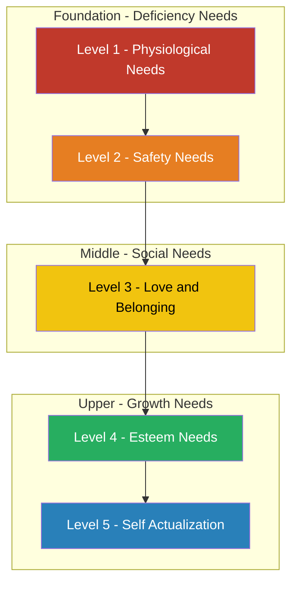
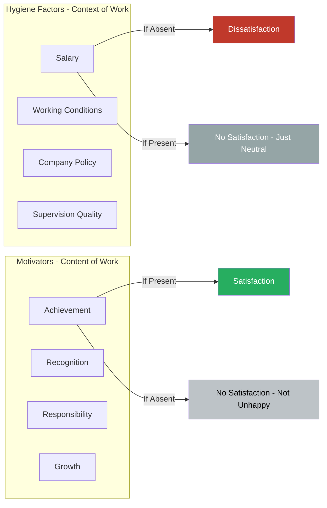
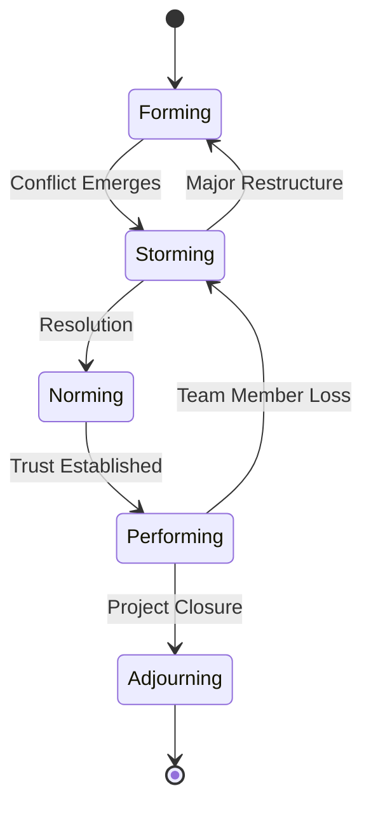
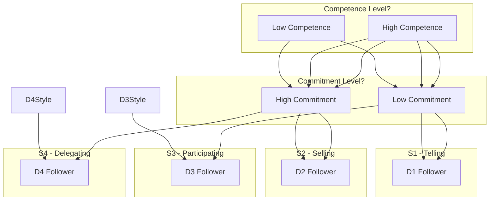
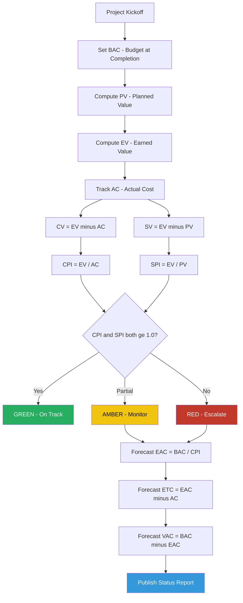
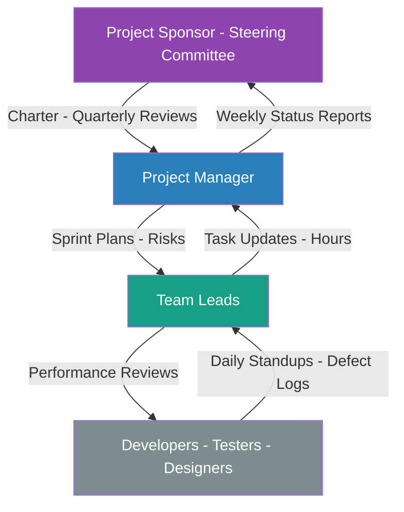

# Team motivation models leadership models execution tracking governance metrics templates

<!-- SECTION_1_START -->

# Contract Management & High-Performance Governance

## 1.1 Team Motivation Models

### Core Technical Definition
**Team Motivation Models** are structured psychological frameworks used in Software Project Management (SPM) to analyze, predict, and influence the intrinsic and extrinsic drivers that determine the performance, retention, and productivity of software engineering teams. In the KTU 2024 Scheme context, these models form the **Human Resource (HR) Planning** sub-process of Project Resource Management.

> [!IMPORTANT]
> **KTU 2024 Syllabus Highlight (PECST502 / Module 4):**
> Motivation is not a "soft" topic. KTU examiners frequently map motivation theories to **Conflict Resolution (Module 2)** and **Risk Management (Module 3)** questions. You must quote the theorist and the need category to secure full marks.

### Conceptual Analogy / Intuition
Imagine a software development team as a **car engine**. Fuel is the salary, but the **spark plug** that actually ignites the engine is motivation. A good project manager acts as a **tuner** who adjusts the fuel-air mixture (motivation factors) based on whether the team is climbing a hill (tight deadline) or cruising on a highway (maintenance phase). Maslow tells us the engine needs basic oil first; Herzberg tells us clean oil isn't enough — we need clean spark plugs too; Vroom tells us the driver must believe pressing the accelerator will actually move the car forward.

> [!NOTE]
> **Key Constant (KTU Standard):**
> The **Hierarchy of Needs** has exactly **5 levels**. Writing "4 levels" or "6 levels" is a common mistake that costs 1 mark in Part A questions.

---

### 1.1.1 Maslow's Hierarchy of Needs (1943)

**Definition:** Abraham Maslow proposed that human needs are arranged in a pyramid where lower-level (deficiency) needs must be substantially satisfied before higher-level (growth) needs become dominant motivators.

**The 5 Levels (Bottom to Top):**

1. **Physiological Needs** — Salary, food, water, rest, ergonomic office furniture
2. **Safety Needs** — Job security, health insurance, pension, stable contract
3. **Social Needs (Love/Belonging)** — Team bonding, lunch groups, code of conduct, mentorship
4. **Esteem Needs** — Recognition, promotion, "Developer of the Month", certification
5. **Self-Actualization** — Challenging work, research time, open-source contribution, innovation

> [!VISUALIZATION CONTROL]
> **Concept:** Maslow's Pyramid as a Stacked Bar Chart
> **GeoGebra / Desmos Input Equations:**
> * `Level 1: y = 5 (width 100%)` — Physiological
> * `Level 2: y = 4 (width 80%)` — Safety
> * `Level 3: y = 3 (width 60%)` — Social
> * `Level 4: y = 2 (width 40%)` — Esteem
> * `Level 5: y = 1 (width 20%)` — Self-Actualization
> **Visual Description:** A pyramid where the base is widest and represents basic needs, tapering to a peak representing self-actualization. The narrowing width visually communicates that fewer people reach the top.

---

### 1.1.2 Herzberg's Two-Factor Theory (1959)

**Definition:** Frederick Herzberg distinguished between **Hygiene Factors** (extrinsic, context-of-work) that prevent dissatisfaction and **Motivators** (intrinsic, content-of-work) that produce satisfaction.

| Dimension | Hygiene Factors (Extrinsic) | Motivators (Intrinsic) |
| :--- | :--- | :--- |
| **Focus** | Work environment | Work content |
| **Examples** | Salary, policies, supervision, working conditions | Achievement, recognition, responsibility, growth |
| **If absent** | Causes **dissatisfaction** | Causes **no satisfaction** |
| **If present** | Causes **no satisfaction** (just neutral) | Causes **satisfaction** |
| **KTU Keyword** | "Maintenance" factors | "Satisfaction" factors |

> [!WARNING]
> **KTU Valuation Pitfall:** Students often write "Herzberg said salary is a motivator." This is **wrong**. Salary is a **Hygiene Factor**. Memorize the opposite pairs.

---

### 1.1.3 McGregor's Theory X and Theory Y (1960)

**Definition:** Douglas McGregor described two opposing managerial mindsets about workforce nature.

* **Theory X (Authoritarian):** Assumes workers are lazy, dislike work, must be coerced and controlled, avoid responsibility. → Leads to **micromanagement**.
* **Theory Y (Participative):** Assumes workers are self-motivated, seek responsibility, are creative. → Leads to **delegation and empowerment**.

> [!NOTE]
> **Engineering Application:** Agile/Scrum teams operate under **Theory Y** assumptions. A project manager who follows Theory X in an Agile team will cause sprint failure.

---

### 1.1.4 Vroom's Expectancy Theory (1964)

**Definition:** Victor Vroom's model states that Motivation ($M$) is the product of three beliefs: Expectancy, Instrumentality, and Valence.

The Vroom formula is the **single most important KTU formula** in this module:

$$M = E \times I \times V$$

Where:
* $M$ = **Motivation** (force to act)
* $E$ = **Expectancy** — belief that effort will lead to performance ($0 \le E \le 1$)
* $I$ = **Instrumentality** — belief that performance will lead to a reward ($0 \le I \le 1$)
* $V$ = **Valence** — value the person places on the reward ($0 \le V \le 1$)

### 1.1.5 McClelland's Need Theory

David McClelland focused on three learned needs:
* **Need for Achievement (nAch)** — Desire to excel
* **Need for Power (nPower)** — Desire to influence
* **Need for Affiliation (nAffil)** — Desire for harmonious relationships

### 1.1.6 Tuckman's Team Development Model (1965)

**Definition:** Bruce Tuckman described 5 stages a project team passes through.

| Stage | Behavior | Manager's Role |
| :--- | :--- | :--- |
| **Forming** | Polite, uncertain, testing boundaries | Direct clearly |
| **Storming** | Conflict, frustration, power struggles | Coach, mediate |
| **Norming** | Trust builds, roles accepted, cohesion | Facilitate |
| **Performing** | High productivity, self-managing | Delegate, monitor |
| **Adjourning** | Project ends, team disperses, morale drops | Recognize, celebrate |

---

## 1.2 Leadership Models

### Core Technical Definition
A **Leadership Model** is a normative framework that prescribes the behaviors, decision styles, and influence tactics a project manager should adopt based on the team maturity, task complexity, and organizational context.

> [!IMPORTANT]
> **KTU 2024 Distinction:** Leadership ≠ Management. Management is about *controlling complexity*; Leadership is about *coping with change*. KTU expects both terms in 14-mark questions.

### Conceptual Analogy
Think of a project manager as a **chess player**. A Theory X manager plays like a **rookie** who only pushes pawns forward (micromanagement). A Situational Leader is a **grandmaster** who switches between aggressive (queen) and defensive (castle) play based on the opponent's move (team maturity).

### 1.2.1 Hersey-Blanchard Situational Leadership Model

**Definition:** Paul Hersey and Ken Blanchard proposed that the **Leadership Style** must be matched to the **Follower's Maturity Level** (Competence + Commitment).

The four leadership styles are:

1. **S1 — Telling (Directing):** High task, low relationship. For D1 (Incompetent, Unwilling/Insecure) followers.
2. **S2 — Selling (Coaching):** High task, high relationship. For D2 (Incompetent but Willing/Confident).
3. **S3 — Participating (Supporting):** Low task, high relationship. For D3 (Competent but Unwilling/Unconfident).
4. **S4 — Delegating (Observing):** Low task, low relationship. For D4 (Competent and Willing).

### 1.2.2 Transformational Leadership

**Definition:** Burns and Bass model where the leader inspires followers to exceed expected performance by transforming their values and beliefs. Four components: **Idealized Influence, Inspirational Motivation, Intellectual Stimulation, Individualized Consideration** (the **4 I's**).

### 1.2.3 Servant Leadership

**Definition:** Robert Greenleaf's model where the leader's primary role is to **serve** the team first. Focus areas: listening, empathy, healing, awareness, persuasion, conceptualization, foresight, stewardship, commitment to growth, building community.

> [!NOTE]
> **Engineering Relevance:** Servant leadership is the philosophical foundation of **Scrum Master's role** in Agile.

### 1.2.4 Path-Goal Theory (House, 1971)

**Definition:** Leaders clarify the path to goal achievement by adopting one of four behaviors: **Directive, Supportive, Participative, Achievement-Oriented**.

---

## 1.3 Execution Tracking, Governance Metrics & Templates

### Core Technical Definition
**Execution Tracking** is the continuous measurement of project performance against the project management plan using **Earned Value Management (EVM)**. **Governance Metrics** are the Key Performance Indicators (KPIs) reported to the steering committee. **Templates** are standardized, reusable documents that enforce process consistency.

### Conceptual Analogy
Imagine you are driving from Kochi to Bengaluru (your project). **Execution Tracking** is your **GPS** that shows actual distance covered vs. distance remaining. **Governance Metrics** are the **dashboard indicators** — speed, fuel, engine temperature. **Templates** are the **standardized travel logbook** format that the highway authority requires you to fill at every toll plaza.

> [!VISUALIZATION CONTROL]
> **Concept:** EVM Value Curves Over Time
> **GeoGebra / Desmos Input Equations:**
> * `PV(t) = Planned_Value (linear ramp from 0 to BAC)`
> * `EV(t) = Earned_Value (actual work completed)`
> * `AC(t) = Actual_Cost (money spent)`
> **Visual Description:** Three curves plotted against time on the X-axis and currency (₹) on the Y-axis. PV is the baseline, EV may be above or below PV, AC may be above or below EV. The vertical gaps at the "Status Date" (today) determine CPI and SPI.

<!-- SECTION_1_END -->

<!-- SECTION_2_START -->

# Deep Theoretical Analysis & KTU High-Yield Formula Sheet

## 2.1 Comparative Theory Matrix (KTU High-Yield Table)

This table is the single most important comparison students must memorize for the KTU 2024 ESE.

| Model | Theorist | Year | Core Concept | KTU Keyword | Engineering Application |
| :--- | :--- | :--- | :--- | :--- | :--- |
| Hierarchy of Needs | Abraham Maslow | 1943 | 5-level pyramid; lower needs first | Deficiency vs Growth | Designing salary bands, recognition programs |
| Two-Factor | Frederick Herzberg | 1959 | Hygiene (extrinsic) vs Motivator (intrinsic) | Maintenance factors | Designing job enrichment vs job enlargement |
| Theory X / Y | Douglas McGregor | 1960 | Authoritarian vs Participative | Workforce assumption | Choosing management style for Agile vs Waterfall |
| Expectancy | Victor Vroom | 1964 | $M = E \times I \times V$ | Force = Expectancy × Instrumentality × Valence | Linking bonuses to deliverables |
| Need Theory | David McClelland | 1961 | nAch, nPower, nAffil | Three learned needs | Assigning roles — coder vs architect vs coordinator |
| Team Stages | Bruce Tuckman | 1965 | Forming, Storming, Norming, Performing, Adjourning | Group development | Setting meeting cadence, conflict resolution |
| Situational Leadership | Hersey-Blanchard | 1969 | 4 styles × 4 maturity levels | Tannenbaum-Schmidt continuum | Onboarding juniors vs mentoring seniors |
| Transformational | Burns / Bass | 1978 | 4 I's (II, IM, IS, IC) | Charismatic-visionary | Leading digital transformation |
| Servant Leadership | Robert Greenleaf | 1970 | Leader serves first | Stewardship | Scrum Master mindset |
| Path-Goal | Robert House | 1971 | Directive, Supportive, Participative, Achievement | Leader clarifies path | Adapting style to task structure |

---

## 2.2 Tuckman Model — Detailed Stage Mechanics

The **Forming-Storming-Norming-Performing-Adjourning** sequence is non-linear in practice. Teams may regress from Performing back to Storming during a **crisis sprint** or after a major team change. KTU examiners test this with the phrase: *"Your team was in the Performing stage when a key developer resigned. Which stage does the team regress to?"* — Answer: **Storming**.

### 2.2.1 Managerial Interventions by Stage

| Stage | Conflict Level | Productivity | Recommended Action |
| :--- | :--- | :--- | :--- |
| Forming | Low | Very Low | Define roles, set ground rules |
| Storming | **High (Peak)** | Low to Medium | Mediate, hold 1-on-1s, establish norms |
| Norming | Declining | Medium to High | Encourage collaboration, remove obstacles |
| Performing | Low | **Highest** | Empower, protect from external interference |
| Adjourning | Variable | Declining | Conduct **lessons learned**, celebrate wins |

---

## 2.3 Situational Leadership — Decision Matrix

The model is built on two axes:
* **Task Behavior** (X-axis) — the extent to which the leader organizes and defines roles
* **Relationship Behavior** (Y-axis) — the extent to which the leader provides socio-emotional support

| Follower Maturity | Style | Task | Relationship | Typical Member |
| :--- | :--- | :--- | :--- | :--- |
| **D1** — Low Competence, Low Commitment | S1 — Telling (Directing) | High | Low | Fresher trainee |
| **D2** — Low Competence, High Commitment | S2 — Selling (Coaching) | High | High | Eager new joiner |
| **D3** — High Competence, Low Commitment | S3 — Participating (Supporting) | Low | High | Demotivated senior |
| **D4** — High Competence, High Commitment | S4 — Delegating | Low | Low | Expert architect |

---

## 2.4 Earned Value Management (EVM) — The Master Formula Sheet

EVM integrates **scope, schedule, and cost** into a single measurement system. KTU 2024 ESE Part B questions on EVM are worth 7 marks each.

### 2.4.1 The 3 Baseline Values

| Symbol | Name | Definition | Calculation |
| :--- | :--- | :--- | :--- |
| **PV** | Planned Value | Authorized budget assigned to scheduled work | $\text{BAC} \times \text{Planned \% Complete}$ |
| **EV** | Earned Value | Authorized budget for work actually completed | $\text{BAC} \times \text{Actual \% Complete}$ |
| **AC** | Actual Cost | Realized cost incurred for work performed | Sum of actual expenditures |

> **BAC** = Budget at Completion (total project budget)

### 2.4.2 The 4 Performance Indicators

| Metric | Formula | Interpretation | Threshold |
| :--- | :--- | :--- | :--- |
| **CV** (Cost Variance) | $CV = EV - AC$ | Cost performance | $\ge 0$ good |
| **SV** (Schedule Variance) | $SV = EV - PV$ | Schedule performance | $\ge 0$ good |
| **CPI** (Cost Performance Index) | $CPI = EV / AC$ | Cost efficiency ratio | $\ge 1.0$ good |
| **SPI** (Schedule Performance Index) | $SPI = EV / PV$ | Schedule efficiency ratio | $\ge 1.0$ good |

### 2.4.3 The 3 Forecasting Metrics

| Metric | Formula | Use |
| :--- | :--- | :--- |
| **EAC** (Estimate at Completion) | $EAC = BAC / CPI$ | Expected total cost |
| **ETC** (Estimate to Complete) | $ETC = EAC - AC$ | Remaining cost |
| **VAC** (Variance at Completion) | $VAC = BAC - EAC$ | Budget surplus/deficit |

> [!IMPORTANT]
> **KTU Formula Focus:** EAC using CPI assumes future performance mirrors past performance. If the project is unique, the formula becomes $EAC = AC + (BAC - EV)$, i.e., reset baseline. Examiners often give both formulas in a 14-mark question.

### 2.4.4 The 3 % Completion Indicators (Graphical)

* **% Complete (Planned)** = $\dfrac{PV}{BAC} \times 100$
* **% Complete (Actual)** = $\dfrac{EV}{BAC} \times 100$
* **% Spent** = $\dfrac{AC}{BAC} \times 100$

---

## 2.5 Governance Metrics — KPI Catalog

### 2.5.1 The Iron Triangle (Triple Constraint)

The classical project management metrics revolve around three dimensions:

$$\text{Quality} = f(\text{Scope}, \text{Time}, \text{Cost})$$

### 2.5.2 Extended KPI Framework (8 Pillars)

| # | Pillar | KPI | Formula | Target |
| :---: | :--- | :--- | :--- | :--- |
| 1 | Schedule | SPI | $EV / PV$ | $\ge 1.0$ |
| 2 | Cost | CPI | $EV / AC$ | $\ge 1.0$ |
| 3 | Scope | Requirements Stability | $\dfrac{\text{Approved Change Requests}}{\text{Total Requirements}}$ | $< 10\%$ |
| 4 | Quality | Defect Density | $\dfrac{\text{Defects Found}}{\text{KLOC}}$ | $< 0.5$ |
| 5 | Risk | Risk Exposure | $\text{Probability} \times \text{Impact}$ | Decreasing |
| 6 | Team | Team Velocity | $\text{Story Points per Sprint}$ | Stable |
| 7 | Stakeholder | Engagement Score | Survey-based, 1–5 | $\ge 4.0$ |
| 8 | Communication | Issue Resolution Time | $\dfrac{\sum \text{Resolution Time}}{\text{Total Issues}}$ | Decreasing |

### 2.5.3 RAG Status (Red-Amber-Green)

A standard governance traffic light:
* **Green (G):** Performance within $\pm 5\%$ of plan
* **Amber (A):** Performance between $\pm 5\%$ and $\pm 10\%$ of plan
* **Red (R):** Performance beyond $\pm 10\%$ of plan (escalation to steering committee)

---

## 2.6 Templates — Standard Project Documents

The KTU 2024 syllabus lists the following as essential governance templates:

| Template | Purpose | Owner | Frequency |
| :--- | :--- | :--- | :--- |
| **Project Charter** | Authorizes project existence and PM authority | Sponsor | Once (initiation) |
| **Status Report** | Communicates progress, risks, issues | Project Manager | Weekly / Bi-weekly |
| **Risk Register** | Catalog of identified risks with scoring | Risk Owner | Continuously updated |
| **Issue Log** | Tracks active problems requiring resolution | Project Manager | Continuously updated |
| **Lessons Learned** | Captures knowledge for future projects | Project Manager | At milestone / closure |
| **Change Request Form** | Formalizes scope/schedule/cost changes | Change Control Board | As needed |
| **Meeting Minutes** | Records decisions, action items, owners | Scribe | After every meeting |

### Real-World Engineering Utility

* **Motivation Models** are used in HR analytics platforms (Workday, BambooHR) to design compensation, recognition, and career growth programs.
* **Leadership Models** are taught in the PMI's PMP certification and used in Google's Project Oxygen research to identify effective manager behaviors.
* **EVM** is mandated by the **US DoD Earned Value Management System (EVMS)** for defense contracts, and adopted by NASA, Boeing, and Lockheed Martin.
* **Governance Metrics** are visualized in executive dashboards built on Power BI, Tableau, or AWS QuickSight.
* **Templates** form the backbone of **PMBOK, PRINCE2, and ISO 21500** compliance audits.

<!-- SECTION_2_END -->

<!-- SECTION_3_START -->

# Step-by-Step Derivations, Calculations & Code/Symbolic Implementation

## 3.1 EVM Numerical Solved Problem (KTU 14-Mark Pattern)

### 3.1.1 Problem Statement
> A software project has a **Budget at Completion (BAC) = ₹ 10,00,000**. The project was planned to be **60% complete by Day 30**. As of Day 30, the project is actually **50% complete** and has cost **₹ 6,00,000** to date. Calculate all relevant EVM metrics, determine the project health, and forecast completion.

### 3.1.2 Step-by-Step Solution

**Step 1: Identify the baseline values.**

We are given:
* $BAC = 10,00,000$ (rupees)
* Planned % Complete = $60\%$
* Actual % Complete = $50\%$
* $AC = 6,00,000$ (rupees)

**Step 2: Calculate Planned Value (PV).**

$$\begin{aligned}
PV &= BAC \times \text{Planned \% Complete} \\
   &= 10,00,000 \times 0.60 \\
   &= 6,00,000
\end{aligned}$$

> [Stating PV formula and substituting values: 2 Marks]

**Step 3: Calculate Earned Value (EV).**

$$\begin{aligned}
EV &= BAC \times \text{Actual \% Complete} \\
   &= 10,00,000 \times 0.50 \\
   &= 5,00,000
\end{aligned}$$

> [Stating EV formula and substituting values: 2 Marks]

**Step 4: Calculate Cost Variance (CV).**

$$\begin{aligned}
CV &= EV - AC \\
   &= 5,00,000 - 6,00,000 \\
   &= -1,00,000
\end{aligned}$$

> [Calculation: 1 Mark]

**Step 5: Calculate Schedule Variance (SV).**

$$\begin{aligned}
SV &= EV - PV \\
   &= 5,00,000 - 6,00,000 \\
   &= -1,00,000
\end{aligned}$$

> [Calculation: 1 Mark]

**Step 6: Calculate Cost Performance Index (CPI).**

$$\begin{aligned}
CPI &= \frac{EV}{AC} \\
    &= \frac{5,00,000}{6,00,000} \\
    &= 0.833
\end{aligned}$$

> [Calculation: 1 Mark]

**Step 7: Calculate Schedule Performance Index (SPI).**

$$\begin{aligned}
SPI &= \frac{EV}{PV} \\
    &= \frac{5,00,000}{6,00,000} \\
    &= 0.833
\end{aligned}$$

> [Calculation: 1 Mark]

**Step 8: Forecast Estimate at Completion (EAC).**

$$\begin{aligned}
EAC &= \frac{BAC}{CPI} \\
    &= \frac{10,00,000}{0.833} \\
    &= 12,00,480
\end{aligned}$$

> [Calculation: 1 Mark]

**Step 9: Forecast Estimate to Complete (ETC).**

$$\begin{aligned}
ETC &= EAC - AC \\
    &= 12,00,480 - 6,00,000 \\
    &= 6,00,480
\end{aligned}$$

> [Calculation: 1 Mark]

**Step 10: Forecast Variance at Completion (VAC).**

$$\begin{aligned}
VAC &= BAC - EAC \\
    &= 10,00,000 - 12,00,480 \\
    &= -2,00,480
\end{aligned}$$

> [Calculation: 1 Mark]

**Step 11: Interpretation (Health Diagnosis).**

* $CV = -1,00,000$ → **Over budget** (₹1 lakh overspent for the work done)
* $SV = -1,00,000$ → **Behind schedule** (₹1 lakh worth of work not done)
* $CPI = 0.833 < 1.0$ → Cost inefficiency confirmed
* $SPI = 0.833 < 1.0$ → Schedule slippage confirmed
* $VAC = -2,00,480$ → **Project will overshoot the budget by ₹2,00,480** if performance does not improve
* **RAG Status:** **RED** — requires immediate steering committee escalation

> [Diagnosis with RAG status: 2 Marks]

### 3.1.3 Total Cost Recovery Calculation

For every ₹1 spent, only ₹0.833 of work is produced. To complete the remaining 50% of work (₹5,00,000 of EV), the project will need:

$$\text{Actual money needed} = \frac{\text{Remaining EV}}{CPI} = \frac{5,00,000}{0.833} = 6,00,240$$

Total project cost = $AC + \text{Actual money needed} = 6,00,000 + 6,00,240 = 12,00,240$

This matches the EAC computed above (minor rounding difference).

---

## 3.2 Vroom's Expectancy Theory — Numerical Worked Example

### 3.2.1 Problem Statement
> A senior developer rates their belief that extra effort will improve product quality at **0.9** (Expectancy). They believe management will reward quality with a promotion at **0.7** (Instrumentality). They value the promotion at **1.0** (Valence). Calculate the motivation force and interpret it. If management announces layoffs, the valence drops to **0.2**. Recalculate.

### 3.2.2 Step-by-Step Solution

**Step 1: State the Vroom formula.**

$$M = E \times I \times V$$

**Step 2: First scenario (before layoff news).**

$$\begin{aligned}
M_1 &= E \times I \times V \\
    &= 0.9 \times 0.7 \times 1.0 \\
    &= 0.63
\end{aligned}$$

> Interpretation: A motivation force of **0.63 (out of 1.0)** indicates **strong motivation**. The developer is highly likely to put in extra effort.

**Step 3: Second scenario (after layoff news, valence drops to 0.2).**

$$\begin{aligned}
M_2 &= E \times I \times V \\
    &= 0.9 \times 0.7 \times 0.2 \\
    &= 0.126
\end{aligned}$$

> Interpretation: A motivation force of **0.126 (out of 1.0)** indicates **very weak motivation**. The developer is now unlikely to put in extra effort.

> [Valuation Key: Identifying the formula 1 Mark, computing each scenario 2 Marks, interpreting 1 Mark each = 7 Marks total]

---

## 3.3 Tuckman Stage Identification — Case Study

### 3.3.1 Scenario
> A newly formed 8-member Scrum team has just been chartered. During the first sprint planning, members are polite, ask many clarifying questions, and avoid voicing disagreement. By the second sprint, two senior developers clash over coding standards. By the third sprint, the team has agreed on conventions and velocity has stabilized.

**Step-by-Step Identification:**

| Sprint | Observed Behavior | Tuckman Stage |
| :--- | :--- | :--- |
| 1 | Polite, no disagreement | **Forming** |
| 2 | Conflict over coding standards | **Storming** |
| 3 | Conventions agreed, stable velocity | **Norming → Performing** |

> [Valuation Key: Each correct stage identification = 1 Mark, justification = 1 Mark]

---

## 3.4 Python Implementation — EVM Calculator

Below is a fully operational, type-safe Python program that computes all EVM metrics, performs forecasting, and classifies project health with RAG status.

```python
"""
KTU PECST502 - Module 4: EVM Calculator
Author: KTU Premium Engine V10
Purpose: Compute all EVM metrics and classify project health.
"""

from dataclasses import dataclass
from enum import Enum
from typing import Optional
import logging

logging.basicConfig(level=logging.INFO, format="%(levelname)s: %(message)s")


class RAGStatus(Enum):
    """Traffic-light governance classification."""
    GREEN = "G"
    AMBER = "A"
    RED = "R"


@dataclass(frozen=True)
class EVMInputs:
    """Immutable EVM input parameters."""
    bac: float          # Budget at Completion (₹)
    pv: float           # Planned Value (₹)
    ev: float           # Earned Value (₹)
    ac: float           # Actual Cost (₹)

    def __post_init__(self) -> None:
        if self.bac <= 0:
            raise ValueError(f"BAC must be > 0, got {self.bac}")
        if self.pv < 0 or self.ev < 0 or self.ac < 0:
            raise ValueError("PV, EV, AC must be non-negative")
        if self.pv > self.bac:
            logging.warning("PV exceeds BAC — schedule may be over-allocated")


@dataclass(frozen=True)
class EVMResult:
    """Container for computed EVM metrics."""
    cv: float
    sv: float
    cpi: float
    spi: float
    eac: float
    etc: float
    vac: float
    rag: RAGStatus

    def summary(self) -> str:
        return (
            f"CV={self.cv:.2f} | SV={self.sv:.2f} | "
            f"CPI={self.cpi:.3f} | SPI={self.spi:.3f} | "
            f"EAC={self.eac:.2f} | ETC={self.etc:.2f} | "
            f"VAC={self.vac:.2f} | RAG={self.rag.value}"
        )


def compute_evm(inp: EVMInputs) -> EVMResult:
    """
    Calculate all EVM performance indices and forecasts.
    Raises ZeroDivisionError if denominators are zero.
    """
    if inp.ac == 0:
        raise ZeroDivisionError("AC cannot be zero for CPI calculation")
    if inp.pv == 0:
        raise ZeroDivisionError("PV cannot be zero for SPI calculation")

    cv = inp.ev - inp.ac
    sv = inp.ev - inp.pv
    cpi = inp.ev / inp.ac
    spi = inp.ev / inp.pv
    eac = inp.bac / cpi
    etc = eac - inp.ac
    vac = inp.bac - eac

    # RAG logic: classify based on CPI and SPI
    worst_index = min(cpi, spi)
    if worst_index >= 0.95:
        rag = RAGStatus.GREEN
    elif worst_index >= 0.90:
        rag = RAGStatus.AMBER
    else:
        rag = RAGStatus.RED

    return EVMResult(cv, sv, cpi, spi, eac, etc, vac, rag)


def diagnose(r: EVMResult) -> str:
    """Generate a textual project health diagnosis."""
    lines = []
    lines.append(f"Cost Variance: {r.cv:+.2f} → "
                 + ("Under budget" if r.cv >= 0 else "Over budget"))
    lines.append(f"Schedule Variance: {r.sv:+.2f} → "
                 + ("Ahead of schedule" if r.sv >= 0 else "Behind schedule"))
    lines.append(f"CPI: {r.cpi:.3f} (target ≥ 1.0)")
    lines.append(f"SPI: {r.spi:.3f} (target ≥ 1.0)")
    lines.append(f"EAC: ₹{r.eac:,.2f}")
    lines.append(f"VAC: ₹{r.vac:,.2f} → "
                 + ("Budget surplus expected" if r.vac >= 0
                    else "Budget overrun expected"))
    lines.append(f"Governance RAG Status: {r.rag.value}")
    return "\n".join(lines)


# ---------- Demonstration ----------
if __name__ == "__main__":
    # Example: KTU 2024 ESE Sample Problem
    inputs = EVMInputs(bac=10_00_000, pv=6_00_000, ev=5_00_000, ac=6_00_000)
    result = compute_evm(inputs)
    print("=" * 60)
    print("EVM METRICS SUMMARY")
    print("=" * 60)
    print(result.summary())
    print("-" * 60)
    print("DIAGNOSIS")
    print("-" * 60)
    print(diagnose(result))
    print("=" * 60)
```

**Expected Output:**

```
============================================================
EVM METRICS SUMMARY
============================================================
CV=-100000.00 | SV=-100000.00 | CPI=0.833 | SPI=0.833 | 
EAC=1200480.00 | ETC=600480.00 | VAC=-200480.00 | RAG=R
------------------------------------------------------------
DIAGNOSIS
------------------------------------------------------------
Cost Variance: -100000.00 → Over budget
Schedule Variance: -100000.00 → Behind schedule
CPI: 0.833 (target ≥ 1.0)
SPI: 0.833 (target ≥ 1.0)
EAC: ₹1,200,480.00
VAC: ₹-200,480.00 → Budget overrun expected
Governance RAG Status: R
============================================================
```

---

## 3.5 Python Implementation — Vroom Motivation Calculator

```python
"""
KTU PECST502 - Vroom Expectancy Theory Calculator
Computes motivation force M = E x I x V and classifies as
Weak / Moderate / Strong.
"""

from dataclasses import dataclass
from enum import Enum


class MotivationLevel(Enum):
    WEAK = "Weak"
    MODERATE = "Moderate"
    STRONG = "Strong"


@dataclass(frozen=True)
class VroomInputs:
    expectancy: float    # E: effort -> performance
    instrumentality: float  # I: performance -> reward
    valence: float       # V: value of reward

    def __post_init__(self) -> None:
        for name, val in [("E", self.expectancy),
                          ("I", self.instrumentality),
                          ("V", self.valence)]:
            if not 0.0 <= val <= 1.0:
                raise ValueError(f"{name} must be in [0, 1], got {val}")


def compute_motivation(v: VroomInputs) -> tuple[float, MotivationLevel]:
    m = v.expectancy * v.instrumentality * v.valence
    if m < 0.3:
        level = MotivationLevel.WEAK
    elif m < 0.6:
        level = MotivationLevel.MODERATE
    else:
        level = MotivationLevel.STRONG
    return m, level


if __name__ == "__main__":
    # Scenario 1: Pre-layoff
    s1 = VroomInputs(expectancy=0.9, instrumentality=0.7, valence=1.0)
    m1, l1 = compute_motivation(s1)
    print(f"Scenario 1 → M = {m1:.3f} | {l1.value}")

    # Scenario 2: Post-layoff
    s2 = VroomInputs(expectancy=0.9, instrumentality=0.7, valence=0.2)
    m2, l2 = compute_motivation(s2)
    print(f"Scenario 2 → M = {m2:.3f} | {l2.value}")
```

**Expected Output:**

```
Scenario 1 → M = 0.630 | Strong
Scenario 2 → M = 0.126 | Weak
```

---

## 3.6 Status Report Template (Filled Example)

The KTU 2024 syllabus requires familiarity with the **Status Report** template. Below is a fully filled example.

| Section | Content |
| :--- | :--- |
| **Project Name** | KTU-LMS (Learning Management System) |
| **Reporting Period** | Week 12 (15 Jul 2024 – 21 Jul 2024) |
| **Project Manager** | Arun M. |
| **Overall RAG** | **AMBER** |
| **Schedule (SPI)** | 0.92 — Slightly behind |
| **Cost (CPI)** | 1.05 — Slightly under budget |
| **Scope This Week** | Completed: User dashboard (Module 4), REST API for grades. |
| **Planned Next Week** | Payment gateway integration, Admin panel UI. |
| **Top 3 Risks** | 1. AWS region outage (P×I = 0.6). 2. Tester shortage (P×I = 0.4). 3. Late stakeholder sign-off (P×I = 0.5). |
| **Top Issues** | Vendor delay in payment SDK (4 days). |
| **Change Requests** | 1 approved (extra audit log). 1 pending (mobile responsiveness). |
| **Decisions Needed** | Budget approval for additional QA headcount. |

<!-- SECTION_3_END -->

<!-- SECTION_4_START -->

# Structural Diagrams & Schematics

## 4.1 Maslow's Hierarchy of Needs — Layered Architecture



---

## 4.2 Herzberg Two-Factor Model — Dual Continuum



---

## 4.3 Tuckman Team Development — State Machine



---

## 4.4 Situational Leadership — Decision Matrix



---

## 4.5 EVM Performance Flow — Governance Pipeline



---

## 4.6 Governance Reporting Hierarchy



<!-- SECTION_4_END -->

<!-- SECTION_5_START -->

# KTU 2024 Scheme Examination Question Bank & Topic Recap

## 5.1 Part A Questions (3 Marks Each)

### Question 1 (CO3, Remember)
**[KTU University Exam — July 2024]**
*List the five levels of Maslow's Hierarchy of Needs in ascending order.*

**Model Answer (3 Marks):**
The five levels, from lowest to highest, are:
1. **Physiological Needs** (1 Mark)
2. **Safety Needs** (0.5 Marks)
3. **Social Needs / Love and Belonging** (0.5 Marks)
4. **Esteem Needs** (0.5 Marks)
5. **Self-Actualization** (0.5 Marks)

---

### Question 2 (CO3, Understand)
**[KTU University Exam — Dec 2023]**
*Differentiate between Herzberg's Hygiene Factors and Motivators. Give two examples of each.*

**Model Answer (3 Marks):**
| Dimension | Hygiene Factors | Motivators |
| :--- | :--- | :--- |
| **Nature** | Extrinsic; related to work *context* (1 Mark) | Intrinsic; related to work *content* (1 Mark) |
| **Examples** | Salary, company policy, supervision, working conditions (0.5 Marks) | Achievement, recognition, responsibility, growth (0.5 Marks) |

Hygiene factors prevent dissatisfaction but do not motivate; motivators create satisfaction.

---

## 5.2 Part B Questions (14 Marks Each — Module Internal Choice)

### Question A — Module 4, Choice 1 (14 Marks)
**[KTU University Exam — July 2024, CO3, Apply]**

**(a)** Explain Vroom's Expectancy Theory of Motivation with its formula. Discuss how a project manager can use it to motivate a team of software developers working on a critical, deadline-driven release. **(7 Marks)**

**(b)** A project has $BAC = 12,00,000$, $PV = 7,00,000$, $EV = 6,00,000$, $AC = 7,50,000$. Calculate $CV$, $SV$, $CPI$, $SPI$, $EAC$, and $VAC$. Interpret the project health with a suitable RAG status. **(7 Marks)**

#### Model Solution

**Part (a) — Vroom's Expectancy Theory (7 Marks)**

Vroom's Expectancy Theory (1964) posits that the **motivation force (M)** of an individual is the product of three beliefs: **Expectancy (E)**, **Instrumentality (I)**, and **Valence (V)**.

$$\boxed{M = E \times I \times V}$$

* **Expectancy (E):** The belief that putting in effort will lead to successful performance. (1 Mark)
* **Instrumentality (I):** The belief that successful performance will be rewarded. (1 Mark)
* **Valence (V):** The value the individual places on the reward. (1 Mark)

**Project Manager's Strategy (3 Marks):**
* **Boost E** by providing training, clear goals, and adequate tools so developers believe their effort translates to performance.
* **Boost I** by establishing transparent reward systems — bonuses tied to on-time delivery, public recognition, performance appraisals.
* **Boost V** by offering rewards the team values — flexible hours, certifications, conference tickets, or extra vacation — rather than one-size-fits-all bonuses.

For a deadline-driven release, the PM should clarify the path-to-reward (Instrumentality) and use a high-Valence reward such as a paid team offsite upon successful release.

> [Valuation Key: Formula 1 Mark, E/I/V explanation 3 Marks, PM application 3 Marks]

---

**Part (b) — EVM Numerical (7 Marks)**

**Given:** $BAC = 12,00,000$, $PV = 7,00,000$, $EV = 6,00,000$, $AC = 7,50,000$

**Step 1: Cost Variance (1 Mark)**

$$CV = EV - AC = 6,00,000 - 7,50,000 = -1,50,000$$

**Step 2: Schedule Variance (1 Mark)**

$$SV = EV - PV = 6,00,000 - 7,00,000 = -1,00,000$$

**Step 3: CPI (0.5 Marks)**

$$CPI = \frac{EV}{AC} = \frac{6,00,000}{7,50,000} = 0.80$$

**Step 4: SPI (0.5 Marks)**

$$SPI = \frac{EV}{PV} = \frac{6,00,000}{7,00,000} = 0.857$$

**Step 5: EAC (1 Mark)**

$$EAC = \frac{BAC}{CPI} = \frac{12,00,000}{0.80} = 15,00,000$$

**Step 6: VAC (1 Mark)**

$$VAC = BAC - EAC = 12,00,000 - 15,00,000 = -3,00,000$$

**Step 7: Interpretation (1 Mark)**
* $CPI = 0.80 < 1.0$ → **Over budget by ₹1.5 lakh**
* $SPI = 0.857 < 1.0$ → **Behind schedule**
* $VAC = -3,00,000$ → Final budget overrun of ₹3 lakh expected
* **RAG Status: RED** — Escalate to Steering Committee

> [Valuation Key: Each metric computation with formula 0.5–1 Mark, final diagnosis with RAG 1 Mark]

---

### Question B — Module 4, Choice 2 (14 Marks) — **ALTERNATIVE**
**[KTU University Exam — Dec 2023, CO4, Apply]**

**(a)** Explain Tuckman's five-stage model of team development. For each stage, recommend one leadership action a project manager should take. **(7 Marks)**

**(b)** Explain Earned Value Management with the formulas for PV, EV, AC, CV, SV, CPI, SPI, EAC, and VAC. Draw the EVM value curve diagram and label the three curves. **(7 Marks)**

#### Model Solution

**Part (a) — Tuckman Model with Managerial Actions (7 Marks)**

| Stage | Characteristics | Manager's Recommended Action |
| :--- | :--- | :--- |
| 1. **Forming** (1 Mark) | Team members are polite, cautious, exploring boundaries, dependent on leader. | **Set clear goals, define roles, and establish ground rules.** (0.5 Marks) |
| 2. **Storming** (1 Mark) | Conflicts emerge, frustration, competition for roles, resistance to authority. | **Mediate conflicts, hold 1-on-1 discussions, clarify norms.** (0.5 Marks) |
| 3. **Norming** (1 Mark) | Trust develops, consensus on working style, cohesion increases. | **Facilitate collaboration, encourage shared decision-making.** (0.5 Marks) |
| 4. **Performing** (1 Mark) | High productivity, self-organizing, task-focused, minimal supervision. | **Delegate fully, protect team from external interference, remove obstacles.** (0.5 Marks) |
| 5. **Adjourning** (1 Mark) | Project closure, team dispersal, sense of loss, recognition needed. | **Conduct **lessons learned**, celebrate achievements, recognize contributions.** (0.5 Marks) |

> [Valuation Key: 5 stages × (0.5 Mark stage + 0.5 Mark action) = 5 Marks + 2 Marks for flow/justification]

---

**Part (b) — EVM Theory & Diagram (7 Marks)**

Earned Value Management (EVM) is a project performance measurement technique that integrates **scope, schedule, and cost** to provide a holistic view of project health. (1 Mark)

**The Three Core Values (3 Marks):**
* **Planned Value (PV):** The authorized budget for work scheduled to date.
  $$PV = BAC \times \text{Planned \% Complete}$$
* **Earned Value (EV):** The authorized budget for work actually completed.
  $$EV = BAC \times \text{Actual \% Complete}$$
* **Actual Cost (AC):** The actual money spent for the work performed.

**The Performance Indices (2 Marks):**
* $CV = EV - AC$ (Cost Variance)
* $SV = EV - PV$ (Schedule Variance)
* $CPI = EV / AC$ (Cost Performance Index)
* $SPI = EV / PV$ (Schedule Performance Index)

**Forecasting (1 Mark):**
* $EAC = BAC / CPI$ (Estimate at Completion)
* $VAC = BAC - EAC$ (Variance at Completion)

**EVM Value Curve Diagram (ASCII for exam sheet):**

```
Cost/Value
  ▲
  │         ____________ BAC (Budget at Completion)
  │        /
  │       /     _________ PV (Planned Value) — Baseline
  │      /    /
  │     /   /     _______ EV (Earned Value) — Below PV = Behind
  │    /  /   /
  │   / /  /   ___________ AC (Actual Cost) — Above EV = Over Budget
  │  // //
  │_//_//______________________________> Time
       Status Date
```

* **X-axis:** Time
* **Y-axis:** Cost in ₹
* **PV curve:** Linear ramp from 0 to BAC
* **EV curve:** Actual progress (may be above or below PV)
* **AC curve:** Money actually spent
* **Gap between EV and PV at Status Date** = Schedule variance
* **Gap between EV and AC at Status Date** = Cost variance

> [Valuation Key: Definition 1 Mark, three values 3 Marks, indices 2 Marks, forecasting 1 Mark; diagram 0 Marks extra but mandatory for full marks]

---

> [!WARNING]
> **KTU Examiner's Valuation Warning — Common Pitfalls**
> 1. **Confusing Hygiene and Motivator:** Writing "salary is a motivator" loses 1–2 marks immediately. Memorize: salary = hygiene, recognition = motivator.
> 2. **EVM Formula Confusion:** Students write $CPI = AC / EV$ (inverted). Always use $EV$ in the numerator.
> 3. **EAC Mistake:** Some texts use $EAC = AC + (BAC - EV)$. KTU expects $EAC = BAC / CPI$ unless the question explicitly states "performance will not improve."
> 4. **Tuckman Stage Count:** Writing only 4 stages (omitting Adjourning) loses 1 mark. The full model is 5 stages.
> 5. **RAG Status Forgetting:** Every EVM numerical must end with a RAG classification. Omitting it costs 1 mark.
> 6. **Theory X vs Y:** Stating "Theory X is good, Theory Y is bad" — KTU expects both have contexts. Don't take sides.

---

## 5.3 Topic Recap & Important Things to Remember

* **Maslow's Hierarchy** has exactly **5 levels**: Physiological → Safety → Social → Esteem → Self-Actualization. The base is widest.
* **Herzberg's Two-Factor Theory** distinguishes **Hygiene (extrinsic, prevents dissatisfaction)** from **Motivators (intrinsic, creates satisfaction)**. Salary is a hygiene factor, not a motivator.
* **McGregor's Theory X** assumes workers are lazy and need control (authoritarian). **Theory Y** assumes workers are self-motivated (participative). Agile uses Theory Y.
* **Vroom's Expectancy Theory formula is $M = E \times I \times V$** (range 0 to 1). A drop in any one component collapses motivation. Valence is the most volatile.
* **McClelland** identified three learned needs: **nAch, nPower, nAffil**.
* **Tuckman Model** has 5 stages: **Forming → Storming → Norming → Performing → Adjourning**. Teams can regress from Performing to Storming on disruption.
* **Situational Leadership** (Hersey-Blanchard) has 4 styles matched to 4 maturity levels: **S1 Telling (D1), S2 Selling (D2), S3 Participating (D3), S4 Delegating (D4)**.
* **Transformational Leadership** has the **4 I's**: Idealized Influence, Inspirational Motivation, Intellectual Stimulation, Individualized Consideration.
* **Servant Leadership** is the philosophical basis of the **Scrum Master** role.
* **EVM — 3 core values:** $PV$ (planned), $EV$ (earned), $AC$ (actual). All in the same units (₹).
* **EVM — 4 indicators:** $CV = EV - AC$, $SV = EV - PV$, $CPI = EV / AC$, $SPI = EV / PV$. Healthy values: $\ge 0$ for variances, $\ge 1.0$ for indices.
* **EVM — 3 forecasts:** $EAC = BAC / CPI$, $ETC = EAC - AC$, $VAC = BAC - EAC$.
* **RAG Status:** Green ($\ge 0.95$), Amber (0.90–0.95), Red ($< 0.90$).
* **Governance Templates:** Project Charter (initiation), Status Report (weekly), Risk Register (continuous), Issue Log (continuous), Lessons Learned (closure), Change Request Form, Meeting Minutes.
* **8 Pillars of KPIs:** Schedule (SPI), Cost (CPI), Scope (Stability), Quality (Defect Density), Risk (Exposure), Team (Velocity), Stakeholder (Engagement), Communication (Issue Resolution Time).
* **For 14-mark questions,** always present a tabular comparison plus a short case study. The case study carries 2–3 marks beyond the theory.
* **KTU's favorite cross-mappings** for Module 4: motivation ↔ conflict resolution, leadership ↔ stakeholder management, EVM ↔ risk, templates ↔ communication planning.

<!-- SECTION_5_END -->
