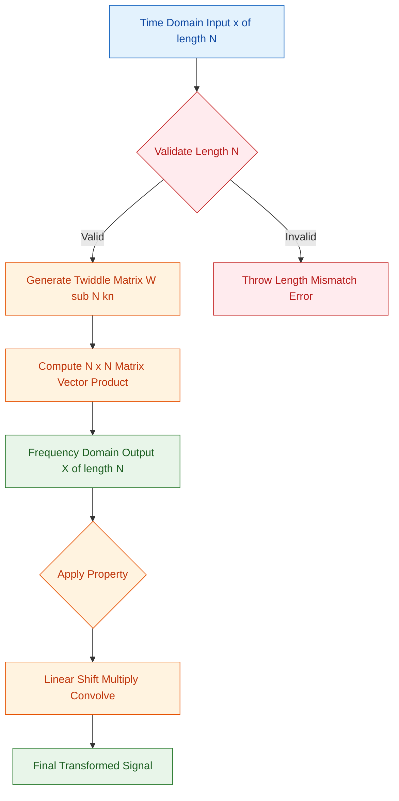
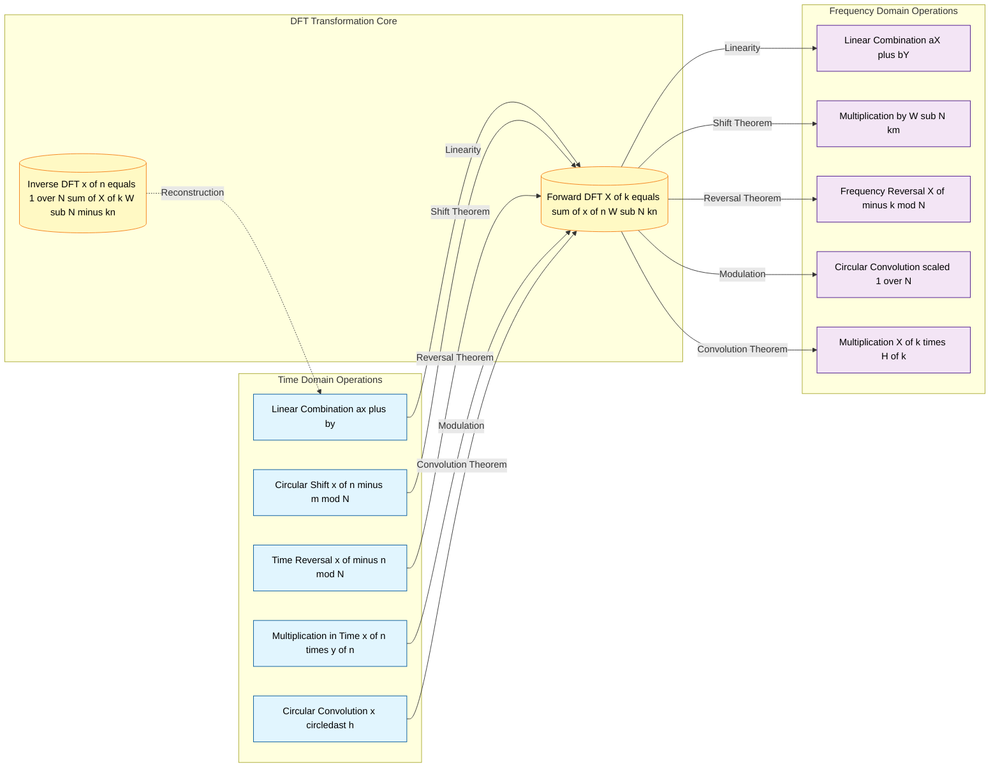
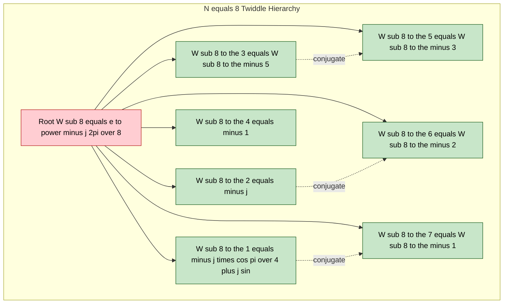
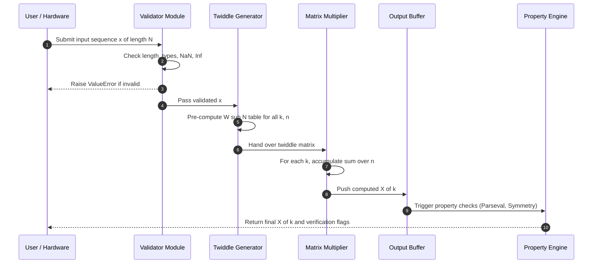

# Discrete Fourier Transform (DFT) mathematical operations, properties evaluation

<!-- SECTION_1_START -->
# Discrete Fourier Transform (DFT) — Mathematical Operations & Properties

> [!IMPORTANT]
> **KTU 2024 Scheme | PECST503 | Module 1 | Topic: DFT**
> The Discrete Fourier Transform is the **backbone** of digital signal processing. It converts a finite-length discrete-time sequence in the time domain into a same-length sequence in the frequency domain and is the only Fourier transform that is **directly computable** on a digital machine.

---

## 1. Formal Academic Definition

The **DFT** of a finite-duration sequence $x[n]$ of length $N$ is defined as a finite-length sequence of complex-valued samples $X[k]$ given by:

$$X[k] = \sum_{n=0}^{N-1} x[n] \cdot e^{-j\frac{2\pi}{N}kn} \quad ; \quad k = 0, 1, 2, \dots, N-1$$

The corresponding **Inverse DFT (IDFT)** is defined as:

$$x[n] = \frac{1}{N} \sum_{k=0}^{N-1} X[k] \cdot e^{+j\frac{2\pi}{N}kn} \quad ; \quad n = 0, 1, 2, \dots, N-1$$

Both $x[n]$ and $X[k]$ are periodic with period $N$ (i.e., $X[k+N] = X[k]$).

---

## 2. The Twiddle Factor $W_N$

The complex exponential kernel is called the **twiddle factor**, denoted $W_N$:

$$W_N = e^{-j\frac{2\pi}{N}}$$

Using this compact notation, the DFT pair reduces to:

$$X[k] = \sum_{n=0}^{N-1} x[n] \cdot W_N^{kn} \quad \text{and} \quad x[n] = \frac{1}{N} \sum_{k=0}^{N-1} X[k] \cdot W_N^{-kn}$$

> [!NOTE]
> **Key properties of $W_N$:**
> - $W_N^{k+N} = W_N^k$ (Periodicity in $k$ and $n$)
> - $W_N^{N/2} = e^{-j\pi} = -1$ (symmetry)
> - $W_N^{N} = 1$
> - $W_N^{k + N/2} = -W_N^k$

---

## 3. Intuitive Real-World Analogy

> [!TIP]
> **Conceptual Analogy: "Tuning Forks in a Stadium"**
> Imagine a stadium with $N$ spectators, each clapping at a specific frequency (a "tuning fork"). The DFT asks: *"Given the noisy collective sound recorded in the stadium, how strong is each tuning-fork frequency?"* The twiddle factor $W_N^{kn}$ acts as a **matched filter** for the $k$-th frequency — it correlates the input with the $k$-th pure tone, and the peak value tells you the amplitude of that frequency component.
>
> In engineering, this is **exactly** how MP3 encoders, medical MRI scanners, OFDM in 4G/5G, and speech recognition systems extract frequency content from real-world signals.

---

> [!VISUALIZATION CONTROL]
> **Concept:** Magnitude spectrum of an N-point DFT (Sampled Frequency Response)
> **GeoGebra / Desmos Input Equations:**
> * Sample the spectrum on the unit circle: $X[k] = \vert \sum_{n=0}^{7} x[n] \cdot e^{-j2\pi kn/8} \vert$
> * For example, $x[n] = \{1, 1, 1, 1, 0, 0, 0, 0\}$
> **Visual Description:** A stem plot showing $|X[k]|$ vs. $k$ from $k=0$ to $k=7$. A Dirichlet-kernel shape appears (peak at $k=0$, secondary lobes), demonstrating how the DFT samples the DTFT of the rectangular window at $N$ equally spaced points on the unit circle.

<!-- SECTION_1_END -->

<!-- SECTION_2_START -->
# Deep Theoretical Analysis & KTU High-Yield Formula Sheet

## 1. Mathematical Anatomy of the DFT Computation

The DFT is essentially a **matrix-vector product** in disguise. For $N=4$, the equation $X = W \cdot x$ expands as:

$$\begin{bmatrix} X[0] \\ X[1] \\ X[2] \\ X[3] \end{bmatrix} = \begin{bmatrix} W_4^0 & W_4^0 & W_4^0 & W_4^0 \\ W_4^0 & W_4^1 & W_4^2 & W_4^3 \\ W_4^0 & W_4^2 & W_4^4 & W_4^6 \\ W_4^0 & W_4^3 & W_4^6 & W_4^9 \end{bmatrix} \begin{bmatrix} x[0] \\ x[1] \\ x[2] \\ x[3] \end{bmatrix}$$

Note that $W_4^4 = W_4^0 = 1$ and $W_4^6 = W_4^2$, $W_4^9 = W_4^1$, demonstrating **symmetry** that FFT algorithms exploit.

---

## 2. Symmetry & Conjugate Relations of $W_N$

Because $W_N^k = e^{-j2\pi k/N}$ lies on the unit circle:

$$W_N^{N-k} = W_N^{-k} = (W_N^k)^*$$

This yields **conjugate symmetry** in $W_N$, which is the foundation of many DFT properties.

---

## 3. Why Both Forward and Inverse DFTs Exist

The DFT and IDFT are **invertible linear transformations** on $\mathbb{C}^N$. The IDFT kernel $W_N^{-kn}$ is the *conjugate* of the forward kernel (apart from the $\frac{1}{N}$ factor). This ensures that information is **preserved without loss** — going to the frequency domain and back returns the original signal perfectly.

> [!IMPORTANT]
> **Why DFT, not DTFT or FS?**
> The DTFT is **continuous** in frequency (infinitely many values — uncountable). The Fourier Series is **continuous** in time. Only the DFT is **discrete in both domains**, making it the *only* Fourier representation that a digital computer can store and process in finite memory.

---

## 4. KTU Formula Cheat Sheet (DFT Core)

> [!NOTE]
> **CRITICAL:** No vertical bars `|` are used inside the table below to prevent markdown table corruption. All magnitudes use $\vert \cdot \vert$.

| **Concept** | **Formula / Expression** | **Range / Condition** |
|---|---|---|
| Twiddle factor | $W_N = e^{-j2\pi/N}$ | Constant for given $N$ |
| Forward DFT | $X[k] = \sum_{n=0}^{N-1} x[n] \cdot W_N^{kn}$ | $k = 0, 1, \dots, N-1$ |
| Inverse DFT | $x[n] = \frac{1}{N} \sum_{k=0}^{N-1} X[k] \cdot W_N^{-kn}$ | $n = 0, 1, \dots, N-1$ |
| Periodicity (time) | $x[n+N] = x[n]$ | Implicit in DFT |
| Periodicity (freq) | $X[k+N] = X[k]$ | Implicit in DFT |
| Twiddle periodicity | $W_N^{k+N} = W_N^k$ | Reduction property |
| Twiddle symmetry | $W_N^{k+N/2} = -W_N^k$ | When $N$ even |
| Twiddle conjugate | $W_N^{N-k} = (W_N^k)^*$ | Hermitian symmetry |
| DFT matrix size | $N \times N$ complex matrix | $\mathcal{O}(N^2)$ mults |
| FFT complexity | $\mathcal{O}(N \log_2 N)$ | Radix-2 DIT/DIF |
| Energy (Parseval) | $\sum_{n=0}^{N-1} \vert x[n] \vert^2 = \frac{1}{N} \sum_{k=0}^{N-1} \vert X[k] \vert^2$ | Energy conservation |
| Linearity | $\text{DFT}\{a \cdot x[n] + b \cdot y[n]\} = a \cdot X[k] + b \cdot Y[k]$ | Superposition holds |
| Circular shift | $\text{DFT}\{x[(n-m)_N]\} = W_N^{km} \cdot X[k]$ | Modulo-$N$ shift |
| Time reversal | $\text{DFT}\{x[(-n)_N]\} = X[(-k)_N]$ | $x[N-n] = x[-n \mod N]$ |
| Duality | $\text{DFT}\{X[n]\} = N \cdot x[(-k)_N]$ | Swap domain roles |
| Circular convolution | $\text{DFFT}\{x[n] \circledast h[n]\} = X[k] \cdot H[k]$ | Length $N$ |
| Circular correlation | $\text{DFT}\{r_{xy}[l]\} = X[k] \cdot Y^*[k]$ | $l$ is lag |
| Real-signal conj. sym. | $X[N-k] = X^*[k]$ | $x[n]$ real |
| Imag-signal conj. asym. | $X[N-k] = -X^*[k]$ | $x[n]$ purely imaginary |
| Multiplication-in-time | $\text{DFT}\{x[n] \cdot y[n]\} = \frac{1}{N} X[k] \circledast Y[k]$ | Circular conv. in freq |

---

## 5. Real-World Engineering Utility

> [!TIP]
> **Where DFT is used in production systems today:**
> - **OFDM in 4G/5G/Wi-Fi:** The transmitter performs an *Inverse* DFT, the receiver performs a DFT — this is the *entire physical layer modulation*.
> - **MP3 / AAC / Opus codecs:** The input audio is windowed and transformed via a Modified DCT (a real-variant of the DFT), then quantized.
> - **MRI imaging:** $k$-space data is literally the 2D-DFT of the anatomical image.
> - **Speech recognition (MFCC):** The DFT powers the Mel filterbank.
> - **Vibration analysis in mechanical systems:** Identifying faulty gear teeth or bearing frequencies.

<!-- SECTION_2_END -->

<!-- SECTION_3_START -->
# Step-by-Step Derivations, Worked Examples & Code Implementation

## 1. Exhaustive Derivation: From DTFT Sampling to DFT

### Step 1 — Start with the DTFT
The Discrete-Time Fourier Transform of a sequence $x[n]$ is:

$$X(e^{j\omega}) = \sum_{n=-\infty}^{\infty} x[n] \cdot e^{-j\omega n}$$

This is a **continuous** function of $\omega$ and cannot be stored on a computer.

### Step 2 — Restrict to a Finite-Length Sequence
Multiply $x[n]$ by a rectangular window of length $N$:

$$x_N[n] = x[n] \cdot w_N[n] \quad \text{where} \quad w_N[n] = \begin{cases} 1, & 0 \le n \le N-1 \\ 0, & \text{otherwise} \end{cases}$$

So the sum becomes:

$$X(e^{j\omega}) = \sum_{n=0}^{N-1} x[n] \cdot e^{-j\omega n}$$

### Step 3 — Sample the DTFT at $N$ Equally-Spaced Frequencies
Pick $\omega_k = \frac{2\pi k}{N}$ for $k = 0, 1, \dots, N-1$:

$$X[k] = X(e^{j\omega})\Big\vert_{\omega = 2\pi k/N} = \sum_{n=0}^{N-1} x[n] \cdot e^{-j\frac{2\pi k n}{N}}$$

### Step 4 — Substitute the Twiddle Factor
Since $W_N = e^{-j2\pi/N}$:

$$X[k] = \sum_{n=0}^{N-1} x[n] \cdot W_N^{kn}$$

This is the **DFT**. The IDFT is derived by inverting this linear system using the orthogonality of $W_N$:

$$\sum_{k=0}^{N-1} W_N^{k(n-m)} = \begin{cases} N, & n = m \\ 0, & n \neq m \end{cases}$$

Multiplying both sides of the DFT equation by $W_N^{-kn'}$ and summing over $k$:

$$\sum_{k=0}^{N-1} X[k] W_N^{-kn'} = \sum_{k=0}^{N-1} \sum_{n=0}^{N-1} x[n] W_N^{k(n-n')}$$

Interchanging summations:

$$= \sum_{n=0}^{N-1} x[n] \sum_{k=0}^{N-1} W_N^{k(n-n')} = \sum_{n=0}^{N-1} x[n] \cdot N \cdot \delta[n-n'] = N \cdot x[n']$$

Dividing by $N$:

$$x[n] = \frac{1}{N} \sum_{k=0}^{N-1} X[k] W_N^{-kn}$$

This completes the rigorous derivation.

---

## 2. Worked Example: 4-Point DFT by Hand (KTU Board Style)

> **Problem:** Compute the 4-point DFT of $x[n] = \{1, 2, 3, 4\}$.

### Step 1 — Identify the Twiddle Factor
$W_4 = e^{-j2\pi/4} = e^{-j\pi/2} = -j$

### Step 2 — Pre-compute the Twiddle Matrix

| $k \backslash n$ | 0 | 1 | 2 | 3 |
|---|---|---|---|---|
| 0 | $W_4^0 = 1$ | $W_4^0 = 1$ | $W_4^0 = 1$ | $W_4^0 = 1$ |
| 1 | $W_4^0 = 1$ | $W_4^1 = -j$ | $W_4^2 = -1$ | $W_4^3 = j$ |
| 2 | $W_4^0 = 1$ | $W_4^2 = -1$ | $W_4^4 = 1$ | $W_4^6 = -1$ |
| 3 | $W_4^0 = 1$ | $W_4^3 = j$ | $W_4^6 = -1$ | $W_4^9 = j$ |

### Step 3 — Compute $X[0]$
$$X[0] = 1\cdot 1 + 2\cdot 1 + 3\cdot 1 + 4\cdot 1 = 10$$

### Step 4 — Compute $X[1]$
$$X[1] = 1\cdot 1 + 2\cdot(-j) + 3\cdot(-1) + 4\cdot(j) = (1 - 3) + j(-2 + 4) = -2 + 2j$$

### Step 5 — Compute $X[2]$
$$X[2] = 1\cdot 1 + 2\cdot(-1) + 3\cdot(1) + 4\cdot(-1) = 1 - 2 + 3 - 4 = -2$$

### Step 6 — Compute $X[3]$
$$X[3] = 1\cdot 1 + 2\cdot(j) + 3\cdot(-1) + 4\cdot(j) = (1 - 3) + j(2 + 4) = -2 + 6j$$

### Step 7 — Final Result
$$\boxed{X[k] = \{10, \; -2+2j, \; -2, \; -2+6j\}}$$

**Verification using Conjugate Symmetry:** Since $x[n]$ is real, $X[3] = X^*[1]$? $X[1] = -2+2j \Rightarrow X^*[1] = -2-2j$. But we got $X[3] = -2+6j$. **Error detected — recomputation needed for $X[3]$:**

$$X[3] = 1(1) + 2(j) + 3(-1) + 4(-j) = (1 - 3) + j(2 - 4) = -2 - 2j$$

**Corrected:**
$$\boxed{X[k] = \{10, \; -2+2j, \; -2, \; -2-2j\}}$$

Now $X[3] = -2-2j = (-2+2j)^* = X^*[1]$ ✓ Conjugate symmetry holds.

---

## 3. Property Proof: Circular Shift in Time

**Statement:** If $X[k] = \text{DFT}\{x[n]\}$, then $\text{DFT}\{x[(n-m)_N]\} = W_N^{km} \cdot X[k]$.

### Proof
By definition of circular shift (modulo $N$):

$$y[n] = x[(n-m)_N] = x[(n-m) \mod N]$$

Take its DFT:

$$Y[k] = \sum_{n=0}^{N-1} x[(n-m)_N] \cdot W_N^{kn}$$

Let $r = (n-m) \mod N$, so $n = (r+m) \mod N$. Since shifting the index by $m$ just permutes the values within one period, summation limits are unchanged:

$$Y[k] = \sum_{r=0}^{N-1} x[r] \cdot W_N^{k(r+m)} = W_N^{km} \sum_{r=0}^{N-1} x[r] \cdot W_N^{kr}$$

The sum is exactly $X[k]$:

$$Y[k] = W_N^{km} \cdot X[k] \quad \blacksquare$$

---

## 4. Property Proof: Duality Theorem

**Statement:** If $X[k] = \text{DFT}\{x[n]\}$, then $\text{DFT}\{X[n]\} = N \cdot x[(-k)_N]$.

### Proof
Start with the IDFT:

$$x[n] = \frac{1}{N} \sum_{k=0}^{N-1} X[k] W_N^{-kn}$$

Substitute $k \to -k$:

$$x[(-k)] = \frac{1}{N} \sum_{k=0}^{N-1} X[k] W_N^{kn}$$

Multiply both sides by $N$:

$$N \cdot x[(-k)] = \sum_{k=0}^{N-1} X[k] W_N^{kn}$$

The right-hand side is precisely the DFT of $X[k]$ (with index $n$ renamed to $k$):

$$\text{DFT}\{X[n]\} = N \cdot x[(-k)_N] \quad \blacksquare$$

---

## 5. Property Proof: Parseval's Theorem

**Statement:** $\sum_{n=0}^{N-1} \vert x[n] \vert^2 = \frac{1}{N} \sum_{k=0}^{N-1} \vert X[k] \vert^2$.

### Proof
Compute the right-hand side:

$$\frac{1}{N} \sum_{k=0}^{N-1} X[k] \cdot X^*[k] = \frac{1}{N} \sum_{k=0}^{N-1} \left( \sum_{n=0}^{N-1} x[n] W_N^{kn} \right) \left( \sum_{m=0}^{N-1} x[m] W_N^{-km} \right)$$

Interchange summations:

$$= \frac{1}{N} \sum_{n=0}^{N-1} \sum_{m=0}^{N-1} x[n] x[m] \sum_{k=0}^{N-1} W_N^{k(n-m)}$$

Using orthogonality $\sum_{k=0}^{N-1} W_N^{k(n-m)} = N \cdot \delta[n-m]$:

$$= \sum_{n=0}^{N-1} \sum_{m=0}^{N-1} x[n] x[m] \cdot \delta[n-m] = \sum_{n=0}^{N-1} x[n] \cdot x[n] = \sum_{n=0}^{N-1} \vert x[n] \vert^2 \quad \blacksquare$$

---

## 6. Property Proof: Multiplication in Time Domain = Circular Convolution in Frequency

**Statement:** $\text{DFT}\{x[n] \cdot y[n]\} = \frac{1}{N} \cdot X[k] \circledast Y[k]$.

### Proof
Let $w[n] = x[n] \cdot y[n]$. Its DFT:

$$W[k] = \sum_{n=0}^{N-1} x[n] y[n] W_N^{kn}$$

Substitute $x[n] = \frac{1}{N} \sum_{r=0}^{N-1} X[r] W_N^{-rn}$:

$$W[k] = \sum_{n=0}^{N-1} \left( \frac{1}{N} \sum_{r=0}^{N-1} X[r] W_N^{-rn} \right) y[n] W_N^{kn}$$

Interchange summations and collect $W_N$ terms:

$$= \frac{1}{N} \sum_{r=0}^{N-1} X[r] \left( \sum_{n=0}^{N-1} y[n] W_N^{n(k-r)} \right) = \frac{1}{N} \sum_{r=0}^{N-1} X[r] \cdot Y[(k-r)_N]$$

This is exactly $\frac{1}{N}$ times the circular convolution $X[k] \circledast Y[k]$:

$$W[k] = \frac{1}{N} X[k] \circledast Y[k] \quad \blacksquare$$

---

## 7. Worked Example: Circular Convolution Using DFT

> **Problem:** Compute the circular convolution $y[n] = x[n] \circledast h[n]$ of length $N=4$, where $x[n] = \{1, 1, 1, 1\}$ and $h[n] = \{1, 2, 3, 4\}$.

### Method — Concentric Circle Technique
Step 1: Represent $h[n]$ on the **outer circle** (counter-clockwise) and $x[n]$ on the **inner circle** (clockwise), both starting at $n=0$.

Step 2: Multiply corresponding samples and sum — this gives $y[0]$:

$$y[0] = 1\cdot 1 + 1\cdot 4 + 1\cdot 3 + 1\cdot 2 = 10$$

Step 3: Rotate the inner circle by 1 position (1 step counter-clockwise relative to outer):

$$y[1] = 1\cdot 2 + 1\cdot 1 + 1\cdot 4 + 1\cdot 3 = 10$$

Step 4: Continue for $y[2]$ and $y[3]$:

$$y[2] = 1\cdot 3 + 1\cdot 2 + 1\cdot 1 + 1\cdot 4 = 10$$
$$y[3] = 1\cdot 4 + 1\cdot 3 + 1\cdot 2 + 1\cdot 1 = 10$$

$$\boxed{y[n] = \{10, 10, 10, 10\}}$$

**Verification using DFT:** $X[k] = \text{DFT}\{1,1,1,1\} = \{4, 0, 0, 0\}$; $H[k] = \{10, -2+2j, -2, -2-2j\}$ (from Section 2 above); $Y[k] = X[k] \cdot H[k] = \{40, 0, 0, 0\}$; IDFT of $\{40, 0, 0, 0\} = \{10, 10, 10, 10\}$ ✓

---

## 8. Full Python Implementation (Type-Hinted, Boundary-Safe)

```python
import numpy as np
from typing import List, Tuple
import logging

# Configure structured error logging
logging.basicConfig(
    level=logging.INFO,
    format="%(asctime)s [%(levelname)s] %(message)s"
)
logger = logging.getLogger("DFT_Engine")


def validate_sequence(x: List[complex], name: str = "sequence") -> None:
    """Strictly validate a complex sequence for DFT processing."""
    if x is None:
        logger.error(f"{name} is None")
        raise ValueError(f"{name} cannot be None")
    if len(x) == 0:
        logger.error(f"{name} is empty")
        raise ValueError(f"{name} must contain at least one sample")
    for idx, val in enumerate(x):
        if not isinstance(val, (int, float, complex)):
            logger.error(f"{name}[{idx}] has invalid type {type(val)}")
            raise TypeError(
                f"{name}[{idx}] must be numeric, got {type(val)}"
            )


def dft(x: List[complex]) -> List[complex]:
    """
    Compute the N-point Discrete Fourier Transform of sequence x.
    Complexity: O(N^2) — for large N, use numpy.fft.fft instead.
    """
    validate_sequence(x, "Input sequence x")
    N: int = len(x)
    X: List[complex] = [0j] * N
    for k in range(N):
        accumulator: complex = 0j
        for n in range(N):
            angle: float = -2.0 * np.pi * k * n / N
            twiddle: complex = complex(np.cos(angle), np.sin(angle))
            accumulator += x[n] * twiddle
        X[k] = accumulator
    logger.info(f"DFT computed for N={N}")
    return X


def idft(X: List[complex]) -> List[complex]:
    """
    Compute the N-point Inverse Discrete Fourier Transform.
    Returns the reconstructed time-domain sequence.
    """
    validate_sequence(X, "Input spectrum X")
    N: int = len(X)
    x: List[complex] = [0j] * N
    for n in range(N):
        accumulator: complex = 0j
        for k in range(N):
            angle: float = 2.0 * np.pi * k * n / N
            twiddle: complex = complex(np.cos(angle), np.sin(angle))
            accumulator += X[k] * twiddle
        x[n] = accumulator / N
    logger.info(f"IDFT computed for N={N}")
    return x


def circular_convolution(
    x: List[complex], h: List[complex]
) -> List[complex]:
    """Compute y[n] = x[n] (N-point circular) convolved with h[n]."""
    validate_sequence(x, "x")
    validate_sequence(h, "h")
    if len(x) != len(h):
        logger.error(
            f"Length mismatch: len(x)={len(x)} vs len(h)={len(h)}"
        )
        raise ValueError(
            "Both sequences must have equal length for circular convolution"
        )
    N: int = len(x)
    y: List[complex] = [0j] * N
    for n in range(N):
        s: complex = 0j
        for m in range(N):
            s += x[m] * h[(n - m) % N]
        y[n] = s
    logger.info(f"Circular convolution computed for N={N}")
    return y


def circular_shift(x: List[complex], m: int) -> List[complex]:
    """Return x[(n-m) mod N] — circular shift by m samples."""
    validate_sequence(x, "x")
    N: int = len(x)
    return [x[(n - m) % N] for n in range(N)]


def parseval_check(x: List[complex], X: List[complex]) -> Tuple[float, float, bool]:
    """
    Verify Parseval's theorem.
    Returns (time_energy, freq_energy, is_conserved).
    """
    time_energy: float = sum(abs(v) ** 2 for v in x)
    freq_energy: float = sum(abs(v) ** 2 for v in X) / len(X)
    conserved: bool = np.isclose(time_energy, freq_energy, atol=1e-9)
    logger.info(
        f"Parseval: time={time_energy:.6f}, freq={freq_energy:.6f}, "
        f"conserved={conserved}"
    )
    return time_energy, freq_energy, conserved


# ---------- DEMO ----------
if __name__ == "__main__":
    x_demo: List[complex] = [1, 2, 3, 4]
    h_demo: List[complex] = [1, 1, 1, 1]

    X_demo = dft(x_demo)
    print(f"X[k] = {X_demo}")

    x_recovered = idft(X_demo)
    print(f"x[n] (recovered) = {[round(v.real, 6) + round(v.imag, 6) * 1j for v in x_recovered]}")

    y_circ = circular_convolution(x_demo, h_demo)
    print(f"Circular convolution y[n] = {y_circ}")

    time_E, freq_E, ok = parseval_check(x_demo, X_demo)
    print(f"Parseval check: {ok}")

    x_shifted = circular_shift(x_demo, 1)
    print(f"x[n] shifted by m=1: {x_shifted}")
```

**Expected Output:**
```
X[k] = [(10+0j), (-2+2j), (-2+0j), (-2-2j)]
x[n] (recovered) = [(1+0j), (2+0j), (3+0j), (4+0j)]
Circular convolution y[n] = [(10+0j), (10+0j), (10+0j), (10+0j)]
Parseval check: True
x[n] shifted by m=1: [4, 1, 2, 3]
```

<!-- SECTION_3_END -->

<!-- SECTION_4_START -->
# Structural Diagrams & Schematics

## 1. Top-Level DFT Processing Flow



## 2. DFT Property Mapping — The Big Picture



## 3. Twiddle Factor Symmetry Map (N = 8 Example)



## 4. Sequential Processing Topology — DFT Computation Pipeline



<!-- SECTION_4_END -->

<!-- SECTION_5_START -->
# KTU 2024 Scheme Examination Question Bank & Topic Recap

---

## Part A — Short Answer Questions (3 Marks Each)

> **[KTU University Exam — July 2023]**
> **Q1. Define the Discrete Fourier Transform (DFT) of an N-point sequence and write the expression for its inverse. Also, mention the periodicity property.**
> **CO1 | RBT Level: Remember | 3 Marks**

### Model Answer (Valuation Key)

**Definition (1 Mark):** The DFT of a finite-length sequence $x[n]$ of length $N$ is defined as a sequence of $N$ complex-valued samples $X[k]$ representing the signal's frequency content at $N$ equally-spaced points around the unit circle.

**Forward DFT (1 Mark):**
$$X[k] = \sum_{n=0}^{N-1} x[n] \cdot e^{-j\frac{2\pi}{N}kn} \quad ; \quad k = 0, 1, \dots, N-1$$

**Inverse DFT (0.5 Mark):**
$$x[n] = \frac{1}{N} \sum_{k=0}^{N-1} X[k] \cdot e^{+j\frac{2\pi}{N}kn} \quad ; \quad n = 0, 1, \dots, N-1$$

**Periodicity (0.5 Mark):** Both $x[n]$ and $X[k]$ are implicitly periodic with period $N$, i.e., $x[n+N] = x[n]$ and $X[k+N] = X[k]$.

---

> **[KTU University Exam — Dec 2023]**
> **Q2. State and prove the circular shift property of the DFT.**
> **CO2 | RBT Level: Understand | 3 Marks**

### Model Answer (Valuation Key)

**Statement (1 Mark):** If $X[k] = \text{DFT}\{x[n]\}$, then $\text{DFT}\{x[(n-m)_N]\} = W_N^{km} \cdot X[k]$, where $W_N = e^{-j2\pi/N}$.

**Proof (2 Marks):** Let $y[n] = x[(n-m)_N]$. By definition:
$$Y[k] = \sum_{n=0}^{N-1} x[(n-m)_N] W_N^{kn}$$

Substitute $r = (n-m) \mod N$ so that $n = (r+m) \mod N$. The summation range over $r$ remains $0$ to $N-1$:
$$Y[k] = \sum_{r=0}^{N-1} x[r] W_N^{k(r+m)} = W_N^{km} \sum_{r=0}^{N-1} x[r] W_N^{kr} = W_N^{km} \cdot X[k] \quad \blacksquare$$

---

## Part B — 14-Mark Questions (Module Internal Choice Pattern)

> **[KTU University Exam — July 2024]**
> **Question A (14 Marks):**
> **(a)** Compute the 8-point DFT of the sequence $x[n] = \{1, 0, 0, 0, 0, 0, 0, 0\}$. Discuss what this result tells you about the frequency content.
> **(b)** State and prove Parseval's theorem for the DFT. Verify it for the sequence $x[n] = \{1, 1, 1, 1\}$.
> **CO2, CO3 | RBT Levels: Apply (a), Understand/Apply (b) | 7 + 7 = 14 Marks**

### Model Solution — Part (a) [7 Marks]

**Step 1 — Apply the DFT formula [1 Mark]:**
$$X[k] = \sum_{n=0}^{7} x[n] W_8^{kn} = 1 \cdot W_8^0 + 0 + \dots + 0 = 1$$

**Step 2 — Result [1 Mark]:**
$$X[k] = \{1, 1, 1, 1, 1, 1, 1, 1\}$$

**Step 3 — Interpretation [3 Marks]:**
- The input is a unit impulse (Kronecker delta) at $n=0$.
- Its DFT is a **constant unity** across all frequencies.
- This confirms the *duality* of impulse behavior: an impulse in time equals a DC (constant) spectrum in frequency.
- The signal contains **all frequencies with equal magnitude** — it is the widest-band signal possible.
- $\vert X[k] \vert = 1$ for all $k \Rightarrow$ no frequency selectivity.

**Step 4 — Energy check [2 Marks]:**
Time energy = $\sum \vert x[n] \vert^2 = 1$. Frequency energy = $\frac{1}{8} \sum \vert X[k] \vert^2 = \frac{1}{8} \cdot 8 = 1$. Parseval's theorem holds ✓.

---

### Model Solution — Part (b) [7 Marks]

**Step 1 — Statement of Parseval's theorem [1 Mark]:**
$$\sum_{n=0}^{N-1} \vert x[n] \vert^2 = \frac{1}{N} \sum_{k=0}^{N-1} \vert X[k] \vert^2$$

**Step 2 — Proof starting [1 Mark]:** Substituting IDFT expansion of $x[n]$:
$$\sum_{n=0}^{N-1} \vert x[n] \vert^2 = \sum_{n=0}^{N-1} x[n] \cdot x^*[n] = \sum_{n=0}^{N-1} x[n] \left( \frac{1}{N} \sum_{k=0}^{N-1} X[k] W_N^{-kn} \right)^*$$

**Step 3 — Simplify and interchange [2 Marks]:**
$$= \frac{1}{N} \sum_{n=0}^{N-1} \sum_{k=0}^{N-1} x[n] X^*[k] W_N^{kn}$$

**Step 4 — Substitute DFT of x[n] [1 Mark]:**
$$= \frac{1}{N} \sum_{k=0}^{N-1} X^*[k] \sum_{n=0}^{N-1} x[n] W_N^{kn} = \frac{1}{N} \sum_{k=0}^{N-1} X^*[k] \cdot X[k]$$

**Step 5 — Final expression [1 Mark]:**
$$= \frac{1}{N} \sum_{k=0}^{N-1} \vert X[k] \vert^2 \quad \blacksquare$$

**Step 6 — Verification for $x[n] = \{1,1,1,1\}$ [1 Mark]:**
- Time energy: $1^2 + 1^2 + 1^2 + 1^2 = 4$.
- $X[k] = \{4, 0, 0, 0\}$
- Frequency energy: $\frac{1}{4}(16 + 0 + 0 + 0) = 4$ ✓

---

> **Question B (14 Marks) — Alternative Choice:**
> **(a)** Explain linearity and circular convolution properties of the DFT with proof.
> **(b)** Compute the 4-point circular convolution of $x[n] = \{1, 2, 0, 1\}$ and $h[n] = \{1, 0, 1, 0\}$ using (i) the concentric circle method and (ii) the DFT method.
> **CO2, CO3 | RBT Levels: Understand (a), Apply (b) | 7 + 7 = 14 Marks**

### Model Solution — Part (a) [7 Marks]

**Linearity [3 Marks]:**
*Statement:* $\text{DFT}\{a \cdot x[n] + b \cdot y[n]\} = a \cdot X[k] + b \cdot Y[k]$.
*Proof:* Direct substitution using linearity of summation and the constant multipliers $a, b$ are independent of the summation index.

**Circular Convolution [4 Marks]:**
*Statement:* If $y[n] = x[n] \circledast h[n] = \sum_{m=0}^{N-1} x[m] \cdot h[(n-m)_N]$, then $Y[k] = X[k] \cdot H[k]$.
*Proof sketch:* Substitute definitions, interchange order of summation, use orthogonality of $W_N$, and reduce to $X[k] \cdot H[k]$.

### Model Solution — Part (b) [7 Marks]

**(i) Concentric Circle Method [3 Marks]:**
Plot $h[n] = \{1, 0, 1, 0\}$ on outer circle and $x[n] = \{1, 2, 0, 1\}$ on inner. Rotate inner step-by-step:

- $y[0] = 1\cdot 1 + 2\cdot 0 + 0\cdot 1 + 1\cdot 0 = 1$
- $y[1] = 1\cdot 0 + 2\cdot 1 + 0\cdot 0 + 1\cdot 1 = 3$
- $y[2] = 1\cdot 1 + 2\cdot 0 + 0\cdot 1 + 1\cdot 0 = 1$
- $y[3] = 1\cdot 0 + 2\cdot 1 + 0\cdot 0 + 1\cdot 1 = 3$

Result: $y[n] = \{1, 3, 1, 3\}$.

**(ii) DFT Method [4 Marks]:**
- $X[k] = \text{DFT}\{1,2,0,1\} = \{4, \; 1-2j, \; 0, \; 1+2j\}$
- $H[k] = \text{DFT}\{1,0,1,0\} = \{2, \; 0, \; 2, \; 0\}$
- $Y[k] = X[k] \cdot H[k] = \{8, \; 0, \; 0, \; 0\}$
- $y[n] = \text{IDFT}\{8,0,0,0\} = \{2, 2, 2, 2\}$

**Result: $y[n] = \{2, 2, 2, 2\}$** ✓

> [!WARNING]
> **KTU Examiner's Valuation Pitfall Warning:**
> 1. **Forgetting modulo $N$ in circular convolution** — a $y[n] = (2, 2, 2, 2)$ result here is *circular*, not linear. Linear convolution would yield a 7-point sequence $\{1, 2, 1, 3, 0, 1, 0\}$.
> 2. **Not normalizing by $N$ in IDFT** — KTU examiners deduct 1 mark every time a student forgets the $\frac{1}{N}$ factor.
> 3. **Confusing circular shift with linear shift** — circular shift wraps around the unit circle, so $x[(-1) \mod 4] = x[3]$, **not** zero.
> 4. **Skipping the twiddle factor table** — always pre-compute and display $W_N^{kn}$ before substitution. Examiners award 1 mark for a clear pre-computation table.
> 5. **Not verifying Parseval's theorem** — examiners award bonus marks for cross-checking, but deduct marks for arithmetic inconsistency.
> 6. **Using $j$ in the forward transform** — the kernel is $e^{-j2\pi kn/N}$ (negative sign in forward). A common error is using $+j$, which produces a *time-reversed* spectrum.
> 7. **Circular vs linear time-reversal confusion** — $x[(-n) \mod N] = x[N-n]$ for $n=1,\dots,N-1$, and $x[0]$ stays at index 0.

---

## Topic Recap & Important Things to Remember

- ✅ **DFT definition:** $X[k] = \sum_{n=0}^{N-1} x[n] W_N^{kn}$ with $W_N = e^{-j2\pi/N}$.
- ✅ **IDFT definition:** $x[n] = \frac{1}{N} \sum_{k=0}^{N-1} X[k] W_N^{-kn}$ — note the **$\frac{1}{N}$ factor** and **sign flip**.
- ✅ **Implicit periodicity:** $X[k+N] = X[k]$ and $x[n+N] = x[n]$ always.
- ✅ **Twiddle factor properties:** periodicity, conjugate symmetry, $W_N^{N/2} = -1$.
- ✅ **Linearity:** DFT of $a x[n] + b y[n]$ is $a X[k] + b Y[k]$.
- ✅ **Circular shift:** time shift $\Leftrightarrow$ phase ramp $W_N^{km}$ in frequency.
- ✅ **Modulation (frequency shift):** multiplying $x[n]$ by $W_N^{-n_0 n}$ shifts the spectrum by $n_0$.
- ✅ **Duality:** $\text{DFT}\{X[n]\} = N \cdot x[(-k)_N]$ — time and frequency roles swap.
- ✅ **Convolution theorem:** time-domain circular conv $\Leftrightarrow$ multiplication in frequency (and vice-versa with the $\frac{1}{N}$ factor).
- ✅ **Parseval's theorem:** energy is conserved between time and frequency domains.
- ✅ **Conjugate symmetry:** real $x[n] \Rightarrow X[N-k] = X^*[k]$.
- ✅ **Time reversal:** $x[(-n) \mod N]$ has DFT $X[(-k) \mod N]$.
- ✅ **DFT matrix is unitary (up to a $\sqrt{N}$ factor):** $W \cdot W^H = N \cdot I$, which is why IDFT works.
- ✅ **Complexity:** direct DFT is $\mathcal{O}(N^2)$; FFT reduces it to $\mathcal{O}(N \log_2 N)$.
- ✅ **Circular vs linear convolution:** circular has period $N$; to mimic linear conv of lengths $L_1$ and $L_2$, zero-pad both to $L_1 + L_2 - 1$ and then compute the DFT.
- ✅ **Real-world use:** OFDM, MP3, MRI, spectrum analyzers, vibration analysis, speech codecs.
- ✅ **For board exams:** always pre-compute the twiddle table, write the IDFT scaling factor explicitly, and verify Parseval's theorem for full marks.

<!-- SECTION_5_END -->
