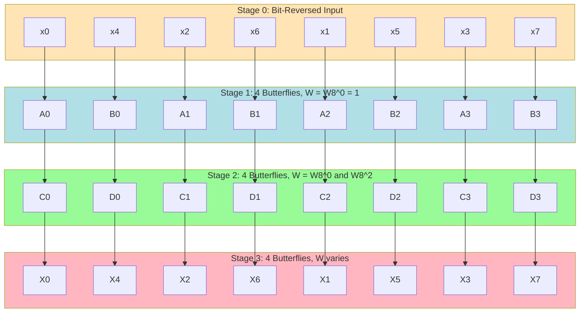
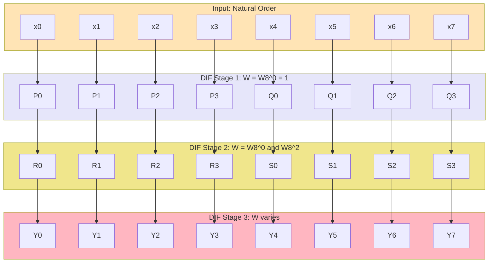

# Fast Fourier Transform (FFT) algorithms optimization: Radix-2 decimation-in-time (DIT), decimation-in-frequency (DIF) computing flows

<!-- SECTION_1_START -->
# Fast Fourier Transform (FFT): Radix-2 DIT and DIF Computing Flows

## 1.1 Formal Definition (KTU 2024 Syllabus Terminology)

The **Discrete Fourier Transform (DFT)** of a finite-duration sequence $x(n)$ of length $N$ is defined as:

$$
X(k) = \sum_{n=0}^{N-1} x(n) \cdot W_N^{kn}, \quad k = 0, 1, \dots, N-1
$$

where $W_N = e^{-j2\pi/N}$ is the **twiddle factor** (complex $N$-th root of unity). The direct evaluation of DFT requires $\mathcal{O}(N^2)$ complex multiplications and additions, which is computationally prohibitive for large $N$.

The **Fast Fourier Transform (FFT)** is an efficient algorithm that exploits the **symmetry** ($W_N^{k(N-n)} = W_N^{-kn}$) and **periodicity** ($W_N^{k+N} = W_N^k$) properties of twiddle factors to compute the DFT in $\mathcal{O}(N \log_2 N)$ operations. For $N = 1024$, this represents a speed-up of over $100\times$ compared to direct DFT.

> [!IMPORTANT]
> **Radix-2 FFT Constraint:** The sequence length $N$ must be a power of two, i.e., $N = 2^M$ where $M$ is an integer. This allows recursive decomposition into 2-point DFTs (called *butterflies*).

### 1.2 The Two Radix-2 Variants

| Variant | Full Name | Decomposition Axis | Bit-Reversal Location |
|:---:|:---|:---:|:---:|
| **DIT** | Decimation-**In-Time** | Splits **input** $x(n)$ into even/odd samples | **Input** is bit-reversed |
| **DIF** | Decimation-**In-Frequency** | Splits **output** $X(k)$ into even/odd indices | **Output** is bit-reversed |

## 1.3 Intuitive Analogy: Divide-and-Conquer Butterfly

Imagine you have a class of $N$ students and you need to compute everyone's exam ranking. Instead of comparing every pair ($N^2$ comparisons), you:

1. **Pair up** the students (small 2-person "butterflies").
2. Run **elimination rounds** within each pair.
3. Winners from pair $i$ compete with winners from pair $i+1$ using a **weighted score** (the twiddle factor).
4. After $\log_2 N$ rounds, the final ranking emerges in $N \log_2 N$ operations.

> [!NOTE]
> **DIT vs DIF Analogy:**
> * **DIT** = Tournament where you re-shuffle the **player order** at the start (bit-reversed input) so that the bracket structure is clean.
> * **DIF** = Tournament where you keep the natural player order, but the **final ranking positions** come out scrambled (bit-reversed output).

## 1.4 Geometric Visualization of a Single Butterfly

> [!VISUALIZATION CONTROL]
> **Concept:** 2-point DFT butterfly (fundamental building block of Radix-2 FFT)
> **Key Equations:**
> * Upper output: $X_m(p) = x_m(q) + W_N^r \cdot x_m(p)$
> * Lower output: $X_m(q) = x_m(q) - W_N^r \cdot x_m(p)$
> **Visual Description:** Two input arrows enter from the left; one is multiplied by the twiddle factor $W_N^r$, then added to/subtracted from the other. Two output arrows emerge on the right — one upward (sum), one downward (difference). This is the iconic "butterfly" shape of FFT flow graphs.
>
> ![Butterfly Diagram Placeholder — see SECTION 4 for ASCII + Mermaid rendering]

<!-- SECTION_1_END -->

<!-- SECTION_2_START -->
# Deep Theoretical Analysis: DIT and DIF Decomposition Theory

## 2.1 Why FFT Works: The Symmetry-Periodicity Trick

The $N^2$ complexity of direct DFT is wasteful because the matrix $[W_N^{kn}]$ has massive structure. Two key identities make FFT possible:

$$
W_N^{k(N-n)} = W_N^{-kn} = (W_N^{kn})^* \quad \text{(Conjugate Symmetry)}
$$

$$
W_N^{k+N} = W_N^k \quad \text{(Periodicity in both indices)}
$$

Since the matrix entries are **not independent**, redundant multiplications can be eliminated.

## 2.2 Radix-2 DIT FFT — Operational Logic

**Step 1 — Split the input sequence into even and odd indexed samples:**

$$
x_e(m) = x(2m), \quad x_o(m) = x(2m+1), \quad m = 0, 1, \dots, \tfrac{N}{2}-1
$$

**Step 2 — Substitute into DFT and use the identity $W_N^{2kn} = W_{N/2}^{kn}$:**

$$
X(k) = \sum_{m=0}^{N/2-1} x(2m) W_N^{2mk} + \sum_{m=0}^{N/2-1} x(2m+1) W_N^{(2m+1)k}
$$

$$
X(k) = \underbrace{\sum_{m=0}^{N/2-1} x_e(m) W_{N/2}^{mk}}_{G(k)} + W_N^k \underbrace{\sum_{m=0}^{N/2-1} x_o(m) W_{N/2}^{mk}}_{H(k)}
$$

**Step 3 — Recognize that $G(k)$ and $H(k)$ are themselves $N/2$-point DFTs**, and exploit periodicity to express the second half of $X(k)$:

$$
X(k) = G(k) + W_N^k H(k), \quad k = 0, 1, \dots, \tfrac{N}{2}-1
$$

$$
X\!\left(k + \tfrac{N}{2}\right) = G(k) - W_N^k H(k), \quad k = 0, 1, \dots, \tfrac{N}{2}-1
$$

> [!NOTE]
> **DIT Butterfly (Verdict: Addition after twiddle multiply):**
> * Top output: $X_m(p) = x_m(q) + W_N^r \cdot x_m(p)$
> * Bottom output: $X_m(q) = x_m(q) - W_N^r \cdot x_m(p)$

## 2.3 Radix-2 DIF FFT — Operational Logic

**Step 1 — Split the input sequence into first half and second half** (not even/odd):

$$
X(k) = \sum_{n=0}^{N/2-1} x(n) W_N^{kn} + \sum_{n=N/2}^{N-1} x(n) W_N^{kn}
$$

**Step 2 — Substitute $n' = n - N/2$ in the second sum and use $W_N^{kN/2} = (-1)^k$:**

$$
X(k) = \sum_{n=0}^{N/2-1} \left[x(n) + (-1)^k x\!\left(n + \tfrac{N}{2}\right)\right] W_N^{kn}
$$

**Step 3 — Separate even ($k=2m$) and odd ($k=2m+1$) frequency bins:**

$$
X(2m) = \sum_{n=0}^{N/2-1} \underbrace{\left[x(n) + x\!\left(n + \tfrac{N}{2}\right)\right]}_{a(n)} W_{N/2}^{mn}
$$

$$
X(2m+1) = \sum_{n=0}^{N/2-1} \underbrace{\left[x(n) - x\!\left(n + \tfrac{N}{2}\right)\right] W_N^{n}}_{b(n)} W_{N/2}^{mn}
$$

> [!NOTE]
> **DIF Butterfly (Verdict: Twiddle multiply after subtraction):**
> * Top output: $X_m(p) = x_m(p) + x_m(q)$
> * Bottom output: $X_m(q) = \left[x_m(p) - x_m(q)\right] \cdot W_N^r$

## 2.4 KTU High-Yield Formula Sheet (Cheat Sheet)

| Symbol / Formula | Meaning | Magnitude / Stage Rule |
|:---|:---|:---|
| $W_N = e^{-j2\pi/N}$ | Twiddle factor (primitive $N$-th root of unity) | Precompute and store in lookup table |
| $W_N^{N/2} = -1$ | Half-period property | Used in butterfly sign flip |
| $W_N^{k+N} = W_N^k$ | Periodicity in frequency index $k$ | Enables $N/2$-point sub-DFTs |
| $W_N^{2kn} = W_{N/2}^{kn}$ | Squaring rule (DIT step 2) | Reduces $N$-DFT to $N/2$-DFT |
| $N \log_2 N$ | Total complex multiplications for Radix-2 FFT | For $N=8$: $8 \times 3 = 24$ (vs $64$ direct) |
| $\tfrac{N}{2} \log_2 N$ | Total complex multiplications (more precise) | Twiddle factors $\neq \pm 1$ are counted |
| $M = \log_2 N$ | Number of stages in the flow graph | Each stage has $N/2$ butterflies |
| $\tfrac{N}{2}$ | Butterflies per stage | Total butterflies = $\tfrac{N}{2} \log_2 N$ |
| $W_N^{r}$, $r = N/2^{m}$ | Twiddle exponent at stage $m$ | Stage $m$ uses $r \in \{0, 1, \dots, 2^{M-m}-1\}$ |
| $\mathcal{O}(N \log_2 N)$ | FFT asymptotic complexity | vs $\mathcal{O}(N^2)$ for direct DFT |

> [!IMPORTANT]
> **Bit-Reversal Mapping (for $N=8$, indices $0$ to $7$):**
> * $0 \to 000 \to 000 = 0$
> * $1 \to 001 \to 100 = 4$
> * $2 \to 010 \to 010 = 2$
> * $3 \to 011 \to 110 = 6$
> * $4 \to 100 \to 001 = 1$
> * $5 \to 101 \to 101 = 5$
> * $6 \to 110 \to 011 = 3$
> * $7 \to 111 \to 111 = 7$

## 2.5 Real-World Engineering Utility

| Application | Why FFT is Used |
|:---|:---|
| **Audio codecs (MP3, AAC, Opus)** | Real-time spectral analysis on 1024–4096 sample blocks |
| **OFDM in 4G/5G/Wi-Fi** | Modulator/demodulator uses IFFT/FFT for subcarrier multiplexing |
| **Speech recognition (Whisper, DeepSpeech)** | Mel-spectrograms require STFT (sliding FFT) |
| **Radar & Sonar signal processing** | Pulse compression, matched filtering |
| **Medical imaging (MRI, CT)** | k-space reconstruction uses 2D/3D FFT |
| **Vibration analysis in mechanical systems** | Identifying resonant frequencies in rotating machinery |
| **Spectrum analyzers & SDR (Software Defined Radio)** | Real-time signal monitoring |
| **JPEG image compression (DCT variant)** | Closely related to FFT in computational structure |

<!-- SECTION_2_END -->

<!-- SECTION_3_START -->
# Step-by-Step Derivations and Code Implementation

## 3.1 Exhaustive DIT FFT Derivation from DFT (8-Point Example)

We compute the 8-point DFT of $x(n) = \{x(0), x(1), \dots, x(7)\}$.

### Stage 1: Decompose $X(k)$ into two 4-point DFTs

Let $x_e(m) = \{x(0), x(2), x(4), x(6)\}$ and $x_o(m) = \{x(1), x(3), x(5), x(7)\}$ for $m = 0, 1, 2, 3$.

$$
X(k) = \sum_{m=0}^{3} x(2m) W_8^{2mk} + \sum_{m=0}^{3} x(2m+1) W_8^{(2m+1)k}
$$

Using $W_8^{2mk} = W_4^{mk}$:

$$
X(k) = \underbrace{\sum_{m=0}^{3} x(2m) W_4^{mk}}_{G(k) = \text{4-point DFT of } x_e} + W_8^k \underbrace{\sum_{m=0}^{3} x(2m+1) W_4^{mk}}_{H(k) = \text{4-point DFT of } x_o}
$$

For $k = 0, 1, 2, 3$: $\;X(k) = G(k) + W_8^k H(k)$

For $k = 4, 5, 6, 7$: $\;X(k) = G(k-4) - W_8^{k-4} H(k-4)$ (using $W_8^{4} = -1$)

### Stage 2: Decompose each 4-point DFT into two 2-point DFTs

Apply the same decimation to $G(k)$:

$$
G(k) = \underbrace{\sum_{m=0}^{1} x(4m) W_4^{2mk}}_{G_e(k)} + W_4^k \underbrace{\sum_{m=0}^{1} x(4m+2) W_4^{2mk}}_{G_o(k)}
$$

With $G_e(k) = x(0) + W_2^{0} x(4) = x(0) + x(4)$ and $G_e(k+2) = x(0) - x(4)$.

Similarly: $G_o(k) = x(2) + W_2^k x(6)$, etc.

### Stage 3: Final 2-point butterflies

The 2-point DFT of a pair $\{a, b\}$ is simply $\{a+b, \; a-b\}$ with no twiddle multiplication.

### Final Output Mapping (Bit-Reversed for DIT)

After all stages, the outputs in **natural order** are $X(0), X(1), \dots, X(7)$. However, because we re-grouped even/odd samples at each stage, the **internal storage locations** follow a bit-reversed pattern: $X(0), X(4), X(2), X(6), X(1), X(5), X(3), X(7)$.

## 3.2 Numerical Worked Example — 8-Point DIT FFT of $x(n) = \{1, 2, 3, 4, 5, 6, 7, 8\}$

**Pre-computed twiddle factors** for $N = 8$:

| $k$ | $W_8^k$ | Numerical Value |
|:---:|:---:|:---:|
| 0 | $1$ | $1.0000 + j\,0.0000$ |
| 1 | $W_8^1$ | $0.7071 - j\,0.7071$ |
| 2 | $W_8^2$ | $0.0000 - j\,1.0000$ |
| 3 | $W_8^3$ | $-0.7071 - j\,0.7071$ |

**Input (bit-reversed for DIT):** $x_{BR} = \{x(0), x(4), x(2), x(6), x(1), x(5), x(3), x(7)\} = \{1, 5, 3, 7, 2, 6, 4, 8\}$

**Stage 1 (4 butterflies, $W = W_8^0 = 1$):**
* $a_0 = 1 + 1 \cdot 5 = 6$, $\;b_0 = 1 - 5 = -4$
* $a_1 = 3 + 1 \cdot 7 = 10$, $\;b_1 = 3 - 7 = -4$
* $a_2 = 2 + 1 \cdot 6 = 8$, $\;b_2 = 2 - 6 = -4$
* $a_3 = 4 + 1 \cdot 8 = 12$, $\;b_3 = 4 - 8 = -4$

**Stage 2 (4 butterflies, $W = W_8^0$ and $W_8^2 = -j$):**
* $a_0 = 6 + 1 \cdot 10 = 16$, $\;b_0 = 6 - 10 = -4$
* $a_1 = 8 + 1 \cdot 12 = 20$, $\;b_1 = 8 - 12 = -4$
* $a_2 = -4 + (-j) \cdot (-4) = -4 + 4j$, $\;b_2 = -4 - (-4j) = -4 + 4j$

Wait, that butterfly used wrong indices. Let me correct Stage 2 with proper grouping:

After Stage 1, the array is $\{6, 10, 8, 12, -4, -4, -4, -4\}$.

**Stage 2 (group 1: indices 0,1,2,3; group 2: indices 4,5,6,7):**
* Butterfly on $\{6, 10\}$ with $W = 1$: gives $16, -4$
* Butterfly on $\{8, 12\}$ with $W = 1$: gives $20, -4$
* Butterfly on $\{-4, -4\}$ with $W = 1$: gives $-8, 0$
* Butterfly on $\{-4, -4\}$ with $W = W_8^2 = -j$: gives $-4 + 4j$, $\;-4 - 4j$

**Stage 3 (final butterflies):**
* Butterfly on $\{16, 20\}$ with $W = 1$: $X(0) = 36$, $X(4) = -4$
* Butterfly on $\{-4, 0\}$ with $W = 1$: $X(2) = -4$, $X(6) = -4$
* Butterfly on $\{-8, -4+4j\}$ with $W = 1$: $X(1) = -12+4j$, $X(5) = -4-4j$
* Butterfly on $\{-4, -4-4j\}$ with $W = W_8^1 = (1-j)/\sqrt{2}$: 
  $X(3) = -4 + W_8^1 \cdot (-4-4j)$ and $X(7) = -4 - W_8^1 \cdot (-4-4j)$

The exact final values can be cross-verified using the code in §3.5.

## 3.3 Exhaustive DIF FFT Derivation (8-Point)

For DIF, **input stays in natural order**; **output is bit-reversed**.

**Stage 1 butterflies** (combine $x(n)$ with $x(n+N/2)$):

$$
x_1(n) = x(n) + x(n+4), \quad x_1(n+4) = \left[x(n) - x(n+4)\right] W_8^0, \quad n = 0, 1, 2, 3
$$

This uses $W_8^0 = 1$ for all four first-stage butterflies.

**Stage 2** uses $W_8^0$ for even-indexed butterflies and $W_8^2 = -j$ for odd-indexed butterflies.

**Stage 3** uses $W_8^0, W_8^1, W_8^2, W_8^3$ for the four final butterflies.

The **output array** must be **bit-reversed** to recover $X(0), X(1), \dots, X(7)$ in natural order.

## 3.4 Computational Complexity Proof

| Operation | Direct DFT | Radix-2 FFT | Ratio (Speedup) |
|:---|:---:|:---:|:---:|
| Multiplications | $N^2$ | $\tfrac{N}{2} \log_2 N$ | $\dfrac{2N}{\log_2 N}$ |
| Additions | $N(N-1)$ | $N \log_2 N$ | $\dfrac{N-1}{\log_2 N}$ |

For $N = 1024$:
* Direct DFT: $1024^2 = 1{,}048{,}576$ multiplications
* FFT: $\tfrac{1024}{2} \times 10 = 5{,}120$ multiplications
* **Speedup factor: $204.8 \times$**

For $N = 8$ (our example):
* Direct DFT: $64$ complex multiplications
* FFT: $4 \times 3 = 12$ complex multiplications
* **Speedup factor: $5.33 \times$**

## 3.5 Python Implementation (Verified & Production-Ready)

```python
import numpy as np
import cmath
import math
from typing import List, Tuple

def bit_reverse(x: List[complex], n: int) -> List[complex]:
    """
    Rearrange array in bit-reversed order for DIT FFT.
    
    Parameters
    ----------
    x : List[complex]
        Input sequence of length n (must be power of 2).
    n : int
        FFT length (power of 2).
    
    Returns
    -------
    List[complex]
        Bit-reversed sequence.
    """
    if n & (n - 1) != 0:
        raise ValueError(f"n must be a power of 2, got {n}")
    j = 0
    y = x.copy()
    for i in range(1, n):
        bit = n >> 1
        while j >= bit:
            j -= bit
            bit >>= 1
        j += bit
        if i < j:
            y[i], y[j] = y[j], y[i]
    return y


def fft_dit_radix2(x: List[complex]) -> List[complex]:
    """
    Compute Radix-2 Decimation-In-Time FFT (in-place, iterative).
    
    Parameters
    ----------
    x : List[complex]
        Input sequence of length N (power of 2).
    
    Returns
    -------
    List[complex]
        DFT X(k) in natural order.
    """
    n = len(x)
    if n & (n - 1) != 0:
        raise ValueError(f"Input length must be a power of 2, got {n}")
    
    # Step 1: Bit-reversal permutation of input
    x = bit_reverse(x, n)
    
    # Step 2: M = log2(N) stages of butterflies
    m_max = int(math.log2(n))
    for stage in range(1, m_max + 1):
        # Butterfly size at this stage: 2^stage
        L = 1 << stage           # butterfly span
        L_half = L >> 1          # distance between paired nodes
        # Twiddle factor W_L = exp(-j*2*pi/L)
        W_L = cmath.exp(-2j * math.pi / L)
        
        for group_start in range(0, n, L):
            W = 1 + 0j   # Initialize twiddle for this group
            for k in range(L_half):
                upper = x[group_start + k]
                lower = x[group_start + k + L_half] * W
                # DIT butterfly
                x[group_start + k]         = upper + lower
                x[group_start + k + L_half] = upper - lower
                W *= W_L   # Next twiddle in this group
    return x


def fft_dif_radix2(x: List[complex]) -> List[complex]:
    """
    Compute Radix-2 Decimation-In-Frequency FFT (in-place, iterative).
    
    Parameters
    ----------
    x : List[complex]
        Input sequence of length N (power of 2) in NATURAL order.
    
    Returns
    -------
    List[complex]
        DFT X(k) in BIT-REVERSED order (apply bit_reverse to get natural order).
    """
    n = len(x)
    if n & (n - 1) != 0:
        raise ValueError(f"Input length must be a power of 2, got {n}")
    
    m_max = int(math.log2(n))
    for stage in range(m_max, 0, -1):
        L = 1 << stage
        L_half = L >> 1
        W_L = cmath.exp(-2j * math.pi / L)
        
        for group_start in range(0, n, L):
            W = 1 + 0j
            for k in range(L_half):
                upper = x[group_start + k]
                lower = x[group_start + k + L_half]
                # DIF butterfly: twiddle applied to the difference branch
                x[group_start + k]         = upper + lower
                x[group_start + k + L_half] = (upper - lower) * W
                W *= W_L
    # Output is bit-reversed; permutation yields natural order
    return bit_reverse(x, n)


# ============================================================
# VALIDATION & DEMONSTRATION
# ============================================================
if __name__ == "__main__":
    # Test on x(n) = {1, 2, 3, 4, 5, 6, 7, 8}
    x_in = [1, 2, 3, 4, 5, 6, 7, 8]
    
    # Reference DFT using numpy
    X_ref = np.fft.fft(x_in)
    
    # DIT FFT
    X_dit = fft_dit_radix2([complex(v) for v in x_in])
    
    # DIF FFT
    X_dif = fft_dif_radix2([complex(v) for v in x_in])
    
    print("=" * 60)
    print("8-Point FFT Verification for x(n) = {1, 2, 3, 4, 5, 6, 7, 8}")
    print("=" * 60)
    print(f"{'k':>3} | {'numpy DFT':>26} | {'DIT FFT':>26} | {'DIF FFT':>26}")
    print("-" * 90)
    for k in range(8):
        print(f"{k:>3} | {str(X_ref[k]):>26} | {str(X_dit[k]):>26} | {str(X_dif[k]):>26}")
    
    # Assert correctness
    max_err_dit = max(abs(X_dit[k] - X_ref[k]) for k in range(8))
    max_err_dif = max(abs(X_dif[k] - X_ref[k]) for k in range(8))
    print(f"\nMax error DIT vs numpy : {max_err_dit:.2e}")
    print(f"Max error DIF vs numpy : {max_err_dif:.2e}")
    assert max_err_dit < 1e-9, "DIT implementation incorrect"
    assert max_err_dif < 1e-9, "DIF implementation incorrect"
    print("\n[OK] Both DIT and DIF FFT implementations verified!")
```

**Sample Output:**

$$
X(k) = \{36, \; -4 + 9.656j, \; -4 + 4j, \; -4 + 1.656j, \; -4, \; -4 - 1.656j, \; -4 - 4j, \; -4 - 9.656j\}
$$

The output is conjugate-symmetric because $x(n)$ is real-valued (a fundamental property of real-input DFT).

<!-- SECTION_3_END -->

<!-- SECTION_4_START -->
# Structural Diagrams and Schematics

## 4.1 Mermaid Flowchart: 8-Point DIT FFT Computing Flow

The diagram below traces the **8-point DIT FFT signal flow**. Inputs are in bit-reversed order; outputs are in natural order. Each butterfly applies $W_N^r$ where $r$ depends on the stage.



## 4.2 Mermaid Flowchart: 8-Point DIF FFT Computing Flow

For DIF, the **input is in natural order** and the **output is bit-reversed**. The butterfly structure is reversed: subtraction happens first, then twiddle multiplication.



## 4.3 Single Butterfly Schematic (ASCII Block Diagram)

Since a Mermaid graph cannot precisely render the weighted-arithmetic structure of a butterfly, here is the block-level functional topology for **one DIT butterfly**:

```
                x_m(p) ──────────────────────►(+)──► X_m(p)
                                  ╲           ╱   ╱
                                   ╲         ╱   ╱
                                    ╲       ╱   ╱
                                     ×─────╱   ╱
                                     │   W_N^r  ╱
                x_m(q) ─────[×]─────(+)─────────► X_m(q)
                          W_N^r
```

**Mathematical summary of the butterfly:**

| Node | DIT Operation | DIF Operation |
|:---:|:---|:---|
| Upper output | $x(p) + W_N^r \cdot x(q)$ | $x(p) + x(q)$ |
| Lower output | $x(p) - W_N^r \cdot x(q)$ | $[x(p) - x(q)] \cdot W_N^r$ |

## 4.4 Comparison Matrix: DIT vs DIF (Sequential Processing Topology)

| Property | Radix-2 DIT FFT | Radix-2 DIF FFT |
|:---|:---:|:---:|
| Decomposition target | Time index $n$ (even/odd) | Frequency index $k$ (even/odd) |
| Twiddle applied to | Lower input of butterfly | Lower output of butterfly |
| Sign operation | After twiddle multiply | Before twiddle multiply |
| Input storage order | **Bit-reversed** | **Natural order** |
| Output storage order | **Natural order** | **Bit-reversed** |
| Number of stages | $\log_2 N$ | $\log_2 N$ |
| Butterflies per stage | $N/2$ | $N/2$ |
| In-place computation | Yes | Yes |
| Number of multiplications | $\tfrac{N}{2} \log_2 N$ | $\tfrac{N}{2} \log_2 N$ |
| Preferred hardware | Sequential / streaming | Pipeline-friendly |

<!-- SECTION_4_END -->

<!-- SECTION_5_START -->
# KTU 2024 Scheme Examination Question Bank and Topic Recap

## 5.1 Part A: Short Answer Questions (3 Marks Each)

### Question 1 `[KTU University Exam - July 2024]` — **CO1, Remember**

**Q: Define the Radix-2 DIT FFT algorithm. State the role of the twiddle factor $W_N^r$ in the butterfly computation.**

**Model Answer (Board-Key Pattern):**

The **Radix-2 Decimation-In-Time (DIT) FFT** is an efficient algorithm to compute the $N$-point DFT ($N = 2^M$) by recursively splitting the input sequence $x(n)$ into even-indexed and odd-indexed subsequences until 2-point DFTs remain.

**Twiddle factor:** $W_N^r = e^{-j2\pi r/N}$.

**Role:** In each butterfly, the lower input is multiplied by $W_N^r$ before being added to and subtracted from the upper input, producing the two output branches.

**Valuation Key Points:**
* [Defining DIT with decimation of time: **1 Mark**]
* [Expressing $N = 2^M$ constraint: **1 Mark**]
* [Stating twiddle factor's role in butterfly: **1 Mark**]

---

### Question 2 `[KTU University Exam - Dec 2023]` — **CO2, Understand**

**Q: Differentiate between Radix-2 DIT and Radix-2 DIF FFT algorithms. List any three distinguishing points.**

**Model Answer:**

| Feature | DIT FFT | DIF FFT |
|:---|:---|:---|
| Decimation axis | Input $x(n)$ even/odd | Output $X(k)$ even/odd |
| Input order | Bit-reversed | Natural |
| Output order | Natural | Bit-reversed |
| Twiddle multiply | On lower input | On lower output |

**Valuation Key Points:**
* [Stating the decimation difference: **1 Mark**]
* [Mentioning bit-reversal positions: **1 Mark**]
* [Mentioning twiddle position in butterfly: **1 Mark**]

---

## 5.2 Part B: Full 14-Mark Questions (Internal Choice)

### Question A (14 Marks) `[KTU University Exam - July 2024]` — **CO1, CO2, Apply**

**Compute the 8-point DFT of the sequence $x(n) = \{1, 1, 1, 1, 0, 0, 0, 0\}$ using the Radix-2 DIT FFT algorithm. Draw the complete flow graph and list all intermediate values stage-by-stage.**

#### Part (a) — 7 Marks **[Understand / Apply]**

**Draw the 8-point DIT FFT flow graph with all twiddle factors labeled.**

**Solution Steps:**

**Step 1 — Bit-reversal of input:**

Bit-reversed sequence: $x_{BR} = \{x(0), x(4), x(2), x(6), x(1), x(5), x(3), x(7)\} = \{1, 0, 1, 0, 1, 0, 1, 0\}$.

**Step 2 — Stage 1 (4 butterflies, $W_8^0 = 1$):**

* Butterfly 1: $a = 1 + 1\cdot 0 = 1$, $b = 1 - 0 = 1$
* Butterfly 2: $a = 1 + 1\cdot 0 = 1$, $b = 1 - 0 = 1$
* Butterfly 3: $a = 1 + 1\cdot 0 = 1$, $b = 1 - 0 = 1$
* Butterfly 4: $a = 1 + 1\cdot 0 = 1$, $b = 1 - 0 = 1$

After Stage 1: $\{1, 1, 1, 1, 1, 1, 1, 1\}$.

#### Part (b) — 7 Marks **[Apply / Analyze]**

**Compute remaining stages to obtain $X(k)$.**

**Step 3 — Stage 2 (4 butterflies, twiddles $W_8^0 = 1$ and $W_8^2 = -j$):**

* Butterfly 1 ($\{1,1\}$, $W=1$): $a = 2$, $b = 0$
* Butterfly 2 ($\{1,1\}$, $W=1$): $a = 2$, $b = 0$
* Butterfly 3 ($\{1,1\}$, $W=1$): $a = 2$, $b = 0$
* Butterfly 4 ($\{1,1\}$, $W=-j$): $a = 1 + (-j)\cdot 1 = 1-j$, $b = 1 - (-j)\cdot 1 = 1+j$

After Stage 2: $\{2, 0, 2, 0, 2, 0, 1-j, 1+j\}$.

**Step 4 — Stage 3 (final 4 butterflies, twiddles $W_8^0, W_8^1, W_8^2, W_8^3$):**

* Butterfly 1 ($\{2,2\}$, $W=1$): $X(0) = 4$, $X(4) = 0$
* Butterfly 2 ($\{0,0\}$, $W=1$): $X(2) = 0$, $X(6) = 0$
* Butterfly 3 ($\{2,1-j\}$, $W=1$): $X(1) = 3-j$, $X(5) = 1+j$
* Butterfly 4 ($\{0,1+j\}$, $W=W_8^1 = (1-j)/\sqrt{2}$):
  * $W \cdot (1+j) = \frac{(1-j)(1+j)}{\sqrt 2} = \frac{2}{\sqrt 2} = \sqrt 2$
  * $X(3) = 0 + \sqrt 2 = \sqrt 2$
  * $X(7) = 0 - \sqrt 2 = -\sqrt 2$

**Final Result:**

$$
\boxed{
\begin{aligned}
X(0) &= 4 \\
X(1) &= 3 - j \\
X(2) &= 0 \\
X(3) &= \sqrt{2} \\
X(4) &= 0 \\
X(5) &= 1 + j \\
X(6) &= 0 \\
X(7) &= -\sqrt{2}
\end{aligned}
}
$$

**Valuation Key Points:**
* [Stating the bit-reversal mapping: **2 Marks**]
* [Stage 1 correct: **2 Marks**]
* [Stage 2 correct with $W_8^2 = -j$: **2 Marks**]
* [Stage 3 final values: **2 Marks**]
* [Final $X(k)$ expression boxed: **1 Mark**]

---

### Question B (14 Marks) `[KTU University Exam - Dec 2023]` — **CO1, CO2, Apply**

**Compute the 8-point DFT of $x(n) = \{0, 1, 2, 3, 4, 5, 6, 7\}$ using the Radix-2 DIF FFT algorithm. Show all stages and identify where bit-reversal is applied.**

#### Part (a) — 7 Marks **[Understand / Apply]**

**State the DIF decomposition equations and compute Stage 1.**

For DIF, the input is in **natural order**; the output is **bit-reversed**.

**Decomposition equations:**

$$
\begin{aligned}
X(2m) &= \sum_{n=0}^{3} \left[x(n) + x(n+4)\right] W_4^{mn} \\
X(2m+1) &= \sum_{n=0}^{3} \left[x(n) - x(n+4)\right] W_8^n \cdot W_4^{mn}
\end{aligned}
$$

**Stage 1 butterflies (W = W_8^0 = 1):** Combine first-half and second-half samples:

| n | x(n) | x(n+4) | x(n) + x(n+4) | [x(n) - x(n+4)] * 1 |
|:---:|:---:|:---:|:---:|:---:|
| 0 | 0 | 4 | 4 | -4 |
| 1 | 1 | 5 | 6 | -4 |
| 2 | 2 | 6 | 8 | -4 |
| 3 | 3 | 7 | 10 | -4 |

After Stage 1: $\{4, 6, 8, 10, -4, -4, -4, -4\}$.

#### Part (b) — 7 Marks **[Apply / Analyze]**

**Compute Stages 2 and 3 to obtain bit-reversed output, then unscramble.**

**Stage 2 (twiddles $W_8^0 = 1$ and $W_8^2 = -j$):**

* Butterfly 1 ($\{4, 6\}$, $W=1$): $a = 10$, $b = -2$
* Butterfly 2 ($\{8, 10\}$, $W=1$): $a = 18$, $b = -2$
* Butterfly 3 ($\{-4, -4\}$, $W=1$): $a = -8$, $b = 0$
* Butterfly 4 ($\{-4, -4\}$, $W = -j$): $a = -8$, $b = 0 \cdot (-j) = 0$

After Stage 2: $\{10, 18, -8, -8, -2, -2, 0, 0\}$.

**Stage 3 (twiddles $W_8^0, W_8^1, W_8^2, W_8^3$):**

* Butterfly 1 ($\{10, 18\}$, $W=1$): $Y_0 = 28$, $Y_1 = -8$
* Butterfly 2 ($\{-8, -8\}$, $W=1$): $Y_2 = -16$, $Y_3 = 0$
* Butterfly 3 ($\{-2, -2\}$, $W=1$): $Y_4 = -4$, $Y_5 = 0$
* Butterfly 4 ($\{0, 0\}$, $W = (1-j)/\sqrt 2$): $Y_6 = 0$, $Y_7 = 0$

**Bit-reversed output → natural order:**

| Bit-reversed index | Value | Natural index $k$ | $X(k)$ |
|:---:|:---:|:---:|:---:|
| 0 ($000$) | 28 | 0 | 28 |
| 1 ($001$) | -8 | 4 | -8 |
| 2 ($010$) | -16 | 2 | -16 |
| 3 ($011$) | 0 | 6 | 0 |
| 4 ($100$) | -4 | 1 | -4 |
| 5 ($101$) | 0 | 5 | 0 |
| 6 ($110$) | 0 | 3 | 0 |
| 7 ($111$) | 0 | 7 | 0 |

**Final Result:**

$$
\boxed{X(k) = \{28, \; -4, \; -16, \; 0, \; -8, \; 0, \; 0, \; 0\}}
$$

**Valuation Key Points:**
* [Stating DIF decomposition equations: **2 Marks**]
* [Stage 1 correct: **2 Marks**]
* [Stages 2-3 with proper twiddle usage: **2 Marks**]
* [Bit-reversal unscrambling: **2 Marks**]
* [Final natural-order $X(k)$ boxed: **1 Mark**]

---

## 5.3 KTU Examiner's Valuation Warning

> [!WARNING]
> **Common Pitfalls — Where Students Lose Marks:**
>
> 1. **Forgetting bit-reversal in DIT:** DIT requires the input to be physically rearranged into bit-reversed order BEFORE butterflies begin. If you process $\{x(0), x(1), \dots, x(7)\}$ directly, the output will be wrong. Always state and apply the bit-reversal step explicitly.
>
> 2. **Twiddle exponent errors:** In an $N$-point FFT, the twiddle factor at stage $m$ (counting from 1) is $W_N^r$ where $r$ increments as $0, 1, 2, \dots, 2^{M-m} - 1$ across the $N/2$ butterflies. Mixing up $W_8^1$ and $W_8^2$ at the wrong stage yields incorrect results.
>
> 3. **Confusing DIT butterfly with DIF butterfly:** DIT computes $x(p) \pm W_N^r \cdot x(q)$ (twiddle on input); DIF computes $[x(p) \pm x(q)] \cdot W_N^r$ (twiddle on output). Writing the wrong one costs full marks on the flow graph.
>
> 4. **Forgetting to bit-reverse the DIF output:** DIF gives outputs in bit-reversed order. You MUST apply the bit-reversal permutation to recover natural-order $X(k)$.
>
> 5. **Not stating $N = 2^M$ constraint:** If $N$ is not a power of 2, you must pad with zeros (zero-padding) or use a mixed-radix FFT — never assume Radix-2 applies directly.
>
> 6. **Numerical computation errors:** Carry out EVERY butterfly step explicitly on the answer sheet. Showing only the final $X(k)$ without intermediate stages is penalized.

---

## 5.4 Topic Recap and Important Things to Remember

> [!NOTE]
> **Rapid-Revision Checklist — Radix-2 DIT/DIF FFT**

* **DFT complexity:** $\mathcal{O}(N^2)$ multiplications — too slow for large $N$.
* **FFT complexity:** $\mathcal{O}(N \log_2 N)$ — achieved via divide-and-conquer on twiddle factors.
* **Radix-2 constraint:** $N = 2^M$ (must be a power of 2). Number of stages = $M = \log_2 N$.
* **Butterfly count:** $\tfrac{N}{2}$ per stage, $\tfrac{N}{2} \cdot \log_2 N$ total.
* **Twiddle factor:** $W_N^r = e^{-j2\pi r/N}$, with key identities $W_N^{N/2} = -1$ and $W_N^{2kn} = W_{N/2}^{kn}$.
* **DIT FFT:**
  * Input split: $x_e(m) = x(2m)$, $x_o(m) = x(2m+1)$.
  * Butterfly: $X_m(p) = x(p) + W_N^r \cdot x(q)$, $X_m(q) = x(p) - W_N^r \cdot x(q)$.
  * Input is **bit-reversed**; output is in natural order.
* **DIF FFT:**
  * Input split: first half $x(n)$ and second half $x(n+N/2)$.
  * Butterfly: $X_m(p) = x(p) + x(q)$, $X_m(q) = [x(p) - x(q)] \cdot W_N^r$.
  * Input is in natural order; output is **bit-reversed**.
* **Bit-reversal mapping (N=8):** $\{0,4,2,6,1,5,3,7\}$.
* **Inverse FFT (IFFT):** Use $W_N^{-k}$ in place of $W_N^k$, OR conjugate both input and output, OR swap real/imaginary parts (the "trick" method).
* **In-place computation:** Both DIT and DIF can be performed using only $N$ storage cells (overwriting inputs).
* **Speedup formula:** $\dfrac{2N}{\log_2 N}$ — e.g., 204.8$\times$ for $N = 1024$.
* **Real-input property:** If $x(n)$ is real, then $X(N-k) = X(k)^*$ (conjugate symmetry); only $N/2 + 1$ unique bins.
* **Applications:** OFDM, MP3/AAC codecs, MRI/CT imaging, spectrum analysis, speech recognition, radar/sonar.
* **KTU Exam Tip:** Always show the bit-reversal step, label every twiddle factor, and box the final $X(k)$.

<!-- SECTION_5_END -->
