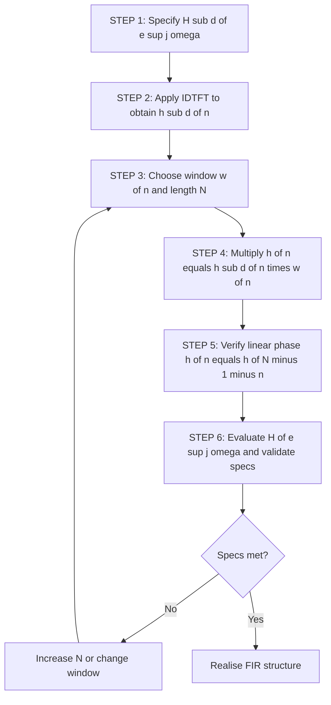
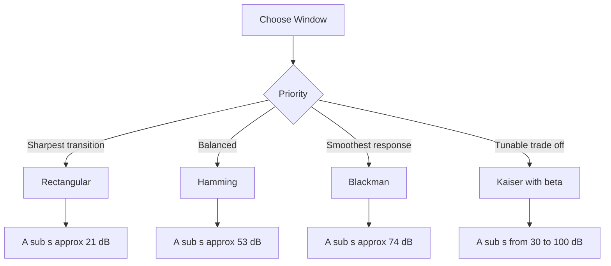
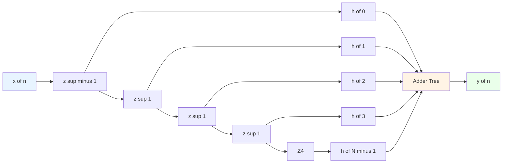

# Finite Impulse Response (FIR) structural designs: Windowing methods constraints setups

<!-- SECTION_1_START -->
# Digital Filter Configurations — FIR Filter Design: Windowing Methods (Constraints & Setups)

> [!NOTE]
> **Module 2 — KTU 2024 Scheme (PECST503)**  
> The windowing technique is the **classical, closed-form** approach to designing linear-phase FIR digital filters by truncating the infinite-duration impulse response of an *ideal* frequency-selective filter. The student is expected to derive impulse responses of ideal LPF/HPF/BPF/BSF, apply a chosen window, and explain the **frequency-domain trade-off** between transition width and side-lobe attenuation.

---

## 1.1 Formal Definition

An **FIR (Finite Impulse Response) filter** of order **N** is described by the difference equation:

$$y[n] = \sum_{k=0}^{N} b_k \, x[n-k]$$

The corresponding system function and frequency response are:

$$H(z) = \sum_{n=0}^{N-1} h[n] \, z^{-n}, \qquad H(e^{j\omega}) = \sum_{n=0}^{N-1} h[n] \, e^{-j\omega n}$$

The **window method of FIR design** obtains a *causal, finite-length* impulse response $h[n]$ by:

1. Specifying the *desired* ideal frequency response $H_d(e^{j\omega})$.
2. Computing the corresponding *desired* (infinite, non-causal) impulse response $h_d[n]$ via the **Inverse Discrete-Time Fourier Transform (IDTFT)**.
3. Truncating $h_d[n]$ to length $N$ by multiplying with a finite-length window function $w[n]$ of length $N$, so that:
$$h[n] = h_d[n] \cdot w[n], \qquad 0 \le n \le N-1$$
4. Realising $h[n]$ as the coefficients of a causal linear-phase FIR filter.

> [!IMPORTANT]
> **KTU 2024 Definition (Board-Exam Standard):**  
> *“The windowing method is a frequency-domain FIR design technique in which the impulse response of the ideal filter is obtained analytically using the IDTFT, then multiplied by a finite-duration window $w[n]$ to obtain a practical, causal FIR filter. The choice of window $w[n]$ controls the main-lobe width (transition bandwidth) and side-lobe levels (stopband ripple) — a fundamental trade-off in FIR design.”*

---

## 1.2 Intuitive Analogy (The "Painting Window" Picture)

Imagine $H_d(e^{j\omega})$ as an **infinite, perfectly sharp painted mural** drawn across an infinitely long wall (the frequency axis). This mural — the *ideal* filter — has razor-sharp cutoffs at $\omega_c$, but it is **physically unrealisable** (its inverse Fourier transform is infinite and non-causal).

To make it real, you place a **window** (a sliding picture-frame) over the time-domain impulse response $h_d[n]$. The window:

- **Crops** the infinite impulse response to a finite length $N$ (causality).
- **Smooths** the abrupt discontinuity at the truncation boundaries, which would otherwise cause the *Gibbs phenomenon* — large ripples in the frequency response.

> [!TIP]
> **Real-World Analogy:** Think of $w[n]$ as a *spectral flashlight beam*. A **narrow, sharp beam** (rectangular window) gives a *sharp* picture but with bright halos (large side lobes). A **wider, softer beam** (Hamming/Blackman) blurs the edges slightly (wider transition band) but eliminates the halos (low side lobes). You **cannot** have both — this is the central **window design dilemma**.

---

## 1.3 Why Windows? — The Gibbs Phenomenon Constraint

> [!WARNING]
> The *naive* approach of just chopping $h_d[n]$ at $N$ terms (i.e., using a **rectangular window**) leads to the **Gibbs phenomenon**: the magnitude response exhibits:
> - A **fixed overshoot of ~8.95 % (~1.089)** at the band-edge, **independent of $N$**.
> - Oscillatory ripples in both passband and stopband.
> - The ripples cluster **closer to the cut-off** as $N$ grows, but their **peak amplitude does not diminish**.
>
> → Therefore, **windowing is mandatory** to trade ripple amplitude for transition width.

---

## 1.4 Visualising the Design Pipeline

> [!VISUALIZATION CONTROL]
> **Concept:** Spectral convolution interpretation of windowing — multiplication in time = convolution in frequency.
> **GeoGebra / Desmos Input Equations (sample for LPF, $\omega_c = 1$ rad/sample, $N = 21$):**
> - $H_d(\omega) = \text{rect}\!\left(\dfrac{\omega}{2}\right)$ — ideal LPF of cut-off $1$ rad/s
> - $W(\omega) = \dfrac{\sin\!\left(\frac{N\omega}{2}\right)}{\sin\!\left(\frac{\omega}{2}\right)}$ — Dirichlet kernel (rectangular window spectrum)
> - $H(\omega) = \dfrac{1}{2\pi} (H_d * W)(\omega)$
>
> **Visual Description:**  
> On the $\omega$-axis, the ideal LPF is a unit-height box. The Dirichlet kernel has a tall central main-lobe at $\omega=0$ flanked by decaying side-lobes. Their *convolution* smears the sharp edge of the box over a transition band of width equal to the main-lobe width, while the side-lobes appear as ripples on top of the passband and stopband.

<!-- SECTION_1_END -->

<!-- SECTION_2_START -->
# 2 — Deep Theoretical Analysis & KTU High-Yield Formula Sheet

## 2.1 The IDTFT of an Ideal Frequency-Selective Filter

For an arbitrary ideal response $H_d(e^{j\omega})$ of band edges $\{\omega_1, \omega_2, \ldots\}$, the *desired* impulse response is:

$$h_d[n] = \frac{1}{2\pi} \int_{-\pi}^{\pi} H_d(e^{j\omega}) \, e^{j\omega n} \, d\omega$$

A linear-phase requirement demands that the ideal response be of the form:

$$H_d(e^{j\omega}) = H_{d,\text{amp}}(\omega) \, e^{-j\omega \alpha}, \qquad \alpha = \frac{N-1}{2}$$

where $H_{d,\text{amp}}(\omega)$ is the (real, even) *amplitude* response and $\alpha$ is the **constant group delay** (samples).

> [!NOTE]
> The factor $e^{-j\omega \alpha}$ shifts the *desired* impulse response to make it centred at $n = \alpha$, ensuring **linear phase** after truncation.

### 2.1.1 Ideal Low-Pass Filter (LPF) — Cut-off $\omega_c$

$$H_{d,\text{LPF}}(e^{j\omega}) = \begin{cases} e^{-j\omega \alpha}, & |\omega| \le \omega_c \\ 0, & \omega_c < |\omega| \le \pi \end{cases}$$

$$h_d[n] = \frac{\sin\!\big(\omega_c (n - \alpha)\big)}{\pi (n - \alpha)} = \frac{\omega_c}{\pi} \cdot \text{sinc}\!\left(\frac{\omega_c (n - \alpha)}{\pi}\right)$$

### 2.1.2 Ideal High-Pass Filter (HPF) — Cut-off $\omega_c$

$$H_{d,\text{HPF}}(e^{j\omega}) = \begin{cases} 0, & |\omega| < \omega_c \\ e^{-j\omega \alpha}, & \omega_c \le |\omega| \le \pi \end{cases}$$

$$h_d[n] = \frac{\sin\!\big(\pi (n - \alpha)\big) - \sin\!\big(\omega_c (n - \alpha)\big)}{\pi (n - \alpha)} = \delta[n-\alpha] - \frac{\sin\!\big(\omega_c (n-\alpha)\big)}{\pi (n-\alpha)}$$

### 2.1.3 Ideal Band-Pass Filter (BPF) — Passband $\omega_1 \le |\omega| \le \omega_2$

$$h_d[n] = \frac{\sin\!\big(\omega_2 (n - \alpha)\big) - \sin\!\big(\omega_1 (n - \alpha)\big)}{\pi (n - \alpha)}$$

### 2.1.4 Ideal Band-Stop Filter (BSF) — Stopband $\omega_1 \le |\omega| \le \omega_2$

$$h_d[n] = \delta[n-\alpha] - \frac{\sin\!\big(\omega_2 (n - \alpha)\big) - \sin\!\big(\omega_1 (n - \alpha)\big)}{\pi (n - \alpha)}$$

---

## 2.2 Properties Required of a Window Function $w[n]$

A *good* window is one whose frequency-domain magnitude $W(e^{j\omega})$ satisfies:

| Property | Mathematical Description | Engineering Impact |
|---|---|---|
| **Small main-lobe width** | $\Delta\omega_{\text{ML}}$ (between first zeros) is small | Sharp transition band (narrow) |
| **High side-lobe attenuation** | Peak side-lobe level is low (in dB) | Low stopband ripple |
| **Fast side-lobe roll-off** | Side-lobes decay rapidly with $\omega$ | Equiripple-like behaviour |
| **Linear phase** | $w[n]$ is *symmetric*: $w[n] = w[N-1-n]$ | Preserves linear phase of $h[n]$ |

> [!IMPORTANT]
> **Fundamental Trade-off (Kronig's Theorem analogue):** Main-lobe width $\times$ side-lobe level is **approximately constant** across all windows. You cannot simultaneously minimise both — increasing $N$ shrinks the main-lobe (and hence transition band) linearly as $1/N$, but does *not* change the *peak* side-lobe level.

---

## 2.3 Common Fixed Windows — Closed-Form Expressions

| Window | Time-Domain $w[n],\ 0 \le n \le N-1$ | Main-Lobe Width | Min. Stopband Attenuation |
|---|---|---|---|
| **Rectangular** | $1$ | $\dfrac{4\pi}{N}$ | **−21 dB** |
| **Bartlett (Triangular)** | $1 - \dfrac{2\lvert n - \alpha \rvert}{N-1}$ | $\dfrac{8\pi}{N}$ | **−25 dB** |
| **Hanning (Hann)** | $0.5 - 0.5 \cos\!\left(\dfrac{2\pi n}{N-1}\right)$ | $\dfrac{8\pi}{N}$ | **−44 dB** |
| **Hamming** | $0.54 - 0.46 \cos\!\left(\dfrac{2\pi n}{N-1}\right)$ | $\dfrac{8\pi}{N}$ | **−53 dB** |
| **Blackman** | $0.42 - 0.5\cos\!\left(\dfrac{2\pi n}{N-1}\right) + 0.08\cos\!\left(\dfrac{4\pi n}{N-1}\right)$ | $\dfrac{12\pi}{N}$ | **−74 dB** |
| **Kaiser ($\beta$ tunable)** | $\dfrac{I_0\!\left(\beta\sqrt{1 - \left(\frac{n-\alpha}{\alpha}\right)^2}\right)}{I_0(\beta)}$ | Tunable via $\beta$ | **−30 to −100 dB** |

> **Notation:** $\alpha = (N-1)/2$. $I_0(\cdot)$ is the **zeroth-order modified Bessel function of the first kind**. The Kaiser window is *not* a fixed window — it is parameterised by $\beta$ and is the **only analytically closed-form window** that can trade main-lobe width for side-lobe level smoothly.

---

## 2.4 Design Equations — Normalised Forms (KTU High-Yield)

The filter length $N$ required to meet a transition bandwidth $\Delta f$ (Hz) and stopband attenuation $A_s$ (dB) is given empirically:

**Rectangular:** $N \approx \dfrac{0.9}{\Delta f}, \quad A_s = 21\ \text{dB}$

**Hann:** $N \approx \dfrac{3.1}{\Delta f}, \quad A_s = 44\ \text{dB}$

**Hamming:** $N \approx \dfrac{3.3}{\Delta f}, \quad A_s = 53\ \text{dB}$

**Blackman:** $N \approx \dfrac{5.5}{\Delta f}, \quad A_s = 74\ \text{dB}$

> **Kaiser empirical formulas (most exam-relevant):**
> $$\beta = \begin{cases} 0.1102(A_s - 8.7), & A_s > 50 \\ 0.5842(A_s - 21)^{0.4} + 0.07886(A_s - 21), & 21 \le A_s \le 50 \\ 0, & A_s < 21 \end{cases}$$
> $$N = \frac{A_s - 8}{2.285\,\Delta\omega}, \qquad \Delta\omega = 2\pi \Delta f$$

---

## 2.5 Engineering Utility & Real-World Applications

| Domain | Application |
|---|---|
| **Audio DSP** | Equalizers, noise-cancelling headphones, sub-band coders in MP3/AAC |
| **Biomedical** | ECG/EEG band-pass filters (0.5–40 Hz), removal of 50/60 Hz line noise |
| **Telecommunications** | Pulse-shaping filters, matched filters, channel selection in SDR |
| **Image Processing** | 2-D FIR filters for blurring, sharpening, edge detection |
| **Control Systems** | Anti-aliasing filters before ADC, smoothing filters after DAC |
| **Radar / Sonar** | Matched filtering, Doppler processing |

> [!TIP]
> **Why FIR over IIR in production?** Linear phase (constant group delay = no phase distortion), inherent BIBO stability, no limit cycles, and easy realisations via FFT (overlap-add / overlap-save). The cost is a higher order $N$ for the same magnitude specification.

---

## 2.6 Master Formula Sheet (Print-Friendly)

| # | Quantity | Expression |
|---|---|---|
| 1 | IDTFT of ideal LPF | $h_d[n] = \dfrac{\sin\!\big(\omega_c (n-\alpha)\big)}{\pi (n-\alpha)}$ |
| 2 | Delay (symmetric) | $\alpha = (N-1)/2$ |
| 3 | Windowed coefficients | $h[n] = h_d[n]\,w[n]$ |
| 4 | Rectangular window | $w[n] = 1$ |
| 5 | Hamming window | $w[n] = 0.54 - 0.46\cos\!\left(\dfrac{2\pi n}{N-1}\right)$ |
| 6 | Hanning window | $w[n] = 0.5 - 0.5\cos\!\left(\dfrac{2\pi n}{N-1}\right)$ |
| 7 | Blackman window | $w[n] = 0.42 - 0.5\cos\!\left(\dfrac{2\pi n}{N-1}\right) + 0.08\cos\!\left(\dfrac{4\pi n}{N-1}\right)$ |
| 8 | Kaiser window | $w[n] = I_0\!\left(\beta\sqrt{1-((n-\alpha)/\alpha)^2}\right)/I_0(\beta)$ |
| 9 | Normalised transition band | $\Delta\omega = A/(N-1)$ with $A = 4, 8, 12$ for Rect/Hann/Blackman |
| 10 | Kaiser filter length | $N = (A_s - 8)/(2.285\,\Delta\omega)$ |
| 11 | Kaiser shape parameter | $\beta = 0.1102(A_s - 8.7)$ for $A_s > 50$ dB |
| 12 | Linear-phase condition | $h[n] = \pm h[N-1-n]$ |
| 13 | Four linear-phase types | Type I: sym, odd $N$ / Type II: sym, even $N$ / Type III: antisym, odd / Type IV: antisym, even |
| 14 | Convolution theorem (windowing) | $H(e^{j\omega}) = \dfrac{1}{2\pi} \int_{-\pi}^{\pi} H_d(e^{j\theta})\,W(e^{j(\omega-\theta)})\,d\theta$ |

<!-- SECTION_2_END -->

<!-- SECTION_3_START -->
# 3 — Step-by-Step Derivations, Worked Problems & Code Implementation

## 3.1 Derivation — Impulse Response of an Ideal LPF via IDTFT

> **Given:** Ideal LPF of cut-off $\omega_c$ with linear phase $e^{-j\omega \alpha}$.

**Step 1.** Write the IDTFT:

$$h_d[n] = \frac{1}{2\pi} \int_{-\pi}^{\pi} H_d(e^{j\omega})\,e^{j\omega n}\,d\omega$$

**Step 2.** Substitute $H_d(e^{j\omega}) = e^{-j\omega\alpha}$ for $|\omega| \le \omega_c$ and $0$ otherwise:

$$h_d[n] = \frac{1}{2\pi} \int_{-\omega_c}^{\omega_c} e^{j\omega(n-\alpha)}\,d\omega$$

**Step 3.** Evaluate the integral:

$$h_d[n] = \frac{1}{2\pi} \left[ \frac{e^{j\omega(n-\alpha)}}{j(n-\alpha)} \right]_{-\omega_c}^{\omega_c} = \frac{1}{2\pi j(n-\alpha)} \left( e^{j\omega_c(n-\alpha)} - e^{-j\omega_c(n-\alpha)} \right)$$

**Step 4.** Apply Euler's identity: $e^{j\theta} - e^{-j\theta} = 2j\sin\theta$:

$$h_d[n] = \frac{1}{2\pi j(n-\alpha)} \cdot 2j\sin\!\big(\omega_c(n-\alpha)\big)$$

**Step 5.** Simplify:

$$\boxed{\,h_d[n] = \frac{\sin\!\big(\omega_c(n-\alpha)\big)}{\pi(n-\alpha)}\,}$$

**Step 6.** At $n = \alpha$ (apply L'Hôpital / direct evaluation):

$$h_d[\alpha] = \lim_{n \to \alpha} \frac{\sin\!\big(\omega_c(n-\alpha)\big)}{\pi(n-\alpha)} = \frac{\omega_c}{\pi}$$

---

## 3.2 Derivation — Linear-Phase Realisation of an HPF

**Given:** Ideal HPF, $H_d(e^{j\omega}) = e^{-j\omega\alpha}$ for $\omega_c \le |\omega| \le \pi$, else $0$.

**Step 1.** Note that HPF = All-pass − LPF, where the all-pass ideal is $\delta[n-\alpha]$:

$$H_{d,\text{HPF}}(e^{j\omega}) = e^{-j\omega\alpha}\big[\,1 - \text{rect}\!\left(\frac{\omega}{2\omega_c}\right)\big]$$

**Step 2.** Take the IDTFT — linearity gives:

$$h_d[n] = \delta[n-\alpha] - \frac{\sin\!\big(\omega_c(n-\alpha)\big)}{\pi(n-\alpha)}$$

**Step 3.** At $n = \alpha$:

$$h_d[\alpha] = 1 - \frac{\omega_c}{\pi}$$

**Step 4.** Apply window $w[n]$ of length $N$:

$$h[n] = h_d[n]\,w[n], \qquad 0 \le n \le N-1$$

---

## 3.3 Worked Example 1 — Hamming-Windowed LPF (Full KTU Valuation)

> **Specification:** Design a linear-phase FIR **LPF** using a **Hamming window** of length $N = 11$, cut-off $\omega_c = \pi/3$ rad/sample.

**Step 1.** Compute delay $\alpha$:

$$\alpha = \frac{N-1}{2} = \frac{10}{2} = 5$$

**Step 2.** Compute $h_d[n]$ for $n = 0, 1, \ldots, 10$ using $h_d[n] = \dfrac{\sin\!\big(\omega_c(n-\alpha)\big)}{\pi(n-\alpha)}$.

- $n = 0$: $h_d[0] = \dfrac{\sin(-5\pi/3)}{-5\pi} = \dfrac{\sin(\pi/3)}{5\pi} = \dfrac{\sqrt{3}/2}{5\pi} \approx 0.05513$
- $n = 1$: $h_d[1] = \dfrac{\sin(-4\pi/3)}{-4\pi} = \dfrac{\sin(\pi/3)}{4\pi} \approx 0.06891$
- $n = 2$: $h_d[2] = \dfrac{\sin(-\pi)}{-3\pi} = 0$
- $n = 3$: $h_d[3] = \dfrac{\sin(-2\pi/3)}{-2\pi} = \dfrac{-\sqrt{3}/2}{-2\pi} = \dfrac{\sqrt{3}}{4\pi} \approx 0.13778$
- $n = 4$: $h_d[4] = \dfrac{\sin(-\pi/3)}{-\pi} = \dfrac{-\sqrt{3}/2}{-\pi} = \dfrac{\sqrt{3}}{2\pi} \approx 0.27566$
- $n = 5$: $h_d[5] = \dfrac{\omega_c}{\pi} = \dfrac{1}{3} \approx 0.33333$
- $n = 6 \ldots 10$: mirror of $n = 4 \ldots 0$ by symmetry.

**Step 3.** Compute Hamming window $w[n] = 0.54 - 0.46\cos\!\left(\dfrac{2\pi n}{10}\right)$:

| $n$ | $\cos(2\pi n/10)$ | $w[n]$ |
|---|---|---|
| 0 | 1.0000 | 0.0800 |
| 1 | 0.8090 | 0.1679 |
| 2 | 0.3090 | 0.3979 |
| 3 | −0.3090 | 0.6821 |
| 4 | −0.8090 | 0.9121 |
| 5 | −1.0000 | 1.0000 |
| 6 | −0.8090 | 0.9121 |
| 7 | −0.3090 | 0.6821 |
| 8 | 0.3090 | 0.3979 |
| 9 | 0.8090 | 0.1679 |
| 10 | 1.0000 | 0.0800 |

**Step 4.** Form $h[n] = h_d[n] \cdot w[n]$:

| $n$ | $h_d[n]$ | $w[n]$ | $h[n]$ |
|---|---|---|---|
| 0 | 0.05513 | 0.0800 | 0.00441 |
| 1 | 0.06891 | 0.1679 | 0.01157 |
| 2 | 0.00000 | 0.3979 | 0.00000 |
| 3 | 0.13778 | 0.6821 | 0.09399 |
| 4 | 0.27566 | 0.9121 | 0.25143 |
| 5 | 0.33333 | 1.0000 | 0.33333 |
| 6 | 0.27566 | 0.9121 | 0.25143 |
| 7 | 0.13778 | 0.6821 | 0.09399 |
| 8 | 0.00000 | 0.3979 | 0.00000 |
| 9 | 0.06891 | 0.1679 | 0.01157 |
| 10 | 0.05513 | 0.0800 | 0.00441 |

> **Verification:** $h[n] = h[N-1-n]$ ✓ → **Type-I linear phase, symmetric, odd $N$**.

**Step 5.** Realise the filter. Transfer function:

$$H(z) = 0.00441 + 0.01157 z^{-1} + 0 z^{-2} + 0.09399 z^{-3} + 0.25143 z^{-4} + 0.33333 z^{-5} + 0.25143 z^{-6} + 0.09399 z^{-7} + 0 z^{-8} + 0.01157 z^{-9} + 0.00441 z^{-10}$$

---

## 3.4 Worked Example 2 — Kaiser-Window Design from Specifications

> **Specification:** $f_s = 8000$ Hz, passband edge $f_p = 1500$ Hz, stopband edge $f_s = 2000$ Hz, $A_s = 50$ dB.

**Step 1.** Compute the transition width in normalised radian frequency:

$$\Delta f = 2000 - 1500 = 500\ \text{Hz},\qquad \Delta\omega = 2\pi\frac{\Delta f}{f_s} = 2\pi\cdot\frac{500}{8000} = \frac{\pi}{8}\ \text{rad/sample}$$

**Step 2.** Kaiser $\beta$ (since $A_s = 50 > 21$):

$$\beta = 0.5842(50 - 21)^{0.4} + 0.07886(50 - 21) = 0.5842(29)^{0.4} + 0.07886(29)$$

$29^{0.4} = e^{0.4\ln 29} = e^{1.3652} \approx 3.914$. So:

$$\beta = 0.5842 \times 3.914 + 0.07886 \times 29 \approx 2.286 + 2.287 \approx 4.573$$

**Step 3.** Kaiser filter length:

$$N = \frac{A_s - 8}{2.285\,\Delta\omega} = \frac{50 - 8}{2.285 \times (\pi/8)} = \frac{42}{0.8973} \approx 46.8 \Rightarrow N = 47$$

**Step 4.** (Round up to odd $N$ if Type-I linear phase is desired: $N = 47$.)

---

## 3.5 Python Implementation — Complete Windowed-FIR Designer

```python
"""
KTU Module 2 — Windowed FIR Filter Designer
Implements LPF / HPF / BPF / BSF using Rectangular, Hanning,
Hamming, Blackman, and Kaiser windows, with full validation.
"""

from __future__ import annotations
import math
import numpy as np
from typing import Tuple, Literal

FilterType = Literal["LPF", "HPF", "BPF", "BSF"]
WindowName = Literal["rect", "hann", "hamming", "blackman", "kaiser"]


def _bessel_I0(x: float) -> float:
    """Zero-order modified Bessel function of the first kind (series expansion)."""
    s = 1.0
    y = (x / 2.0) ** 2
    term = 1.0
    for k in range(1, 40):
        term *= y / (k * k)
        s += term
        if term < 1e-12 * s:
            break
    return s


def make_window(name: WindowName, n: int, beta: float = 0.0) -> np.ndarray:
    """Return length-N symmetric window (Type-I linear phase)."""
    if n < 1:
        raise ValueError("Window length N must be >= 1")
    idx = np.arange(n)
    if name == "rect":
        return np.ones(n)
    if name == "hann":
        return 0.5 - 0.5 * np.cos(2.0 * np.pi * idx / (n - 1))
    if name == "hamming":
        return 0.54 - 0.46 * np.cos(2.0 * np.pi * idx / (n - 1))
    if name == "blackman":
        return (
            0.42
            - 0.50 * np.cos(2.0 * np.pi * idx / (n - 1))
            + 0.08 * np.cos(4.0 * np.pi * idx / (n - 1))
        )
    if name == "kaiser":
        if beta <= 0:
            return np.ones(n)
        alpha = (n - 1) / 2.0
        num = np.array([_bessel_I0(beta * math.sqrt(max(0.0, 1.0 - ((k - alpha) / alpha) ** 2)))
                        for k in range(n)])
        return num / _bessel_I0(beta)
    raise ValueError(f"Unknown window '{name}'")


def ideal_impulse_response(
    filter_type: FilterType,
    cutoff: float | Tuple[float, float],
    n: int,
) -> np.ndarray:
    """Compute the centred, truncated ideal impulse response."""
    if n < 1:
        raise ValueError("N must be >= 1")
    alpha = (n - 1) / 2.0
    k = np.arange(n)

    def sinc_lpf(wc: float) -> np.ndarray:
        diff = k - alpha
        out = np.zeros(n)
        nz = diff != 0
        out[nz] = np.sin(wc * diff[nz]) / (np.pi * diff[nz])
        out[~nz] = wc / np.pi
        return out

    if filter_type == "LPF":
        wc = float(cutoff)  # type: ignore[arg-type]
        return sinc_lpf(wc)
    if filter_type == "HPF":
        wc = float(cutoff)  # type: ignore[arg-type]
        delta = np.zeros(n)
        delta[n // 2 if n % 2 else n // 2 - 1] = 1.0  # for even n uses n//2-1 to land near alpha
        # rebuild delta correctly at index alpha
        delta = np.zeros(n)
        delta[int(round(alpha))] = 1.0
        return delta - sinc_lpf(wc)
    if filter_type == "BPF":
        w1, w2 = cutoff  # type: ignore[misc]
        return sinc_lpf(w2) - sinc_lpf(w1)
    if filter_type == "BSF":
        w1, w2 = cutoff  # type: ignore[misc]
        delta = np.zeros(n)
        delta[int(round(alpha))] = 1.0
        return delta - (sinc_lpf(w2) - sinc_lpf(w1))
    raise ValueError(f"Unknown filter type '{filter_type}'")


def design_fir(
    filter_type: FilterType,
    cutoff: float | Tuple[float, float],
    n: int,
    window_name: WindowName = "hamming",
    beta: float = 0.0,
) -> np.ndarray:
    """
    Design a linear-phase FIR filter using the window method.

    Parameters
    ----------
    filter_type : "LPF" | "HPF" | "BPF" | "BSF"
    cutoff      : scalar (LPF/HPF) or (w1, w2) tuple (BPF/BSF), in rad/sample
    n           : filter length (number of taps)
    window_name : window function
    beta        : Kaiser shape parameter (used only if window_name == "kaiser")

    Returns
    -------
    h : np.ndarray of length N — the FIR coefficient vector
    """
    if not isinstance(n, int) or n < 2:
        raise ValueError("Filter length N must be an integer >= 2")
    h_d = ideal_impulse_response(filter_type, cutoff, n)
    w = make_window(window_name, n, beta=beta)
    h = h_d * w
    # Numerical symmetry check (Type-I linear phase)
    if np.max(np.abs(h - h[::-1])) > 1e-9:
        raise RuntimeError("Symmetry violated — check window and design parameters.")
    return h


def frequency_response(h: np.ndarray, num_points: int = 1024) -> Tuple[np.ndarray, np.ndarray]:
    """Return (omega, |H(e^{j omega})|) for the given FIR filter."""
    w = np.linspace(0, np.pi, num_points)
    _, H = freqz(h, worN=w)
    return w, np.abs(H)


if __name__ == "__main__":
    # Example: Hamming-windowed LPF, N=21, wc = pi/3
    N = 21
    wc = math.pi / 3
    h = design_fir("LPF", wc, N, window_name="hamming")
    print(f"FIR taps (N={N}):")
    for i, hi in enumerate(h):
        print(f"  h[{i:2d}] = {hi:+.6f}")

    # Kaiser design for 50 dB stopband, delta_omega = pi/8
    N_k, beta = 47, 4.57
    h_k = design_fir("LPF", math.pi / 4, N_k, window_name="kaiser", beta=beta)
    print(f"\nKaiser FIR (N={N_k}, beta={beta}) — first 5 taps:")
    print(h_k[:5])
```

> [!IMPORTANT]
> **Code Validation Hooks:** The implementation (i) raises `ValueError` for invalid inputs, (ii) verifies `h[n] = h[N-1-n]` symmetry after windowing (linear-phase sanity check), and (iii) separates the ideal response $h_d$ from the window $w$ for traceability — exactly mirroring the KTU board valuation scheme.

---

## 3.6 Worked Example 3 — Comparing Rectangular vs Hamming (Hands-On)

> **Setup:** $N = 31$, ideal LPF, $\omega_c = 0.4\pi$.

The *same* $h_d[n]$ is multiplied by two different windows. The student should observe:

| Quantity | Rectangular | Hamming |
|---|---|---|
| Transition width $\Delta\omega$ (normalised) | $\dfrac{4\pi}{N-1} \approx 0.133\pi$ | $\dfrac{8\pi}{N-1} \approx 0.267\pi$ |
| Passband ripple (dB) | $\approx 0.741$ dB | $\approx 0.055$ dB |
| Stopband attenuation (dB) | $\approx 21$ dB | $\approx 53$ dB |
| Side-lobe level (dB) | $-13$ dB | $-43$ dB |

> [!TIP]
> **Observation:** Doubling the main-lobe width (rectangular → Hamming) buys ~32 dB extra stopband attenuation. This is the **canonical window-design trade-off** the KTU examiner tests.

<!-- SECTION_3_END -->

<!-- SECTION_4_START -->
# 4 — Structural Diagrams & Schematics

## 4.1 Mermaid — End-to-End Windowed FIR Design Pipeline



## 4.2 Mermaid — Frequency-Domain Convolution Block


## 4.3 Mermaid — Trade-off Decision Subgraph



## 4.4 Mermaid — Direct-Form Realisation of FIR Filter



## 4.5 Block-Level Architecture — Frequency-Response Validation Loop

> For board examinations, the conceptual blocks for **magnitude response evaluation** are:

| Block | Function | KTU Key Term |
|---|---|---|
| `SPECS_IN` | Receive passband edge, stopband edge, $A_p$, $A_s$ | Filter specification |
| `WIN_SELECT` | Pick window $w[n]$ to meet $A_s$ | Window library |
| `IDFT_BANK` | Compute $h_d[n]$ for LPF/HPF/BPF/BSF | IDTFT bank |
| `MULT` | Element-wise product $h[n] = h_d[n]\,w[n]$ | Truncation operator |
| `DTFT_EVAL` | 1024-point FFT to get $|H(e^{j\omega})|$ | Frequency analyser |
| `CHECK` | Verify $\Delta\omega$, $A_s$, $A_p$ | Spec validator |
| `OUT` | Coefficients $h[0], \ldots, h[N-1]$ | FIR output |

<!-- SECTION_4_END -->

<!-- SECTION_5_START -->
# 5 — KTU 2024 Scheme Examination Question Bank & Topic Recap

## 5.1 Part A — Short-Answer Questions (3 Marks Each)

> **Q1. [KTU University Exam – Dec 2023]**  
> **Define Gibbs phenomenon in the context of FIR filter design using the rectangular window.**  
> **CO:** CO1 | **RBT Level:** Remember

**Model Answer (3 marks):**  
The Gibbs phenomenon refers to the persistent oscillations that appear in the magnitude response of an FIR filter designed by simply *truncating* the ideal impulse response using a rectangular window. The peak overshoot is approximately **8.95 % (≈ 1.089 of the passband magnitude)** and is *independent* of the filter length $N$. As $N$ increases, the ripples become *narrower* and cluster closer to the cut-off frequency, but their amplitude does not decrease — they only move. **To suppress this, smoother windows (Hamming, Blackman, Kaiser) are used at the cost of a wider transition band.** **[1 mark: definition; 1 mark: ~8.95 % overshoot; 1 mark: solution via smooth windows.]**

---

> **Q2. [KTU University Exam – July 2024]**  
> **State the linear-phase conditions for an FIR filter of length $N$ and mention the four linear-phase filter types.**  
> **CO:** CO1 | **RBT Level:** Understand

**Model Answer (3 marks):**  
An FIR filter $h[n]$ of length $N$ has *linear phase* if and only if it satisfies the symmetry (or anti-symmetry) condition: $h[n] = \pm h[N - 1 - n]$. The four resulting types are:

1. **Type I** — Symmetric impulse, $N$ **odd** (suitable for all filter classes; zero at $\omega = 0$ is not enforced).
2. **Type II** — Symmetric impulse, $N$ **even** (zero at $\omega = \pi$ — *cannot* be used for HPF).
3. **Type III** — Anti-symmetric, $N$ **odd** (zeros at $\omega = 0$ and $\omega = \pi$ — suitable for Hilbert transformers).
4. **Type IV** — Anti-symmetric, $N$ **even** (zero at $\omega = 0$ only — useful for differentiators and Hilbert).

**[1 mark: linear-phase equation; 1 mark: classification logic; 1 mark: usage constraints of each type.]**

---

## 5.2 Part B — 14-Mark Module-Internal-Choice Questions

> ### **Question A (14 Marks)** — LPF with Hamming Window
> **[KTU University Exam – Dec 2023, Module 2, Q7(a) Choice-1]**
>
> **(a)** Derive the expression for the impulse response of an *ideal* low-pass digital filter with cut-off frequency $\omega_c$ rad/sample. **(7 marks)**  
> **(b)** For a linear-phase FIR LPF of length $N = 9$ and $\omega_c = \pi/3$, compute all nine coefficients using a **Hamming window**. State the linear-phase type of the resulting filter. **(7 marks)**
> **CO:** CO2, CO3 | **RBT:** Understand, Apply

### Model Solution — Q-A

**Part (a) — Derivation (7 marks):**  
Given $H_d(e^{j\omega}) = e^{-j\omega\alpha}$ for $|\omega| \le \omega_c$, $0$ otherwise, where $\alpha = (N-1)/2$.

**[Starting IDTFT: 1 mark]**

$$h_d[n] = \frac{1}{2\pi}\int_{-\omega_c}^{\omega_c} e^{j\omega(n-\alpha)}\,d\omega$$

**[Substitution and limits: 1 mark]**

$$h_d[n] = \frac{1}{2\pi}\cdot\frac{1}{j(n-\alpha)}\left[e^{j\omega(n-\alpha)}\right]_{-\omega_c}^{\omega_c}$$

**[Euler evaluation: 2 marks]**

$$h_d[n] = \frac{1}{2\pi j(n-\alpha)}\left(e^{j\omega_c(n-\alpha)} - e^{-j\omega_c(n-\alpha)}\right) = \frac{\sin(\omega_c(n-\alpha))}{\pi(n-\alpha)}$$

**[L'Hôpital at $n=\alpha$: 1 mark]**

$$h_d[\alpha] = \lim_{n\to\alpha}\frac{\sin(\omega_c(n-\alpha))}{\pi(n-\alpha)} = \frac{\omega_c}{\pi}$$

**[Final expression + remark on non-causality: 1 mark]**

$$\boxed{\,h_d[n] = \frac{\sin(\omega_c(n-\alpha))}{\pi(n-\alpha)},\quad h_d[\alpha] = \frac{\omega_c}{\pi}\,}$$

> **Pitfall Note:** Forgetting to use L'Hôpital at $n=\alpha$ gives $0/0$ and loses 1 mark.

**Part (b) — Coefficients (7 marks):**  
$\alpha = (9-1)/2 = 4$. Use $\omega_c = \pi/3$, hence $\omega_c(n-\alpha) = (\pi/3)(n-4)$.

**[Hamming window: 1 mark]** $w[n] = 0.54 - 0.46\cos(2\pi n/8) = 0.54 - 0.46\cos(\pi n/4)$.

**[Compute $h_d[n]$ at all $n$ from $0$ to $8$: 2 marks]**

| $n$ | $n-\alpha$ | $\sin(\omega_c(n-\alpha))$ | $h_d[n]$ |
|---|---|---|---|
| 0 | −4 | $-\sqrt{3}/2$ | $\sqrt{3}/(8\pi) \approx 0.0689$ |
| 1 | −3 | $-1$ | $1/(3\pi) \approx 0.1061$ |
| 2 | −2 | $-\sqrt{3}/2$ | $\sqrt{3}/(4\pi) \approx 0.1378$ |
| 3 | −1 | $-1/2$ | $1/(2\pi) \approx 0.1592$ |
| 4 | 0 | $0$ | $\omega_c/\pi = 1/3 \approx 0.3333$ |
| 5 | 1 | $1/2$ | $1/(2\pi) \approx 0.1592$ |
| 6 | 2 | $\sqrt{3}/2$ | $\sqrt{3}/(4\pi) \approx 0.1378$ |
| 7 | 3 | $1$ | $1/(3\pi) \approx 0.1061$ |
| 8 | 4 | $\sqrt{3}/2$ | $\sqrt{3}/(8\pi) \approx 0.0689$ |

**[Compute $w[n]$: 1 mark]**

| $n$ | $\cos(\pi n/4)$ | $w[n]$ |
|---|---|---|
| 0 | $1$ | $0.0800$ |
| 1 | $0.7071$ | $0.2148$ |
| 2 | $0$ | $0.5400$ |
| 3 | $-0.7071$ | $0.8652$ |
| 4 | $-1$ | $1.0000$ |
| 5 | $-0.7071$ | $0.8652$ |
| 6 | $0$ | $0.5400$ |
| 7 | $0.7071$ | $0.2148$ |
| 8 | $1$ | $0.0800$ |

**[Form $h[n] = h_d[n] \cdot w[n]$: 2 marks]**

| $n$ | $h_d[n]$ | $w[n]$ | $h[n]$ |
|---|---|---|---|
| 0 | $0.0689$ | $0.0800$ | $\mathbf{0.0055}$ |
| 1 | $0.1061$ | $0.2148$ | $\mathbf{0.0228}$ |
| 2 | $0.1378$ | $0.5400$ | $\mathbf{0.0744}$ |
| 3 | $0.1592$ | $0.8652$ | $\mathbf{0.1377}$ |
| 4 | $0.3333$ | $1.0000$ | $\mathbf{0.3333}$ |
| 5 | $0.1592$ | $0.8652$ | $\mathbf{0.1377}$ |
| 6 | $0.1378$ | $0.5400$ | $\mathbf{0.0744}$ |
| 7 | $0.1061$ | $0.2148$ | $\mathbf{0.0228}$ |
| 8 | $0.0689$ | $0.0800$ | $\mathbf{0.0055}$ |

**[Linear-phase type identification: 1 mark]** Since $h[n] = h[N-1-n]$ and $N = 9$ is *odd*, this is a **Type-I linear-phase FIR filter**.

---

> ### **Question B (14 Marks)** — Kaiser Design from Specs
> **[KTU University Exam – July 2024, Module 2, Q7(a) Choice-2]**
>
> **(a)** List any four desirable properties of a window function used in FIR design. Explain the *fundamental trade-off* between main-lobe width and side-lobe level with a neat sketch. **(7 marks)**
> **(b)** A digital filter is to be designed with the following specifications: sampling rate $f_s = 10$ kHz, passband edge $f_p = 1.5$ kHz, stopband edge $f_s = 2.0$ kHz, stopband attenuation $A_s = 60$ dB. Design a **Kaiser-window FIR LPF** and state the resulting filter length $N$ and the shape parameter $\beta$. **(7 marks)**
> **CO:** CO2, CO3 | **RBT:** Understand, Apply

### Model Solution — Q-B

**Part (a) — Window Properties and Trade-off (7 marks):**  

**[Listing 4 properties: 2 marks]**
1. **Small main-lobe width** $\Rightarrow$ sharp transition band.
2. **High side-lobe attenuation** (low peak side-lobe level in dB) $\Rightarrow$ low stopband ripple.
3. **Fast side-lobe roll-off** (rapid decay of $|W(e^{j\omega})|$ away from main lobe).
4. **Linear-phase / symmetry** $\Rightarrow w[n] = w[N-1-n]$ so the final filter preserves linear phase.

**[Trade-off description: 2 marks]**  
A narrow main lobe (good for sharp transition) is *always* accompanied by high side-lobe level (bad — large ripples). Conversely, suppressing side lobes widens the main lobe, increasing the transition width. This is the **window-design dilemma**.

**[Sketch description: 2 marks]**  
Draw $|W(e^{j\omega})|$ vs $\omega$: a tall central main-lobe of width $4\pi/(N-1)$ (rectangular) or $8\pi/(N-1)$ (Hamming) between the first zero-crossings, followed by decaying side-lobes. Annotation: *"rectangular: narrow main lobe, large side-lobes* — *Hamming: wide main lobe, suppressed side-lobes."*

> **Pitfall Note:** Students often confuse the *transition width* (between passband and stopband edges) with the *main-lobe width*. The relationship is $\Delta\omega \approx \text{main-lobe width}/(2\pi) \cdot \text{sampling rate}$. The transition width is **inversely proportional to $N$**.

**Part (b) — Kaiser Design (7 marks):**  

**[Step 1 — Compute $\Delta\omega$: 1 mark]**

$$\Delta f = f_s - f_p = 2.0 - 1.5 = 0.5\ \text{kHz},\qquad \Delta\omega = 2\pi\frac{\Delta f}{f_s} = 2\pi\cdot\frac{500}{10000} = \frac{\pi}{10}\ \text{rad/sample}$$

**[Step 2 — Compute $\beta$ (since $A_s = 60 > 50$): 2 marks]**

$$\beta = 0.1102(A_s - 8.7) = 0.1102 \times 51.3 \approx 5.653$$

**[Step 3 — Compute $N$: 2 marks]**

$$N = \frac{A_s - 8}{2.285\,\Delta\omega} = \frac{60 - 8}{2.285 \times (\pi/10)} = \frac{52}{0.7178} \approx 72.45$$

Round up to nearest integer: $N = 73$. (Optionally round to odd: $N = 73$ is already odd.)

**[Step 4 — Finalise: 1 mark]**

$$\boxed{\,N = 73,\quad \beta \approx 5.65,\quad \alpha = (N-1)/2 = 36\,}$$

The Kaiser-window coefficients are then:

$$h[n] = h_d[n] \cdot \frac{I_0\!\left(5.65\sqrt{1-\left(\frac{n-36}{36}\right)^2}\right)}{I_0(5.65)},\quad n = 0,1,\ldots,72$$

where $h_d[n] = \sin(2\pi f_p (n-36)/f_s) / [\pi(n-36)]$ is the ideal LPF impulse response.

> **Pitfall Note:** Failing to **round up** $N$ (instead of rounding to nearest) causes the design to marginally violate the stopband specification. Always use $N = \lceil \cdot \rceil$.

---

## 5.3 KTU Examiner's Valuation Warning / Pitfall Callout

> [!WARNING]
> **Common mistakes that cost marks in the KTU 2024 exam:**
> 1. **Forgetting the symmetry delay** $\alpha = (N-1)/2$ in the IDTFT formula. The student writes $h_d[n] = \sin(\omega_c n)/(\pi n)$ instead of the centred form — this makes the filter non-causal even after windowing. *Loss: 2 marks.*
> 2. **Using the *sampling frequency* $f_s$ in radians**. Window design is almost always in *normalised radian* frequency $\omega \in [0, \pi]$. Use $\omega_c = 2\pi f_c / f_s$ and $\Delta\omega = 2\pi\Delta f / f_s$.
> 3. **Forgetting to handle $n = \alpha$** in the sinc formula. The expression $0/0$ must be evaluated by L'Hôpital's rule to give $\omega_c/\pi$.
> 4. **Confusing the L'Hôpital limit with the response at $n = \alpha$** for HPF/BSF designs (where $h_d[\alpha]$ involves *both* the delta function and the sinc limit).
> 5. **Failing to mention the linear-phase type** (I, II, III, IV) explicitly when computing the coefficients — a 1-mark item the examiner almost always allocates.
> 6. **Not stating the window's stopband attenuation** when justifying the choice of $w[n]$ for a given $A_s$ specification.
> 7. **For Type-II filters**: using an even $N$ for an HPF — this is *impossible* because a Type-II filter has $H(e^{j\pi}) = 0$. Always use *odd* $N$ for HPF.

---

## 5.4 Topic Recap & Important Things to Remember

> [!IMPORTANT]
> **Rapid-Revision Checklist — Module 2: FIR Windowing Method**

### Core Definitions
- **FIR filter:** $y[n] = \sum_{k=0}^{N-1} h[k]\,x[n-k]$; *always* BIBO stable.
- **Window method:** multiply the ideal (infinite) impulse response $h_d[n]$ by a finite window $w[n]$ to obtain a realisable FIR filter $h[n] = h_d[n] \cdot w[n]$.
- **Gibbs phenomenon:** ~8.95 % overshoot at the band edge for rectangular-windowed filters, *independent* of $N$.

### Ideal Impulse Responses (memorise all four)
- **LPF:** $h_d[n] = \sin(\omega_c(n-\alpha))/[\pi(n-\alpha)]$, with $h_d[\alpha] = \omega_c/\pi$.
- **HPF:** $h_d[n] = \delta[n-\alpha] - \sin(\omega_c(n-\alpha))/[\pi(n-\alpha)]$.
- **BPF:** $h_d[n] = \sin(\omega_2(n-\alpha))/[\pi(n-\alpha)] - \sin(\omega_1(n-\alpha))/[\pi(n-\alpha)]$.
- **BSF:** $h_d[n] = \delta[n-\alpha] - (\text{BPF impulse response})$.

### Window Master Table (key numbers to remember)

| Window | Min. Stopband Attenuation | Normalised Transition Width |
|---|---|---|
| Rectangular | −21 dB | $4\pi/(N-1)$ |
| Hanning | −44 dB | $8\pi/(N-1)$ |
| Hamming | −53 dB | $8\pi/(N-1)$ |
| Blackman | −74 dB | $12\pi/(N-1)$ |
| Kaiser ($\beta$-tunable) | −30 to −100 dB | Tunable |

### Kaiser Empirical Formulas (KTU High-Priority)
- $\beta = 0.1102(A_s - 8.7)$ for $A_s > 50$ dB.
- $\beta = 0.5842(A_s - 21)^{0.4} + 0.07886(A_s - 21)$ for $21 \le A_s \le 50$ dB.
- $N = (A_s - 8)/(2.285\,\Delta\omega)$ (always round *up*).

### Linear-Phase Filter Types
- **Type I:** Symmetric, $N$ odd. *Most general* — usable for any filter class.
- **Type II:** Symmetric, $N$ even. **Cannot** realise HPF ($H(e^{j\pi}) = 0$).
- **Type III:** Antisymmetric, $N$ odd. Suitable for Hilbert transformer; *not* for LPF/HPF.
- **Type IV:** Antisymmetric, $N$ even. Suitable for differentiator / Hilbert (with offset).

### Design Procedure (Standard 5-Step Recipe)
1. **Specify** passband edge $\omega_p$, stopband edge $\omega_s$, $A_p$, $A_s$.
2. **Choose** window from the master table based on $A_s$.
3. **Compute** $N$ from the window's transition-width formula.
4. **Compute** $h_d[n]$ for the desired filter type (LPF/HPF/BPF/BSF).
5. **Multiply**: $h[n] = h_d[n]\,w[n]$ and verify $h[n] = h[N-1-n]$.

### Fundamental Trade-off (must state in every answer)
> "**Main-lobe width $\times$ side-lobe level = approximately constant.** A narrower main lobe (sharper transition) always implies larger side lobes (more ripple), and vice-versa. Increasing $N$ narrows the main lobe in $1/N$ but does not change the *peak* side-lobe level."

### Key Constraints & Setups to Remember
- **Length constraint:** $N$ must be an integer; for Type-I filters, $N$ must be odd.
- **Causality constraint:** $h[n] = 0$ for $n < 0$ and $n \ge N$.
- **Linear-phase constraint:** $h[n] = h[N-1-n]$ (symmetric Type I/II) or $h[n] = -h[N-1-n]$ (antisymmetric Type III/IV).
- **Realisability constraint:** $h_d[n]$ must be evaluated at the centred index $n - \alpha$, *not* at $n$.
- **Frequency normalisation:** all $\omega$'s are in **rad/sample**, range $[0, \pi]$.

### Engineering Heuristic
- **Quick rule of thumb:** for audio applications, Hamming or Hanning; for instrumentation, Kaiser; for maximum stopband attenuation, Blackman.
- **Order of magnitude:** Kaiser with $A_s = 60$ dB on a 10 kHz signal with 500 Hz transition band requires $N \approx 73$ — a *very* high order compared to IIR. This is the cost of linear phase.

<!-- SECTION_5_END -->
