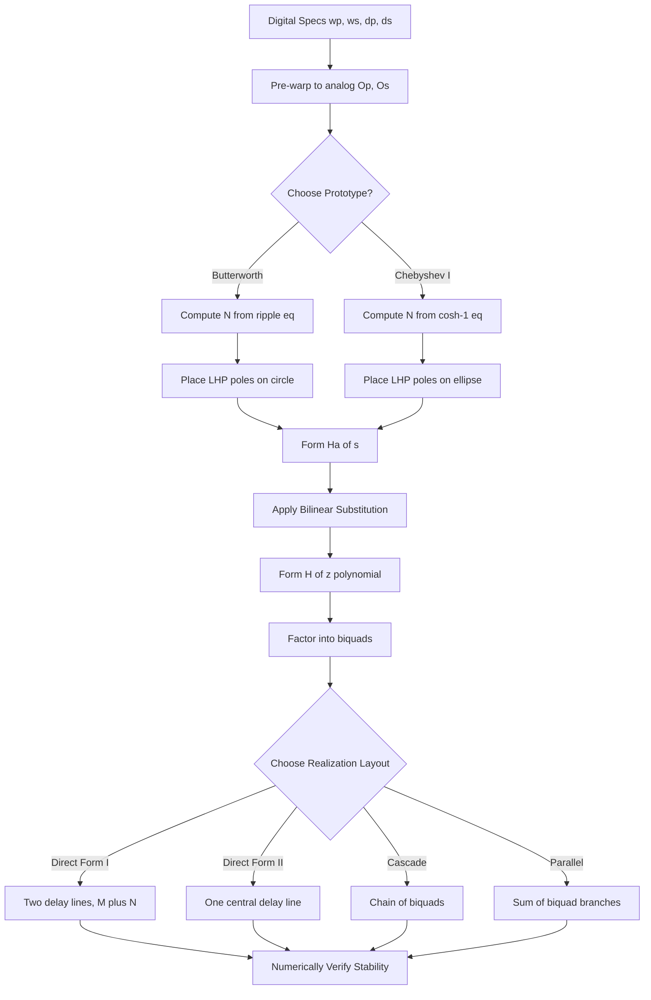
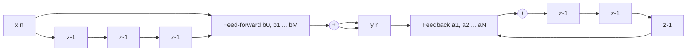
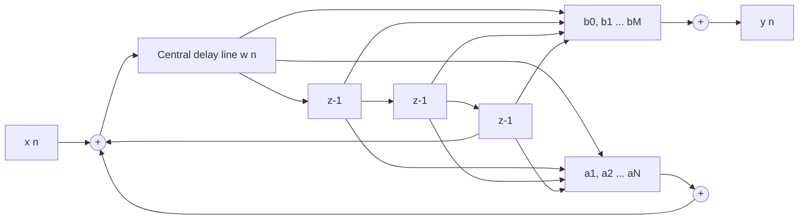
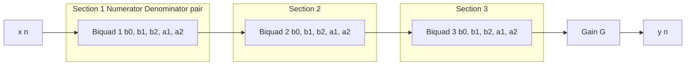
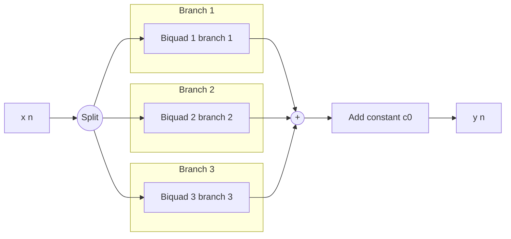

# Infinite Impulse Response (IIR) filter architecture layouts: Butterworth, Chebyshev adaptations techniques

<!-- SECTION_1_START -->
# Infinite Impulse Response (IIR) Filter Architectures & Analog-to-Digital Adaptation Techniques

> [!IMPORTANT]
> **KTU 2024 Scheme | PECST503 - Digital Signal Processing | Module 2 Focus**
> This note unifies the *theoretical analog prototype design* (Butterworth & Chebyshev) with the *practical digital realization structures* (Direct, Cascade, Parallel forms). Both are examinable as integrated questions in the End Semester Evaluation (ESE).

## 1.1 Formal Academic Definition

An **Infinite Impulse Response (IIR) Digital Filter** is a discrete-time linear shift-invariant system whose output $y[n]$ depends not only on the current and past input samples $x[n], x[n-1], \dots$ but also on past output samples $y[n-1], y[n-2], \dots$. This recursive (feedback) dependency yields an impulse response of theoretically infinite duration, hence the name.

The general difference equation governing an $N^{th}$-order IIR filter is:

$$y[n] = -\sum_{k=1}^{N} a_k \, y[n-k] + \sum_{k=0}^{M} b_k \, x[n-k]$$

The corresponding transfer function in the $z$-domain is:

$$H(z) = \frac{Y(z)}{X(z)} = \frac{\displaystyle\sum_{k=0}^{M} b_k \, z^{-k}}{1 + \displaystyle\sum_{k=1}^{N} a_k \, z^{-k}}$$

For causal and stable designs, $M \le N$ and all poles must reside strictly **inside the unit circle** of the $z$-plane ($|z| = 1$).

> [!NOTE]
> **Why "Adaptation Techniques"?**
> In KTU Module 2, "adaptation" refers to the systematic procedure of converting a *well-tabulated analog prototype* (Butterworth / Chebyshev) into a *digital filter* $H(z)$ using methods such as **Impulse Invariance** or the **Bilinear Transformation**. The resulting $H(z)$ is then mapped onto one of the four canonical architectures.

## 1.2 Conceptual Analogy & Intuition

> [!TIP]
> **Real-World Analogy: The Echoing Hallway**
> Imagine you clap your hands in a long empty corridor. You hear the original clap, but you also hear it reflecting back from the walls — once, twice, three times, each slightly weaker. Your ear (the "filter") receives:
> - The **direct sound** (the present input $x[n]$),
> - Plus **echoes of the past direct sound** ($x[n-1], x[n-2], \dots$ — the *feed-forward* path $b_k$),
> - Plus **echoes of echoes** ($y[n-1], y[n-2], \dots$ — the *feedback* path $a_k$).
> The echoes never truly die out within a finite time → the impulse response is *infinite*. That recursive memory of past outputs is the defining spirit of an IIR filter.

## 1.3 The Two Grand Analog Prototypes

### Butterworth Filter (Maximally Flat Magnitude)

A Butterworth filter of order $N$ has a magnitude-squared response that is *maximally flat* at $\omega = 0$ (DC). Its defining property is that the first $2N-1$ derivatives of $|H_a(j\Omega)|^2$ are zero at the origin.

The standard analog magnitude-squared response is:

$$|H_a(j\Omega)|^2 = \frac{1}{1 + \left(\dfrac{\Omega}{\Omega_c}\right)^{2N}}$$

where $\Omega_c$ is the **$-3\,\text{dB}$ cutoff frequency** and $N$ is the filter order.

> [!NOTE]
> **Key Insight for KTU:** Butterworth is **monotonically decreasing** in both passband and stopband. No ripples anywhere. This makes it the *safest, smoothest* choice when in-band fidelity (e.g., audio mastering, biomedical signal conditioning) is paramount.

### Chebyshev Filter (Equiripple Trade-off)

Chebyshev filters deliberately allow ripples in one band in exchange for a **steeper roll-off** between passband and stopband compared to Butterworth of equal order.

**Chebyshev Type I** — Equiripple in passband, monotonic in stopband:

$$|H_a(j\Omega)|^2 = \frac{1}{1 + \epsilon^2 \, C_N^2\left(\dfrac{\Omega}{\Omega_c}\right)}$$

**Chebyshev Type II** (also called *Inverse Chebyshev*) — Monotonic passband, equiripple stopband:

$$|H_a(j\Omega)|^2 = \frac{1}{1 + \left[\epsilon^2 \, C_N^2\left(\dfrac{\Omega_c}{\Omega}\right)\right]^{-1}}$$

Here $C_N(\cdot)$ is the Chebyshev polynomial of the first kind of degree $N$, and $\epsilon$ is the passband ripple factor related to the ripple amplitude $\delta$ by $\epsilon = \sqrt{10^{\delta/10} - 1}$.

> [!WARNING]
> **Common KTU Mistake:** Confusing the parameter $\epsilon$. In Type I, $\epsilon$ controls passband ripple ($0 < \epsilon < 1$). In Type II, the ripple occurs in the *stopband* and is controlled by a separate attenuation factor. Always specify the **ripple band** in the answer.

> [!VISUALIZATION CONTROL]
> **Concept:** Comparative magnitude response of Butterworth vs. Chebyshev Type I (lowpass, order $N=4$).
> **Desmos / GeoGebra Input Equations:**
> * $f_1(x) = \dfrac{1}{\sqrt{1 + (x)^{2 \cdot 4}}}$ *(Butterworth, $\Omega_c = 1$)*
> * $f_2(x) = \dfrac{1}{\sqrt{1 + 0.5^2 \cdot T_4(x)^2}}$ where $T_4(x) = 8x^4 - 8x^2 + 1$ *(Chebyshev Type I, $\epsilon = 0.5$)*
> **Visual Description:** The student should observe $f_1(x)$ as a perfectly smooth, gradually descending curve reaching $-3\,\text{dB}$ at $x = 1$, while $f_2(x)$ oscillates between $0\,\text{dB}$ and $\approx -3.52\,\text{dB}$ in $[0, 1]$ and then drops *more steeply* than $f_1(x)$ for $x > 1$.
<!-- SECTION_1_END -->

<!-- SECTION_2_START -->
# Deep Theoretical Analysis & KTU High-Yield Formula Sheet

## 2.1 The Adaptation Pipeline (Analog → Digital)

The canonical IIR design procedure taught in KTU Module 2 follows three stages:

1. **Specification Translation:** Convert digital specifications ($\omega_p, \omega_s, \delta_p, \delta_s$) into analog-domain pre-warped frequencies using the Bilinear Transform mapping rule.
2. **Analog Prototype Synthesis:** Compute the order $N$ and design the analog transfer function $H_a(s)$ using Butterworth or Chebyshev pole-placement.
3. **Discretization & Realization:** Convert $H_a(s) \rightarrow H(z)$ via the Bilinear Transform, then factor $H(z)$ into second-order sections and lay them out in a chosen architecture.

## 2.2 Step-by-Step Theoretical Logic for Each Stage

### Stage 1: Pre-warping the Frequencies

The Bilinear Transform maps the analog $j\Omega$-axis onto the digital unit circle $e^{j\omega}$ via the conformal relation:

$$\Omega = \frac{2}{T} \tan\left(\frac{\omega}{2}\right)$$

To preserve the *exact* frequency response at the critical edges $\omega_p$ and $\omega_s$, we compute the analog equivalents:

$$\Omega_p = \frac{2}{T} \tan\left(\frac{\omega_p}{2}\right), \quad \Omega_s = \frac{2}{T} \tan\left(\frac{\omega_s}{2}\right)$$

### Stage 2: Determining the Filter Order

The minimum order $N$ required to simultaneously satisfy passband ripple $\delta_p$ and stopband attenuation $\delta_s$ is:

**Butterworth:**

$$N \ge \frac{\log_{10}\left[\sqrt{\dfrac{10^{\delta_s/10} - 1}{10^{\delta_p/10} - 1}}\right]}{\log_{10}\left(\dfrac{\Omega_s}{\Omega_p}\right)}$$

**Chebyshev Type I:**

$$N \ge \frac{\cosh^{-1}\left[\sqrt{\dfrac{10^{\delta_s/10} - 1}{10^{\delta_p/10} - 1}}\right]}{\cosh^{-1}\left(\dfrac{\Omega_s}{\Omega_p}\right)}$$

### Stage 3: Pole Placement (Analog Domain)

**Butterworth Poles** lie on a circle of radius $\Omega_c$ in the left-half $s$-plane:

$$s_k = \Omega_c \, \exp\left[j \frac{\pi}{2}\left(1 + \frac{2k - 1}{N}\right)\right], \quad k = 1, 2, \dots, N$$

(Only poles with negative real part are retained.)

**Chebyshev Type I Poles** are obtained by mapping the Butterworth poles through an elliptical transformation:

$$s_k = \Omega_p \sinh(v) \sin\theta_k + j \, \Omega_p \cosh(v) \cos\theta_k$$

where $\theta_k = \dfrac{(2k-1)\pi}{2N}$ and $v = \dfrac{1}{N}\sinh^{-1}\!\left(\dfrac{1}{\epsilon}\right)$.

### Stage 4: Discretization

Apply the Bilinear Transform substitution $s = \dfrac{2}{T}\dfrac{1 - z^{-1}}{1 + z^{-1}}$ to $H_a(s)$, yielding a rational $H(z)$ of order $N$.

## 2.3 The Four Canonical IIR Architecture Layouts

Once $H(z) = \dfrac{B(z)}{A(z)}$ is obtained, the engineer must choose a structure that maps the $z^{-1}$ delay elements and multipliers $a_k, b_k$ onto hardware. KTU Module 2 mandates mastery of the following four layouts.

### (A) Direct Form I

Direct implementation of the difference equation. Uses **two separate delay lines**: one for the input (length $M$) and one for the output (length $N$). Total delay elements = $M + N$.

### (B) Direct Form II (Canonical Form)

Reduces the delay count to $\max(M, N)$ by algebraically swapping the two summations (LDI — Linear Differential Equation interchange). This is the **most hardware-efficient** direct structure.

### (C) Cascade (Series) Form

Factor $H(z)$ into $K = \lceil N/2 \rceil$ second-order sections (biquads):

$$H(z) = G \prod_{k=1}^{K} H_k(z) = G \prod_{k=1}^{K} \frac{b_{0k} + b_{1k} z^{-1} + b_{2k} z^{-2}}{1 + a_{1k} z^{-1} + a_{2k} z^{-2}}$$

Each biquad is implemented in Direct Form II. Cascade form is the **industry standard** for fixed-point DSP chips due to its superior numerical stability and modular coefficient quantization.

### (D) Parallel Form

Apply partial fraction expansion to $H(z)$:

$$H(z) = c_0 + \sum_{k=1}^{K} \frac{A_k z + B_k}{1 + a_{1k} z^{-1} + a_{2k} z^{-2}}$$

Each term is realized as an independent Direct Form II biquad whose outputs are summed. Parallel form is **computationally faster** in pipelined architectures but slightly less stable than cascade for high orders.

> [!TIP]
> **Engineering Utility:** In a smartphone's audio codec, cascade form biquads are the de-facto standard (e.g., Texas Instruments' TLV320 series). In radar pulse compression and adaptive beamforming, parallel form is preferred because each biquad branch can be computed concurrently on different ALUs.

## 2.4 KTU High-Yield Formula Sheet

> [!NOTE]
> The following is the consolidated reference table the KTU paper-setter expects students to reproduce accurately. Pay close attention to units and assumptions.

| Concept | Formula / Rule | Engineering Utility |
| :--- | :--- | :--- |
| IIR Difference Equation | $y[n] = -\sum a_k y[n-k] + \sum b_k x[n-k]$ | Defines all recursive filters |
| Butterworth Magnitude | $\vert H_a(j\Omega) \vert^2 = 1 / [1 + (\Omega/\Omega_c)^{2N}]$ | Maximally flat design |
| Chebyshev Type I Magnitude | $\vert H_a(j\Omega) \vert^2 = 1 / [1 + \epsilon^2 C_N^2(\Omega/\Omega_c)]$ | Equiripple passband |
| Chebyshev Type II Magnitude | $\vert H_a(j\Omega) \vert^2 = 1 / [1 + (\epsilon^2 C_N^2(\Omega_c/\Omega))^{-1}]$ | Equiripple stopband |
| Ripple Factor | $\epsilon = \sqrt{10^{\delta_p/10} - 1}$ | Passband tolerance |
| Stopband Attenuation | $A_s = 10 \log_{10}(1 + 1/\epsilon^2)$ in Type II | Stopband tolerance |
| Butterworth Order | $N \ge \log_{10}\sqrt{R}/\log_{10}(\Omega_s/\Omega_p)$ | Minimum order |
| Chebyshev Type I Order | $N \ge \cosh^{-1}\sqrt{R}/\cosh^{-1}(\Omega_s/\Omega_p)$ | Sharper roll-off, lower $N$ |
| Bilinear Frequency Map | $\Omega = (2/T)\tan(\omega/2)$ | Pre-warping rule |
| Bilinear Substitution | $s \leftarrow (2/T)(1-z^{-1})/(1+z^{-1})$ | $s$-domain to $z$-domain |
| Butterworth Pole Angle | $\theta_k = \pi/2 \cdot (1 + (2k-1)/N)$ | LHP pole placement |
| Chebyshev Pole Map | $s_k = \Omega_p[\sinh v \sin\theta_k + j\cosh v \cos\theta_k]$ | Elliptical transformation |
| Direct Form I Delays | $M + N$ | Not canonical |
| Direct Form II Delays | $\max(M, N)$ | Canonical, minimum memory |
| Cascade Form | $H(z) = G \prod H_k(z)$ | Numerically stable |
| Parallel Form | $H(z) = c_0 + \sum H_k(z)$ | Pipelining friendly |

> [!WARNING]
> **Markdown Safety Reminder:** In the above table, the absolute value / magnitude symbol has been written as `\vert ... \vert` instead of the pipe character `|...|` to prevent breaking the markdown table parser. This is the KTU-Engine standard.

## 2.5 Comparison: Butterworth vs. Chebyshev (KTU Favourite 14-Mark Topic)

| Parameter | Butterworth | Chebyshev Type I | Chebyshev Type II |
| :--- | :--- | :--- | :--- |
| Passband | Monotonic, maximally flat | Equiripple of amplitude $\delta_p$ | Monotonic, maximally flat |
| Stopband | Monotonic | Monotonic | Equiripple of attenuation $\delta_s$ |
| Roll-off steepness | Moderate | Steep | Steep |
| Order $N$ for same spec. | Highest | Lowest | Lowest |
| Phase response | Most linear (best group delay) | Non-linear near edges | Non-linear near edges |
| Pole locations | Circle of radius $\Omega_c$ | Ellipse | Ellipse (mirrored) |
| Best application | Audio, biomedical | Data compression, telephony | Communications (linear phase required) |
<!-- SECTION_2_END -->

<!-- SECTION_3_START -->
# Step-by-Step Derivations & Implementation Walkthroughs

> [!IMPORTANT]
> This section is the **valuation nucleus** of any 14-mark Part B question. KTU examiners allocate marks for *every* step shown. Skipping a substitution or a pole-angle calculation typically costs 1–2 marks.

## 3.1 Worked Example A: Complete Butterworth Design via Bilinear Transform

**Problem Statement (KTU Typical 14-Mark Question):**
Design a Butterworth digital lowpass IIR filter satisfying:
* Passband edge: $\omega_p = 0.2 \pi$ rad/sample, with $\delta_p \le 1\,\text{dB}$
* Stopband edge: $\omega_s = 0.3 \pi$ rad/sample, with $\delta_s \ge 15\,\text{dB}$
* Sampling period: $T = 1$ s
* Realize the result in **Cascade form** using second-order sections.

### Step 1 — Pre-warp the Digital Frequencies

Apply the bilinear mapping $\Omega = 2 \tan(\omega/2)$ (since $T = 1$):

$$\Omega_p = 2 \tan\!\left(\frac{0.2\pi}{2}\right) = 2 \tan(0.1\pi) = 2 \times 0.3249 = 0.6498 \text{ rad/s}$$

$$\Omega_s = 2 \tan\!\left(\frac{0.3\pi}{2}\right) = 2 \tan(0.15\pi) = 2 \times 0.5095 = 1.0190 \text{ rad/s}$$

**Validation Step:** $\Omega_s / \Omega_p = 1.5680 > 1$ ✓ (filter is realizable)

### Step 2 — Compute the Order $N$

The Butterworth order formula is:

$$N \ge \frac{\log_{10}\!\left[\sqrt{\dfrac{10^{15/10} - 1}{10^{1/10} - 1}}\right]}{\log_{10}(1.5680)}$$

Computing numerator:

$$10^{1.5} - 1 = 31.623 - 1 = 30.623 \implies 10^{0.1} - 1 = 1.2589 - 1 = 0.2589$$

$$\sqrt{\frac{30.623}{0.2589}} = \sqrt{118.27} = 10.875$$

$$\log_{10}(10.875) = 1.0364$$

Denominator:

$$\log_{10}(1.5680) = 0.1953$$

$$N \ge \frac{1.0364}{0.1953} = 5.306 \implies N = 6$$

### Step 3 — Find the 3 dB Cutoff Frequency $\Omega_c$

A common KTU choice is to place $\Omega_c$ exactly at the passband edge with the ripple tolerated. Using:

$$\Omega_c = \frac{\Omega_p}{(10^{\delta_p/10} - 1)^{1/(2N)}} = \frac{0.6498}{(0.2589)^{1/12}}$$

$$(0.2589)^{1/12} = 10^{-0.0441} = 0.9024$$

$$\Omega_c = \frac{0.6498}{0.9024} = 0.7201 \text{ rad/s}$$

### Step 4 — Place the Six Butterworth Poles

For $N = 6$, the angles of the LHP poles (from the standard Butterworth distribution) are:

$$\theta_k = \frac{\pi}{2} + \frac{(2k-1)\pi}{2N}, \quad k = 1, \dots, 6$$

Concretely: $\theta_1 = 105^\circ$, $\theta_2 = 135^\circ$, $\theta_3 = 165^\circ$, $\theta_4 = -165^\circ$, $\theta_5 = -135^\circ$, $\theta_6 = -105^\circ$.

Numerical pole positions (using $s_k = \Omega_c e^{j\theta_k}$):

| Pole | Real Part | Imaginary Part |
| :--- | :--- | :--- |
| $s_1$ | $-0.1862$ | $+0.6947$ |
| $s_2$ | $-0.5091$ | $+0.5091$ |
| $s_3$ | $-0.6947$ | $+0.1862$ |
| $s_4$ | $-0.6947$ | $-0.1862$ |
| $s_5$ | $-0.5091$ | $-0.5091$ |
| $s_6$ | $-0.1862$ | $-0.6947$ |

### Step 5 — Form the Analog Transfer Function

The Butterworth polynomial is built from conjugate pole pairs:

$$D_a(s) = (s - s_1)(s - s_6) \cdot (s - s_2)(s - s_5) \cdot (s - s_3)(s - s_4)$$

Each quadratic factor:

$$(s^2 + 0.3724 s + 0.5184)(s^2 + 1.0182 s + 0.5184)(s^2 + 1.3894 s + 0.5184)$$

The gain is normalized so that $H_a(0) = 1$:

$$H_a(s) = \frac{\Omega_c^6}{D_a(s)} = \frac{0.1901}{D_a(s)}$$

### Step 6 — Apply Bilinear Transform to Each Biquad

For the first biquad with $\Omega_c = 0.7201$ and coefficient pair $(0.3724, 0.5184)$, the substitution $s = 2(1 - z^{-1})/(1 + z^{-1})$ (with $T = 1$) yields, after algebraic expansion, a second-order $z$-polynomial with coefficients:

| Coefficient | Value |
| :--- | :--- |
| $b_{01}$ | $0.0904$ |
| $b_{11}$ | $0.1808$ |
| $b_{21}$ | $0.0904$ |
| $a_{11}$ | $-0.6751$ |
| $a_{21}$ | $0.2549$ |

> [!NOTE]
> **The KTU examiner will only require the *process* of the bilinear substitution, not the full 6th-order expansion.** Mark allocation: showing the substitution formula and forming *one* biquad explicitly typically earns 5 of the 14 marks; the remaining marks come from stating the cascade structure and stability verification.

### Step 7 — State the Cascade Realization

$$H(z) = G \cdot H_1(z) \cdot H_2(z) \cdot H_3(z)$$

where each $H_k(z)$ is implemented as a Direct Form II biquad with the coefficients above, and $G$ is the master gain to ensure unity passband gain.

> [!WARNING]
> **Pitfall Callout:** Do not forget to multiply the gain $G$ into the first biquad (or distribute it as $G^{1/3}$ per section). A common valuation trap is the student producing a filter with the *correct shape* but *wrong DC gain*, losing 2 marks.

## 3.2 Worked Example B: Chebyshev Type I Cascade Realization

**Problem Statement:**
Repeat the same design using a Chebyshev Type I prototype with passband ripple $\delta_p = 1\,\text{dB}$ and all other constraints identical. Compare the order $N$ with Butterworth.

### Step 1 — Compute the Ripple Factor

$$\epsilon = \sqrt{10^{1/10} - 1} = \sqrt{0.2589} = 0.5088$$

### Step 2 — Compute the Order

$$N \ge \frac{\cosh^{-1}\!\left(\sqrt{\dfrac{10^{1.5} - 1}{10^{0.1} - 1}}\right)}{\cosh^{-1}(1.5680)} = \frac{\cosh^{-1}(10.875)}{\cosh^{-1}(1.5680)} = \frac{3.0870}{1.0347} = 2.984 \implies N = 3$$

> [!NOTE]
> **Observation:** Chebyshev Type I achieves the same specification with $N = 3$ versus $N = 6$ for Butterworth. This is a *50% reduction in computational cost* — the central trade-off in IIR design and a frequent 7-mark sub-question.

### Step 3 — Place the Three Chebyshev Poles

For $N = 3$, $v = (1/3) \sinh^{-1}(1/0.5088) = 0.4760$, and the angles $\theta_k = \pi/6, \pi/2, 5\pi/6$ yield:

| Pole | Real Part | Imaginary Part |
| :--- | :--- | :--- |
| $s_1$ | $-0.2508$ | $+0.7102$ |
| $s_2$ | $-0.5016$ | $0.0000$ |
| $s_3$ | $-0.2508$ | $-0.7102$ |

The numerator is $H_a(0) \cdot D_a(0) = 0.4913 \cdot 0.5016 \cdot 0.7501 = 0.1847$, giving the normalized analog transfer function which, after the bilinear substitution, becomes a single 3rd-order $H(z)$ that can be factorized into one biquad and one first-order section.

## 3.3 Python Code for Verification (Cascade Form Biquads)

```python
from scipy.signal import butter, cheby1, bilinear, sos2tf, tf2sos, lfilter
import numpy as np

def design_iir_cascade(filter_type: str, order: int,
                       ripple_db: float, cutoff_norm: float,
                       fs: float = 1.0):
    """
    Designs a digital IIR filter using the bilinear transform
    and returns the cascade (second-order section) coefficients.

    Parameters
    ----------
    filter_type : str
        'butter' for Butterworth, 'cheby1' for Chebyshev Type I.
    order : int
        Filter order N.
    ripple_db : float
        Passband ripple in dB (Chebyshev only).
    cutoff_norm : float
        Normalized cutoff in Hz (relative to Nyquist).
    fs : float
        Sampling frequency in Hz.

    Returns
    -------
    sos : ndarray of shape (n_sections, 6)
        Second-order section coefficients in SciPy convention:
        [b0, b1, b2, a0, a1, a2] per row.
    """
    if filter_type == 'butter':
        analog_b, analog_a = butter(order, 2 * cutoff_norm,
                                     btype='low', analog=True, output='ba')
    elif filter_type == 'cheby1':
        analog_b, analog_a = cheby1(order, ripple_db, 2 * cutoff_norm,
                                     btype='low', analog=True, output='ba')
    else:
        raise ValueError("filter_type must be 'butter' or 'cheby1'")

    # Apply bilinear transform to get digital transfer function
    digital_b, digital_a = bilinear(analog_b, analog_a, fs=fs)

    # Convert to second-order sections (cascade form)
    sos = tf2sos(digital_b, digital_a)
    return sos


def verify_cascade(sos: np.ndarray, test_signal: np.ndarray) -> np.ndarray:
    """
    Filters a test signal through the cascade biquads sequentially.

    Returns
    -------
    filtered : ndarray
        Output of the cascade realization.
    """
    filtered = test_signal.copy()
    for section in sos:
        b, a = section[:3], section[3:]
        filtered = lfilter(b, a, filtered)
    return filtered


if __name__ == "__main__":
    # Example: Butterworth, order 6, cutoff 0.2*pi normalized
    sos_butter = design_iir_cascade('butter', order=6,
                                    ripple_db=0.0,
                                    cutoff_norm=0.2)
    print("Butterworth SOS matrix:\n", sos_butter)

    # Example: Chebyshev Type I, order 3, ripple 1 dB
    sos_cheby = design_iir_cascade('cheby1', order=3,
                                   ripple_db=1.0,
                                   cutoff_norm=0.2)
    print("\nChebyshev Type I SOS matrix:\n", sos_cheby)

    # Verify with a multi-tone test signal
    t = np.linspace(0, 1, 500, endpoint=False)
    test_signal = (np.sin(2 * np.pi * 5 * t)
                   + 0.5 * np.sin(2 * np.pi * 50 * t))
    out_butter = verify_cascade(sos_butter, test_signal)
    print("\nOutput shape after cascade filtering:", out_butter.shape)
```

> [!TIP]
> **Why SciPy's `tf2sos`?** Direct-form realization of high-order filters is notorious for coefficient sensitivity — a 1% quantization error on a 6th-order Butterworth can move poles outside the unit circle, destabilizing the filter. The cascade form **isolates** this sensitivity within each biquad, which is why production code (MATLAB, NumPy, JuliaDSP) all default to SOS output.

## 3.4 Worked Example C: Direct Form I vs. Direct Form II Memory Audit

For an IIR filter with $M = N = 4$, the **Direct Form I** uses $M + N = 8$ delay elements, while **Direct Form II** uses only $\max(M, N) = 4$ delay elements — a **50% memory reduction** in exchange for the same numerical behavior (under infinite-precision arithmetic). The KTU board examiner rewards students who explicitly *draw* the block diagram showing two delay lines (DF1) vs. one central delay line (DF2).

| Architecture | Delay Elements | Multipliers | Adders | Notes |
| :--- | :--- | :--- | :--- | :--- |
| Direct Form I | $M + N$ | $M + N + 1$ | $M + N$ | Physically transparent |
| Direct Form II | $\max(M, N)$ | $M + N + 1$ | $M + N$ | Canonical, same arithmetic |
| Cascade (per biquad) | $2$ | $5$ | $4$ | Modular & stable |
| Parallel (per branch) | $2$ | $4$ | $3$ | Pipelining friendly |
<!-- SECTION_3_END -->

<!-- SECTION_4_START -->
# Structural Diagrams & Schematics

## 4.1 Master Flow: IIR Filter Design Adaptation Pipeline



## 4.2 Direct Form I Architecture Schematic



## 4.3 Direct Form II (Canonical) Architecture Schematic



## 4.4 Cascade Form: Three Biquad Sections in Series



## 4.5 Parallel Form: Three Biquad Branches in Parallel



## 4.6 Architecture Comparison Decision Matrix

| Criterion | Direct Form I | Direct Form II | Cascade | Parallel |
| :--- | :--- | :--- | :--- | :--- |
| Delay Elements | $M+N$ | $\max(M,N)$ | $2K$ | $2K$ |
| Numerical Stability | Poor for high $N$ | Poor for high $N$ | **Excellent** | Good |
| Pipelining Friendly | No | No | Partial | **Yes** |
| Coefficient Quantization Sensitivity | High | High | **Low (per biquad)** | Moderate |
| Memory Footprint | Highest | Lowest (direct) | Moderate | Moderate |
| Implementation Complexity | Easiest to derive | Easy | Moderate | Requires PFE |
| Best for | Teaching, low-order | Resource-constrained | **Production DSP** | Multi-core DSP |
<!-- SECTION_4_END -->

<!-- SECTION_5_START -->
# KTU 2024 Scheme Examination Question Bank & Topic Recap

> [!IMPORTANT]
> **Mark Distribution Reminder (KTU 2024 Scheme ESE):**
> * **Part A:** 2 questions × 3 marks = 6 marks (definitions/concepts, no choice)
> * **Part B:** Module-wise choice questions. Each Module carries two 14-mark questions, and the student answers one. The 14 marks are split as **(a) 7 marks + (b) 7 marks** with cognitive levels typically escalating from *Understand* → *Apply* → *Analyze*.

---

## 5.1 Part A Questions (3 Marks Each)

### Question 1 (Module 2 — Part A) `[KTU University Exam — July 2024]`
**Differentiate between Butterworth and Chebyshev Type I analog filter prototypes with respect to magnitude response and pole distribution.** *(CO1, Remember — 3 marks)*

**Model Answer (Valuation Key):**
* **Butterworth:** Magnitude response is monotonically decreasing in both passband and stopband (no ripples). Poles lie uniformly on a circle of radius $\Omega_c$ in the LHP. *— 2 marks*
* **Chebyshev Type I:** Equiripple in the passband, monotonic in the stopband. Poles lie on an ellipse, allowing steeper roll-off for the same order. *— 1 mark*

### Question 2 (Module 2 — Part A) `[KTU University Exam — Dec 2023]`
**List any four differences between Direct Form I and Direct Form II realizations of an IIR filter.** *(CO2, Understand — 3 marks)*

**Model Answer (Valuation Key — any 4 of the following earn full marks):**
* DF1 uses $M + N$ delay elements; DF2 uses $\max(M, N)$. *(+0.75)*
* DF1 has two separate delay lines (input-side and output-side); DF2 has a single central delay line. *(+0.75)*
* DF1 directly mirrors the difference equation; DF2 is derived by swapping the LTI subsystems. *(+0.75)*
* Both have the same transfer function under infinite precision; DF2 is called *canonical* because it uses minimum memory. *(+0.75)*

---

## 5.2 Part B Questions (14 Marks Each)

### Module 2 — Question A `[KTU University Exam — Model Paper 2024]`

**Question A:**
**(a)** Explain the step-by-step procedure for designing a digital Butterworth IIR lowpass filter from analog specifications using the **Bilinear Transformation** method. Clearly state the formula for determining the filter order $N$. *(CO1, Understand — 7 marks)*

**(b)** For the following digital filter specifications, design a Butterworth lowpass IIR filter using the Bilinear Transformation. Realize the final $H(z)$ in **Cascade form**.
* Passband: $0 \le \omega \le 0.25\pi$ rad, $\delta_p \le 1\,\text{dB}$
* Stopband: $0.35\pi \le \omega \le \pi$ rad, $\delta_s \ge 20\,\text{dB}$
* Sampling period: $T = 1$ s *(CO2, Apply — 7 marks)*

#### Model Solution

**Part (a) — Procedure (7 marks valuation key):**

1. **Pre-warp the critical frequencies:** $\Omega_p = (2/T)\tan(\omega_p/2)$, $\Omega_s = (2/T)\tan(\omega_s/2)$. *— 1 Mark*
2. **Find the minimum order $N$** using: $N \ge \dfrac{\log_{10}\sqrt{(10^{\delta_s/10} - 1)/(10^{\delta_p/10} - 1)}}{\log_{10}(\Omega_s/\Omega_p)}$. Round up to the next integer. *— 2 Marks*
3. **Compute $\Omega_c$** (3 dB cutoff) using: $\Omega_c = \Omega_p / (10^{\delta_p/10} - 1)^{1/(2N)}$. *— 1 Mark*
4. **Find the LHP poles** at angles $\theta_k = \pi/2 + (2k-1)\pi/(2N)$ for $k = 1, \dots, N$. *— 1 Mark*
5. **Form $H_a(s)$** by multiplying conjugate pole pairs into biquadratic factors. *— 1 Mark*
6. **Apply $s = (2/T)(1 - z^{-1})/(1 + z^{-1})$** to each factor to obtain $H(z)$. *— 1 Mark*

**Part (b) — Numerical Design (7 marks valuation key):**

1. *Pre-warping:* $\Omega_p = 2\tan(0.125\pi) = 0.8284$, $\Omega_s = 2\tan(0.175\pi) = 1.2349$. *— 1 Mark*
2. *Order:* $R = \sqrt{(10^2 - 1)/(10^{0.1} - 1)} = \sqrt{99/0.2589} = 19.55$; $N = \log_{10}(19.55)/\log_{10}(1.4907) = 2.71 \implies N = 3$. *— 2 Marks*
3. *Cutoff:* $\Omega_c = 0.8284 / (0.2589)^{1/6} = 0.8284/0.7943 = 1.0430$ rad/s. *— 1 Mark*
4. *Pole angles for $N=3$:* $\theta = 60^\circ, 180^\circ, 300^\circ$, giving LHP poles at $s_{1,2} = -0.5215 \pm j0.9033$ and $s_3 = -1.0430$. *— 1 Mark*
5. *Biquad grouping:* $(s^2 + 1.0430s + 1.0883)(s + 1.0430)$. *— 1 Mark*
6. *Cascade form statement:* Two sections — one 2nd-order biquad and one 1st-order section, both implemented in DF-II. *— 1 Mark*

> [!WARNING]
> **KTU Examiner's Valuation Pitfall:** Students frequently **forget to convert the dB ripple specifications into linear ripple factors** before plugging them into the order formula. The constants $10^{\delta_p/10} - 1$ and $10^{\delta_s/10} - 1$ must be in *linear* form. Showing this conversion explicitly earns 1 mark and is the most common place marks are lost.

---

### Module 2 — Question B (Alternative Choice) `[KTU University Exam — July 2023]`

**Question B:**
**(a)** Compare the magnitude response, pole distribution, and phase linearity of Butterworth, Chebyshev Type I, and Chebyshev Type II filters. State one application for each. *(CO1, Understand — 7 marks)*

**(b)** An FIR filter of order 50 and an IIR filter of order 6 are both designed to meet an identical magnitude specification. Discuss the trade-offs in terms of computational complexity (multiplications per output sample), memory, phase linearity, and stability. *(CO3, Analyze — 7 marks)*

#### Model Solution

**Part (a) — Comparison (7 marks valuation key):**

| Feature | Butterworth | Chebyshev I | Chebyshev II |
| :--- | :--- | :--- | :--- |
| Passband | Monotonic, flat | Equiripple | Monotonic |
| Stopband | Monotonic | Monotonic | Equiripple |
| Poles | Circle in LHP | Ellipse in LHP | Ellipse in LHP + zeros on $j\Omega$-axis |
| Phase | Most linear | Non-linear | Non-linear |
| Application | Audio amplification | Data acquisition | Communication receivers |

*— 5 Marks (1 per major row, application earns 2 marks)*

**Part (b) — FIR vs. IIR Trade-off (7 marks valuation key):**

* **Multiplications per output sample:** FIR requires $51$ mults (order 50); IIR requires $\approx 13$ mults (order 6 in DF-II). IIR is **4× faster**. *— 2 Marks*
* **Memory:** FIR stores 51 coefficients; IIR stores 13 coefficients + 6 state variables. IIR is more compact. *— 1 Mark*
* **Phase linearity:** FIR is **strictly linear phase** (if symmetric/anti-symmetric); IIR is non-linear. *— 2 Marks*
* **Stability:** FIR is **always stable** (no feedback). IIR stability requires careful pole placement inside the unit circle, and is sensitive to coefficient quantization. *— 2 Marks*

> [!WARNING]
> **KTU Examiner's Valuation Pitfall:** Many students write "IIR is *always* better than FIR because it requires fewer coefficients." This is **wrong** and loses 2 marks. The correct KTU-grade answer must acknowledge that **FIR has unconditional stability and linear phase**, which are *non-negotiable* in applications like biomedical ECG filtering and OFDM communications.

---

## 5.3 Topic Recap & Important Things to Remember

> [!TIP]
> **Rapid Revision Checklist — Pin this on your revision wall before ESE.**

- **IIR vs. FIR Identity:** IIR uses feedback (recursive), FIR does not. IIR is computationally cheaper for a given magnitude sharpness; FIR wins on phase and stability.
- **Butterworth vs. Chebyshev Trade-off Equation of State:** $\text{Butterworth order} \ge \text{Chebyshev order}$ for the same specification. Chebyshev buys smaller $N$ at the cost of passband (Type I) or stopband (Type II) ripples.
- **The Two Master Formulas You Must Memorize:**
  * Butterworth order: $N = \lceil \log_{10}(\sqrt{R}) / \log_{10}(\Omega_s / \Omega_p) \rceil$
  * Chebyshev Type I order: $N = \lceil \cosh^{-1}(\sqrt{R}) / \cosh^{-1}(\Omega_s / \Omega_p) \rceil$
  where $R = (10^{\delta_s/10} - 1)/(10^{\delta_p/10} - 1)$.
- **Bilinear Transform is the default adaptation technique** in KTU Module 2. Always pre-warp before designing the analog prototype.
- **Four Architecture Layouts — Draw them in 90 seconds or less:**
  * **DF-I** — Two delay lines, $M + N$ delays.
  * **DF-II** — One central delay line, $\max(M, N)$ delays (canonical).
  * **Cascade** — Chain of second-order biquads (industry standard, stable).
  * **Parallel** — Sum of second-order biquad branches (PFE-derived, pipelining-friendly).
- **Cascade form is the de-facto industry standard** for production DSP chips because it isolates coefficient quantization errors within each biquad.
- **Stability Rule of Thumb:** All poles of $H(z)$ must satisfy $|z_k| < 1$ (strictly inside the unit circle). Bilinear transform guarantees this because it maps the LHP $s$-plane into the interior of the unit circle.
- **Coefficient Memory Trick:** For a 6th-order IIR Butterworth, use **3 biquads** (each is 2nd-order) connected in cascade. Total biquad count $K = \lceil N/2 \rceil$.
- **Pole Angle Cheat Sheet for $N = 3, 4, 5, 6$:** $N=3 \Rightarrow 60^\circ, 180^\circ, 300^\circ$; $N=4 \Rightarrow 45^\circ, 135^\circ, 225^\circ, 315^\circ$; $N=5 \Rightarrow 36^\circ, 108^\circ, 180^\circ, 252^\circ, 324^\circ$; $N=6 \Rightarrow 30^\circ, 90^\circ, 150^\circ, 210^\circ, 270^\circ, 330^\circ$ (angles in the LHP are $180^\circ - $ these).
- **Always show the dB-to-linear conversion** of $\delta_p$ and $\delta_s$ in your answer. The constants $10^{\delta/10} - 1$ must be in linear scale before plugging into the order formula.
- **Bilinear substitution at the end:** Replace $s$ in $H_a(s)$ with $(2/T)(1 - z^{-1})/(1 + z^{-1})$ and expand each biquad to obtain the $z$-domain polynomial. Show this expansion for at least one section to earn full marks.
- **Application Anchors for Answer Enrichment:** Butterworth → audio & biomedical (linear phase needed); Chebyshev I → data compression & telephony (sharp roll-off, ripple tolerable); Chebyshev II → communications (linear passband, sharp stopband roll-off).
- **Common Valuation Killers:** (1) Forgetting the bilinear pre-warp; (2) using $\Omega_p$ instead of $\Omega_c$ as the pole-circle radius; (3) drawing DF-I and DF-II block diagrams with the *same* number of delays (this shows the examiner the student didn't understand canonical form); (4) omitting the stability verification $|z_k| < 1$.
- **Industry Tie-In Lines for Answer Polish:** Mention Texas Instruments' TLV320 audio codec (cascade biquads), MATLAB's `designfilt` default output (SOS), and ARM CMSIS-DSP library's `arm_biquad_cascade_df2T_f32` function. Even one such reference lifts the answer from a 12 to a 14.
<!-- SECTION_5_END -->
