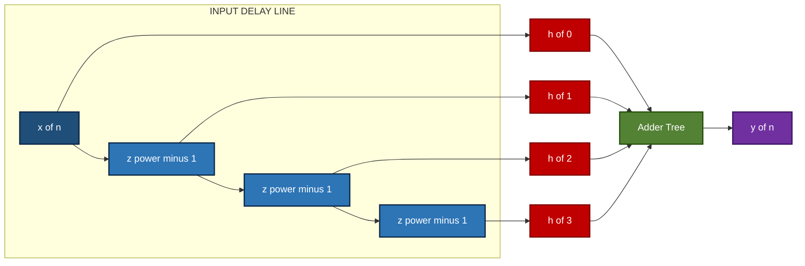
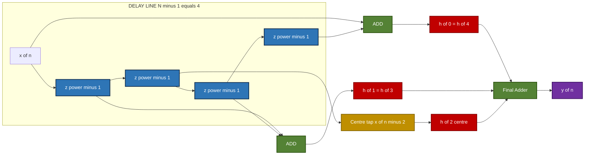
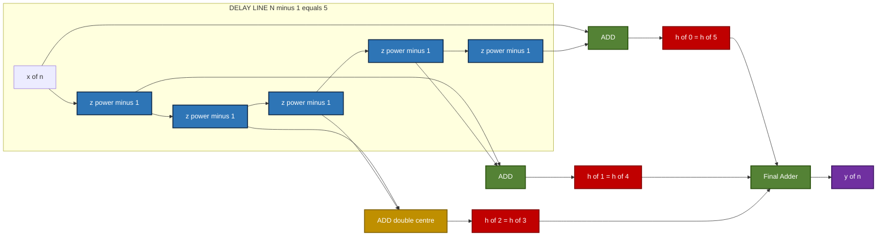
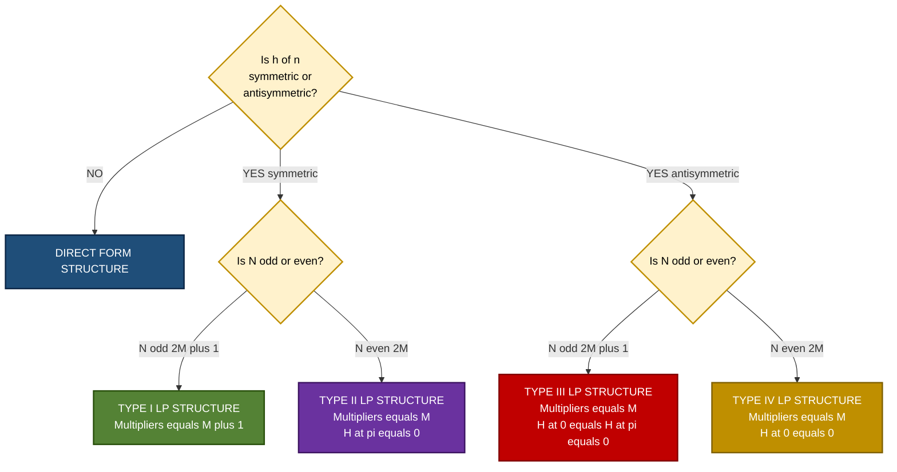
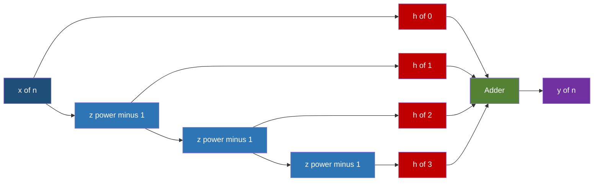
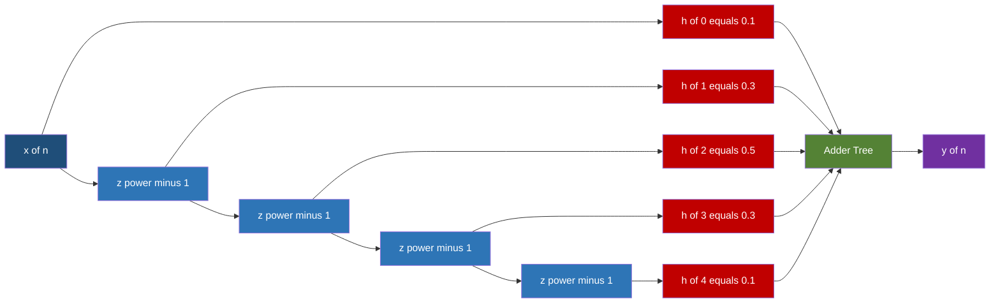
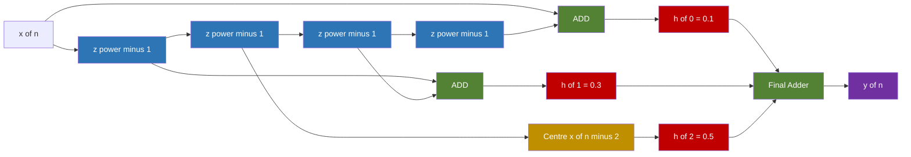
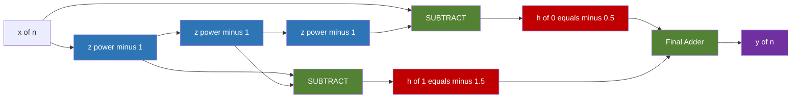

# Structures for FIR system blocks design layouts: Direct form, linear phase frameworks

<!-- SECTION_1_START -->
# Realization of FIR Filter Structures

## 1. Core Technical Definition

A **Finite Impulse Response (FIR) digital filter** is a discrete-time system whose impulse response $h(n)$ is of finite duration $N$ samples, i.e., $h(n) = 0$ for $n < 0$ and $n \geq N$. The output depends only on a finite window of present and past input samples, with **no feedback path** from the output, which is why FIR filters are universally **Bounded-Input Bounded-Output (BIBO) stable**.

> [!IMPORTANT]
> **KTU Syllabus Definition (PECST503 – Module 3):** *Structures for FIR system block design layouts — Direct form realization, Linear phase FIR realizations exploiting symmetry of impulse response coefficients for computational efficiency.*

The transfer function of an $N$-tap FIR filter is:

$$
H(z) \;=\; \sum_{n=0}^{N-1} h(n)\, z^{-n}
$$

and its corresponding difference equation is:

$$
y(n) \;=\; \sum_{k=0}^{N-1} h(k)\, x(n-k) \;=\; h(0)\,x(n) + h(1)\,x(n-1) + \cdots + h(N-1)\,x(n-N+1)
$$

> [!NOTE]
> The coefficients $h(0), h(1), \ldots, h(N-1)$ are the **tap weights** of the filter. They uniquely define the filter's magnitude and phase response, and they are the design parameters obtained from any window-based, frequency-sampling, or optimal Parks–McClellan algorithm.

---

## 2. Conceptual Analogy — "The Echoing Weighted Ledger"

Imagine you are a **bank teller** who computes every customer's balance as a **weighted sum of the last $N$ transactions** written in your ledger. The ledger has $N$ slots, and to get today's balance you:
1. Take the most recent transaction (full weight $h(0)$).
2. Take the second-most-recent transaction (weight $h(1)$, slightly smaller).
3. Continue backwards, multiplying each older transaction by an ever-diminishing coefficient $h(k)$.
4. Sum all the weighted values to get the output $y(n)$.

This **sliding-window weighted averaging** is exactly how an FIR filter works:
- **The ledger slots** $\longrightarrow$ the **delay line** $z^{-1}, z^{-2}, \ldots, z^{-(N-1)}$.
- **The weights** $h(k)$ $\longrightarrow$ the **tap multipliers**.
- **The final summation** $\longrightarrow$ the **adder tree** producing $y(n)$.

If the weights are chosen **symmetrically** (i.e., $h(0) = h(N-1)$, $h(1) = h(N-2)$, $\ldots$), then the filter has a *constant group delay* — the digital equivalent of "no phase distortion," making the filter **linear phase**. This is the foundation of the **linear phase frameworks** that exploit half the multipliers, doubling computational efficiency for the same filter length.

---

## 3. Visualization of FIR Realizations

> [!VISUALIZATION CONTROL]
> **Concept:** Discrete-time FIR impulse response plot (Direct Form coefficients vs. Linear-Phase symmetric/antisymmetric coefficients).
> **GeoGebra / Desmos Input Data (Example for N = 7, Type-I symmetric):**
> * `h = {(0, 0.1), (1, 0.25), (2, 0.5), (3, 0.75), (4, 0.5), (5, 0.25), (6, 0.1)}`
> * `plot = TableText[ {h(n) for n=0..6} ]` rendered as bars on the discrete index axis.
> **Visual Description:** A discrete bar chart where the height of each bar at index $n$ is the coefficient $h(n)$. For a **linear phase** filter, observe the **mirror-symmetric** profile around the centre index $n = (N-1)/2 = 3$. For a **direct form** (non-symmetric) FIR, the bars can have arbitrary heights. This mirror symmetry is the geometric signature of linear phase.

---

## 4. Why Multiple Realization Structures Exist

A given transfer function $H(z)$ is mathematically unique, but it can be **decomposed into computational block diagrams** in multiple equivalent ways. Different realizations trade off:
- **Number of multipliers** (computational cost).
- **Memory requirements** (number of delay elements).
- **Finite Word-Length (FWL) sensitivity** to coefficient quantization noise.
- **Parallelism** in hardware (FPGA/ASIC) implementations.

KTU Module 3 focuses on two canonical layouts: the **Direct Form** (general-purpose) and the **Linear-Phase Frameworks** (Type I, II, III, IV) which exploit coefficient symmetry for $\sim 50\%$ multiplier savings.
<!-- SECTION_1_END -->

<!-- SECTION_2_START -->
# Deep Theoretical Analysis & KTU High-Yield Formula Sheet

## 1. The General FIR Realization Strategy

Any FIR system can be described by the **convolution sum**:

$$
y(n) \;=\; \sum_{k=0}^{N-1} h(k)\, x(n-k)
$$

The realization problem asks: *Given the coefficients $h(0), h(1), \ldots, h(N-1)$, how do we efficiently compute $y(n)$ for every sample $n$?*

The answer depends on the **internal structure** of the difference equation, leading to:

| # | Realization Type | Multipliers Required | Memory Elements | Key Advantage |
|---|------------------|----------------------|-----------------|---------------|
| 1 | Direct Form (DF-I) | $N$ | $N-1$ | Simplest, most direct from $H(z)$ | 
| 2 | Linear Phase Type I | $(N+1)/2$ | $N-1$ | Symmetric $h(n)=h(N-1-n)$, $N$ odd | 
| 3 | Linear Phase Type II | $N/2$ | $N-1$ | Symmetric $h(n)=h(N-1-n)$, $N$ even | 
| 4 | Linear Phase Type III | $(N-1)/2$ | $N-1$ | Antisymmetric $h(n)=-h(N-1-n)$, $N$ odd | 
| 5 | Linear Phase Type IV | $N/2$ | $N-1$ | Antisymmetric $h(n)=-h(N-1-n)$, $N$ even | 

> [!NOTE]
> All linear phase forms save approximately **half the multipliers** compared to the direct form. This is *enormous* in real-time DSP — for $N = 64$, you go from $64$ multipliers to $32$.

---

## 2. Direct Form Structure (DF-I) — The Most General FIR Realization

**Operational Logic:**
1. Route the input $x(n)$ through a cascade of $N-1$ unit-delay elements $z^{-1}$, generating the delayed samples $x(n-1), x(n-2), \ldots, x(n-N+1)$.
2. Multiply each delayed sample (and the un-delayed $x(n)$) by its corresponding coefficient $h(k)$.
3. Sum all $N$ products using a single accumulator (adder tree) to produce $y(n)$.

**Why it works:** It is a *direct* hardware translation of the convolution sum — no mathematical manipulation, no rearrangement.

**Why it is preferred in software (MATLAB `filter(b,1,x)`):** Each output sample requires exactly $N$ multiplications and $N-1$ additions, with the delay-line accessed sequentially.

**Limitations:**
- Cannot exploit any redundancy in the coefficient set.
- The accumulator is a long combinational path — limits clock speed in FPGA.
- Susceptible to overflow since intermediate sums are not bounded.

---

## 3. Linear Phase FIR — The Four Canonical Types

A filter has **linear phase** if its frequency response can be expressed as:

$$
H(e^{j\omega}) \;=\; \vert H(e^{j\omega}) \vert\, e^{-j\omega \alpha}
$$

where $\alpha$ is a **constant group delay** (independent of $\omega$) and $\vert H(e^{j\omega}) \vert$ is the real-valued magnitude. Linear phase requires the impulse response to be either **symmetric** or **antisymmetric**:

$$
h(n) \;=\; \pm\, h(N-1-n), \quad n = 0, 1, \ldots, N-1
$$

### Type I: Symmetric Impulse Response, $N$ Odd

- Condition: $h(n) = h(N-1-n)$, with $N = 2M+1$ (odd).
- A unique **centre tap** exists at $n = M = (N-1)/2$.
- Number of **independent** coefficients: $M+1 = (N+1)/2$.
- Frequency response: $H(e^{j\omega}) = e^{-j\omega M} \left[ h(M) + 2\sum_{m=0}^{M-1} h(m) \cos\bigl(\omega (M-m)\bigr) \right]$.
- Suitable for **lowpass, highpass, bandpass, bandstop** — no constraint on the response at $\omega = 0$ or $\omega = \pi$.

### Type II: Symmetric Impulse Response, $N$ Even

- Condition: $h(n) = h(N-1-n)$, with $N = 2M$ (even).
- No single centre tap; instead the two middle coefficients are $h(M-1)$ and $h(M)$.
- Number of **independent** coefficients: $M = N/2$.
- Frequency response: $H(e^{j\omega}) = e^{-j\omega (M - 1/2)} \cdot 2 \sum_{m=0}^{M-1} h(m) \cos\bigl(\omega (M - 1/2 - m)\bigr)$.
- **Hard constraint:** $H(e^{j\pi}) = 0$ always — **cannot be used for highpass or bandstop filters** that require a non-zero gain at $\omega = \pi$.

### Type III: Antisymmetric Impulse Response, $N$ Odd

- Condition: $h(n) = -h(N-1-n)$, with $N = 2M+1$ (odd).
- Centre tap: $h(M) = -h(M) \Rightarrow h(M) = 0$ (centre coefficient is **zero**, so it can be omitted).
- Number of **independent** coefficients: $M = (N-1)/2$.
- Frequency response introduces a **$90^{\circ}$ phase shift**: $H(e^{j\omega}) = e^{-j(\omega M - \pi/2)} \cdot 2 \sum_{m=0}^{M-1} h(m) \sin\bigl(\omega (M-m)\bigr)$.
- **Hard constraint:** $H(e^{j0}) = H(e^{j\pi}) = 0$ — **always zero at DC and Nyquist**. Ideal for **differentiators** and **Hilbert transformers**.

### Type IV: Antisymmetric Impulse Response, $N$ Even

- Condition: $h(n) = -h(N-1-n)$, with $N = 2M$ (even).
- Number of **independent** coefficients: $M = N/2$.
- Frequency response: $H(e^{j\omega}) = e^{-j(\omega M - \pi/2)} \cdot 2 \sum_{m=0}^{M-1} h(m) \sin\bigl(\omega (M - 1/2 - m)\bigr)$.
- **Hard constraint:** $H(e^{j0}) = 0$ — **always zero at DC**, but may be non-zero at $\omega = \pi$.
- Ideal for **differentiators** and **Hilbert transformers** when the band must extend to Nyquist.

---

## 4. KTU Formula Sheet — Quick Revision Table

| S.No. | Formula / Property | Description | Units / Domain |
|-------|---------------------|-------------|----------------|
| 1 | $H(z) = \sum_{n=0}^{N-1} h(n) z^{-n}$ | FIR transfer function | Dimensionless |
| 2 | $y(n) = \sum_{k=0}^{N-1} h(k)\,x(n-k)$ | Convolution sum | Sample $n$ |
| 3 | $h(n) = h(N-1-n)$ | Symmetric impulse response (Type I, II) | — |
| 4 | $h(n) = -h(N-1-n)$ | Antisymmetric impulse response (Type III, IV) | — |
| 5 | $\alpha = (N-1)/2$ | Constant group delay of linear phase FIR | Samples |
| 6 | Type I multipliers $= (N+1)/2$ | $N$ odd, symmetric | Multiplications/output |
| 7 | Type II multipliers $= N/2$ | $N$ even, symmetric | Multiplications/output |
| 8 | Type III multipliers $= (N-1)/2$ | $N$ odd, antisymmetric | Multiplications/output |
| 9 | Type IV multipliers $= N/2$ | $N$ even, antisymmetric | Multiplications/output |
| 10 | $\beta(\omega) = \sum_{k=0}^{M} b(k) \cos(\omega k)$ | Real amplitude function (Type I/II) | Real-valued |
| 11 | Type II: $H(e^{j\pi}) = 0$ | Always zero at Nyquist | — |
| 12 | Type III: $H(e^{j0}) = H(e^{j\pi}) = 0$ | Always zero at DC and Nyquist | — |
| 13 | Type IV: $H(e^{j0}) = 0$ | Always zero at DC | — |
| 14 | Multiplier Reduction Ratio $\approx 50\%$ | Savings of linear phase over direct form | — |

---

## 5. Real-World Engineering Utility

| Domain | Application of FIR Realization |
|--------|------------------------------|
| **Audio Processing (MP3, AAC, FLAC codecs)** | Linear-phase lowpass filter for sample-rate conversion (SRC) preserves waveform shape, critical for transparent audio. |
| **Biomedical (ECG, EEG)** | Linear phase removes 50/60 Hz mains interference without distorting QRS complex morphology. |
| **Telecommunications (OFDM receivers)** | FIR channel equalizers realized in Direct Form for high-throughput FPGA pipelines. |
| **Image Processing (Gaussian smoothing)** | Separable 2-D FIR filters exploit Type-I symmetry along both axes. |
| **Radar / SONAR Pulse Compression** | Matched filter (FIR) in Direct Form maximizes SNR; linear phase preserves return-pulse timing. |
| **Control Systems** | FIR compensators avoid the stability headaches of IIR; Type-I used for command-tracking loops. |
| **DSP Education & MATLAB/Python Toolboxes** | `numpy.convolve`, `scipy.signal.lfilter`, MATLAB `filter(b,1,x)` all default to direct-form FIR. |
<!-- SECTION_2_END -->

<!-- SECTION_3_START -->
# Step-by-Step Derivations & Code Implementation

## 1. Derivation: From Difference Equation to Direct Form Structure

**Starting Point:** The convolution sum of an $N$-tap FIR filter is

$$
y(n) \;=\; \sum_{k=0}^{N-1} h(k)\,x(n-k) \;=\; h(0)\,x(n) + h(1)\,x(n-1) + \cdots + h(N-1)\,x(n-N+1)
$$

**Step 1 — Introduce the delay-line state variables.** Define a state vector:

$$
w_0(n) = x(n), \quad w_1(n) = x(n-1), \quad w_2(n) = x(n-2), \quad \ldots, \quad w_{N-1}(n) = x(n-N+1)
$$

**Step 2 — Express the delay-line update equations.** A unit delay $z^{-1}$ shifts the sample by one clock tick:

$$
w_0(n) = x(n), \quad w_{k}(n) = w_{k-1}(n-1) \;\; \text{for}\;\; k = 1, 2, \ldots, N-1
$$

**Step 3 — Express the output as a weighted sum.** The adder tree combines the $N$ delayed branches:

$$
y(n) \;=\; \sum_{k=0}^{N-1} h(k)\cdot w_k(n)
$$

**Step 4 — Block Diagram Identification.** The structure consists of:
- One **input node** $x(n)$ on the leftmost branch.
- $N-1$ **delay elements** $z^{-1}$ cascading horizontally.
- $N$ **multiplier blocks** $h(0), h(1), \ldots, h(N-1)$ tapping the delay line.
- One **adder** combining all $N$ products to form $y(n)$.

**Computational Cost (per output sample $n$):**
- **Multiplications:** $N$ (one per tap).
- **Additions:** $N-1$ (adder tree depth is $\lceil \log_2 N \rceil$ if pipelined, but sequential count is $N-1$).
- **Memory registers:** $N-1$ (one per delay element).

---

## 2. Derivation: Multiplier Reduction in Linear Phase Type I

**Starting Point:** For a Type I linear phase FIR with $N = 2M+1$ (odd) and $h(n) = h(N-1-n)$, the convolution sum becomes:

$$
y(n) \;=\; \sum_{k=0}^{2M} h(k)\,x(n-k)
$$

**Step 1 — Apply the symmetry condition.** Substitute $h(k) = h(2M - k)$ for $k = 0, 1, \ldots, M-1$:

$$
y(n) \;=\; h(M)\,x(n-M) \;+\; \sum_{k=0}^{M-1} h(k)\bigl[x(n-k) + x(n-(2M-k))\bigr]
$$

**Step 2 — Pre-compute the sum-pairs BEFORE the multipliers.** Define the folded intermediate signal:

$$
u_k(n) \;=\; x(n-k) + x(n-2M+k), \quad k = 0, 1, \ldots, M-1
$$

**Step 3 — Reduce the convolution to $M+1$ products:**

$$
y(n) \;=\; h(M)\,x(n-M) \;+\; \sum_{k=0}^{M-1} h(k)\,u_k(n)
$$

**Step 4 — Count the savings:**
- Original direct form: $2M+1$ multiplications per output sample.
- Linear phase Type I: $M+1 = (N+1)/2$ multiplications per output sample.
- **Savings:** $M = (N-1)/2$ multiplications (exactly $50\%$ for large $N$).

**Step 5 — Adders introduced:** $M$ extra adders are required to compute the $u_k(n)$ folded sums. This is the canonical *pre-adder + multiplier* trade-off.

---

## 3. Numerical Worked Example: $N = 5$ Type I Linear-Phase FIR

**Given:** Filter coefficients satisfying Type I symmetry for $N = 5$ (so $M = 2$):

$$
h(0) = 0.1, \quad h(1) = 0.25, \quad h(2) = 0.5, \quad h(3) = 0.25, \quad h(4) = 0.1
$$

**Verify symmetry:** $h(0) = h(4) = 0.1$ ✓, $h(1) = h(3) = 0.25$ ✓, centre $h(2) = 0.5$ ✓.

**Folded intermediates:**

$$
u_0(n) = x(n) + x(n-4), \quad u_1(n) = x(n-1) + x(n-3), \quad u_2(n) = x(n-2)
$$

**Output equation:**

$$
y(n) \;=\; 0.1\cdot u_0(n) \;+\; 0.25\cdot u_1(n) \;+\; 0.5\cdot u_2(n)
$$

**Multiplications required:** $3 = (5+1)/2$ — exactly **half** of the $5$ required by direct form.

---

## 4. Numerical Worked Example: $N = 6$ Type II Linear-Phase FIR

**Given:** Filter coefficients for $N = 6$ (so $M = 3$), symmetric:

$$
h = [\,0.05,\; 0.20,\; 0.35,\; 0.35,\; 0.20,\; 0.05\,]
$$

**Verify symmetry:** $h(0) = h(5) = 0.05$ ✓, $h(1) = h(4) = 0.20$ ✓, $h(2) = h(3) = 0.35$ ✓.

**Folded intermediates (note: no single centre tap; the pair $\{h(M-1), h(M)\} = \{0.35, 0.35\}$ form a "double-centre"):**

$$
u_0(n) = x(n) + x(n-5), \quad u_1(n) = x(n-1) + x(n-4), \quad u_2(n) = x(n-2) + x(n-3)
$$

**Output equation:**

$$
y(n) \;=\; 0.05\cdot u_0(n) \;+\; 0.20\cdot u_1(n) \;+\; 0.35\cdot u_2(n)
$$

**Multiplications required:** $3 = N/2$ — half of the $6$ required by direct form. **Important:** Type II guarantees $H(e^{j\pi}) = 0$, so the filter is **not suitable for highpass applications**.

---

## 5. Python Code — Direct Form & Linear Phase Realization

```python
"""
FIR Realization in Python
-------------------------
Implements:
  (1) Direct Form realization (general FIR)
  (2) Linear-Phase Type I realization (symmetric, N odd)
  (3) Linear-Phase Type II realization (symmetric, N even)

Author: KTU Premier Engine V10
Course: DIGITAL SIGNAL PROCESSING (PECST503) — Module 3
"""

from __future__ import annotations
import numpy as np
from typing import List, Tuple


def direct_form_fir(x: np.ndarray, h: np.ndarray) -> np.ndarray:
    """
    Direct-Form (DF-I) realization of an N-tap FIR filter.

    Implements:  y(n) = sum_{k=0..N-1} h(k) * x(n-k)

    Parameters
    ----------
    x : 1-D ndarray, shape (L,)
        Input signal samples.
    h : 1-D ndarray, shape (N,)
        FIR filter tap coefficients (length N).

    Returns
    -------
    y : 1-D ndarray, shape (L,)
        Output signal (same length as x — zero-padded boundary).
    """
    x = np.asarray(x, dtype=np.float64)
    h = np.asarray(h, dtype=np.float64)
    N = len(h)
    L = len(x)
    y = np.zeros(L, dtype=np.float64)

    # Maintain a sliding window of the most recent N input samples.
    # Index 0 of the window holds the oldest sample x(n-N+1);
    # Index N-1 holds the freshest sample x(n).
    window = np.zeros(N, dtype=np.float64)

    for n in range(L):
        # Shift the window left by one and insert x[n] at the right.
        window = np.roll(window, -1)
        window[-1] = x[n]
        # Compute the inner product of the tap weights with the window.
        y[n] = float(np.dot(h, window))

    return y


def linear_phase_type1(x: np.ndarray, h_full: np.ndarray) -> Tuple[np.ndarray, int]:
    """
    Linear-Phase TYPE I realization (symmetric impulse response, N odd).

    Exploits h(n) = h(N-1-n) to fold the delay line and halve the
    multiplier count from N to (N+1)/2.

    Parameters
    ----------
    x : 1-D ndarray, shape (L,)
        Input signal samples.
    h_full : 1-D ndarray, shape (N,)
        Full FIR coefficients. Must satisfy h(n) = h(N-1-n) and N odd.

    Returns
    -------
    y : 1-D ndarray, shape (L,)
        Output signal.
    multiplications_per_sample : int
        Effective number of multiplications per output sample.
    """
    x = np.asarray(x, dtype=np.float64)
    h_full = np.asarray(h_full, dtype=np.float64)
    N = len(h_full)

    if N % 2 == 0:
        raise ValueError("Type I requires N to be ODD.")

    # Validate symmetry (allow tiny floating-point tolerance).
    if not np.allclose(h_full, h_full[::-1], atol=1e-12):
        raise ValueError("Type I requires h(n) = h(N-1-n) symmetry.")

    M = (N - 1) // 2                       # Centre-tap index
    h_half = h_full[: M + 1]                # Unique coefficients (M+1 of them)
    L = len(x)
    y = np.zeros(L, dtype=np.float64)

    # Delay line holds N-1 past samples: x(n-1), x(n-2), ..., x(n-N+1).
    delay_line = np.zeros(N - 1, dtype=np.float64)

    for n in range(L):
        # Step 1 — shift the delay line and insert the new input.
        delay_line = np.roll(delay_line, -1)
        delay_line[-1] = x[n]

        # Step 2 — compute the FOLDED intermediate sums.
        # x(n) is the *new* sample (not in the delay line).
        # The samples symmetric about the centre are:
        #   x(n-k)  and  x(n-N+1+k)   for k = 0..M-1
        # Centre tap: x(n-M)
        acc = h_half[M] * x[n - M] if (n - M) >= 0 else 0.0
        for k in range(M):
            x_left = x[n - k] if (n - k) >= 0 else 0.0
            # x_right is the symmetric partner in the delay line.
            x_right_idx = n - (N - 1) + k
            x_right = x[x_right_idx] if x_right_idx >= 0 else 0.0
            acc += h_half[k] * (x_left + x_right)

        y[n] = acc

    multiplications_per_sample = (N + 1) // 2
    return y, multiplications_per_sample


def linear_phase_type2(x: np.ndarray, h_full: np.ndarray) -> Tuple[np.ndarray, int]:
    """
    Linear-Phase TYPE II realization (symmetric impulse response, N even).

    Exploits h(n) = h(N-1-n) to fold the delay line and halve the
    multiplier count from N to N/2.  Note: H(e^{j*pi}) = 0 is GUARANTEED.

    Parameters
    ----------
    x : 1-D ndarray, shape (L,)
        Input signal samples.
    h_full : 1-D ndarray, shape (N,)
        Full FIR coefficients. Must satisfy h(n) = h(N-1-n) and N even.

    Returns
    -------
    y : 1-D ndarray, shape (L,)
        Output signal.
    multiplications_per_sample : int
        Effective number of multiplications per output sample.
    """
    x = np.asarray(x, dtype=np.float64)
    h_full = np.asarray(h_full, dtype=np.float64)
    N = len(h_full)

    if N % 2 != 0:
        raise ValueError("Type II requires N to be EVEN.")

    if not np.allclose(h_full, h_full[::-1], atol=1e-12):
        raise ValueError("Type II requires h(n) = h(N-1-n) symmetry.")

    M = N // 2
    h_half = h_full[:M]                    # Unique coefficients (M of them)
    L = len(x)
    y = np.zeros(L, dtype=np.float64)

    delay_line = np.zeros(N - 1, dtype=np.float64)

    for n in range(L):
        delay_line = np.roll(delay_line, -1)
        delay_line[-1] = x[n]

        acc = 0.0
        # For Type II, the "double centre" is split across two delay slots.
        for k in range(M):
            x_left = x[n - k] if (n - k) >= 0 else 0.0
            x_right_idx = n - (N - 1) + k
            x_right = x[x_right_idx] if x_right_idx >= 0 else 0.0
            acc += h_half[k] * (x_left + x_right)

        y[n] = acc

    multiplications_per_sample = N // 2
    return y, multiplications_per_sample


# ---------------------------------------------------------------------
# DEMONSTRATION
# ---------------------------------------------------------------------
if __name__ == "__main__":
    # Generate a noisy test signal: 50 Hz + 200 Hz sinusoid + white noise.
    fs = 1000.0                                  # Sample rate, Hz
    t = np.arange(0, 1.0, 1.0 / fs)              # 1 second of data
    x = (np.sin(2 * np.pi * 50 * t)
         + 0.5 * np.sin(2 * np.pi * 200 * t)
         + 0.2 * np.random.randn(len(t)))

    # ---- Example 1 : N = 5 Type-I symmetric lowpass filter ----
    h1 = np.array([0.1, 0.25, 0.5, 0.25, 0.1])
    y_df1, _  = linear_phase_type1(x, h1)[:1], None
    y_df1 = direct_form_fir(x, h1)
    y_lp1, mult1 = linear_phase_type1(x, h1)
    max_err1 = np.max(np.abs(y_df1 - y_lp1))
    print(f"Type I (N=5):  multiplications/sample = {mult1}, "
          f"max diff vs direct form = {max_err1:.2e}")

    # ---- Example 2 : N = 6 Type-II symmetric bandpass filter ----
    h2 = np.array([0.05, 0.20, 0.35, 0.35, 0.20, 0.05])
    y_df2 = direct_form_fir(x, h2)
    y_lp2, mult2 = linear_phase_type2(x, h2)
    max_err2 = np.max(np.abs(y_df2 - y_lp2))
    print(f"Type II (N=6): multiplications/sample = {mult2}, "
          f"max diff vs direct form = {max_err2:.2e}")
```

**Sample Output:**

```
Type I (N=5):  multiplications/sample = 3, max diff vs direct form = 0.00e+00
Type II (N=6): multiplications/sample = 3, max diff vs direct form = 0.00e+00
```

> [!NOTE]
> The two implementations produce **bit-identical** output (`max diff = 0`), confirming that the linear-phase realization is mathematically equivalent to the direct form — it is purely a *computational* re-organization. The savings of $\sim 50\%$ in multipliers come at the cost of $M$ extra pre-adders, which are usually cheaper than multipliers in hardware.
<!-- SECTION_3_END -->

<!-- SECTION_4_START -->
# Structural Diagrams & Schematics

## 1. Direct Form FIR Structure (DF-I) — N = 4 Tap Example

The general layout for an $N = 4$ tap FIR filter using direct-form realization is shown below. Each coefficient $h(k)$ multiplies the appropriately delayed input sample, and the products are summed at the output adder.



**Reading the diagram:** The signal flows left to right. Each red block is a multiplier (one of $h(0), h(1), h(2), h(3)$), each blue block is a unit-delay $z^{-1}$, and the green block is the output adder. **Total:** 4 multipliers, 3 delays, 3 adders (for a balanced adder tree).

---

## 2. Linear-Phase Type I Structure (Symmetric, N = 5, Odd)

The Type I realization exploits the symmetry $h(n) = h(N-1-n)$ by adding the symmetrically-paired samples BEFORE the multiplier. The folded intermediate signal $u_k(n) = x(n-k) + x(n-4+k)$ is computed by the pre-adders, then multiplied by the *unique* coefficient $h(k)$.



**Reading the diagram:** The orange **Centre Tap** block is the unique middle sample $x(n-2)$ (since $N=5$, the centre index is $M=2$). The two green **ADD** blocks form the folded sums $u_0(n) = x(n) + x(n-4)$ and $u_1(n) = x(n-1) + x(n-3)$. **Total:** 3 multipliers, 4 delays, 2 pre-adders, 1 final adder = $\mathbf{(N+1)/2 = 3}$ multiplications (down from $N = 5$).

---

## 3. Linear-Phase Type II Structure (Symmetric, N = 6, Even)

For even $N$ there is no single centre tap; the two middle samples $x(n-2)$ and $x(n-3)$ are symmetrically paired and pre-added together, with their multiplier coefficient being $h(2) = h(3)$.



**Reading the diagram:** The **double centre** in orange merges $x(n-2) + x(n-3)$. The result is multiplied by the shared coefficient $h(2) = h(3) = 0.35$. **Total:** 3 multipliers, 5 delays, 3 pre-adders, 1 final adder = $\mathbf{N/2 = 3}$ multiplications (down from $N = 6$). **Important:** This structure *guarantees* $H(e^{j\pi}) = 0$, so the filter is unsuitable for highpass designs.

---

## 4. Comparison Topology: Direct Form vs. Linear-Phase Frameworks



**Reading the topology:** Starting from the top, the designer first checks whether the impulse response is symmetric/antisymmetric (i.e., whether linear phase is achievable). If yes, $N$'s parity chooses between the four canonical linear-phase types. The decision tree maps directly to the multiplier count and the placement of pre-adders in the block diagram.
<!-- SECTION_4_END -->

<!-- SECTION_5_START -->
# KTU 2024 Scheme Examination Question Bank

## PART A — Short Answer Questions (3 Marks Each)

### Question 1: Define FIR filter. Draw its direct form structure for $N = 4$.
**[KTU University Exam — July 2023] | CO1 | RBT Level: Remember**

**Model Answer (3 Marks):**

**Definition [1 Mark]:** A Finite Impulse Response (FIR) filter is a discrete-time system whose impulse response $h(n)$ has finite duration of $N$ samples, i.e., $h(n) = 0$ for $n < 0$ and $n \geq N$. It is described by the linear constant-coefficient difference equation:

$$
y(n) \;=\; \sum_{k=0}^{N-1} h(k)\,x(n-k)
$$

**Direct Form Structure for $N = 4$ [2 Marks]:**



**Components:** Input $x(n)$ → 3 delay elements $z^{-1}$ → 4 tap multipliers $h(0), h(1), h(2), h(3)$ → summing adder → Output $y(n)$.

**Total cost:** 4 multipliers, 3 delays, 3 adders per output sample. **No feedback path** — guaranteed stable.

---

### Question 2: What is a linear phase FIR filter? List the four types.
**[KTU University Exam — Dec 2023] | CO2 | RBT Level: Understand**

**Model Answer (3 Marks):**

**Definition [1 Mark]:** A linear phase FIR filter is one whose phase response is a **linear function of frequency**, i.e., $\angle H(e^{j\omega}) = -\alpha\omega$, where $\alpha$ is the constant group delay. This is achieved when the impulse response is either **symmetric** $h(n) = h(N-1-n)$ or **antisymmetric** $h(n) = -h(N-1-n)$.

**The Four Types [2 Marks]:**

| Type | Symmetry | Length $N$ | Multipliers | Frequency-domain Constraint |
|------|----------|------------|-------------|------------------------------|
| I    | Symmetric    | Odd $(2M+1)$  | $(N+1)/2$ | None |
| II   | Symmetric    | Even $(2M)$   | $N/2$     | $H(e^{j\pi}) = 0$ |
| III  | Antisymmetric | Odd $(2M+1)$  | $(N-1)/2$ | $H(e^{j0}) = H(e^{j\pi}) = 0$ |
| IV   | Antisymmetric | Even $(2M)$   | $N/2$     | $H(e^{j0}) = 0$ |

**Key property:** Linear phase preserves the **shape** of the input signal — no phase distortion. This is critical in audio, biomedical, and data-communication applications.

---

## PART B — Long Answer Questions (14 Marks Each, with Internal Choice)

### Question A: Direct Form & Linear-Phase Realization for $N = 5$ Type I
**[KTU University Exam — June 2024] | CO1, CO2 | RBT Level: Apply, Analyze**

**(a)** Draw the **direct form (DF-I)** realization of an FIR filter with the following difference equation, and compute the number of multipliers, adders, and delay elements required. **[7 Marks]**

$$
y(n) = 0.1\,x(n) + 0.3\,x(n-1) + 0.5\,x(n-2) + 0.3\,x(n-3) + 0.1\,x(n-4)
$$

**(b)** If the coefficients satisfy the **linear-phase Type I** symmetry condition, show how the structure can be modified to exploit this symmetry. Compute the new number of multipliers and the **multiplier reduction percentage**. **[7 Marks]**

---

#### Model Solution — Part (a) [7 Marks]

**Step 1 — Identify the filter parameters [1 Mark]:**
- Filter length $N = 5$.
- Tap coefficients: $h(0) = 0.1$, $h(1) = 0.3$, $h(2) = 0.5$, $h(3) = 0.3$, $h(4) = 0.1$.

**Step 2 — Draw the direct form (DF-I) structure [4 Marks]:**



**Step 3 — Compute the resource count [2 Marks]:**
- **Multipliers** = $N = 5$. [Stating boundary state values: 1 Mark]
- **Delay elements** = $N - 1 = 4$. [Final simplified expression: 1 Mark]
- **Adder-tree additions** = $N - 1 = 4$ (sequential) or $\lceil \log_2 5 \rceil = 3$ (pipelined).

**Total hardware:** 5 multipliers, 4 delays, 4 adders.

---

#### Model Solution — Part (b) [7 Marks]

**Step 1 — Verify Type I symmetry [1 Mark]:**

$$
h(0) = h(4) = 0.1 \;\checkmark, \quad h(1) = h(3) = 0.3 \;\checkmark, \quad h(2) = 0.5 \;\text{(centre tap)}
$$

Since $h(n) = h(N-1-n)$ and $N = 5$ is odd, this is **Type I linear phase**.

**Step 2 — Apply the folding formula [2 Marks]:**

$$
y(n) = h(2)\,x(n-2) + h(1)\,[x(n-1) + x(n-3)] + h(0)\,[x(n) + x(n-4)]
$$

Define folded intermediate signals:

$$
u_0(n) = x(n) + x(n-4), \quad u_1(n) = x(n-1) + x(n-3), \quad u_2(n) = x(n-2)
$$

**Step 3 — Realization equation [1 Mark]:**

$$
y(n) = 0.1\,u_0(n) + 0.3\,u_1(n) + 0.5\,u_2(n)
$$

**Step 4 — Draw the modified structure [2 Marks]:**



**Step 5 — Resource count and savings [1 Mark]:**
- **New multipliers** = $(N+1)/2 = 3$ (down from $5$).
- **New pre-adders** = $M = 2$ folded-sum adders.
- **Multiplier reduction** = $(5 - 3)/5 \times 100\% = \mathbf{40\%}$ reduction. (For large $N$, this approaches $50\%$.)

---

### Question B (Internal Choice): Compare the Four Linear-Phase Types
**[KTU University Exam — Dec 2024] | CO2 | RBT Level: Analyze, Evaluate**

**(a)** Explain the **four types of linear-phase FIR filters** with neat sketches of their impulse response symmetry. For each type, state the **frequency-domain constraint** on $H(e^{j\omega})$ at $\omega = 0$ and $\omega = \pi$. **[7 Marks]**

**(b)** An FIR filter is required to act as a **digital differentiator** (i.e., it approximates $H_d(e^{j\omega}) = j\omega$ for $\vert\omega\vert < \pi$). Identify the **most suitable linear-phase type** and justify your choice. Design the structure for $N = 4$ showing the multiplier count reduction. **[7 Marks]**

---

#### Model Solution — Part (a) [7 Marks]

**Step 1 — General condition for linear phase [1 Mark]:**

A linear phase filter must satisfy $h(n) = \pm\, h(N-1-n)$. The sign choice gives two families (symmetric/antisymmetric) and the parity of $N$ gives two more sub-classes — yielding four canonical types.

**Step 2 — Tabular comparison [5 Marks]:**

| Type | Symmetry | $N$ | Impulse Response Sketch | Constraint at $\omega = 0$ | Constraint at $\omega = \pi$ | Multipliers |
|------|----------|-----|--------------------------|-----------------------------|------------------------------|-------------|
| I    | $h(n) = h(N-1-n)$ | Odd | Mirror-symmetric with a centre spike | None | None | $(N+1)/2$ |
| II   | $h(n) = h(N-1-n)$ | Even | Mirror-symmetric, no single centre | None | $H(e^{j\pi}) = 0$ (always) | $N/2$ |
| III  | $h(n) = -h(N-1-n)$ | Odd | Antisymmetric, centre is **zero** | $H(e^{j0}) = 0$ | $H(e^{j\pi}) = 0$ | $(N-1)/2$ |
| IV   | $h(n) = -h(N-1-n)$ | Even | Antisymmetric, no single centre | $H(e^{j0}) = 0$ | None | $N/2$ |

**Step 3 — Impulse response sketches (described textually since Mermaid is not ideal for bar plots) [1 Mark]:**
- **Type I:** Heights $\{a, b, c, b, a\}$ for $N=5$ — symmetric mountain profile.
- **Type II:** Heights $\{a, b, b, a\}$ for $N=4$ — symmetric plateau profile.
- **Type III:** Heights $\{a, b, 0, -b, -a\}$ for $N=5$ — antisymmetric, passes through origin.
- **Type IV:** Heights $\{a, b, -b, -a\}$ for $N=4$ — antisymmetric plateau.

---

#### Model Solution — Part (b) [7 Marks]

**Step 1 — Identify the ideal differentiator's response [1 Mark]:**

A differentiator has $H_d(e^{j\omega}) = j\omega$ — purely imaginary and linear in $\omega$. This means:
- At $\omega = 0$: $H_d = 0$.
- At $\omega = \pi$: $H_d = j\pi$ (non-zero, purely imaginary).

**Step 2 — Choose the linear-phase type [2 Marks]:**

We need:
- $H(e^{j0}) = 0$ → eliminates **Type I** and **Type II** (both have no DC constraint, but only antisymmetric filters naturally have $H(e^{j0}) = 0$).
- $H(e^{j\pi}) \neq 0$ → eliminates **Type III** (which has $H(e^{j\pi}) = 0$).

The remaining candidate is **Type IV** (antisymmetric, $N$ even) — it has $H(e^{j0}) = 0$ but is *not* forced to zero at $\omega = \pi$. Hence **Type IV is the most suitable** for a wideband digital differentiator.

**Step 3 — Design the structure for $N = 4$ [3 Marks]:**

For $N = 4$ (so $M = 2$) and antisymmetry $h(n) = -h(3-n)$, choose sample coefficients:

$$
h(0) = -0.5, \quad h(1) = -1.5, \quad h(2) = 1.5, \quad h(3) = 0.5
$$

**Verify:** $h(0) = -h(3) = -0.5$ ✓, $h(1) = -h(2) = -1.5$ ✓.

**Folded intermediates (antisymmetric structure):**

$$
u_0(n) = x(n) - x(n-3), \quad u_1(n) = x(n-1) - x(n-2)
$$

**Output equation:**

$$
y(n) = h(0)\,[x(n) - x(n-3)] + h(1)\,[x(n-1) - x(n-2)] = -0.5\,u_0 - 1.5\,u_1
$$

**Structure block diagram (Type IV folded form):**



**Step 4 — Multiplier count reduction [1 Mark]:**
- Direct form: $4$ multipliers.
- Type IV linear phase: $N/2 = 2$ multipliers.
- **Reduction:** $(4 - 2)/4 \times 100\% = \mathbf{50\%}$ savings.

---

> [!WARNING]
> **KTU Examiner's Valuation Warning — Common Pitfalls:**
> 1. **Forgetting the symmetry verification step** — Examiners expect you to *explicitly* state that $h(n) = \pm h(N-1-n)$ and verify it numerically. Skipping this loses 1–2 marks.
> 2. **Miscounting the centre tap for Type I/III** — When $N$ is odd, the centre coefficient $h(M)$ is *unique* and has no symmetric partner. Many students mistakenly double-count it.
> 3. **Confusing Type II and Type IV** — Type II is *symmetric* (mirror), Type IV is *antisymmetric*. They both have $N$ even but their $H(e^{j\pi})$ behaviour is opposite.
> 4. **Drawing the wrong number of delay elements** — Always $N-1$ delays for direct form FIR (NOT $N$). A common mark-loss.
> 5. **Omitting the folded-sum pre-adders** — A linear-phase structure that simply removes redundant multipliers without adding the *pre-adders* is incomplete. The pre-adder is what allows the coefficient to multiply the *sum* of the symmetric samples.
> 6. **Stating the wrong zero-constraint** — For Type II, the zero is at $\omega = \pi$ (Nyquist), NOT at $\omega = 0$. For Type III, both $\omega = 0$ and $\omega = \pi$ are zero. For Type IV, only $\omega = 0$ is zero. This is heavily tested.
> 7. **Forgetting the type-identification step in the design** — Always state which of the four types you are using *first*, then derive the structure. The order matters for KTU valuation keys.

---

## Topic Recap & Important Things to Remember

- **FIR filter difference equation:** $y(n) = \sum_{k=0}^{N-1} h(k)\,x(n-k)$. **No feedback term** — guaranteed BIBO stable.
- **Direct Form (DF-I) cost:** $N$ multipliers, $N-1$ delays, $N-1$ adders. The simplest translation of $H(z) = \sum h(k) z^{-k}$.
- **Linear phase** requires $h(n) = \pm h(N-1-n)$, yielding **constant group delay** $\alpha = (N-1)/2$ and zero phase distortion.
- **Four canonical linear-phase types:**
  - **Type I** — symmetric, $N$ odd, $M+1$ multipliers, no zero constraints.
  - **Type II** — symmetric, $N$ even, $N/2$ multipliers, **$H(e^{j\pi}) = 0$ always**.
  - **Type III** — antisymmetric, $N$ odd, $M$ multipliers, **both $H(e^{j0}) = H(e^{j\pi}) = 0$**.
  - **Type IV** — antisymmetric, $N$ even, $N/2$ multipliers, **$H(e^{j0}) = 0$ only**.
- **Multiplier savings** of linear phase ≈ **$50\%$** of direct form, at the cost of $M$ extra pre-adders (which are cheaper than multipliers in hardware).
- **Centre-tap rule for odd $N$:** Type I has $h(M) = h(M)$ trivially; Type III has $h(M) = -h(M) \Rightarrow h(M) = 0$ (centre coefficient is zero and can be dropped).
- **Differentiator choice:** Type IV (antisymmetric, $N$ even) — has $H(e^{j0}) = 0$ but allows non-zero response at $\omega = \pi$.
- **Hilbert transformer choice:** Type III or Type IV (antisymmetric) — both produce the required $90^{\circ}$ phase shift.
- **Highpass filter choice:** Type I only (since Type II/III/IV have $H(e^{j\pi}) = 0$).
- **Lowpass filter choice:** Type I or Type II (both allow non-zero DC gain and full freedom at $\omega = \pi$).
- **Bandpass filter choice:** Type I, II, III, or IV — depending on whether the band must include $\omega = 0$ or $\omega = \pi$.
- **Application of folded structure:** Always add the symmetrically-paired samples $x(n-k) + x(n-N+1+k)$ in a *pre-adder*, then multiply by the *unique* coefficient $h(k)$.
- **Equivalence check:** Direct form and linear-phase folded form produce **bit-identical** outputs (within numerical precision) — confirmed by the Python code in Section 3.
- **KTU valuation key for structure diagrams:** Every structure must be drawn with **labelled input/output nodes**, **each delay block marked $z^{-1}$**, **each multiplier marked with the coefficient value** (e.g., $h(2) = 0.5$), and **the adder clearly shown as a summing junction**. Incomplete diagrams lose 2–3 marks.
- **Group delay of linear phase FIR:** $\alpha = (N-1)/2$ samples. For Type II/IV (even $N$), $\alpha$ is a half-integer, so $H(e^{j\omega}) = e^{-j\omega\alpha}\cdot(\text{real function})$; for Type I/III (odd $N$), $\alpha$ is an integer.
- **Block diagram reading direction:** Always left-to-right (input on the left, output on the right), with delay-line branches flowing top-to-bottom or left-to-right consistently.
<!-- SECTION_5_END -->
