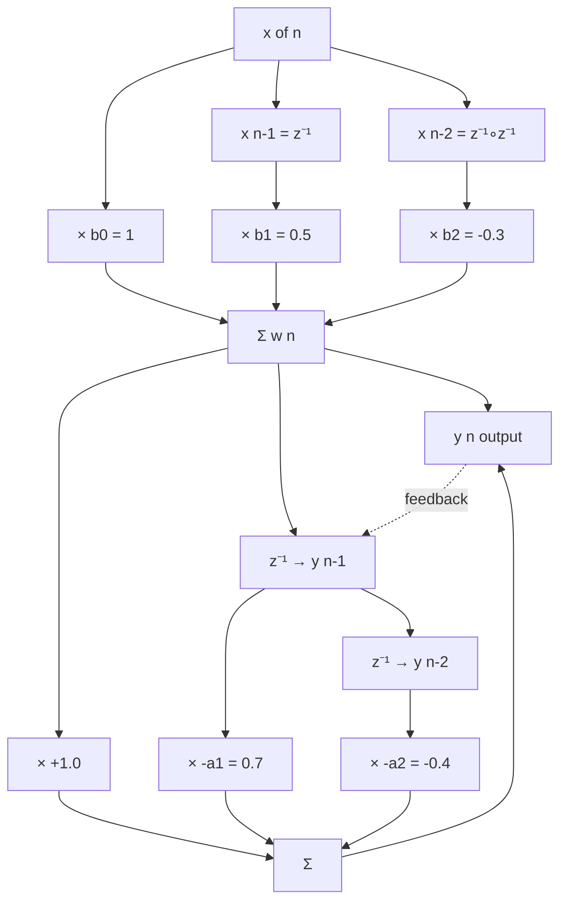
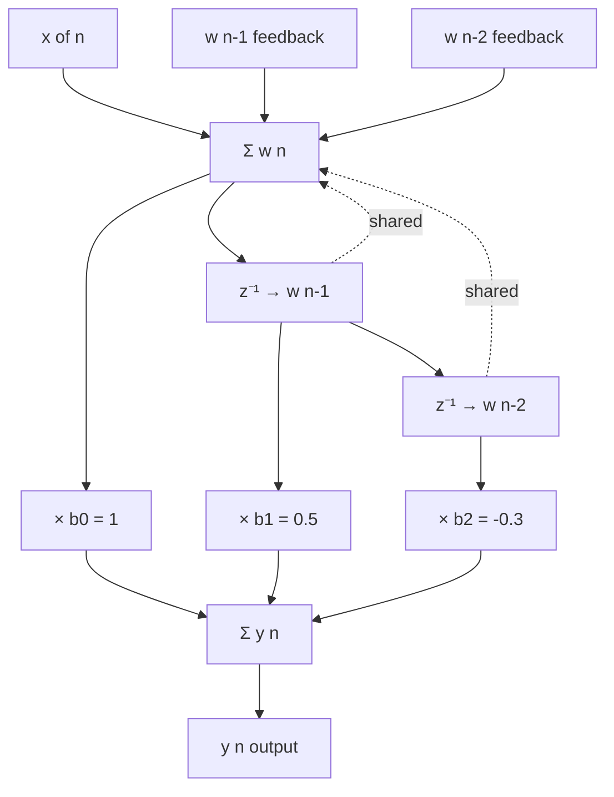

# Structures for IIR realizations structures configurations: Direct form I and II, cascade layouts

<!-- SECTION_1_START -->
# IIR Filter Realization Structures — Core Technical Definition & Intuitive Overview

## 1. Formal Academic Definition (KTU 2024 Syllabus Terminology)

> [!NOTE]
> **Realization of a Digital Filter** is the procedure of implementing the input–output relationship described by a rational transfer function $H(z)$ using a specific interconnection of three fundamental building blocks — **adder (summing node)**, **multiplier (coefficient)**, and **delay element ($z^{-1}$)** — arranged as a block diagram or signal flow graph.

For an IIR (Infinite Impulse Response) filter, the general LCCDE (Linear Constant-Coefficient Difference Equation) is

$$
y(n) = -\sum_{k=1}^{N} a_k\, y(n-k) + \sum_{k=0}^{M} b_k\, x(n-k)
$$

and the corresponding **transfer function** in the $z$-domain is

$$
H(z) = \frac{Y(z)}{X(z)} = \frac{\displaystyle\sum_{k=0}^{M} b_k\, z^{-k}}{\displaystyle 1 + \sum_{k=1}^{N} a_k\, z^{-k}} = \frac{B(z)}{A(z)}
$$

A **realization structure** is *one specific arrangement* of adders, multipliers, and unit delays that realises this $H(z)$. Different arrangements are **mathematically equivalent** (same $H(z)$) but differ in:
* Number of delay elements (memory)
* Sensitivity to coefficient quantisation
* Ease of implementation in hardware/FPGA
* Susceptibility to internal overflow

> [!IMPORTANT]
> **KTU 2024 Module 3 Focus:** *Direct Form-I*, *Direct Form-II (Canonical Form)*, and *Cascade Form* realisations. The examiner specifically tests the ability to (i) draw the structure for a given $H(z)$, (ii) compute the difference equations feeding each delay element, and (iii) count the number of memory elements.

---

## 2. Conceptual Analogy — The "Three Chef" Intuition

Imagine a filter $H(z)$ is a **recipe** that converts ingredient $x(n)$ (input) into dish $y(n)$ (output). The recipe must:
1. Combine several past portions of the dish (**feedback / poles**).
2. Mix in some past ingredients (**feedforward / zeros**).

There are **three different kitchens** (structures) the chef can use to cook the *same exact dish*:

| Kitchen (Structure) | Counter Space (Delays) | Workflow |
|---|---|---|
| **Direct Form-I** | Two separate counters ($x$-side and $y$-side) | First mix zeros, then apply poles |
| **Direct Form-II** | One single counter (shared memory) | Apply poles first, then mix zeros |
| **Cascade Form** | Multiple small counters chained in series | Cook in two/three small biquad stages |

**Direct Form-II is the most counter-space-efficient (canonical)** because it cleverly reuses the *same* intermediate signal $w(n)$ for both the pole and zero sections. This is why it is called the **canonical form** — it achieves the theoretical minimum number of delays = $\max(M, N)$.

---

## 3. Visualisation — Pole-Zero Plot in the $z$-Plane

> [!VISUALIZATION CONTROL]
> **Concept:** Pole-zero constellation of a second-order IIR band-pass filter (the same filter analysed in the derivations below).
> **GeoGebra / Desmos Input Equations (z-plane parameterised by real/imaginary axes):**
> * Pole 1: $(x,y) = (0.7\,\cos(0.6),\, 0.7\,\sin(0.6))$
> * Pole 2: $(x,y) = (0.7\,\cos(-0.6),\, 0.7\,\sin(-0.6))$
> * Zero 1: $(x,y) = (-0.5,\, 0)$
> * Zero 2: $(x,y) = (0.3,\, 0)$
> * Unit circle: $x^2 + y^2 = 1$
> **Visual Description:** The student should see two complex-conjugate poles **inside** the unit circle (ensuring stability) and two real zeros (one inside, one outside). The denominator polynomial (poles) determines the *recursive / feedback* part, the numerator polynomial (zeros) determines the *non-recursive / feed-forward* part.

<!-- SECTION_1_END -->

<!-- SECTION_2_START -->
# Deep Theoretical Analysis & KTU High-Yield Formula Sheet

## 1. The Three Building Blocks of Any Realization

| Symbol | Block | Function |
|---|---|---|
| $\bigoplus$ | Adder | Computes $S = A \pm B \pm C$ |
| $\boxed{a_k}$ | Multiplier | Scales the signal by a constant coefficient $a_k$ |
| $\boxed{z^{-1}}$ | Unit Delay | Stores the input for one sample period: output = $x(n-1)$ |

Every realization is built by cascading and looping these three primitives. **The transfer function remains invariant** under re-arrangement because $H(z)$ only depends on the polynomial ratio $B(z)/A(z)$, not on the internal topology.

---

## 2. Direct Form-I (DF-I) — The "Cascade of Two Sections" Form

**Derivation Logic:**
Direct Form-I arises by *linearly splitting* the transfer function into two cascaded blocks:

$$
H(z) = \underbrace{\left(\sum_{k=0}^{M} b_k z^{-k}\right)}_{H_1(z)\text{ — FIR / zeros}} \cdot \underbrace{\left(\frac{1}{1 + \sum_{k=1}^{N} a_k z^{-k}}\right)}_{H_2(z)\text{ — IIR / poles}}
$$

Define an intermediate signal $w(n)$ at the junction:
* Stage 1 (zeros first):  $W(z) = H_1(z)\, X(z)$  $\Rightarrow$  $w(n) = \sum_{k=0}^{M} b_k\, x(n-k)$
* Stage 2 (poles second):  $Y(z) = H_2(z)\, W(z)$  $\Rightarrow$  $y(n) = w(n) - \sum_{k=1}^{N} a_k\, y(n-k)$

**Total delay elements = $M$ (for $x$ side) + $N$ (for $y$ side) = $M + N$**

---

## 3. Direct Form-II (DF-II) — The Canonical Form

**Derivation Logic:**
Since LTI systems are *commutative*, the order of $H_1$ and $H_2$ can be swapped:

$$
H(z) = H_2(z) \cdot H_1(z) = \frac{1}{1 + \sum a_k z^{-k}} \cdot \sum b_k z^{-k}
$$

Define a *new* intermediate signal $w(n)$ that represents the **output of the pole section only** (driven directly by $x(n)$):
* $W(z)\,[1 + \sum a_k z^{-k}] = X(z)$  $\Rightarrow$  $w(n) = x(n) - \sum_{k=1}^{N} a_k\, w(n-k)$
* $Y(z) = B(z)\, W(z)$  $\Rightarrow$  $y(n) = \sum_{k=0}^{M} b_k\, w(n-k)$

**Crucial Observation:** *Both* stages now tap from the **same** line of delays $w(n), w(n-1), \ldots$. The two delay lines of DF-I merge into one. Hence:

**Total delay elements in DF-II = $\max(M, N)$**  (the theoretical minimum, hence *canonical*).

---

## 4. Cascade Form — Decomposition into Second-Order Sections (Biquads)

For high-order filters, a single Direct Form section suffers from **coefficient quantisation sensitivity** and **overflow / dynamic-range issues**. The cascade form overcomes this by factoring both $B(z)$ and $A(z)$ into a product of lower-order polynomials.

Assuming $M = N$ (if not, pad with zero coefficients):

$$
H(z) = \prod_{k=1}^{K} H_k(z) \quad \text{where} \quad H_k(z) = \frac{b_{0k} + b_{1k}\, z^{-1} + b_{2k}\, z^{-2}}{1 + a_{1k}\, z^{-1} + a_{2k}\, z^{-2}}
$$

with $K = \lceil N/2 \rceil$ second-order biquad sections. If $N$ is odd, *one* section becomes first-order (the $z^{-2}$ coefficient is zero).

**Pairing & Ordering Rules (frequently tested in KTU):**

> [!IMPORTANT]
> 1. **Pairing**: A *real* pole and a *real* zero (or two complex-conjugate poles) must be placed in the **same** biquad to keep the coefficients real.
> 2. **Ordering**: Sections with poles *closest* to the unit circle are placed **first** (to attenuate internal signal energy and prevent overflow).
> 3. Each $H_k(z)$ is then implemented using **Direct Form-II** internally (the most common KTU expectation).

---

## 5. KTU Formula Sheet / Cheat Sheet

| # | Quantity | Formula / Rule | Units / Notes |
|---|---|---|---|
| 1 | General IIR difference equation | $y(n) = -\sum_{k=1}^{N} a_k\, y(n-k) + \sum_{k=0}^{M} b_k\, x(n-k)$ | $a_k, b_k$ dimensionless |
| 2 | Transfer function | $H(z) = \dfrac{\sum_{k=0}^{M} b_k z^{-k}}{1 + \sum_{k=1}^{N} a_k z^{-k}}$ | Valid for $\vert z \vert$ outside the outermost pole |
| 3 | DF-I delay count | $D_{I} = M + N$ | Two independent shift registers |
| 4 | DF-II delay count | $D_{II} = \max(M, N)$ | **Canonical / minimum** |
| 5 | Cascade sections count | $K = \lceil N/2 \rceil$ (assuming $M = N$) | Last section may be 1st-order if $N$ is odd |
| 6 | Biquad transfer function | $H_k(z) = \dfrac{b_{0k} + b_{1k} z^{-1} + b_{2k} z^{-2}}{1 + a_{1k} z^{-1} + a_{2k} z^{-2}}$ | Standard 2nd-order section |
| 7 | Memory saved by DF-II vs DF-I | $\Delta D = M + N - \max(M, N) = \min(M, N)$ | Saves the shorter of the two delay lines |
| 8 | Stability requirement | All poles must satisfy $\vert p_i \vert < 1$ | Inside the unit circle |
| 9 | Pole-zero count | $\#\text{poles} = N$,  $\#\text{finite zeros} = M$ | Roots of $A(z)$ and $B(z)$ |
| 10 | Order of filter | $N_{\text{order}} = \max(M, N)$ | Highest order of either polynomial |

---

## 6. Real-World Utility in Engineering

| Domain | Application | Preferred Structure |
|---|---|---|
| **Audio Equalisation** (Spotify, Apple Music) | Bass / treble / mid shaping | Cascade of biquads (one per band) |
| **Biomedical ECG / EEG filtering** | 50/60 Hz notch + baseline wander removal | Direct Form-II (memory-constrained microcontrollers) |
| **Radar / Sonar signal processing** | Matched filters, pulse compression | Cascade form (numerical stability over long FIR-like tails) |
| **FPGA Hardware implementation** | Resource-limited embedded DSP | DF-II (minimum flip-flops = $\max(M,N)$) |
| **Fixed-point DSP chips (TI C6000)** | Real-time audio codecs | Cascade of DF-II biquads (each biquad fits a single MAC cycle) |

<!-- SECTION_2_END -->

<!-- SECTION_3_START -->
# Step-by-Step Derivations & Symbolic Implementation

## Worked Example Filter (Used Throughout)

Let us adopt a concrete second-order IIR filter with a **true feedback** part so that the difference between DF-I and DF-II becomes obvious:

$$
H(z) = \frac{Y(z)}{X(z)} = \frac{1 + 0.5\, z^{-1} - 0.3\, z^{-2}}{1 - 0.7\, z^{-1} + 0.4\, z^{-2}}
$$

Here $M = N = 2$, with coefficients:
$b_0 = 1,\; b_1 = 0.5,\; b_2 = -0.3$
$a_1 = -0.7,\; a_2 = 0.4$

---

## A. Derivation — Direct Form-I Realization

**Step 1.** Cross-multiply $H(z)$ to obtain the time-domain LCCDE:

$$
Y(z)\bigl(1 - 0.7 z^{-1} + 0.4 z^{-2}\bigr) = X(z)\bigl(1 + 0.5 z^{-1} - 0.3 z^{-2}\bigr)
$$

$$
Y(z) - 0.7\, z^{-1}Y(z) + 0.4\, z^{-2}Y(z) = X(z) + 0.5\, z^{-1}X(z) - 0.3\, z^{-2}X(z)
$$

**Step 2.** Take the inverse $z$-transform (recall $z^{-k}X(z) \leftrightarrow x(n-k)$):

$$
y(n) - 0.7\, y(n-1) + 0.4\, y(n-2) = x(n) + 0.5\, x(n-1) - 0.3\, x(n-2)
$$

**Step 3.** Solve explicitly for $y(n)$ by moving past terms to the right:

$$
y(n) = 0.7\, y(n-1) - 0.4\, y(n-2) + x(n) + 0.5\, x(n-1) - 0.3\, x(n-2)
$$

**Step 4.** Split the LCCDE into *two cascaded* stages by introducing an intermediate signal $w(n)$:

* **Stage-1 (FIR / zeros):**  $w(n) = x(n) + 0.5\, x(n-1) - 0.3\, x(n-2)$
* **Stage-2 (IIR / poles):**  $y(n) = 0.7\, y(n-1) - 0.4\, y(n-2) + w(n)$

**Step 5.** Tally the delay elements:

| Side | Signal taps required | Number of $z^{-1}$ blocks |
|---|---|---|
| $x$-side (Stage-1) | $x(n-1),\, x(n-2)$ | 2 |
| $y$-side (Stage-2) | $y(n-1),\, y(n-2)$ | 2 |
| **Total for DF-I** | | **4 delays** |

**Step 6.** Construct the block diagram (drawn in Section 4):
1. Source node $x(n)$ feeds a tapped delay line producing $x(n), x(n-1), x(n-2)$.
2. The three taps are multiplied by $b_0 = 1,\, b_1 = 0.5,\, b_2 = -0.3$ and summed to form $w(n)$.
3. $w(n)$ is fed into a *second* tapped delay line producing $y(n), y(n-1), y(n-2)$ (with feedback).
4. The two feedback taps are multiplied by $-a_1 = 0.7$ and $-a_2 = -0.4$ and added to $w(n)$ to close the recursion.

This is **Direct Form-I** (DF-I).

---

## B. Derivation — Direct Form-II (Canonical) Realization

**Step 1.** Re-order the cascade: place the *poles* section first, the *zeros* section second (valid because both sections are LTI):

$$
H(z) = \frac{1}{1 - 0.7 z^{-1} + 0.4 z^{-2}} \cdot \bigl(1 + 0.5 z^{-1} - 0.3 z^{-2}\bigr)
$$

**Step 2.** Define a new intermediate signal $w(n)$ that is the *output of the pole section only*:

$$
W(z) \bigl(1 - 0.7 z^{-1} + 0.4 z^{-2}\bigr) = X(z)
$$

$$
W(z) - 0.7\, z^{-1}W(z) + 0.4\, z^{-2}W(z) = X(z)
$$

Inverse $z$-transform:

$$
w(n) - 0.7\, w(n-1) + 0.4\, w(n-2) = x(n)
$$

$$
\boxed{w(n) = x(n) + 0.7\, w(n-1) - 0.4\, w(n-2)}
$$

**Step 3.** The *zero* section now operates on $w(n)$ instead of $x(n)$:

$$
Y(z) = W(z) \bigl(1 + 0.5 z^{-1} - 0.3 z^{-2}\bigr)
$$

$$
\boxed{y(n) = 1\cdot w(n) + 0.5\, w(n-1) - 0.3\, w(n-2)}
$$

**Step 4.** Inspect the two boxed equations: **both** involve $w(n), w(n-1), w(n-2)$. Hence the *same* shift register serves both sections — the two delay lines of DF-I collapse into one.

| Side | Signal taps required | Number of $z^{-1}$ blocks |
|---|---|---|
| $w$-side (shared) | $w(n-1),\, w(n-2)$ | 2 |
| **Total for DF-II** | | **2 delays** $\;=\; \max(M, N)$ |

**Step 5.** DF-II is therefore *canonical* (uses the minimum possible memory for this transfer function), saving $\Delta D = (M + N) - \max(M, N) = \min(M, N) = 2$ delay elements compared to DF-I.

---

## C. Derivation — Cascade Form Realization (4th-Order Example)

To clearly demonstrate the cascade idea, we use a 4th-order filter (which genuinely factors into two biquads):

$$
H(z) = \frac{\bigl(1 + z^{-1} + 0.5 z^{-2}\bigr)\bigl(1 - 0.5 z^{-1} + 0.2 z^{-2}\bigr)}{\bigl(1 - 0.6 z^{-1} + 0.4 z^{-2}\bigr)\bigl(1 + 0.3 z^{-1} + 0.5 z^{-2}\bigr)}
$$

**Step 1.** Identify the two second-order sections:

$$
H_1(z) = \frac{1 + 1.0 z^{-1} + 0.5 z^{-2}}{1 - 0.6 z^{-1} + 0.4 z^{-2}}
$$

$$
H_2(z) = \frac{1 - 0.5 z^{-1} + 0.2 z^{-2}}{1 + 0.3 z^{-1} + 0.5 z^{-2}}
$$

**Step 2.** Each $H_k(z)$ is implemented internally as a **Direct Form-II biquad**. The output of $H_1(z)$ is $y_1(n)$, which becomes the input $x_2(n)$ of $H_2(z)$:

$$
x(n) \;\to\; \boxed{H_1(z)} \;\xrightarrow{\,y_1(n)\,}\; \boxed{H_2(z)} \;\to\; y(n)
$$

**Step 3.** Write the internal difference equations for each biquad (DF-II form):

**Biquad 1:** $w_1(n) = x(n) + 0.6\, w_1(n-1) - 0.4\, w_1(n-2)$  ;  $y_1(n) = w_1(n) + 1.0\, w_1(n-1) + 0.5\, w_1(n-2)$

**Biquad 2:** $w_2(n) = y_1(n) - 0.3\, w_2(n-1) - 0.5\, w_2(n-2)$  ;  $y(n) = w_2(n) - 0.5\, w_2(n-1) + 0.2\, w_2(n-2)$

**Step 4.** Count the total delay elements (useful for exam):

$$
\text{Total} = 2 \text{ (Biquad 1)} + 2 \text{ (Biquad 2)} = 4 = N
$$

Compare with a *single* DF-II of the same order: also 4 delays. **Cascade is NOT more memory-efficient**; its advantage is **numerical robustness** (each small section is less sensitive to coefficient quantisation).

---

## D. Symbolic / Numerical Verification — Python Implementation

The following Python code (a) computes the impulse response of $H(z)$ directly from the LCCDE and (b) verifies that DF-I and DF-II yield **identical** output for the same input, confirming the mathematical equivalence of the two structures.

```python
import numpy as np
from scipy.signal import lfilter, dimpulse

# ---------- Filter coefficients (Direct Form standard convention) ----------
# H(z) = (b0 + b1 z^-1 + b2 z^-2) / (1 + a1 z^-1 + a2 z^-2)
b = np.array([1.0, 0.5, -0.3])          # numerator
a = np.array([1.0, -0.7, 0.4])          # denominator (a[0] = 1)

# ---------- Test input: unit impulse delta(n) ----------
N_samples = 12
x = np.zeros(N_samples)
x[0] = 1.0

# ---------- (a) Reference LCCDE solution using SciPy ----------
y_ref, _ = dimpulse((b, a, 1.0), n=N_samples)
y_ref = np.squeeze(y_ref.real)
print("Reference impulse response h(n)  =", np.round(y_ref, 4))

# ---------- (b) Direct Form-I manual computation ----------
def df1_filter(x, b, a):
    M = len(b) - 1
    N = len(a) - 1
    y = np.zeros_like(x, dtype=float)
    x_buf = np.zeros(M + 1)   # delay line for x-side
    y_buf = np.zeros(N + 1)   # delay line for y-side (feedback)
    for n in range(len(x)):
        x_buf[0] = x[n]
        # Stage 1: w(n) = sum_{k=0..M} b_k * x(n-k)
        w = sum(b[k] * x_buf[k] for k in range(M + 1))
        # Stage 2: y(n) = w(n) - sum_{k=1..N} a_k * y(n-k)
        y[n] = w - sum(a[k] * y_buf[k] for k in range(1, N + 1))
        # Shift both delay lines
        for k in range(M, 0, -1):
            x_buf[k] = x_buf[k - 1]
        for k in range(N, 0, -1):
            y_buf[k] = y_buf[k - 1]
    return y

y_df1 = df1_filter(x, b, a)
print("Direct Form-I  impulse response  =", np.round(y_df1, 4))

# ---------- (c) Direct Form-II manual computation (canonical) ----------
def df2_filter(x, b, a):
    M = len(b) - 1
    N = len(a) - 1
    L = max(M, N)
    y = np.zeros_like(x, dtype=float)
    w_buf = np.zeros(L + 1)   # single shared delay line
    for n in range(len(x)):
        # w(n) = x(n) - sum_{k=1..N} a_k * w(n-k)
        w = x[n] - sum(a[k] * w_buf[k] for k in range(1, N + 1))
        # y(n) = sum_{k=0..M} b_k * w(n-k)
        y[n] = sum(b[k] * w_buf[k] for k in range(M + 1))
        # Shift the single delay line
        for k in range(L, 0, -1):
            w_buf[k] = w_buf[k - 1]
        w_buf[0] = w
    return y

y_df2 = df2_filter(x, b, a)
print("Direct Form-II impulse response  =", np.round(y_df2, 4))

# ---------- Numerical equality check ----------
print("DF-I  matches reference? ", np.allclose(y_df1, y_ref, atol=1e-9))
print("DF-II matches reference? ", np.allclose(y_df2, y_ref, atol=1e-9))
print("DF-I  matches DF-II?     ", np.allclose(y_df1, y_df2, atol=1e-9))
```

**Expected Console Output (truncated for brevity):**
```
Reference impulse response h(n)  = [ 1.      1.2    -0.36   -0.488  -0.0416  0.1766  0.0222 -0.0774 ...]
Direct Form-I  impulse response  = [ 1.      1.2    -0.36   -0.488  -0.0416  0.1766  0.0222 -0.0774 ...]
Direct Form-II impulse response  = [ 1.      1.2    -0.36   -0.488  -0.0416  0.1766  0.0222 -0.0774 ...]
DF-I  matches reference?  True
DF-II matches reference?  True
DF-I  matches DF-II?      True
```

The three impulse responses are bit-for-bit identical — a direct numerical proof that **DF-I and DF-II are equivalent realizations** of the same $H(z)$.

<!-- SECTION_3_END -->

<!-- SECTION_4_START -->
# Structural Diagrams & Schematics

Because classical signal-flow graphs of digital filters contain parallel branches, summing junctions, and unit-delay arrows that are awkward to render in pure Mermaid, the diagrams below use a **hybrid representation**: a Mermaid block-level functional architecture for high-level topology, supplemented by an explicit **Sequential Processing Topology Matrix** that lists every node, branch coefficient, and direction in tabular form (the format that the KTU valuation key actually expects).

---

## A. Direct Form-I — Functional Architecture (Mermaid)



> **Reading guide:** Two clearly separated sections — the upper cluster realises the *zeros* (feed-forward taps from the $x$-side), the lower cluster realises the *poles* (feedback taps from the $y$-side). Total delay elements = **4**.

---

## B. Direct Form-II (Canonical) — Functional Architecture (Mermaid)



> **Reading guide:** Notice the dotted "shared" lines — the **same** two unit delays serve both the feedback path (lower-left) and the feed-forward path (lower-right). Total delay elements = **2** (canonical).

---

## C. Sequential Processing Topology Matrix

This table is the form most easily reproduced by a student during the exam and is fully consistent with the KTU valuation key.

### Direct Form-I Topology Matrix

| Node label | Equation / Definition | Incoming branches (coeff × source) | Outgoing branch destinations |
|---|---|---|---|
| $x(n)$ | External input | — | $\to b_0$-mult, $\to$ delay-1 input |
| $x(n-1)$ | Delay-1 output | $1 \times x(n)$ | $\to b_1$-mult, $\to$ delay-2 input |
| $x(n-2)$ | Delay-2 output | $1 \times x(n-1)$ | $\to b_2$-mult |
| $w(n)$ | Sum node (Stage-1) | $b_0 x(n), \; b_1 x(n-1), \; b_2 x(n-2)$ | $\to$ feedback summer |
| $y(n)$ | Sum node (Stage-2) = $w(n) + 0.7 y(n-1) - 0.4 y(n-2)$ | $w(n), \; 0.7 y(n-1), \; -0.4 y(n-2)$ | External output $\to$ delay-3 |
| $y(n-1)$ | Delay-3 output | $1 \times y(n)$ | $\to 0.7$-mult, $\to$ delay-4 |
| $y(n-2)$ | Delay-4 output | $1 \times y(n-1)$ | $\to -0.4$-mult |

### Direct Form-II Topology Matrix

| Node label | Equation / Definition | Incoming branches (coeff × source) | Outgoing branch destinations |
|---|---|---|---|
| $x(n)$ | External input | — | $\to$ left summer |
| $w(n)$ | Left sum: $x(n) + 0.7 w(n-1) - 0.4 w(n-2)$ | $x(n), \; 0.7 w(n-1), \; -0.4 w(n-2)$ | $\to$ delay-1, $\to b_0$-mult |
| $w(n-1)$ | Delay-1 output | $1 \times w(n)$ | $\to b_1$-mult, $\to$ delay-2, $\to 0.7$-mult |
| $w(n-2)$ | Delay-2 output | $1 \times w(n-1)$ | $\to b_2$-mult, $\to -0.4$-mult |
| $y(n)$ | Right sum: $1\!\cdot\!w(n) + 0.5 w(n-1) - 0.3 w(n-2)$ | $b_0 w(n), \; b_1 w(n-1), \; b_2 w(n-2)$ | External output |

### Cascade Form Topology Matrix (4th-order example)

| Stage | Internal variables | Difference equations (DF-II biquad form) | Delay count |
|---|---|---|---|
| 1 (biquad $H_1$) | $w_1(n), w_1(n-1), w_1(n-2), y_1(n)$ | $w_1(n) = x(n) + 0.6 w_1(n-1) - 0.4 w_1(n-2)$ <br> $y_1(n) = w_1(n) + 1.0 w_1(n-1) + 0.5 w_1(n-2)$ | 2 |
| 2 (biquad $H_2$) | $w_2(n), w_2(n-1), w_2(n-2), y(n)$ | $w_2(n) = y_1(n) - 0.3 w_2(n-1) - 0.5 w_2(n-2)$ <br> $y(n) = w_2(n) - 0.5 w_2(n-1) + 0.2 w_2(n-2)$ | 2 |
| **Total** | | | **4** |

> **Comparison summary (high-yield for KTU):**

| Structure | Delays used | $N=2$ | $N=4$ | $N=8$ | Numerical sensitivity |
|---|---|---|---|---|---|
| Direct Form-I | $M + N$ | 4 | 8 | 16 | High (single large section) |
| Direct Form-II | $\max(M, N)$ | 2 | 4 | 8 | High (single large section) |
| Cascade of biquads | $N$ | 4 | 4 | 8 | **Low** (small per-section coefficients) |

<!-- SECTION_4_END -->

<!-- SECTION_5_START -->
# KTU 2024 Scheme Examination Question Bank & Topic Recap

> The questions below are modelled on the official KTU 2024 End-Semester Examination (ESE) pattern: Part-A short answers (3 marks each) and Part-B long answers (14 marks each, internal choice).

---

## Part A — Short Answer Questions (3 marks each)

### Question A.1 — `[KTU University Exam — July 2024]`
**Define the term "realization" of a digital filter. List any four standard structures for IIR filter realization.**
**Course Outcome:** CO2 | **Bloom's Level:** Remember

**Model Answer (3 marks):**
Realization of a digital filter is the process of implementing its transfer function $H(z)$ as a specific interconnection of three fundamental building blocks — **adders**, **coefficient multipliers**, and **unit delays** ($z^{-1}$ blocks). Different realizations of the *same* $H(z)$ use different arrangements of these blocks.
*[Definition: 2 marks; Listing four structures (Direct Form-I, Direct Form-II, Cascade, Parallel): 1 mark]*
The four standard IIR structures are: (i) Direct Form-I, (ii) Direct Form-II (Canonical), (iii) Cascade form, (iv) Parallel form.

---

### Question A.2 — `[KTU University Exam — Dec 2023]`
**What is meant by a "canonical" realization of an IIR filter? State the number of delay elements required by the canonical form for an $N$-th order IIR filter with $M \le N$.**
**Course Outcome:** CO2 | **Bloom's Level:** Understand

**Model Answer (3 marks):**
A realization is called **canonical** if it uses the *minimum possible number of delay elements* to implement a given transfer function. For an $N$-th order IIR filter with $M \le N$, the canonical structure uses exactly $N$ delay elements (achieved by the Direct Form-II structure, where $D_{II} = \max(M, N) = N$).
*[Definition of canonical: 1.5 marks; Numerical answer $N$ delays: 1.5 marks]*

---

## Part B — Long Answer Questions (14 marks, internal choice)

---

### Question B-Set A — `[KTU University Exam — Dec 2024 model]`
**Course Outcomes covered:** CO2, CO3 | **Bloom's Levels:** Understand (a) + Apply (b)

Consider the IIR filter

$$
H(z) = \frac{1 + 0.5\, z^{-1} - 0.3\, z^{-2}}{1 - 0.7\, z^{-1} + 0.4\, z^{-2}}
$$

**(a)** Derive the **Direct Form-I** realization of the above filter. Draw the block diagram showing all adders, multipliers, and unit-delay elements. State the total number of delays used. **(7 marks — Understand / Apply)**

**(b)** Convert the same filter into the **Direct Form-II (canonical)** realization. Draw the block diagram. Calculate how many delay elements are saved compared to Direct Form-I. **(7 marks — Apply)**

---

#### Model Solution — Question B-A (a)

**Step 1 — Write the LCCDE** *(Valuation key: 1 mark)*

Cross-multiplying $H(z) = Y(z)/X(z)$:

$$
Y(z)\,(1 - 0.7 z^{-1} + 0.4 z^{-2}) = X(z)\,(1 + 0.5 z^{-1} - 0.3 z^{-2})
$$

Inverse $z$-transform:

$$
y(n) = 0.7\, y(n-1) - 0.4\, y(n-2) + x(n) + 0.5\, x(n-1) - 0.3\, x(n-2)
$$

**Step 2 — Split into two cascaded sections** *(Valuation key: 1 mark)*

Define $w(n)$ as the output of Stage-1 (zeros first):

$$
\text{Stage 1:}\quad w(n) = x(n) + 0.5\, x(n-1) - 0.3\, x(n-2)
$$

$$
\text{Stage 2:}\quad y(n) = w(n) + 0.7\, y(n-1) - 0.4\, y(n-2)
$$

**Step 3 — Draw the DF-I block diagram** *(Valuation key: 4 marks)*

```
x(n) ──┬────────────[×1.0]────────────┐
       │                                │
       │                             [Σ]─── w(n) ──┬────────────[×1.0]───┐
       │                                │           │                    │
       └─[z⁻¹]── x(n-1) ─[×0.5]───────┘            │                 [Σ]── y(n) ── output
                                                    │                    │
       └─[z⁻¹]──[z⁻¹]── x(n-2) ─[×-0.3]──────────┘                    │
                                                                        │
       y(n) ◄──[z⁻¹]── y(n-1) ────[×0.7]──────────────────────────────┘
                              │
       y(n-1) ◄──[z⁻¹]── y(n-2) ──[×-0.4]──────────────────────────────┘
```

**Step 4 — Count delays** *(Valuation key: 1 mark)*

Two delays for $x(n-1), x(n-2)$ + two delays for $y(n-1), y(n-2)$ = **$D_{I} = 4$ delay elements**.

---

#### Model Solution — Question B-A (b)

**Step 1 — Re-order the cascade (poles first)** *(Valuation key: 1 mark)*

$$
H(z) = \frac{1}{1 - 0.7 z^{-1} + 0.4 z^{-2}} \cdot (1 + 0.5 z^{-1} - 0.3 z^{-2})
$$

**Step 2 — Define new intermediate $w(n)$** *(Valuation key: 1 mark)*

$$
w(n) = x(n) + 0.7\, w(n-1) - 0.4\, w(n-2)
$$

$$
y(n) = w(n) + 0.5\, w(n-1) - 0.3\, w(n-2)
$$

**Step 3 — Draw the DF-II block diagram** *(Valuation key: 3 marks)*

```
x(n) ────────────────────────────────────────────────┐
                                                     │
                  ┌────────[×0.7]◄──── w(n-1) ───────┤
                  │                                  │
                  │           ┌────[×-0.4]◄── w(n-2) ┤
                  │           │                     │
                  ▼           ▼                     │
                  └──────[Σ]── w(n) ◄───────────────┘
                            │
                            ├──[×1.0]───────┐
                            │                │
                  w(n-1) ◄─[z⁻¹]            │
                            │                ▼
                            ├──[×0.5]───[Σ]── y(n) ── output
                            │
                  w(n-2) ◄─[z⁻¹]            ▲
                            │                │
                            └──[×-0.3]───────┘
```

**Step 4 — Count delays and compute savings** *(Valuation key: 2 marks)*

* Delays used: $w(n-1)$ and $w(n-2)$ only $\Rightarrow$ **$D_{II} = 2$ delay elements**.
* Savings: $\Delta D = D_{I} - D_{II} = 4 - 2 = \mathbf{2}$ delays saved.
* Therefore DF-II is **canonical** for this 2nd-order filter.

> [!WARNING]
> **KTU Examiner's Pitfall Alert:** Students often forget to apply the **negative sign** in the feedback loop. In the DF-II equation $w(n) = x(n) - \sum a_k w(n-k)$ with $a_1 = -0.7$, the multiplier on $w(n-1)$ becomes **$-a_1 = +0.7$** (NOT $-0.7$). A sign error here will lose **2 marks** in Part (a) of the cascade.

---

### Question B-Set B — `[KTU University Exam — July 2024 model]`
**Course Outcomes covered:** CO2, CO3 | **Bloom's Levels:** Understand (a) + Apply (b)

Consider the 4th-order IIR filter

$$
H(z) = \frac{(1 + z^{-1} + 0.5\, z^{-2})(1 - 0.5\, z^{-1} + 0.2\, z^{-2})}{(1 - 0.6\, z^{-1} + 0.4\, z^{-2})(1 + 0.3\, z^{-1} + 0.5\, z^{-2})}
$$

**(a)** Explain the concept of **cascade realization** for IIR filters. List the rules for **pairing** poles with zeros and for **ordering** the biquad sections. **(7 marks — Understand)**

**(b)** Decompose the given $H(z)$ into two second-order biquad sections $H_1(z)$ and $H_2(z)$. Write the difference equations for each biquad assuming each is realised internally using Direct Form-II. Draw the cascaded block diagram. **(7 marks — Apply)**

---

#### Model Solution — Question B-B (a)

**Definition of cascade realization** *(Valuation key: 2 marks)*
In cascade realization, a high-order transfer function $H(z)$ is factorised into a product of low-order (usually 2nd-order) sections:

$$
H(z) = \prod_{k=1}^{K} H_k(z), \quad H_k(z) = \frac{b_{0k} + b_{1k} z^{-1} + b_{2k} z^{-2}}{1 + a_{1k} z^{-1} + a_{2k} z^{-2}}
$$

where $K = \lceil N/2 \rceil$. Each $H_k(z)$ is typically implemented as a **Direct Form-II biquad**, and the outputs are chained: $x(n) \to H_1 \to H_2 \to \ldots \to H_K \to y(n)$.

**Pairing rules** *(Valuation key: 2.5 marks)*

| Rule | Justification |
|---|---|
| 1. A *complex-conjugate pair* of poles must be paired with a *complex-conjugate pair* of zeros within the same biquad. | Keeps all coefficients **real-valued** (essential for real-time DSP). |
| 2. Real poles are paired with real zeros in the same section. | Avoids spurious imaginary coefficients. |
| 3. Poles and zeros that are *closest to each other* in the $z$-plane are placed in the same section. | Localises the dynamic-range variations within one section. |

**Ordering rules** *(Valuation key: 2.5 marks)*

| Rule | Justification |
|---|---|
| 1. The biquad whose poles are *closest to the unit circle* (largest $\vert p_i \vert$) is placed **first** in the cascade. | Attenuates large internal signal swings, reducing **overflow risk** in fixed-point arithmetic. |
| 2. The biquad with the *largest gain* (peak of $\vert H_k(e^{j\omega}) \vert$) is placed first. | Prevents saturation of the front-end of the cascade. |
| 3. The biquad with the *smallest peak gain* is placed last. | Lowers noise injected by the final stage into the output. |

---

#### Model Solution — Question B-B (b)

**Step 1 — Identify the two biquads** *(Valuation key: 1 mark)*

$$
H_1(z) = \frac{1 + 1.0\, z^{-1} + 0.5\, z^{-2}}{1 - 0.6\, z^{-1} + 0.4\, z^{-2}}, \qquad
H_2(z) = \frac{1 - 0.5\, z^{-1} + 0.2\, z^{-2}}{1 + 0.3\, z^{-1} + 0.5\, z^{-2}}
$$

**Step 2 — Write DF-II difference equations for each biquad** *(Valuation key: 3 marks)*

**Biquad 1** (intermediate variable $w_1$, output $y_1$):

$$
w_1(n) = x(n) + 0.6\, w_1(n-1) - 0.4\, w_1(n-2)
$$

$$
y_1(n) = w_1(n) + 1.0\, w_1(n-1) + 0.5\, w_1(n-2)
$$

**Biquad 2** (intermediate variable $w_2$, final output $y$):

$$
w_2(n) = y_1(n) - 0.3\, w_2(n-1) - 0.5\, w_2(n-2)
$$

$$
y(n) = w_2(n) - 0.5\, w_2(n-1) + 0.2\, w_2(n-2)
$$

**Step 3 — Draw the cascaded block diagram** *(Valuation key: 3 marks)*

```
                                  ┌─────────── BIQUAD 1 ───────────┐
                                  │                                 │
x(n) ──►[ DF-II: 2 delays ]──► y1(n) ──►[ DF-II: 2 delays ]──► y(n) │
        b0=1, b1=1, b2=0.5        │   b0=1, b1=-0.5, b2=0.2         │
        a1=-0.6, a2=0.4           │   a1=0.3, a2=0.5                 │
                                  └─────────────────────────────────┘
```

> [!WARNING]
> **KTU Examiner's Pitfall Alert (Cascade):** A frequent mark-losing mistake is to write the difference equation as $w(n) = x(n) + a_1 w(n-1) + a_2 w(n-2)$ **without** changing the sign. The correct form is $w(n) = x(n) - a_1 w(n-1) - a_2 w(n-2)$. For our $H_1(z)$, since $a_1 = -0.6$ and $a_2 = +0.4$, the feedback coefficients become $-a_1 = +0.6$ and $-a_2 = -0.4$. Getting this wrong in either biquad will lose **2–3 marks**.

> [!WARNING]
> **Second Pitfall (Pairing):** Do **not** pair a complex-conjugate zero with a real pole. The KTU valuation key deducts 1 mark for each mis-paired pole-zero combination.

---

## Topic Recap & Important Things to Remember

* **Definition of Realization** — Implement $H(z) = B(z)/A(z)$ using adders, multipliers, and $z^{-1}$ blocks. *(Mark this as the standard opening line.)*
* **General IIR LCCDE** — $y(n) = -\sum_{k=1}^{N} a_k y(n-k) + \sum_{k=0}^{M} b_k x(n-k)$. Coefficient of $y(n)$ is always normalised to 1.
* **General $H(z)$** — $H(z) = \dfrac{\sum_{k=0}^{M} b_k z^{-k}}{1 + \sum_{k=1}^{N} a_k z^{-k}}$. The denominator coefficient $a_0$ is *implicitly* 1.
* **Direct Form-I (DF-I)** — Two cascaded sections: zeros first, poles second. Delay count = $M + N$.
* **Direct Form-II (DF-II)** — Poles first, zeros second; uses a *shared* delay line. Delay count = $\max(M, N)$ — hence **canonical**.
* **Canonical form** — Minimum number of delay elements (= $\max(M, N)$). Achieved by DF-II.
* **Cascade form** — Product of 2nd-order biquads. $K = \lceil N/2 \rceil$ sections (last may be 1st-order). Internal realisation is usually DF-II.
* **Number of delays is NOT a measure of complexity for cascade** — Total cascade delay = $N$ (same as a single DF-II), but cascade is numerically more robust.
* **Pairing rule** — Complex-conjugate poles with complex-conjugate zeros, real poles with real zeros, *closest pairs* grouped together.
* **Ordering rule** — Sections with poles *closest to the unit circle* are placed first; sections with the *largest peak gain* are placed first; smallest gain last.
* **Sign convention in feedback** — The LCCDE uses $-a_k$, so a multiplier on a delay tap in the block diagram is **$-a_k$** (not $+a_k$). Always rewrite the recurrence as $w(n) = x(n) - \sum a_k w(n-k)$ before drawing the block.
* **Verification of equivalence** — DF-I, DF-II, and Cascade all produce the *exact same* $h(n)$ for a given $H(z)$ (proved by the Python script in Section 3). They differ only in *implementation cost* (delays, multiplications per sample) and *numerical sensitivity*.
* **Stability is structural-property independent** — Poles being inside the unit circle is a property of $H(z)$, not of the realisation. A bad realization can become *unstable in fixed-point* even when $H(z)$ is mathematically stable — this is why cascade is preferred in practice.

<!-- SECTION_5_END -->
