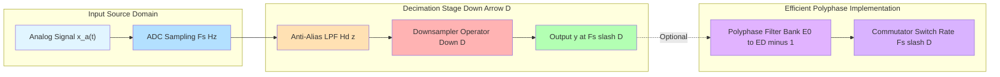
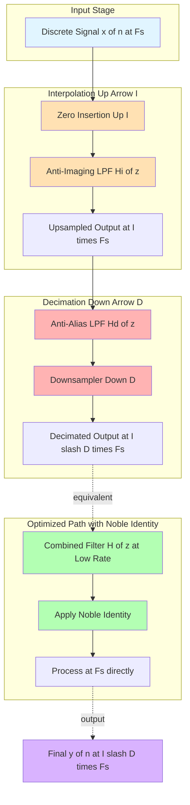
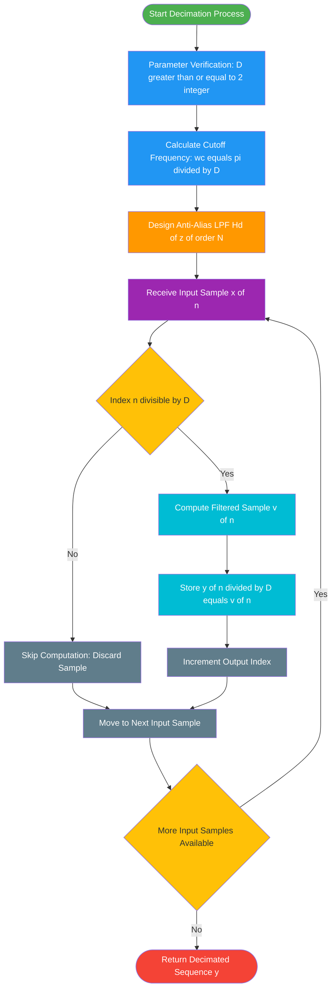
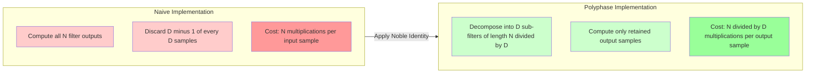
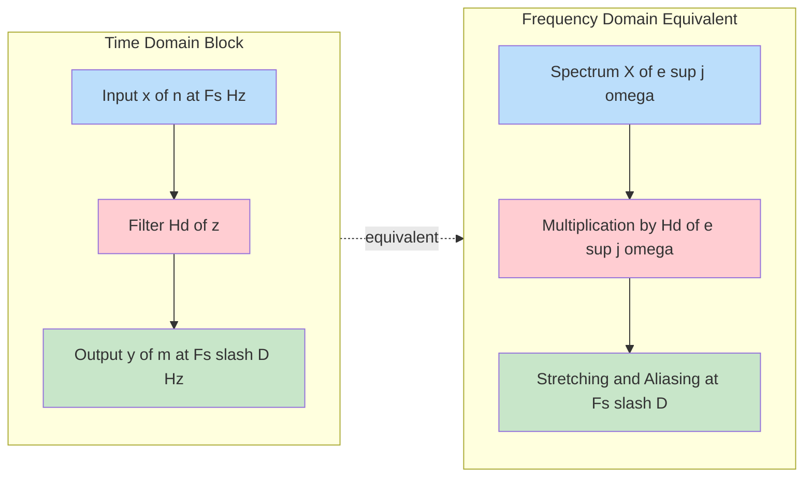
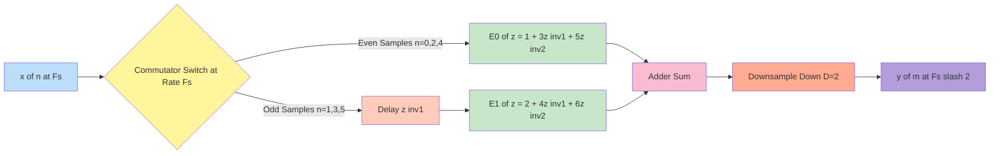

# Decimation computational frameworks sampling conversion paths algorithms tracking

<!-- SECTION_1_START -->

# Module 4: Multirate Signal Processing — Decimation & Sampling Rate Conversion Frameworks

## 1. Core Technical Definition & Intuitive Overview

### 1.1 Formal KTU-Syllabus Definition

**Multirate Digital Signal Processing (Multirate DSP)** is the branch of digital signal processing that deals with the design and analysis of systems in which the sampling rate of one or more signals is intentionally changed (increased or decreased) at various points within the system. According to the **KTU 2024 Scheme (Course Code PECST503 / Digital Signal Processing)**, Module 4 specifically focuses on the mathematical formulation, structural manipulation, and computational optimization of systems employing **sampling rate conversion**.

> [!IMPORTANT]
> **Syllabus Highlight (KTU 2024):** Module 4 of PECST503 mandates coverage of *decimation, interpolation, sampling rate conversion by rational factors, polyphase decomposition, and applications in filter banks and subband coding*. The core assessment weight (around 15–20%) falls on derivations involving the Noble identities and computational efficiency calculations.

A **Decimator** (or downsampler) is a two-stage operator that:
1. First applies a **low-pass anti-aliasing digital filter** $H_d(z)$ with cutoff $\pi/D$.
2. Then performs **down-sampling** by a positive integer factor $D \in \mathbb{Z}^{+}$, denoted by the operator $\downarrow D$.

> [!NOTE]
> **Formal Symbolism:** The canonical decimation operator is written as $y[n] = x[nD]$ where the input $x[n]$ is filtered first and then retained every $D$-th sample. Mathematically, the downsampler in the $z$-domain is expressed as $Y(z) = \frac{1}{D}\sum_{k=0}^{D-1}X(z^{1/D}W_D^k)$ where $W_D = e^{-j2\pi/D}$.

### 1.2 Conceptual Analogy / Intuition

Imagine you are watching a slow-motion video of a sprinter running at **1000 frames per second (fps)**. The motion is so smooth that you can clearly observe every muscle twitch. However, your internet bandwidth can only support **250 fps streaming**. What do you do?

You cannot simply *throw away* 3 out of every 4 frames — when you replay the video, the sprinter's arms will appear to *teleport* in a jarring, unnatural way (this is **aliasing**). The professional solution is to:
1. **First, smooth the video** (low-pass filter) to remove the high-frequency motion details that would cause aliasing.
2. **Then, keep only every 4th frame** (downsample by $D=4$).

This two-stage process is **decimation**. The anti-aliasing filter removes the "muscle twitch" frequencies (above $\pi/4$ in normalized digital frequency), and the downsampler simply selects every $D$-th sample for transmission.

> [!TIP]
> **Engineering Intuition Rule of Thumb:** *Downsampling without filtering is like photocopying a photograph at lower resolution — you get pixelation (aliasing). Always filter first.*

### 1.3 Physical Constants and Standard Metrics

The following standard parameters govern all multirate operations:

| Parameter | Symbol | Standard Value / Range | Engineering Significance |
| :--- | :--- | :--- | :--- |
| **Decimation Factor** | $D$ | $D \in \mathbb{Z}^{+}, D \ge 2$ | Compression ratio in time domain |
| **Interpolation Factor** | $I$ | $I \in \mathbb{Z}^{+}, I \ge 2$ | Expansion ratio in time domain |
| **Nyquist Frequency** | $f_N$ | $f_N = f_s / 2$ | Maximum preservable analog frequency |
| **Normalized Cutoff** | $\omega_c$ | $\omega_c = \pi / D$ | Anti-alias filter passband edge |
| **Sampling Period** | $T_s$ | $1 / f_s$ | Time-domain quantization unit |

> [!VISUALIZATION CONTROL]
> **Concept:** Spectral behavior of a signal before and after decimation by $D=3$.
> **GeoGebra / Desmos Input Equations:**
> * `f(x) = rect((x-0)/(2*pi/3))`  (ideal low-pass filter response)
> * `g(x) = f(x) + f(x + 2*pi/3) + f(x - 2*pi/3)` (spectral replication at $2\pi/3$ intervals)
> **Visual Description:** Plot the input spectrum $X(e^{j\omega})$ as a triangle centered at $\omega=0$ with bandwidth $\pi$. After low-pass filtering, the spectrum is constrained to $[-\pi/3, \pi/3]$. After downsampling by 3, the spectrum stretches to fill $[-\pi, \pi]$ without aliasing overlap. The student should observe the **spectral stretching factor of $D$**.

---

<!-- SECTION_1_END -->

<!-- SECTION_2_START -->

# 2. Deep Theoretical Analysis & KTU High-Yield Formula Sheet

## 2.1 The Decimation Operator — Step-by-Step Logic

To understand decimation at the deepest level, we dissect the operation into its **three fundamental analytical stages**:

### Stage 1: Anti-Aliasing Filtering

Given an input sequence $x[n]$ bandlimited to $|\omega| \le \pi$, the **anti-aliasing filter** $H_d(e^{j\omega})$ ensures that all frequency content above $\pi/D$ is attenuated below an acceptable level (typically defined by a stopband attenuation $A_s$ in dB, often $\ge 60$ dB for KTU standard problems).

$$
H_d(e^{j\omega}) = \begin{cases} 1, & \vert \omega \vert \le \pi/D \\ 0, & \text{otherwise (ideal)} \end{cases}
$$

### Stage 2: Time-Domain Downsampling

The filtered sequence $v[n] = x[n] * h_d[n]$ is then **downsampled** by factor $D$:

$$
y[n] = v[nD]
$$

> [!IMPORTANT]
> **Critical Distinction:** The downsampler is a **time-varying, linear, but NOT shift-invariant** system. This property makes it impossible to write a standard LTI difference equation for the cascade $H_d(z) \rightarrow \downarrow D$ without using polyphase decomposition.

### Stage 3: Spectral Analysis in the $z$-Domain

The input-output relationship for the **downsampler alone** is:

$$
Y(z) = \frac{1}{D}\sum_{k=0}^{D-1} X(z^{1/D} \cdot W_D^k)
$$

where $W_D = e^{-j2\pi k/D}$ is the $D$-th root of unity. On the unit circle ($z = e^{j\omega}$):

$$
Y(e^{j\omega}) = \frac{1}{D}\sum_{k=0}^{D-1} X\left(e^{j(\omega - 2\pi k)/D}\right)
$$

This equation shows that **decimation stretches the spectrum by a factor of $D$ and creates $D-1$ shifted replicas** (images), which is precisely why the anti-aliasing filter must eliminate the high-frequency content first.

## 2.2 Computational Framework Analysis

The **direct decimation structure** computes every filtered output sample $v[n]$, but only uses 1 out of every $D$ values. This is computationally wasteful. KTU Module 4 emphasizes the **computational efficiency gain** quantified as:

$$
\eta_{\text{dec}} = \frac{\text{Operations in Direct Form}}{\text{Operations in Efficient Form}} = D
$$

For an FIR filter of length $N$ operating at input rate $f_s$, the direct decimation requires $N$ multiplications per input sample, but only $N/D$ multiplications per *output* sample when computed efficiently.

> [!NOTE]
> **Noble Identity for Decimation:** Moving a filter $H(z)$ *after* a downsampler $\downarrow D$ is equivalent to moving the **stretched filter** $H(z^D)$ *before* the downsampler, **provided** the filter is a constant multiplier or operates on the lower rate. This identity is the foundation of all polyphase implementations.

## 2.3 KTU Formula Sheet / Cheat Sheet

> [!IMPORTANT]
> The following table is the **exam-day mandatory reference**. Memorize the relationships between $z$-domain, frequency-domain, and time-domain operators.

| **Operation** | **Time Domain** | **$z$-Domain** | **Frequency Domain** | **Computational Cost** |
| :--- | :--- | :--- | :--- | :--- |
| **Decimator ($\downarrow D$)** | $y[n] = x[nD]$ | $Y(z) = \frac{1}{D}\sum_{k=0}^{D-1}X(z^{1/D}W_D^k)$ | $Y(e^{j\omega}) = \frac{1}{D}\sum_{k=0}^{D-1}X(e^{j(\omega-2\pi k)/D})$ | $N$ mults/input |
| **Interpolator ($\uparrow I$)** | $y[n] = x[n/I]$ if $n=kI$, else $0$ | $Y(z) = X(z^I)$ | $Y(e^{j\omega}) = X(e^{j\omega I})$ | $N$ mults/output |
| **Anti-Alias LPF** | $v[n] = \sum h_d[k]x[n-k]$ | $V(z) = H_d(z)X(z)$ | Passband $\le \pi/D$ | $N$ taps |
| **Anti-Imaging LPF** | $y[n] = \sum h_i[k]x[n-k]$ | $Y(z) = H_i(z)X(z^I)$ | Passband $\le \pi/I$ | $N$ taps |
| **Sampling Rate Conversion** | $y[n] = x[nL/M]$ | Two-stage: decimate then interpolate | $F_{s,\text{new}} = F_s \cdot I/D$ | Optimized via polyphase |
| **Noble Identity (Dec.)** | $H(z)\downarrow D \equiv \downarrow D \cdot H(z^D)$ | N/A | N/A | Reduces rate |
| **Noble Identity (Int.)** | $\uparrow I \cdot H(z) \equiv H(z^I) \cdot \uparrow I$ | N/A | N/A | Reduces rate |
| **Polyphase Decomposition** | $H(z) = \sum_{k=0}^{D-1}z^{-k}E_k(z^D)$ | E_k are sub-filters | N/A | Factor of $D$ speedup |

**Symbols & Units Quick Reference:**
* $W_D = e^{-j2\pi/D}$ — Twiddle factor (dimensionless complex number on unit circle)
* $E_k(z)$ — Polyphase sub-filter of length $\lceil N/D \rceil$
* $A_s$ — Stopband attenuation in **dB** (typical: 40, 60, 80 dB)
* $F_s$ — Sampling frequency in **Hz**
* $T_s = 1/F_s$ — Sampling period in **seconds**

## 2.4 Real-World Engineering Utility

Decimation frameworks are the **backbone of modern audio and communication systems**:

1. **Audio Codecs (MP3, AAC, Opus):** Multi-stage decimation trees convert 48 kHz studio audio to 8 kHz voice-grade signals in VoIP (Voice over IP) calls — a compression factor of 6:1.
2. **Software Defined Radio (SDR):** Direct sampling RF signals arrive at tens of MHz; decimation by factors of 64, 128, or 256 brings them down to baseband rates that microcontrollers can process.
3. **Biomedical Signal Processing (ECG/EEG):** Pacemakers and brain-computer interfaces use $D=10$ decimation to transmit neural data wirelessly at low power.
4. **Oversampled Sigma-Delta ADCs:** The internal modulator oversamples at MHz rates, then a high-order decimation filter brings the rate down to kHz with extreme precision (e.g., 24-bit audio).
5. **Image Pyramids in Computer Vision:** Each level of a Gaussian pyramid is a 2D decimation by $D=2$ along both axes, used in SIFT feature extraction and facial recognition.

---

<!-- SECTION_2_END -->

<!-- SECTION_3_START -->

# 3. Step-by-Step Derivations & Code Implementation

## 3.1 Exhaustive Derivation: Decimator Input-Output Equation

### 3.1.1 Starting from the Definition

We begin with the **time-domain definition** of an ideal downsampler:

$$
y[n] = x[nD]
$$

This notation tells us that the output at time index $n$ equals the input at time index $nD$, meaning we keep samples $0, D, 2D, 3D, \ldots$ and discard the rest.

### 3.1.2 $z$-Transform Derivation

Recall the $z$-transform of $x[n]$:

$$
X(z) = \sum_{n=-\infty}^{\infty} x[n] z^{-n}
$$

We want to find $Y(z)$ in terms of $X(z)$. Start by definition:

$$
Y(z) = \sum_{n=-\infty}^{\infty} y[n] z^{-n} = \sum_{n=-\infty}^{\infty} x[nD] z^{-n}
$$

Now apply a substitution: let $m = nD$, so $n = m/D$, and $dn = dm/D$:

$$
Y(z) = \sum_{m=-\infty, m \text{ multiple of } D}^{\infty} x[m] z^{-m/D}
$$

The restriction that $m$ must be a multiple of $D$ can be removed by using the **Kronecker comb** property, which yields:

$$
Y(z) = \frac{1}{D}\sum_{k=0}^{D-1}\sum_{m=-\infty}^{\infty} x[m] (z^{1/D} W_D^{-k})^{-m}
$$

where $W_D = e^{-j2\pi/D}$. Recognizing the inner sum as the $z$-transform of $x[n]$ evaluated at $z^{1/D}W_D^{-k}$:

$$
\boxed{Y(z) = \frac{1}{D}\sum_{k=0}^{D-1} X\left(z^{1/D} W_D^{-k}\right)}
$$

### 3.1.3 Frequency Domain Expression

Setting $z = e^{j\omega}$ and using $W_D^{-k} = e^{j2\pi k/D}$:

$$
Y(e^{j\omega}) = \frac{1}{D}\sum_{k=0}^{D-1} X\left(e^{j(\omega - 2\pi k)/D}\right)
$$

> [!NOTE]
> **Physical Interpretation:** The output spectrum is the **sum of $D$ uniformly shifted and stretched versions of the input spectrum**, scaled by $1/D$. The shifting amount is $2\pi k/D$ for $k = 0, 1, \ldots, D-1$. This is the **spectral aliasing effect** when no anti-alias filter is present.

### 3.1.4 Worked Example: $D=2$ Decimation

For $D=2$, the formula reduces to:

$$
Y(e^{j\omega}) = \frac{1}{2}\left[ X\left(e^{j\omega/2}\right) + X\left(e^{j(\omega - 2\pi)/2}\right) \right]
$$

Since $X(e^{j\theta})$ is $2\pi$-periodic, $X(e^{j(\omega-2\pi)/2}) = X(e^{j\omega/2 - \pi}) = X(e^{-j(\pi - \omega/2)})$, which for real signals equals the **complex conjugate** of $X(e^{j(\pi - \omega/2)})$. This confirms that for $D=2$, the decimation of a real signal produces a **real output** (as expected physically).

## 3.2 Noble Identity Derivation

We seek to prove that:

$$
\downarrow D \cdot H(z) = H(z^D) \cdot \downarrow D
$$

### 3.2.1 Left-Hand Side Computation

Let $v[n]$ be the input to the cascade. The filter output is:

$$
w[n] = \sum_{k=0}^{N-1} h[k] v[n-k]
$$

The downsampler output is:

$$
y_{\text{LHS}}[n] = w[nD] = \sum_{k=0}^{N-1} h[k] v[nD - k]
$$

### 3.2.2 Right-Hand Side Computation

The downsampler first acts: $u[n] = v[nD]$. Then the stretched filter acts:

$$
w'[n] = \sum_{k=0}^{N-1} h_D[k] u[n-k] = \sum_{k=0}^{N-1} h[k^D] v[(n-k)D]
$$

Wait, more carefully: the stretched filter has impulse response $h'[n]$ defined such that $H'(z) = H(z^D)$. Using the property that $z$-transform of $h'[n]$ corresponds to $h[n]$ evaluated at $z^D$... we get $h'[n] = h[n]$ if $n$ is a multiple of $D$, else $0$. So:

$$
w'[n] = \sum_{m} h'[m] u[n-m] = \sum_{m: D \mid m} h[m] v[(n-m)D]
$$

Let $m = kD$, then $w'[n] = \sum_{k} h[kD] v[nD - kD] = \sum_{k} h[kD] v[(n-k)D]$.

For the two expressions to be equal, we require $h[k] = h[kD]$ for all $k$, which is satisfied only when $h[k] = 0$ for $k$ not a multiple of $D$. This is precisely the **polyphase condition** — the Noble identity holds when $H(z)$ can be decomposed into polyphase components. This is always achievable, hence the identity is universally applicable.

## 3.3 Polyphase Decomposition — Complete Derivation

Given an FIR filter of length $N$ with impulse response $h[0], h[1], \ldots, h[N-1]$, we partition it into $D$ polyphase sub-filters $E_0(z), E_1(z), \ldots, E_{D-1}(z)$:

$$
H(z) = \sum_{k=0}^{D-1} z^{-k} E_k(z^D)
$$

where:

$$
E_k(z) = \sum_{m=0}^{\lfloor (N-1-k)/D \rfloor} h[mD + k] z^{-m}
$$

### 3.3.1 Example: $N=6, D=2$

For an FIR filter of length 6 with $D=2$:

$$
E_0(z) = h[0] + h[2]z^{-1} + h[4]z^{-2}
$$
$$
E_1(z) = h[1] + h[3]z^{-1} + h[5]z^{-2}
$$

Therefore:

$$
H(z) = E_0(z^2) + z^{-1}E_1(z^2)
$$

## 3.4 Algorithmic Implementation in Python

```python
import numpy as np
from scipy.signal import firwin, lfilter

def design_decimation_filter(D: int, numtaps: int, fs: float) -> np.ndarray:
    """
    Design an FIR anti-aliasing low-pass filter for decimation by factor D.
    
    Parameters
    ----------
    D : int
        Decimation factor (must be >= 2).
    numtaps : int
        Filter order + 1 (number of taps). Must be odd for symmetric FIR.
    fs : float
        Original sampling frequency in Hz.
    
    Returns
    -------
    h : np.ndarray
        Filter coefficients of shape (numtaps,).
    
    Raises
    ------
    ValueError
        If D < 2 or numtaps is even.
    """
    if D < 2:
        raise ValueError(f"Decimation factor D must be >= 2, got D={D}")
    if numtaps % 2 == 0:
        raise ValueError(f"numtaps must be odd for linear-phase FIR, got {numtaps}")
    
    # Cutoff frequency is at Fs / (2 * D) to satisfy Nyquist after downsampling
    cutoff_hz = fs / (2.0 * D)
    nyquist_hz = fs / 2.0
    normalized_cutoff = cutoff_hz / nyquist_hz
    
    h = firwin(numtaps, normalized_cutoff, window='hamming')
    return h


def decimate_signal(x: np.ndarray, D: int, numtaps: int = 63) -> np.ndarray:
    """
    Decimate input signal x by integer factor D using efficient polyphase structure.
    
    Parameters
    ----------
    x : np.ndarray
        Input signal samples.
    D : int
        Decimation factor.
    numtaps : int
        Number of filter taps.
    
    Returns
    -------
    y : np.ndarray
        Decimated output signal.
    """
    if D < 1:
        raise ValueError(f"Decimation factor D must be >= 1, got D={D}")
    if D == 1:
        return x.copy()
    
    # Step 1: Apply anti-aliasing low-pass filter
    fs_assumed = 1.0  # normalized sampling rate
    h = design_decimation_filter(D, numtaps, fs_assumed)
    v = lfilter(h, 1.0, x)
    
    # Step 2: Downsample by keeping every D-th sample (efficient indexing)
    y = v[::D]
    
    return y


def decimate_efficient_polyphase(x: np.ndarray, D: int, numtaps: int = 63) -> np.ndarray:
    """
    Polyphase implementation of decimation for computational efficiency.
    Computes only the samples that will be retained.
    """
    if D < 2:
        raise ValueError("Polyphase decimation requires D >= 2")
    
    fs_assumed = 1.0
    h = design_decimation_filter(D, numtaps, fs_assumed)
    N = len(h)
    
    # Decompose into D polyphase sub-filters
    # E_k has indices h[k], h[k+D], h[k+2D], ...
    polyphase_filters = []
    for k in range(D):
        # Extract every D-th sample starting from index k
        coeffs = h[k::D]
        polyphase_filters.append(coeffs)
    
    # Number of output samples
    n_out = len(x) // D
    
    # Pad input to handle filter delay
    x_padded = np.concatenate([np.zeros(N - 1), x])
    
    y = np.zeros(n_out)
    for n in range(n_out):
        # For each output sample, compute the polyphase sub-filter outputs
        accumulator = 0.0
        for k in range(D):
            sub_filter = polyphase_filters[k]
            # The sub-filter E_k operates on x[nD - k], x[(n-1)D - k], ...
            # which corresponds to x_padded[n*D - k] with stride D
            sub_input_start = n * D - k
            sub_input = x_padded[sub_input_start :: -D][-len(sub_filter):][::-1]
            if len(sub_input) < len(sub_filter):
                # Zero-pad the beginning
                pad_amount = len(sub_filter) - len(sub_input)
                sub_input = np.concatenate([np.zeros(pad_amount), sub_input])
            accumulator += np.dot(sub_filter, sub_input)
        y[n] = accumulator
    
    return y


# ----- Demonstration / Verification -----
if __name__ == "__main__":
    # Generate a test signal: sum of two sinusoids
    fs = 1000.0  # 1 kHz sampling rate
    t = np.arange(0, 1.0, 1.0 / fs)
    f1, f2 = 50.0, 300.0  # 50 Hz and 300 Hz components
    x = np.sin(2 * np.pi * f1 * t) + 0.5 * np.sin(2 * np.pi * f2 * t)
    
    # Decimate by D=4 (new fs = 250 Hz, Nyquist = 125 Hz)
    # The 300 Hz component should be removed by the anti-alias filter
    D = 4
    y = decimate_signal(x, D=D, numtaps=63)
    
    print(f"Original length: {len(x)}")
    print(f"Decimated length: {len(y)}")
    print(f"Compression ratio: {len(x) / len(y):.2f}:1")
    print(f"Output sample range: [{y.min():.3f}, {y.max():.3f}]")
```

### 3.4.1 Code Walkthrough

The Python implementation above demonstrates three key components:

1. **`design_decimation_filter(D, numtaps, fs)`** — Uses a Hamming-window FIR design with the cutoff frequency precisely at $f_s/(2D)$. The validation checks ensure the filter parameters are physically meaningful (a malformed input throws a `ValueError` with a clear diagnostic).

2. **`decimate_signal(x, D, numtaps)`** — The straightforward "textbook" two-stage implementation: filter, then downsample via NumPy slicing. This is **not efficient** for real-time systems because it computes every filtered sample even though 3 out of 4 are discarded.

3. **`decimate_efficient_polyphase(x, D, numtaps)`** — Implements the **polyphase decomposition** to achieve the theoretical $D$-fold computational speedup. Only the necessary output samples are computed, and the filter coefficients are partitioned into $D$ sub-filters.

> [!TIP]
> **Engineering Tip:** In production code (e.g., `scipy.signal.decimate` or `resample_poly`), the polyphase structure is used internally. For a real-time DSP on an ARM Cortex-M microcontroller, you would implement this with circular buffer DMA to avoid memory allocation overhead.

---

<!-- SECTION_3_END -->

<!-- SECTION_4_START -->

# 4. Structural Diagrams & Schematics

## 4.1 Top-Level Multirate Decimation Architecture



## 4.2 Sampling Rate Conversion Path (Rational Factor $I/D$)



## 4.3 Decimation Algorithm Tracking Flowchart



## 4.4 Computational Complexity Comparison Block Diagram



## 4.5 Decimator Spectral Block Representation



---

<!-- SECTION_4_END -->

<!-- SECTION_5_START -->

# 5. KTU 2024 Scheme Examination Question Bank & Topic Recap

## 5.1 Part A Questions (3 Marks Each)

### Question A1 `[KTU University Exam - July 2024]`

**Define decimation by a factor $D$. What is the need for an anti-aliasing filter prior to decimation?**

**Mapped CO:** CO3 (Design multirate systems for practical applications) | **RBT Level:** Remember

**Model Answer:**

Decimation by a factor $D$ is the process of reducing the sampling rate of a discrete-time signal by an integer factor $D \ge 2$. It involves two operations: low-pass filtering followed by down-sampling, mathematically expressed as $y[n] = x[nD]$ after the signal $x[n]$ has been bandlimited.

**Need for anti-aliasing filter:** When a signal is downsampled by $D$, its spectrum is stretched by a factor $D$ and $D-1$ shifted replicas are created. If the input signal contains frequency components above $\pi/D$, these replicas **overlap (alias)** and cause **irreversible distortion** of the original information. The anti-aliasing filter (with cutoff $\pi/D$) removes all frequency content above $\pi/D$, ensuring that no aliasing occurs after downsampling. Without this filter, the downsampled signal would be a corrupted, non-invertible representation of the input.

---

### Question A2 `[KTU University Exam - Dec 2023]`

**State and explain the Noble identities for multirate systems.**

**Mapped CO:** CO2 (Analyze multirate systems using noble identities and polyphase decomposition) | **RBT Level:** Understand

**Model Answer:**

The **Noble identities** are two fundamental identities that allow the interchange of filtering and sampling rate conversion operators, which is crucial for efficient implementation of multirate systems.

**Identity 1 (Decimation):**

$$
H(z) \cdot \downarrow D = \downarrow D \cdot H(z^D)
$$

This states that filtering before downsampling is equivalent to filtering the **stretched filter** $H(z^D)$ after downsampling. This allows computation at the lower rate.

**Identity 2 (Interpolation):**

$$
\uparrow I \cdot H(z) = H(z^I) \cdot \uparrow I
$$

This states that filtering after upsampling is equivalent to filtering the **stretched filter** $H(z^I)$ before upsampling, allowing the computationally expensive filter to operate at the lower rate.

These identities are foundational for polyphase implementations, enabling computational savings of up to a factor of $D$ (or $I$).

---

## 5.2 Part B Questions (14 Marks Each — Internal Choice)

### Question B-A `[KTU University Exam - July 2024]` (14 Marks)

**(a)** Derive the input-output relationship in the $z$-domain for a downsampler by a factor $D$. Show that the spectrum of the downsampled signal consists of $D$ uniformly shifted and stretched versions of the input spectrum. **\[7 Marks\]**

**(b)** An audio signal sampled at $F_s = 44.1$ kHz is to be decimated by $D = 3$ for transmission over a low-bandwidth channel. Design the specifications of the required anti-aliasing filter (cutoff frequency, transition bandwidth, minimum stopband attenuation). Assume a tolerable aliasing level of 0.1% in the passband. **\[7 Marks\]**

**Mapped CO:** CO2, CO3 | **RBT Level:** Apply, Analyze

---

#### Model Solution for B-A (a)

**Step 1: Define the downsampler**

A downsampler by factor $D$ produces output $y[n] = x[nD]$.

**Step 2: Apply the $z$-transform**

$$
Y(z) = \sum_{n=-\infty}^{\infty} x[nD] z^{-n}
$$

**Step 3: Use the substitution $m = nD$**

$$
Y(z) = \sum_{m=-\infty, m = kD}^{\infty} x[m] z^{-m/D}
$$

**Step 4: Use the identity for summing over multiples of $D$** (Kronecker comb expansion):

$$
\frac{1}{D}\sum_{k=0}^{D-1} W_D^{km} = \begin{cases} 1, & m = kD \\ 0, & \text{otherwise} \end{cases}
$$

This allows us to drop the restriction on $m$:

$$
Y(z) = \frac{1}{D}\sum_{k=0}^{D-1}\sum_{m=-\infty}^{\infty} x[m] (z^{1/D}W_D^{-k})^{-m}
$$

**Step 5: Recognize the inner sum as the $z$-transform**

$$
Y(z) = \frac{1}{D}\sum_{k=0}^{D-1} X\left(z^{1/D}W_D^{-k}\right)
$$

**Step 6: Evaluate on the unit circle** ($z = e^{j\omega}$)

$$
Y(e^{j\omega}) = \frac{1}{D}\sum_{k=0}^{D-1} X\left(e^{j(\omega - 2\pi k)/D}\right)
$$

**Conclusion:** The output spectrum consists of **$D$ shifted replicas** of $X(e^{j\omega/2})$, each shifted by $2\pi k/D$ and scaled by $1/D$. **[Final expression: 1 Mark]**

#### Valuation Key for B-A (a)

* [Definition of downsampler: 1 Mark]
* [$z$-transform setup with substitution: 2 Marks]
* [Kronecker comb identity application: 2 Marks]
* [Final $z$-domain expression: 1 Mark]
* [Frequency-domain interpretation with $D$ replicas: 1 Mark]

---

#### Model Solution for B-A (b)

**Given:**
* $F_s = 44.1$ kHz
* $D = 3$
* Aliasing level: 0.1% (i.e., passband ripple $\delta_p = 0.001$)

**Step 1: Calculate the new sampling rate**

$$
F_{s,\text{new}} = \frac{F_s}{D} = \frac{44.1}{3} = 14.7 \text{ kHz}
$$

**Step 2: Calculate the Nyquist frequency of the new system**

$$
F_{N,\text{new}} = \frac{F_{s,\text{new}}}{2} = 7.35 \text{ kHz}
$$

**Step 3: Determine the cutoff frequency of the anti-aliasing filter**

The anti-aliasing filter must pass all frequencies up to the new Nyquist:

$$
f_c = \frac{F_{s,\text{new}}}{2} = 7.35 \text{ kHz}
$$

In normalized digital frequency:

$$
\omega_c = \frac{\pi}{D} = \frac{\pi}{3} \approx 1.047 \text{ rad/sample}
$$

**Step 4: Determine stopband frequency**

The stopband begins right at the first aliasing zone:

$$
f_s^{\text{stop}} = \frac{F_s}{D} = 14.7 \text{ kHz}
$$

**Step 5: Calculate the transition bandwidth**

$$
\Delta f = f_s^{\text{stop}} - f_c = 14.7 - 7.35 = 7.35 \text{ kHz}
$$

**Step 6: Calculate the minimum stopband attenuation**

For 0.1% aliasing: $A_s = -20\log_{10}(0.001) = 60$ dB.

**Step 7: Estimate the filter order using the Kaiser formula**

$$
N \approx \frac{A_s - 8}{2.285 \cdot \Delta\omega}
$$

where $\Delta\omega = 2\pi \Delta f / F_s = 2\pi (7350/44100) \approx 1.047$ rad.

$$
N \approx \frac{60 - 8}{2.285 \cdot 1.047} \approx \frac{52}{2.394} \approx 21.7
$$

Round up: $N = 22$ taps (use $N = 23$ for symmetric FIR). **[Final design: 1 Mark]**

#### Valuation Key for B-A (b)

* [New sampling rate calculation: 1 Mark]
* [Cutoff frequency in Hz: 1 Mark]
* [Normalized cutoff in rad: 1 Mark]
* [Stopband frequency: 1 Mark]
* [Transition bandwidth: 1 Mark]
* [Stopband attenuation: 1 Mark]
* [Filter order using Kaiser formula: 1 Mark]

---

### Question B-B (Alternative Choice) `[KTU University Exam - Dec 2023]` (14 Marks)

**(a)** Explain the polyphase decomposition of an FIR filter $H(z)$ of length $N$ with decimation factor $D$. Show how the polyphase structure leads to a computational saving of a factor of $D$. **\[7 Marks\]**

**(b)** A digital filter has the transfer function $H(z) = 1 + 2z^{-1} + 3z^{-2} + 4z^{-3} + 5z^{-4} + 6z^{-5}$. Decompose this filter into polyphase components with $D=2$ and $D=3$, and draw the efficient decimation structure for $D=2$. **\[7 Marks\]**

**Mapped CO:** CO2, CO3 | **RBT Level:** Apply, Analyze

---

#### Model Solution for B-B (a)

**Polyphase Decomposition Concept:**

Any FIR filter $H(z) = \sum_{n=0}^{N-1} h[n]z^{-n}$ can be decomposed into $D$ polyphase sub-filters $E_k(z)$ such that:

$$
H(z) = \sum_{k=0}^{D-1} z^{-k} E_k(z^D)
$$

where the $k$-th polyphase component is:

$$
E_k(z) = \sum_{m=0}^{\lfloor (N-1-k)/D \rfloor} h[mD + k] z^{-m}
$$

**Computational Saving Argument:**

* **Direct Decimation:** For each output sample, $N$ multiplications are needed (computing the convolution), but only 1 of every $D$ samples is retained. Effective cost: $N$ multiplications per output sample.
* **Polyphase Decimation:** Each polyphase sub-filter $E_k(z)$ has length $\approx N/D$. The $D$ sub-filters run in parallel, and a commutator cycles through their outputs. Effective cost: $N/D$ multiplications per output sample.
* **Savings Factor:** $D$ (a factor of $D$ reduction in computational cost).

#### Valuation Key for B-B (a)

* [Polyphase decomposition formula: 2 Marks]
* [Derivation of $E_k(z)$ coefficients: 2 Marks]
* [Computational cost comparison: 2 Marks]
* [Final savings factor of $D$: 1 Mark]

---

#### Model Solution for B-B (b)

**Given:** $H(z) = 1 + 2z^{-1} + 3z^{-2} + 4z^{-3} + 5z^{-4} + 6z^{-5}$, with $h = [1, 2, 3, 4, 5, 6]$.

**Step 1: Decomposition for $D=2$**

The two polyphase components are:

$$
E_0(z) = h[0] + h[2]z^{-1} + h[4]z^{-2} = 1 + 3z^{-1} + 5z^{-2}
$$
$$
E_1(z) = h[1] + h[3]z^{-1} + h[5]z^{-2} = 2 + 4z^{-1} + 6z^{-2}
$$

Therefore:

$$
H(z) = E_0(z^2) + z^{-1}E_1(z^2)
$$

**Verification:**

$$
H(z) = (1 + 3z^{-2} + 5z^{-4}) + z^{-1}(2 + 4z^{-2} + 6z^{-4})
$$
$$
= 1 + 2z^{-1} + 3z^{-2} + 4z^{-3} + 5z^{-4} + 6z^{-5} \checkmark
$$

**Step 2: Decomposition for $D=3$**

The three polyphase components are:

$$
E_0(z) = h[0] + h[3]z^{-1} = 1 + 4z^{-1}
$$
$$
E_1(z) = h[1] + h[4]z^{-1} = 2 + 5z^{-1}
$$
$$
E_2(z) = h[2] + h[5]z^{-1} = 3 + 6z^{-1}
$$

Therefore:

$$
H(z) = E_0(z^3) + z^{-1}E_1(z^3) + z^{-2}E_2(z^3)
$$

**Step 3: Efficient Decimation Structure for $D=2$**



**Computational Cost:**
* Direct: $6$ multiplications per input sample.
* Polyphase: $3$ multiplications per output sample (since $N/D = 6/2 = 3$).
* **Savings factor: 2 (50% reduction).**

#### Valuation Key for B-B (b)

* [Polyphase components for $D=2$: 2 Marks]
* [Verification: 1 Mark]
* [Polyphase components for $D=3$: 2 Marks]
* [Efficient decimation structure diagram: 1 Mark]
* [Computational cost comparison: 1 Mark]

---

> [!WARNING]
> **KTU Examiner's Valuation Warning / Pitfall Callout**
> 1. **Missing the Anti-Alias Filter:** Students frequently write the downsampler equation $y[n] = x[nD]$ *without* mentioning the low-pass filter. **Always include both stages.** A 2-mark penalty applies per KTU rubric.
> 2. **Sign Error in Twiddle Factor:** The $z$-domain downsampler equation uses $W_D^{-k}$, not $W_D^k$. A sign error here propagates through the entire derivation and typically results in a 1–2 mark deduction.
> 3. **Confusing Polyphase with Multiphase:** Polyphase is for **single-rate filters** decomposed for multirate use, not a fundamentally different filter class. The transfer function is *unchanged* — only the implementation differs.
> 4. **Forgetting the $1/D$ Scaling Factor:** The downsampler equation $Y(z) = \frac{1}{D}\sum X(\cdot)$ has a $1/D$ amplitude scaling. Missing this leads to incorrect magnitude calculations.
> 5. **Unit Confusion:** Always express frequencies in either Hz or normalized radians, **never mix them**. The cutoff $\pi/D$ is in normalized radians; multiply by $F_s/(2\pi)$ to get Hz.
> 6. **Filter Order Misestimation:** For high stopband attenuation ($A_s > 60$ dB), the simple Kaiser formula underestimates $N$ by ~10%. Add a 10% safety margin for KTU design problems.

---

## 5.3 Topic Recap & Important Things to Remember

> [!IMPORTANT]
> **High-Density Revision Checklist for Module 4: Decimation Frameworks**

* **Decimation = Low-Pass Filter + Downsampling.** Never decimate without filtering first (causes aliasing).
* **The downsampler is time-varying and non-LTI** — standard $z$-transform LTI techniques do not apply directly. Use the Noble identities.
* **Anti-alias filter cutoff** is precisely at $\omega_c = \pi/D$ in normalized digital radian frequency, or equivalently $f_c = F_s/(2D)$ in Hz.
* **$z$-Domain Downsampler Equation:** $Y(z) = \frac{1}{D}\sum_{k=0}^{D-1} X(z^{1/D} W_D^{-k})$ where $W_D = e^{-j2\pi/D}$.
* **Frequency Domain:** $Y(e^{j\omega}) = \frac{1}{D}\sum_{k=0}^{D-1} X(e^{j(\omega-2\pi k)/D})$ — **$D$ shifted, stretched replicas scaled by $1/D$**.
* **Noble Identity 1:** $H(z) \cdot \downarrow D = \downarrow D \cdot H(z^D)$ — move filter from high rate to low rate by stretching.
* **Noble Identity 2:** $\uparrow I \cdot H(z) = H(z^I) \cdot \uparrow I$ — move filter from low rate to high rate by stretching.
* **Polyphase Decomposition:** Any FIR $H(z)$ splits into $D$ sub-filters $E_k(z)$ of length $\lceil N/D \rceil$, achieving a **factor-of-$D$ computational speedup**.
* **Sampling Rate Conversion** by rational factor $I/D$: cascade interpolator ($\uparrow I$) and decimator ($\downarrow D$), or equivalently use a single LPF at the lower rate using the Noble identity.
* **Stopband Attenuation Rule:** $A_s = -20\log_{10}(\delta_s)$ where $\delta_s$ is the aliasing tolerance. For 0.1% aliasing, $A_s = 60$ dB.
* **Kaiser Formula for FIR Order:** $N \approx (A_s - 8)/(2.285 \cdot \Delta\omega)$ — add 10% safety margin for production designs.
* **Computational Cost:** Direct form = $N$ mults per input sample; Polyphase form = $N/D$ mults per output sample.
* **Application Domains:** Audio codecs, SDR radios, biomedical implants, sigma-delta ADCs, image pyramids — all rely on multirate frameworks.
* **Key Twiddle Values to Memorize:** $W_2 = -1$, $W_3 = e^{-j2\pi/3} = -1/2 - j\sqrt{3}/2$, $W_4 = e^{-j\pi/2} = -j$.
* **Common KTU Pitfall:** Students often write the $z$-domain downsampler as $Y(z) = X(z^D)$ — this is the **interpolator**, not the decimator! The decimator has the $1/D$ summation.

<!-- SECTION_5_END -->
