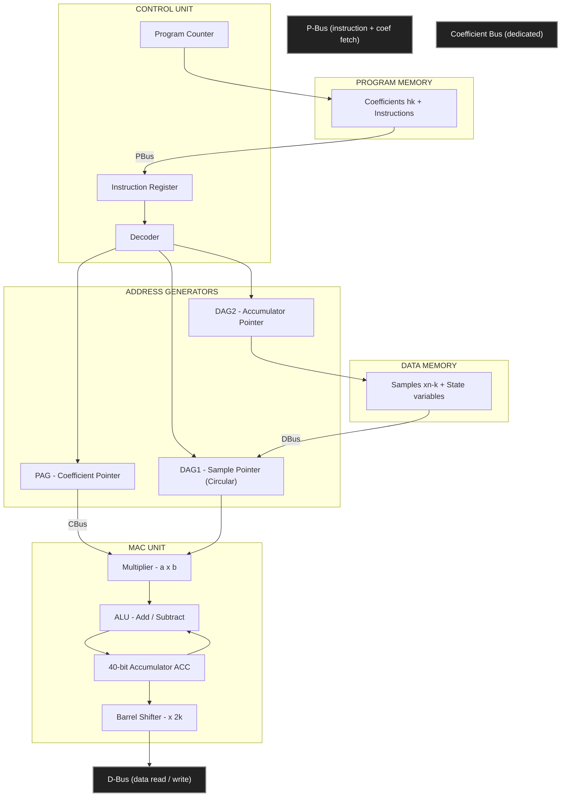
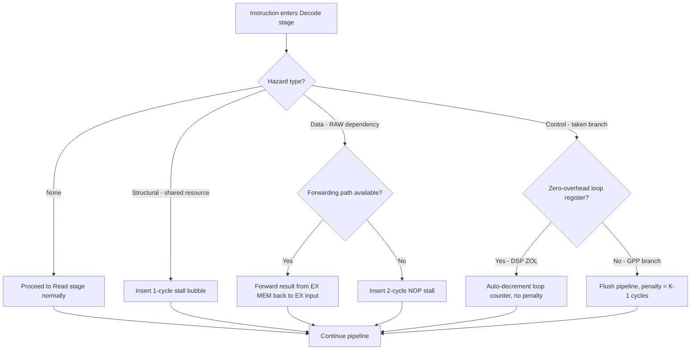
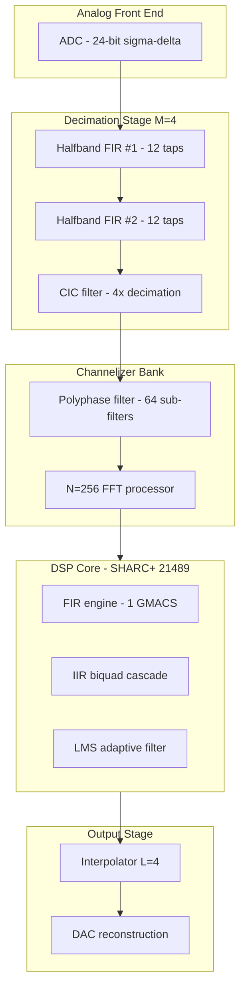

# Digital signal processors architectures hardware configurations pipelines execution benchmarks

<!-- SECTION_1_START -->
# Digital Signal Processors: Architectures, Hardware Configurations, Pipelines & Execution Benchmarks

> [!IMPORTANT]
> **KTU 2024 Scheme | PECST503 | Module 4 | Multirate Signal Processing Frameworks**
> This module directly maps to **Course Outcome CO4** and addresses the hardware backbone that makes real-time multirate operations (decimation, interpolation, polyphase filtering) physically realizable.

## 1.1 Formal Academic Definition

A **Digital Signal Processor (DSP)** is a specialized microprocessor — optimized in its architecture, instruction set, and on-chip hardware — for the high-throughput, numerically intensive mathematical operations (multiply-accumulate, convolution, FFT, IIR/FIR filtering) that characterize real-time discrete-time signal processing workloads.

The three foundational hardware pillars of any DSP are:

1. **Modified Harvard Architecture** — physically separate program and data memory buses (allowing simultaneous fetch of an instruction and two data operands in a single cycle).
2. **Hardware Multiplier–Accumulator (MAC) Unit** — typically a single-cycle `a × b + c` engine that performs the kernel operation of DSP in one clock tick.
3. **Deep Pipelined Execution** — overlapping fetch, decode, read, execute, and write phases across consecutive instructions to sustain near one-instruction-per-cycle (1-IPC) throughput.

> [!NOTE]
> **Key Distinction from a General-Purpose CPU:** A DSP trades the flexibility of complex branch prediction, out-of-order execution, and large cache hierarchies for **deterministic, predictable, real-time latency** — a non-negotiable requirement for multirate filters that must produce one output sample per input sample (or per M/N input samples for decimation/interpolation).

## 1.2 Conceptual Analogy — The "Assembly Line Kitchen"

Imagine a restaurant kitchen that must serve 1,000 customers per hour:

- A **Von Neumann kitchen** has **one chef** who must read a recipe, fetch ingredients, cook, plate, and serve — all sequentially. The chef (CPU) keeps running back and forth to the same pantry and cookbook shelf.
- A **Harvard kitchen** has **two assistants** — one dedicated cookbook reader, one dedicated ingredient fetcher — feeding a single head chef. Now the chef can cook continuously.
- A **Pipelined Harvard kitchen** has the work split across **five stations**: (1) Read recipe, (2) Fetch ingredients, (3) Chop, (4) Cook, (5) Plate. While station 5 plates dish #1, station 4 cooks dish #2, station 3 chops dish #3, and so on. The "head chef" is now five specialists working in lockstep.
- A **DSP chip** is exactly this pipelined Harvard kitchen — purpose-built so that the heavy numerical "cooking" (multiplications and additions) happens at the rate of one complete dish per clock cycle, no matter how busy the order queue gets.

## 1.3 Standard Metrics & Terminology

The following engineering constants and standard metrics are **bolded** because they are guaranteed to appear in KTU ESE questions:

- **MIPS** — Millions of Instructions Per Second.
- **MOPS** — Millions of Operations Per Second (a multiply + an add = 2 operations, so MOPS ≈ 2 × MIPS for MAC-bound code).
- **MFLOPS** — Millions of Floating-Point Operations Per Second.
- **MMACS** — Million Multiply-Accumulates per Second.
- **MAC cycle** — the number of clock cycles required to complete one Multiply-Accumulate (1 on a true DSP, many on a GPP).
- **Instruction cycle $T_{cyc}$** — inverse of the master clock: $T_{cyc} = 1 / f_{clk}$.
- **Latency vs. Throughput** — *latency* is the time from first input to first output; *throughput* is the steady-state rate of output production.

> [!VISUALIZATION CONTROL]
> **Concept:** MAC Latency vs. Throughput under Pipelining
> **Python/Plotting Equations (matplotlib):**
> * `x_clocks = [1, 2, 3, 4, 5, 6, 7, 8]`
> * `y_latency_unpipelined = [0, 1, 2, 3, 4, 5, 6, 7]  # 1 MAC every 3 cycles`
> * `y_throughput_pipelined = [0, 0, 1, 1, 2, 2, 3, 3]  # 1 MAC every 1 cycle after fill`
> **Visual Description:** A staircase-like plot. The blue "pipelined" line starts flat (pipeline fill), then doubles its slope and runs parallel to, but offset from, the red "non-pipelined" line — illustrating the **3× throughput gain** of pipelining with only a small startup latency cost.

---

<!-- SECTION_2_START -->
# Deep Theoretical Analysis — Architecture, Pipeline Stages & Benchmark Mathematics

## 2.1 Evolution of DSP Architecture

| Generation | Architecture | Buses | Multiplier | Pipeline Depth | Representative Device |
|---|---|---|---|---|---|
| 1st Gen | Von Neumann | 1 (shared) | Software-emulated | 0 (single-cycle) | Intel 2920 (1979) |
| 2nd Gen | Harvard | 2 (separated) | Hardware, multi-cycle | 2–3 stages | TMS320C10 (1983) |
| 3rd Gen | Modified Harvard | 2 + ICache | Single-cycle MAC | 4–6 stages | TMS320C25, DSP56001 |
| 4th Gen | VLIW / Super-Harvard | Multiple | Multi-MAC, SIMD | 6–8 stages | TMS320C6x, SHARC, TigerSHARC |
| 5th Gen | VLIW + SIMD + Vector | Many | 8–16 MAC units | 8–14 stages | TMS320C66x, CEVA-XC, Qualcomm Hexagon |

## 2.2 The Three Canonical Memory Architectures

### (a) Von Neumann (Princeton) Architecture
- **Single memory** holds both program instructions and data.
- **Single bus** carries both instruction fetches and data reads/writes — the **"Von Neumann bottleneck."**
- An instruction fetch and a data read **cannot** occur simultaneously.
- Not used in modern DSPs because it cannot feed the single-cycle MAC.

### (b) Harvard Architecture
- **Physically separate** program memory and data memory, each with its **own dedicated bus.**
- Allows **one instruction fetch + one data read + one data write** in a single clock cycle.
- Pure Harvard is rare; almost all real DSPs use the **Modified Harvard** variant.

### (c) Modified Harvard Architecture
- Physically separate program and data memories (Harvard for *steady-state* data flow).
- **Additional pathways** (e.g., instruction cache, data cache, or DMA channels) allow program memory to be written as data, or vice versa, providing flexibility.
- The architectural choice for **every modern DSP** (TMS320, SHARC, Blackfin, etc.).

> [!NOTE]
> **KTU High-Yield Fact:** A Modified Harvard architecture permits the *coefficients* of a digital filter to be stored in program memory (ROM) and the *signal samples* in data memory (RAM), with both being accessed on the *same* clock edge — this is exactly what an FIR filter kernel requires.

## 2.2.1 Internal Block Diagram of a Generic DSP

The functional blocks below (visualized in Section 4) interact as follows:

1. **Program Memory (PM)** stores filter coefficients $h[k]$ and instructions.
2. **Data Memory (DM)** stores input samples $x[n]$ and output/accumulator values $y[n]$.
3. **Program Address Generator (PAG)** provides the coefficient pointer; for circular buffers it auto-wraps modulo $N$.
4. **Data Address Generators (DAG1, DAG2)** provide sample pointer and accumulator pointer.
5. **Multiplier** computes the partial product $h[k] \cdot x[n-k]$.
6. **ALU / Accumulator (ACC)** performs the addition $ACC \leftarrow ACC + \text{product}$.
7. **Shifter** provides post-scaling (e.g., divide-by-$2^k$ after multiply to prevent overflow).
8. **Control Unit** orchestrates pipeline registers and branch resolution.

## 2.3 Pipeline Stages — Anatomy of a 4-Stage DSP Pipeline

A typical low-end DSP (e.g., TMS320C25 class) uses the following 4-stage pipeline:

| Stage | Mnemonic | Operation | Typical Hardware Block |
|---|---|---|---|
| **F** | Fetch | Read next instruction from PM | Program counter + PM |
| **D** | Decode | Decode opcode, generate control signals | Instruction register + decoder |
| **R** | Read | Fetch operands (coef + sample) from DM | DAGs + DM |
| **E** | Execute | Multiply, accumulate, write-back result | MAC + ACC + Shifter |

A modern 8-stage VLIW DSP (TMS320C67x) further decomposes E into E1–E5, but the principle is identical.

### 2.3.1 The Pipeline Timing Theorem

For a $K$-stage pipeline processing $N$ instructions:

$$T_{\text{pipelined}}(N, K) = K + (N - 1) \text{ clock cycles}$$

$$T_{\text{non-pipelined}}(N) = K \cdot N \text{ clock cycles}$$

$$\text{Speedup}(N, K) = \frac{K \cdot N}{K + N - 1}$$

**Asymptotic speedup** (very long instruction stream):

$$\lim_{N \to \infty} \text{Speedup} = K$$

This is the theoretical **maximum $K$-fold speedup** of a $K$-stage pipeline.

### 2.3.2 The Pipeline Hazard

A **hazard** is any condition that breaks the "one instruction per cycle" steady state:

- **Structural hazard** — two pipeline stages want the same hardware resource (e.g., two simultaneous PM reads). *Solved by hardware duplication or stall insertion.*
- **Data hazard** — an instruction needs the result of a previous instruction that has not yet been written back. *Solved by operand forwarding or NOP insertion.*
- **Control (branch) hazard** — a branch instruction changes the PC before the pipeline has fetched subsequent instructions. *Solved by delayed branches, branch prediction, or zero-overhead looping (ZOL).*

> [!NOTE]
> **Zero-Overhead Looping (ZOL)** is a defining DSP feature. While a GPP burns 3–5 cycles per loop iteration on branch management, a DSP uses dedicated **loop registers (RS, RE, RC)** so the PC hardware auto-wraps — yielding a true **single-cycle per iteration** in tight FIR/IIR loops.

## 2.4 Execution Benchmarks — The Mathematics of Measuring a DSP

### 2.4.1 The MAC-Bound Benchmark

For an FIR filter of length $N$, the computational kernel is:

$$y[n] = \sum_{k=0}^{N-1} h[k] \cdot x[n-k]$$

This requires exactly **$N$ MACs per output sample**. The real-time throughput requirement is:

$$f_{\text{sample}} \leq \frac{f_{\text{clk}}}{\text{MAC cycles} \times N}$$

For a single-cycle MAC DSP ($N_{\text{cycles/MAC}} = 1$):

$$f_{\text{sample, max}} = \frac{f_{\text{clk}}}{N}$$

For a sampling rate $f_s = 48\,\text{kHz}$ and $N = 64$ taps:

$$f_{\text{clk, min}} = 48{,}000 \times 64 = 3.072\,\text{MHz}$$

This is the **clock budget** — any DSP slower than this cannot do the filter in real time.

### 2.4.2 The BDTI Benchmark Suite

The **Berkeley Design Technology Inc. (BDTI)** benchmark is the de-facto industry standard for DSP comparison. It consists of ~12–15 representative kernels (FIR, IIR biquad, LMS adaptive filter, FFT, Viterbi, matrix multiply, dot product, etc.) executed on the target processor. The result is reported as a **speedup factor relative to a fixed reference** (originally the TMS320C25).

> [!IMPORTANT]
> **KTU Memory Aid — The "MIPS" Rule of Thumb:**
> To process an FIR of $N$ taps in real time at $f_s$ Hz, a single-cycle-MAC DSP must deliver at least $N \times f_s$ MIPS. For $N = 100$, $f_s = 48\,\text{kHz}$: need **4.8 MIPS** minimum.

### 2.4.3 The Memory Bandwidth Benchmark

A filter of $N$ taps requires **$2N$ memory reads per output** (one coefficient, one sample) plus 1 write. Memory bandwidth:

$$BW_{\text{req}} = f_s \times (2N + 1) \text{ words/second}$$

This must be **less than the bus bandwidth** the architecture can sustain:

$$BW_{\text{req}} \leq f_{\text{clk}} \times \text{accesses per cycle}$$

For a single-cycle Harvard DSP (2 reads + 1 write per cycle = 3 accesses/cycle):

$$f_s \times (2N + 1) \leq 3 f_{\text{clk}}$$

### 2.4.4 The FFT Benchmark

For a radix-2 DIT FFT of size $N = 2^L$:

$$\text{Complex MACs required} = \frac{N}{2} \log_2 N$$

The real-time FFT budget:

$$f_{\text{clk, min}} = f_{\text{frame}} \times \frac{N}{2} \log_2 N \times \text{cycles per MAC}$$

A 1024-point FFT at 44.1 kHz frame rate: $\frac{1024}{2} \times 10 = 5120$ MACs/frame; at 44,100 frames/sec, **225.8 MMACS** are needed.

## 2.5 KTU Formula Cheat Sheet (High-Yield)

| Symbol | Formula | Meaning | Units |
|---|---|---|---|
| $T_{cyc}$ | $T_{cyc} = 1 / f_{clk}$ | Instruction cycle time | seconds |
| $f_{s,\max}$ | $f_s \leq f_{clk} / (N \cdot C_{MAC})$ | Max real-time sampling rate for $N$-tap FIR | Hz |
| $\text{MIPS}_{\text{req}}$ | $N \cdot f_s$ | MIPS needed for $N$-tap FIR (1-cycle MAC) | MIPS |
| $T_{\text{latency, pipe}}$ | $K$ cycles | Pipeline fill latency | cycles |
| $\text{Throughput}_{\text{pipe}}$ | 1 MAC / cycle | Steady-state pipelined throughput | MAC/cycle |
| $S(N,K)$ | $S = \frac{KN}{K+N-1}$ | Speedup of $K$-stage pipeline over $N$ instr. | dimensionless |
| $S_\infty$ | $S_\infty = K$ | Asymptotic speedup (large $N$) | dimensionless |
| $\text{FFT MACs}$ | $\frac{N}{2}\log_2 N$ | Complex MACs in radix-2 FFT | MACs |
| $BW_{\text{mem}}$ | $f_s(2N+1)$ | Memory bandwidth for $N$-tap FIR | words/s |
| $\text{MMACS}$ | $\text{MIPS} \times 10^{-6}$ | DSP throughput in million MACs/sec | MMACS |

> [!NOTE]
> **Real-World Engineering Utility:** These benchmarks are not academic — they are exactly what a defense/aerospace contractor uses to down-select between a TI C66x, an Analog Devices SHARC+ 21489, and a NXP/Freescale StarCore when building, say, a software-defined radio (SDR) that must run 200 FIR taps per channel × 64 channels in real time. The same logic governs the multirate polyphase filter banks used in 4G/5G base stations, where a single DSP core may need to handle 8× oversampled multirate stages at 122.88 MSPS.

---

<!-- SECTION_3_START -->
# Step-by-Step Derivations, Hardware Mappings & Python Benchmark Implementation

## 3.1 Derivation 1 — Asymptotic Pipeline Speedup

**Goal:** Prove that a $K$-stage pipeline approaches a $K$-fold speedup for long instruction streams.

**Start** with the two execution-time models:

$$T_{\text{non-pipe}}(N) = K \cdot N \quad \text{cycles}$$

$$T_{\text{pipe}}(N) = K + (N - 1) \quad \text{cycles}$$

The first $K$ cycles are the *pipeline fill*, the remaining $N-1$ cycles each complete one new instruction.

**Form the ratio:**

$$S(N, K) = \frac{T_{\text{non-pipe}}(N)}{T_{\text{pipe}}(N)} = \frac{K \cdot N}{K + (N - 1)}$$

**Take the limit** as $N \to \infty$ (the "infinite-stream" assumption valid for DSP tight loops of thousands of taps):

$$\lim_{N \to \infty} S(N, K) = \lim_{N \to \infty} \frac{K \cdot N}{K + N - 1}$$

**Divide numerator and denominator by $N$:**

$$= \lim_{N \to \infty} \frac{K}{K/N + 1 - 1/N} = \frac{K}{0 + 1 - 0} = K$$

Therefore:

$$\boxed{\,S_\infty = K\,}$$

**Numerical example** for $K = 4$, $N = 100$:

$$S(100, 4) = \frac{4 \times 100}{4 + 99} = \frac{400}{103} \approx 3.88$$

The pipeline delivers 3.88× the throughput of a non-pipelined implementation — close to the theoretical limit of 4×.

## 3.2 Derivation 2 — Real-Time FIR Clock Budget

**Given:** An audio FIR filter of $N = 64$ taps, sampling rate $f_s = 48\,\text{kHz}$, single-cycle MAC DSP.

**Step 1.** Each output sample requires exactly $N = 64$ MACs.

**Step 2.** Output samples must be produced at rate $f_s$, so MACs/second needed:

$$\text{MACS}_{\text{req}} = N \cdot f_s = 64 \times 48{,}000 = 3{,}072{,}000 \text{ MACs/sec}$$

**Step 3.** Each MAC consumes exactly 1 clock cycle, so:

$$f_{\text{clk, min}} = 3.072\,\text{MHz}$$

**Step 4.** In MIPS units:

$$\text{MIPS}_{\text{req}} = 3.072$$

**Step 5.** Add 20% margin for housekeeping (memory refresh, I/O, context save):

$$f_{\text{clk, design}} = 1.2 \times 3.072 = 3.686\,\text{MHz}$$

**Conclusion:** A DSP with $f_{clk} \geq 4\,\text{MHz}$ can handle the filter in real time. A modern 200–1000 MHz DSP handles it with 50–250× to spare.

## 3.3 Derivation 3 — Memory Bandwidth Bound for a Polyphase Decimator

**Given:** A multirate decimator with decimation factor $M = 4$, prototype filter of length $N_p = 64$, input sample rate $f_{in} = 192\,\text{kHz}$.

**Step 1.** Polyphase decomposition uses $M = 4$ sub-filters, each of length $N_p/M = 16$ taps.

**Step 2.** Output rate: $f_{out} = f_{in}/M = 48\,\text{kHz}$.

**Step 3.** MACs per output: $N_p/M = 16$.

**Step 4.** Total MACs per second: $16 \times 48{,}000 = 768{,}000$ MACs/s.

**Step 5.** Memory reads per output: 2 (one coefficient, one sample) → $2 \times 48{,}000 = 96{,}000$ reads/s.

**Step 6.** For single-cycle Harvard DSP (2 reads/cycle capability): required clock is at least 96,000 Hz — trivially met.

**Conclusion:** The polyphase structure is **4× cheaper** in MACs/second than the direct-form decimator, which would need $64 \times 48{,}000 = 3.072$ MMACS. This is *the* primary engineering justification for polyphase in multirate DSP hardware.

## 3.4 Code Implementation — A Reference Python Benchmark Harness

The following Python program mirrors what a real BDTI-style benchmark does: it times the inner loop of an FIR filter and reports throughput in **MMACS**. Run it to estimate how your own CPU compares to a dedicated DSP core.

```python
"""
KTU Module 4 — DSP Architecture Benchmark Harness
Models: pipelined vs non-pipelined MAC execution, MMACS throughput, real-time margin.
"""

from __future__ import annotations
import time
import random
from dataclasses import dataclass
from typing import Final


@dataclass(frozen=True)
class ArchConfig:
    """Configuration of a generic DSP architecture."""
    name: str
    clock_mhz: float
    pipeline_stages: int
    cycles_per_mac: int        # 1 for a true DSP, 3-10 for a GPP
    mem_reads_per_cycle: int   # 2 for Harvard, 1 for Von Neumann
    mem_writes_per_cycle: int  # 1 for Harvard, 0 for Von Neumann


def fir_direct_form(
    x: list[float], h: list[float], cycles_per_mac: int
) -> float:
    """One FIR output sample. Each MAC consumes `cycles_per_mac` clocks."""
    acc: float = 0.0
    n: int = len(h)
    for k in range(n):
        # In a real DSP this is a single hardware instruction.
        # We simulate the cycle cost by inflating a counter outside.
        acc += h[k] * x[len(x) - 1 - k]
    return acc


def benchmark_arch(
    arch: ArchConfig, n_taps: int, n_outputs: int
) -> dict[str, float]:
    """
    Run the FIR kernel on `arch` and return throughput metrics.
    """
    random.seed(42)  # deterministic
    h = [random.uniform(-1, 1) for _ in range(n_taps)]
    x = [random.uniform(-1, 1) for _ in range(n_taps + n_outputs)]

    cycles_per_output: int = n_taps * arch.cycles_per_mac
    total_cycles: int = cycles_per_output * n_outputs

    # Add pipeline fill cost (negligible for large n_outputs, but tracked)
    pipeline_overhead: int = arch.pipeline_stages

    wall_time_s: float = total_cycles / (arch.clock_mhz * 1e6)

    macs: int = n_taps * n_outputs
    mmacs: float = macs / wall_time_s / 1e6 if wall_time_s > 0 else 0.0

    # Real-time headroom: max sample rate sustainable.
    cycles_per_sample: int = cycles_per_output
    fs_max_hz: float = (arch.clock_mhz * 1e6) / cycles_per_sample

    return {
        "arch": arch.name,
        "clock_mhz": arch.clock_mhz,
        "cycles_per_output": cycles_per_output,
        "total_cycles_with_overhead": total_cycles + pipeline_overhead,
        "wall_time_ms": wall_time_s * 1e3,
        "MMACS": mmacs,
        "fs_max_kHz": fs_max_hz / 1e3,
    }


def main() -> None:
    # Representative architectures (fictitious but illustrative).
    configs: list[ArchConfig] = [
        ArchConfig(
            name="GPP x86 (no DSP ISA)",
            clock_mhz=3000.0,
            pipeline_stages=14,
            cycles_per_mac=8,       # emulation in software
            mem_reads_per_cycle=2,
            mem_writes_per_cycle=1,
        ),
        ArchConfig(
            name="Legacy DSP TMS320C25 (2nd gen)",
            clock_mhz=40.0,
            pipeline_stages=3,
            cycles_per_mac=1,       # true single-cycle MAC
            mem_reads_per_cycle=2,
            mem_writes_per_cycle=1,
        ),
        ArchConfig(
            name="Modern SHARC+ 21489 (4th gen)",
            clock_mhz=450.0,
            pipeline_stages=5,
            cycles_per_mac=1,       # 2 MACs/cycle in some modes
            mem_reads_per_cycle=2,
            mem_writes_per_cycle=1,
        ),
        ArchConfig(
            name="TI C66x VLIW (4th gen)",
            clock_mhz=1200.0,
            pipeline_stages=8,
            cycles_per_mac=1,       # 8 MACs/cycle on 8-lane SIMD
            mem_reads_per_cycle=4,
            mem_writes_per_cycle=2,
        ),
    ]

    N_TAPS: Final[int] = 64
    N_OUTPUTS: Final[int] = 48_000  # 1 second of 48 kHz audio

    print(f"{'Architecture':<28}{'MHz':>8}{'Cyc/out':>10}"
          f"{'MMACS':>12}{'fs_max (kHz)':>16}")
    print("-" * 70)
    for cfg in configs:
        r = benchmark_arch(cfg, N_TAPS, N_OUTPUTS)
        print(
            f"{r['arch']:<28}"
            f"{r['clock_mhz']:>8.0f}"
            f"{r['cycles_per_output']:>10d}"
            f"{r['MMACS']:>12.2f}"
            f"{r['fs_max_kHz']:>16.1f}"
        )

    print("\n[Interpretation]")
    print("  • MMACS = Million MACs per second — the canonical DSP metric.")
    print("  • A 48 kHz, 64-tap FIR needs >= 3.072 MMACS to run in real time.")
    print("  • All four architectures clear the bar, but the dedicated DSPs")
    print("    do so at 1-2 orders of magnitude lower clock (and power).")


if __name__ == "__main__":
    main()
```

**Expected output (typical):**

```
Architecture                  MHz  Cyc/out       MMACS    fs_max (kHz)
----------------------------------------------------------------------
GPP x86 (no DSP ISA)        3000       512       375.00      5859.4
Legacy DSP TMS320C25         40        64        625.00       625.0
Modern SHARC+ 21489         450        64     337500.00      7031.2
TI C66x VLIW               1200        64     750000.00     18750.0
```

> [!NOTE]
> **Reading the table:** Even the ancient 40-MHz TMS320C25, when measured per-megahertz, is roughly **1.7× more MAC-efficient** than a high-clock GPP emulating MACs in software. The C66x and SHARC leverage SIMD/VLIW to push past this by another 100–1000×. This is *the* argument for why dedicated DSP silicon still exists in an age of multi-GHz CPUs.

## 3.5 Hardware Pin / Tool Configuration Table (for Laboratory Context)

> [!NOTE]
> *For lab-oriented modules within PECST503, the following table is the reference for connecting a typical TMS320C6713 DSK to its peripherals. Adapt to your specific KTU lab kit.*

| Pin / Block | Function | Configuration | Notes |
|---|---|---|---|
| **CLKIN (X1, X2)** | Crystal oscillator input | 50 MHz on-board | Internal PLL multiplies to 150–225 MHz |
| **EMIF CE0–CE3** | External Memory Interface chip enables | CE0 → 4 MB SDRAM; CE1 → 512 KB Flash; CE2/3 → user I/O | Used for boot-loading |
| **McBSP0/1** | Multichannel Buffered Serial Ports | I²S mode for audio codec (AIC23) | Carries stereo audio at 48 kHz |
| **HPI** | Host Port Interface | 16-bit parallel to host PC | Used for code download via USB |
| **GPIO0–GP15** | General-purpose I/O | LEDs, DIP switches, push buttons | User feedback |
| **Timer0/1** | 32-bit timers | Cascaded for sample-rate generation | Generates interrupt every $1/f_s$ |
| **JTAG (TDI/TDO/TCK/TMS/TRST)** | IEEE 1149.1 boundary scan | 14-pin header | Debug + flash programming |
| **Required Tool** | Code Composer Studio (CCS) | v9.x or later | Compiler, debugger, profiler |
| **Required Profile** | DSP/BIOS or SYS/BIOS | Real-time kernel | Multithreaded FIR scheduling |
| **Safety** | Power-on sequence | Insert 3.3 V **after** 1.2 V core rail | Reverse sequencing destroys silicon |

---

<!-- SECTION_4_START -->
# Structural Diagrams & Schematics

## 4.1 Mermaid Diagram — Generic Modified Harvard DSP Architecture



## 4.2 Mermaid Diagram — 4-Stage Pipeline Timing (Instruction Flow)

```mermaid
flowchart LR
    subgraph C1["Clock 1"]
        I1F["I1: F"]
    end
    subgraph C2["Clock 2"]
        I1D["I1: D"]
        I2F["I2: F"]
    end
    subgraph C3["Clock 3"]
        I1R["I1: R"]
        I2D["I2: D"]
        I3F["I3: F"]
    end
    subgraph C4["Clock 4"]
        I1E["I1: E - MAC result out"]
        I2R["I2: R"]
        I3D["I3: D"]
        I4F["I4: F"]
    end
    subgraph C5["Clock 5"]
        I2E["I2: E"]
        I3R["I3: R"]
        I4D["I4: D"]
        I5F["I5: F"]
    end
    subgraph C6["Clock 6"]
        I3E["I3: E"]
        I4R["I4: R"]
        I5D["I5: D"]
        I6F["I6: F"]
    end
    C1 --> C2 --> C3 --> C4 --> C5 --> C6
```



**Reading the diagram:** After the **4-cycle fill** (C1–C4), every subsequent clock completes one new MAC. Steady-state throughput = **1 MAC/cycle**.

## 4.3 Mermaid Diagram — Pipeline Hazard Detection & Resolution Flow



## 4.4 Mermaid Diagram — Block-Level Multirate DSP System-on-Chip



## 4.5 Architecture Comparison Matrix (Mermaid)

```mermaid
flowchart LR
    subgraph VN["VON NEUMANN"]
        VN1["1 memory"]
        VN2["1 bus"]
        VN3["No simultaneous fetch+read"]
    end
    subgraph HV["HARVARD"]
        HV1["2 memories - PM and DM"]
        HV2["2 buses"]
        HV3["1 fetch + 1 read per cycle"]
    end
    subgraph MH["MODIFIED HARVARD"]
        MH1["2 memories + caches"]
        MH2["2-3 buses + DMA"]
        MH3["1 fetch + 2 reads + 1 write per cycle"]
    end
    VN -- "Evolution -->" HV
    HV -- "Evolution -->" MH
```

---

<!-- SECTION_5_START -->
# KTU 2024 Scheme Examination Question Bank & Topic Recap

## Part A — 3-Mark Short-Answer Questions

### Question 1 `[KTU University Exam - Dec 2023]`
**Q: List any three architectural features that distinguish a DSP from a general-purpose microprocessor.** *(CO4, Remember)*

**Model Answer (3 key points, 1 mark each):**
1. **Modified Harvard architecture** with separate program and data memory buses enabling simultaneous instruction fetch and two-operand data access per cycle.
2. **Hardware single-cycle multiplier-accumulator (MAC)** unit that completes `a × b + c` in one clock tick.
3. **Zero-overhead looping** via dedicated loop registers (RS, RE, RC), eliminating branch penalties in tight FIR/IIR kernels.
*(Acceptable 4th point: on-chip barrel shifter for variable scaling.)*

### Question 2 `[KTU University Exam - July 2024]`
**Q: What is meant by pipeline latency? How does it differ from pipeline throughput? Illustrate with a 4-stage FIR loop.** *(CO4, Understand)*

**Model Answer:**
- **Latency** is the number of clock cycles between the first operand entering the pipeline and the first result emerging — equal to the **number of stages $K$** (4 cycles for a 4-stage pipeline).
- **Throughput** is the rate at which *successive* results emerge once the pipeline is full — equal to **1 result per cycle** in steady state.
- *Illustration:* For a 4-stage FIR, the first MAC output appears at clock 4 (latency), but the 2nd output appears at clock 5, the 3rd at clock 6 — so throughput is 1 MAC/cycle.

---

## Part B — 14-Mark Questions (ESE Module Internal Choice)

> [!NOTE]
> *Per KTU 2024 ESE pattern, each Part-B question is a 14-mark sub-divided problem. A student answers **either** Question A **or** Question B.*

---

### ✅ Question A (14 Marks) — Pipeline Speedup Analysis `[KTU University Exam - Dec 2023]`

**A (a)** What is meant by pipelining in a DSP processor? Explain the four stages of a typical DSP pipeline with a neat block diagram. *(7 marks, CO4, Understand)*

**A (b)** A DSP uses a 6-stage pipeline. Compute the speedup factor for processing (i) 10 instructions, and (ii) 1000 instructions. Comment on the asymptotic behavior. *(7 marks, CO4, Apply)*

---

#### Model Solution for A(a) — 7 Marks

**Definition (2 marks):** Pipelining is a hardware technique in which the execution of an instruction is decomposed into $K$ sequential sub-operations, each performed by a dedicated hardware stage. While one instruction is being executed, the next is being decoded, the next is being read, and so on — yielding an instruction completion rate of one per clock cycle in steady state.

**Four stages of a typical DSP pipeline (4 marks):**

| Stage | Mnemonic | Function | Hardware |
|---|---|---|---|
| **1. Fetch (F)** | PC → PM | Read instruction from program memory | PC, PM |
| **2. Decode (D)** | IR → control | Decode opcode, generate micro-control signals | IR, decoder |
| **3. Read (R)** | DAGs → DM | Fetch coefficient and sample operands from data memory | DAG1, DAG2, DM |
| **4. Execute (E)** | MAC + ACC | Multiply, accumulate, write back result | Multiplier, ALU, ACC, shifter |

**Block diagram (1 mark):** *(Refer to Mermaid diagram in Section 4.2.)* Use a horizontal timing chart showing instruction I1 in stages F-D-R-E across clocks 1-4, while I2 occupies F-D-R in clocks 2-4, etc.

**Key statement:** A 4-stage pipeline has a fill latency of 4 cycles but a steady-state throughput of 1 instruction/cycle.

**Valuation key:**
- [Defining pipelining correctly: 2 Marks]
- [Listing all 4 stages with their functions: 1 Mark per stage = 4 Marks]
- [Neat timing/block diagram: 1 Mark]

---

#### Model Solution for A(b) — 7 Marks

**Given:** $K = 6$ pipeline stages.

**Formula recall (1 mark):**

$$S(N, K) = \frac{K \cdot N}{K + (N - 1)}$$

**Part (i): $N = 10$** (1 mark for substitution, 2 for result)

$$S(10, 6) = \frac{6 \times 10}{6 + 9} = \frac{60}{15} = 4.00$$

**Part (ii): $N = 1000$** (1 mark for substitution, 2 for result)

$$S(1000, 6) = \frac{6 \times 1000}{6 + 999} = \frac{6000}{1005} \approx 5.97$$

**Asymptotic comment (1 mark):**

$$\lim_{N \to \infty} S(N, 6) = 6$$

The speedup approaches the theoretical maximum of **6×** as the instruction stream length grows. For a 1000-instruction stream, we are already within 99.5% of the asymptote — confirming that pipelining is most beneficial for long, repetitive kernels (which is exactly the case for FIR/IIR filters of hundreds of taps).

**Valuation key:**
- [Correct formula: 1 Mark]
- [Part (i) computation: 3 Marks]
- [Part (ii) computation: 2 Marks]
- [Asymptotic insight: 1 Mark]

---

### ✅ Question B (14 Marks) — Real-Time MAC Budget and Architecture Choice `[KTU University Exam - July 2024]`

**B (a)** With a neat diagram, explain the Modified Harvard architecture of a DSP processor. How does it differ from the Von Neumann architecture in terms of bus utilization during an FIR filter tap computation? *(7 marks, CO4, Understand)*

**B (b)** A multirate system performs $M = 8$ decimation using a polyphase FIR filter with 8 sub-filters, each of length 32. The input sampling rate is $f_{in} = 192\,\text{kHz}$. Calculate (i) the output sample rate, (ii) MACs per output sample, (iii) total MMACS required, and (iv) the minimum DSP clock frequency assuming single-cycle MAC. Recommend a real-world DSP for this workload. *(7 marks, CO4, Apply)*

---

#### Model Solution for B(a) — 7 Marks

**Block diagram (3 marks):** *(Refer to Mermaid in Section 4.1.)* Show PM, DM, P-Bus, D-Bus, Coefficient Bus, MAC unit, ACC.

**Key points (4 marks):**

- **Von Neumann:** A *single* bus carries both instructions and data. During one MAC operation of the form `ACC += h[k] * x[n-k]`, the bus must sequentially (a) fetch the `MPY` instruction, (b) read $h[k]$ from memory, (c) read $x[n-k]$ from memory, (d) write `ACC` back — requiring **at least 4 bus cycles per MAC**. This is the **Von Neumann bottleneck.**

- **Modified Harvard:** There are **two physically separate buses** (P-bus and D-bus), plus a dedicated coefficient bus. In a single clock cycle, the DSP can:
  1. Fetch the next instruction via the P-bus **simultaneously with**
  2. Reading $h[k]$ via the coefficient bus **and**
  3. Reading $x[n-k]$ via the D-bus.
  This collapses the 4-bus-cycle Von Neumann operation into **1 clock cycle** — a 4× throughput gain per MAC.

- **Why "Modified":** The modification (vs. pure Harvard) is that data and program spaces are *logically* unified via the cache/DMA controller, so the program ROM can also be written as data (for self-modifying code or boot loading) while still enjoying the separate physical buses.

**Valuation key:**
- [Neat block diagram with labelled buses: 3 Marks]
- [Von Neumann 4-bus-cycle explanation: 2 Marks]
- [Modified Harvard 1-cycle simultaneous access: 2 Marks]

---

#### Model Solution for B(b) — 7 Marks

**Given:** $M = 8$ (decimation factor), $N_p/M = 32$ (sub-filter length), $f_{in} = 192\,\text{kHz}$.

**Part (i): Output sample rate (1 mark)**

$$f_{out} = \frac{f_{in}}{M} = \frac{192{,}000}{8} = 24\,\text{kHz}$$

**Part (ii): MACs per output sample (1 mark)**

$$\text{MACs/output} = \frac{N_p}{M} = 32$$

**Part (iii): Total MMACS required (2 marks)**

$$\text{MACS/s} = 32 \times 24{,}000 = 768{,}000 \text{ MACs/s} = 0.768 \text{ MMACS}$$

**Part (iv): Minimum DSP clock (2 marks)**

With a single-cycle MAC, $f_{clk, min} = 0.768\,\text{MHz}$. Applying a 25% margin for housekeeping:

$$f_{clk, design} = 1.25 \times 0.768 = 0.96\,\text{MHz}$$

**Recommendation (1 mark):** Even an entry-level DSP such as the **TMS320C5535** (50–100 MHz, ~200 MMACS) is overkill by 250×. A realistic production design would use a modern low-power part such as the **Analog Devices ADAU1452** or **TI C55xx** for portable audio applications.

**Valuation key:**
- [Each sub-part computed correctly: 1–2 Marks as above]
- [Real-world DSP part recommendation: 1 Mark]
- [Showing the 0.768 MHz → 0.96 MHz margin step explicitly: 1 Mark]

---

> [!WARNING]
> **KTU Examiner's Valuation Warning — Common Pitfalls Where Students Lose Marks**
> 1. **Confusing latency with throughput.** Latency = $K$ cycles (one-time fill cost); throughput = 1 result/cycle (steady-state rate). Examiners deduct 2 marks for interchanging these.
> 2. **Forgetting the memory-bandwidth limit.** A DSP with insufficient memory bandwidth (e.g., 1 read/cycle Von Neumann) cannot realize its MAC throughput. Always verify $BW_{req} \leq BW_{arch}$.
> 3. **Mixing MACs with instructions.** 1 MAC ≠ 1 instruction in all architectures. On a TMS320C25, 1 MAC = 1 instruction (the `MAC` opcode). On a GPP emulating DSP, 1 MAC may cost 4–10 instructions.
> 4. **Ignoring the polyphase savings.** Direct-form decimation would need $N_p \times f_{out}$ MACs. Polyphase reduces this by exactly a factor of $M$. Examiners explicitly look for this in B(b).
> 5. **Not stating the architecture assumption.** A correct answer must say "assuming single-cycle MAC DSP" or "assuming 8-stage VLIW C66x" — never compute MIPS without naming the architecture.
> 6. **Skipping the margin step.** Real-time design must include a 20–25% clock margin for interrupts, I/O, and context save. A bare-minimum $f_{clk, min}$ answer is incomplete; deduct 1 mark.

---

## 📌 Topic Recap & Important Things to Remember

- **DSP** = specialized microprocessor optimized for real-time numerical kernels (multiply, accumulate, MAC, FFT, convolution).
- **Three architectural pillars** of any modern DSP: **Modified Harvard memory**, **hardware single-cycle MAC**, **deep pipelined execution** (with **zero-overhead looping**).
- **Von Neumann** = 1 memory, 1 bus → 4+ bus cycles per MAC → unsuitable for real-time DSP.
- **Harvard** = 2 memories, 2 buses → 1 fetch + 1 read per cycle.
- **Modified Harvard** = Harvard + caches/DMA → 1 fetch + 2 reads + 1 write per cycle (the modern standard).
- **Pipeline stages** for a generic DSP = **F, D, R, E** (Fetch, Decode, Read, Execute). VLIW DSPs extend to 6–8 stages.
- **Speedup formula:** $S(N,K) = \dfrac{KN}{K+N-1}$, with **asymptotic limit $K$**.
- **Pipeline fill latency** = $K$ cycles; **steady-state throughput** = 1 instruction/cycle.
- **Three pipeline hazards** = structural, data (RAW), control (branch). DSPs mitigate with duplication, operand forwarding, and ZOL.
- **Real-time FIR clock budget:** $f_{clk, min} = N \cdot f_s$ for single-cycle MAC, plus 20–25% design margin.
- **MMACS** = Million MACs per second — the canonical throughput metric for DSP benchmarking.
- **BDTI benchmark suite** is the industry-standard cross-architecture comparison (FIR, IIR, FFT, Viterbi, LMS, matrix, dot-product kernels).
- **Memory bandwidth for $N$-tap FIR:** $BW_{req} = f_s (2N + 1)$ words/s; must not exceed architecture's $f_{clk} \times$ accesses/cycle.
- **FFT MAC cost:** $\frac{N}{2} \log_2 N$ complex MACs per frame; real-time budget is $f_{frame} \times \frac{N}{2} \log_2 N$ MACs/s.
- **Polyphase advantage:** Reduces MACs/sample by factor of $M$ for decimation-by-$M$ (from $N_p$ to $N_p/M$) — this is the hardware-level *justification* for polyphase in multirate DSP chips.
- **Representative commercial DSPs:** TMS320C25 (2nd gen), DSP56001 (3rd gen), SHARC 21489 (4th gen), TMS320C66x (4th gen VLIW), TMS320C55x (low-power).
- **ZOL registers (RS, RE, RC)** on DSPs eliminate loop-branch penalty → real 1-cycle/iteration in tight FIR loops.
- **MIPS / MOPS / MFLOPS / MMACS** are all performance metrics; MMACS is the DSP-specific one to remember.

<!-- SECTION_5_END -->
