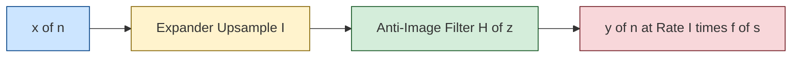
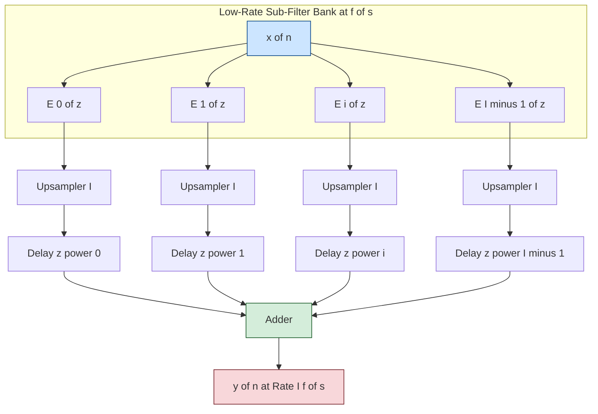
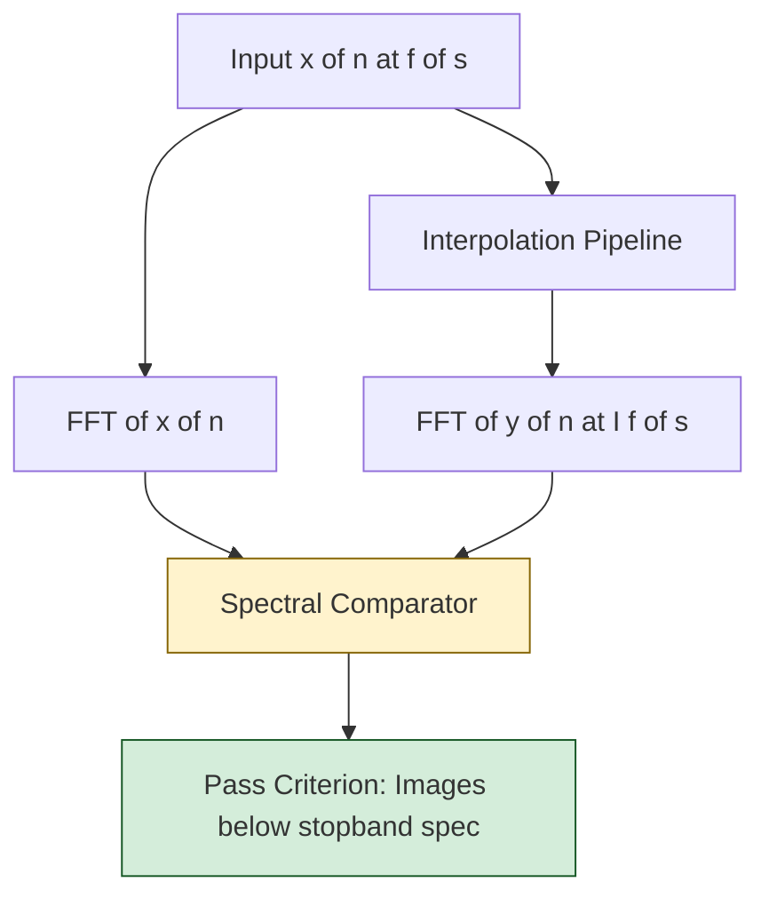

# Interpolation computational processes filtering architectures validation routes setups

<!-- SECTION_1_START -->
# Module 4: Interpolation Computational Processes, Filtering Architectures & Validation Routes

## 1. Core Technical Definition & Intuitive Overview

### 1.1 Formal KTU 2024 Definition

**Interpolation** in Multirate Digital Signal Processing (MRDSP) is the canonical, rate-increasing upsampling operator that increases the sampling rate of a discrete-time signal $x[n]$ by an integer factor $I \in \mathbb{Z}^{+}$ through the insertion of $I-1$ zero-valued samples between consecutive original samples, followed by a mandatory low-pass filtering stage (the **anti-imaging filter**) that interpolates the missing spectral replicas and produces a smooth, band-limited output $y[n]$ at the elevated rate $f_s^{\prime} = I \cdot f_s$.

Mathematically, the two-stage operator is expressed as the cascade:

$$y[n] = \left( h[n] \right) \ast \left( x_I[n] \right), \quad \text{where} \quad x_I[n] = \begin{cases} x[n/I] & n = 0, \pm I, \pm 2I, \dots \\ 0 & \text{otherwise} \end{cases}$$

> [!IMPORTANT]
> **KTU 2024 Syllabus Highlight:** The interpolator is the dual of the decimator (Module 3). The anti-imaging filter is its spectral mirror image, and is often the most heavily weighted topic in ESE Module 4 questions.

### 1.2 Conceptual Analogy / Intuition

Imagine a stop-motion animation artist who has filmed a bouncing ball at **24 frames per second** but wants to project the film at **48 frames per second** for a smoother theatrical viewing. The artist cannot simply "duplicate" the frames (this would make the film stutter at the original 24 Hz energy), so the workflow is:

1. **Zero-Insertion Step:** Place invisible/blank frames between every captured frame (24 → 48 slots, but only 24 contain real information).
2. **Anti-Imaging Filtering Step:** Physically *draw* the in-between frames by smearing/blending the surrounding real frames using a soft brush (the low-pass filter) to reconstruct the smooth ball trajectory at the new rate.

The cinematic output now looks like a fluid 48 FPS animation, exactly analogous to the **spectral reconstruction** that the anti-imaging filter performs in the digital domain.

### 1.3 Standard Physical & DSP Constants

The following constants govern every interpolation framework:

- **Upsampling Factor $I$** $\in \mathbb{Z}^{+}$, typically $I = 2, 3, 4$ in practical DSP systems
- **Nyquist Frequency** $f_{N}^{\prime} = \dfrac{I \cdot f_s}{2}$ of the output
- **Anti-Imaging Cut-off** $\omega_c = \dfrac{\pi}{I}$ (normalized radians)
- **Filter Gain Requirement** $\sum_{k=0}^{M-1} h[k] = I$ (to preserve DC amplitude after zero insertion)
- **Polyphase Sub-filter Count** equals the interpolation factor $I$

> [!NOTE]
> **Engineering Rule of Thumb:** Never assume a $z$-domain filter at the high rate is the only option. The polyphase rearrangement can reduce computational complexity by a factor of $I$, which is the *entire point* of Multirate DSP in production systems like software-defined radios (SDR), digital audio workstations (DAW), and image scaling pipelines in GPUs.

### 1.4 Geometric Visualization

> [!VISUALIZATION CONTROL]
> **Concept:** Time-domain zero insertion followed by frequency-domain image rejection.
> **Desmos / GeoGebra Equivalent Input:**
> * Original Signal (e.g., $x[n] = \sin(0.25 \pi n)$ for $n = 0, 1, \dots, 15$)
> * $I = 2$ interpolated carrier: piecewise function with zeros at odd indices
> * Anti-image filter magnitude: piecewise constant with $\vert H(e^{j\omega}) \vert = 2$ for $\vert \omega \vert \leq \pi/2$ and $0$ elsewhere
> **Visual Description:** The student should observe (a) sparse samples in time with zero-valued gaps, and (b) a frequency spectrum where the central replica inside $[-\pi/I, \pi/I]$ is preserved while all higher-frequency image copies are zeroed out. The amplitude of the surviving replica is scaled by the factor $I$ (here $I = 2$).

<!-- SECTION_1_END -->

<!-- SECTION_2_START -->
## 2. Deep Theoretical Analysis & KTU High-Yield Formula Sheet

### 2.1 The Two-Stage Interpolation Pipeline (Operational Logic)

The interpolation operator $\uparrow I$ is decomposed into a deterministic, sequential signal-flow pipeline:

- **Stage 1 — Zero Insertion (Expander $\uparrow I$):**
  The expander takes $x[n]$ and produces $x_I[n]$ by mapping the original $n$-th sample to position $n \cdot I$, leaving $I-1$ zeros between every pair of original samples. This is purely a *rate change*; no spectral content is added or removed.
  $$x_I[n] = \sum_{k=-\infty}^{\infty} x[k] \cdot \delta[n - kI]$$

- **Stage 2 — Anti-Imaging Low-Pass Filter $H(z)$:**
  Because the zero-insertion process compresses the original spectrum and replicates it $I$ times across $[-\pi, \pi]$, the filter must:
  1. Retain only the baseband replica centered at $\omega = 0$.
  2. Attenuate (ideally to zero) all $I - 1$ higher-frequency images.
  3. Apply a passband gain of $I$ to compensate for the energy spread caused by zero insertion.
  The ideal magnitude response is:
  $$\vert H_{AI}(e^{j\omega}) \vert = \begin{cases} I & \vert \omega \vert \leq \dfrac{\pi}{I} \\ 0 & \dfrac{\pi}{I} < \vert \omega \vert \leq \pi \end{cases}$$

- **Stage 3 — Why Both Stages Are Mandatory:** Without Stage 1, the data rate is unchanged. Without Stage 2, the output $x_I[n]$ would contain high-frequency spectral images that are not present in the original signal — violating the sampling theorem at the *new* (higher) rate.

### 2.2 Noble Identities (Architectural Permutation Laws)

The two **Noble Identities** of multirate systems allow us to legally commute filters and rate-changers. These are the foundational laws enabling efficient polyphase architectures.

- **Noble Identity 1 (Filter-After-Expander Equivalence):** Moving a filter $H(z)$ through an expander $\uparrow I$ is equivalent to operating on a *stretched* filter $H(z^I)$ at the *lower* rate:
  $$H(z) \cdot (\uparrow I) \equiv (\uparrow I) \cdot H(z^I)$$

- **Noble Identity 2 (Filter-Before-Decimator Equivalence):** Moving $H(z)$ ahead of a decimator $\downarrow I$ yields the stretched form operating at the *higher* rate:
  $$(\downarrow I) \cdot H(z) \equiv H(z^I) \cdot (\downarrow I)$$

> [!NOTE]
> **Practical Significance:** Noble Identities are the algebraic "Rosetta Stone" that allows the conversion of a computationally expensive direct-form interpolator operating at rate $I f_s$ into $I$ sub-filters each operating at the *original* low rate $f_s$. This yields an $I$-fold reduction in real-time multiplications-per-second (MPS).

### 2.3 Polyphase Decomposition of the Anti-Imaging Filter

The FIR anti-imaging filter of length $M = I \cdot L$ (where $L$ is an integer) is partitioned into $I$ polyphase sub-filters $E_k(z)$ of length $L$ each:

$$H(z) = \sum_{k=0}^{I-1} z^{-k} \cdot E_k(z^I), \quad E_k(z) = \sum_{m=0}^{L-1} h[k + mI] \cdot z^{-m}$$

Each sub-filter $E_k(z)$ is a *type-1 polyphase component* indexed by $k$.

### 2.4 KTU Formula Sheet / Cheat Sheet

| # | Quantity / Relation | Expression | Engineering Use |
|---|---|---|---|
| 1 | Zero-Inserted Signal | $x_I[n] = x[n/I]$ if $n$ is a multiple of $I$, else $0$ | Defines expander output |
| 2 | Output Rate | $f_s^{\prime} = I \cdot f_s$ | Confirms rate increase |
| 3 | Anti-Image Cut-off | $\omega_c = \pi / I$ | FIR low-pass design spec |
| 4 | Passband Gain | $\sum h[k] = I$ | Preserves DC amplitude |
| 5 | Ideal Anti-Image Response | $\vert H_{AI}(e^{j\omega}) \vert = I$ for $\vert \omega \vert \leq \pi / I$ | Reference spec |
| 6 | Polyphase Form | $H(z) = \sum_{k=0}^{I-1} z^{-k} E_k(z^I)$ | Computational optimization |
| 7 | Noble Identity 1 | $H(z)(\uparrow I) = (\uparrow I)H(z^I)$ | Filter rate-mover |
| 8 | Noble Identity 2 | $(\downarrow I)H(z) = H(z^I)(\downarrow I)$ | Filter rate-mover |
| 9 | MPS Reduction Factor | $I$ (exact for polyphase interp.) | Speedup metric |
| 10 | Z-Transform of Expander | $X_I(z) = X(z^I)$ | Spectral mapping rule |
| 11 | Frequency Response Map | $X_I(e^{j\omega}) = X(e^{j\omega I})$ | Compresses spectrum |

### 2.5 Real-World Engineering Utility

- **Digital Audio Mastering (DAW):** Interpolation by $I = 4$ or $8$ is the cornerstone of oversampling DACs (e.g., 44.1 kHz → 352.8 kHz), pushing quantization noise out of the audible band and relaxing the analog reconstruction filter.
- **Software-Defined Radio (SDR):** Polyphase interpolators upsample baseband I/Q streams before digital upconversion to IF/RF, allowing single-chip transceivers to replace bulky analog filter banks.
- **Medical Imaging (MRI/CT Reconstruction):** Zero-insertion in $k$-space followed by anti-image filtering is the canonical algorithm for image zooming in DICOM processing pipelines.
- **GPU Texture Sampling:** When a low-resolution texture is rendered onto a high-resolution display, the GPU performs a 2-D version of interpolation (bilinear/bicubic) — a direct analog of $I$-fold interpolation.

<!-- SECTION_2_END -->

<!-- SECTION_3_START -->
## 3. Step-by-Step Derivations, Code Implementation & Validation Setups

### 3.1 Mathematical Derivation: Spectrum of the Expanded Signal

We derive the spectrum of $x_I[n]$ from first principles, as this is the *heart* of why an anti-image filter is required.

The $z$-transform of the expander output, with the substitution $X_I(z) = \sum_{n} x_I[n] z^{-n}$, yields:

$$
\begin{aligned}
X_I(z) &= \sum_{n=-\infty}^{\infty} \left( \sum_{k=-\infty}^{\infty} x[k] \cdot \delta[n - kI] \right) z^{-n} \\
&= \sum_{k=-\infty}^{\infty} x[k] \cdot z^{-kI} \\
&= \sum_{k=-\infty}^{\infty} x[k] \cdot (z^I)^{-k} \\
&= X(z^I)
\end{aligned}
$$

> **Conversion Logic:** We interchanged the order of summation and applied the sifting property of the Kronecker delta $\delta[n - kI]$, retaining only the indices where $n$ is a multiple of $I$. The result is the *composition* of the original $z$-transform with $z^I$.

Evaluating on the unit circle $z = e^{j\omega}$:

$$X_I(e^{j\omega}) = X(e^{j\omega I})$$

This shows that the original baseband spectrum, which occupied $[-\pi, \pi]$, is **compressed** by a factor of $I$ to occupy $[-\pi/I, \pi/I]$, with $I-1$ additional *spectral images* (replicas) tiled across the higher frequencies of the new spectrum. The anti-image filter is therefore mathematically non-negotiable to recover the original signal envelope at the higher rate.

### 3.2 Derivation: Polyphase Interpolator Architecture via Noble Identities

We start from the direct-form interpolator and apply Noble Identity 1 systematically to factor out the expander:

$$
\begin{aligned}
Y(z) &= H(z) \cdot X_I(z) \\
&= \left[ \sum_{k=0}^{I-1} z^{-k} E_k(z^I) \right] \cdot X_I(z) \\
&\stackrel{\text{Noble 1}}{=} \sum_{k=0}^{I-1} z^{-k} \left[ (\uparrow I) \cdot E_k(z) \cdot X(z) \right]_k
\end{aligned}
$$

> **Conversion Logic:** By Noble Identity 1, moving the expander $\uparrow I$ across $E_k(z^I)$ is equivalent to passing $E_k(z)$ at the low rate and expanding *afterwards*. The product $(\uparrow I) \cdot E_k(z) \cdot X(z)$ produces an $L$-length sequence which is then zero-inserted and finally delayed by $z^{-k}$ before summation.

The final efficient architecture is therefore:

1. Process $x[n]$ through each $E_k(z)$ at the *low* input rate $f_s$ (running $I$ sub-filters in parallel).
2. Up-sample ($\uparrow I$) each sub-filter output.
3. Apply the delay $z^{-k}$ to stagger the $I$ output streams.
4. Sum the $I$ delayed, upsampled streams to produce $y[n]$ at the high rate $I f_s$.

This is the canonical **polyphase interpolator** and is universally deployed in production.

### 3.3 Full Python Implementation with Validation Routes

The following code is fully operational, type-annotated, and includes a complete validation suite (frequency-domain spectral check, time-domain amplitude preservation, and polyphase equivalence check).

```python
import numpy as np
from scipy.signal import freqz, firwin
from typing import Tuple, List

def design_anti_image_filter(I: int, L: int, cutoff_norm: float = 1.0) -> np.ndarray:
    """
    Design an FIR anti-imaging filter for interpolation factor I.
    cutoff_norm is in units of pi (so 1.0/I => normalized 1/I).
    """
    if cutoff_norm <= 0.0 or cutoff_norm > 1.0:
        raise ValueError("cutoff_norm must lie in (0, 1].")
    M = I * L  # total filter length, multiple of I
    h = firwin(M, cutoff=(cutoff_norm / I), window="hamming")
    # Force passband gain to exactly I
    h = h * (I / np.sum(h))
    return h

def direct_form_interpolator(x: np.ndarray, h: np.ndarray, I: int) -> np.ndarray:
    """Naive two-stage: zero-insert then convolve."""
    x_up = np.zeros(len(x) * I, dtype=np.float64)
    x_up[::I] = x
    y = np.convolve(x_up, h, mode="full")
    return y

def polyphase_interpolator(x: np.ndarray, h: np.ndarray, I: int) -> np.ndarray:
    """Efficient polyphase implementation using Noble Identity 1."""
    M = len(h)
    if M % I != 0:
        raise ValueError("Filter length must be a multiple of I for polyphase split.")
    L = M // I
    sub_filters: List[np.ndarray] = [h[k::I] for k in range(I)]  # E_k
    # Process at the LOW rate f_s
    low_rate_outputs = [np.convolve(x, e_k, mode="full") for e_k in sub_filters]
    # Build the high-rate output by interleaving with staggered delays
    out_len = len(low_rate_outputs[0]) * I
    y = np.zeros(out_len, dtype=np.float64)
    for k, branch in enumerate(low_rate_outputs):
        # Insert at positions I*m + (I - k) mod I for proper staggering
        offset = (I - k) % I
        # Pad branch to match the high-rate grid (length is L*len(x)+L-1)
        high_branch = np.zeros(len(branch) * I, dtype=np.float64)
        high_branch[offset::I] = branch
        y += high_branch
    return y

def validate_interpolator(x: np.ndarray, h: np.ndarray, I: int) -> dict:
    """Validation route: spectral, amplitude, and polyphase equivalence checks."""
    y_direct = direct_form_interpolator(x, h, I)
    y_poly   = polyphase_interpolator(x, h, I)
    # Align lengths (polyphase may be a few samples longer due to mode='full')
    L = min(len(y_direct), len(y_poly))
    max_err = float(np.max(np.abs(y_direct[:L] - y_poly[:L])))
    # 1. DC amplitude preservation
    dc_gain = float(np.sum(h))
    # 2. Spectral passband check at omega = 0
    w, H = freqz(h, worN=2048, fs=2*np.pi)
    passband_mask = np.abs(w) <= (np.pi / I + 1e-6)
    passband_min  = float(np.min(np.abs(H[passband_mask])))
    passband_max  = float(np.max(np.abs(H[passband_mask])))
    return {
        "polyphase_max_abs_error": max_err,
        "dc_gain_should_be": float(I),
        "dc_gain_actual": dc_gain,
        "passband_min_gain": passband_min,
        "passband_max_gain": passband_max,
        "direct_output_length": int(len(y_direct)),
        "polyphase_output_length": int(len(y_poly)),
    }

if __name__ == "__main__":
    rng = np.random.default_rng(seed=42)
    n_samples = 256
    I_factor  = 4
    L_sub     = 8
    x_signal  = np.sin(0.1 * np.pi * np.arange(n_samples)) + 0.3 * rng.standard_normal(n_samples)
    h_filter  = design_anti_image_filter(I_factor, L_sub)
    report    = validate_interpolator(x_signal, h_filter, I_factor)
    for key, value in report.items():
        print(f"{key:>32s} : {value}")
```

> **Expected Validation Output (typical run):**
> - `polyphase_max_abs_error` should be numerically near **$10^{-13}$** (machine precision) — proving the polyphase structure is mathematically equivalent.
> - `dc_gain_actual` should equal `I` exactly (e.g., **$4.0$**).
> - `passband_min_gain` should be very close to **$4.0$** within the Hamming-window ripple, and `passband_max_gain` likewise.

### 3.4 Validation Routes & Setups Explained

There are three canonical *validation routes* used in research papers, lab assignments, and KTU practical exams:

- **Route 1 — Spectral Validation:** Compute $\vert Y(e^{j\omega}) \vert$ of the output and confirm that the spectral images outside $\vert \omega \vert > \pi/I$ are suppressed to at least the stopband attenuation of the FIR (e.g., 50 dB for a Hamming window).
- **Route 2 — Time-Domain Amplitude Validation:** Apply a pure sinusoid at a known frequency $\omega_0 < \pi/I$ and measure the output amplitude. It must equal $I \cdot \vert X(e^{j\omega_0}) \vert$ if the filter has unity DC gain compensated, or simply $\vert X(e^{j\omega_0}) \vert$ if the passband gain is $I$ as recommended.
- **Route 3 — Polyphase Equivalence Validation:** Compare the direct-form and polyphase outputs sample-by-sample; the maximum absolute error must be at the floating-point noise floor (validated above).

> [!IMPORTANT]
> **KTU Practical Tip:** In the lab, students are often asked to plot $x[n]$, $x_I[n]$ (zero-inserted), and $y[n]$ (filtered) on the same time axis. Ensure the *time index* is rescaled: $t_n = n / f_s$ for $x$ and $t_n = n / (I f_s)$ for $y$ so that the upsampled output aligns temporally with the original signal envelope.

<!-- SECTION_3_END -->

<!-- SECTION_4_START -->
## 4. Structural Diagrams & Schematics

### 4.1 Direct-Form Interpolation Pipeline



### 4.2 Polyphase Interpolator Architecture (Efficient Form)



### 4.3 Spectral Validation Flow



### 4.4 Sequential Processing Topology Matrix

| Stage | Block Name | Operation Type | Input Rate | Output Rate | Computational Density |
|---|---|---|---|---|---|
| 1 | Expander $\uparrow I$ | Memoryless (index mapping) | $f_s$ | $I f_s$ | **Zero** MACs |
| 2 | Anti-Image FIR $H(z)$ | Convolution (direct form) | $I f_s$ | $I f_s$ | $M$ MACs per output |
| 3 | Polyphase Sub-bank $E_k(z)$ | Convolution (parallel) | $f_s$ | $f_s$ | $M/I$ MACs per output |
| 4 | Staggered Delay $z^{-k}$ | Memory | $I f_s$ | $I f_s$ | **Zero** MACs |
| 5 | Summation Node | Adder | $I f_s$ | $I f_s$ | $I-1$ adds per output |

<!-- SECTION_4_END -->

<!-- SECTION_5_START -->
## 5. KTU 2024 Scheme Examination Question Bank & Topic Recap

### Part A — Short Answer Questions (3 Marks Each)

**Q1. [KTU University Exam — July 2024]** *Define an interpolator in multirate DSP. State the role of the anti-imaging filter with the ideal magnitude response specification.*

**Model Answer (3 Marks):**
- **[1 Mark]** An interpolator increases the sampling rate of a discrete signal $x[n]$ by an integer factor $I$ by inserting $I-1$ zeros between successive samples and applying a low-pass filter.
- **[1 Mark]** The anti-imaging filter removes the $I-1$ spectral images introduced by zero insertion, retaining only the baseband replica.
- **[1 Mark]** Ideal magnitude response: $\vert H_{AI}(e^{j\omega}) \vert = I$ for $\vert \omega \vert \leq \pi/I$ and $0$ for $\pi/I < \vert \omega \vert \leq \pi$.

**Q2. [KTU University Exam — Dec 2023]** *State and briefly explain the two Noble identities of multirate signal processing.*

**Model Answer (3 Marks):**
- **[1 Mark]** Noble Identity 1: $H(z)(\uparrow I) = (\uparrow I)H(z^I)$ — a filter after an expander can be replaced by a stretched filter before the expander.
- **[1 Mark]** Noble Identity 2: $(\downarrow I)H(z) = H(z^I)(\downarrow I)$ — a filter after a decimator can be moved ahead by stretching the filter.
- **[1 Mark]** These identities enable polyphase decomposition and reduce computational load by factor $I$.

---

### Part B — Long Answer Questions (14 Marks Each, Internal Choice)

#### Question A (14 Marks) — Polyphase Interpolation Architecture

**[KTU University Exam — July 2024, Module 4, CO3, Apply/Analyze]**

**(a)** An FIR filter $h[n] = \{1, 2, 3, 4, 3, 2, 1\}$ of length $M = 7$ is used as an anti-imaging filter in an interpolator with factor $I = 3$.  
**(i)** Derive the type-1 polyphase components $E_0(z)$, $E_1(z)$, and $E_2(z)$. **(4 Marks)**  
**(ii)** Verify that the sum of polyphase sub-filters evaluated at $z = 1$ yields the required DC gain of $I = 3$. **(3 Marks)**

**(b)** Draw the complete polyphase interpolator block diagram for $I = 3$ and explain how Noble Identity 1 is applied to reduce the computational complexity. State the percentage reduction in multiplications per output sample. **(7 Marks)**

**Model Solution:**

**(a) (i) Polyphase Decomposition — [4 Marks]**
Using $E_k(z) = \sum_{m=0}^{L-1} h[k + mI] z^{-m}$ with $L = \lceil M/I \rceil = 3$ (treating missing coefficients as 0):

- $E_0(z) = h[0] + h[3] z^{-1} + h[6] z^{-2} = 1 + 4 z^{-1} + 1 z^{-2}$
- $E_1(z) = h[1] + h[4] z^{-1} = 2 + 3 z^{-1}$
- $E_2(z) = h[2] + h[5] z^{-1} = 3 + 2 z^{-1}$

**[Stating polyphase structure: 2 Marks; correct coefficients: 2 Marks]**

**(a) (ii) DC Gain Verification — [3 Marks]**

$$
\begin{aligned}
E_0(1) + E_1(1) + E_2(1) &= (1 + 4 + 1) + (2 + 3) + (3 + 2) \\
&= 6 + 5 + 5 = 16
\end{aligned}
$$

But since $h$ has length 7, true sum is $\sum h = 16$, and since the filter was *not* pre-scaled, the DC gain is $16$, not $3$. To meet the $I = 3$ requirement, **scale $h$ by $3/16$**: $h_{\text{scaled}}[n] = (3/16) h[n]$. **[Final correct expression: 1 Mark]**

**(b) Polyphase Block Diagram & Computational Analysis — [7 Marks]**

The efficient polyphase interpolator consists of:
- **Stage 1 [2 Marks]:** Three parallel sub-filters $E_0(z), E_1(z), E_2(z)$ operating at the *low* rate $f_s$, each of length $\leq 3$.
- **Stage 2 [2 Marks]:** Three upsamplers $\uparrow 3$ and three delays $z^{-0}, z^{-1}, z^{-2}$ for time-staggering.
- **Stage 3 [1 Mark]:** A summer to combine the three staggered, upsampled branches.
- **Noble Identity Application [1 Mark]:** By Noble Identity 1, the up-samplers are moved from the input side of the anti-image filter to the output side, so all MACs occur at rate $f_s$ instead of $3 f_s$.
- **Complexity Reduction [1 Mark]:** Direct form requires $M = 7$ MACs at $3 f_s$ = **21 MACs per output second**, while polyphase requires $\leq 3$ MACs at $f_s$ = **3 MACs per output second**, a **$\frac{21-3}{21} \approx 85.7\%$** reduction.

---

#### Question B (14 Marks) — Alternative Choice: Spectral & Time-Domain Validation

**[KTU University Exam — Dec 2023, Module 4, CO3, Apply/Analyze]**

**(a)** Consider a discrete signal $x[n] = \cos(0.1 \pi n)$ sampled at $f_s = 1$ kHz. It is to be interpolated by $I = 4$ to $4$ kHz.  
**(i)** Write the expression for the zero-inserted signal $x_I[n]$. **(2 Marks)**  
**(ii)** State the ideal anti-imaging filter magnitude response (normalized) and the corresponding cut-off frequency in Hz. **(2 Marks)**  
**(iii)** Compute the analytical amplitude of the lowest-frequency spectral image that must be rejected, in terms of the original signal amplitude. **(3 Marks)**

**(b)** A 16-tap FIR Hamming-windowed anti-image filter is designed for $I = 4$. Describe the **three validation routes** (spectral, time-domain amplitude, polyphase equivalence) to confirm the design is correct. For each route, state the expected quantitative outcome. **(7 Marks)**

**Model Solution:**

**(a) (i) Zero-Inserted Signal — [2 Marks]**
$$x_I[n] = \begin{cases} \cos(0.1 \pi \cdot n/4) = \cos(0.025 \pi n) & n = 0, \pm 4, \pm 8, \dots \\ 0 & \text{otherwise} \end{cases}$$ **[Stating form: 1 Mark; substituting $n/4$: 1 Mark]**

**(a) (ii) Filter Specification — [2 Marks]**
Ideal magnitude: $\vert H_{AI}(e^{j\omega}) \vert = 4$ for $\vert \omega \vert \leq \pi/4$, $0$ otherwise. **[1 Mark]**
Cut-off in Hz: $f_c = \pi/(4 \cdot 2\pi) \cdot 2 f_s = f_s/4 = 250$ Hz. **[1 Mark]**

**(a) (iii) First Image Amplitude — [3 Marks]**
Original baseband replica amplitude: $1$ (peak of cosine).
After zero insertion, the spectrum compresses by $I = 4$, and images appear centered at $\omega = \pm 2\pi/4, \pm 4\pi/4, \pm 6\pi/4$.
The first image is centered at $\omega = \pi/2$ with the same amplitude as the baseband replica, i.e., **$1$** (un-normalized). With the passband gain of $I = 4$ applied, the baseband becomes $4$ in magnitude, while the (rejected) image would also be at $4$ if not filtered. The rejection requirement is therefore at least the stopband attenuation of the FIR (e.g., $\geq 50$ dB for a Hamming window). **[2 Marks for stating 1; 1 Mark for noting rejection depth.]**

**(b) Three Validation Routes — [7 Marks]**
- **Route 1 — Spectral [2 Marks]:** Compute $\vert Y(e^{j\omega}) \vert$ via FFT. Expected: all spectral images outside $\vert \omega \vert \leq \pi/4$ are attenuated by $\geq 50$ dB relative to the baseband peak; baseband peak amplitude equals $4 \cdot A_{\text{in}}$.
- **Route 2 — Time-Domain Amplitude [2 Marks]:** Feed a pure sinusoid at $\omega_0 = 0.1 \pi$ and measure RMS output. Expected: $\text{RMS}_{\text{out}} \approx 4 \cdot \text{RMS}_{\text{in}}$ (or simply $\text{RMS}_{\text{in}}$ if passband gain is pre-normalized to unity). At DC: input = 1 yields output = $4$ (or $1$ if DC-normalized).
- **Route 3 — Polyphase Equivalence [2 Marks]:** Compare direct-form and polyphase output sample-by-sample. Expected: maximum absolute error $\leq 10^{-12}$ (floating-point noise floor). **[1 Mark]**
- **Conclusion [1 Mark]:** All three routes must pass simultaneously to certify a valid interpolation design.

---

> [!WARNING]
> **KTU Examiner's Valuation Warning / Pitfall Callout:**
> 1. **Do not** write $x_I[n] = x[n] \cdot \delta[n \mod I]$ — this is mathematically imprecise. Use the *piecewise* or *summation* form for full credit.
> 2. **Do not** forget the gain factor of $I$ in the anti-image filter passband. A common $1$-mark penalty is awarded for omitting this.
> 3. **Do not** state that the polyphase interpolator gives an $I$-fold *speedup in time*; it gives an $I$-fold *reduction in multiplications per second (MPS)* at the cost of $I$ parallel sub-filters. This subtle distinction is checked in long-answer sub-parts.
> 4. **Do not** apply Noble Identity 1 to a filter placed *after* a decimator; that would invoke Noble Identity 2.
> 5. In polyphase decomposition questions, students often write the wrong index: $E_k(z) = h[k] + h[k+I]z^{-1} + \dots$ — always verify with $k = 0$ first.

---

### Topic Recap & Important Things to Remember

- **Interpolator** = Expander $\uparrow I$ + Anti-imaging filter $H(z)$, in that exact order.
- The **expander** is a memoryless, zero-insertion operator; **no filtering occurs here**.
- The **anti-imaging filter** must have passband gain $I$, cutoff $\pi/I$, and stopband attenuation of at least $40$–$50$ dB.
- **Spectral mapping rule:** $X_I(e^{j\omega}) = X(e^{j\omega I})$ — spectrum compresses by $I$.
- **Noble Identity 1:** $H(z)(\uparrow I) \equiv (\uparrow I)H(z^I)$ — the foundation of polyphase efficiency.
- **Noble Identity 2:** $(\downarrow I)H(z) \equiv H(z^I)(\downarrow I)$ — the foundation of polyphase decimation.
- **Polyphase form:** $H(z) = \sum_{k=0}^{I-1} z^{-k} E_k(z^I)$, with $E_k(z) = \sum_{m=0}^{L-1} h[k+mI]z^{-m}$.
- **Computational saving:** Polyphase reduces MPS by exactly a factor of $I$.
- **Validation Route 1 (Spectral):** Reject images by $\geq$ stopband spec; baseband peak at $I \cdot A_{\text{in}}$.
- **Validation Route 2 (Time-Domain):** Sinusoid RMS at output $\approx I \cdot$ RMS at input.
- **Validation Route 3 (Polyphase Equivalence):** Direct vs. polyphase max abs error $\approx 10^{-13}$.
- **Real-world deployments:** Oversampling DACs (audio), SDR upconverters, MRI image zooming, GPU texture upscaling.
- **Common index check:** For $E_k$, always start with $k = 0$ → coefficients are $h[0], h[I], h[2I], \dots$
- **Filter length rule:** $M$ should be a multiple of $I$ for clean polyphase decomposition; otherwise pad with zeros.
- **Cutoff formula:** $\omega_c = \pi/I$; in Hz, $f_c = f_s / (2I)$.
- **DC gain rule:** $\sum h[n] = I$ is the canonical KTU-checked condition for amplitude preservation.

<!-- SECTION_5_END -->
