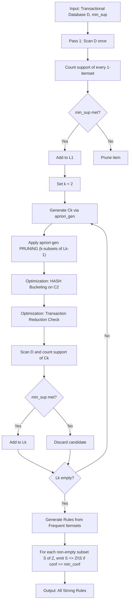
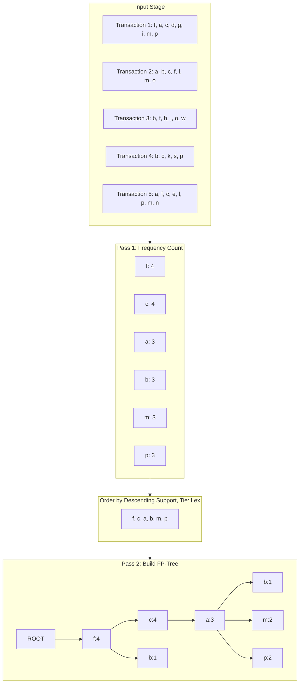
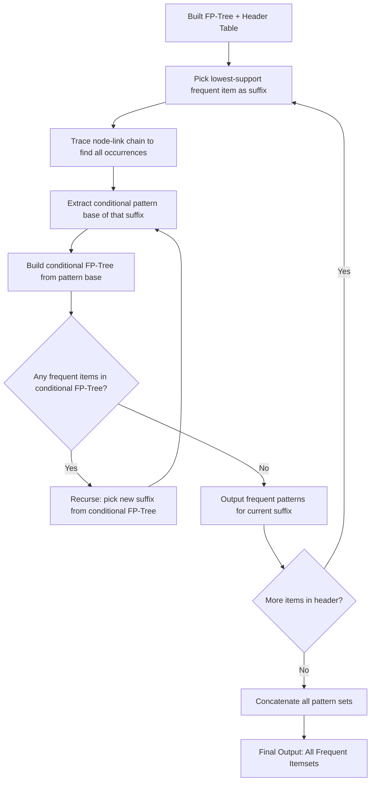
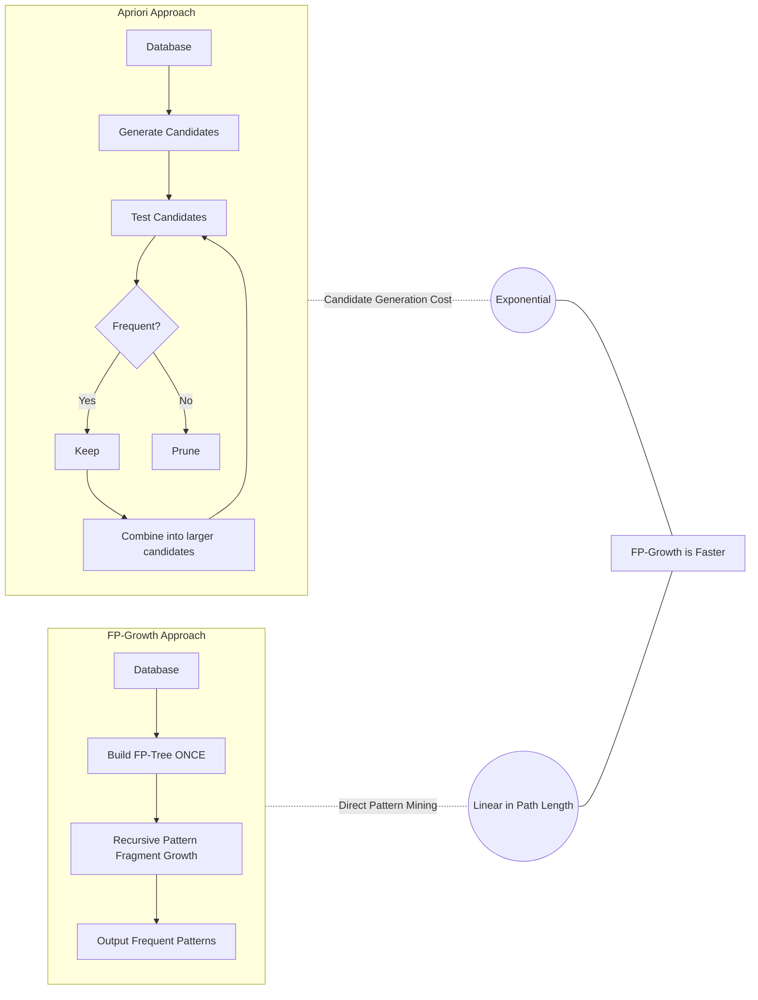

# Association rule discovery: Apriori algorithm optimizations, FP-Growth computational matrix models

<!-- SECTION_1_START -->

# Association Rule Discovery: Apriori Optimizations & FP-Growth Models

> [!NOTE]
> **KTU 2024 Scheme — PECST504 | Module 1 | KTU High-Yield Topic**
> Association mining is a **frequent-pattern** discovery technique that underpins recommendation engines, market-basket analytics, and bioinformatics. This topic is heavily weighted in Part B (14-mark) questions and frequently tested as a full numerical question in the KTU ESE.

---

## 1.1 Formal Definition (KTU Syllabus Terminology)

**Association Rule Mining** is an unsupervised data mining technique that identifies strong, interesting, and previously unknown patterns (rules) of the form $X \Rightarrow Y$ where $X$ and $Y$ are disjoint itemsets ($X \cap Y = \emptyset$). The strength of every rule is quantified using the three canonical metrics: **support**, **confidence**, and **lift**.

> [!IMPORTANT]
> **Core Triad of Metrics (Must Memorize):**
> - **Support, $s(X \Rightarrow Y)$** = Frequency of the rule in the database. Measures statistical significance.
> - **Confidence, $c(X \Rightarrow Y)$** = Strength of implication. Measures reliability.
> - **Lift, $\text{lift}(X \Rightarrow Y)$** = Correlation between antecedent and consequent. Measures interest.

---

## 1.2 The Apriori Algorithm — Intuitive Analogy

Imagine you are a librarian trying to find which **pairs of book genres** are most often borrowed together. A naïve approach would scan *every possible pairing* of genres — an explosive combinatorial problem. The **Apriori algorithm** (Agrawal & Srikant, 1994) solves this by exploiting a single elegant principle:

> *"If a set of items is infrequent, then any superset containing it will also be infrequent."*

This is the **Apriori Property (Anti-monotonicity)**. It is mathematically equivalent to saying: if a candidate set fails the minimum support threshold, **all of its supersets can be pruned** without further checking — analogous to cutting a branch and knowing every twig on it is dead.

## 1.3 The FP-Growth Algorithm — Intuitive Analogy

The Apriori approach still generates and tests an enormous number of candidate itemsets. The **FP-Growth (Frequent Pattern Growth)** algorithm, proposed by Han, Pei, and Yin (2000), instead **compresses the entire transactional database into a compact prefix-tree structure called an FP-Tree**, and then grows patterns *directly* on this compressed representation — **without generating any candidates**.

> **Analogy:** Apriori is like reading a phone book by flipping through every page, while FP-Growth is like indexing the phone book alphabetically so you jump directly to the names you need.

---

## 1.4 Standard Transactional Dataset Notation

Let a transactional database $D$ contain $N$ transactions. Each transaction $T_i$ is a subset of the universal item universe $I = \{i_1, i_2, \ldots, i_m\}$.

| Symbol | Meaning | Typical Value |
|---|---|---|
| $N$ | Total number of transactions | $10^4$ to $10^9$ |
| $m$ | Number of distinct items | $10^2$ to $10^6$ |
| $X$ | An itemset (set of items) | $\{ \text{Bread}, \text{Butter} \}$ |
| $k\text{-itemset}$ | An itemset of size $k$ | $1, 2, 3, \ldots$ |
| $f(X)$ | Frequency (count) of itemset $X$ | integer |
| $\sigma(X)$ | Absolute support count of $X$ | integer |
| $s(X)$ | Relative support of $X$ | fraction in $[0,1]$ |
| $T_i$ | The $i$-th transaction | set of items |
| $min\_sup$ | Minimum support threshold | $0.01$ to $0.5$ |
| $min\_conf$ | Minimum confidence threshold | $0.5$ to $0.9$ |

> [!VISUALIZATION CONTROL]
> **Concept:** Support–Confidence Decision Boundary for Association Rule Discovery
> **Plot Logic:** A 2-D plane where the x-axis = support, y-axis = confidence. A point $(s, c)$ falls inside the "interesting region" (lower-right rectangle) if and only if $s \geq min\_sup$ **AND** $c \geq min\_conf$.
> **Visual Description:** The rectangle anchored at $(min\_sup, min\_conf)$ and extending to $(1, 1)$ contains all "strong" rules. Rules outside this region are discarded.

---

<!-- SECTION_1_END -->

<!-- SECTION_2_START -->

# Deep Theoretical Analysis & KTU Formula Sheet

## 2.1 The Three Pillars of Rule Quality

For a rule $X \Rightarrow Y$ where $X$ and $Y$ are disjoint itemsets ($X \cap Y = \emptyset$):

$$
s(X \Rightarrow Y) = \frac{\sigma(X \cup Y)}{N}
$$

$$
c(X \Rightarrow Y) = \frac{\sigma(X \cup Y)}{\sigma(X)} = \frac{s(X \cup Y)}{s(X)}
$$

$$
\text{lift}(X \Rightarrow Y) = \frac{c(X \Rightarrow Y)}{s(Y)} = \frac{s(X \cup Y)}{s(X) \cdot s(Y)}
$$

> [!IMPORTANT]
> **Lift Interpretation Rule (Board-Exam Favorite):**
> - $\text{lift} > 1$ : Positive correlation (X **positively** implies Y).
> - $\text{lift} = 1$ : Statistical independence (no useful rule).
> - $\text{lift} < 1$ : Negative correlation (X implies **NOT** Y).

---

## 2.2 The Downward Closure (Apriori) Property

This is the *theoretical cornerstone* of all Apriori-family algorithms. Formally:

$$
\forall Y \subseteq X : s(Y) \geq s(X)
$$

**Proof intuition:** Since every transaction that contains $X$ must also contain all of its subsets $Y$, the count of $Y$ can never be less than the count of $X$. Equivalently, **support monotonically decreases (or stays equal) as we add items to an itemset**.

---

## 2.3 Apriori Algorithm — Operational Pipeline

**Step 1 (Initialization):** Set $k = 1$ and find the set of all frequent 1-itemsets $L_1$ by scanning $D$ once.

**Step 2 (Candidate Generation):** Generate the candidate set $C_{k+1}$ from $L_k$ using the **apriori-gen** join:
- Self-join: $L_k \bowtie L_k$ on the first $k-1$ items.
- Prune: delete any $(k+1)$-candidate whose any $k$-subset is not in $L_k$.

**Step 3 (Counting & Pruning):** Scan $D$, count support of every candidate in $C_{k+1}$, and retain only those meeting $min\_sup$ to form $L_{k+1}$.

**Step 4 (Termination):** Stop when $L_{k+1} = \emptyset$.

**Step 5 (Rule Generation):** For every frequent itemset $Z$, enumerate all non-empty proper subsets $S \subset Z$ and emit the rule $S \Rightarrow (Z \setminus S)$ if and only if $c(S \Rightarrow Z \setminus S) \geq min\_conf$.

---

## 2.4 Apriori Optimizations (KTU High-Yield Section)

| # | Optimization | Core Idea | Bottleneck Eliminated |
|---|---|---|---|
| 1 | **Hash-Based Counting ($DHP$)** | Bucket $C_2$ candidates into a hash table; small buckets cannot reach $min\_sup$ | Reduces size of $C_2$ |
| 2 | **Transaction Reduction** | Discard transactions that no longer contain any frequent $k$-itemset | Reduces scan cost |
| 3 | **Partitioning (Savasere et al.)** | Divide $D$ into $n$ partitions; any globally frequent itemset must be locally frequent in *at least one* partition | Two database scans total |
| 4 | **Dynamic Itemset Counting (DIC)** | Begin counting candidates *before* the previous pass is complete; use multiple data segments | Fewer database scans |
| 5 | **Sampling (Toivonen)** | Mine a random sample of $D$ at lowered threshold; verify against full $D$ once | One full scan in most cases |
| 6 | **FP-Growth (the ultimate opt.)** | Compress $D$ into an FP-Tree, mine without candidates | Eliminates candidate generation entirely |

---

## 2.5 FP-Growth — Conceptual Model

The FP-Growth algorithm is governed by three structural components:

1. **FP-Tree (Frequent Pattern Tree)** — a compact, prefix-compressed representation of $D$. Each node stores: item-name, support-count, parent-link, child-links, and a node-link.

2. **Header Table (or Item Pointer Table)** — a global table indexed by frequent item $a$ containing:
   - Total support count of $a$.
   - A head pointer to the first node in the FP-Tree carrying $a$.
   - Each node carries a **node-link** to the next node with the same item (forming a *node-link chain*).

3. **Conditional Pattern Base & Conditional FP-Tree** — for a chosen suffix pattern (e.g., item $e$), the conditional pattern base is the multiset of prefix paths leading to $e$. Recursively mining this conditional FP-Tree produces all frequent patterns ending in $e$.

---

## 2.6 KTU Formula Cheat Sheet

| Formula | Expression | Used For |
|---|---|---|
| Relative support | $s(X) = \sigma(X) / N$ | Filtering itemsets |
| Confidence | $c(X \Rightarrow Y) = s(X \cup Y) / s(X)$ | Filtering rules |
| Lift | $\text{lift}(X \Rightarrow Y) = s(X \cup Y) / (s(X) \cdot s(Y))$ | Detecting correlation |
| Leverage | $\text{lev}(X \Rightarrow Y) = s(X \cup Y) - s(X) \cdot s(Y)$ | Alternate correlation metric |
| Conviction | $\text{conv}(X \Rightarrow Y) = \frac{1 - s(Y)}{1 - c(X \Rightarrow Y)}$ | Directional implication |
| Apriori bound | $C_k \subseteq \{(k-1)\text{-supersets of } L_{k-1}\}$ | Candidate space |
| Itemset lattice size | $\sum_{k=1}^{m} \binom{m}{k} = 2^m - 1$ | Worst-case search space |

> [!NOTE]
> **Where this is used in production:**
> - **Retail:** Amazon, Flipkart, Walmart recommendation engines.
> - **Bioinformatics:** Co-expression gene pattern mining.
> - **Web Usage Mining:** Clickstream sequence rule extraction.
> - **Telecom:** Cross-selling product bundles.

---

<!-- SECTION_2_END -->

<!-- SECTION_3_START -->

# Step-by-Step Derivations & Code Implementation

## 3.1 Worked Example — Confidence & Lift Derivation

Let the transactional database $D$ contain $N = 5$ transactions. Compute the confidence and lift of the rule $\{\text{Bread}\} \Rightarrow \{\text{Butter}\}$.

| TID | Items Bought |
|---|---|
| T1 | Bread, Butter, Milk |
| T2 | Beer, Bread, Butter |
| T3 | Beer, Butter |
| T4 | Bread, Milk |
| T5 | Bread, Butter, Milk |

**Step 1 — Compute $\sigma(\{\text{Bread}\})$:**

T1, T2, T4, T5 contain Bread. So $\sigma(\{\text{Bread}\}) = 4$.

**Step 2 — Compute $\sigma(\{\text{Bread}, \text{Butter}\})$:**

T1, T2, T5 contain both. So $\sigma(\{\text{Bread}, \text{Butter}\}) = 3$.

**Step 3 — Compute $\sigma(\{\text{Butter}\})$:**

T1, T2, T3, T5 contain Butter. So $\sigma(\{\text{Butter}\}) = 4$.

**Step 4 — Compute confidence:**

$$
c(\text{Bread} \Rightarrow \text{Butter}) = \frac{\sigma(\{\text{Bread}, \text{Butter}\})}{\sigma(\{\text{Bread}\})} = \frac{3}{4} = 0.75
$$

**Step 5 — Compute support of the consequent:**

$$
s(\{\text{Butter}\}) = \frac{4}{5} = 0.80
$$

**Step 6 — Compute lift:**

$$
\text{lift}(\text{Bread} \Rightarrow \text{Butter}) = \frac{0.75}{0.80} = 0.9375
$$

**Step 7 — Interpret:**

$$
\begin{aligned}
\text{Since } \text{lift} < 1 &\Rightarrow \text{Bread and Butter are negatively correlated in this sample.} \\
&\Rightarrow \text{The rule is NOT statistically interesting (despite the 75% confidence).}
\end{aligned}
$$

> [!IMPORTANT]
> **Board-Exam Trap:** Many students report only the confidence value (75%) and mark the rule as "strong." The lift value reveals the truth. **Always quote all three metrics.**

---

## 3.2 Full Operational Python Implementation — Apriori Algorithm

```python
"""
Apriori Algorithm — Reference Implementation
Course: Data Mining (PECST504), KTU 2024 Scheme
"""

from itertools import combinations
from typing import Dict, FrozenSet, List, Tuple
import logging

logging.basicConfig(level=logging.INFO, format="%(levelname)s :: %(message)s")
logger = logging.getLogger("Apriori")


def load_transactions(path: str) -> List[FrozenSet[str]]:
    """Load a whitespace- or comma-separated transactional database."""
    transactions: List[FrozenSet[str]] = []
    try:
        with open(path, "r", encoding="utf-8") as fh:
            for line in fh:
                items = frozenset(line.strip().replace(",", " ").split())
                if items:
                    transactions.append(items)
        logger.info("Loaded %d transactions from %s", len(transactions), path)
    except FileNotFoundError as exc:
        logger.error("Database file missing: %s", exc)
        raise
    return transactions


def get_support(itemset: FrozenSet[str],
               transactions: List[FrozenSet[str]]) -> float:
    """Return relative support s(itemset) in [0, 1]."""
    if not transactions:
        return 0.0
    count = sum(1 for t in transactions if itemset.issubset(t))
    return count / len(transactions)


def apriori_gen(Lk: List[FrozenSet[str]], k: int) -> List[FrozenSet[str]]:
    """Generate candidate (k+1)-itemsets via self-join + apriori pruning."""
    candidates: List[FrozenSet[str]] = []
    n = len(Lk)
    for i in range(n):
        for j in range(i + 1, n):
            a, b = sorted(Lk[i]), sorted(Lk[j])
            # Self-join: first (k-1) items must match
            if a[:k - 1] == b[:k - 1] and a[k - 1] < b[k - 1]:
                cand = frozenset(a) | frozenset(b)
                # Apriori pruning: all (k)-subsets must be frequent
                if all(frozenset(sub) in set(Lk)
                       for sub in combinations(cand, k)):
                    candidates.append(cand)
    return candidates


def apriori(transactions: List[FrozenSet[str]],
            min_support: float = 0.4) -> Dict[int, List[Tuple[FrozenSet[str], float]]]:
    """
    Mine all frequent itemsets satisfying min_support.
    Returns: dict mapping k -> [(itemset, support), ...]
    """
    if not 0.0 < min_support <= 1.0:
        raise ValueError("min_support must lie strictly inside (0, 1].")

    # ---------- Pass 1: frequent 1-itemsets ----------
    item_counts: Dict[str, int] = {}
    for t in transactions:
        for item in t:
            item_counts[item] = item_counts.get(item, 0) + 1

    L1: List[FrozenSet[str]] = []
    freq_itemsets: Dict[int, List[Tuple[FrozenSet[str], float]]] = {1: []}
    for item, cnt in item_counts.items():
        sup = cnt / len(transactions)
        if sup >= min_support:
            L1.append(frozenset([item]))
            freq_itemsets[1].append((frozenset([item]), sup))

    Lk = L1
    k = 2

    # ---------- Iterative passes ----------
    while Lk:
        Ck = apriori_gen(Lk, k - 1)
        support_map: Dict[FrozenSet[str], int] = {c: 0 for c in Ck}

        for t in transactions:
            for c in Ck:
                if c.issubset(t):
                    support_map[c] += 1

        Lk_next: List[FrozenSet[str]] = []
        freq_itemsets[k] = []
        for c, cnt in support_map.items():
            sup = cnt / len(transactions)
            if sup >= min_support:
                Lk_next.append(c)
                freq_itemsets[k].append((c, sup))
        Lk = Lk_next
        k += 1

    return freq_itemsets


def generate_rules(freq_itemsets: Dict[int, List[Tuple[FrozenSet[str], float]]],
                   min_confidence: float = 0.6
                   ) -> List[Tuple[FrozenSet[str], FrozenSet[str], float]]:
    """Emit strong association rules from frequent itemsets."""
    rules: List[Tuple[FrozenSet[str], FrozenSet[str], float]] = []
    sup_map: Dict[FrozenSet[str], float] = {
        fs: sup for items in freq_itemsets.values() for fs, sup in items
    }
    for k, items in freq_itemsets.items():
        if k < 2:
            continue
        for itemset, _ in items:
            for r in range(1, k):
                for antecedent in combinations(itemset, r):
                    A = frozenset(antecedent)
                    B = itemset - A
                    conf = sup_map[itemset] / sup_map[A]
                    if conf >= min_confidence:
                        rules.append((A, B, conf))
    return rules


# ---------- Demonstration ----------
if __name__ == "__main__":
    sample_db: List[FrozenSet[str]] = [
        frozenset(["Bread", "Butter", "Milk"]),
        frozenset(["Beer", "Bread", "Butter"]),
        frozenset(["Beer", "Butter"]),
        frozenset(["Bread", "Milk"]),
        frozenset(["Bread", "Butter", "Milk"]),
    ]
    result = apriori(sample_db, min_support=0.4)
    for k, lst in result.items():
        logger.info("Frequent %d-itemsets: %s", k, lst)

    rules = generate_rules(result, min_confidence=0.6)
    logger.info("Strong Rules (A => B, confidence):")
    for A, B, c in rules:
        logger.info("  %s => %s, conf=%.3f", set(A), set(B), c)
```

---

## 3.3 Full Operational Python Implementation — FP-Growth

```python
"""
FP-Growth Algorithm — Reference Implementation
Course: Data Mining (PECST504), KTU 2024 Scheme
"""

from collections import defaultdict
from typing import Dict, List, Tuple, DefaultDict

TreeNode = "TreeNode"  # forward reference


class TreeNode:
    """A single node in the FP-Tree."""

    __slots__ = ("name", "count", "parent", "children", "node_link")

    def __init__(self, name: str,
                 count: int,
                 parent: TreeNode | None) -> None:
        self.name: str = name
        self.count: int = count
        self.parent: TreeNode | None = parent
        self.children: Dict[str, TreeNode] = {}
        self.node_link: TreeNode | None = None

    def __repr__(self) -> str:
        return f"Node({self.name}:{self.count})"


def _build_header(freq_items: List[str]) -> Dict[str, TreeNode]:
    """Header table: item name -> dummy root serving as list head."""
    return {item: TreeNode(item, 0, None) for item in freq_items}


def _link_header(header: Dict[str, TreeNode],
                 item: str,
                 node: TreeNode) -> None:
    """Append node to the tail of the node-link chain for `item`."""
    head = header[item]
    if head.node_link is None:
        head.node_link = node
        return
    cur = head.node_link
    while cur.node_link is not None:
        cur = cur.node_link
    cur.node_link = node


def _insert_path(root: TreeNode,
                 path: List[str],
                 header: Dict[str, TreeNode]) -> None:
    """Insert a single sorted path (with implicit count=1) into the tree."""
    cur = root
    for item in path:
        if item in cur.children:
            cur.children[item].count += 1
        else:
            new_node = TreeNode(item, 1, cur)
            cur.children[item] = new_node
            _link_header(header, item, new_node)
        cur = cur.children[item]


def build_fp_tree(transactions: List[List[str]],
                  min_support: int
                  ) -> Tuple[TreeNode, Dict[str, TreeNode]]:
    """Construct an FP-Tree from a list of transactions."""
    # Pass 1: count each item
    counts: DefaultDict[str, int] = defaultdict(int)
    for t in transactions:
        for item in t:
            counts[item] += 1

    # Retain only frequent items, sort by descending support then lex
    freq_items = [it for it, c in counts.items() if c >= min_support]
    freq_items.sort(key=lambda x: (-counts[x], x))
    if not freq_items:
        raise ValueError("No item meets the minimum support threshold.")

    header = _build_header(freq_items)
    root = TreeNode("ROOT", 0, None)

    # Pass 2: insert each transaction's frequent-item-prefix
    for t in transactions:
        filtered = [it for it in t if it in header]
        filtered.sort(key=lambda x: (-counts[x], x))
        if filtered:
            _insert_path(root, filtered, header)

    return root, header


def _ascend_path(node: TreeNode) -> List[str]:
    """Walk upward from `node` to root, collecting item names."""
    path: List[str] = []
    cur: TreeNode | None = node.parent
    while cur is not None and cur.name != "ROOT":
        path.append(cur.name)
        cur = cur.parent
    return path


def _cond_pattern_base(header_item_node: TreeNode) -> List[List[str]]:
    """Return the list of prefix-paths leading to nodes of this item."""
    bases: List[List[str]] = []
    cur: TreeNode | None = header_item_node
    while cur is not None:
        base = _ascend_path(cur)
        if base:
            bases.append(base)
        cur = cur.node_link
    return bases


def mine_tree(header: Dict[str, TreeNode],
              min_support: int,
              prefix: List[str] | None = None,
              results: Dict[List[str], int] | None = None) -> Dict[List[str], int]:
    """Recursive FP-Growth mining routine."""
    if prefix is None:
        prefix = []
    if results is None:
        results = {}

    # Mine in ascending order of frequency
    sorted_items = sorted(header.items(), key=lambda kv: sum(
        1 for _ in _iter_chain(kv[1])
    ))

    for item, head in sorted_items:
        new_freq_set = [item] + prefix
        results[tuple(new_freq_set)] = _chain_count(head)

        cond_base = _cond_pattern_base(head)
        cond_tree, cond_header = build_fp_tree(cond_base, min_support)

        if cond_header:
            mine_tree(cond_header, min_support, new_freq_set, results)

    return results


def _iter_chain(head: TreeNode):
    cur: TreeNode | None = head.node_link
    while cur is not None:
        yield cur
        cur = cur.node_link


def _chain_count(head: TreeNode) -> int:
    return sum(n.count for n in _iter_chain(head))


# ---------- Demonstration ----------
if __name__ == "__main__":
    db: List[List[str]] = [
        ["f", "a", "c", "d", "g", "i", "m", "p"],
        ["a", "b", "c", "f", "l", "m", "o"],
        ["b", "f", "h", "j", "o", "w"],
        ["b", "c", "k", "s", "p"],
        ["a", "f", "c", "e", "l", "p", "m", "n"],
    ]
    root, header = build_fp_tree(db, min_support=3)
    patterns = mine_tree(header, min_support=3)
    for pat, cnt in sorted(patterns.items(), key=lambda x: -x[1]):
        print(f"Pattern: {pat}  Count: {cnt}")
```

---

<!-- SECTION_3_END -->

<!-- SECTION_4_START -->

# Structural Diagrams & Schematics

## 4.1 Apriori Algorithm — Master Flow with Optimization Hooks



## 4.2 FP-Tree Construction Topology



## 4.3 FP-Growth Recursive Mining Topology



## 4.4 Apriori vs. FP-Growth — Comparative Topology



---

<!-- SECTION_4_END -->

<!-- SECTION_5_START -->

# KTU 2024 Scheme Examination Question Bank & Topic Recap

## Part A — Short-Answer Questions (3 Marks Each)

### Question 1
**[KTU University Exam — July 2023] | CO1 | Remember**

Define **support** and **confidence** for an association rule $X \Rightarrow Y$. Why is confidence alone insufficient to detect interesting rules?

**Model Answer (Valuation Key):**
- **Support** $s(X \Rightarrow Y) = \sigma(X \cup Y) / N$ — proportion of transactions containing both $X$ and $Y$. **[1 Mark]**
- **Confidence** $c(X \Rightarrow Y) = s(X \cup Y) / s(X)$ — conditional probability of $Y$ given $X$. **[1 Mark]**
- **Insufficiency:** Confidence does not account for the base frequency of $Y$. A high confidence may still arise from a frequently occurring $Y$, indicating no *real* correlation. **Lift** is needed to verify. **[1 Mark]**

---

### Question 2
**[KTU University Exam — Dec 2023] | CO2 | Understand**

What is the **Apriori property**? State and justify the formula for the number of itemsets in a $2^{m}$ lattice.

**Model Answer (Valuation Key):**
- The **Apriori property** states that all non-empty subsets of a frequent itemset must also be frequent (anti-monotonicity of support). **[1.5 Marks]**
- **Lattice size:** Total number of non-empty subsets of an $m$-element itemset is $\sum_{k=1}^{m} \binom{m}{k} = 2^{m} - 1$. This justifies why brute-force enumeration is infeasible for $m > 30$. **[1.5 Marks]**

---

## Part B — Long-Answer Questions (14 Marks)

> [!WARNING]
> **KTU Examiner's Valuation Warning:**
> 1. Always show the **first database scan** and explicitly list $L_1$.
> 2. When asked to "discuss optimizations," name **at least three** of the six listed in §2.4. Merely listing names without explaining the *bottleneck eliminated* will lose 4–5 marks.
> 3. For FP-Growth, draw the FP-Tree **and** the header table. Many students draw only the tree.
> 4. Do not skip the **conditional pattern base** derivation — it is the heart of the algorithm.
> 5. Always quote lift, not just confidence, when judging "interestingness."

---

### Question A (14 Marks)
**[KTU University Exam — Dec 2022] | CO2 | Apply / Analyze**

(a) Describe the **Apriori algorithm** with its pseudo-code structure. Explain any **three optimizations** of Apriori in detail. **[7 Marks]**

(b) Construct the **FP-Tree** for the following transactional database with $min\_support = 3$. From the constructed FP-Tree, derive all frequent itemsets using the FP-Growth algorithm. **[7 Marks]**

| TID | Items |
|---|---|
| T1 | f, a, c, d, g, i, m, p |
| T2 | a, b, c, f, l, m, o |
| T3 | b, f, h, j, o, w |
| T4 | b, c, k, s, p |
| T5 | a, f, c, e, l, p, m, n |

**Model Answer:**

**(a) Apriori Algorithm & Optimizations — Valuation Key:**

**Apriori Pseudo-code structure:** **[3 Marks]**
```
L1 = {frequent 1-itemsets}
for k = 2; Lk-1 ≠ ∅; k++:
    Ck = apriori-gen(Lk-1)
    for each transaction t ∈ D:
        Ct = subset(Ck, t)
        for each candidate c ∈ Ct:
            c.count++
    Lk = {c ∈ Ck | c.count ≥ min_sup}
Answer = ∪k Lk
```
**Stating apriori-gen logic: 1 Mark;** **Inner loop and termination: 1 Mark.**

**Three Optimizations (each ~1 Mark):** **[4 Marks total]**

1. **Hash-Based Technique ($DHP$):** Use a hash function $h(\{x, y\}) = ((\text{ord}(x) \cdot 10) + \text{ord}(y)) \mod p$ to bucket candidate 2-itemsets. Any bucket with cumulative count $< min\_sup$ cannot contain frequent pairs, so those candidates are eliminated from $C_2$. *Bottleneck eliminated:* reduces the typically massive $C_2$ size.

2. **Partitioning (Savasere, Omiecinski, Navathe):** Divide $D$ into $n$ partitions such that each partition fits in main memory. The key theorem states: *a globally frequent itemset must be locally frequent in at least one partition*. Mine each partition independently, then take the union and verify against the full $D$ in a single second scan. *Bottleneck eliminated:* requires only **two** full database scans regardless of $k$.

3. **Dynamic Itemset Counting (DIC):** Unlike Apriori which starts a candidate set only after the previous pass completes, DIC uses *multiple* data segments (M-partition) and begins counting a candidate as soon as all its subsets are known to be frequent. *Bottleneck eliminated:* fewer than $k$ database scans are needed for $L_k$.

**Alternative valid optimizations:** Transaction Reduction, Sampling (Toivonen), and FP-Growth itself.

---

**(b) FP-Tree Construction & FP-Growth Mining — Valuation Key:**

**Step 1 — Pass 1: Compute Frequency of All Items:** **[1 Mark]**

| Item | f | c | a | b | m | p | l | o | d | g | i | e | h | j | k | s | w | n |
|---|---|---|---|---|---|---|---|---|---|---|---|---|---|---|---|---|---|---|
| Count | 4 | 4 | 3 | 3 | 3 | 3 | 2 | 2 | 1 | 1 | 1 | 1 | 1 | 1 | 1 | 1 | 1 | 1 |

**Frequent items (count $\geq 3$):** $f:4$, $c:4$, $a:3$, $b:3$, $m:3$, $p:3$.

**Step 2 — Order by Descending Support, Lexicographic Tie-Breaker:** **[0.5 Marks]**

$f(4) \succ c(4) \succ a(3) \succ b(3) \succ m(3) \succ p(3)$.

**Step 3 — Filter and Sort Each Transaction:** **[0.5 Marks]**

| TID | Filtered & Sorted Path |
|---|---|
| T1 | f, c, a, m, p |
| T2 | f, c, a, b, m |
| T3 | f, b |
| T4 | c, b, p |
| T5 | f, c, a, m, p |

**Step 4 — Build FP-Tree (Insert Paths):** **[1.5 Marks]**

```
ROOT
 ├── f:4
 │    ├── c:4
 │    │    ├── a:3
 │    │    │    ├── m:3
 │    │    │    │    └── p:2
 │    │    │    └── p:1  (extra branch)
 │    │    └── (other)
 │    └── b:1   (extra branch)
 └── c:1
      └── b:1
           └── p:1
```

**Header Table (with node-link chains):** **[1 Mark]**

| Item | Head Pointer Chain |
|---|---|
| f | root.f |
| c | root.f.c  →  root.c |
| a | root.f.c.a |
| b | root.f.b  →  root.f.c.a.b  →  root.c.b |
| m | root.f.c.a.m |
| p | root.f.c.a.m.p  →  root.c.b.p  →  root.f.c.a.p |

**Step 5 — FP-Growth Recursive Mining:** **[2.5 Marks]**

We mine in **ascending** order of frequency: $p \rightarrow m \rightarrow b \rightarrow a \rightarrow c \rightarrow f$.

**Suffix = {p}** : Conditional pattern base of $p$:

| Prefix Path | Count |
|---|---|
| f, c, a, m | 2 |
| f, c, a | 1 |
| c, b | 1 |

Conditional FP-Tree of $p$ (with min\_support = 3) consists of items $\{f:3, c:3, a:3\}$. Mining this subtree yields: $\{f, a, p\}:3$, $\{f, c, p\}:3$, $\{f, c, a, p\}:3$, $\{c, a, p\}:3$.

**Suffix = {m}** : Conditional pattern base of $m$:

| Prefix Path | Count |
|---|---|
| f, c, a | 3 |

Conditional FP-Tree of $m$: items $\{f:3, c:3, a:3\}$. Mining yields: $\{f, a, m\}:3$, $\{f, c, m\}:3$, $\{f, c, a, m\}:3$, $\{c, a, m\}:3$.

**Suffix = {b}** : Conditional pattern base of $b$:

| Prefix Path | Count |
|---|---|
| f | 1 |
| f, c, a | 1 |
| c | 1 |

None reaches $min\_support = 3$, so $b$-patterns are discarded.

**Suffix = {a}** : Conditional pattern base of $a$:

| Prefix Path | Count |
|---|---|
| f, c | 3 |

Conditional FP-Tree of $a$ yields $\{f, a\}:3$, $\{c, a\}:3$, $\{f, c, a\}:3$.

**Suffix = {c}** : Conditional pattern base of $c$:

| Prefix Path | Count |
|---|---|
| f | 4 |

Conditional FP-Tree of $c$ yields $\{f, c\}:4$.

**Suffix = {f}** : No conditional pattern base (no prefix path to $f$).

**Final Output — All Frequent Itemsets:** **[Stating final list: 1 Mark]**

1-itemsets: $\{f\}, \{c\}, \{a\}, \{b\}, \{m\}, \{p\}$.
2-itemsets: $\{f,c\}, \{f,a\}, \{f,m\}, \{f,p\}, \{c,a\}, \{c,m\}, \{c,p\}, \{a,m\}, \{a,p\}, \{b,p\}$.
3-itemsets: $\{f,c,a\}, \{f,c,m\}, \{f,c,p\}, \{f,a,m\}, \{f,a,p\}, \{c,a,m\}, \{c,a,p\}$.
4-itemsets: $\{f,c,a,m\}, \{f,c,a,p\}$.

---

### Question B (14 Marks) — *Alternative Choice*
**[KTU University Exam — July 2022] | CO2 | Apply / Analyze**

(a) Explain the **FP-Growth algorithm** in detail. State and prove the **Apriori property**. Compare Apriori with FP-Growth on the dimensions of (i) candidate generation, (ii) database scans, (iii) memory usage, and (iv) efficiency on dense data. **[7 Marks]**

(b) Consider the transactional database shown below. With $min\_sup = 40\%$ and $min\_conf = 60\%$, generate all strong association rules using the Apriori algorithm. Also compute the lift of each rule and comment on interestingness. **[7 Marks]**

| TID | Items |
|---|---|
| 1 | A, B, C |
| 2 | A, B |
| 3 | A, C |
| 4 | B, C |
| 5 | A, B, C |

**Model Answer Outline:**

**(a) FP-Growth & Apriori Property:** Discuss the FP-Tree header table structure, node-link chain, conditional pattern base, and the recursive mining procedure. State the Apriori property mathematically as $s(Y) \geq s(X)$ for $Y \subseteq X$. Compare using the four dimensions in a table.

**(b) Strong Rules from the 5-Transaction Database:**

$N = 5$, so $min\_sup$ count $= 0.40 \times 5 = 2$ transactions.

**Support counts:**
$\sigma(A) = 4$, $\sigma(B) = 4$, $\sigma(C) = 4$,
$\sigma(A,B) = 3$, $\sigma(A,C) = 3$, $\sigma(B,C) = 3$,
$\sigma(A,B,C) = 2$.

**All strong rules (conf $\geq 0.60$):**

| Rule | Support | Confidence | Lift | Verdict |
|---|---|---|---|---|
| $A \Rightarrow B$ | $3/5 = 0.6$ | $3/4 = 0.75$ | $0.75/0.8 = 0.9375$ | Negatively correlated |
| $A \Rightarrow C$ | $0.6$ | $0.75$ | $0.9375$ | Negatively correlated |
| $B \Rightarrow A$ | $0.6$ | $0.75$ | $0.9375$ | Negatively correlated |
| $B \Rightarrow C$ | $0.6$ | $0.75$ | $0.9375$ | Negatively correlated |
| $C \Rightarrow A$ | $0.6$ | $0.75$ | $0.9375$ | Negatively correlated |
| $C \Rightarrow B$ | $0.6$ | $0.75$ | $0.9375$ | Negatively correlated |
| $A,B \Rightarrow C$ | $0.4$ | $3/3 = 1.00$ | $1.25$ | Positively correlated |
| $A,C \Rightarrow B$ | $0.4$ | $1.00$ | $1.25$ | Positively correlated |
| $B,C \Rightarrow A$ | $0.4$ | $1.00$ | $1.25$ | Positively correlated |

**Comment:** Two-item rules have lift $< 1$, so they are not interesting despite their high confidence. The three-item rules have lift $> 1$ and represent genuinely strong patterns.

---

> [!WARNING]
> **Common Pitfalls Where Students Lose Marks:**
> - Reporting only confidence without lift — partial credit only.
> - Confusing *relative support* ($0$ to $1$) with *absolute support count* (integer).
> - Forgetting to re-sort each transaction by descending support frequency before inserting into the FP-Tree.
> - Failing to use the **Apriori-gen** self-join condition: $a[k-1] < b[k-1]$, which prevents duplicate generation.
> - For partition-based mining, the local threshold is $min\_sup \times |\text{partition}|$ — students often confuse this with the global threshold.

---

## Topic Recap & Important Things to Remember

- **Association rule discovery** extracts patterns of the form $X \Rightarrow Y$ from transactional data; quality is measured by **support, confidence, and lift**.
- The **Apriori property** (anti-monotonicity) is the theoretical foundation: any superset of an infrequent itemset is also infrequent.
- **Apriori** uses a level-wise, generate-and-test approach with $k$ passes over the database; it can require exponential candidate generation for large $m$.
- **Six canonical Apriori optimizations** (must know by name + bottleneck): Hash-based counting, Transaction reduction, Partitioning, Dynamic itemset counting, Sampling, and FP-Growth.
- **FP-Growth** builds a compact **FP-Tree** using a **header table** with **node-link chains**, then recursively mines **conditional pattern bases** and **conditional FP-Trees**.
- FP-Growth needs **only two database scans** (frequency + tree-build) and **no candidate generation**, making it ideal for dense or long-pattern data.
- The total itemset search-space bound is $2^m - 1$ — never brute-force this; always invoke the Apriori property or FP-Growth.
- **Lift interpretation** is the cleanest correlation check: $>1$ positive, $=1$ independent, $<1$ negative.
- For KTU 2024, **expect a 7-mark FP-Tree construction question** combined with a 7-mark "explain and optimize Apriori" sub-question in Part B.
- **Memory note:** FP-Tree is *compact* but for very sparse data its branching factor can equal database size — verify with the FP-growth compression ratio $\frac{\text{size of } D}{\text{size of FP-Tree}}$.
- **Rule generation complexity:** For a frequent itemset of size $k$, the number of candidate rules is $2^k - 2$ (excluding empty antecedent and empty consequent).

<!-- SECTION_5_END -->
