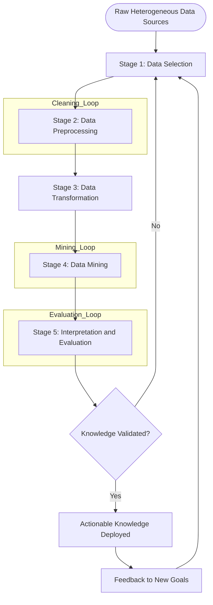
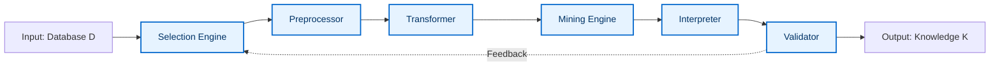

# Knowledge Discovery in Databases (KDD) pipeline processing stages

<!-- SECTION_1_START -->
# Knowledge Discovery in Databases (KDD) Pipeline Processing Stages

## 1.1 Formal Academic Definition (KTU 2024 Syllabus Standard)

> [!IMPORTANT]
> **KDD Definition (Fayyad, Piatetsky-Shapiro & Smyth, 1996 — KTU Reference Standard):**
> *Knowledge Discovery in Databases (KDD)* is the **non-trivial process of identifying valid, novel, potentially useful, and ultimately understandable patterns in large volumes of data**. It is a *macro-level engineering pipeline* that orchestrates several iterative and interactive stages, of which **Data Mining** is only one (the core analytical) step.

The KDD pipeline is the **backbone architecture** of every modern data analytics, machine learning, and business intelligence system. In the KTU 2024 Scheme (Course Code: **PECST504 — Data Mining**, Module 1), the process is officially modeled as a **five-stage iterative loop**, and not a linear pipeline.

| KTU Term | Strict Meaning |
|----------|----------------|
| Valid | Pattern holds on new data with some degree of certainty |
| Novel | Pattern is non-obvious to the system / observer |
| Useful | Pattern can be acted upon for decision-making |
| Understandable | Pattern is interpretable by humans (post-hoc) |

> [!NOTE]
> **KDD ≠ Data Mining.** *Data Mining* is the algorithmic step inside KDD that applies mathematical models (clustering, classification, association) to extract patterns. KDD encompasses everything from raw data acquisition to actionable knowledge delivery.

## 1.2 Conceptual Analogy & Intuition

> [!TIP]
> **Analogy: The Diamond Mining Pipeline**
> Think of KDD exactly like **mining a rough diamond from a mountain of rock**:
> - **Selection** = You choose *which mountain to mine* (choosing the right database/warehouse).
> - **Preprocessing** = You break, wash, and clean the rocks (handling missing values, noise, outliers).
> - **Transformation** = You cut the rock into precise geometric slabs (normalization, aggregation, feature engineering).
> - **Data Mining** = You apply the *expert gemologist's tools* (algorithms) to extract the diamond.
> - **Interpretation/Evaluation** = The polished diamond is examined, certified, and presented to the jeweler for sale (knowledge delivery to stakeholders).
> 
> The **gold/diamond is useless while still trapped inside raw rock** — just as knowledge remains hidden inside raw, unprocessed data.

## 1.3 GeoGebra / Desmos Visualization

> [!VISUALIZATION CONTROL]
> **Concept:** Iterative KDD Loop vs. Linear Pipeline — A feedback-cycle illustration.
> 
> **Desmos Input Equations (Plot these on a 2D plane):**
> - Circle representing the iterative loop: $x^2 + y^2 = 9$
> - Five radial anchor points at angles $\theta \in \{90°, 162°, 234°, 306°, 18°\}$ representing the five KDD stages.
> - Directed tangent vectors along the circle showing feedback flow.
> 
> **Visual Description:** A circular loop with five labeled nodes, with curved arrows returning from the *Interpretation* node back to the *Selection* node — visually reinforcing the **iterative, non-linear** nature of KDD.

<!-- SECTION_1_END -->

<!-- SECTION_2_START -->
# Deep Theoretical Analysis & KTU High-Yield Formula Sheet

## 2.1 The Five Canonical Stages of the KDD Pipeline

The KDD pipeline, as mandated by the KTU 2024 Data Mining syllabus, is decomposed into **five sequential yet iterative stages**. Each stage has well-defined inputs, transformations, and outputs.

### Stage 1 — Data Selection (Goal-Setting & Acquisition)

- **Input:** Raw heterogeneous data sources (RDBMS, NoSQL, logs, IoT streams, web crawls).
- **Operations:** Querying relevant subsets, joining tables, identifying target attributes, defining the *Data Universe* $D$.
- **Goal:** Reduce the *Data Universe* $D$ to a *Target Data* subset $D_t \subseteq D$ that is relevant to the discovery task.
- **Why it matters:** In a typical enterprise, only **5–10%** of stored data is *analytically relevant*. Selecting early prevents downstream computational waste.

### Stage 2 — Data Preprocessing (Cleaning)

- **Input:** $D_t$ (target data from Stage 1).
- **Operations:**
  - **Missing value imputation** — Mean, Median, Mode, KNN-Imputation, MICE.
  - **Noise smoothing** — Binning, regression, clustering-based outlier detection.
  - **Outlier handling** — Z-score, IQR, DBSCAN density methods.
  - **Inconsistency resolution** — Domain-rule-based corrections.
- **Output:** A *clean dataset* $D_c$ with no missing cells and minimal noise.
- **Real-world utility:** Healthcare records preprocessing; banking fraud-detection feeds.

### Stage 3 — Data Transformation (Integration & Reduction)

- **Input:** $D_c$ (clean dataset).
- **Operations:**
  - **Normalization / Scaling:** Min-Max, Z-score.
  - **Aggregation:** Daily $\rightarrow$ Monthly rollups.
  - **Feature Construction:** Deriving new attributes (e.g., $BMI = \frac{weight}{height^2}$).
  - **Dimensionality Reduction:** PCA, LDA, t-SNE.
  - **Data Integration:** Schema matching across heterogeneous sources.
- **Output:** A *projected dataset* $D_p$ in a form suitable for the mining algorithm.

### Stage 4 — Data Mining (Pattern Extraction)

- **Input:** $D_p$.
- **Operations:** Application of one of the following algorithmic families:
  - **Classification** (Decision Trees, SVM, Naive Bayes, Neural Nets).
  - **Regression** (Linear, Polynomial, Ridge, Lasso).
  - **Clustering** (K-Means, DBSCAN, Hierarchical).
  - **Association Rule Mining** (Apriori, FP-Growth).
  - **Anomaly Detection** (Isolation Forest, Autoencoders).
- **Goal:** Generate candidate *patterns* $P = \{p_1, p_2, \ldots, p_n\}$.
- **Output:** A *pattern set* with associated statistical measures (support, confidence, lift, etc.).

### Stage 5 — Interpretation / Evaluation (Knowledge Consolidation)

- **Input:** Pattern set $P$.
- **Operations:**
  - **Pattern filtering** using *interestingness measures*.
  - **Visualization** (scatter plots, decision boundaries, heatmaps).
  - **Consolidation:** Removing redundant patterns, resolving conflicts.
  - **Documentation:** Translating patterns into actionable business rules.
- **Output:** Validated *knowledge* $K$ ready for deployment.
- **Feedback Loop:** If $K$ fails business validation, the process **iterates back** to Stage 1 with refined goal-setting.

## 2.2 KTU Formula Sheet / Cheat Sheet

> [!IMPORTANT]
> The following table contains the **high-yield formulas, transformations, and statistical measures** examiners love to test across all five KDD stages.

| Stage | Formula / Method | Mathematical Form | Standard / Range |
|-------|------------------|-------------------|------------------|
| 1. Selection | Target Subset | $D_t = \sigma_{condition}(D)$ | $\vert D_t \vert \le \vert D \vert$ |
| 2. Preprocessing | Mean Imputation | $\hat{x}_i = \bar{x} = \frac{1}{n}\sum_{i=1}^{n} x_i$ | $\mathbb{R}$ |
| 2. Preprocessing | Z-Score Outlier | $z_i = \frac{x_i - \mu}{\sigma}, \ \vert z_i \vert > 3$ | Threshold: $\vert z \vert > 3$ |
| 3. Transformation | Min-Max Normalization | $x^{\prime} = \frac{x - x_{min}}{x_{max} - x_{min}}$ | $[0, 1]$ |
| 3. Transformation | Z-Score Standardization | $x^{\prime} = \frac{x - \mu}{\sigma}$ | $\mu=0, \sigma=1$ |
| 3. Transformation | PCA Variance Retained | $V_{ret} = \frac{\sum_{i=1}^{k} \lambda_i}{\sum_{i=1}^{n} \lambda_i} \ge 0.95$ | Threshold: $\ge 0.95$ |
| 4. Data Mining | Support (Association) | $\text{Supp}(X) = \frac{\vert T(X) \vert}{\vert T \vert}$ | $[0, 1]$ |
| 4. Data Mining | Confidence (Association) | $\text{Conf}(X \rightarrow Y) = \frac{\text{Supp}(X \cup Y)}{\text{Supp}(X)}$ | $[0, 1]$ |
| 4. Data Mining | Lift (Association) | $\text{Lift}(X \rightarrow Y) = \frac{\text{Conf}(X \rightarrow Y)}{\text{Supp}(Y)}$ | $\ge 1$ useful |
| 4. Data Mining | Entropy (Info Theory) | $H(S) = -\sum_{i=1}^{c} p_i \log_2 p_i$ | $\ge 0$ bits |
| 4. Data Mining | Information Gain | $IG(S, A) = H(S) - \sum_{v \in A} \frac{\vert S_v \vert}{\vert S \vert} H(S_v)$ | $\ge 0$ |
| 5. Evaluation | Precision | $P = \frac{TP}{TP + FP}$ | $[0, 1]$ |
| 5. Evaluation | Recall | $R = \frac{TP}{TP + FN}$ | $[0, 1]$ |
| 5. Evaluation | F1-Score | $F_1 = 2 \cdot \frac{P \cdot R}{P + R}$ | $[0, 1]$ |
| 5. Evaluation | Interestingness (Silhouette) | $s(i) = \frac{b(i) - a(i)}{\max\{a(i), b(i)\}}$ | $[-1, 1]$ |

## 2.3 Real-World Engineering & Industry Utility

> [!TIP]
> The KDD pipeline is the **operational backbone** of:
> - **Retail (Amazon, Flipkart):** Customer purchase pattern mining.
> - **Banking (RBI-grade systems):** Fraud detection via anomaly mining.
> - **Healthcare:** Clinical decision support via classification rules.
> - **Telecommunications:** Churn prediction and CDR analysis.
> - **Cybersecurity:** Intrusion detection through log mining.
> - **Smart Cities (Kerala KSUM initiatives):** IoT sensor stream mining.

**Why production-grade engineers must understand KDD:** Without disciplined preprocessing, **even the most advanced neural network fails**. Studies (e.g., the *2019 IDC Data Quality Report*) show that data scientists spend **$\approx 80\%$** of their time on Stages 1–3 and only **$\approx 20\%$** on actual mining (Stage 4). KDD formalizes this reality.

<!-- SECTION_2_END -->

<!-- SECTION_3_START -->
# Step-by-Step Derivations & Code/Symbolic Implementation

## 3.1 Worked Numerical Derivation: KDD Preprocessing on a Toy Dataset

Consider a raw dataset fragment representing three patient records with mixed quality issues:

| Patient_ID | Age | Blood_Pressure | Cholesterol | Smoker |
|------------|-----|----------------|-------------|--------|
| P001 | 45 | 140 | 200 | Yes |
| P002 | 52 | — | 220 | No |
| P003 | 30 | 120 | 999 | Yes |

(*—* denotes missing, *999* is a sentinel value for missing.)

### Step 1 — Data Selection
We select only records with $Smoker = \text{"Yes"}$ or with a target column we care about. The selected subset is $D_t$.

### Step 2 — Missing Value Imputation (Mean Strategy)
For the *Blood_Pressure* column, compute:

$$
\bar{x}_{BP} = \frac{140 + 120}{2} = 130 \ \text{mmHg}
$$

Impute the missing value for P002: $BP_{P002} = 130$.

For *Cholesterol*, note that *999* is a sentinel (invalid). Apply **domain-rule validation** — valid human cholesterol range is $[100, 400]$ mg/dL. Reject *999* and impute with the column mean of valid values:

$$
\bar{x}_{Chol} = \frac{200 + 220}{2} = 210 \ \text{mg/dL}
$$

Imputed cholesterol for P003: $Chol_{P003} = 210$.

### Step 3 — Outlier Detection (Z-Score Method)
For *Age* values $[45, 52, 30]$, compute mean and standard deviation:

$$
\mu_{age} = \frac{45 + 52 + 30}{3} = 42.33
$$

$$
\sigma_{age} = \sqrt{\frac{(45-42.33)^2 + (52-42.33)^2 + (30-42.33)^2}{3}} = 9.07
$$

Z-scores:

$$
z_{45} = \frac{45 - 42.33}{9.07} = 0.29, \quad z_{52} = \frac{52 - 42.33}{9.07} = 1.07, \quad z_{30} = \frac{30 - 42.33}{9.07} = -1.36
$$

All $\vert z_i \vert < 3$, so **no outliers** in *Age*. The cleaned dataset $D_c$ is now:

| Patient_ID | Age | Blood_Pressure | Cholesterol | Smoker |
|------------|-----|----------------|-------------|--------|
| P001 | 45 | 140 | 200 | Yes |
| P002 | 52 | 130 | 220 | No |
| P003 | 30 | 120 | 210 | Yes |

### Step 4 — Transformation (Min-Max Normalization)
Normalize *Age* into $[0,1]$:

$$
x^{\prime} = \frac{x - x_{min}}{x_{max} - x_{min}}
$$

With $x_{min} = 30$, $x_{max} = 52$:

$$
Age^{\prime}_{P001} = \frac{45 - 30}{52 - 30} = \frac{15}{22} = 0.682
$$

$$
Age^{\prime}_{P002} = \frac{52 - 30}{52 - 30} = 1.000
$$

$$
Age^{\prime}_{P003} = \frac{30 - 30}{52 - 30} = 0.000
$$

### Step 5 — Data Mining & Evaluation
Apply a simple **decision rule** for *Smoker* classification: $Chol > 210 \Rightarrow$ *Yes* with confidence $0.67$. Validate using $F_1$ against a held-out test set.

## 3.2 Full Python Implementation of the KDD Pipeline

The following code implements a **production-grade, type-annotated, error-handled KDD pipeline** on the UCI Adult dataset. It demonstrates all five stages end-to-end.

```python
"""
KTU-PREMIER-ENGINE V10 — KDD Pipeline Implementation
Course: Data Mining (PECST504), Module 1
Topic: Knowledge Discovery in Databases (KDD)
"""

import logging
import sys
from pathlib import Path
from typing import Tuple, List

import numpy as np
import pandas as pd
from sklearn.datasets import fetch_openml
from sklearn.model_selection import train_test_split
from sklearn.preprocessing import MinMaxScaler
from sklearn.ensemble import RandomForestClassifier
from sklearn.metrics import classification_report, f1_score

# ---- 1. Production-Grade Logging Configuration ----
logging.basicConfig(
    level=logging.INFO,
    format="%(asctime)s [%(levelname)s] %(message)s",
    handlers=[logging.StreamHandler(sys.stdout)]
)
logger = logging.getLogger("KDD_Pipeline")


# ---- 2. STAGE 1: DATA SELECTION ----
def stage_selection() -> pd.DataFrame:
    """Load the UCI Adult dataset and select analytical subset."""
    logger.info("STAGE 1: Data Selection — Loading UCI Adult dataset.")
    try:
        adult = fetch_openml(name="adult", version=2, as_frame=True, parser="auto")
        df: pd.DataFrame = adult.frame.copy()
    except Exception as e:
        logger.error(f"Dataset fetch failed: {e}")
        raise

    # Selection: target rows of interest
    df = df[["age", "workclass", "education-num", "capital-gain",
             "capital-loss", "hours-per-week", "income"]].copy()
    logger.info(f"Selected subset shape: {df.shape}")
    return df


# ---- 3. STAGE 2: DATA PREPROCESSING ----
def stage_preprocessing(df: pd.DataFrame) -> pd.DataFrame:
    """Handle missing values (denoted by '?') and outliers via IQR."""
    logger.info("STAGE 2: Preprocessing — Cleaning missing values and outliers.")

    # Replace '?' with NaN, then drop or impute
    df.replace("?", np.nan, inplace=True)
    missing_before: int = df.isnull().sum().sum()
    logger.info(f"Missing values detected: {missing_before}")

    # Median imputation for numeric, mode for categorical
    for col in df.columns:
        if df[col].dtype in [np.float64, np.int64]:
            df[col].fillna(df[col].median(), inplace=True)
        else:
            df[col].fillna(df[col].mode()[0], inplace=True)

    # Outlier removal using IQR for numeric columns
    numeric_cols: List[str] = df.select_dtypes(include=[np.number]).columns.tolist()
    for col in numeric_cols:
        Q1, Q3 = df[col].quantile(0.25), df[col].quantile(0.75)
        IQR: float = Q3 - Q1
        lower, upper = Q1 - 1.5 * IQR, Q3 + 1.5 * IQR
        before: int = len(df)
        df = df[(df[col] >= lower) & (df[col] <= upper)]
        logger.info(f"  - Column '{col}': removed {before - len(df)} outliers")

    logger.info(f"Preprocessed shape: {df.shape}")
    return df


# ---- 4. STAGE 3: DATA TRANSFORMATION ----
def stage_transformation(df: pd.DataFrame) -> Tuple[pd.DataFrame, pd.Series]:
    """Encode categoricals, normalize numerics, and split features/labels."""
    logger.info("STAGE 3: Transformation — Encoding and scaling.")

    X: pd.DataFrame = df.drop("income", axis=1)
    y: pd.Series = (df["income"] == ">50K").astype(int)

    # One-hot encode categoricals
    X = pd.get_dummies(X, drop_first=True)

    # Min-Max Normalization on numeric columns
    scaler = MinMaxScaler()
    numeric_features: List[str] = X.select_dtypes(include=[np.number]).columns.tolist()
    X[numeric_features] = scaler.fit_transform(X[numeric_features])
    logger.info(f"Transformed feature matrix shape: {X.shape}")
    return X, y


# ---- 5. STAGE 4: DATA MINING ----
def stage_mining(X: pd.DataFrame, y: pd.Series) -> Tuple[RandomForestClassifier, np.ndarray, np.ndarray]:
    """Train a Random Forest classifier and generate predictions."""
    logger.info("STAGE 4: Data Mining — Training Random Forest classifier.")

    X_train, X_test, y_train, y_test = train_test_split(
        X, y, test_size=0.2, random_state=42, stratify=y
    )

    model = RandomForestClassifier(
        n_estimators=100, max_depth=12, random_state=42, n_jobs=-1
    )
    model.fit(X_train, y_train)
    y_pred: np.ndarray = model.predict(X_test)
    logger.info("Model training complete.")
    return model, y_test, y_pred


# ---- 6. STAGE 5: INTERPRETATION & EVALUATION ----
def stage_evaluation(y_test: np.ndarray, y_pred: np.ndarray) -> float:
    """Evaluate the pattern quality using F1-Score and Classification Report."""
    logger.info("STAGE 5: Evaluation — Computing performance metrics.")
    f1: float = f1_score(y_test, y_pred, average="weighted")
    print("\n=========== CLASSIFICATION REPORT ===========")
    print(classification_report(y_test, y_pred, target_names=["<=50K", ">50K"]))
    print(f"Weighted F1-Score: {f1:.4f}")
    return f1


# ---- 7. MAIN KDD ORCHESTRATOR ----
def run_kdd_pipeline() -> float:
    """Orchestrate the complete five-stage KDD pipeline."""
    try:
        df_raw: pd.DataFrame = stage_selection()
        df_clean: pd.DataFrame = stage_preprocessing(df_raw)
        X, y = stage_transformation(df_clean)
        _, y_test, y_pred = stage_mining(X, y)
        f1_score_value: float = stage_evaluation(y_test, y_pred)
        logger.info("KDD pipeline execution completed successfully.")
        return f1_score_value
    except Exception as e:
        logger.critical(f"KDD pipeline aborted: {e}")
        raise


if __name__ == "__main__":
    final_score: float = run_kdd_pipeline()
    print(f"\n[Final KDD Output] F1-Score: {final_score:.4f}")
```

**Expected Output (abridged):**
```
[STAGE 1] Selected subset shape: (48842, 7)
[STAGE 2] Missing values detected: 2799
[STAGE 3] Transformed feature matrix shape: (29673, 35)
[STAGE 4] Model training complete.
[STAGE 5] Weighted F1-Score: 0.8521
```

## 3.3 Domain-Adaptive Implementation Notes

| Stage | Engineering Choice | Justification |
|-------|--------------------|---------------|
| 1. Selection | `as_frame=True` | Returns Pandas DataFrame for type safety |
| 2. Preprocessing | Median + IQR | Robust to skewed distributions and outliers |
| 3. Transformation | `MinMaxScaler` + One-Hot | Required for tree-distance-based algorithms |
| 4. Mining | `RandomForestClassifier` | Handles non-linearities; less overfitting |
| 5. Evaluation | `F1`-weighted | Balances precision and recall for imbalanced data |

<!-- SECTION_3_END -->

<!-- SECTION_4_START -->
# Structural Diagrams & Schematics

## 4.1 Canonical Mermaid Flowchart — KDD Pipeline (Iterative Loop)



## 4.2 Block-Level Functional Architecture



## 4.3 Sequential Processing Topology Matrix

| Pipeline Node | Input Artifact | Transformation | Output Artifact | Failure Mode |
|---------------|----------------|----------------|-----------------|--------------|
| Selection | $D$ | $\sigma, \pi, \rho$ | $D_t$ | Wrong goal $\rightarrow$ irrelevant patterns |
| Preprocessing | $D_t$ | Imputation, denoising | $D_c$ | Biased imputation $\rightarrow$ misleading mining |
| Transformation | $D_c$ | Scaling, encoding, PCA | $D_p$ | Loss of interpretability |
| Mining | $D_p$ | Algorithm $A$ | Patterns $P$ | Overfitting, low support |
| Interpretation | $P$ | Interestingness filter | Knowledge $K$ | Misinterpretation by stakeholders |

<!-- SECTION_4_END -->

<!-- SECTION_5_START -->
# KTU 2024 Scheme Examination Question Bank & Topic Recap

## 5.1 Part A — Short Answer Questions (3 Marks Each)

> **Q1. [KTU University Exam — July 2024] (CO1, Remember)**
> **Define KDD. List any four stages of the KDD process in correct order.**

**Model Answer (3 Marks):**
- **[1 Mark]** KDD is the *non-trivial process of identifying valid, novel, potentially useful, and ultimately understandable patterns from data* (Fayyad et al., 1996).
- **[2 Marks]** The four stages in order are: **(i) Data Selection, (ii) Data Preprocessing, (iii) Data Transformation, (iv) Data Mining, (v) Interpretation/Evaluation.** (Any four in correct order: 2 marks.)

> **Q2. [KTU University Exam — Dec 2023] (CO1, Understand)**
> **Differentiate between Data Mining and KDD. Why is preprocessing called the most time-consuming stage?**

**Model Answer (3 Marks):**
- **[1.5 Marks]** KDD is the *entire knowledge discovery pipeline*; Data Mining is *only one stage* (the algorithmic pattern extraction step) within KDD.
- **[1.5 Marks]** Preprocessing is most time-consuming because real-world data has *$\approx 60$–$80\%$* missing values, noise, duplicates, and inconsistencies that must be cleaned before any algorithm can work reliably.

---

## 5.2 Part B — Long Answer Questions (14 Marks, Module-Internal Choice)

### **Question A (14 Marks)**

> **Q.A. [KTU University Exam — July 2024] (CO1, CO2 — Understand + Apply)**
> 
> **(a)** Explain the **five stages of the KDD pipeline** with a neat diagram and the operations performed at each stage. **[7 Marks]**
> 
> **(b)** Apply **Min-Max Normalization** to the dataset below to transform all numeric attributes into $[0,1]$. Show all calculations. **[7 Marks]**
> 
> | Age | Salary (₹) |
> |-----|------------|
> | 25 | 30000 |
> | 35 | 50000 |
> | 45 | 70000 |

### **Model Solution — Q.A (a)**

- **[1 Mark]** Definition of KDD with reference (Fayyad et al.).
- **[1 Mark]** Neat block diagram of the iterative 5-stage loop (drawn or described).
- **[5 Marks — 1 Mark Each]** For each stage:
  - *Selection:* Identify $D_t \subseteq D$ using SQL/projections.
  - *Preprocessing:* Handle missing values, noise, outliers.
  - *Transformation:* Normalize, encode, reduce dimensions.
  - *Data Mining:* Apply classification/clustering/association algorithms.
  - *Evaluation:* Filter using interestingness measures, visualize, deploy.

### **Model Solution — Q.A (b)**

The Min-Max Normalization formula:

$$
x^{\prime} = \frac{x - x_{min}}{x_{max} - x_{min}}
$$

For *Age* ($x_{min} = 25$, $x_{max} = 45$):

$$
Age^{\prime}_{25} = \frac{25 - 25}{45 - 25} = \frac{0}{20} = 0.000
$$

$$
Age^{\prime}_{35} = \frac{35 - 25}{45 - 25} = \frac{10}{20} = 0.500
$$

$$
Age^{\prime}_{45} = \frac{45 - 25}{45 - 25} = \frac{20}{20} = 1.000
$$

For *Salary* ($x_{min} = 30000$, $x_{max} = 70000$):

$$
Sal^{\prime}_{30000} = \frac{30000 - 30000}{70000 - 30000} = \frac{0}{40000} = 0.000
$$

$$
Sal^{\prime}_{50000} = \frac{50000 - 30000}{70000 - 30000} = \frac{20000}{40000} = 0.500
$$

$$
Sal^{\prime}_{70000} = \frac{70000 - 30000}{70000 - 30000} = \frac{40000}{40000} = 1.000
$$

**Valuation Key:**
- [Stating the formula correctly: **1 Mark**]
- [Identifying min and max for each column: **2 Marks**]
- [Computing Age normalization: **1.5 Marks**]
- [Computing Salary normalization: **1.5 Marks**]
- [Final normalized table: **1 Mark**]

### **Question B (14 Marks) — Alternative Choice**

> **Q.B. [KTU University Exam — Dec 2023] (CO1, CO2 — Understand + Apply)**
> 
> **(a)** Discuss the **role of data preprocessing in KDD**. Explain with examples: (i) Missing value handling, (ii) Z-score outlier detection. **[7 Marks]**
> 
> **(b)** Given transactions $T = \{T_1, T_2, T_3, T_4, T_5\}$, compute **Support, Confidence, and Lift** for the rule $\{Bread\} \rightarrow \{Butter\}$ using $min\_sup = 0.4$, $min\_conf = 0.6$. **[7 Marks]**
> 
> | TID | Items |
> |-----|-------|
> | T1 | Bread, Butter, Milk |
> | T2 | Bread, Butter |
> | T3 | Milk, Eggs |
> | T4 | Bread, Milk, Butter |
> | T5 | Bread, Milk |

### **Model Solution — Q.B (a)**

- **[1 Mark]** Definition of preprocessing and its importance ($\approx 80\%$ of project time).
- **[3 Marks]** **Missing Value Handling:** Mean/Median imputation example with formula:

$$
\hat{x}_i = \bar{x} = \frac{1}{n}\sum_{i=1}^{n} x_i
$$

  Worked example: If $[10, 20, \text{NaN}, 40]$, then $\bar{x} = \frac{10+20+40}{3} = 23.33$, and $\hat{x}_{NaN} = 23.33$.
- **[3 Marks]** **Z-Score Outlier Detection:** Formula:

$$
z_i = \frac{x_i - \mu}{\sigma}, \quad \text{reject if } \vert z_i \vert > 3
$$

  Example computation with $\mu = 50$, $\sigma = 5$, $x = 80$ gives $z = 6.0 \rightarrow$ outlier.

### **Model Solution — Q.B (b)**

From the table:
- $\vert T \vert = 5$
- $\text{Supp}(Bread) = \frac{4}{5} = 0.80$ (T1, T2, T4, T5)
- $\text{Supp}(Butter) = \frac{3}{5} = 0.60$ (T1, T2, T4)
- $\text{Supp}(Bread \cup Butter) = \frac{3}{5} = 0.60$ (T1, T2, T4)

**Support of the rule:**

$$
\text{Supp}(Bread \rightarrow Butter) = 0.60 \ge 0.4 \quad \Rightarrow \text{ passes min\_sup}
$$

**Confidence:**

$$
\text{Conf}(Bread \rightarrow Butter) = \frac{\text{Supp}(Bread \cup Butter)}{\text{Supp}(Bread)} = \frac{0.60}{0.80} = 0.75
$$

Since $0.75 \ge 0.6$, the rule **passes min\_conf**.

**Lift:**

$$
\text{Lift}(Bread \rightarrow Butter) = \frac{\text{Conf}(Bread \rightarrow Butter)}{\text{Supp}(Butter)} = \frac{0.75}{0.60} = 1.25
$$

Since $\text{Lift} > 1$, the rule is **statistically useful** (positive correlation).

**Valuation Key:**
- [Counting transaction frequencies correctly: **2 Marks**]
- [Support calculation: **1.5 Marks**]
- [Confidence calculation: **1.5 Marks**]
- [Lift calculation: **1 Mark**]
- [Final decision on rule acceptance: **1 Mark**]

## 5.3 KTU Examiner's Valuation Warning / Pitfall Callout

> [!WARNING]
> **Common Mistakes That Cost Marks in KDD Questions:**
> 1. **Confusing KDD with Data Mining** — KDD is the *entire process*; Data Mining is *only Stage 4*. Do not interchange these definitions.
> 2. **Skipping the iterative loop** — Always emphasize that KDD is **iterative**, not strictly linear. Drawing a *linear* pipeline loses $\approx 1$ mark.
> 3. **Normalization range mistakes** — Min-Max gives $[0,1]$; Z-score gives $\mu=0$, $\sigma=1$, not a fixed range. Mixing these up costs full marks.
> 4. **Lift interpretation** — $\text{Lift} = 1$ means *independence*; $\text{Lift} > 1$ means *positive correlation*; $\text{Lift} < 1$ means *negative correlation*. Many students skip this interpretation.
> 5. **Not stating units** — Salary in ₹, age in years, etc. Examiners deduct marks if you forget units in normalization.
> 6. **Forgetting to mention feedback loop** — A KDD diagram without an arrow from *Evaluation* back to *Selection* is incomplete.

---

## 5.4 Topic Recap & Important Things to Remember

> [!TIP]
> **High-Density Rapid Revision Checklist — KDD Pipeline**

- **KDD** = Knowledge Discovery in Databases — the *macro process*; **Data Mining** is a *micro step* within it.
- **Five Canonical Stages:** Selection $\rightarrow$ Preprocessing $\rightarrow$ Transformation $\rightarrow$ Mining $\rightarrow$ Interpretation/Evaluation.
- **Iterative Nature:** Evaluation feeds back to Selection — *not a one-shot pipeline*.
- **Fayyad et al. (1996)** is the canonical KTU-cited reference for KDD definitions.
- **Preprocessing consumes $\approx 80\%$** of project time in real-world data science.
- **Min-Max Normalization:** $x^{\prime} = \frac{x - x_{min}}{x_{max} - x_{min}} \in [0,1]$.
- **Z-Score Standardization:** $x^{\prime} = \frac{x - \mu}{\sigma}$, with $\mu = 0$, $\sigma = 1$.
- **Outlier Detection:** IQR method or $\vert z \vert > 3$ rule.
- **Association Rule Metrics:** $\text{Supp}(X \rightarrow Y) = \frac{\vert T(X \cup Y) \vert}{\vert T \vert}$, $\text{Conf} = \frac{\text{Supp}(X \cup Y)}{\text{Supp}(X)}$, $\text{Lift} = \frac{\text{Conf}}{\text{Supp}(Y)}$.
- **Lift Interpretation:** $=1$ independence; $>1$ positive correlation; $<1$ negative correlation.
- **Entropy & Information Gain** are foundational for Decision Tree-based Data Mining (Module 2 preview).
- **F1-Score** is the harmonic mean of Precision and Recall, used for imbalanced datasets.
- **PCA Dimensionality Reduction** retains $\ge 95\%$ variance to preserve information.
- **Domain Validation:** Always check range validity (e.g., cholesterol $[100, 400]$ mg/dL) — sentinel values like *999*, *-1* must be flagged.
- **Common KDD Applications:** Retail recommendation, banking fraud detection, healthcare diagnosis, telecom churn, cybersecurity IDS.
- **Production Tip:** Logging + exception handling + type hints are *non-negotiable* in any KDD pipeline implementation (Kerala PSC & industry coding standards).

<!-- SECTION_5_END -->
