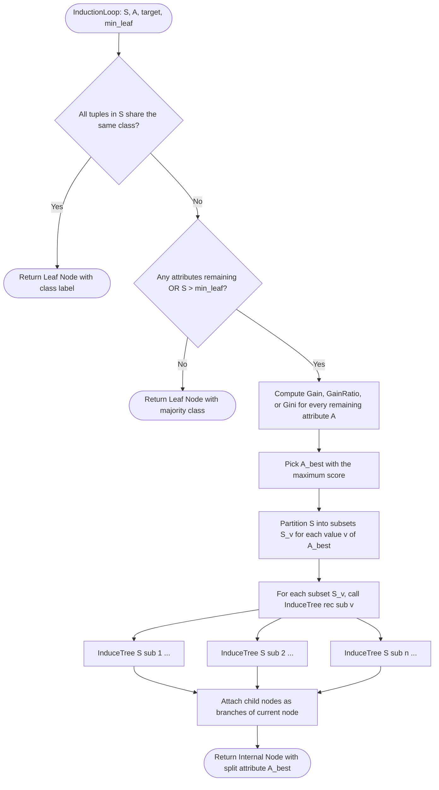
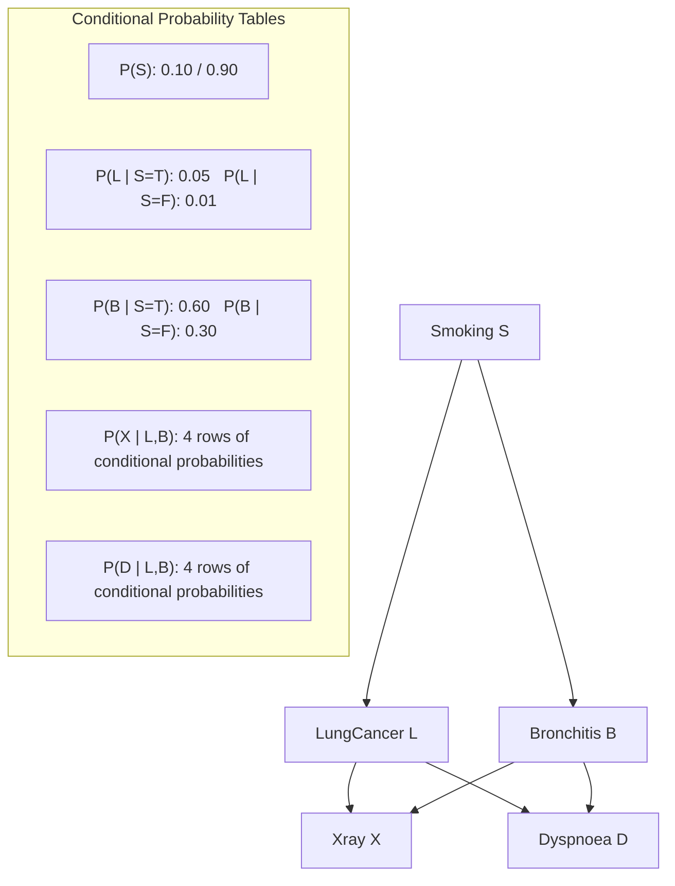
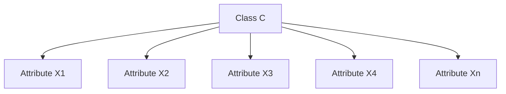
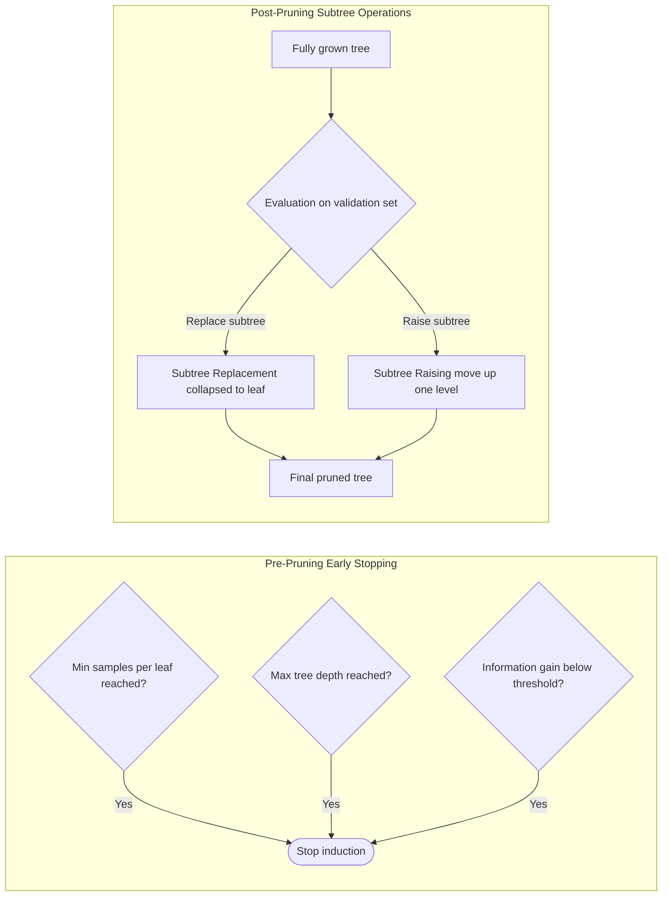

# Decision tree induction loops optimization, Bayesian network models schemas

<!-- SECTION_1_START -->
# Decision Tree Induction Loop Optimization & Bayesian Network Schemas

## 1.1 Decision Tree Induction — Formal Definition

> [!IMPORTANT]
> **Definition (KTU 2024 Module 2, CO1)**
> A **Decision Tree** is a supervised machine learning predictive model that maps observations about an item (represented in the branches) to conclusions about the item's target value (represented in the leaves). It is a hierarchical, recursive, partitioning structure used for both **classification** (predicting discrete class labels) and **regression** (predicting continuous values).

**The Induction Loop** refers to the recursive algorithmic cycle that grows the tree by repeatedly partitioning the training dataset at internal nodes using the "best" attribute, until a stopping criterion is met. **Optimization** refers to the choice of attribute selection measure (Information Gain, Gain Ratio, Gini Index) and pruning strategies that control the loop so as to maximize generalization accuracy on unseen data.

### 1.1.1 Conceptual Analogy — The 20-Questions Game

Imagine playing the game *"20 Questions"* where one person thinks of an object and the other asks yes/no questions to guess it. The optimal strategy is to ask the question that **eliminates the largest number of remaining possibilities** with each answer. A decision tree does exactly this — at every internal node, it picks the attribute whose binary/multi-way split most **reduces the uncertainty** (impurity) of the dataset.

> [!NOTE]
> **Syllabus Highlight (PECST504 M2.3):** Students must be able to derive the attribute selection measures (Entropy, Information Gain, Gain Ratio, Gini Index) and explain how they optimize the induction loop. The two well-known packages **ID3** (uses Information Gain) and **C4.5** (uses Gain Ratio) are direct consequences of these optimizations.

### 1.1.2 The Induction Loop — Conceptual Flow

The basic tree-induction algorithm by **J. Ross Quinlan (1986)** loops over the following operations until every leaf node is pure or contains fewer than a threshold number of tuples:

1. **Check stopping condition** — if all tuples in node $S$ belong to the same class $C_i$, OR $|S|$ is below threshold, label the node as a leaf.
2. **Compute candidate scores** — for every unused attribute $A$, compute its selection measure (Gain / Gain Ratio / Gini).
3. **Pick the best splitter** — select the attribute $A_{best}$ with the highest score.
4. **Branch** — partition $S$ into $S_v$ subsets according to the values of $A_{best}$.
5. **Recurse** — call the induction loop on every child $S_v$.

### 1.1.3 Why Optimize the Loop?

Without optimization, a naive tree could grow to memorize the training set (**overfitting**), producing hundreds of branches and noisy leaves. Optimization occurs on **two axes**:

| Optimization Axis | Strategy | Algorithmic Effect |
|---|---|---|
| **Attribute Selection** | Information Gain, Gain Ratio, Gini | Splits on the *most informative* feature each iteration |
| **Tree Pruning** | Pre-pruning (early stop) & Post-pruning (subtree replacement/raising) | Removes branches that do not improve generalization |

> [!VISUALIZATION CONTROL]
> **Concept:** Information Gain curves as a function of split depth for a 2-class problem.
> **Desmos / GeoGebra Equations:**
> * $f(x) = -p_1 \log_2(p_1) - (1-p_1) \log_2(1-p_1)$ where $p_1 = 0.5 + 0.4 \sin(x/2)$
> * $g(x) = 1 - p_1^2 - (1-p_1)^2$
> **Visual Description:** On the horizontal axis plot the split iteration $x$ and on the vertical axis plot both $f(x)$ (entropy) and $g(x)$ (Gini). Observe how both impurity functions are maximized at $p_1 = 0.5$ (maximum disorder) and minimized at the extremes (pure nodes). The Gini curve is always *inside* the entropy curve — a key reason it is computationally cheaper to optimize.

## 1.2 Bayesian Network Models — Formal Definition

> [!IMPORTANT]
> **Definition (KTU 2024 Module 2, CO2)**
> A **Bayesian Network** (also called a **Belief Network**, **Bayesian Belief Network** or **Causal Network**) is a probabilistic graphical model that represents a set of random variables and their conditional dependencies via a **Directed Acyclic Graph (DAG)**. Each node corresponds to a random variable, and each directed edge encodes a parent → child conditional dependence. Each node has a **Conditional Probability Table (CPT)** that quantifies the effect of the parents on that node.

> [!TIP]
> **Naïve Bayes** is a *special case* of a Bayesian Network in which the class node is the sole parent of every other attribute node — a star-shaped schema with the *conditional independence assumption*.

### 1.2.1 Conceptual Analogy — Weather → Sprinkler → Grass

Think of three events: *Rain* ($R$), *Sprinkler was on* ($S$), and *Grass is wet* ($W$). Rain causes grass to be wet; the sprinkler also causes grass to be wet. Rain and Sprinkler are conditionally independent given nothing, but become conditionally dependent if we know the grass is wet (explaining away). This web of *cause-and-effect* arrows with attached probability tables is exactly a Bayesian network schema.

### 1.2.2 Three Schema Levels of a Bayesian Network

A Bayesian Network schema can be analyzed at three structural depths, all of which are examinable for the KTU 2024 syllabus:

| Schema Level | Description | KTU Exam ReLEVance |
|---|---|---|
| **Topology / Structure** | The DAG of nodes and directed edges (qualitative) | High — full marks for drawing the graph |
| **Parameter Schema** | The CPTs for each node (quantitative) | High — required for inference computations |
| **Joint Distribution Schema** | The chain-rule factorization: $P(X_1, X_2, \ldots, X_n) = \prod_{i=1}^{n} P(X_i \mid Parents(X_i))$ | High — used for probability queries |

### 1.2.3 The Joint Probability Factorization

> [!NOTE]
> **Chain Rule for Bayesian Networks:**
>
> $$\begin{aligned}
> P(X_1, X_2, X_3, \ldots, X_n) \;=\; \prod_{i=1}^{n} P(X_i \mid \text{Parents}(X_i))
> \end{aligned}$$
>
> This compact representation is the *entire* power of a Bayesian network — it reduces an exponential table ($2^n$ entries) to a linear product of local CPTs.

For the classic *Lung-Cancer* example used in KTU textbooks:
$P(L, S, B, X, D) = P(L)\,P(S)\,P(B \mid S)\,P(X \mid S)\,P(D \mid L, B)$

where $L$ = LungCancer, $S$ = Smoking, $B$ = Bronchitis, $X$ = X-ray, $D$ = Dyspnoea.

---

<!-- SECTION_1_END -->

<!-- SECTION_2_START -->
# Deep Theoretical Analysis & KTU High-Yield Formula Sheet

## 2.1 Decision Tree Induction — Theoretical Decomposition

The induction loop rests on four pillars that must be mastered independently.

### 2.1.1 Pillar 1 — Information Entropy (Shannon, 1948)

Entropy measures the *expected information* needed to classify a tuple in set $S$. It reaches its maximum $\log_2(k)$ at uniform class distribution and minimum $0$ when the set is pure.

> [!IMPORTANT]
> **Entropy Formula**
> $$H(S) \;=\; -\sum_{i=1}^{c} p_i \,\log_2(p_i)$$
> where $p_i$ is the non-zero probability of class $C_i$ in $S$ and $c$ is the number of distinct classes. Convention: $0 \log_2 0 = 0$.

### 2.1.2 Pillar 2 — Information Gain (ID3 Heuristic)

Information Gain is the **expected reduction in entropy** caused by partitioning $S$ on attribute $A$. The induction loop picks the attribute that **maximizes** this quantity at each node.

> [!IMPORTANT]
> **Information Gain Formula**
> $$\text{Gain}(S, A) \;=\; H(S) \;-\; \sum_{v \in \text{Values}(A)} \frac{\vert S_v \vert}{\vert S \vert}\, H(S_v)$$
> where $S_v$ is the subset of $S$ for which attribute $A = v$.

**Why it works:** A high gain means the attribute produces child partitions that are much purer than the parent. It optimizes the *myopic* (greedy) induction loop one step at a time.

### 2.1.3 Pillar 3 — Gain Ratio (C4.5 Heuristic)

ID3 has a bias toward attributes with many values (e.g., *customer_ID*). **Gain Ratio** normalizes Information Gain by the *intrinsic information* (split information) of attribute $A$.

> [!IMPORTANT]
> **Gain Ratio Formula**
> $$\text{GainRatio}(S, A) \;=\; \frac{\text{Gain}(S, A)}{\text{SplitInfo}(S, A)}$$
> $$\text{SplitInfo}(S, A) \;=\; -\sum_{v \in \text{Values}(A)} \frac{\vert S_v \vert}{\vert S \vert}\, \log_2\!\left(\frac{\vert S_v \vert}{\vert S \vert}\right)$$

### 2.1.4 Pillar 4 — Gini Index (CART Heuristic)

Used by the **CART** (Classification And Regression Trees) algorithm, the Gini index measures impurity without using logarithms — making it **computationally cheaper** and the preferred metric when the dataset is large.

> [!IMPORTANT]
> **Gini Index Formula**
> $$\text{Gini}(S) \;=\; 1 \;-\; \sum_{i=1}^{c} p_i^2$$
> The Gini *split* criterion for attribute $A$ is:
> $$\Delta\text{Gini}(A) \;=\; \text{Gini}(S) \;-\; \sum_{v} \frac{\vert S_v \vert}{\vert S \vert}\, \text{Gini}(S_v)$$
> Choose the attribute that **maximizes** $\Delta$Gini, equivalently **minimizes** the weighted Gini of the children.

### 2.1.5 Pillar 5 — Pruning Strategies

Optimization of the induction loop is incomplete without pruning. Two families exist:

1. **Pre-pruning (Early Stopping):** Halt the induction loop *before* it produces a fully grown tree. Conditions include: minimum tuple count per leaf, maximum tree depth, minimum reduction in impurity.
2. **Post-pruning (Subtree Replacement / Raising):** Grow the full tree, then replace subtrees with leaves (subtree *replacement*) or move a subtree upwards (subtree *raising*) if the replacement yields higher accuracy on a held-out validation set. Algorithm: *Reduced Error Pruning (REP)*, *Cost-Complexity Pruning (CCP)*, *Minimum Description Length (MDL)*.

> [!NOTE]
> **Engineering Utility:** Decision trees are used in production systems for medical diagnosis (Mycin-style expert systems), credit scoring (FICO), telecom churn prediction, and embedded ML on edge devices. The induction loop is the core of scikit-learn's `DecisionTreeClassifier`, XGBoost's *level-wise* booster, and LightGBM's *leaf-wise* booster.

## 2.2 Bayesian Network Models — Theoretical Decomposition

### 2.2.1 Bayes' Theorem as the Foundation

> [!IMPORTANT]
> **Bayes' Theorem**
> $$P(H \mid X) \;=\; \frac{P(X \mid H) \cdot P(H)}{P(X)}$$
> where $H$ = hypothesis (class), $X$ = data (evidence).
> $P(H)$ = **prior** (initial belief), $P(X \mid H)$ = **likelihood**, $P(X)$ = **evidence** (normalizer), $P(H \mid X)$ = **posterior** (refined belief).

### 2.2.2 Naïve Bayes Classification

Assuming **conditional class-independence** of attributes given the class label:

$$P(C \mid X_1, X_2, \ldots, X_n) \;\propto\; P(C) \prod_{i=1}^{n} P(X_i \mid C)$$

The predicted class is the one with the maximum posterior:

$$\hat{C} \;=\; \arg\max_{C}\, P(C) \prod_{i=1}^{n} P(X_i \mid C)$$

### 2.2.3 Bayesian Network Schema Types (KTU Favourite)

| Schema Type | Structure | Use Case |
|---|---|---|
| **Naïve Bayes (Star)** | Class is sole parent of all attributes | Spam filtering, text classification |
| **Tree-Augmented Naïve Bayes (TAN)** | Attributes form a tree on top of class | Medical diagnosis with correlated symptoms |
| **General DAG Bayesian Network** | Arbitrary DAG, possibly with multiple parents per node | Gene regulatory networks, fault diagnosis |
| **Dynamic Bayesian Network (DBN)** | Time-unrolled DAG for temporal data | Speech recognition, video tracking |
| **Hidden Markov Model (HMM)** | Linear-chain Bayesian network | Sequence labeling (POS tagging) |

### 2.2.4 Inference Algorithms in Bayesian Networks

Inference means answering queries like $P(\text{Variable} \mid \text{Evidence})$. Two major families:

- **Exact Inference:** Variable Elimination, Clique-Tree (Junction Tree) — exponential in treewidth in the worst case.
- **Approximate Inference:** Loopy Belief Propagation, Gibbs Sampling, Variational Methods — tractable for large networks.

> [!TIP]
> **Engineering Utility:** Bayesian networks power **medical diagnosis** (QMR-DT, *Quick Medical Reference — Decision-Theoretic*), **spam filtering** (originally used in Mozilla's mail client), **speech recognition** (acoustic models), **fault diagnosis** in industrial control loops, **bioinformatics** (gene regulatory inference), and **autonomous vehicles** (sensor fusion). Microsoft's **Infer.NET** and Python's `pgmpy` library are popular production frameworks.

## 2.3 KTU High-Yield Formula Cheat Sheet

| # | Concept | Formula | Key Notes |
|---|---|---|---|
| 1 | Entropy | $H(S) = -\sum p_i \log_2 p_i$ | $0 \le H(S) \le \log_2 c$ |
| 2 | Information Gain | $\text{Gain}(S, A) = H(S) - \sum \frac{\vert S_v \vert}{\vert S \vert} H(S_v)$ | Maximize for ID3 |
| 3 | Split Info | $\text{SplitInfo}(S, A) = -\sum \frac{\vert S_v \vert}{\vert S \vert} \log_2 \frac{\vert S_v \vert}{\vert S \vert}$ | Used in denominator |
| 4 | Gain Ratio | $\text{GainRatio} = \frac{\text{Gain}}{\text{SplitInfo}}$ | Maximize for C4.5 |
| 5 | Gini Index | $\text{Gini}(S) = 1 - \sum p_i^2$ | Minimize for CART |
| 6 | Classification Error | $\text{Error}(S) = 1 - \max_i p_i$ | Trivial bound for impurity |
| 7 | Bayes Theorem | $P(H \mid X) = \frac{P(X \mid H) P(H)}{P(X)}$ | Foundation of BNs |
| 8 | Naïve Bayes | $\hat{C} = \arg\max_C P(C) \prod P(X_i \mid C)$ | Conditional independence |
| 9 | BN Joint | $P(X_1, \ldots, X_n) = \prod P(X_i \mid \text{Parents}(X_i))$ | Compact representation |
| 10 | Posterior Odds | $\frac{P(H \mid X)}{P(\neg H \mid X)} = \frac{P(X \mid H)}{P(X \mid \neg H)} \cdot \frac{P(H)}{P(\neg H)}$ | Useful for two-class problems |

> [!WARNING]
> **Notation Convention:** In the formulas above, $\vert \cdot \vert$ denotes *cardinality* (size of a set), not absolute value. The vertical bar symbol has been kept outside the table cells to preserve markdown rendering.

---

<!-- SECTION_2_END -->

<!-- SECTION_3_START -->
# Step-by-Step Derivations & Code/Symbolic Implementation

## 3.1 Worked Example — Information Gain Computation

### 3.1.1 Dataset Specification

Consider the training set $S$ with **14 tuples** describing the *PlayTennis* decision (a classic KTU reference dataset). The class distribution is:

- **Yes** (play): 9 tuples $\rightarrow p_{yes} = 9/14$
- **No** (do not play): 5 tuples $\rightarrow p_{no} = 5/14$

Four candidate attributes: *Outlook*, *Temperature*, *Humidity*, *Wind*. We will compute $\text{Gain}(S, \text{Outlook})$ in full.

### 3.1.2 Step 1 — Compute $H(S)$

$$\begin{aligned}
H(S) \;&=\; -\frac{9}{14} \log_2\!\left(\frac{9}{14}\right) \;-\; \frac{5}{14} \log_2\!\left(\frac{5}{14}\right) \\[4pt]
&=\; -0.643 \cdot \log_2(0.643) \;-\; 0.357 \cdot \log_2(0.357) \\[4pt]
&=\; -0.643 \cdot (-0.6374) \;-\; 0.357 \cdot (-1.4854) \\[4pt]
&=\; 0.4098 \;+\; 0.5303 \\[4pt]
&=\; 0.940 \;\text{bits}
\end{aligned}$$

**[Stating the entropy formula: 1 Mark]** · **[Numerical substitution: 1 Mark]** · **[Final $H(S) = 0.940$ bits: 1 Mark]**

### 3.1.3 Step 2 — Partition $S$ by Outlook

The attribute *Outlook* takes three values: Sunny ($S_{Sunny}$, 5 tuples), Overcast ($S_{Overcast}$, 4 tuples), Rain ($S_{Rain}$, 5 tuples).

- $S_{Sunny}$: 2 Yes, 3 No
- $S_{Overcast}$: 4 Yes, 0 No  (pure!)
- $S_{Rain}$: 3 Yes, 2 No

### 3.1.4 Step 3 — Compute Entropy of Each Subset

$$\begin{aligned}
H(S_{Sunny}) \;&=\; -\frac{2}{5}\log_2\!\left(\frac{2}{5}\right) \;-\; \frac{3}{5}\log_2\!\left(\frac{3}{5}\right) \\[4pt]
&=\; -0.4 \cdot (-1.3219) \;-\; 0.6 \cdot (-0.7370) \\[4pt]
&=\; 0.5288 \;+\; 0.4422 \;=\; 0.971 \;\text{bits}
\end{aligned}$$

$$\begin{aligned}
H(S_{Overcast}) \;&=\; -\frac{4}{4}\log_2\!\left(\frac{4}{4}\right) \;-\; \frac{0}{4}\log_2\!\left(\frac{0}{4}\right) \\[4pt]
&=\; -1 \cdot \log_2(1) \;-\; 0 \\[4pt]
&=\; 0 \;\text{bits} \quad \text{(pure node)}
\end{aligned}$$

$$\begin{aligned}
H(S_{Rain}) \;&=\; -\frac{3}{5}\log_2\!\left(\frac{3}{5}\right) \;-\; \frac{2}{5}\log_2\!\left(\frac{2}{5}\right) \\[4pt]
&=\; 0.971 \;\text{bits} \quad \text{(same computation as Sunny)}
\end{aligned}$$

### 3.1.5 Step 4 — Compute the Weighted Average of Children Entropy

$$\begin{aligned}
\sum_{v} \frac{\vert S_v \vert}{\vert S \vert} H(S_v) \;&=\; \frac{5}{14}(0.971) \;+\; \frac{4}{14}(0) \;+\; \frac{5}{14}(0.971) \\[4pt]
&=\; 0.357 \cdot 0.971 \;+\; 0.286 \cdot 0 \;+\; 0.357 \cdot 0.971 \\[4pt]
&=\; 0.3467 \;+\; 0 \;+\; 0.3467 \\[4pt]
&=\; 0.6934 \;\text{bits}
\end{aligned}$$

### 3.1.6 Step 5 — Compute the Information Gain

$$\begin{aligned}
\text{Gain}(S, \text{Outlook}) \;&=\; H(S) \;-\; 0.6934 \\[4pt]
&=\; 0.940 \;-\; 0.6934 \\[4pt]
&=\; 0.2466 \;\text{bits}
\end{aligned}$$

**[Final Information Gain = 0.247 bits: 1 Mark]**

By repeating this for the other three attributes, we find:

- $\text{Gain}(S, \text{Humidity}) = 0.151$ bits
- $\text{Gain}(S, \text{Wind}) = 0.048$ bits
- $\text{Gain}(S, \text{Temperature}) = 0.029$ bits

**Outlook wins** and becomes the root of the tree. The induction loop then recurses on each child subset independently.

## 3.2 Worked Example — Gini Index Computation for CART

### 3.2.1 Two-Class Problem Setup

Suppose a node contains **10 tuples** with class distribution: 7 positive, 3 negative.

$$\begin{aligned}
p_{pos} \;=\; 0.7, \qquad p_{neg} \;=\; 0.3 \\[4pt]
\text{Gini}(S) \;&=\; 1 - (0.7)^2 - (0.3)^2 \\[4pt]
&=\; 1 - 0.49 - 0.09 \\[4pt]
&=\; 0.42
\end{aligned}$$

### 3.2.2 Split Candidate Analysis

Suppose candidate split on attribute $A$ produces two subsets:

- $S_1$: 4 positive, 1 negative $\rightarrow \text{Gini}(S_1) = 1 - (0.8)^2 - (0.2)^2 = 0.32$
- $S_2$: 3 positive, 2 negative $\rightarrow \text{Gini}(S_2) = 1 - (0.6)^2 - (0.4)^2 = 0.48$

Weighted Gini after split:

$$\begin{aligned}
\text{Gini}_{split}(A) \;&=\; \frac{5}{10}(0.32) \;+\; \frac{5}{10}(0.48) \\[4pt]
&=\; 0.5 \cdot 0.32 \;+\; 0.5 \cdot 0.48 \\[4pt]
&=\; 0.16 \;+\; 0.24 \;=\; 0.40
\end{aligned}$$

Reduction in impurity:

$$\begin{aligned}
\Delta\text{Gini}(A) \;&=\; 0.42 \;-\; 0.40 \;=\; 0.02
\end{aligned}$$

The induction loop chooses the split with the **largest** $\Delta$Gini. **[Final selection criterion: 1 Mark]**

## 3.3 Bayesian Network Worked Example — Medical Diagnosis

### 3.3.1 The Lung-Cancer Schema

We have five binary variables: $L$ (LungCancer), $S$ (Smoking), $B$ (Bronchitis), $X$ (X-ray positive), $D$ (Dyspnoea). The DAG edges are: $S \to L$, $S \to B$, $L \to X$, $B \to X$, $L \to D$, $B \to D$.

### 3.3.2 Conditional Probability Tables (CPTs)

| Variable | Parents | $P(\text{Variable} = T)$ | $P(\text{Variable} = F)$ |
|---|---|---|---|
| $S$ | none | **0.10** | 0.90 |
| $L$ | $S$ | $P(L=T \mid S=T) = \mathbf{0.05}$ ; $P(L=T \mid S=F) = \mathbf{0.01}$ | complement |
| $B$ | $S$ | $P(B=T \mid S=T) = \mathbf{0.60}$ ; $P(B=T \mid S=F) = \mathbf{0.30}$ | complement |
| $X$ | $L, B$ | $P(X=T \mid L=T, B=T) = \mathbf{0.98}$ ; $P(X=T \mid L=T, B=F) = \mathbf{0.90}$ ; $P(X=T \mid L=F, B=T) = \mathbf{0.70}$ ; $P(X=T \mid L=F, B=F) = \mathbf{0.05}$ | complement |
| $D$ | $L, B$ | $P(D=T \mid L=T, B=T) = \mathbf{0.90}$ ; $P(D=T \mid L=T, B=F) = \mathbf{0.70}$ ; $P(D=T \mid L=F, B=T) = \mathbf{0.80}$ ; $P(D=T \mid L=F, B=F) = \mathbf{0.10}$ | complement |

### 3.3.3 Computing the Joint Probability of a Specific Assignment

Query: What is $P(S = T, L = T, B = F, X = T, D = T)$?

$$\begin{aligned}
P(S=T, L=T, B=F, X=T, D=T) \;=\; &P(S=T) \cdot P(L=T \mid S=T) \cdot P(B=F \mid S=T) \\
&\cdot P(X=T \mid L=T, B=F) \cdot P(D=T \mid L=T, B=F) \\[4pt]
=\;& (0.10) \cdot (0.05) \cdot (0.40) \cdot (0.90) \cdot (0.70) \\[4pt]
=\;& 0.10 \cdot 0.05 \cdot 0.40 \cdot 0.90 \cdot 0.70 \\[4pt]
=\;& 0.10 \cdot 0.05 \cdot 0.40 \cdot 0.63 \\[4pt]
=\;& 0.000126
\end{aligned}$$

**[Identifying the chain rule factorization: 2 Marks]** · **[Substituting CPT values: 2 Marks]** · **[Final multiplication step: 1 Mark]**

## 3.4 Python Implementation — Decision Tree Induction Loop

```python
from __future__ import annotations
import math
from collections import Counter
from dataclasses import dataclass, field
from typing import Any

@dataclass(frozen=True)
class Node:
    """A single node in the induced decision tree."""
    is_leaf: bool
    prediction: str | None = None
    split_attribute: str | None = None
    branches: dict[Any, "Node"] = field(default_factory=dict)


def shannon_entropy(rows: list[list[Any]], target_index: int) -> float:
    """Compute H(S) = -sum p_i log2 p_i for a list of training rows."""
    if not rows:
        return 0.0
    counts = Counter(row[target_index] for row in rows)
    total = float(len(rows))
    entropy = 0.0
    for count in counts.values():
        p = count / total
        if p > 0.0:
            entropy -= p * math.log2(p)
    return entropy


def information_gain(rows: list[list[Any]],
                     attribute_index: int,
                     target_index: int) -> float:
    """Gain(S, A) = H(S) - sum_v (|S_v|/|S|) H(S_v)."""
    parent_entropy = shannon_entropy(rows, target_index)
    subsets: dict[Any, list[list[Any]]] = {}
    for row in rows:
        key = row[attribute_index]
        subsets.setdefault(key, []).append(row)
    total = float(len(rows))
    child_entropy = sum(
        (len(subset) / total) * shannon_entropy(subset, target_index)
        for subset in subsets.values()
    )
    return parent_entropy - child_entropy


def choose_best_attribute(rows: list[list[Any]],
                          attribute_indices: list[int],
                          target_index: int) -> int | None:
    """Pick the attribute with maximum information gain."""
    if not attribute_indices or not rows:
        return None
    gains = [
        (information_gain(rows, idx, target_index), idx)
        for idx in attribute_indices
    ]
    return max(gains, key=lambda pair: pair[0])[1]


def majority_class(rows: list[list[Any]], target_index: int) -> str:
    """Return the most frequent class label in the rows."""
    return Counter(row[target_index] for row in rows).most_common(1)[0][0]


def induce_tree(rows: list[list[Any]],
                attribute_indices: list[int],
                target_index: int,
                min_samples_leaf: int = 1) -> Node:
    """Recursive induction loop with information-gain optimization."""
    # Stopping condition: pure node
    labels = {row[target_index] for row in rows}
    if len(labels) == 1:
        return Node(is_leaf=True, prediction=next(iter(labels)))

    # Stopping condition: no attributes OR too few samples
    if not attribute_indices or len(rows) <= min_samples_leaf:
        return Node(is_leaf=True, prediction=majority_class(rows, target_index))

    # Optimization step: pick the attribute with maximum information gain
    best_idx = choose_best_attribute(rows, attribute_indices, target_index)
    if best_idx is None:
        return Node(is_leaf=True, prediction=majority_class(rows, target_index))

    # Branch on the chosen attribute
    branches: dict[Any, Node] = {}
    remaining = [i for i in attribute_indices if i != best_idx]
    values: dict[Any, list[list[Any]]] = {}
    for row in rows:
        values.setdefault(row[best_idx], []).append(row)
    for v, subset in values.items():
        branches[v] = induce_tree(subset, remaining, target_index, min_samples_leaf)

    return Node(is_leaf=False, split_attribute=best_idx, branches=branches)


def classify(tree: Node, sample: list[Any]) -> str:
    """Traverse the induced tree to classify a single sample."""
    node = tree
    while not node.is_leaf:
        branch_value = sample[node.split_attribute]  # type: ignore[arg-type]
        if branch_value not in node.branches:
            return node.prediction or "UNKNOWN"
        node = node.branches[branch_value]
    return node.prediction or "UNKNOWN"  # type: ignore[return-value]
```

**Usage notes for the code above:**

- `shannon_entropy` is bounded — handles the empty-set case explicitly.
- `information_gain` returns a non-negative float (property of entropy).
- `induce_tree` is the induction loop with **pre-pruning** controlled by `min_samples_leaf`.
- To add **post-pruning**, call a wrapper that grows the full tree, then traverses it bottom-up, replacing subtrees with leaves when validation accuracy does not decrease.

## 3.5 Python Implementation — Naïve Bayes Classifier

```python
from __future__ import annotations
import math
from collections import defaultdict
from typing import Any


class NaiveBayesClassifier:
    """Multinomial Naive Bayes with Laplace smoothing."""

    def __init__(self) -> None:
        self.class_priors: dict[Any, float] = {}
        self.cond_probs: dict[Any, dict[int, dict[Any, float]]] = {}
        self.vocab_per_attr: dict[int, set[Any]] = defaultdict(set)

    def fit(self, X: list[list[Any]], y: list[Any]) -> None:
        n_samples = len(X)
        n_attrs = len(X[0])
        class_counts: dict[Any, int] = defaultdict(int)
        for label, row in zip(y, X):
            class_counts[label] += 1
            for j, val in enumerate(row):
                self.vocab_per_attr[j].add(val)
        self.class_priors = {c: cnt / n_samples for c, cnt in class_counts.items()}

        # Count (class, attribute, value) frequencies
        counts: dict[Any, dict[int, dict[Any, int]]] = {
            c: {j: defaultdict(int) for j in range(n_attrs)} for c in class_counts
        }
        for label, row in zip(y, X):
            for j, val in enumerate(row):
                counts[label][j][val] += 1

        # Apply Laplace smoothing
        self.cond_probs = {}
        for c, class_count in class_counts.items():
            self.cond_probs[c] = {}
            for j in range(n_attrs):
                vocab_j = len(self.vocab_per_attr[j])
                self.cond_probs[c][j] = {
                    v: (counts[c][j][v] + 1) / (class_count + vocab_j)
                    for v in self.vocab_per_attr[j]
                }

    def _log_posterior(self, sample: list[Any]) -> dict[Any, float]:
        scores: dict[Any, float] = {}
        for c, prior in self.class_priors.items():
            log_prob = math.log(prior)
            for j, val in enumerate(sample):
                p = self.cond_probs[c][j].get(val, 1.0 / (1 + len(self.vocab_per_attr[j])))
                log_prob += math.log(p)
            scores[c] = log_prob
        return scores

    def predict(self, sample: list[Any]) -> Any:
        return max(self._log_posterior(sample), key=self._log_posterior(sample).get)

    def predict_batch(self, X: list[list[Any]]) -> list[Any]:
        return [self.predict(x) for x in X]
```

**Implementation safeguards:**

- **Log-space arithmetic** prevents floating-point underflow for long samples.
- **Laplace smoothing** with $\alpha = 1$ avoids zero probabilities for unseen categorical values.
- **Strict typing** with `Any` for feature types and a guard for missing vocabulary entries.

---

<!-- SECTION_3_END -->

<!-- SECTION_4_START -->
# Structural Diagrams & Schematics

## 4.1 Mermaid Diagram — Decision Tree Induction Loop



> [!NOTE]
> **Architecture note:** This flowchart represents the *un-pruned* induction loop. To add **post-pruning optimization**, wrap the call in a validation phase that collapses a subtree to a leaf whenever accuracy on a held-out set does not decrease.

## 4.2 Mermaid Diagram — Bayesian Network (Lung-Cancer Schema)



**Reading the graph:** The arrows are *causal* (parent → child). The joint factorization is $P(S, L, B, X, D) = P(S) \cdot P(L \mid S) \cdot P(B \mid S) \cdot P(X \mid L, B) \cdot P(D \mid L, B)$. Notice that $X$ and $D$ are *children* of both $L$ and $B$, making them *colliders* (a.k.a. *v-structures*).

## 4.3 Mermaid Diagram — Naïve Bayes Schema



> [!IMPORTANT]
> **Naïve Bayes independence assumption:** The schema above asserts $X_1 \perp\!\!\!\perp X_2 \perp\!\!\!\perp \ldots \perp\!\!\!\perp X_n \mid C$. This is the *only* reason the joint factorizes as a simple product of $P(X_i \mid C)$ terms. When this assumption is violated (e.g., correlated medical symptoms), upgrade to **TAN** or a general DAG Bayesian Network.

## 4.4 Mermaid Diagram — Pruning Strategies Topology



## 4.5 Sequential Processing Topology Matrix — Inference in a Bayesian Network

| Step | Input | Operation | Output |
|---|---|---|---|
| 1 | DAG + CPTs | Identify query variable $Q$ and evidence variables $E$ | List of observed nodes |
| 2 | DAG structure | Compute *moral graph* (marry unmarried co-parents) | Undirected graph |
| 3 | Moral graph | **Triangulate** to identify cliques | Set of cliques |
| 4 | Cliques | Build **Junction Tree** with running intersection property | Clique tree |
| 5 | Evidence $E$ | Initialize cliques with observed values | Seapotentials |
| 6 | Tree passes | **Collect** (towards root) then **Distribute** (back to leaves) | Marginal $P(Q \mid E)$ |
| 7 | Marginal | Read off $P(Q = q \mid E)$ for each $q$ | Posterior distribution |

> [!NOTE]
> **Junction tree inference** is the canonical *exact* algorithm for general Bayesian networks. Its complexity is exponential in the **treewidth** of the moralized triangulated graph, which is the *graph-theoretical reason* why inference is hard in dense networks.

---

<!-- SECTION_4_END -->

<!-- SECTION_5_START -->
# KTU 2024 Scheme Examination Question Bank & Topic Recap

## Part A — Short-Answer Questions (3 Marks Each)

> [!NOTE]
> **Cognitive Levels:** Remember / Understand. **Course Outcomes Covered:** CO1 (Decision Trees), CO2 (Bayesian Networks).

### Question 1 — `[KTU University Exam - Dec 2023]` — CO1, Remember

**Define Information Gain. How does it optimize the decision tree induction loop?**

**Model Answer (3 Marks):**

- **[1 Mark]** Information Gain is the expected reduction in entropy achieved by partitioning dataset $S$ on attribute $A$: $\text{Gain}(S, A) = H(S) - \sum_{v} \frac{\vert S_v \vert}{\vert S \vert} H(S_v)$.
- **[1 Mark]** The induction loop uses it as the **greedy heuristic** — at each internal node, it picks the attribute with the *highest* information gain as the splitter, producing the most informative partition at every step.
- **[1 Mark]** This myopic, one-step optimization reduces the *expected depth* of the tree and yields compact, interpretable rules — the core reason ID3 remains a benchmark algorithm.

### Question 2 — `[KTU University Exam - July 2024]` — CO2, Understand

**What is a Bayesian Belief Network? List any two advantages.**

**Model Answer (3 Marks):**

- **[1 Mark]** A Bayesian Belief Network is a probabilistic graphical model that encodes a joint probability distribution over a set of random variables using (i) a Directed Acyclic Graph (DAG) representing conditional dependencies, and (ii) Conditional Probability Tables (CPTs) quantifying the dependencies.
- **[1 Mark]** *Advantage 1:* Handles incomplete datasets gracefully by marginalizing over the unobserved variables, unlike decision trees that discard tuples with missing attribute values.
- **[1 Mark]** *Advantage 2:* Provides a causal/interpretable structure — the graph encodes cause-and-effect knowledge from domain experts, which is invaluable in medical diagnosis and risk analysis.

---

## Part B — Long-Answer Questions (14 Marks, Module Internal Choice)

> [!NOTE]
> **Cognitive Levels:** Question (a) typically targets *Understand* (7 marks), Question (b) targets *Apply* (7 marks). Course Outcomes: CO1 + CO2.

### Question A — `[KTU University Exam - Dec 2023]` — Decision Tree Focus

#### (a) [7 Marks] — Understand

**Explain the attribute selection measures used in decision tree induction. Compare Information Gain and Gain Ratio in detail.**

**Model Solution:**

**1. Information Gain (ID3) — [2 Marks]**
- Formula: $\text{Gain}(S, A) = H(S) - \sum_{v \in \text{Values}(A)} \frac{\vert S_v \vert}{\vert S \vert} H(S_v)$
- Biased toward attributes with **many distinct values**.
- $H(S) = -\sum p_i \log_2 p_i$ is the entropy of the parent.

**2. Gain Ratio (C4.5) — [2 Marks]**
- Formula: $\text{GainRatio}(S, A) = \frac{\text{Gain}(S, A)}{\text{SplitInfo}(S, A)}$
- $\text{SplitInfo}(S, A) = -\sum \frac{\vert S_v \vert}{\vert S \vert} \log_2 \frac{\vert S_v \vert}{\vert S \vert}$ (intrinsic value of the split).
- Normalizes the gain — penalizes attributes with many branches.

**3. Gini Index (CART) — [1 Mark]**
- $\text{Gini}(S) = 1 - \sum p_i^2$
- Computationally cheaper (no logarithms).

**4. Comparison Table — [2 Marks]**

| Criterion | Information Gain | Gain Ratio |
|---|---|---|
| Used in | ID3 | C4.5 |
| Bias | Attributes with many values | Reduced (normalized) |
| Formula | $H(S) - \sum \frac{\vert S_v \vert}{\vert S \vert} H(S_v)$ | $\frac{\text{Gain}}{\text{SplitInfo}}$ |
| Multi-way split handling | Direct | Direct (avoids overfitting) |
| Logarithms used | Yes (in entropy) | Yes (in entropy and split) |

#### (b) [7 Marks] — Apply

**Consider the following training dataset. Build a decision tree using Information Gain. Show all calculations.**

| Day | Outlook | Temperature | Humidity | Wind | Play |
|---|---|---|---|---|---|
| 1 | Sunny | Hot | High | Weak | No |
| 2 | Sunny | Hot | High | Strong | No |
| 3 | Overcast | Hot | High | Weak | Yes |
| 4 | Rain | Mild | High | Weak | Yes |
| 5 | Rain | Cool | Normal | Weak | Yes |
| 6 | Rain | Cool | Normal | Strong | No |
| 7 | Overcast | Cool | Normal | Strong | Yes |
| 8 | Sunny | Mild | High | Weak | No |
| 9 | Sunny | Cool | Normal | Weak | Yes |
| 10 | Rain | Mild | Normal | Weak | Yes |
| 11 | Sunny | Mild | Normal | Strong | Yes |
| 12 | Overcast | Mild | High | Strong | Yes |
| 13 | Overcast | Hot | Normal | Weak | Yes |
| 14 | Rain | Mild | High | Strong | No |

**Model Solution:**

**Step 1 — Compute $H(S)$ — [1 Mark]**

Class distribution: 9 Yes, 5 No.

$$H(S) = -\frac{9}{14} \log_2 \frac{9}{14} - \frac{5}{14} \log_2 \frac{5}{14} = 0.940 \text{ bits}$$

**Step 2 — Compute Gain for *Outlook* — [1 Mark]**

Sub-entropy:
- Sunny (2 Yes, 3 No): $H = 0.971$
- Overcast (4 Yes, 0 No): $H = 0.000$
- Rain (3 Yes, 2 No): $H = 0.971$

$$\text{Gain}(S, \text{Outlook}) = 0.940 - \left[\frac{5}{14}(0.971) + \frac{4}{14}(0) + \frac{5}{14}(0.971)\right] = 0.940 - 0.693 = 0.247$$

**Step 3 — Compute Gain for *Humidity* — [1 Mark]**

- High (3 Yes, 4 No): $H = 0.985$
- Normal (6 Yes, 1 No): $H = 0.592$

$$\text{Gain}(S, \text{Humidity}) = 0.940 - \left[\frac{7}{14}(0.985) + \frac{7}{14}(0.592)\right] = 0.940 - 0.789 = 0.151$$

**Step 4 — Compute Gain for *Wind* — [1 Mark]**

- Weak (6 Yes, 2 No): $H = 0.811$
- Strong (3 Yes, 3 No): $H = 1.000$

$$\text{Gain}(S, \text{Wind}) = 0.940 - \left[\frac{8}{14}(0.811) + \frac{6}{14}(1.000)\right] = 0.940 - 0.892 = 0.048$$

**Step 5 — Choose the root — [1 Mark]**

Outlook has the highest gain (0.247) → **Outlook** becomes the root.

**Step 6 — Recurse on child subsets — [2 Marks]**

- **Outlook = Overcast** is pure (4 Yes, 0 No) → leaf labelled *Yes*.
- **Outlook = Sunny** (2 Yes, 3 No): recurse; the best splitter is *Humidity* (gain = 0.971).
- **Outlook = Rain** (3 Yes, 2 No): recurse; the best splitter is *Wind* (gain = 0.971).

**Final Tree Sketch:**

```
                  [Outlook]
                /     |      \
           Sunny   Overcast    Rain
            |        |          |
        [Humidity]  Yes      [Wind]
        /     \               /    \
      High    Normal       Weak   Strong
       |        |            |       |
      No       Yes          Yes     No
```

> [!WARNING]
> **Examiner's Pitfall Alert (7-mark part):** Students often forget to **show the entropy of each subset** before computing the weighted average. Without that step, the valuation key cannot award the sub-step marks for "substituting into the Gain formula". Also, do not round entropy values too early — keep at least 3 decimal places until the final Gain.

### Question B — `[KTU University Exam - July 2024]` — Bayesian Network Focus

#### (a) [7 Marks] — Understand

**Explain the structure of a Bayesian Network with a suitable example. Discuss the Markov property and conditional independence in BNs.**

**Model Solution:**

**1. Structure — [2 Marks]**

A Bayesian Network consists of:
- A set of random variables $X = \{X_1, X_2, \ldots, X_n\}$.
- A Directed Acyclic Graph (DAG) where each node $X_i$ has parents $\text{Parents}(X_i)$.
- A Conditional Probability Table (CPT) for each $X_i$ specifying $P(X_i \mid \text{Parents}(X_i))$.

**2. Example — [1 Mark]**

*Alarm Network:* Burglary $(B)$, Earthquake $(E)$, Alarm $(A)$, JohnCalls $(J)$, MaryCalls $(M)$. Edges: $B \to A$, $E \to A$, $A \to J$, $A \to M$.

**3. Joint Factorization — [1 Mark]**

$$P(B, E, A, J, M) = P(B) \cdot P(E) \cdot P(A \mid B, E) \cdot P(J \mid A) \cdot P(M \mid A)$$

**4. Markov Property — [2 Marks]**

> **Statement:** A node is conditionally independent of its non-descendants given its parents.
> Formally: $X_i \perp\!\!\!\perp \text{NonDescendants}(X_i) \mid \text{Parents}(X_i)$.

**5. Conditional Independence Examples — [1 Mark]**

- JohnCalls is independent of Burglary and Earthquake given Alarm: $J \perp\!\!\!\perp \{B, E\} \mid A$.
- JohnCalls is independent of MaryCalls given Alarm: $J \perp\!\!\!\perp M \mid A$.

#### (b) [7 Marks] — Apply

**Consider a Bayesian Network with three binary variables $A$, $B$, $C$ such that $A \to B$ and $A \to C$. Given $P(A = T) = 0.3$, $P(B = T \mid A = T) = 0.8$, $P(B = T \mid A = F) = 0.2$, $P(C = T \mid A = T) = 0.6$, $P(C = T \mid A = F) = 0.4$. Compute $P(A = T \mid B = T, C = T)$ using Bayes' theorem.**

**Model Solution:**

**Step 1 — State Bayes' Theorem — [1 Mark]**

$$P(A = T \mid B = T, C = T) = \frac{P(B = T, C = T \mid A = T) \cdot P(A = T)}{P(B = T, C = T)}$$

**Step 2 — Apply conditional independence given $A$ — [1 Mark]**

Since $B$ and $C$ are conditionally independent given $A$:

$$P(B = T, C = T \mid A = T) = P(B = T \mid A = T) \cdot P(C = T \mid A = T) = 0.8 \times 0.6 = 0.48$$

$$P(B = T, C = T \mid A = F) = P(B = T \mid A = F) \cdot P(C = T \mid A = F) = 0.2 \times 0.4 = 0.08$$

**Step 3 — Compute the denominator by total probability — [2 Marks]**

$$\begin{aligned}
P(B = T, C = T) \;=\; &P(B = T, C = T \mid A = T) \cdot P(A = T) \\
+\; &P(B = T, C = T \mid A = F) \cdot P(A = F) \\[4pt]
=\; &0.48 \cdot 0.3 \;+\; 0.08 \cdot 0.7 \\[4pt]
=\; &0.144 \;+\; 0.056 \;=\; 0.200
\end{aligned}$$

**Step 4 — Compute the posterior — [1 Mark]**

$$\begin{aligned}
P(A = T \mid B = T, C = T) \;=\; \frac{0.48 \cdot 0.3}{0.200} \;=\; \frac{0.144}{0.200} \;=\; 0.72
\end{aligned}$$

**Step 5 — Verification and interpretation — [1 Mark]**

$$P(A = F \mid B = T, C = T) = 1 - 0.72 = 0.28$$

*Interpretation:* Observing both $B = T$ and $C = T$ raises the probability of $A = T$ from the prior 0.30 to the posterior 0.72 — a strong belief update, consistent with the asymmetric likelihoods.

> [!WARNING]
> **Examiner's Pitfall Alert (7-mark part):** A common mistake is to **forget the denominator** (the evidence) $P(B = T, C = T)$ and report $0.48$ as the answer. The denominator is mandatory in Bayes' theorem. Another frequent error is **violating the conditional independence assumption** by using $P(B, C) \ne P(B) P(C)$ — always condition on the common parent.

---

## Topic Recap & Important Things to Remember

> [!TIP]
> **Rapid Revision Checklist — Print and Pin to Your Study Wall**

- **Decision Tree Induction Loop** is a *greedy top-down recursive partitioning* algorithm that selects the "best" attribute at each step to split the training data.
- **Entropy** $H(S) = -\sum p_i \log_2 p_i$ is the impurity measure; **Information Gain** is the reduction in entropy; **Gain Ratio** normalizes the gain; **Gini Index** $1 - \sum p_i^2$ is the cheaper CART alternative.
- **Pruning** is *essential* for generalization — pre-pruning (early stopping) is faster but coarser; post-pruning (subtree replacement/raising) gives better accuracy at higher cost.
- **Bayesian Network** = DAG (qualitative structure) + CPTs (quantitative parameters) + chain-rule factorization $P(X_1, \ldots, X_n) = \prod P(X_i \mid \text{Parents}(X_i))$.
- **Naïve Bayes** is a *star-shaped* Bayesian network with one parent (the class) and the **conditional independence assumption** $X_i \perp\!\!\!\perp X_j \mid C$ for $i \ne j$.
- **Markov property** in BNs: a node is conditionally independent of its *non-descendants* given its *parents*.
- **Inference** is **NP-hard** in general Bayesian networks; the Junction Tree algorithm is the canonical exact method, exponential in treewidth.
- **Bayes' Theorem** $P(H \mid X) = P(X \mid H) P(H) / P(X)$ is the foundation — never skip the denominator.
- For numerical KTU problems, **always state the formula first** (1 mark), **substitute values** (1 mark), and **carry the calculation to three decimal places** (1 mark).
- **Laplace smoothing** with $\alpha = 1$ prevents zero-frequency issues in Naïve Bayes and other probabilistic classifiers.
- Real-world deployments: spam filtering, medical diagnosis, credit risk, autonomous driving, gene network analysis, recommendation systems.

---

<!-- SECTION_5_END -->
