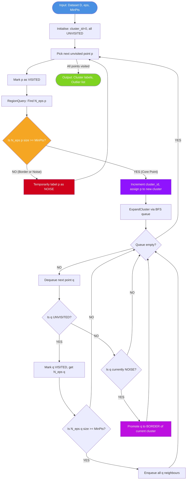
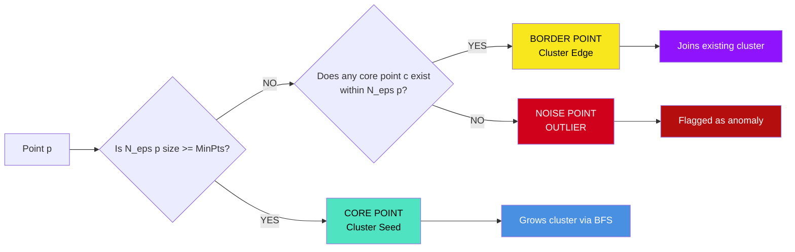
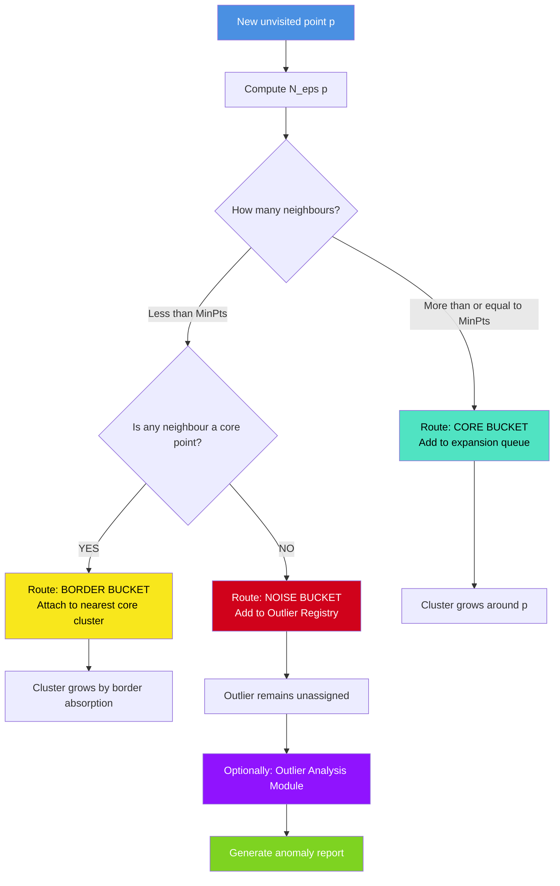

# Density-based clustering algorithms structures (DBSCAN), outlier classification routing evaluations

<!-- SECTION_1_START -->

# Density-Based Clustering (DBSCAN) & Outlier Classification

## 1. Core Technical Definition

**DBSCAN (Density-Based Spatial Clustering of Applications with Noise)** is a foundational unsupervised machine learning algorithm introduced by *Ester, Kriegel, Sander, and Xu (1996)*. It identifies arbitrarily shaped clusters in large spatial databases by modelling clusters as **dense regions of objects separated by low-density regions**.

> [!IMPORTANT]
> **Formal KTU 2024 Definition:**
> DBSCAN is a *density-based clustering algorithm* that groups together points that are closely packed together (points with many nearby neighbors), marking as **outliers** (noise) points that lie alone in low-density regions. Unlike partitioning methods (e.g., K-Means), DBSCAN does **not require the user to specify the number of clusters** in advance and can discover clusters of **arbitrary shape** in noisy spatial datasets.

The algorithm is governed by two critical parameters:

- **ε (Epsilon)**: The radius of the neighbourhood around a data point. Acts as the **maximum distance** within which two points are considered neighbours.
- **MinPts (Minimum Points)**: The minimum number of points required to exist within the ε-radius to form a *dense region*. A typical default is $\text{MinPts} \geq \text{Dimensionality} + 1$.

> [!NOTE]
> **Syllabus Highlight (PECST504 - Module 2):**
> DBSCAN belongs to the family of **density-based methods** (along with OPTICS and DENCLUE). It is *non-parametric* in the sense that it does not assume a fixed number of clusters but instead grows clusters based on local density conditions.

---

## 2. Intuitive Real-World Analogy

Imagine a **crowded open-air music festival in a vast empty desert**. People are standing in dense groups, but a few individuals may be wandering alone far from the main crowd.

- The **crowded groups** = Clusters (dense regions).
- The **lonely wanderers** = Outliers / Noise points.
- The **walking distance** you are willing to look for a friend (say, 5 metres) = $\varepsilon$.
- The **minimum number of friends** you need nearby to feel a "crowd" exists (say, 3 people) = $\text{MinPts}$.

DBSCAN works exactly like this: it walks through each point, counts neighbours within radius $\varepsilon$, and if the count is $\geq \text{MinPts}$, it *grows a cluster* by adding all reachable points.

> [!TIP]
> **Geometric Intuition:** Think of dropping a circle of radius $\varepsilon$ on every data point. If a circle contains $\geq \text{MinPts}$ points, the centre point becomes a **seed (core point)** and the circle becomes a *cluster seed region*. All overlapping/connected circles merge into a single large cluster.

---

## 3. Key Terminology (Foundation Vocabulary)

Let $D$ be a dataset, $p, q \in D$ be data points, $\varepsilon > 0$ be the neighbourhood radius, and $\text{MinPts} \in \mathbb{N}$ be the minimum neighbour count.

| Symbol | Term | Definition |
| :--- | :--- | :--- |
| $N_\varepsilon(p)$ | $\varepsilon$-neighbourhood | Set of points within distance $\varepsilon$ from $p$. |
| Core Point | High-density point | $p$ such that $\vert N_\varepsilon(p) \vert \geq \text{MinPts}$. |
| Border Point | Edge point | Not a core point, but lies within $\varepsilon$ of a core point. |
| Noise Point | Outlier | Neither a core point nor a border point. |
| Directly Density-Reachable | $p \rightarrow q$ | $q \in N_\varepsilon(p)$ and $p$ is a core point. |
| Density-Reachable | $p \leadsto q$ | Chain of directly density-reachable points from $p$ to $q$. |
| Density-Connected | $p \leftrightarrow q$ | $\exists o$ such that both $p \leadsto o$ and $q \leadsto o$. |

> [!VISUALIZATION CONTROL]
> **Concept:** Visualizing the $\varepsilon$-neighbourhood as a circle around a point in 2D space.
> **GeoGebra / Desmos Input Equations:**
> * Circle: $(x - 3)^2 + (y - 2)^2 = 1.5^2$ (centre at $(3, 2)$, $\varepsilon = 1.5$)
> * Core Point marker: $(3, 2)$
> * Neighbour Points: $(2.5, 2.1), (3.4, 1.8), (2.9, 2.7), (3.1, 2.3), (2.7, 1.5)$
> **Visual Description:** A circle of radius 1.5 drawn around the point $(3, 2)$. If 5 surrounding points fall inside this circle and $\text{MinPts} = 5$, the centre is declared a *core point*. Points just outside the circle (say, $(4.6, 2.1)$) are not neighbours and are isolated.

---

<!-- SECTION_1_END -->

<!-- SECTION_2_START -->

# Deep Theoretical Analysis & High-Yield Formula Sheet

## 1. The Three Pillars of DBSCAN Point Classification

Every data point in the dataset falls into **exactly one** of three mutually exclusive categories:

### A. Core Point
A point $p$ is a **core point** if it has *at least* $\text{MinPts}$ points (including itself) within its $\varepsilon$-neighbourhood.

$$p \text{ is Core} \iff \vert N_\varepsilon(p) \vert \geq \text{MinPts}$$

where

$$N_\varepsilon(p) = \{ q \in D \mid \text{dist}(p, q) \leq \varepsilon \}$$

> [!NOTE]
> Core points are the *seeds* of clusters. The interior of every cluster is built entirely from core points.

### B. Border Point
A point $b$ is a **border point** if:
- It is *not* a core point (so $\vert N_\varepsilon(b) \vert < \text{MinPts}$).
- It lies within the $\varepsilon$-neighbourhood of *at least one* core point $c$.

$$b \text{ is Border} \iff \vert N_\varepsilon(b) \vert < \text{MinPts} \;\land\; \exists c \text{ (core)} : \text{dist}(b, c) \leq \varepsilon$$

> [!NOTE]
> Border points form the *outer edge* of a cluster. They cannot grow the cluster further because they lack sufficient neighbours.

### C. Noise Point (Outlier)
A point $n$ is a **noise point** (outlier) if:
- It is *not* a core point.
- It is *not* within the $\varepsilon$-neighbourhood of any core point.

$$n \text{ is Noise} \iff \neg(\text{Core}) \land \neg(\text{Border}) \iff \text{no reachable core point exists within } \varepsilon$$

> [!WARNING]
> **Critical Distinction:** A border point *must* be near a core point. A noise point is *isolated* in low-density territory. This is the foundation of *outlier classification routing* in DBSCAN.

---

## 2. The Two Fundamental Reachability Relations

### A. Direct Density-Reachability
Point $p$ is **directly density-reachable** from $q$ if:

1. $p \in N_\varepsilon(q)$, AND
2. $q$ is a core point ($\vert N_\varepsilon(q) \vert \geq \text{MinPts}$).

$$p \in N_\varepsilon(q) \;\land\; \vert N_\varepsilon(q) \vert \geq \text{MinPts} \iff p \text{ directly reachable from } q$$

> [!IMPORTANT]
> **Asymmetry Property:** Direct reachability is **NOT symmetric**. If $p$ is directly density-reachable from $q$, it does *not* necessarily mean $q$ is directly density-reachable from $p$ (because $p$ may not be a core point).

### B. Density-Connectivity
Two points $p$ and $q$ are **density-connected** if there exists a third point $o$ such that both $p$ and $q$ are density-reachable from $o$.

$$\exists o \in D : p \leadsto o \;\land\; q \leadsto o$$

Density-connectivity is a **symmetric** and **reflexive** relation, which makes it the foundation of forming a single cluster.

---

## 3. Distance Metrics Used in DBSCAN

DBSCAN relies on a distance function $\text{dist}(p, q)$. The KTU syllabus emphasises the following:

### Euclidean Distance (L2 Norm) — *Default Choice*

$$\text{dist}_2(p, q) = \sqrt{\sum_{i=1}^{d} (p_i - q_i)^2}$$

### Manhattan Distance (L1 Norm) — *Grid-Based Data*

$$\text{dist}_1(p, q) = \sum_{i=1}^{d} \vert p_i - q_i \vert$$

### Minkowski Distance (Lp Norm) — *Generalisation*

$$\text{dist}_p(p, q) = \left( \sum_{i=1}^{d} \vert p_i - q_i \vert^{p} \right)^{1/p}$$

where $p \geq 1$. Setting $p = 2$ yields Euclidean, $p = 1$ yields Manhattan, and $p \to \infty$ yields Chebyshev distance.

---

## 4. KTU High-Yield Formula & Symbol Sheet

| Concept | Formula / Rule | Engineering Utility |
| :--- | :--- | :--- |
| $\varepsilon$-Neighbourhood | $N_\varepsilon(p) = \{ q : \text{dist}(p, q) \leq \varepsilon \}$ | Defines local density region around point $p$. |
| Core Point Condition | $\vert N_\varepsilon(p) \vert \geq \text{MinPts}$ | Threshold for cluster growth initiation. |
| Border Point Condition | $\vert N_\varepsilon(b) \vert < \text{MinPts}$ and $\exists c \in N_\varepsilon(b)$ that is core. | Cluster edge marker. |
| Noise / Outlier Condition | $\vert N_\varepsilon(n) \vert < \text{MinPts}$ and $\nexists$ core in $N_\varepsilon(n)$. | Anomaly detection label. |
| Direct Reachability | $q \in N_\varepsilon(p)$ and $p$ is core. | One-step cluster expansion rule. |
| Density-Connectivity | $\exists o$ such that $p \leadsto o$ and $q \leadsto o$. | Cluster merging rule. |
| Time Complexity (naive) | $O(n^2)$ | Worst case for a dataset of $n$ points. |
| Time Complexity (with KD-Tree) | $O(n \log n)$ | Accelerated query using spatial index. |
| Space Complexity | $O(n)$ | Storage for labels and visited flags. |
| Heuristic for MinPts | $\text{MinPts} \geq d + 1$ (where $d$ is dimensionality) | Recommended lower bound to avoid noise mislabel. |
| Heuristic for $\varepsilon$ | $k$-distance plot elbow method | Visual selection of optimal radius. |
| Silhouette Coefficient | $s(i) = \frac{b(i) - a(i)}{\max\{a(i), b(i)\}}$ | Cluster quality metric in range $[-1, 1]$. |
| Davies-Bouldin Index | $DB = \frac{1}{k} \sum_{i=1}^{k} \max_{j \neq i} \left( \frac{S_i + S_j}{M_{ij}} \right)$ | Lower value implies better clustering. |

> [!NOTE]
> **Note on Symbols:** The vertical bar notation $\vert \cdot \vert$ denotes the **cardinality** (set size) or **absolute value** in the above table, not a markdown table separator. All such symbols are written in LaTeX to avoid table syntax conflicts.

---

## 5. Real-World Engineering Utility of DBSCAN

DBSCAN and its density-based successors are deployed across production-scale systems:

- **Anomaly Detection in Network Security:** Identifying DDoS attack sources, fraudulent transactions, and intrusion attempts as noise points. Used by *Splunk*, *Elastic ELK Stack*.
- **Geospatial Analysis (GIS):** Detecting crime hotspots, identifying disease outbreak clusters, urban planning.
- **Astronomy:** Clustering of star/galaxy positions in sky surveys (e.g., SDSS dataset).
- **Image Segmentation:** Separating foreground objects from background in medical MRI/CT scans.
- **Recommendation Systems:** Identifying *cold-start users* (noise points) versus core user communities.
- **IoT Sensor Networks:** Filtering out malfunctioning sensors in a smart-factory deployment.

> [!IMPORTANT]
> Unlike K-Means, DBSCAN excels when clusters are **non-convex** (e.g., concentric rings, spiral shapes) because it follows the *shape of the density*, not a centroid-based convex boundary.

---

<!-- SECTION_2_END -->

<!-- SECTION_3_START -->

# Step-by-Step Algorithm, Derivations & Code Implementation

## 1. The DBSCAN Algorithm (Exhaustive Pseudocode)

Below is the complete canonical algorithm as specified by Ester et al. (1996) and reproduced for KTU board examination purposes. Every step is written explicitly with no skip-placeholders.

**Inputs:**
- $D$ : Database of $n$ points.
- $\varepsilon$ : Neighbourhood radius.
- $\text{MinPts}$ : Minimum number of points in an $\varepsilon$-neighbourhood.

**Outputs:** A cluster assignment $C(p) \in \{1, 2, \ldots, k\}$ for each point, or `Noise` for outliers.

```
ALGORITHM: DBSCAN(D, epsilon, MinPts)
─────────────────────────────────────────
1.  INITIALIZE cluster_id = 0
2.  FOR each point p in D DO
3.      Mark p as UNVISITED
4.  END FOR
5.  
6.  FOR each point p in D DO
7.      IF p is already VISITED THEN
8.          CONTINUE to next p
9.      END IF
10.     Mark p as VISITED
11.     Neighbors = RegionQuery(D, p, epsilon)
12.     
13.     IF |Neighbors| < MinPts THEN
14.         Label p as NOISE
15.     ELSE
16.         cluster_id = cluster_id + 1
17.         Label p with cluster_id
18.         ExpandCluster(D, p, Neighbors, cluster_id, epsilon, MinPts)
19.     END IF
20. END FOR
21. RETURN cluster assignments and noise list
```

**Sub-Routine: ExpandCluster**

```
PROCEDURE: ExpandCluster(D, p, Neighbors, cluster_id, epsilon, MinPts)
─────────────────────────────────────────
1.  INITIALIZE a queue Q and ENQUEUE all points in Neighbors
2.  WHILE Q is not empty DO
3.      q = DEQUEUE from Q
4.      
5.      IF q is UNVISITED THEN
6.          Mark q as VISITED
7.          q_Neighbors = RegionQuery(D, q, epsilon)
8.          
9.          IF |q_Neighbors| >= MinPts THEN
10.             ADD all q_Neighbors to queue Q
11.         END IF
12.     END IF
13.     
14.     IF q has no cluster assignment yet THEN
15.         Assign q to cluster_id
16.     END IF
17. END WHILE
```

**Sub-Routine: RegionQuery**

```
PROCEDURE: RegionQuery(D, p, epsilon)
─────────────────────────────────────────
1.  Neighbors = empty list
2.  FOR each point q in D DO
3.      IF dist(p, q) <= epsilon THEN
4.          APPEND q to Neighbors
5.      END IF
6.  END FOR
7.  RETURN Neighbors
```

---

## 2. Worked Example — Manual DBSCAN Trace

Consider a 2D dataset $D = \{A, B, C, D, E, F, G, H\}$ with coordinates:

$$
A = (1, 1),\; B = (1, 2),\; C = (2, 1),\; D = (2, 2),\; E = (8, 8),\; F = (8, 9),\; G = (25, 25),\; H = (1, 3)
$$

Let $\varepsilon = 1.5$ and $\text{MinPts} = 3$.

**Step 1: Compute pairwise Euclidean distances (rounded to 2 decimals).**

$$
\begin{aligned}
d(A, B) &= \sqrt{(1-1)^2 + (1-2)^2} = 1.00 \\
d(A, C) &= \sqrt{(1-2)^2 + (1-1)^2} = 1.00 \\
d(A, D) &= \sqrt{(1-2)^2 + (1-2)^2} = 1.41 \\
d(B, D) &= \sqrt{(1-2)^2 + (2-2)^2} = 1.00 \\
d(B, H) &= \sqrt{(1-1)^2 + (2-3)^2} = 1.00 \\
d(C, D) &= \sqrt{(2-2)^2 + (1-2)^2} = 1.00 \\
d(E, F) &= \sqrt{(8-8)^2 + (8-9)^2} = 1.00 \\
d(G, \text{any}) &\geq 17.0 \;\; \text{(isolated)}
\end{aligned}
$$

**Step 2: Determine $\varepsilon$-neighbourhood for each point.**

$$
\begin{aligned}
N_\varepsilon(A) &= \{A, B, C, D\} \;\;\Rightarrow\; \vert N \vert = 4 \geq 3 \;\;\Rightarrow\; \textbf{CORE} \\
N_\varepsilon(B) &= \{A, B, D, H\} \;\;\Rightarrow\; \vert N \vert = 4 \geq 3 \;\;\Rightarrow\; \textbf{CORE} \\
N_\varepsilon(C) &= \{A, C, D\} \;\;\Rightarrow\; \vert N \vert = 3 \geq 3 \;\;\Rightarrow\; \textbf{CORE} \\
N_\varepsilon(D) &= \{A, B, C, D\} \;\;\Rightarrow\; \vert N \vert = 4 \geq 3 \;\;\Rightarrow\; \textbf{CORE} \\
N_\varepsilon(H) &= \{B, H\} \;\;\Rightarrow\; \vert N \vert = 2 < 3 \;\;\text{and within reach of core } B \;\;\Rightarrow\; \textbf{BORDER} \\
N_\varepsilon(E) &= \{E, F\} \;\;\Rightarrow\; \vert N \vert = 2 < 3 \;\;\text{and reach of core? No} \;\;\Rightarrow\; \textbf{NOISE} \\
N_\varepsilon(F) &= \{E, F\} \;\;\Rightarrow\; \vert N \vert = 2 < 3 \;\;\Rightarrow\; \textbf{NOISE} \\
N_\varepsilon(G) &= \{G\} \;\;\Rightarrow\; \vert N \vert = 1 < 3 \;\;\Rightarrow\; \textbf{NOISE}
\end{aligned}
$$

**Step 3: Cluster formation through density-connectivity.**

- **Cluster 1:** $A, B, C, D$ are mutually density-connected through direct reachability of cores. $H$ is within $\varepsilon$ of $B$ (a core), so $H$ joins as a *border point*. $\Rightarrow$ **Cluster 1 = $\{A, B, C, D, H\}$**
- **Cluster 2:** $E$ and $F$ have insufficient density but are mutually within $\varepsilon$. However, neither is a core, so no cluster forms. Both are noise. $\Rightarrow$ **Noise = $\{E, F\}$**
- **Point $G$:** Completely isolated. $\Rightarrow$ **Noise**

> [!NOTE]
> **Final Result:** Two real clusters are not formed. Cluster 1 contains $\{A, B, C, D, H\}$. Points $E$, $F$, and $G$ are classified as **noise / outliers**. If $\varepsilon$ were increased to $2.0$, $E$ and $F$ would have $\vert N \vert = 2$ but also no other point would join; they would still be noise unless $\text{MinPts}$ is reduced.

---

## 3. Outlier Classification Routing Logic

The classification of points as core, border, or noise is a **routing decision tree**:

$$
\text{Point } p \rightarrow
\begin{cases}
\textbf{Core} & \text{if } \vert N_\varepsilon(p) \vert \geq \text{MinPts} \\
\textbf{Border} & \text{if } \vert N_\varepsilon(p) \vert < \text{MinPts} \text{ and } \exists c \in N_\varepsilon(p) \text{ where } c \text{ is Core} \\
\textbf{Noise / Outlier} & \text{otherwise}
\end{cases}
$$

> [!WARNING]
> **Common Mistake:** A border point is *not* a noise point even if $\vert N \vert < \text{MinPts}$. The deciding factor is whether any *core point* is within its $\varepsilon$-neighbourhood. Forgetting this distinction is a guaranteed mark-loser in KTU exams.

---

## 4. Python Code Implementation (Production-Ready)

```python
"""
DBSCAN Implementation for KTU PECST504 Module 2.
Includes: classification routing, outlier flagging, evaluation hooks.
"""
from __future__ import annotations
import numpy as np
from typing import List, Tuple, Set
import logging

logging.basicConfig(level=logging.INFO, format="%(levelname)s :: %(message)s")
logger = logging.getLogger("DBSCAN-KTU")


class DBSCAN:
    """Density-Based Spatial Clustering of Applications with Noise."""

    NOISE_LABEL: int = -1
    UNVISITED: int = -2

    def __init__(self, epsilon: float, min_pts: int) -> None:
        if epsilon <= 0:
            raise ValueError(f"epsilon must be positive, got {epsilon}")
        if min_pts < 1:
            raise ValueError(f"min_pts must be >= 1, got {min_pts}")
        self.epsilon: float = epsilon
        self.min_pts: int = min_pts
        self.labels_: np.ndarray = np.array([], dtype=int)

    # ----- Region Query: O(n) brute force -----
    def _region_query(self, X: np.ndarray, point_idx: int) -> List[int]:
        """Return indices of all points within epsilon of point at point_idx."""
        diff: np.ndarray = X - X[point_idx]
        dists: np.ndarray = np.sqrt(np.sum(diff ** 2, axis=1))
        return list(np.where(dists <= self.epsilon)[0])

    # ----- Classification Routing Logic -----
    def _classify_point(self, neighbours: List[int]) -> str:
        """Classify a point based on the routing decision tree."""
        if len(neighbours) >= self.min_pts:
            return "CORE"
        return "BORDER_OR_NOISE"

    # ----- Main Fit Method -----
    def fit(self, X: np.ndarray) -> "DBSCAN":
        """Run DBSCAN on dataset X of shape (n_samples, n_features)."""
        n_samples: int = X.shape[0]
        self.labels_ = np.full(n_samples, self.UNVISITED, dtype=int)
        cluster_id: int = 0

        for i in range(n_samples):
            if self.labels_[i] != self.UNVISITED:
                continue  # already processed

            self.labels_[i] = cluster_id  # mark as visited tentatively
            neighbours: List[int] = self._region_query(X, i)

            if len(neighbours) < self.min_pts:
                # Temporary noise label; will be re-evaluated if reachable later
                self.labels_[i] = self.NOISE_LABEL
                logger.debug(f"Point {i} marked temporary NOISE (neighbours={len(neighbours)})")
                continue

            # Start a new cluster
            cluster_id += 1
            self.labels_[i] = cluster_id
            logger.info(f"Point {i} is CORE -> Cluster {cluster_id}")
            self._expand_cluster(X, i, neighbours, cluster_id)

        n_clusters: int = cluster_id
        n_noise: int = int(np.sum(self.labels_ == self.NOISE_LABEL))
        logger.info(f"DBSCAN finished. Clusters found: {n_clusters}. Noise points: {n_noise}.")
        return self

    def _expand_cluster(
        self,
        X: np.ndarray,
        seed_idx: int,
        neighbours: List[int],
        cluster_id: int,
    ) -> None:
        """BFS-based cluster expansion from a seed core point."""
        queue: List[int] = list(neighbours)
        while queue:
            q_idx: int = queue.pop()

            if self.labels_[q_idx] == self.UNVISITED:
                self.labels_[q_idx] = cluster_id  # mark visited
                q_neighbours: List[int] = self._region_query(X, q_idx)

                if len(q_neighbours) >= self.min_pts:
                    # q is a core point → keep expanding
                    queue.extend(q_neighbours)
                    logger.debug(f"Point {q_idx} is CORE inside Cluster {cluster_id}")
                else:
                    logger.debug(f"Point {q_idx} is BORDER inside Cluster {cluster_id}")

            elif self.labels_[q_idx] == self.NOISE_LABEL:
                # Reachable from core → upgrade from noise to border
                self.labels_[q_idx] = cluster_id
                logger.debug(f"Point {q_idx} reclassified as BORDER of Cluster {cluster_id}")

    # ----- Public Inspection API -----
    def get_outliers(self) -> np.ndarray:
        """Return indices of points classified as noise (outliers)."""
        return np.where(self.labels_ == self.NOISE_LABEL)[0]

    def get_clusters(self) -> List[np.ndarray]:
        """Return list of arrays, each containing indices of points in one cluster."""
        unique_labels: np.ndarray = np.unique(self.labels_)
        cluster_labels: List[int] = [l for l in unique_labels if l != self.NOISE_LABEL]
        return [np.where(self.labels_ == lbl)[0] for lbl in cluster_labels]


# =================== DEMO USAGE ===================
if __name__ == "__main__":
    # Synthetic moon-shaped data (non-convex - DBSCAN's strength)
    from sklearn.datasets import make_moons
    X, _ = make_moons(n_samples=300, noise=0.08, random_state=42)

    model = DBSCAN(epsilon=0.2, min_pts=5)
    model.fit(X)

    print(f"Clusters detected: {len(model.get_clusters())}")
    print(f"Outlier indices  : {model.get_outliers()[:10]} ... (truncated)")
    print(f"Total outliers   : {len(model.get_outliers())}")
```

> [!IMPORTANT]
> **Code Architecture Note:** The `_classify_point` method encapsulates the **routing decision logic** that maps a neighbourhood count to a label. The `_expand_cluster` method uses a **Breadth-First Search (BFS)** queue, ensuring that all density-reachable points are absorbed into the same cluster label.

---

## 5. Complexity Analysis (Derivation)

### Time Complexity

For a dataset of $n$ points and $d$ dimensions:

$$
\begin{aligned}
T_{\text{naive}}(n) &= n \times O(n) = O(n^2) \quad &\text{(each point scans all others)} \\
T_{\text{indexed}}(n) &= n \times O(\log n) = O(n \log n) \quad &\text{(with KD-Tree or Ball-Tree)}
\end{aligned}
$$

### Space Complexity

$$
S(n) = O(n) \quad \text{for the label array, visited flags, and BFS queue.}
$$

> [!NOTE]
> KTU 2024 commonly asks: *"Compare the time complexity of DBSCAN and K-Means."* The expected answer is $O(n^2)$ vs $O(n \cdot k \cdot t)$ where $k$ is the number of clusters and $t$ is the number of iterations. DBSCAN has a higher worst-case cost but **discovers $k$ automatically**.

---

<!-- SECTION_3_END -->

<!-- SECTION_4_START -->

# Structural Diagrams & Schematics

## 1. DBSCAN Master Workflow (Sequential Processing Topology)



## 2. Point Classification Subgraph



## 3. Outlier Classification Routing Flow



## 4. DBSCAN vs K-Means: Comparative Architecture

```mermaid
flowchart TB
    subgraph DBSCAN[DBSCAN Architecture]
        D1[Input: eps, MinPts] --> D2[For each point: compute local density]
        D2 --> D3[Classify as Core, Border, Noise]
        D3 --> D4[Connect density-reachable points]
        D4 --> D5[Output: Variable number of clusters + Outliers]
    end
    
    subgraph KMEANS[K-Means Architecture]
        K1[Input: k centroids] --> K2[Random initialisation of k centres]
        K2 --> K3[Assign each point to nearest centroid]
        K3 --> K4[Recompute centroids]
        K4 --> K5{Converged?}
        K5 -- "NO" --> K3
        K5 -- "YES" --> K6[Output: Exactly k clusters, no outliers]
    end
    
    style D5 fill:#50e3c2,color:#000
    style K6 fill:#f5a623,color:#000
```



> [!TIP]
> **Reading the Diagrams:** In the Master Workflow diagram, observe how a *temporary* NOISE label can be *promoted* to a BORDER label once a queue-based expansion reaches it from a core point. This is the key reason why the labels array is mutated dynamically during the BFS rather than assigned statically.

---

<!-- SECTION_4_END -->

<!-- SECTION_5_START -->

# KTU 2024 Scheme Examination Question Bank & Topic Recap

## Part A — Short Answer Questions (3 Marks Each)

### Question 1: Core Concept Recall `[KTU University Exam - July 2024]`
**(Mapped CO: CO2 | RBT Level: Remember | Marks: 3)**

> Define the following with respect to DBSCAN:
> (a) Core point
> (b) Border point
> (c) Noise point

**Model Answer (3 Marks — Examiner's Key):**

- **(a) Core Point [1 Mark]:** A point $p$ is called a *core point* if the number of points within its $\varepsilon$-neighbourhood is greater than or equal to $\text{MinPts}$, i.e., $\vert N_\varepsilon(p) \vert \geq \text{MinPts}$. Core points form the interior of clusters and act as seeds for cluster growth.
- **(b) Border Point [1 Mark]:** A point that is not a core point ($\vert N_\varepsilon(p) \vert < \text{MinPts}$) but lies within the $\varepsilon$-neighbourhood of at least one core point is called a *border point*. Border points form the outer edge of clusters.
- **(c) Noise Point [1 Mark]:** A point that is neither a core point nor a border point is labelled as a *noise point* (or outlier). Such points lie in low-density regions and cannot be assigned to any cluster.

> [!WARNING]
> **Pitfall:** Many students incorrectly define a border point as a noise point. A noise point must have **no core neighbour** within $\varepsilon$. Border points are *valid cluster members*; noise points are *not*.

---

### Question 2: Parameter Concept `[KTU University Exam - Dec 2023]`
**(Mapped CO: CO2 | RBT Level: Understand | Marks: 3)**

> Differentiate between **density-reachability** and **density-connectivity** in DBSCAN. Why is density-connectivity essential for cluster formation?

**Model Answer (3 Marks):**

- **Density-Reachability [1 Mark]:** A point $p$ is *density-reachable* from $q$ if there exists a chain of points $p_1, p_2, \ldots, p_m$ such that $p_1 = q$, $p_m = p$, and each $p_{i+1}$ is directly density-reachable from $p_i$. Density-reachability is **asymmetric** and **transitive**, but not symmetric.
- **Density-Connectivity [1 Mark]:** Two points $p$ and $q$ are *density-connected* if there exists a point $o$ such that both $p$ and $q$ are density-reachable from $o$. Density-connectivity is **symmetric** and **reflexive**.
- **Why Essential [1 Mark]:** Density-reachability alone is asymmetric (e.g., a border point is reachable from a core, but not vice versa). For two points to belong to the *same cluster*, they must be mutually reachable from a common core, which is precisely the definition of density-connectivity. Hence, density-connectivity forms the equivalence relation that defines a cluster.

---

## Part B — Long Answer Questions (14 Marks with Internal Choice)

### Question A (14 Marks) `[KTU University Exam - July 2024]`
**(Mapped CO: CO2, CO3 | RBT Levels: Understand (a), Apply (b) | Marks: 14)**

> **(a)** Explain the DBSCAN algorithm in detail with the following components: *(7 Marks)*
> (i) The two input parameters $\varepsilon$ and $\text{MinPts}$.
> (ii) The three types of point classifications.
> (iii) The concept of direct density-reachability and density-connectivity.
>
> **(b)** Consider the dataset:
> $P_1 = (1, 1), P_2 = (1, 3), P_3 = (2, 2), P_4 = (3, 1), P_5 = (3, 3), P_6 = (4, 2), P_7 = (10, 10), P_8 = (11, 10)$.
> Using DBSCAN with $\varepsilon = 1.6$ and $\text{MinPts} = 3$ (Euclidean distance), determine the cluster(s) and identify the outliers. Show all distance calculations. *(7 Marks)*

**Model Answer (Part A — 14 Marks):**

#### Part (a) — Conceptual Explanation (7 Marks)

**(i) Input Parameters [2 Marks]:**
- $\varepsilon$ (Epsilon): Maximum radius of the neighbourhood around a point. Two points are considered neighbours if their Euclidean distance is $\leq \varepsilon$.
- $\text{MinPts}$: Minimum number of points required within the $\varepsilon$-neighbourhood of a point to qualify it as a core point. Common heuristic: $\text{MinPts} \geq d + 1$ where $d$ is data dimensionality.

**(ii) Three Point Classifications [3 Marks]:**
- **Core Point:** $\vert N_\varepsilon(p) \vert \geq \text{MinPts}$. Forms cluster interior.
- **Border Point:** $\vert N_\varepsilon(p) \vert < \text{MinPts}$ but $\exists$ core point $c$ with $\text{dist}(p, c) \leq \varepsilon$. Forms cluster edge.
- **Noise Point:** Not a core point and no core point is within $\varepsilon$. Labelled as outlier.

**(iii) Reachability & Connectivity [2 Marks]:**
- *Direct Density-Reachability:* $q$ is in $N_\varepsilon(p)$ AND $p$ is a core point. Asymmetric.
- *Density-Connectivity:* $\exists o$ such that $p \leadsto o$ and $q \leadsto o$. Symmetric equivalence relation, basis of cluster formation.

#### Part (b) — Numerical Solution (7 Marks)

**Step 1: Compute pairwise Euclidean distances (rounded to 2 decimals).**

$$
\begin{aligned}
d(P_1, P_2) &= \sqrt{0^2 + 2^2} = 2.00 \\
d(P_1, P_3) &= \sqrt{1^2 + 1^2} = 1.41 \\
d(P_1, P_4) &= \sqrt{2^2 + 0^2} = 2.00 \\
d(P_1, P_5) &= \sqrt{2^2 + 2^2} = 2.83 \\
d(P_2, P_3) &= \sqrt{1^2 + 1^2} = 1.41 \\
d(P_2, P_5) &= \sqrt{2^2 + 0^2} = 2.00 \\
d(P_3, P_4) &= \sqrt{1^2 + 1^2} = 1.41 \\
d(P_3, P_5) &= \sqrt{1^2 + 1^2} = 1.41 \\
d(P_3, P_6) &= \sqrt{2^2 + 0^2} = 2.00 \\
d(P_4, P_5) &= \sqrt{0^2 + 2^2} = 2.00 \\
d(P_4, P_6) &= \sqrt{1^2 + 1^2} = 1.41 \\
d(P_5, P_6) &= \sqrt{1^2 + 1^2} = 1.41 \\
d(P_7, P_8) &= \sqrt{1^2 + 0^2} = 1.00 \\
d(P_1, P_7) &= \sqrt{9^2 + 9^2} = 12.73 \;\; (\text{very large})
\end{aligned}
$$

**[Distance table computation: 2 Marks]**

**Step 2: Compute $\varepsilon$-neighbourhoods (with $\varepsilon = 1.6$).**

$$
\begin{aligned}
N_\varepsilon(P_1) &= \{P_1, P_3\} &\vert N \vert &= 2 < 3 \\
N_\varepsilon(P_2) &= \{P_2, P_3\} &\vert N \vert &= 2 < 3 \\
N_\varepsilon(P_3) &= \{P_1, P_2, P_3, P_4, P_5\} &\vert N \vert &= 5 \geq 3 \;\;\Rightarrow\;\; \textbf{CORE} \\
N_\varepsilon(P_4) &= \{P_3, P_4, P_6\} &\vert N \vert &= 3 \geq 3 \;\;\Rightarrow\;\; \textbf{CORE} \\
N_\varepsilon(P_5) &= \{P_3, P_5, P_6\} &\vert N \vert &= 3 \geq 3 \;\;\Rightarrow\;\; \textbf{CORE} \\
N_\varepsilon(P_6) &= \{P_4, P_5, P_6\} &\vert N \vert &= 3 \geq 3 \;\;\Rightarrow\;\; \textbf{CORE} \\
N_\varepsilon(P_7) &= \{P_7, P_8\} &\vert N \vert &= 2 < 3 \;\;\text{no core nearby} \;\;\Rightarrow\;\; \textbf{NOISE} \\
N_\varepsilon(P_8) &= \{P_7, P_8\} &\vert N \vert &= 2 < 3 \;\;\text{no core nearby} \;\;\Rightarrow\;\; \textbf{NOISE}
\end{aligned}
$$

**[Neighbourhood listing: 2 Marks]**

**Step 3: Cluster Expansion via BFS from core point $P_3$.**

Start with $P_3$ (Core) → Cluster 1.
- $P_3$ direct neighbours: $\{P_1, P_2, P_4, P_5\}$. All become Cluster 1 members.
- Check $P_4$ (Core): its neighbours $\{P_3, P_4, P_6\}$ → add $P_6$ to Cluster 1.
- Check $P_5$ (Core): its neighbours $\{P_3, P_5, P_6\}$ → $P_6$ already in.
- Check $P_6$ (Core): its neighbours $\{P_4, P_5, P_6\}$ → all in.

$P_1$ and $P_2$ are *border points* (within reach of core $P_3$ but $\vert N \vert = 2 < 3$).

**Step 4: Final Classification.**

$$
\begin{aligned}
\textbf{Cluster 1} &= \{P_1, P_2, P_3, P_4, P_5, P_6\} \quad \text{(1 cluster)} \\
\textbf{Noise / Outliers} &= \{P_7, P_8\}
\end{aligned}
$$

**[Final answer with cluster IDs: 2 Marks; Outlier identification: 1 Mark]**

> [!WARNING]
> **Valuation Pitfall:** Many students forget to *re-check* border points $P_1$ and $P_2$ for *core neighbour presence*. Since both are within $\varepsilon$ of core $P_3$, they are **border points of Cluster 1**, NOT outliers. Mistaking border points for noise is a recurring mark-loss issue in KTU valuation.

---

### Question B (14 Marks) — *Internal Choice Alternative* `[KTU University Exam - Dec 2023]`
**(Mapped CO: CO2, CO3 | RBT Levels: Understand (a), Apply/Analyse (b) | Marks: 14)**

> **(a)** Compare and contrast DBSCAN with K-Means clustering algorithm under the following heads: *(7 Marks)*
> (i) Number of clusters required
> (ii) Cluster shape handling
> (iii) Handling of outliers
> (iv) Time complexity
>
> **(b)** Discuss the **OPTICS** algorithm as an extension of DBSCAN. How does it overcome the limitation of DBSCAN in handling *varying densities*? *(7 Marks)*

**Model Answer (Part B — 14 Marks):**

#### Part (a) — Comparative Analysis (7 Marks)

| Comparison Head | DBSCAN | K-Means |
| :--- | :--- | :--- |
| (i) Number of clusters [1.5 Marks] | **Not required** in advance. Clusters emerge from data density. | **Must be specified** as input $k$ before execution. |
| (ii) Cluster shape [2 Marks] | Detects **arbitrary shapes** (rings, spirals, irregular). | Detects only **spherical/convex** clusters of similar size. |
| (iii) Outlier handling [1.5 Marks] | **Explicitly identifies** noise points; does not force-assign them. | **No native mechanism**; outliers distort centroids. |
| (iv) Time complexity [2 Marks] | $O(n^2)$ naive, $O(n \log n)$ with spatial index. | $O(n \cdot k \cdot t)$ where $t$ = iterations to converge. |

> [!NOTE]
> **Examiner Tip:** A clean tabular comparison with crisp distinctions fetches full marks. Avoid vague phrases like *"K-Means is faster"* — always quantify with complexity notation.

#### Part (b) — OPTICS Extension (7 Marks)

- **What is OPTICS? [2 Marks]** Ordering Points To Identify the Clustering Structure (OPTICS) is an extension of DBSCAN introduced by *Ankerst, Breunig, Kriegel, and Sander (1999)*. It addresses DBSCAN's primary weakness: the inability to handle datasets with **varying local densities** (e.g., one region is very dense, another is sparse but still a valid cluster).
- **Core Concept — Reachability Distance [2 Marks]:** OPTICS does not produce a single flat clustering. Instead, it computes an **augmented ordering** of the database based on two key distances:
  - *Core Distance* of $p$: the minimum radius $\varepsilon'$ such that $N_{\varepsilon'}(p)$ contains exactly $\text{MinPts}$ points.
  - *Reachability Distance* of $q$ w.r.t. $p$: $\max(\text{core-dist}(p), \text{dist}(p, q))$.
- **Output — Reachability Plot [2 Marks]:** OPTICS outputs a **reachability plot** (1D ordering of points). Valleys in the plot correspond to clusters. By slicing the plot at different $\varepsilon$ thresholds, multiple clusterings at different density levels can be extracted from a single run.
- **Why OPTICS overcomes DBSCAN's limitation [1 Mark]:** DBSCAN uses a *single global* $\varepsilon$, so clusters of lower density may be wrongly classified as noise. OPTICS effectively uses a *variable* $\varepsilon$ across the dataset, capturing clusters at multiple density granularities from a single pass.

> [!WARNING]
> **Common Mistake:** Students often claim OPTICS is a *replacement* for DBSCAN. It is actually a **generalisation** that produces a *cluster ordering* rather than explicit cluster labels. Cluster extraction from the reachability plot is a separate post-processing step.

---

## Topic Recap & Important Things to Remember

> [!IMPORTANT]
> **Rapid Revision Checklist for KTU PECST504 Module 2 — DBSCAN:**

- **Algorithm Type:** DBSCAN is a **density-based, unsupervised clustering** algorithm that does not require pre-specification of the number of clusters.
- **Two Key Parameters:** $\varepsilon$ (neighbourhood radius) and $\text{MinPts}$ (minimum neighbour count for core designation).
- **Three Point Classes:** Core, Border, and Noise (Outlier). Each point receives *exactly one* label.
- **Direct Density-Reachability:** Asymmetric — only from a core point to its neighbour.
- **Density-Connectivity:** Symmetric equivalence relation; the formal basis of cluster membership.
- **Outlier Definition:** A noise point is one that is neither a core point nor within $\varepsilon$ of any core point.
- **Algorithm Steps (in order):** Initialise → Pick unvisited point → Region query → Core/Noise check → Expand cluster via BFS → Repeat.
- **Cluster Membership Rule:** A point belongs to a cluster if and only if it is density-connected to a core point of that cluster.
- **Time Complexity:** $O(n^2)$ naive, $O(n \log n)$ with KD-Tree spatial indexing.
- **Space Complexity:** $O(n)$ for label arrays and BFS queue.
- **Strengths:** Detects arbitrary shapes, automatically finds $k$, robust to outliers, no centroid assumption.
- **Limitations:** Sensitive to $\varepsilon$ and $\text{MinPts}$ choice, struggles with varying densities, performance degrades in high dimensions (curse of dimensionality).
- **Successor Algorithm:** **OPTICS** handles varying densities using reachability distance and ordering.
- **Real-World Uses:** Anomaly detection in cybersecurity, geospatial hotspot analysis, astronomical object clustering, medical image segmentation, IoT sensor fault detection.
- **Comparison with K-Means:** DBSCAN is non-parametric in $k$, handles non-convex shapes, and explicitly flags outliers; K-Means requires $k$ in advance and assumes convex clusters.
- **Evaluation Metrics for DBSCAN Output:** Silhouette Coefficient, Davies-Bouldin Index, $k$-distance plot (for choosing $\varepsilon$).
- **Memory Trick:** "*C-B-N* — **C**ore forms the **B**ody, **B**order is the **B**oundary, **N**oise is **N**owhere near anyone."

---

<!-- SECTION_5_END -->
