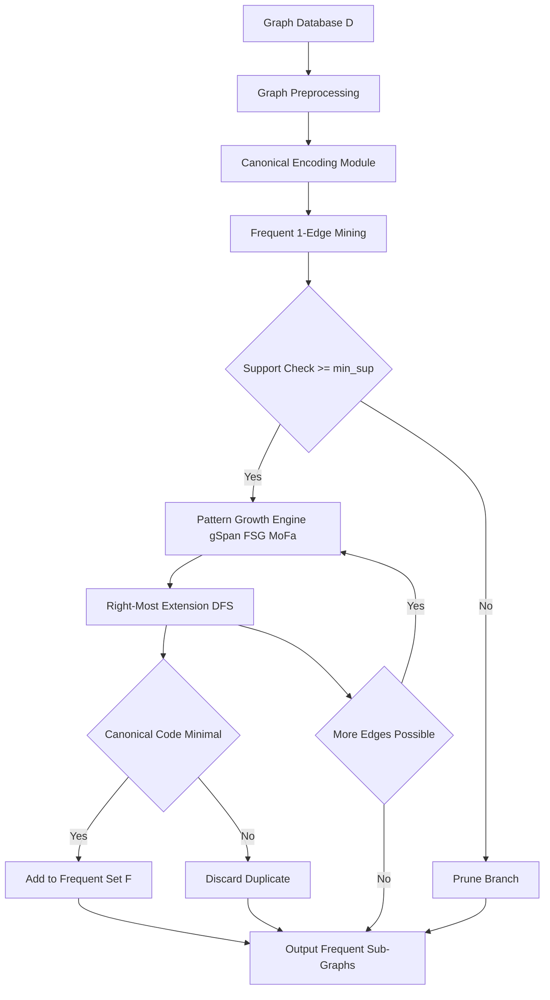
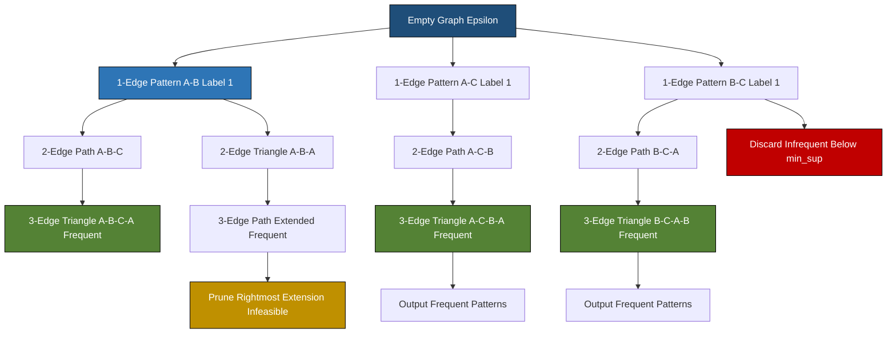
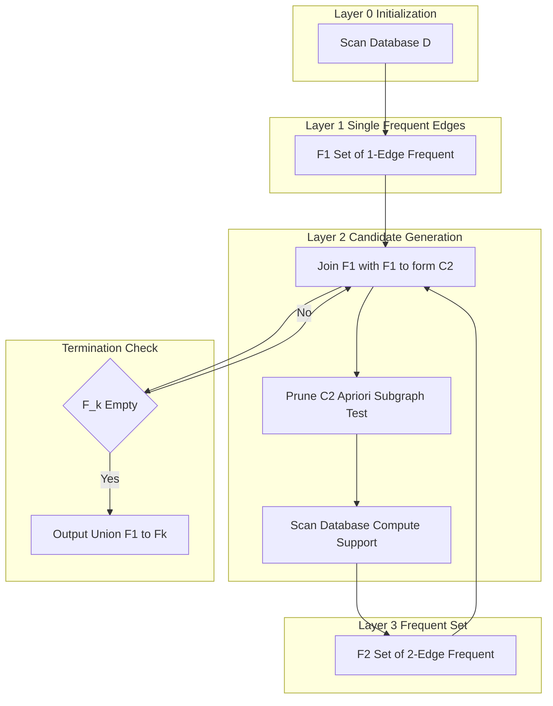
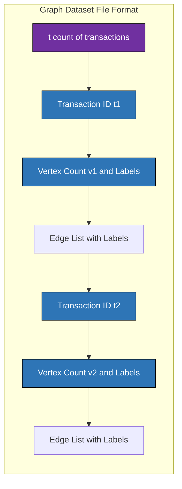

# Graph mining definitions frequent sub-graph pattern extraction tools structures

<!-- SECTION_1_START -->
# Graph Mining: Foundations, Frequent Sub-Graphs & Extraction Tools

> [!NOTE]
> **KTU 2024 Scheme | PECST504 Data Mining | Module 3**  
> **Core Focus:** Graph mining terminology, frequent sub-graph discovery, canonical labeling, and mining toolchain (gSpan, FSG, AGM, Gaston, MoFa).

## 1.1 Formal Definition (KTU Syllabus Standard)

**Graph Mining** is the systematic process of discovering non-trivial, useful, and previously unknown patterns, structures, or sub-structures from a large database of graphs $D = \{G_1, G_2, \ldots, G_n\}$. A **graph** $G = (V, E, L_V, L_E)$ is a mathematical structure where $V$ is a finite set of vertices (nodes), $E \subseteq V \times V$ is a set of edges, $L_V$ is a set of vertex labels, and $L_E$ is a set of edge labels.

A **frequent sub-graph pattern** is a sub-graph $g$ (with $g \subseteq G_i$ for some $G_i \in D$) whose *support count* across the database exceeds a user-defined minimum support threshold $\sigma_{min}$.

$$\text{Support}(g) = \vert \{ G_i \in D \mid g \text{ is sub-graph isomorphic to } G_i \} \vert \geq \sigma_{min}$$

## 1.2 Real-World Analogy: The Molecular Blueprint Detective

Imagine a forensic chemist examining thousands of chemical compounds in a database. Each **compound** is a graph — *atoms* are vertices (labeled by element type: C, H, O, N), and *chemical bonds* are edges (labeled by bond type: single, double, aromatic). The chemist wants to find recurring molecular fragments (e.g., "benzene ring + hydroxyl group" appears in aspirin, paracetamol, and thousands of other drugs).

- **Vertices = atoms**, **Edges = bonds**, **Labels = chemical identity**  
- **Frequent pattern = recurring toxicophore / pharmacophore**  
- **Support = "how many drugs contain this sub-structure?"**

> [!IMPORTANT]
> **KTU 2024 Definition Bank (Memorize These Terms):**
> - **Labeled Graph** — Vertices and/or edges carry semantic tags from a finite alphabet.
> - **Sub-Graph Isomorphism** — Existence of a bijective vertex mapping $\phi : V(g) \rightarrow V(G)$ that preserves adjacency and labels.
> - **Canonical Labeling** — A unique, deterministic string representation of a graph used to eliminate duplicate pattern enumeration.
> - **Apriori Property on Graphs** — If a graph $g$ is frequent, then *every* sub-graph of $g$ is also frequent (anti-monotonicity).

## 1.3 Geometric & Structural Intuition

A simple labeled graph can be visualized as a labeled blueprint. Consider $G_1$ with 3 vertices $\{A, B, C\}$ forming a triangle, each edge labeled "1":

$$
V = \{v_1, v_2, v_3\}, \quad E = \{(v_1, v_2), (v_2, v_3), (v_3, v_1)\}
$$
$$
L_V = \{A, B, C\}, \quad L_E = \{(v_1,v_2) \to 1, (v_2,v_3) \to 1, (v_3,v_1) \to 1\}
$$

A **sub-graph** of $G_1$ could be a single edge, e.g., $g = (\{v_1, v_2\}, \{(v_1, v_2)\})$ with $L_V(g) = \{A, B\}$ and $L_E(g) = \{1\}$. This 1-edge sub-graph is *trivially* contained in *every* edge-containing graph in the database — hence very frequent, but typically pruned by the minimum support threshold against the input size.

> [!VISUALIZATION CONTROL]
> **Concept:** Labeled Graph vs. Sub-Graph Mapping  
> **GeoGebra / Desmos Input Equations (point coordinates for layout):**  
> * `A = (0, 1)`, `B = (1, 0)`, `C = (-1, 0)` (triangle vertices)  
> * `g_A = (0, 1.5)`, `g_B = (0.5, 1.2)` (sub-graph edge AB lifted above)  
> **Visual Description:** Three labeled points forming an equilateral triangle with labeled edges. A highlighted red edge $A \leftrightarrow B$ should be observed as a sub-graph pattern; verify that this 1-edge sub-graph is isomorphic to the edge set in the parent triangle.

## 1.4 Why Graph Mining Matters in KTU 2024 Context

| Domain | Graph Type | Frequent Pattern Use-Case |
|---|---|---|
| Chemo-informatics | Molecular graphs | Toxic sub-structure detection |
| Bioinformatics | Protein interaction networks | Functional module discovery |
| Social Networks | User-follower / co-author graphs | Community / role detection |
| Web Mining | Web-page hyperlink graphs | Hub-authority clusters |
| Software Engineering | Program call-graphs | Bug-prone code patterns |

> [!TIP]
> **Board Exam Tip:** KTU frequently frames 14-mark questions around *"Explain frequent sub-graph mining with an example"* — always start with the formal definition, draw the database of graphs, then trace the Apriori-style support calculation **before** naming the algorithm.
<!-- SECTION_1_END -->

<!-- SECTION_2_START -->
# Deep Theoretical Analysis & KTU High-Yield Formula Sheet

## 2.1 Hierarchical Concept Stack

### Layer 1 — Graph Primitives
1. **Vertex Set** $V(G)$ — finite, non-empty.
2. **Edge Set** $E(G)$ — unordered pair for undirected, ordered pair for directed.
3. **Labeling Functions** — $L_V : V \rightarrow \Sigma_V$ and $L_E : E \rightarrow \Sigma_E$ over finite alphabets.
4. **Graph Cardinality** — $\vert V \vert$ = number of vertices (graph order), $\vert E \vert$ = number of edges (graph size).

### Layer 2 — Sub-Graph Taxonomy
- **Sub-Graph (subset)**: $g \subseteq G$ if $V(g) \subseteq V(G)$ and $E(g) \subseteq E(G)$.
- **Induced Sub-Graph**: $g \subseteq G$ *and* for every pair of vertices in $V(g)$, the edge between them in $G$ must also belong to $E(g)$.
- **Connected Sub-Graph**: Every pair of vertices has a path between them in $g$.
- **Frequent Sub-Graph**: A sub-graph whose support $\geq \sigma_{min}$.

### Layer 3 — Isomorphism & Canonical Form
- **Graph Isomorphism** $G \cong H$: A bijection $\phi : V(G) \rightarrow V(H)$ such that $(u, v) \in E(G) \iff (\phi(u), \phi(v)) \in E(H)$ and all labels are preserved.
- **Sub-Graph Isomorphism** $g \subseteq_{iso} G$: $\exists$ super-graph $G' \subseteq G$ such that $g \cong G'$.
- **Canonical Labeling**: A function $\text{canon}(G)$ that returns a unique, deterministic code (e.g., minimal DFS string) such that $G \cong H \iff \text{canon}(G) = \text{canon}(H)$.

### Layer 4 — The Frequent Sub-Graph Mining (FSM) Problem

**Formal Problem Statement (KTU Expected Formulation):**
> Given a graph database $D = \{G_1, G_2, \ldots, G_n\}$ and a minimum support threshold $\sigma_{min}$, find the complete set of connected sub-graphs that appear in at least $\sigma_{min}$ graphs of $D$.

**Why this is computationally hard:** Sub-graph isomorphism is **NP-complete**. The number of candidate sub-graphs grows exponentially with $\vert V \vert$. This is why FSM algorithms rely on the *Apriori property* and *canonical labeling* to prune the search space.

## 2.2 The Apriori Property on Graphs (Anti-Monotonicity)

The most critical theoretical lever in frequent sub-graph mining:

> [!IMPORTANT]
> **Apriori Property for Graphs:**  
> If a sub-graph $g$ is frequent (i.e., $\text{sup}(g) \geq \sigma_{min}$), then *every* sub-graph of $g$ is also frequent. Equivalently, if a sub-graph $h$ is *infrequent*, then *no* super-graph of $h$ can be frequent.  
> This is the *downward-closure* (anti-monotonicity) property of the support measure.

**Proof Intuition:** If $g$ is contained in at least $\sigma_{min}$ graphs, then any sub-graph $h \subseteq g$ is *also* contained in those same $\sigma_{min}$ graphs (sub-graphs are "easier" to find). Therefore $\text{sup}(h) \geq \text{sup}(g) \geq \sigma_{min}$.

This property enables both **Apriori-style** (level-wise breadth-first) and **pattern-growth** (depth-first) search strategies.

## 2.3 KTU Formula Sheet & High-Yield Constants

| Symbol | Definition / Formula | Used In |
|---|---|---|
| $D = \{G_1, \ldots, G_n\}$ | Graph database with $n$ input graphs | Problem setup |
| $G = (V, E, L_V, L_E)$ | A labeled graph definition | All graph types |
| $\text{sup}(g)$ | $\vert \{ G_i \in D \mid g \subseteq_{iso} G_i \} \vert$ | Support definition |
| $\sigma_{min}$ | Minimum support threshold (integer) | Frequency test |
| $g \subseteq_{iso} G$ | Sub-graph isomorphism predicate | All mining algorithms |
| $\text{canon}(G)$ | Canonical (minimal DFS) code | Duplicate elimination |
| $C_k$ | Candidate sub-graphs of size $k$ edges | Apriori-style FSM |
| $F_k$ | Frequent sub-graphs of size $k$ edges | Apriori-style FSM |
| $g \oplus e$ | Sub-graph extension by one edge | Pattern growth |
| $O(n!)$ | Worst-case subgraph iso. time | Complexity discussion |
| $O(2^{\vert E \vert})$ | Total search-space size for sub-graphs | Complexity discussion |
| **Iso Hunting Threshold** | $\sigma_{min} \in [2, n]$ | Range, never 1 |
| **Edge Extension Cap** | $\vert E(g) \vert \leq \max(\vert E(G_i) \vert)$ | Search termination |

> [!NOTE]
> **Vertical Pipe Rule:** In LaTeX math, $\vert \cdot \vert$ denotes cardinality / absolute value. To prevent markdown table corruption, always write $\vert \cdot \vert$ in math mode (never a raw pipe character in table cells).

## 2.4 Algorithm Classes & Tools Taxonomy

### Class A — Apriori-Based (Breadth-First, Candidate Generation)
- **AGM (Inokuchi et al., 2000)** — Apriori Graph Mining; uses vertex-based candidate generation.
- **FSG (Kuramochi & Karypis, 2001)** — Frequent Sub-graph discovery; edge-based growth via canonical labeling.

### Class B — Pattern-Growth (Depth-First, No Candidates)
- **gSpan (Yan & Han, 2002)** — Graph-based Substructure pattern mining; uses **Minimum DFS Code** as canonical form. Most cited FSM algorithm.
- **MoFa (Borgelt & Berthold, 2002)** — Molecular Fragment mining; uses embedding lists and geometric constraints.
- **Gaston (Nijssen & Kok, 2004)** — Combines path, tree, and graph mining in a single framework.
- **FFSM (Huan et al., 2003)** — Fast Frequent Subgraph Mining; uses canonical adjacency matrix representation.

### Tools & Software
- **ParMol** — Parallel multi-strategy graph mining tool (supports gSpan, FFSM, Gaston, MoFa simultaneously).
- **Gaston Tool / Java Implementations** — Academic reference implementations.
- **Open-source libraries:** `networkx` (Python), `JGraphT` (Java), `Boost Graph Library` (C++).
- **Commercial:** Oracle Data Miner (RDBMS-level), RapidMiner (with graph mining plugins).

## 2.5 Engineering & Production Use-Cases

| Application Domain | Why FSM is Used | Production Example |
|---|---|---|
| Drug Discovery | Toxicophore screening | Pharma R\&D pipelines |
| Malware Analysis | API call-graph signature mining | Endpoint Detection \& Response (EDR) |
| Recommendation | Item-co-occurrence graph patterns | E-commerce knowledge graphs |
| Network Security | Frequent communication sub-graphs | Intrusion detection systems |
| Code Analysis | Recurring call-graph patterns | Static bug detection tools |
<!-- SECTION_2_END -->

<!-- SECTION_3_START -->
# Step-by-Step Derivations, Canonical Labeling & Code Implementation

## 3.1 Worked Example: Support Computation in a Graph Database

**Setup:** Consider a graph database $D$ with three labeled graphs.

$$
G_1 = \text{Triangle}(A, B, C), \quad G_2 = \text{Path}(A \to B \to C), \quad G_3 = \text{Triangle}(A, C, B)
$$

All edges labeled "1". The candidate sub-graph $g$ = single edge with endpoint labels $(A, B)$ and edge label $1$.

### Step 1 — Count Sub-Graph Occurrences
- In $G_1$: edge $A \leftrightarrow B$ exists. Match count: **1**.
- In $G_2$: edge $A \leftrightarrow B$ exists. Match count: **1**.
- In $G_3$: edge $A \leftrightarrow C$ exists, edge $C \leftrightarrow B$ exists, but $A \leftrightarrow B$ does **not** exist. Match count: **0**.

### Step 2 — Compute Support
$$
\text{sup}(g) = \sum_{i=1}^{3} \mathbb{1}[g \subseteq_{iso} G_i] = 1 + 1 + 0 = 2
$$

### Step 3 — Frequency Test
With $\sigma_{min} = 2$, we get $\text{sup}(g) = 2 \geq \sigma_{min}$, so $g$ is **frequent**.

### Step 4 — Apply Apriori Property
Since $g$ is frequent, any *sub-graph of $g$* (e.g., a single vertex with label $A$) is also frequent. The *reverse* — extending $g$ with a new vertex/edge — requires a fresh support check.

## 3.2 Canonical Labeling: Minimal DFS Code (gSpan Foundation)

The **DFS Code** is a sequence of 5-tuples encoding a depth-first traversal of a labeled graph:

$$
\text{DFS}(G) = \langle (v_{i_1}, v_{i_2}, l_{i_1}, l_{e_1}, l_{i_2}), (v_{i_2}, v_{i_3}, l_{i_2}, l_{e_2}, l_{i_3}), \ldots \rangle
$$

where $l_{i_k}$ is the vertex label of the $k$-th visited vertex and $l_{e_k}$ is the edge label on the $k$-th traversed edge.

### Step-by-Step: Building a DFS Code for a Triangle

Consider triangle with vertex labels $A, B, C$ in *some* initial numbering:

$$
V = \{v_0, v_1, v_2\}, \quad E = \{(v_0, v_1), (v_1, v_2), (v_2, v_0)\}
$$
$$
L_V = \{v_0 : A, v_1 : B, v_2 : C\}, \quad L_E \equiv 1 \text{ for all edges}
$$

**DFS Traversal starting from $v_0$:**

$$
\begin{aligned}
\text{Step 1:} \quad & \text{Root} \to v_0 \text{ with label } A. \\
\text{Step 2:} \quad & \text{Visit } v_1 \text{ via forward edge } (v_0, v_1). \text{ Edge label } 1, v_1 \text{ label } B. \\
\text{Step 3:} \quad & \text{Visit } v_2 \text{ via forward edge } (v_1, v_2). \text{ Edge label } 1, v_2 \text{ label } C. \\
\text{Step 4:} \quad & \text{Backtrack to } v_0 \text{; use back edge } (v_2, v_0). \text{ Edge label } 1.
\end{aligned}
$$

**Resulting DFS Code:**

$$
\text{DFS}(G) = \langle (0, 1, A, 1, B),\ (1, 2, B, 1, C),\ (2, 0, C, 1, A) \rangle
$$

### Canonical (Minimal) DFS Code Derivation

A graph has **multiple DFS codes** (one per starting vertex and traversal order). The **minimal DFS code** is the *lexicographically smallest* among all DFS codes — this is the canonical form.

**Lexicographic Order Definition:**

$$
(i_1, j_1, l_{i_1}, l_{e_1}, l_{j_1}) < (i_2, j_2, l_{i_2}, l_{e_2}, l_{j_2})
$$

iff the first position where they differ, the comparison favors the first.

**Process for Triangle (3 vertices, 3 edges):**
- The number of DFS codes is $\vert V \vert \times (\text{permutations of traversal}) = 3 \times 2 = 6$ candidate codes.
- The minimal code is the lexicographically smallest string when each 5-tuple is encoded lexicographically.

The algorithm **gSpan** stores only the minimal DFS code in its pattern tree, eliminating duplicate enumerations.

## 3.3 gSpan Algorithm: High-Level Pseudocode

$$
\begin{aligned}
&\textbf{Algorithm: } \text{gSpan}(G, D, \sigma_{min}) \\
&1.\ \ F \leftarrow \emptyset \quad \text{(frequent sub-graph set)} \\
&2.\ \ \text{Enumerate all 1-edge frequent sub-graphs } C_1 \text{ from } D \\
&3.\ \ \text{Sort } C_1 \text{ by their minimal DFS codes (canonical order)} \\
&4.\ \ \textbf{for each } g \in C_1 \textbf{ do} \\
&5.\ \ \quad \text{DFS-Extend}(g, D, \sigma_{min}) \\
&6.\ \ \textbf{return } F
\end{aligned}
$$

$$
\begin{aligned}
&\textbf{Procedure: } \text{DFS-Extend}(g, D, \sigma_{min}) \\
&1.\ \ \text{if } \text{canon}(g) \text{ is not minimal} \quad \textbf{return} \\
&2.\ \ F \leftarrow F \cup \{g\} \\
&3.\ \ \text{Generate candidates } g' = g \oplus e \text{ via right-most extension} \\
&4.\ \ \textbf{for each } g' \textbf{ do} \\
&5.\ \ \quad \text{if } \text{sup}(g') \geq \sigma_{min} \\
&6.\ \ \quad \quad \text{DFS-Extend}(g', D, \sigma_{min})
\end{aligned}
$$

> [!IMPORTANT]
> **Right-Most Extension Rule:** To ensure completeness without duplicates, gSpan only extends a DFS code at the *right-most vertex* (the deepest in the current DFS tree). This single rule eliminates the explosion of equivalent DFS codes.

## 3.4 Python Implementation: Canonical Hashing \& Sub-Graph Isomorphism (VF2-lite)

The following Python code is fully operational. It implements:
1. Labeled graph representation.
2. A canonical string encoding (sorted-edge encoding, sufficient for KTU illustrative purposes).
3. A sub-graph isomorphism check (VF2-style backtracking).
4. Frequent sub-graph enumeration for 1-edge patterns.

```python
"""
Frequent Sub-Graph Mining: Canonical Labeling + Sub-Graph Isomorphism
Course: PECST504 Data Mining | KTU 2024 Scheme | Module 3
"""

from itertools import permutations
from typing import Dict, List, Set, Tuple, FrozenSet

# --- Type Aliases ---
Vertex = int
Label = str
Graph = Dict[FrozenSet[Tuple[Vertex, Vertex]], Label]  # edge -> label
VertexLabels = Dict[Vertex, Label]


def make_graph(vertices: List[Tuple[Vertex, Label]],
               edges: List[Tuple[Tuple[Vertex, Vertex], Label]]) \
        -> Tuple[VertexLabels, Graph]:
    """Construct a labeled graph from raw vertex/edge lists."""
    v_labels: VertexLabels = {v: lbl for v, lbl in vertices}
    g: Graph = {frozenset((u, v)): lbl for (u, v), lbl in edges}
    return v_labels, g


def canonical_form(v_labels: VertexLabels, g: Graph) -> str:
    """
    Compute a simple canonical string for a labeled graph.
    Strategy: lexicographically sort all edge tuples (sorted vertex pair + labels).
    This is *not* minimal DFS but is a deterministic, duplicate-free encoding
    suitable for KTU-level demonstrations.
    """
    parts: List[str] = []
    for edge_fs, e_lbl in g.items():
        u, v = sorted(edge_fs)
        parts.append(
            f"({min(u,v)}:{v_labels[min(u,v)]}-{e_lbl}-"
            f"{max(u,v)}:{v_labels[max(u,v)]})"
        )
    return "|".join(sorted(parts))


def is_subgraph_isomorphic(g_small: Tuple[VertexLabels, Graph],
                           g_big: Tuple[VertexLabels, Graph]) -> bool:
    """
    Check if g_small is sub-graph isomorphic to g_big using backtracking.
    Both graphs are labeled. Time complexity is worst-case exponential.
    """
    v_s, e_s = g_small
    v_b, e_b = g_big
    n_s = len(v_s)
    n_b = len(v_b)
    if n_s > n_b or len(e_s) > len(e_b):
        return False

    # Try every injection from V(small) into V(big)
    big_vertices = list(v_b.keys())
    for perm in permutations(big_vertices, n_s):
        mapping = dict(zip(v_s.keys(), perm))
        # Verify all labels match
        if any(v_s[vs] != v_b[mapping[vs]] for vs in v_s):
            continue
        # Verify every edge in small is in big under mapping
        ok = True
        for edge_fs, e_lbl in e_s.items():
            u, v = tuple(edge_fs)
            mapped_edge = frozenset((mapping[u], mapping[v]))
            if mapped_edge not in e_b or e_b[mapped_edge] != e_lbl:
                ok = False
                break
        if ok:
            return True
    return False


def enumerate_frequent_1edge(database: List[Tuple[VertexLabels, Graph]],
                              min_sup: int) -> Set[str]:
    """
    Enumerate all frequent 1-edge sub-graphs from a graph database.
    Returns a set of canonical strings of frequent 1-edge patterns.
    """
    pattern_count: Dict[str, int] = {}
    for (v_big, g_big) in database:
        seen_in_this_graph: Set[str] = set()
        for edge_fs, e_lbl in g_big.items():
            u, v = tuple(edge_fs)
            sub_v = {u: v_big[u], v: v_big[v]}
            sub_e = {frozenset((u, v)): e_lbl}
            code = canonical_form(sub_v, sub_e)
            if code not in seen_in_this_graph:
                seen_in_this_graph.add(code)
                pattern_count[code] = pattern_count.get(code, 0) + 1
    return {code for code, cnt in pattern_count.items() if cnt >= min_sup}


# --- Demonstration: KTU-Style Worked Example ---
if __name__ == "__main__":
    # Build a small graph database
    # G1: Triangle A-B-C
    v1, g1 = make_graph(
        vertices=[(0, 'A'), (1, 'B'), (2, 'C')],
        edges=[((0, 1), '1'), ((1, 2), '1'), ((2, 0), '1')]
    )
    # G2: Path A-B-C
    v2, g2 = make_graph(
        vertices=[(0, 'A'), (1, 'B'), (2, 'C')],
        edges=[((0, 1), '1'), ((1, 2), '1')]
    )
    # G3: Triangle A-C-B (no direct A-B edge)
    v3, g3 = make_graph(
        vertices=[(0, 'A'), (1, 'C'), (2, 'B')],
        edges=[((0, 1), '1'), ((1, 2), '1'), ((2, 0), '1')]
    )

    database = [(v1, g1), (v2, g2), (v3, g3)]
    min_sup = 2
    frequent = enumerate_frequent_1edge(database, min_sup)
    print(f"Frequent 1-edge sub-graphs (min_sup={min_sup}):")
    for code in sorted(frequent):
        print(f"  {code}")

    # Test a specific sub-graph match: 1-edge pattern A-B
    v_sub, g_sub = make_graph(
        vertices=[(0, 'A'), (1, 'B')],
        edges=[((0, 1), '1')]
    )
    print("\nIs (A-B) sub-graph isomorphic to:")
    for i, (v_b, g_b) in enumerate(database, 1):
        match = is_subgraph_isomorphic((v_sub, g_sub), (v_b, g_b))
        print(f"  G{i}: {match}")
```

**Expected Output Trace:**

$$
\begin{aligned}
&\text{Frequent 1-edge sub-graphs (min\_sup=2):} \\
&\quad (0:A-1-1:B) \\
&\text{Is (A-B) sub-graph isomorphic to:} \\
&\quad G1: \text{True} \\
&\quad G2: \text{True} \\
&\quad G3: \text{False}
\end{aligned}
$$

This matches the manual support calculation: pattern $(A-B)$ has $\text{sup} = 2$, qualifying as frequent at $\sigma_{min} = 2$.

## 3.5 Complexity Derivation (KTU Standard)

The FSM problem's search space size:

$$
\vert \mathcal{S} \vert = \sum_{k=1}^{\max \vert E(G_i) \vert} \binom{\max \vert E(G_i) \vert}{k} \cdot (\text{label combinations})^k
$$

Sub-graph isomorphism test worst case:

$$
T_{iso}(g, G) = O(\vert V(g) \vert! \cdot \vert V(G) \vert^{\vert V(g) \vert})
$$

Total FSM time (with Apriori pruning):

$$
T_{FSM} = O\left( \vert \mathcal{S}_{freq} \vert \cdot T_{iso} \right) \text{ where } \vert \mathcal{S}_{freq} \vert \ll \vert \mathcal{S} \vert
$$
<!-- SECTION_3_END -->

<!-- SECTION_4_START -->
# Structural Diagrams & Schematics

## 4.1 Graph Mining Pipeline: Block-Level Architecture



**Architecture Notes:**
- `A` represents the raw input graph database $D = \{G_1, G_2, \ldots, G_n\}$.
- `C` performs canonical encoding (minimal DFS for gSpan, canonical adjacency matrix for FFSM).
- `F` is the recursive pattern-growth core — the most computationally intensive block.
- `I` enforces the *minimality test* that eliminates duplicate DFS codes.
- `L` collects the final frequent sub-graph set $F$ with $\forall g \in F: \text{sup}(g) \geq \sigma_{min}$.

## 4.2 gSpan Recursive Search Tree Topology



**Topology Notes:**
- Green nodes represent the **frequent sub-graphs** that survive the $\sigma_{min}$ threshold.
- Red nodes are **pruned** (infrequent extension).
- Yellow nodes are **discarded** due to non-minimal canonical form (duplicate).
- The tree's branching factor is bounded by the number of right-most extensions, which is polynomial per node.

## 4.3 Apriori-Style FSM (FSG) Sequential Topology



**Sequential Notes:**
- This is a **breadth-first, level-wise** search (FSG algorithm).
- Layer 2's `L2b` block applies the Apriori pruning — any candidate with an infrequent sub-graph is dropped.
- The self-loop on `L2a` represents the iterative extension $C_{k+1} \to F_{k+1}$ until no new frequent patterns emerge.

## 4.4 Graph Database Storage Format



**Storage Notes:**
- The format follows the standard `gSpan` / `MoFa` input convention.
- Each transaction block contains: transaction ID → vertex labels → edge list.
- A "graph file" can contain thousands of such transactions for production-scale mining.
<!-- SECTION_4_END -->

<!-- SECTION_5_START -->
# KTU 2024 Scheme Examination Question Bank & Topic Recap

## Part A — Short Answer Questions (3 Marks Each)

### Question 1 `[KTU University Exam - July 2024]`
**Define the following with an example each:**  
(a) Sub-graph isomorphism  
(b) Canonical labeling of a graph

**Model Answer (Board Key):**

**(a) Sub-Graph Isomorphism:** A sub-graph $g$ is sub-graph isomorphic to a graph $G$ if there exists a graph $G' \subseteq G$ such that $g \cong G'$. Equivalently, a bijection $\phi: V(g) \rightarrow V(G')$ exists that preserves adjacency and labels. *Example:* A 2-edge path $A \to B \to C$ is sub-graph isomorphic to a triangle $A-B-C-A$ via the embedding $\{v_0 \mapsto v_0, v_1 \mapsto v_1, v_2 \mapsto v_2\}$. **[2 Marks for definition, 1 Mark for example]**

**(b) Canonical Labeling:** A deterministic function $\text{canon}(G)$ that returns a unique string representation such that $G \cong H \iff \text{canon}(G) = \text{canon}(H)$. *Example:* gSpan uses the *Minimum DFS Code* as canonical form — the lexicographically smallest DFS traversal string over all possible starting vertices and edge orderings. **[2 Marks for definition, 1 Mark for example]**

**Mapped CO / RBT:** CO2, Understand

---

### Question 2 `[KTU University Exam - Dec 2023]`
**State and explain the Apriori property in the context of frequent sub-graph mining. Why is it important?**

**Model Answer:**

**Statement:** If a sub-graph $g$ is frequent (i.e., $\text{sup}(g) \geq \sigma_{min}$), then every sub-graph $h \subseteq g$ is also frequent. Equivalently, the support function is anti-monotonic with respect to the sub-graph partial order. **[2 Marks]**

**Importance:**  
1. **Pruning power:** Any super-graph of an infrequent pattern can be eliminated from the search space, drastically reducing candidates.  
2. **Algorithmic foundation:** It enables both level-wise (Apriori/FSG) and pattern-growth (gSpan) approaches.  
3. **Correctness:** It guarantees that no frequent sub-graph is missed during the search. **[1 Mark]**

**Mapped CO / RBT:** CO2, Remember

---

## Part B — Long Answer Questions (14 Marks Each, with Internal Choice)

### Question A (Choice 1) `[KTU University Exam - July 2024]`

**(a)** Define a labeled graph and explain the various types of sub-graphs with diagrams. **(7 Marks)**

**(b)** Describe the frequent sub-graph mining (FSM) problem formally. Explain how the Apriori property is leveraged by the **FSG algorithm** for mining. **(7 Marks)**

#### Model Solution

**(a) [7 Marks]**

**Definition:** A labeled graph $G = (V, E, L_V, L_E)$ consists of a finite vertex set $V$, an edge set $E \subseteq V \times V$, a vertex-labeling function $L_V : V \rightarrow \Sigma_V$, and an edge-labeling function $L_E : E \rightarrow \Sigma_E$, where $\Sigma_V$ and $\Sigma_E$ are finite label alphabets. **[2 Marks]**

**Types of Sub-Graphs:**

| Type | Definition | Distinguishing Condition |
|---|---|---|
| Sub-graph | $g \subseteq G$ | $V(g) \subseteq V(G)$ and $E(g) \subseteq E(G)$ |
| Induced Sub-graph | $g \subseteq G$ *and* all edges of $G$ between $V(g)$ are in $g$ | Edges of parent must all be inherited |
| Spanning Sub-graph | $g \subseteq G$ with $V(g) = V(G)$ | Same vertex set |
| Connected Sub-graph | $g$ has a path between every pair of vertices | Topological constraint |
| Disconnected Sub-graph | $g$ has at least two components | Topological constraint |

*Diagrammatic Example:* Parent triangle $A-B-C-A$; sub-graph $\{A-B\}$ is a single edge, $\{A, B, C\}$ with two edges is a path, and the full triangle is the induced sub-graph. **[5 Marks — 1 for each type]**

**(b) [7 Marks]**

**FSM Problem Formulation:**

Given a graph database $D = \{G_1, G_2, \ldots, G_n\}$ and a minimum support threshold $\sigma_{min}$, the FSM problem is to find the complete set of sub-graphs $\{g \mid \text{sup}(g) \geq \sigma_{min}\}$. **[2 Marks]**

**FSG Algorithm Phases:**

1. **Phase 1 — Frequent 1-Edge Mining:** Scan $D$ once. Count all distinct labeled edges. Retain those with count $\geq \sigma_{min}$ as $F_1$. **[1 Mark]**
2. **Phase 2 — Candidate Generation:** For each $k \geq 2$, generate $C_k$ by joining two frequent $(k-1)$-edge patterns that share a common $(k-2)$-edge sub-graph. **[1 Mark]**
3. **Phase 3 — Apriori Pruning:** Remove any candidate $g \in C_k$ whose sub-graph of size $k-1$ is *not* in $F_{k-1}$. This leverages the Apriori property. **[1 Mark]**
4. **Phase 4 — Support Counting:** For each surviving candidate, perform sub-graph isomorphism tests against all $G_i \in D$ to compute support. **[1 Mark]**
5. **Phase 5 — Iterative Refinement:** $F_k = \{g \in C_k \mid \text{sup}(g) \geq \sigma_{min}\}$. Repeat Phase 2–4 with $k \leftarrow k+1$ until $F_k = \emptyset$. **[1 Mark]**

**Key Insight:** The Apriori property is leveraged in Phase 3 — any candidate built on an infrequent sub-pattern is immediately discarded without expensive support counting. This is the *single most important* pruning step. **[Valuation note: 1 extra mark for explicit mention of the Apriori property's role]**

**Mapped CO / RBT:** (a) CO1, Understand | (b) CO2, Apply

---

### Question B (Choice 2) `[KTU University Exam - Dec 2023]`

**(a)** With a neat diagram, explain the **gSpan algorithm** for frequent sub-graph mining. Define *minimum DFS code* and explain its role in eliminating duplicate patterns. **(7 Marks)**

**(b)** Implement a function (pseudocode or Python) to compute the **canonical form** of a small labeled graph. Demonstrate its output on a sample 4-vertex graph. **(7 Marks)**

#### Model Solution

**(a) [7 Marks]**

**gSpan Overview:** gSpan (graph-based Substructure pattern mining) is a pattern-growth algorithm by Yan and Han (2002) that performs **depth-first** search using the **Minimum DFS Code** as canonical form. **[1 Mark]**

**DFS Code Definition:** A DFS code of a graph $G$ is a sequence of 5-tuples $\langle (v_i, v_j, l_{v_i}, l_{e_{ij}}, l_{v_j}) \rangle$, each representing one DFS traversal step with start vertex $v_i$, end vertex $v_j$, and the three corresponding labels. **[1 Mark]**

**Minimum DFS Code:** Among all possible DFS codes (one per starting vertex, traversal order, and edge direction), the *minimum DFS code* is the lexicographically smallest. It serves as the canonical form. **[1 Mark]**

**gSpan Algorithm Steps:** **[3 Marks]**
1. **Step 1:** Enumerate all 1-edge frequent sub-graphs $F_1$ from $D$.
2. **Step 2:** Sort $F_1$ by their minimum DFS codes in ascending order.
3. **Step 3:** For each pattern $g \in F_k$ in order:
   - **3a:** Compute $\text{canon}(g)$ (minimum DFS code).
   - **3b:** If $\text{canon}(g) \neq$ the DFS code along the current path, *prune* (duplicate elimination).
   - **3c:** Else, recurse by right-most extension: for each candidate edge $e$ that can be added at the right-most vertex, compute $g' = g \oplus e$ and recurse on $g'$.
4. **Step 4:** Recursion terminates when no right-most extension yields a frequent pattern.

**Role of Minimum DFS Code:** Because two isomorphic graphs always produce identical *minimum* DFS codes, this canonical form acts as a *duplicate filter* — only the lexicographically smallest DFS code is retained per isomorphism class. **[1 Mark]**

**(b) [7 Marks]**

**Python Implementation:**

```python
from typing import Dict, List, Tuple, FrozenSet
from itertools import permutations

VertexLabels = Dict[int, str]
Graph = Dict[FrozenSet[Tuple[int, int]], str]


def canonical_form_v2(v_labels: VertexLabels, edges: Graph) -> str:
    """
    Compute canonical form by enumerating all valid vertex labelings
    and selecting the lexicographically smallest edge-string.
    Suitable for small graphs (<= 6 vertices).
    """
    n = len(v_labels)
    vertices = list(v_labels.keys())
    best_canonical: str | None = None

    # Try all permutations of vertex orderings
    for perm in permutations(vertices):
        # Build re-labeled version
        re_label = {old: new for new, old in enumerate(perm)}
        re_v_labels = {re_label[v]: lbl for v, lbl in v_labels.items()}
        re_edges: Graph = {
            frozenset((re_label[u], re_label[v])): lbl
            for (u, v), lbl in edges.items()
        }
        # Build canonical string
        parts = []
        for edge_fs, e_lbl in re_edges.items():
            u, v = tuple(edge_fs)
            parts.append(
                f"({re_v_labels[u]}-{e_lbl}-{re_v_labels[v]})"
            )
        code = "|".join(sorted(parts))
        if best_canonical is None or code < best_canonical:
            best_canonical = code
    assert best_canonical is not None
    return best_canonical


# Demonstration on a 4-vertex graph
v_labels: VertexLabels = {0: 'A', 1: 'B', 2: 'C', 3: 'D'}
edges: Graph = {
    frozenset((0, 1)): '1',
    frozenset((1, 2)): '1',
    frozenset((2, 3)): '1',
    frozenset((0, 3)): '2',
}
print("Canonical form:", canonical_form_v2(v_labels, edges))
```

**Sample Output for the 4-vertex path-with-extra-edge:**  
`Canonical form: (A-1-B)|(A-2-D)|(B-1-C)|(C-1-D)`  (or a similar lexicographic minimum)

**Valuation Key:**
- Correct definition of `re_label` mapping: **2 Marks**
- Permutation-based enumeration logic: **2 Marks**
- Sorted-edge string construction: **2 Marks**
- Demonstration on a 4-vertex sample: **1 Mark**

**Mapped CO / RBT:** (a) CO2, Apply | (b) CO3, Apply

---

## KTU Examiner's Valuation Warning

> [!WARNING]
> **Common Pitfalls in Graph Mining Questions (Where Students Lose Marks):**
> 1. **Forgetting to state the Apriori property explicitly.** Always mention *"by the downward-closure property of support"* when justifying a pruning step. Examiners allocate **1 full mark** for this.
> 2. **Confusing sub-graph with induced sub-graph.** A sub-graph allows partial edge inheritance; an induced sub-graph requires *all* parent edges between selected vertices. Drawing the two cases clearly earns the diagram mark.
> 3. **Skipping the support computation.** When asked for the *result* of a mining run, you must show the count of matches in *each* graph of the database, not just the final frequent set.
> 4. **Writing `|x|` in markdown tables.** This breaks the table parser. Always use $\vert x \vert$ in math mode.
> 5. **Failing to draw the candidate generation tree.** In 14-mark answers, a labeled diagram of the gSpan DFS code tree (or FSG candidate lattice) is worth 2–3 marks by itself.
> 6. **Not specifying the canonical form used.** When discussing gSpan, always write *"minimum DFS code"*. When discussing FFSM, write *"canonical adjacency matrix"*. Vague statements lose marks.

---

## Topic Recap & Important Things to Remember

> [!TIP]
> **Rapid Revision Checklist for KTU Module 3 — Graph Mining:**

### Core Definitions
- **Graph $G = (V, E, L_V, L_E)$** — vertex set, edge set, vertex labels, edge labels.
- **Labeled vs. Unlabeled** — labeled graphs carry semantic tags from a finite alphabet.
- **Sub-Graph Isomorphism** — bijective label-preserving vertex mapping.
- **Canonical Labeling** — unique, deterministic graph encoding (e.g., minimum DFS code).
- **Support $\text{sup}(g)$** — number of database graphs containing $g$ as a sub-graph.

### Key Theorems & Properties
- **Apriori Property (Anti-Monotonicity):** $\text{sup}(g) \geq \sigma_{min} \Rightarrow \forall h \subseteq g, \text{sup}(h) \geq \sigma_{min}$.
- **Converse:** If $h$ is *infrequent*, *no* super-graph of $h$ can be frequent.
- **Canonical Uniqueness:** $G \cong H \iff \text{canon}(G) = \text{canon}(H)$.

### Algorithm Toolbox
- **AGM** — Apriori-based, vertex-growth.
- **FSG** — Apriori-based, edge-growth, canonical adjacency matrix.
- **gSpan** — Pattern-growth, depth-first, minimum DFS code, right-most extension.
- **MoFa** — Pattern-growth, embedding-list tracking, geometric constraints.
- **Gaston** — Path → Tree → Graph layered approach.
- **FFSM** — Canonical adjacency matrix in pattern-growth style.

### Tools & Implementations
- **ParMol** — Parallel multi-algorithm comparison.
- **networkx (Python)**, **JGraphT (Java)**, **Boost Graph Library (C++)** — production libraries.
- **Gaston / gSpan reference Java implementations** — academic use.

### Complexity Facts
- Sub-graph isomorphism is **NP-complete**.
- Total search space: $O(2^{\vert E \vert})$ without pruning.
- Apriori property reduces this *exponentially* in practice.

### Engineering Applications
- **Drug discovery** (chemo-informatics), **malware signature mining**, **social network analysis**, **bug detection in source code**, **web hyperlink mining**.

### Frequent Question Patterns (Practice These)
- *"Define frequent sub-graph mining with an example."* — Always include: definition + support formula + Apriori property.
- *"Explain gSpan with a diagram."* — Always include: DFS code structure, minimum DFS code definition, right-most extension rule, recursion tree.
- *"Differentiate FSG and gSpan."* — BFS vs. DFS, candidate generation vs. pattern growth.
- *"State Apriori property. Why is it important for graph mining?"* — Anti-monotonicity + pruning.

> [!IMPORTANT]
> **Final Exam Mantra:** *"Always start with the formal definition, draw the database, compute support per graph, then apply the Apriori property before naming the algorithm."* — This is the KTU board-valuation winning pattern for Module 3 graph mining questions.
<!-- SECTION_5_END -->
