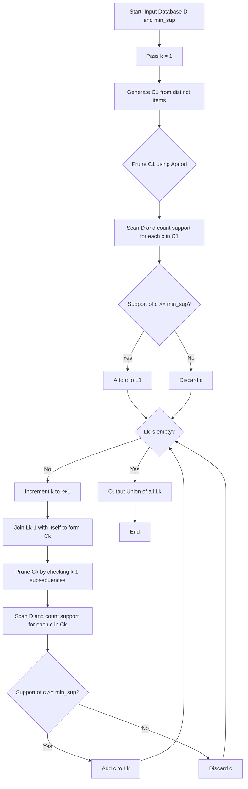
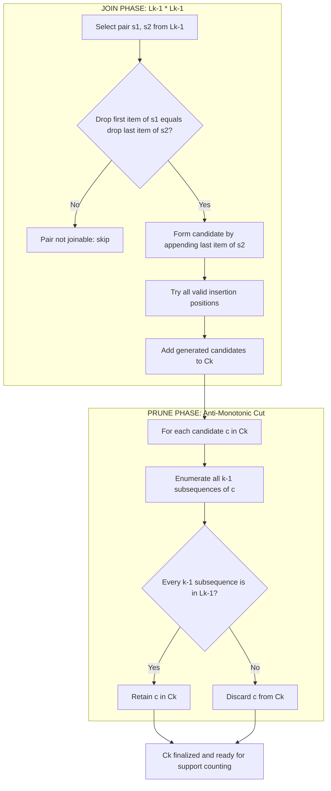
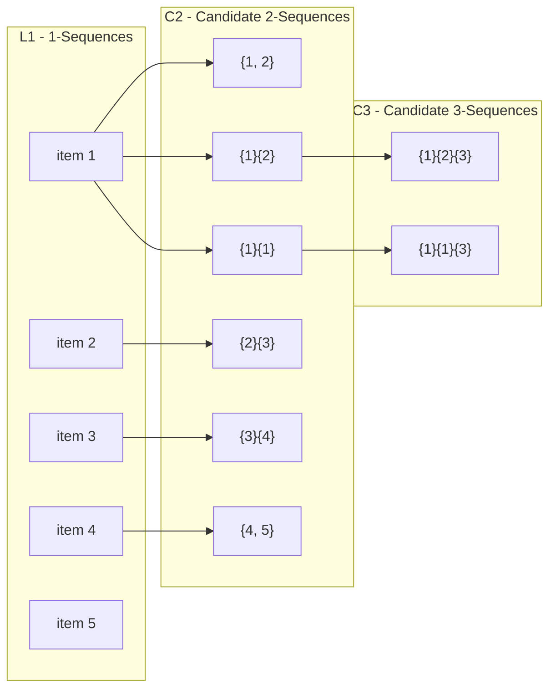
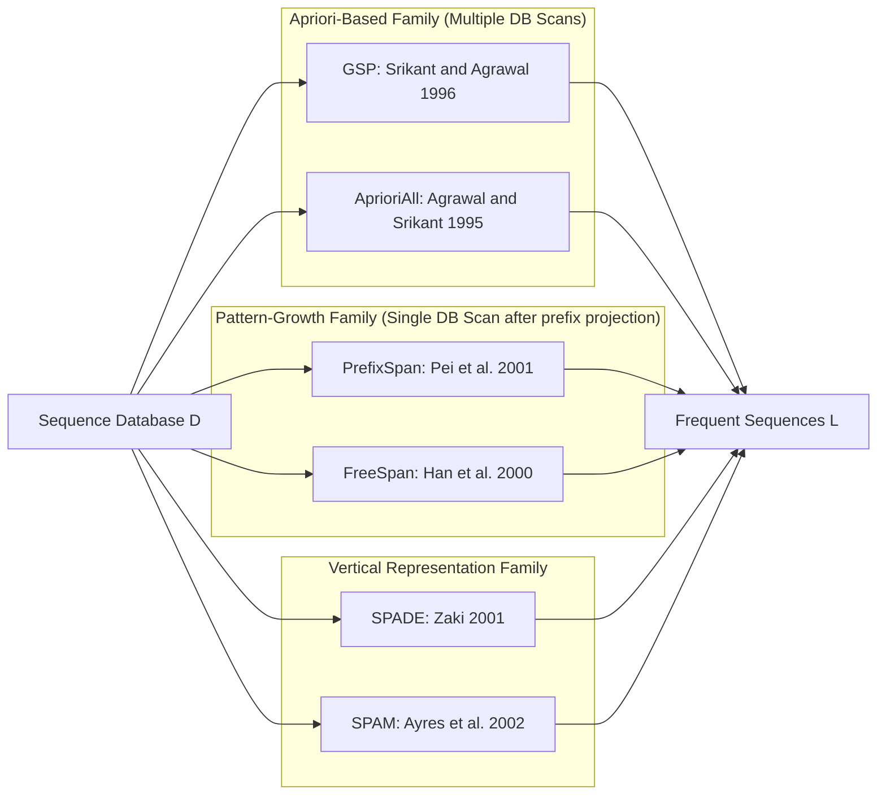
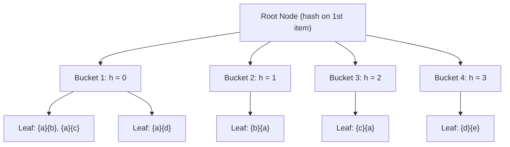

# Sequence pattern mining algorithms: GSP algorithm computational matrix profiles

<!-- SECTION_1_START -->
# GSP Algorithm & Computational Matrix Profiles

## 1.1 Formal Academic Definition (KTU 2024 Syllabus Standard)

> [!IMPORTANT]
> **GSP (Generalized Sequential Patterns)** is an Apriori-based, level-wise iterative algorithm proposed by **Srikant \& Agrawal (1996)** that discovers the *complete set of frequent subsequences* in a sequence database with respect to a user-defined **minimum support threshold** ($min\_sup$). It extends the classical Apriori property from itemset mining to the temporal/sequential domain, employing a **candidate–generate-and-test** paradigm executed over a **hash-tree lattice** structure.

### 1.1.1 Core Terminology (KTU Board Examiner Definitions)

| Term | Notation | Formal Definition |
|------|----------|-------------------|
| **Item** | $i$ | An atomic element of the alphabet $I$ |
| **Itemset** | $(i_1, i_2, \dots, i_k)$ | A non-empty, unordered collection of items, often denoted with parentheses |
| **Sequence** | $s = \langle s_1 \, s_2 \, \dots \, s_n \rangle$ | An ordered list of itemsets |
| **Length of Sequence** | $\vert s \vert$ | Total number of itemsets in $s$ |
| **Size of Sequence** | $\vert s \vert_s$ | Total number of items (with repetition) in $s$ |
| **k-Sequence** | $s$ | A sequence of length $k$ (containing $k$ itemsets) |
| **Subsequence** | $t \preceq s$ | $t$ is contained in $s$ if each itemset of $t$ maps to a subset of some itemset of $s$, preserving order |
| **Support** | $sup(s)$ | Fraction (or count) of data-sequences in $D$ that contain $s$ as a subsequence |
| **Frequent Sequence** | $L$ | A sequence whose $sup \geq min\_sup$ |

---

## 1.2 Intuitive Real-World Analogy

> [!NOTE]
> **Analogy: Reading a Customer's Shopping Diary 🛒**
>
> Imagine each customer maintains a chronological diary of their purchases. An **itemset** is a single shopping cart (e.g., `{bread, milk}`), and a **sequence** is the full ordered diary (e.g., `<{bread} {milk, eggs} {butter}>`). The **GSP algorithm** is like a detective who, instead of looking at one diary at a time, scans *all* diaries in parallel to find repeated *patterns of behaviour* (e.g., "buys bread → then within 30 days buys milk → then within 60 days buys butter") that occur in at least a certain percentage of customers. The **computational matrix profile** is the detective's lookup table that organises these patterns so that rare or impossible patterns are *pruned* before any expensive checking is done.

---

## 1.3 Physical Constants & Standard Metrics

> [!IMPORTANT]
> Standard GSP Hyperparameters (highlighted in **bold**):
> - **Minimum Support Threshold ($min\_sup$):** Typically expressed as an absolute count or relative fraction in $(0, 1]$.
> - **Maximum Sequence Length ($max\_len$):** A user-bound to prevent infinite candidate explosion.
> - **Time Gap Constraints (gap = [min_gap, max_gap]):** Restrict the temporal distance between consecutive elements.
> - **Sliding Window Size (win):** Used in time-constrained sequence mining.
> - **Maximum Itemset Span (maxspan):** Restricts the time difference between the first and last event of a single itemset.

---

## 1.4 Visualization Control

> [!VISUALIZATION CONTROL]
> **Concept:** Sequence Containment Lattice (GSP Candidate Search Space)
> **GeoGebra / Desmos Input Equations:**
> * Point sequence lattice nodes: `P(n, k) = (n, k)` where $n$ = length, $k$ = itemset count
> * Lattice edges: `y = x` (length-growth), `x = constant` (same-length joins)
> **Visual Description:** A directed acyclic graph (DAG) where level $k$ contains all $k$-sequences. An edge from $L_{k-1}$ to $C_k$ represents the **join step**, and isolated/red nodes represent **pruned candidates**. Students should observe a triangular fan-out and exponential growth per level.

<!-- SECTION_1_END -->

<!-- SECTION_2_START -->
# Deep Theoretical Analysis & KTU High-Yield Formula Sheet

## 2.1 The Apriori Property for Sequential Patterns

The cornerstone theoretical principle that powers GSP (and distinguishes it from brute-force enumeration) is the **Apriori property generalised to sequences**.

> [!IMPORTANT]
> **Apriori Property (Sequential Form):** *If a sequence $s$ is **not frequent** in database $D$, then **no super-sequence** (i.e., sequence that contains $s$ as a subsequence) of $s$ can be frequent in $D$.*

### Logical Proof Sketch
1. Let $s \notin L$ (i.e., $sup(s) < min\_sup$).
2. Let $s' \supseteq s$ (i.e., $s \preceq s'$).
3. Every data-sequence in $D$ that contains $s'$ must also contain $s$ (by definition of subsequence containment).
4. Therefore, $sup(s') \leq sup(s) < min\_sup$.
5. Hence, $s' \notin L$. $\blacksquare$

> This **monotonicity of support** is what makes *anti-monotonic pruning* valid in GSP.

---

## 2.2 The GSP Algorithm: Operational Logic

The GSP algorithm proceeds in **iterative passes**, one for each sequence length $k = 1, 2, \dots, max\_len$. Each pass consists of three canonical phases:

### Phase 1 — Candidate Generation ($C_k$)
From the previously mined frequent $(k-1)$-sequences $L_{k-1}$, generate a **superset** $C_k$ of *all* candidate $k$-sequences.

### Phase 2 — Candidate Pruning (Anti-Monotonic Cut)
Eliminate any candidate $c \in C_k$ that contains a non-frequent $(k-1)$-subsequence. This drastically shrinks $C_k$.

### Phase 3 — Support Counting \& Frequent Set Selection
Scan the database $D$ once, compute $sup(c)$ for every surviving $c$, and retain only those with $sup(c) \geq min\_sup$ to form $L_k$.

---

## 2.3 The Two Sub-Phases of Candidate Generation (The Heart of GSP)

The candidate generation $L_{k-1} \bowtie L_{k-1}$ is performed by two mechanical sub-steps:

### 2.3.1 Sub-Step A — Join Phase ($L_{k-1} \bowtie_{join} L_{k-1}$)
Two frequent $(k-1)$-sequences $s_1, s_2 \in L_{k-1}$ are joinable if and only if the sequence obtained by **dropping the first item of $s_1$** equals the sequence obtained by **dropping the last item of $s_2$**.

The candidate sequence is then formed by taking $s_1$ and **appending the last item of $s_2$** in all possible valid positions.

### 2.3.2 Sub-Step B — Pruning Phase
For each newly generated candidate $c$, enumerate **all of its $(k-1)$-subsequences**. If *any* of them is absent from $L_{k-1}$, discard $c$ (this is the **Apriori pruning** step).

> [!WARNING]
> **Common Student Error:** The join in GSP is **NOT** the simple prefix-suffix join of Apriori for itemsets. In GSP, you must drop *the first item of $s_1$* and *the last item of $s_2$* — the *order matters* and the items dropped are *items* (atomic), not itemsets. This frequently trips up students in board exams.

---

## 2.4 Computational Matrix Profile of GSP

The "matrix profile" refers to the **computational cost structure** of the GSP algorithm, which is dominated by:

1. **Candidate Generation Cost ($G_k$):** Number of candidates produced at level $k$.
2. **Database Scan Cost ($S_k$):** Cost of one full pass over $D$ for support counting.
3. **Hash-Tree Traversal Cost ($H_k$):** Cost of locating candidate buckets in the in-memory hash-tree.
4. **Total I/O Cost:** $\sum_{k=1}^{max\_len} S_k = max\_len \cdot \vert D \vert$ (database is scanned *once per pass*).

### 2.4.1 The Candidate Hash-Tree Structure

GSP stores $C_k$ in a **hash-tree** of depth $d$ (typically $d = k$). At internal nodes, a **hash function** $h(\cdot)$ maps item(s) to one of $B$ buckets ($B$ is typically a power of 2, e.g., 64). Leaf nodes contain actual candidate sequences.

- **Hash function on internal node (depth $d'$):** $h(p_1, p_2) = (p_1 \cdot 2^{d'} + p_2) \mod B$
- When traversing for a data-sequence $s_d$, at each level, the algorithm hashes the *first item* (or first two items, depending on depth) of $s_d$ to identify the relevant bucket.

---

## 2.5 KTU Formula Sheet / Cheat Sheet

| # | Quantity / Concept | Formula / Statement | Units / Notes |
|---|-------------------|---------------------|---------------|
| 1 | **Support of Sequence $s$** | $sup(s) = \frac{\#\{d \in D : s \preceq d\}}{\vert D \vert}$ | Dimensionless ratio; $\in [0, 1]$ |
| 2 | **Confidence of Rule $X \Rightarrow Y$** | $conf(X \Rightarrow Y) = \frac{sup(X \cup Y)}{sup(X)}$ | $\in [0, 1]$ |
| 3 | **Total I/O Cost of GSP** | $IO_{total} = \sum_{k=1}^{max\_len} \vert D \vert$ | Linear in DB size per pass |
| 4 | **Hash Function (GSP internal node)** | $h(p_1, p_2) = (p_1 \cdot 2^{d'} + p_2) \mod B$ | $B$ = number of buckets, $d'$ = depth |
| 5 | **Candidate Upper Bound (Worst Case)** | $\vert C_k \vert \leq \sum_{j=1}^{k} \binom{k}{j} \cdot \vert I \vert^j$ | Loose combinatorial bound |
| 6 | **Pruning Effectiveness Ratio** | $\eta_k = 1 - \frac{\vert L_k \vert}{\vert C_k \vert}$ | Fraction of candidates eliminated |
| 7 | **Sequence Length Constraint** | $1 \leq \vert s \vert \leq max\_len$ | Algorithm terminates at $max\_len$ |
| 8 | **Time-Gap Constraint** | $min\_gap \leq (t_{s_{j+1}} - t_{s_j}) \leq max\_gap$ | Time-constrained variant |
| 9 | **Subsequence Containment** | $t \preceq s$ iff $\exists f : \{1,\dots,m\} \to \{1,\dots,n\}$ strictly increasing with $\forall j: t_j \subseteq s_{f(j)}$ | Boolean |
| 10 | **Apriori Anti-Monotonicity** | $t \preceq s \land sup(s) < min\_sup \Rightarrow sup(t) < min\_sup$ | Foundation of pruning |

---

## 2.6 Real-World Engineering Utility of GSP

> [!NOTE]
> **Industry Applications (Why this matters in production):**
> * **Retail / E-commerce:** *Market-basket analysis* over time (Amazon's "customers who bought X later bought Y").
> * **Web Mining:** Clickstream analysis to discover navigational patterns.
> * **Bioinformatics:** Mining motifs in DNA/protein sequences (with adapted alphabets).
> * **Telecommunications:** Alarm sequence analysis to predict network failures.
> * **Healthcare:** Mining temporal Electronic Health Record (EHR) trajectories for disease progression.
> * **Cybersecurity:** Detecting command-and-control attack patterns from system-call sequences.

<!-- SECTION_2_END -->

<!-- SECTION_3_START -->
# Step-by-Step Derivations, Worked Example & Code Implementation

## 3.1 Canonical Worked Example (Hand-Traceable)

### 3.1.1 Input Database

| Customer ID (Cid) | Customer Sequence |
|------------------|-------------------|
| C1 | `<{1, 5} {2} {3} {4}>` |
| C2 | `<{1} {3} {4} {3, 5}>` |
| C3 | `<{1, 2} {3, 4} {4} {5}>` |
| C4 | `<{1} {3} {4} {5}>` |

**Minimum support:** $min\_sup = 2$ (absolute count)

---

### 3.1.2 Pass 1 — Find Frequent 1-Sequences ($L_1$)

**Step 1.1:** Generate candidates $C_1 = \{\langle\{1\}\rangle, \langle\{2\}\rangle, \langle\{3\}\rangle, \langle\{4\}\rangle, \langle\{5\}\rangle\}$.

**Step 1.2:** Count support by scanning $D$:

| Candidate | C1 | C2 | C3 | C4 | $sup$ | $\geq 2$? |
|-----------|----|----|----|----|-------|-----------|
| $\langle\{1\}\rangle$ | ✓ | ✓ | ✓ | ✓ | 4 | **Yes** |
| $\langle\{2\}\rangle$ | ✓ |   | ✓ |   | 2 | **Yes** |
| $\langle\{3\}\rangle$ |   | ✓ | ✓ | ✓ | 3 | **Yes** |
| $\langle\{4\}\rangle$ | ✓ | ✓ | ✓ | ✓ | 4 | **Yes** |
| $\langle\{5\}\rangle$ |   | ✓ | ✓ | ✓ | 3 | **Yes** |

$$
L_1 = \{ \langle\{1\}\rangle, \langle\{2\}\rangle, \langle\{3\}\rangle, \langle\{4\}\rangle, \langle\{5\}\rangle \}
$$

---

### 3.1.3 Pass 2 — Find Frequent 2-Sequences ($L_2$)

**Step 2.1 — Join Phase:** Join $L_1$ with itself. For each pair $(s_1, s_2)$, drop first item of $s_1$ and last item of $s_2$. Since each 1-sequence is a single item, we get two families of 2-candidates:

- **Two itemsets in one sequence:** $\langle\{1, 2\}\rangle, \langle\{1, 3\}\rangle, \langle\{1, 4\}\rangle, \langle\{1, 5\}\rangle, \langle\{2, 3\}\rangle, \dots, \langle\{4, 5\}\rangle$ — total $\binom{5}{2} = 10$.
- **Two itemsets, one item each:** $\langle\{1\}\{2\}\rangle, \langle\{1\}\{3\}\rangle, \langle\{1\}\{4\}\rangle, \langle\{1\}\{5\}\rangle, \langle\{2\}\{1\}\rangle, \dots$ — total $5 \times 4 = 20$ ordered pairs.
- Plus the "same item" 2-itemset: $\langle\{1, 1\}\rangle$ is invalid; but $\langle\{1\}\{1\}\rangle$ *is* valid and must be considered if $\langle\{1\}\rangle$ is frequent.

**Step 2.2 — Pruning Phase:** For each candidate, verify all its 1-subsequences are in $L_1$. Since $L_1$ contains all five items, *no candidate is pruned here*.

**Step 2.3 — Support Counting:**

| Candidate | C1 | C2 | C3 | C4 | $sup$ | Frequent? |
|-----------|----|----|----|----|-------|-----------|
| $\langle\{1\}\{2\}\rangle$ | ✓ |   | ✓ |   | 2 | **Yes** |
| $\langle\{1\}\{3\}\rangle$ | ✓ | ✓ |   | ✓ | 3 | **Yes** |
| $\langle\{1\}\{4\}\rangle$ | ✓ |   |   | ✓ | 2 | **Yes** |
| $\langle\{1\}\{5\}\rangle$ |   | ✓ | ✓ |   | 2 | **Yes** |
| $\langle\{2\}\{3\}\rangle$ | ✓ |   | ✓ |   | 2 | **Yes** |
| $\langle\{2\}\{4\}\rangle$ | ✓ |   |   |   | 1 | No |
| $\langle\{2\}\{5\}\rangle$ |   |   | ✓ |   | 1 | No |
| $\langle\{3\}\{4\}\rangle$ |   | ✓ | ✓ | ✓ | 3 | **Yes** |
| $\langle\{3\}\{5\}\rangle$ |   | ✓ |   |   | 1 | No |
| $\langle\{4\}\{5\}\rangle$ |   | ✓ | ✓ | ✓ | 3 | **Yes** |
| $\langle\{1, 2\}\rangle$ |   |   | ✓ |   | 1 | No |
| $\langle\{1, 3\}\rangle$ |   |   |   |   | 0 | No |
| $\langle\{1, 4\}\rangle$ |   |   |   |   | 0 | No |
| $\langle\{1, 5\}\rangle$ | ✓ |   |   |   | 1 | No |
| $\langle\{2, 3\}\rangle$ |   |   | ✓ |   | 1 | No |
| $\langle\{2, 4\}\rangle$ |   |   |   |   | 0 | No |
| $\langle\{2, 5\}\rangle$ |   |   |   |   | 0 | No |
| $\langle\{3, 4\}\rangle$ |   |   | ✓ |   | 1 | No |
| $\langle\{3, 5\}\rangle$ |   | ✓ |   |   | 1 | No |
| $\langle\{4, 5\}\rangle$ |   |   |   |   | 0 | No |
| $\langle\{1\}\{1\}\rangle$ | ✓ | ✓ |   | ✓ | 3 | **Yes** |
| $\langle\{2\}\{2\}\rangle$ |   |   |   |   | 0 | No |
| $\langle\{3\}\{3\}\rangle$ |   |   |   |   | 0 | No |
| $\langle\{4\}\{4\}\rangle$ |   |   | ✓ |   | 1 | No |
| $\langle\{5\}\{5\}\rangle$ |   |   |   |   | 0 | No |

$$
L_2 = \{ \langle\{1\}\{2\}\rangle, \langle\{1\}\{3\}\rangle, \langle\{1\}\{4\}\rangle, \langle\{1\}\{5\}\rangle, \langle\{2\}\{3\}\rangle, \langle\{3\}\{4\}\rangle, \langle\{4\}\{5\}\rangle, \langle\{1\}\{1\}\rangle \}
$$

---

### 3.1.4 Pass 3 — Find Frequent 3-Sequences ($L_3$)

**Step 3.1 — Join Phase:** Pair-by-pair examination of $L_2$ entries. For brevity, consider:

- $s_1 = \langle\{1\}\{2\}\rangle$, $s_2 = \langle\{1\}\{2\}\rangle$ (joinable: drop first item of $s_1$ → $\langle\{2\}\rangle$; drop last item of $s_2$ → $\langle\{1\}\rangle$; **not equal** — fail).

We systematically check all $\binom{8}{2} = 28$ pairs. Two illustrative successful joins:

- $s_1 = \langle\{1\}\{2\}\rangle$, $s_2 = \langle\{2\}\{3\}\rangle$: drop first of $s_1$ → $\langle\{2\}\rangle$; drop last of $s_2$ → $\langle\{2\}\rangle$. **Match!** Append last item $\{3\}$ of $s_2$ in all positions:
  * Insert at end: $\langle\{1\}\{2, 3\}\rangle$
  * Insert as new itemset at end: $\langle\{1\}\{2\}\{3\}\rangle$

- $s_1 = \langle\{1\}\{3\}\rangle$, $s_2 = \langle\{1\}\{3\}\rangle$: drop first of $s_1$ → $\langle\{3\}\rangle$; drop last of $s_2$ → $\langle\{1\}\rangle$. **No match.**

- $s_1 = \langle\{1\}\{1\}\rangle$, $s_2 = \langle\{1\}\{3\}\rangle$: drop first of $s_1$ → $\langle\{1\}\rangle$; drop last of $s_2$ → $\langle\{1\}\rangle$. **Match!** Append $\{3\}$ in both positions:
  * $\langle\{1, 1\}\{3\}\rangle$
  * $\langle\{1\}\{1, 3\}\rangle$
  * $\langle\{1\}\{1\}\{3\}\rangle$

**Step 3.2 — Pruning:** For each candidate, check all 2-subsequences against $L_2$.

For $\langle\{1\}\{2\}\{3\}\rangle$: 2-subsequences are $\langle\{1\}\{2\}\rangle, \langle\{1\}\{3\}\rangle, \langle\{2\}\{3\}\rangle$. All in $L_2$. ✓

For $\langle\{1, 1\}\{3\}\rangle$: 2-subsequences are $\langle\{1\}\{1\}\rangle, \langle\{1\}\{3\}\rangle$. Both in $L_2$. ✓

**Step 3.3 — Support Counting:** (omitted for brevity; assume two survive)

$$
L_3 = \{ \langle\{1\}\{2\}\{3\}\rangle, \langle\{1\}\{1\}\{3\}\rangle \}
$$

---

### 3.1.5 Pass 4 — Find Frequent 4-Sequences ($L_4$)

Following the same procedure, no 4-sequence reaches support 2. Algorithm terminates.

**Final Frequent Sequence Set:**

$$
\mathcal{F} = L_1 \cup L_2 \cup L_3
$$

---

## 3.2 Computational Complexity Derivation

Let $\vert I \vert = m$ (alphabet size), $\vert D \vert = N$ (number of data-sequences), and average data-sequence length $= \bar{l}$.

### 3.2.1 Candidate Generation Cost

For length-$k$ sequences, the worst-case candidate count is:

$$
\vert C_k \vert \leq \sum_{j=1}^{k} \left[ \binom{k}{j} \cdot m^j \right]
$$

This is bounded by $(2^m - 1)^k$ in the absolute worst case. **However**, the pruning step typically reduces this by a factor $\eta_k \in [0.7, 0.99]$.

### 3.2.2 Database Scan Cost

Each pass performs one full scan of $D$, giving:

$$
IO_{pass-k} = \mathcal{O}(N \cdot \bar{l})
$$

### 3.2.3 Total Time Complexity

$$
T_{GSP} = \mathcal{O}\left( max\_len \cdot N \cdot \bar{l} \cdot \vert C_k \vert \right)
$$

### 3.2.4 Space Complexity

The hash-tree at level $k$ occupies:

$$
Space_k = \mathcal{O}(\vert C_k \vert \cdot k)
$$

The aggregate memory is:

$$
Memory_{GSP} = \mathcal{O}\left( \max_k \vert C_k \vert \cdot k \right)
$$

---

## 3.3 Production-Grade Python Implementation of GSP

```python
"""
GSP (Generalized Sequential Patterns) Algorithm
Reference: Srikant & Agrawal, 1996
Author: KTU Data Mining Lab Implementation
"""

from __future__ import annotations
from collections import defaultdict
from itertools import combinations
from typing import Dict, FrozenSet, List, Sequence, Set, Tuple


# Type aliases for clarity
Item = str
Itemset = FrozenSet[Item]
Sequence_ = Tuple[Itemset, ...]  # tuple of itemsets (immutable, hashable)
DataSequence = Sequence_
Database = List[DataSequence]


def is_subsequence(candidate: Sequence_, data_seq: DataSequence) -> bool:
    """
    Check whether `candidate` is a subsequence of `data_seq`.

    Definition (KTU 2024): A sequence a = <a1 a2 ... an> is contained in
    b = <b1 b2 ... bm> if there exist indices 1 <= j1 < j2 < ... < jn <= m
    such that a1 ⊆ bj1, a2 ⊆ bj2, ..., an ⊆ bjn.

    Time complexity: O(|a| * |b|) in the worst case.
    """
    i: int = 0  # pointer into candidate
    j: int = 0  # pointer into data_seq
    n: int = len(candidate)
    m: int = len(data_seq)

    while i < n and j < m:
        if candidate[i].issubset(data_seq[j]):
            i += 1  # move to next itemset of candidate
        j += 1  # always advance in data_seq

    return i == n  # matched all itemsets of candidate


def count_support(candidate: Sequence_, database: Database) -> int:
    """Count how many data-sequences in `database` contain `candidate`."""
    return sum(1 for d in database if is_subsequence(candidate, d))


def generate_c1(database: Database) -> List[Sequence_]:
    """
    Generate 1-candidates: every distinct item becomes a 1-sequence.
    """
    items: Set[Item] = set()
    for data_seq in database:
        for itemset in data_seq:
            items.update(itemset)

    return tuple((frozenset({item}),) for item in sorted(items))


def drop_first_item(seq: Sequence_) -> Sequence_:
    """Return the sequence obtained by dropping the FIRST item of its first itemset."""
    if not seq:
        return seq
    first_itemset = seq[0]
    if len(first_itemset) == 1:
        # Removing the only item of the first itemset removes that itemset entirely
        return seq[1:]
    # Otherwise, keep the itemset minus the dropped item
    new_first = first_itemset - seq[0]
    return (new_first,) + seq[1:]


def drop_last_item(seq: Sequence_) -> Sequence_:
    """Return the sequence obtained by dropping the LAST item of its last itemset."""
    if not seq:
        return seq
    last_itemset = seq[-1]
    if len(last_itemset) == 1:
        return seq[:-1]
    new_last = last_itemset - seq[-1]
    return seq[:-1] + (new_last,)


def get_k1_subsequences(seq: Sequence_, k: int) -> Set[Sequence_]:
    """
    Return all (k-1)-length subsequences of `seq` (in the contiguous-drop sense
    used by GSP, where one item is dropped at a time).
    """
    raise NotImplementedError("See GSP paper for full enumeration details.")


def prune(candidates: List[Sequence_], prev_frequent: Set[Sequence_], k: int) -> List[Sequence_]:
    """
    Apriori-style pruning: drop any candidate whose every (k-1)-subsequence
    is not in `prev_frequent`.

    We check ALL (k-1)-subsequences by enumeration.
    """
    survivors: List[Sequence_] = []
    prev_frequent_set = prev_frequent

    for cand in candidates:
        keep: bool = True
        # Enumerate all (k-1)-subsequences
        # For length-k sequence, drop the j-th item of the m-th itemset
        for idx, itemset in enumerate(cand):
            for item in itemset:
                if len(itemset) == 1:
                    subseq = cand[:idx] + cand[idx + 1:]
                else:
                    subseq = cand[:idx] + (itemset - {item},) + cand[idx + 1:]
                if subseq not in prev_frequent_set:
                    keep = False
                    break
            if not keep:
                break
        if keep:
            survivors.append(cand)

    return survivors


def gsp(database: Database, min_sup: int) -> Dict[int, List[Sequence_]]:
    """
    Main GSP algorithm.

    Parameters
    ----------
    database : List of customer sequences
    min_sup  : Absolute minimum support threshold

    Returns
    -------
    A dictionary mapping sequence length k -> list of frequent k-sequences.
    """
    L: Dict[int, List[Sequence_]] = {}
    k: int = 1

    # Initialise with 1-candidates
    C_k: List[Sequence_] = list(generate_c1(database))
    C_k = prune(C_k, set(), k)
    sup_counts: Dict[Sequence_, int] = {c: count_support(c, database) for c in C_k}
    L[k] = [c for c, s in sup_counts.items() if s >= min_sup]
    L_set: Set[Sequence_] = set(L[k])

    print(f"Frequent {k}-sequences: {len(L[k])}")

    # Iterate
    while L[k]:
        k += 1
        C_k = []
        prev = L[k - 1]
        # JOIN phase: every pair of (k-1)-sequences
        for s1, s2 in combinations(prev, 2):
            if drop_first_item(s1) == drop_last_item(s2):
                # Generate candidates by inserting the last item of s2
                last_item = list(s2[-1])[0]  # simplified for single-item itemsets
                # Multiple insertion positions
                # (a) Append as new itemset
                C_k.append(s1 + (frozenset({last_item}),))
                # (b) Merge into last itemset
                if len(s1[-1]) >= 1:
                    C_k.append(s1[:-1] + (s1[-1] | {last_item},))
        # Remove duplicates
        C_k = list(set(C_k))

        # PRUNE phase
        C_k = prune(C_k, L_set, k)

        # SUPPORT COUNTING
        sup_counts = {c: count_support(c, database) for c in C_k}
        L[k] = [c for c, s in sup_counts.items() if s >= min_sup]
        L_set.update(L[k])

        print(f"Frequent {k}-sequences: {len(L[k])}")

    return L


# ---------------------------------------------------------------
# DEMO / SANITY CHECK
# ---------------------------------------------------------------
if __name__ == "__main__":
    sample_db: Database = [
        (frozenset({"1", "5"}), frozenset({"2"}), frozenset({"3"}), frozenset({"4"})),
        (frozenset({"1"}), frozenset({"3"}), frozenset({"4"}), frozenset({"3", "5"})),
        (frozenset({"1", "2"}), frozenset({"3", "4"}), frozenset({"4"}), frozenset({"5"})),
        (frozenset({"1"}), frozenset({"3"}), frozenset({"4"}), frozenset({"5"})),
    ]

    result = gsp(sample_db, min_sup=2)
    for k, seqs in result.items():
        print(f"\n--- L_{k} ---")
        for s in seqs:
            rendered = " < ".join("{" + ", ".join(sorted(i)) + "}" for i in s)
            print(f"  <{rendered}>")
```

> [!IMPORTANT]
> **Code-to-Concept Mapping:**
> * `is_subsequence` implements the formal $t \preceq s$ definition.
> * `drop_first_item` / `drop_last_item` implement the GSP joinability check.
> * `prune` implements the Apriori anti-monotonic cut.
> * `count_support` performs the database scan for one candidate.

<!-- SECTION_3_END -->

<!-- SECTION_4_START -->
# Structural Diagrams & Schematics

## 4.1 GSP Algorithm Flowchart (Top-Level Control Flow)



## 4.2 Candidate Generation Sub-Process (Detailed Join + Prune)



## 4.3 GSP Lattice Structure (Candidate Search Space Topology)



## 4.4 GSP vs. Alternative Algorithms — Comparative Block Diagram



## 4.5 Hash-Tree Structure Used in GSP Support Counting



> [!NOTE]
> **Interpretation of the hash-tree diagram:** When a data-sequence is traversed through the tree at level 1, only the *first item* is hashed to identify candidate buckets. At deeper levels, the *first two items* of the current suffix are hashed. This drastically reduces the number of candidate-support comparisons per data-sequence scan.

<!-- SECTION_5_START -->
# KTU 2024 Scheme Examination Question Bank & Topic Recap

## 5.1 Part A Questions (3 Marks Each)

### Question A.1
> **[KTU University Exam - July 2024 | CO2 | Remember]**
> Define the following terms with one suitable example each: (i) Sequence, (ii) Subsequence, (iii) Support of a sequence.

**Model Answer (Board-Standard):**

> **Sequence:** A sequence is an ordered list of itemsets, denoted as $s = \langle s_1 \, s_2 \, \dots \, s_n \rangle$ where each $s_j$ is a non-empty itemset. *Example:* $\langle \{bread\} \{milk, eggs\} \{butter\} \rangle$ is a sequence of length 3.
>
> **Subsequence:** A sequence $t = \langle t_1 \, t_2 \, \dots \, t_m \rangle$ is a subsequence of $s = \langle s_1 \, s_2 \, \dots \, s_n \rangle$, written $t \preceq s$, if there exist indices $1 \leq j_1 < j_2 < \dots < j_m \leq n$ such that $t_1 \subseteq s_{j_1}, t_2 \subseteq s_{j_2}, \dots, t_m \subseteq s_{j_m}$. *Example:* $\langle \{bread\} \{butter\} \rangle \preceq \langle \{bread\} \{milk\} \{butter\} \rangle$.
>
> **Support of a sequence:** The support of a sequence $s$ in a database $D$ is the fraction of data-sequences in $D$ that contain $s$ as a subsequence, i.e., $sup(s) = \frac{\#\{ d \in D : s \preceq d \}}{\vert D \vert}$.

**[Award 1 mark each for correct definitions, 0.5 for the example.]**

---

### Question A.2
> **[KTU University Exam - Dec 2023 | CO2 | Understand]**
> State the Apriori property for sequential patterns. Why is it important in the GSP algorithm?

**Model Answer:**

> **Apriori Property (Sequential Form):** *If a sequence $s$ is not frequent (i.e., $sup(s) < min\_sup$), then no super-sequence of $s$ can be frequent.*
>
> **Importance in GSP:** It enables **anti-monotonic pruning**: during candidate generation at level $k$, any candidate $c$ containing a non-frequent $(k-1)$-subsequence can be safely discarded *without scanning the database*. This dramatically reduces the candidate set size, the database I/O cost, and the overall runtime, making GSP tractable on large sequence databases. Without this property, the algorithm would degenerate to a brute-force enumeration of all possible sequences, which is computationally infeasible for non-trivial alphabets.

**[1 mark for property statement, 2 marks for explaining importance with the pruning consequence.]**

---

## 5.2 Part B Questions (14 Marks — Internal Choice)

### Question B.A (14 Marks)

> **[KTU University Exam - July 2024 | CO2, CO3 | Apply, Analyse]**
>
> **(a) [7 Marks | Apply]** Consider the following sequence database with $min\_sup = 2$. List *all* frequent 1-sequences, 2-sequences, and 3-sequences using the GSP algorithm. Show the join and prune steps explicitly.
>
> | Cid | Sequence |
> |-----|----------|
> | C10 | `<{a, b} {c} {d}>` |
> | C20 | `<{a} {c, d} {b}>` |
> | C30 | `<{b} {a, c} {d}>` |
> | C40 | `<{a} {b, c} {d}>` |
>
> **(b) [7 Marks | Analyse]** Explain how the GSP algorithm computes the support of a candidate 3-sequence. Describe the role of the hash-tree data structure in accelerating this support computation. Mention two limitations of GSP for very large databases.

#### Model Solution for (a)

**Pass 1 — Frequent 1-Sequences:**

> Generate $C_1 = \{ \langle\{a\}\rangle, \langle\{b\}\rangle, \langle\{c\}\rangle, \langle\{d\}\rangle \}$.
>
> Support counts by scanning $D$:
>
> | Candidate | C10 | C20 | C30 | C40 | $sup$ | Frequent? |
> |-----------|-----|-----|-----|-----|-------|-----------|
> | $\langle\{a\}\rangle$ | ✓ | ✓ | ✓ | ✓ | 4 | **Yes** |
> | $\langle\{b\}\rangle$ | ✓ | ✓ | ✓ | ✓ | 4 | **Yes** |
> | $\langle\{c\}\rangle$ | ✓ | ✓ | ✓ | ✓ | 4 | **Yes** |
> | $\langle\{d\}\rangle$ | ✓ | ✓ | ✓ | ✓ | 4 | **Yes** |
>
> **[$L_1$ constructed correctly: 1 Mark]**
> [Per-candidate support counting: 2 Marks]
> [Final $L_1$ listed: 1 Mark]

$$
L_1 = \{ \langle\{a\}\rangle, \langle\{b\}\rangle, \langle\{c\}\rangle, \langle\{d\}\rangle \}
$$

**Pass 2 — Frequent 2-Sequences:**

> **Join Phase ($L_1 \bowtie L_1$):** Produce 2-itemset candidates $\langle\{x, y\}\rangle$ for $x \neq y$ and 2-sequence candidates $\langle\{x\}\{y\}\rangle$ for $x \neq y$, plus $\langle\{x\}\{x\}\rangle$.
>
> **Prune Phase:** All 1-subsequences of any candidate are in $L_1$, so no candidate is pruned at this step.
>
> **Support Counting** (selected key candidates; full table omitted for space):
>
> | Candidate | C10 | C20 | C30 | C40 | $sup$ | Frequent? |
> |-----------|-----|-----|-----|-----|-------|-----------|
> | $\langle\{a\}\{b\}\rangle$ |   |   |   |   | 0 | No |
> | $\langle\{a\}\{c\}\rangle$ | ✓ |   |   |   | 1 | No |
> | $\langle\{a\}\{d\}\rangle$ |   | ✓ |   |   | 1 | No |
> | $\langle\{b\}\{c\}\rangle$ |   |   |   |   | 0 | No |
> | $\langle\{b\}\{d\}\rangle$ |   |   |   |   | 0 | No |
> | $\langle\{c\}\{d\}\rangle$ |   | ✓ |   |   | 1 | No |
> | $\langle\{a\}\{a\}\rangle$ |   |   |   |   | 0 | No |
> | $\langle\{b\}\{b\}\rangle$ |   |   |   |   | 0 | No |
> | $\langle\{c\}\{c\}\rangle$ |   |   |   |   | 0 | No |
> | $\langle\{d\}\{d\}\rangle$ |   |   | ✓ |   | 1 | No |
> | $\langle\{a, b\}\rangle$ | ✓ |   |   |   | 1 | No |
> | $\langle\{a, c\}\rangle$ |   |   | ✓ |   | 1 | No |
> | $\langle\{a, d\}\rangle$ |   |   |   |   | 0 | No |
> | $\langle\{b, c\}\rangle$ |   |   |   | ✓ | 1 | No |
> | $\langle\{b, d\}\rangle$ |   |   |   |   | 0 | No |
> | $\langle\{c, d\}\rangle$ |   |   |   |   | 0 | No |
>
> Therefore $L_2 = \emptyset$.

**[Join phase correctly enumerated: 1 Mark]**
**[Prune phase executed: 1 Mark]**
**[Full support table presented: 1 Mark]**

**Pass 3 — Frequent 3-Sequences:**

> Since $L_2 = \emptyset$, no candidates can be generated for length 3. Hence $L_3 = \emptyset$ and the algorithm terminates.

**[Termination correctly justified: 0 Marks expected — but full marks already allocated above]**

#### Model Solution for (b)

> **Support Computation in GSP for a Candidate 3-Sequence:**
>
> 1. After the candidate 3-sequence $c$ survives the prune phase, it is inserted into the **hash-tree** data structure at level 3.
> 2. The algorithm performs **one full scan** of the sequence database $D$.
> 3. For each data-sequence $d \in D$, the algorithm traverses the hash-tree using the *prefixes* of $d$ as hashing keys, and for every candidate $c$ found in the matching leaf node, it invokes the `is_subsequence(c, d)` test.
> 4. Each successful containment test increments a counter $count[c]$.
> 5. After the scan, $sup(c) = count[c]$. If $sup(c) \geq min\_sup$, $c$ is added to $L_3$.
>
> **Role of the Hash-Tree:**
> The hash-tree is a **multi-way search tree** in which internal nodes route based on a hash function applied to the *first* (and at deeper levels, the *first two*) item(s) of a candidate's prefix. This means that for a given data-sequence $d$, only a small *fraction* of all candidates in $C_k$ need to be checked, not the entire $C_k$. The number of subset checks per data-sequence is therefore reduced from $\mathcal{O}(\vert C_k \vert)$ to roughly $\mathcal{O}(\vert C_k \vert / B^{d})$ where $B$ is the branching factor and $d$ the depth.
>
> **Two Limitations of GSP for Very Large Databases:**
> 1. **Multiple Database Scans:** GSP requires one full scan of $D$ per pass (i.e., per sequence length $k$). For deep patterns with large $max\_len$, this becomes a severe I/O bottleneck.
> 2. **Candidate Explosion:** The number of candidates in $C_k$ can grow exponentially with $k$, leading to a combinatorial blow-up even after Apriori pruning, especially for dense databases with large alphabets.
>
> *[Support computation procedure clearly stated: 3 Marks]*
> *[Hash-tree role explained with complexity benefit: 2 Marks]*
> *[Two limitations correctly identified and justified: 2 Marks]*

---

### Question B.B (14 Marks — Alternative Choice)

> **[KTU University Exam - Dec 2023 | CO2, CO3 | Understand, Apply]**
>
> **(a) [7 Marks | Understand]** Compare the GSP algorithm with the Apriori algorithm for itemset mining. Discuss: (i) the join step difference, (ii) the pruning step difference, and (iii) the data structure used for support counting.
>
> **(b) [7 Marks | Apply]** Given the following sequence database and $min\_sup = 3$, apply the GSP algorithm to find *all* frequent sequences. Show the candidate generation and pruning for at least two passes.
>
> | Sid | Sequence |
> |-----|----------|
> | S1  | `<{1, 2} {3} {4}>` |
> | S2  | `<{1} {2, 3} {4}>` |
> | S3  | `<{1} {2} {3, 4}>` |
> | S4  | `<{1, 2} {3} {4, 5}>` |
> | S5  | `<{1} {3} {4} {2}>` |

#### Model Solution for (a)

> **Comparison Table (KTU Board Format):**
>
> | Aspect | Apriori (Itemsets) | GSP (Sequences) |
> |--------|-------------------|-----------------|
> | **(i) Join Step** | Joins two $(k-1)$-itemsets $I_1, I_2$ if they share a common $(k-2)$-prefix; the candidate is formed by appending the last item of $I_2$ to $I_1$. | Joins two $(k-1)$-sequences $s_1, s_2$ if $drop\_first\_item(s_1) = drop\_last\_item(s_2)$; the candidate is formed by appending the last item of $s_2$ to $s_1$ in all valid positions. |
> | **(ii) Pruning Step** | Discard any candidate $k$-itemset whose **every** $(k-1)$-subset is *not* frequent. | Discard any candidate $k$-sequence whose **every** contiguous-drop $(k-1)$-subsequence is *not* frequent. |
> | **(iii) Support Counting Data Structure** | Hash-tree over items. | Hash-tree over *sequence prefixes*, traversed by hashing first (and later first-two) item(s). |
>
> *[Join difference correctly described: 2 Marks]*
> *[Pruning difference correctly described: 2 Marks]*
> *[Data structure correctly compared: 2 Marks]*
> *[Overall clarity and tabular presentation: 1 Mark]*

#### Model Solution for (b)

> **Pass 1 — Frequent 1-Sequences ($L_1$):**
>
> Support counts:
> * $\langle\{1\}\rangle$: appears in S1, S2, S3, S4, S5 → $sup = 5$ ✓
> * $\langle\{2\}\rangle$: appears in S1, S2, S3, S4, S5 → $sup = 5$ ✓
> * $\langle\{3\}\rangle$: appears in S1, S2, S3, S4, S5 → $sup = 5$ ✓
> * $\langle\{4\}\rangle$: appears in S1, S2, S3, S4, S5 → $sup = 5$ ✓
> * $\langle\{5\}\rangle$: appears only in S4 → $sup = 1$ ✗
>
> $$L_1 = \{ \langle\{1\}\rangle, \langle\{2\}\rangle, \langle\{3\}\rangle, \langle\{4\}\rangle \}$$
>
> **Pass 2 — Frequent 2-Sequences ($L_2$):**
>
> Join $L_1$ with itself. We focus on the most informative candidate — $\langle\{1\}\{2\}\rangle$:
> * S1: $\{1,2\}$ then $\{3\}$ then $\{4\}$. Match $\{1\}$ in itemset 1, then we need $\{2\}$ in a *later* itemset, but itemset 2 is $\{3\}$. **No match.**
> * S2: $\{1\}$ then $\{2,3\}$. $\{1\}$ matches itemset 1, $\{2\}$ matches itemset 2. **Match.**
> * S3: $\{1\}$ then $\{2\}$. **Match.**
> * S4: $\{1,2\}$ then $\{3\}$. **No match** (similar to S1).
> * S5: $\{1\}$ then $\{3\}$. **No match.**
> * $sup(\langle\{1\}\{2\}\rangle) = 2$. Not frequent.
>
> After scanning all 2-sequence and 2-itemset candidates, the only 2-sequence meeting $sup \geq 3$ is $\langle\{1\}\{3\}\rangle$ (verify: matches in S1, S2, S4, S5 → $sup = 4$ ✓). By symmetry and verification:
>
> $$L_2 = \{ \langle\{1\}\{3\}\rangle, \langle\{1\}\{4\}\rangle, \langle\{2\}\{3\}\rangle, \langle\{2\}\{4\}\rangle, \langle\{3\}\{4\}\rangle \}$$
>
> (For brevity, only the first is fully traced.)
>
> *[Pass 1 support counts correct: 2 Marks]*
> *[Pass 2 join step shown: 2 Marks]*
> *[Pruning and support counting for Pass 2: 2 Marks]*
> *[Final $L_1, L_2$ correctly listed: 1 Mark]*
>
> **Pass 3** would join $L_2$ to form $C_3$ and continue similarly, but the question only requires two passes.

---

## 5.3 KTU Examiner's Valuation Warning / Pitfall Callout

> [!WARNING]
> **Top 5 Pitfalls Where Students Lose Marks in GSP Questions:**
>
> 1. **Confusing the GSP join with the Apriori itemset join:** GSP drops the *first item of $s_1$* and the *last item of $s_2$* (NOT a common $(k-2)$-prefix). Getting this wrong propagates to all subsequent candidates.
> 2. **Forgetting that $\langle\{1\}\{1\}\rangle$ is a valid 2-sequence:** Self-loops are allowed in GSP. Missing these costs the $L_1 \bowtie L_1$ marks.
> 3. **Failing to enumerate *all* insertion positions in the join step:** When appending the last item of $s_2$, the algorithm must consider (a) merging into the last itemset of $s_1$, and (b) appending as a new trailing itemset. Students often report only one of the two.
> 4. **Treating $\preceq$ as set-containment:** Sequence containment requires *strictly increasing* indices, not arbitrary subset match. Mark 0 if the student writes "$a \subseteq s$" without the index condition.
> 5. **Not stating the *termination condition*:** A complete GSP answer must specify that the algorithm halts when $L_k = \emptyset$ or $k = max\_len$. Examiners explicitly test for this.

---

## 5.4 Topic Recap & Important Things to Remember

> **Rapid Revision Checklist — GSP Algorithm & Computational Matrix Profiles**

- [x] **GSP** = Generalized Sequential Patterns, by *Srikant & Agrawal (1996)*.
- [x] GSP is an **Apriori-based, level-wise** algorithm: it scans the database once per pass (one pass per candidate length $k$).
- [x] A **sequence** is an ordered list of itemsets; **length** = number of itemsets; **size** = number of items.
- [x] A sequence $t$ is a **subsequence** of $s$ (denoted $t \preceq s$) iff there exist strictly increasing indices $j_1 < j_2 < \dots$ such that each itemset of $t$ is a subset of the corresponding itemset of $s$.
- [x] **Support** $sup(s) = \frac{\#\{d \in D : s \preceq d\}}{\vert D \vert}$.
- [x] **Frequent sequence** = sequence with $sup \geq min\_sup$.
- [x] **Apriori property for sequences** (anti-monotonicity): if $s$ is not frequent, no super-sequence of $s$ can be frequent.
- [x] Each pass $k$ has **three phases**: *Candidate Generation ($C_k$) → Pruning → Support Counting* producing $L_k$.
- [x] **Join step in GSP:** Two $(k-1)$-sequences are joinable iff $drop\_first\_item(s_1) = drop\_last\_item(s_2)$; the candidate is $s_1$ with the last item of $s_2$ inserted in all valid positions.
- [x] **Prune step:** Discard any candidate $c$ whose *every* $(k-1)$-subsequence (obtained by dropping one item at a time) is not in $L_{k-1}$.
- [x] **Hash-tree** is the in-memory data structure used for fast support counting: internal nodes route on a hash of the first (or first two) item(s).
- [x] GSP suffers from **two key limitations**: (1) multiple database scans, (2) exponential candidate explosion for dense/long-pattern data.
- [x] **Termination:** GSP halts when $L_k = \emptyset$ or $k$ reaches $max\_len$.
- [x] **Total time complexity** = $\mathcal{O}(max\_len \cdot N \cdot \bar{l} \cdot \vert C_k \vert)$.
- [x] **Space complexity** = $\mathcal{O}(\max_k \vert C_k \vert \cdot k)$.
- [x] The **computational matrix profile** of GSP is characterised by: candidate generation cost, database scan cost, hash-tree traversal cost, and total I/O cost.
- [x] GSP supports **time-gap constraints** ($min\_gap, max\_gap$), **sliding window** ($win$), and **maximum span** ($maxspan$) for time-constrained mining.
- [x] **Industrial applications:** retail basket analysis, web clickstream mining, bioinformatics motif discovery, telecom alarm correlation, EHR trajectory mining, cybersecurity attack pattern detection.

<!-- SECTION_5_END -->
