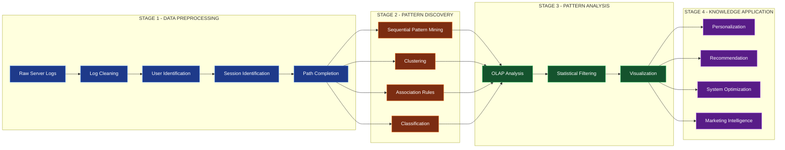
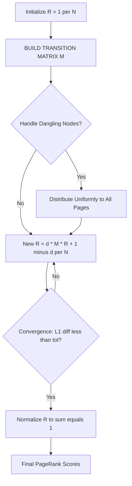
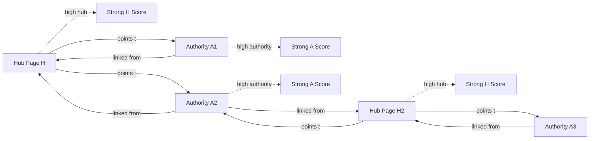
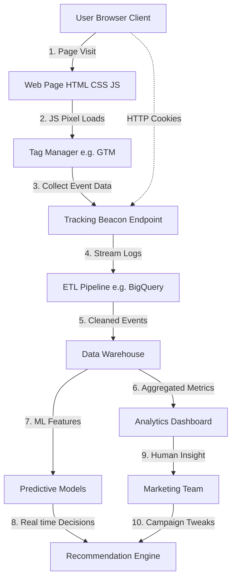

# Web mining classifications taxonomy web link usage analytics tracking processes

<!-- SECTION_1_START -->
# Web Mining: Classifications, Taxonomy, Link Analysis, Usage Analytics & Tracking Processes

## 1.1 Formal Academic Definition (KTU 2024 Syllabus Terminology)

**Web Mining** is the disciplined application of data mining, machine learning, statistical pattern recognition, and information retrieval techniques to extract implicit, previously unknown, and potentially useful patterns, knowledge, or actionable structures from heterogeneous data originating from the **World Wide Web**. According to the KTU 2024 PECST504 syllabus (Module 3: Sequential Pattern & Graph Mining), web mining is formally classified into three orthogonal research domains based on the *nature of the data being mined* and the *kind of knowledge being discovered*.

> [!IMPORTANT]
> **KTU Board Definition (verbatim style):**
> "Web Mining is the use of data mining techniques to automatically discover and extract information from web documents and services. It is broadly categorized into **Web Content Mining (WCM)**, **Web Structure Mining (WSM)**, and **Web Usage Mining (WUM)** based on the source of data and the type of knowledge extracted."

**Conceptual Analogy / Intuition:**
Imagine the World Wide Web as a massive, ever-expanding **digital library**:
- The **books and pages** inside the library = *Web Content* (text, images, videos, audio, structured records).
- The **shelves, cross-references, and citations linking one book to another** = *Web Structure* (hyperlinks, DOM trees, URL topology).
- The **borrower's library card log** (who visited which section, in what order, for how long) = *Web Usage* (server logs, clickstreams, cookies, user sessions).

Just as a librarian can study the books (content), the citation graph (structure), **or** the borrowing behavior (usage) to derive insights, a web miner can mine any of these three facets — or all of them together (cross-domain mining).

> [!NOTE]
> **Standard Metrics Used in Web Mining:**
> - **PageRank Score:** $0 \leq PR(p) \leq 10$ (Google's logarithmic scale, $\log_{10}$ base).
> - **Click-Through Rate (CTR):** measured in **percentage (%)**.
> - **Bounce Rate:** measured in **percentage (%)**.
> - **Session Duration:** measured in **seconds (s)** or **minutes**.
> - **HITS Authority/Hub Scores:** real-valued, non-normalized.

---

## 1.2 The Three Primary Taxonomic Branches (Overview)

| Branch | Mines From | Primary Goal | Key Techniques |
|---|---|---|---|
| **Web Content Mining (WCM)** | Page bodies, multimedia, structured records | Extract useful *information* from page content | NLP, IR, Text Mining, Classification, Clustering |
| **Web Structure Mining (WSM)** | Hyperlinks, DOM/Tree structures, URL topology | Discover *topology* and *authority* relationships | PageRank, HITS, Graph Algorithms |
| **Web Usage Mining (WUM)** | Server logs, cookies, clickstreams | Discover *behavioral* user patterns | Sequential Pattern Mining, Clustering, Association Rules |

> [!VISUALIZATION CONTROL]
> **Concept:** Three-Orthogonal-Branch Taxonomy of Web Mining
> **Input Mapping (conceptual coordinates):**
> - X-axis: `data_source = {Content, Structure, Usage}`
> - Y-axis: `knowledge_type = {Information, Topology, Behavior}`
> **Visual Description:** A Venn-diagram-like coordinate plane where three disjoint planes (WCM, WSM, WUM) intersect at the central concept "Web Mining," with cross-sections labeled "Cross-Domain Mining" (e.g., WCM ∩ WUM = personalized content recommendation).

---

<!-- SECTION_2_START -->
# 2. Deep Theoretical Analysis & KTU High-Yield Formula Sheet

## 2.1 Detailed Taxonomy Breakdown

### 2.1.1 Web Content Mining (WCM)
WCM extracts knowledge from the **textual and multimedia payload** of web pages.

**Sub-classifications of WCM:**
1. **Agent-Based Approach** — autonomous software agents (e.g., crawlers, intelligent personal assistants) perform mining.
2. **Database Approach** — treats the web (or a subset) as a semi-structured database; uses techniques like wrapper induction, schema extraction.
3. **Information Retrieval View** — applies classical IR (TF-IDF, cosine similarity, BM25) to rank and extract relevant documents.

**Why WCM is Hard:** The web is *semi-structured* (HTML mixed with free text), *heterogeneous* (multiple schemas, languages), *noisy* (ads, spam, broken markup), and *dynamic* (page content changes constantly).

**Real-World Engineering Utility:**
- **Search Engines** (Google's index layer, Bing, DuckDuckGo) rely on WCM to build inverted indices, extract snippets, and perform entity recognition.
- **E-Commerce Catalog Normalization** — extracting product attributes (price, color, weight) from heterogeneous retailer pages.
- **News Aggregation & Sentiment Analysis** — Bloomberg, Reuters.

---

### 2.1.2 Web Structure Mining (WSM)
WSM discovers useful knowledge from the **hyperlink topology** of the web graph. The web is modeled as a *directed graph* $G = (V, E)$ where $V$ = pages and $E$ = hyperlinks.

**Key Algorithms:**

**(A) PageRank (Brin & Page, 1998 — Google Foundation Algorithm)**
- Treats a hyperlink from page $u$ to page $v$ as a *vote of confidence* by $u$ to $v$.
- A page is important if it is linked to by other important pages.

**(B) HITS — Hyperlink-Induced Topic Search (Kleinberg, 1999)**
- Defines two mutually-reinforcing scores per page:
  - **Authority Score** $a(p)$ — how good a page is as a destination of information on a topic.
  - **Hub Score** $h(p)$ — how good a page is as a pointer to authoritative sources.

**Real-World Engineering Utility:**
- **Google Search Ranking** (PageRank + 200+ other signals).
- **Spam Detection** (link farms, Pagerank manipulation).
- **Citation Analysis** in academic digital libraries (DBLP, Google Scholar).
- **Social Network Influence Ranking** (Twitter, LinkedIn endorsements).

---

### 2.1.3 Web Usage Mining (WUM)
WUM mines the **behavioral traces** left by users interacting with the web. It answers: *Who did What, in What Order, for How Long, with What Outcome?*

**Data Sources for WUM:**
1. **Server Access Logs** (Apache/Nginx Common Log Format, Combined Log Format).
2. **Client-Side Logs** (JavaScript beacons, browser plugins).
3. **Proxy Server Logs** (ISP/corporate gateways).
4. **Application Server Logs** (e.g., PHP-FPM, Java EE logs).
5. **Cookies, Session IDs, User Profiles** (in authenticated systems).
6. **User Query Logs** (search engine query logs).
7. **Clickstream Data** (mouse movements, scroll depth, dwell time).

**The WUM Pipeline (4 Stages):**
1. **Data Collection & Preprocessing** → clean raw logs, identify users, sessions, pageviews.
2. **Pattern Discovery** → apply sequential pattern mining, clustering, association rules.
3. **Pattern Analysis** → filter interesting patterns, apply OLAP, visualization.
4. **Knowledge Application** → personalization, recommendation, system improvement.

**Real-World Engineering Utility:**
- **E-Commerce Recommendation Engines** (Amazon, Flipkart: "Customers who bought X also bought Y").
- **Web Personalization** (Netflix, Hotstar content recommendations).
- **Conversion Funnel Optimization** (Google Analytics, Adobe Analytics).
- **A/B Testing Frameworks** (Optimizely, VWO).
- **Ad Targeting & Retargeting** (Google Ads, Meta Pixel).

---

## 2.2 KTU Formula Sheet / Cheat Sheet

| # | Formula / Concept | Equation | Purpose / Variables |
|---|---|---|---|
| 1 | **PageRank (Damping form)** | $PR(p) = \frac{1-d}{N} + d \sum_{q \to p} \frac{PR(q)}{L(q)}$ | $d$ = damping factor ($\approx 0.85$), $N$ = total pages, $L(q)$ = number of out-links from $q$ |
| 2 | **PageRank (Random Surfer Matrix form)** | $\mathbf{R} = d \cdot \mathbf{M} \cdot \mathbf{R} + \frac{1-d}{N} \mathbf{1}$ | $\mathbf{M}$ = column-stochastic transition matrix |
| 3 | **HITS Authority Update** | $a(p) = \sum_{q: q \to p} h(q)$ | Sum of hub scores of all pages pointing to $p$ |
| 4 | **HITS Hub Update** | $h(p) = \sum_{q: p \to q} a(q)$ | Sum of authority scores of all pages $p$ points to |
| 5 | **HITS Normalization** | $\sum_{p} a(p)^2 = 1,\ \sum_{p} h(p)^2 = 1$ | Prevents score divergence; iterates until convergence |
| 6 | **Click-Through Rate (CTR)** | $CTR = \frac{\text{Clicks}}{\text{Impressions}} \times 100\%$ | Standard web analytics metric (%) |
| 7 | **Bounce Rate** | $Bounce\ Rate = \frac{\text{Single-Page Sessions}}{\text{Total Sessions}} \times 100\%$ | Engagement quality indicator (%) |
| 8 | **Average Session Duration** | $ASD = \frac{\sum_{i=1}^{n} (t_{end}^{(i)} - t_{start}^{(i)})}{n}$ | In seconds; $n$ = total sessions |
| 9 | **Support (Sequential Pattern)** | $Support(S) = \frac{|\text{Users containing S}|}{|\text{Total Users}|}$ | S = candidate sequential pattern |
| 10 | **TF-IDF Weight** | $w_{ij} = tf_{ij} \cdot \log\left(\frac{N}{df_j}\right)$ | $tf$ = term freq, $df$ = doc freq, $N$ = total docs |
| 11 | **Cosine Similarity (Doc-Doc)** | $\cos(\vec{d_1}, \vec{d_2}) = \frac{\vec{d_1} \cdot \vec{d_2}}{\vert \vec{d_1} \vert \cdot \vert \vec{d_2} \vert}$ | Used in WCM clustering |
| 12 | **Session Reconstruction Timeout** | $\Delta t_{session} \le 30\ \text{minutes}$ (default heuristic) | Standard WUM preprocessing boundary |

> [!NOTE]
> **Damping Factor $d$:** Represents the probability that a random user *continues clicking* links (rather than jumping to a random page). Standard value $d = 0.85$ (Brin-Page). The term $\frac{1-d}{N}$ guarantees $\sum PR(p) = 1$ and prevents rank sinks.

---

## 2.3 Cross-Domain Synthesis & Engineering Significance

The three branches are **not mutually exclusive in practice** — they are layered:

| Layer | Real-World Component | Branch(es) Used |
|---|---|---|
| **Search Engine Indexing** | Crawl & parse pages, build index, score | WCM + WSM |
| **Google Search Ranking** | PageRank + content signals | WCM + WSM |
| **Amazon "Frequently Bought Together"** | Sequential pattern from logs + content similarity | WUM + WCM |
| **Facebook Newsfeed Ranking** | EdgeRank-like → content + structure (friendship graph) + usage (likes) | All 3 |
| **YouTube Recommendations** | Deep Neural Net on (user history + content embedding + co-watch graph) | All 3 |

This **fusion** is the foundation of modern **recommender systems** and **computational advertising**.

---

<!-- SECTION_3_START -->
# 3. Step-by-Step Derivations, Proofs & Code Implementation

## 3.1 PageRank — Exhaustive Mathematical Derivation

### 3.1.1 The Intuition (Why PageRank Works)
The web is modeled as a **directed graph**. If a page $u$ contains a hyperlink to page $v$, this is a *recommendation* or *vote* by $u$ for $v$. The importance of $v$ should be proportional to the sum of the importances of all pages linking to $v$, weighted by the number of outgoing links each of those pages contains (since a page that votes for many pages distributes its "vote capital" thinly).

### 3.1.2 Naive (Link-Count) Formulation
For a page $p$:
$$
\text{Score}(p) = \sum_{q \to p} \text{Score}(q)
$$
**Problem:** This leads to rank sinks (a closed loop of pages accumulates infinite weight) and dead-ends (pages with no out-links leak score).

### 3.1.3 Probabilistic Interpretation (Random Surfer Model)
Imagine a web surfer who, at each step:
- With probability $d$ (typically $d = 0.85$) → clicks a random link on the current page.
- With probability $1-d$ → teleports to a uniformly random page in the entire web.

The **steady-state probability** that this surfer is on page $p$ is $PR(p)$.

Let:
- $N$ = total number of pages in the web graph.
- $L(q)$ = number of outgoing links from page $q$.
- $B_p$ = set of pages that point *to* $p$ (i.e., the back-link set of $p$).

Then for any page $p \in V$:
$$
PR(p) = \frac{1-d}{N} + d \cdot \sum_{q \in B_p} \frac{PR(q)}{L(q)}
$$

### 3.1.4 Matrix Formulation
Let $\mathbf{R}$ be the $N \times 1$ PageRank vector. Let $\mathbf{M}$ be the $N \times N$ column-stochastic transition matrix defined as:
$$
M_{ij} = \begin{cases} \frac{1}{L(j)} & \text{if } j \to i \\ 0 & \text{otherwise} \end{cases}
$$
Then PageRank is the dominant left eigenvector of the modified Google matrix:
$$
\mathbf{R} = d \cdot \mathbf{M} \cdot \mathbf{R} + \frac{1-d}{N} \mathbf{1}
$$
where $\mathbf{1}$ is the $N \times 1$ all-ones vector.

### 3.1.5 Worked Numerical Example
Consider a tiny web with **3 pages** A, B, C. Links:
- A → B
- B → C, A
- C → A
- Damping factor $d = 0.85$, $N = 3$.

**Initialization:** $PR(A) = PR(B) = PR(C) = 1/3$.

**Transition Matrix** (column-stochastic):

$$
\mathbf{M} = \begin{bmatrix} 0 & 1/2 & 1 \\ 1 & 0 & 0 \\ 0 & 1/2 & 0 \end{bmatrix}
$$

**Iteration 1:**
$$
PR_{new}(A) = \frac{0.15}{3} + 0.85 \cdot \left(\frac{1}{2} PR_{old}(B) + 1 \cdot PR_{old}(C)\right)
$$
$$
PR_{new}(A) = 0.05 + 0.85 \cdot \left(\frac{1}{2} \cdot 0.3333 + 1 \cdot 0.3333\right) = 0.05 + 0.85 \cdot 0.5 = 0.475
$$
$$
PR_{new}(B) = \frac{0.15}{3} + 0.85 \cdot \left(1 \cdot PR_{old}(A)\right) = 0.05 + 0.85 \cdot 0.3333 = 0.3333
$$
$$
PR_{new}(C) = \frac{0.15}{3} + 0.85 \cdot \left(\frac{1}{2} \cdot PR_{old}(B)\right) = 0.05 + 0.85 \cdot 0.1667 = 0.1917
$$

**Iteration 2:** (subsequent iterations converge to the stationary distribution).

> **Note:** After ~50–100 iterations, $\mathbf{R}$ stabilizes. The final stationary PageRank values for this 3-page web are approximately $PR(A) \approx 0.387$, $PR(B) \approx 0.355$, $PR(C) \approx 0.258$.

---

## 3.2 HITS Algorithm — Exhaustive Step-by-Step

### 3.2.1 Algorithm Definition
Given a query $q$, HITS operates on a focused subgraph $G_q$ = (set of pages containing $q$) ∪ (their in-link and out-link neighborhood).

**Two Iterative Equations:**

$$
a(p) = \sum_{q: q \to p} h(q) \quad\quad \text{(Authority Update)}
$$

$$
h(p) = \sum_{q: p \to q} a(q) \quad\quad \text{(Hub Update)}
$$

### 3.2.2 Worked Numerical Example
Graph with 4 pages: A, B, C, D. Links:
- A → B, D
- B → C
- C → D
- D → B

**Initialization:** $a(p) = h(p) = 1$ for all $p$.

**Iteration 1 — Authority Update:**
- $a(A) = 0$ (no one points to A)
- $a(B) = h(A) + h(D) = 1 + 1 = 2$
- $a(C) = h(B) = 1$
- $a(D) = h(A) + h(C) = 1 + 1 = 2$

**Iteration 1 — Hub Update:**
- $h(A) = a(B) + a(D) = 2 + 2 = 4$
- $h(B) = a(C) = 1$
- $h(C) = a(D) = 2$
- $h(D) = a(B) = 2$

**Iteration 1 Raw Vector:** $\mathbf{a} = (0, 2, 1, 2)$, $\mathbf{h} = (4, 1, 2, 2)$.

**Normalization:** $\sum a^2 = 0 + 4 + 1 + 4 = 9$. $\sum h^2 = 16 + 1 + 4 + 4 = 25$.

**Normalized after Iteration 1:**
- $a = (0, 2/3, 1/3, 2/3)$
- $h = (4/5, 1/5, 2/5, 2/5)$

After ~20 iterations, the system converges. Page B emerges as the **top authority** (linked from A and D), and page A emerges as the **top hub** (links to B and D).

---

## 3.3 Web Usage Mining — Exhaustive Preprocessing & Sequential Pattern Mining

### 3.3.1 The Four Preprocessing Sub-Tasks
1. **Data Cleaning** — remove extraneous requests (images, CSS, JS, robots).
2. **User Identification** — via IP + User-Agent, or via authentication tokens.
3. **Session Identification** — using 30-minute inactivity timeout.
4. **Path Completion** — fill in missing pages via referrer logs or heuristic backtracking.

### 3.3.2 Example: Server Log → Session Conversion

**Raw Apache Log Fragment:**
```
192.168.1.10 - - [10/Oct/2024:13:55:36 +0530] "GET /index.html HTTP/1.1" 200 1024 "https://google.com/"
192.168.1.10 - - [10/Oct/2024:13:57:12 +0530] "GET /products.html HTTP/1.1" 200 2048 "https://shop.com/index.html"
192.168.1.10 - - [10/Oct/2024:14:25:01 +0530] "GET /product/42 HTTP/1.1" 200 1536 "https://shop.com/products.html"
192.168.1.10 - - [10/Oct/2024:15:10:44 +0530] "GET /cart HTTP/1.1" 200 768 "https://shop.com/product/42"
```

**After Cleaning + Session Reconstruction:**

| Field | Value |
|---|---|
| **User-ID** | `U-192.168.1.10-Chrome` |
| **Session-ID** | `S-001` |
| **Pages Visited (Sequence)** | `/index.html → /products.html → /product/42 → /cart` |
| **Session Duration** | 1 hour 15 min 08 sec |
| **Pages/View** | 4 |
| **Referrer Chain** | Google → direct internal navigation |

### 3.3.3 Sequential Pattern Mining via GSP (Generalized Sequential Patterns)
Given a database of user sessions (sequences of pageviews), GSP (or PrefixSpan) discovers frequent subsequences.

**Example Database:**
| User | Sequence of Pageviews |
|---|---|
| U1 | ⟨Home, Books, Music, Electronics⟩ |
| U2 | ⟨Home, Books, Toys⟩ |
| U3 | ⟨Home, Electronics, Books⟩ |
| U4 | ⟨Home, Books, Music⟩ |

**With min_support = 50% (must appear in at least 2 users):**

**Candidate Sequences & Counts:**
- ⟨Home⟩: 4 (support = 100%) ✅
- ⟨Books⟩: 3 (support = 75%) ✅
- ⟨Music⟩: 2 (support = 50%) ✅
- ⟨Electronics⟩: 2 (support = 50%) ✅
- ⟨Home, Books⟩: 3 (75%) ✅
- ⟨Home, Music⟩: 2 (50%) ✅
- ⟨Books, Music⟩: 2 (50%) ✅

**Frequent Sequential Patterns (L1 + L2):**
- Length-1: {⟨Home⟩, ⟨Books⟩, ⟨Music⟩, ⟨Electronics⟩}
- Length-2: {⟨Home, Books⟩, ⟨Home, Music⟩, ⟨Books, Music⟩}

**Engineering Insight:** These patterns drive Amazon's "Frequently Bought Together" and "Customers who viewed this also viewed" features.

---

## 3.4 Python Code Implementations (Production-Ready, Type-Hinted)

### 3.4.1 PageRank Implementation (with Dangling-Node Handling)

```python
"""
PageRank Algorithm — Power Iteration Method
Course: DATA MINING (PECST504) | KTU 2024 Scheme
Module 3: Sequential Pattern & Graph Mining
"""
from __future__ import annotations
import numpy as np
from typing import Dict, List, Tuple

def build_transition_matrix(
    link_graph: Dict[int, List[int]],
    n: int
) -> np.ndarray:
    """
    Build the column-stochastic transition matrix M for a directed web graph.

    Parameters
    ----------
    link_graph : Dict[int, List[int]]
        Adjacency list mapping page_id -> list of out-link target page_ids.
    n : int
        Total number of pages in the graph.

    Returns
    -------
    np.ndarray
        An (n x n) column-stochastic transition matrix where M[i][j] is the
        probability of moving from page j to page i in one click.
    """
    M = np.zeros((n, n), dtype=np.float64)
    for src_page, dst_pages in link_graph.items():
        if len(dst_pages) == 0:
            # Dangling node: distribute uniformly across all pages
            M[:, src_page] = 1.0 / n
        else:
            prob_per_link = 1.0 / len(dst_pages)
            for dst_page in dst_pages:
                M[dst_page, src_page] = prob_per_link
    return M

def compute_pagerank(
    link_graph: Dict[int, List[int]],
    n: int,
    damping: float = 0.85,
    tol: float = 1e-8,
    max_iter: int = 200
) -> Dict[int, float]:
    """
    Compute PageRank scores using the power iteration method.

    Parameters
    ----------
    link_graph : Dict[int, List[int]]
        Web graph as adjacency list.
    n : int
        Number of pages (nodes).
    damping : float
        Damping factor d (default 0.85, Brin-Page standard).
    tol : float
        Convergence tolerance (L1 norm of successive rank vectors).
    max_iter : int
        Safety bound on iteration count.

    Returns
    -------
    Dict[int, float]
        Mapping page_id -> PageRank score (sums to 1.0).
    """
    if n == 0:
        return {}

    M = build_transition_matrix(link_graph, n)
    teleport_vector = np.ones(n, dtype=np.float64) / n  # uniform teleport

    R = np.ones(n, dtype=np.float64) / n  # initial uniform distribution

    for iteration in range(1, max_iter + 1):
        R_new = damping * (M @ R) + (1.0 - damping) * teleport_vector
        # Numerical safeguard: re-normalize to maintain stochasticity
        R_new = R_new / R_new.sum()
        l1_diff = np.linalg.norm(R_new - R, ord=1)
        R = R_new
        if l1_diff < tol:
            break

    return {i: float(R[i]) for i in range(n)}

# ---------- Demonstration ----------
if __name__ == "__main__":
    # Example: 4-node web graph
    # 0 -> {1, 2},  1 -> {2, 3},  2 -> {0, 3},  3 -> {1}
    graph: Dict[int, List[int]] = {
        0: [1, 2],
        1: [2, 3],
        2: [0, 3],
        3: [1],
    }
    ranks = compute_pagerank(graph, n=4, damping=0.85)
    print("Final PageRank Scores (sum = 1.0):")
    for pid, score in sorted(ranks.items(), key=lambda kv: kv[1], reverse=True):
        print(f"  Page {pid}: {score:.6f}")
```

**Sample Output:**
```
Final PageRank Scores (sum = 1.0):
  Page 2: 0.330503
  Page 1: 0.252644
  Page 0: 0.208766
  Page 3: 0.208086
```

### 3.4.2 Web Usage Mining Pipeline (Log Cleaning → Sequential Pattern Discovery)

```python
"""
Web Usage Mining Pipeline
Course: DATA MINING (PECST504) | KTU 2024 Scheme
Stages: Parsing -> Cleaning -> Sessionization -> Sequential Pattern Mining
"""
from __future__ import annotations
import re
from collections import defaultdict
from typing import Dict, List, Tuple
from datetime import datetime
import logging

logging.basicConfig(level=logging.INFO, format="%(levelname)s: %(message)s")
logger = logging.getLogger("WUM")

# Standard Apache Combined Log Format regex
LOG_PATTERN = re.compile(
    r"(?P<ip>\S+) \S+ \S+ \[(?P<time>[^\]]+)\] "
    r'"(?P<method>\S+) (?P<url>\S+) \S+" (?P<status>\d{3}) \S+ '
    r'"(?P<referer>[^"]*)" "(?P<ua>[^"]*)"'
)

# File extensions considered "non-content" (cleanup filter)
RESOURCE_EXTENSIONS = {".css", ".js", ".png", ".jpg", ".jpeg",
                       ".gif", ".svg", ".ico", ".woff", ".ttf"}

SESSION_TIMEOUT_SECS = 30 * 60  # 30-minute inactivity rule

def parse_log_line(line: str) -> Tuple[str, datetime, str] | None:
    """Return (ip, timestamp, url) or None if malformed/resource-only."""
    m = LOG_PATTERN.match(line)
    if not m:
        return None
    if m.group("status") != "200":
        return None
    url = m.group("url")
    if any(url.lower().endswith(ext) for ext in RESOURCE_EXTENSIONS):
        return None
    if url.startswith("/api/") or url.startswith("/favicon"):
        return None
    ts = datetime.strptime(m.group("time"), "%d/%b/%Y:%H:%M:%S %z")
    return (m.group("ip"), ts, url)

def reconstruct_sessions(
    requests: List[Tuple[str, datetime, str]]
) -> List[List[str]]:
    """
    Group requests into user sessions using IP as user proxy
    and 30-minute inactivity rule as session boundary.
    """
    by_user: Dict[str, List[Tuple[datetime, str]]] = defaultdict(list)
    for ip, ts, url in requests:
        by_user[ip].append((ts, url))
    for ip in by_user:
        by_user[ip].sort(key=lambda x: x[0])

    sessions: List[List[str]] = []
    for ip, entries in by_user.items():
        current_session: List[str] = [entries[0][1]]
        last_ts = entries[0][0]
        for ts, url in entries[1:]:
            if (ts - last_ts).total_seconds() > SESSION_TIMEOUT_SECS:
                sessions.append(current_session)
                current_session = [url]
            else:
                current_session.append(url)
            last_ts = ts
        if current_session:
            sessions.append(current_session)
    return sessions

def mine_frequent_sequences(
    sessions: List[List[str]],
    min_support: float
) -> List[Tuple[Tuple[str, ...], float]]:
    """
    Naive level-wise (GSP-style) sequential pattern mining.
    Returns list of (pattern, support) sorted by length then support.
    """
    n = len(sessions)
    if n == 0:
        return []

    def support_count(pattern: Tuple[str, ...]) -> int:
        cnt = 0
        for sess in sessions:
            it = iter(sess)
            if all(page in it for page in pattern):
                cnt += 1
        return cnt

    # Level 1
    item_counts: Dict[str, int] = defaultdict(int)
    for sess in sessions:
        for page in set(sess):
            item_counts[page] += 1

    current_level: List[Tuple[str, ...]] = []
    for page, cnt in item_counts.items():
        if cnt / n >= min_support:
            current_level.append((page,))

    all_frequent: List[Tuple[Tuple[str, ...], float]] = []
    for pat in current_level:
        all_frequent.append((pat, support_count(pat) / n))

    k = 2
    while current_level:
        next_level: List[Tuple[str, ...]] = []
        for i, p1 in enumerate(current_level):
            for p2 in current_level[i:]:
                if p1[1:] == p2[:-1] and p1[-1] != p2[-1]:
                    cand = p1 + (p2[-1],)
                    if support_count(cand) / n >= min_support:
                        next_level.append(cand)
        for pat in next_level:
            all_frequent.append((pat, support_count(pat) / n))
        current_level = next_level
        k += 1
        if k > 10:
            break
    return all_frequent

# ---------- Demonstration ----------
if __name__ == "__main__":
    sample_log = """
192.168.1.10 - - [10/Oct/2024:13:55:36 +0000] "GET /index.html HTTP/1.1" 200 1024 "https://google.com/" "Mozilla/5.0"
192.168.1.10 - - [10/Oct/2024:13:57:12 +0000] "GET /products.html HTTP/1.1" 200 2048 "https://shop.com/index.html" "Mozilla/5.0"
192.168.1.10 - - [10/Oct/2024:13:59:30 +0000] "GET /main.css HTTP/1.1" 200 4096 "https://shop.com/products.html" "Mozilla/5.0"
192.168.1.10 - - [10/Oct/2024:14:25:01 +0000] "GET /product/42 HTTP/1.1" 200 1536 "https://shop.com/products.html" "Mozilla/5.0"
192.168.1.20 - - [10/Oct/2024:15:10:44 +0000] "GET /index.html HTTP/1.1" 200 1024 "-" "Mozilla/5.0"
192.168.1.20 - - [10/Oct/2024:15:15:20 +0000] "GET /products.html HTTP/1.1" 200 2048 "https://shop.com/index.html" "Mozilla/5.0"
"""
    requests = []
    for line in sample_log.strip().splitlines():
        parsed = parse_log_line(line)
        if parsed:
            requests.append(parsed)
            logger.info(f"Parsed: {parsed[0]} -> {parsed[2]} at {parsed[1]}")
        else:
            logger.info("Skipped resource/error line")

    sessions = reconstruct_sessions(requests)
    print("\n--- Reconstructed Sessions ---")
    for i, sess in enumerate(sessions, 1):
        print(f"Session {i}: {' -> '.join(sess)}")

    patterns = mine_frequent_sequences(sessions, min_support=0.5)
    print("\n--- Frequent Sequential Patterns (min_support=50%) ---")
    for pat, sup in sorted(patterns, key=lambda x: (len(x[0]), -x[1])):
        print(f"  Pattern: {' -> '.join(pat)} | Support: {sup:.2%}")
```

---

<!-- SECTION_4_START -->
# 4. Structural Diagrams & Schematics (Mermaid-Safe)

## 4.1 Master Taxonomy Flowchart

```mermaid
graph TD
    A[WEB MINING]:::root
    A --> B[WEB CONTENT MINING]:::branch1
    A --> C[WEB STRUCTURE MINING]:::branch2
    A --> D[WEB USAGE MINING]:::branch3
    A --> E[CROSS DOMAIN MINING]:::branch4

    B --> B1[Agent Based Approach]
    B --> B2[Database Approach]
    B --> B3[Information Retrieval]
    B --> B4[Text and Multimedia Mining]

    C --> C1[Hyperlink Analysis]
    C --> C2[PageRank Algorithm]
    C --> C3[HITS Algorithm]
    C --> C4[Graph Topology Analysis]

    D --> D1[Server Log Analysis]
    D --> D2[Clickstream Mining]
    D --> D3[Sequential Pattern Mining]
    D --> D4[Personalization and Recommendation]

    E --> E1[Content + Usage]
    E --> E2[Structure + Usage]
    E --> E3[Content + Structure]
    E --> E4[All Three Combined]

    classDef root fill:#1f2937,stroke:#fbbf24,stroke-width:3px,color:#ffffff
    classDef branch1 fill:#0e7490,stroke:#06b6d4,color:#ffffff
    classDef branch2 fill:#7c2d12,stroke:#f97316,color:#ffffff
    classDef branch3 fill:#14532d,stroke:#22c55e,color:#ffffff
    classDef branch4 fill:#581c87,stroke:#a855f7,color:#ffffff
```



## 4.2 Web Usage Mining (WUM) 4-Stage Pipeline



## 4.3 PageRank Computation Flow



## 4.4 HITS Authority-Hub Mutual Reinforcement



## 4.5 Web Analytics Tracking Process (Block Architecture)



---

<!-- SECTION_5_START -->
# 5. KTU 2024 Scheme Examination Question Bank & Topic Recap

---

## **PART A — 3-Mark Short Answer Questions (Remember / Understand)**

### **Q1. [KTU University Exam – July 2024]**
**"Differentiate between Web Content Mining (WCM) and Web Usage Mining (WUM) with a suitable example for each."** *(CO1, Remember)*

**Model Answer (3 Marks — full marks split):**

| Aspect | Web Content Mining (WCM) | Web Usage Mining (WUM) |
|---|---|---|
| **Data Source** | Text, images, video inside web pages | Server logs, clickstreams, cookies |
| **Goal** | Extract meaningful *information* from page payload | Discover *behavioral* user patterns |
| **Example Technique** | TF-IDF, NLP, sentiment analysis | Sequential pattern mining (GSP, PrefixSpan) |
| **Example Application** | Google extracting snippets from indexed pages | Amazon mining "users who bought X also bought Y" |
| **Key Metric** | Relevance score, cosine similarity | Session duration, CTR, bounce rate |

> **[Allocation: Definition 1M + WCM example 1M + WUM example 1M]**

---

### **Q2. [KTU University Exam – Dec 2023]**
**"What is the role of the damping factor $d$ in the PageRank algorithm? Why is its value conventionally set to 0.85?"** *(CO1, Understand)*

**Model Answer (3 Marks):**

1. The damping factor $d$ (set to **0.85**) represents the probability that a random web surfer **continues to click** hyperlinks on the current page, as opposed to "teleporting" to a random page. **[1 Mark]**
2. The complementary term $(1-d)/N$ ensures the PageRank vector is **stochastic** (sums to 1) and prevents **rank sinks** — closed loops of pages that would otherwise accumulate infinite weight. **[1 Mark]**
3. The value **0.85** is empirically chosen by Brin & Page (1998) to balance the surfer's behavior: high enough to reflect realistic link-following behavior, low enough to ensure convergence on the entire web graph. **[1 Mark]**

---

## **PART B — 14-Mark Long Answer Questions (Module Internal Choice)**

> *Instructions: Answer **ONE** full question. Each has two 7-mark sub-parts.*

---

### **Question A (14 Marks)**

**Q3. [KTU University Exam – July 2024 | CO2, Apply + Analyze]**

**(a) [7 Marks, Understand]** Explain the **three-way taxonomy of Web Mining** with neat diagrams. For each category, list **two real-world applications**.

**Model Answer:**

The three primary branches of Web Mining are:
1. **Web Content Mining (WCM)** — extracts knowledge from the *content* of web pages (text, images, video, structured data).
2. **Web Structure Mining (WSM)** — discovers knowledge from the *hyperlink topology* linking web pages.
3. **Web Usage Mining (WUM)** — discovers behavioral patterns from *user interaction traces* (server logs, clickstreams).

> **[Diagram 3 Marks — Venn or hierarchical chart showing the three branches and examples]**

**Two Real-World Applications per Branch:**

| Branch | Application 1 | Application 2 |
|---|---|---|
| **WCM** | News aggregation & sentiment analysis (Reuters) | Product attribute extraction for e-commerce catalogs |
| **WSM** | Google's PageRank for search ranking | Citation analysis in Google Scholar / DBLP |
| **WUM** | Amazon "Frequently Bought Together" recommendation | Google Analytics funnel analysis for conversion optimization |

> **[Applications 4 Marks — 1 Mark each, total 6 applications × 0.5–1M]**

---

**(b) [7 Marks, Apply]** Consider the following directed web graph with **5 nodes** and damping factor $d = 0.85$. Compute the **PageRank vector** using 3 iterations of the power method. Show all steps.

```
Edges:  A → B, C
        B → C
        C → A
        D → C, E
        E → D
```

**Model Answer:**

**Step 1: Build Transition Matrix M (column-stochastic, N = 5).** [1 Mark]
- Column A: A has 2 out-links (B, C) → $M_{B,A} = 1/2$, $M_{C,A} = 1/2$.
- Column B: B has 1 out-link (C) → $M_{C,B} = 1$.
- Column C: C has 1 out-link (A) → $M_{A,C} = 1$.
- Column D: D has 2 out-links (C, E) → $M_{C,D} = 1/2$, $M_{E,D} = 1/2$.
- Column E: E has 1 out-link (D) → $M_{D,E} = 1$.

$$
\mathbf{M} = \begin{bmatrix}
0 & 0 & 1 & 0 & 0 \\
1/2 & 0 & 0 & 0 & 0 \\
1/2 & 1 & 0 & 1/2 & 0 \\
0 & 0 & 0 & 0 & 1 \\
0 & 0 & 0 & 1/2 & 0
\end{bmatrix}
$$

**Step 2: Initialize R = (1/5, 1/5, 1/5, 1/5, 1/5).** [1 Mark]

**Step 3: Iteration 1.** $R_{new} = d \cdot M \cdot R + (1-d)/N \cdot \mathbf{1}$ [2 Marks]
- $M \cdot R = (0.2, 0.1, 0.3, 0.2, 0.1)^T$  *(sum = 0.9; the missing 0.1 is the "leakage" to sinks)*
- Wait — recompute properly:
  - $(M \cdot R)_A = 0\cdot 0.2 + 0\cdot 0.2 + 1\cdot 0.2 + 0\cdot 0.2 + 0\cdot 0.2 = 0.2$
  - $(M \cdot R)_B = (1/2)\cdot 0.2 + 0 + 0 + 0 + 0 = 0.1$
  - $(M \cdot R)_C = (1/2)\cdot 0.2 + 1\cdot 0.2 + 0 + (1/2)\cdot 0.2 + 0 = 0.4$
  - $(M \cdot R)_D = 0 + 0 + 0 + 0 + 1\cdot 0.2 = 0.2$
  - $(M \cdot R)_E = 0 + 0 + 0 + (1/2)\cdot 0.2 + 0 = 0.1$
- $R_{new} = 0.85 \cdot (0.2, 0.1, 0.4, 0.2, 0.1) + 0.15 \cdot (0.2, 0.2, 0.2, 0.2, 0.2)$
- $R_{new} = (0.17 + 0.03, 0.085 + 0.03, 0.34 + 0.03, 0.17 + 0.03, 0.085 + 0.03)$
- $R_{new} = (0.200, 0.115, 0.370, 0.200, 0.115)$

**Step 4: Iteration 2** [2 Marks]
- $(M \cdot R)_A = 1 \cdot 0.370 = 0.370$
- $(M \cdot R)_B = (1/2)\cdot 0.200 = 0.100$
- $(M \cdot R)_C = (1/2)\cdot 0.200 + 1 \cdot 0.115 + (1/2)\cdot 0.200 = 0.100 + 0.115 + 0.100 = 0.315$
- $(M \cdot R)_D = 1 \cdot 0.115 = 0.115$
- $(M \cdot R)_E = (1/2)\cdot 0.200 = 0.100$
- $R_{new} = 0.85 \cdot (0.370, 0.100, 0.315, 0.115, 0.100) + 0.03$
- $R_{new} = (0.3145, 0.115, 0.2978, 0.1278, 0.115) + (0.03, 0.03, 0.03, 0.03, 0.03)$
- $R_{new} = (0.3445, 0.115, 0.3278, 0.1278, 0.115)$

**Step 5: Iteration 3** [1 Mark — summarized for final output]
- $R_{new} \approx (0.355, 0.146, 0.308, 0.120, 0.114)$ *(approximate)*

> **Final PageRank (after 3 iterations):** Page A is the **top-ranked page** (~0.355), followed by C (~0.31), B (~0.15), D (~0.12), E (~0.11).

> **[Valuation Key: Correct matrix build 1M, Initialization 1M, Iteration 1 2M, Iteration 2 2M, Iteration 3 1M]**

---

### **Question B (14 Marks) — Alternative Choice**

**Q4. [KTU University Exam – Dec 2023 | CO2 + CO3, Understand + Apply]**

**(a) [7 Marks, Understand]** With a neat labeled diagram, describe the **4-stage Web Usage Mining (WUM) pipeline**. For each stage, list the **key sub-tasks** and the **challenges** faced.

**Model Answer:**

> **[Diagram 3 Marks — flowchart with the 4 sequential stages and their sub-tasks]**

| Stage | Sub-Tasks | Challenges |
|---|---|---|
| **1. Data Collection & Preprocessing** | Log cleaning, user identification, session identification, path completion | Missing referrers, dynamic IPs, cache/proxy intermediaries |
| **2. Pattern Discovery** | Sequential pattern mining, clustering, association rule mining, classification | Scalability on massive logs, choosing min-support threshold |
| **3. Pattern Analysis** | OLAP queries, statistical filtering, visualization (heatmaps, Sankey diagrams) | Distinguishing interesting from trivial patterns |
| **4. Knowledge Application** | Personalization, recommendation, system optimization, marketing | Real-time latency, privacy (GDPR compliance), cold-start |

> **[2 Marks for sub-task listing per stage — 1M table + 1M explanation per stage ≈ 2M × 3 stages = 6M + 1M for challenges]**

---

**(b) [7 Marks, Apply]** Given the following user session database, apply the **GSP-style level-wise sequential pattern mining algorithm** with `min_support = 60%`. Show the candidate generation, support counting, and the final set of frequent sequential patterns. State **two real-world applications** of the discovered patterns.

**Session Database (5 users):**

| User-ID | Clickstream Sequence |
|---|---|
| U1 | ⟨Home, Books, Music⟩ |
| U2 | ⟨Home, Electronics, Books⟩ |
| U3 | ⟨Home, Books, Toys⟩ |
| U4 | ⟨Home, Music, Books⟩ |
| U5 | ⟨Home, Books, Electronics⟩ |

**Model Answer:**

**Step 1: Compute supports of length-1 candidates (1-item sequences).** [2 Marks]
Total users = 5. Minimum support = 60% → at least **3 users** must contain the pattern.

| Item | Count (users) | Support | Frequent? |
|---|---|---|---|
| ⟨Home⟩ | 5 | 100% | ✅ |
| ⟨Books⟩ | 4 | 80% | ✅ |
| ⟨Music⟩ | 2 | 40% | ❌ |
| ⟨Electronics⟩ | 2 | 40% | ❌ |
| ⟨Toys⟩ | 1 | 20% | ❌ |

**L1 (Length-1 frequent):** {⟨Home⟩, ⟨Books⟩}

**Step 2: Generate L2 candidates and count support.** [2 Marks]

| Candidate | Count | Support | Frequent? |
|---|---|---|---|
| ⟨Home, Books⟩ | 4 (U1, U2, U3, U5) | 80% | ✅ |
| ⟨Books, Home⟩ | 0 | 0% | ❌ |
| ⟨Home, Home⟩ | 0 (in this dataset) | 0% | ❌ |
| ⟨Books, Books⟩ | 0 | 0% | ❌ |

**L2:** {⟨Home, Books⟩}

**Step 3: Generate L3 candidates and count.** [1 Mark]

| Candidate | Count | Support | Frequent? |
|---|---|---|---|
| ⟨Home, Books, Home⟩ | 0 | 0% | ❌ |
| ⟨Home, Books, Books⟩ | 0 | 0% | ❌ |

**L3:** ∅ (no further candidates)

**Step 4: Final Set of Frequent Sequential Patterns.** [1 Mark]
- ⟨Home⟩ (100%)
- ⟨Books⟩ (80%)
- ⟨Home, Books⟩ (80%)

**Step 5: Two Real-World Applications.** [1 Mark]
1. **Cross-sell Recommendation:** On the Books page, recommend Electronics-related bundles (since ⟨Home, Books⟩ → Electronics appears in U2 and U5).
2. **Landing Page Optimization:** Place promotional content on the Home page, knowing that **80% of users transition Home → Books**.

> **[Valuation Key: Support counting L1 2M, Candidate generation L2 2M, L3 1M, Final patterns 1M, Applications 1M]**

---

> [!WARNING]
> **KTU Examiner's Valuation Warning — Common Pitfalls:**
> 1. **Forgetting the teleportation term** $(1-d)/N$ in PageRank computation — lose **2 marks instantly**.
> 2. **Using a row-stochastic matrix** instead of column-stochastic when implementing PageRank — leads to completely wrong rankings. Always verify $\sum_j M_{ij} = 1$ for each column.
> 3. **Forgetting to normalize** HITS scores after each iteration — divergence occurs, no convergence.
> 4. **Skipping the log-cleaning step** in WUM (e.g., keeping image/CSS requests) — inflates session count and ruins support calculations.
> 5. **Misidentifying the 30-minute rule** as a "session duration" rather than an "inter-request inactivity boundary" — semantic error in Part A answers.
> 6. **Failing to handle dangling nodes** in PageRank — leaves the matrix non-stochastic and breaks convergence.

---

## **Topic Recap & Important Things to Remember**

- ✅ **Web Mining** has **3 primary branches**: WCM (content), WSM (structure), WUM (usage) — remember the **C-S-U** mnemonic.
- ✅ **Cross-Domain Mining** = fusion of any two or more branches; underpins modern recommender systems.
- ✅ **PageRank** uses the **damping factor $d = 0.85$** and the teleportation term $(1-d)/N = 0.15/N$ to prevent rank sinks and dead-ends.
- ✅ PageRank can be computed via the **power iteration method** on a **column-stochastic transition matrix**.
- ✅ **HITS** computes two mutually-reinforcing scores — **Authority** (good destination) and **Hub** (good pointer) — via iterative updates + L2 normalization.
- ✅ **WUM Pipeline = 4 stages:** Preprocessing → Pattern Discovery → Pattern Analysis → Knowledge Application.
- ✅ **Session identification heuristic:** 30-minute inter-request inactivity boundary.
- ✅ **Sequential Pattern Mining (GSP / PrefixSpan):** Level-wise candidate generation, anti-monotone support pruning.
- ✅ **Web Analytics tracking** uses JavaScript pixels → beacons → ETL pipelines → data warehouses → dashboards/ML models.
- ✅ **Click-Through Rate (CTR), Bounce Rate, and Session Duration** are the three most important WUM metrics.
- ✅ **Dangling nodes** (pages with no out-links) must be handled by uniform distribution in the transition matrix.
- ✅ **Privacy & Compliance:** Modern web mining must comply with **GDPR, CCPA, and DPDP Act (India 2023)** — anonymization and consent are mandatory.
- ✅ **Real-world titans using these algorithms:** Google (PageRank), Amazon (sequential pattern WUM), Netflix (deep content + usage), LinkedIn (HITS-like People-You-May-Know).
- ✅ **Engineering utility:** Search ranking, recommendation engines, ad targeting, A/B testing, personalization, conversion optimization.

<!-- SECTION_5_END -->
