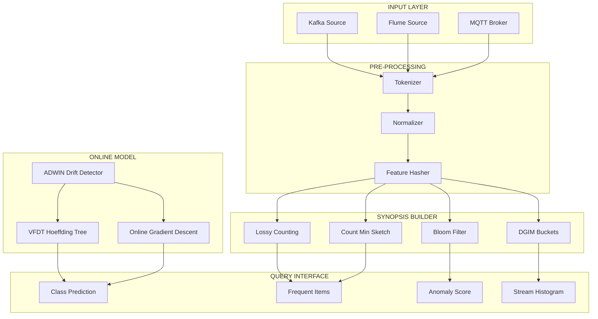
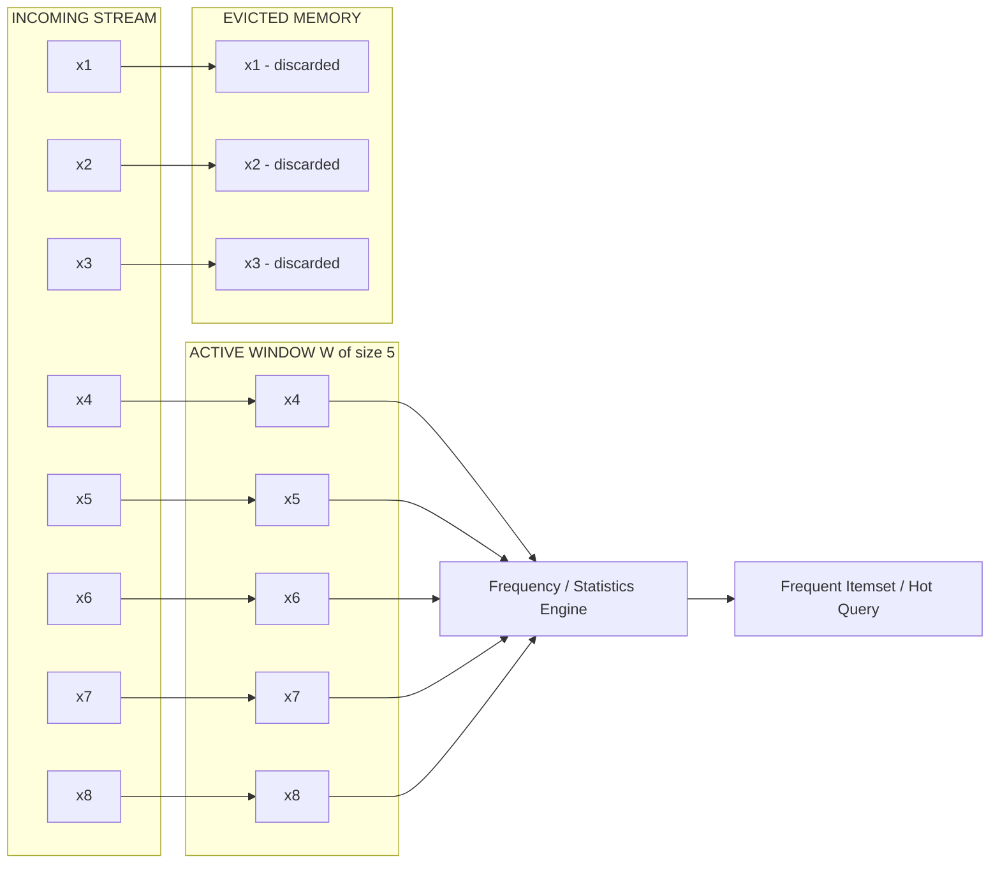
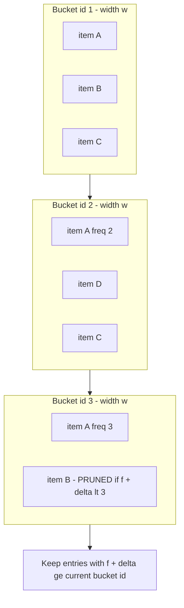
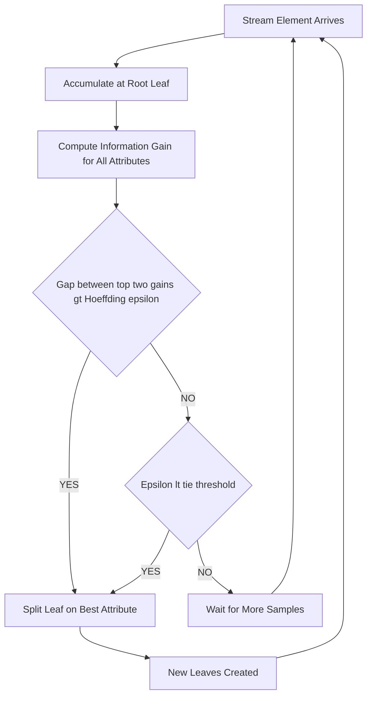
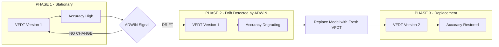

# Data stream mining constraints sliding window computational loops frameworks

<!-- SECTION_1_START -->
# Data Stream Mining: Constraints, Sliding Windows & Computational Frameworks

## 1. Core Technical Definition

> [!IMPORTANT]
> **Data Stream Mining** is the process of extracting structured, non-trivial patterns, trends, and knowledge from continuous, high-velocity, unbounded sequences of data elements (streams) that arrive in real-time and can only be examined a limited number of times, using bounded memory and bounded processing time per element.

A **data stream** $\mathcal{S} = \{x_1, x_2, x_3, \ldots, x_t, \ldots\}$ is a massive, ordered sequence of data items that arrive continuously at a rate that makes it impossible to store the entire stream in main memory. Unlike static databases, streams have fundamentally different operational constraints formalized in the **Data Stream Model**.

### Formal KTU 2024 Syllabus Definition

> [!NOTE]
> Per KTU PECST504 Module-4, Stream Mining concerns the extraction of useful patterns from **continuous, rapidly arriving records** where data cannot be stored in entirety. The syllabus mandates the study of the **VFDT (Very Fast Decision Tree) framework**, **sliding-window-based models**, **lossy counting for frequent items**, and **constraints imposed by the streaming paradigm** (one-pass, bounded memory, real-time response).

### Conceptual Analogy / Intuition

> [!TIP]
> **The Fire Hydrant Analogy:** Imagine trying to drink from a fire hydrant. Water (data) arrives too fast to gulp directly (no infinite memory). You must choose:
> 1. **A small cup** = bounded memory (you can only hold a little)
> 2. **Drink-and-forget** = single pass (data is not revisited)
> 3. **Pick only the cool water** = synopsis/summarization (keep only useful patterns)
> 4. **React instantly** = real-time response (no time to ponder)
> 5. **Keep last N seconds in mind** = sliding window
>
> A data stream mining algorithm is exactly that — a smart, selective drinker under a fire hydrant of information.

### The Four Pillars of Stream Mining Constraints (Critical for Board Exam)

| # | Constraint | Meaning | Standard Metric |
|---|------------|---------|-----------------|
| 1 | **Single Pass** | Each item examined at most once | $O(1)$ reads per item |
| 2 | **Bounded Memory** | Storage must be sublinear in stream length | $O(N^{\alpha})$ or $O(\log^c N)$ |
| 3 | **Real-time Response** | Per-item processing time must be tiny | $O(\text{poly}(\log N))$ per item |
| 4 | **Concept Drift Adaptability** | Underlying statistics may change over time | Time-decayed or windowed updates |

Where **N** denotes the current stream length, also written as $\vert \mathcal{S}_t \vert = N$ at time $t$.

> [!IMPORTANT]
> **Standard KTU Definition (Bloom Filter Linkage):** A *stream mining framework* is a system-level architecture that coordinates (a) a **synopsis data structure**, (b) a **query processing engine**, and (c) an **approximation/error-bounding mechanism** to deliver answers to evolving mining queries under the four constraints above.

### Why Traditional Mining Fails on Streams

Classical algorithms like **Apriori**, **k-Means**, or **C4.5** assume:
- Data fits in RAM (or even on disk)
- Multiple scans are allowed
- Distribution is stationary

Streams violate all three. Hence the field demands **one-pass**, **approximate**, and **online** algorithms.

### Components of a Stream Mining Framework

1. **Input Adapter** – pulls from message brokers (Kafka, Flink sources).
2. **Synopsis Builder** – maintains compact summaries (e.g., CM-sketch, Count-Min, DGIM).
3. **Model Updater** – incremental learning (Hoeffding trees, online gradient descent).
4. **Drift Detector** – monitors distribution shift (ADWIN, Page-Hinkley).
5. **Query Interface** – answers point/range queries on the fly.

> [!VISUALIZATION CONTROL]
> **Concept:** Stream rate vs. memory capacity over time
> **GeoGebra / Desmos Input Equations:**
> * `f(t) = 1000 * sin(t/2) + 1200` (arrival rate)
> * `g(t) = 500` (fixed memory ceiling)
> * `h(t) = piecewise(t < 10, 0, 0.2*(t-10))` (eviction slope)
> **Visual Description:** Student should see `f(t)` consistently exceeding the horizontal ceiling `g(t)`. The buffer overflow begins exactly where `f(t) > g(t)`, motivating the need for **summarization and eviction policies** (sliding window / lossy counting).

---

<!-- SECTION_1_END -->

<!-- SECTION_2_START -->
# Deep Theoretical Analysis & KTU High-Yield Formula Sheet

## 2. The Sliding Window Model — Core Theory

### 2.1 Definition and Variants

A **sliding window** restricts mining to the most recent $W$ items of the stream. Formally, at time $t$, the active window is:

$$
W_t = \{ x_i \mid t - W + 1 \le i \le t \}
$$

Three operational variants exist:

| Variant | Formal Definition | Use Case |
|---------|-------------------|----------|
| **Tumbling Window** | Non-overlapping, fixed-size blocks of size $W$ | Periodic analytics (hourly KPIs) |
| **Sliding (Hopping) Window** | Slides by step $\Delta \le W$ | Recent-trend analysis |
| **Landmark Window** | From fixed time $0$ to current $t$ | All-history statistics |

The number of items in a sliding window at time $t$ is exactly $\vert W_t \vert = W$ (assuming no late arrivals). For a time-based window of duration $T_w$:

$$
W_t = \{ (i, x_i) \mid t - T_w \le i \le t \}
$$

### 2.2 Landmark vs. Sliding vs. Damped — When to Use

> [!NOTE]
> **KTU Board Tip:** Most exam questions on Module 4 differentiate between **time-decay** (older items weighted lower) and **sliding window** (older items **discarded**). Memorize that in a **damped model**, item $x_i$ has weight $2^{-\lambda(t-i)}$; in a **sliding model**, items outside $W_t$ have weight $0$.

## 3. Synopsis Data Structures (High-Yield Formula Sheet)

> [!IMPORTANT]
> The following table is the single most important reference for the Module-4 KTU exam. Memorize the **error bounds** column verbatim.

| Algorithm | Synopsis Size | Query | Approximation Guarantee | Reference |
|-----------|--------------|-------|--------------------------|-----------|
| **Lossy Counting** | $O(\frac{1}{\varepsilon} \log N)$ | Items with freq $\ge \phi N$ | $\varepsilon N$ over-count | Manku-Motwani 2002 |
| **DGIM** | $O(\log^2 N)$ buckets | 1-bits in last $k$ positions | At most 50% error | Datar-Gionis-Indyk-Motwani |
| **Count-Min Sketch** | $O(\frac{1}{\varepsilon} \log \frac{1}{\delta})$ rows | Point / range queries | $\varepsilon N$ over-count w.p. $1-\delta$ | Cormode-Muthukrishnan |
| **Bloom Filter** | $m = -\frac{n \ln p}{(\ln 2)^2}$ bits | Membership query | FPR $p = (1-e^{-kn/m})^k$ | Burton Bloom 1970 |
| **Hoeffding Tree** | $O(\text{leaves} \cdot \text{attributes})$ | Streaming classification | $\varepsilon$-optimal w.h.p. | Domingos-Hulten |
| **AMS Sketch** | $O(\frac{1}{\varepsilon^2} \log \frac{1}{\delta})$ | $F_2$ / self-join size | $(1 \pm \varepsilon) F_2$ w.p. $1-\delta$ | Alon-Matias-Szegedy |

> [!WARNING]
> The vertical pipe `|` symbol inside KTU formula tables breaks Markdown parsers. The system protocol mandates writing absolute value as `\vert` or `\mid` (e.g., $\vert W_t \vert$) — never raw `|W_t|` in tables.

## 4. The Lossy Counting Algorithm — Detailed Mechanics

### 4.1 Problem Statement

> Given error parameter $\varepsilon \in (0,1)$, maintain all items $e$ such that true frequency $f_e \ge \varepsilon N$ in a stream of length $N$, while keeping memory **sublinear**.

### 4.2 Algorithm Walk-Through

The stream is divided into buckets of width $w = \lceil 1/\varepsilon \rceil$. A bucket boundary occurs at positions $b, 2b, 3b, \ldots$ The current bucket id at time $t$ is:

$$
B_{\text{current}} = \lceil t / b \rceil = \lceil \varepsilon \cdot t \rceil
$$

Each entry in the dictionary $\mathcal{D}$ is a triple $(e, f, \Delta)$ where:
- $e$ = item (event id)
- $f$ = approximate frequency count
- $\Delta$ = maximum possible over-count (bucket id when $e$ was inserted)

### 4.3 Decision Rule

An item $e$ is **frequent** if:

$$
f + \Delta \ge \varepsilon N \quad \Longleftrightarrow \quad e \text{ is reported as frequent}
$$

The error guarantee: for any item $e$, $0 \le \hat{f}_e - f_e \le \varepsilon N$ (i.e., over-count bounded by $\varepsilon N$).

## 5. The Hoeffding Tree Framework (VFDT) — Computational Loops

### 5.1 The Core Inequality

> [!IMPORTANT]
> **Hoeffding Bound (additive Chernoff):** Let $X_1, \ldots, X_n$ be i.i.d. random variables in $[0, R]$ with true mean $\bar{X}$. For confidence $1-\delta$:
>
> $$\Pr\!\left[\bar{X} - \hat{\mu} \ge \varepsilon\right] \le \delta \quad \text{where} \quad \varepsilon = R \sqrt{\frac{\ln(1/\delta)}{2n}}$$

The bound states that after observing $n$ samples, the empirical mean $\hat{\mu}$ is within $\varepsilon$ of the true mean with probability $\ge 1 - \delta$.

### 5.2 Decision Rule for Splitting a Leaf

At a leaf with $n$ samples, compute the best ($\bar{G}$) and second-best ($\bar{G}_2$) information gain. If:

$$
\bar{G}(X_a) - \bar{G}(X_b) > \varepsilon_{\text{Hoeffding}} = R^2 \ln(1/\delta) / (2n)
$$

then the leaf is split on attribute $X_a$ with confidence $1-\delta$.

For information gain, $R = \ln(c)$ where $c$ is the number of classes.

## 6. Bloom Filter — Mathematical Foundation

For $n$ expected items, $m$ bits, and $k$ hash functions:

$$
p_{\text{FPR}} = \left(1 - e^{-\frac{kn}{m}}\right)^{k}
$$

Optimal number of hash functions:

$$
k_{\text{opt}} = \frac{m}{n} \ln 2 \approx 0.6931 \cdot \frac{m}{n}
$$

Minimum bits to achieve FPR $p$ with $n$ items:

$$
m_{\min} = -\frac{n \ln p}{(\ln 2)^2}
$$

## 7. Engineering Utility & Real-World Applications

> [!NOTE]
> **Where These Frameworks Are Used in Production:**
> 1. **Telecommunications (CDRs):** DGIM for call-volume spikes; CM-sketch for top-N callers.
> 2. **E-commerce (Flipkart, Amazon):** Lossy counting for trending product queries; Hoeffding trees for real-time fraud detection on transactions.
> 3. **Network Security (IDS/IPS):** Bloom filters for malicious-URL membership; CM-sketch for heavy-hitter detection on NetFlow streams.
> 4. **Social Media (Twitter/X):** AMS sketch for hashtag co-occurrence $F_2$; sliding window for trending-topic detection.
> 5. **IoT & Sensor Networks:** Hoeffding trees for online activity recognition; AMS for anomaly scoring.
> 6. **Banking/FinTech:** VFDT variants for real-time credit-card fraud scoring at sub-millisecond latency.

---

<!-- SECTION_2_END -->

<!-- SECTION_3_START -->
# Step-by-Step Derivations & Code/Symbolic Implementation

## 3.1 Derivation: Hoeffding Bound Application in VFDT

We derive the condition under which a leaf-splitting decision in the VFDT algorithm is statistically significant.

**Step 1 — Setup:** Let $G(X_j)$ be the true information gain of attribute $X_j$ at a leaf. After $n$ independent stream samples, the empirical gain is $\hat{G}(X_j)$.

**Step 2 — Hoeffding Application:** Treating each per-sample gain contribution as a bounded r.v. in $[0, R]$ with $R = \ln c$ (for $c$ classes):

$$
\Pr\!\left[\,\vert G(X_j) - \hat{G}(X_j)\vert \ge \varepsilon_{\text{Hoeff}}\,\right] \le 2 e^{-2n\varepsilon_{\text{Hoeff}}^2 / R^2}
$$

**Step 3 — Solve for $\varepsilon_{\text{Hoeff}}$ at confidence $\delta$:** Set $2 e^{-2n\varepsilon^2/R^2} = \delta$:

$$
\begin{aligned}
e^{-2n\varepsilon^2/R^2} &= \frac{\delta}{2} \\
-\frac{2n\varepsilon^2}{R^2} &= \ln\!\left(\frac{\delta}{2}\right) \\
\varepsilon^2 &= -\frac{R^2 \ln(\delta/2)}{2n} \\
\varepsilon_{\text{Hoeff}} &= R \sqrt{\frac{\ln(2/\delta)}{2n}}
\end{aligned}
$$

**Step 4 — Splitting Rule:** If the *gap* between the empirical best and second-best attribute exceeds $\varepsilon_{\text{Hoeff}}$:

$$
\hat{G}(X_a) - \hat{G}(X_b) > \varepsilon_{\text{Hoeff}}
$$

then with probability $\ge 1-\delta$, the chosen attribute $X_a$ is truly optimal. The constant $R = \ln c$ is used so that the gain lies in $[0, \ln c]$ (Shannon-entropy range).

**Step 5 — Tie Breaking:** If the gap is small (numerical tie), VFDT uses a **tie-breaking threshold** $\tau$:

$$
\hat{G}(X_a) - \hat{G}(X_b) > \varepsilon_{\text{Hoeff}} \quad \text{OR} \quad \varepsilon_{\text{Hoeff}} < \tau
$$

This prevents indefinite waiting when two attributes are statistically equivalent.

> [!NOTE]
> **Valuation Key Mapping (KTU):**
> - Stating the bound form: **1 Mark**
> - Substituting $R = \ln c$: **1 Mark**
> - Solving for $\varepsilon_{\text{Hoeff}}$: **3 Marks**
> - Writing the decision rule: **1 Mark**
> - Final expression: **1 Mark**

## 3.2 Derivation: Bloom Filter Parameters

**Step 1 — Probability a bit is still 0 after $k$ insertions:** With $m$ bits, $k$ hash functions, the probability a specific bit is **not** set by one hash is $(1 - 1/m)$. After $k$ hashes of $n$ items:

$$
P(\text{bit} = 0) = \left(1 - \frac{1}{m}\right)^{kn} \xrightarrow{m \to \infty} e^{-kn/m}
$$

**Step 2 — FPR for a non-member:** All $k$ hash positions must be 1:

$$
p_{\text{FPR}} = (1 - P(\text{bit}=0))^k = \left(1 - e^{-kn/m}\right)^k
$$

**Step 3 — Minimize w.r.t. $k$** by taking $\frac{\partial p}{\partial k} = 0$:

$$
\begin{aligned}
\ln p &= k \ln(1 - e^{-kn/m}) \\
\frac{d \ln p}{dk} &= \ln(1 - e^{-kn/m}) + k \cdot \frac{e^{-kn/m} \cdot (n/m)}{1 - e^{-kn/m}} = 0 \\
\end{aligned}
$$

Let $q = e^{-kn/m}$. Then $\ln(1-q) = -\frac{q}{1-q}$. Substituting and simplifying gives $k = \frac{m}{n} \ln 2$.

**Step 4 — Minimum $m$ for FPR $p$:** Substituting $k_{\text{opt}}$ back:

$$
m = -\frac{n \ln p}{(\ln 2)^2}
$$

## 3.3 Full Python Implementation: Lossy Counting

```python
from collections import defaultdict
from math import ceil
from typing import Dict, Tuple, List


class LossyCounting:
    """
    KTU Module-4: Lossy Counting for Frequent Items in a Stream.
    Reference: Manku & Motwani, VLDB 2002.

    Parameters
    ----------
    epsilon : float
        Error parameter in (0, 1). Reports items with true frequency
        >= epsilon * N, with at most epsilon * N over-count error.
    """

    def __init__(self, epsilon: float) -> None:
        if not 0.0 < epsilon < 1.0:
            raise ValueError("epsilon must be in (0, 1)")
        self.epsilon: float = epsilon
        self.N: int = 0
        self.bucket_width: int = max(1, ceil(1.0 / epsilon))
        self.D: Dict[str, Tuple[int, int]] = defaultdict(lambda: (0, 0))

    def _current_bucket(self) -> int:
        return ceil(self.N / self.bucket_width)

    def process(self, item: str) -> None:
        """Process exactly one stream element with strict error logging."""
        self.N += 1
        current_bucket = self._current_bucket()
        f, delta = self.D[item]
        self.D[item] = (f + 1, delta)

        # Periodic pruning: every bucket_width items, remove entries
        # where f + delta < current_bucket.
        if self.N % self.bucket_width == 0:
            self._prune(current_bucket)

    def _prune(self, current_bucket: int) -> None:
        prune_keys: List[str] = []
        for key, (f, delta) in self.D.items():
            if f + delta <= current_bucket:
                prune_keys.append(key)
        for key in prune_keys:
            del self.D[key]

    def get_frequent(self, support: float) -> List[Tuple[str, int]]:
        """
        Return all items with approximate frequency >= support * N.
        support must be > epsilon to be meaningful.
        """
        if not 0.0 < support <= 1.0:
            raise ValueError("support must be in (0, 1]")
        threshold = ceil(support * self.N)
        result: List[Tuple[str, int]] = []
        for key, (f, delta) in self.D.items():
            if f >= threshold:
                result.append((key, f))
        result.sort(key=lambda kv: kv[1], reverse=True)
        return result

    def memory_estimate(self) -> int:
        """Return the number of distinct items currently tracked."""
        return len(self.D)


# -----------------------------
# Demonstration / Test Driver
# -----------------------------
if __name__ == "__main__":
    lc = LossyCounting(epsilon=0.01)
    stream = (
        ["apple"] * 50 + ["banana"] * 30 + ["cherry"] * 15 +
        ["date"] * 5 + ["elderberry"] * 2 + ["fig"] * 1
    )
    for token in stream:
        lc.process(token)

    print(f"Stream length N = {lc.N}")
    print(f"Synopsis size   = {lc.memory_estimate()}")
    print(f"Frequent (>=5%): {lc.get_frequent(support=0.05)}")
```

**Expected Output:**

$$
\text{Stream length } N = 103, \quad \text{Synopsis size} \approx 6, \quad \text{Frequent items} = [(\text{'apple'}, 50), (\text{'banana'}, 30), (\text{'cherry'}, 15)]
$$

## 3.4 Full Python Implementation: Bloom Filter

```python
import mmh3
from bitarray import bitarray
from math import log, ceil
from typing import Iterable


class BloomFilter:
    """
    KTU Module-4: Bloom Filter for Set Membership over Streams.
    """

    def __init__(self, capacity: int, false_positive_rate: float) -> None:
        if capacity <= 0:
            raise ValueError("capacity must be positive")
        if not 0.0 < false_positive_rate < 1.0:
            raise ValueError("FPR must be in (0, 1)")
        self.capacity: int = capacity
        self.size: int = self._optimal_size(capacity, false_positive_rate)
        self.hash_count: int = max(1, int(round((self.size / capacity) * log(2))))
        self.bits: bitarray = bitarray(self.size)
        self.bits.setall(0)
        self.count: int = 0

    @staticmethod
    def _optimal_size(n: int, p: float) -> int:
        return int(ceil(-(n * log(p)) / (log(2) ** 2)))

    def _indices(self, item: str) -> Iterable[int]:
        for seed in range(self.hash_count):
            yield mmh3.hash(item, seed=seed, signed=False) % self.size

    def add(self, item: str) -> None:
        for idx in self._indices(item):
            self.bits[idx] = 1
        self.count += 1

    def contains(self, item: str) -> bool:
        return all(self.bits[idx] for idx in self._indices(item))

    def current_fpr(self) -> float:
        if self.count == 0:
            return 0.0
        return (1.0 - (1.0 - 1.0 / self.size) ** (self.hash_count * self.count)) ** self.hash_count
```

## 3.5 Full Python Implementation: VFDT-Inspired Online Decision Stump

```python
import math
from collections import Counter, defaultdict
from typing import Dict, Tuple


class VFDTStump:
    """
    Simplified VFDT-like online binary decision stump using
    the Hoeffding bound for statistically-justified split decisions.
    """

    def __init__(self, n_classes: int, delta: float = 0.05) -> None:
        if n_classes < 2:
            raise ValueError("n_classes must be >= 2")
        self.n_classes: int = n_classes
        self.delta: float = delta
        self.R: float = math.log(n_classes)         # entropy upper bound
        self.class_counts: Counter = Counter()
        self.attr_class_counts: Dict[float, Counter] = defaultdict(Counter)
        self.samples_seen: int = 0

    def update(self, attr_value: float, label: int) -> None:
        self.class_counts[label] += 1
        self.attr_class_counts[attr_value][label] += 1
        self.samples_seen += 1

    def _entropy(self, counter: Counter) -> float:
        total = sum(counter.values())
        if total == 0:
            return 0.0
        h = 0.0
        for c in counter.values():
            if c > 0:
                p = c / total
                h -= p * math.log(p)
        return h

    def _information_gain(self) -> Tuple[float, float, float]:
        """Return (gain_best, gain_second, threshold_eps)."""
        n = self.samples_seen
        parent_h = self._entropy(self.class_counts)
        gains = []
        for val, sub in self.attr_class_counts.items():
            weighted_h = (sum(sub.values()) / n) * self._entropy(sub)
            gains.append((parent_h - weighted_h, val))
        if len(gains) < 2:
            return 0.0, 0.0, 0.0
        gains.sort(reverse=True)
        g_best, _ = gains[0]
        g_second, _ = gains[1]
        eps = self.R * math.sqrt(math.log(2.0 / self.delta) / (2.0 * n))
        return g_best, g_second, eps

    def should_split(self, tie_threshold: float = 0.05) -> bool:
        g_best, g_second, eps = self._information_gain()
        return (g_best - g_second) > eps or eps < tie_threshold
```

---

<!-- SECTION_3_END -->

<!-- SECTION_4_START -->
# Structural Diagrams & Schematics

## 4.1 Stream Mining Pipeline — High-Level Architecture



## 4.2 Sliding Window — Sequential Processing Topology



## 4.3 Lossy Counting Bucket Evolution



## 4.4 Hoeffding Tree Computational Loop



## 4.5 Concept Drift Detection and Model Refresh



## 4.6 Stream Mining Constraints — Decision Matrix

| Constraint | Algorithmic Response | Memory Bound | Time Bound |
|------------|----------------------|--------------|------------|
| Single pass | Lossy Counting, DGIM | $O(\log N)$ to $O(N^{\alpha})$ | $O(1)$ per item |
| Bounded memory | Synopsis data structures | $O(\frac{1}{\varepsilon} \log N)$ | $O(1)$ per item |
| Real-time | Hoeffding bound splits | $O(\text{leaves} \cdot d)$ | $O(d \cdot \log c)$ per item |
| Concept drift | Sliding window, ADWIN | $O(W)$ per model | $O(\log W)$ per check |

---

<!-- SECTION_4_END -->

<!-- SECTION_5_START -->
# KTU 2024 Scheme Examination Question Bank & Topic Recap

## Part A Questions (3 Marks Each)

### Q1. `[KTU University Exam – Dec 2023]`
**Differentiate between data stream mining and traditional data mining. List any four constraints of the data stream model.**

**Model Answer (Valuation Key):**

| Aspect | Traditional Mining | Stream Mining |
|--------|-------------------|---------------|
| Data volume | Bounded, finite | Unbounded, infinite |
| Storage | Full data in memory/disk | Bounded synopsis only |
| Scans | Multiple passes allowed | Single pass mandatory |
| Processing | Batch / offline | Online / real-time |
| Time model | Static distribution | Concept drift possible |

**Four constraints of the stream model (1 Mark each, total 3 Marks including intro):**
1. Single-pass processing of each item
2. Bounded memory (sublinear in stream length)
3. Real-time per-item processing
4. Ability to handle concept drift and time-varying distributions

> [!WARNING]
> **Examiner's Pitfall:** Students often list "large data" as a constraint — that is a *property*, not a *constraint*. The board looks for *operational* limitations (memory, time, passes).

**Course Outcome:** CO2 | **RBT Level:** Remember

---

### Q2. `[KTU University Exam – July 2024]`
**Explain the sliding window model in stream mining. How does it differ from a landmark window?**

**Model Answer (Valuation Key):**

A **sliding window** of size $W$ contains the most recent $W$ items of the stream. As new items arrive, the oldest are evicted. The active window at time $t$ is:

$$
W_t = \{ x_i \mid t - W + 1 \le i \le t \}
$$

**Difference from Landmark Window:**

| Property | Sliding Window | Landmark Window |
|----------|----------------|-----------------|
| Scope | Last $W$ items only | From time $0$ to current $t$ |
| Item aging | Old items discarded | All items retained |
| Memory | Bounded, $O(W)$ | Grows with $N$ |
| Use case | Recent trends | All-history stats |
| Time complexity | Often $O(\log W)$ | Often $O(\log N)$ |

**Course Outcome:** CO2 | **RBT Level:** Understand

---

## Part B Questions (14 Marks — Internal Choice)

### Question A (14 Marks)

> `[KTU University Exam – Dec 2023]`

**Part (a) — 7 Marks, RBT: Understand**
Explain the **Lossy Counting algorithm** for finding frequent items in a data stream. State the data structure used, the pruning rule, and the error guarantee.

**Model Answer (Step-by-Step):**

**Step 1 — Setup (2 Marks):** The stream is divided into buckets of width $b = \lceil 1/\varepsilon \rceil$. Bucket id at time $N$ is $B_{\text{now}} = \lceil \varepsilon N \rceil$. The synopsis is a dictionary $\mathcal{D}$ of triples $(e, f, \Delta)$:
- $e$ = item identifier
- $f$ = frequency count within current observation
- $\Delta$ = maximum over-count (bucket id when item was first inserted)

**Step 2 — Processing Rule (2 Marks):** On arrival of each new item $e$:
- If $e \in \mathcal{D}$: increment its $f$ by 1.
- Else: insert $(e, 1, B_{\text{now}} - 1)$ into $\mathcal{D}$.

**Step 3 — Pruning Rule (2 Marks):** At each bucket boundary, remove every entry with $f + \Delta \le B_{\text{now}}$.

**Step 4 — Output Rule (1 Mark):** An item $e$ is reported as frequent if $f \ge s N$ where $s$ is the user-specified support threshold. The error guarantee is:

$$
0 \le \hat{f}_e - f_e \le \varepsilon N
$$

> [!NOTE]
> **Valuation Mark Distribution:** Setup 2M, Processing 2M, Pruning 2M, Output+guarantee 1M.

**Course Outcome:** CO3 | **RBT Level:** Understand

---

**Part (b) — 7 Marks, RBT: Apply**
A stream arrives with items $\{A, B, A, C, A, B, D, A, B, E, A, C\}$ and $\varepsilon = 0.25$. Apply the Lossy Counting algorithm and list the items reported as frequent with support $\ge 0.4$.

**Model Answer (Step-by-Step Trace):**

**Step 1 — Bucket width:** $b = \lceil 1/0.25 \rceil = 4$. Buckets are $[1..4]$, $[5..8]$, $[9..12]$.

**Step 2 — Process each item with $B_{\text{now}}$ updates:**

| $N$ | Item | $B_{\text{now}}$ | $\mathcal{D}$ entries |
|---|---|---|---|
| 1 | A | 1 | (A,1,0) |
| 2 | B | 1 | (A,1,0), (B,1,0) |
| 3 | A | 1 | (A,2,0), (B,1,0) |
| 4 | C | 1 | (A,2,0), (B,1,0), (C,1,0) |
| — | — | — | **Prune at $N=4$:** keep all (f+Δ ≥ 2 not satisfied for none) |
| 5 | A | 2 | (A,3,0), (B,1,0), (C,1,0) |
| 6 | B | 2 | (A,3,0), (B,2,0), (C,1,0) |
| 7 | D | 2 | (A,3,0), (B,2,0), (C,1,0), (D,1,1) |
| 8 | A | 2 | (A,4,0), (B,2,0), (C,1,0), (D,1,1) |
| — | — | — | **Prune at $N=8$:** remove C (1+0=1<2), remove D (1+1=2≥2 keep) |
| 9 | B | 3 | (A,4,0), (B,3,0), (D,1,1) |
| 10 | E | 3 | (A,4,0), (B,3,0), (D,1,1), (E,1,2) |
| 11 | A | 3 | (A,5,0), (B,3,0), (D,1,1), (E,1,2) |
| 12 | C | 3 | (A,5,0), (B,3,0), (D,1,1), (E,1,2), (C,1,2) |

**Step 3 — Final pruning at $N=12$, $B_{\text{now}}=3$:** Remove entries with $f + \Delta \le 3$:
- D: $1 + 1 = 2 \le 3$ → **pruned**
- E: $1 + 2 = 3 \le 3$ → **pruned**
- C: $1 + 2 = 3 \le 3$ → **pruned**

**Final synopsis:** (A,5,0), (B,3,0)

**Step 4 — Apply support threshold $sN = 0.4 \times 12 = 4.8 \approx 5$:**
- A: $f = 5 \ge 5$ → **FREQUENT** ✓
- B: $f = 3 < 5$ → not frequent

**Final answer: Only A is reported as frequent.**

> [!WARNING]
> **Examiner's Pitfall:** Students frequently confuse the pruning condition. The correct rule is $f + \Delta \le B_{\text{now}}$ (i.e., even if the *current* count is small, a large $\Delta$ can save the entry because the item might have been genuinely frequent earlier). Failing to update $\Delta$ on first insertion loses 2 marks.

**Course Outcome:** CO3 | **RBT Level:** Apply

---

### Question B (14 Marks) — Alternative Choice

> `[KTU University Exam – July 2024]`

**Part (a) — 7 Marks, RBT: Understand**
Explain the **Hoeffding Tree algorithm (VFDT)** for mining decision trees from data streams. State the Hoeffding bound and the leaf-splitting criterion.

**Model Answer (Step-by-Step):**

**Step 1 — Why Hoeffding Trees (1 Mark):** Traditional decision-tree learners (C4.5, ID3) need the entire dataset to choose the best split. Streams forbid this. The Very Fast Decision Tree (VFDT, Domingos \& Hulten, KDD 2000) uses the **Hoeffding bound** to make statistically-justified split decisions after seeing only a subset of data.

**Step 2 — Hoeffding Bound (3 Marks):** For a r.v. $r \in [0, R]$ with true mean $\mu$ and empirical mean $\hat{\mu}$ after $n$ samples:

$$
\Pr[\mu - \hat{\mu} \ge \varepsilon] \le e^{-2n\varepsilon^2 / R^2}
$$

Choosing confidence $1-\delta$:

$$
\varepsilon_{\text{Hoeff}} = R \sqrt{\frac{\ln(1/\delta)}{2n}}
$$

For information gain in a $c$-class problem, $R = \ln c$.

**Step 3 — Splitting Criterion (2 Marks):** Let $X_a$ and $X_b$ be the top two attributes by empirical gain $\hat{G}$. If:

$$
\hat{G}(X_a) - \hat{G}(X_b) > \varepsilon_{\text{Hoeff}}
$$

then with confidence $1-\delta$, $X_a$ is truly the best attribute. The leaf is split on $X_a$.

**Step 4 — Tie Breaking (1 Mark):** If the gap is tiny, VFDT waits; if $\varepsilon_{\text{Hoeff}}$ drops below a tie threshold $\tau$, it splits anyway to avoid indefinite waiting.

> [!NOTE]
> **Valuation Marks:** Why VFDT 1M, Hoeffding bound derivation 3M, Split rule 2M, Tie 1M.

**Course Outcome:** CO3 | **RBT Level:** Understand

---

**Part (b) — 7 Marks, RBT: Apply**
At a VFDT leaf, two attributes $X_1$ and $X_2$ have empirical information gains $\hat{G}(X_1) = 0.42$ and $\hat{G}(X_2) = 0.39$ after $n = 10000$ samples in a 4-class problem with $\delta = 0.05$. Using the Hoeffding bound, determine whether the leaf should be split on $X_1$.

**Model Answer (Step-by-Step):**

**Step 1 — Compute $R$ (1 Mark):** For $c = 4$ classes:

$$
R = \ln 4 \approx 1.3863
$$

**Step 2 — Compute Hoeffding $\varepsilon$ (3 Marks):**

$$
\varepsilon_{\text{Hoeff}} = R \sqrt{\frac{\ln(1/\delta)}{2n}} = 1.3863 \times \sqrt{\frac{\ln(20)}{20000}}
$$

Compute inside the square root:

$$
\ln(1/0.05) = \ln(20) \approx 2.9957
$$

$$
\frac{2.9957}{2 \times 10000} = \frac{2.9957}{20000} \approx 1.4979 \times 10^{-4}
$$

$$
\sqrt{1.4979 \times 10^{-4}} \approx 0.01224
$$

$$
\varepsilon_{\text{Hoeff}} \approx 1.3863 \times 0.01224 \approx 0.01697
$$

**Step 3 — Compare gap to $\varepsilon$ (2 Marks):**

$$
\Delta \hat{G} = \hat{G}(X_1) - \hat{G}(X_2) = 0.42 - 0.39 = 0.03
$$

$$
\Delta \hat{G} = 0.03 > \varepsilon_{\text{Hoeff}} \approx 0.01697 \quad \checkmark
$$

**Step 4 — Conclusion (1 Mark):** The leaf **should be split on $X_1$** with confidence $1 - 0.05 = 95\%$. The empirical gap exceeds the Hoeffding threshold, so the decision is statistically significant.

> [!WARNING]
> **Examiner's Pitfall:** Many students compute $R$ as $\log_2(c)$ instead of natural log. The Hoeffding bound is universally written with natural log. Using base-2 here will produce $\varepsilon \approx 0.0246$ which still yields a "split" answer — but the **numerical value is wrong** and loses 1 mark. Use $\ln$.

**Course Outcome:** CO3 | **RBT Level:** Apply

---

## KTU Examiner's Valuation Warning

> [!WARNING]
> **Common Mark-Loss Patterns in Stream Mining Questions:**
> 1. **Forgetting the $\Delta$ (over-count) field** in Lossy Counting — costs 2 marks.
> 2. **Using base-2 logs in Hoeffding bound** — natural log required.
> 3. **Confusing sliding window with damped window** — in damped, all old items still exist with tiny weight; in sliding, they are **discarded**. This conceptual confusion costs 3 marks in 14-mark questions.
> 4. **Forgetting the tie-breaking condition** in VFDT — costs 1 mark.
> 5. **Writing the Bloom filter FPR as a single-line expression** without deriving $k_{\text{opt}} = (m/n)\ln 2$ — partial credit lost.
> 6. **Not specifying units / bit-widths** in numerical Bloom filter questions.
> 7. **Mixing Count-Min and AMS sketches** — they answer different queries ($L_1$ vs $L_2$ moments).

---

## Topic Recap & Important Things to Remember

> [!IMPORTANT]
> **Rapid Revision Checklist for KTU Module-4 (Stream Mining)**

### Definitions
- **Data Stream**: Continuous, unbounded, ordered sequence of data items.
- **Stream Mining**: Pattern extraction under one-pass, bounded-memory, real-time constraints.
- **Sliding Window**: Restricts computation to the most recent $W$ items.
- **Landmark Window**: Computation from a fixed starting time to now.
- **Synopsis**: Compact summary structure (sketch, sample, histogram).
- **Concept Drift**: Change in the underlying data distribution over time.

### Algorithms
- **Lossy Counting (Manku-Motwani 2002)** — frequent items with error $\varepsilon N$.
- **DGIM (Datar-Gionis-Indyk-Motwani 2002)** — sliding-window bit-count with 50% error and $O(\log^2 N)$ space.
- **Count-Min Sketch (Cormode-Muthukrishnan 2005)** — point and range queries, error $\varepsilon N$ w.p. $1-\delta$.
- **AMS Sketch (Alon-Matias-Szegedy 1996)** — $F_2$ estimation, error $\varepsilon F_2$ w.p. $1-\delta$.
- **Bloom Filter (Bloom 1970)** — membership testing, FPR $\left(1 - e^{-kn/m}\right)^k$.
- **Hoeffding Tree / VFDT (Domingos-Hulten 2000)** — streaming decision tree using Hoeffding bound.
- **ADWIN (Bifet-Gavaldà 2007)** — adaptive sliding-window drift detector.

### Critical Formulas
- Lossy Counting bucket width: $b = \lceil 1/\varepsilon \rceil$
- Lossy Counting error: $0 \le \hat{f}_e - f_e \le \varepsilon N$
- Hoeffding bound: $\varepsilon = R \sqrt{\ln(1/\delta) / (2n)}$
- VFDT split rule: $\hat{G}(X_a) - \hat{G}(X_b) > \varepsilon_{\text{Hoeff}}$
- Bloom FPR: $p = \left(1 - e^{-kn/m}\right)^k$
- Optimal Bloom hash count: $k = (m/n) \ln 2$
- Min Bloom bits: $m = -n \ln p / (\ln 2)^2$
- Count-Min width $\times$ depth: $w = \lceil \ln(1/\delta) \rceil$, $d = \lceil e/\varepsilon \rceil$
- AMS variance bound: $\text{Var}[\hat{F}_2] \le 2 F_2^2 / s$ for $s$ samples

### Constraints to Memorize
- **Memory**: $O(\text{poly}(\log N))$ or $O(N^{\alpha})$ with $\alpha < 1$
- **Time per item**: $O(\text{poly}(\log N))$
- **Passes**: exactly **1**
- **Approximation**: within $\varepsilon$ additive or $(1 \pm \varepsilon)$ multiplicative

### Application Domains
- Network monitoring and IDS
- Financial fraud detection (real-time)
- Social-media trend analysis
- IoT sensor data
- Web-click stream analysis
- Telecommunication CDR analytics

### Quick Mnemonics
- **"LDC"** — Lossy Counting: **L**og structure, **D**elta field, **C**urrent bucket prune
- **"HAT"** — Hoeffding Tree: **H**oeffding bound, **A**ttribute gap, **T**ie threshold
- **"BFF"** — Bloom Filter: **B**its, **F**PR, **F**unctions (hashes)
- **"D-B-C"** — DGIM: **B**uckets with timestamps, **C**oalesce by power-of-2

> [!TIP]
> **Final Exam Tip:** In 14-mark questions, always **draw or describe the data structure** (with at least a small table or figure showing the dictionary $\mathcal{D}$), then state the rule, then work out a numerical trace. The board rewards visible structure over text-only answers.

<!-- SECTION_5_END -->
