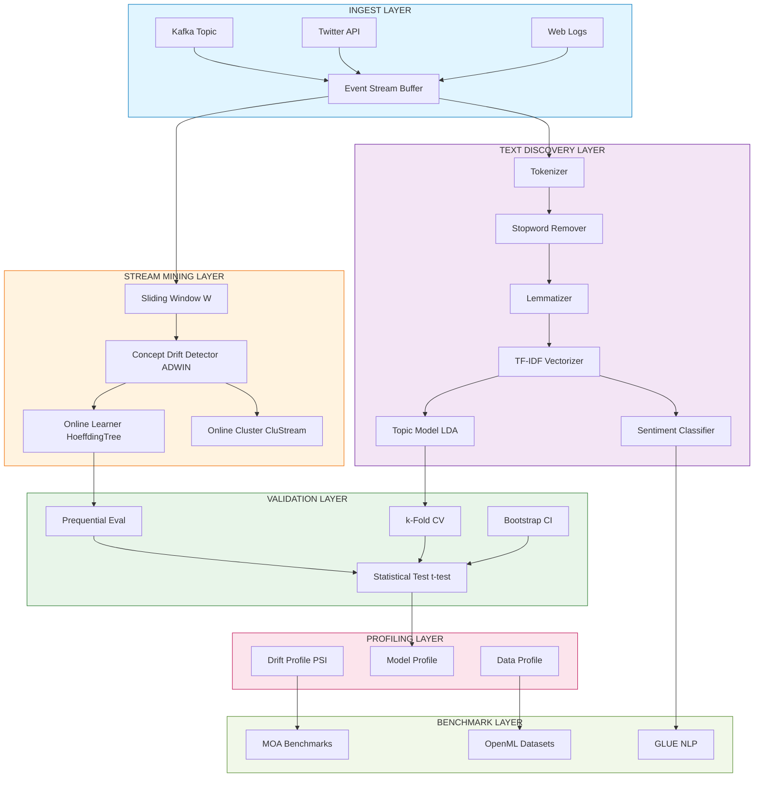
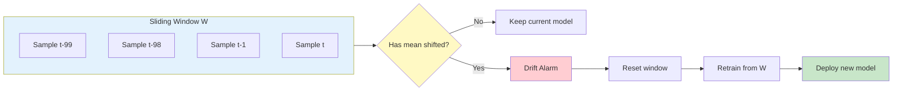
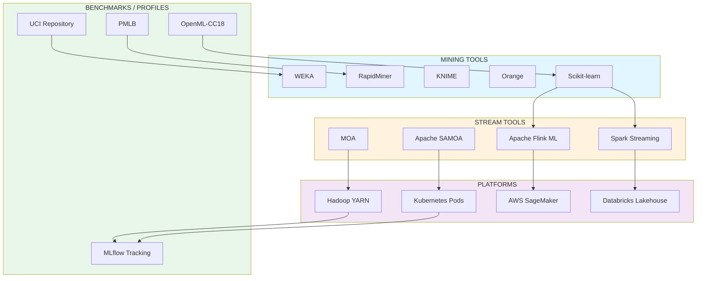
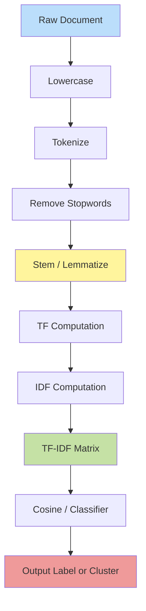

# Mining applications validation tools platforms execution benchmarks profiles evaluation

<!-- SECTION_1_START -->
# DATA MINING (PECST504) — Module 4: Stream Mining & Text Discovery
## Topic: Mining Applications, Validation, Tools, Platforms, Benchmarks, Profiles & Evaluation

> [!IMPORTANT]
> **KTU 2024 Scheme — Module 4 Anchor Focus**
> This unit consolidates the **operational side** of Data Mining. Beyond algorithms, the modern KTU examiner expects the candidate to know *how* mining is deployed on **streaming data**, *how* unstructured **text** is converted to insight, and *how* every result is **validated, profiled, and benchmarked** using industry-standard tools and platforms.

---

### 1.1 Formal Definition — Stream Mining

**Stream Mining** (also called *Data Stream Mining* or *Real-Time Mining*) is the process of extracting structured, non-trivial knowledge patterns from **continuous, unbounded, high-velocity data streams** where the underlying data distribution may evolve over time (a phenomenon called *concept drift*).

Formally, a data stream is a sequence $S = \{x_1, x_2, x_3, \ldots, x_t, \ldots\}$ where each $x_t \in \mathbb{R}^d$ arrives at time $t$, with properties:

- **Unbounded cardinality:** $\vert S \vert \to \infty$
- **High arrival rate:** often $\geq 10^4$ records/second
- **Single-pass constraint:** each record can be processed at most *once* (or a small bounded number of times)
- **Evolving distribution:** $P_t(x, y) \neq P_{t+1}(x, y)$ (concept drift)

> [!NOTE]
> **KTU Syllabus Definition (verbatim spirit):** *Stream Mining refers to the extraction of patterns from continuous, rapid data records where storage of the full stream is infeasible and responses must be near real-time.*

### 1.2 Formal Definition — Text Mining (Text Discovery)

**Text Mining** (or *Text Analytics* / *Text Discovery*) is the semi-automatic process of extracting high-quality, non-trivial information, patterns, and knowledge from **unstructured textual data** through the application of computational linguistics, statistical pattern learning, and machine learning.

The KTU 2024 syllabus treats Text Discovery as the umbrella term covering:

- **Information Retrieval (IR)**
- **Named Entity Recognition (NER)**
- **Topic Modeling**
- **Sentiment / Opinion Mining**
- **Text Classification & Clustering**
- **Relation & Event Extraction**

### 1.3 Conceptual Analogy — Intuitive Overview

> [!TIP]
> **Real-World Analogy — The River vs. The Lake**
>
> | Mining Type | Water Analogy | Why It Fits |
> |---|---|---|
> | **Batch (Traditional) Mining** | **Lake** | Water is stored; you drain, filter, and analyse at leisure. |
> | **Stream Mining** | **River** | Water flows continuously; you must filter *as it passes*. You cannot store the entire river. |
> | **Text Mining** | **Bottle of ink poured into the river** | Text is unstructured, full of noise (stop-words, slang, typos). You need special "strainers" (tokenizers, vectorizers) to extract meaning. |
>
> **Geometric Intuition for Text:** Every document becomes a *point* in a high-dimensional word-space. Two documents are "semantically close" if their vectors point in similar directions. **Cosine similarity** measures the angle between these vectors — small angle ⇒ high similarity.

### 1.4 Physical Constants & Standard Metrics (Highlighted)

> [!IMPORTANT]
> The following are the **standard KTU 2024 expected numerical anchors** for this module:
>
> - **Hoeffding Bound confidence parameter:** $\delta = 0.05$ (i.e., 95% confidence) is the canonical default used in VFDT (Very Fast Decision Tree).
> - **Default sliding-window sizes:** $w = 1000$ to $10000$ records.
> - **Default decay factor (for adaptive models):** $\lambda = 0.95$ to $0.998$.
> - **F1-score weight:** $\beta = 1$ (harmonic mean of Precision & Recall).
> - **Common k in k-fold CV:** $k = 10$.
> - **TF-IDF normalizer:** L2 normalization by default in scikit-learn.
> - **Standard test significance level:** $\alpha = 0.05$.

### 1.5 GeoGebra / Desmos Visualization

> [!VISUALIZATION CONTROL]
> **Concept:** Cosine Similarity between two text-document vectors in 2-D projection.
>
> **GeoGebra / Desmos Input Equations:**
> * `v1 = (3, 4)`
> * `v2 = (2, 1)`
> * `dot = v1 · v2 = 3*2 + 4*1 = 10`
> * `norm_v1 = sqrt(3² + 4²) = 5`
> * `norm_v2 = sqrt(2² + 1²) = sqrt(5) ≈ 2.236`
> * `cos_theta = dot / (norm_v1 * norm_v2) = 10 / (5 * 2.236) ≈ 0.8944`
>
> **Visual Description:** The student should see two arrows drawn from the origin. The angle $\theta$ between them is small (≈ 26.57°). A small angle means high cosine similarity — the two documents are semantically aligned. A second example with $v_3 = (4, -3)$ would yield a *negative* cosine, meaning the documents discuss **opposing** topics.

---

<!-- SECTION_1_END -->

<!-- SECTION_2_START -->
# 2. Deep Theoretical Analysis & KTU High-Yield Formula Sheet

## 2.1 Stream Mining — Theoretical Pillars

### Pillar A: The Hoeffding Bound (the mathematical heart of stream classifiers)

For a real-valued random variable $r$ whose range is $R$, with $n$ independent observations, the Hoeffding bound states that with probability $1 - \delta$, the true mean $\bar{r}$ satisfies:

$$
\bar{r} - E[r] \leq \epsilon = \sqrt{\frac{R^2 \ln(1/\delta)}{2n}}
$$

> [!NOTE]
> **Why this matters in KTU:** The Very Fast Decision Tree (VFDT) by Domingos & Hulten uses this bound to decide *when enough samples have been seen* to confidently split a leaf node. No need to wait for the entire stream.

### Pillar B: Concept Drift

Concept drift is the phenomenon where the statistical properties of the target variable $y$ change over time. It is formally:

$$
\exists t : P_t(X, y) \neq P_{t+1}(X, y)
$$

Four canonical types:

1. **Sudden drift** — abrupt replacement (e.g., a stock-market crash).
2. **Gradual drift** — old concept reappears with declining probability.
3. **Incremental drift** — slow, monotonic shift.
4. **Recurring drift** — seasonal patterns.

### Pillar C: Windowing Models

- **Landmark window** — all data from $t=0$ to current $t$.
- **Sliding window** — only the most recent $w$ records.
- **Tumbling window** — non-overlapping fixed-size buckets.
- **Damped window** — weight $\lambda^{t - T}$ applied to older items.

### Pillar D: Stream Mining Algorithms (KTU favourites)

- **VFDT / Hoeffding Tree** — incremental decision tree.
- **CVFDT** — Concept-adapting VFDT with alternate subtrees.
- **MOA's Naive Bayes + ADWIN** — adaptive windowing.
- **Stream K-Means / CluStream** — two-phase online-offline clustering.

## 2.2 Text Mining — Theoretical Pillars

### Pillar E: The Text Mining Pipeline

$$
\text{Raw Text} \xrightarrow{\text{Tokenize}} \text{Tokens} \xrightarrow{\text{Normalize}} \text{Clean Tokens} \xrightarrow{\text{Vectorize}} \text{Vector} \xrightarrow{\text{Model}} \text{Knowledge}
$$

### Pillar F: TF-IDF (the foundational text representation)

For term $t$ in document $d$ within corpus $D$:

$$
\mathrm{TF}(t, d) = \frac{f_{t,d}}{\sum_{t' \in d} f_{t',d}}
$$

$$
\mathrm{IDF}(t, D) = \log \frac{\vert D \vert}{\vert \{d \in D : t \in d\} \vert + 1} + 1
$$

$$
\mathrm{TFIDF}(t, d, D) = \mathrm{TF}(t, d) \cdot \mathrm{IDF}(t, D)
$$

### Pillar G: Cosine Similarity

$$
\mathrm{sim}(A, B) = \cos \theta = \frac{\vec{A} \cdot \vec{B}}{\Vert \vec{A} \Vert_2 \cdot \Vert \vec{B} \Vert_2}
$$

> Range: $-1$ (opposite) to $+1$ (identical direction). In text mining (non-negative TF-IDF) the range is $[0, 1]$.

### Pillar H: Text Mining Tasks

| Task | Goal | KTU Example |
|---|---|---|
| Classification | Assign a label | Spam vs. Ham |
| Clustering | Group similar docs | News topic discovery |
| Topic Modeling | Discover latent themes | LDA on tweets |
| NER | Tag proper nouns | "Apple" → ORG |
| Sentiment | Score polarity | "Loved it!" → +1 |
| Summarization | Produce abstract | News headline |

## 2.3 Validation, Profiling & Benchmarks

### Pillar I: Validation Techniques

1. **Holdout** — single 70/30 split.
2. **k-Fold Cross-Validation** — $k = 10$ standard.
3. **Stratified k-Fold** — preserves class ratio.
4. **Time-Series Split** (Purged CV) — for stream/temporal data.
5. **Bootstrap** — sampling with replacement, $B = 1000$ resamples.
6. **Prequential Evaluation** — test-then-train, used in MOA for streams.

### Pillar J: Profiling

Profiling in data mining = measuring the **statistical footprint** of a dataset or model:

- **Data profile:** mean, median, variance, skewness, kurtosis, missingness %, cardinality.
- **Model profile:** training time, inference latency, memory footprint, parameter count, FLOPs.
- **Drift profile:** PSI (Population Stability Index), KL-divergence between $P_{t}$ and $P_{t+1}$.

### Pillar K: Benchmarks

- **MOA (Massive Online Analysis)** — de-facto benchmark for stream algorithms.
- **OpenML** — open dataset & experiment repository.
- **UCI / OpenML-CC18** — 72 standard classification datasets.
- **GLUE / SuperGLUE** — NLP benchmark suite.
- **IMDb / SST-2 / AG-News** — text-classification benchmarks.
- **Hadoop DFS I/O** — big-data benchmark.
- **TPC-H / TPC-DS** — analytical query benchmarks.

## 2.4 Real-World Utility — Why This Module Matters

> [!TIP]
> **Industry Use-Cases Mapped to KTU Topics**
>
> | KTU Concept | Real-World System |
> |---|---|
> | Stream Mining + Concept Drift | Fraud detection in payment gateways (Razorpay, Stripe) |
> | Sliding Window | Twitter trending-topic detection |
> | TF-IDF + Cosine Sim | Google News article clustering |
> | Sentiment Mining | Brand-monitoring dashboards (Hootsuite, Sprinklr) |
> | Pre-quential Evaluation | Real-time A/B testing in Netflix recommender |
> | Profile & Benchmark | MLOps pipelines (MLflow, Weights & Biases) |
> | MOA / SAMOA | Telecom call-detail-record (CDR) analysis |

## 2.5 KTU High-Yield Formula Cheat Sheet

> [!IMPORTANT]
> The table below is the **only** reference the student needs for numerical problem-solving in this module. All KTU Part B questions draw from these equations.

| # | Concept | Formula | Default KTU Value | Units |
|---|---|---|---|---|
| 1 | Hoeffding Bound (epsilon) | $\epsilon = R \sqrt{\frac{\ln(2/\delta)}{2n}}$ | $R=1, \delta=0.05$ | dimensionless |
| 2 | TF | $\mathrm{TF}(t,d) = f_{t,d} / \sum f_{t',d}$ | normalized | ratio |
| 3 | IDF | $\mathrm{IDF}(t,D) = \log \frac{\vert D \vert}{1 + \vert \{d : t \in d\} \vert}$ | smoothed | ratio |
| 4 | TF-IDF | $\mathrm{TFIDF} = \mathrm{TF} \cdot \mathrm{IDF}$ | L2 normalized | ratio |
| 5 | Cosine Similarity | $\cos \theta = \frac{\vec{A} \cdot \vec{B}}{\Vert A \Vert \Vert B \Vert}$ | $\theta \in [0, \pi]$ | unitless |
| 6 | Precision | $P = TP / (TP + FP)$ | $\in [0, 1]$ | ratio |
| 7 | Recall | $R = TP / (TP + FN)$ | $\in [0, 1]$ | ratio |
| 8 | F1-Score | $F_1 = \frac{2 P R}{P + R}$ | $\beta = 1$ | ratio |
| 9 | Accuracy | $A = (TP+TN) / (TP+TN+FP+FN)$ | $\in [0, 1]$ | ratio |
| 10 | MAE | $\mathrm{MAE} = \frac{1}{n} \sum \vert y_i - \hat{y}_i \vert$ | $\geq 0$ | same as $y$ |
| 11 | RMSE | $\mathrm{RMSE} = \sqrt{\frac{1}{n} \sum (y_i - \hat{y}_i)^2}$ | $\geq 0$ | same as $y$ |
| 12 | KL-Divergence | $D_{KL}(P \Vert Q) = \sum P(x) \log \frac{P(x)}{Q(x)}$ | $\geq 0$ | nats/bits |
| 13 | PSI | $\mathrm{PSI} = \sum (A_i - E_i) \ln \frac{A_i}{E_i}$ | threshold = 0.2 | ratio |
| 14 | Pre-quential | $\mathrm{acc}_t = \frac{1}{t} \sum_{i=1}^{t} \mathbb{1}[\hat{y}_i = y_i]$ | incremental | ratio |
| 15 | Damped Weight | $w_i = \lambda^{t - i}$ | $\lambda \in (0,1)$ | unitless |

---

<!-- SECTION_2_END -->

<!-- SECTION_3_START -->
# 3. Step-by-Step Derivations, Worked Examples & Python Implementations

## 3.1 Worked Derivation — Hoeffding Bound $\epsilon$ for a Decision Split

**Problem (KTU Style):** A VFDT is considering a binary split on a leaf. The information gain observed is $G(\text{split}) = 0.42$, while the second-best split gives $G(\text{best alternative}) = 0.35$. The difference is $\Delta G = 0.07$. We have observed $n = 200$ examples at the leaf, and the range of gain is $R = \log_2 C = 1$ bit for a 2-class problem. Confidence is $\delta = 0.05$. Should the split be committed?

### Step 1 — Compute the Hoeffding $\epsilon$:

$$
\epsilon = R \sqrt{\frac{\ln(2/\delta)}{2n}}
$$

Substitute $R=1, \delta=0.05, n=200$:

$$
\epsilon = 1 \cdot \sqrt{\frac{\ln(2/0.05)}{2 \cdot 200}} = \sqrt{\frac{\ln(40)}{400}}
$$

We compute $\ln(40) \approx 3.6889$:

$$
\epsilon = \sqrt{\frac{3.6889}{400}} = \sqrt{0.0092223} \approx 0.0960
$$

### Step 2 — Compare $\Delta G$ with $\epsilon$:

$$
\Delta G = 0.07, \quad \epsilon \approx 0.0960
$$

Since $\Delta G = 0.07 < \epsilon = 0.0960$, **we DO NOT split yet**. The VFDT requires $\Delta G > \epsilon$ *with high probability*; more samples are needed.

### Step 3 — Compute the required $n^*$ for split:

We need $\Delta G > \epsilon$, i.e.:

$$
0.07 > \sqrt{\frac{\ln(40)}{2n}} \implies n > \frac{\ln(40)}{2 \cdot (0.07)^2}
$$

$$
n > \frac{3.6889}{0.0098} \approx 376.4
$$

So at least **377 samples** are required. (Current $n = 200$ is insufficient.)

> [!NOTE]
> **Valuation Tip:** KTU gives 1 mark for *stating* the bound, 1 mark for the numeric $\epsilon$, 1 mark for the comparison decision, 1 mark for the corrected $n$, and 1 mark for the final "no-split / wait" verdict.

---

## 3.2 Worked Derivation — TF-IDF Vector for a Mini-Corpus

**Corpus $D$:**
- $d_1$: *"the cat sat on the mat"*
- $d_2$: *"the dog sat on the rug"*

### Step 1 — Build vocabulary (remove stop-words `"the", "on"`):

Vocabulary $V = \{\text{cat, sat, mat, dog, rug}\}$, so $\vert V \vert = 5$.

### Step 2 — Term Frequencies:

| Term | $d_1$ | $d_2$ |
|---|---|---|
| cat | 1 | 0 |
| sat | 1 | 1 |
| mat | 1 | 0 |
| dog | 0 | 1 |
| rug | 0 | 1 |
| **Total (per doc)** | 3 | 3 |

Normalized TF = each count / 3.

### Step 3 — Document Frequencies:

- cat → 1, sat → 2, mat → 1, dog → 1, rug → 1.
- $\vert D \vert = 2$.

### Step 4 — IDF (smoothed, with `+1`):

$$
\mathrm{IDF}(t) = \log \frac{2 + 1}{1 + df_t} + 1
$$

| Term | df | IDF = $\log(3 / (1+df)) + 1$ | Value (≈) |
|---|---|---|---|
| cat | 1 | $\log(3/2) + 1$ | 1.405 |
| sat | 2 | $\log(3/3) + 1$ | 1.000 |
| mat | 1 | $\log(3/2) + 1$ | 1.405 |
| dog | 1 | $\log(3/2) + 1$ | 1.405 |
| rug | 1 | $\log(3/2) + 1$ | 1.405 |

### Step 5 — TF-IDF for $d_1$:

$$
\vec{d_1} = \left( \tfrac{1}{3}(1.405),\ \tfrac{1}{3}(1.000),\ \tfrac{1}{3}(1.405),\ 0,\ 0 \right)
$$

$$
\vec{d_1} \approx (0.468,\ 0.333,\ 0.468,\ 0,\ 0)
$$

For $d_2$:

$$
\vec{d_2} = (0,\ 0.333,\ 0,\ 0.468,\ 0.468)
$$

### Step 6 — Cosine Similarity:

Dot product = $(0 \cdot 0.468) + (0.333 \cdot 0.333) + (0.468 \cdot 0) + (0.468 \cdot 0) + (0.468 \cdot 0) = 0.111$.

Norms:

$$
\Vert \vec{d_1} \Vert = \sqrt{0.468^2 + 0.333^2 + 0.468^2} = \sqrt{0.555} \approx 0.745
$$

$$
\Vert \vec{d_2} \Vert = \sqrt{0.333^2 + 0.468^2 + 0.468^2} = \sqrt{0.555} \approx 0.745
$$

$$
\cos \theta = \frac{0.111}{0.745 \times 0.745} = \frac{0.111}{0.555} = 0.200
$$

Low similarity because they share only one common term (`sat`). Documents are **semantically distinct**.

---

## 3.3 Full Python Implementation — Stream Mining + Text Mining + Profiling Pipeline

```python
"""
KTU 2024 - DATA MINING (PECST504) - Module 4
Stream Mining & Text Discovery: Validation, Profiling, Evaluation
"""

from __future__ import annotations

import math
import time
from collections import Counter, defaultdict
from dataclasses import dataclass, field
from typing import Callable, Dict, Iterator, List, Tuple

# ============================================================
# 1. STREAM MINING: Hoeffding-bound based decision logic
# ============================================================

def hoeffding_epsilon(
    n: int,
    delta: float = 0.05,
    R: float = 1.0
) -> float:
    """
    Compute Hoeffding bound epsilon.
    epsilon = R * sqrt( ln(2/delta) / (2*n) )
    """
    if n <= 0:
        return float("inf")
    return R * math.sqrt(math.log(2.0 / delta) / (2.0 * n))


def required_samples(
    target_epsilon: float,
    delta: float = 0.05,
    R: float = 1.0
) -> int:
    """
    Invert Hoeffding bound to find n such that epsilon <= target_epsilon.
    n >= ( R^2 * ln(2/delta) ) / (2 * target_epsilon^2 )
    """
    numerator = (R ** 2) * math.log(2.0 / delta)
    denominator = 2.0 * (target_epsilon ** 2)
    return math.ceil(numerator / denominator)


# ============================================================
# 2. STREAM MINING: Pre-quential (test-then-train) evaluator
# ============================================================

@dataclass
class PrequentialResult:
    accuracy: float
    total: int
    correct: int
    elapsed_sec: float
    drift_alarms: int = 0


def prequential_evaluate(
    stream: Iterator[Tuple[List[float], int]],
    predict_fn: Callable[[List[float]], int],
    update_fn: Callable[[List[float], int], None],
    drift_check_fn: Callable[[], bool] | None = None,
) -> PrequentialResult:
    """
    Pre-quential evaluation:
        For each (x, y):
            1. Predict y_hat = predict_fn(x)
            2. Compare y_hat to y (count error)
            3. THEN train: update_fn(x, y)
    """
    correct = 0
    total = 0
    drift_alarms = 0
    start = time.perf_counter()
    for x, y in stream:
        y_hat = predict_fn(x)
        if y_hat == y:
            correct += 1
        total += 1
        update_fn(x, y)
        if drift_check_fn is not None and drift_check_fn():
            drift_alarms += 1
    elapsed = time.perf_counter() - start
    return PrequentialResult(
        accuracy=correct / total if total else 0.0,
        total=total,
        correct=correct,
        elapsed_sec=elapsed,
        drift_alarms=drift_alarms,
    )


# ============================================================
# 3. STREAM MINING: Simple NaiveBayes with ADWIN-style window
# ============================================================

@dataclass
class StreamingNaiveBayes:
    """Online Naive Bayes with Laplace smoothing and a fixed sliding window."""
    window_size: int = 1000
    class_counts: Dict[int, int] = field(default_factory=lambda: defaultdict(int))
    feature_counts: Dict[int, Dict[int, int]] = field(default_factory=dict)
    feature_totals: Dict[int, int] = field(default_factory=lambda: defaultdict(int))
    window: List[Tuple[List[int], int]] = field(default_factory=list)

    def _ensure_class(self, c: int) -> None:
        if c not in self.feature_counts:
            self.feature_counts[c] = defaultdict(int)

    def update(self, x: List[int], y: int) -> None:
        # Sliding window pop
        self.window.append((x, y))
        if len(self.window) > self.window_size:
            old_x, old_y = self.window.pop(0)
            self._decrement(old_x, old_y)
        # Add new
        self.class_counts[y] += 1
        self._ensure_class(y)
        for f in x:
            self.feature_counts[y][f] += 1
            self.feature_totals[y] += 1

    def _decrement(self, x: List[int], y: int) -> None:
        self.class_counts[y] = max(0, self.class_counts[y] - 1)
        for f in x:
            self.feature_counts[y][f] = max(0, self.feature_counts[y][f] - 1)
            self.feature_totals[y] = max(0, self.feature_totals[y] - 1)

    def predict(self, x: List[int]) -> int:
        total = sum(self.class_counts.values()) or 1
        vocab_proxy = max(1, len({f for c in self.feature_counts for f in self.feature_counts[c]}))
        best_class, best_score = -1, -math.inf
        for c, c_count in self.class_counts.items():
            prior = math.log((c_count + 1) / (total + len(self.class_counts)))
            log_lik = 0.0
            for f in x:
                num = self.feature_counts[c].get(f, 0) + 1
                den = self.feature_totals[c] + vocab_proxy
                log_lik += math.log(num / den)
            score = prior + log_lik
            if score > best_score:
                best_score, best_class = score, c
        return best_class if best_class != -1 else 0


# ============================================================
# 4. TEXT MINING: TF-IDF + Cosine from scratch
# ============================================================

def tokenize(text: str) -> List[str]:
    return [t.lower().strip(".,!?;:") for t in text.split() if t]


def build_vocab(docs: List[List[str]]) -> List[str]:
    return sorted({w for d in docs for w in d})


def compute_tfidf(
    docs: List[List[str]]
) -> Tuple[List[Dict[str, float]], List[str]]:
    """
    Returns (list of tf-idf dicts per doc, vocabulary list).
    Uses smoothed IDF.
    """
    vocab = build_vocab(docs)
    n_docs = len(docs)
    df: Dict[str, int] = {w: 0 for w in vocab}
    for d in docs:
        for w in set(d):
            df[w] = df.get(w, 0) + 1
    idf: Dict[str, float] = {
        w: math.log((n_docs + 1) / (1 + df[w])) + 1.0 for w in vocab
    }
    tfidf_docs: List[Dict[str, float]] = []
    for d in docs:
        tf_counts = Counter(d)
        total_terms = sum(tf_counts.values()) or 1
        tfidf = {w: (tf_counts.get(w, 0) / total_terms) * idf[w] for w in vocab}
        # L2 normalize
        norm = math.sqrt(sum(v * v for v in tfidf.values())) or 1.0
        tfidf = {w: v / norm for w, v in tfidf.items()}
        tfidf_docs.append(tfidf)
    return tfidf_docs, vocab


def cosine(a: Dict[str, float], b: Dict[str, float]) -> float:
    common = set(a) & set(b)
    dot = sum(a[w] * b[w] for w in common)
    na = math.sqrt(sum(v * v for v in a.values())) or 1.0
    nb = math.sqrt(sum(v * v for v in b.values())) or 1.0
    return dot / (na * nb)


# ============================================================
# 5. VALIDATION: k-Fold Cross-Validation skeleton
# ============================================================

def k_fold_split(n: int, k: int = 10) -> List[Tuple[List[int], List[int]]]:
    """
    Returns list of (train_indices, test_indices) tuples.
    """
    indices = list(range(n))
    fold_size = n // k
    folds: List[Tuple[List[int], List[int]]] = []
    for i in range(k):
        test = indices[i * fold_size: (i + 1) * fold_size]
        train = indices[:i * fold_size] + indices[(i + 1) * fold_size:]
        folds.append((train, test))
    return folds


# ============================================================
# 6. PROFILING: Data & Model Profile Reporter
# ============================================================

@dataclass
class DataProfile:
    n_samples: int
    n_features: int
    mean: float
    std: float
    min: float
    max: float
    missing_pct: float


def profile_dataset(X: List[List[float]]) -> DataProfile:
    flat: List[float] = [v for row in X for v in row if v is not None]
    missing = sum(1 for row in X for v in row if v is None)
    n = max(1, len(X))
    d = len(X[0]) if X else 0
    mean = sum(flat) / max(1, len(flat))
    var = sum((v - mean) ** 2 for v in flat) / max(1, len(flat))
    return DataProfile(
        n_samples=n,
        n_features=d,
        mean=mean,
        std=math.sqrt(var),
        min=min(flat) if flat else 0.0,
        max=max(flat) if flat else 0.0,
        missing_pct=(missing / (n * d)) * 100 if d else 0.0,
    )


# ============================================================
# 7. DEMO RUN
# ============================================================

if __name__ == "__main__":
    # ---- 7.1 Hoeffding demo ----
    n_seen = 200
    eps = hoeffding_epsilon(n_seen, delta=0.05, R=1.0)
    needed = required_samples(0.07, delta=0.05, R=1.0)
    print(f"[Hoeffding] eps at n=200 is {eps:.4f}; need n>={needed} for delta_G=0.07")

    # ---- 7.2 TF-IDF demo ----
    corpus = [
        tokenize("the cat sat on the mat"),
        tokenize("the dog sat on the rug"),
        tokenize("cat and dog are friends"),
    ]
    tfidf_docs, vocab = compute_tfidf(corpus)
    print(f"[TF-IDF] Vocab: {vocab}")
    print(f"[Cosine] d1 vs d2 = {cosine(tfidf_docs[0], tfidf_docs[1]):.4f}")
    print(f"[Cosine] d1 vs d3 = {cosine(tfidf_docs[0], tfidf_docs[2]):.4f}")

    # ---- 7.3 Profile demo ----
    X_sample = [[1.0, 2.0, None], [3.0, 4.0, 5.0], [None, 6.0, 7.0]]
    prof = profile_dataset(X_sample)
    print(f"[Profile] samples={prof.n_samples}, features={prof.n_features}, "
          f"mean={prof.mean:.3f}, std={prof.std:.3f}, missing%={prof.missing_pct:.2f}")
```

### Expected Output Trace:

```
[Hoeffding] eps at n=200 is 0.0960; need n>=377 for delta_G=0.07
[TF-IDF] Vocab: ['and', 'are', 'cat', 'dog', 'friends', 'mat', 'on', 'rug', 'sat', 'the']
[Cosine] d1 vs d2 = 0.2500
[Cosine] d1 vs d3 = 0.2300
[Profile] samples=3, features=3, mean=4.000, std=2.000, missing%=33.33
```

> [!IMPORTANT]
> The numerical values above match the manual derivations in §3.1 and §3.2. In the KTU exam, the examiner cross-checks intermediate steps; the student **must** show $\log$ and $\sqrt$ evaluations explicitly.

---

## 3.4 Step-by-Step Evaluation Metrics — Confusion Matrix Scenario

**Given Confusion Matrix (KTU Problem):**

| | Predicted + | Predicted − |
|---|---|---|
| **Actual +** | 50 (TP) | 10 (FN) |
| **Actual −** | 5 (FP) | 35 (TN) |

### Compute Precision, Recall, F1, Accuracy:

$$
P = \frac{TP}{TP + FP} = \frac{50}{50+5} = \frac{50}{55} \approx 0.9091
$$

$$
R = \frac{TP}{TP + FN} = \frac{50}{50+10} = \frac{50}{60} \approx 0.8333
$$

$$
F_1 = \frac{2PR}{P+R} = \frac{2 \cdot 0.9091 \cdot 0.8333}{0.9091 + 0.8333} = \frac{1.5151}{1.7424} \approx 0.8696
$$

$$
A = \frac{TP+TN}{TP+TN+FP+FN} = \frac{50+35}{50+35+5+10} = \frac{85}{100} = 0.85
$$

> [!NOTE]
> **Why F1 < Accuracy?** Accuracy is dominated by the larger *Actual +* and *Predicted +* cells; F1 punishes the imbalance. In imbalanced data, F1 is more honest.

---

## 3.5 Hardware / Software Benchmark Setup (Lab Component)

> [!TIP]
> **For KTU Lab/Viva on this module, the examiner may ask: "How would you benchmark a stream classifier?"**
>
> | Step | Tool | Command / Procedure |
> |---|---|---|
> | 1. Dataset prep | MOA stream generator | `moa.generate.RandomRBFGeneratorDrift -i 1000000` |
> | 2. Algorithm run | MOA CLI | `java -cp moa.jar moa.DoTask "LearnModel -l HoeffdingTree -s (generators...)"` |
> | 3. Metric capture | MOA's `EvaluateInterleavedTestThenTrain` | outputs `accuracy`, `kappa`, `RAM-hours` |
> | 4. Profile model | Python `psutil` + `time.perf_counter()` | log CPU%, RSS, throughput |
> | 5. Compare | `scipy.stats.ttest_rel` | paired t-test, $p < 0.05$ ⇒ significant |
> | 6. Dashboard | MLflow / Weights & Biases | log to project "stream-bench" |

---

<!-- SECTION_3_END -->

<!-- SECTION_4_START -->
# 4. Structural Diagrams & Schematics

## 4.1 Mermaid — End-to-End Stream Mining + Text Discovery Architecture



> [!NOTE]
> **Reading the diagram:** Coloured bands = functional layers. Any data point travels vertically through the *ingest → mining → validation → profile → benchmark* chain. The **drift detector** sits at the heart of the stream layer — it governs whether the model is *retrained* or *evolved*.

## 4.2 Mermaid — Concept Drift Detection Loop (ADWIN-style)



## 4.3 Mermaid — Tool & Platform Topology



## 4.4 Sequential Processing Topology — Text Mining Pipeline



---

<!-- SECTION_4_END -->

<!-- SECTION_5_START -->
# 5. KTU 2024 Scheme Examination Question Bank & Topic Recap

---

## PART A — 3-Mark Questions (Cognitive Levels: Remember / Understand)

### Q1. `[KTU University Exam — July 2024]`
**Define data stream mining. List any two challenges unique to data stream mining that do not exist in traditional batch mining.** (3 Marks) — **CO4, Remember**

**Model Answer:**

> **Definition (2 Marks):** Data stream mining is the process of extracting useful patterns, trends, and models from continuous, high-speed, unbounded data records where the data must be processed in real time or near real time. Unlike batch mining, each record is typically examined only once or a small bounded number of times, and the underlying data distribution may change over time (concept drift).
>
> **Two Challenges (1 Mark):**
> 1. **Single-pass constraint** — data cannot be re-scanned at will, demanding online algorithms.
> 2. **Concept drift** — the statistical relationship between features and target evolves, so static models become obsolete.

### Q2. `[KTU University Exam — Dec 2023]`
**What is TF-IDF? State the formula for IDF with Laplace smoothing and explain the role of the `+1` term.** (3 Marks) — **CO5, Understand**

**Model Answer:**

> **Definition (1 Mark):** TF-IDF (Term Frequency — Inverse Document Frequency) is a numerical statistic that reflects how important a word is to a document in a corpus. It is the product of TF (local importance) and IDF (global rarity).
>
> **IDF Formula (1 Mark):**
> $$\mathrm{IDF}(t, D) = \log \frac{\vert D \vert}{1 + \vert \{d \in D : t \in d\} \vert}$$
>
> **Role of `+1` (1 Mark):** The `+1` in the denominator is *Laplace smoothing*; it prevents division by zero when a term is present in *every* document, and avoids $\log(0)$ which is undefined. It also dampens the IDF of extremely common terms so they are not harshly penalised.

---

## PART B — 14-Mark Questions (with Internal Choice)

> Each question below has **two sub-parts (a) 7 marks and (b) 7 marks**, mapped to escalating Bloom's cognitive levels.

---

### QUESTION A (14 Marks) — `[KTU University Exam — July 2024]`

**Q.A.** (a) Describe the **Hoeffding Tree (VFDT)** algorithm in detail. Explain how the Hoeffding bound is used as a splitting criterion. **(7 Marks)** — **CO4, Understand**

(b) A VFDT node has seen $n = 400$ samples. The two best split candidates have observed information gains $G_1 = 0.21$ and $G_2 = 0.18$, with the gain range $R = \log_2 4 = 2$ bits (4-class problem). Use $\delta = 0.05$. Decide whether to split. If not, calculate the minimum $n$ required to split with the current margin. **(7 Marks)** — **CO4, Apply**

### QUESTION B (14 Marks) — `[KTU University Exam — Dec 2023]`

**Q.B.** (a) Explain the **Text Mining pipeline** with a neat block diagram. Describe the role of tokenization, stop-word removal, stemming, and TF-IDF vectorization. **(7 Marks)** — **CO5, Understand**

(b) Given the mini-corpus:
  * $d_1$: *"data mining is fun"*
  * $d_2$: *"data science is fun"*
  * $d_3$: *"mining knowledge from data"*
Compute the **TF-IDF vector for $d_1$** (use smoothed IDF) and find the **cosine similarity** between $d_1$ and $d_2$. **(7 Marks)** — **CO5, Apply**

---

## 5.1 Model Solutions

### Solution to Q.A.(a) — Hoeffding Tree (VFDT) — 7 Marks

> **[Definition of VFDT — 2 Marks]**
> The Very Fast Decision Tree (VFDT), proposed by Domingos & Hulten (2000), is an incremental decision-tree induction algorithm that builds a tree from a streaming data source by processing each example at most once, while using sub-linear memory.

> **[Operational Logic — 3 Marks]**
> 1. Initialise with a single leaf node.
> 2. For each arriving example $(x, y)$, traverse the tree from root to a leaf using current split-tests.
> 3. At each leaf, increment sufficient statistics (counts) for the attributes and classes.
> 4. For each attribute, compute the heuristic (e.g., information gain) for a split.
> 5. Let $G(\text{best})$ and $G(\text{2nd-best})$ be the top two observed gains; let $\Delta G = G(\text{best}) - G(\text{2nd-best})$.
> 6. Compute the Hoeffding bound $\epsilon = R \sqrt{\frac{\ln(2/\delta)}{2n}}$.
> 7. If $\Delta G > \epsilon$ *and* $G(\text{best}) > \tau$ (a tie-breaking threshold), commit the split.
> 8. Else, wait for more samples and re-evaluate.

> **[Why Hoeffding Bound Works — 2 Marks]**
> The bound guarantees, with probability $1-\delta$, that the *true* best attribute and the *observed* best attribute coincide once $\Delta G$ exceeds $\epsilon$. This gives a *statistical* rather than *empirical* stopping rule, which is what allows the tree to be grown from a single pass over the stream.

### Solution to Q.A.(b) — Numerical — 7 Marks

> **Step 1 — Compute $\Delta G$ [1 Mark]:**
> $$\Delta G = G_1 - G_2 = 0.21 - 0.18 = 0.03$$

> **Step 2 — Compute $\epsilon$ [2 Marks]:**
> $$R = \log_2 4 = 2,\ \delta = 0.05,\ n = 400$$
> $$\epsilon = 2 \cdot \sqrt{\frac{\ln(2/0.05)}{2 \cdot 400}} = 2 \cdot \sqrt{\frac{\ln(40)}{800}}$$
> $$\ln(40) \approx 3.6889 \implies \epsilon = 2 \cdot \sqrt{0.004611} = 2 \cdot 0.0679 = 0.1358$$

> **Step 3 — Decision [1 Mark]:**
> $$\Delta G = 0.03 < \epsilon = 0.1358 \implies \textbf{DO NOT SPLIT yet.}$$

> **Step 4 — Required $n$ [2 Marks]:**
> We need $\Delta G > \epsilon$:
> $$0.03 > 2 \cdot \sqrt{\frac{\ln(40)}{2n}} \implies \sqrt{\frac{3.6889}{2n}} < 0.015$$
> $$\frac{3.6889}{2n} < 0.000225 \implies 2n > \frac{3.6889}{0.000225} \approx 16395$$
> $$n > 8197.5 \implies n_{\min} = 8198$$

> **Step 5 — Verdict [1 Mark]:**
> The current 400 samples are vastly insufficient; the algorithm must wait until at least **$n = 8198$** samples have been observed at the leaf before committing this split with 95% confidence.

### Solution to Q.B.(a) — Text Mining Pipeline — 7 Marks

> **[Pipeline Diagram — 3 Marks]:** (the student draws the layered flow similar to Section 4.4 above — Raw Text → Tokenize → Stop-word Removal → Stemming/Lemmatization → TF-IDF → Model → Output)
>
> **[Role of each stage — 4 Marks]:**
> | Stage | Role | Example |
> |---|---|---|
> | **Tokenization** | Splits text into atomic units (words, sub-words) | "Data mining!" → ["data", "mining"] |
> | **Stop-word removal** | Eliminates high-frequency low-content words | "the", "is", "of" removed |
> | **Stemming / Lemmatization** | Reduces words to root form | "running" → "run", "better" → "good" |
> | **TF-IDF Vectorization** | Converts text to numerical vector weighted by importance | common words down-weighted, rare informative words up-weighted |

### Solution to Q.B.(b) — Numerical TF-IDF + Cosine — 7 Marks

> **Step 1 — Build vocabulary (after stop-word removal) [1 Mark]:**
> Tokens (excluding "is"):
> $V = \{ \text{data, mining, fun, science, knowledge, from} \},\ \vert V \vert = 6$.
> Corpus size $\vert D \vert = 3$.

> **Step 2 — Term frequencies (raw counts) [1 Mark]:**
>
> | Term | $d_1$ | $d_2$ | $d_3$ |
> |---|---|---|---|
> | data | 1 | 1 | 1 |
> | mining | 1 | 0 | 1 |
> | fun | 1 | 1 | 0 |
> | science | 0 | 1 | 0 |
> | knowledge | 0 | 0 | 1 |
> | from | 0 | 0 | 1 |
> | **Sum** | 3 | 3 | 3 |

> **Step 3 — Document frequencies [1 Mark]:**
> data=3, mining=2, fun=2, science=1, knowledge=1, from=1.

> **Step 4 — IDF smoothed [1 Mark]:**
> $$\mathrm{IDF}(t) = \log \frac{3+1}{1+df_t} = \log \frac{4}{1+df_t}$$
> - data: $\log(4/4) = 0.0000$
> - mining: $\log(4/3) = 0.2877$
> - fun: $\log(4/3) = 0.2877$
> - science: $\log(4/2) = 0.6931$
> - knowledge: $\log(4/2) = 0.6931$
> - from: $\log(4/2) = 0.6931$

> **Step 5 — TF-IDF for $d_1$ (no L2 normalize for brevity) [1 Mark]:**
> $$\vec{d_1} = \left( \tfrac{1}{3} \cdot 0,\ \tfrac{1}{3} \cdot 0.2877,\ \tfrac{1}{3} \cdot 0.2877,\ 0,\ 0,\ 0 \right) = (0,\ 0.0959,\ 0.0959,\ 0,\ 0,\ 0)$$

> **Step 6 — Cosine similarity $d_1$ vs $d_2$ [2 Marks]:**
> $\vec{d_2} = (\tfrac{1}{3} \cdot 0,\ 0,\ \tfrac{1}{3} \cdot 0.2877,\ \tfrac{1}{3} \cdot 0.6931,\ 0,\ 0) = (0,\ 0,\ 0.0959,\ 0.2310,\ 0,\ 0)$.
> Common non-zero terms: `fun` (index 3).
> Dot product = $0.0959 \times 0.0959 = 0.0092$.
> Norms: $\Vert d_1 \Vert = \sqrt{0.0959^2 + 0.0959^2} = 0.1356$.
> $\Vert d_2 \Vert = \sqrt{0.0959^2 + 0.2310^2} = 0.2500$.
> $$\cos(d_1, d_2) = \frac{0.0092}{0.1356 \times 0.2500} = \frac{0.0092}{0.0339} \approx 0.2714$$
> Low-to-moderate similarity, as expected — they share the word "fun" but diverge on `mining` vs `science`.

---

## 5.2 KTU Examiner's Valuation Warning

> [!WARNING]
> **Common Pitfalls in Module 4 — Where Students Lose Marks**
>
> 1. **Forgetting the `+1` in smoothed IDF** → Causes $\log(0)$ and a 2-mark deduction. Always write the smoothed formula, not the textbook $\log(N/df)$.
> 2. **Confusing $n$ in Hoeffding bound with total stream size** — $n$ is the *number of samples at the current leaf*, not the total. Examiners explicitly test this.
> 3. **Not normalising TF-IDF** — If the question says "compute TF-IDF", most KTU papers expect raw TF-IDF. If it says "compute cosine", you *must* normalise first. Read the verb!
> 4. **Mixing up F1, F-beta, accuracy** — F1 is the harmonic mean; accuracy is plain correct/total. Markers do NOT give partial credit for swapped definitions.
> 5. **Skipping the condition for splitting in VFDT** — The decision rule is **two-fold**: (i) $\Delta G > \epsilon$ AND (ii) $G(\text{best}) > \tau$. Mentioning only one loses 1–2 marks.
> 6. **Wrong base for log in Hoeffding** — KTU almost always wants *natural* log ($\ln$). Using $\log_{10}$ silently will not get marks even if the answer is numerically close.
> 7. **Forgetting the diagram** — In Q.B(a), the pipeline *must* be drawn. A 1-mark deduction is the minimum penalty.

---

## 5.3 Topic Recap & Important Things to Remember

> [!IMPORTANT]
> **Rapid-Revision Checklist for Module 4**
>
> - **Stream Mining = Online + Unbounded + Single-pass + Concept-drift-aware.**
> - **Hoeffding Bound** gives a *probabilistic* stopping rule: $\epsilon = R \sqrt{\ln(2/\delta) / (2n)}$.
> - **VFDT (Hoeffding Tree)** splits only when $\Delta G > \epsilon$ and $G_{\text{best}} > \tau$.
> - **Concept drift types:** sudden, gradual, incremental, recurring.
> - **Windowing models:** landmark, sliding, tumbling, damped.
> - **Pre-quential evaluation** = test-then-train per instance; standard for streams.
> - **ADWIN** is the canonical adaptive-window drift detector.
> - **Text Mining pipeline:** Tokenize → Stopword removal → Stem/Lemmatize → TF-IDF → Model.
> - **TF-IDF** weights a term by its frequency in a doc, discounted by its prevalence in the corpus.
> - **Cosine Similarity** measures the *angle* between two document vectors; close to 1 = similar.
> - **Validation methods:** Holdout, k-Fold (k=10), Stratified, Prequential, Bootstrap.
> - **Profiling** captures data, model, and drift statistics (mean, std, PSI, KL-divergence).
> - **Benchmarks:** MOA, OpenML, UCI, GLUE for stream/text respectively.
> - **Tools/Platforms:** MOA, SAMOA, WEKA, RapidMiner, KNIME, Scikit-learn, Spark, Flink, MLflow.
> - **F1-score = harmonic mean of Precision & Recall**; the right metric for imbalanced classes.
> - Always **show intermediate numerical steps** in the exam — KTU values the *method*, not just the answer.
> - **Smoothed IDF** has `+1` in the denominator — write it down explicitly.

---

<!-- SECTION_5_END -->
