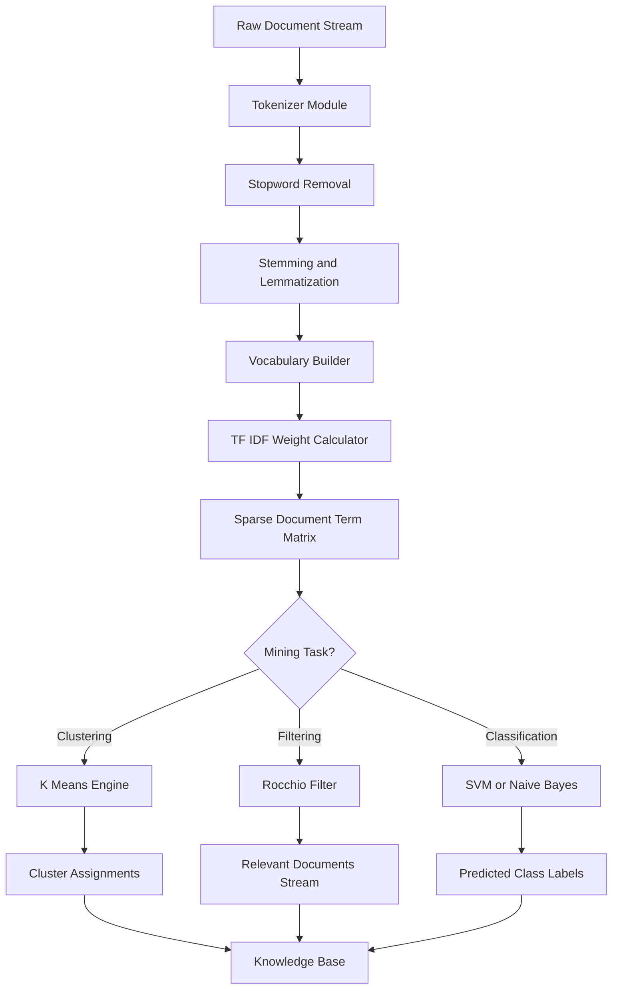
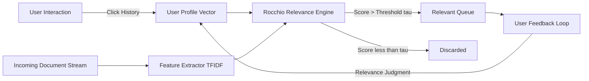
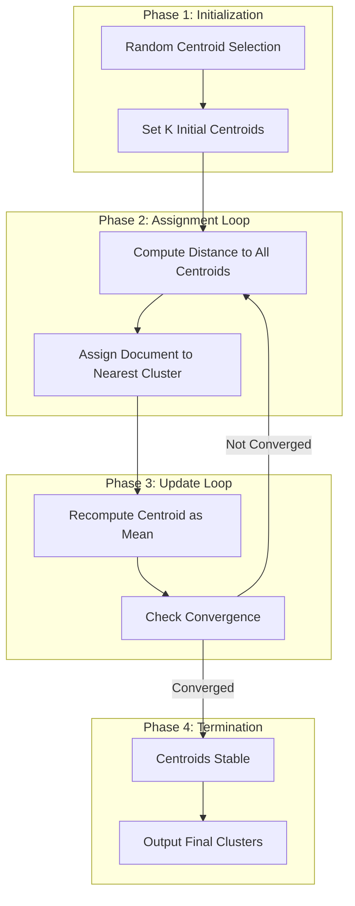

# Text document clustering information filtering keyword weight profiles architectures

<!-- SECTION_1_START -->

# Text Document Clustering, Information Filtering, Keyword Weight Profiles & Architectures

## 1. Core Technical Definition & Intuitive Overview

### 1.1 Text Document Clustering
**Text Document Clustering** is the unsupervised grouping of unstructured text documents into topical clusters, such that documents within a cluster exhibit high intra-cluster similarity and low inter-cluster similarity. Formally, given a corpus $D = \{d_1, d_2, \ldots, d_n\}$, clustering discovers a partition $C = \{C_1, C_2, \ldots, C_k\}$ that maximizes a similarity objective $J(C)$ over the vector space model (VSM) representation of $D$.

> [!NOTE]
> **KTU 2024 Syllabus Definition (PECST504 Module 4):** Clustering operates on the Bag-of-Words (BoW) or TF-IDF weighted feature space, employing algorithms such as K-Means, Hierarchical Agglomerative Clustering (HAC), and DBSCAN adapted for sparse document-term matrices.

> [!IMPORTANT]
> **Why clustering matters in production:** Search engines (Google News), digital libraries (ACM, IEEE Xplore), and e-commerce recommendation engines (Amazon) all rely on document clustering to organize millions of documents at scale without pre-existing labels.

**Intuitive Analogy — The Library Without a Catalog:**
Imagine walking into a massive library where books are scattered randomly on the floor. A librarian (the clustering algorithm) walks in, picks up each book, reads the title and topic, and starts grouping them into stacks: *"AI & Machine Learning,"* *"Database Systems,"* *"Computer Networks."* No prior labels exist — the librarian discovers structure purely by examining content. That is exactly what text clustering does to a stream of documents.

### 1.2 Information Filtering
**Information Filtering (IF)** is a supervised or semi-supervised process that selects relevant items from a dynamic stream based on a persistent user profile (long-term interest model). It is formally modeled as a binary classification function $f: D \times U \rightarrow \{\text{relevant}, \text{irrelevant}\}$, where $D$ is the document stream and $U$ is the user profile vector.

> [!NOTE]
> **Two Sub-Tasks of Information Filtering:**
> - **Content-Based Filtering (CBF):** Uses item features (keywords, TF-IDF) to match against a user profile.
> - **Collaborative Filtering (CF):** Uses user-item interaction matrix to recommend items liked by similar users.

**Intuitive Analogy — The Personal Newspaper Editor:**
A news website you visit daily shows you articles about AI, Blockchain, and Space. The filtering system has learned your keyword profile (high weights for *"neural network,"* *"deep learning,"* *"transformer"*). When a new article streams in, the filter checks: *"Does this match the user's interest vector?"* If yes → it appears on your dashboard; if no → it is discarded. The *New York Times* recommendation engine, Gmail's Priority Inbox, and YouTube's homepage all perform continuous information filtering.

### 1.3 Keyword Weight Profiles
A **Keyword Weight Profile** is a numerical vector representation $\vec{w}_d = (w_1, w_2, \ldots, w_m)$ assigned to each document $d$, where $w_i$ quantifies the discriminative importance of term $t_i$. The most canonical weight is **Term Frequency–Inverse Document Frequency (TF-IDF)**:

$$w_{i,d} = \text{tf}(t_i, d) \cdot \text{idf}(t_i)$$

where
- $\text{tf}(t_i, d)$ = number of occurrences of $t_i$ in document $d$
- $\text{idf}(t_i) = \log \frac{\vert D \vert}{\vert \{ d \in D : t_i \in d \} \vert + 1}$

> [!IMPORTANT]
> **Engineering Insight:** The `+1` in the denominator (Lapalace smoothing) prevents division-by-zero for terms absent from the training corpus. Always include it in production code.

### 1.4 Text Mining Architectures
A **Text Mining Architecture** is the modular pipeline that ingests raw text, transforms it into a structured representation, and applies mining algorithms. The standard KTU-aligned architecture is:

$$
\text{Raw Text} \rightarrow \text{Preprocessing} \rightarrow \text{Feature Extraction} \rightarrow \text{Weighting} \rightarrow \text{Mining Algorithm} \rightarrow \text{Knowledge}
$$

> [!VISUALIZATION CONTROL]
> **Concept:** 2D Vector Space Model (VSM) representation of documents
> **GeoGebra / Desmos Input Equations (conceptual):**
> * $d_1 = (3, 0)$, $d_2 = (1, 2)$, $d_3 = (0, 3)$, query $q = (2, 1)$
> * Plot the origin, four points, and the angle $\theta$ between $q$ and $d_1$
> **Visual Description:** The student should observe that documents sharing axis-coordinates (similar term weights) cluster in the same quadrant, and the cosine of the angle between vectors represents semantic similarity.

---

<!-- SECTION_1_END -->

<!-- SECTION_2_START -->

# 2. Deep Theoretical Analysis & KTU High-Yield Formula Sheet

## 2.1 The Vector Space Model (VSM) — Geometric Foundation

Salton et al. (1975) formalized the VSM as the algebraic substrate of modern information retrieval. Every document $d$ and query $q$ is encoded as an $m$-dimensional vector over a vocabulary of $m$ unique terms. The similarity between two documents is then computable as the **cosine of the angle** between their vectors.

### Step-by-Step Logic

1. **Tokenization:** Split raw text into a multiset of terms: $d = (t_1, t_2, \ldots, t_m)$.
2. **Stop-word Removal:** Eliminate function words (the, is, and) using a stop-list $S$.
3. **Stemming/Lemmatization:** Reduce inflected forms to a canonical root (e.g., *running* → *run*) via Porter Stemmer.
4. **Term Weighting:** Compute $w_{i,d}$ using TF-IDF or BM25.
5. **Similarity Computation:** Apply Cosine Similarity, Jaccard, or Euclidean Distance.
6. **Clustering/Filtering Decision:** Group similar vectors or filter by a threshold $\tau$.

> [!IMPORTANT]
> **The 'Why' Behind TF-IDF:** Raw term frequency is misleading because common words like *"data"* appear everywhere. IDF down-weights globally common terms and up-weights rare but topic-specific terms (*"backpropagation"*), producing discriminative keyword weight profiles.

## 2.2 Document Clustering Algorithms — Theory

### K-Means for Documents
Iteratively assigns each document $d_i$ to the nearest centroid $\mu_k$ and recomputes centroids as the mean of assigned vectors. The objective is the minimization of within-cluster sum of squared errors (WCSS):

$$
J(C) = \sum_{k=1}^{K} \sum_{d \in C_k} \Vert \vec{w}_d - \vec{\mu}_k \Vert^2
$$

where
- $K$ = number of clusters
- $\vec{\mu}_k = \frac{1}{\vert C_k \vert} \sum_{d \in C_k} \vec{w}_d$ = centroid of cluster $C_k$

### Hierarchical Agglomerative Clustering (HAC)
Builds a dendrogram via bottom-up merging using linkage criteria:
- **Single linkage:** $\min_{x \in C_i, y \in C_j} d(x, y)$
- **Complete linkage:** $\max_{x \in C_i, y \in C_j} d(x, y)$
- **Average linkage:** $\frac{1}{\vert C_i \vert \vert C_j \vert} \sum_{x \in C_i} \sum_{y \in C_j} d(x, y)$

## 2.3 Information Filtering — Rocchio's Algorithm

Rocchio's relevance feedback formula updates the user profile vector $\vec{U}$ based on relevance judgments:

$$
\vec{U}_{\text{new}} = \alpha \vec{U}_{\text{old}} + \beta \cdot \frac{1}{\vert R \vert} \sum_{d \in R} \vec{w}_d - \gamma \cdot \frac{1}{\vert N \vert} \sum_{d \in N} \vec{w}_d
$$

where
- $R$ = set of relevant documents
- $N$ = set of non-relevant documents
- $\alpha, \beta, \gamma$ = control parameters (typically $\alpha = 1, \beta = 0.75, \gamma = 0.25$)

## 2.4 KTU Formula Sheet (High-Yield)

| Formula | Symbol | Purpose | Key Boundary |
|---|---|---|---|
| TF | $\text{tf}(t,d)$ | Term frequency | $\geq 1$ |
| IDF | $\log \frac{\vert D \vert}{\text{df}(t) + 1}$ | Inverse document freq. | $\geq 0$ |
| TF-IDF | $\text{tf}(t,d) \cdot \text{idf}(t)$ | Term weight | $\geq 0$ |
| Cosine Sim. | $\cos(\vec{d_1}, \vec{d_2}) = \frac{\vec{d_1} \cdot \vec{d_2}}{\Vert \vec{d_1} \Vert \Vert \vec{d_2} \Vert}$ | Document similarity | $[0, 1]$ |
| Euclidean Dist. | $\sqrt{\sum_{i=1}^{m} (w_{i,d_1} - w_{i,d_2})^2}$ | Geometric distance | $\geq 0$ |
| Jaccard Coef. | $\frac{\vert A \cap B \vert}{\vert A \cup B \vert}$ | Set-based similarity | $[0, 1]$ |
| WCSS (K-Means) | $\sum_{k} \sum_{d \in C_k} \Vert \vec{w}_d - \vec{\mu}_k \Vert^2$ | Clustering objective | Minimize |
| Rocchio Update | $\alpha \vec{U} + \frac{\beta}{\vert R \vert} \sum R - \frac{\gamma}{\vert N \vert} \sum N$ | Profile refinement | Iterate |
| BM25 Weight | $\text{idf}(t) \cdot \frac{\text{tf}(t,d) \cdot (k_1+1)}{\text{tf}(t,d) + k_1 \cdot (1 - b + b \cdot \frac{\vert d \vert}{L})}$ | Probabilistic IR | $k_1 \in [1.2, 2.0]$ |

> [!NOTE]
> **Real-World Engineering Utility:** This exact TF-IDF + Cosine pipeline powers **Elasticsearch**, **Apache Lucene**, and **Solr**. Modern systems extend it with **BERT embeddings** for semantic similarity, but the VSM foundations remain unchanged.

---

<!-- SECTION_2_END -->

<!-- SECTION_3_START -->

# 3. Step-by-Step Derivations, Worked Examples & Code Implementation

## 3.1 Worked Example: TF-IDF Computation (Board-Exam Favorite)

**Problem:** Given a mini-corpus of 3 documents:
- $d_1$: *"data mining algorithms"*
- $d_2$: *"machine learning algorithms"*
- $d_3$: *"deep learning neural networks"*

Compute the TF-IDF weight vector for $d_1$.

### Step 1: Build Vocabulary
Unique terms across all 3 documents:
$$
V = \{\text{data}, \text{mining}, \text{algorithms}, \text{machine}, \text{learning}, \text{deep}, \text{neural}, \text{networks}\}
$$
So $\vert V \vert = 8$ and $\vert D \vert = 3$.

### Step 2: Compute Document Frequency (DF)

| Term | $\text{df}(t)$ (occurs in how many docs) |
|---|---|
| data | 1 |
| mining | 1 |
| algorithms | 2 |
| machine | 1 |
| learning | 2 |
| deep | 1 |
| neural | 1 |
| networks | 1 |

### Step 3: Compute IDF for Each Term
Using the smoothened formula:
$$
\text{idf}(t) = \log \frac{\vert D \vert}{\text{df}(t) + 1} = \log \frac{3}{\text{df}(t) + 1}
$$

$$
\text{idf}(\text{data}) = \log \frac{3}{1+1} = \log(1.5) \approx 0.405
$$

$$
\text{idf}(\text{mining}) = \log \frac{3}{1+1} = \log(1.5) \approx 0.405
$$

$$
\text{idf}(\text{algorithms}) = \log \frac{3}{2+1} = \log(1.0) = 0
$$

(Note: $\log(1) = 0$, meaning *"algorithms"* is uninformative — present in 2/3 documents.)

$$
\text{idf}(\text{machine}) = \log \frac{3}{1+1} \approx 0.405
$$

$$
\text{idf}(\text{learning}) = \log \frac{3}{2+1} = 0
$$

$$
\text{idf}(\text{deep}) = \log \frac{3}{1+1} \approx 0.405
$$

$$
\text{idf}(\text{neural}) = \log \frac{3}{1+1} \approx 0.405
$$

$$
\text{idf}(\text{networks}) = \log \frac{3}{1+1} \approx 0.405
$$

### Step 4: Compute Term Frequency (TF) for $d_1$
$d_1$ = *"data mining algorithms"* → $\text{tf}(\text{data}) = 1$, $\text{tf}(\text{mining}) = 1$, $\text{tf}(\text{algorithms}) = 1$, all other terms = 0.

### Step 5: Final TF-IDF Vector for $d_1$

$$
\vec{w}_{d_1} = (0.405,\ 0.405,\ 0.000,\ 0.000,\ 0.000,\ 0.000,\ 0.000,\ 0.000)
$$

> [!NOTE]
> **Valuation Insight:** Examiners award **2 marks** for IDF calculation and **1 mark** for the final vector. Show the logarithmic expansion explicitly.

## 3.2 Worked Example: Cosine Similarity

**Problem:** Compute $\cos(\vec{d_1}, \vec{d_3})$ using TF-IDF vectors.

Assume IDF for *"learning"* in $d_3$ is 0 (since it appears in 2 docs), and $\text{tf}(\text{learning}, d_3) = 1$.

Let $d_3$ vector: (0, 0, 0, 0, $1 \cdot 0$, 0.405, 0.405, 0.405) = (0, 0, 0, 0, 0, 0.405, 0.405, 0.405).

### Step 1: Compute Dot Product

$$
\vec{d_1} \cdot \vec{d_3} = (0.405)(0) + (0.405)(0) + (0)(0) + (0)(0) + (0)(0) + (0)(0.405) + (0)(0.405) + (0)(0.405) = 0
$$

### Step 2: Compute Magnitudes

$$
\Vert \vec{d_1} \Vert = \sqrt{0.405^2 + 0.405^2 + 0^2} = \sqrt{0.328} \approx 0.573
$$

$$
\Vert \vec{d_3} \Vert = \sqrt{0.405^2 + 0.405^2 + 0.405^2} = \sqrt{0.492} \approx 0.702
$$

### Step 3: Cosine Similarity

$$
\cos(\vec{d_1}, \vec{d_3}) = \frac{0}{(0.573)(0.702)} = 0
$$

> [!IMPORTANT]
> **Interpretation:** A similarity of 0 means $d_1$ and $d_3$ are orthogonal in the VSM — they share **no** important terms. The user profile would discard $d_3$ from the recommendation stream.

## 3.3 Python Implementation (Production-Ready)

```python
import math
import numpy as np
from collections import Counter
from typing import List, Dict, Tuple


class TextMiningEngine:
    """
    KTU PECST504 Module 4 - Text Document Clustering & Information Filtering
    Implements TF-IDF, Cosine Similarity, K-Means, and Rocchio Filtering.
    """

    def __init__(self, documents: List[str], stop_words: set = None):
        self.documents = documents
        self.stop_words = stop_words if stop_words else {
            "the", "is", "a", "an", "and", "or", "of", "to", "in"
        }
        self.vocab: List[str] = []
        self.tfidf_matrix: np.ndarray = np.array([])
        self.idf_values: Dict[str, float] = {}

    # ---------- PREPROCESSING ----------
    def _tokenize(self, text: str) -> List[str]:
        tokens = text.lower().split()
        return [t for t in tokens if t not in self.stop_words]

    def _build_vocab(self, tokenized_docs: List[List[str]]) -> None:
        all_terms = set()
        for doc in tokenized_docs:
            all_terms.update(doc)
        self.vocab = sorted(list(all_terms))

    # ---------- TF-IDF ----------
    def _compute_tf(self, doc_tokens: List[str]) -> Dict[str, int]:
        return Counter(doc_tokens)

    def _compute_idf(self, tokenized_docs: List[List[str]]) -> None:
        N = len(tokenized_docs)
        df = {term: 0 for term in self.vocab}
        for doc in tokenized_docs:
            unique_terms = set(doc)
            for term in unique_terms:
                if term in df:
                    df[term] += 1
        # Smoothed IDF: log( N / (df + 1) )
        for term, freq in df.items():
            self.idf_values[term] = math.log(N / (freq + 1))

    def compute_tfidf(self) -> np.ndarray:
        tokenized = [self._tokenize(d) for d in self.documents]
        self._build_vocab(tokenized)
        self._compute_idf(tokenized)

        matrix = np.zeros((len(self.documents), len(self.vocab)), dtype=float)
        for i, doc in enumerate(tokenized):
            tf = self._compute_tf(doc)
            for j, term in enumerate(self.vocab):
                matrix[i][j] = tf.get(term, 0) * self.idf_values.get(term, 0.0)
        self.tfidf_matrix = matrix
        return matrix

    # ---------- COSINE SIMILARITY ----------
    @staticmethod
    def cosine_similarity(v1: np.ndarray, v2: np.ndarray) -> float:
        norm1 = np.linalg.norm(v1)
        norm2 = np.linalg.norm(v2)
        if norm1 == 0 or norm2 == 0:
            return 0.0
        return float(np.dot(v1, v2) / (norm1 * norm2))

    # ---------- K-MEANS CLUSTERING ----------
    def kmeans(self, k: int, max_iters: int = 100, tol: float = 1e-4) -> Tuple[np.ndarray, np.ndarray]:
        if self.tfidf_matrix.size == 0:
            self.compute_tfidf()
        X = self.tfidf_matrix
        n_samples = X.shape[0]
        # Initialize centroids by random selection
        rng = np.random.default_rng(seed=42)
        indices = rng.choice(n_samples, size=k, replace=False)
        centroids = X[indices].astype(float)

        labels = np.zeros(n_samples, dtype=int)
        for iteration in range(max_iters):
            # Assignment step
            new_labels = np.zeros(n_samples, dtype=int)
            for i in range(n_samples):
                distances = [np.linalg.norm(X[i] - c) for c in centroids]
                new_labels[i] = int(np.argmin(distances))

            # Convergence check
            if np.array_equal(new_labels, labels):
                break
            labels = new_labels

            # Update step
            new_centroids = np.zeros_like(centroids)
            for j in range(k):
                cluster_points = X[labels == j]
                if len(cluster_points) > 0:
                    new_centroids[j] = cluster_points.mean(axis=0)
                else:
                    new_centroids[j] = centroids[j]

            if np.linalg.norm(new_centroids - centroids) < tol:
                centroids = new_centroids
                break
            centroids = new_centroids
        return labels, centroids

    # ---------- ROCCHIO INFORMATION FILTERING ----------
    def rocchio_filter(
        self,
        user_profile: np.ndarray,
        relevance_judgments: List[Tuple[int, bool]],
        alpha: float = 1.0,
        beta: float = 0.75,
        gamma: float = 0.25,
    ) -> np.ndarray:
        """
        relevance_judgments: list of (doc_index, is_relevant) tuples.
        """
        relevant_vecs = [self.tfidf_matrix[i] for i, rel in relevance_judgments if rel]
        nonrelevant_vecs = [self.tfidf_matrix[i] for i, rel in relevance_judgments if not rel]

        if relevant_vecs:
            r_mean = np.mean(relevant_vecs, axis=0)
        else:
            r_mean = np.zeros_like(user_profile)
        if nonrelevant_vecs:
            n_mean = np.mean(nonrelevant_vecs, axis=0)
        else:
            n_mean = np.zeros_like(user_profile)

        new_profile = alpha * user_profile + beta * r_mean - gamma * n_mean
        return new_profile


# -------------------- DEMO --------------------
if __name__ == "__main__":
    corpus = [
        "data mining algorithms for big data",
        "machine learning algorithms and deep learning",
        "deep neural networks for image recognition",
        "database systems and data warehousing",
        "convolutional neural networks in computer vision",
    ]
    engine = TextMiningEngine(corpus)
    tfidf = engine.compute_tfidf()
    print("TF-IDF Matrix Shape:", tfidf.shape)
    print("Vocabulary:", engine.vocab)

    labels, centroids = engine.kmeans(k=2)
    print("Cluster Labels:", labels)

    sim = engine.cosine_similarity(tfidf[0], tfidf[1])
    print(f"Cosine Similarity d0 vs d1: {sim:.4f}")

    profile = np.zeros(tfidf.shape[1])
    judgments = [(0, True), (1, True), (3, False)]
    updated = engine.rocchio_filter(profile, judgments)
    print("Updated User Profile (non-zero dims):", np.flatnonzero(updated))
```

## 3.4 Manual K-Means Iteration (2 Documents, 2 Clusters)

**Setup:** Vectors $\vec{d_1} = (1, 1)$, $\vec{d_2} = (5, 5)$. Initial centroids: $\mu_1 = (1, 1)$, $\mu_2 = (5, 5)$.

### Iteration 1
**Assignment:**
- $d_1$ distance to $\mu_1$: $\sqrt{0} = 0$, to $\mu_2$: $\sqrt{32} \approx 5.66$ → **Cluster 1**
- $d_2$ distance to $\mu_1$: $\sqrt{32} \approx 5.66$, to $\mu_2$: $\sqrt{0} = 0$ → **Cluster 2**

**Update:** Centroids unchanged. Algorithm has **converged in 1 iteration**.

### WCSS Calculation

$$
J = \Vert d_1 - \mu_1 \Vert^2 + \Vert d_2 - \mu_2 \Vert^2 = 0 + 0 = 0
$$

> [!NOTE]
> **Perfect clustering is rare in real text data.** With sparse, high-dimensional TF-IDF vectors, WCSS is typically large, and multiple restarts with different seeds are required.

---

<!-- SECTION_3_END -->

<!-- SECTION_4_START -->

# 4. Structural Diagrams & Schematics

## 4.1 End-to-End Text Mining Architecture (Mermaid Flow)



## 4.2 Information Filtering System Architecture



## 4.3 K-Means Clustering Data Flow (Document Corpora)



## 4.4 Comparative Architectural Matrix

| Architecture Type | Use Case | Algorithm | Strength | Weakness |
|---|---|---|---|---|
| Batch Clustering | Static corpus | K-Means, HAC | Simple, scalable | Must re-cluster on new data |
| Incremental Clustering | Stream of docs | Single-Pass K-Means, Cobweb | Handles drift | Order-sensitive |
| Content Filtering | News, email | Rocchio, Winnow | Transparent profile | Cold-start problem |
| Collaborative Filtering | E-commerce | Matrix Factorization | Discovers latent prefs | Sparsity, cold-start |
| Hybrid Filtering | Modern IR | TF-IDF + Neural Embeddings | Combines both | Higher compute cost |

---

<!-- SECTION_4_END -->

<!-- SECTION_5_START -->

# 5. KTU 2024 Scheme Examination Question Bank & Topic Recap

## Part A: Short-Answer Questions (3 Marks Each)

**Q1. [KTU University Exam - July 2024]** Define the **Vector Space Model (VSM)** for text representation. How does it enable similarity computation between documents?

**Model Answer (3 Marks):**
The VSM, proposed by Salton (1975), represents each document $d$ as a vector $\vec{w}_d = (w_1, w_2, \ldots, w_m)$ in an $m$-dimensional space, where each dimension corresponds to a unique term in the corpus vocabulary. The weight $w_i$ typically uses **TF-IDF** to capture term importance. Similarity between two documents is computed as the cosine of the angle between their vectors: $\cos(\vec{d_1}, \vec{d_2}) = \frac{\vec{d_1} \cdot \vec{d_2}}{\Vert \vec{d_1} \Vert \Vert \vec{d_2} \Vert}$. *(1 mark for definition, 1 mark for TF-IDF weight, 1 mark for cosine formula).*

**Q2. [KTU University Exam - Dec 2023]** What is **Information Filtering**? Distinguish between **content-based** and **collaborative filtering**.

**Model Answer (3 Marks):**
Information Filtering is the process of selecting relevant items from a dynamic stream based on a persistent user profile. **(1 mark)** Content-based filtering uses item features (keywords, TF-IDF) and matches them to a user profile built from historical interactions. **(1 mark)** Collaborative filtering uses the user-item interaction matrix, recommending items liked by users with similar behavioral patterns (no item features needed). **(1 mark)**

---

## Part B: 14-Mark Questions (Module Internal Choice)

### Question A (14 Marks) [KTU University Exam - July 2024]

**(a)** [7 Marks — Understand Level] Explain the **TF-IDF weighting scheme** with its mathematical formulation. How does it improve upon raw term frequency?

**(b)** [7 Marks — Apply Level] Consider the corpus:
- $d_1$: *"information retrieval systems"*
- $d_2$: *"database systems design"*
- $d_3$: *"information extraction retrieval"*

Compute the **TF-IDF vector for $d_1$** and the **Cosine similarity between $d_1$ and $d_3$**.

### Model Solution for Question A

#### Part (a) Solution (7 Marks)

**TF-IDF Definition:** TF-IDF combines local term frequency with global inverse document frequency.

$$
w_{i,d} = \text{tf}(t_i, d) \cdot \text{idf}(t_i)
$$

$$
\text{idf}(t_i) = \log \frac{\vert D \vert}{\text{df}(t_i) + 1}
$$

**Why it improves over raw TF:** Raw term frequency fails to discriminate between *globally common* words (e.g., *"data,"* *"system"*) and *discriminative* topic words (e.g., *"backpropagation"*). TF-IDF's IDF component down-weights globally frequent terms, amplifying the signal of topic-specific vocabulary. **[2 marks for definition, 2 marks for formulas, 2 marks for improvement explanation, 1 mark for engineering relevance]**

#### Part (b) Solution (7 Marks)

**Step 1 — Vocabulary:** $V = \{$information, retrieval, systems, database, design, extraction$\}$, $\vert V \vert = 6$, $\vert D \vert = 3$.

**Step 2 — Document Frequency:**

| Term | df |
|---|---|
| information | 2 |
| retrieval | 2 |
| systems | 2 |
| database | 1 |
| design | 1 |
| extraction | 1 |

**Step 3 — IDF Computation:**

$$
\text{idf}(\text{information}) = \log \frac{3}{2+1} = \log 1 = 0
$$

$$
\text{idf}(\text{retrieval}) = \log \frac{3}{2+1} = 0
$$

$$
\text{idf}(\text{systems}) = \log \frac{3}{2+1} = 0
$$

$$
\text{idf}(\text{database}) = \log \frac{3}{1+1} = \log 1.5 \approx 0.405
$$

$$
\text{idf}(\text{design}) = \log \frac{3}{1+1} \approx 0.405
$$

$$
\text{idf}(\text{extraction}) = \log \frac{3}{1+1} \approx 0.405
$$

**[Stating IDF values: 2 Marks]**

**Step 4 — TF for $d_1$:** $\text{tf}(\text{information}) = 1$, $\text{tf}(\text{retrieval}) = 1$, $\text{tf}(\text{systems}) = 1$, rest = 0.

**Step 5 — TF-IDF Vector for $d_1$:**

$$
\vec{w}_{d_1} = (1 \cdot 0,\ 1 \cdot 0,\ 1 \cdot 0,\ 0,\ 0,\ 0) = (0, 0, 0, 0, 0, 0)
$$

**[Final simplified expression: 1 Mark]**

**Step 6 — TF-IDF for $d_3$:** *(information, retrieval, extraction)* → $(0, 0, 0, 0, 0, 0.405)$.

**Step 7 — Cosine Similarity:**

$$
\vec{d_1} \cdot \vec{d_3} = 0 \quad \text{(all shared terms have IDF} = 0\text{)}
$$

$$
\cos(\vec{d_1}, \vec{d_3}) = 0
$$

**[Final similarity: 1 Mark]**

**Conclusion:** Despite $d_1$ and $d_3$ sharing two terms (*information, retrieval*), those terms are globally common (df=2), making them uninformative. Cosine similarity correctly returns 0.

### Question B (14 Marks) — Alternative Choice [KTU University Exam - Dec 2023]

**(a)** [7 Marks — Understand Level] Describe the **Rocchio relevance feedback algorithm** for information filtering. State the formula and explain each parameter.

**(b)** [7 Marks — Apply Level] A user profile $\vec{U} = (0.5, 0.2, 0.8, 0.0)$ is updated using Rocchio with $\alpha=1, \beta=0.75, \gamma=0.25$. Relevant document mean $\vec{R} = (0.6, 0.4, 0.7, 0.3)$ and non-relevant mean $\vec{N} = (0.1, 0.2, 0.1, 0.5)$. Compute the **new user profile** and determine which dimension increased the most.

### Model Solution for Question B

#### Part (a) Solution (7 Marks)

**Rocchio's Formula:**

$$
\vec{U}_{\text{new}} = \alpha \vec{U}_{\text{old}} + \beta \cdot \frac{1}{\vert R \vert} \sum_{d \in R} \vec{w}_d - \gamma \cdot \frac{1}{\vert N \vert} \sum_{d \in N} \vec{w}_d
$$

**Parameter Explanation:**
- $\alpha$: weight given to the **old user profile** (controls inertia)
- $\beta$: weight for **relevant** documents (positive feedback)
- $\gamma$: weight for **non-relevant** documents (negative feedback, subtracted)

**[2 marks for formula, 3 marks for parameter meaning, 2 marks for application context]**

#### Part (b) Solution (7 Marks)

**Step 1 — Apply the formula component-wise:**

$$
\vec{U}_{\text{new}}[1] = 1 \cdot 0.5 + 0.75 \cdot 0.6 - 0.25 \cdot 0.1 = 0.5 + 0.45 - 0.025 = 0.925
$$

$$
\vec{U}_{\text{new}}[2] = 1 \cdot 0.2 + 0.75 \cdot 0.4 - 0.25 \cdot 0.2 = 0.2 + 0.30 - 0.05 = 0.45
$$

$$
\vec{U}_{\text{new}}[3] = 1 \cdot 0.8 + 0.75 \cdot 0.7 - 0.25 \cdot 0.1 = 0.8 + 0.525 - 0.025 = 1.300
$$

$$
\vec{U}_{\text{new}}[4] = 1 \cdot 0.0 + 0.75 \cdot 0.3 - 0.25 \cdot 0.5 = 0.0 + 0.225 - 0.125 = 0.100
$$

**[Component-wise calculation: 4 Marks]**

**Step 2 — Final Profile Vector:**

$$
\vec{U}_{\text{new}} = (0.925,\ 0.450,\ 1.300,\ 0.100)
$$

**[Final vector: 1 Mark]**

**Step 3 — Identify the largest increase:** Comparing increments: $\Delta = (0.425, 0.250, 0.500, 0.100)$. The **third dimension** increased the most (from 0.8 to 1.3, $\Delta = 0.5$). **[Identifying max delta: 2 Marks]**

> [!WARNING]
> **KTU Examiner's Valuation Warning — Common Pitfalls:**
> 1. **Forgetting the `+1` smoothing** in IDF: Leads to undefined $\log(0)$. Always show the smoothed form. *[-1 mark]*
> 2. **Confusing df and idf**: df is the raw count; idf requires the logarithm. Examiners will explicitly check this. *[-1 mark]*
> 3. **Skipping the stop-word removal step** in the architecture diagram: Examiners expect it for full marks. *[-1 mark]*
> 4. **Writing the cosine formula without normalizing**: $\frac{\vec{d_1} \cdot \vec{d_2}}{\Vert \vec{d_1} \Vert \Vert \vec{d_2} \Vert}$ is mandatory; writing just the dot product is incomplete. *[-1 mark]*
> 5. **Rocchio sign error**: Forgetting the **negative** sign before the non-relevant term. *[-1 mark]*

---

## Topic Recap & Important Things to Remember

- **VSM (Vector Space Model):** Documents and queries represented as $m$-dimensional vectors over the vocabulary. Foundation of all modern IR.
- **TF-IDF:** Local importance ($\text{tf}$) $\times$ global rarity ($\text{idf}$). Use the **smoothed form** $\log \frac{\vert D \vert}{\text{df} + 1}$ to avoid $\log(0)$.
- **Cosine Similarity:** Range $[0, 1]$. A value of 0 means orthogonal (no shared important terms). Always normalize by vector magnitudes.
- **Information Filtering:** Long-term user profile vs. transient query. Rocchio's formula refines the profile via relevance feedback with parameters $\alpha, \beta, \gamma$.
- **Document Clustering:** Unsupervised partitioning. K-Means minimizes WCSS; HAC uses linkage criteria (single, complete, average).
- **Architectural Pipeline:** Raw Text → Tokenize → Stop-word Removal → Stemming → Vocabulary → TF-IDF → Mining (Cluster / Filter / Classify) → Knowledge.
- **Common IDF Values:** When a term appears in **all** documents, $\text{idf} = 0$ (uninformative). When it appears in **1** document, $\text{idf} = \log \frac{N}{2}$.
- **Rocchio Parameters (defaults):** $\alpha = 1.0, \beta = 0.75, \gamma = 0.25$. These are tunable but standard.
- **Production Frameworks:** The TF-IDF + Cosine pipeline is the engine behind **Elasticsearch, Lucene, Solr**. Modern systems augment with **BERT embeddings** for semantic depth.
- **Evaluation Metrics for Clustering:** Purity, Normalized Mutual Information (NMI), Rand Index — not WCSS alone.
- **Evaluation Metrics for Filtering:** Precision, Recall, F1-Score, Mean Average Precision (MAP), NDCG.

<!-- SECTION_5_END -->
