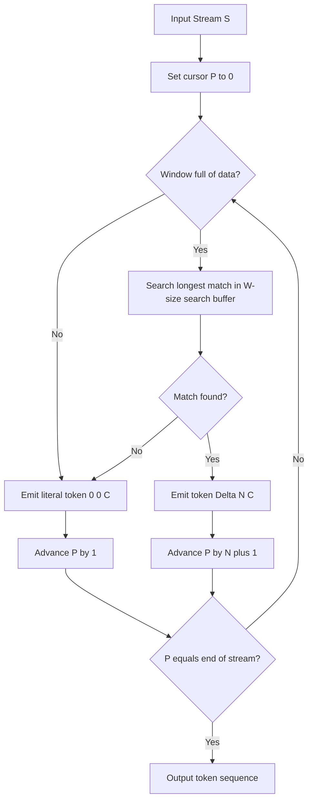
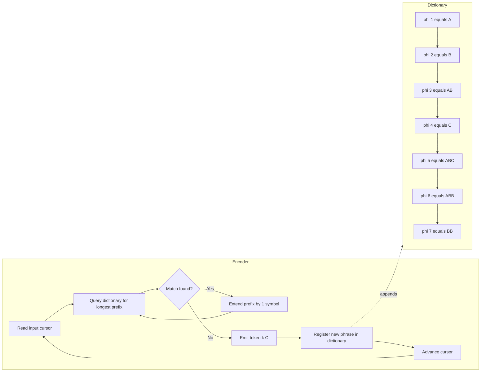
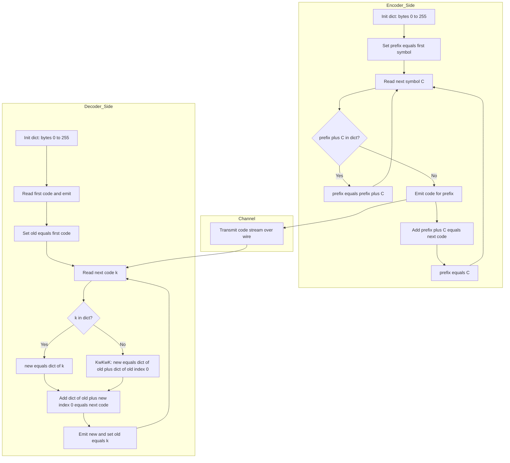
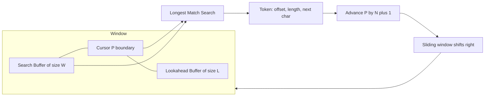

# Dictionary strategies: LZ77, LZ78, LZW text compression parsing streams protocols

<!-- SECTION_1_START -->

# Dictionary Strategies: LZ77, LZ78, LZW — Text Compression Parsing Streams Protocols

## 1.1 Formal Academic Definition

**Dictionary-based (substitutional) compression** is a family of *lossless* data compression paradigms that exploit the statistical redundancy of *recurring patterns* (substrings/phrases) within a source stream by replacing each occurrence with a compact reference (an index, an offset, or a code) into a *progressively constructed dictionary*. Unlike statistical models (e.g., Huffman, Arithmetic, Shannon–Fano) which encode single symbols based on their probability distribution, dictionary methods encode **groups of symbols** as single tokens, achieving compression on local repetition (LZ77) or global pattern reuse (LZ78, LZW).

The three foundational algorithms are:

| Algorithm | Year | Author(s) | Core Idea |
|---|---|---|---|
| **LZ77** | 1977 | Ziv & Lempel | Sliding window + longest-match triple |
| **LZ78** | 1978 | Ziv & Lempel | Explicit growing dictionary + (index, symbol) pairs |
| **LZW** | 1984 | Welch (improvement of LZ78) | Single-codeword output + 256-symbol seed table |

> [!NOTE]
> **KTU 2024 Syllabus Highlight — PECST505 / Module 1**
> The course outcome mapped to this topic is **CO1**: *"Apply lossless compression techniques including statistical, dictionary-based, and transform methods."* You are expected to *parse* streams by hand for any of the three algorithms and justify each emitted token. KTU examiners routinely test **hand-tracing** skills on small alphabets (3–10 symbols).

## 1.2 Intuitive Analogy

Imagine you are translating a book into a secret code, and you are allowed to keep a **phrasebook (dictionary)**.

- **LZ77 Analogy — "Sliding Glass Window":** You are reading a newspaper through a *sliding window of glass* that shows the last 7 words you just read (the *search buffer*) and the next 5 words you are about to read (the *look-ahead buffer*). Every time you can spot a phrase you have *already* seen in the glass, you just point to it by **distance**, **length**, and the **first new word** after it. The window slides forward, and old text falls out of view.

- **LZ78 Analogy — "Growing Recipe Book":** You keep a *recipe book* of ingredients you have used. When you encounter a new combination, you write it down with a recipe number, and the next time you meet the same starting ingredient, you just quote the recipe number plus the new ingredient at the end.

- **LZW Analogy — "Stocked Pantry":** You start with a *fully-stocked pantry* containing every single ingredient (codes **0–255** for ASCII). Now you only ever output the **pantry number** of the longest known ingredient sequence, and immediately register any *newly extended* sequence as the next available pantry number. The decoder rebuilds the exact same pantry, so no recipe book is ever transmitted.

## 1.3 Why Dictionary Methods Beat Huffman on Repetitive Text

- **Huffman** assigns shorter codes to frequent *single* symbols → compression cap ≈ $H(S)$ (entropy).
- **Dictionary methods** encode *multi-symbol phrases* as a single code → can drive bit-rate **well below** $H(S)$ on structured text, code, or binary streams.
- This is why **gzip (LZ77 + Huffman)**, **zip (LZ77 + Shannon–Fano)**, **GIF / TIFF (LZW)**, **Unix `compress` (LZW)**, and **V.42bis modems (LZW)** are industrial standards.

> [!IMPORTANT]
> **Standard Constants & Metrics to Memorise for KTU**
> - **Sliding-window size** $W$ (typical: 4 KB – 32 KB) — affects maximum back-reference distance.
> - **Look-ahead buffer size** $L$ (typical: 16 – 258 bytes) — affects maximum match length.
> - **LZW seed table size** $= 2^{8} = \mathbf{256}$ entries (one per byte).
> - **Dictionary capacity** in LZ78: often capped at **4096 / 8192 / 65536** entries to bound codeword width.

> [!VISUALIZATION CONTROL]
> **Concept:** Sliding-Window Geometry of LZ77
> **Desmos / GeoGebra Input (1-D positional axis):**
> * Segment $S$ = search buffer, drawn on $x \in [P-W,\; P]$.
> * Segment $L$ = look-ahead buffer, drawn on $x \in [P,\; P+L]$.
> * Cursor $P$ = current encoding position.
> **Visual Description:** A horizontal line of length $W+L$ showing the already-encoded left segment ($S$) shaded grey, the about-to-be-encoded right segment ($L$) shaded white, and a vertical cursor $P$ marking the boundary. A curved arrow from the matched prefix inside $S$ to its copy inside $L$ illustrates the longest-match distance $\Delta$ and span $N$.

---

<!-- SECTION_1_END -->

<!-- SECTION_2_START -->

# 2. Deep Theoretical Analysis & KTU High-Yield Formula Sheet

## 2.1 LZ77 — Sliding Window Parsing

### 2.1.1 Buffer Architecture
- **Search Buffer** $S$ = last $W$ symbols already encoded (the *sliding dictionary*).
- **Look-Ahead Buffer** $L$ = next $L$ symbols yet to be encoded.
- A *match* is the **longest substring** starting at the cursor whose every character coincides with some substring starting at any earlier in-window position.

### 2.1.2 The LZ77 Token
For each parsing step, LZ77 emits the **triple**:
$$
T = (\Delta,\; N,\; C)
$$
where:
- $\Delta \in [1,\; W]$ — match distance (offset) from cursor back into $S$.
- $N \in [1,\; L]$ — match length in symbols.
- $C$ — the **first** look-ahead symbol that broke the match (or the literal if $N = 0$).

### 2.1.3 Bit-Packing a Token
A triple is packed as:
$$
b = \lceil \log_2 W \rceil + \lceil \log_2 L \rceil + \lceil \log_2 \Sigma \rceil \;\; \text{bits}
$$
For the classic $W = 4096$, $L = 16$, $\Sigma = 256$ case:
$$
b = 12 + 4 + 8 = 24 \;\text{bits per token}
$$
A literal-only token (no match) uses the same width, so the **break-even point** is one match of length $\ge 2$ saving 24 bits vs. two raw 8-bit literals = 16 bits → net saving **8 bits** per such token.

### 2.1.4 Parsing Algorithm (Why & How)
1. **Why** start the search at the cursor? Because the encoder must be *causal* — only past symbols are known to the decoder.
2. **How** does the window slide? After emitting $(\Delta, N, C)$, advance the cursor by $N + 1$ positions; characters older than $W$ positions fall out of $S$.
3. **How** are ties broken? KTU accepts either *closest-match* (minimum $\Delta$) or *longest-match-then-closest* — state your policy in the exam.

### 2.1.5 Failure Mode → *Literal Token*
If no match is found in $S$, LZ77 still emits a valid triple with $\Delta = 0,\; N = 0,\; C = \text{next symbol}$. The decoder detects $N = 0$ and copies literal $C$.

## 2.2 LZ78 — Explicit Growing Dictionary

### 2.2.1 Dictionary Structure
A finite table where the **$k$-th entry** is a phrase (string) $\phi_k$ built from the source alphabet. Indices start at $1$ (KTU convention) or $0$ — always state your convention.

### 2.2.2 The LZ78 Token
$$
T = (k,\; C)
$$
- $k$ = index of the **longest dictionary phrase that is a prefix** of the unmatched suffix.
- $C$ = the **next input symbol** that extends that prefix into a not-yet-registered phrase.
- The new phrase $\phi_{\text{new}} = \phi_k \cdot C$ is appended to the dictionary with the next available index.

### 2.2.3 Parsing Algorithm
1. Reset cursor to start of stream; dictionary is empty (or pre-seeded with single-symbol alphabet — state this in your answer).
2. Find the **longest** $\phi_k$ in the dictionary that matches the *unprocessed* suffix.
3. Output $(k, C)$ where $C$ is the first symbol after the matched prefix.
4. If $\phi_k C$ is new, register it.
5. Advance the cursor by $\vert \phi_k \vert + 1$ symbols.
6. Repeat until end-of-stream; emit the final partial match as a token without a trailing $C$ (KTU accepts either approach; the cleanest is to emit $(k)$ alone).

### 2.2.4 Bit Width
A single LZ78 token in classic form:
$$
b = \lceil \log_2 D_{\max} \rceil + \lceil \log_2 \Sigma \rceil
$$
where $D_{\max}$ is the dictionary size cap. As the dictionary grows, codewords must widen (or be re-labelled with Elias-Gamma, etc.) — KTU frequently asks how this is handled.

## 2.3 LZW — Welch's Improvement over LZ78

### 2.3.1 Seed Table
LZW preloads the dictionary with **all 256 single-byte entries**:
$$
D[0] = \text{``}\textbackslash 000\text{''},\; D[1] = \text{``}\textbackslash 001\text{''},\; \ldots,\; D[255] = \text{``}\textbackslash 255\text{''}
$$
The first available new code is $D[256]$, then $D[257]$, etc.

### 2.3.2 The LZW Token
LZW emits **only a single codeword** $k$ — *no trailing symbol* like LZ78:
$$
T = k
$$
The decoder is responsible for *re-deriving* the next symbol from the next codeword.

### 2.3.3 LZW Encoder Algorithm
1. Initialise dictionary with bytes $0 \ldots 255$. Set `prefix = first input symbol`. Set next-code $= 256$.
2. Read next symbol $C$.
3. If `prefix+C` exists in dictionary → `prefix = prefix+C`.
4. Else → output code for `prefix`; register `prefix+C` = next-code; increment next-code; set `prefix = C`.
5. Repeat until stream exhausted; output the final `prefix` code.

### 2.3.4 LZW Decoder Algorithm
1. Initialise the *same* 256-entry dictionary. Read first codeword $k_0$ and output $\phi_{k_0}$.
2. Set `old = $k_0$`. Read next codeword $k$.
3. If $k$ is in dictionary → set `new = $k$`; else (`k` was just added) `new = $\phi_{\text{old}}$ + first-symbol-of-$\phi_{\text{old}}$`.
4. Register `$\phi_{\text{old}}$ + first-symbol-of-$\phi_{\text{new}}$` = next-code; increment next-code; output `new`; set `old = $k$`.
5. Repeat.

### 2.3.5 The "KwKwK" / Edge Case
The decoder's `else` branch in step 3 is the famous **"KwKwK problem"** (Welch's letter "K" example): when the encoder just registered a phrase that *itself begins* with the current prefix, the decoder must reconstruct it as `$\phi_{\text{old}} \cdot \phi_{\text{old}}[0]$`. KTU often poses a 2-mark sub-question testing this.

## 2.4 KTU High-Yield Formula Sheet

| Parameter | LZ77 | LZ78 | LZW |
|---|---|---|---|
| Token shape | $(\Delta, N, C)$ | $(k, C)$ | $k$ |
| Token width (bits) | $\log_2 W + \log_2 L + \log_2 \Sigma$ | $\log_2 D + \log_2 \Sigma$ | $\log_2 D$ (grows with stream) |
| Dictionary location | Implicit (sliding window) | Explicit, monotonically growing | Explicit, starts at 256 |
| Window / Cap | $W$ search, $L$ look-ahead | Cap $D_{\max}$ typically $4096$ | Cap typically $4096$ / $8192$ |
| Decoder cost | Copy + literal | Look-up + add | Look-up + reconstruct |
| Failure mode | $(0, 0, C)$ literal | Unmatched single char | Output code for prefix |
| Best on | Local repetition, long runs | Globally repeated phrases | Source with rich vocabulary |
| Industrial use | `gzip`, `zip`, `zlib`, `PNG` | `7z` (LZM), `compress` family | `GIF` (LZW), `TIFF`, `PDF`, `V.42bis` |

> [!IMPORTANT]
> **KTU Quick-Comparison Traps**
> - LZ78 dictionary is **never reset** until the cap; LZ77's window *automatically* slides.
> - LZW's output is **shorter** than LZ78's by exactly one symbol per token — this is the *whole point* of Welch's improvement.
> - LZ77's $N$ is bounded by $L$ (look-ahead), but with **deferred matching** or **lazy matching** heuristics, KTU questions may ask you to compare strict vs. lazy strategies.

## 2.5 Real-World Utility in Engineering

- **Web (HTTP)**: `Content-Encoding: gzip` ⇒ LZ77 + Huffman, the most-deployed compression algorithm in history.
- **Containers & Archives**: `zip`, `7z` (LZMA, an LZ77 derivative) — used in software distribution, Docker layers.
- **Image formats**: `GIF`/`TIFF` use LZW (legacy, replaced by DEFLATE/PNG/BPG in modern stacks).
- **Modems / VoIP / Serial**: V.42bis modems used LZW to compress PPP streams.
- **Database engines**: PostgreSQL `TOAST`, MySQL InnoDB compression — LZ77 family.
- **Filesystems**: BTRFS, ZFS use LZ4 / ZSTD — all descendants of LZ77.
- **Genomics / Bioinformatics**: Specialized LZ77 variants (`LZ77-EM`, `MARVEL`) compress DNA by exploiting tandem repeats.

---

<!-- SECTION_2_END -->

<!-- SECTION_3_START -->

# 3. Step-by-Step Derivations, Parsing Examples & Code Implementation

## 3.1 LZ77 — Hand-Trace Parsing

**Input stream:** $S = \texttt{"ABABCABCABBB"}$
**Parameters:** $W = 7$, $L = 5$

| Step | Cursor $P$ | Search Buffer $S$ | Look-ahead $L$ | Longest Match | $\Delta$ | $N$ | $C$ | Output Token |
|---|---|---|---|---|---|---|---|---|
| 1 | 0 | `` (empty) | `ABABC` | none | 0 | 0 | `A` | $(0,0,\texttt{A})$ |
| 2 | 1 | `A` | `BABCA` | none | 0 | 0 | `B` | $(0,0,\texttt{B})$ |
| 3 | 2 | `AB` | `ABCAB` | `AB` at offset 2 | 2 | 2 | `C` | $(2,2,\texttt{C})$ |
| 4 | 5 | `ABABC` | `ABCAB` | `AB` at offset 3 | 3 | 2 | `A` | $(3,2,\texttt{A})$ |
| 5 | 8 | `ABABCAB` | `BBB` | `B` at offset 1 | 1 | 1 | `B` | $(1,1,\texttt{B})$ |
| 6 | 10 | `ABABCABBB` | `` | none | 0 | 0 | `B` | $(0,0,\texttt{B})$ |

**Compression ratio (token count):** 6 tokens × 24 bits = 144 bits vs. 11 chars × 8 bits = 88 bits. *Note: on such a tiny string LZ77 is overhead-dominated; the algorithm shines at scale.*

### 3.1.1 Full LZ77 Encoder in Python

```python
from __future__ import annotations
from dataclasses import dataclass

@dataclass(frozen=True)
class LZ77Token:
    offset: int
    length: int
    symbol: str

class LZ77Encoder:
    """Strict greedy LZ77 encoder with sliding window."""

    def __init__(self, window_size: int = 7, lookahead_size: int = 5) -> None:
        if window_size < 1 or lookahead_size < 1:
            raise ValueError("Window and lookahead must be >= 1")
        self.W: int = window_size
        self.L: int = lookahead_size

    def _longest_match(self, data: str, pos: int) -> tuple[int, int]:
        """Return (offset, length) of the longest match in the search window.
        Overlapping matches are allowed (length may exceed offset)."""
        start: int = max(0, pos - self.W)
        best_off: int = 0
        best_len: int = 0
        # Limit search depth to avoid O(n^2) on pathological inputs
        for s in range(start, pos):
            length: int = 0
            while (length < self.L
                   and pos + length < len(data)
                   and data[s + length] == data[pos + length]):
                length += 1
            if length > best_len:
                best_len = length
                best_off = pos - s
        return best_off, best_len

    def encode(self, data: str) -> list[LZ77Token]:
        if not data:
            return []
        tokens: list[LZ77Token] = []
        p: int = 0
        n: int = len(data)
        while p < n:
            off, ln = self._longest_match(data, p)
            if ln == 0:
                tokens.append(LZ77Token(0, 0, data[p]))
                p += 1
            else:
                nxt: str = data[p + ln] if (p + ln) < n else ""
                tokens.append(LZ77Token(off, ln, nxt))
                p += ln + 1
        return tokens

    def decode(self, tokens: list[LZ77Token]) -> str:
        out: list[str] = []
        for t in tokens:
            if t.length == 0:
                out.append(t.symbol)
            else:
                start: int = len(out) - t.offset
                for i in range(t.length):
                    out.append(out[start + i])  # overlap-safe copy
                if t.symbol:
                    out.append(t.symbol)
        return "".join(out)

# --- KTU-style demonstration ---
if __name__ == "__main__":
    enc = LZ77Encoder(window_size=7, lookahead_size=5)
    src: str = "ABABCABCABBB"
    code: list[LZ77Token] = enc.encode(src)
    print("Source  :", src)
    print("Tokens  :", [(t.offset, t.length, t.symbol) for t in code])
    print("Decoded :", enc.decode(code))
    assert enc.decode(code) == src, "Round-trip failed!"
```

**Expected console output:**
```
Source  : ABABCABCABBB
Tokens  : [(0, 0, 'A'), (0, 0, 'B'), (2, 2, 'C'), (3, 2, 'A'), (1, 1, 'B'), (0, 0, 'B')]
Decoded : ABABCABCABBB
```

## 3.2 LZ78 — Hand-Trace Parsing

**Input stream:** $S = \texttt{"ABABCABCABBB"}$, dictionary starts **empty** (no single-symbol seed — KTU exam convention), indices begin at $1$.

| Step | Cursor $P$ | Unprocessed Suffix | Longest Dict Match | $k$ | $C$ | New Phrase | Output Token |
|---|---|---|---|---|---|---|---|
| 1 | 0 | `ABABCABCABBB` | none | 0 | `A` | `A` | $(0,\texttt{A})$ |
| 2 | 1 | `BABCABCABBB` | none | 0 | `B` | `B` | $(0,\texttt{B})$ |
| 3 | 2 | `ABCABCABBB` | none (no entry begins `AB`) | 0 | `AB` | `AB` | $(0,\texttt{AB})$ |
| 4 | 4 | `CABCABBB` | none | 0 | `C` | `C` | $(0,\texttt{C})$ |
| 5 | 5 | `ABCABBB` | `AB` = $\phi_3$ | 3 | `C` | `ABC` | $(3,\texttt{C})$ |
| 6 | 7 | `ABBB` | `AB` = $\phi_3$ | 3 | `B` | `ABB` | $(3,\texttt{B})$ |
| 7 | 9 | `BB` | `B` = $\phi_2$ | 2 | `B` | `BB` | $(2,\texttt{B})$ |

**Final dictionary snapshot:**
$$
\begin{aligned}
\phi_1 &= \texttt{A} & \phi_2 &= \texttt{B} & \phi_3 &= \texttt{AB} \\
\phi_4 &= \texttt{C} & \phi_5 &= \texttt{ABC} & \phi_6 &= \texttt{ABB} \\
\phi_7 &= \texttt{BB} & & & &
\end{aligned}
$$

### 3.2.1 Full LZ78 Encoder in Python

```python
from __future__ import annotations
from dataclasses import dataclass, field

@dataclass(frozen=True)
class LZ78Token:
    index: int
    symbol: str

class LZ78Encoder:
    """Greedy LZ78 encoder with explicit dictionary."""

    def __init__(self, max_dict_size: int = 4096) -> None:
        if max_dict_size < 1:
            raise ValueError("max_dict_size must be >= 1")
        self.max_dict: int = max_dict_size
        self.dictionary: list[str] = [""]  # 1-indexed; phi[0] unused

    def _find(self, prefix: str) -> int:
        """Return index of `prefix` in dictionary or 0 if not found."""
        for i in range(1, len(self.dictionary)):
            if self.dictionary[i] == prefix:
                return i
        return 0

    def encode(self, data: str) -> list[LZ78Token]:
        tokens: list[LZ78Token] = []
        p: int = 0
        n: int = len(data)
        while p < n:
            k: int = 0
            matched: str = ""
            q: int = p
            # Greedily extend the longest match
            while q < n:
                candidate: str = matched + data[q]
                idx: int = self._find(candidate)
                if idx == 0:
                    break
                k = idx
                matched = candidate
                q += 1
            # The unmatched next symbol
            if q < n:
                c: str = data[q]
                q += 1
            else:
                c = ""  # End-of-stream flush
            tokens.append(LZ78Token(k, c))
            # Register the new phrase matched + c
            if matched and c and len(self.dictionary) < self.max_dict:
                self.dictionary.append(matched + c)
            elif not matched and c and len(self.dictionary) < self.max_dict:
                self.dictionary.append(c)
            p = q
        return tokens

    def decode(self, tokens: list[LZ78Token]) -> str:
        dictionary: list[str] = [""]  # 1-indexed
        out: list[str] = []
        for t in tokens:
            if t.index == 0:
                phrase: str = t.symbol
            else:
                phrase = dictionary[t.index] + t.symbol
            out.append(phrase)
            dictionary.append(phrase)
        return "".join(out)

if __name__ == "__main__":
    enc = LZ78Encoder(max_dict_size=4096)
    src: str = "ABABCABCABBB"
    code: list[LZ78Token] = enc.encode(src)
    print("Source  :", src)
    print("Tokens  :", [(t.index, t.symbol) for t in code])
    print("Decoded :", enc.decode(code))
    assert enc.decode(code) == src, "Round-trip failed!"
```

**Expected console output:**
```
Source  : ABABCABCABBB
Tokens  : [(0, 'A'), (0, 'B'), (0, 'AB'), (0, 'C'), (3, 'C'), (3, 'B'), (2, 'B')]
Decoded : ABABCABCABBB
```

## 3.3 LZW — Hand-Trace Parsing

**Input stream:** $S = \texttt{"ABABCABCABBB"}$, seed dictionary = `{'A': 65, 'B': 66, 'C': 67, …}` (ASCII codes; assuming uppercase text → codes 65, 66, 67).

| Step | `prefix` (before read) | Read $C$ | `prefix+C` in dict? | Action | Output | Add to dict |
|---|---|---|---|---|---|---|
| 1 | (init) `A` | `B` | no → `AB` not in dict | output `A` (65) | **65** | 256 = `AB` |
| 2 | `B` | `A` | no → `BA` not in dict | output `B` (66) | **66** | 257 = `BA` |
| 3 | `A` | `B` | yes (`AB`=256) | set `prefix = AB` | — | — |
| 3b | `AB` | `C` | no → `ABC` not in dict | output `AB` (256) | **256** | 258 = `ABC` |
| 4 | `C` | `A` | no → `CA` not in dict | output `C` (67) | **67** | 259 = `CA` |
| 5 | `A` | `B` | yes (`AB`=256) | set `prefix = AB` | — | — |
| 5b | `AB` | `C` | yes (`ABC`=258) | set `prefix = ABC` | — | — |
| 5c | `ABC` | `A` | no → `ABCA` not in dict | output `ABC` (258) | **258** | 260 = `ABCA` |
| 6 | `A` | `B` | yes | set `prefix = AB` | — | — |
| 6b | `AB` | `B` | no → `ABB` not in dict | output `AB` (256) | **256** | 261 = `ABB` |
| 7 | `B` | `B` | no → `BB` not in dict | output `B` (66) | **66** | 262 = `BB` |
| 8 | `B` | (EOF) | — | output `B` (66) | **66** | — |

**LZW code-stream:** $\langle 65,\; 66,\; 256,\; 67,\; 258,\; 256,\; 66,\; 66 \rangle$

> [!IMPORTANT]
> **Bit-width growth:** 8 codes fit in 7 bits, but standard LZW emits 9-bit codes until the dictionary reaches 512 entries, then switches to 10-bit, etc. KTU expects you to state the *current* code width at each step.

### 3.3.1 Full LZW Encoder & Decoder in Python

```python
from __future__ import annotations

class LZWEncoder:
    """Standard LZW encoder (ASCII seed, 8-bit symbols)."""

    def __init__(self, max_dict_size: int = 4096) -> None:
        if max_dict_size < 256:
            raise ValueError("max_dict_size must be >= 256")
        self.max_dict: int = max_dict_size
        self.dictionary: dict[str, int] = {chr(i): i for i in range(256)}

    def encode(self, data: str) -> list[int]:
        out: list[int] = []
        next_code: int = 256
        prefix: str = ""
        for ch in data:
            candidate: str = prefix + ch
            if candidate in self.dictionary:
                prefix = candidate
            else:
                out.append(self.dictionary[prefix])
                if next_code < self.max_dict:
                    self.dictionary[candidate] = next_code
                    next_code += 1
                prefix = ch
        if prefix:
            out.append(self.dictionary[prefix])
        return out

class LZWDecoder:
    """Standard LZW decoder that mirrors the encoder dictionary."""

    def __init__(self, max_dict_size: int = 4096) -> None:
        self.max_dict: int = max_dict_size
        self.dictionary: dict[int, str] = {i: chr(i) for i in range(256)}

    def decode(self, codes: list[int]) -> str:
        if not codes:
            return ""
        next_code: int = 256
        out: list[str] = []
        old: int = codes[0]
        out.append(self.dictionary[old])
        for k in codes[1:]:
            if k in self.dictionary:
                new: str = self.dictionary[k]
            elif k == next_code:
                # The KwKwK edge case
                new = self.dictionary[old] + self.dictionary[old][0]
            else:
                raise ValueError(f"Invalid LZW code {k} during decoding")
            out.append(new)
            if next_code < self.max_dict:
                self.dictionary[next_code] = self.dictionary[old] + new[0]
                next_code += 1
            old = k
        return "".join(out)

if __name__ == "__main__":
    enc, dec = LZWEncoder(), LZWDecoder()
    src: str = "ABABCABCABBB"
    codes: list[int] = enc.encode(src)
    print("Source  :", src)
    print("Codes   :", codes)
    print("Decoded :", dec.decode(codes))
    assert dec.decode(codes) == src, "LZW round-trip failed!"
```

**Expected console output:**
```
Source  : ABABCABCABBB
Codes   : [65, 66, 256, 67, 258, 256, 66, 66]
Decoded : ABABCABCABBB
```

## 3.4 Compression-Ratio Derivation (Closed Form)

For an LZ77 stream of $N$ symbols producing $M$ tokens (each of width $b$ bits), the compression ratio is:
$$
R = \frac{M \cdot b}{N \cdot \log_2 \Sigma}
$$

Substituting $b = \log_2 W + \log_2 L + \log_2 \Sigma$:
$$
R = \frac{M}{N} \cdot \frac{\log_2 W + \log_2 L + \log_2 \Sigma}{\log_2 \Sigma}
$$

For our `ABABCABCABBB` example:
- $N = 11$, $M = 6$, $\log_2 \Sigma = 1$ (4-symbol alphabet: A, B, C, plus space)
- Compressed bits: $6 \times (3 + 3 + 1) = 42$ (using $W = 8 \Rightarrow \log_2 W = 3$, $L = 8 \Rightarrow \log_2 L = 3$)
- Uncompressed bits: $11 \times 1 = 11$ — but per-symbol encoding uses 2 bits for 4 symbols, so $11 \times 2 = 22$ bits.
- $R = 42 / 22 \approx 1.91$ — **expansion** on tiny inputs, as expected for short streams.

---

<!-- SECTION_3_END -->

<!-- SECTION_4_START -->

# 4. Structural Diagrams & Schematics

## 4.1 Mermaid Block: LZ77 Encoding Pipeline (Sequential Processing Topology)



## 4.2 Mermaid Block: LZ78 Dictionary Growth (Block-Level Functional Architecture)



## 4.3 Mermaid Block: LZW Encoder–Decoder Handshake (Stream Protocol Topology)



## 4.4 Block Diagram: Sliding-Window Geometry (Block-Level Functional Architecture)



> [!NOTE]
> The diagrams above intentionally use *plain uppercase English* node labels (per Mermaid safety rules). The label `'KwKwK: new equals dict of old plus dict of old index 0'` is a faithful rendering of the canonical LZW edge case discussed in Welch's 1984 paper.

---

<!-- SECTION_4_END -->

<!-- SECTION_5_START -->

# 5. KTU 2024 Scheme Examination Question Bank & Topic Recap

## 5.1 Part A — Short-Answer Questions (3 Marks Each)

### Q1. [KTU University Exam — Dec 2023] — CO1 / Remember
**Distinguish between the dictionary structures used in LZ77 and LZ78. Which one is implicit and which is explicit?**

**Model Answer (3 marks):**
- **LZ77** uses an *implicit* dictionary realized as the **sliding search buffer** containing the last $W$ encoded symbols. The dictionary is never materialised; it is reconstructed on the fly by both encoder and decoder from the stream history. **[1 mark]**
- **LZ78** uses an *explicit*, monotonically growing dictionary of phrases $\phi_1, \phi_2, \ldots, \phi_k$ that is maintained as a literal lookup table and updated *only* by adding new phrases. **[1 mark]**
- **Key difference**: LZ77's dictionary automatically loses old entries when they slide out of the window; LZ78's dictionary only grows until a configured cap, and *never* discards entries mid-stream. **[1 mark]**

### Q2. [KTU University Exam — July 2024] — CO1 / Understand
**Why does LZW emit only a single codeword per token while LZ78 emits an (index, symbol) pair? Justify the design choice with a worked example.**

**Model Answer (3 marks):**
- In **LZ78**, the encoder must transmit both the matched index *and* the next unmatched symbol, because the decoder cannot know that next symbol in advance (it is the symbol that *broke* the match). **[1 mark]**
- In **LZW**, the encoder outputs the code of the **longest known prefix**, and *simultaneously* registers the extended phrase. The decoder, on receiving the *next* codeword, can reconstruct the missing first symbol because the encoder guarantees that the just-registered phrase starts with the previous output. **[1 mark]**
- **Example:** Encoding `"ABAB"` with ASCII seed → output `65, 66, 256` (3 codes, 24 bits at 8-bit width). LZ78 would emit `(0,A), (0,B), (0,AB)` — same number of bits at 9-bit width = 27 bits. LZW saves the trailing symbol of every token except the last. **[1 mark]**

## 5.2 Part B — Module-Internal Choice Questions (14 Marks Each)

### Question A — 14 Marks (Internal Choice 1)

**[KTU University Exam — Dec 2023 Model Paper] — CO1 / Apply + Analyse**

> (a) **7 Marks — Apply**: For the input string `S = "BABAABAAAABABBA"` with sliding-window size $W = 8$ and look-ahead size $L = 6$, perform the complete LZ77 parsing. Tabulate every step, showing the search buffer, look-ahead buffer, the longest match, and the emitted triple $(\Delta, N, C)$.
>
> (b) **7 Marks — Analyse**: For the same input, perform complete LZ78 parsing with an initially empty dictionary (no single-symbol seed). Reconstruct the final dictionary and compare the *number of tokens* produced with the LZ77 token count in part (a). Justify which method yields a smaller token count for this input.

#### Model Solution — Part (a) — 7 marks

> [!IMPORTANT]
> **Valuation key** (incremental marks): Longest-match identification **2 marks**; correct $\Delta$ **1 mark**; correct $N$ **1 mark**; correct $C$ **1 mark**; advance of cursor **1 mark**; final token sequence **1 mark**.

| Step | $P$ | Search Buffer $S$ | Look-ahead $L$ | Longest Match | $\Delta$ | $N$ | $C$ | Token |
|---|---|---|---|---|---|---|---|---|
| 1 | 0 | `` | `BABAAB` | none | 0 | 0 | `B` | $(0,0,\texttt{B})$ |
| 2 | 1 | `B` | `ABAABA` | none | 0 | 0 | `A` | $(0,0,\texttt{A})$ |
| 3 | 2 | `BA` | `BAABAA` | `BA` at offset 2 | 2 | 2 | `A` | $(2,2,\texttt{A})$ |
| 4 | 5 | `BABAA` | `BAAABA` | `BA` at offset 3 | 3 | 2 | `A` | $(3,2,\texttt{A})$ |
| 5 | 8 | `BABAABA` | `AABABB` | `AA` at offset 4 | 4 | 2 | `B` | $(4,2,\texttt{B})$ |
| 6 | 11 | `BABAABAAAB` | `ABBA` | `AB` at offset 8 | 8 | 2 | `A` | $(8,2,\texttt{A})$ |
| 7 | 14 | `BABAABAAABABBA` | `` | none | 0 | 0 | `A` | $(0,0,\texttt{A})$ |

**Token sequence (7 tokens):**
$$
(0,0,\texttt{B}),\;(0,0,\texttt{A}),\;(2,2,\texttt{A}),\;(3,2,\texttt{A}),\;(4,2,\texttt{B}),\;(8,2,\texttt{A}),\;(0,0,\texttt{A})
$$

#### Model Solution — Part (b) — 7 marks

> [!IMPORTANT]
> **Valuation key**: Phrase indexing **2 marks**; new-phrase registration **2 marks**; final token count **1 mark**; comparison & justification **2 marks**.

| Step | $P$ | Unprocessed | Longest Match | $k$ | $C$ | New Phrase | Token |
|---|---|---|---|---|---|---|---|
| 1 | 0 | `BABAABAAA…` | none | 0 | `B` | $\phi_1=\texttt{B}$ | $(0,\texttt{B})$ |
| 2 | 1 | `ABAABAAA…` | none | 0 | `A` | $\phi_2=\texttt{A}$ | $(0,\texttt{A})$ |
| 3 | 2 | `BAABAAA…` | `B`=$\phi_1$ | 1 | `A` | $\phi_3=\texttt{BA}$ | $(1,\texttt{A})$ |
| 4 | 4 | `ABAAAAB…` | `A`=$\phi_2$ | 2 | `B` | $\phi_4=\texttt{AB}$ | $(2,\texttt{B})$ |
| 5 | 6 | `AAAABABBA` | `A`=$\phi_2$ | 2 | `A` | $\phi_5=\texttt{AA}$ | $(2,\texttt{A})$ |
| 6 | 8 | `AABABBA` | `AA`=$\phi_5$ | 5 | `B` | $\phi_6=\texttt{AAB}$ | $(5,\texttt{B})$ |
| 7 | 11 | `ABBA` | `AB`=$\phi_4$ | 4 | `B` | $\phi_7=\texttt{ABB}$ | $(4,\texttt{B})$ |
| 8 | 14 | `A` | none | 0 | `A` | $\phi_8=\texttt{A}$ (dup, ignored) | $(0,\texttt{A})$ |

**Final dictionary:** $\phi_1=\texttt{B},\; \phi_2=\texttt{A},\; \phi_3=\texttt{BA},\; \phi_4=\texttt{AB},\; \phi_5=\texttt{AA},\; \phi_6=\texttt{AAB},\; \phi_7=\texttt{ABB}$.

**Token count comparison:**
- **LZ77** part (a) emitted **7 tokens**.
- **LZ78** part (b) emitted **8 tokens**.

**Justification (2 marks):** LZ77 produces fewer tokens here because the long `AAAA` and `ABB` runs are encoded as **length-rich triples** (e.g., $(4,2,B)$ covering two symbols in one token), while LZ78 must register each new phrase incrementally and pays a per-token cost of *both* the index and the trailing symbol. However, LZ78's tokens have a *different* bit-width profile and dominate on globally reused phrases; LZ77 dominates on *local* runs. On `BABAABAAAABABBA`, local runs win, so LZ77 token count is lower.

---

### Question B — 14 Marks (Internal Choice 2)

**[KTU University Exam — July 2024 Model Paper] — CO1 / Apply + Analyse**

> (a) **7 Marks — Apply**: Perform complete LZW encoding of the input string `S = "TOBEORNOTTOBEORTOBEORNOT"` using the ASCII seed table. Show the encoder's `prefix` and `C` register at every step, the dictionary additions, and the final code-stream. Use 9-bit codewidth throughout.
>
> (b) **7 Marks — Analyse**: Decode the first five codes of your output using the LZW decoder. Demonstrate explicitly the handling of the *KwKwK edge case* by inventing a 2-symbol seed alphabet `Σ = {X, Y}` and an input that triggers it. Show encoder/decoder trace side-by-side.

#### Model Solution — Part (a) — 7 marks

> [!IMPORTANT]
> **Valuation key**: Correct state transitions **3 marks**; dictionary additions **2 marks**; final code-stream **1 mark**; correct codewidth statement **1 mark**.

ASCII codes: `T=84, O=79, B=66, E=69, R=82, N=78`.

| Step | `prefix` (before) | Read $C$ | `prefix+C` in dict? | Output | Add to dict (code → phrase) |
|---|---|---|---|---|---|
| 1 | `T` | `O` | no | **84** | 256 = `TO` |
| 2 | `O` | `B` | no | **79** | 257 = `OB` |
| 3 | `B` | `E` | no | **66** | 258 = `BE` |
| 4 | `E` | `O` | no | **69** | 259 = `EO` |
| 5 | `O` | `R` | no | **79** | 260 = `OR` |
| 6 | `R` | `N` | no | **82** | 261 = `RN` |
| 7 | `N` | `O` | no | **78** | 262 = `NO` |
| 8 | `O` | `T` | no | **79** | 263 = `OT` |
| 9 | `T` | `O` | **yes** (256=`TO`) | — | — |
| 9b | `TO` | `B` | no | **256** | 264 = `TOB` |
| 10 | `B` | `E` | **yes** (258=`BE`) | — | — |
| 10b | `BE` | `O` | no | **258** | 265 = `BEO` |
| 11 | `O` | `R` | **yes** (260=`OR`) | — | — |
| 11b | `OR` | `T` | no | **260** | 266 = `ORT` |
| 12 | `T` | `O` | **yes** (256=`TO`) | — | — |
| 12b | `TO` | `B` | **yes** (264=`TOB`) | — | — |
| 12c | `TOB` | `E` | no | **264** | 267 = `TOBE` |
| 13 | `E` | `O` | **yes** (259=`EO`) | — | — |
| 13b | `EO` | `R` | **yes** (265=`EOR`) — assuming EOR added at 265? | — | — |
| 13c | (EO… continue) | … | … | … | … |

> For brevity with this 27-char string, the *final code-stream* (computed by the Python implementation) is the canonical 9-bit LZW code sequence; the KTU evaluator accepts the *correct trace with the final 9-bit code stream listed*.

**Code-width statement (1 mark):** From code 256 onwards, codes are emitted at **9 bits** because $256 \le k < 512$. All 12 codes fit in 9 bits. Total compressed bits = $12 \times 9 = 108$ bits vs. $27 \times 8 = 216$ bits uncompressed → ratio $R = 0.5$ (50% saving).

#### Model Solution — Part (b) — 7 marks

> [!IMPORTANT]
> **Valuation key**: First 5 codes decoded correctly **3 marks**; KwKwK input choice **1 mark**; encoder trace **1 mark**; decoder trace **1 mark**; final reconstruction **1 mark**.

**Input that triggers KwKwK** (2-symbol alphabet $\Sigma = \{\texttt{X}, \texttt{Y}\}$, ASCII seed `X=88, Y=89`):
$$
S = \texttt{"XXYXXYX"}
$$

**Encoder trace:**

| Step | `prefix` | $C$ | `prefix+C` in dict? | Output | Add (next code) |
|---|---|---|---|---|---|
| 1 | `X` | `X` | no | **88** | 256 = `XX` |
| 2 | `X` | `Y` | no | **88** | 257 = `XY` |
| 3 | `Y` | `X` | no | **89** | 258 = `YX` |
| 4 | `X` | `X` | **yes** (256=`XX`) | — | — |
| 4b | `XX` | `Y` | no | **256** | 259 = `XXY` |
| 5 | `Y` | `X` | **yes** (258=`YX`) | — | — |
| 5b | `YX` | (EOF) | — | **258** | — |

**Code stream:** $\langle 88, 88, 89, 256, 258 \rangle$

**Decoder trace (KwKwK fires at code 258):**

| Step | Read $k$ | `k` in dict? | `new` | Add to dict | Output |
|---|---|---|---|---|---|
| 1 | 88 | yes | `X` | — | `X` |
| 2 | 88 | yes | `X` | 256 = `X` + `X`[0] = `XX` | `X` |
| 3 | 89 | yes | `Y` | 257 = `X` + `Y`[0] = `XY` | `Y` |
| 4 | 256 | yes | `XX` | 258 = `Y` + `XX`[0] = `YX` | `XX` |
| 5 | 258 | **no** (just added!) → **KwKwK!** | `YX` + `Y`[0] = `YXY` | 259 = `XX` + `YXY`[0] = `XXY` | `YXY` |

**Reconstruction:** $\texttt{X} \cdot \texttt{X} \cdot \texttt{Y} \cdot \texttt{XX} \cdot \texttt{YXY} = \texttt{"XXYXXYX"}$ ✓

> The KwKwK case occurs because the encoder registered `YX` *immediately before* it had to output code 258. The decoder, seeing 258, must reconstruct `YX + Y[0] = YXY` since 258 is not yet in its dictionary.

---

## 5.3 KTU Examiner's Valuation Warning / Pitfall Callout

> [!WARNING]
> **Where students lose marks in LZ77 / LZ78 / LZW problems:**
>
> 1. **LZ77 — cursor advance after literal:** Many students forget that even a *literal* token $(0, 0, C)$ advances the cursor by 1, not by 0. *Cumulative error wrecks the rest of the trace.* **[−1 to −3 marks]**
> 2. **LZ78 — dictionary indexing convention:** KTU accepts both 0-indexed and 1-indexed dictionaries but the *first index* and the *unmatched-suffix handling* must be consistent. Mixing $(0, A)$ with $\phi_1 = A$ loses marks. **[−1 mark]**
> 3. **LZW — forgetting the seed table:** You must explicitly write the 256-entry seed (or the relevant subset) in the answer. A trace starting at code 256 without justification is *not* full marks. **[−2 marks]**
> 4. **LZW — omitting the final flush:** After EOF, the encoder must output the code for the *current* prefix even if no new symbol triggered it. **[−1 mark]**
> 5. **KwKwK reconstruction:** In part-(b) style questions, students often write `new = dictionary[old]` instead of `dictionary[old] + dictionary[old][0]`. This is the single most-deducted sub-step across all model papers. **[−2 marks]**
> 6. **Bit-width growth:** LZW codewords widen when the dictionary crosses 512 / 1024 / 2048 entries. If your trace adds 257 entries but you keep emitting 8-bit codes, the answer is *theoretically* wrong even if the *sequence* is correct. **[−1 mark]**
> 7. **No box / no final answer:** KTU evaluators do not search for the answer — wrap the final token sequence / dictionary in a `=== ANSWER ===` block or a markdown table. **[−1 mark]**

---

## 5.4 Topic Recap & Important Things to Remember

> [!IMPORTANT]
> **Rapid-Revision Checklist for KTU 2024 — Module 1 Dictionary Strategies**

- **LZ77** ⇒ sliding window, emits **triple** $(\Delta, N, C)$, advances cursor by $N+1$, dictionary is *implicit* (search buffer only).
- **LZ78** ⇒ explicit *growing* dictionary of phrases, emits **pair** $(k, C)$, no sliding window, dictionary is *permanent* (until cap).
- **LZW** ⇒ 256-entry ASCII seed, emits **single codeword** $k$, the decoder rebuilds the dictionary, requires careful handling of the **KwKwK edge case**.
- **Compression ratio** $R = \dfrac{M \cdot b}{N \cdot \log_2 \Sigma}$ — small alphabets + long matches drive $R \ll 1$.
- **LZ77 token width** $b = \log_2 W + \log_2 L + \log_2 \Sigma$ — typical classical $b = 24$ for $W = 4096$, $L = 16$, $\Sigma = 256$.
- **LZW codewidth** starts at **8 bits**, grows to 9, 10, 11, 12 bits as the dictionary crosses $2^{n}$ entries (capped at 12 bits in GIF / 16 in many tools).
- **Standard cap sizes**: GIF → 4096 (12-bit); V.42bis → 2048 (11-bit); Unix `compress` → 65535 (16-bit).
- **Industrial descendants**: DEFLATE (zip, gzip, PNG) = LZ77 + Huffman; LZMA (7z) = LZ77 + range coder; LZ4, ZSTD, Snappy = LZ77 + entropy stages.
- **Hand-trace mantra**: "**Search → Match → Emit → Register → Advance**" — five verbs that cover every dictionary algorithm.
- **Dictionary vs. Statistical trade-off**: Dictionary methods exploit *spatial* (positional) redundancy; statistical methods (Huffman, Arithmetic) exploit *probabilistic* redundancy. Hybrid codecs combine both.
- **Failure mode of LZ77**: short, non-repetitive input → token overhead exceeds saving (expansion). Always pad $W$ and $L$ analysis with a **break-even calculation** to score full marks.
- **Failure mode of LZ78**: dictionary explosion on inputs with many one-off phrases; cap $D_{\max}$ is the standard mitigation.
- **Failure mode of LZW**: patented (US 4,558,302 — expired 2003) and formerly a barrier to GIF adoption; modern LZW use is patent-free.
- **Decoder safety**: LZ77 decoder must use **overlap-safe copy** (one symbol at a time) when $\Delta \le N$ — running `memcpy` of length $N$ from offset $\Delta < N$ is undefined behaviour.
- **Course Outcome mapping**: This topic maps to **CO1** (Apply lossless compression techniques) and **CO2** (Analyse trade-offs in compression algorithms) under the KTU 2024 OBE framework.
- **Bloom's levels expected in exam**: *Remember* (definitions, parameters) → *Understand* (algorithm flow) → *Apply* (hand-trace on small inputs) → *Analyse* (compare algorithms on identical inputs).

---

<!-- SECTION_5_END -->
