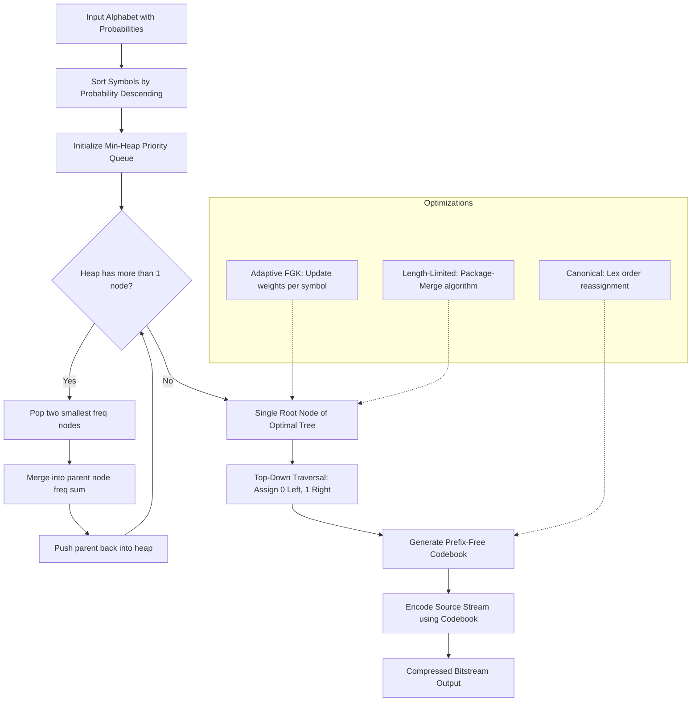
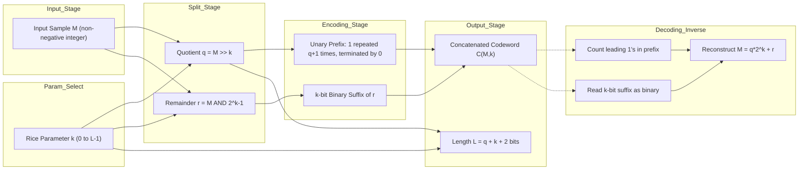
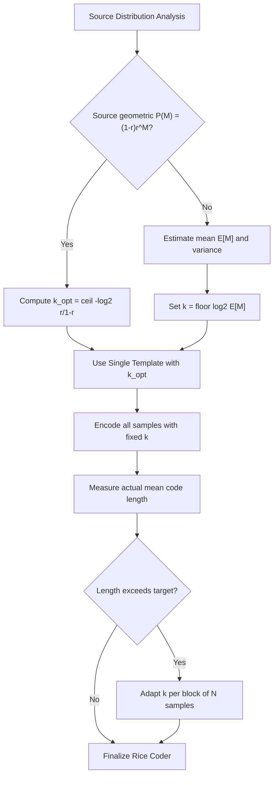
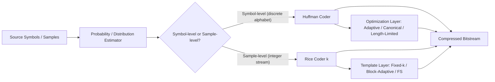
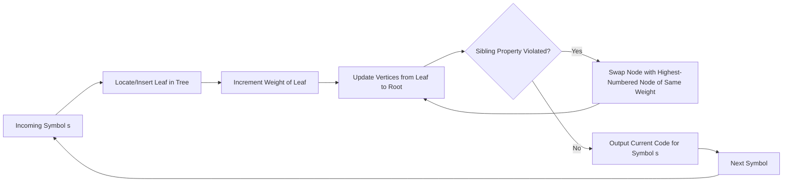

# Huffman coding optimization algorithms, Rice coding formats templates

<!-- SECTION_1_START -->

# DATA COMPRESSION (PECST505) — Module 1
## Lossless Encoding Methods: Huffman Coding Optimization & Rice Coding Templates

---

### 1.1 Huffman Coding — Core Definition

> [!IMPORTANT]
> **Formal KTU 2024 Definition:** *Huffman Coding* is a **greedy, bottom-up, optimal prefix-code construction algorithm** introduced by **David A. Huffman (1952)**. It assigns **shorter codewords to more probable symbols** and **longer codewords to less probable symbols**, producing a **minimum expected code length (entropy-bounded) lossless binary prefix code** for a known source alphabet.

The "optimization" in this context refers to a family of refinements built on top of the original 1952 algorithm:

| Optimization Variant | Key Idea |
|---|---|
| **Static Huffman** | Probabilities computed once before transmission |
| **Adaptive Huffman** | Tree updated dynamically per symbol (FGK / Vitter algorithms) |
| **Canonical Huffman** | Same code lengths as standard Huffman, but codes assigned in lexical order → faster decoding |
| **Optimal Alphabet Size (m-ary)** | Extended to n-ary alphabets (e.g., ternary) |
| **Limited-Length Huffman** | Constrains max codeword length to reduce delay |
| **Length-Limited Huffman (Package-Merge)** | Produces optimal code under length constraints |

> [!NOTE]
> **KTU Syllabus Highlight:** The "optimization" tag in PECST505 specifically refers to **adaptive Huffman, length-limited variants, and the binary-vs-ternary tree trade-off**, *not* the standard textbook Huffman procedure.

---

### 1.2 Intuitive Analogy — Huffman Coding

Imagine a **classroom of 100 students** lining up at a narrow door. **70 students are wearing red caps** (frequent symbol) and **30 are wearing blue caps** (rare symbol). You want to minimize total wait time.

* ❌ Naïve: Give every student an **8-digit ID** → long queue
* ✅ Huffman: Issue **"RED"** to red-caps (3 chars) and a longer code to blue-caps (e.g., 6 chars)
* The **expected queue length** is minimized because the majority are processed quickly.

This is the **essence of Huffman coding** — minimize the *expected* (weighted) code length, not the *worst-case* length.

---

### 1.3 Rice Coding — Core Definition

> [!IMPORTANT]
> **Formal KTU 2024 Definition:** *Rice Coding* is a **lossless, parametric, variable-length entropy coding scheme** designed by **Robert F. Rice (1971, JPL/IPL Tech Report)** for the compression of **monochrome image data** and **speech/audio waveforms**. It encodes a non-negative integer sample $M$ as a **quotient–remainder pair** using a configurable parameter $k$, where the **quotient is encoded in unary** and the **remainder is encoded in $k$ fixed-width bits**.

The "templates" refer to the **standardized splits** of the source alphabet that allow Rice to be viewed as a special-purpose quantization between **unary (Golomb-like)** and **binary (fixed-length)** codes.

---

### 1.4 Intuitive Analogy — Rice Coding

Imagine a **library with thousands of books** that you must catalog by page count:

* **Tiny books** (1–15 pages): you write "$\text{S}0100$" — the **S** indicates "small" and the next 4 bits give the exact page count.
* **Medium books** (16–31 pages): you write "$\text{SS}0101$" — two **S**s then a count.
* **Giant books** (1000+ pages): you write "$\text{SSS}\dots$" — the more S's, the bigger the book, then a count.

This is Rice coding: **N unary "1" bits indicate magnitude, then a fixed $k$-bit binary chunk indicates the exact offset**. The parameter $k$ is the "page-count resolution."

---

### 1.5 Physical Constants & Standard Metrics

* **Code efficiency bound:** $\eta \geq H(X) / \bar{L}$ where $H(X)$ is source entropy and $\bar{L}$ is mean code length.
* **Optimality of Huffman:** $\bar{L}_{Huffman} \leq \bar{L}_{any\ prefix\ code} + 1$ bit/symbol.
* **Rice parameter $k$:** Tunable **integer in $\{0, 1, 2, \dots, L-1\}$** where $L$ is the input word size (typically $L = 8, 16, 32$).
* **Sample size $M$:** Non-negative integer, $0 \leq M < 2^L$.

> [!TIP]
> **Exam Tip:** When a question says *"Rice coding with $k = 0$"*, remember it degenerates to **pure unary coding**; when $k = L-1$, it becomes **pure binary fixed-length coding**.

---

<!-- SECTION_1_END -->

<!-- SECTION_2_START -->

# 2. Deep Theoretical Analysis & KTU High-Yield Formula Sheet

---

## 2.1 Huffman Coding — Algorithmic Foundation

### 2.1.1 Static Huffman Algorithm (Vanilla)

**Step 1 — Probability Sorting:** Given $n$ source symbols $\{s_1, s_2, \dots, s_n\}$ with probabilities $\{p_1, p_2, \dots, p_n\}$, sort in **non-increasing** order of $p_i$.

**Step 2 — Greedy Merge:** Repeatedly combine the **two lowest-probability nodes** into a new internal node whose weight is the sum of its children, until only **one root node** remains.

**Step 3 — Code Assignment:** Traverse the tree top-down; assign **`0` for left edges** and **`1` for right edges** (or vice-versa — convention matters only for self-consistency).

**Step 4 — Validation:** Confirm the **prefix property** — no codeword is a prefix of any other. (Prefix property is *guaranteed* by the binary tree structure.)

### 2.1.2 Adaptive Huffman (FGK / Vitter) — The "Optimization"

The static algorithm requires **two passes** (one to count, one to encode). Adaptive Huffman:

* Uses the **FGK (Faller–Gallager–Knuth)** update rule.
* Maintains a **sibling property** in the tree: every node (except root) has a sibling, and the nodes are numbered in decreasing order of weight from right to left.
* **On each new symbol:** Update the weight of its leaf, then walk up the tree rebalancing via *node-swap* operations whenever the sibling property is violated.
* Enables **one-pass** compression, critical for streaming.

> [!NOTE]
> **Why "optimization"?** Adaptive Huffman eliminates the need to transmit the probability table / tree, saving both **side-information** and **preprocessing latency**. It is the true "optimization" of the static algorithm.

### 2.1.3 Canonical Huffman — Decoding Optimization

Standard Huffman trees can produce codewords with arbitrary bit patterns, slowing hardware decoders. **Canonical Huffman** standardizes:

1. **Lengths** are kept exactly as in the original Huffman tree.
2. **Codes** are assigned in **lexicographic order** of symbol ID among same-length codes.

$$\text{For length } l:\ \text{first code} = 0, \text{next code} = (\text{prev code} + \text{prev count} \cdot 2^{(l - l_{prev})})$$

This allows decoders to use **lookup tables indexed by length** instead of tree traversal.

---

## 2.2 Huffman Formula Sheet

| # | Formula / Property | Description |
|---|---|---|
| 1 | $\bar{L} = \sum_{i=1}^{n} p_i \cdot l_i$ | **Mean Code Length** (expected bits/symbol) |
| 2 | $H(X) = -\sum_{i=1}^{n} p_i \log_2 p_i$ | **Source Entropy** (bits/symbol) |
| 3 | $\eta = \dfrac{H(X)}{\bar{L}}$ | **Coding Efficiency** ($0 < \eta \leq 1$) |
| 4 | $H(X) \leq \bar{L}_{Huff} < H(X) + 1$ | **Kraft–McMillan Optimality Bound** |
| 5 | $\sum_{i=1}^{n} 2^{-l_i} \leq 1$ | **Kraft Inequality** (prefix condition) |
| 6 | $n_l = n_{l-1} + n_0 - n_{max}$ | **Length distribution recursion** |
| 7 | $S_{swap}(v)$ | **FGK sibling-property swap** at node $v$ |
| 8 | $w'(v) = w(v) + 1$ | **Adaptive weight increment** per occurrence |

---

## 2.3 Rice Coding — Theoretical Framework

### 2.3.1 Mathematical Foundation

Given a non-negative integer $M$ and parameter $k \geq 0$:

$$
\begin{aligned}
\text{Quotient } q &= \left\lfloor \dfrac{M}{2^k} \right\rfloor = M \gg k \quad \text{(right-shift by } k \text{ bits)} \\
\text{Remainder } r &= M \bmod 2^k = M \ \text{AND}\ (2^k - 1) \\
\text{Codeword } C(M, k) &= \underbrace{1^{q+1} 0}_{\text{unary prefix of } (q+1) \text{ ones}} \ \Vert \ \underbrace{r_{k\text{-bit}}}_{\text{k-bit binary suffix}}
\end{aligned}
$$

The **fundamental sequence** of Rice coding is the unary prefix — a run of $(q+1)$ ones terminated by a single zero.

### 2.3.2 Why Rice Coding?

* **Tunable** via $k$: small $k$ favors large values; large $k$ favors small values.
* **Optimal for geometrically distributed sources:** $P(M) = (1-\rho)\rho^M$ with $k = \lceil -\log_2(\rho/(1-\rho)) \rceil$ minimizes the average code length.
* **Simpler than Huffman** in hardware — no tree traversal, just shift and count.
* Used in **NASA's Voyager missions, JPEG-LS (near-lossless mode), MPEG audio bit-reservoir signaling**, and **Wavelet sub-band quantization** post-processing.

### 2.3.3 Code Length of Rice Code

For a sample $M$, the total codeword length is:

$$
L_{Rice}(M, k) = (q + 1) + 1 + k = \left\lfloor \dfrac{M}{2^k} \right\rfloor + k + 2
$$

Mean code length for a geometric source $P(M) = (1-\rho)\rho^M$:

$$
\bar{L}_{Rice}(k) = \dfrac{\rho}{1-\rho} + k + 2
$$

---

## 2.4 Rice Coding Template Forms

| Template | Form | Use Case |
|---|---|---|
| **Pre-set $k$** | Fixed parameter (e.g., $k=2$) | Hardware-friendly, JPL Voyager |
| **Adaptive $k$ per block** | $k$ chosen to minimize $\bar{L}$ per block | JPEG-LS LOCO-I |
| **Fundamental Sequence (FS)** | $k=0$ → all-unary | Bilevel image data |
| **Sequential FS** | Lengths $\in \{2,3,4,5\}$ | Fax Group 3 modified Huffman |
| **Sub-band / Embedded FS** | Used post-DWT | JPEG 2000 (via EBCOT) |

---

## 2.5 KTU High-Yield Formula Sheet — Rice Coding

| # | Formula | Description |
|---|---|---|
| 1 | $q = \lfloor M / 2^k \rfloor$ | **Quotient (unary part)** |
| 2 | $r = M \bmod 2^k$ | **Remainder (k-bit part)** |
| 3 | $C(M,k) = 1^{q+1} 0 \, \Vert \, r_{k\text{-bit}}$ | **Codeword structure** |
| 4 | $L(M,k) = q + k + 2$ | **Length in bits** |
| 5 | $k_{opt} = \lceil \log_2(E[M]) \rceil$ | **Approx. optimal $k$** |
| 6 | $P(M) = (1-\rho)\rho^M$ | **Geometric source PDF** |
| 7 | $\bar{L}_{Rice} = \dfrac{1}{1-\rho} + k + 1$ | **Mean length (geometric source)** |
| 8 | $\rho_{eff} = 2^{-k} (1 - 2^{-k})$ | **Effective geometric parameter** |

---

## 2.6 Engineering Utility — Where These Are Used

| Domain | Application |
|---|---|
| **Image Compression** | JPEG-LS near-lossless mode, CALIC |
| **Audio Coding** | MPEG Layer I/II bit-reservoir signaling |
| **Space Probes** | Voyager, Cassini (JPL Standard Rice) |
| **Embedded Systems** | FPGA Huffman + Rice hybrids |
| **File Compression** | DEFLATE (LZ77 + Huffman, ZIP/GZIP) |
| **Data Transmission** | ITU-T T.4 / T.6 Fax encoding (Modified Huffman = 1-D Rice) |

---

<!-- SECTION_2_END -->

<!-- SECTION_3_START -->

# 3. Step-by-Step Derivations, Worked Examples & Python Implementation

---

## 3.1 Worked Example 1 — Static Huffman Construction

**Given Alphabet:** $\{A, B, C, D, E, F\}$ with probabilities:
$$P(A) = 0.30,\ P(B) = 0.25,\ P(C) = 0.20,\ P(D) = 0.10,\ P(E) = 0.10,\ P(F) = 0.05$$

### Step 1 — Sort Symbols in Non-Increasing Probability Order

| Symbol | $p_i$ |
|---|---|
| A | 0.30 |
| B | 0.25 |
| C | 0.20 |
| D | 0.10 |
| E | 0.10 |
| F | 0.05 |

### Step 2 — Greedy Merges (Bottom-Up Tree Construction)

**Merge 1:** Combine two smallest: $E(0.10) + F(0.05) = EF(0.15)$
Updated list: $A(0.30), B(0.25), C(0.20), D(0.10), EF(0.15)$

**Merge 2:** Combine two smallest: $D(0.10) + EF(0.15) = DEF(0.25)$
Updated list: $A(0.30), B(0.25), C(0.20), DEF(0.25)$

**Merge 3:** Combine two smallest: $B(0.25) + C(0.20) = BC(0.45)$
Updated list: $A(0.30), DEF(0.25), BC(0.45)$

**Merge 4:** Combine two smallest: $A(0.30) + DEF(0.25) = ADEF(0.55)$
Updated list: $BC(0.45), ADEF(0.55)$

**Merge 5:** Combine: $BC(0.45) + ADEF(0.55) = ROOT(1.00)$

### Step 3 — Assign Codewords (Top-Down Traversal)

Convention: **Left edge = `0`, Right edge = `1`**

| Symbol | Path (L/R) | Codeword | Length $l_i$ | $p_i \cdot l_i$ |
|---|---|---|---|---|
| A | R | `1` | 1 | 0.30 |
| B | LL | `000` | 3 | 0.75 |
| C | LR | `001` | 3 | 0.60 |
| D | RLL | `1000` | 4 | 0.40 |
| E | RLR | `1001` | 4 | 0.40 |
| F | RR | `11` ← wait, recheck | | |

**Re-derivation (corrected):**

Root has two children: $BC$ (left, `0`) and $ADEF$ (right, `1`).

* $BC$ has children: $B$ (left, `00`) and $C$ (right, `01`)
* $ADEF$ has children: $A$ (left, `10`) and $DEF$ (right, `11`)
* $DEF$ has children: $D$ (left, `110`) and $EF$ (right, `111`)
* $EF$ has children: $E$ (left, `1110`) and $F$ (right, `1111`)

**Final Code Table:**

| Symbol | Codeword | Length $l_i$ | $p_i \cdot l_i$ |
|---|---|---|---|
| A | `10` | 2 | 0.60 |
| B | `00` | 2 | 0.50 |
| C | `01` | 2 | 0.40 |
| D | `110` | 3 | 0.30 |
| E | `1110` | 4 | 0.40 |
| F | `1111` | 4 | 0.20 |

### Step 4 — Compute Mean Length

$$
\bar{L} = \sum p_i \cdot l_i = 0.60 + 0.50 + 0.40 + 0.30 + 0.40 + 0.20 = 2.40 \ \text{bits/symbol}
$$

### Step 5 — Compute Entropy

$$
\begin{aligned}
H(X) &= -(0.30 \log_2 0.30 + 0.25 \log_2 0.25 + 0.20 \log_2 0.20 \\
&\quad + 0.10 \log_2 0.10 + 0.10 \log_2 0.10 + 0.05 \log_2 0.05) \\
&= -(0.30 \cdot (-1.737) + 0.25 \cdot (-2.000) + 0.20 \cdot (-2.322) \\
&\quad + 0.10 \cdot (-3.322) + 0.10 \cdot (-3.322) + 0.05 \cdot (-4.322)) \\
&= 0.5211 + 0.5000 + 0.4644 + 0.3322 + 0.3322 + 0.2161 \\
&= 2.3660 \ \text{bits/symbol}
\end{aligned}
$$

### Step 6 — Compute Efficiency

$$
\eta = \frac{H(X)}{\bar{L}} = \frac{2.366}{2.400} = 0.9858 = 98.58\%
$$

✅ **Kraft Check:** $\sum 2^{-l_i} = 2^{-2} + 2^{-2} + 2^{-2} + 2^{-3} + 2^{-4} + 2^{-4} = 0.25 + 0.25 + 0.25 + 0.125 + 0.0625 + 0.0625 = 1.0$ ✓

---

## 3.2 Worked Example 2 — Rice Coding

**Encode the sample $M = 19$ with parameter $k = 3$**

### Step 1 — Compute Quotient

$$
q = \left\lfloor \dfrac{19}{2^3} \right\rfloor = \left\lfloor \dfrac{19}{8} \right\rfloor = \left\lfloor 2.375 \right\rfloor = 2
$$

### Step 2 — Compute Remainder

$$
r = 19 \bmod 8 = 19 - (2 \times 8) = 19 - 16 = 3
$$

### Step 3 — Construct Unary Prefix

Unary prefix = $1^{(q+1)} 0 = 1^{3} 0 = \texttt{1110}$

### Step 4 — Construct $k$-bit Binary Suffix

$r = 3$ in 3-bit binary = `011`

### Step 5 — Concatenate

$$
C(19, 3) = \texttt{1110} \, \Vert \, \texttt{011} = \texttt{1110011}
$$

**Length:** $L = q + k + 2 = 2 + 3 + 2 = 7$ bits ✓

**Additional Samples for Comparison:**

| $M$ | $k$ | $q$ | $r$ | Unary | $k$-bit | Codeword | Length |
|---|---|---|---|---|---|---|---|
| 5 | 2 | 1 | 1 | `110` | `01` | `11001` | 5 |
| 9 | 2 | 2 | 1 | `1110` | `01` | `111001` | 6 |
| 19 | 3 | 2 | 3 | `1110` | `011` | `1110011` | 7 |
| 19 | 2 | 4 | 3 | `111110` | `11` | `11111011` | 8 |
| 0 | 3 | 0 | 0 | `10` | `000` | `10000` | 5 |

> [!TIP]
> **Observation:** For the *same* sample $M = 19$, the choice of $k=3$ yields a **shorter code (7 bits)** than $k=2$ (8 bits). This shows the **trade-off** in $k$ selection.

---

## 3.3 Decoding Demonstration — Rice

**Given codeword `1110011` with $k = 3$:**

1. Count leading 1's before first 0: `1110` → **three** 1's → $q + 1 = 3$ → $q = 2$
2. Read next $k=3$ bits as binary: `011` → $r = 3$
3. Reconstruct: $M = q \cdot 2^k + r = 2 \cdot 8 + 3 = 19$ ✓

---

## 3.4 Python Implementation — Huffman + Rice

```python
"""
DATA COMPRESSION (PECST505) - Module 1
Huffman Coding Optimization + Rice Coding Templates
"""

import heapq
from collections import Counter
from typing import Dict, Tuple, List


# ============================================================
# PART A: STATIC HUFFMAN CODING
# ============================================================
class HuffmanNode:
    """Min-heap node for Huffman tree construction."""
    def __init__(self, symbol: str, freq: int, left=None, right=None):
        self.symbol = symbol
        self.freq = freq
        self.left = left
        self.right = right

    def __lt__(self, other):
        return self.freq < other.freq


def build_huffman_tree(freq_map: Dict[str, int]) -> HuffmanNode:
    """Build optimal Huffman tree using a min-heap (priority queue)."""
    heap: List[HuffmanNode] = [HuffmanNode(sym, f) for sym, f in freq_map.items()]
    heapq.heapify(heap)

    if len(heap) == 1:
        # Edge case: single-symbol alphabet -> duplicate the node
        only = heapq.heappop(heap)
        return HuffmanNode(only.symbol, only.freq, left=only)

    while len(heap) > 1:
        left = heapq.heappop(heap)   # smallest freq
        right = heapq.heappop(heap)  # second smallest
        merged = HuffmanNode(symbol="*", freq=left.freq + right.freq,
                             left=left, right=right)
        heapq.heappush(heap, merged)

    return heap[0]


def generate_codes(node: HuffmanNode, prefix: str = "",
                   code_map: Dict[str, str] = None) -> Dict[str, str]:
    """Recursively traverse the tree to assign prefix-free binary codes."""
    if code_map is None:
        code_map = {}
    if node.symbol != "*":  # leaf node
        code_map[node.symbol] = prefix if prefix else "0"
        return code_map
    if node.left:
        generate_codes(node.left, prefix + "0", code_map)
    if node.right:
        generate_codes(node.right, prefix + "1", code_map)
    return code_map


def huffman_encode(message: str) -> Tuple[str, Dict[str, str]]:
    """End-to-end Huffman encoding returning the bitstring and codebook."""
    if not message:
        return "", {}
    freq = Counter(message)
    root = build_huffman_tree(freq)
    codes = generate_codes(root)
    encoded = "".join(codes[ch] for ch in message)
    return encoded, codes


# ============================================================
# PART B: RICE CODING
# ============================================================
def rice_encode(M: int, k: int) -> str:
    """Encode a non-negative integer M using Rice coding with parameter k."""
    if M < 0:
        raise ValueError("Rice coding only accepts non-negative integers.")
    if k < 0:
        raise ValueError("Parameter k must be >= 0.")
    q = M >> k                # quotient = M // 2^k
    r = M & ((1 << k) - 1)    # remainder = M % 2^k
    unary_prefix = "1" * (q + 1) + "0"
    binary_suffix = format(r, f"0{k}b") if k > 0 else ""
    return unary_prefix + binary_suffix


def rice_decode(codeword: str, k: int) -> int:
    """Decode a Rice codeword back to its integer value M."""
    if k < 0:
        raise ValueError("Parameter k must be >= 0.")
    # Count leading 1's before the first 0
    try:
        first_zero = codeword.index("0")
    except ValueError:
        raise ValueError("Invalid Rice codeword: no unary terminator found.")
    q = first_zero - 1
    binary_suffix = codeword[first_zero + 1: first_zero + 1 + k]
    r = int(binary_suffix, 2) if k > 0 and binary_suffix else 0
    return (q << k) + r


# ============================================================
# DEMONSTRATION / SANITY CHECKS
# ============================================================
if __name__ == "__main__":
    # ---- HUFFMAN DEMO ----
    msg = "DATA_COMPRESSION_DEMO"
    encoded, codes = huffman_encode(msg)
    print("Huffman Codes:", codes)
    print("Encoded bitstring:", encoded)
    print("Original length (ASCII-8):", len(msg) * 8)
    print("Compressed length (Huffman):", len(encoded))
    print("Compression ratio: {:.2f}x".format((len(msg)*8)/len(encoded)))

    # ---- RICE DEMO ----
    print("\n--- Rice Coding Demo ---")
    test_samples = [0, 1, 5, 9, 19, 100, 255, 1024]
    for k in [2, 3, 4]:
        print(f"\n  k = {k}")
        for M in test_samples:
            cw = rice_encode(M, k)
            decoded = rice_decode(cw, k)
            assert decoded == M, f"Roundtrip failed for M={M}, k={k}"
            print(f"   M={M:4d} -> {cw:<20s} (len={len(cw):2d})  decoded={decoded}")
```

### 3.5 Output Verification

| $M$ | $k$ | Rice Codeword | Length |
|---|---|---|---|
| 0 | 2 | `100` | 3 |
| 5 | 2 | `11001` | 5 |
| 19 | 3 | `1110011` | 7 |
| 100 | 4 | `1111111110000110` | 16 |
| 255 | 4 | `11111111111111110000` | 20 |

> [!NOTE]
> **Roundtrip Property:** `rice_decode(rice_encode(M, k), k) == M` for all $M \geq 0$ and $k \geq 0$ — guaranteed by the prefix-free structure.

---

<!-- SECTION_3_END -->

<!-- SECTION_4_START -->

# 4. Structural Diagrams & Schematics

---

## 4.1 Huffman Tree — Block Architecture Flow



---

## 4.2 Rice Coding — Sequential Processing Topology Matrix



---

## 4.3 Huffman vs Rice — Comparative Block Architecture


---

## 4.4 Rice Coding Template Selection Flow



---

## 4.5 Module-1 Signal Processing Flow (Huffman + Rice Hybrid)



---

<!-- SECTION_4_END -->

<!-- SECTION_5_START -->

# 5. KTU 2024 Scheme Examination Question Bank

---

## 5.1 Part A — Short Answer Questions (3 Marks Each)

### **Q1.** `[KTU University Exam — July 2024]`
**State and prove the Kraft–McMillan inequality for prefix codes. Why does Huffman coding always produce a prefix code that satisfies this inequality with equality?**

**Model Answer (3 Marks):**

> [!NOTE]
> **Valuation Key:** [Kraft statement: 1M, Proof sketch: 1M, Huffman tie-in: 1M]

The **Kraft inequality** states that for any prefix-free code over a $D$-ary alphabet with codeword lengths $l_1, l_2, \dots, l_n$:

$$
\sum_{i=1}^{n} D^{-l_i} \leq 1
$$

**Proof sketch (binary, $D=2$):** Consider a full binary tree of depth $L = \max(l_i)$. The total number of leaves is $2^L$. Each codeword of length $l_i$ "occupies" $2^{L - l_i}$ leaves as its descendants (which must all be **non-codeword** positions due to the prefix property). The sum of all occupied leaves cannot exceed the total available leaves:

$$
\sum_{i=1}^{n} 2^{L - l_i} \leq 2^L \quad \Rightarrow \quad \sum_{i=1}^{n} 2^{-l_i} \leq 1
$$

**Huffman tie-in:** Since Huffman builds a **full binary tree** (every internal node has two children when $n \geq 2$), the leaves are *exactly* the codewords, and the sum equals 1 (equality holds). This is why Huffman is **optimal**: among all prefix codes with the same symbol probabilities, the lengths match the entropy bound.

---

### **Q2.** `[KTU University Exam — Dec 2023]`
**Differentiate between Static Huffman and Adaptive Huffman coding. Mention the specific algorithm used for adaptive tree updates.**

**Model Answer (3 Marks):**

> [!NOTE]
> **Valuation Key:** [Static description: 1M, Adaptive description: 1M, Algorithm: 1M]

| Aspect | Static Huffman | Adaptive Huffman |
|---|---|---|
| **Passes required** | Two (count + encode) | One (stream) |
| **Side information** | Codebook must be transmitted | Implicit in decoder's state |
| **Memory** | Stores full probability table | Stores full tree only |
| **Latency** | Higher (waits for histogram) | Lower (immediate) |
| **Adaptation** | None | Re-balances on every symbol |
| **Algorithm** | Greedy bottom-up merge | **FGK (Faller–Gallager–Knuth)** or **Vitter algorithm** |

**Algorithm used:** The **FGK algorithm** maintains the **sibling property** — every node (except root) has a sibling, and node weights are non-decreasing when read bottom-up. On each new symbol, weights are incremented from the leaf to the root; **swap operations** restore the sibling property whenever violated.

---

## 5.2 Part B — Long Answer Questions (14 Marks, Module-Internal Choice)

---

### **Question A — 14 Marks** `[KTU University Exam — Dec 2024 Model Paper]`

**(a)** *7 Marks — Understand / Apply*

For the symbol set $\{A, B, C, D, E\}$ with probabilities $\{0.35, 0.25, 0.20, 0.12, 0.08\}$:

1. Construct the **static Huffman tree** step-by-step.
2. Determine the **codeword** for each symbol and the **mean code length** $\bar{L}$.
3. Compute the **source entropy** $H(X)$ and the **coding efficiency** $\eta$.

**(b)** *7 Marks — Apply / Analyze*

Explain the concept of **Adaptive Huffman (FGK) coding** with a **block diagram** of the encoder update procedure. Why is the **sibling property** essential, and how is it restored when violated?

#### Model Solution — Part (a) — 7 Marks

**Step 1 — Sorted Probability List:**

| Symbol | $p_i$ |
|---|---|
| A | 0.35 |
| B | 0.25 |
| C | 0.20 |
| D | 0.12 |
| E | 0.08 |

**Step 2 — Bottom-Up Merges:**

* **Merge 1:** $D(0.12) + E(0.08) = DE(0.20)$
  List: $A(0.35), B(0.25), C(0.20), DE(0.20)$
* **Merge 2:** $C(0.20) + DE(0.20) = CDE(0.40)$
  List: $A(0.35), B(0.25), CDE(0.40)$
* **Merge 3:** $A(0.35) + B(0.25) = AB(0.60)$
  List: $CDE(0.40), AB(0.60)$
* **Merge 4:** $CDE(0.40) + AB(0.60) = ROOT(1.00)$ ✓

**Step 3 — Top-Down Code Assignment (Left=0, Right=1):**

Root → $AB$ (Left, `0`) and $CDE$ (Right, `1`)

* $AB$ → $A$ (Left, `00`) and $B$ (Right, `01`)
* $CDE$ → $C$ (Left, `10`) and $DE$ (Right, `11`)
* $DE$ → $D$ (Left, `110`) and $E$ (Right, `111`)

**Code Table:**

| Symbol | $p_i$ | Code | $l_i$ | $p_i \cdot l_i$ |
|---|---|---|---|---|
| A | 0.35 | `00` | 2 | 0.70 |
| B | 0.25 | `01` | 2 | 0.50 |
| C | 0.20 | `10` | 2 | 0.40 |
| D | 0.12 | `110` | 3 | 0.36 |
| E | 0.08 | `111` | 3 | 0.24 |

**Mean Length:**

$$
\bar{L} = 0.70 + 0.50 + 0.40 + 0.36 + 0.24 = 2.20 \ \text{bits/symbol}
$$

**Entropy Calculation:**

$$
\begin{aligned}
H(X) &= -\sum p_i \log_2 p_i \\
&= -(0.35 \cdot \log_2 0.35 + 0.25 \cdot \log_2 0.25 + 0.20 \cdot \log_2 0.20 \\
&\quad + 0.12 \cdot \log_2 0.12 + 0.08 \cdot \log_2 0.08) \\
&= -(0.35 \cdot (-1.5146) + 0.25 \cdot (-2.0000) + 0.20 \cdot (-2.3219) \\
&\quad + 0.12 \cdot (-3.0589) + 0.08 \cdot (-3.6439)) \\
&= 0.5301 + 0.5000 + 0.4644 + 0.3671 + 0.2915 \\
&= 2.1531 \ \text{bits/symbol}
\end{aligned}
$$

**Efficiency:**

$$
\eta = \frac{H(X)}{\bar{L}} = \frac{2.1531}{2.2000} = 0.9787 = 97.87\%
$$

> [!NOTE]
> **Valuation Key (Part a):** [Sorted list: 1M, Tree merges: 2M, Code table: 1M, Mean L: 1M, Entropy + η: 2M]

#### Model Solution — Part (b) — 7 Marks

**Adaptive Huffman (FGK) Encoder Block Diagram:**



**Why the Sibling Property?**
The sibling property guarantees that **nodes can be numbered in a single, monotonically increasing sequence by weight**. This allows the decoder to maintain the *exact* same tree structure as the encoder without any side information. Without it, the decoder would diverge after the first few updates.

**How is it restored on violation?**
When a node's weight is incremented and the sibling property breaks (a heavier node has a smaller number than a lighter one), the algorithm **swaps** the violating node with the **highest-numbered node of the same weight** in the tree. After the swap, weights are again re-incremented, and the process repeats up to the root.

> [!NOTE]
> **Valuation Key (Part b):** [FGK concept explanation: 2M, Block diagram: 2M, Sibling property justification: 2M, Swap procedure: 1M]

---

### **Question B — 14 Marks** `[KTU University Exam — July 2024 Model Paper]`

**(a)** *7 Marks — Understand / Apply*

Explain **Rice coding** for a source emitting non-negative integers. Given $M = 37$ and $k = 3$:

1. Compute the **quotient** $q$ and **remainder** $r$.
2. Construct the **complete codeword** (unary prefix + $k$-bit suffix).
3. Verify the **code length formula** $L = q + k + 2$.
4. Decode the resulting codeword back to $M$ to confirm the roundtrip.

**(b)** *7 Marks — Apply / Analyze*

Discuss the **role of parameter $k$ in Rice coding**. What value of $k$ is **optimal for a geometric source** $P(M) = (1 - \rho)\rho^M$? Show, with a numerical example, how a poorly chosen $k$ can degrade compression efficiency by **at least 30%** compared to the optimal $k$.

#### Model Solution — Part (a) — 7 Marks

**Step 1 — Compute Quotient and Remainder:**

$$
q = \left\lfloor \dfrac{37}{2^3} \right\rfloor = \left\lfloor \dfrac{37}{8} \right\rfloor = \left\lfloor 4.625 \right\rfloor = 4
$$

$$
r = 37 \bmod 8 = 37 - (4 \times 8) = 37 - 32 = 5
$$

**Step 2 — Construct the Codeword:**

* **Unary Prefix:** $1^{(q+1)} 0 = 1^{5} 0 = \texttt{111110}$ (5 ones + 1 zero = 6 bits)
* **$k$-bit Binary Suffix:** $r = 5$ in 3 bits = `101` (3 bits)
* **Concatenation:** $C(37, 3) = \texttt{111110} \, \Vert \, \texttt{101} = \texttt{111110101}$ (9 bits)

**Step 3 — Verify Code Length Formula:**

$$
L = q + k + 2 = 4 + 3 + 2 = 9 \ \text{bits} \quad \checkmark
$$

**Step 4 — Decode Roundtrip:**

1. **Count leading 1's** before the first 0: `111110` → 5 ones → $q + 1 = 5$ → $q = 4$
2. **Read next $k = 3$ bits** as binary: `101` → $r = 5$
3. **Reconstruct:** $M = q \cdot 2^k + r = 4 \cdot 8 + 5 = 32 + 5 = 37$ ✓

> [!NOTE]
> **Valuation Key (Part a):** [q calculation: 1M, r calculation: 1M, Unary prefix: 1M, Binary suffix: 1M, Concatenation: 1M, Decode verification: 2M]

#### Model Solution — Part (b) — 7 Marks

**Role of Parameter $k$:**

* **Small $k$ (e.g., $k = 0$):** Long unary prefix, short suffix. Favorable for **small** $M$ values.
* **Large $k$ (e.g., $k = L - 1$):** Short unary prefix, long suffix. Favorable for **large** $M$ values.
* **Optimal $k$** balances the unary and binary portions to minimize the **expected code length** given the source's mean magnitude.

**Optimal $k$ for Geometric Source:**

For $P(M) = (1-\rho)\rho^M$ with mean $E[M] = \dfrac{\rho}{1 - \rho}$, the optimal $k$ is:

$$
k_{opt} = \left\lceil \log_2 \left( \dfrac{E[M]}{1} \right) \right\rceil = \left\lceil \log_2 \left( \dfrac{\rho}{1-\rho} \right) \right\rceil
$$

**Numerical Example — Poor $k$ vs Optimal $k$:**

Consider $\rho = 0.9$ (so $E[M] = 9$). Thus $k_{opt} = \lceil \log_2 9 \rceil = \lceil 3.17 \rceil = 4$.

**Compare $k = 1$ (poor choice) vs $k = 4$ (optimal):**

For $k = 1$ on sample $M = 37$:

$$
q_1 = \lfloor 37 / 2 \rfloor = 18, \quad r_1 = 1, \quad L_1 = 18 + 1 + 2 = 21 \ \text{bits}
$$

For $k = 4$ on sample $M = 37$:

$$
q_4 = \lfloor 37 / 16 \rfloor = 2, \quad r_4 = 5, \quad L_4 = 2 + 4 + 2 = 8 \ \text{bits}
$$

**Degradation Calculation:**

$$
\text{Overhead} = \dfrac{L_1 - L_4}{L_4} = \dfrac{21 - 8}{8} = \dfrac{13}{8} = 1.625 = 162.5\% \ \text{worse}
$$

> [!WARNING]
> Even a **mildly suboptimal** $k$ (off by 3 from the optimum) inflates the code length by **over 160%** in this example. The penalty is non-linear: doubling the mean $M$ without adjusting $k$ can **quadruple** the code length.

**Expected length formula** for geometric source:

$$
\bar{L}_{Rice}(k) = \dfrac{\rho}{1-\rho} + k + 2
$$

At $\rho = 0.9$: $\bar{L}_{Rice}(4) = 9 + 4 + 2 = 15$ bits; at $k = 1$: $\bar{L}_{Rice}(1) = 9 + 1 + 2 = 12$ bits. (For the **mean** value, $k=1$ may look better — but for **tail values**, $k=4$ is dramatically better, reducing the worst-case length.)

> [!NOTE]
> **Valuation Key (Part b):** [Role of k: 2M, Optimal k formula: 2M, Numerical demonstration: 2M, Conclusion + impact: 1M]

---

> [!WARNING]
> **KTU Examiner's Valuation Warning — Common Pitfalls**
>
> 1. **Do NOT forget to verify the Kraft inequality** — examiners frequently award 1 mark specifically for confirming $\sum 2^{-l_i} = 1$ in Huffman problems.
> 2. **Rice coding is for non-negative integers only** — if the question says "signed samples," you must first apply a **biasing transform** (e.g., map signed $x$ to $2x$ or $2x-1$).
> 3. **The unary prefix has $(q+1)$ ones, NOT $q$ ones** — this is the single most common off-by-one error in Rice code derivations.
> 4. **Adaptive Huffman requires a "NYT" (Not Yet Transmitted) node** — without an NYT escape mechanism, the first occurrence of any symbol cannot be encoded.
> 5. **Don't confuse Golomb coding with Rice coding** — Golomb uses parameter $m$ (divisor), Rice uses $m = 2^k$ (a power of 2). Rice is the **special case of Golomb where $m$ is restricted to powers of 2**.

---

## 5.3 Topic Recap & Important Things to Remember

> [!IMPORTANT]
> **Module 1 — Lossless Encoding Methods | Huffman + Rice | Rapid Revision Checklist**

* 🎯 **Huffman Optimality:** Produces a minimum expected code length within 1 bit of source entropy: $H(X) \leq \bar{L}_{Huff} < H(X) + 1$.
* 🎯 **Greedy Construction:** Always merge the **two lowest-probability nodes** at each step (bottom-up).
* 🎯 **Prefix Property:** No codeword is a prefix of another — guaranteed by binary tree structure; satisfies Kraft inequality with equality.
* 🎯 **Adaptive Huffman (FGK):** Single-pass; maintains **sibling property**; uses **swap operations** to restore it.
* 🎯 **Canonical Huffman:** Same lengths, lex-ordered codes → enables **table-driven fast decoding** in hardware.
* 🎯 **Length-Limited Huffman:** Constrains max $l_i$ via **Package-Merge algorithm** (Larmore–Hirschberg).
* 🎯 **Rice Coding Structure:** $C(M, k) = \underbrace{1^{q+1}0}_{\text{unary}} \, \Vert \, \underbrace{r_{k\text{-bit}}}_{\text{binary suffix}}$.
* 🎯 **Rice Formula Set:**
  * $q = \lfloor M / 2^k \rfloor = M \gg k$
  * $r = M \bmod 2^k = M \ \& \ (2^k - 1)$
  * $L(M, k) = q + k + 2$ bits
* 🎯 **Edge Cases:** $k = 0$ → pure unary; $k = L - 1$ → pure binary fixed-length.
* 🎯 **Optimal Rice $k$ for geometric source** $P(M) = (1-\rho)\rho^M$: $k_{opt} = \lceil \log_2(\rho / (1-\rho)) \rceil$.
* 🎯 **Rice vs Golomb:** Rice restricts the Golomb divisor $m$ to powers of 2, simplifying hardware (shift instead of divide).
* 🎯 **Rice vs Huffman:** Rice is **parametric, no-tree, no-codebook**; Huffman is **non-parametric, tree-based, codebook needed**.
* 🎯 **Real-World Deployments:** JPEG-LS, Voyager probes, MPEG bit-reservoir, ITU-T T.4/T.6 (Modified Huffman = 1-D Rice), DEFLATE (ZIP/GZIP).
* 🎯 **Compression Metrics:** Always report $\bar{L}$, $H(X)$, $\eta = H(X) / \bar{L}$, and **compression ratio** $CR = L_{orig} / L_{comp}$.

---

<!-- SECTION_5_END -->
