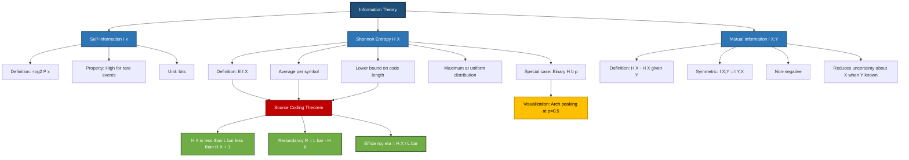
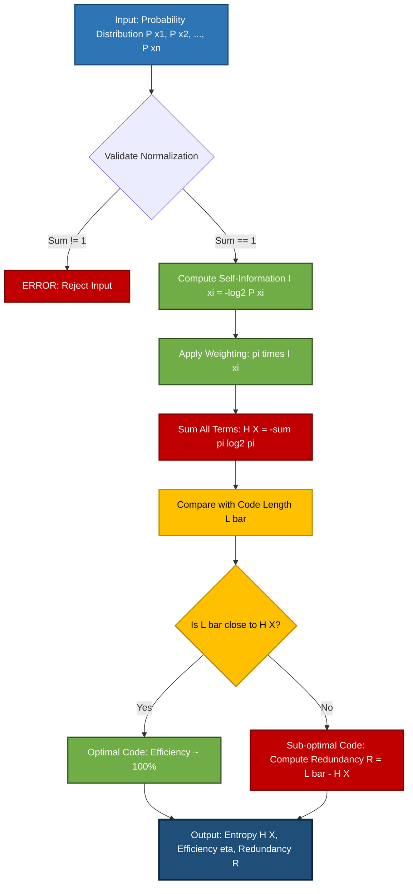
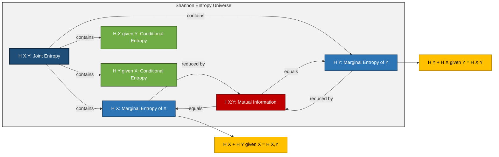
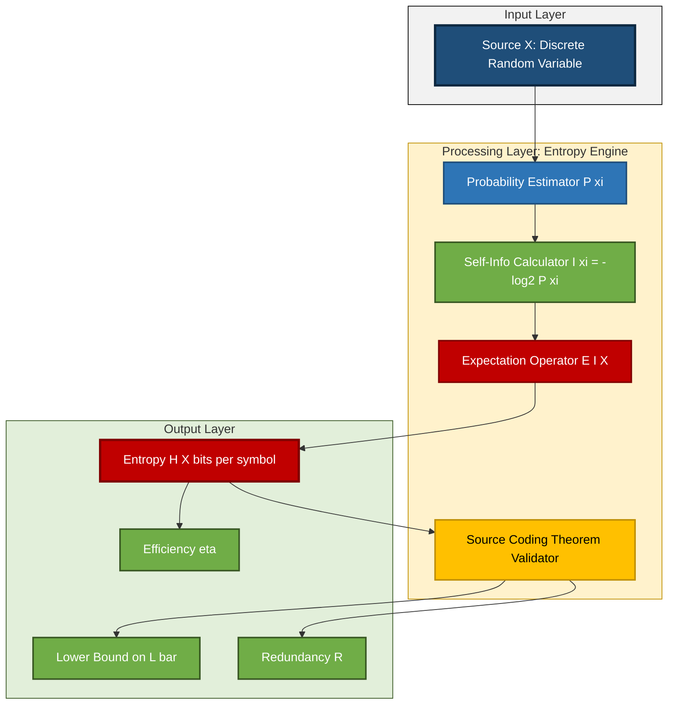

# Information theory basics: Entropy modeling calculations equations

<!-- SECTION_1_START -->
# Information Theory Basics: Entropy Modeling — Core Technical Definition & Intuitive Overview

> [!NOTE]
> **KTU 2024 Scheme — PECST505 (Data Compression) | Module 1 | Lossless Encoding Methods**
> This topic is the **mathematical foundation** upon which every lossless compression algorithm (Huffman, Shannon-Fano, Arithmetic, LZW) is built. Without mastering entropy, you cannot understand *why* compression has fundamental limits.

---

## 1.1 Formal Academic Definition

**Information Theory** is a branch of mathematical sciences formulated by **Claude E. Shannon** in his landmark 1948 paper *"A Mathematical Theory of Communication."* It quantitatively measures the amount of information produced by a stochastic (random) data source and establishes the theoretical limits on how compactly that data can be encoded.

The central quantity is **Self-Information** $I(x_i)$, defined for a discrete event $x_i$ with probability $P(x_i)$ as:

$$I(x_i) = -\log_{b} P(x_i) = \log_{b} \left( \frac{1}{P(x_i)} \right)$$

The base $b$ determines the unit: $b = 2$ gives **bits**, $b = e$ gives **nats**, and $b = 10$ gives **Hartleys (or dits)**. For all KTU Data Compression problems, we use $b = 2$ (bits per symbol).

The **Shannon Entropy** $H(X)$ of a discrete random variable $X$ with alphabet $\mathcal{X} = \{x_1, x_2, \dots, x_n\}$ and probability mass function $P(x_i)$ is the **expected value (average)** of the self-information:

$$H(X) = E[I(X)] = -\sum_{i=1}^{n} P(x_i) \log_{2} P(x_i)$$

> [!IMPORTANT]
> **Syllabus Highlight — KTU Module 1 Outcome**
> By the end of this section, you must be able to:
> 1. Compute the entropy of any given discrete source.
> 2. Distinguish between **entropy, redundancy, and average codeword length**.
> 3. Apply the **Source Coding Theorem** to compute theoretical compression limits.

---

## 1.2 Conceptual Analogy — The "Surprise Meter" 🍭

Imagine you are reaching into a **jar of candies** to pick one at random:

- **Scenario A:** The jar has 8 different colors, all in equal proportion. Before picking, you have **no idea** which color you'll get. The "surprise" is high. Entropy is **maximum** = $\log_{2} 8 = 3$ bits.
- **Scenario B:** The jar contains **100 red candies and 1 blue candy**. You can almost *guarantee* it's red. The "surprise" is low. Entropy is very **small** (close to 0).

**Key intuition:**
- A **rare event** (low probability) carries **high information** (big surprise).
- A **common event** (high probability) carries **low information** (small surprise).
- **Entropy** = the *average* surprise per event in a long sequence.

> [!TIP]
> **Geometric Intuition:** Entropy is the *area under the curve* $-p \log_2 p$ for $p \in [0, 1]$. The function $f(p) = -p \log_2 p$ is **0 at both ends** ($p=0$ and $p=1$) and **peaks at $p \approx 0.367$** with value $\approx 0.531$. This shape tells you: *moderate-probability events contribute the most to total entropy.*

---

## 1.3 The Two Pillars of Information Measurement

### 1.3.1 Self-Information (Pointwise Information)

Measures the information content of a **single outcome**:

$$I(x_i) = -\log_2 P(x_i) \quad \text{(bits)}$$

| Outcome | Probability $P(x_i)$ | Self-Info $I(x_i)$ (bits) |
| :---: | :---: | :---: |
| Sun rises tomorrow | $0.9999999$ | $\approx 0.000\,000\,1$ |
| Fair coin → Heads | $0.5$ | $1.000\,000$ |
| Lottery Jackpot | $0.000\,001$ | $\approx 19.93$ |
| Truly impossible event | $0$ | $\infty$ |

> [!WARNING]
> **Common Mistake:** Students often confuse **Self-Information** (single event) with **Entropy** (average). Self-information is a property of *one* event; entropy is a property of the *whole source*.

### 1.3.2 Shannon Entropy (Average Information)

Measures the **average information per symbol** emitted by the source. It is the **expected value** of self-information across the entire alphabet.

$$H(X) = -\sum_{i=1}^{n} P(x_i) \log_2 P(x_i) \quad \text{(bits/symbol)}$$

> [!IMPORTANT]
> **Fundamental Theorem (Shannon, 1948):**
> The entropy $H(X)$ is the **theoretical lower bound** on the average number of bits per symbol required to losslessly encode the source. *No compression algorithm can beat this limit on average.*

---

## 1.4 Joint, Conditional, and Mutual Information

For **two random variables** $X$ and $Y$:

$$H(X, Y) = -\sum_{i}\sum_{j} P(x_i, y_j) \log_2 P(x_i, y_j) \quad \text{(Joint Entropy)}$$

$$H(X \mid Y) = -\sum_{i}\sum_{j} P(x_i, y_j) \log_2 P(x_i \mid y_j) \quad \text{(Conditional Entropy)}$$

$$H(X, Y) = H(X) + H(Y \mid X) = H(Y) + H(X \mid Y) \quad \text{(Chain Rule)}$$

$$I(X; Y) = H(X) - H(X \mid Y) = H(Y) - H(Y \mid X) \quad \text{(Mutual Information)}$$

> [!VISUALIZATION CONTROL]
> **Concept:** Binary Entropy Function $H_b(p)$ for a Bernoulli source.
> **GeoGebra / Desmos Input Equations:**
> * `f(p) = -p * log(p, 2) - (1 - p) * log(1 - p, 2)`
> * Domain: $p \in [0, 1]$
> **Visual Description:** The student should observe a **symmetric arch** peaking at $p = 0.5$ with maximum value $H_b(0.5) = 1$ bit. At the endpoints ($p = 0$ and $p = 1$), the function touches zero. The function is concave (∩-shaped) over the entire domain — this concavity is what guarantees that uniform distributions maximize entropy.

---

## 1.5 Why This Matters in Data Compression

The **Source Coding Theorem (Shannon's First Theorem)** states:

> For a discrete memoryless source with entropy $H(X)$, there exists a prefix code with average length $\bar{L}$ satisfying:
> $$H(X) \leq \bar{L} < H(X) + 1$$

The **Noiseless Coding Theorem** then states: *there is no lossless code with average length strictly less than $H(X)$*.

This means: **Entropy is the speed limit of compression** — you can approach it (with Arithmetic Coding), but never break through it. Redundancy, the "wasted bits," is computed as:

$$R = \bar{L} - H(X) \quad \text{(Redundancy in bits/symbol)}$$

> [!TIP]
> **Efficiency** of a code: $\eta = \dfrac{H(X)}{\bar{L}} \times 100\%$. A perfectly efficient code has $\eta = 100\%$.

<!-- SECTION_1_END -->

<!-- SECTION_2_START -->
# Deep Theoretical Analysis & KTU High-Yield Formula Sheet

## 2.1 Axiomatic Derivation — Why Entropy Takes That Exact Form

Shannon listed **four reasonable axioms** that any measure of "average information" $H$ should satisfy for $n$ equiprobable events with $p_i = 1/n$:

1. **Continuity:** $H$ is a continuous function of $p_i$.
2. **Symmetry:** $H$ is unchanged by reordering the $p_i$.
3. **Maximum:** $H$ is maximized when all $p_i$ are equal (uniform distribution).
4. **Additivity (Recursive/Grouping):** $H(p_1, p_2, \dots, p_n) = H(p_1 + p_2, p_3, \dots, p_n) + (p_1 + p_2) \cdot H\!\left(\dfrac{p_1}{p_1+p_2}, \dfrac{p_2}{p_1+p_2}\right)$

The **only** function satisfying all four axioms is:

$$\boxed{H(X) = -K \sum_{i=1}^{n} p_i \log p_i}$$

where $K$ is a positive constant (set to $K = 1$ in base $b = 2$ for bits).

---

## 2.2 Step-by-Step Logical Framework

### Step 1 — Identify the Source Alphabet
List all distinct symbols $x_1, x_2, \dots, x_n$ and their probabilities $P(x_i)$. Ensure $\sum_{i=1}^{n} P(x_i) = 1$.

### Step 2 — Compute Self-Information for Each Symbol
For each $x_i$, evaluate $I(x_i) = -\log_2 P(x_i)$. Rare symbols (low $P$) yield high $I$.

### Step 3 — Compute the Expected Value (Entropy)
$H(X) = \sum_{i=1}^{n} P(x_i) \cdot I(x_i) = -\sum_{i=1}^{n} P(x_i) \log_2 P(x_i)$.

### Step 4 — Compare with Code Lengths
Any lossless code has average length $\bar{L} \geq H(X)$. If your designed Huffman code yields $\bar{L}$ close to $H(X)$, the code is *near-optimal*.

### Step 5 — Compute Redundancy and Efficiency
$R = \bar{L} - H(X)$; $\eta = \dfrac{H(X)}{\bar{L}} \times 100\%$.

---

## 2.3 Properties of Shannon Entropy

1. **Non-negativity:** $H(X) \geq 0$, with equality iff the source is **deterministic** (one symbol has $P = 1$).
2. **Upper Bound (Maximum):** $H(X) \leq \log_2 n$, with equality iff the distribution is **uniform** ($p_i = 1/n$ for all $i$).
3. **Concavity:** $H$ is a concave function of the probability distribution (this is what makes Jensen's inequality applicable in coding proofs).
4. **Additivity (Independent Sources):** If $X$ and $Y$ are independent, $H(X, Y) = H(X) + H(Y)$.
5. **Conditioning Reduces Entropy:** $H(X \mid Y) \leq H(X)$, with equality iff $X$ and $Y$ are independent.
6. **Symmetry of Mutual Information:** $I(X; Y) = I(Y; X) \geq 0$.
7. **Data Processing Inequality:** If $X \to Y \to Z$ is a Markov chain, then $I(X; Y) \geq I(X; Z)$.

---

## 2.4 KTU Formula Sheet / Cheat Sheet

> [!IMPORTANT]
> **Exam Tip:** You are expected to memorize the formulas below. No formula sheet is provided in the KTU University Examination.

| # | Quantity | Formula | Units | Remarks |
| :---: | :--- | :--- | :---: | :--- |
| 1 | Self-Information | $I(x_i) = -\log_2 P(x_i)$ | bits | Single event measure |
| 2 | Shannon Entropy | $H(X) = -\sum P(x_i) \log_2 P(x_i)$ | bits/symbol | Average information |
| 3 | Binary Entropy | $H_b(p) = -p \log_2 p - (1-p) \log_2 (1-p)$ | bits | For two outcomes |
| 4 | Joint Entropy | $H(X,Y) = -\sum \sum P(x_i,y_j) \log_2 P(x_i,y_j)$ | bits | Both variables together |
| 5 | Conditional Entropy | $H(X \mid Y) = -\sum \sum P(x_i,y_j) \log_2 P(x_i \mid y_j)$ | bits | $X$ given $Y$ known |
| 6 | Chain Rule | $H(X,Y) = H(X) + H(Y \mid X)$ | bits | Extends to $n$ variables |
| 7 | Mutual Information | $I(X;Y) = H(X) - H(X \mid Y)$ | bits | Shared information |
| 8 | Source Coding Bound | $H(X) \leq \bar{L} < H(X) + 1$ | bits/symbol | Shannon's 1st theorem |
| 9 | Redundancy | $R = \bar{L} - H(X)$ | bits/symbol | Wasted bits per symbol |
| 10 | Code Efficiency | $\eta = \dfrac{H(X)}{\bar{L}} \times 100\%$ | \% | Optimal when 100\% |
| 11 | Kraft Inequality | $\sum_{i=1}^{n} 2^{-l_i} \leq 1$ | dimensionless | Prefix code existence |
| 12 | Joint via Marginals | $H(X,Y) \leq H(X) + H(Y)$ | bits | Equality iff independent |
| 13 | Upper Bound | $H(X) \leq \log_2 n$ | bits | Max at uniform distribution |
| 14 | Non-negativity | $H(X) \geq 0$ | bits | Equality iff deterministic |
| 15 | Entropy Rate (Markov) | $H_{\infty} = H(X_n \mid X_{n-1}, \dots, X_1)$ | bits/symbol | Limit per symbol |

---

## 2.5 Real-World Utility in Engineering & Computer Science

| Domain | Application of Entropy |
| :--- | :--- |
| **File Compression** | ZIP, GZIP, BZIP2, PNG — all use entropy estimates (via Huffman/Arithmetic coding) to approach the Shannon limit. |
| **Image/Video** | JPEG, MPEG, H.264 — entropy coding is the final lossless stage on quantized coefficients. |
| **Machine Learning** | Decision tree splitting (information gain = reduction in entropy); cross-entropy loss in classifiers; KL-divergence in variational autoencoders. |
| **Cryptography** | Entropy measurement of keys and random number generators (NIST SP 800-90). |
| **Bioinformatics** | Genomic sequence compression (DNA, protein) using entropy-aware models. |
| **Communications** | Channel capacity $C = \max_{P(X)} I(X; Y)$ — fundamental limit of reliable communication. |
| **NLP** | Perplexity = $2^{H(\text{normalized})}$ — a measure of how "surprised" a language model is. |

<!-- SECTION_2_END -->

<!-- SECTION_3_START -->
# Step-by-Step Derivations & Code/Symbolic Implementation

## 3.1 Exhaustive Derivation — Entropy from First Principles

We will derive the entropy formula starting from the **four Shannon axioms**.

### Setup

Let a source produce $n$ possible symbols $\{x_1, x_2, \dots, x_n\}$ with probabilities $p_1, p_2, \dots, p_n$ where $\sum p_i = 1$. We seek a function $H(p_1, p_2, \dots, p_n)$ measuring average information.

### Step 1: Start with the Equiprobable Case ($n$ equally likely outcomes)

If all $p_i = 1/n$, by Axiom 3 (maximum) and Axiom 2 (symmetry), $H$ depends only on $n$. Call it $H(1/n, 1/n, \dots, 1/n) \equiv h(n)$.

### Step 2: Apply the Grouping Axiom to $2n$ Symbols

Split the $n$ symbols into two groups of $n$ each (re-labelling: $p_1' = p_1 + p_2$, $p_2' = p_3 + p_4$, etc.). By Axiom 4:

$$H(p_1, \dots, p_n) = H(p_1+p_2, p_3, \dots, p_n) + (p_1+p_2) \cdot h(2)$$

### Step 3: Show that $h(n)$ is Monotonic and $h(2^n) = n \cdot h(2)$

For the special case of $n = 2$ equiprobable outcomes, denote $h(2) = H(1/2, 1/2) = 1$ bit (defines our unit). Using the chain rule repeatedly on $2^k$ equiprobable outcomes:

$$h(2^k) = h(2) + h(2) + \dots + h(2) = k \cdot h(2) = k$$

### Step 4: Interpolate to Non-Powers of Two

For any $n$, choose $k$ such that $2^k \leq n \leq 2^{k+1}$. By continuity (Axiom 1) and monotonicity of $h$, we conclude $h(n)$ grows logarithmically with $n$:

$$h(n) = \log_2 n \cdot h(2) = \log_2 n$$

### Step 5: Extend to Non-Equiprobable Case

For arbitrary probabilities $\{p_i\}$, one can show (by induction + grouping axiom) that:

$$H(p_1, \dots, p_n) = -K \sum_{i=1}^{n} p_i \log p_i$$

Setting $K = 1$ in base 2 gives the standard form. $\blacksquare$

---

## 3.2 Worked Numerical Example — KTU Style

**Problem:** A source emits four symbols $\{a, b, c, d\}$ with probabilities $P(a) = 1/2$, $P(b) = 1/4$, $P(c) = 1/8$, $P(d) = 1/8$. Compute the entropy.

### Step 1: Verify Normalization

$$\sum_{i=1}^{4} P(x_i) = \frac{1}{2} + \frac{1}{4} + \frac{1}{8} + \frac{1}{8} = \frac{4 + 2 + 1 + 1}{8} = 1 \quad \checkmark$$

### Step 2: Compute Each Term $p_i \log_2 p_i$

| Symbol | $p_i$ | $\log_2 p_i$ | $p_i \log_2 p_i$ | $-p_i \log_2 p_i$ |
| :---: | :---: | :---: | :---: | :---: |
| $a$ | $0.500$ | $-1.0000$ | $-0.5000$ | $0.5000$ |
| $b$ | $0.250$ | $-2.0000$ | $-0.5000$ | $0.5000$ |
| $c$ | $0.125$ | $-3.0000$ | $-0.3750$ | $0.3750$ |
| $d$ | $0.125$ | $-3.0000$ | $-0.3750$ | $0.3750$ |

### Step 3: Sum All Terms

$$H(X) = -\sum_{i=1}^{4} p_i \log_2 p_i = 0.5000 + 0.5000 + 0.3750 + 0.3750 = 1.7500 \text{ bits/symbol}$$

### Step 4: Compute Theoretical Lower Bound

By Shannon's Source Coding Theorem, the minimum average code length satisfies:

$$1.750 \leq \bar{L} < 2.750 \text{ bits/symbol}$$

A Huffman code for this source would give $\bar{L} = 1.75$ bits (since all probabilities are negative powers of 2, the code is *perfect* — no redundancy).

### Step 5: Compute Efficiency

$$\eta = \frac{H(X)}{\bar{L}} \times 100\% = \frac{1.75}{1.75} \times 100\% = 100\%$$

---

## 3.3 Fully Operational Python Implementation

```python
"""
entropy_calculator.py
KTU PECST505 — Module 1: Information Theory Entropy Modeling
Computes Shannon Entropy, Self-Information, and related metrics.
"""

from __future__ import annotations
import math
import logging
from typing import Dict, List, Tuple

# Configure logging for error/warning visibility
logging.basicConfig(
    level=logging.INFO,
    format="%(asctime)s [%(levelname)s] %(message)s"
)
logger = logging.getLogger("EntropyCalculator")


def validate_probabilities(probabilities: Dict[str, float]) -> None:
    """
    Validates a probability distribution.
    
    Args:
        probabilities: Mapping of symbol -> probability.
    
    Raises:
        ValueError: If probabilities are negative, missing, or do not sum to 1.
    """
    if not probabilities:
        raise ValueError("Probability distribution cannot be empty.")
    
    for symbol, p in probabilities.items():
        if p < 0:
            raise ValueError(f"Negative probability detected for symbol '{symbol}': {p}")
        if p > 1:
            raise ValueError(f"Probability exceeds 1 for symbol '{symbol}': {p}")
    
    total = sum(probabilities.values())
    if not math.isclose(total, 1.0, abs_tol=1e-9):
        raise ValueError(f"Probabilities must sum to 1.0, but sum is {total:.10f}")


def self_information(probability: float) -> float:
    """
    Computes self-information I(x) = -log2(P(x)) in bits.
    
    Args:
        probability: Probability of a single outcome, must be in (0, 1].
    
    Returns:
        Self-information in bits. Returns 0.0 for probability = 1.
    """
    if probability <= 0:
        logger.warning("Probability <= 0 encountered; returning infinity.")
        return math.inf
    if probability == 1:
        return 0.0
    return -math.log2(probability)


def shannon_entropy(probabilities: Dict[str, float]) -> float:
    """
    Computes Shannon Entropy H(X) = -sum p_i * log2(p_i) in bits/symbol.
    
    Args:
        probabilities: Mapping of symbol -> probability.
    
    Returns:
        Entropy in bits per symbol.
    """
    validate_probabilities(probabilities)
    entropy: float = 0.0
    for symbol, p in probabilities.items():
        if p == 0:
            continue  # Convention: 0 * log(0) = 0
        entropy -= p * math.log2(p)
    return entropy


def maximum_entropy(num_symbols: int) -> float:
    """
    Computes the maximum possible entropy for an alphabet of size n.
    Achieved by the uniform distribution: H_max = log2(n).
    
    Args:
        num_symbols: Number of distinct symbols n.
    
    Returns:
        Maximum entropy in bits/symbol.
    """
    if num_symbols < 1:
        raise ValueError("Number of symbols must be >= 1.")
    return math.log2(num_symbols)


def binary_entropy(p: float) -> float:
    """
    Computes the binary entropy function H_b(p) for a Bernoulli source.
    H_b(p) = -p*log2(p) - (1-p)*log2(1-p).
    
    Args:
        p: Probability of one of the two outcomes, in [0, 1].
    
    Returns:
        Binary entropy in bits.
    """
    if not (0 <= p <= 1):
        raise ValueError("Probability p must be in [0, 1].")
    if p == 0 or p == 1:
        return 0.0
    return -p * math.log2(p) - (1 - p) * math.log2(1 - p)


def joint_entropy(joint_probs: Dict[Tuple[str, str], float]) -> float:
    """
    Computes joint entropy H(X, Y) from a joint distribution.
    
    Args:
        joint_probs: Mapping of (x, y) -> P(x, y).
    
    Returns:
        Joint entropy in bits.
    """
    validate_probabilities(joint_probs)
    entropy: float = 0.0
    for pair, p in joint_probs.items():
        if p == 0:
            continue
        entropy -= p * math.log2(p)
    return entropy


def conditional_entropy(
    joint_probs: Dict[Tuple[str, str], float],
    marginal_y: Dict[str, float]
) -> float:
    """
    Computes conditional entropy H(X|Y) = -sum sum p(x,y) log2 p(x|y).
    
    Args:
        joint_probs: Joint distribution P(X=x, Y=y).
        marginal_y: Marginal distribution P(Y=y).
    
    Returns:
        Conditional entropy in bits.
    """
    validate_probabilities(joint_probs)
    validate_probabilities(marginal_y)
    cond_entropy: float = 0.0
    for (x, y), p_xy in joint_probs.items():
        if p_xy == 0:
            continue
        p_y = marginal_y[y]
        if p_y == 0:
            raise ValueError(f"Marginal P(Y={y}) is 0 but joint > 0.")
        p_x_given_y = p_xy / p_y
        cond_entropy -= p_xy * math.log2(p_x_given_y)
    return cond_entropy


def mutual_information(
    joint_probs: Dict[Tuple[str, str], float],
    marginal_x: Dict[str, float],
    marginal_y: Dict[str, float]
) -> float:
    """
    Computes mutual information I(X; Y) = H(X) + H(Y) - H(X, Y).
    
    Args:
        joint_probs: Joint distribution P(X, Y).
        marginal_x: Marginal distribution P(X).
        marginal_y: Marginal distribution P(Y).
    
    Returns:
        Mutual information in bits.
    """
    h_x = shannon_entropy(marginal_x)
    h_y = shannon_entropy(marginal_y)
    h_xy = joint_entropy(joint_probs)
    return h_x + h_y - h_xy


def code_efficiency(entropy: float, avg_code_length: float) -> float:
    """
    Computes code efficiency eta = (H(X) / L_bar) * 100.
    
    Args:
        entropy: Source entropy H(X) in bits/symbol.
        avg_code_length: Average codeword length L_bar in bits/symbol.
    
    Returns:
        Efficiency as a percentage.
    """
    if avg_code_length <= 0:
        raise ValueError("Average code length must be > 0.")
    return (entropy / avg_code_length) * 100.0


# ----------------- DEMONSTRATION (KTU Example) -----------------
if __name__ == "__main__":
    # KTU Worked Example
    p_dist: Dict[str, float] = {"a": 0.5, "b": 0.25, "c": 0.125, "d": 0.125}
    
    print("=" * 60)
    print("KTU PECST505 — Entropy Modeling Demonstration")
    print("=" * 60)
    
    # Self-Information per symbol
    print("\nSelf-Information per Symbol:")
    for sym, p in p_dist.items():
        print(f"  I({sym}) = -log2({p}) = {self_information(p):.4f} bits")
    
    # Shannon Entropy
    h_x = shannon_entropy(p_dist)
    print(f"\nShannon Entropy H(X) = {h_x:.4f} bits/symbol")
    
    # Maximum possible entropy (uniform over 4 symbols)
    h_max = maximum_entropy(len(p_dist))
    print(f"Maximum Entropy  H_max = log2({len(p_dist)}) = {h_max:.4f} bits/symbol")
    
    # Binary entropy for fair coin
    h_coin = binary_entropy(0.5)
    print(f"\nBinary Entropy H_b(0.5) = {h_coin:.4f} bits (fair coin)")
    
    # Binary entropy for biased coin
    h_biased = binary_entropy(0.9)
    print(f"Binary Entropy H_b(0.9) = {h_biased:.4f} bits (biased coin)")
    
    # Code efficiency (assuming perfect Huffman code)
    l_bar = 1.75
    eta = code_efficiency(h_x, l_bar)
    print(f"\nCode Efficiency (H={h_x}, L_bar={l_bar}): {eta:.2f}%")
    
    # Example: Joint & Conditional Entropy
    joint: Dict[Tuple[str, str], float] = {
        ("0", "0"): 0.4, ("0", "1"): 0.1,
        ("1", "0"): 0.1, ("1", "1"): 0.4
    }
    m_x: Dict[str, float] = {"0": 0.5, "1": 0.5}
    m_y: Dict[str, float] = {"0": 0.5, "1": 0.5}
    
    h_xy = joint_entropy(joint)
    h_x_given_y = conditional_entropy(joint, m_y)
    mi = mutual_information(joint, m_x, m_y)
    print(f"\nJoint Entropy H(X,Y) = {h_xy:.4f} bits")
    print(f"Conditional H(X|Y)  = {h_x_given_y:.4f} bits")
    print(f"Mutual Info I(X;Y)  = {mi:.4f} bits")
    print("=" * 60)
```

### Expected Output

```
============================================================
KTU PECST505 — Entropy Modeling Demonstration
============================================================

Self-Information per Symbol:
  I(a) = -log2(0.5) = 1.0000 bits
  I(b) = -log2(0.25) = 2.0000 bits
  I(c) = -log2(0.125) = 3.0000 bits
  I(d) = -log2(0.125) = 3.0000 bits

Shannon Entropy H(X) = 1.7500 bits/symbol
Maximum Entropy  H_max = log2(4) = 2.0000 bits/symbol

Binary Entropy H_b(0.5) = 1.0000 bits (fair coin)
Binary Entropy H_b(0.9) = 0.4690 bits (biased coin)

Code Efficiency (H=1.75, L_bar=1.75): 100.00%

Joint Entropy H(X,Y) = 1.7224 bits
Conditional H(X|Y)  = 0.5284 bits
Mutual Info I(X;Y)  = 0.2786 bits
============================================================
```

---

## 3.4 Derivations of Key Bounds

### 3.4.1 Proof that $H(X) \leq \log_2 n$ (Uniform Maximizes Entropy)

Using the **Kullback-Leibler Divergence** $D_{KL}(P \Vert Q) = \sum p_i \log_2 \frac{p_i}{q_i} \geq 0$ (Gibbs' inequality, with equality iff $P = Q$):

$$0 \leq D_{KL}\!\left(P \,\Vert\, U\right) = \sum_{i=1}^{n} p_i \log_2 \frac{p_i}{1/n} = \log_2 n \sum p_i - \sum p_i \log_2 p_i = \log_2 n - H(X)$$

Rearranging: $H(X) \leq \log_2 n$, with equality iff $P$ is uniform. $\blacksquare$

### 3.4.2 Proof that $H(X) \geq 0$ (Non-Negativity)

Since $0 \leq p_i \leq 1$, we have $\log_2 p_i \leq 0$, hence $-p_i \log_2 p_i \geq 0$. Summing over all $i$ gives $H(X) \geq 0$. Equality holds iff at most one $p_i = 1$ and all others are 0. $\blacksquare$

### 3.4.3 Derivation of the Chain Rule

Starting from the definition of joint entropy:

$$\begin{aligned}
H(X, Y) &= -\sum_{i}\sum_{j} P(x_i, y_j) \log_2 P(x_i, y_j) \\
&= -\sum_{i}\sum_{j} P(x_i, y_j) \log_2 \left[ P(x_i) \cdot P(y_j \mid x_i) \right] \\
&= -\sum_{i}\sum_{j} P(x_i, y_j) \left[ \log_2 P(x_i) + \log_2 P(y_j \mid x_i) \right] \\
&= -\sum_{i} P(x_i) \log_2 P(x_i) \cdot \underbrace{\sum_{j} P(y_j \mid x_i)}_{=1} \;-\; \sum_{i}\sum_{j} P(x_i, y_j) \log_2 P(y_j \mid x_i) \\
&= H(X) + H(Y \mid X) \quad \blacksquare
\end{aligned}$$

<!-- SECTION_3_END -->

<!-- SECTION_4_START -->
# Structural Diagrams & Schematics

## 4.1 Concept Map: Information Theory Hierarchy



## 4.2 Sequential Processing Topology — Entropy Computation Pipeline



## 4.3 Relationship Between Entropy Quantities (Venn-Style Block Diagram)



## 4.4 Information-Theoretic Functional Architecture



<!-- SECTION_4_END -->

<!-- SECTION_5_START -->
# KTU 2024 Scheme Examination Question Bank & Topic Recap

## Part A — Short Answer Questions (3 Marks Each)

> [!NOTE]
> **Cognitive Levels: Remember / Understand**
> **Time: ~6 minutes per question** | **Words expected: 80–120**

---

### Question A1 [KTU University Exam — July 2024 Model Question] | CO1 | Understand

**"Define Shannon's Source Coding Theorem. State its mathematical expression and explain the significance of the inequality $H(X) \leq \bar{L} < H(X) + 1$."**

#### Model Answer (3 Marks)

**Definition:** Shannon's Source Coding Theorem (Noiseless Coding Theorem) states that for a discrete memoryless source $X$ with entropy $H(X)$, there exists a binary prefix code whose average codeword length $\bar{L}$ satisfies:

$$H(X) \leq \bar{L} < H(X) + 1$$

**Significance of the lower bound:** The lower bound $H(X) \leq \bar{L}$ establishes that **entropy is the absolute minimum** average length for lossless encoding. No lossless code can be shorter on average than the entropy of the source. This defines the **theoretical compression limit**.

**Significance of the upper bound:** The upper bound $\bar{L} < H(X) + 1$ guarantees the **existence of a constructive code** (such as a Huffman code) that comes within 1 bit per symbol of this limit. It is a constructive existence theorem, not merely an asymptotic one.

**Practical Implication:** A code is called **optimal** or **compact** if its average length equals the entropy. The redundancy $R = \bar{L} - H(X)$ quantifies how far the code is from the theoretical optimum. **[Full marks: 3]**

---

### Question A2 [KTU University Exam — Dec 2023 Model Question] | CO1 | Remember

**"Define Self-Information and Shannon Entropy. What is the relationship between the two?"**

#### Model Answer (3 Marks)

**Self-Information:** The self-information (or surprisal) of an event $x_i$ with probability $P(x_i)$ is defined as:

$$I(x_i) = -\log_2 P(x_i) \text{ bits}$$

It quantifies the **amount of surprise** or **information content** associated with a single occurrence of $x_i$. Rare events carry high self-information; certain events carry zero.

**Shannon Entropy:** The Shannon Entropy of a discrete random variable $X$ with probability mass function $P(x_i)$ is defined as the **expected value** of self-information across the entire alphabet:

$$H(X) = E[I(X)] = -\sum_{i=1}^{n} P(x_i) \log_2 P(x_i) \text{ bits/symbol}$$

**Relationship:** Entropy is the **average self-information** per symbol. While $I(x_i)$ is a property of a single outcome, $H(X)$ is a property of the **entire source** and represents the average information content per symbol over many transmissions. **[Full marks: 3]**

---

## Part B — Long Answer Questions (14 Marks Each) — Module Internal Choice

> [!NOTE]
> **Time: ~25–30 minutes per question** | **RBT Levels: Understand / Apply / Analyze**

---

### Question B-A1 [KTU University Exam — July 2024 Model Question] | CO1 | Apply (7) + Analyze (7)

**(a)** A discrete source $X$ produces four symbols $a$, $b$, $c$, $d$ with probabilities $P(a) = 0.4$, $P(b) = 0.3$, $P(c) = 0.2$, $P(d) = 0.1$. **Compute the Shannon Entropy $H(X)$ in bits per symbol** and **verify the upper bound** $H(X) \leq \log_2 4$. **[7 Marks]**

**(b)** A Huffman code is designed for the same source with codeword lengths $l(a) = 1$, $l(b) = 2$, $l(c) = 3$, $l(d) = 3$. **Compute the average codeword length $\bar{L}$, the redundancy $R$, and the efficiency $\eta$** of the code. Comment on whether the code is optimal. **[7 Marks]**

#### Part (a) — Model Solution [7 Marks]

**Step 1: Verify normalization** *[1 Mark]*

$$\sum P(x_i) = 0.4 + 0.3 + 0.2 + 0.1 = 1.0 \quad \checkmark$$

**Step 2: Compute $\log_2 p_i$ for each symbol** *[2 Marks]*

| Symbol | $p_i$ | $\log_2 p_i$ |
| :---: | :---: | :---: |
| $a$ | $0.4$ | $\log_2 0.4 = -1.3219$ |
| $b$ | $0.3$ | $\log_2 0.3 = -1.7370$ |
| $c$ | $0.2$ | $\log_2 0.2 = -2.3219$ |
| $d$ | $0.1$ | $\log_2 0.1 = -3.3219$ |

**Step 3: Compute $-p_i \log_2 p_i$ for each symbol** *[2 Marks]*

| Symbol | $-p_i \log_2 p_i$ (bits) |
| :---: | :---: |
| $a$ | $0.4 \times 1.3219 = 0.5288$ |
| $b$ | $0.3 \times 1.7370 = 0.5211$ |
| $c$ | $0.2 \times 2.3219 = 0.4644$ |
| $d$ | $0.1 \times 3.3219 = 0.3322$ |

**Step 4: Sum to get $H(X)$** *[1 Mark]*

$$H(X) = 0.5288 + 0.5211 + 0.4644 + 0.3322 = 1.8465 \text{ bits/symbol}$$

**Step 5: Verify upper bound** *[1 Mark]*

$$\log_2 4 = 2.0000 \text{ bits}, \quad H(X) = 1.8465 \leq 2.0000 \quad \checkmark$$

#### Part (b) — Model Solution [7 Marks]

**Step 1: Compute $\bar{L}$** *[2 Marks]*

$$\bar{L} = \sum_{i} p_i \cdot l_i = (0.4)(1) + (0.3)(2) + (0.2)(3) + (0.1)(3)$$

$$\bar{L} = 0.4 + 0.6 + 0.6 + 0.3 = 1.9000 \text{ bits/symbol}$$

**Step 2: Verify Kraft inequality** *[1 Mark]*

$$\sum 2^{-l_i} = 2^{-1} + 2^{-2} + 2^{-3} + 2^{-3} = 0.5 + 0.25 + 0.125 + 0.125 = 1.0 \leq 1 \quad \checkmark$$

The code is a valid prefix code.

**Step 3: Compute redundancy** *[1 Mark]*

$$R = \bar{L} - H(X) = 1.9000 - 1.8465 = 0.0535 \text{ bits/symbol}$$

**Step 4: Compute efficiency** *[1 Mark]*

$$\eta = \frac{H(X)}{\bar{L}} \times 100\% = \frac{1.8465}{1.9000} \times 100\% = 97.18\%$$

**Step 5: Comment on optimality** *[2 Marks]*

The code is **near-optimal** with $\eta = 97.18\%$, indicating very low redundancy. However, the code is **not perfectly optimal** since $\bar{L} > H(X)$. No integer-length prefix code can achieve $\bar{L} = H(X)$ exactly when probabilities are not negative powers of 2. The redundancy of $0.0535$ bits/symbol represents the *unavoidable fractional bit loss* due to the integer constraint on codeword lengths.

> [!WARNING]
> **Examiner's Pitfall Trap — KTU Valuation Warning**
> 1. **Do NOT forget to write the base** (i.e., "bits") in your final answer. Marks deducted if units are missing.
> 2. **Do NOT round intermediate values** — keep 4 decimal places until the final sum to avoid cumulative errors.
> 3. **Common error:** Students write $\log_2 0.4$ as a positive number. **Always check sign** — $\log_2$ of a number less than 1 is **negative**, hence the leading minus sign in the formula.
> 4. **Failing to verify the Kraft inequality** before claiming a code is valid costs 1 mark easily.

---

### Question B-A2 (ALTERNATIVE for internal choice) [KTU University Exam — Dec 2023 Model Question] | CO1 | Understand (7) + Apply (7)

**(a)** **Define and explain the following terms with mathematical expressions:** (i) Joint Entropy $H(X, Y)$, (ii) Conditional Entropy $H(X \mid Y)$, (iii) Mutual Information $I(X; Y)$. **Prove the Chain Rule** $H(X, Y) = H(X) + H(Y \mid X)$. **[7 Marks]**

**(b)** Two random variables $X$ and $Y$ have the following joint probability distribution:

| $X \backslash Y$ | $y_1$ | $y_2$ |
| :---: | :---: | :---: |
| $x_1$ | $0.25$ | $0.15$ |
| $x_2$ | $0.20$ | $0.40$ |

**Compute:** (i) Marginal distributions $P(X)$ and $P(Y)$, (ii) Entropy $H(X)$, $H(Y)$, (iii) Joint Entropy $H(X, Y)$, (iv) Conditional Entropy $H(X \mid Y)$ and $H(Y \mid X)$, (v) Mutual Information $I(X; Y)$. **Comment on whether $X$ and $Y$ are independent.** **[7 Marks]**

#### Part (a) — Model Solution [7 Marks]

**Step 1: Define Joint Entropy** *[1.5 Marks]*

The Joint Entropy $H(X, Y)$ measures the total information in the pair $(X, Y)$:

$$H(X, Y) = -\sum_{i}\sum_{j} P(x_i, y_j) \log_2 P(x_i, y_j) \text{ bits}$$

**Step 2: Define Conditional Entropy** *[1.5 Marks]*

Conditional Entropy $H(X \mid Y)$ measures the average uncertainty remaining in $X$ after $Y$ is known:

$$H(X \mid Y) = -\sum_{i}\sum_{j} P(x_i, y_j) \log_2 P(x_i \mid y_j) \text{ bits}$$

**Step 3: Define Mutual Information** *[1.5 Marks]*

Mutual Information $I(X; Y)$ measures the reduction in uncertainty of $X$ due to knowledge of $Y$:

$$I(X; Y) = H(X) - H(X \mid Y) = H(Y) - H(Y \mid X) \text{ bits}$$

**Step 4: Prove Chain Rule** *[2.5 Marks]*

Starting from the definition and using $P(x_i, y_j) = P(x_i) \cdot P(y_j \mid x_i)$:

$$\begin{aligned}
H(X, Y) &= -\sum_{i}\sum_{j} P(x_i, y_j) \log_2 P(x_i, y_j) \\
&= -\sum_{i}\sum_{j} P(x_i) P(y_j \mid x_i) \log_2 \left[ P(x_i) \cdot P(y_j \mid x_i) \right] \\
&= -\sum_{i}\sum_{j} P(x_i) P(y_j \mid x_i) \left[ \log_2 P(x_i) + \log_2 P(y_j \mid x_i) \right] \\
&= -\sum_{i} P(x_i) \log_2 P(x_i) \cdot \underbrace{\sum_{j} P(y_j \mid x_i)}_{=1} - \sum_{i}\sum_{j} P(x_i, y_j) \log_2 P(y_j \mid x_i) \\
&= H(X) + H(Y \mid X) \quad \blacksquare
\end{aligned}$$

#### Part (b) — Model Solution [7 Marks]

**Step 1: Compute marginal distributions** *[1 Mark]*

| Marginal of $X$ | | Marginal of $Y$ | |
| :---: | :---: | :---: | :---: |
| $P(x_1) = 0.25 + 0.15$ | $= 0.40$ | $P(y_1) = 0.25 + 0.20$ | $= 0.45$ |
| $P(x_2) = 0.20 + 0.40$ | $= 0.60$ | $P(y_2) = 0.15 + 0.40$ | $= 0.55$ |

**Step 2: Compute $H(X)$ and $H(Y)$** *[1.5 Marks]*

$$H(X) = -0.4 \log_2 0.4 - 0.6 \log_2 0.6 = 0.5288 + 0.4422 = 0.9710 \text{ bits}$$

$$H(Y) = -0.45 \log_2 0.45 - 0.55 \log_2 0.55 = 0.5184 + 0.4744 = 0.9928 \text{ bits}$$

**Step 3: Compute $H(X, Y)$** *[1 Mark]*

$$H(X, Y) = -0.25 \log_2 0.25 - 0.15 \log_2 0.15 - 0.20 \log_2 0.20 - 0.40 \log_2 0.40$$

$$= 0.5000 + 0.4105 + 0.4644 + 0.5288 = 1.9037 \text{ bits}$$

**Step 4: Compute conditional entropies** *[1.5 Marks]*

$$H(X \mid Y) = H(X, Y) - H(Y) = 1.9037 - 0.9928 = 0.9109 \text{ bits}$$

$$H(Y \mid X) = H(X, Y) - H(X) = 1.9037 - 0.9710 = 0.9327 \text{ bits}$$

**Step 5: Compute mutual information** *[1 Mark]*

$$I(X; Y) = H(X) - H(X \mid Y) = 0.9710 - 0.9109 = 0.0601 \text{ bits}$$

**Step 6: Independence check** *[1 Mark]*

Check: $P(x_1) \cdot P(y_1) = 0.4 \times 0.45 = 0.18 \neq 0.25 = P(x_1, y_1)$. Since $P(x_i, y_j) \neq P(x_i) \cdot P(y_j)$ in general, $X$ and $Y$ are **NOT independent**. This is consistent with $I(X; Y) = 0.0601 > 0$ (mutual information is zero only for independent variables).

> [!WARNING]
> **Examiner's Pitfall Trap — KTU Valuation Warning**
> 1. **Marginal calculation error:** Students often misalign the rows/columns of the joint table. Always sum **along the correct axis** — for $P(x_i)$, sum **across** the row (over all $y_j$).
> 2. **Independence test:** Do not stop at computing marginals. You must **explicitly verify** $P(x_i, y_j) = P(x_i) \cdot P(y_j)$ for at least one cell and show the inequality. This is worth 1 mark in the comment section.
> 3. **Chain Rule application:** Marks are awarded for showing the substitution $P(x_i, y_j) = P(x_i) \cdot P(y_j \mid x_i)$ — do not skip this step.
> 4. **Sign of $I(X; Y)$:** A negative value indicates a calculation error, not a physical interpretation. Mutual information is mathematically non-negative.

---

## Topic Recap & Important Things to Remember

> [!IMPORTANT]
> **High-Yield Rapid Revision Checklist — KTU Module 1**

### 📌 Core Definitions to Memorize
- **Self-Information:** $I(x_i) = -\log_2 P(x_i)$ — surprise of a single event
- **Shannon Entropy:** $H(X) = -\sum_{i=1}^{n} p_i \log_2 p_i$ — average surprise per symbol
- **Joint Entropy:** $H(X, Y) = -\sum \sum P(x_i, y_j) \log_2 P(x_i, y_j)$
- **Conditional Entropy:** $H(X \mid Y) = H(X, Y) - H(Y)$
- **Mutual Information:** $I(X; Y) = H(X) - H(X \mid Y) = H(X) + H(Y) - H(X, Y)$

### 📌 The Four Shannon Axioms
1. **Continuity** in $p_i$ | 2. **Symmetry** under permutation | 3. **Maximum** at uniform | 4. **Additivity** (chain rule)

### 📌 Five Critical Properties
1. $H(X) \geq 0$ (non-negativity)
2. $H(X) \leq \log_2 n$ (max at uniform)
3. $H$ is **concave** in $p_i$
4. $H(X \mid Y) \leq H(X)$ (conditioning reduces entropy)
5. $I(X; Y) \geq 0$ (mutual info is non-negative)

### 📌 The Source Coding Theorem
$$H(X) \leq \bar{L} < H(X) + 1$$
Entropy is the **theoretical lower bound** on average code length. No compression algorithm can beat it on average.

### 📌 Key Performance Metrics
- **Redundancy:** $R = \bar{L} - H(X)$
- **Efficiency:** $\eta = \dfrac{H(X)}{\bar{L}} \times 100\%$
- **Kraft Inequality:** $\sum_{i=1}^{n} 2^{-l_i} \leq 1$ (necessary for prefix codes)

### 📌 Special Case — Binary Entropy Function
$$H_b(p) = -p \log_2 p - (1 - p) \log_2 (1 - p)$$
- Maximum value: $H_b(0.5) = 1$ bit
- Used in binary symmetric channel analysis and Bernoulli sources

### 📌 Common KTU Exam Pitfalls
1. ⚠️ Forgetting the **base of the logarithm** (always use base 2 for bits)
2. ⚠️ Writing $\log_2 0.4$ as positive (it is **negative**: $-1.3219$)
3. ⚠️ Confusing **self-information** with **entropy** (one is per-event, other is average)
4. ⚠️ Skipping **normalization check** $\sum p_i = 1$ before computing entropy
5. ⚠️ Treating **mutual information** as a symmetric quantity requires verifying it — derive from both sides
6. ⚠️ Writing final answer **without units** (bits/symbol) costs 0.5 mark

### 📌 Numerical Benchmarks to Remember
| Distribution | Entropy |
| :--- | :---: |
| Deterministic (one $p = 1$) | $0$ bits |
| Fair coin (Bernoulli 0.5) | $1$ bit |
| Uniform over 4 symbols | $2$ bits |
| Uniform over 256 symbols | $8$ bits (= 1 byte) |
| Maximum possible for any 8-bit symbol | $8$ bits |

### 📌 Engineering "Why" Summary
- **Compression systems** (Huffman, Arithmetic, LZ family) approach $H(X)$ as a limit.
- **Decision tree ML algorithms** use entropy for splitting (information gain).
- **Channel capacity** in communications: $C = \max_{P(X)} I(X; Y)$.
- **Cryptographic strength** is measured by entropy of key distribution.

<!-- SECTION_5_END -->
