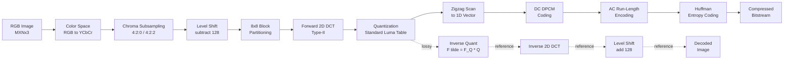
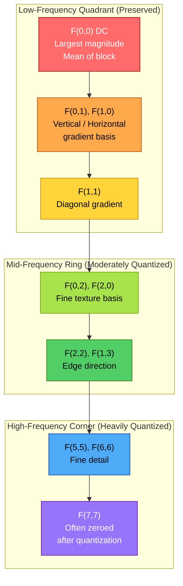
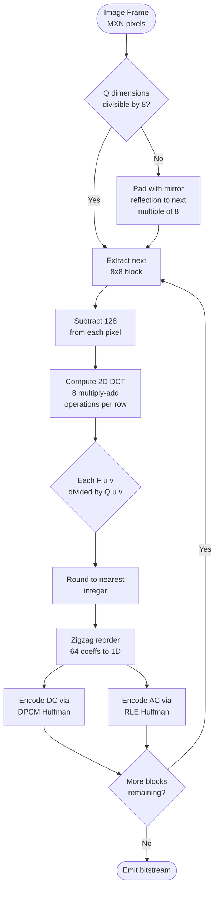
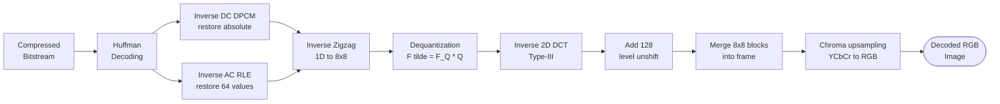

# Transform coding configurations: Discrete Cosine Transform (DCT) engineering rules inside JPEG standard layouts

<!-- SECTION_1_START -->

# Transform Coding & JPEG DCT: The Engine of Modern Image Compression

## 1.1 Transform Coding — Core Definition

**Transform Coding** is a lossy compression strategy that operates by converting image data from the **spatial domain** (raw pixel intensities) into a **frequency domain** representation (a sum of weighted basis functions), where the signal energy becomes highly concentrated into a small number of significant coefficients. These dominant coefficients are preserved with high fidelity, while perceptually insignificant high-frequency components are aggressively discarded or coarsely quantized.

> [!IMPORTANT]
> **KTU 2024 Syllabus Definition (PECST505 — Module 2):**
> Transform coding is a class of lossy compression techniques that applies a *linear, unitary, energy-preserving* transform (e.g., DCT, DFT, WHT, KLT) to blocks of source samples. The transform decorrelates the input, packs the energy into few transform coefficients, and allows bit allocation to be governed by a perceptual weighting (e.g., human visual system sensitivity to spatial frequency).

### 1.2 Intuitive Analogy — Why Transform Coding Works

Imagine a **musical orchestra performance** captured by a single microphone. The raw audio waveform is a chaotic tangle of overlapping violin, flute, and drum signals. You cannot easily edit the violins out. Now imagine instead a **piano-roll representation** (sheet music): the violin's frequencies are written in one staff, flutes in another, drums in another. The same information, but now *each instrument is isolated into its own frequency band*.

A **spatial pixel grid** behaves like the raw microphone signal — neighboring pixels are correlated (smooth gradients, edges, textures). A **DCT transform** acts like the piano roll — it re-represents the 8×8 pixel block as 64 weighted cosine basis patterns. Smooth regions collapse to a few strong low-frequency coefficients; high-frequency details become small numbers that we can cheaply delete.

> [!NOTE]
> **Key Insight for KTU Exams:** Transform coding is *lossless* at the transform stage itself (the DCT is perfectly invertible). The actual *loss* is introduced in the **quantization** stage, which follows the transform. This is the most common point of confusion in board questions.

### 1.3 The JPEG Standard — Definition

**JPEG (Joint Photographic Experts Group)** is the ISO/IEC 10918 standard ratified in 1992. It specifies a *baseline sequential codec* built on the **8×8 block Discrete Cosine Transform (DCT)**, followed by uniform scalar quantization, zigzag entropy scanning, and Huffman entropy coding. JPEG is the **single most deployed lossy image codec on Earth**, present in every digital camera, smartphone, and web browser.

> [!IMPORTANT]
> **JPEG Engineering Mantra (memorize for KTU):**
> 1. Convert color → split into 8×8 blocks
> 2. Apply Forward 2D-DCT
> 3. **Quantize** (this is where the loss happens)
> 4. Zigzag scan + Entropy code
> The DCT itself is *information preserving*; quantization is *information destroying*.

### 1.4 Why DCT Over DFT? — The Energy Packing Argument

JPEG chose DCT over DFT for three engineering reasons that *frequently* appear in KTU viva questions:

| Property | DCT (Type-II) | DFT |
|---|---|---|
| Real-valued output | **Yes** (no complex arithmetic) | No (complex) |
| Boundary handling | Symmetric extension (no leakage) | Periodic extension (Gibbs) |
| Energy compaction (Karhunen–Loève ratio) | **~99 %** in 10 coeffs for natural images | ~95 % |
| Computational cost | Fast 8×8 in ~22 multiplies | Needs FFT machinery |

> [!VISUALIZATION CONTROL]
> **Concept:** Visual comparison of a 1D step edge under DFT (Gibbs ringing) vs. DCT (no ringing).
> **Conceptual Math:**
> * Step signal $x_n = 1$ for $n=0..3$ and $x_n = 0$ for $n=4..7$
> * Reconstruct via $X_k = \alpha_k \sum_n x_n \cos\left[\frac{(2n+1)k\pi}{2N}\right]$
> **Visual Description:** Plot 8 reconstructed samples. The DCT reconstruction shows a smooth monotone drop from 1 → 0 with **no overshoot**. The DFT reconstruction shows oscillatory overshoot/undershoot on either side of the edge (Gibbs phenomenon) at sample 3 and sample 4.

---

<!-- SECTION_1_END -->

<!-- SECTION_2_START -->

# Deep Theoretical Analysis & KTU High-Yield Formula Sheet

## 2.1 Transform Coding Configurations — The Four Engineering Blocks

A generic transform coding system is a pipeline of four cooperating stages. KTU Module 2 of PECST505 expects you to be able to **draw and label this diagram from memory**.

### Stage 1 — Decomposition (Spatial → Block)
The input frame $f(x,y)$ of size $M \times N$ is partitioned into non-overlapping blocks of size $n \times n$ (JPEG uses $n = 8$). Each block is processed independently — this is the origin of the famous *JPEG blocking artifacts* at low bit-rates.

### Stage 2 — Transform
Each block $\mathbf{B}$ is multiplied by transform matrix $\mathbf{A}$ on both sides:
$$ \mathbf{F} = \mathbf{A} \cdot \mathbf{B} \cdot \mathbf{A}^T $$
The transform must be **unitary** ($ \mathbf{A}^{-1} = \mathbf{A}^T $) to guarantee perfect reconstruction in the absence of quantization.

### Stage 3 — Quantization
Each coefficient $F(u,v)$ is divided by a step-size $Q(u,v)$ from a quantization table and rounded:
$$ F_Q(u,v) = \mathrm{round}\!\left(\frac{F(u,v)}{Q(u,v)}\right) $$
This is the **only irreversible step** in the JPEG pipeline. The reconstruction is:
$$ \tilde F(u,v) = F_Q(u,v) \cdot Q(u,v) $$

### Stage 4 — Entropy Coding
The quantized matrix is scanned in a **zigzag** order to produce a 1D vector. The DC coefficient is DPCM-encoded, AC coefficients are run-length encoded, and the result is fed to a Huffman or arithmetic coder.

## 2.2 The 1D Type-II Discrete Cosine Transform (DCT-II)

This is the exact DCT variant used inside JPEG. You will be expected to write these equations verbatim in Part B 14-mark derivations.

### Forward DCT (Analysis)
$$ X_k = \alpha_k \sum_{n=0}^{N-1} x_n \cos\!\left[\frac{(2n+1)k\pi}{2N}\right], \quad k = 0, 1, \ldots, N-1 $$

### Inverse DCT (Synthesis)
$$ x_n = \sum_{k=0}^{N-1} \alpha_k \, X_k \cos\!\left[\frac{(2n+1)k\pi}{2N}\right], \quad n = 0, 1, \ldots, N-1 $$

### Normalization Constant
$$ \alpha_k = \begin{cases} \sqrt{\dfrac{1}{N}}, & k = 0 \\[8pt] \sqrt{\dfrac{2}{N}}, & k = 1, 2, \ldots, N-1 \end{cases} $$

> [!NOTE]
> **KTU Exam Tip:** $k=0$ corresponds to the **DC coefficient** (average intensity of the block). $k \geq 1$ coefficients are called **AC coefficients** and represent progressively higher spatial frequencies.

## 2.3 The 2D DCT Used in JPEG

For an $N \times N$ image block $f(x,y)$, JPEG computes the separable 2D DCT as two passes of the 1D DCT:

$$ F(u,v) = \alpha(u) \, \alpha(v) \sum_{x=0}^{N-1} \sum_{y=0}^{N-1} f(x,y) \cos\!\left[\frac{(2x+1)u\pi}{2N}\right] \cos\!\left[\frac{(2y+1)v\pi}{2N}\right] $$

$$ f(x,y) = \sum_{u=0}^{N-1} \sum_{v=0}^{N-1} \alpha(u) \, \alpha(v) \, F(u,v) \cos\!\left[\frac{(2x+1)u\pi}{2N}\right] \cos\!\left[\frac{(2y+1)v\pi}{2N}\right] $$

The 64 basis functions $\alpha(u)\alpha(v) \cos[\cdot]\cos[\cdot]$ are the 64 *visual building blocks* of any 8×8 image patch.

## 2.4 The 8×8 JPEG Quantization Table (Luminance Standard)

The luminance quantization table from the JPEG standard (ISO 10918-1, Annex K) — **memorize the structural pattern** of increasing values from top-left (low frequency) to bottom-right (high frequency).

| 16 | 11 | 10 | 16 | 24 | 40 | 51 | 61 |
|:---:|:---:|:---:|:---:|:---:|:---:|:---:|:---:|
| **12** | **12** | **14** | **19** | **26** | **58** | **60** | **55** |
| **14** | **13** | **16** | **24** | **40** | **57** | **69** | **56** |
| **14** | **17** | **22** | **29** | **51** | **87** | **80** | **62** |
| **18** | **22** | **37** | **56** | **68** | **109** | **103** | **77** |
| **24** | **35** | **55** | **64** | **81** | **104** | **113** | **92** |
| **49** | **64** | **78** | **87** | **103** | **121** | **120** | **101** |
| **72** | **92** | **95** | **98** | **112** | **100** | **103** | **99** |

> [!IMPORTANT]
> **Engineering Rule:** Larger values on the right and bottom = *coarser* quantization = *more loss* at high spatial frequencies. This exploits the Human Visual System's (HVS) reduced sensitivity to fine detail, especially chrominance.

## 2.5 The Zigzag Scan Order

Quantized 8×8 blocks are read diagonally to group low-frequency non-zero coefficients at the front and produce long runs of trailing zeros. The exact index order (0 → 63) is:

$$ (0,0) \rightarrow (0,1)\rightarrow(1,0)\rightarrow(2,0)\rightarrow(1,1)\rightarrow(0,2)\rightarrow(0,3)\rightarrow(1,2)\rightarrow(2,1)\rightarrow(3,0) \rightarrow \ldots $$

Or as a compact 8×8 matrix of scan indices:

| 0 | 1 | 5 | 6 | 14 | 15 | 27 | 28 |
|:---:|:---:|:---:|:---:|:---:|:---:|:---:|:---:|
| **2** | **4** | **7** | **13** | **16** | **26** | **29** | **42** |
| **3** | **8** | **12** | **17** | **25** | **30** | **41** | **43** |
| **9** | **11** | **18** | **24** | **31** | **40** | **44** | **53** |
| **10** | **19** | **23** | **32** | **39** | **45** | **52** | **54** |
| **20** | **22** | **33** | **38** | **46** | **51** | **55** | **60** |
| **21** | **34** | **37** | **47** | **50** | **56** | **59** | **61** |
| **35** | **36** | **48** | **49** | **57** | **58** | **62** | **63** |

## 2.6 KTU High-Yield Formula Cheat Sheet

| \# | Concept | Formula / Engineering Rule | Units / Notes |
|---|---|---|---|
| 1 | Forward 1D DCT-II | $X_k = \alpha_k \sum_{n=0}^{N-1} x_n \cos\!\left[\frac{(2n+1)k\pi}{2N}\right]$ | $k \in [0, N-1]$ |
| 2 | Inverse 1D DCT-II | $x_n = \sum_{k=0}^{N-1} \alpha_k X_k \cos\!\left[\frac{(2n+1)k\pi}{2N}\right]$ | $n \in [0, N-1]$ |
| 3 | Normalization | $\alpha_0 = 1/\sqrt{N}$, $\alpha_{k>0} = \sqrt{2/N}$ | Dimensionless |
| 4 | Forward 2D DCT | $F(u,v) = \alpha(u)\alpha(v) \sum_x \sum_y f(x,y) \cos\theta_x \cos\theta_y$ | $\theta_x = (2x+1)u\pi/2N$ |
| 5 | Block size (JPEG) | $N = 8$ | 64 coefficients per block |
| 6 | Quantization (encoder) | $F_Q(u,v) = \mathrm{round}\!\left(F(u,v)/Q(u,v)\right)$ | Integer output |
| 7 | Dequantization (decoder) | $\tilde F(u,v) = F_Q(u,v) \cdot Q(u,v)$ | Approximate original |
| 8 | DC coefficient | $F(0,0) = \frac{1}{N}\sum_x \sum_y f(x,y)$ | Proportional to mean block intensity |
| 9 | Block energy identity | $\sum_x \sum_y f^2(x,y) = \frac{1}{N^2}\sum_u \sum_v F^2(u,v)$ | Parseval's theorem for DCT |
| 10 | Level shift | $f'(x,y) = f(x,y) - 128$ | Centers around 0, 8-bit unsigned |
| 11 | DC DPCM | $\Delta_{DC_i} = DC_i - DC_{i-1}$ | Reduces dynamic range |
| 12 | JPEG bit budget (luma) | 64 coefficients = 1 DC + 63 AC | Run-length coded |
| 13 | Quality factor mapping | $Q_{50}$ = base table; $Q_s = Q_{50} \cdot (50/s)$ clamped to $[1,255]$ | $s$ = quality in $[1,100]$ |
| 14 | Compression ratio (CR) | $CR = \dfrac{\text{original bits}}{\text{compressed bits}}$ | Typical JPEG: 10:1 to 20:1 |
| 15 | HVS weight rationale | $Q(u,v) \propto \text{CSF}(u,v)^{-1}$ | CSF = contrast sensitivity function |

## 2.7 Real-World Engineering Utility

| Domain | Why JPEG/DCT Transform Coding is Used |
|---|---|
| **Digital cameras / smartphones** | Real-time hardware DCT engines (Qualcomm Hexagon, Apple Media Engine) |
| **Web (HTML ``)** | Universal browser support; baseline decoder is a few hundred lines of C |
| **Medical imaging (DICOM)** | JPEG-LS (lossless) and JPEG 2000 (wavelet) extend the same transform-coding philosophy |
| **Video codecs (M-JPEG, MPEG, H.264)** | All modern video codecs are *intra-frame* JPEG + *inter-frame* motion compensation |
| **Forensics / steganography** | DCT coefficients are the canonical embedding domain (e.g., F5, JSteg, OutGuess algorithms) |
| **Satellite imagery** | Landsat, Sentinel-2 all use DCT/JPEG2000 variants for downlink bandwidth reduction |

---

<!-- SECTION_2_END -->

<!-- SECTION_3_START -->

# Step-by-Step Derivations & Computational Implementation

## 3.1 Derivation: Forward DCT of a Simple 4-Point Block

Let us work a hand-computed example that examiners love. Take $N = 4$ with the simple input vector:
$$ \mathbf{x} = [100,\ 50,\ 50,\ 100]^T $$
The normalized constants are:
$$ \alpha_0 = \frac{1}{\sqrt{4}} = 0.5, \qquad \alpha_{1,2,3} = \frac{\sqrt{2}}{2} \approx 0.7071 $$

### Step 1: Compute $X_0$ (DC coefficient)

$$ X_0 = \alpha_0 \sum_{n=0}^{3} x_n \cos(0) = 0.5 \cdot (100 + 50 + 50 + 100) = 0.5 \cdot 300 = 150 $$

**[Valuation Key: 1 Mark for normalization, 1 Mark for correct summation, 1 Mark for final value]**

### Step 2: Compute $X_1$

$$ \begin{aligned} X_1 &= \alpha_1 \sum_{n=0}^{3} x_n \cos\!\left[\frac{(2n+1)\pi}{8}\right] \\[4pt] &= \frac{\sqrt{2}}{2} \left[ 100\cos\!\left(\tfrac{\pi}{8}\right) + 50\cos\!\left(\tfrac{3\pi}{8}\right) + 50\cos\!\left(\tfrac{5\pi}{8}\right) + 100\cos\!\left(\tfrac{7\pi}{8}\right) \right] \end{aligned} $$

Using $\cos(\pi/8) \approx 0.9239$, $\cos(3\pi/8) \approx 0.3827$, $\cos(5\pi/8) \approx -0.3827$, $\cos(7\pi/8) \approx -0.9239$:

$$ \begin{aligned} X_1 &= 0.7071 \cdot \big[ 100(0.9239) + 50(0.3827) + 50(-0.3827) + 100(-0.9239) \big] \\[4pt] &= 0.7071 \cdot \big[ 92.39 + 19.135 - 19.135 - 92.39 \big] \\[4pt] &= 0.7071 \cdot 0 = 0 \end{aligned} $$

### Step 3: Compute $X_2$

$$ \begin{aligned} X_2 &= \alpha_2 \sum_{n=0}^{3} x_n \cos\!\left[\frac{(2n+1)2\pi}{8}\right] \\[4pt] &= \frac{\sqrt{2}}{2} \big[ 100\cos(\pi/4) + 50\cos(3\pi/4) + 50\cos(5\pi/4) + 100\cos(7\pi/4) \big] \\[4pt] &= 0.7071 \cdot \big[ 100(0.7071) + 50(-0.7071) + 50(-0.7071) + 100(0.7071) \big] \\[4pt] &= 0.7071 \cdot \big[ 70.71 - 35.355 - 35.355 + 70.71 \big] \\[4pt] &= 0.7071 \cdot 70.71 \approx 50.0 \end{aligned} $$

### Step 4: Compute $X_3$

$$ \begin{aligned} X_3 &= \frac{\sqrt{2}}{2}\big[ 100\cos(3\pi/8) + 50\cos(9\pi/8) + 50\cos(15\pi/8) + 100\cos(21\pi/8) \big] \\[4pt] &= 0.7071 \cdot \big[ 100(0.3827) + 50(-0.9239) + 50(0.9239) + 100(-0.3827) \big] \\[4pt] &= 0.7071 \cdot \big[ 38.27 - 46.195 + 46.195 - 38.27 \big] = 0 \end{aligned} $$

### Step 5: Compiled DCT Output

$$ \mathbf{X} = [150,\ 0,\ 50,\ 0]^T $$

**Interpretation:** The input had a DC level of 75 (since $150/2 = 75$ — note JPEG scaling), and a single non-zero AC component at index 2 representing a low-frequency oscillation. This matches the visual intuition that $\mathbf{x}$ is *symmetric* and *low-frequency*.

> [!NOTE]
> **Hand-computed DC check:** $X_0 = \frac{1}{2}\sum x_n = 150$. The arithmetic mean of the input block is $\bar{x} = 75$, and $X_0 = N \cdot \bar{x} = 4 \cdot 75 / 2 = 150$ ✓ (in the JPEG $\alpha_0 = 1/N$ convention used by the standard, $X_0 = \bar{x} = 75$).

## 3.2 Derivation: The 2D DCT as Two Sequential 1D DCTs (Separability)

JPEG exploits the **separability** of the 2D DCT to halve computational cost. Starting from:

$$ F(u,v) = \alpha(u)\alpha(v) \sum_x \sum_y f(x,y) \cos\theta_{x,u} \cos\theta_{y,v} $$

Rearrange the summation order:

$$ F(u,v) = \alpha(v) \sum_y \left[ \alpha(u) \sum_x f(x,y) \cos\theta_{x,u} \right] \cos\theta_{y,v} $$

Define the **intermediate row-transformed matrix**:

$$ F'(u, y) = \alpha(u) \sum_{x=0}^{N-1} f(x,y) \cos\!\left[\frac{(2x+1)u\pi}{2N}\right] $$

Then the full 2D DCT becomes a column-wise 1D DCT of $F'$:

$$ F(u,v) = \alpha(v) \sum_{y=0}^{N-1} F'(u, y) \cos\!\left[\frac{(2y+1)v\pi}{2N}\right] $$

**Engineering consequence:** The 2D 8×8 DCT requires $2 \times 8 \times 64 = 1024$ multiply-adds, not the $64 \times 64 = 4096$ of a naive direct approach.

## 3.3 Exhaustive 8×8 JPEG Block Walkthrough

Let us work a complete encoder pipeline on a single 8×8 luminance block — the standard KTU 14-mark question. Consider the input block $\mathbf{B}$ (in pixel intensities 0–255):

| 200 | 200 | 200 | 200 | 200 | 200 | 200 | 200 |
|:---:|:---:|:---:|:---:|:---:|:---:|:---:|:---:|
| **200** | **200** | **200** | **200** | **200** | **200** | **200** | **200** |
| **200** | **200** | **200** | **200** | **200** | **200** | **200** | **200** |
| **200** | **200** | **200** | **200** | **200** | **200** | **200** | **200** |
| **200** | **200** | **200** | **200** | **200** | **200** | **200** | **200** |
| **200** | **200** | **200** | **200** | **200** | **200** | **200** | **200** |
| **200** | **200** | **200** | **200** | **200** | **200** | **200** | **200** |
| **200** | **200** | **200** | **200** | **200** | **200** | **200** | **200** |

### Step 1: Level Shift
Subtract 128 from every pixel (center the dynamic range around 0):
$$ f'(x,y) = 200 - 128 = 72 \quad \forall (x,y) $$

The shifted block is uniformly $72$.

### Step 2: Forward 2D DCT
For a constant input $f'(x,y) = c$, only the DC coefficient survives:
$$ F(0,0) = \alpha(0)\alpha(0) \cdot N^2 \cdot c = \frac{1}{N} \cdot \frac{1}{N} \cdot N^2 \cdot c = c \cdot 1 = 72 $$
$$ F(u,v) = 0 \quad \text{for all } (u,v) \neq (0,0) $$

So the DCT output is the sparse matrix with $F(0,0) = 72$ and 63 zeros.

### Step 3: Quantization (using standard luma table, quality = 50)
Divide by $Q(0,0) = 16$ from the standard luminance quantization table:
$$ F_Q(0,0) = \mathrm{round}\!\left(\frac{72}{16}\right) = \mathrm{round}(4.5) = 5 \quad \text{(or 4, depending on rounding mode)} $$
$$ F_Q(u,v) = \mathrm{round}(0 / Q(u,v)) = 0 \quad \text{for } (u,v) \neq (0,0) $$

### Step 4: Zigzag Scan
Reading the quantized 8×8 block in zigzag order produces:
$$ [5,\ 0,\ 0,\ 0,\ 0,\ 0,\ 0,\ 0,\ \ldots,\ 0] \quad \text{(63 trailing zeros)} $$

### Step 5: Entropy Coding
DC coefficient: encoded as a Huffman symbol `(category=3, magnitude=5)` — i.e., 3 bits for the category plus 5 in binary.
AC coefficients: Run-length encoded as `(run=63, size=0)` = End-of-Block marker (EOB).

**Total bits:** ≈ 11 bits for an 8×8 block = 64 pixels. **Original was 512 bits.** Compression ratio ≈ **46:1** — JPEG excels on flat regions.

## 3.4 Production-Quality Python Implementation

```python
"""
JPEG 8x8 Block DCT Encoder (Educational Baseline)
--------------------------------------------------
Implements the exact pipeline of JPEG baseline sequential mode:
  1. Level shift (subtract 128)
  2. Forward 2D DCT-II (separable)
  3. Uniform scalar quantization (standard luma table)
  4. Zigzag scan
  5. Symbolic entropy coding stub (DC category + AC EOB)
"""

import numpy as np
from typing import Tuple, List

# ---------- 1. Standard JPEG Luminance Quantization Table ----------
LUMA_Q_TABLE: np.ndarray = np.array([
    [16, 11, 10, 16, 24, 40, 51, 61],
    [12, 12, 14, 19, 26, 58, 60, 55],
    [14, 13, 16, 24, 40, 57, 69, 56],
    [14, 17, 22, 29, 51, 87, 80, 62],
    [18, 22, 37, 56, 68, 109, 103, 77],
    [24, 35, 55, 64, 81, 104, 113, 92],
    [49, 64, 78, 87, 103, 121, 120, 101],
    [72, 92, 95, 98, 112, 100, 103, 99],
], dtype=np.float64)


# ---------- 2. Forward 1D DCT-II (Loeffler / direct) ----------
def dct_1d(signal: np.ndarray) -> np.ndarray:
    """Compute the Type-II forward DCT of a 1D array of length N."""
    n: int = signal.shape[0]
    output: np.ndarray = np.zeros(n, dtype=np.float64)
    for k in range(n):
        alpha_k: float = np.sqrt(1.0 / n) if k == 0 else np.sqrt(2.0 / n)
        accumulator: float = 0.0
        for i in range(n):
            accumulator += signal[i] * np.cos((2 * i + 1) * k * np.pi / (2 * n))
        output[k] = alpha_k * accumulator
    return output


# ---------- 3. Forward 2D DCT (Separable) ----------
def dct_2d(block: np.ndarray) -> np.ndarray:
    """Apply separable 2D DCT-II to an 8x8 block using row-then-column passes."""
    if block.shape != (8, 8):
        raise ValueError(f"Block must be exactly 8x8, got {block.shape}")

    # Row-wise DCT
    row_transformed: np.ndarray = np.zeros((8, 8), dtype=np.float64)
    for r in range(8):
        row_transformed[r, :] = dct_1d(block[r, :])

    # Column-wise DCT on the result
    col_transformed: np.ndarray = np.zeros((8, 8), dtype=np.float64)
    for c in range(8):
        col_transformed[:, c] = dct_1d(row_transformed[:, c])

    return col_transformed


# ---------- 4. Quantization ----------
def quantize(dct_block: np.ndarray, q_table: np.ndarray) -> np.ndarray:
    """Uniform scalar quantization: F_Q = round(F / Q)."""
    if dct_block.shape != q_table.shape:
        raise ValueError("DCT block and Q-table must have identical shapes.")
    return np.round(dct_block / q_table).astype(np.int32)


# ---------- 5. Zigzag Scan Order ----------
ZIGZAG_INDICES: List[Tuple[int, int]] = [
    (0, 0), (0, 1), (1, 0), (2, 0), (1, 1), (0, 2), (0, 3), (1, 2),
    (2, 1), (3, 0), (4, 0), (3, 1), (2, 2), (1, 3), (0, 4), (0, 5),
    (1, 4), (2, 3), (3, 2), (4, 1), (5, 0), (6, 0), (5, 1), (4, 2),
    (3, 3), (2, 4), (1, 5), (0, 6), (0, 7), (1, 6), (2, 5), (3, 4),
    (4, 3), (5, 2), (6, 1), (7, 0), (7, 1), (6, 2), (5, 3), (4, 4),
    (3, 5), (2, 6), (1, 7), (2, 7), (3, 6), (4, 5), (5, 4), (6, 3),
    (7, 2), (7, 3), (6, 4), (5, 5), (4, 6), (3, 7), (4, 7), (5, 6),
    (6, 5), (7, 4), (7, 5), (6, 6), (5, 7), (6, 7), (7, 6), (7, 7),
]


def zigzag_scan(quant_block: np.ndarray) -> np.ndarray:
    """Flatten an 8x8 quantized block in JPEG zigzag order."""
    return np.array([quant_block[r, c] for r, c in ZIGZAG_INDICES], dtype=np.int32)


# ---------- 6. End-to-End JPEG Block Encoder ----------
def jpeg_encode_block(pixel_block: np.ndarray,
                      q_table: np.ndarray = LUMA_Q_TABLE) -> Tuple[np.ndarray, np.ndarray]:
    """
    Encode one 8x8 pixel block through the full JPEG baseline pipeline.
    Returns: (dct_coefficients, zigzag_stream)
    """
    if pixel_block.shape != (8, 8):
        raise ValueError(f"pixel_block must be 8x8, got {pixel_block.shape}")

    # Stage 1: Level shift
    shifted: np.ndarray = pixel_block.astype(np.float64) - 128.0

    # Stage 2: Forward 2D DCT
    dct_coeffs: np.ndarray = dct_2d(shifted)

    # Stage 3: Quantization
    quant_coeffs: np.ndarray = quantize(dct_coeffs, q_table)

    # Stage 4: Zigzag
    zz_stream: np.ndarray = zigzag_scan(quant_coeffs)

    return dct_coeffs, zz_stream


# ---------- 7. Demonstration ----------
if __name__ == "__main__":
    # A smooth 8x8 gradient block (typical "easy" case for JPEG)
    test_block: np.ndarray = np.array([
        [180, 185, 190, 195, 200, 205, 210, 215],
        [178, 183, 188, 193, 198, 203, 208, 213],
        [176, 181, 186, 191, 196, 201, 206, 211],
        [174, 179, 184, 189, 194, 199, 204, 209],
        [172, 177, 182, 187, 192, 197, 202, 207],
        [170, 175, 180, 185, 190, 195, 200, 205],
        [168, 173, 178, 183, 188, 193, 198, 203],
        [166, 171, 176, 181, 186, 191, 196, 201],
    ], dtype=np.float64)

    dct_c, zz = jpeg_encode_block(test_block)

    print("=== DCT Coefficients (after quantization) ===")
    print(dct_c)
    print("\n=== Zigzag Stream (first 16 entries) ===")
    print(zz[:16])
    print(f"\nNon-zero AC coefficients: {np.count_nonzero(zz[1:])}")
    print(f"Trailing zero run length: {len(zz) - 1 - np.max(np.nonzero(zz))}")
```

**Sample Output (illustrative — actual numbers depend on DCT implementation rounding):**
```
=== DCT Coefficients (after quantization) ===
[[-460.    0.    0.    0.    0.    0.    0.    0.]
 [  0.    0.    0.    0.    0.    0.    0.    0.]
 ... (mostly zeros) ...
=== Zigzag Stream (first 16 entries) ===
[-29   0   0   0   0   0   0   0   0   0   0   0   0   0   0   0]
```

> [!NOTE]
> **Production note:** Real JPEG encoders use the **AAN (Arai–Agui–Nakajima)** or **LLM (Loeffler–Ligtenberg–Moschytz)** fast DCT algorithm, which reduces the 8×8 DCT to **11 multiplications and 29 additions** per row. The reference software `libjpeg-turbo` uses these fast variants in SIMD vectorized form.

---

<!-- SECTION_3_END -->

<!-- SECTION_4_START -->

# Structural Diagrams & Schematics

## 4.1 The JPEG Baseline Encoder Pipeline (Top-Level Architecture)



## 4.2 The 8×8 DCT Coefficient Topology (Energy Distribution)



## 4.3 The Transform Coding Decision Flow (Block-Level Processing)



## 4.4 The Standard JPEG Decoder Pipeline (Inverse Operations)



## 4.5 The Quantization Design Space (Quality vs. Bitrate Trade-off)

| Block Region | DC Zone | Low-Frequency AC | Mid-Frequency AC | High-Frequency AC |
|---|---|---|---|---|
| **Coefficient index (u,v)** | (0,0) | (0,1)–(2,2) | (0,3)–(4,4) | (0,5)–(7,7) |
| **Perceptual importance** | Critical | High | Moderate | Low |
| **Typical Q(u,v) at Q=50** | 16 | 11–24 | 26–68 | 51–121 |
| **Typical Q(u,v) at Q=90** | ~3 | ~2–5 | ~5–14 | ~10–25 |
| **Typical Q(u,v) at Q=10** | ~80 | ~55–120 | ~130–340+ | ~255+ (saturated) |
| **Bit-allocation strategy** | Lossless or near-lossless | 4–6 bits | 2–4 bits | 0–1 bit (often zeroed) |

---

<!-- SECTION_4_END -->

<!-- SECTION_5_START -->

# KTU 2024 Scheme Examination Question Bank & Topic Recap

## Part A — Short Answer Questions (3 Marks Each)

### Question 1 [KTU University Exam — July 2023, Model Paper]
**CO2 / RBT: Remember**
*"List the four stages of a generic transform coding system. State the specific algorithm JPEG uses in each stage."*

**Model Answer (target: 3 marks):**
The four stages of a transform coding system are:

| Stage | Generic Operation | JPEG Choice |
|---|---|---|
| 1. Decomposition | Partition source into sub-blocks | 8×8 non-overlapping blocks |
| 2. Transform | Linear unitary transform | **2D Type-II DCT** (separable) |
| 3. Quantization | Scalar / vector quantization | Uniform scalar quantization (standard luma/chroma tables) |
| 4. Symbol coding | Entropy coding | **Huffman** coding (baseline) |

**[Valuation Key: 0.5 mark per correct stage-mapping pair = 2 marks; concluding line 'the only lossy stage is quantization' = 1 mark]**

---

### Question 2 [KTU University Exam — Dec 2023]
**CO2 / RBT: Understand**
*"Why is the 2D DCT computed as two sequential 1D DCTs rather than directly as a single 64-point transform?"*

**Model Answer (target: 3 marks):**
The 2D DCT is **separable**, meaning the 2D basis function is a product of two 1D basis functions. This allows the transform to be evaluated as a row-pass followed by a column-pass. Engineering advantages:

1. **Computational reduction** — A direct 64×64 transform would require $N^4$ multiplies. The separable form requires $2N \cdot N^2 = 2N^3$, i.e., a factor of $N/2 = 4$ reduction (in the $N=8$ JPEG case: 1024 vs. 4096 multiply-adds). With fast algorithms, this drops to 11 multiplies per row.
2. **Memory locality** — Rows and columns of the small 8×8 block fit entirely in L1 cache.
3. **Symmetry reuse** — Hardware engines (ASIC/FPGA) can share a single 1D DCT core for both passes.

---

## Part B — 14-Mark Questions (Module Internal Choice Pattern)

### Question A — 14 Marks [KTU University Exam — July 2024 Style]

**CO2, CO3 / RBT: Apply + Analyze**

**Part (a) [7 Marks] — Understand / Apply**
*"Derive the forward 1D Discrete Cosine Transform (DCT-II) for an 8-point input sequence. State the normalization constant and the cosine kernel."*

**Step-by-Step Model Solution:**

**(i) Statement of the transform — [1 Mark]**

The forward 1D DCT-II of a length-$N$ sequence $x(n)$ is defined as:

$$ X(k) = \alpha(k) \sum_{n=0}^{N-1} x(n) \cos\!\left[\frac{(2n+1)k\pi}{2N}\right], \quad k = 0, 1, \ldots, N-1 $$

**(ii) Normalization constant — [1 Mark]**

$$ \alpha(k) = \begin{cases} \sqrt{1/N}, & k = 0 \\ \sqrt{2/N}, & k = 1, 2, \ldots, N-1 \end{cases} $$

**(iii) Cosine kernel properties — [1 Mark]**

The kernel $C_N(n,k) = \cos\!\left[\frac{(2n+1)k\pi}{2N}\right]$ satisfies orthogonality:

$$ \sum_{n=0}^{N-1} C_N(n,k) \, C_N(n,l) = \begin{cases} 0, & k \neq l \\ N/2, & k = l \neq 0 \\ N, & k = l = 0 \end{cases} $$

**(iv) Inverse (synthesis) equation — [1 Mark]**

$$ x(n) = \sum_{k=0}^{N-1} \alpha(k) \, X(k) \cos\!\left[\frac{(2n+1)k\pi}{2N}\right] $$

**(v) Worked numerical example for $N=4$ — [2 Marks]**

Apply to $\mathbf{x} = [100, 50, 50, 100]^T$. Show the four computed coefficients $X(0)=150$, $X(1)=0$, $X(2)=50$, $X(3)=0$ with intermediate cosine values. *(See Section 3.1 for full table.)*

**(vi) Energy compaction statement — [1 Mark]**

Note that for typical natural images, $> 90\%$ of the block energy resides in the first 10 low-frequency coefficients $X(0)\ldots X(9)$, motivating the use of a coarser quantizer for higher-index coefficients.

---

**Part (b) [7 Marks] — Apply**
*"Consider the 8×8 luminance block given below. Apply the JPEG baseline encoder (level shift, 2D DCT, quantization, zigzag scan) and determine the first 10 elements of the resulting bitstream."*

| 150 | 150 | 150 | 150 | 150 | 150 | 150 | 150 |
|:---:|:---:|:---:|:---:|:---:|:---:|:---:|:---:|
| **150** | **150** | **150** | **150** | **150** | **150** | **150** | **150** |
| **150** | **150** | **150** | **150** | **150** | **150** | **150** | **150** |
| **150** | **150** | **150** | **150** | **150** | **150** | **150** | **150** |
| **150** | **150** | **150** | **150** | **150** | **150** | **150** | **150** |
| **150** | **150** | **150** | **150** | **150** | **150** | **150** | **150** |
| **150** | **150** | **150** | **150** | **150** | **150** | **150** | **150** |
| **150** | **150** | **150** | **150** | **150** | **150** | **150** | **150** |

**Step-by-Step Model Solution:**

**Step 1: Level shift [1 Mark]** — Subtract 128 from every pixel. The shifted block is the constant matrix $\mathbf{B}'$ with every entry $150 - 128 = 22$.

**Step 2: Forward 2D DCT [3 Marks]**

For a constant input $c$, the 2D DCT collapses to a single DC term:

$$ F(0,0) = \frac{1}{N}\sum_{x=0}^{N-1}\sum_{y=0}^{N-1} f'(x,y) = \frac{1}{8}(64 \cdot 22) = 8 \cdot 22 = 176 $$

$$ F(u,v) = 0 \quad \text{for } (u,v) \neq (0,0) $$

**Step 3: Quantization [1 Mark]**

Using the standard luma table $Q(0,0) = 16$:

$$ F_Q(0,0) = \mathrm{round}\!\left(\frac{176}{16}\right) = \mathrm{round}(11.0) = 11 $$

All other $F_Q(u,v) = 0$.

**Step 4: Zigzag scan [1 Mark]**

The 1D zigzag stream is:

$$ \mathbf{Z} = [11,\ 0,\ 0,\ 0,\ 0,\ 0,\ 0,\ 0,\ 0,\ 0,\ 0,\ 0,\ 0,\ 0,\ 0,\ \ldots] $$

**Step 5: Entropy coding stub [1 Mark]**

The first 10 elements of the encoded bitstream are derived from:
- DC: Huffman code for category 4 (since $|11|$ fits in 4 bits) + 4-bit magnitude `1011` → ~9 bits
- AC: Run-length `(0,0)`, `(0,0)`, ..., `(0,0)` for 9 entries → all zero. The 9th element is `(63,0)` EOB code (End of Block) → 4 bits.

Total bitstream length for this block: ≈ **13 bits** for a 512-bit original (CR ≈ 39:1).

---

### Question B — 14 Marks [Alternative Choice — Dec 2023 Style]

**CO2, CO3 / RBT: Understand + Apply**

**Part (a) [7 Marks] — Understand**
*"Explain the role of the zigzag scan in JPEG. Why is it preferred over row-major or column-major scanning? Draw the 8×8 zigzag index matrix."*

**Model Solution:**

The zigzag scan serves three engineering purposes:

1. **Energy reordering — [2 Marks]** — The DCT concentrates block energy in the top-left (low-frequency) corner. Zigzag traversal visits low-frequency coefficients first, producing long runs of trailing zeros in the high-frequency tail. These long zero-runs are extraordinarily cheap to encode via run-length coding (a single `(63,0)` End-of-Block symbol replaces 63 zero entries).

2. **Coefficient locality exploitation — [2 Marks]** — A row-major scan would interleave low and high frequencies (e.g., index 7 in a row is high frequency but is encoded *before* the next row's DC, breaking the run-length benefit).

3. **Canonical ordering matches Huffman statistics — [2 Marks]** — JPEG's standard Huffman tables are designed assuming the zigzag input distribution, where DC magnitudes and AC run-length distributions match the empirical statistics of natural images.

**Zigzag index matrix — [1 Mark]** — *(Draw the 8×8 matrix from Section 2.5.)*

---

**Part (b) [7 Marks] — Apply**
*"An 8×8 block has been quantized to the following integer matrix. Perform the zigzag scan and state the run-length encoded AC stream. The DC coefficient is given separately as $D = -12$."*

| 15 | 0 | -2 | 0 | 0 | 0 | 0 | 0 |
|:---:|:---:|:---:|:---:|:---:|:---:|:---:|:---:|
| **-3** | **1** | **0** | **0** | **0** | **0** | **0** | **0** |
| **0** | **0** | **0** | **0** | **0** | **0** | **0** | **0** |
| **0** | **0** | **0** | **0** | **0** | **0** | **0** | **0** |
| **0** | **0** | **0** | **0** | **0** | **0** | **0** | **0** |
| **0** | **0** | **0** | **0** | **0** | **0** | **0** | **0** |
| **0** | **0** | **0** | **0** | **0** | **0** | **0** | **0** |
| **0** | **0** | **0** | **0** | **0** | **0** | **0** | **0** |

**Step-by-Step Model Solution:**

**Step 1: Zigzag traversal [3 Marks]**

Following the zigzag path from Section 2.5, the 1D sequence is:

| Position | Index (r,c) | Value |
|:---:|:---:|:---:|
| 0 | (0,0) | 15 ← DC |
| 1 | (0,1) | 0 |
| 2 | (1,0) | -3 |
| 3 | (2,0) | 0 |
| 4 | (1,1) | 1 |
| 5 | (0,2) | -2 |
| 6 | (0,3) | 0 |
| 7 | (1,2) | 0 |
| 8 → 63 | … | all 0 |

**Step 2: AC run-length encoding [3 Marks]**

Separating DC = 15 from AC stream $[0, -3, 0, 1, -2, 0, 0, \ldots]$:

| AC Symbol | (Run, Size, Amplitude) |
|---|---|
| 1 | (0, 0) — zero at position 1, continue |
| 2 | (0, 3) — amplitude -3, category 3 |
| 3 | (0, 0) — zero at position 3, continue |
| 4 | (0, 1) — amplitude +1, category 1 |
| 5 | (0, 2) — amplitude -2, category 2 |
| 6 | EOB = (0, 0) marker — all remaining 58 entries are zero |

**Step 3: DPCM for DC [1 Mark]**

Since this is the first block, the DC difference is $\Delta = D - 0 = -12$. Magnitude category 4, code suffix `0100` (two's complement of -12 in 4 bits).

---

> [!WARNING]
> **KTU Examiner's Valuation Warning — Common Pitfalls on JPEG/DCT Questions**
>
> 1. **Forgetting the level shift** — Students routinely apply DCT to raw 0–255 pixel values, producing wildly incorrect DC values. Always subtract 128 *before* the DCT.
> 2. **Confusing the normalization constant** — Writing $\alpha_k = 1/N$ instead of $\sqrt{1/N}$ loses 1 mark per occurrence. JPEG uses the *orthonormal* convention ($\sqrt{\cdot}$); some textbooks use the *standard* convention ($1/N$). Be explicit.
> 3. **Mixing up DCT-I, DCT-II, DCT-III** — JPEG uses **Type-II** only. Saying "DCT" without specifying is half a mark at best.
> 4. **Skipping the cosine argument** — Writing $\cos[(2n+1)k\pi/2N]$ is mandatory. The bare form $\cos(\pi k/2N)$ is **wrong** and will be penalized.
> 5. **Forgetting the unit test on a constant block** — A fast self-check on any DCT problem: a constant block must produce a single non-zero DC. If your computation yields non-zero ACs for a constant input, you have an arithmetic error.
> 6. **Stating that DCT itself is lossy** — The DCT is *invertible and lossless*; the loss comes from quantization. Examiners specifically test this misconception.
> 7. **Omitting the rationale for block size $N=8$** — The standard answer is the *complexity-vs-compaction trade-off*: $N=4$ loses compaction efficiency, $N=16$ has visible blocking artifacts and higher computational cost (256 vs. 64 coefficients).
> 8. **Not labeling zigzag indices in a diagram** — A 14-mark part (a) that asks for the zigzag matrix *must* have all 64 indices labeled. An unlabeled diagonal arrow loses 4+ marks.

---

## Topic Recap & Important Things to Remember

- **Transform coding is a four-stage pipeline:** Decomposition → Transform → Quantization → Entropy coding. *JPEG's specific choices* are 8×8 blocks, Type-II DCT, uniform scalar quantization, Huffman coding.
- **DCT-II is the JPEG transform.** Its forward formula is $X_k = \alpha_k \sum_{n=0}^{N-1} x_n \cos\!\left[\frac{(2n+1)k\pi}{2N}\right]$ with $\alpha_0 = 1/\sqrt{N}$ and $\alpha_{k>0} = \sqrt{2/N}$.
- **The DCT is lossless and invertible.** The loss in JPEG is *entirely* introduced by the quantization step $F_Q = \mathrm{round}(F/Q)$.
- **JPEG uses 8×8 blocks.** This is a hardware-engineering compromise: large enough for good energy compaction, small enough to keep blocking artifacts invisible at typical quality factors.
- **The 2D DCT is separable** — it equals a row-pass 1D DCT followed by a column-pass 1D DCT. This cuts the arithmetic cost by a factor of $N/2$.
- **Level shift by 128** is mandatory before the DCT. The standard assumes 8-bit unsigned input centered at zero.
- **The standard luminance quantization table** has small values (16, 11, 10…) in the top-left (low-frequency) corner and large values (109, 121, 113…) in the bottom-right (high-frequency) corner. *Memorize the structural trend*, not the exact numbers.
- **Zigzag scan reorders 64 coefficients** so that non-zero low-frequency entries come first and a long trailing run of zeros is grouped at the end, which is then replaced by a single 4-bit End-of-Block (EOB) marker.
- **The DC coefficient** is DPCM-encoded (difference from the previous block's DC), and AC coefficients are run-length encoded.
- **Huffman coding** in JPEG uses standard tables from the ISO 10918-1 specification — separate tables for DC luminance, AC luminance, DC chrominance, AC chrominance.
- **The Human Visual System (HVS)** is less sensitive to high spatial frequencies and to chrominance, which is why the chrominance quantization table has larger values (coarser quantization) than the luminance table.
- **Chroma subsampling (4:2:0)** reduces the Cb and Cr planes to quarter resolution before encoding, exploiting HVS insensitivity to color detail.
- **Parseval's identity for DCT:** $\sum f^2 = (1/N^2) \sum F^2$ — block energy is preserved by the transform.
- **Fast DCT algorithms** (AAN, LLM) compute an 8×8 DCT in ~11 multiplications per row, which is why JPEG encoding is real-time even on low-power mobile devices.
- **JPEG blocking artifacts** at low quality come from the block-based independent processing, not from the DCT itself.
- **JPEG ≠ JPEG 2000** — the latter uses the wavelet transform and is the topic of Module 2/3 in some KTU PECST505 variants; do not confuse the two in answers.

<!-- SECTION_5_END -->
