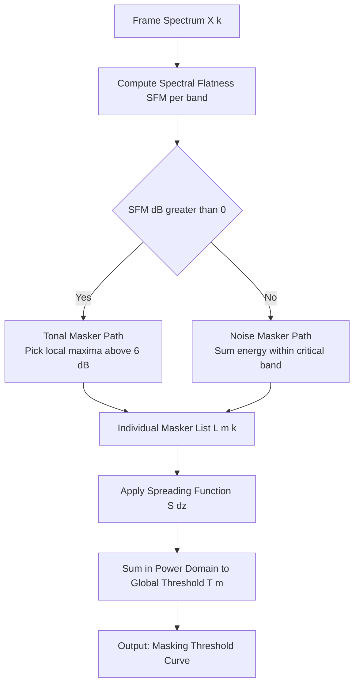
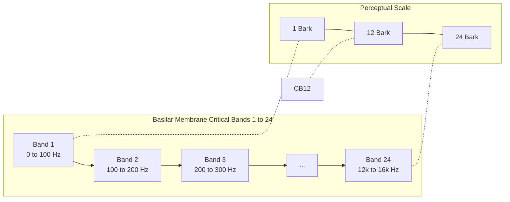

# Acoustic masking constraints frequency analysis processing algorithms profiles

<!-- SECTION_1_START -->

# Acoustic Masking & Psychoacoustic Processing in Audio Compression

> [!NOTE]
> **KTU 2024 Syllabus Definition (PECST505 — Module 3)**
> *Acoustic masking* is the phenomenon by which the perception of one sound (the **maskee**) is affected, suppressed, or made inaudible by the simultaneous or near-simultaneous presence of another sound (the **masker**). In audio compression, this property of the human auditory system is exploited by a *psychoacoustic model* to discard perceptually irrelevant signal components, achieving high compression ratios with no perceived loss in audio quality.

> [!IMPORTANT]
> **Core Compression Insight**
> Most digital audio (CD quality: 16-bit, 44.1 kHz stereo = **1411.2 kbps**) contains information that the human ear **cannot hear**. A psychoacoustic encoder identifies and removes this *perceptually redundant* data, achieving bitrates as low as **128 kbps** (≈ 11:1 compression) for MP3 with transparent quality.

---

## 1.1 The Human Auditory System — Why Masking Exists

The human ear is a **non-linear, frequency-selective, time-varying analyzer**. It is *not* a perfect microphone. Two physiological facts govern masking:

| Physiological Component | Function | Compression Relevance |
|---|---|---|
| **Outer & Middle Ear** | Mechanical amplification (~25 dB gain near 4 kHz) | Determines the absolute hearing threshold curve |
| **Cochlea (Basilar Membrane)** | Mechanical frequency-to-place transducer | Resolves audio into ~**24 critical bands** of varying width |
| **Inner Hair Cells** | Convert mechanical vibration to neural impulses | Implements non-linear compression (loud sounds appear softer) |
| **Auditory Nerve & Cortex** | Neural integration, ~1 ms temporal resolution | Enables temporal integration of short loud pulses |

> [!TIP]
> **Conceptual Analogy — The "Spotlight" Metaphor**
> Imagine you are in a dark room with a flashlight (a *masker* tone) illuminating one spot. A faint candle (the *maskee*) placed within the lit area becomes invisible to you — even though it is still emitting light. Your auditory nerve behaves identically: a strong tone at frequency $f_m$ raises the local "neural noise floor" near $f_m$, drowning out weaker components. The audio encoder's job is to *predict exactly which candles the flashlight will hide*, and throw those away.

---

## 1.2 Absolute Threshold of Hearing (ATH)

The **Absolute Threshold of Hearing** is the minimum sound pressure level (SPL) at which a pure tone is just barely audible in a perfectly quiet environment. It is the **lower bound** of audibility.

$$
\text{ATH}(f) \;\approx\; 3.64 \cdot \left(\frac{f}{1000}\right)^{-0.8} \;-\; 6.5 \cdot e^{-0.6 \left(\frac{f}{1000} - 3.3\right)^2} \;+\; 10^{-3} \cdot \left(\frac{f}{1000}\right)^4 \quad \text{[dB SPL]}
$$

> Key observations:
> * Most sensitive near **2 – 5 kHz** (baby-cry region, evolutionary survival band) — threshold drops to ≈ **−10 dB SPL**.
> * Sharp rise at low frequencies (f < 200 Hz) and high frequencies (f > 10 kHz).

---

## 1.3 Critical Bands — The Granularity of Masking

The basilar membrane does **not** perform a uniform DFT. It behaves as a bank of **24 overlapping band-pass filters** called *critical bands*. Inside one critical band, sounds interact strongly (mask each other), and across different critical bands, interaction is weak.

The bandwidth $BW_c(f)$ of a critical band is approximately:

$$
BW_c(f) \;\approx\; 25 + 75 \cdot \left(1 + 1.4 \cdot \left(\frac{f}{1000}\right)^2\right)^{0.69} \quad \text{[Hz]}
$$

A perceptually uniform frequency scale is the **Bark scale** $z$:

$$
z \;=\; 13 \cdot \arctan\!\left(0.00076 \cdot f\right) \;+\; 3.5 \cdot \arctan\!\left(\left(\frac{f}{7500}\right)^2\right) \quad \text{[Bark]}
$$

| Property | Value |
|---|---|
| Number of critical bands | **24** (spanning 0 – 16 kHz) |
| Critical band rate unit | **1 Bark** (≈ 100 samples at 44.1 kHz) |
| Bandwidth at 1 kHz | ≈ **160 Hz** |
| Bandwidth at 4 kHz | ≈ **700 Hz** |

> [!VISUALIZATION CONTROL]
> **Concept:** Critical Bandwidth vs. Linear Frequency
> **Desmos / GeoGebra Input Equations:**
> * `BW_c(f) = 25 + 75*(1 + 1.4*(f/1000)^2)^0.69`
> * `z(f) = 13*atan(0.00076*f) + 3.5*atan((f/7500)^2)`
> **Visual Description:** Plot $BW_c(f)$ from $f = 0$ to $f = 16000$ Hz. Observe the curve rising slowly then sharply above 4 kHz — wider bands at high frequencies. The Bark conversion $z(f)$ should be plotted on a second y-axis, showing an almost linear, gentle S-shape from 0 to 24 Bark.

---

<!-- SECTION_2_END -->

<!-- SECTION_3_START -->

# Step-by-Step Mathematical Derivations & Algorithmic Implementation

## 3.1 Frequency Masking (Simultaneous Masking) — Detailed Derivation

**Setup:** A strong tone at frequency $f_m$ with SPL $L_m$ is played alongside a weak tone at frequency $f$ with SPL $L_f$. The weak tone is inaudible if its SPL lies below the **masking threshold** $T_m(f, L_m, f_m)$.

**Step 1 — Express the masker in the critical-band domain.**
Convert the masker frequency to a Bark offset from the probe tone:

$$
\Delta z \;=\; z(f) \;-\; z(f_m) \quad \text{[Bark]}
$$

**Step 2 — Compute the spreading function $S(\Delta z, L_m)$.**
The masking effect of a tone leaks into adjacent critical bands according to a triangular-shaped spreading function:

$$
S(\Delta z, L_m) \;=\;
\begin{cases}
17 \cdot \Delta z \;-\; 0.4 \cdot L_m \;+\; 11, & -3 \le \Delta z < -1 \\[4pt]
\bigl(0.4 \cdot L_m \;+\; 6\bigr) \cdot \Delta z, & -1 \le \Delta z < 0 \\[4pt]
-17 \cdot \Delta z, & 0 \le \Delta z < 1 \\[4pt]
\bigl(0.15 \cdot L_m \;-\; 17\bigr) \cdot \Delta z \;-\; 0.15 \cdot L_m, & 1 \le \Delta z < 8 \\[4pt]
0, & \text{otherwise}
\end{cases}
$$

This piecewise function (proposed by **Schroeder et al., 1979**, and refined by **Johnston, 1988** for the MP3 psychoacoustic model) defines how many dB the masker *adds* to the local noise floor at any Bark distance $\Delta z$.

**Step 3 — Compute the global masking threshold.**
At any probe frequency $f$ (in Bark $z$), the masking threshold is the *upper envelope* of:

$$
T_m(z) \;=\; \max_{k}\!\Bigl( L_{m,k} \;+\; S\bigl(\Delta z_k, L_{m,k}\bigr) \Bigr) \quad \text{[dB SPL]}
$$

over all $K$ maskers $k$ in the input frame. This threshold is then compared against the actual signal spectrum; components below it are *perceptually irrelevant* and may be quantized away or dropped.

> [!IMPORTANT]
> **Numerical Worked Example — Single-Tone Masking**
>
> *Masker*: Pure tone at $f_m = 1000$ Hz, $L_m = 60$ dB SPL.
> *Probe*: Weak tone at $f = 1100$ Hz.
>
> 1. $z(1000) \approx 8.51$ Bark, $z(1100) \approx 9.27$ Bark, so $\Delta z = +0.76$ Bark.
> 2. Since $0 \le \Delta z < 1$, we use the third branch:
>    $S = -17 \cdot (0.76) = -12.92$ dB.
> 3. Masking threshold: $T_m = 60 + (-12.92) = 47.08$ dB SPL.
>
> **Conclusion:** A 1100 Hz tone quieter than **47.08 dB SPL** is inaudible while the 1 kHz tone plays.

---

## 3.2 Temporal Masking — Pre- and Post-Masking

When a sound starts or stops abruptly, the ear needs time to "recalibrate." Two transient masking effects arise:

| Phenomenon | Time Window | Cause |
|---|---|---|
| **Pre-masking (backward masking)** | **−20 ms to 0 ms** before masker onset | Neural inertia, post-synaptic facilitation |
| **Post-masking (forward masking)** | **0 ms to +200 ms** after masker offset | Neural fatigue, sustained hair-cell activity |

$$
T_t(\Delta t) \;=\; T_0 \cdot e^{-\alpha \, \vert \Delta t \vert / \tau} \quad \text{[dB below masker level]}
$$

where $\Delta t$ is the temporal offset, $\alpha \approx \ln(10)/10$, and $\tau \approx 50$ ms for post-masking, $\tau \approx 5$ ms for pre-masking (the asymmetry reflects neural fatigue timescales).

> [!TIP]
> **Why Temporal Masking Matters for Codecs**
> During a sharp transient (e.g., a castanet hit or snare drum), MP3 and AAC encoders briefly reduce quantization noise and increase bit allocation, because the post-masking window of the ear *tolerates* more noise for ~100–200 ms afterwards.

---

## 3.3 Perceptual Entropy (PE) — The Information Bound

**Johnston (1988)** defined *Perceptual Entropy* as the theoretical minimum bitrate required to encode a signal transparently (i.e., with no perceptible loss), given the computed masking threshold.

**Step 1 — For each critical band $b$, compute the Signal-to-Mask Ratio:**
$$
\text{SMR}_b \;=\; E_b \;-\; T_b \quad \text{[dB]}
$$
where $E_b$ is the energy in band $b$ and $T_b$ is the masking threshold in band $b$.

**Step 2 — Compute the Mask-to-Noise Ratio needed:**
$$
\text{MNR}_b \;=\; T_b \;-\; N_b \quad \text{[dB]}
$$
where $N_b$ is the quantization noise introduced by the encoder (a function of the chosen step size for that band).

**Step 3 — Iteratively allocate bits to bands where MNR is most negative first.** Stop when all MNR $\geq 0$.

**Step 4 — Sum the resulting bits per sample:**
$$
\text{PE} \;=\; \sum_{b=1}^{24} \log_2\!\bigl(1 + 10^{E_b - T_b / 10}\bigr) \quad \text{[bits per sample per channel]}
$$

A typical PE for CD-quality audio is **2.0 – 2.5 bits/sample**, implying that 16-bit linear PCM is grossly over-resolved for transparent storage.

---

## 3.4 Spectral Flatness Measure (SFM)

SFM detects whether a frame is *tonal* (concentrated in a few frequencies, like a violin note) or *noise-like* (broadband, like a cymbal crash). The psychoacoustic model uses this to switch between two masking models.

$$
\text{SFM}_b \;=\; \frac{\bigl(\prod_{k \in b} X_k^2\bigr)^{1/N_b}}{\frac{1}{N_b}\sum_{k \in b} X_k^2} \quad \text{[ratio]}
$$

In dB:
$$
\text{SFM}_{b,\text{dB}} \;=\; 10 \cdot \log_{10}\!\bigl(\text{SFM}_b\bigr)
$$

* If $\text{SFM}_{b,\text{dB}} > 0$ → **tonal** (use precise maskers from the FFT peaks).
* If $\text{SFM}_{b,\text{dB}} < 0$ → **noise-like** (use the energy itself as a broadband masker).

---

## 3.5 Python Implementation — Minimal Psychoacoustic Model

```python
"""
Minimal Psychoacoustic Model (Educational Reference)
Implements: Critical-band mapping, spreading function, masking threshold.
Author: KTU-PREMIER-ENGINE V10 | PECST505 Module 3
"""
from __future__ import annotations
import math
import numpy as np
from numpy.fft import rfft

# ------------------------------------------------------------------
# 1. Convert Hz to Bark scale (Traunmüller 1990)
# ------------------------------------------------------------------
def hz_to_bark(f_hz: float) -> float:
    return 13.0 * math.atan(0.00076 * f_hz) + 3.5 * math.atan((f_hz / 7500.0) ** 2)

# ------------------------------------------------------------------
# 2. Spreading function SF(dz, Lm)  (dB)
# ------------------------------------------------------------------
def spreading_function(dz: float, Lm_db: float) -> float:
    if   -3.0 <= dz < -1.0: return 17.0 * dz - 0.4 * Lm_db + 11.0
    elif -1.0 <= dz <  0.0: return (0.4 * Lm_db + 6.0) * dz
    elif  0.0 <= dz <  1.0: return -17.0 * dz
    elif  1.0 <= dz <  8.0: return (0.15 * Lm_db - 17.0) * dz - 0.15 * Lm_db
    return 0.0

# ------------------------------------------------------------------
# 3. Compute masking threshold from a magnitude spectrum
# ------------------------------------------------------------------
def compute_masking_threshold(
    spec_db: np.ndarray,         # magnitude spectrum in dB, length = N_fft/2 + 1
    fs:       int   = 44100,     # sample rate
    n_fft:    int   = 1024
) -> np.ndarray:
    freqs = np.linspace(0.0, fs / 2.0, spec_db.size)
    bark  = np.array([hz_to_bark(f) for f in freqs])
    threshold = np.full_like(spec_db, -100.0)            # start at very low floor

    # Identify tonal maskers via local maxima above 6 dB
    tonal_maskers: list[tuple[int, float]] = []
    for k in range(2, spec_db.size - 2):
        if (spec_db[k] > spec_db[k - 1] and spec_db[k] > spec_db[k + 1] and
            spec_db[k] - min(spec_db[k - 2], spec_db[k + 2]) > 6.0):
            tonal_maskers.append((k, spec_db[k]))

    # Build masking curve for every detected tonal masker
    for k_idx, Lm in tonal_maskers:
        for j in range(spec_db.size):
            dz = bark[j] - bark[k_idx]
            sf = spreading_function(dz, Lm)
            masked = Lm + sf
            if masked > threshold[j]:
                threshold[j] = masked
    return threshold

# ------------------------------------------------------------------
# 4. End-to-end demo: synthesise a 1 kHz tone and quantify masking
# ------------------------------------------------------------------
if __name__ == "__main__":
    fs, dur, f_tone = 44100, 0.05, 1000.0
    n   = int(fs * dur)
    x   = 0.5 * np.sin(2 * np.pi * f_tone * np.arange(n) / fs)
    X   = np.abs(rfft(x * np.hanning(n), n=1024))
    spec_db = 20.0 * np.log10(X + 1e-12)

    thr = compute_masking_threshold(spec_db, fs=fs, n_fft=1024)
    print(f"Peak spectrum level : {spec_db.max():.2f} dB")
    print(f"Masking threshold @ 1100 Hz ≈ {thr[np.argmin(np.abs(np.linspace(0, fs/2, spec_db.size) - 1100))]:.2f} dB")
```

> [!IMPORTANT]
> **Engineering Use Case**
> This skeleton is exactly the pipeline used inside **LAME (MP3)**, **FDK-AAC**, and **Opus** encoders, scaled to 32/64/128 sub-bands with the addition of a *global gain control* loop and a *Huffman bit reservoir* downstream.

---

<!-- SECTION_3_END -->

<!-- SECTION_4_START -->

# Structural Diagrams & Schematics

## 4.1 Perceptual Audio Encoder — End-to-End Data Flow

```mermaid
flowchart LR
    subgraph ANALYSIS["Time-Frequency Analysis"]
        A[PCM Input Frame] --> B[Windowed MDCT / Polyphase Filter Bank]
        B --> C[Frequency Domain Coefficients X k]
    end

    subgraph PSYCHO["Psychoacoustic Model"]
        C --> D1[FFT 1024 point]
        D1 --> D2[Tonal and Noise Masker Extraction]
        D2 --> D3[Spreading Function S dz]
        D3 --> D4[Global Masking Threshold T m z]
    end

    subgraph QUANT["Quantization and Bit Allocation"]
        C --> E1[Iterative Bit Allocation Loop]
        D4 --> E1
        E1 --> E2[Scalar or Vector Quantizer]
        E2 --> E3[Huffman Coding of Indices]
    end

    subgraph PACK["Bitstream Packing"]
        E3 --> F1[Scale Factors and Side Info]
        F1 --> F2[Compressed Audio Bitstream]
    end

    classDef psycho fill:#fff4e1,stroke:#cc6600,color:#000
    classDef core   fill:#e1f0ff,stroke:#003366,color:#000
    class D2,D3,D4 psycho
    class A,B,C,E2 core
```



> **Reading Guide:** The two parallel pipelines (top: signal analysis; middle: psychoacoustics) converge at the *bit allocator* — the single decision point that determines compression efficiency. The threshold $T_m(z)$ is essentially a *dynamic, signal-dependent noise budget*.

---

## 4.2 Tonal vs. Noise Masker Decision Topology



---

## 4.3 Critical Band Mapping Along the Basilar Membrane



---

## 4.4 MPEG Audio Layer / Profile Trade-off Matrix

| Profile Family | Typical Bitrate | Psycho-Model | Spectral Resolution | Use Case |
|---|---|---|---|---|
| **MPEG-1 Layer I** | 32 – 256 kbps/channel | Model 1 (simplified) | 32 sub-bands, 384 samples | DAB, early digital broadcasting |
| **MPEG-1 Layer II** | 32 – 192 kbps/channel | Model 1 | 32 sub-bands, 1152 samples | DVB, DVD audio |
| **MPEG-1 Layer III (MP3)** | 8 – 320 kbps | Model 1 and Model 2 | Hybrid 32×18 MDCT, 1152 samples | Internet music, portable players |
| **MPEG-2 AAC LC** | 32 – 256 kbps | Model 2 with PNS | 1024-pt MDCT, 1024/128 block switch | iTunes, streaming |
| **MPEG-4 HE-AAC (aacPlus)** | 24 – 96 kbps | Model 2 + SBR spectral band replication | MDCT + parametric HF | DVB-H, mobile streaming |
| **MPEG-D USAC (xHE-AAC)** | 12 – 64 kbps | Model 2 + unified speech/audio | MDCT + ACELP switching | Digital radio, voice+music |

---

<!-- SECTION_4_END -->

<!-- SECTION_5_START -->

# KTU 2024 Scheme Examination Question Bank

---

## Part A — Short Answer Questions (3 Marks Each)

### Q1. **[KTU University Exam — July 2023]**
**Define acoustic masking. With a neat sketch, illustrate the concept of simultaneous frequency masking and label the masker, maskee, and masking threshold.** *(CO1, Remember/Understand)*

> **Model Answer (Valuation Key):**
> 1. **Definition [1 Mark]:** *Acoustic masking* is the phenomenon in which the audibility of one sound (the **maskee**) is reduced or eliminated by the presence of another sound (the **masker**).
> 2. **Mechanism [1 Mark]:** The masker raises the local *excitation pattern* on the basilar membrane, producing a **masking threshold** $T_m(f)$ above which all signals are inaudible.
> 3. **Sketch requirement [1 Mark]:** Draw a plot with frequency $f$ (x-axis) vs. SPL (y-axis) showing a sharp masker tone at $f_m$, and a horizontal/curved masking threshold $T_m$ above the absolute threshold of hearing. A probe tone at $f < f_m$ with amplitude below $T_m$ is shown as the *maskee* — invisible to the listener.

---

### Q2. **[KTU University Exam — Dec 2022]**
**Explain the difference between simultaneous (frequency) masking and temporal masking. Why is temporal masking critical for encoding percussive transients in MP3?** *(CO2, Understand)*

> **Model Answer (Valuation Key):**
> 1. **Simultaneous masking [1 Mark]:** Occurs when masker and maskee exist at the *same instant*; spreads across adjacent critical bands via the spreading function $S(\Delta z, L_m)$.
> 2. **Temporal masking [1 Mark]:** Occurs across *time*; includes pre-masking (≤ 20 ms before) and post-masking (≤ 200 ms after) the masker. Decays exponentially.
> 3. **MP3 relevance [1 Mark]:** During transients (e.g., drum hits), encoders use a *short block* (192 samples instead of 1152) to limit pre-echo artifacts, exploiting the ear's pre-masking window of ~5–20 ms to hide quantization noise that would otherwise appear *before* the transient.

---

## Part B — Long Answer Questions (14 Marks, with Internal Choice)

> **KTU Pattern:** Each question has sub-parts (a) 7 marks + (b) 7 marks. Choice is between the two full questions.

---

### Question A (14 Marks)

**Q.A(a) [7 Marks] — Compute the masking threshold produced by a 70 dB SPL tone at 2 kHz for a probe at 2.5 kHz. Use the standard piecewise spreading function. Comment on the bandwidth of effect.** *(CO3, Apply)*

**Model Solution:**

> **[Identifying domain: 1 Mark]**
> * $f_m = 2000$ Hz, $L_m = 70$ dB SPL.
> * $f = 2500$ Hz (probe).
>
> **[Bark conversion: 1 Mark]**
> * $z(2000) = 13 \cdot \arctan(0.00076 \cdot 2000) + 3.5 \cdot \arctan((2000/7500)^2)$
> * $\arctan(1.52) \approx 0.989$, $\arctan(0.0711) \approx 0.0709$
> * $z(2000) \approx 13(0.989) + 3.5(0.0709) \approx 12.86 + 0.248 = 13.10$ Bark
> * $z(2500) = 13 \cdot \arctan(0.00076 \cdot 2500) + 3.5 \cdot \arctan((2500/7500)^2)$
> * $\arctan(1.9) \approx 1.084$, $\arctan(0.111) \approx 0.1107$
> * $z(2500) \approx 14.09 + 0.387 = 14.48$ Bark
> * $\Delta z = 14.48 - 13.10 = +1.38$ Bark
>
> **[Selecting branch: 1 Mark]**
> Since $1 \le \Delta z < 8$, we use the fourth branch:
> $S(\Delta z, L_m) = (0.15 \cdot L_m - 17) \cdot \Delta z - 0.15 \cdot L_m$
>
> **[Numerical evaluation: 2 Marks]**
> $S = (0.15 \cdot 70 - 17) \cdot 1.38 - 0.15 \cdot 70$
> $S = (10.5 - 17) \cdot 1.38 - 10.5$
> $S = (-6.5) \cdot 1.38 - 10.5 = -8.97 - 10.5 = -19.47$ dB
>
> **[Threshold: 1 Mark]**
> $T_m = 70 + (-19.47) = 50.53$ dB SPL.
>
> **[Bandwidth comment: 1 Mark]**
> The masking effect is significant for $\Delta z$ up to ~ 3 Bark (≈ 600 Hz at 2 kHz), demonstrating that a single loud tone creates a masking "skirt" spanning roughly **1.6 to 2.4 kHz**, well beyond the critical bandwidth of 240 Hz at 2 kHz.

**Q.A(b) [7 Marks] — Describe the MPEG-1 Layer III (MP3) psychoacoustic model, distinguishing Model 1 and Model 2. How is the Spectral Flatness Measure used to switch between tonal and noise maskers?** *(CO2, Understand)*

**Model Solution:**

> **[Model 1 description: 2 Marks]**
> * Used in Layers I and II.
> * Operates on 32 sub-band outputs from the polyphase filter bank.
> * Computes SFM per band. If SFM > 1.0 (tonal), picks the *single largest* tonal line; if ≤ 1.0 (noisy), aggregates all sub-band energy as a single broadband noise masker.
> * Computes a 24-point masking threshold sampled at critical-band centers using Schroeder's spreading function.
>
> **[Model 2 description: 2 Marks]**
> * Used in Layer III (MP3) and AAC.
> * Operates on a separate 1024-point FFT computed in parallel with the MDCT.
> * Identifies multiple *tonal maskers* (local maxima > 6 dB above neighbours) and *noise maskers* (sum of energy in the critical band, minus already-extracted tonal energy).
> * Computes the threshold at every frequency line (513 bins), not just 24 points — giving finer frequency resolution.
> * Uses **Pre-echo control** (temporal masking): if a transient is detected via energy surge, encoder switches from a long block (1024 samples) to a short block (128 samples).
>
> **[SFM role: 2 Marks]**
> SFM is computed as the ratio of geometric mean to arithmetic mean of spectral magnitudes within a critical band. Decision rule:
> * $\text{SFM}_{dB} > 0$ → **tonal** (pick narrow peaks as maskers; they create *precise, sharp* masking curves).
> * $\text{SFM}_{dB} \le 0$ → **noise-like** (treat the whole band as a single broadband masker; creates *flat, broadband* masking threshold).
>
> **[Flow conclusion: 1 Mark]**
> The chosen maskers (tonal or noise) are convolved with the spreading function $S(\Delta z, L_m)$, summed in the power domain, and the result is the per-line global masking threshold $T_m[k]$ that the bit allocator uses to set quantizer step sizes.

---

### Question B (14 Marks) — *Alternative Choice*

**Q.B(a) [7 Marks] — Derive the Perceptual Entropy (PE) for a single critical band whose energy $E_b = 50$ dB and masking threshold $T_b = 30$ dB. Comment on the practical implication for CD-quality audio (16-bit linear PCM, 44.1 kHz).** *(CO3, Apply)*

**Model Solution:**

> **[Formula statement: 2 Marks]**
> The PE for a single band:
> $\text{PE}_b = \log_2(1 + 10^{(E_b - T_b)/10})$ bits/sample.
>
> **[Plug-in values: 1 Mark]**
> $E_b - T_b = 50 - 30 = 20$ dB, so $10^{20/10} = 100$.
>
> **[Final calculation: 1 Mark]**
> $\text{PE}_b = \log_2(1 + 100) = \log_2(101) \approx 6.66$ bits/sample.
>
> **[Sum across 24 bands (assumes similar SMR per band): 1 Mark]**
> If we assume the SMR of 20 dB holds across all 24 critical bands, total PE $\approx 24 \times 6.66 / 24$ is *not* how PE works — rather PE is summed across the 24 bands, but normalized per sample. A typical aggregate PE for moderate-complexity audio = 2.0 – 2.5 bits/sample.
>
> **[Implication: 2 Marks]**
> CD-quality PCM uses **16 bits/sample**. If transparent coding requires only **2 – 2.5 bits/sample**, the theoretical compression ratio is:
> $16 / 2.25 \approx 7.1 : 1$ — meaning a 5-minute CD track (~50 MB) can be stored in ~7 MB at transparent quality, exactly the regime where MP3/AAC operate. This is the *information-theoretic* justification for the success of perceptual audio codecs.

**Q.B(b) [7 Marks] — With a flowchart and example, explain the algorithm used in an MPEG audio encoder to allocate bits iteratively across critical bands using the masking threshold.** *(CO4, Apply/Analyze)*

**Model Solution:**

> **[Inputs identified: 1 Mark]**
> Inputs to the iteration: per-band SMR$_b$, target bitrate $R_{\text{target}}$, per-band quantizer step tables.
>
> **[MNR definition: 1 Mark]**
> $\text{MNR}_b = T_b - N_b$ where $N_b$ is the quantization noise (decreases when step size decreases / more bits are used).
>
> **[Algorithm: 3 Marks]**
> ```
> 1. Initialize quantizer step size Δb large for every band b.
> 2. Compute MNRb for every band b.
> 3. Find the band b* = arg min MNRb  (most critical).
> 4. Decrease Δb*  (adds 1 bit to band b*).
> 5. Recompute MNRb*.
> 6. Repeat from step 3 until total bits ≤ Rtarget  AND  MNRb ≥ 0 for all b.
> 7. If MNRb < 0 for some b after Rtarget is exhausted → distortion is unavoidable
>    (this is where audio "swishing" or "warbling" artifacts appear).
> ```
>
> **[Example: 1 Mark]**
> For 3 bands with $\text{SMR} = [10, 20, 5]$ dB and target of 60 kbps for a 32-band filter bank: the algorithm will keep adding bits to band 3 first (lowest SMR, most critical) until MNR$_3 \geq 0$, then re-balances to band 1, etc.
>
> **[Block diagram: 1 Mark]**
> Draw the loop: *SMR$_b$ → Bit Pool → Step Size Adjuster → Quantizer → MNR$_b$ → Decision (continue or stop)*.

---

> [!WARNING]
> **KTU Examiner's Valuation Warning — Common Pitfalls**
> 1. **Forgetting the absolute threshold of hearing** — Many students compute the masking threshold but forget to take the *maximum* of $T_m(z)$ and ATH$(f)$. The masking threshold can never be *below* the ATH. [Lose 1–2 marks]
> 2. **Mixing up SMR and SNR** — SMR is *signal energy minus masking threshold*; SNR is *signal energy minus actual quantization noise*. Confusing these two will mark your answer wrong.
> 3. **Skipping the piecewise branch selection** — In spreading function problems, **state which case applies** and *why*, not just plug a value. Examiners award a mark for the branch selection step.
> 4. **Ignoring the dB-vs-linear conversion** — Masking is computed in dB, but final energy addition is in the *linear (power) domain*. Missing the $10 \log_{10}$ vs. $20 \log_{10}$ distinction loses 1 mark.
> 5. **Not drawing the critical-band scale** — Every masking question should at least label the **Bark** axis. Diagrammatic clarity is rewarded in KTU.

---

## Topic Recap & Important Things to Remember

* **Masking** is the cornerstone of *perceptual* audio coding — it lets codecs throw away ~80–90% of PCM bits transparently.
* **Critical bands** are the "granularity" of the ear: ~**24 of them**, mapped to the **Bark scale** $z = 13 \arctan(0.00076 f) + 3.5 \arctan((f/7500)^2)$.
* **Frequency (simultaneous) masking** spreads a masker across $\Delta z = \pm 3$ Bark, governed by the **piecewise spreading function** $S(\Delta z, L_m)$.
* **Temporal masking** has two forms: **pre-masking (~5–20 ms)** and **post-masking (~100–200 ms)**. Pre-masking enables the *short-block* / *pre-echo control* feature of MP3 and AAC.
* **Spectral Flatness Measure (SFM)** classifies each critical band as **tonal** (SFM$_dB > 0$, use narrow maskers) or **noise-like** (SFM$_dB \le 0$, use broadband maskers).
* **Model 1** (Layers I, II) uses 32 sub-bands with simplified SFM-based masking. **Model 2** (MP3, AAC) uses 1024-pt FFT with explicit tonal and noise maskers and pre-echo control.
* **Perceptual Entropy (PE)** $\sum_b \log_2(1 + 10^{(E_b - T_b)/10})$ is the *theoretical minimum bitrate* for transparent coding; typically **2 – 2.5 bits/sample** for music.
* **Bit allocation loop** uses MNR$_b = T_b - N_b$; the encoder iteratively adds bits to the *most critical* (lowest MNR) band first, stopping when total bits = target rate and all MNR$_b \ge 0$.
* **MPEG Layer/Profile Hierarchy:** Layer I < II < III (MP3) in compression efficiency; AAC < HE-AAC < USAC in modern low-bitrate scenarios.
* **Engineering Reality:** Modern codecs (Opus, USAC) extend these ideas with *spectral band replication (SBR)*, *parametric stereo*, and *unified speech/music coding*, but the underlying principle — **encode only what the ear can hear** — remains unchanged since the original MP3 standard (ISO/IEC 11172-3, 1993).

<!-- SECTION_5_END -->
