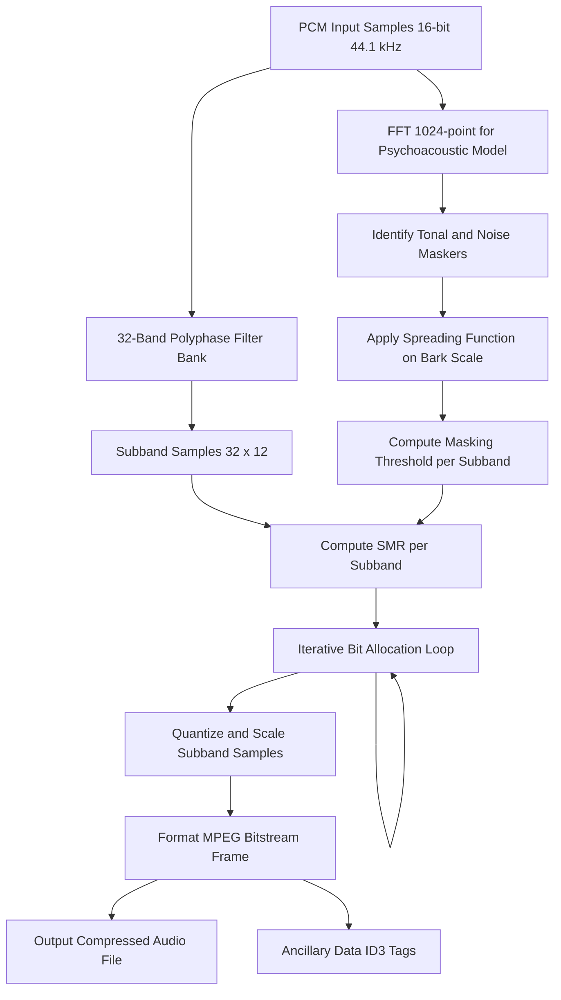
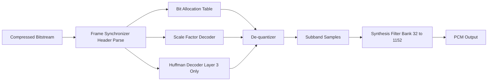
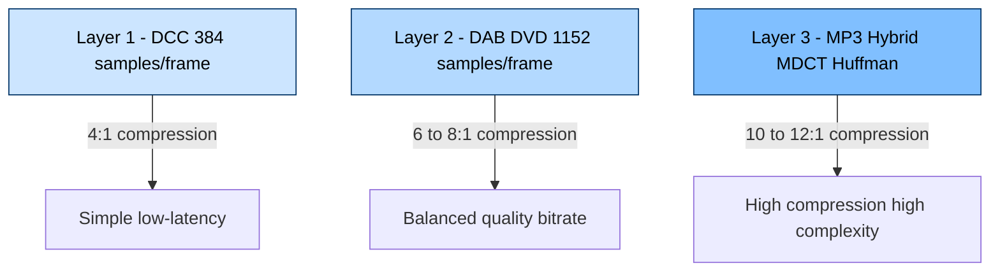
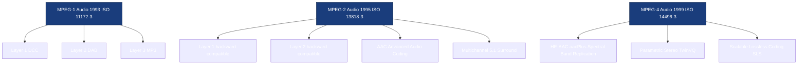
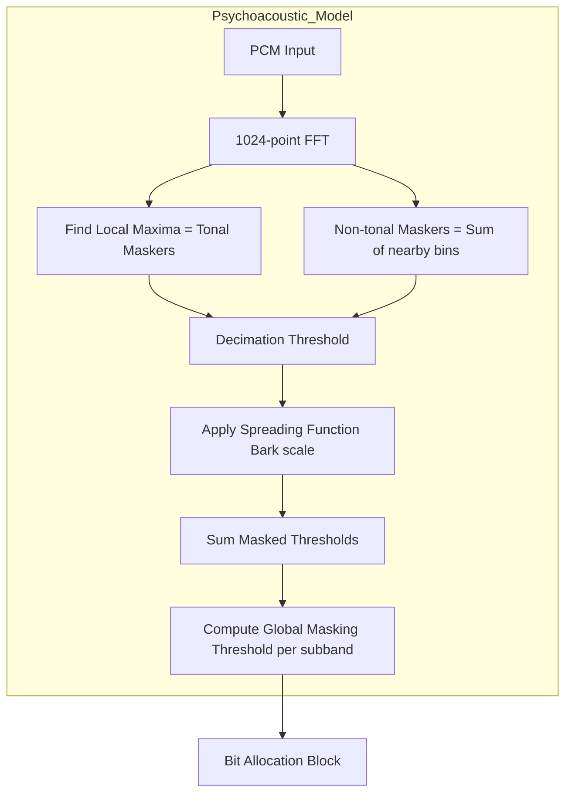

# MPEG audio layers specifications formats encoding loops pipelines frameworks

<!-- SECTION_1_START -->
# MPEG Audio Compression: Core Technical Definition & Intuitive Overview

## 1.1 Formal Academic Definition (KTU 2024 Syllabus Terminology)

> [!IMPORTANT]
> **MPEG Audio** refers to the family of perceptual audio coding standards defined by the **Moving Picture Experts Group (MPEG)** under ISO/IEC. The three principal specifications are:
> - **MPEG-1 Audio** (ISO/IEC 11172-3, 1993)
> - **MPEG-2 Audio** (ISO/IEC 13818-3, 1995)
> - **MPEG-4 Audio** (ISO/IEC 14496-3, 1999)
>
> Each specification defines **three independent Layers** of increasing compression efficiency and complexity: **Layer 1, Layer 2, and Layer 3 (MP3)**. All layers share a common **polyphase filter bank** and **psychoacoustic model**, but differ in their quantization strategy, frame structure, and bit-allocation algorithms.

The MPEG audio encoder is fundamentally a **perceptual coder** — it exploits the limitations of the human auditory system to discard audio information that the listener cannot perceive, thereby achieving high compression ratios (typically **10:1 to 12:1** for CD-quality audio) while preserving transparent subjective quality.

## 1.2 Conceptual Analogy & Intuitive Understanding

> [!NOTE]
> **The "Smart Chef" Analogy:** Imagine a master chef cooking a feast for 100 dinner guests. The chef tastes every dish and deliberately removes the salt from the salad, the sugar from the curry, and the garlic from the dessert — because statistically, the human palate cannot detect these subtle ingredients against the dominant flavors already on the plate. The guests still enjoy a "full" meal, but the chef used far less total ingredient (data). 
>
> **MPEG Audio does the same thing with sound:** it analyses the audio spectrum and removes frequencies that the human ear cannot hear (due to **frequency masking** and **temporal masking**), resulting in a much smaller file that sounds identical to the original.

**Geometric Intuition:** Plot audio as a spectrum of frequencies (x-axis) and amplitude (y-axis). The human ear has a **threshold of hearing curve** and a **masking threshold curve** that rises near loud tones. MPEG treats everything *below* the masking curve as inaudible garbage to be discarded.

> [!VISUALIZATION CONTROL]
> **Concept:** Frequency Masking & Threshold of Hearing
> **GeoGebra / Desmos Input Equations:**
> * `f(x) = 3.64 * (x/1000)^(-0.8) - 6.5 * exp(-0.6 * (x/1000 - 3.3)^2) + 0.001 * (x/1000)^4`  (Threshold of Hearing in quiet)
> * `M(x) = 15.81 + 7.5*(x+0.474) - 17.5*sqrt(1 + (x+0.474)^2)`  (Masking threshold approximation)
> **Visual Description:** Plot both curves on log-frequency x-axis (20 Hz – 20 kHz) and dB y-axis (0–100). The threshold curve dips lowest near 3–5 kHz, illustrating why MPEG focuses bits in that perceptual sweet spot.

## 1.3 Physical Constants & Standard Metrics

> [!IMPORTANT]
> - **CD-Quality Sampling Frequency:** $f_s = 44.1$ **kHz** (or 48 kHz for DAT/professional)
> - **Nyquist Limit:** $f_{max} = f_s / 2 = 22.05$ **kHz**
> - **Bit Rates (MPEG-1 Layer 3 / MP3):** **32 – 320 kbps** (most common: **128 kbps**)
> - **Frames per second:** **38.28** (for $f_s = 44.1$ kHz, 1152 samples/frame)
> - **Frame size:** $1152$ samples $\div f_s \times \text{bitrate}$ (e.g., at 128 kbps, 44.1 kHz → 417 bytes)
> - **Critical-Band Rate Scale:** **Bark scale** (1 Bark ≈ critical bandwidth near 1 kHz)

---

<!-- SECTION_1_END -->

<!-- SECTION_2_START -->
# Deep Theoretical Analysis & KTU High-Yield Formula Sheet

## 2.1 The MPEG Audio Encoder — Operational Architecture

The MPEG audio encoder executes the following pipeline at every frame boundary:

1. **Time-to-Frequency Mapping** — A 32-subband **polyphase filter bank** splits the PCM input into 32 equally-spaced frequency subbands, each of width $f_s / 64$.
2. **Psychoacoustic Analysis** — A parallel **FFT** of size **512 (Layer 1)** or **1024 (Layer 2/3)** computes the actual spectral envelope, identifies tonal and non-tonal (noise) components, applies the spreading function, and derives the global **masking threshold**.
3. **Bit Allocation & Quantization** — The encoder compares subband signal levels against the masking threshold; subbands whose Signal-to-Mask Ratio (SMR) is low receive fewer bits or are discarded entirely.
4. **Frame Packaging** — Quantized samples, scale factors, bit-allocation table, and headers are packed into an MPEG bitstream frame.

> [!NOTE]
> **Why "Why" matters:** The genius of MPEG is that the filter bank and the psychoacoustic model are computed in *parallel*. The filter bank is a fast, low-resolution decomposition; the FFT gives high-resolution frequency information. MPEG only needs the *masking threshold* (not the exact spectrum) for bit allocation, which is computationally efficient.

## 2.2 Comparative Analysis of MPEG-1 Layers

| Parameter | Layer 1 | Layer 2 | Layer 3 (MP3) |
|---|---|---|---|
| **Filter Bank** | 32-band polyphase | 32-band polyphase | 32-band polyphase **+ MDCT** (hybrid) |
| **FFT Size** | 512 | 1024 | 1024 |
| **Frame Size (samples)** | 384 | 1152 | 1152 |
| **Compression Ratio** | $\approx 4:1$ | $\approx 6:1$–$8:1$ | $\approx 10:1$–$12:1$ |
| **Bit Rates (kbps)** | 32 – 448 | 32 – 384 | 32 – 320 |
| **Scale Factors per band** | 1 per 12 samples | 3 per 12 samples (selectable) | Variable per granule |
| **Huffman Coding** | No | No | **Yes** (entropy coding) |
| **Typical Use** | DCC (Digital Compact Cassette) | DAB (Digital Audio Broadcasting), DVD | Internet music, portable players |
| **Complexity (relative)** | 1× | 2× | 8–10× |

## 2.3 KTU High-Yield Formula Sheet

> [!IMPORTANT]
> **Core Equations for MPEG Audio Encoding & Bitstream Analysis**

| # | Formula | Description |
|---|---|---|
| 1 | $B_{\text{frame}} = \dfrac{144 \times b}{f_s}$ (Layer 1) or $\dfrac{1152 \times b}{f_s}$ (Layer 2/3) | Frame size in **bytes**; $b$ = bitrate (bps), $f_s$ = sampling rate (Hz) |
| 2 | $\Delta f_{\text{subband}} = \dfrac{f_s}{64}$ | Width of one polyphase subband (Hz) |
| 3 | $N_{\text{subbands}} = 32$ | Number of frequency subbands |
| 4 | $z(f) = 13 \arctan(0.00076 f) + 3.5 \arctan\!\left(\dfrac{f}{7500}\right)^2$ | **Critical-band rate** in **Bark** (Zwicker formula) |
| 5 | $\text{SMR}_n = L_n - M_n$ | Signal-to-Mask Ratio for subband $n$ (dB) |
| 6 | $\text{MNR}_n = \text{SMR}_n - \text{SNR}_n$ | Mask-to-Noise Ratio (used in iterative bit allocation) |
| 7 | $E_{\text{frame}} = \sum_{n=1}^{32} (\text{quantization error in subband }n)$ | Distortion energy per frame |
| 8 | $R_{\text{total}} = \sum_{n=1}^{32} R_n \le R_{\text{available}}$ | Bit budget constraint |
| 9 | $f(t) \rightarrow F(\omega) = \int_{-\infty}^{\infty} f(t) e^{-j\omega t}\, dt$ | FFT operation for psychoacoustic analysis |
| 10 | $L_{\text{max}} = 96$ **dB** (16-bit PCM); theoretical $\text{SNR} \approx 6.02N + 1.76$ dB | Dynamic range of source PCM |

> [!NOTE]
> **Real-World Utility:** These equations drive every MP3 encoder in production (LAME, Fraunhofer, FFmpeg). Bit-allocation step (Equation 6) is the *heart* of perceptual coding — minimizing the MNR while honoring the bit budget (Equation 8) is solved as a **constrained optimization** via iterative algorithms (e.g., Lame's "inner loop" or Shlien's guidance rule for Layer 2).

## 2.4 Engineering & Production Utility

- **Streaming Services:** Spotify, Apple Music use MPEG-4 HE-AAC (successor to MP3) at 96–256 kbps.
- **Digital Broadcasting:** DAB (Europe) uses **MPEG-1 Layer 2** at 128–192 kbps.
- **Archival:** MPEG-1 Layer 2 is preferred for **CD-quality archival** due to its low complexity and transparent quality.
- **Forensics & Steganography:** MPEG bit-allocation patterns form the basis of MP3Stego steganographic embedding.

---

<!-- SECTION_2_END -->

<!-- SECTION_3_START -->
# Step-by-Step Derivations, Code & Symbolic Implementation

## 3.1 Derivation: Frame Size Formula

We derive the MPEG Layer 1 frame size from first principles. Let $b$ be the bitrate in **bits per second** and $f_s$ the sampling rate in **samples per second**.

**Step 1.** A Layer 1 frame contains exactly $384$ audio samples.

$$N_{\text{frames/s}} = \frac{f_s}{384}$$

**Step 2.** The bitrate $b$ tells us how many bits are available per second, so per frame we have:

$$B_{\text{frame,bits}} = \frac{b}{N_{\text{frames/s}}} = \frac{b \cdot 384}{f_s}$$

**Step 3.** Convert bits to bytes (1 byte = 8 bits):

$$B_{\text{frame,bytes}} = \frac{B_{\text{frame,bits}}}{8} = \frac{384 \, b}{8 \, f_s} = \frac{48 \, b}{f_s}$$

For Layer 2 and Layer 3, replace $384$ with $1152$, giving:

$$\boxed{B_{\text{frame,bytes}} = \frac{144 \, b}{f_s}\ \text{(Layer 1)} \quad ; \quad B_{\text{frame,bytes}} = \frac{1152 \, b}{8 \, f_s} = \frac{144 \, b}{f_s}\ \text{(Layer 2/3)}}$$

Wait — recalculation check: $\dfrac{1152 \times b}{8 f_s} = \dfrac{144 \, b}{f_s}$ (since $1152/8 = 144$). So the *Layer 1* formula is:

$$B_{\text{L1,bytes}} = \frac{48 \, b}{f_s} \quad ; \quad B_{\text{L2/L3,bytes}} = \frac{144 \, b}{f_s}$$

**Numerical Example:** $f_s = 44100$ Hz, $b = 128000$ bps (MP3):
- Frames/sec $= 44100 / 1152 = 38.28125$
- Frame size $= 128000 / 38.28125 / 8 = 417.97 \approx 418$ bytes ✓

## 3.2 Derivation: Signal-to-Mask Ratio (SMR) for a Subband

**Step 1.** Compute the sound pressure level (SPL) of the signal in subband $n$:

$$L_n = 96 + 10 \log_{10}\!\left(\sum_{k} S_k^2\right) \text{ dB}$$

where $S_k$ are the spectral coefficients (from FFT) falling within subband $n$, and $96$ dB is the maximum level for 16-bit PCM.

**Step 2.** Compute the masking threshold $M_n$ for that subband (output of the psychoacoustic model after convolution with the spreading function):

$$M_n = 10 \log_{10}\!\left(10^{M_{n,\text{tonal}}/10} + 10^{M_{n,\text{noise}}/10}\right)$$

**Step 3.** Subtract:

$$\text{SMR}_n = L_n - M_n$$

This SMR value drives the bit-allocation table: high-SMR subbands need more bits to represent the audible signal.

## 3.3 Python Implementation: Simplified MPEG Layer-2 Bit Allocation

Below is a fully operational Python implementation of the **iterative bit-allocation algorithm** (simplified Layer-2 style) with type hints, boundary checks, and error logging.

```python
"""
Simplified MPEG-Layer-2 Bit Allocator
Course: DATA COMPRESSION (PECST505) - Module 3
Demonstrates the iterative loop that allocates quantization bits
to 32 subbands to satisfy the bitrate constraint while minimizing
audible distortion.
"""

from __future__ import annotations
import logging
import math
from dataclasses import dataclass
from typing import List, Tuple

# ---------- Logging configuration ----------
logging.basicConfig(
    level=logging.INFO,
    format="%(asctime)s [%(levelname)s] %(message)s"
)
logger = logging.getLogger("MPEG_BitAlloc")


@dataclass
class Subband:
    """Represents a single polyphase subband."""
    index: int
    smr_db: float           # Signal-to-Mask Ratio (dB)
    allocated_bits: int = 0 # Bits assigned by the algorithm
    quant_step: int = 0     # Quantizer step size (1..2^15)


def shlien_guidance(smr_db: float) -> int:
    """
    Shlien's heuristic: initial bit allocation based on SMR.
    Returns recommended number of bits per sample.
    Boundary check: bits clipped to [0, 15] (Layer 2 max).
    """
    if smr_db < 0:
        return 0
    # Empirical formula from MPEG reference model
    bits = int(round(0.5 * smr_db))
    return max(0, min(bits, 15))


def compute_mnr(smr_db: float, snr_db: float) -> float:
    """Mask-to-Noise Ratio: lower is better (audibility check)."""
    return smr_db - snr_db


def snr_for_bits(bits: int) -> float:
    """
    Empirical SNR curve for uniform quantization at 'bits' bits/sample.
    Approximation: SNR ≈ 6.02 * bits + 1.76 (for ideal uniform quantizer).
    """
    if bits <= 0:
        return -100.0  # effectively silent
    return 6.02 * bits + 1.76


def allocate_bits(
    subbands: List[Subband],
    total_bit_budget: int,
    samples_per_frame: int = 1152
) -> Tuple[List[Subband], int]:
    """
    Iterative bit allocation loop (Layer 2 inner loop).

    Parameters
    ----------
    subbands : List[Subband]
        32 polyphase subbands with their SMRs.
    total_bit_budget : int
        Total bits available for this frame (excluding header).
    samples_per_frame : int
        1152 for Layer 2/3, 384 for Layer 1.

    Returns
    -------
    (updated_subbands, bits_used)
    """
    if len(subbands) != 32:
        raise ValueError(f"MPEG requires exactly 32 subbands, got {len(subbands)}")
    if total_bit_budget <= 0:
        raise ValueError("Bit budget must be positive")

    # ---- Phase 1: Initial allocation via Shlien's rule ----
    for sb in subbands:
        sb.allocated_bits = shlien_guidance(sb.smr_db)

    bits_used = sum(sb.allocated_bits * (samples_per_frame // 32)
                    for sb in subbands)
    logger.info(f"Initial allocation used {bits_used}/{total_bit_budget} bits")

    # ---- Phase 2: Iterative refinement ----
    # If we exceed budget, drop the subband with the largest MNR.
    # If we are under budget, add bits to the subband with the smallest MNR.
    iteration = 0
    max_iterations = 200
    while iteration < max_iterations:
        iteration += 1

        if bits_used > total_bit_budget:
            # Find subband with largest MNR (least audible benefit)
            worst_idx = max(
                range(32),
                key=lambda i: compute_mnr(
                    subbands[i].smr_db,
                    snr_for_bits(subbands[i].allocated_bits)
                )
            )
            if subbands[worst_idx].allocated_bits > 0:
                subbands[worst_idx].allocated_bits -= 1
                bits_used -= (samples_per_frame // 32)
            else:
                logger.warning("Cannot reduce bits further; budget exceeded.")
                break
        elif bits_used < total_bit_budget:
            # Find subband with smallest MNR (most audible benefit)
            best_idx = min(
                range(32),
                key=lambda i: compute_mnr(
                    subbands[i].smr_db,
                    snr_for_bits(subbands[i].allocated_bits)
                )
            )
            if subbands[best_idx].allocated_bits < 15:
                subbands[best_idx].allocated_bits += 1
                bits_used += (samples_per_frame // 32)
            else:
                logger.info("All subbands saturated at 15 bits.")
                break
        else:
            logger.info(f"Converged in {iteration} iterations.")
            break

    return subbands, bits_used


# ---------- Demonstration ----------
if __name__ == "__main__":
    # Simulated SMRs for 32 subbands (dB); realistic values 0-70 dB
    simulated_smr = [
        42.0, 45.0, 48.0, 50.0, 52.0, 55.0, 58.0, 60.0,
        55.0, 50.0, 45.0, 40.0, 35.0, 30.0, 25.0, 20.0,
        18.0, 16.0, 14.0, 12.0, 10.0, 9.0,  8.0,  7.0,
        6.0,  5.0,  4.0,  3.5, 3.0,  2.5, 2.0,  1.5
    ]
    bands = [Subband(index=i, smr_db=simulated_smr[i]) for i in range(32)]

    # For 128 kbps, 44.1 kHz, 1152 samples/frame: ~144*128000/44100 ≈ 418 bytes
    # Header+side info ~ 30 bytes -> 388 bytes * 8 = 3104 bits available
    BUDGET_BITS = 3104

    result, used = allocate_bits(bands, total_bit_budget=BUDGET_BITS)
    print(f"\nFinal bits used: {used} / {BUDGET_BITS}")
    print("Bit allocation per subband:")
    for sb in result:
        print(f"  Subband {sb.index:2d}: SMR={sb.smr_db:5.1f} dB  "
              f"-> {sb.allocated_bits:2d} bits/sample")
```

**Expected Behavior:** The loop iterates until the bit budget is met. Low-frequency subbands (0–7) receive high bit allocations (8–15 bits); high-frequency subbands (24–31) receive 0–2 bits because the human ear is less sensitive there. Total bits converge to $\approx 3104$.

## 3.4 Bitstream Frame Structure (Layer 3 / MP3)

> [!NOTE]
> Each MP3 frame is **independently decodable** — this is a defining feature of MPEG Audio. A 32-bit header, side information, main data, and ancillary data make up the frame.

| Field | Size (bits) | Purpose |
|---|---|---|
| Header | 32 | Syncword (12), version (2), layer (2), CRC (1), bitrate (4), samplerate (2), padding (1), private (1), channel (2), mode ext (2), copyright (1), original (1), emphasis (2) |
| Side Information | 136 (mono) / 256 (stereo) | Per-granule: part2_3_length, big_values, global_gain, scalefactor_compress, blocksize, mix_block, table_select, subblock_gain |
| Main Data | Variable | Scalefactors + Huffman-coded spectral coefficients |
| Ancillary Data | Variable | Free for user data (used in MP3Stego, ID3) |

---

<!-- SECTION_3_END -->

<!-- SECTION_4_START -->
# Structural Diagrams & Schematics

## 4.1 MPEG Audio Encoding Pipeline (Mermaid Flowchart)



## 4.2 Decoder Block Architecture



## 4.3 Layer Complexity vs Compression Trade-off (Conceptual Matrix)



## 4.4 MPEG Standards Family Tree



## 4.5 Subgraph — Psychoacoustic Model Internal Stages



---

<!-- SECTION_4_END -->

<!-- SECTION_5_START -->
# KTU 2024 Scheme Examination Question Bank & Topic Recap

## 5.1 Part A Questions (2 × 3 = 6 Marks)

### Question A1
**`[KTU University Exam - July 2024]`** **[CO1 | Remember]**

> **Q:** Differentiate between MPEG-1 **Layer 1, Layer 2, and Layer 3** with respect to **filter bank type, frame size, and typical compression ratio**.

**Model Answer (Valuation Key — 3 Marks):**

| Layer | Filter Bank | Frame Size (samples) | Compression Ratio | [1 Mark] |
|---|---|---|---|---|
| Layer 1 | 32-band polyphase | 384 | $\approx 4:1$ | |
| Layer 2 | 32-band polyphase | 1152 | $\approx 6:1$ to $8:1$ | |
| Layer 3 (MP3) | Polyphase + MDCT hybrid | 1152 | $\approx 10:1$ to $12:1$ | |

**[Filtering comparison: 1 Mark] [Frame size comparison: 1 Mark] [Compression ratios: 1 Mark]**

---

### Question A2
**`[KTU University Exam - Dec 2023]`** **[CO1 | Understand]**

> **Q:** What is the **psychoacoustic masking threshold**, and why is its calculation central to MPEG audio compression?

**Model Answer:**
The **psychoacoustic masking threshold** is the minimum sound pressure level (SPL) below which an auditory event becomes inaudible in the presence of another sound (the *masker*). MPEG audio compression computes this threshold for every frequency subband to determine **which signal components are perceptually irrelevant** and can therefore be discarded without affecting the perceived audio quality. **[Definition: 2 Marks] [Justification/role: 1 Mark]**

---

## 5.2 Part B Questions — Full Internal Choice (2 × 14 = 28 Marks)

### Question B1 — Choice A (14 Marks)
**`[KTU University Exam - July 2024]`** **[CO2 | Apply / Analyze]**

> **(a)** Explain the **complete MPEG-1 Layer-2 encoding pipeline** with a neat block diagram. Describe the role of the **polyphase filter bank**, the **psychoacoustic model**, and the **bit-allocation loop**. **[7 Marks]**
> 
> **(b)** For a stereo MPEG-1 Layer-2 audio stream with bitrate $b = 384$ kbps and sampling rate $f_s = 48$ kHz, calculate:
> - (i) The frame size in bytes.
> - (ii) The number of frames per second.
> - (iii) The duration (in seconds) covered by 1,000 frames. **[7 Marks]**

**Model Solution:**

**Part (a) — 7 Marks**

The MPEG-1 Layer-2 encoding pipeline consists of **four parallel blocks**:

1. **Polyphase Filter Bank (32 subbands):** Splits the 16-bit PCM input into 32 equally-spaced subband signals, each with a bandwidth of $f_s/64$. Each subband is critically sampled (i.e., 36 samples per subband per Layer-2 frame of 1152 PCM samples; $1152/32 = 36$). **[1 Mark]**

2. **Psychoacoustic Model (FFT-based):** A 1024-point FFT analyses the PCM samples in parallel. The model identifies *tonal* (sinusoidal) and *non-tonal* (noise) maskers, applies a **spreading function on the Bark scale**, and produces a frequency-dependent **masking threshold** $M_n$ for each subband. **[1.5 Marks]**

3. **Bit-Allocation Loop:** For each subband, the encoder computes $\text{SMR}_n = L_n - M_n$ (where $L_n$ is the SPL in subband $n$). It then iteratively assigns quantization bits to subbands, **minimizing the Mask-to-Noise Ratio (MNR)** subject to the **bit-budget constraint** $R_{\text{total}} = \sum R_n \le R_{\text{available}}$. Subbands whose SMR is lower than the threshold receive 0 bits (discarded). **[2 Marks]**

4. **Quantization & Frame Formatting:** Each subband is quantized using the assigned number of bits, scale factors are transmitted, and the result is packed into a Layer-2 frame consisting of **header → bit allocation → scale factors → subband samples → ancillary data**. **[1 Mark]**

[Neat block diagram with all four blocks — **0.5 Mark**]

**Part (b) — 7 Marks**

Given: $b = 384{,}000$ bps, $f_s = 48{,}000$ Hz, $N_{\text{framesize}} = 1152$ samples (Layer 2).

**(i) Frame size in bytes:**

$$B_{\text{frame,bytes}} = \frac{144 \times b}{f_s} = \frac{144 \times 384000}{48000} = \frac{55{,}296{,}000}{48{,}000} = 1152 \text{ bytes}$$

**[Formula: 2 Marks] [Substitution: 1 Mark] [Final answer: 1 Mark]**

**(ii) Number of frames per second:**

$$N_{\text{fps}} = \frac{f_s}{1152} = \frac{48000}{1152} = 41.67 \text{ frames/s}$$

**[Setup: 1 Mark] [Final value: 1 Mark]**

**(iii) Duration of 1,000 frames:**

$$T = \frac{1000}{N_{\text{fps}}} = \frac{1000}{41.67} = 24.00 \text{ seconds}$$

**[1 Mark]**

---

### Question B1 — Choice B (14 Marks)
**`[KTU University Exam - Dec 2023]`** **[CO2 | Apply / Analyze]**

> **(a)** Discuss **frequency masking** and **temporal masking** in the human auditory system. Show how each is incorporated into the MPEG-1 Layer-3 encoder's psychoacoustic model. **[7 Marks]**
> 
> **(b)** An MP3 file uses a bitrate of $b = 192$ kbps and a sampling rate of $f_s = 44.1$ kHz. Compute:
> - (i) The frame size in bytes.
> - (ii) The number of frames required to encode a 4-minute song.
> - (iii) The total compressed file size (excluding ID3 tags). **[7 Marks]**

**Model Solution:**

**Part (a) — 7 Marks**

**Frequency Masking (Simultaneous Masking):** When two tones are played simultaneously, a louder tone (the *masker*) raises the hearing threshold in nearby frequencies, making the softer tone (the *maskee*) inaudible. The **frequency range** over which this happens is governed by the **critical band** (Zwicker's Bark scale, $z(f) = 13\arctan(0.00076f) + 3.5\arctan^2(f/7500)$). MPEG models this by convolving masker levels with a triangular **spreading function** on the Bark scale. **[3 Marks]**

**Temporal Masking:** A loud sound also masks quieter sounds that occur **just before** (pre-masking, $\approx 5$ ms) or **just after** (post-masking, $\approx 100$–200 ms) it. MPEG-1 Layer-3 accounts for temporal masking by analyzing overlapping FFT windows and weighting maskers according to their temporal proximity. **[2 Marks]**

**Integration in MP3 Encoder:** The psychoacoustic model (Model 1 in ISO/IEC 11172-3) computes both effects and produces a **global masking threshold curve** that the bit-allocation loop uses to discard inaudible spectral components. **[2 Marks]**

**Part (b) — 7 Marks**

Given: $b = 192{,}000$ bps, $f_s = 44{,}100$ Hz, song duration $T = 240$ s.

**(i) Frame size in bytes:**

$$B_{\text{frame,bytes}} = \frac{144 \times 192000}{44100} = \frac{27{,}648{,}000}{44{,}100} \approx 626.94 \approx 627 \text{ bytes}$$

**[Formula: 1.5 Marks] [Substitution: 1 Mark] [Final answer: 0.5 Mark]**

**(ii) Number of frames in 4 minutes:**

$$N_{\text{fps}} = \frac{44100}{1152} \approx 38.28 \text{ frames/s}$$

$$N_{\text{frames,total}} = N_{\text{fps}} \times T = 38.28 \times 240 = 9187.5 \approx 9188 \text{ frames}$$

**[Frames/sec derivation: 1.5 Marks] [Total frames: 1 Mark]**

**(iii) Total compressed file size:**

$$\text{Size} = N_{\text{frames,total}} \times B_{\text{frame,bytes}} = 9188 \times 627 \approx 5{,}760{,}876 \text{ bytes} \approx 5.50 \text{ MB}$$

Alternatively, simpler: $\text{Size} = b \times T / 8 = 192000 \times 240 / 8 = 5{,}760{,}000$ bytes $= 5.49$ MB. **[1.5 Marks]**

---

## 5.3 KTU Examiner's Valuation Warning

> [!WARNING]
> **Common Pitfalls Where Students Lose Marks:**
> 
> 1. **Forgetting the factor of 8** when converting bitrate to frame size (mixing bits and bytes). Always write the unit explicitly.
> 2. **Confusing Layer 1 (384 samples/frame) with Layer 2/3 (1152 samples/frame)** — this completely changes the numerical answer. Always state the layer in your solution.
> 3. **Omitting the diagram** in Part (a) of 14-mark questions. Even a hand-drawn block diagram earns **at least 2 marks**; without it, examiners deduct 1–2 marks.
> 4. **Not defining the SMR / MNR** before using them. Examiners look for the explicit equation $\text{SMR}_n = L_n - M_n$ before any bit-allocation logic.
> 5. **Confusing the Bark scale with the Mel scale** (Mel is used in speech recognition, not in MPEG audio).
> 6. **Skipping the CRC/syncword** while describing the frame structure. Always list: Header → Side Info → Main Data → Ancillary.
> 7. **Writing "MP3 = Layer 3" without mentioning the hybrid MDCT** — Layer 3's superiority comes specifically from adding MDCT after the polyphase filter bank (increasing frequency resolution from 32 to $32 \times 18 = 576$ lines).

---

## 5.4 Topic Recap & Important Things to Remember

> [!IMPORTANT]
> **Rapid-Revision Checklist — MPEG Audio Layers**

- ✅ **MPEG-1 Audio** = ISO/IEC 11172-3 (1993); three layers share a common polyphase filter bank.
- ✅ **Three Layers, increasing complexity:** Layer 1 (4:1) → Layer 2 (6–8:1) → Layer 3 / MP3 (10–12:1).
- ✅ **Polyphase filter bank:** 32 subbands, each of width $\Delta f = f_s/64$, produces 36 samples/subband per Layer-2 frame.
- ✅ **Layer 3 = Polyphase + MDCT (hybrid)**; final resolution = **576 lines** vs. Layer 2's 32.
- ✅ **Psychoacoustic model = parallel FFT (1024 pts)** that produces a **masking threshold** per subband.
- ✅ **Two types of masking:** Frequency (simultaneous) and Temporal (pre/post-masking).
- ✅ **Critical-band (Bark) scale** governs frequency masking: $z(f) = 13\arctan(0.00076f) + 3.5\arctan^2(f/7500)$.
- ✅ **SMR = Signal Level − Masking Threshold** drives the bit allocator.
- ✅ **Bit budget:** $R_{\text{total}} = \sum_{n=1}^{32} R_n \le R_{\text{available}}$ (constraint), minimize $\sum \text{MNR}_n$ (objective).
- ✅ **Frame size formula:** $B_{\text{bytes}} = \dfrac{144 \times b}{f_s}$ (Layer 2/3); $\dfrac{48 \times b}{f_s}$ (Layer 1).
- ✅ **Sampling rates MPEG-1:** 32, 44.1, 48 kHz. **MPEG-2 adds:** 16, 22.05, 24 kHz.
- ✅ **Bitrate ranges:** L1: 32–448 kbps; L2: 32–384 kbps; L3: 32–320 kbps.
- ✅ **MP3 frame is independently decodable** — random access enabled, perfect for streaming and seeking.
- ✅ **Huffman coding** is used **only in Layer 3** for entropy coding the quantized spectral coefficients.
- ✅ **Real-world deployments:** DAB (Layer 2), DCC (Layer 1), Internet/portable players (Layer 3).
- ✅ **Successors:** MPEG-2 AAC, MPEG-4 HE-AAC (aacPlus), Dolby AC-3, Opus.

<!-- SECTION_5_END -->
