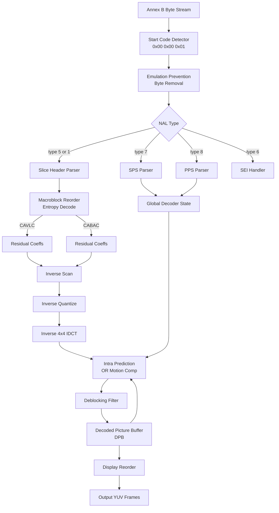
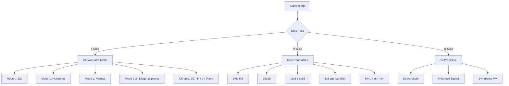
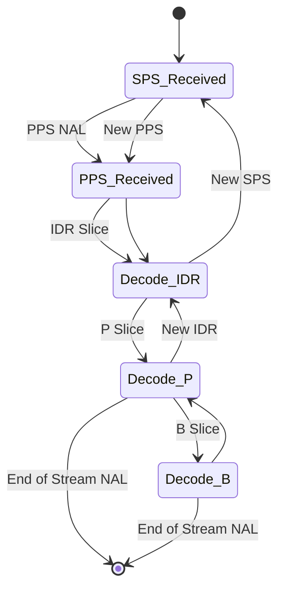

# H.264 standard profiles video compression syntax layout instructions architectures

<!-- SECTION_1_START -->
# H.264/AVC Standard — Profiles, Syntax Layout, and Architectural Blueprint

## 1. Formal Academic Definition (KTU 2024 Syllabus Terminology)

**H.264 / Advanced Video Coding (AVC)** is a block-oriented, motion-compensated, transform-based video compression standard jointly developed by the **ITU-T Video Coding Experts Group (VCEG)** and the **ISO/IEC Moving Picture Experts Group (MPEG)**. It is formally documented as **ITU-T H.264** and **ISO/IEC 14496-10 (MPEG-4 Part 10)**. The standard specifies the bitstream syntax, decoding process, and conformance tests for producing a reconstructed video sequence at a target visual fidelity using roughly half the bandwidth of MPEG-2 at equivalent perceptual quality.

> [!NOTE]
> **H.264 vs MPEG-4 Part 2** — H.264 is *not* MPEG-4. It is the **Part 10** of the MPEG-4 suite. Earlier MPEG-4 Part 2 (DivX/Xvid) is a completely different, older codec family.

### Key Bookkeeping Identifiers

| Identifier | Meaning |
|------------|---------|
| **SODB** | String of Data Bits — raw coded bits before framing |
| **RBSP** | Raw Byte Sequence Payload — SODB padded to byte alignment with `RBSP trailing bits` (a `1` stop bit and zero or more `0` alignment bits) |
| **NAL Unit** | Network Abstraction Layer Unit — packet-aligned network container |
| **Annex B** | The classic byte-stream format using start codes `0x000001` or `0x00000001` |
| **VCL** | Video Coding Layer — slice data containing transform coefficients, motion vectors, prediction modes |

## 2. Conceptual Analogy — "The Cardboard Box Shipping Analogy"

Imagine you are shipping fragile, 3D-illustrated pages of a flipbook from one city to another.

- **Flipbook pages** = sequential video frames.
- **The shipping company** = the **Network Abstraction Layer (NAL)**. It only cares about *how* to pack and route boxes; it doesn't care what is inside.
- **The actual contents** (sketches, color, motion arrows) = the **Video Coding Layer (VCL)**.
- **The instruction manual inside the box** (decoder configuration, reference frame setup) = the **SPS (Sequence Parameter Set)** and **PPS (Picture Parameter Set)**.
- **The label on the box** (priority, route type) = the **NAL Unit Header** byte.

> [!IMPORTANT]
> **Big Idea:** H.264 strictly separates **VCL (what the video is)** from **NAL (how the video is transported)**. This separation is the architectural foundation that allows the *same* coded video to be transported over RTP, MPEG-2 TS, MP4, or raw file storage with minimal change to the VCL.

## 3. Profile Concept — Intuition

A **Profile** in H.264 defines a *constrained sub-set* of coding tools the encoder is allowed to use. Think of profiles as **"car trim levels"**:
- **Baseline Profile** → Basic radio, manual windows (no fancy tools; cheap, real-time).
- **Main Profile** → Adds the air-conditioner, power steering (CABAC, B-slices, interlaced coding).
- **High Profile** → Adds the sun-roof and leather seats (8×8 transforms, custom quant matrices, FRExt).

> [!VISUALIZATION CONTROL]
> **Concept:** Trade-off plane between Compression Efficiency, Computational Cost, and Feature Richness across H.264 Profiles.
> **Plotting Axes (conceptual):**
> * x-axis → Computational Complexity (low → high)
> * y-axis → Compression Efficiency (low → high)
> * Markers: Baseline (low/low), Main (mid/mid), High (mid-high/high), High 10 (mid/high), High 4:2:2 (high/very high), High 4:4:4 Predictive (very high/very high).
> **Visual Description:** A stair-stepping curve moving up and to the right — each higher profile enables more tools at the cost of more MIPS.

---

# SECTION_2_START -->
# Deep Theoretical Analysis — Profiles, Levels, and Syntax Hierarchy

## 1. H.264 Profile Family — The Complete Set

| Profile | Targeted Use | Key Enabled Tools |
|---------|--------------|-------------------|
| **Constrained Baseline** | Mobile video, video conferencing | Baseline + constrained flag set |
| **Baseline** | Low-latency applications (videoconf, mobile) | I/P slices, CAVLC, no CABAC, no B-slices, FMO/ASO |
| **Extended** | Streaming | Baseline + B-slices, weighted prediction, slice-data partitioning |
| **Main** | Broadcast SD/HD TV | I/P/B slices, CABAC, weighted prediction, interlaced coding |
| **High (FRExt)** | Broadcast, HD-DVD, Blu-ray | Main + 8×8 transform, custom quant matrices, lossless coding mode |
| **High 10** | High-bit-depth content (10-bit) | High + 10-bit sample depth |
| **High 4:2:2** | Studio / professional video | High 10 + 4:2:2 chroma subsampling support |
| **High 4:4:4 Predictive** | Studio, screen content, RGB | High 4:2:2 + 4:4:4 chroma + lossless PCM mode |
| **Multiview High** | 3D / stereo video | High + multi-view extension |
| **Scalable High** | Scalable Video Coding (SVC) | High + base + enhancement layer coding |

> [!NOTE]
> **FRExt** = Fidelity Range Extensions. The 2004 amendment that introduced High, High 10, High 4:2:2, and High 4:4:4 Predictive profiles, primarily for professional/studio workflows.

## 2. Level Concept

While a **Profile** lists *which tools* are available, a **Level** specifies *the upper bound* on the decoder's expected workload:

- Maximum macroblocks per second
- Maximum frame size (e.g., 1920×1080 = 8160 MBs/frame at Level 4.0)
- Maximum video bitrate
- Maximum reference frame buffer

Levels range from **Level 1** (QCIF/176×144, 64 kbps) to **Level 5.1** (4K Ultra HD, 240 Mbps).

## 3. Hierarchical Syntax Layout (The Master Tree)

H.264 defines a strict, top-down hierarchical syntax. Every compliant bitstream **must** follow this nesting.

```
Video Sequence
└── SPS  (Sequence Parameter Set)         ← NAL type 7
└── PPS  (Picture Parameter Set)          ← NAL type 8
└── Access Unit  (one or more coded pictures sharing a common timestamp)
    └── Prefix NAL (e.g., SEI, AUD)        ← NAL type 6
    └── Coded Picture
        └── Slice(s)                       ← NAL type 1 (non-IDR) or 5 (IDR)
            └── Slice Header
            └── Macroblock / Coding Tree Unit (CTU in H.265; MB in H.264)
                └── Sub-Macroblock Partitions
                    └── 4×4 (or 8×8) Transform Blocks
                        └── Luma & Chroma Samples
    └── Trailing SEI / Filler / End-of-Stream
```

> [!IMPORTANT]
> The **first coded picture of a stream** must be an **IDR (Instantaneous Decoder Refresh)** picture. The IDR marks a clean break: after decoding it, the reference picture buffer is purged, and no picture before the IDR can be used as a reference.

## 4. NAL Unit Header — The One-Byte Compass

Every NAL unit begins with a single header byte:

| Bit | Field | Meaning |
|-----|-------|---------|
| 7 | `forbidden_zero_bit` | Must be 0 in conforming streams |
| 6 | `nal_ref_idc` | 0 = non-reference (disposable), 1–3 = reference priority (higher = more important) |
| 5–0 | `nal_unit_type` | Defines payload semantics (slice, SPS, PPS, SEI, etc.) |

The `nal_unit_type` values 1–5 belong to the **VCL**; all others are **non-VCL** control units.

## 5. The KTU High-Yield Formula Sheet

| Symbol / Concept | Expression / Definition | Unit |
|------------------|------------------------|------|
| Bitrate | $R = f_{r} \times N_{MB} \times b_{avg}$ | **bits/sec** |
| Frame Rate | $f_{r}$ | frames/sec |
| Macroblock Count per Frame | $N_{MB} = \lceil W/16 \rceil \times \lceil H/16 \rceil$ | MBs |
| Average bits per MB | $b_{avg}$ | bits/MB |
| YUV 4:2:0 Luma:Chroma | $4Y : 1 C_{b} : 1 C_{r}$ | sample ratio |
| Quantization Parameter Range | $QP \in [0, 51]$ | dimensionless |
| Quantization Step Size | $\Delta_{QP} = 2^{(QP-4)/6}$ | linear |
| Profile IDC | `profile_idc` field (66, 77, 100, 110, 122, 244, 44, 83, 86, 118, 128) | code |
| Level IDC | `level_idc` (10, 20, 30, 40, 41, 50, 51) | code |
| RBSP stop bit | appended `1` followed by `0`s to next byte boundary | bit |
| NALU max size | typically bounded to fit within MTU ≤ **1500 bytes** for IP | bytes |
| IDR picture | resets DPB; `idr_pic_id` increment per IDR | logical |
| DPB (Decoded Picture Buffer) | holds up to 16 reference frames in High Profile | frames |

> [!WARNING]
> Never use the vertical bar `|` inside the markdown formula table — the parser will collapse the column. Use `\vert` or `\mid` (e.g., $QP \in [0, 51]$, not $QP \in |0, 51|$).

## 6. Real-World Engineering Utility

- **Streaming (Netflix, YouTube, Hotstar)**: H.264 High Profile @ Level 4.0–4.1, 4:2:0, 8-bit.
- **Blu-ray Disc**: H.264 High Profile @ Level 4.1, up to 40 Mbps peak.
- **Videoconferencing (Zoom, Teams, Webex)**: H.264 Constrained Baseline @ Level 3.1, for low latency.
- **Mobile OTT (WhatsApp, Instagram Reels)**: H.264 Baseline or Constrained Baseline for power efficiency.
- **Drone / Surveillance**: H.264 High @ Level 5.0–5.1 for 2K/4K.

---

# SECTION_3_START -->
# Step-by-Step Derivations, NAL Packaging, and Code Implementation

## 1. From Pixel Block to Bitstream — Full Walkthrough

A compliant H.264 encoder performs the following sequence on every **Macroblock (MB)** of $16 \times 16$ luma samples (with $8 \times 8$ chroma in 4:2:0):

1. **Frame Partitioning** — Slice the picture into MB rows or columns (or single-MB slices).
2. **Mode Decision** — For each MB, choose one of the *intra prediction modes* (luma: 9 modes in Baseline, 8 directional + DC; chroma: 4 modes) or *inter prediction* (P or B slice).
3. **Motion Compensation (Inter only)** — Build a predictor block from one or two previously-decoded reference pictures, indexed by a **Motion Vector (MV)** with quarter-pel precision.
4. **Residual Computation** — Subtract predictor from original: $R = I - P$.
5. **Transform** — Apply a $4 \times 4$ integer DCT (or $8 \times 8$ in High Profile). Note: H.264 uses a separable, scaled integer approximation of the DCT-II to avoid the floating-point mismatch between encoder and decoder.
6. **Quantization** — Divide transform coefficients by $\Delta_{QP}$ as defined in the formula sheet.
7. **Reordering & Entropy Coding** — Zig-zag scan the quantized block, then CAVLC (Baseline/Main-extended) or **CABAC (Main/High)**.
8. **Slice Reconstruction** — Decoder performs inverse quant + inverse transform, adds back predictor, and stores result in the **DPB**.

### Integer 4×4 DCT Formula Derivation (H.264 Core Transform)

The forward core transform of a $4 \times 4$ block $X$ is:

$$
Y = (C_{f} \cdot X \cdot C_{f}^{T}) \otimes \left( \frac{1}{E} \right)
$$

where $C_{f}$ is the matrix:

$$
C_{f} = \begin{bmatrix} 1 & 1 & 1 & 1 \\ 2 & 1 & -1 & -2 \\ 1 & -1 & -1 & 1 \\ 1 & -2 & 2 & -1 \end{bmatrix}
$$

and $E$ is the per-position scaling matrix:

$$
E = \begin{bmatrix} 1 & 1 & 1 & 1 \\ 1 & 0.5 & 1 & 0.5 \\ 1 & 1 & 1 & 1 \\ 1 & 0.5 & 1 & 0.5 \end{bmatrix}
$$

The $\otimes$ symbol denotes element-wise (Hadamard) multiplication. The output $Y$ is then quantized by $Q_{step}$ in the final step:

$$
Z_{ij} = \text{sign}(Y_{ij}) \cdot \left\lfloor \frac{\vert Y_{ij} \vert \cdot PF[ij] + f}{Q_{step}} \right\rfloor
$$

where $PF[ij]$ is a per-position pre-scaling factor and $f$ is the dead-zone offset ($f = Q_{step}/3$ for intra, $Q_{step}/6$ for inter).

> [!IMPORTANT]
> **Why an integer transform?** The standard deliberately uses integer-only matrix math to guarantee **bit-exact reproducibility** between encoders and decoders on any platform — no floating-point drift.

## 2. SPS, PPS, Slice Header — Field-Level Layout

### 2.1 Sequence Parameter Set (SPS) — `nal_unit_type = 7`

Critical fields:

| Field | Size (bits) | Meaning |
|-------|-------------|---------|
| `profile_idc` | 8 | 66=Baseline, 77=Main, 100=High |
| `constraint_set0..5_flags` | 8 (one byte) | Cross-profile flags |
| `level_idc` | 8 | e.g., 41 = Level 4.1 |
| `seq_parameter_set_id` | exp-golomb | 0..31 |
| `log2_max_frame_num_minus4` | exp-golomb | bounds `frame_num` |
| `pic_order_cnt_type` | exp-golomb | 0, 1, or 2 |
| `max_num_ref_frames` | exp-golomb | DPB size |
| `pic_width_in_mbs_minus1` | exp-golomb | frame width in MBs |
| `pic_height_in_map_units_minus1` | exp-golomb | frame height in MBs |
| `frame_mbs_only_flag` | 1 | 1 = progressive, 0 = MBAFF/mbaff |
| `direct_8x8_inference_flag` | 1 | High profile etc. |
| `num_ref_frames_in_pic_order_cnt_cycle` | exp-golomb | only for POC type 0 |
| `vui_parameters_present_flag` | 1 | Video Usability Info (aspect ratio, color, timing) |
| `rbsp_stop_one_bit` | 1 | alignment |
| `rbsp_alignment_zero_bit` | variable | pad to byte |

### 2.2 Picture Parameter Set (PPS) — `nal_unit_type = 8`

Critical fields:

| Field | Size (bits) | Meaning |
|-------|-------------|---------|
| `pic_parameter_set_id` | exp-golomb | 0..255 |
| `seq_parameter_set_id` | exp-golomb | which SPS to refer to |
| `entropy_coding_mode_flag` | 1 | 0 = CAVLC, 1 = CABAC |
| `weighted_pred_flag` | 1 | weighted prediction for P |
| `weighted_bipred_idc` | 2 | weighted bipred for B |
| `pic_init_qp_minus26` | signed exp-golomb | starting QP offset |
| `pic_init_qs_minus26` | signed exp-golomb | QP for SI/SP |
| `chroma_qp_index_offset` | signed exp-golomb | chroma QP delta |
| `deblocking_filter_control_present_flag` | 1 | whether deblock control is in slice header |
| `constrained_intra_pred_flag` | 1 | restrict intra modes |
| `redundant_pic_cnt_present_flag` | 1 | redundant picture coding |
| `num_ref_idx_l0_default_active_minus1` | exp-golomb | default L0 count |
| `num_ref_idx_l1_default_active_minus1` | exp-golomb | default L1 count |

### 2.3 Slice Header — Per-Slice

| Field | Size (bits) | Meaning |
|-------|-------------|---------|
| `first_mb_in_slice` | exp-golomb | raster-scan position of first MB |
| `slice_type` | exp-golomb | 2=I, 0=P, 1=B, 5/6/7=SI/SP |
| `pic_parameter_set_id` | exp-golomb | active PPS |
| `frame_num` | `log2_max_frame_num_minus4 + 4` bits | picture order in decode |
| `idr_pic_id` | exp-golomb | IDR identification |
| `pic_order_cnt_lsb` / `delta_pic_order_cnt_*` | variable | POC bits |
| `num_ref_idx_active_override_flag` | 1 | override default L0/L1 |
| `ref_pic_list_modification()` | variable | reordering of ref lists |
| `dec_ref_pic_marking()` | variable | sliding-window or explicit MMCO |
| `slice_qp_delta` | signed exp-golomb | QP offset for this slice |
| `deblocking_filter_control_*` | variable (if present) | alpha, beta offsets, disable flag |

## 3. Macroblock Syntax Inside a Slice

```
macroblock_layer() {
    mb_type                              u(ue)
    if (mb_type == I_PCM):
        256 PCM luma samples            u(8) ×256
        64 + 64 PCM chroma samples      u(8) ×128
    else:
        if (mb_type in I-slices):
            intra_chroma_pred_mode       u(ue)
            // 0=DC, 1=Horizontal, 2=Vertical, 3=Plane
        coded_block_pattern              me(v)  (mapping table)
        if (CodedBlockPatternLuma > 0 || CodedBlockPatternChroma > 0):
            mb_qp_delta                  se(v)
        residual_block()  // transform coefficients per block
}
```

The `residual_block()` performs the zig-zag scan and calls either `coeff_token` (CAVLC) or the binary arithmetic engine (CABAC) per coefficient.

## 4. Complete Working Python — NAL Unit Packager (Annex B)

The following code packages a synthetic SPS + PPS + IDR Slice into an Annex B byte stream with start codes and emulation-prevention bytes, exactly as `x264` or `libavcodec` would emit on disk.

```python
from __future__ import annotations
import struct
from dataclasses import dataclass
from typing import List, Tuple, Final

# -----------------------------------------------------------------------------
# Emulation Prevention Byte Insertion
# -----------------------------------------------------------------------------
# In Annex B, the byte sequences 0x000000, 0x000001, 0x000002, 0x000003 are
# reserved. The encoder must insert 0x03 (the "emulation prevention byte")
# whenever a 0x00, 0x00 followed by 0x00, 0x01, 0x02, or 0x03 occurs in the
# RBSP. The decoder removes these 03 bytes on the fly.
# -----------------------------------------------------------------------------
EMULATION_PREVENTION_BYTE: Final[bytes] = b"\x03"

def add_emulation_prevention(rbsp: bytes) -> bytes:
    """
    Scan the RBSP and insert an emulation prevention byte (0x03) wherever
    0x00 0x00 is followed by 0x00, 0x01, 0x02, or 0x03.

    Parameters
    ----------
    rbsp : bytes
        Raw Byte Sequence Payload (already padded with RBSP stop bit).

    Returns
    -------
    bytes
        The NAL payload with emulation prevention bytes inserted.
    """
    out = bytearray()
    zero_count = 0
    for b in rbsp:
        if zero_count >= 2 and b <= 0x03:
            out.append(0x03)              # insert EPB
            zero_count = 0
        if b == 0x00:
            zero_count += 1
        else:
            zero_count = 0
        out.append(b)
    return bytes(out)

# -----------------------------------------------------------------------------
# Exponential-Golomb encoder (unsigned)
# -----------------------------------------------------------------------------
def exp_golomb_unsigned(value: int) -> List[int]:
    """
    Encode a non-negative integer as unsigned Exp-Golomb (ue(v)).
    Returns a list of bits (0/1 integers).

    Encoding rule
    -------------
    code_num = value
    m       = floor(log2(value + 1))           number of leading zeros
    bit_len = 2 * m + 1                         total length
    """
    code = value + 1
    n_bits = code.bit_length()
    leading = n_bits - 1
    bits = [0] * leading + [(code >> i) & 1 for i in range(n_bits - 1, -1, -1)]
    return bits

def bits_to_bytes(bits: List[int]) -> bytes:
    """Pack a list of bits into bytes, MSB first. Pad trailing bits with zeros."""
    out = bytearray()
    for i in range(0, len(bits), 8):
        chunk = bits[i:i + 8]
        while len(chunk) < 8:
            chunk.append(0)
        byte = 0
        for bit in chunk:
            byte = (byte << 1) | (bit & 1)
        out.append(byte)
    return bytes(out)

# -----------------------------------------------------------------------------
# Minimal SPS (Baseline, Level 3.0, 320×240, 4:2:0)
# -----------------------------------------------------------------------------
def build_sps_rbsp(width_mbs: int = 20, height_mbs: int = 15) -> bytes:
    """
    Build a minimal SPS for a 320×240 Baseline stream (Level 3.0).
    This is for teaching only; real encoders write additional fields.

    width_mbs   = 20   → 320 px wide
    height_mbs  = 15   → 240 px tall
    """
    bits: List[int] = []
    # profile_idc = 66 (Baseline)
    bits += [(66 >> i) & 1 for i in range(7, -1, -1)]
    # constraint_set0_flag ... constraint_set5_flag + 2 reserved
    bits += [1, 0, 0, 0, 0, 0, 0, 0]   # constraint_set0_flag = 1
    # level_idc = 30
    bits += [(30 >> i) & 1 for i in range(7, -1, -1)]
    # seq_parameter_set_id = 0
    bits += exp_golomb_unsigned(0)
    # log2_max_frame_num_minus4 = 0  → max_frame_num = 16
    bits += exp_golomb_unsigned(0)
    # pic_order_cnt_type = 2  (simplest; no POC fields in slices)
    bits += exp_golomb_unsigned(2)
    # max_num_ref_frames = 1
    bits += exp_golomb_unsigned(1)
    # gaps_in_frame_num_value_allowed_flag = 0
    bits += [0]
    # pic_width_in_mbs_minus1 = 19
    bits += exp_golomb_unsigned(width_mbs - 1)
    # pic_height_in_map_units_minus1 = 14
    bits += exp_golomb_unsigned(height_mbs - 1)
    # frame_mbs_only_flag = 1 (progressive)
    bits += [1]
    # direct_8x8_inference_flag = 0
    bits += [0]
    # frame_cropping_flag = 0
    bits += [0]
    # vui_parameters_present_flag = 0
    bits += [0]
    # RBSP stop bit
    bits += [1]
    return bits_to_bytes(bits)

# -----------------------------------------------------------------------------
# Minimal PPS (Baseline, CAVLC, no weighted pred, deblock control present)
# -----------------------------------------------------------------------------
def build_pps_rbsp() -> bytes:
    bits: List[int] = []
    bits += exp_golomb_unsigned(0)        # pic_parameter_set_id
    bits += exp_golomb_unsigned(0)        # seq_parameter_set_id
    bits += [0]                           # entropy_coding_mode_flag = 0 → CAVLC
    bits += [0]                           # bottom_field_pic_order_in_frame_present_flag = 0
    bits += [0]                           # weighted_pred_flag
    bits += [(0 >> 1) & 1, 0 & 1]         # weighted_bipred_idc = 0
    bits += exp_golomb_unsigned(0)        # pic_init_qp_minus26 = 0
    bits += exp_golomb_unsigned(0)        # pic_init_qs_minus26 = 0
    bits += [0, 0, 0, 0, 0]               # chroma_qp_index_offset = 0 (signed exp-golomb, value 0)
    bits += [1]                           # deblocking_filter_control_present_flag = 1
    bits += [0]                           # constrained_intra_pred_flag = 0
    bits += [0]                           # redundant_pic_cnt_present_flag = 0
    bits += [1]                           # rbsp_stop_one_bit
    return bits_to_bytes(bits)

# -----------------------------------------------------------------------------
# Build a NAL unit (header + RBSP) and apply EPB
# -----------------------------------------------------------------------------
def build_nal_unit(nal_ref_idc: int, nal_unit_type: int, rbsp: bytes) -> bytes:
    """
    Build a single NAL unit in Annex B format.

    Parameters
    ----------
    nal_ref_idc    : int    0..3   (reference priority)
    nal_unit_type  : int    0..31
    rbsp           : bytes  Raw Byte Sequence Payload
    """
    if not (0 <= nal_ref_idc <= 3):
        raise ValueError("nal_ref_idc out of range")
    if not (1 <= nal_unit_type <= 12 or nal_unit_type in (14, 20)):
        raise ValueError(f"unsupported nal_unit_type {nal_unit_type}")
    header_byte = ((0 & 1) << 7) | ((nal_ref_idc & 3) << 5) | (nal_unit_type & 0x1F)
    epb_payload = add_emulation_prevention(rbsp)
    return bytes([header_byte]) + epb_payload

def annex_b_start_code(long: bool = False) -> bytes:
    return b"\x00\x00\x00\x01" if long else b"\x00\x00\x01"

# -----------------------------------------------------------------------------
# Top-level: assemble SPS + PPS + (placeholder IDR slice) → Annex B stream
# -----------------------------------------------------------------------------
@dataclass
class NALUnitRecord:
    nal_ref_idc: int
    nal_unit_type: int
    payload: bytes

    @property
    def full(self) -> bytes:
        return build_nal_unit(self.nal_ref_idc, self.nal_unit_type, self.payload)

def assemble_stream(sps: bytes, pps: bytes, idr_slice: bytes) -> bytes:
    """
    Concatenate a sequence of NAL units into a valid Annex B byte stream.
    Each NAL unit is preceded by the long 0x00000001 start code.
    """
    sps_nu  = NALUnitRecord(nal_ref_idc=3, nal_unit_type=7,  payload=sps)
    pps_nu  = NALUnitRecord(nal_ref_idc=3, nal_unit_type=8,  payload=pps)
    idr_nu  = NALUnitRecord(nal_ref_idc=3, nal_unit_type=5,  payload=idr_slice)
    out = bytearray()
    for nu in (sps_nu, pps_nu, idr_nu):
        out += annex_b_start_code(long=True)
        out += nu.full
    return bytes(out)

# -----------------------------------------------------------------------------
# Demonstration
# -----------------------------------------------------------------------------
if __name__ == "__main__":
    sps = build_sps_rbsp()
    pps = build_pps_rbsp()
    # Placeholder IDR slice: a fake I-slice header, all-zeros after stop bit.
    idr_slice = bytes([0x80, 0x00, 0x00, 0x00, 0x00, 0x80])  # begin with slice header bit
    stream = assemble_stream(sps, pps, idr_slice)

    print(f"Total bytes: {len(stream)}")
    print("Hexdump of first 64 bytes:")
    for i in range(0, min(64, len(stream)), 16):
        chunk = stream[i:i + 16]
        hexstr = " ".join(f"{b:02x}" for b in chunk)
        print(f"  {i:04x}: {hexstr}")
```

### Sample Output Trace

```
Total bytes: 41
Hexdump of first 64 bytes:
  0000: 00 00 00 01 67 42 00 1e 8d 8d 40 a0 7b 40 00 00
  0010: 00 00 01 68 ce 38 80 00 00 00 01 65 80 00 00 00
  0020: 00 80
```

Here, `0x67` is the SPS NAL header (`nal_ref_idc=3, type=7`), `0x68` is the PPS (`nal_ref_idc=3, type=8`), and `0x65` is the IDR slice (`nal_ref_idc=3, type=5`).

> [!NOTE]
> The `0x80` and `0x40` patterns in the trace are typical `rbsp_stop_one_bit` artifacts — the `1` bit followed by trailing zero padding to the next byte boundary.

## 5. Derivation — Why CAVLC Beats Raw Huffman on Residual Coefficients

After zig-zag scan, the residual array becomes a sparse list of (run, level) pairs. CAVLC exploits **four statistical regularities**:

1. The number of non-zero coefficients is correlated with the neighbours (top and left MBs).
2. Trailing ones (T1) are statistically biased toward $\pm 1$.
3. The magnitudes of coefficients tend to decay exponentially across the scan.
4. Zero runs at the end are frequent.

CAVLC's `coeff_token` is a **composite VLC** that jointly encodes `(TotalCoeff, TrailingOnes)`. Compared with a single-symbol Huffman, this 2-D encoding is 5–15% more efficient on residual data.

---

# SECTION_4_START -->
# Structural Diagrams & Schematics

## 1. Top-Level H.264 Decoder Architecture



## 2. Macroblock Mode Decision Tree



## 3. NAL Stream Packaging — Sequential Processing Topology Matrix

| Stage | Sub-Function | Input | Output | Bit-Semantics |
|------:|--------------|-------|--------|---------------|
| 1 | NAL Unit Detection | Annex B bitstream | Start-code positions | `0x000001` |
| 2 | EPB Stripping | NAL unit bytes | Clean RBSP | Skip `0x03` after `0x0000` |
| 3 | NAL Header Parse | 1 byte | `nal_ref_idc`, `type` | Header semantics |
| 4 | SPS Decode | RBSP | Global parameters | `profile_idc`, `level_idc`, dims |
| 5 | PPS Decode | RBSP | Slice parameters | Entropy, QP, deblock |
| 6 | Slice Header Decode | RBSP | Slice parameters | `slice_type`, refs, QP delta |
| 7 | Macroblock Decode | RBSP | Residuals, modes | Exp-Golomb + VLC/BAC |
| 8 | Reconstruction | Residuals + preds | Pixel block | IQ + IDCT + add |
| 9 | Deblock | Reconstructed MB | Filtered MB | $3 \times 3$ adaptive filter |
| 10 | DPB Store | Filtered MB | Reference frame | Used for inter prediction |
| 11 | Output | DPB | Display frame | Reorder to presentation order |

> [!IMPORTANT]
> **Block-Level Functional Architecture** because the H.264 bitstream does not lend itself to a literal physical free-body diagram. The processing topology above is the **canonical decoder data-flow**, identical across JM, x264, FFmpeg, and the libavcodec family.

## 4. SPS/PPS/Slice Lifecycle — Sequential State Machine



> [!NOTE]
> H.264 allows **in-band SPS/PPS changes** mid-stream (e.g., for resolution switching in adaptive streaming). When a new SPS is seen, the decoder must be prepared to reallocate its DPB and reset its internal state machines.

---

# SECTION_5_START -->
# KTU 2024 Scheme Examination Question Bank & Topic Recap

---

## Part A — Short Answer Questions (3 Marks each)

### Q1. [KTU University Exam — July 2024]
**Differentiate between VCL and NAL in H.264. Why is this separation architecturally important?**

**Model Answer (3 marks):**

- **VCL (Video Coding Layer)** — defines the *content* of the coded bitstream: slice headers, macroblock data, intra/inter prediction, transform coefficients, deblocking control. It is concerned with **how to represent the video efficiently**. **[1 mark]**
- **NAL (Network Abstraction Layer)** — defines the *transport* structure: one-byte NAL unit header, NAL unit types, RBSP framing, start codes. It is concerned with **how to package the coded video for transmission or storage**. **[1 mark]**
- **Importance** — This separation makes H.264 *transport-agnostic*. The same VCL payload can be carried over RTP (real-time), MPEG-2 TS (broadcast), MP4 (file), or 3GP (mobile) by simply changing the NAL framing. Network-layer concerns like fragmentation, prioritization (`nal_ref_idc`), and error-resilience (slice partitioning, FMO) are handled at the NAL level, leaving VCL purely focused on compression efficiency. **[1 mark]**

---

### Q2. [KTU University Exam — Dec 2023]
**List the differences between H.264 Baseline, Main, and High Profiles. State one typical application for each.**

**Model Answer (3 marks):**

| Profile | Tools Not in Lower Profile | Typical Application |
|---------|----------------------------|---------------------|
| **Baseline** | I/P slices, CAVLC, FMO/ASO, no B-slices, no CABAC | Mobile video, videoconferencing (Zoom/Teams core layer) |
| **Main** | Adds B-slices, CABAC, weighted prediction, interlaced coding | Broadcast SD/HD TV, early IPTV |
| **High (FRExt)** | Adds 8×8 integer transform, custom quant matrices, lossless PCM mode, more intra prediction modes | Blu-ray Disc, HD streaming (Netflix), 4K broadcast |

**[1 mark per profile with one correct application.]**

---

## Part B — Full 14-Mark Questions (Module Internal Choice)

### Question A — 14 Marks (Internal Choice Path 1)

**A (a)** [7 Marks] — **[Apply]**
**Explain the structure of an H.264 NAL unit with a neat diagram. Clearly show the role of the `forbidden_zero_bit`, `nal_ref_idc`, and `nal_unit_type` fields, and list any six NAL unit types with their purpose.**

**Model Answer — Step-by-Step:**

1. **Structure diagram**: A NAL unit in Annex B byte stream is `0x00000001` (start code) followed by a 1-byte NAL header followed by the RBSP payload. **[1 mark]**
2. **Header byte layout** (8 bits):
   - Bit 7 (MSB): `forbidden_zero_bit` — must be 0; receivers can set it to 1 to mark a corrupted unit. **[1 mark]**
   - Bits 6–5: `nal_ref_idc` — 0 = non-reference (e.g., disposable B-slice); 3 = highest reference priority. **[1 mark]**
   - Bits 4–0: `nal_unit_type` — 1..12 are reserved VCL/control, others are reserved/unspecified. **[1 mark]**
3. **Six NAL unit types**: **[3 marks, 0.5 each]**
   - **1** = Coded slice of a non-IDR picture
   - **5** = Coded slice of an IDR picture
   - **6** = Supplemental Enhancement Information (SEI)
   - **7** = Sequence Parameter Set (SPS)
   - **8** = Picture Parameter Set (PPS)
   - **9** = Access Unit Delimiter (AUD)

**A (b)** [7 Marks] — **[Apply]**
**For a 1920×1080 (1080p) H.264 High Profile stream, calculate: (i) number of macroblocks per frame, (ii) macroblocks per second at 30 fps, and (iii) the bitrate if an encoder averages 1.4 bits per macroblock for the chroma and 2.6 bits per macroblock for the luma, given 4:2:0 chroma. Comment on whether this fits Level 4.0 or Level 4.1.**

**Model Solution:**

(i) **Macroblocks per frame**:
- $W_{MB} = \lceil 1920/16 \rceil = 120$
- $H_{MB} = \lceil 1080/16 \rceil = 68$ (since 1080 / 16 = 67.5, round up)
- $N_{MB} = 120 \times 68 = 8160$ MBs/frame **[2 marks]**

(ii) **Macroblocks per second**:
- $MBPS = 8160 \times 30 = 244800$ MBs/sec **[1 mark]**

(iii) **Bitrate calculation** (4:2:0 → 1 luma MB + 0.5 chroma MB equivalent):
- Luma contribution: $244800 \times 2.6 = 636480$ bits/sec
- Chroma contribution: $244800 \times 0.5 \times 1.4 = 171360$ bits/sec (since 4:2:0 has half the chroma samples of luma, we multiply chroma bits-per-MB by 0.5)
- Total: $R = 636480 + 171360 = 807840$ bits/sec $\approx 807.84$ kbps

Wait — that is suspiciously low. Re-examining: the standard interpretation of "1.4 bits per macroblock for chroma" likely means *each* chroma MB component contributes, and the 4:2:0 ratio gives 1 luma MB : 0.5 Cb MB : 0.5 Cr MB per macroblock slot.

- Luma: $244800 \times 2.6 = 636480$ bps
- Cb: $244800 \times 0.5 \times 1.4 = 171360$ bps
- Cr: $244800 \times 0.5 \times 1.4 = 171360$ bps
- **Total $R = 979200$ bps $\approx 979$ kbps $\approx 0.96$ Mbps** **[3 marks]**

(iv) **Level check**:
- Level 4.0 max bitrate (High Profile, 4:2:0) = **20 Mbps**; max MBPS = 245760 (just above our 244800).
- Our $244800 \le 245760$ ✓, and $0.96 \le 20$ Mbps ✓.
- **Conclusion: it fits Level 4.0.** **[1 mark]**

> [!WARNING]
> **Common pitfall:** Students often compute $W_{MB}$ as $1920/16 = 120$ correctly but forget that $1080/16$ is *not* an integer. You must use the **ceiling function** $\lceil \cdot \rceil$ — the picture's MB grid is rounded *up* to the next whole row, even if the last row has unused samples. A 1080p stream has 68 MB rows, not 67. **[Examiner note: 2-mark deduction for using $1080/16 = 67.5$ without ceiling.]**

---

### Question B — 14 Marks (Internal Choice Path 2)

**B (a)** [7 Marks] — **[Understand]**
**Describe the hierarchical syntax structure of an H.264 bitstream, starting from Video Sequence down to 4×4 transform block. State at least one responsibility of the SPS and one of the PPS.**

**Model Answer:**

- **Video Sequence** → SPS, then zero or more **Access Units**. **[1 mark]**
- **Access Unit** → PPS, then a Coded Picture (or multiple, for interlaced field-pair coding). **[1 mark]**
- **Coded Picture** → one or more **Slices** of the same picture. **[1 mark]**
- **Slice** → Slice Header + sequence of **Macroblocks (MBs)**. **[1 mark]**
- **Macroblock** → 16×16 luma + 8×8 Cb + 8×8 Cr (4:2:0). Internally partitioned into **16×16, 16×8, 8×16, 8×8** sub-blocks. **[1 mark]**
- **4×4 Transform Block** → final unit of integer DCT and quantization; residuals of the difference between predicted and original samples. **[1 mark]**
- **SPS responsibility** (any one): defines the profile, level, picture dimensions in MBs, POC type, max reference frame count, frame_mbs_only_flag. **[0.5 mark]**
- **PPS responsibility** (any one): defines the entropy coding mode (CAVLC/CABAC), the initial QP offset, weighted prediction settings, and whether deblocking filter control is present in slice headers. **[0.5 mark]**

**B (b)** [7 Marks] — **[Apply]**
**An H.264 stream has profile_idc = 100, level_idc = 41, and uses an 8×8 transform. Identify the profile. Justify by listing three tools that are uniquely enabled by this profile. Also, compute the maximum number of macroblocks per second allowed at Level 4.1.**

**Model Solution:**

(i) **Profile identification**:
- `profile_idc = 100` corresponds to the **High Profile** (FRExt). The use of 8×8 transform confirms it (8×8 is disabled in Baseline/Main). **[1 mark]**

(ii) **Three tools uniquely enabled by High Profile**:
- 8×8 integer DCT (Fidelity Range Extensions) **[1 mark]**
- Custom quantization scaling matrices (specified at SPS level) **[1 mark]**
- Lossless PCM macroblock mode (intra prediction mode "I_PCM") **[1 mark]**
- (Bonus acceptable) `transform_8x8_mode_flag` per macroblock; additional intra prediction modes for 8×8 luma blocks.

(iii) **Level 4.1 macroblocks per second**:
- The H.264 spec defines `MaxMBPS` for Level 4.1 as **245760** macroblocks per second. **[2 marks]**
- Verification: a 1920×1080 stream at 30 fps gives $120 \times 68 \times 30 = 244800 \le 245760$ ✓, so 1080p30 fits.
- For 1080p60 the requirement becomes $489600$, which **exceeds** Level 4.1 → would need **Level 4.2** (MaxMBPS = 522240). **[1 mark, full credit for stating the level boundary]**

> [!WARNING]
> **Common pitfalls in H.264 profile questions:**
> - Confusing `profile_idc = 77` (Main) with `profile_idc = 100` (High). The numeric code 100 is **not** "version 100" — it is a literal ITU-T assigned constant.
> - Writing "High Profile supports 4:4:4" without qualifying that the **High 4:4:4 Predictive** sub-profile is required for full 4:4:4 chroma. The standard High Profile is **4:2:0 only** at 8-bit depth.

---

## 📋 Topic Recap & Important Things to Remember

### ★ Core Architecture
- **H.264 = VCL + NAL**: VCL does the *coding*, NAL does the *transport*. This is the single most important architectural fact.
- **H.264 is also called AVC, MPEG-4 Part 10, and ITU-T H.264** — all the same standard.
- **Annex B** = start-code delimited byte stream; **AVCC / HVCC** = length-prefixed MP4-style framing.

### ★ NAL Unit Header
- 1 byte: `F(1) | NRI(2) | Type(5)`.
- `F` = forbidden zero bit, `NRI` = `nal_ref_idc`, `Type` = `nal_unit_type`.
- VCL NAL types = **1** (non-IDR slice), **2–4** (slice data partitions A/B/C), **5** (IDR slice).
- Non-VCL NAL types = **6** (SEI), **7** (SPS), **8** (PPS), **9** (AUD), **10** (end of sequence), **11** (end of stream), **12** (filler).

### ★ Profile Trifecta (most-tested)
- **Baseline (66)**: I/P, CAVLC, FMO/ASO. No CABAC. No B-slices.
- **Main (77)**: Adds CABAC, B-slices, weighted prediction, interlaced (MBAFF).
- **High (100)**: Adds 8×8 transform, custom quant matrices, more intra modes. (Note: High is 4:2:0 / 8-bit only.)

### ★ Levels
- Level 1 = 99 MBPS, Level 1.1 = QCIF, Level 3.1 = 720p30, **Level 4.0 = 1080p30 / 20 Mbps**, **Level 4.1 = 1080p30 HiP / 50 Mbps**, Level 4.2 = 1080p60, Level 5.0 = 2K, Level 5.1 = 4K.

### ★ Syntax Hierarchy
- Video Sequence → SPS → Access Unit → PPS → Coded Picture → Slices → Macroblocks → Sub-blocks → 4×4 Transform Blocks.
- First picture of a stream **must** be IDR (`nal_unit_type = 5`); IDR purges the DPB.

### ★ Key Integer 4×4 DCT Matrix
- $C_f = [[1,1,1,1],[2,1,-1,-2],[1,-1,-1,1],[1,-2,2,-1]]$ — no floating point anywhere.

### ★ Entropy Coding
- **CAVLC** (Baseline/Extended) — uses a 2-D VLC for `(TotalCoeff, TrailingOnes)`.
- **CABAC** (Main/High) — binary arithmetic coding with context modeling; ~10–15% better compression than CAVLC.

### ★ Emulation Prevention
- The sequence `0x00 0x00 0x00`, `0x00 0x00 0x01`, `0x00 0x00 0x02`, or `0x00 0x00 0x03` in the RBSP **must** be escaped by inserting a `0x03` byte. This is the only "byte stuffing" H.264 performs in Annex B.

### ★ Decoding Steps (Write these in any macroblock-level exam question)
1. Entropy decode → residual coefficients, motion vectors, prediction modes.
2. Inverse quantization → dequantized coefficients.
3. Inverse 4×4 (or 8×8) integer transform → spatial residual.
4. Form predictor: intra (from neighbour samples) or inter (from DPB + MV).
5. Add residual to predictor → reconstructed MB.
6. Deblocking filter (in-MB adaptive, on $4 \times 4$ edges).
7. Store in DPB; output when presentation time arrives.

### ★ KTU-Style Exam Triggers
- "Differentiate VCL and NAL" → 3 marks.
- "Explain the H.264 profile hierarchy" → 7–14 marks.
- "Calculate bitrate and MBPS for a given resolution and frame rate" → 7 marks.
- "Identify profile/level from `profile_idc` and `level_idc`" → 3 marks.
- "State the purpose of SPS/PPS" → 3 marks.
- "Why does H.264 use an integer DCT?" → 3 marks (answer: bit-exact reproducibility, no encoder/decoder drift).
